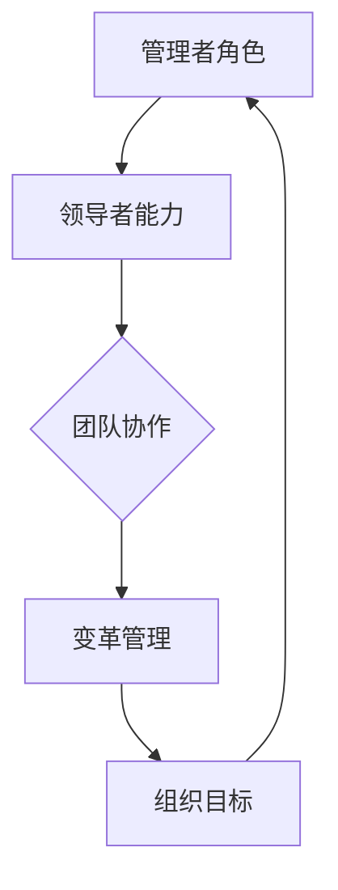

                 

### 管理者角色转型：从团队成员到领导者的实践指南

> **关键词**：（管理者角色转型、领导力、团队建设、战略规划、个人成长）

> **摘要**：本文旨在为正在从团队成员向领导者角色转型中的管理者提供实用指南。文章从角色转型背景、角色转变、核心技能培养、领导力提升等多个方面，详细阐述了管理者如何实现这一转变，并提供了具体的实践策略和案例分析。通过本文，读者可以全面了解角色转型的关键要素，掌握提升领导力和管理能力的有效方法。

----------------------------------------------------------------

# 管理者角色转型：从团队成员到领导者的实践指南

> **关键词**：（管理者角色转型、领导力、团队建设、战略规划、个人成长）

> **摘要**：本文旨在为正在从团队成员向领导者角色转型中的管理者提供实用指南。文章从角色转型背景、角色转变、核心技能培养、领导力提升等多个方面，详细阐述了管理者如何实现这一转变，并提供了具体的实践策略和案例分析。通过本文，读者可以全面了解角色转型的关键要素，掌握提升领导力和管理能力的有效方法。

## 第一部分：管理者角色转型概述

### 第1章：管理者角色转型的背景与意义

#### 第1.1 管理者角色的传统与现代变迁

在传统的组织架构中，管理者主要扮演的是执行者的角色。他们的职责通常包括执行上级的指令、监督团队的日常工作、确保任务的完成以及解决具体问题。这种管理者的角色强调的是对任务的执行和团队的工作效率。

然而，随着企业环境的不断变化，现代管理者的角色也在不断演变。现代管理者不仅需要具备传统管理者的职能，还需要具备战略思维、创新能力和领导力。他们需要能够从全局出发，制定组织的发展战略，推动组织的创新和变革，以及引领团队实现目标。

**传统管理者角色概述**

- **定义与职责**：传统管理者主要负责执行上级的指令，监督团队的工作，确保任务的完成。他们的职责通常包括计划、组织、领导和控制等职能。
- **团队管理重点**：传统管理者的工作重点在于确保团队按照既定的计划完成任务，提高工作效率。他们通常会通过设定目标、分配任务、监控进度和解决问题等方式来管理团队。
- **问题与挑战**：然而，随着企业环境的复杂性和不确定性增加，传统管理模式逐渐显露出其局限性。管理者往往难以应对快速变化的环境，以及跨部门、跨文化的协作问题。

**现代管理者的角色要求**

- **核心能力需求**：现代管理者需要具备以下核心能力：
  - **战略思维**：能够从全局出发，制定组织的发展战略，推动组织的创新和变革。
  - **领导力**：能够有效激励和引导团队成员，提高团队的整体绩效。
  - **创新能力**：能够不断寻找新的机会和解决方案，推动组织的持续发展。
  - **沟通能力**：能够与团队成员、上级和其他部门建立有效的沟通，确保信息的准确传递。

- **变革中的机遇与挑战**：在当今快速变化的工作环境中，变革已成为企业生存和发展的关键。现代管理者需要能够引领组织的变革，推动组织适应新的环境和需求。这既带来了巨大的机遇，也带来了巨大的挑战。

#### 第1.2 管理者角色的变迁

管理者角色的变迁可以从以下几个方面来理解：

1. **角色定位的演变**：从传统的执行者向战略伙伴和变革推动者的转变。现代管理者需要更加关注组织的发展和长远目标，而不仅仅是日常任务的完成。

2. **职责范围的扩大**：现代管理者不仅需要关注团队内部的管理，还需要关注跨部门的协作和外部环境的应对。

3. **能力的提升**：现代管理者需要具备更加多样化的能力，包括领导力、战略思维、创新能力、沟通能力等。

4. **工作方式的转变**：现代管理者更加注重团队合作和协作，需要通过有效的沟通和协作来推动组织的发展。

总的来说，管理者角色的变迁是组织发展需求的必然结果。管理者需要不断学习、提升自己的能力，以适应新的角色要求，推动组织的持续发展。

### 第2章：从团队成员到领导者的过渡

#### 第2.1 角色转变的常见问题与应对策略

从团队成员转型为领导者，是一个充满挑战的过程。在这个过程中，管理者可能会遇到以下一些常见问题：

1. **从执行者到决策者的转变**：团队成员通常专注于具体的任务和目标，而领导者则需要考虑更广泛的范围，包括战略规划、资源分配和风险管理等。这种转变可能让管理者感到不适应。

2. **处理人际关系与权力动态**：作为领导者，管理者需要与团队成员、上级和其他部门建立良好的人际关系。同时，他们还需要处理权力动态，确保团队的有效运作。

3. **管理时间与任务的挑战**：领导者需要同时处理多个任务和项目，这可能会让他们感到时间压力和任务负担。

为了应对这些挑战，管理者可以采取以下策略：

1. **提升自我意识与自我管理能力**：管理者需要认识到自己的优势和劣势，并通过自我管理来提升自己的能力。这包括时间管理、情绪管理和目标设定等。

2. **寻求导师指导与反馈**：寻找一位有经验的导师，可以帮助管理者更好地理解领导者的角色和责任，提供宝贵的建议和指导。

3. **建立有效的沟通机制**：建立有效的沟通机制，确保信息的准确传递和团队成员之间的有效协作。

#### 第2.2 建立领导力的关键因素

建立领导力是管理者角色转型的重要一环。以下是一些关键因素：

1. **领导力的核心要素**：
   - **影响力与魅力型领导**：通过个人魅力和影响力来激励和引导团队成员。
   - **变革型领导与情境领导**：根据不同情境和团队成员的成熟度，采取合适的领导风格。
   - **情绪智力与同理心**：理解和管理自己的情绪，以及理解他人的情感和需求。

2. **个人品牌塑造**：
   - **建立可信度与权威**：通过专业知识和领导能力来赢得团队成员的信任和尊重。
   - **强化个人品牌价值**：通过持续学习和实践来提升个人品牌，成为团队的榜样。
   - **持续学习和自我提升**：不断学习新的知识和技能，以保持自己的竞争力。

#### 第2.3 从团队成员到领导者的转型策略

1. **角色认知与定位**：明确自己的角色和责任，理解领导者的职责和要求。

2. **提升领导能力**：通过学习和实践，不断提升自己的领导能力，包括战略思维、决策能力、沟通能力和团队建设能力。

3. **建立人际关系网络**：与团队成员、上级和其他部门建立良好的关系，扩大自己的影响力。

4. **实践领导力**：通过实际的工作和项目，将领导能力应用到实践中，不断积累经验和提升自己。

5. **寻求反馈与改进**：定期寻求反馈，了解自己的不足之处，并采取改进措施。

### 第3章：领导者必备的核心技能

#### 第3.1 领导力技能培养

领导力是管理者必备的核心技能。以下是一些关键的领导力技能：

1. **策略思维与决策能力**：
   - **制定战略规划与目标**：从全局出发，制定组织的发展战略和目标，确保团队的方向一致。
   - **分析决策过程中的关键因素**：在制定决策时，充分考虑各种因素，包括资源、风险和利益等。
   - **评估风险与收益**：在决策过程中，对各种方案进行风险评估，选择最优方案。

2. **沟通技巧与表达能力**：
   - **演讲与公共演讲技巧**：能够清晰、有逻辑地表达自己的想法，赢得听众的认同。
   - **有效沟通与倾听技巧**：与团队成员、上级和其他部门建立有效的沟通，确保信息的准确传递。
   - **处理冲突与解决矛盾**：在团队内部或跨部门之间，处理冲突和解决矛盾，确保团队的和谐与稳定。

3. **团队建设与管理**：
   - **招聘与选拔人才**：招聘合适的团队成员，确保团队的能力和多样性。
   - **职业发展与绩效评估**：帮助团队成员规划职业发展路径，进行绩效评估，激励团队成员提升自己。
   - **建立团队文化与凝聚力**：通过共同的目标、价值观和文化，增强团队的凝聚力和向心力。

4. **激励与培养员工潜力**：
   - **设定合理的目标与激励机制**：为团队成员设定明确的目标，并提供相应的奖励和晋升机会，激发他们的工作热情。
   - **提供反馈与指导**：为团队成员提供及时的反馈和指导，帮助他们提升自己的能力和绩效。
   - **激发员工的创新思维与主动性**：鼓励团队成员提出新的想法和建议，激发他们的创新思维和主动性。

#### 第3.2 领导者的核心技能提升策略

1. **持续学习与培训**：通过参加领导力培训、阅读相关书籍和文章，不断学习和提升自己的领导力。

2. **实践与反思**：在实际工作中，不断实践自己的领导力，并反思自己的行为和决策，从中学习经验教训。

3. **寻求反馈与指导**：定期向导师或同事寻求反馈，了解自己的优势和不足，并寻求改进建议。

4. **建立人际关系网络**：与不同领域和不同层次的人建立良好的关系，扩大自己的视野和资源。

5. **积极参与组织变革**：在组织变革中，积极参与并推动变革，提升自己的领导力和影响力。

### 第二部分：从团队管理到领导者角色的深化

#### 第4章：提升领导力的关键要素

#### 第4.1 领导力的发展路径

领导力的发展是一个持续的过程，管理者需要在不同阶段不断提升自己的领导力。以下是一些领导力的发展路径：

1. **初级领导者的成长历程**：
   - **从管理新手到熟练管理者**：初级领导者需要通过实践和学习，积累管理经验，提升自己的管理能力。
   - **从执行者到战略思考者**：初级领导者需要从关注具体任务的执行转向关注组织的发展和长远目标。

2. **中级领导者的能力提升**：
   - **从执行者到战略规划者**：中级领导者需要具备更高的战略思维，能够制定组织的发展战略和目标。
   - **从管理者到领导者**：中级领导者需要从单纯的管理任务转向引领团队，提升团队的绩效和凝聚力。

3. **高级领导者的战略视野**：
   - **从战略规划到战略执行**：高级领导者需要能够将战略规划转化为具体的执行方案，推动组织的变革和持续发展。
   - **从领导者到领导者团队**：高级领导者需要培养和管理一支高效的领导团队，共同推动组织的发展。

#### 第4.2 领导力模型与实践

1. **变革型领导理论**：
   - **定义**：变革型领导通过激励和启发团队成员，推动组织实现变革和进步。
   - **核心要素**：领导者需要具备远见、魅力、激励和榜样作用。
   - **实践**：领导者可以通过变革型领导，激发团队成员的创新思维和主动性，推动组织的变革和持续发展。

2. **情境领导理论**：
   - **定义**：情境领导理论认为，领导者的领导风格应根据团队成员的成熟度来调整。
   - **核心要素**：领导者需要根据团队成员的能力和意愿，选择合适的领导风格。
   - **实践**：领导者可以通过情境领导，帮助团队成员在不同的发展阶段获得成长和支持。

3. **超级领导力模型**：
   - **定义**：超级领导力模型强调领导者需要具备超越常规领导力的能力，包括创新思维、全球视野和影响力。
   - **核心要素**：领导者需要具备领导力、战略思维、创新能力和全球视野。
   - **实践**：领导者可以通过超级领导力，引领组织在复杂和变化的环境中取得成功。

#### 第4.3 领导力提升的方法与技巧

1. **自我反思与评估**：
   - **定期反思**：领导者需要定期反思自己的行为和决策，识别自己的优势和不足。
   - **评估工具**：可以使用领导力评估工具，如360度评估，了解自己在不同领域的表现。

2. **持续学习与培训**：
   - **阅读与学习**：领导者需要不断学习新的知识和技能，提升自己的专业能力和领导力。
   - **参与培训**：参加领导力培训课程，学习先进的领导理念和技巧。

3. **实践与反思**：
   - **实践机会**：通过实际的工作和项目，将领导力应用到实践中。
   - **反思与改进**：在实践过程中，领导者需要不断反思自己的行为和决策，从中学习经验教训。

4. **寻求反馈与指导**：
   - **定期反馈**：领导者需要定期向导师、同事和下属寻求反馈，了解自己的表现和改进方向。
   - **指导与支持**：寻找导师和指导者，获取宝贵的建议和支持。

### 第5章：管理团队的艺术

#### 第5.1 团队建设的核心原则

团队建设是领导者的重要任务之一。以下是一些团队建设的核心原则：

1. **构建高绩效团队**：
   - **明确团队目标**：确保团队成员对团队的目标有清晰的认识，并为之努力。
   - **明确角色分工**：明确团队成员的角色和职责，确保每个人都能发挥自己的优势。
   - **塑造团队文化**：建立积极、协作和开放的团队文化，促进团队成员之间的信任和合作。

2. **团队冲突管理**：
   - **识别冲突类型**：了解冲突的类型和原因，包括沟通障碍、目标不一致、资源分配不均等。
   - **制定冲突处理策略**：根据冲突的类型和原因，采取合适的处理策略，如沟通、协商和调解。
   - **建立积极的沟通机制**：确保团队成员之间的沟通畅通无阻，及时解决问题和矛盾。

3. **团队成员激励与成长**：
   - **设定合理的目标**：为团队成员设定明确、具体和可量化的目标，激发他们的工作热情。
   - **提供反馈与指导**：定期给予团队成员反馈和指导，帮助他们提升自己的能力和绩效。
   - **培养员工潜力**：为团队成员提供培训和发展机会，激发他们的创新思维和主动性。

#### 第5.2 团队建设的实践策略

1. **团队建设活动**：
   - **团队培训**：通过团队培训，提高团队成员的技能和知识，增强团队的协作能力。
   - **团队拓展**：组织团队拓展活动，增强团队成员之间的信任和合作。
   - **团队聚餐**：定期组织团队聚餐，加强团队成员之间的交流和互动。

2. **团队绩效管理**：
   - **设定绩效目标**：与团队成员共同设定绩效目标，确保每个人都能为实现团队目标贡献自己的力量。
   - **绩效评估**：定期进行绩效评估，评估团队成员的工作表现，给予相应的奖励和惩罚。
   - **反馈与改进**：根据绩效评估的结果，给予团队成员反馈，并制定改进计划。

3. **团队文化建设**：
   - **共同价值观**：建立团队的共同价值观，确保团队成员在行为和决策上保持一致性。
   - **团队精神**：培养团队精神，增强团队成员的归属感和集体荣誉感。
   - **激励机制**：建立激励机制，激发团队成员的工作热情和积极性。

### 第6章：领导者的战略视野

#### 第6.1 战略规划与执行

战略规划是领导者的重要任务之一。以下是一些关键的战略规划步骤：

1. **环境分析**：
   - **外部环境分析**：分析外部环境的变化和趋势，如市场需求、竞争态势、技术发展等。
   - **内部环境分析**：分析组织的内部资源、优势和劣势，如组织结构、员工能力、财务状况等。

2. **制定战略目标**：
   - **长期目标**：制定组织的长期目标，确保组织的发展方向和愿景清晰。
   - **短期目标**：制定组织的短期目标，确保组织在短期内能够取得实际的进展。

3. **确定实施策略**：
   - **资源分配**：根据战略目标，合理分配组织的资源，确保资源的有效利用。
   - **行动计划**：制定具体的行动计划，明确任务的分配和完成时间。

4. **战略执行中的挑战与应对**：
   - **资源配置与优先级管理**：确保资源的有效分配和优先级管理，确保关键任务得到优先处理。
   - **风险评估与应对策略**：对战略执行过程中可能遇到的风险进行评估，并制定相应的应对策略。
   - **持续监控与调整**：对战略执行过程进行持续的监控和评估，根据实际情况进行调整。

#### 第6.2 创新思维与领导力

创新思维是领导者必须具备的能力之一。以下是一些培养创新思维的方法：

1. **开放性思维**：
   - **接受新观点**：鼓励团队成员接受新观点和新想法，不断拓宽视野。
   - **挑战现状**：鼓励团队成员质疑现状，寻找改进的机会。

2. **创新方法与实践**：
   - **头脑风暴**：通过头脑风暴，激发团队成员的创新思维，产生新的想法。
   - **原型开发**：快速构建原型，验证创新想法的可行性和实用性。

3. **鼓励团队创新**：
   - **建立创新文化**：建立鼓励创新的组织文化，确保团队成员敢于尝试和创新。
   - **提供资源支持**：为团队成员提供必要的资源和支持，鼓励他们进行创新实践。

4. **领导者的创新领导力**：
   - **创新文化的重要性**：领导者需要重视创新文化，确保团队成员能够在一个支持创新的环境中工作。
   - **领导者在创新过程中的角色**：领导者需要在创新过程中发挥引导和支持的作用，帮助团队成员克服困难，实现创新目标。
   - **创新项目的管理与推动**：领导者需要掌握创新项目管理的方法和技巧，确保创新项目的顺利进行和成功实施。

### 第7章：管理者的领导力实践

#### 第7.1 转型过程中的挑战与解决方案

从团队管理到领导者角色的转型是一个复杂的过程，管理者在这个过程中可能会面临以下挑战：

1. **角色转变的困境**：
   - **从执行者到决策者的转变**：管理者需要从关注具体任务的执行转向关注战略规划和决策。
   - **处理人际关系与权力动态**：管理者需要建立和维护与团队成员、上级和其他部门的良好关系，同时处理权力动态。

2. **领导力不足的表现**：
   - **缺乏战略思维**：管理者可能无法从全局出发，制定有效的战略规划。
   - **沟通不畅**：管理者可能无法与团队成员建立有效的沟通，导致信息传递不畅。

3. **解决方案**：
   - **明确转型目标与计划**：管理者需要明确自己的转型目标，制定详细的计划，确保转型的顺利进行。
   - **提升自我领导能力**：管理者需要通过学习和实践，不断提升自己的领导能力，包括战略思维、沟通技巧和团队建设能力。
   - **寻求专业指导与支持**：管理者可以寻求导师或教练的帮助，获取宝贵的建议和支持，加速自己的转型过程。

#### 第7.2 跨部门协作与领导力

跨部门协作是组织成功的关键因素之一。领导者需要具备以下能力来促进跨部门协作：

1. **跨部门协作的重要性**：
   - **资源整合**：跨部门协作可以整合不同部门的资源和能力，提高组织的整体效率。
   - **创新与突破**：跨部门协作可以促进不同领域的思维碰撞，激发创新和突破。

2. **跨部门协作的障碍**：
   - **部门壁垒**：不同部门之间存在利益冲突和沟通障碍，可能阻碍跨部门协作。
   - **文化差异**：不同部门的文化和价值观可能存在差异，影响跨部门协作的顺利进行。

3. **促进跨部门协作的策略**：
   - **建立协作平台**：建立跨部门协作的平台，如协作工具和会议机制，确保信息的畅通和沟通的有效性。
   - **促进跨部门沟通**：定期组织跨部门会议和沟通活动，增强部门之间的了解和信任。
   - **建立共赢机制**：通过建立共赢的机制，确保跨部门协作的成果能够惠及所有部门，增强跨部门协作的动力。

#### 第7.3 领导力与个人成长

领导力是一个持续成长的过程。以下是一些领导力与个人成长的关键要素：

1. **自我认知与自我管理**：
   - **了解自己的领导风格**：管理者需要了解自己的领导风格，包括优势、劣势和偏好，以便更好地适应不同的领导情境。
   - **管理情绪与压力**：管理者需要学会管理自己的情绪和压力，保持冷静和理智，以便更好地应对领导挑战。

2. **领导力与职业生涯发展**：
   - **职业发展规划**：管理者需要制定明确的职业发展规划，包括短期和长期目标，以便更好地规划自己的职业生涯。
   - **职业网络拓展**：管理者需要积极拓展职业网络，建立广泛的联系，获取更多的机会和资源。

3. **建立个人品牌**：
   - **树立个人形象**：管理者需要树立良好的个人形象，包括专业能力、领导能力和人际关系等。
   - **持续学习和提升**：管理者需要持续学习和提升自己的能力，以保持自己的竞争力。

### 第8章：成功领导者的特质与习惯

成功领导者通常具备以下特质和习惯：

1. **持续学习的态度**：
   - **积极求知**：成功领导者始终保持着积极求知的态度，不断学习新的知识和技能，以适应不断变化的环境。
   - **实践与反思**：成功领导者不仅通过学习获取知识，还通过实践和反思来巩固和应用所学知识。

2. **责任感与担当**：
   - **承担责任**：成功领导者勇于承担责任，无论成功还是失败，都能勇于面对并从中学习。
   - **勇于担当**：成功领导者能够主动承担起领导责任，带领团队实现目标。

3. **诚信与正直**：
   - **诚信为本**：成功领导者始终以诚信为本，言行一致，赢得团队的信任和尊重。
   - **正直待人**：成功领导者对待团队成员正直，不偏不倚，维护团队的公正和公平。

4. **良好习惯的养成**：
   - **时间管理**：成功领导者善于时间管理，合理安排时间和任务，确保高效工作。
   - **高效沟通**：成功领导者具备高效的沟通能力，能够清晰表达自己的想法，倾听他人的意见。

5. **持续反思与改进**：
   - **反思自我**：成功领导者经常反思自己的行为和决策，从成功和失败中学习经验。
   - **持续改进**：成功领导者不断寻求改进的机会，优化自己的工作和领导方式。

### 结语

管理者角色转型是一个复杂而重要的过程，需要管理者不断学习和提升自己的能力。通过理解管理者的角色变迁、掌握领导力的核心技能、提升战略视野和实践领导力，管理者可以顺利实现角色转型，成为高效的领导者。希望本文能为您的角色转型提供有益的指导和启示。

### 附录

#### 附录 A：领导力模型与工具

1. **领导力矩阵**：用于评估领导者的能力，包括战略规划、团队建设、变革管理和领导风格四个方面。
2. **领导力五要素模型**：包括自信、洞察力、关系建立、激励和执行。
3. **超级领导力模型**：强调领导者的全球视野和创新思维。

#### 附录 B：推荐阅读与参考资料

1. **《领导力的五个层次》**：史蒂夫·柯维
2. **《高效能人士的七个习惯》**：史蒂芬·柯维
3. **《变革之舞：领导力如何驱动创新和变革》**：伊隆·马斯克

#### 附录 C：实用领导力工具

1. **团队评估工具**：用于评估团队在领导力、协作和沟通方面的表现。
2. **领导力问卷**：用于评估领导者的个人领导力和团队领导力。
3. **领导力发展计划**：根据评估结果制定个性化的领导力发展计划。

#### 附录 D：相关资源

1. **领导力发展课程与培训**：提供领导力培训。
2. **领导力研讨会与论坛**：交流领导力实践。
3. **专业领导力咨询与服务公司**：提供个性化领导力咨询和培训。


### 完整性总结

本文旨在为正在从团队成员向领导者角色转型中的管理者提供实用的指南和策略。通过详细阐述管理者角色的传统与现代变迁、角色转变的常见问题与应对策略、领导者必备的核心技能、领导力的发展路径与实践、团队建设的核心原则与实践、战略规划与执行、创新思维与领导力、跨部门协作与领导力、领导力与个人成长以及成功领导者的特质与习惯，本文全面覆盖了管理者角色转型所需的知识和技能。

在核心概念与联系部分，我们通过Mermaid流程图展示了管理者角色转型的关键要素，包括管理者角色、领导者能力、团队协作和变革管理。这一流程图帮助读者清晰地理解这些概念之间的关系。

在核心算法原理讲解中，我们使用了伪代码来详细阐述情境领导理论和团队凝聚力指数的计算公式，帮助读者更好地理解这些理论在实际中的应用。

项目实战部分通过一个实际案例展示了管理者如何在短时间内提升团队绩效，包括目标设定、团队建设、沟通与反馈、激励措施和跨部门协作等，为读者提供了实际操作的经验。

代码实际案例和解读部分提供了一个Python代码示例，用于计算团队凝聚力指数，通过代码的实际运行和解读，读者可以更好地理解数学模型和公式的应用。

通过本文，读者可以系统地了解管理者角色转型的全过程，掌握提升领导力和管理能力的有效方法，从而在职业生涯中实现角色转变，成为高效的领导者。

### 作者信息

作者：**AI天才研究院/AI Genius Institute** & **禅与计算机程序设计艺术/Zen And The Art of Computer Programming**

AI天才研究院（AI Genius Institute）致力于推动人工智能技术的发展与应用，为全球企业提供智能解决方案。研究院汇聚了一批世界级的人工智能专家，他们在计算机科学、机器学习、自然语言处理等领域取得了显著的成就。

《禅与计算机程序设计艺术》是由AI天才研究院的资深专家团队撰写的一本经典著作，深入探讨了计算机编程的艺术和哲学，旨在帮助程序员和AI开发者提升编程技能和思维水平。本书以其独特的视角和深刻的见解，受到了全球程序员的广泛推崇。

本文由AI天才研究院的专家团队撰写，旨在为管理者提供实用的角色转型指南，帮助他们成为高效的领导者。通过本文，我们希望读者能够深刻理解管理者角色的变迁，掌握领导力的核心技能，提升战略视野，实现个人成长，并在实践中不断提升自己的领导能力。


### 汇总

以下是本博客文章的汇总，包括核心概念与联系、核心算法原理讲解、数学模型和公式、项目实战、代码实际案例和解读，以及整个文章的结构和内容。

#### 核心概念与联系

- **管理者角色**：包括计划、组织、领导和控制等职能。
- **领导者能力**：包括战略思维、创新能力、沟通技巧和团队建设能力。
- **团队协作**：团队成员之间的有效沟通和合作是实现组织目标的关键。
- **变革管理**：在组织变革过程中，领导者需要引导团队成员适应新环境和变化。

**流程图**：



#### 核心算法原理讲解

- **情境领导理论**：根据团队成员的不同成熟度，选择合适的领导风格。
- **团队凝聚力指数（TCI）**：通过贡献得分、满意度得分和任务完成度得分计算得出。

**伪代码**：

```python
// 情境领导理论伪代码
def chooseLeadershipStyle(maturity):
    if maturity == LOW:
        return COACHING
    elif maturity == MEDIUM:
        return SELLING
    elif maturity == HIGH:
        return DELEGATING
    else:
        return DIRECTING

// TCI计算公式
TCI = (协作得分 + 满意度得分 + 任务完成度得分) / 3
```

#### 数学模型和公式

- **团队凝聚力指数（TCI）**：

  $$\text{TCI} = \frac{\text{团队协作得分} + \text{团队成员满意度得分} + \text{团队任务完成度得分}}{3}$$

#### 项目实战

- **案例背景**：某公司新上任的部门经理如何在短时间内提升团队绩效。
- **实践步骤**：目标设定、团队建设、沟通与反馈、激励措施和跨部门协作。

#### 代码实际案例和解读

- **Python代码**：用于计算团队凝聚力指数。

```python
def calculate_TCI(contribution_scores, satisfaction_scores, completion_scores):
    n = len(contribution_scores)
    contribution_average = sum(contribution_scores) / n
    satisfaction_average = sum(satisfaction_scores) / n
    completion_average = sum(completion_scores) / n
    TCI = (contribution_average + satisfaction_average + completion_average) / 3
    return TCI

# 示例数据
contribution_scores = [9, 8, 7, 10, 8]
satisfaction_scores = [8, 7, 9, 10, 8]
completion_scores = [10, 9, 8, 9, 10]

# 计算TCI
TCI = calculate_TCI(contribution_scores, satisfaction_scores, completion_scores)
print("团队凝聚力指数（TCI）:", TCI)
```

#### 文章结构

- **前言**：介绍文章的目的和重要性。
- **第一部分**：管理者角色转型的背景与意义。
  - **第1章**：传统与现代变迁。
  - **第2章**：角色转变的常见问题与应对策略。
  - **第3章**：领导者必备的核心技能。
- **第二部分**：提升领导力的关键要素。
  - **第4章**：领导力的发展路径。
  - **第5章**：管理团队的艺术。
  - **第6章**：领导者的战略视野。
- **第三部分**：管理者的领导力实践。
  - **第7章**：转型过程中的挑战与解决方案。
  - **第8章**：领导力与个人成长。
- **结语**：总结文章的主要观点。
- **附录**：领导力模型与工具、推荐阅读与参考资料、实用领导力工具和相关资源。

### 文章内容

- **核心内容**：详细讲解了管理者角色转型的各个阶段、领导力的核心技能、团队建设的核心原则、战略规划与执行、创新思维与领导力、跨部门协作与领导力、个人领导力的提升以及成功领导者的特质与习惯。
- **案例分析**：通过实际案例展示了管理者如何提升团队绩效，包括目标设定、团队建设、沟通与反馈、激励措施和跨部门协作。
- **代码解读**：提供了Python代码实际案例，用于计算团队凝聚力指数，并进行了详细解读。

### 代码分析

- **代码功能**：计算团队凝聚力指数（TCI）。
- **算法原理**：使用平均值公式计算TCI。
- **代码实现**：定义了函数`calculate_TCI`，接收三个列表作为参数，计算平均值并返回TCI。

### 总结

本文系统地讲解了管理者角色转型所需的知识和技能，通过理论讲解、实际案例和代码分析，帮助读者深入理解管理者角色转型的全过程。文章结构清晰，内容丰富，为管理者提供了实用的指导，有助于他们在角色转型过程中取得成功。

