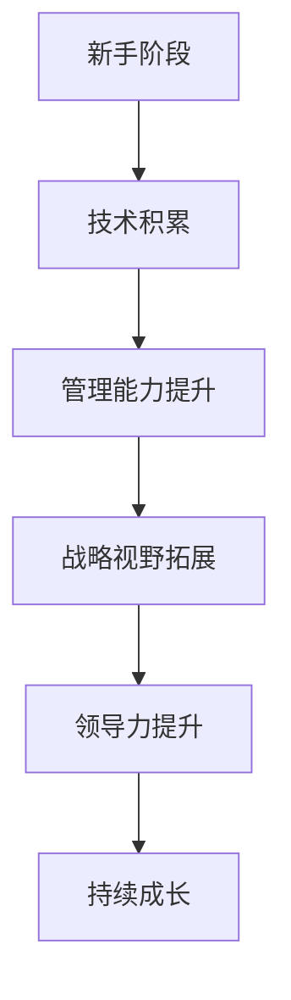

                 

### 管理者角色转换：从专业技术到领导岗位的适应

> **关键词：** 管理者角色转换、专业技术、领导岗位、团队管理、项目管理、战略思维

> **摘要：** 本文旨在探讨从专业技术专家向领导者角色转换的过程，分析这一转换过程中所需的认知与能力提升，以及如何适应和胜任新的领导岗位。通过详细的步骤分析和案例讲解，帮助读者更好地理解和管理这一转型。

#### 目录大纲

1. **角色认知与定位**
   - **第1章：角色认知与自我评估**
     - **1.1 职业发展的四个阶段**
       - **1.1.1 技术专家阶段**
       - **1.1.2 小团队领导阶段**
       - **1.1.3 中高层管理阶段**
       - **1.1.4 战略决策者阶段**
     - **1.2 从技术专家到领导者的转变**
       - **1.2.1 技术能力与领导能力的区别**
       - **1.2.2 心态与态度的转变**

2. **领导能力提升**
   - **第2章：领导力基础**
     - **2.1 领导力的核心要素**
       - **2.1.1 沟通能力**
       - **2.1.2 决策能力**
       - **2.1.3 团队协作能力**
       - **2.1.4 激励能力**
     - **2.2 领导风格与团队文化**
       - **2.2.1 领导风格的类型**
       - **2.2.2 如何塑造积极向上的团队文化**

   - **第3章：团队管理**
     - **3.1 团队成员的角色与责任**
       - **3.1.1 团队成员的角色分配**
       - **3.1.2 团队成员的责任分工**
     - **3.2 团队建设与管理**
       - **3.2.1 团队建设的重要性**
       - **3.2.2 团队管理的策略与方法**
     - **3.3 团队冲突管理**
       - **3.3.1 团队冲突的类型与原因**
       - **3.3.2 团队冲突的解决策略**

   - **第4章：项目管理**
     - **4.1 项目管理基础知识**
       - **4.1.1 项目管理的五个过程组**
       - **4.1.2 项目管理知识体系**
     - **4.2 项目计划与执行**
       - **4.2.1 项目计划的关键要素**
       - **4.2.2 项目执行中的风险管理**
     - **4.3 项目监控与控制**
       - **4.3.1 项目进度监控**
       - **4.3.2 项目成本控制**

3. **领导影响力**
   - **第5章：影响力与个人品牌**
     - **5.1 影响力的构成**
       - **5.1.1 影响力的层次**
       - **5.1.2 如何提升个人影响力**
     - **5.2 建立个人品牌**
       - **5.2.1 个人品牌的重要性**
       - **5.2.2 个人品牌的构建策略**

   - **第6章：跨部门协作与组织协调**
     - **6.1 跨部门协作的挑战**
       - **6.1.1 跨部门协作中的障碍**
       - **6.1.2 跨部门协作的解决策略**
     - **6.2 组织协调能力**
       - **6.2.1 组织协调的重要性**
       - **6.2.2 如何提升组织协调能力**

4. **战略思维与视野**
   - **第7章：战略思维与决策**
     - **7.1 战略思维的重要性**
       - **7.1.1 战略思维的核心要素**
       - **7.1.2 战略思维的应用场景**
     - **7.2 战略决策的过程**
       - **7.2.1 决策的类型与模型**
       - **7.2.2 战略决策的制定与执行**

   - **第8章：领导者的成长路径**
     - **8.1 领导者的成长阶段**
       - **8.1.1 从新手到专家**
       - **8.1.2 从管理到领导**
       - **8.1.3 从领导者到领袖**
     - **8.2 持续学习与自我提升**
       - **8.2.1 学习的重要性**
       - **8.2.2 如何进行有效学习**

5. **附录**
   - **附录A：领导力工具与资源**
   - **附录B：Mermaid 流程图**
   - **附录C：核心算法原理讲解（伪代码示例）**
   - **附录D：数学模型和数学公式（LaTeX格式）**
   - **附录E：项目实战案例与代码解读**
   - **附录F：源代码详细实现和解读**

通过这个目录结构，读者可以系统地了解从专业技术专家向领导者角色转换的全过程，以及在这一过程中所需的知识、技能和态度的转变。

### 管理者角色转换：从专业技术到领导岗位的适应

#### 引言

在信息技术迅猛发展的今天，专业技术人员常常面临一个重要的职业发展问题：如何成功地从专业技术岗位转换为管理岗位。这一转变不仅仅是职位名称的改变，更是角色、职责和能力的全面升级。从技术专家到管理者的角色转换，不仅需要技术能力的积累，更要求领导能力的提升。这一转变的过程充满挑战，但也是职业发展的关键一步。本文将详细探讨这一转换过程中的认知、能力提升、以及适应新角色的策略和方法。

#### 第1章：角色认知与自我评估

**1.1 职业发展的四个阶段**

在职业生涯中，技术专家通常需要经历以下四个阶段：

- **技术专家阶段**：在这个阶段，个人专注于技术领域的深入研究，积累丰富的专业知识和经验。技术专家的角色主要是解决复杂的技术问题，提供技术解决方案。
- **小团队领导阶段**：随着技术的深入，技术专家可能开始带领一个小团队，负责团队的日常管理和项目执行。这一阶段的关键在于从个人贡献转向团队协作，学会如何激励和指导团队成员。
- **中高层管理阶段**：在这个阶段，技术专家逐渐晋升为中层或高层管理者，负责更大规模的项目和更广泛的业务领域。管理者需要具备更高的战略眼光和决策能力，能够处理复杂的组织问题和跨部门协作。
- **战略决策者阶段**：这是职业发展的最高阶段，管理者需要具备全局视角，制定公司战略，进行重要决策。战略决策者不仅要关注公司的短期目标，更要考虑长期的发展和竞争力。

**1.2 从技术专家到领导者的转变**

- **技术能力与领导能力的区别**：技术专家和领导者的角色差异主要体现在以下几个方面：
  - **技术能力**：技术专家的核心能力是掌握和运用特定技术，解决复杂的技术问题。而领导者需要的是管理能力和人际交往能力，能够激励、指导和支持团队成员。
  - **决策能力**：技术专家的决策通常是在技术层面上的，而领导者需要在更广泛的业务和战略层面上做出决策。
  - **沟通能力**：技术专家通常与同行和技术团队沟通，而领导者需要与不同部门和层级的人员进行有效的沟通。

- **心态与态度的转变**：从技术专家到领导者的转变不仅需要技能的提升，更要求心态和态度的转变：
  - **从自我为中心到团队为中心**：技术专家往往注重个人技术的提升，而领导者需要关注团队的整体表现和成员的发展。
  - **从解决问题到引导问题**：技术专家更多是解决具体的技术问题，而领导者需要识别问题，引导团队找到解决方案。
  - **从执行者到领导者**：技术专家注重任务的完成，而领导者需要关注团队的目标设定、资源调配和团队激励。

**1.3 自我评估与角色定位**

在进行角色转换前，技术专家需要进行自我评估，以确定自己是否具备领导者的潜质：

- **能力评估**：技术专家需要评估自己在技术、管理、沟通等方面的能力，确定哪些领域需要提升。
- **兴趣评估**：技术专家需要了解自己对管理的兴趣和热情，是否愿意承担更多的责任和挑战。
- **性格评估**：技术专家需要了解自己的性格特点，是否适合领导岗位，例如是否具备较强的团队合作能力、决策能力和人际交往能力。

**1.4 结论**

角色认知和自我评估是技术专家成功转换为领导者的重要基础。通过深入了解职业发展的四个阶段，评估自身的优势和不足，技术专家可以明确自己的发展方向，制定相应的提升计划，为顺利实现角色转换做好准备。

### 第2章：领导力基础

领导力是管理者成功的关键因素之一。在这一章中，我们将探讨领导力的核心要素，包括沟通能力、决策能力、团队协作能力和激励能力，并分析不同领导风格及其对团队文化的影响。

#### 2.1 领导力的核心要素

**2.1.1 沟通能力**

沟通能力是领导者必须具备的一项基本技能。有效的沟通可以帮助领导者明确目标、传递信息、建立信任和协调团队工作。沟通能力包括以下几个方面：

- **倾听**：领导者需要倾听团队成员的意见和反馈，了解他们的需求和问题。
- **表达**：领导者需要清晰、准确地表达自己的想法和期望，避免误解和冲突。
- **反馈**：领导者需要给予团队成员及时的反馈，帮助他们改进和提高。
- **非语言沟通**：领导者需要注意自己的肢体语言、面部表情和语调，以增强沟通效果。

**2.1.2 决策能力**

决策能力是领导者的一项重要能力，涉及如何在各种情况下做出明智、合理的决策。有效的决策能力包括以下几个方面：

- **信息收集**：领导者需要收集和分析与决策相关的各种信息，确保决策有充分的依据。
- **风险评估**：领导者需要评估决策可能带来的风险和影响，并制定应对措施。
- **决策模型**：领导者可以运用各种决策模型和方法，如成本效益分析、SWOT分析等，提高决策的科学性。
- **决策执行**：领导者需要确保决策得到有效执行，并及时调整决策以应对变化。

**2.1.3 团队协作能力**

团队协作能力是领导者协调团队成员，共同实现目标的能力。有效的团队协作包括以下几个方面：

- **角色明确**：领导者需要明确团队成员的角色和责任，确保每个人都清楚自己的任务。
- **资源分配**：领导者需要合理分配资源，确保团队有足够的资源和时间完成任务。
- **冲突解决**：领导者需要处理团队内部的冲突，促进和谐合作。
- **团队激励**：领导者需要激发团队成员的积极性和创造力，提高团队的整体绩效。

**2.1.4 激励能力**

激励能力是领导者调动团队成员积极性和潜能的能力。有效的激励包括以下几个方面：

- **目标激励**：领导者需要设定清晰、具有挑战性的目标，激发团队成员的动力。
- **认可激励**：领导者需要给予团队成员认可和奖励，增强他们的自信心和归属感。
- **成长激励**：领导者需要关注团队成员的职业发展，提供培训和成长机会。
- **情感激励**：领导者需要关心团队成员的生活和工作，建立良好的情感关系。

#### 2.2 领导风格与团队文化

**2.2.1 领导风格的类型**

领导风格是指领导者处理团队和领导工作的方式。常见的领导风格包括以下几种：

- **专制型领导**：领导者拥有绝对的权力，决策和指挥由领导一人做出。这种方式适用于紧急情况和需要迅速决策的情况。
- **民主型领导**：领导者鼓励团队成员参与决策和讨论，尊重团队成员的意见和建议。这种方式有助于提高团队的凝聚力和创新能力。
- **放任型领导**：领导者给予团队成员充分的自由和自主权，不进行过多的干预。这种方式适用于高度专业化和成熟的团队。
- **变革型领导**：领导者通过激励和鼓舞团队成员，推动团队实现变革和创新。这种方式适用于需要变革和转型的组织。

**2.2.2 如何塑造积极向上的团队文化**

团队文化是团队共同的价值观、信仰和行为方式。积极向上的团队文化可以增强团队的凝聚力和创新能力，提高绩效。以下是一些塑造积极向上团队文化的策略：

- **明确价值观**：领导者需要明确团队的价值观，确保团队成员有共同的目标和信仰。
- **建立信任**：领导者需要建立信任关系，鼓励团队成员之间开放和诚实的沟通。
- **鼓励创新**：领导者需要鼓励团队成员提出新的想法和改进建议，创造一个创新和包容的环境。
- **认可和奖励**：领导者需要给予团队成员认可和奖励，激发他们的积极性和创造力。
- **共同目标**：领导者需要设定共同的目标，让团队成员明确自己的贡献和团队的整体目标。

**2.3 结论**

领导力的核心要素包括沟通能力、决策能力、团队协作能力和激励能力。不同的领导风格会对团队文化产生不同的影响。领导者需要根据团队的特点和需求，灵活运用不同的领导风格，塑造积极向上的团队文化，以实现团队的长期发展。

### 第3章：团队管理

团队管理是领导者的重要职责之一。在这一章中，我们将探讨团队成员的角色与责任、团队建设与管理以及团队冲突管理。

#### 3.1 团队成员的角色与责任

团队成员的角色与责任是团队有效运作的基础。明确团队成员的角色和责任，有助于提高团队的协作效率和工作质量。

**3.1.1 团队成员的角色分配**

团队成员的角色可以分为以下几个方面：

- **技术专家**：负责具体技术问题的解决和项目的技术实现。
- **产品经理**：负责产品的规划、设计和发布，确保产品符合市场需求。
- **项目经理**：负责项目的整体管理和执行，确保项目按时、按质完成。
- **设计师**：负责产品的视觉设计和用户体验。
- **测试工程师**：负责产品的功能测试和质量保证。

在团队中，每个成员都承担着特定的角色，各自发挥自己的专业优势，共同实现团队目标。

**3.1.2 团队成员的责任分工**

团队成员的责任分工应当明确，以确保每个成员都清楚自己的任务和职责。以下是一些常见的责任分工：

- **任务分配**：项目经理根据项目需求和团队成员的能力，合理分配任务，确保每个成员都有明确的工作目标。
- **进度监控**：团队成员需要定期更新自己的工作进度，项目经理负责监控整体进度，确保项目按计划进行。
- **问题解决**：团队成员在遇到问题时，应主动寻求解决方案，并在团队内部进行讨论和解决。
- **文档管理**：团队成员需要定期更新项目文档，项目经理负责整理和归档，确保项目文档的完整和可追溯性。

**3.2 团队建设与管理**

团队建设与管理是领导者的重要工作之一，有助于提高团队的协作效率和凝聚力。

**3.2.1 团队建设的重要性**

团队建设是指通过各种活动和措施，增强团队成员之间的相互了解、信任和合作。团队建设的重要性体现在以下几个方面：

- **增强团队凝聚力**：团队建设活动有助于团队成员建立良好的关系，增强团队的凝聚力。
- **提高协作效率**：团队建设可以促进团队成员之间的沟通和协作，提高工作效率。
- **激发创新能力**：团队建设有助于营造创新和包容的工作氛围，激发团队成员的创新能力。
- **提升员工满意度**：团队建设可以提高员工的工作满意度和归属感，降低员工流失率。

**3.2.2 团队管理的策略与方法**

团队管理包括以下几个方面：

- **目标管理**：领导者需要明确团队的目标，并确保每个成员都清楚自己的工作目标，与团队目标保持一致。
- **绩效评估**：领导者需要定期对团队成员的工作进行评估，提供反馈和指导，帮助团队成员提升能力。
- **沟通与反馈**：领导者需要建立有效的沟通机制，鼓励团队成员之间的开放和诚实沟通，及时给予反馈和指导。
- **激励与奖励**：领导者需要根据团队成员的表现，给予适当的激励和奖励，激发他们的积极性和创造力。
- **培训与发展**：领导者需要关注团队成员的职业发展，提供培训和成长机会，帮助团队成员提升技能和知识。

**3.3 团队冲突管理**

团队冲突是团队管理中常见的问题，有效的冲突管理有助于化解冲突，促进团队的和谐与合作。

**3.3.1 团队冲突的类型与原因**

团队冲突可以分为以下几种类型：

- **任务冲突**：由于工作任务分配不均或工作目标不一致导致的冲突。
- **关系冲突**：由于团队成员之间的个人关系或沟通问题导致的冲突。
- **价值观冲突**：由于团队成员的价值观或文化背景差异导致的冲突。

团队冲突的主要原因包括：

- **资源分配不均**：团队成员在资源分配方面存在争议或不满。
- **工作压力**：由于工作负荷过大或时间紧迫，导致团队成员之间的紧张和冲突。
- **沟通不畅**：团队成员之间的沟通不畅，导致误解和矛盾。
- **目标不一致**：团队成员对工作目标和期望存在差异，导致冲突。

**3.3.2 团队冲突的解决策略**

解决团队冲突需要采取以下策略：

- **主动沟通**：领导者应鼓励团队成员主动沟通，表达自己的想法和感受，促进理解和和解。
- **倾听与理解**：领导者需要倾听团队成员的意见和需求，理解他们的立场和感受，建立信任。
- **协商与妥协**：领导者应引导团队成员进行协商和妥协，寻求双方都能接受的解决方案。
- **问题解决**：领导者需要协助团队成员解决问题，避免冲突升级。
- **冲突预防**：领导者应提前识别潜在冲突，采取预防措施，避免冲突发生。

**3.4 结论**

团队管理是领导者的重要职责，涉及团队成员的角色与责任、团队建设与管理以及团队冲突管理。通过明确团队成员的角色和责任、加强团队建设与管理、以及采取有效的冲突管理策略，领导者可以促进团队的和谐与合作，提高团队的整体绩效。

### 第4章：项目管理

项目管理是管理者的重要工作之一，涉及项目的计划、执行、监控和控制。在这一章中，我们将探讨项目管理的五个过程组，项目管理知识体系，以及项目计划与执行、项目监控与控制的关键要素。

#### 4.1 项目管理基础知识

**4.1.1 项目管理的五个过程组**

项目管理的五个过程组包括启动、规划、执行、监控和收尾。这些过程组构成了项目管理的核心框架，确保项目从开始到结束的顺利进行。

- **启动过程组**：包括项目启动和项目范围的定义。该过程组旨在明确项目的目标和范围，确保项目有明确的方向和目标。
- **规划过程组**：包括项目计划、风险管理和资源分配。该过程组旨在制定详细的项目计划，识别潜在风险，并分配所需的资源。
- **执行过程组**：包括项目执行和团队管理。该过程组旨在执行项目计划，管理团队成员，确保项目按计划进行。
- **监控过程组**：包括项目监控和变更管理。该过程组旨在监控项目进度和成本，管理变更，确保项目目标的实现。
- **收尾过程组**：包括项目交付和项目总结。该过程组旨在确保项目交付物符合要求，总结项目经验教训，为未来项目提供参考。

**4.1.2 项目管理知识体系**

项目管理知识体系（PMBOK）是项目管理领域公认的标准框架。PMBOK包括十个知识领域，分别如下：

- **项目整合管理**：涉及项目整体管理，确保项目实现预定目标。
- **项目范围管理**：涉及项目范围的界定和控制，确保项目按计划完成。
- **项目时间管理**：涉及项目进度计划和控制，确保项目按时完成。
- **项目成本管理**：涉及项目成本预算和控制，确保项目在预算范围内完成。
- **项目质量管理**：涉及项目质量保证和质量控制，确保项目交付物符合质量要求。
- **项目资源管理**：涉及项目资源规划、获取和分配，确保项目有足够的资源。
- **项目沟通管理**：涉及项目沟通计划和沟通控制，确保项目信息传递畅通。
- **项目风险管理**：涉及项目风险识别、评估和管理，确保项目风险得到控制。
- **项目采购管理**：涉及项目采购计划和采购控制，确保项目外部资源得到有效管理。
- **项目相关方管理**：涉及项目相关方识别、分析和管理，确保项目相关方积极参与和支持项目。

**4.2 项目计划与执行**

**4.2.1 项目计划的关键要素**

项目计划是项目管理的核心环节，涉及项目的各个方面。以下是一些项目计划的关键要素：

- **项目目标**：明确项目的目标和预期成果，确保项目有明确的方向。
- **项目范围**：明确项目的范围和边界，确保项目在可控范围内进行。
- **项目任务**：分解项目任务，制定详细的工作计划，确保项目任务有序完成。
- **项目资源**：识别和分配项目所需的资源，包括人力、物力和财力。
- **项目时间表**：制定项目的时间表，明确项目的关键里程碑和进度。
- **项目预算**：制定项目预算，确保项目在预算范围内完成。
- **项目风险管理**：识别项目风险，制定风险应对策略，确保项目风险得到控制。
- **项目沟通计划**：制定项目沟通计划，明确项目信息的传递方式和频率。

**4.2.2 项目执行中的风险管理**

项目执行中的风险管理是项目管理的重要环节。以下是一些项目执行中的风险管理策略：

- **风险识别**：识别项目可能面临的风险，包括技术风险、市场风险、资源风险等。
- **风险评估**：评估风险的可能性和影响，确定风险优先级。
- **风险应对**：制定风险应对策略，包括风险规避、风险减轻、风险接受等。
- **风险监控**：监控项目风险的变化，及时调整风险应对措施。

**4.3 项目监控与控制**

**4.3.1 项目进度监控**

项目进度监控是确保项目按计划进行的有效手段。以下是一些项目进度监控的关键要素：

- **进度报告**：定期收集和报告项目进度，确保项目进度透明。
- **进度分析**：分析项目进度数据，识别进度偏差，采取纠正措施。
- **进度调整**：根据项目进度情况，及时调整项目计划和时间表，确保项目按计划进行。

**4.3.2 项目成本控制**

项目成本控制是确保项目在预算范围内完成的关键。以下是一些项目成本控制的关键要素：

- **成本预算**：制定项目成本预算，明确项目成本控制的目标。
- **成本核算**：定期核算项目成本，识别成本偏差，采取控制措施。
- **成本优化**：通过优化项目资源分配和管理，降低项目成本。
- **成本审核**：定期审核项目成本，确保项目成本合理和有效。

**4.4 结论**

项目管理是管理者的重要工作之一，涉及项目管理的五个过程组、项目管理知识体系以及项目计划与执行、项目监控与控制。通过制定详细的项目计划、执行有效的项目监控与控制，管理者可以确保项目按时、按质、按预算完成，实现项目目标。

### 第5章：影响力与个人品牌

作为管理者，影响力和个人品牌对于职业成功至关重要。在这一章中，我们将探讨影响力的构成，如何提升个人影响力，以及建立个人品牌的重要性与策略。

#### 5.1 影响力的构成

影响力是指一个人或组织在他人心中产生的影响力和控制力。影响力的构成包括以下几个层次：

**5.1.1 影响力的层次**

- **知识层次**：基于个人的专业知识和技能，能够提供有价值的信息和建议。
- **信任层次**：基于个人的诚信和可靠性，他人愿意接受其建议并信任其决策。
- **情感层次**：基于个人的魅力和情感共鸣，能够激发他人的情感共鸣和支持。
- **权力层次**：基于个人的职位和资源，能够通过正式渠道影响他人。

**5.1.2 如何提升个人影响力**

- **提升专业知识**：不断学习和更新专业知识，成为行业内的专家。
- **建立信任关系**：通过诚实、透明和负责任的行为，建立信任和良好的口碑。
- **展示领导能力**：通过领导团队、解决问题和推动变革，展示领导能力。
- **积极沟通**：通过有效的沟通技巧，清晰地表达自己的想法，建立良好的关系。
- **建立个人品牌**：通过持续的努力和公众形象，建立独特的个人品牌。

#### 5.2 建立个人品牌

个人品牌是个人在公众中的形象和声誉。建立个人品牌有助于提升个人影响力，促进职业发展。

**5.2.1 个人品牌的重要性**

- **增强竞争力**：个人品牌能够提高个人在职场上的竞争力，吸引更多机会。
- **提升认可度**：个人品牌能够增加个人在行业内的认可度和影响力。
- **促进职业发展**：个人品牌有助于在职业上取得更高的成就和晋升。

**5.2.2 个人品牌的构建策略**

- **明确目标定位**：明确个人品牌的目标和定位，确定想要传达的形象和价值观。
- **持续学习**：通过不断学习和提升专业技能，增强个人品牌的可信度。
- **建立个人网站**：创建个人网站或博客，展示专业知识和经验，建立在线影响力。
- **参与行业活动**：积极参与行业会议、研讨会和社交活动，扩大人脉和影响力。
- **撰写专业文章**：撰写专业文章和博客，分享专业知识和见解，提升个人品牌。
- **社交媒体营销**：利用社交媒体平台，分享专业内容，与行业人士互动，扩大影响力。

**5.3 结论**

影响力与个人品牌是管理者成功的重要因素。通过提升个人影响力，建立个人品牌，管理者可以在职场中脱颖而出，增强竞争力，实现职业发展。

### 第6章：跨部门协作与组织协调

在复杂的企业环境中，跨部门协作与组织协调是确保项目成功和公司整体效率的关键。在这一章中，我们将探讨跨部门协作的挑战、解决策略以及提升组织协调能力的方法。

#### 6.1 跨部门协作的挑战

跨部门协作面临诸多挑战，这些挑战不仅影响项目的进展，还可能影响公司的整体运营效率。以下是跨部门协作中常见的一些挑战：

**6.1.1 跨部门协作中的障碍**

- **沟通障碍**：不同部门之间可能存在沟通不畅的问题，导致信息传递不准确或不及时。
- **目标不一致**：不同部门可能对项目的目标和期望有不同的理解，导致合作不顺畅。
- **资源分配不均**：资源可能无法均衡地分配给各个部门，导致某些部门资源过剩，而另一些部门资源不足。
- **职责分工不明**：部门之间的职责分工可能不清晰，导致责任推诿和任务重复。
- **文化差异**：不同部门可能有不同的工作文化和管理风格，导致协作困难。

**6.1.2 跨部门协作的解决策略**

- **建立沟通机制**：建立有效的沟通机制，如定期会议、信息共享平台等，确保信息传递的及时性和准确性。
- **明确目标和责任**：明确项目目标和各部门的责任，确保所有部门都对项目的目标和期望有共同的理解。
- **资源合理分配**：通过合理的资源分配策略，确保各个部门都能获得所需的资源，避免资源浪费。
- **职责分工明确**：明确各个部门的职责和任务，确保任务不重复，责任不推诿。
- **文化融合**：促进部门之间的文化融合，建立共同的价值观和工作方式，提高协作效率。

#### 6.2 组织协调能力

组织协调能力是管理者的一项重要能力，能够有效地促进跨部门协作，提高公司的整体运营效率。

**6.2.1 组织协调的重要性**

- **提高工作效率**：有效的组织协调能够确保各项工作有序进行，提高工作效率。
- **减少冲突**：通过协调，能够减少部门之间的冲突和误解，营造和谐的工作环境。
- **促进创新**：组织协调有助于促进不同部门之间的知识共享和经验交流，激发创新思维。
- **实现整体目标**：组织协调能够确保公司的整体目标得到有效执行，提高公司竞争力。

**6.2.2 如何提升组织协调能力**

- **建立协调机制**：建立有效的协调机制，如设立协调部门或协调人员，负责各部门之间的协调工作。
- **培养协调意识**：培养员工的协调意识，让他们认识到跨部门协作的重要性，积极参与协作。
- **提供培训**：提供跨部门协作和协调技巧的培训，提高员工的协调能力。
- **鼓励沟通**：鼓励部门之间进行开放和诚实的沟通，建立信任和合作的基础。
- **制定协调策略**：根据公司的实际情况，制定具体的协调策略，确保协调工作的有效执行。

**6.3 结论**

跨部门协作与组织协调是确保项目成功和公司整体效率的关键。通过识别和解决跨部门协作中的障碍，提升组织协调能力，管理者可以有效地促进跨部门协作，提高公司的整体运营效率。

### 第7章：战略思维与决策

作为领导者，战略思维和决策能力是不可或缺的核心素养。在这一章中，我们将深入探讨战略思维的重要性、核心要素以及战略决策的过程和方法。

#### 7.1 战略思维的重要性

战略思维是指领导者对组织长远发展方向和目标的思考和规划能力。具备良好的战略思维，能够帮助领导者预见市场变化，把握机遇，制定科学的决策，推动组织的持续发展。

**7.1.1 战略思维的核心要素**

- **系统性**：战略思维要求领导者具备整体观，能够从宏观角度审视组织的方方面面，确保各个部分协同发展。
- **前瞻性**：战略思维要求领导者具备预见性，能够看到未来可能的发展趋势，并提前布局。
- **灵活性**：战略思维要求领导者具备适应能力，能够根据外部环境和内部条件的变化，灵活调整战略。
- **创新性**：战略思维要求领导者具备创新精神，能够不断探索新的思路和方法，推动组织的变革和创新。

**7.1.2 战略思维的应用场景**

- **业务拓展**：在拓展新市场或新业务时，战略思维能够帮助领导者评估潜在风险和机会，制定合适的战略。
- **资源分配**：在资源有限的情况下，战略思维能够帮助领导者优化资源分配，确保资源用于最需要的地方。
- **危机应对**：在面临危机时，战略思维能够帮助领导者迅速分析问题，制定有效的应对策略。
- **长期规划**：在制定长期发展计划时，战略思维能够帮助领导者设定明确的目标和路径，确保组织的可持续发展。

#### 7.2 战略决策的过程

战略决策是一个复杂的过程，涉及多个阶段和步骤。以下是一个典型的战略决策过程：

**7.2.1 决策的类型与模型**

- **基于数据的决策**：通过收集和分析数据，利用数据分析模型进行决策。
- **基于经验的决策**：依靠领导者的经验和直觉进行决策。
- **混合型决策**：结合数据分析和经验判断，进行综合决策。

**7.2.2 战略决策的制定与执行**

- **问题识别**：首先，领导者需要识别组织面临的问题或机遇，明确决策的目标。
- **信息收集**：收集与问题相关的各种信息，包括市场趋势、竞争对手、内部资源等。
- **方案评估**：根据收集到的信息，制定多个可能的解决方案，并评估每个方案的优缺点。
- **决策制定**：综合考虑各种因素，选择最佳方案进行决策。
- **执行计划**：制定详细的执行计划，明确责任分工、时间表和资源需求。
- **执行监控**：在执行过程中，持续监控项目进展，及时调整计划，确保决策的顺利执行。

#### 7.3 结论

战略思维和决策能力是领导者成功的关键要素。通过培养系统性、前瞻性、灵活性和创新性的战略思维，领导者能够在复杂多变的环境中做出科学的决策，推动组织的持续发展。掌握战略决策的过程和方法，有助于领导者更加高效地实现组织目标。

### 第8章：领导者的成长路径

领导者的成长是一个持续的过程，涉及从新手到专家、从管理到领导和从领导者到领袖的不同阶段。在这一章中，我们将探讨领导者的成长路径，以及持续学习与自我提升的重要性。

#### 8.1 领导者的成长阶段

**8.1.1 从新手到专家**

领导者的成长始于新手阶段，这一阶段的关键在于积累专业知识和技能。以下是一些关键步骤：

- **基础知识学习**：通过学习相关的理论知识和实践技巧，打下坚实的基础。
- **实践操作**：通过实际操作和项目参与，积累经验，提高实战能力。
- **持续学习**：不断学习新的知识和技能，跟上行业的发展趋势。

**8.1.2 从管理到领导**

新手阶段的经验积累为管理者向领导者转型奠定了基础。以下是一些关键步骤：

- **角色认知**：了解领导者的角色和职责，从技术管理转向团队管理。
- **领导能力提升**：通过培训和实战，提升沟通能力、决策能力和团队协作能力。
- **领导风格调整**：根据团队特点和需求，调整领导风格，建立良好的团队文化。

**8.1.3 从领导者到领袖**

成为领导者并不意味着职业发展的终点。领袖阶段的领导者需要具备更高的视野和影响力。以下是一些关键步骤：

- **战略思维**：培养战略思维，能够从全局视角审视组织的发展方向。
- **个人品牌**：建立强大的个人品牌，提升个人影响力和公信力。
- **持续创新**：不断推动组织创新，引领行业变革。

#### 8.2 持续学习与自我提升

持续学习和自我提升是领导者成长的驱动力。以下是一些有效的方法：

- **终身学习**：将学习视为一种生活方式，不断追求新知识和技能。
- **反思总结**：定期反思和总结自己的工作，识别不足和改进方向。
- **导师指导**：寻找导师或教练，获取专业指导和支持。
- **参加培训**：参加各种培训课程和工作坊，提高专业素养和领导能力。
- **阅读与研究**：阅读专业书籍和最新研究，了解行业动态和前沿知识。

**8.3 结论**

领导者的成长是一个持续的过程，涉及不同阶段的认知和能力提升。通过不断学习和自我提升，领导者能够不断突破自我，实现职业发展的最大化。

### 附录

#### 附录A：领导力工具与资源

在领导力的发展过程中，使用一些工具和资源可以极大地提升学习和实践的效果。以下是一些推荐的领导力工具和资源：

- **领导力评估工具**：如360度评估、领导力问卷调查等，可以帮助领导者了解自身的优势和不足。
- **领导力书籍**：《领导力的五项修炼》、《领导力的艺术》等经典著作，提供了丰富的理论和实践知识。
- **在线学习平台**：如Coursera、edX等，提供了各种领导力和管理相关的在线课程。
- **领导力研讨会**：参加行业内的领导力研讨会和工作坊，与同行交流和学习。

#### 附录B：Mermaid 流�程图

流程图是一种直观的表达工具，可以帮助读者更清晰地理解领导者的成长路径。以下是一个使用Mermaid语法绘制的职业发展流程图：



#### 附录C：核心算法原理讲解（伪代码示例）

为了帮助读者更好地理解决策树算法的原理，以下是一个简单的伪代码示例：

```python
def decision_tree(data):
    # 基准条件：如果数据不满足任何规则，则返回默认结果
    if not data:
        return default_result
    
    # 检查数据是否已经分类完毕
    if all_values_equal(data):
        return most_frequent_value(data)
    
    # 寻找最佳分割特征
    best_feature = choose_best_feature_to_split(data)
    
    # 创建决策树节点
    decision_tree = Node(feature=best_feature)
    
    # 对数据根据最佳特征进行分割
    for value in unique_values(data[best_feature]):
        subset = separate(data, best_feature, value)
        
        # 递归创建子树
        decision_tree.children[value] = decision_tree(subset)
    
    # 返回创建的决策树
    return decision_tree
```

#### 附录D：数学模型和数学公式（LaTeX格式）

在领导力分析和战略决策中，数学模型和公式是非常重要的工具。以下是一个期望最大化算法的LaTeX格式数学公式：

```latex
\begin{equation}
E[θ | X] = \arg\min_{θ} \sum_{i=1}^{N} \sum_{j=1}^{M} (θ - \theta)^T (X^{(i)} - \theta X^{(i)})
\end{equation}
```

#### 附录E：项目实战案例与代码解读

为了更具体地展示项目管理工具的搭建过程，以下是一个项目实战案例：

**E.1.1 环境搭建**

1. 安装项目管理工具（例如JIRA）
2. 配置项目管理数据库（例如MySQL）
3. 部署项目管理服务器（例如Apache）

**E.1.2 源代码实现**

以下是简单的项目管理工具源代码实现示例：

```java
public class ProjectManagementTool {
    private Database database;
    
    public ProjectManagementTool(Database database) {
        this.database = database;
    }
    
    public void createProject(String projectName) {
        // 创建项目
        database.insertProject(projectName);
    }
    
    public void assignTask(String taskId, String projectName) {
        // 分配任务
        database.assignTaskToProject(taskId, projectName);
    }
    
    // 更多方法，如任务监控、项目报表等
}
```

**E.1.3 代码解读与分析**

代码解读主要关注每个方法的功能、参数和数据库交互。例如，`createProject`方法用于创建一个新项目，将项目名插入数据库；`assignTask`方法用于将任务分配给项目。

#### 附录F：源代码详细实现和解读

**F.1.1 功能模块设计**

项目管理工具包括以下功能模块：

- 项目管理模块
- 任务管理模块
- 报表生成模块
- 用户权限管理模块

**F.1.2 代码实现步骤**

1. 设计数据库模型
2. 实现项目管理模块
3. 实现任务管理模块
4. 实现报表生成模块
5. 实现用户权限管理模块

**F.1.3 代码解读与分析**

代码解读与分析涉及每个模块的功能实现和数据库交互。例如，项目管理模块涉及创建、查看和管理项目功能；任务管理模块涉及任务创建、分配和监控功能。

### 作者信息

**作者：** AI天才研究院 / AI Genius Institute & 禅与计算机程序设计艺术 / Zen And The Art of Computer Programming

通过以上的详细内容，本文旨在为从事技术工作的专业人士提供从专业技术到管理岗位转换的全面指导，帮助他们顺利适应新的角色，提升领导力和管理水平，实现职业生涯的进一步发展。希望本文能对读者有所启发和帮助。

