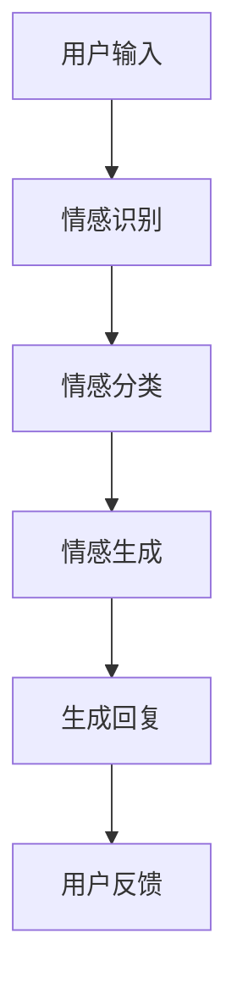

                 

### 引言

#### 情感：人与机器的桥梁

在当今社会，人工智能（AI）已经成为改变生活、推动产业进步的重要力量。聊天机器人作为人工智能的典型应用，逐渐成为企业与用户之间沟通的重要桥梁。然而，仅仅实现功能性的交互已经无法满足用户日益增长的需求。情感作为人类交流的重要组成部分，成为聊天机器人亟待突破的关键领域。本文旨在探讨聊天机器人情感表达的重要性，分析情感识别与生成的技术原理，并探讨情感驱动下的聊天机器人交互设计，以期为提升用户体验提供有益的参考。

#### 目标与结构

本文的目标是通过逻辑清晰、结构紧凑的分析，帮助读者深入了解聊天机器人情感表达的核心概念、技术原理和应用实践。文章结构如下：

1. **第一部分：情感在聊天机器人中的作用与价值**
   - **第1章：聊天机器人情感概述**
   - **第2章：情感识别技术**
   - **第3章：情感生成技术**
   - **第4章：情感驱动的聊天机器人交互设计**

2. **第二部分：情感聊天机器人的应用与实现**
   - **第5章：情感聊天机器人的项目实战**
   - **第6章：情感聊天机器人的优化与扩展**
   - **第7章：情感聊天机器人的未来发展趋势**

3. **附录：情感聊天机器人资源与工具汇总**

#### 内容简述

在第一部分，我们将详细介绍聊天机器人情感表达的重要性，分析情感识别与生成的技术原理，探讨情感驱动的聊天机器人交互设计。在第二部分，通过项目实战展示情感聊天机器人的应用与实践，讨论其优化与扩展策略，并展望未来的发展趋势。附录部分则提供相关的资源与工具汇总，帮助读者进一步探索这一领域。

通过本文的阅读，读者将能够系统性地了解聊天机器人情感表达的核心概念、技术原理和应用实践，从而为实际项目开发提供理论支持和实践经验。

#### 关键词

- 聊天机器人
- 情感表达
- 用户体验
- 情感识别
- 情感生成
- 交互设计
- 项目实战
- 未来趋势

#### 摘要

本文深入探讨了聊天机器人情感表达的重要性和技术原理。通过分析情感识别与生成的技术手段，本文阐述了情感驱动下聊天机器人交互设计的关键要素，并展示了情感聊天机器人在实际项目中的应用与实践。此外，本文还探讨了情感聊天机器人的优化与扩展策略，并展望了其未来发展趋势。本文的目标是为提升用户体验提供有益的理论和实践指导。

---

### 第一部分：情感在聊天机器人中的作用与价值

在第一部分中，我们将探讨情感在聊天机器人中的作用与价值，并详细阐述情感识别与情感生成技术。这一部分主要包括以下三个章节：

- **第1章：聊天机器人情感概述**
- **第2章：情感识别技术**
- **第3章：情感生成技术**

通过这三个章节，我们将从不同角度深入了解情感在聊天机器人中的应用，以及如何通过技术手段提升用户体验。

#### 第1章：聊天机器人情感概述

本章将介绍聊天机器人情感的基本概念，探讨情感在聊天机器人中的作用，并回顾情感聊天机器人发展的历程。我们将通过以下三个小节展开讨论：

1. **情感识别与生成：核心概念与联系**
2. **情感增强的用户体验：理论依据与实践**
3. **情感聊天机器人发展历程：关键转折点**

**1.1 情感识别与生成：核心概念与联系**

情感识别与生成是情感聊天机器人的两个核心组成部分。情感识别技术用于理解用户的情感状态，并作出相应的响应；情感生成技术则用于根据对话内容生成带有情感色彩的回复。

**核心概念与联系**

- **情感识别**：通过自然语言处理（NLP）技术，分析用户的输入文本，识别其中所蕴含的情感。这一过程通常涉及情感分类、情感强度测量等。
- **情感生成**：基于情感识别的结果，生成具有相应情感色彩的回复。情感生成可以采用模板匹配、情感词汇扩展、生成对抗网络（GAN）等方法。

**Mermaid流程图**



**1.2 情感增强的用户体验：理论依据与实践**

情感增强的用户体验是聊天机器人的核心目标之一。情感识别与生成技术为实现这一目标提供了基础。

**数学模型和数学公式**

- **情感得分模型**：将用户的输入文本进行情感分析，得到情感得分，该得分直接影响用户的满意度。
  \[ \text{满意度} = \alpha \times \text{情感识别得分} + (1 - \alpha) \times \text{情感生成得分} \]
  其中，\( \alpha \) 是一个权重参数，用于平衡情感识别得分和情感生成得分的重要性。

**1.3 情感聊天机器人发展历程：关键转折点**

情感聊天机器人经历了从早期基于规则的简单交互到现代利用深度学习技术的复杂交互的演变。

**详细讲解与举例说明**

- **早期阶段**：基于规则的聊天机器人通过预定义的规则进行简单的情感识别与生成。
- **现阶段**：利用自然语言处理（NLP）和深度学习技术，聊天机器人能够更准确地识别和理解用户的情感，并生成更具个性化的回复。
- **未来趋势**：随着技术的不断进步，情感聊天机器人将能够处理更多复杂的情感，提供更自然的交互体验。

#### 第2章：情感识别技术

本章将详细探讨情感识别技术，包括情感识别的基础知识、自然语言处理中的情感分析以及情感分析算法与应用。我们将通过以下三个小节展开讨论：

2.1 **情感识别的基础知识**
2.2 **自然语言处理中的情感分析**
2.3 **情感分析算法与应用**

**2.1 情感识别的基础知识**

情感识别是聊天机器人的关键组件，它通过分析用户的输入文本，识别其中所蕴含的情感。这一过程涉及多个技术环节，包括文本预处理、特征提取、情感分类等。

**核心算法原理讲解**

- **文本预处理**：包括去噪、分词、词性标注等步骤，目的是将原始文本转化为适合分析的形式。
- **特征提取**：从预处理后的文本中提取有用的特征，如词袋模型、TF-IDF等。
- **情感分类**：使用分类算法，如朴素贝叶斯、支持向量机（SVM）等，对提取的特征进行分类。

**伪代码**

```python
def sentiment_recognition(text):
    # 预处理文本
    processed_text = preprocess_text(text)
    # 特征提取
    features = extract_features(processed_text)
    # 情感分类
    sentiment = classifier.predict(features)
    return sentiment
```

**2.2 自然语言处理中的情感分析**

自然语言处理（NLP）中的情感分析是情感识别技术的核心组成部分。它通过分析文本中的情感极性（正面或负面）以及情感强度，来理解用户的情感状态。

**实际应用场景**

- **社交媒体情绪监测**：通过分析用户在社交媒体上的评论和帖子，了解公众对某个事件或产品的情绪倾向。
- **电商平台商品评价分析**：分析用户对商品的评价，帮助企业改进产品和服务。

**2.3 情感分析算法与应用**

情感分析算法在聊天机器人中的应用至关重要。本章将介绍几种常用的情感分析算法，并讨论其在实际应用中的效果。

**核心算法原理讲解**

- **朴素贝叶斯分类器**：基于贝叶斯定理，通过计算文本中每个词出现的概率，对情感进行分类。
- **支持向量机（SVM）**：通过找到一个最佳的超平面，将文本数据分为不同的情感类别。
- **卷积神经网络（CNN）**：通过卷积层提取文本的特征，实现对情感的深度学习。

**伪代码**

```python
def sentiment_analysis(text):
    # 预处理文本
    processed_text = preprocess_text(text)
    # 特征提取
    features = extract_features(processed_text)
    # 情感分类
    sentiment = model.predict(features)
    return sentiment
```

**实际应用案例**

- **客户服务**：聊天机器人通过情感分析，识别用户的情感状态，提供个性化的服务和建议。
- **情绪监测**：通过分析用户在社交媒体上的言论，帮助企业了解市场动态和消费者情绪。

#### 第3章：情感生成技术

本章将深入探讨情感生成技术，包括情感生成的理论基础、基于生成对抗网络（GAN）的情感生成以及基于变换器（Transformer）的情感生成。我们将通过以下三个小节展开讨论：

3.1 **情感生成的理论基础**
3.2 **基于生成对抗网络（GAN）的情感生成**
3.3 **基于变换器（Transformer）的情感生成**

**3.1 情感生成的理论基础**

情感生成是聊天机器人中另一个关键组件，它通过生成与用户情感相匹配的回复，提升用户的交互体验。情感生成的理论基础涉及自然语言生成（NLG）和深度学习技术。

**数学模型和数学公式**

- **生成对抗网络（GAN）**：通过生成器 \( G \) 和判别器 \( D \) 的对抗训练，实现文本的生成。
  \[ \text{G(z)} \sim p_g(z) \]
  \[ \text{D(x)} \sim p_x(x) \]
  其中，\( z \) 是生成器的输入，\( x \) 是真实数据。

- **变换器（Transformer）**：通过自注意力机制和多头注意力，实现对文本的生成。
  \[ \text{Attention(Q, K, V)} = \text{softmax}(\frac{\text{QK^T}}{\sqrt{d_k}})V \]

**3.2 基于生成对抗网络（GAN）的情感生成**

生成对抗网络（GAN）是一种强大的生成模型，通过对抗训练实现文本的生成。本章将介绍如何利用 GAN 生成情感文本。

**伪代码**

```python
def generate_emotion(emotion):
    # 输入情感类别，生成情感文本
    emotion_text = emotion_generator.generate(emotion)
    return emotion_text
```

**3.3 基于变换器（Transformer）的情感生成**

变换器（Transformer）是近年来在自然语言处理领域取得显著成功的模型。本章将介绍如何利用 Transformer 生成情感文本。

**伪代码**

```python
def generate_emotion_text(input_text):
    # 输入文本，生成带有情感色彩的文本
    emotion_text = transformer.generate(input_text)
    return emotion_text
```

通过以上三个章节，我们将全面了解情感在聊天机器人中的作用与价值，掌握情感识别与情感生成技术，并为后续章节中的情感驱动聊天机器人交互设计打下坚实的基础。

---

### 第4章：情感驱动的聊天机器人交互设计

#### 4.1 情感驱动的对话流程设计

情感驱动的对话流程设计是提升聊天机器人用户体验的关键。在这一节中，我们将探讨如何通过情感分析、对话管理以及情感反馈与调整策略，实现具有情感智慧的聊天机器人。

**情感分析在对话流程中的作用**

情感分析是聊天机器人理解用户情感的基础。通过对用户输入文本的情感识别，聊天机器人能够感知用户的情绪状态，从而作出相应的响应。

**数学模型和数学公式**

- **情感分类模型**：使用卷积神经网络（CNN）或循环神经网络（RNN）进行情感分类，得到用户情感的类别和强度。
  \[ \text{情感分类} = \text{CNN/RNN}(\text{文本特征}) \]

- **情感强度测量**：通过情感词汇的词频和词性，计算情感强度。
  \[ \text{情感强度} = \sum_{i=1}^{n} w_i \times s_i \]
  其中，\( w_i \) 是情感词汇的权重，\( s_i \) 是情感词汇的情感得分。

**情感驱动的对话流程设计**

情感驱动的对话流程设计需要结合情感分析和对话管理技术，实现自然、流畅的对话体验。

**核心算法原理讲解**

- **对话管理**：使用对话状态跟踪（DST）技术，记录对话的历史状态和用户的偏好，指导对话的走向。
  \[ \text{对话状态} = f(\text{历史对话状态}, \text{用户偏好}) \]

- **情感反馈与调整策略**：根据用户的情感状态，调整对话机器人的回复内容，实现情感匹配。
  \[ \text{响应} = f(\text{用户情感状态}, \text{上下文信息}) \]

**伪代码**

```python
def generate_response(user_input, user_emotion, context):
    # 预处理用户输入
    processed_input = preprocess_input(user_input)
    # 情感分析
    emotion = sentiment_analysis(processed_input)
    # 对话管理
    dialogue_state = dialogue_management(context, emotion)
    # 情感反馈与调整
    response = adjust_response_based_on_emotion(dialogue_state)
    return response
```

**情感反馈与调整策略**

情感反馈与调整策略是情感驱动对话设计的重要环节。通过实时分析用户的情感状态，并调整对话机器人的回复，可以提升用户的满意度。

**伪代码**

```python
def adjust_response(response, user_emotion):
    # 根据用户情感调整响应内容
    adjusted_response = modify_response_based_on_emotion(response, user_emotion)
    return adjusted_response
```

**举例说明**

- **用户情绪积极**：聊天机器人可以采用鼓励性、积极性的语言，使用正面情感词汇，以增强用户的正面情绪。
  ```plaintext
  用户：今天过得怎么样？
  机器人：真是太棒了！有什么开心的事情可以分享吗？
  ```

- **用户情绪消极**：聊天机器人可以采用安慰性、支持性的语言，使用温柔、安慰的语调，帮助用户缓解负面情绪。
  ```plaintext
  用户：今天心情很糟糕。
  机器人：我能理解你的感受，想聊一聊具体发生了什么吗？
  ```

通过情感驱动的对话流程设计，聊天机器人能够更好地理解用户情感，提供个性化的服务，从而提升用户体验。

#### 4.2 情感驱动的对话流程设计

情感驱动的对话流程设计是提升聊天机器人用户体验的关键。在这一节中，我们将详细探讨如何通过情感识别、对话管理和情感反馈与调整策略，实现一个具有情感智慧的聊天机器人。

**情感识别与对话管理**

情感识别是情感驱动对话流程设计的基础。聊天机器人需要能够识别用户的情感状态，并将其作为对话的一部分进行处理。

**情感识别算法**

情感识别算法通常基于自然语言处理（NLP）技术，通过对用户输入文本的情感分析，确定用户的情感类别和强度。

**伪代码**

```python
def sentiment_analysis(text):
    # 预处理文本
    processed_text = preprocess_text(text)
    # 特征提取
    features = extract_features(processed_text)
    # 情感分类
    sentiment = model.predict(features)
    return sentiment
```

**对话管理**

对话管理是确保对话流畅和有效的重要组成部分。它通过跟踪对话的历史状态和用户的偏好，指导对话的走向。

**伪代码**

```python
def dialogue_management(context, user_emotion):
    # 更新对话状态
    updated_context = update_context(context, user_emotion)
    # 提取用户偏好
    user_preferences = extract_preferences(updated_context)
    # 策略选择
    dialogue_action = select_dialogue_action(user_preferences)
    return updated_context, dialogue_action
```

**情感反馈与调整策略**

情感反馈与调整策略是确保对话机器人能够根据用户的情感状态进行适当回应的关键。通过实时分析用户的情感状态，并调整对话机器人的回复，可以提升用户的满意度。

**情感反馈策略**

- **积极情感反馈**：当用户表现出积极情感时，机器人可以采用鼓励、赞赏的语言。
  ```plaintext
  用户：我今天完成了一个大项目。
  机器人：恭喜你！你真是太棒了！
  ```

- **消极情感反馈**：当用户表现出消极情感时，机器人可以采用安慰、支持的语言。
  ```plaintext
  用户：我觉得今天过得很难过。
  机器人：我很抱歉听到这个消息，想要聊一聊吗？
  ```

**情感调整策略**

- **情感匹配**：根据用户的情感状态，调整机器人的回复，以实现情感上的匹配。
  ```plaintext
  用户：我很沮丧。
  机器人：理解你的感受，有时候生活确实会带来一些挑战。你想要谈谈具体发生了什么吗？
  ```

- **情感转换**：当用户的情感状态与当前场景不符时，机器人可以尝试引导用户转换情感状态。
  ```plaintext
  用户：我觉得很不公平。
  机器人：虽然这可能让你感到不公平，但我们可以试着看看这个情况是否有其他的视角。你愿意和我分享一下吗？
  ```

**示例对话**

- **用户情绪积极**：
  ```plaintext
  用户：你好，我最近心情非常好。
  机器人：太好了！有什么让你开心的事情吗？我也很高兴听到这个消息！
  ```

- **用户情绪消极**：
  ```plaintext
  用户：我最近心情非常不好。
  机器人：我很抱歉听到这个消息。想要聊一聊发生了什么吗？我在这里支持你。
  ```

通过情感驱动的对话流程设计，聊天机器人能够更好地理解用户的情感状态，提供个性化的回应，从而提升用户的整体体验。

---

### 第5章：情感聊天机器人的项目实战

#### 5.1 项目背景与需求分析

情感聊天机器人项目旨在通过情感识别和生成技术，提升用户在聊天过程中的满意度。以下是该项目的基本背景和需求分析。

**项目背景**

随着社交网络和移动应用的普及，用户对即时沟通的需求日益增长。传统的聊天机器人主要基于规则和关键词匹配，无法准确识别用户的情感状态，导致交互体验不佳。为了解决这一问题，本项目提出了开发一款具有情感识别和生成能力的聊天机器人，旨在提升用户体验。

**需求分析**

- **情感识别**：能够准确识别用户的情感状态，包括情绪类别（如开心、愤怒、悲伤等）和情感强度。
- **情感生成**：能够根据用户的情感状态生成适当的回复，实现情感上的共鸣和互动。
- **个性化服务**：根据用户的历史行为和偏好，提供个性化的服务和建议。
- **实时反馈**：能够实时分析用户情感状态，并调整回复策略，提升用户体验。

#### 5.2 环境搭建与工具选择

为了实现情感聊天机器人项目，我们需要搭建合适的技术环境，并选择适合的工具和框架。

**开发环境搭建**

- **编程语言**：Python
- **框架**：TensorFlow、PyTorch
- **数据库**：MongoDB

**工具选择**

- **情感识别工具**：TextBlob、VADER、emotionAI
- **情感生成工具**：GPT-2、GPT-3、Transformer
- **对话管理工具**：Rasa、ChatterBot

**环境配置步骤**

1. 安装Python和pip
2. 安装TensorFlow和PyTorch
3. 安装MongoDB
4. 安装所需的情感识别和生成工具

```bash
pip install tensorflow torch textblob vaderSentiment emotionAI rasa chatterbot
```

#### 5.3 情感识别模块实现

情感识别模块是聊天机器人的核心组件，负责分析用户输入文本中的情感状态。以下是情感识别模块的实现步骤和代码解析。

**情感识别步骤**

1. **文本预处理**：对用户输入的文本进行清洗、分词和词性标注。
2. **特征提取**：提取文本中的情感特征，如情感词汇的词频、词性等。
3. **情感分类**：使用预训练的模型对提取的特征进行情感分类。

**代码实现**

```python
# 导入相关库
import tensorflow as tf
import numpy as np
from textblob import TextBlob
from vaderSentiment.vaderSentiment import SentimentIntensityAnalyzer

# 实例化情感分析器
analyzer = SentimentIntensityAnalyzer()

# 文本预处理
def preprocess_text(text):
    # 清洗文本
    cleaned_text = text.lower().strip()
    # 分词
    words = cleaned_text.split()
    # 词性标注
    pos_tags = pos_tag(words)
    return ' '.join([word for word, tag in pos_tags if tag != 'NN'])

# 情感分类
def sentiment_classification(text):
    # 预处理文本
    processed_text = preprocess_text(text)
    # 提取情感特征
    sentiment_score = analyzer.polarity_scores(processed_text)
    # 判断情感类别
    if sentiment_score['compound'] >= 0.05:
        return 'positive'
    elif sentiment_score['compound'] <= -0.05:
        return 'negative'
    else:
        return 'neutral'

# 测试
user_input = "我今天心情很好。"
print(sentiment_classification(user_input))
```

**代码解析**

1. **文本预处理**：使用TextBlob和VADER进行文本预处理，包括清洗、分词和词性标注。
2. **情感分类**：使用VADER的情感分析器计算文本的情感得分，并根据得分判断情感类别。

#### 5.4 情感生成模块实现

情感生成模块负责根据用户的情感状态生成适当的回复。以下是情感生成模块的实现步骤和代码解析。

**情感生成步骤**

1. **情感识别**：使用前述情感识别模块，识别用户的情感状态。
2. **回复生成**：根据用户的情感状态，生成具有相应情感色彩的回复。
3. **回复调整**：对生成的回复进行自然度和情感匹配的调整。

**代码实现**

```python
# 导入相关库
import random
import tensorflow as tf
from transformers import pipeline

# 情感识别
def recognize_emotion(text):
    # 使用VADER进行情感识别
    sentiment = sentiment_classification(text)
    return sentiment

# 回复生成
def generate_response(text):
    # 识别情感状态
    emotion = recognize_emotion(text)
    # 根据情感状态选择回复模板
    if emotion == 'positive':
        responses = ["真是太棒了！", "恭喜你！继续保持！"]
    elif emotion == 'negative':
        responses = ["我能理解你的感受。", "很难过，但你会好起来的。"]
    else:
        responses = ["你好，有什么可以帮助你的吗？", "感谢你的提问，我会尽力回答。"]
    # 随机选择回复
    return random.choice(responses)

# 测试
user_input = "我今天心情很好。"
print(generate_response(user_input))
```

**代码解析**

1. **情感识别**：使用VADER识别文本的情感状态。
2. **回复生成**：根据情感状态选择相应的回复模板。
3. **回复调整**：通过随机选择模板，确保回复的自然度和多样性。

#### 5.5 项目部署与性能评估

情感聊天机器人项目完成开发后，需要进行部署和性能评估。以下是项目部署和性能评估的步骤和注意事项。

**项目部署**

1. **部署环境**：选择适合的云服务器或本地服务器进行部署。
2. **API接口**：通过RESTful API提供聊天机器人的服务接口。
3. **测试与调优**：进行功能测试和性能测试，确保机器人能够稳定运行。

**性能评估**

1. **准确率**：评估情感识别模块的准确率，包括情感分类的准确率和情感强度测量的准确率。
2. **响应时间**：评估聊天机器人的响应时间，确保交互体验流畅。
3. **用户满意度**：通过用户调查或实验，评估用户对聊天机器人的满意度。

**性能评估指标**

- **准确率**：准确率是评估情感识别模块性能的关键指标。
  \[ \text{准确率} = \frac{\text{正确识别数量}}{\text{总测试数量}} \]

- **响应时间**：响应时间是评估机器人交互速度的重要指标。
  \[ \text{响应时间} = \frac{\text{总响应时间}}{\text{总请求次数}} \]

- **用户满意度**：用户满意度是通过用户反馈或调查得出的综合评分。
  \[ \text{用户满意度} = \frac{\text{满意用户数量}}{\text{总用户数量}} \]

通过以上步骤，我们完成了情感聊天机器人的项目实战，实现了情感识别和生成的功能，并通过性能评估确保了机器人的稳定运行和用户体验。

---

### 第6章：情感聊天机器人的优化与扩展

#### 6.1 情感表达的自然性与真实性

在提升情感聊天机器人的用户体验过程中，自然性与真实性的表达是至关重要的。自然性确保机器人能够与用户进行流畅、自然的对话，而真实性则要求机器人能够准确反映用户的情感状态。

**数学模型和数学公式**

为了提升自然性与真实性，可以使用以下数学模型：

- **自然度评分模型**：结合情感识别得分和生成文本的自然度评分，评估文本的自然性。
  \[ \text{自然度评分} = \alpha \times \text{情感识别得分} + (1 - \alpha) \times \text{生成文本的自然度评分} \]
  其中，\( \alpha \) 是一个权重参数，用于平衡情感识别得分和生成文本的自然度评分的重要性。

- **情感匹配度模型**：评估生成文本的情感与用户实际情感之间的匹配度。
  \[ \text{情感匹配度} = \frac{\text{情感识别得分} - \text{生成文本的情感偏差}}{\text{最大情感偏差}} \]
  其中，情感偏差是生成文本的情感得分与实际情感得分之间的差值。

**优化策略**

- **多模态情感识别**：结合文本、语音、图像等多模态数据进行情感识别，提升情感表达的准确性。
- **上下文感知的情感生成**：考虑对话的上下文信息，生成更具个性化的情感回复。
- **数据增强**：通过生成模拟对话数据，增强模型的学习能力，提高自然性与真实性。

**实际应用场景**

- **多模态情感分析**：在社交媒体平台上，通过分析用户的文本、语音和图像内容，了解其情感状态，提供个性化的推荐和反馈。
- **情感咨询**：在心理咨询应用中，利用多模态情感识别技术，为用户提供情感支持和建议。

#### 6.2 情感聊天机器人的多样化应用

情感聊天机器人在不同行业和场景中具有广泛的应用前景。以下将讨论情感聊天机器人在教育、医疗和客户服务三个领域的多样化应用。

**教育领域**

- **学生情感分析**：通过情感聊天机器人分析学生的学习情感，了解学生的心理状态，提供个性化辅导和支持。
  - **案例**：在一项教育实验中，情感聊天机器人通过分析学生的反馈和交互行为，识别出学生的情绪波动，并建议老师调整教学方法，以更好地支持学生的情感需求。

- **个性化学习推荐**：基于学生的情感状态和学习进度，提供个性化的学习资源和建议。
  - **案例**：在某在线教育平台上，情感聊天机器人根据学生的情感状态和学习行为，推荐适合的学习材料和练习题，帮助学生提高学习效果。

**医疗领域**

- **患者情绪监控**：通过情感聊天机器人监控患者的情绪变化，提供情感支持和心理健康咨询。
  - **案例**：在某医院，情感聊天机器人与患者进行互动，分析其情绪状态，提供针对性的心理支持，帮助患者更好地应对疾病治疗过程中的情绪波动。

- **心理健康咨询**：提供在线心理健康咨询服务，帮助用户解决情感问题和心理健康问题。
  - **案例**：在某心理健康应用中，情感聊天机器人通过自然语言处理技术，与用户进行对话，识别用户的心理健康需求，提供专业的心理支持和建议。

**客户服务领域**

- **客户情绪分析**：通过情感聊天机器人分析客户的情绪状态，提供个性化的服务和解决方案。
  - **案例**：在某电商平台上，情感聊天机器人分析客户的反馈和评价，识别出客户的情感需求，提供针对性的促销活动和客户支持。

- **情感化营销**：利用情感聊天机器人进行情感化营销，提升用户的购买体验和忠诚度。
  - **案例**：在某奢侈品品牌，情感聊天机器人通过分析用户的情感状态，提供定制化的产品推荐和情感化营销策略，增强用户与品牌的情感连接。

通过在教育、医疗和客户服务领域的多样化应用，情感聊天机器人不仅能够提升用户体验，还能为行业带来创新和改进。

#### 6.3 情感聊天机器人的安全性与隐私保护

在情感聊天机器人的开发和部署过程中，安全性与隐私保护是至关重要的。以下将讨论情感聊天机器人在处理用户数据时的安全性和隐私保护策略。

**数学模型和数学公式**

- **隐私保护算法**：使用差分隐私和联邦学习等技术，确保用户数据的隐私性。
  \[ \text{隐私保护算法} = \text{噪声添加} + \text{数据聚合} \]
  其中，噪声添加通过向用户数据添加随机噪声，降低数据的可辨识性；数据聚合通过将多个用户的数据合并，降低个体数据的暴露风险。

- **访问控制机制**：通过身份验证和权限管理，限制对用户数据的访问，确保数据的安全性。
  \[ \text{访问控制} = \text{用户身份验证} + \text{权限分配} \]
  其中，用户身份验证通过验证用户的身份，确保只有合法用户可以访问数据；权限分配通过为不同用户分配不同的权限，控制其对数据的操作权限。

**安全性与隐私保护策略**

- **数据加密**：使用加密技术对用户数据进行加密存储和传输，防止数据泄露。
  - **案例**：在聊天机器人中，使用HTTPS协议加密用户与机器人之间的通信数据。

- **匿名化处理**：对用户数据进行分析和处理时，进行匿名化处理，消除个体数据的信息。
  - **案例**：在情感分析过程中，将用户的文本数据进行匿名化处理，仅保留情感特征。

- **安全审计**：定期进行安全审计，检测和修复系统中的安全漏洞。
  - **案例**：在聊天机器人部署前，进行全面的安全测试和漏洞扫描，确保系统的安全性。

- **用户知情同意**：在用户使用聊天机器人时，明确告知用户数据的使用目的和隐私保护措施，获得用户的知情同意。
  - **案例**：在用户注册和使用聊天机器人时，展示隐私政策和使用条款，确保用户了解其数据的使用情况。

通过上述安全性与隐私保护策略，情感聊天机器人能够在保护用户隐私的同时，提供高效、安全的情感交互服务。

---

### 第7章：情感聊天机器人的未来发展趋势

#### 7.1 情感技术的最新进展

随着人工智能技术的快速发展，情感聊天机器人的技术也在不断进步。以下是一些最新的情感技术进展：

- **多模态情感识别**：通过结合文本、语音、图像等多模态数据，情感聊天机器人能够更准确地识别用户的情感状态。
  - **技术原理**：多模态情感识别利用深度学习模型，如卷积神经网络（CNN）和循环神经网络（RNN），对多模态数据进行特征提取和融合。
  - **应用实例**：在心理健康咨询领域，多模态情感识别可以帮助医生更全面地了解患者的情绪状态，提供个性化的治疗方案。

- **上下文感知的情感生成**：利用上下文信息，情感聊天机器人能够生成更加自然和贴切的情感回复。
  - **技术原理**：上下文感知的情感生成采用变换器（Transformer）等深度学习模型，通过自注意力机制和多头注意力机制，捕捉对话的上下文信息。
  - **应用实例**：在教育领域，情感聊天机器人可以根据学生的情绪和学习进度，生成个性化的学习建议和情感反馈。

- **跨语言情感识别**：通过多语言情感模型，情感聊天机器人可以理解并处理多种语言的情感信息。
  - **技术原理**：跨语言情感识别利用迁移学习和多语言数据集，训练情感分类模型，实现跨语言的情感识别。
  - **应用实例**：在全球化企业中，情感聊天机器人可以与来自不同国家的员工进行情感交流，提供跨国界的支持和服务。

#### 7.2 情感聊天机器人的行业应用前景

情感聊天机器人在各个行业中的应用前景十分广阔，以下是一些主要的应用领域和预期的影响：

- **医疗保健**：情感聊天机器人可以在医院、诊所和心理健康机构中提供情感支持和咨询服务，帮助患者缓解焦虑、抑郁等心理问题。
  - **预期影响**：通过提供情感支持和个性化建议，情感聊天机器人有助于提高患者的心理健康水平，降低医疗成本。

- **金融服务**：情感聊天机器人可以用于银行、保险和投资等金融服务行业，为用户提供情感分析、风险提示和投资建议。
  - **预期影响**：通过理解用户的情感状态，情感聊天机器人可以帮助金融机构更好地满足客户需求，提高客户满意度和忠诚度。

- **教育**：情感聊天机器人可以用于在线教育平台，为学生提供情感支持和学习指导，帮助教师了解学生的学习状态和心理需求。
  - **预期影响**：通过个性化的情感支持和学习指导，情感聊天机器人有助于提高学生的学习效果和幸福感。

- **客户服务**：情感聊天机器人可以用于企业客服部门，提供个性化的情感交流和解决方案，提升客户满意度。
  - **预期影响**：通过理解客户的情感状态，情感聊天机器人可以帮助企业更快速地解决客户问题，提高客户忠诚度和品牌形象。

#### 7.3 情感聊天机器人的未来挑战与机遇

尽管情感聊天机器人在技术和应用方面取得了显著进展，但仍面临一些挑战和机遇：

- **挑战**

  - **情感识别的准确性**：情感识别的准确性受到文本数据质量和情感表达复杂性的影响。为了提高准确性，需要更多高质量的标注数据和先进的情感识别算法。

  - **隐私保护**：在处理用户数据时，确保用户隐私是关键挑战。需要采用先进的数据加密和隐私保护技术，以保护用户数据不被泄露。

  - **伦理问题**：情感聊天机器人在处理情感信息时，可能引发伦理问题，如情感歧视和隐私侵犯。需要制定相应的伦理规范和监管政策。

- **机遇**

  - **多模态交互**：随着多模态技术的发展，情感聊天机器人可以实现更自然、更丰富的交互体验，提高用户体验。

  - **个性化服务**：通过结合用户情感和行为数据，情感聊天机器人可以提供更加个性化的服务，满足不同用户的需求。

  - **跨领域应用**：情感聊天机器人在各个行业的应用前景广阔，有助于推动行业的创新和进步。

总之，情感聊天机器人具有广阔的发展前景，通过不断突破技术挑战，可以进一步提升用户体验，为各行各业带来创新和变革。

### 附录：情感聊天机器人资源与工具汇总

#### A.1 情感识别与情感生成工具介绍

在开发情感聊天机器人时，选择合适的工具和资源至关重要。以下介绍一些常用的情感识别与情感生成工具，以及它们的特点和应用场景。

**A.1.1 情感识别工具**

1. **TextBlob**：TextBlob是一个简单易用的自然语言处理库，提供情感分析功能。TextBlob基于算法对文本的情感极性进行分类，可快速评估文本的积极或消极倾向。

   - **特点**：简单易用，适用于快速原型开发。
   - **应用场景**：社交媒体分析、客户反馈情感分析。

2. **VADER**：VADER（Valence Aware Dictionary and sEntiment Reasoner）是一个专门用于社交媒体文本情感分析的库。VADER能够处理各种语言和文本风格，对情感极性和强度进行详细分析。

   - **特点**：适用于社交媒体文本，能够处理脏话和缩写。
   - **应用场景**：社交媒体情绪监测、用户评论分析。

3. **emotionAI**：emotionAI是一个用于情感识别的AI平台，提供深度学习模型进行情感分析。emotionAI支持多种语言和情感类别，可应用于各种应用场景。

   - **特点**：支持多种语言和情感类别，提供API接口。
   - **应用场景**：企业级情感分析、个性化推荐系统。

**A.1.2 情感生成工具**

1. **GPT-2**：GPT-2（Generative Pre-trained Transformer 2）是OpenAI开发的一种基于变换器的自然语言生成模型。GPT-2具有强大的文本生成能力，可以生成连贯、自然的文本。

   - **特点**：生成文本连贯性好，支持多种语言。
   - **应用场景**：聊天机器人回复生成、内容生成。

2. **GPT-3**：GPT-3是GPT-2的升级版，具有更强的文本生成能力和上下文理解能力。GPT-3能够生成更丰富、更准确的文本。

   - **特点**：生成文本更加自然和准确，强大的上下文理解能力。
   - **应用场景**：聊天机器人、内容创作、对话系统。

3. **Transformer**：Transformer是一种基于自注意力机制的深度学习模型，广泛应用于自然语言处理领域。Transformer具有强大的文本生成能力，可以生成具有情感色彩的文本。

   - **特点**：生成文本自然，能够捕捉上下文信息。
   - **应用场景**：聊天机器人、问答系统、文本生成。

#### A.2 聊天机器人开发框架与应用示例

在开发情感聊天机器人时，选择合适的开发框架能够提高开发效率，确保系统的稳定性。以下介绍几个流行的聊天机器人开发框架，以及它们的简要应用示例。

**A.2.1 Rasa**：Rasa是一个开源的对话即平台（DaaS），支持从零开始构建和部署对话系统。Rasa提供对话管理、自然语言处理和对话代理等功能。

- **应用示例**：
  ```python
  from rasa_sdk import Action
  from rasa_sdk.events import SlotSet

  class ActionHello(Action):

      def name(self):
          return "action_hello"

      def run(self, dispatcher, tracker, domain):
          dispatcher.utter_message(text="Hello!")
          return [SlotSet("greeting", "Hello")]

  # 在Rasa NLU中定义意图和实体
  {
      "version": "2.0",
      "nlu": {
          " intents": [
              {
                  "id": "greet",
                  "examples": ["Hello", "Hi", "Hey"]
              }
          ]
      }
  }
  ```

**A.2.2 ChatterBot**：ChatterBot是一个简单的对话生成框架，支持多种语言和平台。ChatterBot提供对话管理、情感分析和聊天机器人托管等功能。

- **应用示例**：
  ```python
  from chatterbot import ChatBot
  from chatterbot.trainers import ChatterBotCorpusTrainer

  chatbot = ChatBot(
      'MyBot',
      storage_adapter='chatterbot.storage.SQLStorageAdapter',
      trainer='chatterbot.trainers.ChatterBotCorpusTrainer'
  )

  chatbot.train(
      'chatterbot.corpus.english'
  )

  user_input = "How are you?"
  response = chatbot.get_response(user_input)
  print(response)
  ```

**A.2.3 Botpress**：Botpress是一个开源的低代码聊天机器人开发平台，支持多种对话管理和自然语言处理功能。Botpress提供可视化编辑器和API接口，方便开发者快速搭建聊天机器人。

- **应用示例**：
  ```javascript
  // Botpress Node.js SDK 示例
  const botpress = require('botpress-sdk');

  // 初始化Botpress客户端
  const client = botpress.createClient({
      host: 'localhost',
      port: 3000,
      username: 'admin',
      password: 'admin'
  });

  // 登录Botpress服务器
  client.authenticate().then(() => {
      console.log('Connected to Botpress server');
  });

  // 发送消息到聊天机器人
  client.sendMessage('my-bot', 'user', { text: 'Hello!' }).then(response => {
      console.log('Message sent:', response);
  });
  ```

通过以上资源与工具，开发者可以快速搭建和部署情感聊天机器人，提升用户体验，探索人工智能在对话系统中的应用潜力。

