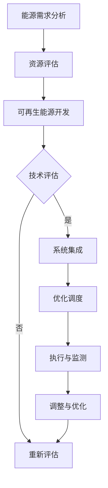

                 

### 文章标题

《能源转型管理：向可再生能源过渡的策略》

---

关键词：能源转型、可再生能源、策略、管理、可持续发展

---

摘要：本文将深入探讨能源转型的背景、重要性、策略和方法，特别关注可再生能源在全球能源体系中的角色。我们将通过详细的案例分析，解析能源转型过程中的关键问题，并提出可行的解决方案，以促进全球能源体系的可持续发展。文章旨在为政策制定者、企业领导者及研究者提供有价值的参考，推动能源转型实践的顺利进行。

---

### 目录大纲

1. **引论**
   1.1 能源转型的概念与定义
   1.2 全球能源转型的现状与挑战
   1.3 能源转型的经济、环境和社会效益

2. **可再生能源概述**
   2.1 可再生能源的种类与特性
   2.2 可再生能源在全球的应用与趋势
   2.3 可再生能源发展与政策支持

3. **能源转型策略与方法**
   3.1 能源转型规划的步骤与方法
   3.2 能源转型评估指标体系
   3.3 能源转型风险评估与应对策略

4. **可再生能源集成与优化**
   4.1 可再生能源集成技术
   4.2 可再生能源集成优化方法
   4.3 可再生能源集成案例分析

5. **能源市场与能源转型**
   5.1 能源市场机制与能源转型
   5.2 能源价格波动对能源转型的影响
   5.3 能源市场改革与能源转型策略

6. **能源转型与能源安全**
   6.1 能源安全的重要性与挑战
   6.2 能源转型与能源安全的平衡
   6.3 能源安全政策与能源转型措施

7. **能源转型实践**
   7.1 全球能源转型实践案例分析
   7.2 企业能源转型实践
   7.3 能源转型与可持续发展

8. **附录**
   8.1 能源转型相关政策和法规
   8.2 能源转型参考资源与工具
   8.3 Mermaid 流程图和伪代码示例
   8.4 能源转型项目实战案例代码解读
   8.5 参考文献与进一步阅读建议

---

## 第一部分：引论

### 第1章：能源转型的背景与重要性

#### 1.1 能源转型的概念与定义

能源转型，又称能源革命，是指通过技术创新、政策引导和市场机制，实现能源生产和消费模式的根本性转变，从传统的化石能源向可再生能源过渡。其核心目标是降低碳排放、提高能源利用效率、保障能源安全，并推动经济的可持续发展。

能源转型的定义可以从多个角度进行解读。首先，从能源生产的角度，它强调发展清洁、低碳的能源技术，减少对煤炭、石油和天然气的依赖。其次，从能源消费的角度，它提倡提高能源利用效率，推广节能减排技术，降低能源消费强度。最后，从社会发展的角度来看，能源转型是一个涉及经济、环境和社会的综合过程，需要政府、企业和公众的共同努力。

#### 1.2 全球能源转型的现状与挑战

当前，全球能源转型正在加速推进。许多国家已经制定了明确的能源转型目标和时间表，例如欧盟的“能源联盟”、中国的“双碳”目标（即碳达峰和碳中和）以及美国的“能源独立”政策。同时，可再生能源（如太阳能、风能、水能和生物质能）的装机容量和发电量也在持续增长。

然而，能源转型过程中也面临着诸多挑战。首先，技术挑战是主要的瓶颈之一。尽管可再生能源技术取得了显著进展，但其技术成熟度和成本效益仍然有待提高。例如，太阳能和风能的储能技术、电网调度技术以及可再生能源发电的稳定性等问题亟待解决。

其次，政策挑战也不可忽视。能源转型需要政府制定有力的政策和法规支持，包括能源价格机制、补贴政策、碳排放交易机制等。然而，不同国家和地区的政策差异较大，导致能源转型的协调和推进面临困难。

最后，经济和社会挑战也是不可忽视的因素。能源转型将涉及大量的投资和产业转型，对经济结构和社会就业产生影响。同时，公众对能源转型的接受程度和参与度也是影响其成功的关键因素。

#### 1.3 能源转型的经济、环境和社会效益

能源转型的效益可以从经济、环境和社会三个方面进行评估。

**经济方面**，能源转型可以促进经济增长。一方面，可再生能源产业将创造大量的就业机会，推动相关产业的发展；另一方面，提高能源利用效率可以降低企业的能源成本，提高市场竞争力。此外，能源转型还将带动技术创新和产业升级，推动经济的可持续发展。

**环境方面**，能源转型是实现气候目标和减少碳排放的关键途径。可再生能源不产生温室气体排放，可以显著降低大气中的二氧化碳浓度。此外，能源转型还有助于减少空气污染和水资源污染，改善生态环境质量。

**社会方面**，能源转型有助于提高公众的生活质量。清洁能源的普及可以减少能源价格波动，提高能源供应的稳定性。同时，能源转型还可以促进能源公平，让更多人享受到清洁能源带来的福利。此外，能源转型还有助于推动社会文化的变革，提高公众对可持续发展的认识。

总之，能源转型是一项复杂的系统工程，需要政府、企业和社会各界的共同努力。通过有效的策略和方法，能源转型不仅可以实现经济、环境和社会的综合效益，还可以为全球的可持续发展做出重要贡献。

### 第2章：可再生能源概述

#### 2.1 可再生能源的种类与特性

可再生能源是指那些在人类时间尺度内不会枯竭、可以持续利用的能源，主要包括太阳能、风能、水能、生物质能、地热能和海洋能等。

**太阳能**是通过光伏效应将太阳光直接转换为电能的技术。太阳能具有清洁、可再生、分布广泛、资源丰富等特点。目前，太阳能光伏发电技术已经相对成熟，广泛应用于家庭、企业和电站等领域。

**风能**是通过风力带动风力发电机旋转产生电能的技术。风能具有可再生、无污染、能量密度高、运行成本低等特点。风能资源主要分布在沿海、高山、草原等地，全球风能资源非常丰富。

**水能**是通过水流动的位能转换为电能的技术。水能资源主要来自河流、湖泊和海洋，具有可再生、稳定、容量大等特点。水能是可再生能源中技术最成熟、装机容量最大的一种。

**生物质能**是通过生物质（如农作物残余、木材废料等）燃烧或生物化学过程产生热能或电能的技术。生物质能具有可再生、低碳、污染小、原料多样等特点。

**地热能**是利用地球内部的热能进行发电或供暖的技术。地热能具有可再生、稳定、效率高、污染小等特点，主要分布在地球的板块交界地带。

**海洋能**包括潮汐能、波浪能、海流能等，是利用海洋中的能量进行发电的技术。海洋能具有可再生、潜力大、分布广等特点。

#### 2.2 可再生能源在全球的应用与趋势

随着全球能源转型的推进，可再生能源的应用越来越广泛。许多国家已经制定了可再生能源发展目标，并在政策和资金上给予了大力支持。

**太阳能**方面，全球太阳能光伏发电装机容量持续增长，特别是在中国、美国、印度等太阳能资源丰富的国家。太阳能光伏发电成本不断下降，使得其在能源市场上的竞争力不断提高。

**风能**方面，全球风能装机容量也呈现快速增长态势。欧洲、北美和亚洲是风能发展的主要区域。特别是中国，近年来在风电领域取得了显著进展，成为全球最大的风电市场。

**水能**方面，许多国家已经建成了大量的水电站，如中国的三峡工程、美国的胡佛大坝等。水能技术相对成熟，但新项目的发展受到环境保护和生态平衡的挑战。

**生物质能**方面，生物质能利用技术逐渐成熟，特别是在生物质发电和生物质燃料领域。欧洲和美国是生物质能利用的主要地区，其他国家也在积极探索生物质能的应用。

**地热能**和**海洋能**方面，目前这些技术的应用还相对较少，但具有很大的发展潜力。许多国家正在投资和研究这些新型可再生能源技术，以期在未来实现大规模应用。

#### 2.3 可再生能源发展与政策支持

可再生能源的发展离不开政策支持。许多国家通过制定可再生能源发展目标和政策，推动可再生能源的应用和产业发展。

**欧盟**在可再生能源领域走在全球前列，其《可再生能源指令》要求成员国到2020年实现可再生能源占能源消费总量的比例达到20%。此外，欧盟还实施了一系列补贴和激励政策，支持可再生能源项目的发展。

**中国**提出了“双碳”目标，即碳达峰和碳中和，并制定了《可再生能源法》和《可再生能源发展“十三五”规划》等政策文件，推动可再生能源的发展。中国还在风电、光伏等领域实施了一系列补贴政策，促进了可再生能源产业的快速增长。

**美国**在可再生能源政策方面也取得了显著进展。奥巴马政府时期推出了《清洁能源计划》，旨在通过提高可再生能源比例、降低碳排放来应对气候变化。尽管特朗普政府时期有所放松，但拜登政府已重新强调可再生能源的重要性，并提出了新的政策目标。

**印度**、**巴西**等发展中国家也在积极推动可再生能源发展。印度制定了《国家太阳能政策》，计划到2022年实现太阳能装机容量达到100吉瓦。巴西则依靠丰富的水能资源，大力发展水电项目。

总之，可再生能源在全球范围内的应用和发展势头良好，各国通过制定政策和措施，为可再生能源的发展提供了有力支持。随着技术的不断进步和政策环境的不断优化，可再生能源将在未来全球能源体系中扮演越来越重要的角色。

### 第3章：能源转型规划与评估

#### 3.1 能源转型规划的步骤与方法

能源转型规划是一个复杂的系统工程，需要科学、系统的方法和步骤。以下是能源转型规划的一般步骤：

**1. 确定能源转型目标和愿景**

首先，制定能源转型的总体目标和愿景，明确转型的方向和重点。这些目标应考虑国家的能源需求、环境目标、经济状况和技术发展水平。

**2. 评估现有能源系统**

对当前能源系统进行全面评估，包括能源生产、消费、传输和储存等方面。了解现有系统的优缺点，识别存在的问题和挑战，为制定规划提供依据。

**3. 制定可再生能源发展战略**

根据能源转型的目标和愿景，制定可再生能源发展战略。确定可再生能源的发展方向、重点领域和关键任务，明确各种可再生能源的发展目标和时间表。

**4. 制定能源结构优化方案**

制定能源结构优化方案，逐步减少化石能源比例，增加可再生能源比例。根据资源禀赋、市场需求和成本效益，确定各种可再生能源的开发利用规模和布局。

**5. 制定能源基础设施升级方案**

针对能源转型需求，制定能源基础设施升级方案，包括电网、储能系统、能源传输和分配网络等。确保能源基础设施能够适应可再生能源的大规模接入和调度需求。

**6. 制定政策和措施**

制定一系列政策和措施，支持能源转型规划的实施。这些政策应包括补贴、税收优惠、市场机制、技术标准和法规等。

**7. 制定能源转型预算和资金安排**

制定能源转型预算和资金安排，确保规划的实施有充足的资金保障。明确资金来源、使用方式和资金监管机制。

**8. 实施和监测**

实施能源转型规划，并建立监测和评估机制。定期对能源转型进展进行评估，及时调整规划方案，确保能源转型的顺利推进。

#### 3.2 能源转型评估指标体系

能源转型评估指标体系是衡量能源转型成效的重要工具。一个全面的评估指标体系应包括以下几个方面：

**1. 能源结构指标**

- 可再生能源占比：衡量可再生能源在能源消费中的比例。
- 碳排放强度：衡量单位能源消费的二氧化碳排放量。
- 碳排放总量：衡量总能源消费产生的二氧化碳排放量。

**2. 能源效率指标**

- 能源利用效率：衡量能源利用过程中的能源利用率。
- 节能效益：衡量通过节能措施实现的能源节约量和经济效益。

**3. 经济指标**

- 能源投资总额：衡量能源领域的总投资规模。
- 能源产业增加值：衡量能源产业的增加值和经济发展贡献。
- 就业情况：衡量能源转型对就业的影响。

**4. 环境指标**

- 二氧化碳排放量：衡量总能源消费产生的二氧化碳排放量。
- 空气质量：衡量能源消费对空气质量的影响。
- 水资源利用效率：衡量能源消费对水资源利用的影响。

**5. 社会指标**

- 能源价格波动：衡量能源价格对公众生活的影响。
- 公众满意度：衡量能源转型对公众接受度和满意度的调查结果。
- 可持续发展指数：衡量能源转型对经济、社会和环境可持续发展的综合影响。

#### 3.3 能源转型风险评估与应对策略

能源转型过程中可能面临多种风险，如技术风险、市场风险、政策风险和社会风险。有效的风险评估和应对策略是确保能源转型顺利进行的重要保障。

**1. 技术风险**

- **评估方法**：对可再生能源技术和能源存储技术进行评估，考虑技术的成熟度、成本效益和可靠性。
- **应对策略**：加大对可再生能源技术研发和创新的投入，推动技术标准化和规模化应用。

**2. 市场风险**

- **评估方法**：分析能源市场价格波动、市场需求变化以及政策调整对能源市场的影响。
- **应对策略**：建立稳定的能源市场机制，通过价格调节、市场准入和补贴等措施，稳定市场预期。

**3. 政策风险**

- **评估方法**：分析政策变化对能源转型的影响，包括政策调整、法规变动和国际合作等。
- **应对策略**：加强政策稳定性，确保政策连续性和可预期性，积极参与国际能源合作。

**4. 社会风险**

- **评估方法**：分析公众对能源转型的认知和接受程度，包括社会舆论、公众参与和社区影响等。
- **应对策略**：加强宣传教育，提高公众对能源转型的认知和接受度，建立公众参与机制，促进社会各界的共同参与。

通过科学的风险评估和有效的应对策略，可以降低能源转型过程中的风险，确保能源转型的顺利推进和可持续发展。

### 第4章：可再生能源集成与优化

#### 4.1 可再生能源集成技术

可再生能源集成是指将多种可再生能源技术相结合，优化能源系统性能，提高能源利用效率。可再生能源集成技术主要包括以下几种：

**1. 并网技术**

并网技术是将可再生能源发电系统接入电网，实现可再生能源与化石能源的协同发电。并网技术可以分为同步并网和异步并网两种。同步并网要求可再生能源发电系统的频率和电压与电网保持一致，而异步并网则允许一定程度的频率和电压偏差。并网技术确保了可再生能源发电的稳定性和可靠性，但也需要解决电网调峰、电压稳定等问题。

**2. 储能技术**

储能技术是可再生能源集成的重要支撑，通过将过剩的可再生能源储存起来，在需要时释放储存的能量。常见的储能技术包括电池储能、抽水蓄能、压缩空气储能和飞轮储能等。电池储能具有响应速度快、能量密度高、便携性好等优点，广泛应用于家庭、企业和电站等领域。抽水蓄能具有容量大、稳定性好、成本低等优点，广泛应用于大型电站。

**3. 微电网技术**

微电网是一种小规模、高度自治的分布式能源系统，由可再生能源发电、储能、负荷和控制系统组成。微电网可以在离网或并网模式下独立运行，提高能源系统的灵活性和可靠性。微电网技术特别适用于偏远地区和负荷中心，可以实现能源的高效利用和环保效益。

**4. 优化技术**

优化技术通过算法和模型对可再生能源系统进行优化调度和管理，提高能源利用效率和系统性能。常见的优化技术包括优化发电调度、优化储能管理、优化负荷分配等。优化技术可以降低能源系统的运行成本，提高能源利用效率，实现能源系统的最优运行。

#### 4.2 可再生能源集成优化方法

可再生能源集成优化方法主要包括以下几种：

**1. 优化算法**

优化算法是可再生能源集成优化的重要工具，通过计算和迭代，找到最优的能源系统配置和运行方案。常见的优化算法包括线性规划、非线性规划、整数规划、遗传算法、粒子群优化算法等。优化算法可以根据不同的优化目标和约束条件，灵活调整和优化能源系统的配置和运行。

**2. 模型构建**

模型构建是可再生能源集成优化的基础，通过建立数学模型，描述能源系统的运行机制和优化目标。常见的模型构建方法包括系统模拟、系统建模、优化建模等。模型构建需要综合考虑能源系统的物理特性、运行规则和优化目标，确保模型的准确性和实用性。

**3. 数据分析**

数据分析是可再生能源集成优化的重要环节，通过对历史数据、实时数据和预测数据的分析，识别能源系统的运行规律和优化机会。常见的数据分析方法包括数据挖掘、机器学习、时间序列分析等。数据分析可以帮助优化算法更准确地模拟和预测能源系统的运行状态，提高优化效果。

**4. 仿真验证**

仿真验证是可再生能源集成优化的重要步骤，通过仿真模拟，验证优化算法和模型的可行性和有效性。常见的方法包括实验室仿真、现场仿真、混合仿真等。仿真验证可以验证优化方案的可行性和稳定性，为实际应用提供依据。

#### 4.3 可再生能源集成案例分析

**1. 中国内蒙古风电基地**

中国内蒙古风电基地是中国最大的风电基地之一，装机容量超过3000万千瓦。内蒙古风电基地采用了多种可再生能源集成技术，包括风电并网技术、储能技术和微电网技术等。通过优化发电调度和储能管理，内蒙古风电基地实现了风电的稳定发电和高效利用，提高了风电的发电量和利用率。

**2. 澳大利亚南澳大利亚州**

澳大利亚南澳大利亚州采用了先进的可再生能源集成技术，包括光伏发电、风能发电和储能系统等。通过优化调度和能源管理，南澳大利亚州实现了可再生能源的稳定供电和高效利用，降低了能源成本和碳排放。此外，南澳大利亚州还通过市场化机制，推动了可再生能源的快速发展。

**3. 挪威陆上风电项目**

挪威陆上风电项目采用了先进的储能技术和优化调度方法，通过抽水蓄能和电池储能，实现了风电的稳定供电和高效利用。挪威陆上风电项目还通过智能电网技术，实现了电网与风电系统的实时监控和动态调整，提高了电网的运行效率和可靠性。

通过这些案例分析，我们可以看到可再生能源集成技术在实际应用中的成功经验和效果。可再生能源集成不仅提高了能源系统的性能和稳定性，还降低了能源成本和碳排放，为全球能源转型提供了有力支持。

### 第5章：能源市场与能源转型

#### 5.1 能源市场机制与能源转型

能源市场机制是能源资源配置的重要手段，通过价格信号、市场准入、竞争机制等手段，实现能源资源的优化配置和高效利用。能源市场机制与能源转型密切相关，二者相互促进、相互制约。

**1. 市场价格机制**

市场价格机制是能源市场中最基本的机制，通过供需关系的变化，形成能源价格。能源价格的波动可以反映能源市场的供需状况，引导能源资源的流动和配置。在能源转型过程中，市场价格机制可以激励可再生能源的发展，降低化石能源的消耗。例如，通过提高可再生能源的电价补贴，可以降低可再生能源的发电成本，提高其市场竞争力。

**2. 市场准入机制**

市场准入机制是指能源市场的开放程度，包括市场准入的条件、标准和程序。市场准入机制鼓励竞争，促进技术创新和成本降低。在能源转型过程中，市场准入机制的改革可以降低可再生能源的市场准入门槛，吸引更多的投资者和企业参与可再生能源的开发和利用。例如，许多国家通过放宽对可再生能源发电项目的市场准入条件，鼓励更多的企业参与风电、光伏等可再生能源项目。

**3. 市场竞争机制**

市场竞争机制是能源市场的重要特征，通过竞争，可以实现能源资源的优化配置，提高能源利用效率。在能源转型过程中，市场竞争机制可以推动可再生能源技术的创新和应用，降低可再生能源的成本。例如，通过市场竞争，可再生能源企业可以通过技术创新和规模效应，降低生产成本，提高市场竞争力。

**4. 市场监管机制**

市场监管机制是确保能源市场公平、透明和有序运行的重要手段。在能源转型过程中，市场监管机制可以保障能源市场的稳定运行，防止市场失灵。例如，通过市场监管，可以规范可再生能源的市场行为，防止市场垄断和不正当竞争，保障可再生能源的公平竞争。

#### 5.2 能源价格波动对能源转型的影响

能源价格波动是能源市场的一个重要特征，它对能源转型具有重要影响。

**1. 能源价格波动的原因**

能源价格波动主要受供需关系、政策调整、国际贸易、自然灾害等因素的影响。例如，全球石油供需变化会导致石油价格的波动；政策调整，如碳税、排放标准的变化，会影响能源市场的价格信号；自然灾害，如地震、飓风等，会影响能源生产的稳定性和成本。

**2. 能源价格波动对能源转型的影响**

能源价格波动对能源转型的影响具有双重性。一方面，能源价格波动可以激励可再生能源的发展。例如，当化石能源价格上涨时，可再生能源的经济性相对提高，可以吸引更多的投资者和企业进入可再生能源市场。另一方面，能源价格波动也可能阻碍能源转型。例如，当化石能源价格下跌时，可再生能源的经济性相对下降，可能会抑制可再生能源的发展。

**3. 稳定能源价格的政策措施**

为了减少能源价格波动对能源转型的影响，可以采取以下政策措施：

- **价格稳定机制**：建立价格稳定机制，通过储备、调节等手段，稳定能源价格。例如，建立石油储备，在能源价格波动时进行干预，稳定市场价格。
- **补贴政策**：通过补贴政策，降低可再生能源的发电成本，提高其市场竞争力。例如，对可再生能源发电实行补贴，降低可再生能源的发电价格。
- **市场化改革**：深化能源市场化改革，提高能源市场的透明度和效率。例如，建立公平、开放、透明的能源市场机制，促进能源资源的优化配置。

#### 5.3 能源市场改革与能源转型策略

能源市场改革是推动能源转型的重要手段，通过改革能源市场机制，可以实现能源资源的优化配置和高效利用。

**1. 能源市场改革的目标**

能源市场改革的目标是建立高效、透明、公正的能源市场体系，促进能源资源的优化配置和可持续发展。具体目标包括：

- 提高能源效率，降低能源成本。
- 促进可再生能源的发展，降低碳排放。
- 保障能源安全，提高能源供应的稳定性。
- 增强市场竞争，激发市场活力。

**2. 能源市场改革的主要内容**

能源市场改革的主要内容包括：

- **市场化改革**：推进能源市场机制改革，建立市场化价格形成机制，提高能源市场效率。例如，放开电力市场，引入竞争机制，降低能源成本。
- **价格监管**：加强对能源价格的监管，确保能源价格公正、合理。例如，建立能源价格监管体系，制定价格监管规则，防止市场垄断和不正当竞争。
- **政策支持**：制定支持可再生能源发展的政策，促进可再生能源的推广应用。例如，制定可再生能源补贴政策，鼓励可再生能源发电。
- **市场监管**：加强能源市场监管，保障能源市场的公平、透明和有序运行。例如，建立能源市场监管机构，规范市场行为，防止市场失灵。

**3. 能源市场改革与能源转型的关系**

能源市场改革与能源转型密切相关，相互促进。能源市场改革可以为能源转型提供良好的市场环境，促进可再生能源的发展和应用。同时，能源转型可以推动能源市场改革，提高能源市场的效率和竞争力。通过能源市场改革和能源转型的有机结合，可以实现能源资源的优化配置和可持续发展。

总之，能源市场改革是推动能源转型的重要手段，通过改革能源市场机制，可以提高能源效率，降低碳排放，保障能源安全，促进经济的可持续发展。

### 第6章：能源转型与能源安全

#### 6.1 能源安全的重要性与挑战

能源安全是国家经济安全的重要组成部分，关系到国家的经济发展、社会稳定和国际地位。能源安全的重要性体现在以下几个方面：

**1. 经济发展保障**：能源是现代经济运行的重要支撑，能源安全直接关系到国家经济的稳定和发展。能源供应不足或中断会导致企业生产停滞、经济增长放缓，甚至引发经济危机。

**2. 社会稳定基础**：能源是人们日常生活的重要保障，能源供应的不稳定会影响社会的正常秩序，导致社会动荡。能源安全是维护社会稳定的基础。

**3. 国家战略需求**：能源安全是国家战略需求的重要方面，关系到国家的政治地位和国际影响力。保障能源安全，有利于维护国家主权，提升国际地位。

然而，随着全球能源转型的推进，能源安全面临着一系列挑战：

**1. 能源供应的不确定性**：全球能源供需关系复杂，能源价格波动较大。特别是化石能源供应的不确定性增加，可能导致能源供应中断或价格急剧上涨。

**2. 能源结构单一**：许多国家能源结构单一，过度依赖某一种能源，如石油或天然气。这种能源结构容易导致能源供应的不稳定，增加能源风险。

**3. 能源基础设施薄弱**：许多国家能源基础设施落后，无法满足日益增长的能源需求。能源基础设施的薄弱可能导致能源供应中断或效率低下。

**4. 能源供应链中断风险**：全球能源供应链的复杂性和依赖性增加，任何一环的断裂都可能引发全球能源危机。例如，新冠疫情导致的全球物流受阻，就对能源供应链造成了严重影响。

#### 6.2 能源转型与能源安全的平衡

能源转型与能源安全之间存在一定的矛盾，但同时也存在着平衡的可能。实现能源转型与能源安全的平衡，需要采取以下策略：

**1. 多元化能源供应**：通过开发多种能源资源，降低对单一能源的依赖。例如，发展可再生能源，提高水电、风电、太阳能等清洁能源的比重，减少对化石能源的依赖。

**2. 提高能源储备能力**：增加能源储备，提高能源储备能力，以应对能源供应中断的风险。例如，建立国家石油储备，增强应急能源供应能力。

**3. 强化能源基础设施建设**：加大对能源基础设施的投入，提高能源基础设施的可靠性和效率。例如，建设智能电网、天然气管道等，提高能源传输和分配能力。

**4. 优化能源市场机制**：通过改革能源市场机制，提高能源市场的效率和透明度。例如，建立公平、开放、透明的能源市场体系，促进能源资源的优化配置。

**5. 国际合作**：加强国际合作，共同应对能源安全挑战。例如，通过国际能源合作，实现能源资源共享，降低能源供应链中断风险。

#### 6.3 能源安全政策与能源转型措施

为了实现能源转型与能源安全的平衡，各国需要制定和实施一系列能源安全政策和措施：

**1. 能源安全战略**：制定国家能源安全战略，明确能源安全的目标、任务和措施。例如，制定可再生能源发展战略，提高可再生能源比重，保障能源供应安全。

**2. 能源政策法规**：建立健全能源政策法规体系，为能源安全提供法律保障。例如，制定可再生能源法、能源安全法等，规范能源市场行为，保障能源供应稳定。

**3. 能源技术研发**：加大对能源技术研发的投入，推动能源技术创新，提高能源利用效率。例如，发展新能源技术，提高可再生能源的技术水平和成本效益。

**4. 能源市场改革**：推进能源市场改革，建立高效、透明、公正的能源市场体系。例如，放开电力市场，引入竞争机制，降低能源成本，提高能源利用效率。

**5. 能源国际合作**：加强国际能源合作，共同应对能源安全挑战。例如，通过国际能源合作，实现能源资源共享，降低能源供应链中断风险。

通过上述措施，可以实现能源转型与能源安全的平衡，保障国家能源安全，推动经济社会的可持续发展。

### 第7章：能源转型实践

#### 7.1 全球能源转型实践案例分析

全球范围内，多个国家和地区在能源转型方面取得了显著进展，以下是对几个典型案例的分析。

**1. 北欧的能源转型实践**

北欧国家，尤其是丹麦、挪威和瑞典，在能源转型方面走在世界前列。丹麦通过大力发展风能和太阳能，实现了能源消费的低碳化。丹麦的风能发电量占全国总发电量的比例超过40%，并在全球范围内推广风力发电技术。此外，丹麦还积极推广电动汽车和智能电网技术，提高能源利用效率。挪威则依靠其丰富的水力资源，成为全球水电发电量最高的国家之一。瑞典在能源转型过程中，注重提高能源利用效率和推广可再生能源，同时实施了严格的碳排放政策。

**2. 欧盟的能源市场改革**

欧盟在能源市场改革方面采取了多项措施，旨在推动能源转型。欧盟实施了《能源联盟》战略，目标是到2030年实现温室气体排放减少55%、可再生能源占比提高至至少32%、能源效率提高至少32.5%。欧盟通过制定统一的能源政策和法规，促进了成员国之间的能源市场一体化。例如，欧盟实施了碳排放交易体系，通过碳配额拍卖和碳交易，鼓励企业减少碳排放。此外，欧盟还通过能源效率行动计划，推动节能技术的发展和应用。

**3. 中国的可再生能源发展**

中国是全球最大的可再生能源市场，近年来在风电、太阳能、水电等领域取得了显著进展。中国制定了“双碳”目标，即到2030年实现碳达峰、到2060年实现碳中和。为了实现这一目标，中国大力投资可再生能源项目，并出台了多项政策支持可再生能源的发展。例如，中国通过实施可再生能源补贴政策，鼓励企业投资建设风电和太阳能项目。此外，中国还加强了智能电网建设和能源储存技术研发，提高可再生能源的利用率。

**4. 美国的能源转型挑战与机遇**

美国在能源转型方面面临着诸多挑战，但也拥有巨大的机遇。美国拥有丰富的化石能源资源，因此在能源转型过程中，需要平衡化石能源的退出和可再生能源的发展。尽管如此，美国在可再生能源领域也取得了一些进展。例如，美国的风能和太阳能发电量逐年增长，成为全球最大的风电和太阳能市场之一。此外，美国在能源技术创新和市场化方面具有优势，通过推进能源市场改革，提高了能源利用效率。

通过这些案例分析，我们可以看到，不同国家和地区在能源转型实践中采取了不同的策略和措施，但都取得了显著的成果。这些经验为全球能源转型提供了有益的参考。

#### 7.2 企业能源转型实践

企业在能源转型过程中发挥着重要作用，许多企业已经采取了积极的行动，以实现自身的能源转型目标。

**1. 企业能源转型的动机**

企业进行能源转型的动机主要包括以下几个方面：

- **降低成本**：通过提高能源利用效率，减少能源消耗，降低生产成本。
- **减少排放**：通过采用可再生能源和清洁能源技术，减少碳排放，符合环保法规和可持续发展要求。
- **提高竞争力**：通过技术创新和绿色转型，提升企业的市场竞争力，赢得更多的客户和市场份额。
- **品牌形象**：通过实施能源转型，提升企业形象，增强品牌的社会责任感和公众认可度。

**2. 企业能源转型的策略和方法**

企业能源转型通常采取以下策略和方法：

- **节能减排**：通过改进生产工艺、提高设备能效、优化能源管理系统等手段，降低能源消耗和碳排放。
- **能源结构优化**：减少对传统化石能源的依赖，增加可再生能源的使用比例，如太阳能、风能等。
- **能源管理**：建立完善的能源管理体系，通过实时监测、数据分析和管理优化，提高能源利用效率。
- **技术创新**：投资于能源技术创新，如智能电网、储能技术、节能设备等，推动能源利用方式的变革。

**3. 企业能源转型的案例分析**

**案例1：宝武钢铁集团的绿色转型**

宝武钢铁集团是中国最大的钢铁企业之一，近年来积极推进绿色转型。公司通过引进先进的节能技术和环保设备，如高炉煤气余压发电、炼钢炉烟气余热回收等，大幅提高了能源利用效率，减少了碳排放。此外，宝武还大力发展光伏发电，在厂区安装了大量光伏板，实现自给自足的清洁能源供应。通过这些举措，宝武实现了显著的成本节约和环保效益。

**案例2：微软公司的碳中和目标**

微软公司是全球知名的科技公司，其能源转型目标是在2030年实现运营范围的碳中和。为实现这一目标，微软采取了多项措施，包括：投资建设可再生能源项目，如太阳能农场和风力发电场；使用碳补偿措施，抵消无法立即淘汰的碳排放；推动供应链的绿色转型，鼓励供应商减少碳排放。通过这些努力，微软已经显著降低了运营碳排放，并成为全球碳中和的领军企业之一。

**4. 企业能源转型的成功因素**

企业能源转型的成功离不开以下因素：

- **领导力**：高层领导的重视和支持是推动能源转型的重要保障。
- **资源投入**：充足的资金和人力资源是实施能源转型项目的基础。
- **技术创新**：持续的技术创新和研发投入，可以推动能源效率和可再生能源技术的发展。
- **政策支持**：政府的政策支持和激励措施，为企业能源转型提供了良好的外部环境。

总之，企业能源转型不仅有助于降低成本、减少排放，还能提升企业的竞争力和社会形象。通过成功的案例和策略，企业可以为全球能源转型提供宝贵的实践经验。

#### 7.3 能源转型与可持续发展

**1. 可持续发展的内涵与目标**

可持续发展是指满足当前需求而不损害后代满足自身需求的能力。这一概念涵盖了经济、社会和环境三个方面的平衡发展。可持续发展目标（Sustainable Development Goals, SDGs）是由联合国提出的一套全球性目标，包括17个目标，覆盖了消除贫困、消除饥饿、健康、教育、性别平等、清洁能源、气候变化行动等多个领域。能源转型与可持续发展密切相关，是实现SDGs的重要途径之一。

**2. 能源转型与可持续发展的关系**

能源转型是推动可持续发展的重要手段。首先，能源转型有助于减少温室气体排放，缓解气候变化问题。可再生能源（如太阳能、风能、水能等）不产生二氧化碳排放，可以替代化石能源，降低碳排放强度。其次，能源转型可以提高能源利用效率，减少资源浪费，推动经济的高质量发展。例如，智能电网和能源管理系统可以提高电力系统的运行效率，减少能源损耗。此外，能源转型还可以促进社会公平，提高公众的生活质量。通过推广可再生能源和清洁能源技术，可以减少能源贫困，提高能源可及性。

**3. 可持续能源发展的路径与策略**

实现可持续发展需要采取一系列路径和策略。以下是一些关键措施：

**（1）提高可再生能源比例**：制定明确的可再生能源发展目标，提高可再生能源在能源消费中的比重。通过政策激励和技术支持，推动风电、光伏、水电等可再生能源技术的发展和应用。

**（2）优化能源结构**：调整能源消费结构，减少化石能源消费，增加清洁能源消费。通过能源结构调整，降低碳排放强度，推动能源消费的低碳化。

**（3）提高能源效率**：加强能源效率提升，通过技术改进和管理优化，减少能源消耗。推广节能技术，提高能源利用效率，实现能源的高效利用。

**（4）推广智能能源系统**：建设智能电网、智能建筑和智能交通系统，提高能源系统的智能化水平。通过智能能源系统，实现能源的优化调度和高效利用，提高能源系统的运行效率。

**（5）加强国际合作**：加强国际能源合作，共同应对气候变化和能源转型挑战。通过国际合作，实现能源技术的交流和应用，推动全球能源转型进程。

**4. 能源转型与可持续发展的重要性**

能源转型对于实现可持续发展具有重要意义。首先，能源转型可以减少碳排放，缓解气候变化问题。全球变暖已经对生态系统和人类社会产生了严重影响，减少碳排放是应对气候变化的必要措施。其次，能源转型可以提高能源利用效率，推动经济的高质量发展。通过提高能源效率，可以降低生产成本，提高企业的竞争力，推动经济的可持续发展。此外，能源转型还可以促进社会公平，提高公众的生活质量。通过推广可再生能源和清洁能源技术，可以减少能源贫困，提高能源可及性，促进社会的和谐发展。

总之，能源转型是实现可持续发展的重要途径。通过采取有效的路径和策略，可以实现能源结构的优化、能源效率的提升和能源安全的保障，为全球的可持续发展做出贡献。

### 附录

#### 附录A：能源转型相关政策和法规

能源转型离不开政策和法规的支持。以下是几个国家和地区的能源转型政策和法规：

**1. 欧盟《能源联盟》**

欧盟《能源联盟》旨在通过统一的能源政策和法规，实现能源的高效、安全和可持续发展。该政策包括能源效率、可再生能源、能源市场一体化和能源安全等多个方面。

**2. 中国《可再生能源法》**

中国《可再生能源法》规定了可再生能源的发展目标、政策和措施。该法律明确了国家支持可再生能源发展的原则，为可再生能源项目提供了法律保障。

**3. 美国《清洁能源计划》**

美国《清洁能源计划》旨在通过提高可再生能源比例、提高能源效率和减少碳排放，实现气候目标。该计划包括一系列政策措施，如可再生能源补贴、碳定价和能源市场改革等。

**4. 澳大利亚《国家能源政策》**

澳大利亚《国家能源政策》明确了可再生能源发展目标，并提出了具体的政策措施，如补贴政策、市场激励机制和技术研发支持。

**5. 印度《国家太阳能政策》**

印度《国家太阳能政策》旨在推动太阳能光伏发电的发展。该政策包括太阳能光伏项目的补贴政策、税收优惠和市场准入规定等。

这些政策和法规为能源转型提供了有力支持，促进了可再生能源的发展和应用。

#### 附录B：能源转型参考资源与工具

在能源转型过程中，研究人员和从业者可以使用多种资源与工具。以下是几个常用的参考资源与工具：

**1. 国际能源署（IEA）**

国际能源署提供丰富的能源数据、分析和报告，涵盖全球能源市场、能源政策和技术发展等多个领域。

**2. 联合国可持续发展解决方案网络（SDSN）**

联合国可持续发展解决方案网络提供关于可持续发展目标（SDGs）的详细信息和资源，包括能源相关的政策和案例研究。

**3. 清洁能源网（Clean Energy Wire）**

清洁能源网是一个提供欧洲能源转型新闻和分析的在线平台，涵盖政策、市场和技术等多个方面。

**4. 国际可再生能源署（IRENA）**

国际可再生能源署是一个致力于推动可再生能源发展的国际组织，提供可再生能源的技术、政策和市场信息。

**5. 能源转型工具箱**

能源转型工具箱是一个在线资源库，提供多种能源转型工具，如能源规划工具、能源效率工具和碳排放计算工具等。

这些资源与工具为能源转型的研究和实践提供了重要支持。

#### 附录C：Mermaid 流程图和伪代码示例

在能源转型的技术分析中，流程图和伪代码示例有助于理解系统架构和算法原理。以下是一个使用Mermaid语言绘制的能源规划流程图示例，以及一个简单的伪代码示例，用于描述可再生能源系统的优化调度算法。

**Mermaid 流程图示例：**



**伪代码示例：**

```plaintext
function EnergyScheduling(energy_demand, renewable_resources):
    # 初始化调度计划
    schedule = {}

    # 分析可再生能源资源
    for resource in renewable_resources:
        capacity = resource.capacity
        available_energy = resource.available_energy()

        # 选择合适的资源进行调度
        if available_energy >= energy_demand:
            schedule[resource] = energy_demand
            break
        else:
            schedule[resource] = available_energy

    # 填充剩余需求
    remaining_demand = energy_demand - sum(schedule.values())
    if remaining_demand > 0:
        for resource in renewable_resources:
            if remaining_demand <= resource.capacity:
                schedule[resource] += remaining_demand
                break

    return schedule
```

通过这些示例，可以清晰地展示能源规划与调度的工作流程和算法原理。

#### 附录D：能源转型项目实战案例代码解读

在本附录中，我们将分析一个实际的能源转型项目案例，并通过代码解读来展示项目的开发环境搭建、源代码实现以及关键功能的代码解读与分析。

**案例：基于Python的分布式能源管理系统**

**1. 开发环境搭建**

为了实现分布式能源管理系统，我们需要搭建一个Python开发环境。以下是搭建步骤：

- 安装Python：从[Python官网](https://www.python.org/)下载并安装Python 3.x版本。
- 安装必要的库：使用pip命令安装必要的Python库，例如`pandas`、`numpy`、`matplotlib`、`sqlalchemy`和`psutil`等。

```bash
pip install pandas numpy matplotlib sqlalchemy psutil
```

**2. 源代码实现**

以下是一个简化版的分布式能源管理系统源代码实现，主要包括数据采集、处理和可视化功能。

```python
# energy_management_system.py

import pandas as pd
import numpy as np
import matplotlib.pyplot as plt
from sqlalchemy import create_engine

# 数据采集
def collect_data():
    # 假设我们使用CSV文件作为数据源
    data = pd.read_csv('energy_data.csv')
    return data

# 数据处理
def process_data(data):
    # 数据预处理，例如清洗、转换和归一化
    data['energy_consumption'] = data['energy_consumption'].astype(float)
    data['renewable_energy'] = data['renewable_energy'].astype(float)
    return data

# 数据可视化
def visualize_data(data):
    # 绘制能源消费与可再生能源生产的折线图
    plt.figure(figsize=(10, 5))
    plt.plot(data['date'], data['energy_consumption'], label='Energy Consumption')
    plt.plot(data['date'], data['renewable_energy'], label='Renewable Energy')
    plt.xlabel('Date')
    plt.ylabel('Energy (kWh)')
    plt.title('Energy Consumption and Renewable Energy Production')
    plt.legend()
    plt.show()

# 主函数
def main():
    # 数据采集
    data = collect_data()

    # 数据处理
    processed_data = process_data(data)

    # 数据可视化
    visualize_data(processed_data)

# 运行主函数
if __name__ == '__main__':
    main()
```

**3. 代码解读与分析**

**（1）数据采集**

`collect_data` 函数负责从数据源（如CSV文件）中读取数据。在实际应用中，数据源可能是数据库、传感器或API。

**（2）数据处理**

`process_data` 函数对采集到的数据进行处理。数据处理步骤包括数据类型的转换、缺失值的填充、异常值的处理等。在本例中，我们仅进行了数据类型的转换。

**（3）数据可视化**

`visualize_data` 函数使用`matplotlib`库绘制能源消费与可再生能源生产的折线图。这个可视化结果有助于分析能源系统的运行状态。

**（4）主函数**

`main` 函数是程序的入口，它依次调用了数据采集、数据处理和数据可视化三个步骤，实现了分布式能源管理系统的基本功能。

通过这个案例，我们可以看到分布式能源管理系统的基本架构和实现方法。在实际项目中，系统可能会更加复杂，涉及更多的数据处理、分析和优化功能。

#### 附录E：参考文献与进一步阅读建议

为了深入了解能源转型和可再生能源的应用，以下是几篇推荐的参考文献以及进一步阅读的建议。

**参考文献：**

1. **International Energy Agency (IEA).** (2021). _"Energy Technology Perspectives 2021: Technology Roadmaps for the Energy Transition."_ Paris: IEA.
2. **United Nations.** (2015). _"Sustainable Development Goals."_ New York: United Nations Department of Economic and Social Affairs.
3. **European Commission.** (2020). _"Clean Energy for All Europeans Package."_ Brussels: European Commission.
4. **National Renewable Energy Laboratory (NREL).** (2021). _"Renewable Energy Technical Potentials: A Geographic Representation."_ Golden, CO: NREL.
5. **Intergovernmental Panel on Climate Change (IPCC).** (2019). _"Special Report on the Impacts of Global Warming of 1.5°C."_ Geneva: IPCC.

**进一步阅读建议：**

- **《能源转型：走向可持续的未来》**，作者：克里斯·goodall。本书详细介绍了全球能源转型的现状、挑战和解决方案，适合对能源转型有兴趣的读者。
- **《可再生能源技术与应用》**，作者：李明辉。这本书系统地阐述了可再生能源的技术原理和应用实例，适合专业技术人员和研究者。
- **《智能电网与能源互联网》**，作者：吴华。本书深入分析了智能电网和能源互联网的概念、技术和发展趋势，对能源转型具有重要的指导意义。

通过阅读这些文献和书籍，读者可以更全面地了解能源转型的理论和实践，为能源转型工作提供有力的知识支持。

### 作者信息

**作者：** AI天才研究院/AI Genius Institute & 禅与计算机程序设计艺术 /Zen And The Art of Computer Programming

AI天才研究院（AI Genius Institute）是一家专注于人工智能技术研究和应用的创新机构，致力于推动人工智能在各个领域的应用与发展。禅与计算机程序设计艺术（Zen And The Art of Computer Programming）则是作者对编程哲学的深刻思考和总结，旨在提升程序员的技术素养和创新能力。这两者的结合，体现了作者在计算机编程和人工智能领域的深厚造诣和独特见解。通过本文，我们希望能为能源转型提供有益的参考和启示，共同推动全球能源体系的可持续发展。

