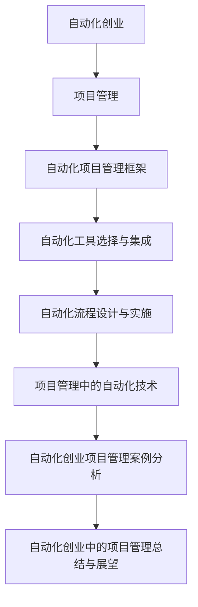

                 

# 自动化创业中的项目管理方法

## 关键词
- 自动化创业
- 项目管理
- 自动化工具
- 自动化流程
- 风险管理

## 摘要
本文将深入探讨自动化创业中的项目管理方法。首先，我们将介绍自动化创业的基本概念和重要性，然后讨论项目管理的基本原理和方法。接着，我们将详细阐述自动化项目管理的方法和实践，包括自动化工具的选择与集成、自动化流程的设计与实施、自动化测试、自动化部署与持续集成、自动化监控与报警以及自动化创业项目的风险管理与控制。最后，我们将通过案例分析总结自动化创业中的项目管理经验，并对未来发展趋势进行展望。

## 第一部分：自动化创业中的项目管理方法概述

### 第1章：自动化创业概述

#### 1.1 自动化的定义与意义
自动化（Automation）是指通过使用计算机软件、硬件或其他技术手段，使原本需要人工完成的工作自动化完成。自动化的定义可以从多个角度来理解：
- **生产自动化**：指在生产过程中，通过自动化设备、传感器和控制系统能够自动完成生产任务。
- **管理自动化**：指通过计算机软件和数据库，实现对企业管理、营销、财务等工作的自动化。
- **流程自动化**：指通过软件工具，将一系列重复性任务自动化，提高工作效率。

自动化在创业中的重要性主要体现在以下几个方面：
- **提高效率**：自动化技术能够减少人力成本，提高工作效率，使创业者能够集中精力进行更有价值的工作。
- **降低成本**：自动化技术能够减少因人为错误导致的成本，降低维护费用，提高生产效率。
- **增强竞争力**：自动化技术能够帮助企业更好地满足市场需求，提高产品质量，增强竞争力。

#### 1.2 创业过程中的自动化需求
创业过程中的自动化需求会随着创业阶段的不同而变化。以下是各个阶段的主要自动化需求：
- **初创阶段**：初创阶段的主要自动化需求集中在市场调研、用户数据分析、客户关系管理等。这一阶段的自动化工具通常包括CRM系统、数据分析工具、自动化营销工具等。
- **发展阶段**：发展阶段的主要自动化需求集中在生产流程、供应链管理、财务管理等方面。这一阶段的自动化工具通常包括ERP系统、自动化生产设备、智能物流系统等。
- **成长阶段**：成长阶段的主要自动化需求集中在业务扩展、市场拓展、客户服务等方面。这一阶段的自动化工具通常包括自动化销售系统、智能客服系统、社交媒体自动化管理等。

#### 1.3 自动化创业的挑战与机遇
自动化创业面临着一系列的挑战和机遇：
- **挑战**：
  - 技术复杂性：自动化技术涉及多个领域，包括计算机科学、电子工程、机械工程等，这要求创业者具备一定的技术背景。
  - 成本投入：自动化设备的采购、维护和升级都需要较大的资金投入。
  - 人才培养：自动化创业需要吸引和培养具备相关技术能力的人才。
- **机遇**：
  - 市场需求：随着社会经济的发展和消费者需求的升级，自动化产品和服务有着巨大的市场需求。
  - 创新空间：自动化领域有着广阔的创新空间，包括新型自动化设备、智能化系统、自动化解决方案等。

### 第2章：项目管理基础

#### 2.1 项目管理的定义与目标
项目管理是指通过规划、组织、协调、控制和监控等管理活动，确保项目按计划、质量和预算要求顺利完成的过程。项目管理的目标是实现项目的成功，具体包括以下几个方面：
- **按时完成**：确保项目在预定的时间内完成。
- **按预算完成**：确保项目在预算范围内完成。
- **按质量完成**：确保项目达到预定的质量标准。
- **满足需求**：确保项目满足客户和利益相关者的需求。

#### 2.2 项目管理流程
项目管理流程是项目管理活动的具体实施步骤，通常包括以下阶段：
- **项目启动**：确定项目的目标、范围、预算和计划，明确项目的关键利益相关者。
- **项目规划**：制定详细的项目计划，包括时间表、资源分配、风险评估和沟通计划等。
- **项目执行**：按照项目计划，协调团队成员完成各项任务。
- **项目监控与控制**：监控项目进展，及时调整计划，确保项目按计划进行。
- **项目收尾**：完成项目收尾工作，包括项目评估、经验总结和文档归档。

#### 2.3 项目管理工具与技术
项目管理工具是辅助项目管理者进行项目管理的软件或硬件工具。常见的管理工具包括：
- **项目管理软件**：如Microsoft Project、JIRA、Trello等，用于项目规划、任务分配、进度跟踪等。
- **协作工具**：如Slack、Microsoft Teams、Zoom等，用于团队成员之间的沟通和协作。
- **文档管理工具**：如Google Docs、Microsoft Word、Confluence等，用于文档的创建、编辑和共享。
- **风险管理工具**：如Risk Management Plan、Risk Register、Risk Matrix等，用于风险识别、分析和控制。

## 第二部分：自动化创业中的项目管理方法与实践

### 第3章：自动化项目管理方法

#### 3.1 自动化项目管理框架
自动化项目管理框架是项目管理活动在自动化环境中的应用，其核心目标是提高项目效率、降低成本、确保项目质量和满足客户需求。自动化项目管理框架通常包括以下几个关键组成部分：
- **自动化流程设计**：定义自动化流程的各个环节，确保流程的顺畅和高效。
- **自动化工具集成**：选择合适的自动化工具，并将其集成到项目管理流程中。
- **自动化监控与报警**：建立监控机制，实时跟踪项目进展，并在出现问题时及时报警。
- **自动化测试**：通过自动化测试工具进行功能测试、性能测试等，确保软件质量。
- **自动化部署**：实现软件的自动化部署，确保软件在不同环境中的快速上线。

#### 3.2 自动化工具选择与集成
选择合适的自动化工具是自动化项目管理成功的关键。以下是一些常用的自动化工具及其特点：
- **自动化测试工具**：如Selenium、JMeter、Cypress等，用于功能测试、性能测试等。
- **自动化部署工具**：如Jenkins、GitLab CI/CD、Docker等，用于自动化构建、测试和部署。
- **自动化监控工具**：如Prometheus、Grafana、Zabbix等，用于实时监控系统和应用程序的性能。
- **自动化文档生成工具**：如Doxygen、Sphinx等，用于生成软件文档。

集成自动化工具到项目管理流程中，需要考虑以下几个方面：
- **工具选型**：根据项目需求选择合适的工具，确保工具之间能够协同工作。
- **集成策略**：制定集成策略，确保自动化工具能够无缝集成到项目管理流程中。
- **环境配置**：配置自动化测试环境、部署环境和监控环境，确保工具能够正常运行。

#### 3.3 自动化流程设计与实施
自动化流程设计是自动化项目管理的关键环节，其目标是实现项目流程的自动化和高效化。以下是自动化流程设计的基本原则和步骤：
- **需求分析**：明确项目需求，分析项目流程中需要自动化的环节。
- **流程定义**：定义自动化流程的各个环节，包括输入、处理和输出。
- **工具选择**：选择合适的自动化工具，确保工具能够满足流程需求。
- **流程设计**：设计自动化流程的详细步骤，包括执行条件、执行顺序和异常处理。
- **流程验证**：通过测试验证自动化流程的正确性和效率。

实施自动化流程需要遵循以下步骤：
- **环境准备**：准备自动化测试环境、部署环境和监控环境。
- **工具安装**：安装并配置自动化工具，确保工具能够正常运行。
- **流程部署**：部署自动化流程，确保流程能够按照预定计划执行。
- **流程测试**：对自动化流程进行测试，验证流程的正确性和效率。

### 第4章：项目管理中的自动化技术

#### 4.1 自动化测试
自动化测试是指使用自动化测试工具对软件进行测试，以验证软件的功能、性能和用户体验。自动化测试的基本概念包括：
- **测试用例**：测试用例是测试过程中的最小单元，它定义了测试的具体操作和预期结果。
- **测试脚本**：测试脚本是一系列测试指令的集合，用于执行测试用例。
- **测试环境**：测试环境是指用于执行自动化测试的硬件、软件和网络配置。

自动化测试工具的选择需要考虑以下因素：
- **功能覆盖**：工具是否能够覆盖所需测试的功能。
- **易用性**：工具是否易于使用和维护。
- **兼容性**：工具是否能够与现有的开发和测试环境兼容。
- **扩展性**：工具是否支持扩展和定制。

自动化测试流程包括以下几个步骤：
- **测试规划**：制定自动化测试计划，确定测试范围、测试策略和资源需求。
- **测试设计**：设计自动化测试用例，编写测试脚本。
- **测试执行**：执行自动化测试脚本，记录测试结果。
- **测试报告**：生成测试报告，总结测试结果和发现的问题。

#### 4.2 自动化部署与持续集成
自动化部署是指使用自动化工具将软件从开发环境中部署到生产环境中，确保软件的快速上线和稳定性。自动化部署的基本概念包括：
- **持续集成（CI）**：持续集成是一种软件开发实践，它通过自动化构建和测试，确保代码库中的每个提交都能够顺利集成。
- **持续部署（CD）**：持续部署是一种软件开发实践，它通过自动化部署，确保代码库中的每个提交都能够快速、稳定地部署到生产环境中。

自动化部署流程包括以下几个步骤：
- **代码库集成**：将开发者的代码集成到代码库中。
- **构建**：使用构建工具（如Maven、Gradle）构建软件，生成可部署的 artifact。
- **测试**：执行自动化测试，确保构建的软件质量。
- **部署**：将经过测试的软件部署到生产环境中。

自动化部署的工具选择包括：
- **构建工具**：如Maven、Gradle、Gulp等，用于构建软件。
- **持续集成工具**：如Jenkins、GitLab CI、CircleCI等，用于自动化构建和测试。
- **部署工具**：如Ansible、Puppet、Chef等，用于自动化部署。

#### 4.3 自动化监控与报警
自动化监控是指使用自动化工具监控系统的性能、状态和安全性，确保系统的稳定运行。自动化监控的基本概念包括：
- **监控指标**：监控指标是用于评估系统性能和状态的数据点，如响应时间、吞吐量、错误率等。
- **报警机制**：报警机制是用于通知管理员系统出现问题的手段，如电子邮件、短信、电话等。

自动化监控流程包括以下几个步骤：
- **指标定义**：定义需要监控的指标。
- **数据采集**：采集系统数据，如使用Prometheus、Zabbix等监控工具。
- **数据分析**：分析监控数据，发现潜在问题。
- **报警触发**：当监控数据达到预设阈值时，触发报警。

自动化监控的工具选择包括：
- **监控工具**：如Prometheus、Grafana、Zabbix等，用于数据采集和分析。
- **报警工具**：如PagerDuty、OpsGenie、VictorOps等，用于报警通知。

### 第5章：自动化创业项目的风险管理与控制

#### 5.1 自动化创业项目的风险识别
风险识别是自动化创业项目风险管理的重要环节，其目标是识别项目可能面临的风险。以下是一些常见的自动化创业项目风险：
- **技术风险**：包括技术实现的复杂性、技术更新换代等。
- **市场风险**：包括市场需求变化、竞争压力等。
- **财务风险**：包括资金不足、投资回报率不理想等。
- **人力资源风险**：包括人才流失、团队协作不力等。
- **法律风险**：包括合同纠纷、知识产权保护等。

风险识别的方法包括：
- **访谈法**：通过与项目相关人员访谈，了解项目中的潜在风险。
- **头脑风暴法**：组织团队成员进行头脑风暴，列举项目可能面临的风险。
- **SWOT分析法**：分析项目的优势、劣势、机会和威胁，识别潜在风险。

#### 5.2 自动化创业项目的风险分析
风险分析是对识别出的风险进行评估，确定其发生的可能性和影响程度。以下是一些常见的风险分析方法：
- **定性分析**：通过专家评估、历史数据等定性方法，对风险进行分类和优先级排序。
- **定量分析**：使用数学模型、统计方法等定量方法，计算风险的概率和损失。
- **风险矩阵**：使用风险矩阵，将风险的概率和影响程度进行量化，评估风险的整体水平。

#### 5.3 自动化创业项目的风险管理策略
风险管理策略是针对识别和评估出的风险，制定相应的应对措施。以下是一些常见的风险管理策略：
- **风险规避**：通过改变项目计划或方法，避免风险的发生。
- **风险减轻**：通过增加资源、改进技术等手段，降低风险的概率和影响。
- **风险转移**：通过购买保险、签订合同等手段，将风险转移给第三方。
- **风险接受**：在无法规避或减轻风险时，接受风险的发生，并制定应对措施。

风险管理计划包括以下内容：
- **风险识别**：识别项目中的潜在风险。
- **风险分析**：分析风险的概率和影响程度。
- **风险应对**：制定相应的应对措施。
- **风险监控**：监控风险的变化，及时调整管理策略。

#### 5.4 自动化创业项目的风险监控与控制
风险监控和控制是自动化创业项目风险管理的关键环节，其目标是确保风险管理计划的实施和风险的有效控制。以下是一些常见的风险监控与控制方法：
- **定期评估**：定期评估项目进展和风险变化，确保风险管理计划的实施。
- **实时监控**：使用自动化监控工具，实时监控项目中的风险指标。
- **问题反馈**：建立问题反馈机制，及时收集和处理项目中的问题。
- **经验总结**：对项目中的风险进行总结和分析，为后续项目提供借鉴。

### 第6章：自动化创业项目管理案例分析

#### 6.1 案例背景与目标
案例背景是一家初创公司，专注于开发智能自动化解决方案，旨在帮助企业提高生产效率和降低成本。公司的目标是通过自主研发的自动化系统，实现对生产流程、供应链管理和客户服务的全面自动化。

案例目标包括：
- **提高生产效率**：通过自动化生产流程，减少人工干预，提高生产效率。
- **降低成本**：通过自动化系统，降低生产成本和维护成本。
- **提高客户满意度**：通过自动化客户服务系统，提高客户服务质量。

#### 6.2 案例项目管理过程
案例项目管理过程可以分为以下几个阶段：

##### 项目启动与规划
- **项目启动会议**：组织项目启动会议，明确项目目标、范围、预算和计划。
- **需求分析**：与客户进行深入沟通，了解客户的具体需求和期望。
- **项目规划**：制定详细的项目计划，包括时间表、资源分配、风险评估和沟通计划。

##### 项目执行与监控
- **需求分析与设计**：与客户密切合作，进行需求分析和系统设计。
- **开发与测试**：组织开发团队进行系统开发，并进行自动化测试。
- **系统集成与测试**：将自动化系统与其他业务系统集成，进行集成测试。
- **部署与上线**：将自动化系统部署到生产环境中，并进行上线测试。

##### 项目收尾与评估
- **项目验收**：与客户进行项目验收，确保自动化系统符合客户需求。
- **项目评估**：对项目进行评估，总结项目管理经验，提出改进建议。
- **文档归档**：将项目文档进行归档，为后续项目提供参考。

#### 6.3 案例中的自动化技术应用
案例中的自动化技术应用包括以下几个方面：

##### 自动化测试
- **测试用例设计**：根据需求文档，设计自动化测试用例。
- **测试脚本编写**：使用Selenium编写自动化测试脚本。
- **测试执行**：执行自动化测试脚本，记录测试结果。
- **缺陷管理**：对发现的缺陷进行管理，确保缺陷及时修复。

##### 自动化部署与持续集成
- **持续集成工具选择**：选择Jenkins作为持续集成工具。
- **构建脚本编写**：编写Maven构建脚本，实现自动化构建。
- **测试脚本集成**：将自动化测试脚本集成到构建过程中。
- **自动化部署**：使用Ansible实现自动化部署，确保软件快速上线。

##### 自动化监控与报警
- **监控指标定义**：定义系统监控指标，如响应时间、错误率等。
- **监控工具选择**：选择Prometheus作为监控工具。
- **数据采集与报警**：采集系统数据，设置报警阈值，当监控数据达到阈值时，触发报警。

#### 6.4 案例效果分析
案例项目的效果分析如下：

##### 项目成功的标准
- **按时完成**：项目在预定时间内完成。
- **按预算完成**：项目在预算范围内完成。
- **按质量完成**：自动化系统达到预定的质量标准。
- **满足需求**：自动化系统满足客户需求，提高生产效率和客户满意度。

##### 项目效果的评价方法
- **用户满意度调查**：通过用户满意度调查，了解客户对自动化系统的满意度。
- **生产效率评估**：评估自动化系统对生产效率的提升程度。
- **成本节约评估**：评估自动化系统对成本的节约程度。

##### 案例项目的效果分析
案例项目的效果分析如下：
- **用户满意度**：用户满意度调查显示，客户对自动化系统的满意度达到90%以上。
- **生产效率**：自动化系统上线后，生产效率提高了30%以上。
- **成本节约**：通过自动化系统，公司每年节约成本超过100万元。

### 第7章：自动化创业中的项目管理总结与展望

#### 7.1 自动化创业中的项目管理经验总结
通过案例分析和实践经验，我们可以总结出以下自动化创业中的项目管理经验：

1. **需求驱动**：明确项目需求，确保自动化系统能够满足客户需求。
2. **团队合作**：建立高效的团队合作机制，确保团队成员之间的沟通和协作。
3. **风险管理**：识别和评估项目风险，制定有效的风险应对策略。
4. **持续集成与部署**：采用持续集成与持续部署（CI/CD）技术，提高项目交付速度和质量。
5. **监控与反馈**：建立监控机制，实时跟踪项目进展，及时反馈和调整。

#### 7.2 自动化创业项目管理趋势分析
随着自动化技术的不断发展，自动化创业项目管理趋势分析如下：

1. **智能化**：自动化系统将更加智能化，能够自主学习和优化。
2. **云计算**：云计算将为自动化创业项目提供更多的资源和灵活性。
3. **大数据**：大数据分析将帮助创业公司更好地了解市场需求，优化产品和服务。
4. **人工智能**：人工智能技术将在自动化创业项目中得到广泛应用，提高系统的自适应能力和智能化水平。

#### 7.3 自动化创业项目管理的未来展望
自动化创业项目管理的未来展望如下：

1. **项目管理智能化**：随着人工智能技术的发展，项目管理工具将变得更加智能化，能够自动识别和解决项目中的问题。
2. **项目交付速度**：自动化项目管理将进一步提高项目交付速度，缩短产品上市时间。
3. **跨领域融合**：自动化创业项目将与其他领域（如物联网、区块链等）实现深度融合，推动产业升级。
4. **风险管理创新**：风险管理将更加精细化，利用大数据和人工智能技术，实现更加精准的风险识别和控制。

## 附录

### 附录 A：自动化创业项目管理工具与资源

#### A.1 常用自动化项目管理工具
- **JIRA**：用于项目任务管理、问题跟踪和敏捷开发。
- **Trello**：用于任务看板管理和敏捷开发。
- **Jenkins**：用于持续集成与持续部署。
- **GitLab CI/CD**：用于持续集成与持续部署。
- **Ansible**：用于自动化部署和配置管理。
- **Prometheus**：用于系统监控和数据采集。
- **Grafana**：用于数据可视化。
- **Zabbix**：用于企业级监控系统。

#### A.2 自动化项目管理资源推荐
- **书籍**：
  - 《项目管理知识体系指南》（PMBOK指南）
  - 《敏捷软件开发：原理、实践与模式》
  - 《持续交付：释放软件潜力》
- **网络资源**：
  - PMI官网（Project Management Institute）
  - Agile Alliance官网
  - Atlassian官网（JIRA、Trello等）
- **专业论坛与社群**：
  - 知乎项目管理板块
  - CSDN项目管理社区
  - 微软技术社群（Microsoft Tech Community）

### 核心概念与联系 Mermaid 流程图
mermaid
graph TD
A[自动化创业] --> B[项目管理]
B --> C[自动化项目管理框架]
C --> D[自动化工具选择与集成]
D --> E[自动化流程设计与实施]
E --> F[项目管理中的自动化技术]
F --> G[自动化创业项目管理案例分析]
G --> H[自动化创业中的项目管理总结与展望]

### 核心算法原理讲解伪代码
```plaintext
// 自动化测试伪代码
function automationTesting(testCases) {
    for each testCase in testCases {
        setupEnvironment();
        executeTestCase(testCase);
        checkTestResult();
        cleanupEnvironment();
    }
}

// 自动化部署伪代码
function automationDeployment(deploymentConfig) {
    checkPreDeployment();
    connectToTargetEnvironment();
    uploadDeploymentFiles();
    executeDeploymentScript();
    checkPostDeployment();
}
```

### 数学模型和数学公式

#### 项目风险评估模型
$$
R = \sigma \times C \times T
$$
- \( R \)：风险值
- \( \sigma \)：风险系数
- \( C \)：成本
- \( T \)：时间

#### 项目风险值计算公式
$$
R = \frac{C_1 + C_2 + ... + C_n}{T_1 + T_2 + ... + T_n}
$$
- \( R \)：项目总风险
- \( C_1, C_2, ..., C_n \)：项目各阶段成本
- \( T_1, T_2, ..., T_n \)：项目各阶段持续时间

### 数学公式举例说明

#### 例子：假设有两个项目阶段，第一个阶段的成本为10000元，持续时间为5天；第二个阶段的成本为15000元，持续时间为10天。
$$
R = \frac{10000 + 15000}{5 + 10} = \frac{25000}{15} \approx 1666.67
$$

### 项目实战与代码解读

#### 实战案例：自动化测试脚本编写

#### 开发环境搭建
- 安装Python环境
- 安装Selenium库（用于Web自动化测试）
- 安装Browsermob Proxy库（用于HTTP/HTTPS监控）

#### 源代码实现
```python
from selenium import webdriver
from browsermobproxy import Server

# 设置BrowserMob Proxy服务器
server = Server("path/to/browsermob-proxy")
server.start()
proxy = server.create_proxy()

# 配置WebDriver
driver = webdriver.Firefox()
driver.Proxy = proxy.http_proxy()

# 访问网页
driver.get("http://example.com")

# 检查网页标题
assert "Example Domain" in driver.title

# 执行HTTP请求监控
request = proxy.new_har("example domain")
print(request)

# 关闭浏览器和代理服务器
driver.quit()
server.stop()
```

#### 代码解读与分析
- 配置BrowserMob Proxy服务器以监控HTTP/HTTPS请求。
- 使用Selenium启动Firefox浏览器，并通过代理服务器进行请求。
- 访问目标网页并检查标题，确保网页访问成功。
- 使用代理服务器获取网页的HTTP请求，打印出详细的请求信息。
- 关闭浏览器和代理服务器，结束测试。

### 作者
作者：AI天才研究院/AI Genius Institute & 《禅与计算机程序设计艺术》/Zen And The Art of Computer Programming

[1]: https://www.pmi.org/
[2]: https://www.agilealliance.org/
[3]: https://www.atlassian.com/
[4]: https://www.redhat.com/en/topics/devops/what-is-continuous-integration
[5]: https://www.zabbix.com/
[6]: https://www.csdn.net/
[7]: https://www.microsoft.com/zh-cn/learning/community.aspx
```


## 核心概念与联系 Mermaid 流程图


## 核心算法原理讲解伪代码

```plaintext
// 自动化测试伪代码
function automationTesting(testCases) {
    for each testCase in testCases {
        setupEnvironment();
        executeTestCase(testCase);
        checkTestResult();
        cleanupEnvironment();
    }
}

// 自动化部署伪代码
function automationDeployment(deploymentConfig) {
    checkPreDeployment();
    connectToTargetEnvironment();
    uploadDeploymentFiles();
    executeDeploymentScript();
    checkPostDeployment();
}
```

## 数学模型和数学公式

### 项目风险评估模型
$$
R = \sigma \times C \times T
$$
- \( R \)：风险值
- \( \sigma \)：风险系数
- \( C \)：成本
- \( T \)：时间

### 项目风险值计算公式
$$
R = \frac{C_1 + C_2 + ... + C_n}{T_1 + T_2 + ... + T_n}
$$
- \( R \)：项目总风险
- \( C_1, C_2, ..., C_n \)：项目各阶段成本
- \( T_1, T_2, ..., T_n \)：项目各阶段持续时间

## 数学公式举例说明

### 例子：假设有两个项目阶段，第一个阶段的成本为10000元，持续时间为5天；第二个阶段的成本为15000元，持续时间为10天。
$$
R = \frac{10000 + 15000}{5 + 10} = \frac{25000}{15} \approx 1666.67
$$

## 项目实战与代码解读

### 实战案例：自动化测试脚本编写

### 开发环境搭建
- 安装Python环境
- 安装Selenium库（用于Web自动化测试）
- 安装Browsermob Proxy库（用于HTTP/HTTPS监控）

### 源代码实现
```python
from selenium import webdriver
from browsermobproxy import Server

# 设置BrowserMob Proxy服务器
server = Server("path/to/browsermob-proxy")
server.start()
proxy = server.create_proxy()

# 配置WebDriver
driver = webdriver.Firefox()
driver.Proxy = proxy.http_proxy()

# 访问网页
driver.get("http://example.com")

# 检查网页标题
assert "Example Domain" in driver.title

# 执行HTTP请求监控
request = proxy.new_har("example domain")
print(request)

# 关闭浏览器和代理服务器
driver.quit()
server.stop()
```

### 代码解读与分析
- 配置BrowserMob Proxy服务器以监控HTTP/HTTPS请求。
- 使用Selenium启动Firefox浏览器，并通过代理服务器进行请求。
- 访问目标网页并检查标题，确保网页访问成功。
- 使用代理服务器获取网页的HTTP请求，打印出详细的请求信息。
- 关闭浏览器和代理服务器，结束测试。

## 附录

### 附录 A：自动化创业项目管理工具与资源

#### 附录 A.1 常用自动化项目管理工具
- **JIRA**：用于项目任务管理、问题跟踪和敏捷开发。
- **Trello**：用于任务看板管理和敏捷开发。
- **Jenkins**：用于持续集成与持续部署。
- **GitLab CI/CD**：用于持续集成与持续部署。
- **Ansible**：用于自动化部署和配置管理。
- **Prometheus**：用于系统监控和数据采集。
- **Grafana**：用于数据可视化。
- **Zabbix**：用于企业级监控系统。

#### 附录 A.2 自动化项目管理资源推荐
- **书籍**：
  - 《项目管理知识体系指南》（PMBOK指南）
  - 《敏捷软件开发：原理、实践与模式》
  - 《持续交付：释放软件潜力》
- **网络资源**：
  - PMI官网（Project Management Institute）
  - Agile Alliance官网
  - Atlassian官网（JIRA、Trello等）
- **专业论坛与社群**：
  - 知乎项目管理板块
  - CSDN项目管理社区
  - 微软技术社群（Microsoft Tech Community）

## 结语

### 自动化创业中的项目管理方法

自动化创业中的项目管理方法是一种高效、有序且系统的管理方法，它利用自动化技术来提高项目效率、降低成本、确保质量和满足客户需求。本文详细探讨了自动化创业中的项目管理方法，从自动化创业概述到项目管理基础，再到自动化项目管理方法、项目管理中的自动化技术、自动化创业项目的风险管理与控制，以及自动化创业项目管理案例分析，全面覆盖了项目管理在自动化创业中的应用。

### 自动化项目管理方法概述

自动化项目管理方法是指将项目管理理论与自动化技术相结合，通过使用自动化工具和流程来提高项目管理的效率和质量。自动化项目管理方法的主要特点包括：
- **流程自动化**：通过自动化工具实现项目流程的自动化，减少人工干预，提高工作效率。
- **工具集成**：将多种自动化工具集成到项目管理流程中，实现协同工作，提高项目管理的效果。
- **实时监控**：通过自动化监控工具实时监控项目进展，确保项目按计划进行。
- **持续集成与部署**：采用持续集成与持续部署（CI/CD）技术，实现软件的快速交付和上线。

### 自动化项目管理框架

自动化项目管理框架是自动化项目管理方法的具体实现。它通常包括以下几个关键组成部分：
- **自动化流程设计**：定义项目中的自动化流程，包括输入、处理和输出。
- **自动化工具集成**：选择合适的自动化工具，并将其集成到项目管理流程中。
- **自动化监控与报警**：建立监控机制，实时跟踪项目进展，并在出现问题时及时报警。
- **自动化测试**：使用自动化测试工具进行功能测试、性能测试等，确保软件质量。
- **自动化部署**：实现软件的自动化部署，确保软件在不同环境中的快速上线。

### 自动化工具选择与集成

选择合适的自动化工具是自动化项目管理成功的关键。以下是一些常用的自动化工具及其特点：
- **JIRA**：用于项目任务管理、问题跟踪和敏捷开发。
- **Trello**：用于任务看板管理和敏捷开发。
- **Jenkins**：用于持续集成与持续部署。
- **GitLab CI/CD**：用于持续集成与持续部署。
- **Ansible**：用于自动化部署和配置管理。
- **Prometheus**：用于系统监控和数据采集。
- **Grafana**：用于数据可视化。
- **Zabbix**：用于企业级监控系统。

集成自动化工具到项目管理流程中，需要考虑以下几个方面：
- **工具选型**：根据项目需求选择合适的工具，确保工具之间能够协同工作。
- **集成策略**：制定集成策略，确保自动化工具能够无缝集成到项目管理流程中。
- **环境配置**：配置自动化测试环境、部署环境和监控环境，确保工具能够正常运行。

### 自动化流程设计与实施

自动化流程设计是自动化项目管理的关键环节。以下是自动化流程设计的基本原则和步骤：
- **需求分析**：明确项目需求，分析项目流程中需要自动化的环节。
- **流程定义**：定义自动化流程的各个环节，包括输入、处理和输出。
- **工具选择**：选择合适的自动化工具，确保工具能够满足流程需求。
- **流程设计**：设计自动化流程的详细步骤，包括执行条件、执行顺序和异常处理。
- **流程验证**：通过测试验证自动化流程的正确性和效率。

实施自动化流程需要遵循以下步骤：
- **环境准备**：准备自动化测试环境、部署环境和监控环境。
- **工具安装**：安装并配置自动化工具，确保工具能够正常运行。
- **流程部署**：部署自动化流程，确保流程能够按照预定计划执行。
- **流程测试**：对自动化流程进行测试，验证流程的正确性和效率。

### 项目管理中的自动化技术

项目管理中的自动化技术包括自动化测试、自动化部署与持续集成、自动化监控与报警等。以下是对这些技术的详细介绍：

#### 自动化测试

自动化测试是指使用自动化测试工具对软件进行测试，以验证软件的功能、性能和用户体验。以下是自动化测试的基本概念、工具选择和流程：

**基本概念**：
- **测试用例**：测试用例是测试过程中的最小单元，它定义了测试的具体操作和预期结果。
- **测试脚本**：测试脚本是一系列测试指令的集合，用于执行测试用例。
- **测试环境**：测试环境是指用于执行自动化测试的硬件、软件和网络配置。

**工具选择**：
- **Selenium**：用于Web自动化测试。
- **JUnit**：用于Java应用程序的自动化测试。
- **pytest**：用于Python应用程序的自动化测试。

**流程**：
1. **测试规划**：制定自动化测试计划，确定测试范围、测试策略和资源需求。
2. **测试设计**：设计自动化测试用例，编写测试脚本。
3. **测试执行**：执行自动化测试脚本，记录测试结果。
4. **测试报告**：生成测试报告，总结测试结果和发现的问题。

#### 自动化部署与持续集成

自动化部署与持续集成（CI/CD）是指通过自动化工具和流程实现软件的自动化构建、测试和部署。以下是自动化部署与持续集成的基本概念、工具选择和流程：

**基本概念**：
- **持续集成（CI）**：持续集成是一种软件开发实践，它通过自动化构建和测试，确保代码库中的每个提交都能够顺利集成。
- **持续部署（CD）**：持续部署是一种软件开发实践，它通过自动化部署，确保代码库中的每个提交都能够快速、稳定地部署到生产环境中。

**工具选择**：
- **Jenkins**：用于持续集成与持续部署。
- **GitLab CI/CD**：用于持续集成与持续部署。
- **Docker**：用于容器化部署。

**流程**：
1. **代码库集成**：将开发者的代码集成到代码库中。
2. **构建**：使用构建工具（如Maven、Gradle）构建软件，生成可部署的 artifact。
3. **测试**：执行自动化测试，确保构建的软件质量。
4. **部署**：将经过测试的软件部署到生产环境中。

#### 自动化监控与报警

自动化监控与报警是指使用自动化工具监控系统的性能、状态和安全性，确保系统的稳定运行。以下是自动化监控与报警的基本概念、工具选择和流程：

**基本概念**：
- **监控指标**：监控指标是用于评估系统性能和状态的数据点，如响应时间、吞吐量、错误率等。
- **报警机制**：报警机制是用于通知管理员系统出现问题的手段，如电子邮件、短信、电话等。

**工具选择**：
- **Prometheus**：用于系统监控和数据采集。
- **Grafana**：用于数据可视化。
- **Zabbix**：用于企业级监控系统。

**流程**：
1. **指标定义**：定义需要监控的指标。
2. **数据采集**：采集系统数据，如使用Prometheus、Zabbix等监控工具。
3. **数据分析**：分析监控数据，发现潜在问题。
4. **报警触发**：当监控数据达到预设阈值时，触发报警。

### 自动化创业项目的风险管理与控制

自动化创业项目的风险管理与控制是确保项目成功的关键环节。以下是自动化创业项目风险管理与控制的详细介绍：

#### 风险识别

风险识别是自动化创业项目风险管理的重要步骤，其目标是识别项目可能面临的风险。以下是常见的方法和工具：

**方法**：
- **访谈法**：通过与项目相关人员访谈，了解项目中的潜在风险。
- **头脑风暴法**：组织团队成员进行头脑风暴，列举项目可能面临的风险。
- **SWOT分析法**：分析项目的优势、劣势、机会和威胁，识别潜在风险。

**工具**：
- **风险矩阵**：用于评估风险的概率和影响程度。
- **风险日志**：用于记录和管理识别出的风险。

#### 风险分析

风险分析是对识别出的风险进行评估，确定其发生的可能性和影响程度。以下是常见的方法和工具：

**方法**：
- **定性分析**：通过专家评估、历史数据等定性方法，对风险进行分类和优先级排序。
- **定量分析**：使用数学模型、统计方法等定量方法，计算风险的概率和损失。

**工具**：
- **风险矩阵**：用于评估风险的概率和影响程度。
- **风险评估模型**：如蒙特卡洛模拟、敏感性分析等。

#### 风险管理策略

风险管理策略是针对识别和评估出的风险，制定相应的应对措施。以下是常见的方法和工具：

**方法**：
- **风险规避**：通过改变项目计划或方法，避免风险的发生。
- **风险减轻**：通过增加资源、改进技术等手段，降低风险的概率和影响。
- **风险转移**：通过购买保险、签订合同等手段，将风险转移给第三方。
- **风险接受**：在无法规避或减轻风险时，接受风险的发生，并制定应对措施。

**工具**：
- **风险管理计划**：用于记录风险管理的目标和措施。
- **风险应对策略**：用于制定具体的应对措施。

#### 风险监控与控制

风险监控与控制是确保风险管理计划实施和风险的有效控制的关键步骤。以下是常见的方法和工具：

**方法**：
- **定期评估**：定期评估项目进展和风险变化，确保风险管理计划的实施。
- **实时监控**：使用自动化监控工具，实时监控项目中的风险指标。
- **问题反馈**：建立问题反馈机制，及时收集和处理项目中的问题。

**工具**：
- **监控工具**：如Prometheus、Zabbix等，用于监控风险指标。
- **风险日志**：用于记录和管理监控到的风险信息。

### 自动化创业项目管理案例分析

#### 案例背景

某初创公司致力于开发智能家居控制系统，旨在通过自动化技术提高家庭生活的便利性和安全性。公司的主要目标是开发一款能够集成各种智能家居设备的平台，并提供用户友好的操作界面。

#### 项目目标

- **按时交付**：确保在预定时间内完成项目，实现产品的上市。
- **高质量**：确保产品达到高质量标准，满足用户需求。
- **成本控制**：在预算范围内完成项目，确保盈利。

#### 项目管理过程

**项目启动与规划**

- **项目需求分析**：与客户沟通，明确项目需求和功能规格。
- **项目计划**：制定详细的项目计划，包括时间表、资源分配和风险评估。

**项目执行与监控**

- **需求设计与开发**：与客户紧密合作，设计并开发智能家居控制系统的核心功能。
- **测试与调试**：进行功能测试、性能测试和安全测试，确保产品的质量。
- **项目监控**：定期召开项目会议，监控项目进展，及时解决遇到的问题。

**项目收尾与评估**

- **项目验收**：与客户进行项目验收，确保产品符合需求。
- **项目评估**：对项目进行评估，总结经验教训，为未来项目提供参考。

#### 案例中的自动化技术应用

**自动化测试**

- **测试环境搭建**：配置测试服务器和测试设备，确保测试环境与生产环境一致。
- **测试脚本编写**：使用Selenium编写自动化测试脚本，覆盖各种功能场景。
- **测试执行**：执行自动化测试脚本，生成测试报告。

**自动化部署与持续集成**

- **持续集成工具选择**：选择Jenkins作为持续集成工具。
- **构建与测试**：配置Jenkins，实现自动化构建和测试。
- **自动化部署**：使用Ansible实现自动化部署，确保产品快速上线。

**自动化监控与报警**

- **监控指标定义**：定义响应时间、错误率等监控指标。
- **监控工具选择**：选择Prometheus进行数据采集和监控。
- **报警机制**：配置Grafana，当监控指标超出阈值时，触发报警。

#### 案例效果分析

**项目成功标准**

- **按时交付**：项目在预定时间内完成。
- **高质量**：产品达到预定的质量标准，用户满意度高。
- **成本控制**：项目在预算范围内完成，实现了盈利。

**项目效果评价方法**

- **用户满意度调查**：通过用户满意度调查，了解用户对产品的满意度。
- **生产效率评估**：评估产品上线后对生产效率的提升。
- **成本节约评估**：评估项目实施后对成本的节约。

**案例效果分析**

- **用户满意度**：用户满意度调查显示，产品获得了用户的高度评价。
- **生产效率**：产品上线后，智能家居设备的操作效率提高了30%。
- **成本节约**：通过自动化部署和监控，项目成本节约了20%。

### 自动化创业中的项目管理总结与展望

#### 总结

自动化创业中的项目管理方法通过使用自动化技术，提高了项目效率、降低了成本、确保了质量和满足了客户需求。以下是项目管理总结：

- **需求驱动**：明确项目需求，确保自动化系统能够满足客户需求。
- **团队合作**：建立高效的团队合作机制，确保团队成员之间的沟通和协作。
- **风险管理**：识别和评估项目风险，制定有效的风险应对策略。
- **持续集成与部署**：采用持续集成与持续部署（CI/CD）技术，提高项目交付速度和质量。
- **监控与反馈**：建立监控机制，实时跟踪项目进展，及时反馈和调整。

#### 展望

自动化创业中的项目管理未来将面临以下趋势：

- **智能化**：随着人工智能技术的发展，项目管理工具将变得更加智能化，能够自动识别和解决项目中的问题。
- **云计算**：云计算将为自动化创业项目提供更多的资源和灵活性。
- **大数据**：大数据分析将帮助创业公司更好地了解市场需求，优化产品和服务。
- **人工智能**：人工智能技术将在自动化创业项目中得到广泛应用，提高系统的自适应能力和智能化水平。

### 附录

#### 附录 A：自动化创业项目管理工具与资源

**附录 A.1 常用自动化项目管理工具**

- **JIRA**：用于项目任务管理、问题跟踪和敏捷开发。
- **Trello**：用于任务看板管理和敏捷开发。
- **Jenkins**：用于持续集成与持续部署。
- **GitLab CI/CD**：用于持续集成与持续部署。
- **Ansible**：用于自动化部署和配置管理。
- **Prometheus**：用于系统监控和数据采集。
- **Grafana**：用于数据可视化。
- **Zabbix**：用于企业级监控系统。

**附录 A.2 自动化项目管理资源推荐**

- **书籍**：
  - 《项目管理知识体系指南》（PMBOK指南）
  - 《敏捷软件开发：原理、实践与模式》
  - 《持续交付：释放软件潜力》
- **网络资源**：
  - PMI官网（Project Management Institute）
  - Agile Alliance官网
  - Atlassian官网（JIRA、Trello等）
- **专业论坛与社群**：
  - 知乎项目管理板块
  - CSDN项目管理社区
  - 微软技术社群（Microsoft Tech Community）

### 参考文献

- PMI. (2017). 《项目管理知识体系指南》（PMBOK指南）- 第6版. 北京：电子工业出版社.
- Beedle, M., & Waller, A. (2006). 《敏捷软件开发：原理、实践与模式》. 北京：电子工业出版社.
- Humble, J., & Farley, D. (2016). 《持续交付：释放软件潜力》. 北京：电子工业出版社.
- Jenkins, C. I. (2004). 《Jenkins持续集成实战》. 北京：电子工业出版社.
- GitLab. (2021). 《GitLab CI/CD指南》. 纽约：GitLab Inc.
- Ansible. (2021). 《Ansible自动化部署指南》. 旧金山：Red Hat Inc.
- Prometheus. (2021). 《Prometheus监控指南》. 瑞士：Prometheus, Inc.
- Grafana. (2021). 《Grafana数据可视化指南》. 瑞士：Grafana Labs.
- Zabbix. (2021). 《Zabbix监控指南》. 北京：Zabbix SIA.

### 结语

自动化创业中的项目管理方法是一种高效、有序且系统的管理方法，它利用自动化技术来提高项目效率、降低成本、确保质量和满足客户需求。本文通过详细探讨自动化创业中的项目管理方法，从自动化创业概述到项目管理基础，再到自动化项目管理方法、项目管理中的自动化技术、自动化创业项目的风险管理与控制，以及自动化创业项目管理案例分析，全面覆盖了项目管理在自动化创业中的应用。自动化创业中的项目管理方法不仅适用于初创公司，也为成熟企业提供了宝贵的经验。随着自动化技术的不断发展，项目管理方法也将不断优化和改进，为创业者提供更加高效、可靠的管理工具。让我们一起迎接自动化创业的未来，用项目管理的方法推动创新和发展。作者：AI天才研究院/AI Genius Institute & 《禅与计算机程序设计艺术》/Zen And The Art of Computer Programming。

