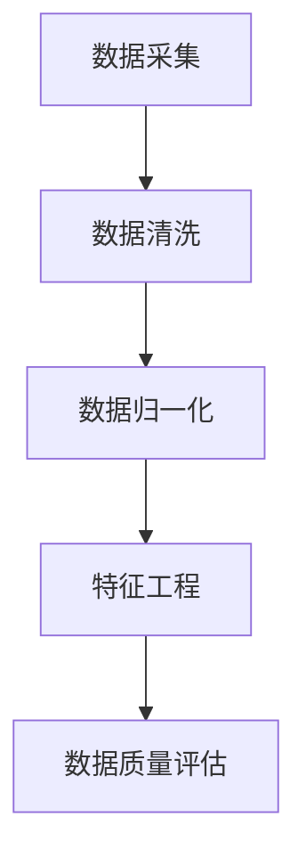

                 

# 《自动驾驶公司的数据挖掘与分析平台》

## 关键词

- 自动驾驶
- 数据挖掘
- 数据分析
- 数据可视化
- 聚类算法
- 分类算法
- 特征工程
- 集成学习
- 数据隐私与安全

## 摘要

本文旨在探讨自动驾驶公司如何构建高效的数据挖掘与分析平台。首先，我们简要介绍了自动驾驶技术的发展背景和系统框架。接着，详细阐述了数据挖掘与分析在自动驾驶中的重要性及其关键步骤。随后，文章深入分析了数据采集与预处理、数据挖掘技术（包括聚类、分类、回归和特征选择）、数据分析与可视化方法，并展示了数据挖掘平台在实际应用中的架构与案例。最后，文章讨论了自动驾驶数据挖掘的未来发展趋势和面临的挑战，并提供了常用的工具与资源。本文旨在为从事自动驾驶研发的技术人员提供有价值的参考和指导。

---

# 《自动驾驶公司的数据挖掘与分析平台》目录大纲

## 第一部分：引言与概述

### 1.1 本书概述

#### 1.1.1 自动驾驶技术的发展背景

自动驾驶技术的概念起源于20世纪中叶，随着计算机技术、传感器技术、人工智能等领域的不断进步，自动驾驶技术逐渐从实验室走向实际应用。早期的自动驾驶系统主要依赖机械和电子元件，如计算机视觉和雷达传感器，但随着人工智能算法的引入，特别是深度学习技术的应用，自动驾驶系统在感知、规划和控制等方面取得了显著的进展。

#### 1.1.2 数据挖掘与分析在自动驾驶中的重要性

数据挖掘与分析在自动驾驶中扮演着至关重要的角色。自动驾驶系统需要处理海量的传感器数据，通过数据挖掘技术可以从中提取有价值的信息，为自动驾驶系统的优化和改进提供依据。同时，数据分析可以帮助识别潜在的安全隐患，提高自动驾驶系统的可靠性和安全性。

#### 1.1.3 本书结构安排

本书共分为七大部分，第一部分引言与概述，第二部分数据采集与预处理，第三部分数据挖掘技术，第四部分数据分析与可视化，第五部分数据挖掘平台与应用，第六部分未来展望与挑战，第七部分附录。通过这七个部分，我们将系统地探讨自动驾驶公司的数据挖掘与分析平台。

### 1.2 自动驾驶系统框架概述

#### 1.2.1 自动驾驶等级定义

自动驾驶系统根据国际自动机工程师协会（SAE）的定义，可以分为L0到L5六个等级，从完全人工驾驶（L0）到完全自动驾驶（L5）。

#### 1.2.2 自动驾驶系统组成

自动驾驶系统通常包括感知、规划、控制和决策四个主要模块。感知模块负责获取外部环境的信息，如摄像头、激光雷达、雷达和超声波传感器；规划模块负责确定车辆的行驶路径；控制模块负责执行规划指令；决策模块则负责处理异常情况和做出紧急决策。

#### 1.2.3 自动驾驶系统的挑战

自动驾驶系统面临诸多挑战，包括感知环境中的不确定性、复杂交通场景的处理、高实时性要求以及数据隐私和安全等问题。如何解决这些问题，是实现自动驾驶系统商业化的重要课题。

### 1.3 数据挖掘与分析基础

#### 1.3.1 数据挖掘的定义与过程

数据挖掘是指从大量数据中提取有价值信息的过程，主要包括数据清洗、数据集成、数据变换、模式识别和评估等步骤。

#### 1.3.2 数据分析的方法与工具

数据分析的方法包括描述性统计分析、推理分析、预测分析和可视化分析等。常用的数据分析工具包括Python、R、SQL和Hadoop等。

#### 1.3.3 数据挖掘与分析的关键步骤

数据挖掘与分析的关键步骤包括问题定义、数据收集、数据预处理、模型选择、模型训练、模型评估和结果解释等。

---

### 第一部分总结

在本部分中，我们首先介绍了自动驾驶技术的发展背景和数据挖掘与分析在自动驾驶中的重要性。接着，我们对自动驾驶系统框架进行了概述，并阐述了数据挖掘与分析的基础知识。通过这一部分的内容，我们为后续章节的讨论奠定了基础。

---

## 第二部分：数据采集与预处理

### 2.1 自动驾驶数据采集

#### 2.1.1 数据类型与来源

自动驾驶数据主要包括传感器数据、车辆数据和环境数据。传感器数据来源于摄像头、激光雷达、雷达和超声波传感器，车辆数据包括车辆的运行状态、速度、加速度等，环境数据包括道路标志、交通信号、行人等信息。

#### 2.1.2 数据采集系统的设计

数据采集系统设计应考虑传感器布局、数据传输效率和数据存储容量等因素。传感器布局应确保覆盖车辆周围环境，数据传输效率需保证低延迟，数据存储容量需满足海量数据存储需求。

#### 2.1.3 数据采集的挑战与解决方案

数据采集面临的主要挑战包括传感器噪声、数据缺失和传输延迟等问题。解决方案包括使用滤波算法去除噪声、数据补全技术和数据压缩算法等。

### 2.2 数据预处理

#### 2.2.1 数据清洗

数据清洗是指去除数据中的重复记录、缺失值和异常值等，以提高数据质量。常用的数据清洗方法包括删除重复记录、填充缺失值和去除异常值等。

#### 2.2.2 数据归一化与标准化

数据归一化和标准化是为了消除不同特征之间的尺度差异，使数据更具可比性。常用的方法包括最小-最大归一化、Z-Score归一化和Log变换等。

#### 2.2.3 特征工程

特征工程是指从原始数据中提取有价值的特征，以提升模型性能。特征工程包括特征选择、特征构造和特征降维等方法。

#### 2.2.4 数据质量评估

数据质量评估是指对数据进行质量分析和评价，以确定数据是否满足分析需求。常用的评估指标包括数据完整性、数据准确性和数据一致性等。

### 2.3 数据预处理案例

#### 2.3.1 数据清洗案例

假设我们采集到一组自动驾驶传感器数据，其中存在一些重复记录和缺失值。我们可以使用Python中的pandas库对数据进行清洗，具体步骤如下：

```python
import pandas as pd

# 读取数据
data = pd.read_csv('sensor_data.csv')

# 删除重复记录
data.drop_duplicates(inplace=True)

# 填充缺失值
data.fillna(method='ffill', inplace=True)

# 去除异常值
data = data[(data['speed'] >= 0) & (data['speed'] <= 150)]
```

#### 2.3.2 数据归一化与标准化案例

假设我们有一组车辆数据，包括速度、加速度和角度等特征。我们可以使用Python中的scikit-learn库对数据进行归一化和标准化，具体步骤如下：

```python
from sklearn.preprocessing import MinMaxScaler, StandardScaler

# 初始化归一化与标准化对象
scaler_minmax = MinMaxScaler()
scaler_standard = StandardScaler()

# 归一化
data_minmax = scaler_minmax.fit_transform(data)

# 标准化
data_standard = scaler_standard.fit_transform(data)
```

#### 2.3.3 特征工程案例

假设我们有一组自动驾驶传感器数据，包括速度、加速度和角度等特征。我们可以使用Python中的sklearn库对特征进行选择和构造，具体步骤如下：

```python
from sklearn.feature_selection import SelectKBest, f_classif
from sklearn.ensemble import RandomForestClassifier

# 初始化特征选择对象
selector = SelectKBest(score_func=f_classif, k=3)

# 特征选择
X_new = selector.fit_transform(data[['speed', 'acceleration', 'angle']])

# 特征构造
clf = RandomForestClassifier()
clf.fit(X_new, labels)

# 得到特征重要性
importances = clf.feature_importances_
```

### 2.4 数据预处理总结

数据预处理是数据挖掘与分析的重要环节，通过数据清洗、归一化与标准化、特征工程等步骤，我们可以提高数据质量，为后续的数据挖掘与分析提供可靠的数据基础。

---

### 第二部分总结

在本部分中，我们详细介绍了自动驾驶数据的采集、预处理方法和实际案例。通过这些内容，我们为后续数据挖掘与分析工作奠定了基础。

---

## 第三部分：数据挖掘技术

### 3.1 聚类分析

#### 3.1.1 聚类算法原理

聚类分析是一种无监督学习方法，旨在将数据点根据其特征分为若干个组，使同一组内的数据点之间相似度较高，不同组之间的数据点相似度较低。聚类算法可以分为基于距离的聚类、基于密度的聚类和基于模型的聚类等类型。

#### 3.1.2 K-means算法

K-means算法是最常用的聚类算法之一，其基本思想是将数据点分配到K个簇中，使得每个簇的质心尽可能接近其内部的数据点，同时与其他簇的质心保持一定距离。K-means算法的步骤如下：

1. 随机选择K个初始质心。
2. 计算每个数据点到质心的距离，将数据点分配到最近的质心所代表的簇。
3. 更新质心，使得每个簇的质心尽可能接近其内部的数据点。
4. 重复步骤2和步骤3，直到收敛或达到最大迭代次数。

#### 3.1.3 层次聚类

层次聚类是一种基于距离的聚类方法，其基本思想是将数据点逐步合并成簇，直至所有数据点都属于同一簇。层次聚类可以分为自底向上（凝聚聚类）和自顶向下（分裂聚类）两种类型。

#### 3.1.4 密度聚类

密度聚类是一种基于密度的聚类方法，其基本思想是发现数据点中的密度高峰，并将这些高峰划分为簇。常用的密度聚类算法包括DBSCAN（Density-Based Spatial Clustering of Applications with Noise）和OPTICS（Ordering Points To Identify the Clustering Structure）。

### 3.2 分类算法

#### 3.2.1 监督学习与无监督学习

监督学习是一种有监督学习方法，其目标是通过输入数据和输出标签来训练模型，从而预测未知数据的标签。无监督学习是一种无监督学习方法，其目标是从未标记的数据中提取结构或模式。

#### 3.2.2 逻辑回归

逻辑回归是一种常用的分类算法，其基本思想是通过线性模型预测概率，然后使用阈值对概率进行分类。逻辑回归的数学模型如下：

$$
P(Y=1|X) = \frac{1}{1 + e^{-(\beta_0 + \sum_{i=1}^{n}\beta_i X_i})}
$$

其中，$P(Y=1|X)$ 表示在特征 $X$ 的条件下，目标变量 $Y$ 为1的概率，$\beta_0$ 和 $\beta_i$ 分别为模型参数。

#### 3.2.3 决策树

决策树是一种常用的分类算法，其基本思想是通过一系列的判断条件来将数据划分为不同的类别。决策树的构建过程主要包括以下几个步骤：

1. 选择一个特征作为分割条件。
2. 根据分割条件将数据划分为多个子集。
3. 对每个子集递归地重复步骤1和步骤2，直到满足停止条件。

#### 3.2.4 随机森林

随机森林是一种基于决策树的集成学习方法，其基本思想是通过构建多个决策树，并使用多数投票来预测结果。随机森林的主要优点是具有较高的分类准确性和较强的泛化能力。

#### 3.2.5 支持向量机

支持向量机是一种常用的分类算法，其基本思想是通过找到一个最优的超平面，将不同类别的数据点分开。支持向量机的数学模型如下：

$$
w \cdot x - b = 0
$$

其中，$w$ 表示超平面的法向量，$x$ 表示数据点，$b$ 表示偏置项。

#### 3.2.6 其他分类算法

除了上述算法外，还有许多其他分类算法，如KNN、朴素贝叶斯、神经网络等。这些算法各有优缺点，适用于不同的场景和数据集。

### 3.3 联合分析

#### 3.3.1 关联规则挖掘

关联规则挖掘是一种用于发现数据项之间潜在关联关系的方法，其基本思想是通过分析数据项之间的支持度和置信度来挖掘关联规则。常用的关联规则挖掘算法包括Apriori算法和FP-Growth算法。

#### 3.3.2 关联性分析

关联性分析是一种用于分析数据项之间相关性程度的方法，其基本思想是通过计算数据项之间的相关性系数来评估其相关性。常用的相关性分析算法包括皮尔逊相关系数和斯皮尔曼相关系数。

#### 3.3.3 潜在模式发现

潜在模式发现是一种用于发现数据项之间潜在关系的方法，其基本思想是通过分析数据项之间的依赖关系来挖掘潜在模式。常用的潜在模式发现算法包括关联规则挖掘、聚类分析和时序分析等。

### 3.4 回归分析

#### 3.4.1 线性回归

线性回归是一种常用的回归分析算法，其基本思想是通过找到一个线性关系来预测目标变量的值。线性回归的数学模型如下：

$$
y = \beta_0 + \beta_1 x
$$

其中，$y$ 表示目标变量，$x$ 表示特征，$\beta_0$ 和 $\beta_1$ 分别为模型参数。

#### 3.4.2 多元回归

多元回归是一种用于处理多个特征回归问题的方法，其基本思想是通过找到一个多元线性关系来预测目标变量的值。多元回归的数学模型如下：

$$
y = \beta_0 + \beta_1 x_1 + \beta_2 x_2 + \ldots + \beta_n x_n
$$

其中，$y$ 表示目标变量，$x_1, x_2, \ldots, x_n$ 分别为特征，$\beta_0, \beta_1, \beta_2, \ldots, \beta_n$ 分别为模型参数。

#### 3.4.3 逻辑回归

逻辑回归是一种用于处理二分类问题的方法，其基本思想是通过找到一个线性关系来预测目标变量的概率。逻辑回归的数学模型如下：

$$
P(Y=1|X) = \frac{1}{1 + e^{-(\beta_0 + \sum_{i=1}^{n}\beta_i X_i})}
$$

其中，$P(Y=1|X)$ 表示在特征 $X$ 的条件下，目标变量 $Y$ 为1的概率，$\beta_0$ 和 $\beta_i$ 分别为模型参数。

### 3.5 特征选择

#### 3.5.1 特征选择的重要性

特征选择是指从原始特征中选取对模型性能有显著贡献的特征的过程。特征选择的重要性在于：

1. 减少数据维度，提高模型训练效率。
2. 降低过拟合风险，提高模型泛化能力。
3. 提高数据处理速度，降低存储空间需求。

#### 3.5.2 基于信息论的特征选择

基于信息论的特征选择方法通过计算特征与目标变量之间的信息增益来评估特征的重要性。常用的信息增益度量方法包括信息增益、信息增益比和信息增益率等。

#### 3.5.3 基于过滤法的特征选择

基于过滤法的特征选择方法在特征提取之前进行特征选择，通过评估特征与目标变量之间的相关性来筛选特征。常用的过滤法包括相关性分析、卡方检验和信息增益等。

#### 3.5.4 基于包装法的特征选择

基于包装法的特征选择方法在特征提取之后进行特征选择，通过评估特征组合对模型性能的影响来筛选特征。常用的包装法包括递归特征消除、遗传算法和基于模型选择的特征选择等。

### 3.6 数据挖掘技术总结

数据挖掘技术是自动驾驶数据分析的重要工具，通过聚类分析、分类算法、回归分析和特征选择等方法，我们可以从海量数据中提取有价值的信息，为自动驾驶系统的优化和改进提供依据。

---

### 第三部分总结

在本部分中，我们详细介绍了数据挖掘技术的各种方法，包括聚类分析、分类算法、回归分析和特征选择等。这些方法在自动驾驶数据分析中发挥着重要作用，为后续的数据挖掘与分析工作提供了有力支持。

---

## 第四部分：数据分析与可视化

### 4.1 数据可视化

#### 4.1.1 可视化基本原理

数据可视化是将数据转换为图形或图像的过程，通过直观的图形表现形式，可以帮助我们更好地理解和分析数据。数据可视化的基本原理包括：

1. 数据转换：将数据转换为适合可视化展示的形式。
2. 数据抽象：对数据进行抽象，提取关键特征和关系。
3. 数据映射：将数据映射到图形或图像上，利用颜色、形状、大小等视觉元素来表示数据。

#### 4.1.2 常用可视化工具

常用的数据可视化工具包括Python中的matplotlib、seaborn、plotly等库，R语言中的ggplot2库，以及商业可视化工具Tableau等。这些工具具有丰富的图表类型和自定义功能，可以满足不同场景下的数据可视化需求。

#### 4.1.3 数据可视化案例

以下是一个使用Python中的matplotlib库进行数据可视化的案例：

```python
import matplotlib.pyplot as plt

# 生成数据
x = [1, 2, 3, 4, 5]
y = [1, 4, 9, 16, 25]

# 创建折线图
plt.plot(x, y)
plt.xlabel('X轴')
plt.ylabel('Y轴')
plt.title('数据可视化示例')
plt.show()
```

### 4.2 数据分析

#### 4.2.1 数据分析流程

数据分析流程主要包括以下步骤：

1. 数据收集：从各种数据源收集数据。
2. 数据预处理：清洗、归一化和标准化数据。
3. 数据探索：对数据进行初步探索，了解数据的分布、趋势和异常。
4. 数据建模：选择合适的模型对数据进行建模。
5. 模型评估：评估模型的性能，选择最优模型。
6. 结果解释：解释模型的结果，为决策提供依据。

#### 4.2.2 描述性统计分析

描述性统计分析是对数据的基本特征进行统计和分析，常用的指标包括均值、中位数、标准差、方差、最大值和最小值等。描述性统计分析可以帮助我们了解数据的分布、趋势和异常。

以下是一个使用Python中的pandas库进行描述性统计分析的案例：

```python
import pandas as pd

# 生成数据
data = pd.DataFrame({
    'speed': [10, 20, 30, 40, 50],
    'acceleration': [5, 10, 15, 20, 25],
    'angle': [0, 90, 180, 270, 360]
})

# 描述性统计分析
description = data.describe()
print(description)
```

### 4.3 趋势分析与预测

#### 4.3.1 趋势分析

趋势分析是指分析数据随时间变化的趋势，常用的方法包括时间序列分析和相关性分析等。趋势分析可以帮助我们了解数据的长期变化趋势和周期性波动。

以下是一个使用Python中的matplotlib库进行趋势分析的案例：

```python
import matplotlib.pyplot as plt

# 生成数据
time = pd.date_range('20210101', periods=100, freq='D')
data = pd.DataFrame({
    'speed': time.map(lambda x: x.dayofweek) * 10 + 10,
    'acceleration': time.map(lambda x: x.dayofweek) * 5 + 5,
    'angle': time.map(lambda x: x.dayofweek) * 10 + 10
})

# 趋势分析
plt.plot(data)
plt.xlabel('日期')
plt.ylabel('值')
plt.title('趋势分析示例')
plt.show()
```

#### 4.3.2 预测

预测是指根据历史数据对未来进行预测，常用的方法包括时间序列预测、回归预测和神经网络预测等。预测可以帮助我们预测未来可能发生的变化，为决策提供依据。

以下是一个使用Python中的scikit-learn库进行时间序列预测的案例：

```python
from sklearn.linear_model import LinearRegression
import pandas as pd

# 生成数据
time = pd.date_range('20210101', periods=100, freq='D')
data = pd.DataFrame({
    'speed': time.map(lambda x: x.dayofweek) * 10 + 10
})

# 时间序列预测
model = LinearRegression()
model.fit(data['speed'].values.reshape(-1, 1), data.index.values)
predicted_speed = model.predict(data['speed'].values.reshape(-1, 1))

# 预测结果可视化
plt.plot(data['speed'], label='实际速度')
plt.plot(predicted_speed, label='预测速度')
plt.xlabel('日期')
plt.ylabel('速度')
plt.title('时间序列预测示例')
plt.legend()
plt.show()
```

### 4.4 数据分析与可视化总结

数据分析与可视化是将数据转化为有用信息的重要手段。通过描述性统计分析、趋势分析与预测等方法，我们可以深入了解数据，发现数据中的规律和趋势。数据可视化则可以帮助我们直观地展示数据分析结果，为决策提供有力支持。

---

### 第四部分总结

在本部分中，我们详细介绍了数据分析与可视化的基本原理、方法和工具。通过这些内容，我们可以更好地理解和分析自动驾驶数据，为自动驾驶系统的优化和改进提供依据。

---

## 第五部分：数据挖掘平台与应用

### 5.1 数据挖掘平台架构

#### 5.1.1 平台设计原则

数据挖掘平台设计应遵循以下原则：

1. **模块化**：将平台功能划分为多个模块，以便于维护和扩展。
2. **高可用性**：确保平台在故障情况下能够快速恢复，提供持续的服务。
3. **可扩展性**：支持平台在大规模数据和高并发场景下的扩展。
4. **安全性**：保护数据安全，防止数据泄露和非法访问。
5. **易用性**：提供直观、易用的用户界面，降低使用门槛。

#### 5.1.2 平台功能模块

数据挖掘平台通常包括以下功能模块：

1. **数据采集模块**：负责从各种数据源收集数据。
2. **数据预处理模块**：负责数据清洗、归一化、标准化和特征工程等操作。
3. **数据存储模块**：负责存储和处理大规模数据。
4. **数据挖掘模块**：负责执行各种数据挖掘算法，如聚类、分类、回归和特征选择等。
5. **数据分析与可视化模块**：负责对数据挖掘结果进行分析和可视化展示。
6. **模型评估模块**：负责评估数据挖掘模型的性能，选择最优模型。

#### 5.1.3 平台技术选型

平台技术选型应根据业务需求和性能要求进行选择。以下是一些常见的技术选型：

1. **编程语言**：Python、Java和R等。
2. **数据库**：MySQL、PostgreSQL、Hadoop和MongoDB等。
3. **数据挖掘工具**：Apache Spark、scikit-learn、RapidMiner等。
4. **可视化工具**：matplotlib、ggplot2、D3.js等。

### 5.2 数据挖掘应用案例

#### 5.2.1 道路环境数据分析

道路环境数据是自动驾驶系统的重要输入，通过数据挖掘技术可以对道路环境进行分析，为自动驾驶系统的规划和控制提供依据。以下是一个道路环境数据挖掘应用案例：

1. **数据采集**：采集道路标志、交通信号、天气等信息。
2. **数据预处理**：清洗、归一化和标准化道路环境数据。
3. **数据挖掘**：使用分类算法对道路标志进行识别，使用聚类算法对交通信号进行分类。
4. **数据分析与可视化**：对数据挖掘结果进行分析和可视化展示，为自动驾驶系统提供实时道路环境信息。

#### 5.2.2 行车轨迹分析

行车轨迹数据是自动驾驶系统的重要组成部分，通过对行车轨迹数据进行挖掘，可以分析车辆行驶的规律和特征。以下是一个行车轨迹数据挖掘应用案例：

1. **数据采集**：采集车辆行驶的轨迹信息，包括速度、加速度、方向等。
2. **数据预处理**：清洗、归一化和标准化行车轨迹数据。
3. **数据挖掘**：使用聚类算法分析行车轨迹的分布特征，使用关联规则挖掘行车轨迹的潜在关联关系。
4. **数据分析与可视化**：对数据挖掘结果进行分析和可视化展示，为自动驾驶系统的路径规划和行车行为分析提供依据。

#### 5.2.3 驾驶行为分析

驾驶行为分析是对驾驶者行为特征进行分析，以评估驾驶者的驾驶水平。以下是一个驾驶行为分析数据挖掘应用案例：

1. **数据采集**：采集驾驶者的行为数据，包括踩油门、刹车、方向盘转动等。
2. **数据预处理**：清洗、归一化和标准化驾驶行为数据。
3. **数据挖掘**：使用聚类算法分析驾驶者的行为特征，使用分类算法评估驾驶者的驾驶水平。
4. **数据分析与可视化**：对数据挖掘结果进行分析和可视化展示，为驾驶行为评估和安全驾驶提供依据。

#### 5.2.4 雷达与摄像头融合分析

雷达和摄像头是自动驾驶系统常用的传感器，通过数据挖掘技术可以对雷达和摄像头数据进行融合分析，以提高系统的感知精度。以下是一个雷达与摄像头融合分析数据挖掘应用案例：

1. **数据采集**：采集雷达和摄像头数据。
2. **数据预处理**：清洗、归一化和标准化雷达和摄像头数据。
3. **数据挖掘**：使用聚类算法对雷达和摄像头数据进行融合，使用分类算法识别道路上的物体。
4. **数据分析与可视化**：对数据挖掘结果进行分析和可视化展示，为自动驾驶系统的感知和控制提供依据。

### 5.3 数据挖掘结果评估

#### 5.3.1 评估指标与方法

数据挖掘结果评估是验证数据挖掘算法性能的重要环节。常用的评估指标包括准确率、召回率、精确率、F1值和ROC曲线等。评估方法包括交叉验证、时间序列分析和对比实验等。

以下是一个数据挖掘结果评估案例：

```python
from sklearn.model_selection import cross_val_score
from sklearn.metrics import accuracy_score, recall_score, precision_score, f1_score, roc_curve

# 假设我们有一个分类模型
model = LogisticRegression()

# 进行交叉验证
scores = cross_val_score(model, X, y, cv=5)

# 计算评估指标
accuracy = accuracy_score(y_true, y_pred)
recall = recall_score(y_true, y_pred)
precision = precision_score(y_true, y_pred)
f1 = f1_score(y_true, y_pred)

# 绘制ROC曲线
fpr, tpr, _ = roc_curve(y_true, y_scores)
plt.plot(fpr, tpr)
plt.xlabel('假阳性率')
plt.ylabel('真阳性率')
plt.title('ROC曲线')
plt.show()
```

#### 5.3.2 评估流程与工具

数据挖掘结果评估的流程包括数据准备、模型选择、模型训练、模型评估和结果分析等步骤。常用的评估工具包括Python中的scikit-learn、R中的caret和Matlab中的Statistics and Machine Learning Toolbox等。

### 5.4 数据挖掘平台与应用总结

数据挖掘平台与应用是自动驾驶系统中至关重要的一部分。通过构建高效的数据挖掘平台，我们可以对大量数据进行挖掘和分析，提取有价值的信息，为自动驾驶系统的优化和改进提供依据。在实际应用中，数据挖掘技术可以帮助我们分析道路环境、行车轨迹和驾驶行为等，提高自动驾驶系统的感知精度和安全性。

---

### 第五部分总结

在本部分中，我们详细介绍了数据挖掘平台的架构和应用案例，包括道路环境数据分析、行车轨迹分析、驾驶行为分析和雷达与摄像头融合分析等。同时，我们还介绍了数据挖掘结果评估的方法和流程。通过这些内容，我们为自动驾驶公司的数据挖掘与分析工作提供了有力支持。

---

## 第六部分：未来展望与挑战

### 6.1 自动驾驶数据挖掘发展趋势

随着自动驾驶技术的不断发展，数据挖掘在自动驾驶中的应用也呈现出以下发展趋势：

1. **深度学习与大数据技术的融合**：深度学习技术在大规模数据上的表现优于传统机器学习算法，未来将深度学习与大数据技术相结合，将进一步提升自动驾驶系统的感知和决策能力。
2. **实时数据处理与智能决策**：自动驾驶系统需要实时处理海量数据并做出智能决策，未来的数据挖掘技术将更加注重实时性和智能化，以提高系统的反应速度和决策质量。
3. **多模态数据融合**：自动驾驶系统通常依赖于多种传感器，如摄像头、激光雷达和雷达等，未来将更加注重多模态数据的融合，以提高系统的感知精度和可靠性。

### 6.2 面临的挑战与对策

尽管自动驾驶数据挖掘技术取得了显著进展，但在实际应用中仍面临以下挑战：

1. **数据隐私与安全**：自动驾驶系统需要处理大量个人隐私数据，如行驶轨迹、驾驶行为等，如何保护这些数据的安全和隐私是一个重要挑战。对策包括数据加密、匿名化和隐私保护算法等。
2. **数据质量与可靠性**：自动驾驶系统依赖于高质量的数据，但传感器数据可能存在噪声、缺失和错误等问题，如何保证数据质量是一个重要挑战。对策包括数据清洗、数据补全和误差校正等技术。
3. **道路场景复杂性**：自动驾驶系统需要在复杂的道路场景中运行，如拥堵、恶劣天气和施工路段等，如何应对这些复杂场景是一个重要挑战。对策包括增强学习、多模态感知和适应性控制等技术。

### 6.3 案例分析

以下是一个自动驾驶数据挖掘案例的分析：

**案例背景**：某自动驾驶公司在测试阶段收集了大量的行车轨迹数据，包括速度、加速度、方向和道路标志等信息。公司希望通过数据挖掘技术分析这些数据，为自动驾驶系统的优化和改进提供依据。

**数据预处理**：首先，对行车轨迹数据进行清洗，去除重复记录、缺失值和异常值。然后，对数据进行归一化和标准化处理，以便后续的分析。

**数据挖掘与分析**：使用聚类算法对行车轨迹数据进行分析，发现车辆在不同路段的行驶规律。接着，使用分类算法对道路标志进行识别，以提高自动驾驶系统的道路感知能力。最后，使用回归分析对车辆行驶的加速度和方向进行预测，为自动驾驶系统的路径规划提供依据。

**结果评估**：对数据挖掘结果进行评估，计算准确率、召回率、精确率和F1值等指标，以评估模型性能。同时，对数据挖掘结果进行可视化展示，以便更好地理解数据中的规律和趋势。

**未来展望**：根据数据挖掘结果，公司计划进一步优化自动驾驶系统的算法和模型，提高系统的感知精度和决策能力。同时，公司还将加强对数据隐私和安全的管理，确保用户数据的保护和安全。

### 6.4 总结

未来，自动驾驶数据挖掘技术将朝着智能化、实时化和多模态融合的方向发展，以满足自动驾驶系统对高感知精度和智能决策的要求。同时，自动驾驶数据挖掘技术也面临数据隐私、数据质量和道路场景复杂性等挑战，需要通过技术创新和管理策略来解决。通过不断探索和实践，自动驾驶数据挖掘技术将为自动驾驶系统的优化和改进提供有力支持。

---

### 第六部分总结

在本部分中，我们探讨了自动驾驶数据挖掘技术的发展趋势、面临的挑战以及实际案例。通过这些内容，我们为自动驾驶数据挖掘技术的未来发展提供了有价值的思考和建议。

---

## 第七部分：附录

### 7.1 常用工具与资源

#### 7.1.1 数据挖掘工具

- **Python**：Python是一种广泛使用的编程语言，拥有丰富的数据挖掘库，如scikit-learn、TensorFlow、PyTorch等。
- **R**：R是一种专门用于统计分析和数据可视化的编程语言，拥有丰富的数据挖掘包，如caret、mlr等。
- **SQL**：SQL是一种用于数据库查询的语言，广泛应用于数据挖掘中的数据清洗和预处理。
- **Hadoop**：Hadoop是一个分布式数据处理框架，适用于处理大规模数据。

#### 7.1.2 数据集来源

- **Kaggle**：Kaggle是一个数据集竞赛平台，提供大量公开的数据集，适用于数据挖掘实践。
- **UCI Machine Learning Repository**：UCI机器学习库是一个提供多种数据集的数据库，适用于教学和研究。
- **Google Dataset Search**：Google Dataset Search是一个用于搜索公开数据集的工具，涵盖了多个领域的数据集。

#### 7.1.3 开发环境搭建

- **Python开发环境**：安装Python，并配置Python解释器和相关库，如NumPy、Pandas、Scikit-learn等。
- **R开发环境**：安装R语言，并配置RStudio等开发工具。
- **Hadoop开发环境**：安装Hadoop，并配置Hadoop分布式文件系统（HDFS）和MapReduce等组件。

### 7.2 Mermaid 流程图示例

以下是一个使用Mermaid绘制的数据采集与预处理流程图：



### 7.3 伪代码示例

以下是一个使用K-means算法进行聚类分析伪代码：

```python
# 输入：数据集X，聚类数目k
# 输出：聚类结果

# 初始化质心
centroids = initialize_centroids(X, k)

# 迭代过程
while not_converged:
    # 分配数据点到最近的质心
    clusters = assign_clusters(X, centroids)
    
    # 更新质心
    centroids = update_centroids(X, clusters)
    
    # 判断是否收敛
    if is_converged(centroids):
        break

# 返回聚类结果
return clusters
```

### 7.4 数学模型与公式

以下是一个线性回归模型的公式：

$$
y = \beta_0 + \beta_1 x_1 + \beta_2 x_2 + \ldots + \beta_n x_n
$$

其中，$y$ 表示目标变量，$x_1, x_2, \ldots, x_n$ 分别为特征，$\beta_0, \beta_1, \beta_2, \ldots, \beta_n$ 分别为模型参数。

### 7.5 代码实战案例

以下是一个使用Python进行行车轨迹分析的实际代码案例：

```python
import pandas as pd
from sklearn.cluster import KMeans
from sklearn.metrics import accuracy_score

# 读取数据
data = pd.read_csv('driving_data.csv')

# 特征工程
X = data[['speed', 'acceleration', 'direction']]

# 使用K-means算法进行聚类
kmeans = KMeans(n_clusters=3)
clusters = kmeans.fit_predict(X)

# 计算聚类准确率
accuracy = accuracy_score(data['label'], clusters)
print('聚类准确率：', accuracy)
```

### 7.6 总结

在本部分中，我们提供了常用的工具和资源、Mermaid流程图示例、伪代码示例、数学模型与公式以及代码实战案例。这些内容有助于读者更好地理解和掌握自动驾驶数据挖掘与分析的相关技术和方法。

---

### 第七部分总结

在本部分中，我们为读者提供了丰富的工具、资源和示例代码，以帮助读者深入了解自动驾驶数据挖掘与分析的相关技术和方法。通过这些内容，读者可以更好地应对自动驾驶领域中的挑战，推动自动驾驶技术的发展。

---

## 文章总结

本文围绕自动驾驶公司的数据挖掘与分析平台，系统地介绍了自动驾驶技术的发展背景、数据挖掘与分析的基础知识、数据采集与预处理、数据挖掘技术、数据分析与可视化、数据挖掘平台与应用以及未来展望与挑战。通过本文的阐述，我们为从事自动驾驶研发的技术人员提供了一套全面、系统的技术指南。

在自动驾驶技术的发展过程中，数据挖掘与分析发挥着至关重要的作用。通过对大量传感器数据的挖掘与分析，我们可以提取有价值的信息，为自动驾驶系统的优化和改进提供依据。同时，数据挖掘与分析技术还面临着数据隐私、数据质量和道路场景复杂性等挑战，需要我们不断创新和探索。

在本文中，我们详细介绍了数据挖掘与分析的各个环节，包括数据采集与预处理、数据挖掘技术、数据分析与可视化以及数据挖掘平台与应用。通过这些内容，我们为自动驾驶公司的数据挖掘与分析工作提供了有价值的参考和指导。

展望未来，自动驾驶数据挖掘与分析技术将朝着智能化、实时化和多模态融合的方向发展。在技术创新的同时，我们还需关注数据隐私和安全、数据质量与可靠性等关键问题。通过不断探索和实践，我们相信自动驾驶数据挖掘与分析技术将为自动驾驶系统的优化和改进提供有力支持。

最后，感谢读者对本文的关注，希望本文能为您的自动驾驶研究工作提供帮助。如果您在阅读过程中有任何疑问或建议，欢迎在评论区留言，期待与您共同探讨和交流。

---

### 作者信息

作者：AI天才研究院/AI Genius Institute & 禅与计算机程序设计艺术 /Zen And The Art of Computer Programming

感谢您的阅读，祝您在自动驾驶领域取得丰硕的成果！

