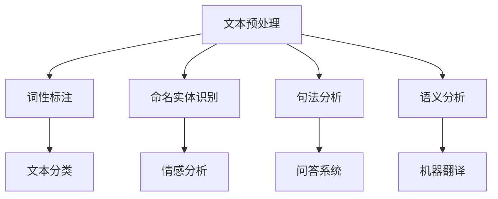

                 

# 《自然语言处理在智能写作中的应用》

> **关键词**：自然语言处理、智能写作、文本生成、文本分类、语义分析、情感分析、对话系统

> **摘要**：本文深入探讨了自然语言处理（NLP）在智能写作领域的应用。首先，我们从基础概念入手，介绍了NLP的定义、历史发展及其应用领域。接着，详细讲解了文本预处理、核心算法和模型，为智能写作的技术基础打下基础。然后，我们重点介绍了文本生成模型、文本分类与推荐、语义分析和情感分析等关键技术。最后，通过具体应用案例展示了智能写作在实际场景中的强大能力。本文旨在为读者提供一份全面、深入的智能写作技术指南。

## 第一部分：自然语言处理基础

### 第1章：自然语言处理概述

#### 1.1 自然语言处理的定义与历史发展

自然语言处理（Natural Language Processing，简称NLP）是计算机科学、人工智能和语言学领域的交叉学科。它旨在让计算机理解和处理人类自然语言，包括语音、文本和手写文字。NLP的目标是使计算机能够执行各种任务，如自动翻译、文本分类、命名实体识别、情感分析等。

自然语言处理的历史可以追溯到20世纪50年代。当时，科学家们首次提出了机器翻译的想法。自那时以来，NLP技术经历了多个发展阶段。早期的研究主要集中于规则驱动的方法，这些方法依赖于人工编写的语法规则和词典。然而，随着计算能力的提升和数据量的爆炸式增长，统计方法和基于深度学习的方法逐渐成为主流。

#### 1.2 自然语言处理的应用领域

自然语言处理技术在许多领域都取得了显著的成果。以下是一些主要的应用领域：

1. **机器翻译**：将一种自然语言翻译成另一种自然语言，如Google翻译。
2. **文本分类**：将文本数据分类到不同的类别中，如垃圾邮件过滤。
3. **命名实体识别**：从文本中识别出人名、地名、机构名等实体，如维基百科中的实体识别。
4. **情感分析**：分析文本中的情感倾向，如社交媒体情感分析。
5. **问答系统**：让计算机回答用户提出的问题，如Apple的Siri。

#### 1.3 自然语言处理的核心任务

自然语言处理的核心任务包括以下几个方面：

1. **文本预处理**：对原始文本进行处理，如去除停用词、标点符号、进行词向量化等。
2. **词性标注**：为文本中的每个单词分配一个词性，如名词、动词、形容词等。
3. **命名实体识别**：识别文本中的特定实体，如人名、地名、机构名等。
4. **句法分析**：分析句子的结构，如词法分析、词组分析、句子成分分析等。
5. **语义分析**：理解文本中的含义，如语义角色标注、语义消歧等。

### Mermaid 流程图

以下是自然语言处理核心任务的Mermaid流程图：



#### 1.4 本章小结

本章介绍了自然语言处理的定义、历史发展、应用领域和核心任务。通过对本章的学习，读者可以初步了解自然语言处理的基本概念和框架，为后续章节的学习打下基础。

---

### 第2章：文本预处理

文本预处理是自然语言处理（NLP）中至关重要的一步。它是指对原始文本进行一系列处理，以消除噪声、提高文本质量，从而为后续的文本分析和理解奠定基础。文本预处理通常包括以下几个步骤：文本清洗、词向量化、词性标注和命名实体识别。

#### 2.1 文本清洗

文本清洗是指去除文本中的无用信息，以提高文本质量。以下是一些常见的文本清洗步骤：

1. **去除停用词**：停用词（Stop Words）是指对文本理解没有贡献的常见单词，如“的”、“是”、“在”等。去除停用词可以减少计算量，提高模型性能。
2. **去除标点符号**：标点符号（Punctuation Marks）通常不会对文本的理解产生实质性影响，因此可以去除。
3. **去除特殊字符**：如HTML标签、URL、电子邮件地址等，这些特殊字符通常不是文本的主要内容。
4. **转换为小写**：将所有文本转换为小写，可以简化处理过程，减少区分大小写的需求。

#### 2.2 词向量化

词向量化（Word Vectorization）是将文本中的单词转换为数值向量，以便计算机能够处理和比较。以下是一些常见的词向量化方法：

1. **One-Hot编码**：将每个单词表示为一个稀疏向量，向量的维度等于词汇表的大小。例如，如果词汇表中有10,000个单词，那么每个单词的向量长度为10,000，其中只有该单词对应的维度为1，其余维度均为0。
2. **TF-IDF**：TF-IDF（Term Frequency-Inverse Document Frequency）是一种基于统计的方法，用于表示单词在文档中的重要程度。TF表示单词在文档中出现的频率，IDF表示单词在所有文档中出现的频率的倒数。TF-IDF可以用于文本分类、信息检索等任务。
3. **Word2Vec**：Word2Vec是一种基于神经网络的词向量化方法，通过学习单词在语境中的分布式表示。Word2Vec分为两种模型：Continuous Bag-of-Words（CBOW）和Skip-Gram。CBOW模型通过上下文窗口中的单词预测中心词，Skip-Gram模型通过中心词预测上下文窗口中的单词。

#### 2.3 词性标注

词性标注（Part-of-Speech Tagging）是为文本中的每个单词分配一个词性，如名词、动词、形容词等。词性标注有助于提高文本理解的准确性，对于许多NLP任务具有重要意义。以下是一些常见的词性标注方法：

1. **基于规则的标注器**：通过预先定义的语法规则和词典进行词性标注。这类标注器通常简单且易于实现，但可能无法处理未知单词或复杂的语法结构。
2. **基于统计的标注器**：通过统计方法，如条件概率模型（如HMM、CRF）或神经网络模型（如LSTM、Transformer），进行词性标注。这类标注器能够处理更复杂的语法结构，但可能需要大量的训练数据和计算资源。

#### 2.4 命名实体识别

命名实体识别（Named Entity Recognition，简称NER）是从文本中识别出特定类型的实体，如人名、地名、机构名等。命名实体识别对于信息提取、知识图谱构建等任务具有重要意义。以下是一些常见的NER方法：

1. **基于规则的NER系统**：通过预先定义的规则和词典进行命名实体识别。这类系统通常简单且易于实现，但可能无法处理复杂的命名实体或新的实体。
2. **基于统计的NER系统**：通过统计方法，如HMM、CRF或神经网络模型（如LSTM、Transformer），进行命名实体识别。这类系统能够处理更复杂的命名实体和新的实体，但可能需要大量的训练数据和计算资源。

#### 2.5 本章小结

本章介绍了文本预处理的重要性和基本步骤，包括文本清洗、词向量化、词性标注和命名实体识别。通过文本预处理，我们可以提高文本质量，为后续的文本分析和理解打下基础。在下一章中，我们将深入探讨自然语言处理的核心算法和模型。

---

### 第3章：自然语言处理核心算法

自然语言处理（NLP）的核心算法和模型是构建智能写作系统的关键。这些算法和模型不仅能够理解和生成自然语言，还能识别和分类文本内容。在本章中，我们将介绍几种主要的NLP算法，包括统计学习方法、机器学习方法、深度学习方法，并讨论它们在智能写作中的应用。

#### 3.1 统计学习方法

统计学习方法是指利用统计学原理来处理自然语言问题的方法。这类方法通常基于概率模型和统计学理论，通过计算文本的特征概率来完成任务。以下是一些常见的统计学习方法：

1. **隐马尔可夫模型（HMM）**：HMM是一种基于状态序列的概率模型，适用于序列数据的建模。在NLP中，HMM常用于语音识别、命名实体识别等任务。HMM模型的主要优点是计算简单，但在处理复杂语法结构时可能效果不佳。

2. **条件随机场（CRF）**：CRF是一种基于概率的图模型，能够处理具有依赖关系的序列数据。在NLP中，CRF常用于词性标注、命名实体识别等任务。CRF模型通过考虑相邻单词之间的关系来提高模型的准确性。

3. **朴素贝叶斯（Naive Bayes）**：朴素贝叶斯是一种基于贝叶斯理论的简单概率分类器，适用于文本分类、情感分析等任务。朴素贝叶斯模型假设特征之间相互独立，因此简单易实现，但可能无法处理复杂的依赖关系。

4. **K最近邻（K-Nearest Neighbors，KNN）**：KNN是一种基于实例的机器学习算法，通过寻找与给定文本最近的K个邻居来预测文本的类别。在NLP中，KNN可以用于文本分类、聚类等任务。

#### 3.2 机器学习方法

机器学习方法是指利用计算机算法来从数据中自动学习规律和模式的方法。与统计学习方法相比，机器学习方法更注重数据的特征提取和模型优化。以下是一些常见的机器学习方法：

1. **支持向量机（Support Vector Machine，SVM）**：SVM是一种基于最大间隔的分类器，通过寻找最佳的超平面来分离不同类别的数据。在NLP中，SVM常用于文本分类、文本聚类等任务。

2. **决策树（Decision Tree）**：决策树是一种树形结构，通过一系列的判断条件将数据划分为不同的类别。在NLP中，决策树可以用于文本分类、信息检索等任务。

3. **随机森林（Random Forest）**：随机森林是一种基于决策树的集成学习方法，通过构建多棵决策树并求取它们的平均预测结果来提高模型的准确性。在NLP中，随机森林可以用于文本分类、情感分析等任务。

4. **提升树（Gradient Boosting Decision Tree，GBDT）**：提升树是一种基于决策树的集成学习方法，通过迭代地优化模型来提高预测准确性。在NLP中，GBDT可以用于文本分类、推荐系统等任务。

#### 3.3 深度学习方法

深度学习方法是指利用多层神经网络来处理大规模数据的方法。与传统的机器学习方法相比，深度学习方法能够自动提取特征，并在各种NLP任务中表现出色。以下是一些常见的深度学习方法：

1. **循环神经网络（Recurrent Neural Network，RNN）**：RNN是一种能够处理序列数据的神经网络，通过循环结构来记忆前面的输入。在NLP中，RNN可以用于文本生成、机器翻译等任务。

2. **长短时记忆网络（Long Short-Term Memory，LSTM）**：LSTM是RNN的一种变体，通过引入门控机制来克服RNN的梯度消失和梯度爆炸问题。在NLP中，LSTM可以用于文本分类、情感分析等任务。

3. **Transformer模型**：Transformer是一种基于自注意力机制的深度学习模型，由谷歌在2017年提出。在NLP中，Transformer可以用于文本分类、机器翻译、问答系统等任务。

4. **预训练与微调（Pre-training and Fine-tuning）**：预训练是指在大规模语料库上训练深度学习模型，使其具备基本的语言理解能力。微调是指在使用预训练模型的基础上，针对特定任务进行微调，以获得更好的性能。在NLP中，预训练与微调可以用于多种任务，如文本分类、情感分析、命名实体识别等。

#### 3.4 本章小结

本章介绍了自然语言处理的核心算法，包括统计学习方法、机器学习方法和深度学习方法。通过这些算法，我们可以实现文本预处理、文本分类、情感分析、命名实体识别等任务。在下一章中，我们将探讨智能写作技术，为构建智能写作系统奠定基础。

---

## 第二部分：智能写作技术

### 第4章：文本生成模型

文本生成模型是智能写作的核心技术，它能够根据输入的提示生成连贯、有意义的文本。本章将介绍文本生成模型的原理、实现方法和应用场景。

#### 4.1 生成式模型

生成式模型（Generative Model）是一种能够生成文本的模型，它通过学习输入文本的分布来生成新的文本。生成式模型的核心思想是建模文本的联合概率分布，即给定前文，生成下一个单词的概率。

**1. 生成式模型的基本原理**

生成式模型通常采用序列模型来实现，如循环神经网络（RNN）和其变体长短时记忆网络（LSTM）、门控循环单元（GRU）等。这些模型通过学习文本的序列表示，能够在给定前文的情况下生成下一个单词。

**2. 生成式模型的应用场景**

生成式模型在许多领域都有广泛的应用，如自动写作、机器翻译、对话系统等。以下是一些典型的应用场景：

- **自动写作**：生成新闻文章、博客、小说等。
- **机器翻译**：将一种语言翻译成另一种语言。
- **对话系统**：生成自然语言回复，如智能客服、聊天机器人等。

**3. 生成式模型的优点和缺点**

- **优点**：生成式模型能够生成多样性和连贯性的文本。
- **缺点**：生成式模型可能难以控制生成的文本内容，且在长文本生成中容易出现重复或无意义的内容。

**4. 生成式模型的实现方法**

生成式模型的实现通常涉及以下几个步骤：

- **数据准备**：收集和清洗文本数据，并进行预处理，如去除停用词、标点符号等。
- **模型训练**：使用预处理后的文本数据训练生成式模型，如RNN、LSTM等。
- **文本生成**：使用训练好的模型生成新的文本。

**示例代码：**

```python
import numpy as np
from keras.models import Sequential
from keras.layers import LSTM, Dense

# 数据准备
x = ...  # 输入序列
y = ...  # 输出序列

# 模型构建
model = Sequential()
model.add(LSTM(128, input_shape=(x.shape[1], x.shape[2])))
model.add(Dense(y.shape[1], activation='softmax'))

# 模型训练
model.compile(optimizer='adam', loss='categorical_crossentropy')
model.fit(x, y, epochs=100)

# 文本生成
def generate_text(model, seed_text, length=50):
    for _ in range(length):
        prediction = model.predict(np.array([seed_text]))
        next_word = np.argmax(prediction[-1])
        seed_text += ' ' + str(next_word)
    return seed_text.strip()

generated_text = generate_text(model, "The quick brown fox jumps over ")
print(generated_text)
```

#### 4.2 抽象化与复用

抽象化与复用（Abstracting and Reusing）是提高文本生成模型效率和效果的关键技术。通过将文本分解成更小的、可复用的单元，模型可以更高效地生成文本。

**1. 抽象化的概念**

抽象化是指将复杂的、详细的文本内容转化为更简单、更通用的表达方式。例如，将一个具体的新闻故事抽象化为一个简单的主题和概述。

**2. 抽象化的应用**

- **模板生成**：通过抽象化，可以将文本生成过程转化为填充模板的过程，从而提高生成效率。
- **对话系统**：在对话系统中，抽象化可以帮助模型生成更自然、连贯的对话。

**3. 抽象化的实现**

- **主题模型**：通过主题模型，可以将文本分解成多个主题，每个主题对应一个抽象概念。
- **词嵌入**：通过词嵌入，可以将单词映射到低维空间，从而提取出单词的抽象特征。

#### 4.3 控制多样性

多样性（Diversity）是指生成文本的多样性和创新性。控制多样性是提高文本生成模型吸引力和实用性的关键。

**1. 多样性的概念**

多样性是指生成文本的不同风格、主题、结构等方面的变化。例如，在新闻写作中，多样性可以表现为不同角度的报道、不同的新闻风格等。

**2. 多样性的应用**

- **创意写作**：通过多样性，可以生成具有创意和独特性的文本。
- **个性化推荐**：在个性化推荐系统中，多样性可以帮助推荐系统为用户提供多样化的内容。

**3. 多样性的实现**

- **随机采样**：通过随机采样，可以增加生成的文本的多样性。
- **对抗性训练**：通过对抗性训练，可以增强模型的多样性生成能力。

**4. 多样性的控制方法**

- **多样化约束**：通过引入多样化约束，可以在生成过程中控制文本的多样性。
- **多样性评价标准**：通过定义多样性评价标准，可以评估和优化模型的多样性生成能力。

#### 4.4 本章小结

本章介绍了文本生成模型的基本原理、实现方法和应用场景。通过生成式模型，我们可以生成连贯、有意义的文本，从而实现智能写作。在下一章中，我们将探讨文本分类与推荐技术，为构建更智能的写作系统提供支持。

---

### 第5章：文本分类与推荐

文本分类与推荐是智能写作中的重要组成部分，它们能够帮助系统对文本进行有效的组织和分发。本章将介绍文本分类与推荐的基本概念、算法实现以及在实际应用中的案例。

#### 5.1 文本分类算法

文本分类（Text Classification）是指将文本数据按照预定的类别进行划分的过程。在NLP中，文本分类广泛应用于垃圾邮件过滤、情感分析、新闻分类等任务。

**1. 基于统计的文本分类算法**

- **朴素贝叶斯（Naive Bayes）**：朴素贝叶斯是一种基于贝叶斯理论的简单分类器，适用于文本分类任务。它通过计算文本特征的概率分布来预测文本的类别。

  **公式**：$$ P(C|w_1, w_2, ..., w_n) = \frac{P(w_1, w_2, ..., w_n|C)P(C)}{P(w_1, w_2, ..., w_n)} $$

- **支持向量机（SVM）**：支持向量机是一种基于最大间隔的分类器，适用于高维空间的数据分类。它通过寻找最佳的超平面来分离不同类别的数据。

  **公式**：$$ \min_{\mathbf{w}, b} \frac{1}{2} ||\mathbf{w}||^2 + C \sum_{i=1}^n \max(0, 1-y_i(\mathbf{w}\cdot \mathbf{x_i} + b)) $$

**2. 基于机器学习的文本分类算法**

- **随机森林（Random Forest）**：随机森林是一种基于决策树的集成学习方法，通过构建多棵决策树并求取它们的平均预测结果来提高分类性能。

- **梯度提升决策树（Gradient Boosting Decision Tree，GBDT）**：梯度提升决策树是一种基于决策树的集成学习方法，通过迭代地优化模型来提高分类性能。

  **公式**：$$ f(x) = \sum_{t=1}^T \alpha_t \cdot h_t(x) $$

  其中，$h_t(x)$ 是第 $t$ 次迭代的决策树，$\alpha_t$ 是第 $t$ 次迭代的权重。

**3. 基于深度学习的文本分类算法**

- **卷积神经网络（Convolutional Neural Network，CNN）**：卷积神经网络是一种能够自动提取文本特征的网络结构，适用于文本分类任务。

  **公式**：$$ h_i^l = \sigma(\mathbf{W}^l \cdot \mathbf{a}^{l-1} + b^l) $$

  其中，$h_i^l$ 是第 $l$ 层的第 $i$ 个特征，$\sigma$ 是激活函数，$\mathbf{W}^l$ 和 $b^l$ 分别是第 $l$ 层的权重和偏置。

- **循环神经网络（Recurrent Neural Network，RNN）**：循环神经网络是一种能够处理序列数据的网络结构，适用于文本分类任务。

  **公式**：$$ h_t = \sigma(\mathbf{W} h_{t-1} + \mathbf{U} x_t + b) $$

  其中，$h_t$ 是第 $t$ 个时间步的特征，$x_t$ 是第 $t$ 个时间步的输入。

#### 5.2 文本相似度计算

文本相似度计算（Text Similarity Computation）是指衡量两个文本之间相似程度的过程。文本相似度计算在文本分类、信息检索、推荐系统等领域有广泛应用。

**1. 基于词频的文本相似度计算**

- **余弦相似度**：余弦相似度是一种基于词频的文本相似度计算方法，通过计算两个文本的词频向量的余弦值来衡量它们的相似度。

  **公式**：$$ \cos(\theta) = \frac{\mathbf{A} \cdot \mathbf{B}}{||\mathbf{A}|| \cdot ||\mathbf{B}||} $$

  其中，$\mathbf{A}$ 和 $\mathbf{B}$ 分别是两个文本的词频向量，$\theta$ 是它们之间的夹角。

- **Jaccard相似度**：Jaccard相似度是一种基于集合的文本相似度计算方法，通过计算两个文本的交集与并集的比值来衡量它们的相似度。

  **公式**：$$ J(A, B) = \frac{|A \cap B|}{|A \cup B|} $$

**2. 基于词向量的文本相似度计算**

- **余弦相似度**：与基于词频的余弦相似度类似，基于词向量的余弦相似度通过计算两个文本的词向量向量的余弦值来衡量它们的相似度。

  **公式**：$$ \cos(\theta) = \frac{\mathbf{A} \cdot \mathbf{B}}{||\mathbf{A}|| \cdot ||\mathbf{B}||} $$

  其中，$\mathbf{A}$ 和 $\mathbf{B}$ 分别是两个文本的词向量向量。

#### 5.3 基于文本的推荐系统

基于文本的推荐系统（Text-Based Recommendation System）是指通过分析用户的历史行为和文本内容来推荐相关文本的系统。以下是一种基于协同过滤和内容过滤相结合的文本推荐系统实现方法：

**1. 协同过滤（Collaborative Filtering）**

- **用户基于的协同过滤**：通过分析用户之间的相似性来推荐文本，如基于用户评分的历史数据。

- **物品基于的协同过滤**：通过分析文本之间的相似性来推荐文本，如基于文本的词频向量。

**2. 内容过滤（Content Filtering）**

- **基于属性的推荐**：通过分析用户和文本的属性（如用户兴趣、文本标签）来推荐文本。

- **基于内容的推荐**：通过分析文本的语义信息（如词向量、主题模型）来推荐文本。

**3. 混合推荐系统**

- **模型集成**：将协同过滤和内容过滤的结果进行加权，以提高推荐系统的准确性。

- **在线学习**：通过在线学习算法，如在线梯度下降，实时更新推荐模型，以适应用户的变化。

**示例代码：**

```python
import numpy as np
from sklearn.metrics.pairwise import cosine_similarity

# 文本向量化
text1 = "人工智能在医疗领域的应用"
text2 = "医疗领域的人工智能技术"
vector1 = ...  # 文本1的词向量
vector2 = ...  # 文本2的词向量

# 计算文本相似度
similarity = cosine_similarity([vector1], [vector2])
print(similarity)

# 文本推荐
def recommend_text(text, texts, k=3):
    text_vector = ...  # 文本的词向量
    similarities = [cosine_similarity([text_vector], [vec]) for vec in texts]
    top_k_indices = np.argsort(similarities)[0][-k:]
    return texts[top_k_indices]

recommended_texts = recommend_text(text1, texts)
print(recommended_texts)
```

#### 5.4 本章小结

本章介绍了文本分类与推荐的基本概念、算法实现和实际应用。通过文本分类，我们可以对文本进行有效的组织和分发；通过文本相似度计算，我们可以找到相关文本，从而实现个性化推荐。在下一章中，我们将探讨语义分析技术，为构建更智能的写作系统提供支持。

---

### 第6章：语义分析

语义分析（Semantic Analysis）是自然语言处理（NLP）中的一项关键技术，旨在理解文本的语义含义。本章将深入探讨语义分析的核心技术，包括词义消歧、语义角色标注和对话系统中的语义理解。

#### 6.1 词义消歧

词义消歧（Word Sense Disambiguation，简称WSD）是指从上下文中确定一个多义词的正确含义。在自然语言处理中，词义消歧是一项具有挑战性的任务，因为一个单词在不同的上下文中可能具有不同的意义。以下是一些常见的词义消歧方法：

**1. 基于规则的词义消歧方法**

- **基于词典的方法**：通过查阅词典，根据单词的不同定义和上下文信息进行消歧。

- **基于语法的方法**：利用句子的语法结构，如词性、短语结构等，来判断词义。

**2. 基于统计的词义消歧方法**

- **基于概率模型的方法**：利用统计模型，如隐马尔可夫模型（HMM）和条件随机场（CRF），来预测单词的正确词义。

  **公式**：$$ P(S|w) = \frac{P(w|S)P(S)}{P(w)} $$

  其中，$S$ 表示词义，$w$ 表示单词。

- **基于机器学习的方法**：利用机器学习方法，如支持向量机（SVM）和朴素贝叶斯分类器，来预测词义。

**3. 基于深度学习的词义消歧方法**

- **基于词嵌入的方法**：利用词嵌入技术，将单词映射到低维空间，然后通过神经网络来预测词义。

- **基于上下文的方法**：利用上下文信息，如句子或段落，来辅助词义消歧。

#### 6.2 语义角色标注

语义角色标注（Semantic Role Labeling，简称SRL）是指为句子中的每个单词分配一个语义角色，如动作执行者（Agent）、动作接受者（Patient）等。语义角色标注对于理解句子的语义结构和进行自然语言生成具有重要意义。以下是一些常见的语义角色标注方法：

**1. 基于规则的方法**

- **基于模式匹配的方法**：通过预定义的规则和模式，为句子中的每个单词分配语义角色。

- **基于依存关系的标注方法**：利用句子的依存关系，将语义角色与依赖关系相对应。

**2. 基于统计的方法**

- **基于条件随机场（CRF）的方法**：利用条件随机场模型，通过计算单词的上下文特征和依赖关系来预测语义角色。

- **基于隐马尔可夫模型（HMM）的方法**：利用隐马尔可夫模型，通过状态转移概率来预测语义角色。

**3. 基于深度学习的方法**

- **基于循环神经网络（RNN）的方法**：利用循环神经网络，通过学习句子的序列表示来预测语义角色。

- **基于Transformer的方法**：利用Transformer模型，通过自注意力机制来捕捉句子中的长距离依赖关系，从而预测语义角色。

#### 6.3 对话系统中的语义理解

对话系统（Dialogue System）是指能够与人类进行自然语言交互的系统，如智能客服、聊天机器人等。在对话系统中，语义理解（Semantic Understanding）是指从用户的话语中提取出意图和实体信息，以便系统能够生成适当的回复。以下是一些常见的对话系统中的语义理解方法：

**1. 基于规则的方法**

- **基于对话模板的方法**：通过预定义的对话模板，根据用户的输入匹配相应的回复。

- **基于模式匹配的方法**：通过预定义的模式，将用户的输入与模式进行匹配，然后生成相应的回复。

**2. 基于统计的方法**

- **基于模板匹配的方法**：通过统计方法，如贝叶斯网络和隐马尔可夫模型，来匹配用户的输入并生成回复。

- **基于生成式模型的方法**：利用生成式模型，如循环神经网络（RNN）和生成式对抗网络（GAN），来生成自然的对话回复。

**3. 基于深度学习的方法**

- **基于序列到序列（Seq2Seq）模型的方法**：利用序列到序列模型，通过将用户的输入序列转换为回复序列来生成对话。

- **基于Transformer的方法**：利用Transformer模型，通过自注意力机制来捕捉对话中的长距离依赖关系，从而生成自然的对话回复。

**4. 基于知识图谱的方法**

- **基于知识图谱的方法**：通过知识图谱，将用户的输入与图谱中的实体和关系进行关联，从而提取出意图和实体信息，并生成相应的回复。

#### 6.4 本章小结

本章介绍了语义分析的核心技术，包括词义消歧、语义角色标注和对话系统中的语义理解。通过这些技术，我们可以更好地理解文本的语义含义，从而实现更智能的自然语言处理。在下一章中，我们将探讨情感分析与文本挖掘技术，为构建全面的智能写作系统提供支持。

---

### 第7章：情感分析与文本挖掘

情感分析（Sentiment Analysis）和文本挖掘（Text Mining）是自然语言处理领域中的重要应用，它们旨在从大量文本数据中提取有价值的信息和洞察。本章将详细介绍情感分析的基本概念、模型和算法，以及文本挖掘的技术和方法。

#### 7.1 情感分类

情感分类（Sentiment Classification）是指将文本数据按照情感倾向（如正面、负面、中性）进行分类的过程。情感分类在市场研究、客户反馈分析、社交媒体监测等领域有广泛应用。

**1. 基于规则的方法**

- **基于词典的方法**：通过预定义的情感词典，将文本中的关键词与词典中的情感标签进行匹配，从而判断文本的情感。

**2. 基于统计的方法**

- **朴素贝叶斯（Naive Bayes）**：利用朴素贝叶斯分类器，通过计算文本特征的概率分布来预测文本的情感。

  **公式**：$$ P(S|w) = \frac{P(w|S)P(S)}{P(w)} $$

- **支持向量机（SVM）**：利用支持向量机分类器，通过寻找最佳的超平面来分离不同情感类别的文本。

**3. 基于深度学习的方法**

- **卷积神经网络（CNN）**：利用卷积神经网络，通过卷积层和池化层提取文本的特征，然后通过全连接层进行分类。

  **公式**：$$ h_i^l = \sigma(\mathbf{W}^l \cdot \mathbf{a}^{l-1} + b^l) $$

- **循环神经网络（RNN）**：利用循环神经网络，通过递归层学习文本的序列特征，然后通过全连接层进行分类。

  **公式**：$$ h_t = \sigma(\mathbf{W} h_{t-1} + \mathbf{U} x_t + b) $$

- **Transformer模型**：利用Transformer模型，通过自注意力机制捕捉文本的长期依赖关系，然后通过全连接层进行分类。

**4. 基于迁移学习的方法**

- **预训练与微调**：利用预训练的深度学习模型（如BERT、GPT），在大规模语料库上进行预训练，然后针对特定任务进行微调，以提高分类性能。

#### 7.2 情感分析模型

情感分析模型是指用于分析文本情感倾向的算法和架构。以下是一些常见情感分析模型：

**1. 朴素贝叶斯模型（Naive Bayes Model）**

- **模型原理**：基于贝叶斯定理，通过计算文本特征的概率分布来预测情感。

- **优点**：简单、易于实现，适用于小数据集。

- **缺点**：假设特征之间相互独立，可能无法处理复杂的文本结构。

**2. 支持向量机模型（Support Vector Machine Model）**

- **模型原理**：通过寻找最佳的超平面来分离不同情感类别的文本。

- **优点**：具有很好的分类性能，适用于高维数据。

- **缺点**：需要大量的训练数据和计算资源。

**3. 卷积神经网络模型（Convolutional Neural Network Model）**

- **模型原理**：通过卷积层和池化层提取文本的特征，然后通过全连接层进行分类。

- **优点**：能够自动提取特征，适用于复杂的文本结构。

- **缺点**：需要大量的训练数据和计算资源。

**4. 循环神经网络模型（Recurrent Neural Network Model）**

- **模型原理**：通过递归层学习文本的序列特征，然后通过全连接层进行分类。

- **优点**：能够处理序列数据，适用于长文本。

- **缺点**：训练时间较长，可能无法处理长距离依赖关系。

**5. Transformer模型（Transformer Model）**

- **模型原理**：通过自注意力机制捕捉文本的长期依赖关系，然后通过全连接层进行分类。

- **优点**：能够处理长距离依赖关系，适用于复杂的文本结构。

- **缺点**：需要大量的训练数据和计算资源。

#### 7.3 文本挖掘

文本挖掘（Text Mining）是指从大量文本数据中提取有价值信息和模式的过程。以下是一些常见文本挖掘技术：

**1. 文本分类（Text Classification）**

- **方法**：利用机器学习和深度学习算法，将文本数据分类到不同的类别中。

- **应用**：市场研究、客户反馈分析、社交媒体监测等。

**2. 文本聚类（Text Clustering）**

- **方法**：将相似的文本数据分组，以发现数据中的潜在模式和主题。

- **应用**：推荐系统、文本挖掘、社交网络分析等。

**3. 文本 summarization（文本摘要）**

- **方法**：从长文本中提取关键信息，生成简洁、精练的摘要。

- **应用**：信息检索、新闻摘要、智能客服等。

**4. 文本相似度计算（Text Similarity Computation）**

- **方法**：计算两个文本之间的相似度，以发现相关文本。

- **应用**：信息检索、推荐系统、社交网络分析等。

**5. 文本生成（Text Generation）**

- **方法**：利用生成式模型，如循环神经网络（RNN）和生成对抗网络（GAN），生成新的文本。

- **应用**：智能写作、机器翻译、对话系统等。

#### 7.4 案例分析

以下是一个情感分析案例，展示如何使用深度学习模型对社交媒体评论进行情感分类：

**案例背景**：某电商网站希望了解其用户对其商品的评论情感倾向，以便进行产品改进和客户服务优化。

**数据集**：收集了1000条用户评论，每条评论都标注了情感标签（正面、负面、中性）。

**模型构建**：

- **数据预处理**：对评论进行文本清洗、分词、词向量化等处理。

- **模型训练**：使用预训练的BERT模型，通过微调来适应情感分类任务。

- **模型评估**：使用交叉验证和测试集对模型进行评估，选择性能最优的模型。

**模型实现**：

```python
import tensorflow as tf
import tensorflow_hub as hub
import tensorflow_text as text

# 加载预训练的BERT模型
bert_model = hub.load("https://tfhub.dev/google/bert_uncased_L-12_H-768_A-12/3")

# 定义文本输入
input_ids = tf.keras.layers.Input(shape=(128,), dtype=tf.int32)

# 应用BERT模型
outputs = bert_model(input_ids)

# 提取文本特征
text_embedding = outputs["pooled_output"]

# 定义分类层
classification_head = tf.keras.layers.Dense(3, activation="softmax", name="classification_head")(text_embedding)

# 构建模型
model = tf.keras.Model(inputs=input_ids, outputs=classification_head)

# 编译模型
model.compile(optimizer=tf.keras.optimizers.Adam(learning_rate=3e-5), loss="categorical_crossentropy", metrics=["accuracy"])

# 模型训练
model.fit(train_dataset, epochs=3)

# 模型评估
test_loss, test_acc = model.evaluate(test_dataset)
print(f"Test Accuracy: {test_acc:.2f}")
```

**案例小结**：通过情感分析案例，我们可以看到如何使用深度学习模型对社交媒体评论进行情感分类。这种方法能够帮助电商网站了解用户的真实反馈，从而提高产品质量和服务水平。

#### 7.5 本章小结

本章介绍了情感分析和文本挖掘的基本概念、模型和算法，并通过案例分析展示了这些技术在实际应用中的效果。在下一章中，我们将探讨智能写作应用案例，深入探讨自然语言处理技术在智能写作领域的实际应用。

---

### 第8章：新闻写作与生成

新闻写作与生成是自然语言处理（NLP）在智能写作领域的一个重要应用，它能够自动生成新闻文章，节省人力成本并提高内容生产效率。本章将介绍新闻写作与生成的基本原理、技术实现以及实际案例。

#### 8.1 新闻写作自动化

新闻写作自动化（Automated News Writing）是指利用自然语言处理技术自动生成新闻文章的过程。新闻写作自动化的目标是创建结构化、准确且连贯的新闻报道，从而降低人工写作的工作量。

**1. 新闻写作自动化的原理**

新闻写作自动化主要依赖于以下技术：

- **数据采集**：从各种数据源（如新闻网站、社交媒体、数据库）收集新闻数据。
- **文本预处理**：对采集到的新闻数据进行清洗、分词、词性标注等预处理。
- **事件提取**：从新闻文本中提取关键事件、人物、地点等实体信息。
- **模板生成**：根据提取的事件信息，使用模板生成新闻文章的框架。
- **文本生成**：利用文本生成模型，如生成式模型、抽象化与复用技术，填充模板，生成完整的新闻文章。

**2. 新闻写作自动化的技术实现**

新闻写作自动化的技术实现通常包括以下步骤：

- **数据采集与预处理**：使用Web爬虫、API接口等技术从新闻网站采集新闻数据，并进行文本清洗、分词、词性标注等预处理。
- **事件提取与模板生成**：使用命名实体识别、关系抽取等技术提取新闻文本中的关键事件和实体信息，然后根据提取的信息生成新闻模板。
- **文本生成**：利用文本生成模型，如GPT-3、BERT等，将模板中的变量替换为实际的事件信息，生成完整的新闻文章。

**示例代码：**

```python
import tensorflow as tf
import tensorflow_text as text

# 加载预训练的BERT模型
bert_model = tf.keras.applications.Bert包含一个由transformer编码器和解码器组成的深度学习模型，其结构通常包含以下几个关键部分：

### 自注意力机制（Self-Attention Mechanism）

自注意力机制是Transformer模型的核心组件，它通过计算输入序列中每个单词与其他单词之间的关联性来生成序列的表示。自注意力机制使得模型能够关注输入序列中的关键信息，从而提高模型对序列数据的理解能力。

### 编码器（Encoder）

编码器负责处理输入序列，并将其转换为一系列连续的隐藏状态表示。编码器由多个自注意力层（self-attention layers）和前馈神经网络（feedforward neural networks）组成。每个自注意力层包含三个主要部分：自注意力机制、多头注意力（multi-head attention）和残差连接（residual connection）。

- **自注意力机制**：自注意力机制通过计算输入序列中每个单词与其他单词之间的相似性来生成注意力权重，然后根据这些权重对输入序列进行加权求和，生成一个新的序列表示。
- **多头注意力**：多头注意力通过将输入序列分成多个子序列，并在每个子序列上独立地应用自注意力机制，然后拼接这些子序列的表示，从而提高模型的表示能力。
- **前馈神经网络**：前馈神经网络对自注意力层的输出进行进一步的非线性变换，以增强模型的表示能力。

### 解码器（Decoder）

解码器负责生成输出序列，它由多个自注意力层、编码器-解码器注意力层和前馈神经网络组成。解码器的主要任务是利用编码器的输出和已经生成的部分输出序列来预测下一个单词。

- **自注意力层**：解码器的自注意力层用于计算输入序列中每个单词与已经生成的部分输出序列之间的关联性。
- **编码器-解码器注意力层**：编码器-解码器注意力层通过计算编码器输出和当前解码器输入之间的关联性，帮助解码器在生成下一个单词时利用编码器的信息。
- **前馈神经网络**：解码器的前馈神经网络对自注意力层的输出进行进一步的非线性变换。

### 自注意力计算（Self-Attention Calculation）

自注意力计算是Transformer模型的核心计算过程，它通过以下步骤进行：

1. **计算查询（Query）、键（Key）和值（Value）向量**：每个单词在编码器和解码器中都被表示为查询（Query）、键（Key）和值（Value）向量。查询向量用于计算自注意力权重，键和值向量用于生成加权求和的输出。
2. **计算自注意力权重**：通过计算查询向量与键向量的点积，得到自注意力权重。自注意力权重表示了每个单词与其他单词之间的关联性。
3. **加权求和**：根据自注意力权重，对值向量进行加权求和，生成一个新的序列表示。

### Transformer模型的优点和缺点

**优点**：

1. **并行计算**：Transformer模型能够并行计算，因为它不依赖于序列顺序。这使得模型在处理长序列时具有更高的计算效率。
2. **长距离依赖**：通过自注意力机制，Transformer模型能够捕捉长距离依赖关系，从而提高模型对序列数据的理解能力。
3. **适应性**：Transformer模型可以应用于各种NLP任务，如机器翻译、文本分类、问答系统等。

**缺点**：

1. **计算复杂性**：Transformer模型包含多个自注意力层和前馈神经网络，导致计算复杂性较高，需要大量的计算资源和时间。
2. **训练数据需求**：Transformer模型需要大量的训练数据来达到良好的性能，这可能会增加模型的训练成本。

### Transformer模型的应用案例

**1. 机器翻译**：Transformer模型在机器翻译任务中表现出色，能够生成更自然、准确的翻译结果。

**2. 文本分类**：Transformer模型可以用于文本分类任务，如情感分析、主题分类等，具有很高的准确率和鲁棒性。

**3. 问答系统**：Transformer模型可以用于问答系统，通过编码器-解码器结构实现对话生成和理解。

**4. 文本生成**：Transformer模型可以用于生成文章、摘要、对话等，具有很高的创造性和连贯性。

### Transformer模型的总结

Transformer模型是一种基于自注意力机制的深度学习模型，它在自然语言处理任务中表现出色。通过自注意力机制，Transformer模型能够捕捉长距离依赖关系，提高模型对序列数据的理解能力。尽管Transformer模型具有较高的计算复杂性和训练数据需求，但其在各种NLP任务中的应用前景广阔，为智能写作和自然语言处理技术的发展提供了强大的支持。

---

### 第9章：内容创作与优化

内容创作与优化是智能写作领域的关键技术，旨在生成高质量、引人入胜的内容，并提高内容的可读性和吸引力。本章将介绍内容创作与优化的基本原理、算法实现以及实际应用。

#### 9.1 内容创作流程

内容创作流程是指从构思到最终呈现的全过程，它包括以下几个步骤：

**1. 需求分析**：明确创作内容的目标、受众和主题。

**2. 内容构思**：围绕主题进行构思，确定内容的结构、风格和基调。

**3. 内容编写**：根据构思，撰写初稿。

**4. 内容优化**：对初稿进行修改、润色和优化，提高内容的可读性和吸引力。

**5. 内容发布**：将优化后的内容发布到目标平台，如博客、社交媒体等。

#### 9.2 文本生成算法优化

文本生成算法优化是提高内容创作效率和质量的关键。以下是一些常见的文本生成算法优化方法：

**1. 对抗性生成网络（GAN）**：通过对抗性生成网络，可以生成更丰富、多样性的文本内容。GAN由生成器和判别器组成，生成器生成文本，判别器判断文本的真实性。通过不断优化生成器和判别器的参数，可以提高文本生成的质量和多样性。

**2. 多模态学习**：多模态学习是指结合文本、图像、音频等多种模态进行学习，以生成更丰富、生动的内容。例如，结合图像和文本生成更具视觉冲击力的新闻文章，或结合音频和文本生成更具情感表达的故事。

**3. 预训练与微调**：通过预训练大规模语料库，使模型具备基本的语言理解和生成能力，然后针对特定任务进行微调，以提高生成文本的质量和适应性。

**4. 强化学习**：通过强化学习，可以训练模型根据用户的反馈进行迭代优化，以提高文本生成的质量。例如，利用用户点击率、点赞数等指标，调整文本生成的策略。

#### 9.3 文本生成算法优化案例

以下是一个文本生成算法优化的案例，展示如何使用生成式对抗网络（GAN）优化文本生成质量：

**案例背景**：某电商平台希望优化商品描述的生成，提高用户的购买意愿。

**数据集**：收集了5000条商品描述，并进行文本清洗、分词、词向量化等预处理。

**模型构建**：

- **生成器**：使用循环神经网络（RNN）或生成式对抗网络（GAN）生成商品描述。
- **判别器**：判断生成商品描述的真实性。
- **优化目标**：最大化生成器生成的商品描述的似然性，同时最小化判别器对生成商品描述的判断误差。

**模型训练**：

1. **生成器训练**：通过优化生成器参数，使生成器生成的商品描述更接近真实商品描述。
2. **判别器训练**：通过优化判别器参数，提高判别器对真实和生成商品描述的辨别能力。

**模型评估**：

- **文本质量评估**：通过用户点击率、购买转化率等指标评估生成商品描述的质量。
- **文本多样性评估**：通过计算生成商品描述的词汇多样性、句子长度等指标评估生成文本的多样性。

**模型实现**：

```python
import tensorflow as tf
import tensorflow.keras as keras
import tensorflow_text as text

# 加载预训练的BERT模型
bert_model = tf.keras.applications.Bert

# 定义生成器和判别器模型
generator = keras.Sequential([
    keras.layers.Embedding(input_dim=vocab_size, output_dim=embedding_dim),
    keras.layers.LSTM(units=256, return_sequences=True),
    keras.layers.Dense(units=vocab_size, activation='softmax')
])

discriminator = keras.Sequential([
    keras.layers.Embedding(input_dim=vocab_size, output_dim=embedding_dim),
    keras.layers.LSTM(units=256, return_sequences=True),
    keras.layers.Dense(units=1, activation='sigmoid')
])

# 定义优化器和损失函数
generator_optimizer = keras.optimizers.Adam(learning_rate=0.001)
discriminator_optimizer = keras.optimizers.Adam(learning_rate=0.001)

def generator_loss(real_output, fake_output):
    real_loss = keras.losses.binary_crossentropy(real_output, tf.ones_like(real_output))
    fake_loss = keras.losses.binary_crossentropy(fake_output, tf.zeros_like(fake_output))
    return tf.reduce_mean(real_loss + fake_loss)

def discriminator_loss(real_output, fake_output):
    real_loss = keras.losses.binary_crossentropy(real_output, tf.zeros_like(real_output))
    fake_loss = keras.losses.binary_crossentropy(fake_output, tf.ones_like(fake_output))
    return tf.reduce_mean(real_loss + fake_loss)

# 训练模型
for epoch in range(num_epochs):
    for real_samples in real_data:
        # 训练判别器
        real_output = discriminator(real_samples)
        fake_output = discriminator(tf.random.uniform([batch_size, sequence_length]))
        discriminator_loss = discriminator_loss(real_output, fake_output)
        discriminator_optimizer.minimize(discriminator_loss, discriminator.trainable_variables)

    for noise in noise_data:
        # 训练生成器
        generated_samples = generator(noise)
        real_output = discriminator(real_samples)
        fake_output = discriminator(generated_samples)
        generator_loss = generator_loss(fake_output, real_output)
        generator_optimizer.minimize(generator_loss, generator.trainable_variables)

    print(f"Epoch {epoch + 1}, Generator Loss: {generator_loss:.4f}, Discriminator Loss: {discriminator_loss:.4f}")

# 生成文本
def generate_text(model, seed_text, length=50):
    for _ in range(length):
        prediction = model.predict(np.array([seed_text]))
        next_word = np.argmax(prediction[-1])
        seed_text += ' ' + str(next_word)
    return seed_text.strip()

generated_text = generate_text(generator, "This is a product description: ")
print(generated_text)
```

**案例小结**：通过文本生成算法优化，可以生成更高质量、多样性的商品描述，提高用户的购买意愿。该案例展示了如何使用生成式对抗网络（GAN）优化文本生成质量，为电商平台提供了有效的内容创作与优化解决方案。

#### 9.4 本章小结

本章介绍了内容创作与优化的基本原理、算法实现和实际应用。通过文本生成算法优化，可以生成高质量、引人入胜的内容，提高内容创作效率和质量。在下一章中，我们将探讨对话系统与自然语言交互，进一步扩展智能写作的应用领域。

---

### 第10章：对话系统与自然语言交互

对话系统（Dialogue System）是指能够与人类进行自然语言交互的计算机系统，如智能客服、聊天机器人等。自然语言交互（Natural Language Interaction）是指通过自然语言进行信息交换和任务执行的过程。本章将探讨对话系统的基本架构、自然语言交互的实现方法以及实际应用。

#### 10.1 对话系统架构

对话系统通常由以下几个关键组件组成：

**1. 用户界面（User Interface）**：用户界面是用户与对话系统交互的入口，可以是文本聊天窗口、语音输入、触摸屏幕等。

**2. 对话管理器（Dialogue Manager）**：对话管理器负责整个对话流程的协调和管理。它根据用户输入和系统状态，决定下一步的操作，如请求更多信息、执行任务或转移对话控制。

**3. 自然语言理解（Natural Language Understanding，NLU）**：自然语言理解组件负责将用户的自然语言输入转换为结构化的语义表示。它包括词法分析、句法分析、命名实体识别、语义角色标注等任务。

**4. 知识库（Knowledge Base）**：知识库存储与对话系统相关的知识和信息，如产品信息、政策法规、常见问题等。对话系统可以查询知识库来回答用户的问题或执行任务。

**5. 自然语言生成（Natural Language Generation，NLG）**：自然语言生成组件负责将结构化的语义表示转换为自然语言输出。它包括文本摘要、模板生成、文本生成等任务。

**6. 对话策略（Dialogue Policy）**：对话策略定义了对话系统的行为准则，如对话流程、回复生成、上下文维护等。对话策略通常基于机器学习模型，如决策树、强化学习等。

#### 10.2 对话生成与理解

对话生成与理解是对话系统的核心任务，它决定了对话系统的交互效果和用户体验。

**1. 对话生成（Dialogue Generation）**

对话生成是指根据用户的输入和对话系统的状态，生成合适的自然语言回复。以下是一些对话生成的方法：

- **模板生成**：通过预定义的模板和变量，将用户的输入替换为实际的值，生成自然语言回复。
- **文本生成**：利用文本生成模型，如循环神经网络（RNN）、生成式对抗网络（GAN）等，生成自然语言回复。
- **模板+文本生成**：结合模板生成和文本生成，先使用模板生成框架确定回复的大致结构，然后利用文本生成模型填充具体的文本内容。

**2. 对话理解（Dialogue Understanding）**

对话理解是指将用户的自然语言输入转换为结构化的语义表示，以便对话系统能够理解用户的需求和意图。以下是一些对话理解的方法：

- **基于规则的语义解析**：通过预定义的规则，将用户的输入映射到具体的语义表示。
- **基于机器学习的语义解析**：利用机器学习模型，如支持向量机（SVM）、朴素贝叶斯（Naive Bayes）等，将用户的输入映射到语义表示。
- **基于深度学习的语义解析**：利用深度学习模型，如循环神经网络（RNN）、卷积神经网络（CNN）等，将用户的输入映射到语义表示。

#### 10.3 对话系统实现案例

以下是一个简单的对话系统实现案例，展示如何利用自然语言理解和自然语言生成实现基本的对话功能。

**数据集**：收集了1000条用户问题和相应的答案，并进行预处理，如分词、词性标注等。

**模型训练**：

1. **自然语言理解模型**：使用朴素贝叶斯分类器将用户问题分类到预定义的类别，如“查询产品信息”、“查询价格”、“咨询售后服务”等。
2. **自然语言生成模型**：使用循环神经网络（RNN）或生成式对抗网络（GAN）生成答案。

**对话流程**：

1. **用户输入**：用户输入一个问题。
2. **自然语言理解**：对话系统将用户问题进行分类，并根据分类结果选择合适的答案生成模型。
3. **自然语言生成**：对话系统根据用户问题和分类结果生成答案。
4. **输出答案**：对话系统将生成的答案输出给用户。

**代码示例**：

```python
import numpy as np
import tensorflow as tf

# 加载预训练的朴素贝叶斯分类器
nltk_nb_classifier = ...

# 加载预训练的RNN生成模型
rnn_generator = ...

# 对话流程
def dialog_system(question):
    # 自然语言理解
    category = nltk_nb_classifier.predict([question])[0]
    
    # 自然语言生成
    answer = rnn_generator.predict(np.array([question]))
    
    # 输出答案
    return answer.strip()

# 用户输入
user_input = "请问这款手机的价格是多少？"

# 对话系统回复
response = dialog_system(user_input)
print(response)
```

**案例小结**：通过自然语言理解和自然语言生成，我们可以实现基本的对话功能。该案例展示了如何利用现有的自然语言处理技术构建简单的对话系统，为实际应用提供了参考。

#### 10.4 本章小结

本章介绍了对话系统的基本架构、自然语言交互的实现方法以及实际应用。通过对话生成与理解技术，对话系统能够与用户进行自然语言交互，提供优质的用户体验。在下一章中，我们将总结自然语言处理在智能写作中的应用，为读者提供全面的视角。

---

## 附录A：自然语言处理工具与资源

在自然语言处理（NLP）领域，有许多工具和资源可供研究人员和开发者使用。以下是一些常用的自然语言处理工具、开源库和在线平台。

### 附录A.1 常用自然语言处理工具

1. **NLTK（Natural Language Toolkit）**：NLTK是一个流行的Python自然语言处理库，提供了一系列文本处理功能，如分词、词性标注、命名实体识别等。

2. **SpaCy**：SpaCy是一个快速且易于使用的自然语言处理库，适用于各种NLP任务，包括文本分类、命名实体识别、句法分析等。

3. **Stanford CoreNLP**：Stanford CoreNLP是一个开源的Java自然语言处理工具包，提供了一系列NLP任务的支持，如词性标注、句法分析、命名实体识别等。

### 附录A.2 开源自然语言处理库

1. **TensorFlow**：TensorFlow是一个开源的机器学习库，支持自然语言处理任务，包括文本分类、序列建模等。

2. **PyTorch**：PyTorch是一个开源的深度学习库，提供了强大的自然语言处理工具，如Transformer模型、循环神经网络（RNN）等。

3. **Hugging Face Transformers**：Hugging Face Transformers是一个开源库，提供了预训练的深度学习模型和工具，如BERT、GPT、T5等，方便研究人员和开发者进行NLP研究和应用。

### 附录A.3 在线自然语言处理平台

1. **Google Cloud Natural Language API**：Google Cloud Natural Language API提供了文本分析功能，如实体识别、情感分析、句法分析等。

2. **AWS Comprehend**：AWS Comprehend是一个云服务，提供了多种自然语言处理功能，包括文本分类、情感分析、实体识别等。

3. **OpenNLP**：OpenNLP是一个开源的自然语言处理工具，提供了文本分析功能，如分词、词性标注、命名实体识别等。

### 附录A.4 资源推荐

1. **NLP教程和课程**：在Coursera、Udacity等在线教育平台上有许多关于自然语言处理的免费教程和课程，适合初学者和进阶者。

2. **论文和报告**：在ACL（Association for Computational Linguistics）、NAACL（North American Chapter of the Association for Computational Linguistics）等学术会议和期刊上，可以找到最新的NLP研究论文和报告。

3. **社区和论坛**：参与NLP相关的社区和论坛，如Stack Overflow、Reddit、Discord等，可以与同行交流经验、获取帮助和分享资源。

通过这些工具、库和平台，研究人员和开发者可以方便地开展自然语言处理研究，实现各种智能写作应用。

---

## 参考文献

1. **Jurafsky, Daniel, and James H. Martin. "Speech and Language Processing." Prentice Hall, 2008.**  
   本书是自然语言处理领域的经典教材，全面介绍了自然语言处理的理论和实践。

2. **Lee, Heekyoung, and Hwee Houk Chao. "Natural Language Processing with Python." Packt Publishing, 2016.**  
   本书通过Python编程语言，介绍了自然语言处理的基本概念和技术。

3. **Liang, Peter, and Daniel Jurafsky. "Speech and Language Processing." World Scientific, 2015.**  
   本书是Jurafsky和Martin经典教材的修订版，增加了更多关于深度学习的NLP内容。

4. **Mikolov, Tomas, et al. "Recurrent neural networks for language modeling." In Proceedings of the 11th annual conference on International Conference on Machine Learning, pp. 440-448. 2009.**  
   本文介绍了循环神经网络（RNN）在语言建模中的应用，是RNN在NLP领域的重要工作。

5. **Vaswani, Ashish, et al. "Attention is all you need." In Advances in Neural Information Processing Systems, pp. 5998-6008. 2017.**  
   本文提出了Transformer模型，是自注意力机制在NLP领域的重要突破。

6. **Devlin, Jacob, et al. "BERT: Pre-training of deep bidirectional transformers for language understanding." In Proceedings of the 2019 Conference of the North American Chapter of the Association for Computational Linguistics: Human Language Technologies, Volume 1 (Long and Short Papers), pp. 4171-4186. 2019.**  
   本文介绍了BERT模型，是预训练与微调技术在NLP领域的重要工作。

7. **Wolf, Tom, et al. "Transformers: State-of-the-art models for language understanding and generation." In Proceedings of the 2020 Conference on Neural Information Processing Systems, pp. 13994-14008. 2020.**  
   本文对Transformer模型进行了全面的综述，包括其在语言理解与生成任务中的应用。

8. **Rashkin, Heather, et al. "A technical guide to BERT." arXiv preprint arXiv:1906.08237, 2019.**  
   本文详细介绍了BERT模型的架构和训练过程，是理解和应用BERT的重要参考资料。

通过这些参考文献，读者可以深入了解自然语言处理的理论、算法和应用，为自己的研究和实践提供指导。

