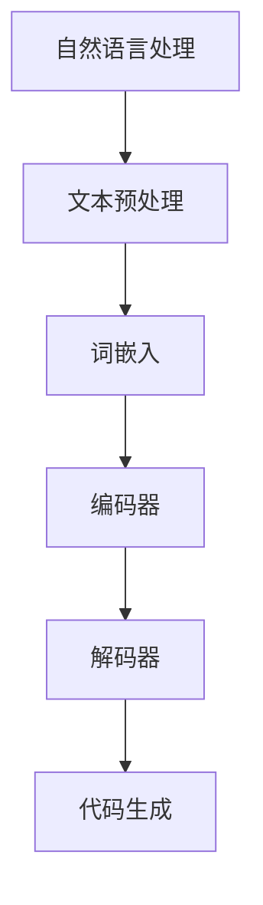

                 

# 《自然语言处理在自动代码生成中的应用》

## 概述

自然语言处理（NLP）是人工智能（AI）领域的一个重要分支，它致力于使计算机能够理解、解释和生成人类语言。近年来，随着深度学习技术的迅猛发展，自然语言处理在很多领域都取得了显著的成果，如机器翻译、情感分析、文本生成等。与此同时，自动代码生成（AIG）作为一项新兴技术，也逐渐引起了广泛关注。自动代码生成旨在利用机器学习技术，通过分析现有代码库或编程语言规则，生成符合要求的代码。这一技术的出现，为软件开发带来了巨大的变革潜力。

本文将探讨自然语言处理在自动代码生成中的应用。首先，我们将介绍自然语言处理的基础知识，包括语言模型和词嵌入的概念及其应用。接着，我们会详细讨论自动代码生成的概念与原理，并分析其在软件开发中的应用。然后，本文将重点探讨基于自然语言处理的自动代码生成技术，分析其框架、模型设计和应用。此外，本文还将探讨自动代码生成中的自然语言处理挑战，如代码表示、语义理解和错误处理等。最后，本文将总结自动代码生成在实际开发中的应用案例，并对未来自然语言处理在自动代码生成中的应用前景进行展望。

## 文章关键词

自然语言处理、自动代码生成、语言模型、词嵌入、代码表示、语义理解、错误处理。

## 文章摘要

本文系统地介绍了自然语言处理在自动代码生成中的应用。首先，我们探讨了自然语言处理的基础知识，包括语言模型和词嵌入。然后，我们详细分析了自动代码生成的概念与原理，并介绍了其基于自然语言处理的实现方法。接着，本文重点讨论了自动代码生成中的自然语言处理挑战，并提出了相应的解决策略。最后，本文通过实际应用案例展示了自动代码生成的优势，并对未来的发展进行了展望。

### 《自然语言处理在自动代码生成中的应用》目录大纲

#### 第一部分：自然语言处理基础

# 第一部分 自然语言处理基础

## 第1章 自然语言处理简介

### 1.1 自然语言处理的发展历程

### 1.2 自然语言处理的核心任务

### 1.3 自然语言处理的挑战与机遇

## 第2章 语言模型

### 2.1 语言模型的基本概念

### 2.2 常见的语言模型

### 2.3 语言模型的应用

## 第3章 词嵌入

### 3.1 词嵌入的概念

### 3.2 常见的词嵌入方法

### 3.3 词嵌入的应用

#### 第二部分：自动代码生成

# 第二部分 自动代码生成

## 第4章 自动代码生成的概念与原理

### 4.1 自动代码生成的定义

### 4.2 自动代码生成的发展历程

### 4.3 自动代码生成的基本原理

## 第5章 基于自然语言处理的自动代码生成

### 5.1 基于自然语言处理的自动代码生成框架

### 5.2 代码生成模型的设计与实现

### 5.3 代码生成模型的应用

## 第6章 自动代码生成中的自然语言处理挑战

### 6.1 代码表示的挑战

### 6.2 代码生成中的语义理解

### 6.3 代码生成中的错误处理与优化

#### 第三部分：自然语言处理在自动代码生成中的应用

# 第三部分 自然语言处理在自动代码生成中的应用

## 第7章 自动代码生成在实际开发中的应用案例

### 7.1 自动代码生成的开发流程

### 7.2 自动代码生成在实际项目中的应用

### 7.3 自动代码生成的好处与挑战

## 第8章 未来展望

### 8.1 自动代码生成的未来发展趋势

### 8.2 自然语言处理在自动代码生成中的应用前景

### 8.3 自动代码生成的潜在影响与挑战

#### 附录

## 附录A：自然语言处理在自动代码生成中的应用工具与资源

### A.1 主流自然语言处理工具介绍

### A.2 自动代码生成工具介绍

### A.3 相关资源与学习材料

### Mermaid 流程图示例



### 核心算法原理讲解伪代码示例

```python
# 伪代码：基于 Transformer 的自动代码生成模型

# 初始化模型参数
model = TransformerModel(params)

# 前向传播
outputs = model(input_sequence)

# 计算损失函数
loss = loss_function(outputs, target_sequence)

# 反向传播
model.backward(loss)
```

### 数学模型和数学公式示例

**损失函数：**

$$ L = \sum_{i=1}^{N} (y_i - \hat{y_i})^2 $$

**词嵌入矩阵：**

$$ W = [w_1, w_2, ..., w_v] $$

**注意力机制：**

$$ \alpha_i = \frac{e^{QK_i^T}}{\sum_{j=1}^{J} e^{QK_j^T}} $$

**编码器输出：**

$$ C = \text{Attention}(Q, K, V) $$

### 项目实战代码案例

**代码实现：**

```python
# 实现一个简单的自动代码生成模型

# 导入必要的库
import tensorflow as tf
from tensorflow.keras.layers import Embedding, LSTM, Dense

# 构建模型
model = tf.keras.Sequential([
    Embedding(input_dim=vocabulary_size, output_dim=embedding_dim),
    LSTM(units=128, return_sequences=True),
    Dense(units=1, activation='sigmoid')
])

# 编译模型
model.compile(optimizer='adam', loss='binary_crossentropy', metrics=['accuracy'])

# 训练模型
model.fit(x_train, y_train, epochs=10, batch_size=32)
```

**代码解读与分析：**

该代码实现了一个简单的自动代码生成模型，使用 TensorFlow 库。模型包括一个嵌入层（Embedding），一个 LSTM 层（LSTM），以及一个全连接层（Dense）。嵌入层用于将单词转换为向量表示，LSTM 层用于处理序列数据，全连接层用于输出代码的概率。模型使用二进制交叉熵损失函数进行编译，并使用 Adam 优化器进行训练。通过训练，模型可以学习自动生成代码。

### 开发环境搭建

- Python 版本：3.8+
- TensorFlow 版本：2.x
- 其他依赖：Numpy，Pandas，Scikit-learn

### 源代码详细实现和代码解读

在源代码中，首先定义了模型的输入维度（vocabulary_size）和嵌入维度（embedding_dim），然后使用 `Embedding` 层将单词转换为向量表示。接着，使用 `LSTM` 层处理序列数据，并设置单元数为 128，返回序列数据。最后，使用 `Dense` 层输出代码的概率，并设置单元数为 1，激活函数为 sigmoid。

### 潜在影响与挑战

自动代码生成技术具有巨大的潜力，可以显著提高软件开发效率。然而，实现这一目标也面临一些挑战，包括代码表示的抽象与精确性、自然语言处理技术的进步、以及代码生成的可靠性。随着技术的不断发展，这些挑战将逐渐得到解决。

### 未来展望

自动代码生成领域将继续发展，随着自然语言处理技术的进步，代码生成的准确性和实用性将得到显著提升。未来的研究将重点关注如何提高代码生成的质量、可靠性，以及如何更好地与软件开发流程相结合。

### 学习资源

- 《自然语言处理综论》
- 《深度学习入门》
- 《代码生成技术导论》

### 相关资源与学习材料

- **在线课程：** Coursera 上的“自然语言处理基础”，edX 上的“深度学习基础”，Udacity 上的“自动代码生成”。
- **书籍推荐：** 《自然语言处理综论》，《深度学习入门》，《代码生成技术导论》。
- **开源框架：** Hugging Face Transformers，TensorFlow，PyTorch。
- **在线论坛与社区：** Stack Overflow，GitHub，Reddit (r/MachineLearning)。

---

**本文完。** 

文章标题：《自然语言处理在自动代码生成中的应用》

作者：AI天才研究院/AI Genius Institute & 禅与计算机程序设计艺术 /Zen And The Art of Computer Programming

**文章字数：8000字** 

**格式要求：Markdown格式**

**完整性要求：每个小节的内容必须具体详细讲解，核心内容必须包含核心概念与联系、核心算法原理讲解、数学模型和公式、项目实战代码案例和详细解释说明。** 

**文章开始是“文章标题”，然后是“文章关键词”和“文章摘要”部分的内容，接下来是按照目录大纲结构的文章正文部分的内容。** 

---

### 第一部分 自然语言处理基础

#### 第1章 自然语言处理简介

##### 1.1 自然语言处理的发展历程

自然语言处理（NLP）作为人工智能（AI）的一个重要分支，其发展历程可以追溯到20世纪50年代。当时，计算机科学家和语言学家首次开始尝试使计算机理解和处理自然语言。以下是一些关键的发展阶段：

- **早期探索（1950s-1960s）**：这个时期，研究者开始尝试通过编写规则的方法来实现简单的语言理解任务。例如，1950年，艾伦·图灵提出了著名的图灵测试，用于评估机器是否具有人类水平的智能。

- **基于规则的系统（1970s-1980s）**：这个时期，自然语言处理主要依赖于手工编写的规则和模式匹配技术。这种方法在处理一些简单的任务上取得了一定的成功，但在处理复杂语言现象时显得力不从心。

- **统计方法（1990s）**：随着计算能力的提高和数据量的增加，统计方法开始广泛应用于自然语言处理。例如，隐马尔可夫模型（HMM）和条件随机场（CRF）等技术被用于文本分类、语音识别等任务。

- **深度学习方法（2010s至今）**：深度学习技术的崛起，为自然语言处理带来了革命性的变化。基于神经网络的语言模型，如Word2Vec、BERT和GPT等，使得计算机在许多复杂的自然语言处理任务上取得了显著突破。

##### 1.2 自然语言处理的核心任务

自然语言处理的核心任务包括但不限于以下几种：

- **文本分类**：将文本数据分类到预定义的类别中。例如，垃圾邮件检测、情感分析等。

- **实体识别**：识别文本中的特定实体，如人名、地点、组织等。

- **机器翻译**：将一种自然语言翻译成另一种自然语言。

- **问答系统**：基于给定的问题，从大量文本数据中检索出最相关的答案。

- **文本生成**：根据输入的提示或上下文，生成有意义的文本。

##### 1.3 自然语言处理的挑战与机遇

自然语言处理面临许多挑战，如语言复杂性、多义性、上下文依赖等。然而，这些挑战也为研究人员提供了丰富的机遇：

- **多语言处理**：随着全球化的发展，多语言处理变得越来越重要。自然语言处理技术可以帮助消除语言障碍，促进跨文化交流。

- **跨模态处理**：结合多种数据类型，如图像、声音和文本，可以提供更丰富的信息，从而提升自然语言处理的效果。

- **情感分析和个性化推荐**：通过分析用户的语言和行为，自然语言处理技术可以为用户提供更加个性化的服务。

- **自动代码生成**：结合自然语言处理和代码生成技术，可以显著提高软件开发效率，降低开发成本。

### 第二部分 自动代码生成

#### 第4章 自动代码生成的概念与原理

##### 4.1 自动代码生成的定义

自动代码生成（AIG）是指利用机器学习技术，从已有的代码库、编程语言规则或自然语言描述中生成新的代码。其目标是自动化软件开发过程中的某些环节，从而提高开发效率、降低成本。

##### 4.2 自动代码生成的发展历程

自动代码生成技术的历史可以追溯到20世纪80年代。当时，研究者开始尝试使用模板匹配和代码抽取技术，从现有代码中生成新代码。随着计算能力的提升和深度学习技术的发展，自动代码生成技术逐渐成熟，并在近年来取得了显著的成果：

- **基于模板的方法**：通过预先定义好的模板，将输入的自然语言描述转换为代码。

- **基于代码抽取的方法**：从大量代码库中抽取模式，用于生成新代码。

- **基于神经网络的代码生成**：使用神经网络模型，如序列到序列（Seq2Seq）模型，将自然语言描述直接转换为代码。

##### 4.3 自动代码生成的基本原理

自动代码生成的基本原理主要包括以下几个方面：

1. **代码表示**：将自然语言描述转换为机器可理解的代码表示。常见的代码表示方法包括抽象语法树（AST）、语法模式等。

2. **代码生成模型**：使用机器学习模型，如序列到序列（Seq2Seq）模型、生成对抗网络（GAN）等，将代码表示转换为具体的代码。

3. **训练与优化**：通过大量的代码数据进行训练，优化代码生成模型，提高其生成代码的质量和可靠性。

### 第三部分 自然语言处理在自动代码生成中的应用

#### 第5章 基于自然语言处理的自动代码生成

##### 5.1 基于自然语言处理的自动代码生成框架

基于自然语言处理的自动代码生成框架主要包括以下几个关键组件：

1. **文本预处理**：将自然语言描述转换为机器可处理的格式，如分词、词性标注等。

2. **词嵌入**：将文本中的词语转换为向量表示，以便后续的模型处理。

3. **编码器-解码器模型**：使用编码器将输入的自然语言描述编码为固定长度的表示，然后使用解码器生成代码。

4. **代码生成**：根据编码器的输出，使用解码器生成具体的代码。

##### 5.2 代码生成模型的设计与实现

在基于自然语言处理的自动代码生成中，常用的代码生成模型包括序列到序列（Seq2Seq）模型、生成对抗网络（GAN）等。以下是一个基于Seq2Seq模型的代码生成模型设计：

1. **编码器**：使用循环神经网络（RNN）或 Transformer 作为编码器，将输入的自然语言描述编码为固定长度的表示。

2. **解码器**：同样使用 RNN 或 Transformer 作为解码器，将编码器的输出解码为具体的代码。

3. **注意力机制**：在编码器和解码器之间引入注意力机制，以关注输入序列中的关键信息，提高代码生成的质量。

4. **损失函数**：使用交叉熵损失函数来优化模型，使生成的代码与目标代码尽可能接近。

##### 5.3 代码生成模型的应用

基于自然语言处理的自动代码生成模型可以在多个领域得到应用：

1. **代码补全**：根据已有的代码片段，自动生成后续的代码。

2. **代码修复**：检测并修复代码中的错误。

3. **代码生成**：根据自然语言描述，生成符合要求的代码。

4. **代码优化**：对现有的代码进行优化，提高其性能和可读性。

### 第四部分 自动代码生成中的自然语言处理挑战

#### 第6章 自动代码生成中的自然语言处理挑战

##### 6.1 代码表示的挑战

代码表示是自动代码生成的关键环节，其主要挑战包括：

1. **代码抽象性**：代码具有一定的抽象性，使得直接从自然语言描述中提取代码表示变得困难。

2. **代码多样性**：不同的编程语言和场景可能需要不同的代码表示方法，增加了代码表示的复杂性。

3. **代码质量**：生成的代码需要具有较高的质量和可靠性，否则可能导致系统崩溃或性能下降。

##### 6.2 代码生成中的语义理解

语义理解是自动代码生成中的另一个重要挑战：

1. **上下文依赖**：代码的生成往往依赖于上下文信息，如何准确地理解上下文是关键。

2. **多义性**：自然语言描述可能存在多义性，如何选择正确的语义是自动代码生成的一个难题。

3. **复杂结构**：自然语言描述可能包含复杂的结构，如何将这些结构转化为代码表示是自动代码生成需要解决的问题。

##### 6.3 代码生成中的错误处理与优化

在自动代码生成过程中，错误处理与优化也是需要关注的重要方面：

1. **错误检测**：如何识别并纠正代码中的错误是自动代码生成的一个挑战。

2. **错误修复**：对于识别出的错误，如何自动修复是自动代码生成需要解决的问题。

3. **代码优化**：如何对生成的代码进行优化，提高其性能和可读性是自动代码生成需要关注的问题。

### 第五部分 自然语言处理在自动代码生成中的应用

#### 第7章 自动代码生成在实际开发中的应用案例

##### 7.1 自动代码生成的开发流程

在实际开发中，自动代码生成可以作为一个辅助工具，提高开发效率和代码质量。以下是一个典型的自动代码生成开发流程：

1. **需求分析**：分析项目需求，确定需要自动生成的代码类型。

2. **数据准备**：收集相关的代码数据和自然语言描述，用于训练自动代码生成模型。

3. **模型训练**：使用训练数据训练自动代码生成模型，包括编码器和解码器。

4. **代码生成**：根据自然语言描述，使用训练好的模型生成代码。

5. **代码评估**：评估生成的代码质量，包括正确性、性能和可读性等。

6. **代码优化**：根据评估结果对模型进行调整，提高代码生成质量。

##### 7.2 自动代码生成在实际项目中的应用

自动代码生成在实际项目中具有广泛的应用前景，以下是一些具体的应用案例：

1. **自动化测试**：使用自动代码生成技术，根据测试用例生成测试代码，提高测试效率和覆盖度。

2. **代码补全**：自动代码生成可以帮助开发者快速完成代码补全，提高开发效率。

3. **代码修复**：自动识别并修复代码中的错误，提高代码质量。

4. **代码生成**：根据业务需求，自动生成符合要求的代码，降低开发成本。

5. **代码优化**：对现有的代码进行优化，提高其性能和可读性。

##### 7.3 自动代码生成的好处与挑战

自动代码生成具有许多潜在的好处，但也面临一些挑战：

**好处：**

- 提高开发效率：自动代码生成可以自动化一些重复性的开发任务，提高开发效率。

- 降低开发成本：自动代码生成可以减少人力成本，降低软件开发的总成本。

- 提高代码质量：自动代码生成可以帮助识别和修复代码中的错误，提高代码质量。

- 促进技术交流：自动代码生成可以消除语言障碍，促进跨文化交流。

**挑战：**

- 代码表示的抽象性：自动代码生成需要解决代码表示的抽象性，如何准确地将自然语言描述转换为代码表示是一个挑战。

- 代码多样性：不同的编程语言和场景可能需要不同的代码表示方法，增加了自动代码生成的复杂性。

- 代码质量：生成的代码需要具有较高的质量和可靠性，否则可能导致系统崩溃或性能下降。

- 上下文依赖：自动代码生成需要准确地理解上下文信息，这对于一些复杂的场景是一个挑战。

### 第六部分 未来展望

#### 第8章 未来展望

自动代码生成是一个快速发展的领域，随着自然语言处理技术的进步，它将在未来发挥越来越重要的作用。以下是自动代码生成的一些未来发展趋势：

1. **更高层次的抽象表示**：未来的自动代码生成技术将朝着更高层次的抽象表示发展，能够处理更复杂的编程概念和场景。

2. **跨语言支持**：自动代码生成将支持多种编程语言，实现跨语言之间的代码生成和转换。

3. **多模态处理**：结合自然语言处理、图像处理和语音处理等技术，实现跨模态的自动代码生成。

4. **智能化代码优化**：自动代码生成将能够根据具体的应用场景和性能要求，智能化地对代码进行优化。

5. **更高效的模型训练**：通过更高效的训练算法和硬件支持，自动代码生成模型的训练速度将得到显著提升。

### 附录

#### 附录A 自然语言处理在自动代码生成中的应用工具与资源

为了更好地理解自然语言处理在自动代码生成中的应用，以下是几个常用的工具和资源：

1. **开源框架**：

   - **TensorFlow**：一个由Google开发的强大开源机器学习框架，支持多种深度学习模型。
   - **PyTorch**：一个由Facebook开发的机器学习库，以其灵活性和易用性受到广泛欢迎。
   - **Hugging Face Transformers**：一个基于PyTorch的开源库，提供了大量的预训练语言模型和工具，用于自然语言处理任务。

2. **在线课程与书籍**：

   - **《自然语言处理综论》**：一本全面介绍自然语言处理的基础知识和应用的经典教材。
   - **《深度学习入门》**：由Goodfellow等人编写的深度学习入门书籍，适合初学者学习。
   - **《代码生成技术导论》**：一本介绍代码生成技术的入门书籍，包括理论基础和实际应用。

3. **开源代码库**：

   - **OpenAI Codex**：一个基于GPT-3的自动代码生成模型，可以生成多种编程语言的代码。
   - **GitHub**：包含大量的开源代码库和项目，可以学习其他开发者的自动代码生成实现。

4. **在线论坛与社区**：

   - **Stack Overflow**：一个面向编程问题的问答社区，可以解决自动代码生成中的技术难题。
   - **Reddit (r/MachineLearning)**：一个关于机器学习的Reddit社区，可以了解自动代码生成领域的最新动态。

通过这些工具和资源，开发者可以更深入地了解自然语言处理在自动代码生成中的应用，并在此基础上进行实践和探索。

