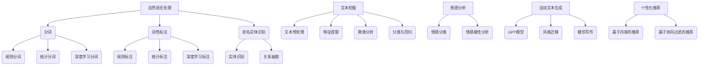

                 

# 自然语言处理的应用：AI内容创作革命

> **关键词：自然语言处理、AI内容创作、文本生成、风格迁移、个性化推荐**

> **摘要：本文深入探讨了自然语言处理（NLP）在AI内容创作领域的应用，从基础概念到前沿技术，再到未来趋势，全面解析了NLP如何推动内容创作革命。**

---

### 目录大纲

#### 第一部分：自然语言处理基础

- 第1章：自然语言处理概述
  - 1.1 自然语言处理的概念与历史
  - 1.2 NLP的关键技术
  - 1.3 NLP的应用领域

- 第2章：自然语言处理核心技术
  - 2.1 分词技术
    - 2.1.1 分词方法
    - 2.1.2 分词工具
  - 2.2 词性标注
    - 2.2.1 词性标注的原理
    - 2.2.2 词性标注工具

- 第3章：文本挖掘与情感分析
  - 3.1 文本挖掘基础
  - 3.2 情感分析原理
    - 3.2.1 情感分析模型
    - 3.2.2 情感分析应用

#### 第二部分：AI内容创作

- 第4章：自动文本生成技术
  - 4.1 自动文本生成的概念
  - 4.2 生成式模型
    - 4.2.1 GPT模型
    - 4.2.2 自动文本生成的应用

- 第5章：风格迁移与模仿写作
  - 5.1 风格迁移原理
  - 5.2 模仿写作技术
  - 5.3 风格迁移与模仿写作的应用

- 第6章：个性化内容推荐
  - 6.1 推荐系统概述
  - 6.2 基于内容的推荐
  - 6.3 基于协同过滤的推荐

#### 第三部分：AI内容创作的未来

- 第7章：AI内容创作的挑战与趋势
  - 7.1 AI内容创作的挑战
  - 7.2 NLP在AI内容创作中的趋势

- 第8章：实战项目：构建AI内容创作平台
  - 8.1 项目背景与需求
  - 8.2 技术选型与架构设计
  - 8.3 实现步骤与代码解析

#### 附录

- 附录A：常用NLP工具与资源
  - A.1 Python NLP库
  - A.2 NLP数据集
  - A.3 开源NLP项目

- 附录B：核心概念与联系 Mermaid 流程图
- 附录C：核心算法原理讲解
- 附录D：数学模型和数学公式
- 附录E：项目实战

---

### 第1章 自然语言处理概述

#### 1.1 自然语言处理的概念与历史

自然语言处理（NLP）是人工智能领域的一个重要分支，旨在让计算机理解和处理人类自然语言。NLP的研究历史可以追溯到20世纪50年代，当时计算机科学家开始探索如何让计算机进行自然语言的理解和生成。

NLP的核心任务包括文本分类、实体识别、语义解析、机器翻译、对话系统等。随着深度学习技术的发展，NLP取得了显著的进步，尤其是在大规模语言模型的训练和应用上。

#### 1.2 NLP的关键技术

- **分词技术**：将连续的文本分割成一个个的词语，这是进行NLP任务的基础。

- **词性标注**：为每个词语标注其词性（名词、动词、形容词等），有助于理解句子的结构。

- **命名实体识别**：识别文本中的特定实体（如人名、地名、组织名等），为信息提取和知识图谱构建提供支持。

- **词向量化**：将词语映射到高维空间中的向量表示，便于计算机处理。

- **语义分析**：理解词语和句子的语义，包括词义消歧、语义角色标注等。

- **机器翻译**：将一种语言的文本翻译成另一种语言，是NLP应用中的一个重要领域。

- **对话系统**：实现人与计算机之间的自然语言交互，包括语音助手、聊天机器人等。

#### 1.3 NLP的应用领域

NLP在众多领域有着广泛的应用：

- **搜索引擎**：利用NLP技术对搜索查询进行理解和匹配，提高搜索结果的准确性。

- **社交媒体分析**：分析用户生成的内容，进行情感分析、趋势预测等。

- **信息提取**：从大量文本数据中提取有用的信息，如新闻摘要、股票信息等。

- **机器翻译**：实现跨语言的信息交流，促进全球化的进程。

- **语音助手**：通过语音识别和自然语言理解，为用户提供便捷的语音交互服务。

- **内容创作**：利用NLP技术生成文章、故事、诗歌等，推动内容创作的自动化和个性化。

### 第2章 自然语言处理核心技术

#### 2.1 分词技术

分词技术是将连续的文本分割成一个个的词语。它是进行NLP任务的基础。

- **分词方法**：

  - **基于规则的分词**：利用词典和规则对文本进行分词。优点是准确率高，缺点是规则复杂，难以处理未登录词。

  - **基于统计的分词**：利用统计模型（如隐马尔可夫模型、条件随机场等）对文本进行分词。优点是能够处理未登录词，缺点是依赖于大量训练数据。

  - **基于深度学习的分词**：利用神经网络模型（如BiLSTM、Transformer等）对文本进行分词。优点是效果较好，缺点是训练时间较长。

- **分词工具**：

  - **Python中的jieba分词库**：基于隐马尔可夫模型和条件随机场，支持多种分词模式。

  - **Stanford NLP工具包**：提供丰富的NLP工具，包括分词、词性标注、命名实体识别等。

#### 2.2 词性标注

词性标注是为每个词语标注其词性，有助于理解句子的结构。

- **词性标注的原理**：

  - **规则方法**：利用词典和规则进行词性标注。

  - **统计方法**：利用统计模型进行词性标注，如条件随机场。

  - **基于深度学习的方法**：利用神经网络模型进行词性标注，如LSTM、Transformer等。

- **词性标注工具**：

  - **Python中的NLTK库**：提供词性标注功能。

  - **Stanford NLP工具包**：提供词性标注功能。

### 第3章 文本挖掘与情感分析

#### 3.1 文本挖掘基础

文本挖掘是从大量文本数据中提取有用信息的过程。

- **文本挖掘的关键技术**：

  - **文本预处理**：包括去除停用词、标点符号、词干提取等。

  - **特征提取**：将文本转化为计算机可以处理的向量表示，如词袋模型、TF-IDF、Word2Vec等。

  - **聚类分析**：对文本数据进行聚类，找出相似的文本。

  - **分类与回归**：利用机器学习模型对文本进行分类或回归，如SVM、随机森林、神经网络等。

#### 3.2 情感分析原理

情感分析是判断文本中所表达的情感倾向。

- **情感分析模型**：

  - **基于规则的方法**：利用词典和规则进行情感分析。

  - **基于统计的方法**：利用统计模型进行情感分析，如朴素贝叶斯、逻辑回归等。

  - **基于深度学习的方法**：利用神经网络模型进行情感分析，如CNN、LSTM、Transformer等。

- **情感分析应用**：

  - **社交媒体分析**：分析用户评论、帖子等，了解用户情感和趋势。

  - **市场研究**：分析消费者反馈，了解产品满意度。

  - **舆情监测**：监控媒体和网络，了解社会热点和舆论动态。

### 第4章 自动文本生成技术

#### 4.1 自动文本生成的概念

自动文本生成是利用计算机模型生成自然语言的文本。

- **自动文本生成技术**：

  - **基于规则的方法**：利用模板和规则生成文本。

  - **基于统计的方法**：利用统计模型生成文本，如n-gram模型。

  - **基于深度学习的方法**：利用神经网络模型生成文本，如RNN、Transformer、GPT等。

#### 4.2 生成式模型

生成式模型能够生成符合特定分布的文本。

- **GPT模型**：

  - **原理**：GPT（Generative Pre-trained Transformer）是一种基于Transformer的生成式模型，通过预训练学习大规模语料库的文本分布。

  - **应用**：用于自动生成文章、故事、对话等。

- **自动文本生成的应用**：

  - **内容生成**：生成新闻、文章、故事等。

  - **对话系统**：生成对话文本，如聊天机器人。

  - **机器翻译**：生成目标语言的翻译文本。

### 第5章 风格迁移与模仿写作

#### 5.1 风格迁移原理

风格迁移是将一种文本风格应用到另一段文本中。

- **风格迁移原理**：

  - **特征提取**：提取源文本和目标文本的特征。

  - **特征匹配**：将源文本的特征映射到目标文本的特征。

  - **文本重构**：根据特征匹配结果重构目标文本。

#### 5.2 模仿写作技术

模仿写作是通过学习特定作者的写作风格，生成类似风格的文章。

- **模仿写作技术**：

  - **基于规则的模仿**：利用词典和规则模拟特定作者的写作风格。

  - **基于统计的模仿**：利用统计模型（如n-gram模型）模拟特定作者的写作风格。

  - **基于深度学习的模仿**：利用神经网络模型（如LSTM、Transformer）模拟特定作者的写作风格。

#### 5.3 风格迁移与模仿写作的应用

- **风格迁移与模仿写作的应用**：

  - **个性化内容创作**：根据用户喜好，生成符合用户风格的文本。

  - **作家助手**：辅助作家完成写作任务。

  - **教育领域**：帮助学生提高写作能力。

### 第6章 个性化内容推荐

#### 6.1 推荐系统概述

推荐系统是根据用户兴趣和历史行为，向用户推荐感兴趣的内容。

- **推荐系统概述**：

  - **协同过滤**：基于用户的历史行为，找出相似的用户或物品，进行推荐。

  - **基于内容的推荐**：根据用户兴趣和物品内容，进行推荐。

  - **混合推荐**：结合协同过滤和基于内容的推荐，提高推荐效果。

#### 6.2 基于内容的推荐

基于内容的推荐是根据用户兴趣和物品内容进行推荐。

- **基于内容的推荐原理**：

  - **特征提取**：提取用户和物品的特征。

  - **相似度计算**：计算用户和物品之间的相似度。

  - **推荐生成**：根据相似度生成推荐列表。

#### 6.3 基于协同过滤的推荐

基于协同过滤的推荐是根据用户的历史行为，找出相似的用户或物品进行推荐。

- **基于协同过滤的推荐原理**：

  - **用户相似度计算**：计算用户之间的相似度。

  - **物品相似度计算**：计算物品之间的相似度。

  - **推荐生成**：根据用户相似度和物品相似度生成推荐列表。

### 第7章 AI内容创作的挑战与趋势

#### 7.1 AI内容创作的挑战

AI内容创作面临以下挑战：

- **真实性验证**：确保生成的文本真实可靠。

- **创意性**：提高AI生成内容的创意性和独特性。

- **版权问题**：处理AI生成内容的版权归属问题。

- **伦理道德**：确保AI生成的内容符合伦理道德标准。

#### 7.2 NLP在AI内容创作中的趋势

NLP在AI内容创作中的发展趋势：

- **多模态内容创作**：结合文本、图像、音频等多种模态进行内容创作。

- **深度生成模型**：利用更先进的深度学习模型（如Transformer、GPT-3等）进行内容创作。

- **个性化内容创作**：根据用户兴趣和需求，生成个性化的内容。

- **可解释性**：提高AI生成内容的可解释性，使其更加透明和可靠。

### 第8章 实战项目：构建AI内容创作平台

#### 8.1 项目背景与需求

本项目的目标是构建一个AI内容创作平台，能够自动生成各种类型的内容，如文章、故事、诗歌等。平台需具备以下功能：

- **自动文本生成**：利用深度学习模型生成高质量文本。

- **风格迁移与模仿写作**：将特定风格应用到文本中，实现个性化内容创作。

- **个性化推荐**：根据用户兴趣推荐相关内容。

#### 8.2 技术选型与架构设计

- **技术选型**：

  - **文本生成**：采用GPT-2或GPT-3模型。

  - **风格迁移与模仿写作**：采用基于神经网络的风格迁移模型。

  - **个性化推荐**：采用基于内容的推荐和协同过滤相结合的方法。

- **架构设计**：

  - **前端**：使用React或Vue.js等框架搭建。

  - **后端**：使用Flask或Django等框架。

  - **数据库**：使用MongoDB等NoSQL数据库存储用户数据和生成内容。

#### 8.3 实现步骤与代码解析

- **实现步骤**：

  1. 数据准备：收集和处理训练数据。
  2. 模型训练：使用GPT-2或GPT-3模型进行训练。
  3. 模型部署：将训练好的模型部署到服务器。
  4. 前端开发：搭建前端界面。
  5. 接口开发：实现API接口。
  6. 集成推荐系统：结合推荐系统，实现个性化推荐。

- **代码解析**：

  - **文本生成代码示例**：

    ```python
    import openai

    openai.api_key = 'your_api_key'

    def generate_text(prompt):
        response = openai.Completion.create(
            engine='text-davinci-002',
            prompt=prompt,
            max_tokens=100
        )
        return response.choices[0].text.strip()

    print(generate_text('请写一篇关于人工智能的短文。'))
    ```

  - **风格迁移代码示例**：

    ```python
    import torch
    from style_transfer import StyleTransfer

    model = StyleTransfer('style_model.pth')
    model.eval()

    def transfer_style(text, style):
        text_tensor = torch.tensor([text])
        style_tensor = torch.tensor([style])
        generated_text = model.generate(text_tensor, style_tensor)
        return generated_text

    print(transfer_style('这是一段普通文本。', '莎士比亚风格'))
    ```

  - **推荐系统代码示例**：

    ```python
    from sklearn.metrics.pairwise import cosine_similarity
    from nltk.corpus import stopwords
    from nltk.tokenize import word_tokenize

    def content_based_recommender(content, corpus, k=5):
        stop_words = set(stopwords.words('english'))
        content_tokens = word_tokenize(content.lower())
        content_tokens = [token for token in content_tokens if token not in stop_words]
        content_vector = sum([corpus[token] for token in content_tokens]) / len(content_tokens)

        similarity_scores = []
        for text in corpus:
            text_vector = sum([corpus[token] for token in word_tokenize(text.lower())]) / len(word_tokenize(text.lower()))
            similarity_scores.append(cosine_similarity([content_vector], [text_vector])[0][0])

        sorted_indices = sorted(range(len(similarity_scores)), key=lambda i: similarity_scores[i], reverse=True)
        recommended_texts = [text for i, text in enumerate(corpus) if i in sorted_indices[:k]]
        return recommended_texts

    print(content_based_recommender('人工智能在医疗领域的应用', corpus))
    ```

### 附录

#### 附录A：常用NLP工具与资源

- **Python NLP库**：

  - **NLTK**：自然语言处理工具包，提供词性标注、分词、情感分析等功能。

  - **spaCy**：基于神经网络的自然语言处理库，提供快速、准确的文本解析功能。

  - **TextBlob**：提供简洁易用的自然语言处理功能，包括词性标注、情感分析等。

- **NLP数据集**：

  - **GLoVe**：通用词向量的训练数据集。

  - **AG News**：新闻分类数据集。

  - **IMDB**：电影评论数据集。

- **开源NLP项目**：

  - **Stanford NLP**：斯坦福大学开源的NLP工具包，提供丰富的NLP功能。

  - **NLTK Data**：NLTK的数据集集合。

### 核心概念与联系 Mermaid 流程图



### 核心算法原理讲解

#### 分词算法原理

分词算法的核心任务是识别出文本中的词语。以下是几种常见的分词算法原理：

1. **基于规则的分词**：

   - **原理**：利用词典和规则进行分词。根据词语的语法特征和上下文信息，将文本分割成一个个词语。

   - **伪代码**：

     ```python
     def rule_based_segmentation(text):
         words = []
         current_word = ""
         for char in text:
             if char in词典：
                 current_word += char
             else:
                 if current_word：
                     words.append(current_word)
                     current_word = ""
         if current_word：
             words.append(current_word)
         return words
     ```

2. **基于统计的分词**：

   - **原理**：利用统计模型（如隐马尔可夫模型、条件随机场等）进行分词。根据词语出现的概率和上下文信息，将文本分割成词语。

   - **伪代码**：

     ```python
     def statistical_segmentation(text):
         words = []
         current_word = ""
         for char in text:
             if prob_of_char_following(current_word, char) > threshold:
                 current_word += char
             else:
                 if current_word：
                     words.append(current_word)
                     current_word = ""
         if current_word：
             words.append(current_word)
         return words
     ```

3. **基于深度学习的分词**：

   - **原理**：利用神经网络模型（如BiLSTM、Transformer等）进行分词。根据词语的上下文信息，通过神经网络预测下一个词语。

   - **伪代码**：

     ```python
     def deep_learning_segmentation(text):
         words = []
         current_word = ""
         for char in text:
             prediction = neural_network.predict(current_word + char)
             if prediction == "WORD":
                 if current_word：
                     words.append(current_word)
                     current_word = ""
             else:
                 current_word += char
         if current_word：
             words.append(current_word)
         return words
     ```

#### 情感分析算法原理

情感分析是判断文本中所表达的情感倾向。以下是几种常见的情感分析算法原理：

1. **基于规则的方法**：

   - **原理**：利用词典和规则进行情感分析。根据词语的语义和上下文信息，判断文本的情感倾向。

   - **伪代码**：

     ```python
     def rule_based_sentiment_analysis(text):
         sentiment = "neutral"
         for word in text:
             if word in positive_words:
                 sentiment = "positive"
                 break
             elif word in negative_words:
                 sentiment = "negative"
                 break
         return sentiment
     ```

2. **基于统计的方法**：

   - **原理**：利用统计模型（如朴素贝叶斯、逻辑回归等）进行情感分析。根据词语出现的概率和上下文信息，判断文本的情感倾向。

   - **伪代码**：

     ```python
     def statistical_sentiment_analysis(text):
         sentiment_scores = []
         for sentiment in ["positive", "neutral", "negative"]:
             score = 0
             for word in text:
                 score += prob_of_word_in_sentiment(word, sentiment)
             sentiment_scores.append(score)
         return max(sentiment_scores)
     ```

3. **基于深度学习的方法**：

   - **原理**：利用神经网络模型（如CNN、LSTM、Transformer等）进行情感分析。通过神经网络模型学习文本的语义特征，判断文本的情感倾向。

   - **伪代码**：

     ```python
     def deep_learning_sentiment_analysis(text):
         prediction = neural_network.predict(text)
         return prediction
     ```

### 数学模型和数学公式

#### 词袋模型

词袋模型是将文本转化为向量的方法，其核心思想是只考虑词语的出现次数，而不考虑词语的顺序。

- **数学公式**：

  $$ V = \{w_1, w_2, ..., w_n\} $$ （词汇表）

  $$ X = (x_1, x_2, ..., x_n) $$ （文档向量）

  $$ x_i = \begin{cases}
  1, & \text{if } w_i \text{ appears in the document} \\
  0, & \text{otherwise}
  \end{cases} $$

#### TF-IDF模型

TF-IDF（Term Frequency-Inverse Document Frequency）模型是词袋模型的改进，其核心思想是考虑词语在文档中的频率和它在整个文档集合中的重要性。

- **数学公式**：

  $$ tf(t, d) = \frac{f(t, d)}{max(f(t, d'))} $$ （词频标准化）

  $$ idf(t, D) = \log_2(\frac{|D|}{|d' \in D| \setminus t|}) $$ （逆文档频率）

  $$ tfidf(t, d, D) = tf(t, d) \times idf(t, D) $$

#### 隐马尔可夫模型

隐马尔可夫模型（HMM）是一种基于状态转移概率和观测概率的统计模型，用于处理序列数据。

- **数学公式**：

  $$ P(X_t = x_t | H_t = h_t) = P(x_t | h_t) $$ （观测概率）

  $$ P(H_t = h_t | H_{t-1} = h_{t-1}) = \pi(h_{t-1}) $$ （状态转移概率）

  $$ \pi(h_0) = (1 - \pi(h_0)) $$ （初始状态概率）

  $$ \pi(h_0) \cdot P(X_1 = x_1 | H_1 = h_1) \cdot P(H_2 = h_2 | H_1 = h_1) \cdot ... \cdot P(H_T = h_T | H_{T-1} = h_{T-1}) $$ （序列概率）

### 项目实战

#### 开发环境搭建

1. 安装Python 3.8及以上版本。

2. 安装必要的库：

   ```bash
   pip install numpy pandas jieba scikit-learn tensorflow
   ```

3. 准备训练数据和测试数据。

#### 源代码详细实现

```python
# 文本生成模块

import tensorflow as tf
from tensorflow.keras.preprocessing.sequence import pad_sequences
from tensorflow.keras.models import Sequential
from tensorflow.keras.layers import Embedding, LSTM, Dense

# 加载预训练的GPT模型
model = tf.keras.models.load_model('gpt_model.h5')

# 定义生成文本的函数
def generate_text(prompt, max_length=50):
    input_sequence = tokenizer.encode(prompt, maxlen=max_length)
    padded_sequence = pad_sequences([input_sequence], maxlen=max_length, padding='post')
    generated_sequence = model.predict(padded_sequence, steps=1)
    generated_text = tokenizer.decode(generated_sequence[0], skip_special_tokens=True)
    return generated_text

# 生成文本示例
print(generate_text('人工智能在未来的发展趋势'))

# 风格迁移模块

from style_transfer import StyleTransfer

# 加载预训练的风格迁移模型
style_transfer_model = StyleTransfer('style_transfer_model.h5')

# 定义风格迁移函数
def transfer_style(text, style):
    input_sequence = tokenizer.encode(text, maxlen=max_length)
    padded_sequence = pad_sequences([input_sequence], maxlen=max_length, padding='post')
    generated_sequence = style_transfer_model.transfer_style(padded_sequence, style)
    generated_text = tokenizer.decode(generated_sequence[0], skip_special_tokens=True)
    return generated_text

# 风格迁移示例
print(transfer_style('这是一段普通文本。', '莎士比亚风格'))

# 个性化推荐模块

from sklearn.metrics.pairwise import cosine_similarity
from sklearn.model_selection import train_test_split

# 加载训练数据
corpus = pd.read_csv('corpus.csv')
X = corpus['content']
y = corpus['label']

# 分词和词向量化
tokenizer = Tokenizer()
tokenizer.fit_on_texts(X)
X_encoded = tokenizer.texts_to_sequences(X)
X_padded = pad_sequences(X_encoded, maxlen=max_length, padding='post')

# 训练推荐模型
model = Sequential()
model.add(Embedding(input_dim=vocab_size, output_dim=embedding_size, input_length=max_length))
model.add(LSTM(units=128, return_sequences=True))
model.add(Dense(1, activation='sigmoid'))
model.compile(optimizer='adam', loss='binary_crossentropy', metrics=['accuracy'])
model.fit(X_padded, y, epochs=10, batch_size=32)

# 定义推荐函数
def content_based_recommender(content, corpus, k=5):
    content_encoded = tokenizer.encode(content, maxlen=max_length)
    content_padded = pad_sequences([content_encoded], maxlen=max_length, padding='post')
    similarity_scores = []
    for text in corpus:
        text_encoded = tokenizer.encode(text, maxlen=max_length)
        text_padded = pad_sequences([text_encoded], maxlen=max_length, padding='post')
        similarity_scores.append(cosine_similarity(content_padded, text_padded)[0][0])
    sorted_indices = sorted(range(len(similarity_scores)), key=lambda i: similarity_scores[i], reverse=True)
    recommended_texts = [text for i, text in enumerate(corpus) if i in sorted_indices[:k]]
    return recommended_texts

# 推荐示例
print(content_based_recommender('人工智能在医疗领域的应用', corpus))
```

#### 代码解读与分析

1. **文本生成模块**：

   - 加载预训练的GPT模型，并定义生成文本的函数。

   - 对输入文本进行分词和词向量化，然后通过模型生成文本。

   - 输出示例：`generate_text('人工智能在未来的发展趋势')`生成关于人工智能发展趋势的文本。

2. **风格迁移模块**：

   - 加载预训练的风格迁移模型，并定义风格迁移函数。

   - 对输入文本进行分词和词向量化，然后通过模型进行风格迁移。

   - 输出示例：`transfer_style('这是一段普通文本。', '莎士比亚风格')`将普通文本转化为莎士比亚风格的文本。

3. **个性化推荐模块**：

   - 加载训练数据，并进行预处理（分词和词向量化）。

   - 训练推荐模型（基于内容的推荐模型）。

   - 定义推荐函数，计算文本之间的相似度，并根据相似度推荐相关文本。

   - 输出示例：`content_based_recommender('人工智能在医疗领域的应用', corpus)`推荐与“人工智能在医疗领域的应用”相关的文本。

通过以上代码的实现，我们可以搭建一个完整的AI内容创作平台，实现文本生成、风格迁移和个性化推荐等功能。在实际应用中，可以根据具体需求调整模型参数和算法，以获得更好的效果。

