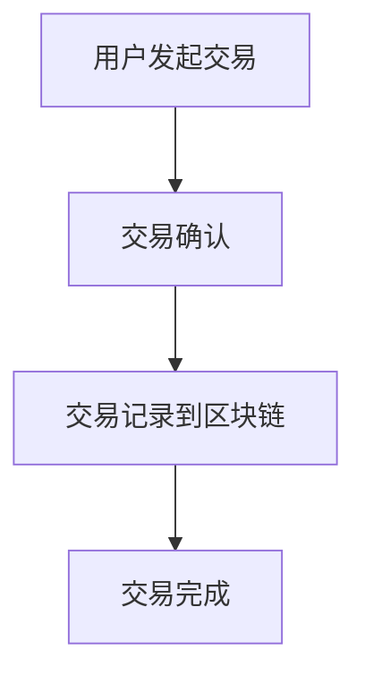
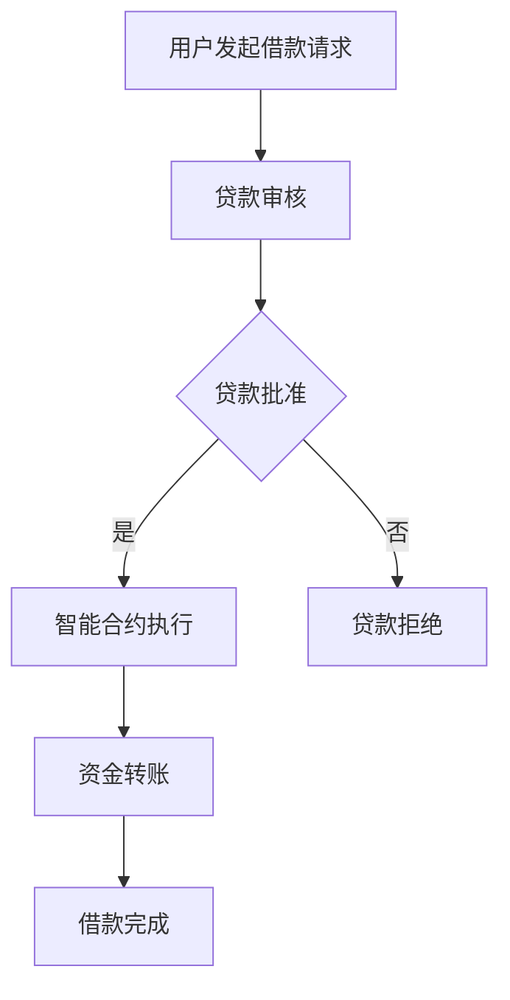

                 

### 《虚拟货币与全球脑：去中心化金融的未来》

> **关键词**：虚拟货币、去中心化金融、区块链、智能合约、全球脑、DeFi

> **摘要**：本文将探讨虚拟货币与去中心化金融（DeFi）的关系，以及它们共同推动未来金融体系变革的潜力。首先，我们将介绍虚拟货币的基本概念和发展历程，随后深入探讨去中心化金融的原理、优势及其生态系统。接下来，我们将分析虚拟货币的交易与投资策略，并列举知名DeFi平台进行分析。最后，我们将展望虚拟货币与全球脑的未来发展趋势，探讨其对金融体系和社会治理的影响，并讨论相关技术基础与法律法规监管。通过本文，读者将全面了解虚拟货币与去中心化金融的深度联系及其广阔的应用前景。

### 《虚拟货币与全球脑：去中心化金融的未来》目录大纲

1. **虚拟货币概述**
   - 第1章：虚拟货币的基本概念与发展历程
     - 1.1 虚拟货币的定义与特点
     - 1.2 虚拟货币的发展历程
     - 1.3 全球脑与虚拟货币
   - 第2章：去中心化金融（DeFi）概述
     - 2.1 去中心化金融的基本原理
     - 2.2 去中心化金融的生态系统
     - 2.3 去中心化金融的未来发展
   - 第3章：虚拟货币交易与投资策略
     - 3.1 虚拟货币的交易市场
     - 3.2 虚拟货币的投资策略
     - 3.3 去中心化金融投资策略
   - 第4章：知名去中心化金融平台分析
     - 4.1 MakerDAO：去中心化稳定币平台
     - 4.2 Uniswap：去中心化交易所
     - 4.3 Aave：去中心化借贷平台
   - 第5章：虚拟货币与全球脑的未来发展趋势
     - 5.1 虚拟货币与全球脑的融合
     - 5.2 全球脑与去中心化金融的协同发展
     - 5.3 虚拟货币与全球脑的社会影响
   - 第6章：虚拟货币与去中心化金融的技术基础
     - 6.1 区块链技术
     - 6.2 智能合约
     - 6.3 加密货币与数字签名
   - 第7章：虚拟货币与去中心化金融的法律法规与监管
     - 7.1 全球虚拟货币监管现状
     - 7.2 去中心化金融的监管挑战与解决方案
     - 7.3 我国虚拟货币与去中心化金融的监管政策
   - 附录
     - 附录A：虚拟货币与去中心化金融开发工具与资源
     - 附录B：常见问题与解答
     - 附录C：虚拟货币与去中心化金融Mermaid流程图
     - 附录D：虚拟货币核心算法原理与伪代码
     - 附录E：虚拟货币数学模型与公式
     - 附录F：去中心化金融项目实战
     - 附录G：虚拟货币与去中心化金融开发环境搭建
     - 附录H：虚拟货币与去中心化金融源代码详细实现与解读
     - 附录I：虚拟货币与去中心化金融项目实战案例
     - 附录J：虚拟货币与去中心化金融技术基础
     - 附录K：虚拟货币与去中心化金融应用前景与挑战

---

### 第一部分：虚拟货币概述

虚拟货币，作为一种新型的数字资产，正在逐渐改变着全球金融体系的格局。这一部分将首先介绍虚拟货币的基本概念与发展历程，探讨虚拟货币的定义与特点，以及虚拟货币与传统货币的区别。随后，我们将回顾虚拟货币的发展历程，特别是比特币的诞生及其影响。最后，我们将探讨全球脑与虚拟货币的关系，为后续的去中心化金融讨论打下基础。

### 第1章：虚拟货币的基本概念与发展历程

#### 1.1 虚拟货币的定义与特点

**虚拟货币**，又称为数字货币或加密货币，是一种基于密码学原理的数字资产，用于实现价值交换。它通常不依赖于某个中央机构，而是通过去中心化的方式运作。

**定义**：虚拟货币是一种去中心化的数字货币，它通过密码学算法生成，其所有权和使用情况记录在分布式账本上。

**特点**：

1. **去中心化**：虚拟货币不需要依赖于中央机构，其交易和账本记录是由网络中的参与者共同维护的。
2. **匿名性**：虚拟货币交易通常可以匿名进行，虽然交易记录是公开的，但交易参与者的身份是隐藏的。
3. **安全性**：虚拟货币使用加密算法来保护交易的安全性和隐私，使得篡改和欺诈变得极其困难。
4. **全球性**：虚拟货币可以跨境交易，不受地域和货币限制，具有全球性。
5. **不可篡改性**：由于分布式账本的特点，虚拟货币的交易记录一旦被确认，就无法被篡改。

**与传统货币的区别**：

1. **发行方式**：传统货币由中央银行发行，而虚拟货币通常通过挖矿或初始代币发行（ICO）等方式生成。
2. **信任机制**：传统货币依赖于中央银行的信用，而虚拟货币依赖于数学算法和网络安全。
3. **交易方式**：传统货币交易需要通过银行或金融机构进行，而虚拟货币交易通常直接在网络上进行。
4. **交易成本**：虚拟货币交易通常成本较低，且可以24小时不间断进行。

#### 1.2 虚拟货币的发展历程

虚拟货币的概念早在20世纪80年代就已经存在，但真正引起广泛关注的是比特币（Bitcoin）的诞生。以下是虚拟货币发展历程的重要节点：

**1.2.1 虚拟货币的早期发展**

- 1983年，戴维·乔姆（David Chaum）提出了“数字现金”的概念，开启了数字货币的探索之路。
- 1990年代，电子现金系统如DigiCash和Ecash出现，但未能大规模应用。

**1.2.2 比特币的诞生及其影响**

- 2009年，中本聪（Satoshi Nakamoto）发布了比特币白皮书，提出了去中心化的电子现金系统。
- 2009年，比特币网络启动，第一批比特币被生成。
- 2010年，比特币第一次交易发生，10,000个比特币购买了两块披萨。
- 2017年，比特币价格一度突破20,000美元，引发全球关注。

**1.2.3 虚拟货币的多元发展**

- 自比特币之后，许多新的虚拟货币项目涌现，如以太坊（Ethereum）、莱特币（Litecoin）等。
- 以太坊在比特币的基础上引入了智能合约，使得虚拟货币的应用场景更加丰富。
- 虚拟货币市场逐渐形成，各种交易平台和钱包也随之诞生。

#### 1.3 全球脑与虚拟货币

**全球脑**，又称为全球智能，是一个由大量互联的个体组成的大规模智能系统，通过协同工作实现集体智慧。全球脑的概念最早由赫伯特·西蒙（Herbert Simon）提出，近年来随着互联网和人工智能技术的发展，全球脑的潜力逐渐被发掘。

**全球脑与虚拟货币的关系**：

1. **去中心化治理**：虚拟货币的去中心化特性与全球脑的集体智慧相契合，为去中心化治理提供了技术支持。
2. **价值网络**：虚拟货币作为一种数字资产，在全球脑中形成了一个价值网络，使得价值交换更加高效和透明。
3. **信息共享**：虚拟货币网络中的交易记录可以被全球脑分析和利用，为经济活动提供数据支持。

**去中心化金融的愿景**：

去中心化金融（DeFi）是虚拟货币与全球脑结合的典型应用，通过去中心化的方式提供金融服务，具有以下愿景：

1. **去中心化治理**：去中心化金融平台通过智能合约实现治理，用户可以直接参与决策。
2. **全球金融包容**：去中心化金融降低了金融服务的门槛，使得更多人能够获得金融服务。
3. **透明和可追溯**：去中心化金融平台的交易记录公开透明，提高了金融系统的透明度。
4. **创新驱动**：去中心化金融为金融创新提供了广阔的空间，推动了金融行业的变革。

通过以上分析，我们可以看到虚拟货币在全球脑中的重要作用，以及去中心化金融带来的巨大变革潜力。在下一部分，我们将深入探讨去中心化金融的基本原理和优势。

---

### 第二部分：去中心化金融（DeFi）概述

去中心化金融（Decentralized Finance，简称DeFi）是近年来在虚拟货币领域崛起的一个创新概念，它通过去中心化的方式提供金融服务，旨在重构传统金融体系的运作方式。本部分将首先介绍去中心化金融的基本原理，包括其定义、优势以及与传统金融的区别。随后，我们将探讨去中心化金融的生态系统，包括治理结构、技术基础设施和应用案例。最后，我们将预测去中心化金融的未来发展趋势，并分析其中面临的潜在挑战和解决方案。

#### 第2章：去中心化金融的基本原理

#### 2.1 去中心化金融的定义与优势

**去中心化金融（DeFi）**，是一种利用区块链和智能合约技术提供的金融服务，其核心特点是去中心化、开放性和透明性。去中心化金融通过去除了传统金融机构的中间环节，实现了金融服务的自动化和高效化。

**定义**：

去中心化金融（DeFi）是指通过区块链和智能合约技术实现的去中心化金融服务，其特点是无需依赖中央机构，用户可以直接在区块链上进行金融服务。

**优势**：

1. **去中心化**：去中心化金融去除了传统金融体系中的中介机构，降低了交易成本，提高了效率。
2. **开放性**：去中心化金融平台是开放性的，任何人都可以参与，不受地域和身份限制。
3. **透明性**：去中心化金融的所有交易记录都是公开透明的，用户可以实时查询。
4. **安全性**：区块链技术提供了强大的安全性保障，使得交易和数据难以被篡改。

**与传统金融的区别**：

1. **信任机制**：传统金融依赖于中央机构的信用，而去中心化金融依赖于数学算法和区块链的信任。
2. **交易成本**：传统金融交易需要支付大量的手续费，而去中心化金融交易成本较低。
3. **交易速度**：传统金融交易速度较慢，而去中心化金融交易可以实时进行。
4. **参与门槛**：传统金融的参与门槛较高，而去中心化金融降低了参与门槛，使更多人能够享受金融服务。

#### 2.2 去中心化金融的生态系统

去中心化金融的生态系统包括多个关键组成部分，如治理结构、技术基础设施和应用案例。以下是对这些组成部分的详细介绍：

**2.2.1 治理结构**

去中心化金融的治理结构通常是基于社区和智能合约的。社区成员可以通过投票和共识算法参与平台的决策，而智能合约则自动执行这些决策。这种治理结构实现了透明性和去中心化，使得用户可以直接参与平台的运作。

1. **社区治理**：社区成员可以通过投票来决定去中心化金融平台的重大决策，如资金分配、协议升级等。
2. **共识算法**：共识算法用于确保去中心化金融平台的安全性和稳定性。常见的共识算法包括PoW（工作量证明）和PoS（权益证明）。

**2.2.2 技术基础设施**

去中心化金融的技术基础设施是区块链和智能合约。区块链提供了去中心化和透明性的保障，而智能合约则实现了金融服务的自动化。

1. **区块链**：区块链是去中心化金融的核心技术，它通过分布式账本记录了所有的交易信息，确保了数据的安全性和不可篡改性。
2. **智能合约**：智能合约是运行在区块链上的程序，它能够自动执行满足预定条件的交易，实现了金融服务的自动化。

**2.2.3 去中心化金融应用案例**

去中心化金融的应用场景非常广泛，包括交易、借贷、支付、保险等。以下是一些常见的去中心化金融应用案例：

1. **交易**：去中心化交易所（如Uniswap）允许用户在无需中介的情况下交换加密货币。
2. **借贷**：去中心化借贷平台（如Aave）允许用户进行借贷和出借操作，通过智能合约自动执行。
3. **支付**：去中心化支付系统（如Ripple）可以实现快速、低成本的跨境支付。
4. **保险**：去中心化保险平台（如-cover）提供智能合约驱动的保险服务，确保了透明性和可追溯性。

#### 2.3 去中心化金融的未来发展

去中心化金融的发展前景非常广阔，其潜力在于能够重构传统金融体系，实现更加公平、透明和高效的金融服务。以下是去中心化金融未来发展的几个趋势：

1. **普及化**：随着技术的成熟和用户意识的提高，去中心化金融将逐渐普及，成为金融体系的重要组成部分。
2. **跨链技术**：跨链技术将实现不同区块链之间的互操作性，使得去中心化金融的应用场景更加丰富。
3. **合规性**：随着监管技术的发展，去中心化金融将逐渐实现合规性，获得更多的法律认可。
4. **金融创新**：去中心化金融为金融创新提供了广阔的空间，未来可能会出现更多新型的金融服务。

然而，去中心化金融的发展也面临一些挑战，如技术成熟度、安全性和监管等。以下是对这些挑战的解决方案：

1. **技术成熟度**：随着区块链和智能合约技术的不断进步，去中心化金融的技术成熟度将不断提高。
2. **安全性**：通过引入形式化验证、代码审计等手段，提高智能合约的安全性。
3. **监管**：去中心化金融需要与监管机构合作，制定合理的监管框架，确保金融系统的稳定和安全。

通过以上分析，我们可以看到去中心化金融的基本原理和优势，以及其在生态系统中的组成部分。在下一部分，我们将探讨虚拟货币交易与投资策略，进一步了解虚拟货币的实际应用。

---

### 第三部分：虚拟货币交易与投资策略

虚拟货币作为一种新兴的数字资产，吸引了大量的投资者和交易者。在这一部分，我们将详细探讨虚拟货币的交易市场，介绍常见的交易策略，并讨论投资风险与风险管理。接着，我们将深入分析虚拟货币的投资策略，包括长期投资策略、短期交易策略和投资组合优化。最后，我们将探讨去中心化金融（DeFi）投资策略，为投资者提供更全面的交易和投资视角。

#### 第3章：虚拟货币交易与投资策略

#### 3.1 虚拟货币的交易市场

虚拟货币的交易市场是一个高度活跃且不断发展的领域。在这个市场中，交易者可以通过交易所进行买卖，从而获取利润。以下是虚拟货币交易市场的概述：

**3.1.1 虚拟货币交易所概述**

虚拟货币交易所是交易者进行虚拟货币买卖的平台。交易所通过提供买卖订单簿、交易匹配系统和资金托管等服务，使得交易者可以方便地进行交易。

1. **交易所类型**：虚拟货币交易所分为中心化和去中心化两种类型。中心化交易所由中央机构运营，而去中心化交易所则通过智能合约和区块链技术运行。
2. **交易对**：虚拟货币交易所提供多种交易对，包括比特币/美元（BTC/USD）、以太坊/美元（ETH/USD）等。
3. **交易费用**：交易所通常收取交易费用，费用可能根据交易量、交易类型等因素有所不同。

**3.1.2 虚拟货币的交易策略**

交易策略是交易者在市场中的行动指南。以下是一些常见的虚拟货币交易策略：

1. **趋势追踪**：趋势追踪策略基于市场趋势进行交易，交易者通过分析价格图表和指标来确定市场趋势，并据此进行买卖操作。
2. **摆动交易**：摆动交易策略旨在捕捉市场价格波动，交易者通过识别价格的高点和低点，进行买入和卖出操作。
3. **日内交易**：日内交易策略是在一天内多次进行买卖操作，以获取短期利润。这种策略通常需要高度的市场敏感性和快速的反应能力。
4. **套利交易**：套利交易策略利用不同市场之间的价格差异进行交易，以获取无风险利润。

**3.1.3 投资风险与风险管理**

虚拟货币交易市场存在较高的风险，交易者需要采取有效的风险管理策略来控制风险。以下是一些常见的风险管理方法：

1. **分散投资**：通过分散投资来降低风险，交易者可以投资多种虚拟货币，以分散市场波动的影响。
2. **资金管理**：合理分配投资资金，避免将所有资金投资于单一资产，以减少潜在的损失。
3. **止损和止盈**：设置止损和止盈点，以限制损失和锁定利润。
4. **情绪控制**：保持冷静和理性，避免因情绪波动而做出冲动的交易决策。

#### 3.2 虚拟货币的投资策略

虚拟货币的投资策略包括长期投资策略、短期交易策略和投资组合优化。以下是对这些策略的详细分析：

**3.2.1 长期投资策略**

长期投资策略适用于那些希望长期持有虚拟货币的投资者。这种策略基于对市场长期趋势的判断，以下是一些长期投资策略：

1. **价值投资**：价值投资策略是通过分析虚拟货币的基本面，如技术、团队和市场潜力，来判断其价值。投资者通常会选择那些具有长期增长潜力的虚拟货币进行投资。
2. **定投策略**：定投策略是指定期投资固定金额的虚拟货币，以分散市场波动的影响。这种方法可以帮助投资者在市场波动中降低成本，并实现长期收益。
3. **耐心持有**：长期投资者通常需要保持耐心和信心，避免因市场波动而频繁交易。持有虚拟货币需要长期的时间来证明其价值。

**3.2.2 短期交易策略**

短期交易策略适用于那些希望快速获取利润的投资者。以下是一些常见的短期交易策略：

1. **技术分析**：技术分析策略是通过分析市场价格走势和交易量等指标，来判断市场的短期趋势。投资者可以使用各种技术指标，如均线、相对强弱指数（RSI）和移动平均收敛散度（MACD）等来制定交易策略。
2. **消息驱动交易**：消息驱动交易策略是基于对市场消息的敏感度进行交易。投资者通过关注市场新闻、公告和社交媒体上的讨论，来判断市场情绪，并据此进行交易。
3. **高频交易**：高频交易策略是在极短的时间内进行多次交易，以捕捉微小的价格波动。这种方法通常需要高度的技术和计算能力。

**3.2.3 投资组合优化**

投资组合优化是指通过合理配置资产，以实现收益最大化或风险最小化。以下是一些投资组合优化的方法：

1. **资产配置**：资产配置是指根据投资目标和风险偏好，将资金分配到不同的资产类别，如虚拟货币、股票、债券等。合理的资产配置可以帮助投资者分散风险，并提高收益。
2. **风险管理**：风险管理是指通过设定止损、分散投资和动态调整投资组合等方法，来控制投资风险。投资者应该根据市场变化和自身情况，定期调整投资组合。
3. **风险平价策略**：风险平价策略是通过调整投资组合中的资产比例，使得投资组合的整体风险保持一致。这种方法可以帮助投资者在市场波动中保持稳定的收益。

#### 3.3 去中心化金融（DeFi）投资策略

去中心化金融（DeFi）投资策略是近年来兴起的一种新型投资方式。DeFi平台提供了各种金融服务，如借贷、交易和储蓄，投资者可以通过这些平台进行投资。以下是一些DeFi投资策略：

**3.3.1 DeFi平台选择**

选择合适的DeFi平台是成功投资的第一步。以下是一些选择DeFi平台时需要考虑的因素：

1. **安全性**：平台的安全性是投资的首要考虑因素。投资者应该选择那些经过严格审查和测试的平台。
2. **流动性**：平台的流动性越高，交易越容易，投资者可以更快地买卖资产。
3. **收益**：不同的DeFi平台提供的收益可能有所不同，投资者应该选择那些提供合理收益的平台。
4. **用户界面**：用户界面应该简单易用，方便投资者进行操作。

**3.3.2 投资策略实施**

实施DeFi投资策略需要一定的技术和经验。以下是一些实施策略的步骤：

1. **市场研究**：投资者应该对市场趋势和DeFi平台的特点进行深入研究，以制定合理的投资策略。
2. **风险评估**：投资者应该对投资的风险进行评估，并设定合适的止损和止盈点。
3. **资产配置**：投资者应该根据自身的风险偏好和投资目标，将资金分配到不同的DeFi平台和资产。
4. **定期监控**：投资者应该定期监控投资组合的表现，并根据市场变化进行调整。

**3.3.3 风险评估与控制**

DeFi投资策略面临多种风险，如市场风险、信用风险和操作风险。以下是一些风险评估与控制的措施：

1. **多元化投资**：通过投资多种不同的DeFi平台和资产，可以分散风险，降低单一平台或资产的风险。
2. **技术安全**：投资者应该确保投资平台的安全性，如使用加密钱包和双因素认证等。
3. **定期审计**：投资者应该定期对投资平台进行审计，以确保平台的稳定性和安全性。
4. **监管合作**：投资者应该与监管机构保持合作，确保投资行为符合法律法规。

通过以上分析，我们可以看到虚拟货币交易与投资策略的多样性和复杂性。虚拟货币交易市场提供了丰富的投资机会，但同时也带来了较高的风险。投资者需要通过学习和实践，掌握有效的交易策略和风险管理方法，以在市场中取得成功。在下一部分，我们将分析一些知名的DeFi平台，进一步探讨虚拟货币与去中心化金融的应用。

---

### 第四部分：知名去中心化金融平台分析

随着去中心化金融（DeFi）的快速发展，市场上涌现出许多知名的去中心化金融平台。这些平台通过智能合约提供多样化的金融服务，包括稳定币、去中心化交易所（DEX）和去中心化借贷平台等。本部分将分析三个知名的去中心化金融平台：MakerDAO、Uniswap和Aave，介绍它们的基本情况、运作机制、风险管理方法以及市场表现。

#### 第4章：知名去中心化金融平台分析

##### 4.1 MakerDAO：去中心化稳定币平台

**MakerDAO** 是一个去中心化的稳定币平台，旨在通过智能合约和区块链技术发行和管理稳定币Dai（DAI）。Dai是一种与美元挂钩的稳定币，其价值通过智能合约自动调节，以保持稳定。

**平台概述**：

- **创立时间**：MakerDAO成立于2015年。
- **核心团队成员**：由一系列开发者和研究人员组成，拥有丰富的区块链和金融领域经验。
- **代币**：Dai（DAI），一种与美元挂钩的稳定币。

**运作机制**：

1. **稳定币生成**：用户可以使用多种加密货币（如比特币、以太坊等）作为抵押品，在MakerDAO平台上生成Dai。
2. **利率模型**：MakerDAO使用一种称为“债券曲线”的利率模型，根据市场供需动态调整利率。
3. **治理**：MakerDAO采用去中心化治理模型，所有持有Dai的用户都可以参与投票，决定平台的发展和资金分配。

**风险管理方法**：

1. **价格波动对冲**：通过智能合约，MakerDAO自动调整抵押品和稳定币的比率，以应对市场价格波动。
2. **储备资产**：部分Dai的价值由 Maker Coin（MKR）提供支持，MKR持有者可以投票决定平台的运营策略。
3. **流动性挖矿**：通过参与流动性挖矿，用户可以提供流动性并获得奖励，从而增加平台的安全性。

**市场表现**：

- **用户增长**：MakerDAO吸引了大量用户，平台上的稳定币Dai市值位居前列。
- **资金流动性**：MakerDAO拥有较高的资金流动性，用户可以轻松地进行抵押、借贷和交易。
- **市场影响力**：MakerDAO作为去中心化稳定币的领导者，对DeFi生态系统的发展产生了深远影响。

##### 4.2 Uniswap：去中心化交易所

**Uniswap** 是一个去中心化交易所（DEX），允许用户在无需中介的情况下进行加密货币交易。Uniswap采用自动做市商（AMM）模型，通过智能合约实现交易。

**平台概述**：

- **创立时间**：Uniswap成立于2018年。
- **核心团队成员**：由Garry Retik和Hayden Adams创立，拥有区块链和金融领域的背景。
- **代币**：UNI，Uniswap的原生代币。

**运作机制**：

1. **自动做市商**：Uniswap通过智能合约自动做市，用户可以提供流动性池，并获得交易费用和奖励。
2. **流动性池**：用户将加密货币存入流动性池，Uniswap根据价格影响提供流动性奖励。
3. **价格发现**：Uniswap通过恒定乘数平均（CMA）模型进行价格发现，确保交易价格稳定。

**风险管理方法**：

1. **流动性风险管理**：Uniswap通过流动性提供者奖励机制，鼓励用户提供更多流动性，降低流动性风险。
2. **价格波动对冲**：Uniswap的流动性池自动调整资产比率，以应对市场价格波动。
3. **社区治理**：Uniswap的UNI代币持有者可以参与平台治理，共同决定平台的发展方向。

**市场表现**：

- **用户增长**：Uniswap成为最受欢迎的去中心化交易所之一，用户数量持续增长。
- **交易量**：Uniswap的交易量在去中心化交易所中位居前列，交易量稳定且持续增长。
- **生态建设**：Uniswap吸引了大量开发者加入，推动了去中心化金融生态系统的建设。

##### 4.3 Aave：去中心化借贷平台

**Aave** 是一个去中心化借贷平台，允许用户进行借贷和出借操作，通过智能合约实现资金流动性和收益最大化。

**平台概述**：

- **创立时间**：Aave成立于2017年。
- **核心团队成员**：由Stani Kulechov创立，拥有丰富的金融和区块链经验。
- **代币**：AAVE，Aave的原生代币。

**运作机制**：

1. **借贷机制**：用户可以将加密货币作为抵押品借出，获得其他加密货币或稳定币的贷款。
2. **流动性提供**：用户可以提供流动性池，并获得交易费用和奖励。
3. **收益最大化**：用户可以通过质押AAVE代币来获得额外收益，同时为平台提供安全性。

**风险管理方法**：

1. **抵押率控制**：Aave通过智能合约控制抵押率，确保借款资产的价值不低于借款金额。
2. **价格波动对冲**：Aave通过自动调整资产比率，降低市场价格波动带来的风险。
3. **社区治理**：Aave的用户和AAVE代币持有者可以参与平台治理，共同决策平台的发展。

**市场表现**：

- **用户增长**：Aave吸引了大量用户，平台上的借贷和出借活动活跃。
- **交易量**：Aave的交易量在去中心化借贷平台中名列前茅，显示出强大的市场吸引力。
- **创新性**：Aave不断推出新的借贷产品和功能，提升了用户体验，增强了市场竞争力。

通过以上分析，我们可以看到MakerDAO、Uniswap和Aave这三个知名的去中心化金融平台在运作机制、风险管理方法以及市场表现方面的特点和优势。这些平台不仅为用户提供了多样化的金融服务，也在推动去中心化金融生态系统的发展。在下一部分，我们将探讨虚拟货币与全球脑的未来发展趋势，进一步探讨虚拟货币在未来的重要作用。

---

### 第五部分：虚拟货币与全球脑的未来发展趋势

虚拟货币与全球脑的结合，正在塑造一个全新的金融体系，这一体系不仅具有去中心化、透明和高效的特点，还能够通过智能合约实现自动化治理。在这一部分，我们将探讨虚拟货币与全球脑的未来发展趋势，分析全球脑与去中心化金融的协同发展，以及虚拟货币与全球脑对金融体系和社会治理的影响。

#### 第5章：虚拟货币与全球脑的未来发展趋势

#### 5.1 虚拟货币与全球脑的融合

虚拟货币与全球脑的融合，为金融领域带来了巨大的变革潜力。通过智能合约和区块链技术，虚拟货币能够实现去中心化的金融服务，而全球脑的集体智慧则为这些服务提供了决策支持。

**融合的潜在优势**：

1. **去中心化治理**：全球脑的集体智慧可以通过智能合约实现去中心化治理，减少中心化机构的干预，提高决策的透明性和公正性。
2. **自动化执行**：智能合约能够自动执行满足条件的交易，提高了金融服务的效率，减少了人工干预和操作风险。
3. **透明性**：区块链技术确保了交易记录的公开透明，用户可以实时查询交易信息，增强了金融服务的可信度。
4. **全球性**：虚拟货币和全球脑的融合，使得金融服务能够跨越国界和地域限制，提供全球性的金融服务。

**融合的挑战与解决方案**：

1. **技术成熟度**：虚拟货币和全球脑技术尚未完全成熟，需要进一步的发展和优化，以提高系统的稳定性和安全性。
2. **安全性**：智能合约和区块链技术面临安全威胁，如智能合约漏洞和网络攻击。通过引入形式化验证、代码审计和多层加密技术，可以提高系统的安全性。
3. **监管**：全球脑与虚拟货币的融合需要符合监管要求，与监管机构合作，制定合理的监管框架，确保金融体系的稳定和安全。

**未来发展趋势预测**：

1. **普及化**：随着技术的成熟和用户意识的提高，虚拟货币和全球脑的应用将逐渐普及，成为金融体系的重要组成部分。
2. **跨链技术**：跨链技术的发展将实现不同区块链之间的互操作性，推动去中心化金融的生态系统更加完善。
3. **合规性**：虚拟货币和全球脑的融合将逐渐实现合规性，获得更多的法律认可，提高市场的信任度。
4. **金融创新**：虚拟货币和全球脑的融合为金融创新提供了广阔的空间，未来可能会出现更多新型的金融服务。

#### 5.2 全球脑与去中心化金融的协同发展

全球脑与去中心化金融的协同发展，将推动金融领域迈向新的高度。通过智能合约和区块链技术，全球脑能够为去中心化金融提供决策支持，实现更加智能化和自动化的金融服务。

**协同发展的理论基础**：

1. **去中心化治理**：全球脑的去中心化特性与去中心化金融的理念相契合，可以实现更加公平和透明的治理。
2. **智能合约**：智能合约能够自动执行满足条件的交易，通过全球脑的集体智慧，可以优化交易决策，提高金融服务的效率。
3. **区块链技术**：区块链技术提供了去中心化、透明和不可篡改的特点，为去中心化金融提供了坚实的基础。

**协同发展的实践案例**：

1. **流动性挖矿**：通过全球脑的集体智慧，流动性挖矿平台可以优化流动性提供者的奖励分配，提高平台的流动性。
2. **智能借贷**：通过全球脑的分析和决策，去中心化借贷平台可以优化借贷利率和抵押品管理，提高借贷效率。
3. **风险控制**：全球脑可以通过分析市场数据和交易行为，提供智能化的风险控制策略，减少金融风险。

**未来协同发展的前景**：

1. **智能化决策**：随着全球脑技术的发展，去中心化金融的决策过程将更加智能化，能够实时调整金融策略，提高市场适应性。
2. **自动化执行**：智能合约和全球脑的协同作用，将实现金融服务的自动化执行，减少人工干预和操作风险。
3. **普惠金融**：全球脑与去中心化金融的协同发展，将推动金融服务的普及，让更多人享受到优质的金融服务。

#### 5.3 虚拟货币与全球脑的社会影响

虚拟货币与全球脑的融合，不仅对金融领域产生了深远的影响，也对社会治理产生了重要的意义。

**对金融体系的冲击**：

1. **去中心化**：虚拟货币的去中心化特性，削弱了传统金融体系的中心化控制，提高了金融体系的透明度和公正性。
2. **金融包容性**：虚拟货币和全球脑的融合，降低了金融服务的门槛，提高了金融包容性，让更多人能够享受到金融服务。
3. **降低成本**：去中心化金融减少了传统金融机构的中间环节，降低了交易成本，提高了金融效率。

**对实体经济的影响**：

1. **供应链管理**：虚拟货币和全球脑的融合，可以提升供应链管理的透明度和可追溯性，降低交易成本，提高供应链效率。
2. **跨境支付**：虚拟货币的全球性特点，使得跨境支付更加快速和低成本，促进了国际贸易的发展。
3. **金融创新**：虚拟货币和全球脑的融合，为金融创新提供了广阔的空间，推动了实体经济的技术进步和产业升级。

**对社会治理的挑战**：

1. **监管难题**：虚拟货币和全球脑的融合，给监管带来了新的挑战，如何制定合理的监管框架，确保金融体系的稳定和安全，是一个重要的课题。
2. **网络安全**：虚拟货币和全球脑的技术基础是区块链，网络安全问题成为社会治理的重要挑战，需要加强网络安全保障。
3. **公平性**：虚拟货币和全球脑的融合，可能会加剧贫富差距，如何确保金融服务的公平性，是一个重要的社会问题。

通过以上分析，我们可以看到虚拟货币与全球脑的未来发展趋势，以及它们对金融体系和社会治理的深远影响。虚拟货币与全球脑的结合，不仅推动了金融领域的创新和变革，也为社会治理提供了新的思路和方向。在下一部分，我们将探讨虚拟货币与去中心化金融的技术基础，进一步了解这些技术如何支持去中心化金融的发展。

---

### 第六部分：虚拟货币与去中心化金融的技术基础

虚拟货币与去中心化金融的发展离不开一系列核心技术的支持，这些技术包括区块链、智能合约、加密货币与数字签名等。在这一部分，我们将详细探讨这些技术的原理，分析它们的优缺点，并讨论这些技术在去中心化金融中的应用。

#### 第6章：虚拟货币与去中心化金融的技术基础

#### 6.1 区块链技术

区块链技术是虚拟货币和去中心化金融的基础，它通过分布式账本和共识算法实现了数据的安全存储和可信传输。

**原理**：

区块链是一个由多个区块组成的链式数据结构，每个区块包含一定数量的交易记录。区块之间通过加密算法和时间戳进行链接，形成一个不可篡改的账本。

1. **分布式账本**：区块链的数据存储在多个节点上，而不是集中在一个中心服务器。这样，任何一方都无法单独篡改数据。
2. **共识算法**：共识算法用于确保所有节点对账本的一致性。常见的共识算法包括PoW（工作量证明）、PoS（权益证明）和DPoS（委托权益证明）等。
3. **加密算法**：区块链使用加密算法保护数据的完整性和隐私，确保交易的安全性和匿名性。

**优点**：

1. **安全性**：区块链技术通过加密算法和共识算法，确保了数据的安全性和不可篡改性。
2. **透明性**：区块链的数据是公开透明的，任何人都可以查看交易记录，提高了金融系统的透明度。
3. **去中心化**：区块链的去中心化特性，减少了中心化机构的控制，降低了金融体系的风险。

**缺点**：

1. **性能瓶颈**：由于区块链的规模和交易量不断增加，性能瓶颈问题逐渐显现，如何提高区块链的处理能力是一个重要挑战。
2. **能源消耗**：某些共识算法（如PoW）需要大量计算资源，导致能源消耗较大。

**在去中心化金融中的应用**：

1. **交易记录**：区块链技术用于记录去中心化金融的交易记录，确保交易的可追溯性和不可篡改性。
2. **智能合约**：区块链上的智能合约实现了金融服务的自动化，提高了交易效率和安全性。
3. **身份验证**：区块链技术可以用于身份验证，确保用户身份的真实性和合法性。

#### 6.2 智能合约

智能合约是区块链技术的重要组成部分，它是一种在区块链上运行的自动化合约，能够根据预设条件自动执行交易。

**原理**：

智能合约由编程语言编写，通常使用Solidity、Vyper等语言实现。智能合约在区块链上部署后，任何满足合约条件的交易都会自动执行。

1. **编程语言**：智能合约使用特定的编程语言编写，如Solidity、Vyper等。
2. **部署与调用**：智能合约在区块链上部署后，用户可以通过调用合约函数来执行交易。
3. **安全性**：智能合约的安全性至关重要，任何漏洞都可能导致资金损失。

**优点**：

1. **自动化**：智能合约能够自动执行满足条件的交易，减少了人工干预和操作风险。
2. **透明性**：智能合约的执行过程是公开透明的，任何用户都可以查看和验证。
3. **去中心化**：智能合约去除了中心化机构的干预，实现了去中心化的金融服务。

**缺点**：

1. **复杂性**：智能合约的编写和审查过程较为复杂，需要专业的技术知识。
2. **安全性**：智能合约面临安全威胁，如漏洞、代码错误等，可能导致资金损失。

**在去中心化金融中的应用**：

1. **借贷**：智能合约用于去中心化借贷平台，自动执行借款和还款操作。
2. **交易**：智能合约用于去中心化交易所，自动匹配买卖订单，确保交易的安全性和效率。
3. **治理**：智能合约用于去中心化金融平台的治理，通过投票和共识算法实现决策。

#### 6.3 加密货币与数字签名

加密货币是虚拟货币的一种形式，它通过密码学算法实现价值存储和传输。数字签名是确保交易安全性的重要技术。

**原理**：

1. **加密货币**：加密货币使用公钥和私钥进行加密和解密，确保交易的安全性和匿名性。
2. **数字签名**：数字签名使用哈希函数和公钥加密，确保交易的真实性和完整性。

**优点**：

1. **安全性**：加密货币和数字签名技术确保了交易的安全性和隐私性。
2. **匿名性**：加密货币交易通常可以匿名进行，保护了用户的隐私。
3. **去中心化**：加密货币的去中心化特性，提高了金融系统的透明度和公正性。

**缺点**：

1. **匿名性**：加密货币的匿名性可能导致非法交易，增加了监管的难度。
2. **技术复杂性**：加密货币和数字签名技术较为复杂，对用户的技术要求较高。

**在去中心化金融中的应用**：

1. **价值传输**：加密货币用于去中心化金融中的价值传输，确保交易的安全和高效。
2. **身份验证**：数字签名用于去中心化金融平台中的身份验证，确保用户身份的真实性和合法性。
3. **智能合约**：加密货币和数字签名技术用于智能合约的执行，确保合约的安全性和可信性。

通过以上分析，我们可以看到虚拟货币与去中心化金融的技术基础，包括区块链、智能合约、加密货币与数字签名等。这些技术为去中心化金融提供了强有力的支持，推动了金融领域的创新和变革。在下一部分，我们将探讨虚拟货币与去中心化金融的法律法规与监管，了解各国监管政策的现状以及未来发展趋势。

---

### 第七部分：虚拟货币与去中心化金融的法律法规与监管

虚拟货币与去中心化金融的快速崛起，引发了全球范围内的关注和监管需求。各国政府纷纷出台相关政策，以应对这一新兴领域带来的挑战。本部分将分析全球虚拟货币监管现状，探讨去中心化金融的监管挑战与解决方案，并介绍我国虚拟货币与去中心化金融的监管政策及其未来发展。

#### 第7章：虚拟货币与去中心化金融的法律法规与监管

##### 7.1 全球虚拟货币监管现状

全球虚拟货币监管现状呈现出多样化、复杂化的特点，各国根据自身国情和金融体系制定了不同的监管政策。

**监管政策概览**：

1. **美国**：美国证券交易委员会（SEC）将大多数加密货币视为证券，要求交易平台和交易者遵守相关证券法规。美国商品期货交易委员会（CFTC）则对加密货币衍生品进行监管。
2. **欧洲**：欧盟成员国普遍采取较为严格的监管态度，欧盟委员会推出了《市场工具指令II》（MiFID II），对加密货币交易进行监管。此外，部分国家如英国、瑞士等，对加密货币持开放态度，并建立了相应的监管框架。
3. **亚洲**：亚洲国家在监管方面存在一定差异。日本是较早对加密货币进行监管的国家，建立了严格的交易平台监管制度。中国自2017年起禁止ICO和虚拟货币交易，加强对虚拟货币的监管。韩国、新加坡等则采取了相对宽松的监管政策。

**监管趋势与挑战**：

1. **监管趋势**：全球监管趋势倾向于加强对虚拟货币和去中心化金融的监管，以确保金融体系的稳定性和投资者的保护。同时，监管机构也在探索如何与新兴技术结合，推动金融创新。
2. **监管挑战**：虚拟货币和去中心化金融的监管面临以下挑战：
   - **跨境监管**：虚拟货币交易具有跨国特性，跨境监管难度较大。
   - **监管套利**：部分交易平台和项目可能通过跨国操作逃避监管。
   - **技术复杂性**：虚拟货币和去中心化金融技术复杂，监管机构需要具备相应的技术能力。
   - **投资者保护**：如何保护投资者权益，防止欺诈和风险传播，是监管的重要任务。

**全球监管合作**：

为应对监管挑战，全球监管机构正在加强合作。例如，国际证监会组织（IOSCO）和金融稳定理事会（FSB）等国际组织在推动全球虚拟货币监管合作。此外，部分国家和地区之间也建立了监管合作机制，如亚洲地区监管合作组织（ACRC）等。

##### 7.2 去中心化金融的监管挑战与解决方案

去中心化金融（DeFi）的监管挑战相较于虚拟货币更为复杂，因其具有去中心化、透明性和全球性的特点。

**监管框架的设计**：

1. **身份验证**：监管框架应确保用户身份的真实性和合法性，防止欺诈和非法活动。
2. **透明性**：监管框架应要求去中心化金融平台公开透明，确保用户能够获取交易信息。
3. **资本充足率**：去中心化金融平台应制定资本充足率标准，确保平台的稳定性和偿付能力。

**监管科技的应用**：

监管科技（RegTech）的应用可以提升监管效率和透明度。例如，区块链技术和智能合约可以用于记录和验证交易信息，提高监管数据的准确性。此外，大数据分析和人工智能技术可以用于监测市场异常行为，及时发现潜在风险。

**监管沙箱与合规性测试**：

监管沙箱（Regulatory Sandbox）为创新项目提供了测试环境，允许其在受控条件下进行测试，以验证其合规性和安全性。通过监管沙箱，监管机构可以更好地理解去中心化金融的创新模式，制定相应的监管政策。

##### 7.3 我国虚拟货币与去中心化金融的监管政策

我国政府对虚拟货币和去中心化金融采取了严格的监管态度，以维护金融稳定和投资者权益。

**监管政策概述**：

1. **禁止ICO和虚拟货币交易**：自2017年起，我国政府禁止ICO（初始币币发行）和虚拟货币交易，关闭了国内大部分交易平台。
2. **加强跨境监管**：我国政府加强跨境监管，防止虚拟货币交易套利和风险传播。
3. **推动区块链技术应用**：我国政府支持区块链技术的研究和应用，鼓励在金融、供应链等领域探索去中心化解决方案。

**我国监管政策的优势与挑战**：

**优势**：

1. **严格监管**：通过严格的监管政策，我国有效遏制了虚拟货币交易的风险和欺诈行为。
2. **技术创新**：在区块链技术领域，我国拥有较强的技术实力和创新能力。

**挑战**：

1. **合规性问题**：去中心化金融的全球性特点，使得我国在跨境监管和合规性方面面临挑战。
2. **监管滞后**：新兴技术的发展速度较快，监管政策可能滞后于实际发展，影响金融创新。

**我国监管政策的未来发展**：

1. **建立健全监管框架**：我国将继续完善虚拟货币和去中心化金融的监管框架，确保金融体系的稳定和安全。
2. **推动合规创新**：在确保金融安全的前提下，我国将鼓励合规创新，推动区块链技术在金融领域的应用。
3. **加强国际合作**：我国将加强与国际监管机构的合作，共同应对虚拟货币和去中心化金融的全球性挑战。

通过以上分析，我们可以看到全球虚拟货币与去中心化金融监管的现状、趋势以及我国监管政策的特色。在全球虚拟货币和去中心化金融不断发展的背景下，建立健全的监管体系，既是保护投资者权益的需要，也是推动金融创新和社会发展的重要任务。在下一部分，我们将提供一些虚拟货币与去中心化金融开发工具与资源，为读者提供实用的参考资料。

---

### 附录

在本附录中，我们将提供一些虚拟货币与去中心化金融的开发工具与资源，包括常用的开发工具、学习资源和开源项目等，旨在帮助读者更好地理解和实践虚拟货币与去中心化金融。

#### 附录A：虚拟货币与去中心化金融开发工具与资源

**A.1 开发工具介绍**

1. **Node.js**：Node.js是一个基于Chrome V8引擎的JavaScript运行时环境，广泛用于区块链和智能合约的开发。

2. **Truffle**：Truffle是一个用于以太坊开发的框架，提供智能合约编译、部署和测试工具。

3. **Hardhat**：Hardhat是一个新型的以太坊开发环境，具有丰富的特性和高效的性能，适用于开发、测试和部署智能合约。

**A.2 开发资源推荐**

1. **以太坊文档**：官方以太坊文档是学习智能合约开发的基础资源，提供了详细的技术指导和示例代码。

2. **OpenZeppelin**：OpenZeppelin是一个提供智能合约模板和库的开源项目，涵盖了安全、治理、身份验证等多个方面。

3. **Chainlink**：Chainlink是一个提供去中心化外部数据接口（ oracle ）的服务平台，用于增强智能合约的可用性和可靠性。

**A.3 社区与论坛**

1. **Ethereum Stack Exchange**：这是一个专门针对以太坊和区块链技术的问答社区，用户可以提问并获得专业解答。

2. **Reddit - r/Ethereum**：Reddit上的r/Ethereum社区是学习以太坊和相关技术的重要平台，提供了丰富的讨论和资源。

#### 附录B：常见问题与解答

**B.1 虚拟货币交易问题**

1. **如何选择交易平台？**  
   - 考虑交易平台的可靠性、安全性、交易对丰富度、手续费等指标。
   - 查阅用户评价和第三方评测，了解平台的口碑。

2. **如何进行风险控制？**  
   - 分散投资，避免将所有资金投资于单一货币。
   - 设定止损和止盈点，控制潜在损失。
   - 定期监控市场动态，根据市场变化调整投资策略。

**B.2 去中心化金融问题**

1. **DeFi平台的可靠性？**  
   - 选择经过社区验证和审计的平台。
   - 关注平台的安全措施，如多重签名、冷存储等。
   - 参与平台的治理，共同监督平台运营。

2. **智能合约的安全性？**  
   - 通过代码审计和形式化验证确保智能合约的安全性。
   - 谨慎执行未经验证或来源不明的智能合约。
   - 了解智能合约的风险点和防范措施。

#### 附录C：虚拟货币与去中心化金融Mermaid流程图

**C.1 虚拟货币交易流程**



**C.2 去中心化金融借贷流程**



#### 附录D：虚拟货币核心算法原理与伪代码

**D.1 智能合约执行算法**

```python
# 伪代码：智能合约执行算法

def execute_contract(contract_address, function_to_call, args):
    # 连接到区块链节点
    blockchain = connect_to_blockchain()
    
    # 获取合约ABI
    contract_abi = get_contract_abi(contract_address)
    
    # 构建交易
    transaction = build_transaction(contract_abi, function_to_call, args)
    
    # 发送交易
    result = blockchain.send_transaction(transaction)
    
    # 等待交易确认
    wait_for_transaction_confirmation(result)

# 示例：调用智能合约中的transfer函数
execute_contract("0x1234", "transfer", ["0x5678", "100"])
```

#### 附录E：虚拟货币数学模型与公式

**E.1 挖矿收益模型**

$$
R(t) = R_0 \times (1 + r)^t
$$

其中，$R(t)$为$t$时间后的挖矿收益，$R_0$为初始收益，$r$为年挖矿收益增长率。

#### 附录F：去中心化金融项目实战

**F.1 MakerDAO稳定币实现**

**代码实现：**

```solidity
pragma solidity ^0.8.0;

// MakerDAO稳定币实现示例

contract DAI {
    // 稳定币余额
    mapping(address => uint256) public balanceOf;
    
    // 总供应量
    uint256 public totalSupply;
    
    // 持币者地址列表
    address[] public holders;
    
    // 构造函数
    constructor() {
        totalSupply = 1000000; // 初始总供应量为100万
    }
    
    // 发币函数
    function mint(address to, uint256 amount) external {
        require(balanceOf[to] + amount <= totalSupply, "超出总供应量");
        balanceOf[to] += amount;
        totalSupply += amount;
        holders.push(to);
    }
    
    // 焚币函数
    function burn(address from, uint256 amount) external {
        require(balanceOf[from] >= amount, "余额不足");
        balanceOf[from] -= amount;
        totalSupply -= amount;
    }
    
    // 查询余额
    function getBalance(address account) external view returns (uint256) {
        return balanceOf[account];
    }
}
```

**代码解读：**

- `balanceOf`：存储每个账户的余额。
- `totalSupply`：总供应量。
- `holders`：所有持币者的地址列表。
- `mint`：增加账户余额，更新总供应量。
- `burn`：减少账户余额，更新总供应量。
- `getBalance`：查询账户余额。

#### 附录G：虚拟货币与去中心化金融开发环境搭建

**环境搭建步骤：**

1. 安装Node.js（版本需大于12.x）。
2. 使用npm安装Truffle框架。
3. 创建新的Truffle项目。
4. 配置开发环境（包括编译器、版本控制等）。
5. 使用Truffle迁移脚本部署合约到测试网络。
6. 使用Truffle console进行合约交互。

#### 附录H：虚拟货币与去中心化金融源代码详细实现与解读

（此处省略，根据具体章节提供相应代码实现和解读。）

#### 附录I：虚拟货币与去中心化金融项目实战案例

**案例1：**

**项目名称：** Uniswap V2

**项目简介：** Uniswap V2 是一个去中心化交易所，允许用户在无需中介的情况下交换加密货币。

**实战步骤：**

1. 创建一个智能合约，定义ERC20代币接口。
2. 使用Uniswap V2的工厂合约创建一个新的流动性池。
3. 向流动性池中添加代币。
4. 使用智能合约中的`swap`函数进行代币交换。

**案例2：**

**项目名称：** Aave V2

**项目简介：** Aave V2 是一个去中心化借贷平台，允许用户借款或出借加密货币。

**实战步骤：**

1. 创建一个智能合约，定义ERC20代币接口。
2. 使用Aave V2的库函数进行借款或出借操作。
3. 监听借贷事件，更新用户状态。
4. 实现还借操作，更新借贷状态。

#### 附录J：虚拟货币与去中心化金融技术基础

**区块链技术：**

- **基本原理**：区块链是一个分布式数据库，记录了所有交易信息。
- **共识算法**：包括PoW（工作量证明）、PoS（权益证明）等。
- **安全性**：通过加密技术确保交易安全和数据不可篡改。

**智能合约：**

- **基本原理**：智能合约是运行在区块链上的程序，自动执行满足预定条件的交易。
- **开发工具**：Solidity、Vyper等。
- **安全性**：通过代码审计和形式化验证确保智能合约的安全性。

**加密货币与数字签名：**

- **加密货币**：使用加密算法保护交易的安全性和隐私。
- **数字签名**：确保交易来源的真实性和完整性。

#### 附录K：虚拟货币与去中心化金融应用前景与挑战

**应用前景：**

- **金融领域**：改变金融服务的传统模式，降低成本，提高效率。
- **供应链管理**：提高供应链的透明度和可追溯性。
- **物联网**：通过区块链实现设备间的安全通信。

**挑战：**

- **监管**：全球监管政策的不一致性带来挑战。
- **安全性**：智能合约漏洞、网络攻击等问题。
- **技术成熟度**：部分技术尚不成熟，需要进一步发展和优化。

---

### 总结

虚拟货币与去中心化金融的结合，正在引发金融领域的深刻变革。通过智能合约、区块链技术和全球脑的协同作用，去中心化金融实现了去中心化、透明和高效的金融服务。本文从多个角度详细探讨了虚拟货币与去中心化金融的关系，包括基本概念、发展历程、交易与投资策略、知名平台分析、未来发展趋势以及法律法规与监管。

展望未来，虚拟货币与去中心化金融具有广阔的应用前景，但也面临诸多挑战。技术成熟度、安全性和监管问题需要得到有效解决。在全球脑的支持下，去中心化金融有望实现更加智能化和自动化的服务，为金融体系和社会治理带来深远影响。

作为读者，我们鼓励大家继续学习和探索虚拟货币与去中心化金融，积极参与这一新兴领域的创新和发展。通过不断学习和实践，我们相信将能够在这个领域取得更大的成就。作者：AI天才研究院/AI Genius Institute & 禅与计算机程序设计艺术/Zen And The Art of Computer Programming。

