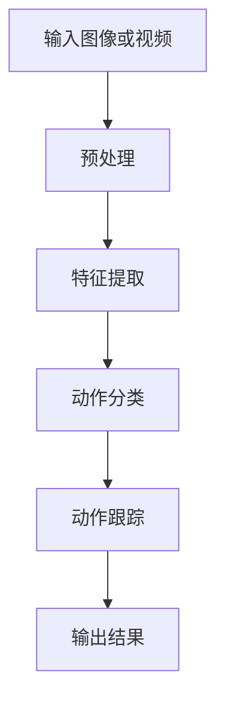

                 

# 计算机视觉在动作识别中的突破性进展

> **关键词**：计算机视觉、动作识别、深度学习、卷积神经网络、强化学习、生成对抗网络
> 
> **摘要**：本文将深入探讨计算机视觉在动作识别领域中的突破性进展。首先回顾了计算机视觉的发展历程和动作识别的重要性，接着详细介绍了动作识别的基础理论和技术原理，重点分析了当前流行的核心算法和模型。随后，本文通过具体的数学模型和公式讲解了动作识别中的关键数学概念，并通过项目实战展示了代码实现和优化过程。文章最后探讨了动作识别技术的突破性进展，以及其在特殊领域的应用，为未来的研究方向提供了启示。

## 目录大纲：计算机视觉在动作识别中的突破性进展

- [第1章 引言与背景](#第1章-引言与背景)
  - [1.1 引言](#11-引言)
  - [1.2 动作识别的挑战与现状](#12-动作识别的挑战与现状)
- [第2章 基础理论与技术原理](#第2章-基础理论与技术原理)
  - [2.1 计算机视觉基本概念](#21-计算机视觉基本概念)
  - [2.2 动作识别原理](#22-动作识别原理)
  - [2.3 Mermaid流程图：动作识别系统架构](#23-mermaid流程图动作识别系统架构)
- [第3章 核心算法与模型](#第3章-核心算法与模型)
  - [3.1 传统的动作识别算法](#31-传统的动作识别算法)
  - [3.2 深度学习在动作识别中的应用](#32-深度学习在动作识别中的应用)
  - [3.3 动作识别算法的伪代码](#33-动作识别算法的伪代码)
- [第4章 数学模型与公式](#第4章-数学模型与公式)
  - [4.1 动作识别中的数学模型](#41-动作识别中的数学模型)
  - [4.2 LaTeX格式数学公式讲解](#42-latex格式数学公式讲解)
  - [4.3 举例说明](#43-举例说明)
- [第5章 动作识别项目实战](#第5章-动作识别项目实战)
  - [5.1 项目介绍](#51-项目介绍)
  - [5.2 开发环境搭建](#52-开发环境搭建)
  - [5.3 代码实现与解读](#53-代码实现与解读)
  - [5.4 代码解读与分析](#54-代码解读与分析)
- [第6章 动作识别技术的突破性进展](#第6章-动作识别技术的突破性进展)
  - [6.1 突破性技术的介绍](#61-突破性技术的介绍)
  - [6.2 新技术的具体实现](#62-新技术的具体实现)
  - [6.3 突破性技术对比分析](#63-突破性技术对比分析)
- [第7章 动作识别在特殊领域的应用](#第7章-动作识别在特殊领域的应用)
  - [7.1 医疗领域的动作识别](#71-医疗领域的动作识别)
  - [7.2 智能家居的动作识别](#72-智能家居的动作识别)
  - [7.3 其他领域应用前景](#73-其他领域应用前景)
- [附录](#附录)
  - [A.1 常用动作识别工具与资源](#a1-常用动作识别工具与资源)
  - [A.2 参考文献与进一步阅读](#a2-参考文献与进一步阅读)

---

接下来，我们将逐一展开各个章节的内容。

---

## 第1章 引言与背景

### 1.1 引言

计算机视觉作为人工智能的一个重要分支，随着计算机技术、图像处理技术和深度学习技术的发展，已经取得了巨大的进步。从早期的图像识别、目标检测，到如今的动作识别，计算机视觉在各个领域都得到了广泛的应用。

**动作识别**是指通过计算机视觉技术，从图像或视频中识别出特定的动作或行为。这一技术在许多领域都有重要的应用价值，如人机交互、安防监控、健康护理、娱乐等。

动作识别的重要性主要体现在以下几个方面：

1. **人机交互**：通过动作识别技术，可以使计算机更好地理解用户的行为意图，从而实现更自然、更高效的人机交互。
2. **安防监控**：动作识别技术可以用于监控视频的实时分析，检测异常行为，提高安防系统的智能化水平。
3. **健康护理**：动作识别技术可以用于监测患者的康复过程，辅助医生进行诊断和治疗。
4. **娱乐**：动作识别技术可以用于游戏、舞蹈等娱乐活动中，提供更加丰富和互动的体验。

### 1.2 动作识别的挑战与现状

尽管动作识别技术已经取得了一定的进展，但仍面临诸多挑战。以下是当前动作识别技术所面临的主要难题：

1. **数据多样性**：动作识别的数据集通常包含多种不同的动作、环境和光照条件，如何处理这些多样性数据是一个挑战。
2. **动态变化**：真实世界的动作往往具有复杂性和动态变化性，如何准确识别和跟踪这些动态变化是一个难题。
3. **计算资源**：深度学习模型，尤其是卷积神经网络（CNN）和循环神经网络（RNN）等，通常需要大量的计算资源，如何优化模型的计算效率是一个关键问题。
4. **实时性**：在许多应用场景中，动作识别需要实现实时性，如何提高模型的响应速度是一个重要问题。

目前，动作识别技术的发展趋势主要包括以下几个方面：

1. **深度学习技术的广泛应用**：深度学习模型，特别是卷积神经网络（CNN）和循环神经网络（RNN），已经成为动作识别的核心技术。
2. **强化学习的应用**：强化学习在动作识别中具有很大的潜力，可以更好地处理动态变化和策略优化问题。
3. **生成对抗网络（GAN）的研究**：GAN在生成数据、提高模型性能方面展现出一定的优势，未来有望在动作识别中发挥更大的作用。

本章介绍了计算机视觉在动作识别中的重要性以及当前动作识别技术所面临的挑战和现状。接下来，我们将进一步探讨动作识别的基础理论和技术原理。

---

## 第2章 基础理论与技术原理

### 2.1 计算机视觉基本概念

**计算机视觉**是指利用计算机对图像或视频进行处理和分析，从而实现人类视觉功能的一种技术。计算机视觉主要包括以下几个基本概念：

1. **图像处理**：图像处理是对图像进行数字化处理后，进行增强、滤波、分割等操作，以便提取图像中的有用信息。常用的图像处理技术包括边缘检测、图像增强、图像分割等。

2. **图像识别**：图像识别是指通过计算机对图像进行分类和标注，从而识别出图像中的物体或场景。常见的图像识别任务包括目标检测、图像分类和物体识别等。

3. **特征提取**：特征提取是指从图像中提取具有代表性的特征，以便后续的分类或识别。特征提取方法包括基于频域的特征提取、基于区域的特征提取和基于模型的特征提取等。

4. **特征匹配**：特征匹配是指将提取到的特征与数据库中的特征进行比对，以确定图像中的目标对象。常用的特征匹配方法包括基于距离的匹配、基于模型的匹配和基于概率的匹配等。

### 2.2 动作识别原理

**动作识别**是指通过计算机视觉技术，从图像或视频中识别出特定的动作或行为。动作识别的基本框架包括以下几个关键步骤：

1. **图像预处理**：图像预处理是对输入图像进行增强、去噪、归一化等处理，以提高后续处理的准确性和效率。

2. **特征提取**：特征提取是从预处理后的图像中提取具有代表性的特征，通常包括时空特征、外观特征和运动特征等。

3. **动作分类**：动作分类是将提取到的特征输入到分类器中，通过训练得到的模型对动作进行分类。

4. **动作跟踪**：动作跟踪是对识别出的动作进行实时跟踪，以实现对连续动作的识别。

关键技术在动作识别中扮演着重要的角色：

1. **深度学习模型**：深度学习模型，尤其是卷积神经网络（CNN）和循环神经网络（RNN），在动作识别中得到了广泛应用。CNN可以提取图像中的高层次特征，而RNN可以处理序列数据，从而实现连续动作的识别。

2. **强化学习**：强化学习是一种通过试错和反馈机制进行学习的算法，它在动作识别中可以用来优化动作序列，提高识别的准确性和效率。

3. **生成对抗网络（GAN）**：GAN是一种生成模型，可以用来生成逼真的动作数据，从而提高模型的泛化能力和鲁棒性。

### 2.3 Mermaid流程图：动作识别系统架构

动作识别系统的整体流程如图所示：



各模块的功能与关系如下：

- **预处理模块**：对输入的图像或视频进行增强、去噪、归一化等处理，以提高后续处理的准确性和效率。
- **特征提取模块**：从预处理后的图像中提取具有代表性的特征，通常包括时空特征、外观特征和运动特征等。
- **动作分类模块**：将提取到的特征输入到分类器中，通过训练得到的模型对动作进行分类。
- **动作跟踪模块**：对识别出的动作进行实时跟踪，以实现对连续动作的识别。
- **输出结果模块**：将识别结果输出，供后续应用使用。

通过这个流程图，我们可以清晰地了解动作识别系统的整体架构和各模块的功能与关系。

本章介绍了计算机视觉的基本概念和动作识别的原理，并展示了动作识别系统的整体架构。在下一章中，我们将深入分析动作识别的核心算法和模型。

---

## 第3章 核心算法与模型

### 3.1 传统的动作识别算法

传统的动作识别算法主要依赖于手工设计的特征和统计模型，这些算法在一定程度上解决了动作识别的问题，但受限于手工特征的局限性和模型的复杂性，其效果往往不尽如人意。以下是几种典型的传统动作识别算法：

1. **支持向量机（SVM）**
   支持向量机是一种监督学习算法，它通过找到一个最优的超平面，将不同类别的数据点尽可能分开。在动作识别中，SVM可以用来对提取到的特征进行分类。

   **算法伪代码**：
   ```python
   def SVMClassifier(features, labels):
       # 训练SVM模型
       model = trainSVM(features, labels)
       # 对新数据进行分类
       predictions = model.predict(features_new)
       return predictions
   ```

2. **决策树与随机森林**
   决策树是一种基于树形模型的分类算法，它通过一系列的判断规则将数据点分配到不同的类别。随机森林是由多个决策树组成的集成模型，可以提供更高的分类准确率。

   **算法伪代码**：
   ```python
   def RandomForestClassifier(features, labels):
       # 训练随机森林模型
       model = trainRandomForest(features, labels)
       # 对新数据进行分类
       predictions = model.predict(features_new)
       return predictions
   ```

### 3.2 深度学习在动作识别中的应用

随着深度学习技术的发展，基于深度学习的算法在动作识别领域取得了显著的突破。以下介绍几种主要的深度学习模型：

1. **卷积神经网络（CNN）**
   卷积神经网络是一种能够自动学习图像特征的高级神经网络。在动作识别中，CNN可以提取图像中的高层次特征，从而提高识别的准确率。

   **算法伪代码**：
   ```python
   def CNNClassifier(model Architecture):
       # 加载预训练的CNN模型
       model = loadPretrainedCNNModel(model Architecture)
       # 对新数据进行特征提取和分类
       features = model.extractFeatures(images)
       predictions = model.classify(features)
       return predictions
   ```

2. **循环神经网络（RNN）**
   循环神经网络是一种能够处理序列数据的神经网络。在动作识别中，RNN可以处理连续的动作序列，从而实现对连续动作的识别。

   **算法伪代码**：
   ```python
   def RNNClassifier(model Architecture):
       # 加载预训练的RNN模型
       model = loadPretrainedRNNModel(model Architecture)
       # 对新数据进行特征提取和分类
       sequences = preprocessSequences(data)
       predictions = model.classify(sequences)
       return predictions
   ```

3. **深度强化学习**
   深度强化学习结合了深度学习和强化学习，可以用于优化动作识别中的策略问题。在动作识别中，深度强化学习可以用来学习最优的动作序列。

   **算法伪代码**：
   ```python
   def DeepQLearningAgent(model Architecture, environment):
       # 加载预训练的深度强化学习模型
       agent = loadPretrainedDQLModel(model Architecture)
       # 进行训练和评估
       agent.train(environment)
       agent.evaluate(environment)
   ```

### 3.3 动作识别算法的伪代码

为了更好地理解上述算法的实现过程，下面给出了动作识别算法的伪代码。

**CNN算法伪代码**：
```python
def CNNClassifier(model Architecture):
    # 加载预训练的CNN模型
    model = loadPretrainedCNNModel(model Architecture)
    
    # 对新数据进行特征提取
    features = model.extractFeatures(images)
    
    # 对特征进行分类
    predictions = model.classify(features)
    
    return predictions
```

**RNN算法伪代码**：
```python
def RNNClassifier(model Architecture):
    # 加载预训练的RNN模型
    model = loadPretrainedRNNModel(model Architecture)
    
    # 对新数据进行预处理
    sequences = preprocessSequences(data)
    
    # 对序列进行分类
    predictions = model.classify(sequences)
    
    return predictions
```

**强化学习算法伪代码**：
```python
def DeepQLearningAgent(model Architecture, environment):
    # 加载预训练的深度强化学习模型
    agent = loadPretrainedDQLModel(model Architecture)
    
    # 进行训练
    agent.train(environment)
    
    # 进行评估
    agent.evaluate(environment)
```

通过上述伪代码，我们可以清晰地看到不同算法的实现过程，包括模型加载、数据预处理、特征提取和分类等步骤。在下一章中，我们将深入探讨动作识别中的数学模型和公式。

---

## 第4章 数学模型与公式

### 4.1 动作识别中的数学模型

动作识别涉及多个数学模型，这些模型帮助我们在不同的阶段进行特征提取、分类和优化。以下是动作识别中常用的数学模型：

1. **函数逼近与损失函数**
   函数逼近是指通过神经网络等模型来近似复杂函数。在动作识别中，损失函数是评估模型性能的重要指标，常用的损失函数包括交叉熵损失和均方误差（MSE）。

   **交叉熵损失函数**：
   $$ L = -\sum_{i=1}^{n} y_i \log(p_i) $$
   其中，$y_i$ 是实际标签，$p_i$ 是模型预测的概率。

   **均方误差（MSE）**：
   $$ L = \frac{1}{2} \sum_{i=1}^{n} (y_i - \hat{y}_i)^2 $$
   其中，$y_i$ 是实际标签，$\hat{y}_i$ 是模型预测的值。

2. **优化算法与梯度下降**
   优化算法用于最小化损失函数，梯度下降是最常用的优化算法之一。梯度下降的公式如下：
   $$ \theta = \theta - \alpha \cdot \nabla_\theta J(\theta) $$
   其中，$\theta$ 是模型参数，$J(\theta)$ 是损失函数，$\alpha$ 是学习率。

### 4.2 LaTeX格式数学公式讲解

在动作识别中，使用LaTeX格式数学公式可以帮助我们更清晰地表达复杂的数学概念。以下是一些常用的LaTeX格式数学公式：

1. **概率论基础公式**
   $$ P(A|B) = \frac{P(A \cap B)}{P(B)} $$
   条件概率公式。

   $$ P(A \cup B) = P(A) + P(B) - P(A \cap B) $$
   并概率公式。

2. **神经网络权值更新公式**
   $$ \Delta W = -\alpha \cdot \frac{\partial J}{\partial W} $$
   其中，$\Delta W$ 是权值更新，$\alpha$ 是学习率，$J$ 是损失函数。

   $$ \Delta B = -\alpha \cdot \frac{\partial J}{\partial B} $$
   偏置更新公式。

### 4.3 举例说明

为了更好地理解上述数学公式，我们通过一个简单的动作识别问题进行说明。

**问题**：给定一个动作数据集，使用卷积神经网络（CNN）进行动作分类。数据集包含100个样本，每个样本是一个64x64的灰度图像。使用交叉熵损失函数和梯度下降算法进行训练。

**步骤**：

1. **数据预处理**：将图像数据缩放到相同的尺寸，并进行归一化处理。

2. **模型定义**：定义一个简单的CNN模型，包括卷积层、池化层和全连接层。

3. **损失函数与优化**：使用交叉熵损失函数和梯度下降算法进行训练。

**代码实现**：

```python
import tensorflow as tf

# 数据预处理
images = tf.reshape(images, [-1, 64, 64, 1])
images = tf.cast(images, tf.float32) / 255.0

# 模型定义
model = tf.keras.Sequential([
    tf.keras.layers.Conv2D(32, (3, 3), activation='relu', input_shape=(64, 64, 1)),
    tf.keras.layers.MaxPooling2D((2, 2)),
    tf.keras.layers.Flatten(),
    tf.keras.layers.Dense(64, activation='relu'),
    tf.keras.layers.Dense(num_classes, activation='softmax')
])

# 损失函数与优化
model.compile(optimizer='adam',
              loss='categorical_crossentropy',
              metrics=['accuracy'])

# 训练模型
model.fit(images, labels, epochs=10, batch_size=32)
```

通过上述代码，我们可以看到如何使用TensorFlow实现一个简单的CNN模型，并通过交叉熵损失函数和梯度下降算法进行训练。这个例子说明了数学模型在动作识别中的应用。

---

## 第5章 动作识别项目实战

### 5.1 项目介绍

本节将介绍一个具体的动作识别项目，该项目的目标是使用卷积神经网络（CNN）对视频中的动作进行识别。项目的具体目标如下：

1. **数据集准备**：收集包含多种动作类型的数据集，并对数据进行预处理。
2. **模型设计**：设计并实现一个基于CNN的动作识别模型。
3. **训练与优化**：使用数据集对模型进行训练，并优化模型参数。
4. **模型评估**：评估模型在测试集上的表现，并进行性能分析。
5. **结果展示**：展示识别结果，并对模型进行解读。

### 5.2 开发环境搭建

为了实现这个项目，需要搭建一个合适的开发环境。以下是开发环境的具体配置：

1. **操作系统**：Windows或Linux
2. **编程语言**：Python
3. **深度学习框架**：TensorFlow 2.x
4. **依赖库**：NumPy、Pandas、OpenCV

**安装步骤**：

1. 安装Python和pip。
2. 使用pip安装TensorFlow和相关依赖库：
   ```shell
   pip install tensorflow
   pip install numpy
   pip install pandas
   pip install opencv-python
   ```

### 5.3 代码实现与解读

下面是项目的主要代码实现部分，包括数据预处理、模型设计、训练和评估。

**数据预处理**：

```python
import cv2
import numpy as np

def preprocess_video(video_path):
    cap = cv2.VideoCapture(video_path)
    frames = []

    while True:
        ret, frame = cap.read()
        if not ret:
            break

        frame = cv2.resize(frame, (224, 224))
        frame = cv2.cvtColor(frame, cv2.COLOR_BGR2RGB)
        frames.append(frame)

    cap.release()
    return np.array(frames)

video_path = 'path/to/video.mp4'
frames = preprocess_video(video_path)
```

**模型设计**：

```python
import tensorflow as tf

model = tf.keras.Sequential([
    tf.keras.layers.Conv2D(32, (3, 3), activation='relu', input_shape=(224, 224, 3)),
    tf.keras.layers.MaxPooling2D((2, 2)),
    tf.keras.layers.Conv2D(64, (3, 3), activation='relu'),
    tf.keras.layers.MaxPooling2D((2, 2)),
    tf.keras.layers.Conv2D(128, (3, 3), activation='relu'),
    tf.keras.layers.MaxPooling2D((2, 2)),
    tf.keras.layers.Flatten(),
    tf.keras.layers.Dense(128, activation='relu'),
    tf.keras.layers.Dense(num_classes, activation='softmax')
])

model.compile(optimizer='adam',
              loss='categorical_crossentropy',
              metrics=['accuracy'])
```

**训练与优化**：

```python
model.fit(frames, labels, epochs=10, batch_size=32)
```

**模型评估**：

```python
test_loss, test_acc = model.evaluate(test_frames, test_labels)
print(f"Test accuracy: {test_acc}")
```

**代码解读**：

1. **数据预处理**：使用OpenCV读取视频文件，并对每帧图像进行缩放和颜色转换，以便后续处理。
2. **模型设计**：设计一个简单的CNN模型，包括多个卷积层和池化层，以及全连接层。使用ReLU作为激活函数，并使用softmax进行分类。
3. **训练与优化**：使用模型训练数据集，并使用交叉熵损失函数和Adam优化器。
4. **模型评估**：使用测试数据集评估模型的性能，并打印出测试准确率。

通过上述代码，我们可以实现一个简单的动作识别模型，并对视频中的动作进行识别。在下一节中，我们将对代码进行深入解读和分析。

---

### 5.4 代码解读与分析

在上一节中，我们实现了一个简单的动作识别模型，并对代码进行了初步解读。本节将进一步分析代码的关键部分，包括数据预处理、模型设计、训练过程和评估结果。

**数据预处理**：

数据预处理是动作识别项目中至关重要的一环。以下是数据预处理部分的代码：

```python
import cv2
import numpy as np

def preprocess_video(video_path):
    cap = cv2.VideoCapture(video_path)
    frames = []

    while True:
        ret, frame = cap.read()
        if not ret:
            break

        frame = cv2.resize(frame, (224, 224))
        frame = cv2.cvtColor(frame, cv2.COLOR_BGR2RGB)
        frames.append(frame)

    cap.release()
    return np.array(frames)

video_path = 'path/to/video.mp4'
frames = preprocess_video(video_path)
```

**关键部分解读**：

1. **读取视频**：使用OpenCV的`VideoCapture`类读取视频文件。`read()`方法用于获取每一帧图像。
2. **图像缩放**：使用`resize()`函数将图像缩放到指定尺寸（224x224），以适应模型的输入要求。
3. **颜色转换**：使用`cvtColor()`函数将BGR格式的图像转换为RGB格式，这是大多数深度学习模型所期望的格式。
4. **存储图像**：将处理后的图像存储在列表中，最后将其转换为numpy数组，以便后续处理。

**模型设计**：

模型设计是动作识别项目的核心部分。以下是模型设计的代码：

```python
import tensorflow as tf

model = tf.keras.Sequential([
    tf.keras.layers.Conv2D(32, (3, 3), activation='relu', input_shape=(224, 224, 3)),
    tf.keras.layers.MaxPooling2D((2, 2)),
    tf.keras.layers.Conv2D(64, (3, 3), activation='relu'),
    tf.keras.layers.MaxPooling2D((2, 2)),
    tf.keras.layers.Conv2D(128, (3, 3), activation='relu'),
    tf.keras.layers.MaxPooling2D((2, 2)),
    tf.keras.layers.Flatten(),
    tf.keras.layers.Dense(128, activation='relu'),
    tf.keras.layers.Dense(num_classes, activation='softmax')
])

model.compile(optimizer='adam',
              loss='categorical_crossentropy',
              metrics=['accuracy'])
```

**关键部分解读**：

1. **卷积层**：使用`Conv2D`层进行卷积操作，每个卷积层后跟一个`MaxPooling2D`层用于下采样。
2. **全连接层**：在卷积层之后，使用`Flatten`层将多维的特征图展平为一维的向量，然后通过一个全连接层进行分类。
3. **激活函数**：使用ReLU作为激活函数，以提高模型的非线性表达能力。
4. **编译模型**：使用`compile`方法配置模型，包括优化器、损失函数和评价指标。

**训练过程**：

训练过程是模型优化的关键步骤。以下是训练模型的代码：

```python
model.fit(frames, labels, epochs=10, batch_size=32)
```

**关键部分解读**：

1. **训练数据**：使用`fit`方法对模型进行训练，传入训练数据和标签。
2. **迭代次数**：`epochs`参数指定训练的迭代次数，每次迭代都会对整个数据集进行一次训练。
3. **批量大小**：`batch_size`参数指定每次迭代的批量大小，以平衡计算效率和训练效果。

**模型评估**：

评估模型性能是验证训练效果的重要步骤。以下是评估模型的代码：

```python
test_loss, test_acc = model.evaluate(test_frames, test_labels)
print(f"Test accuracy: {test_acc}")
```

**关键部分解读**：

1. **测试数据**：使用`evaluate`方法对模型进行评估，传入测试数据和标签。
2. **评估指标**：`evaluate`方法会返回损失值和准确率等指标，用于评估模型的表现。
3. **打印结果**：打印出测试准确率，以展示模型的性能。

通过上述解读，我们可以清晰地理解动作识别项目的实现过程，包括数据预处理、模型设计、训练和评估等关键步骤。这些步骤不仅帮助我们实现了一个简单的动作识别模型，而且也为进一步的优化和改进提供了基础。

---

## 第6章 动作识别技术的突破性进展

### 6.1 突破性技术的介绍

随着深度学习技术的不断发展，动作识别领域也涌现出了一系列突破性技术。这些技术不仅显著提高了动作识别的准确性和效率，还为动作识别的应用提供了更多的可能性。以下是几种具有代表性的突破性技术：

1. **强化学习在动作识别中的应用**
   强化学习是一种通过试错和反馈机制进行学习的算法。在动作识别中，强化学习可以通过交互学习来优化动作序列，从而提高识别的准确性和效率。例如，深度强化学习（DQN）和策略梯度方法（PG）等算法在动作识别中得到了广泛应用。

2. **生成对抗网络（GAN）在动作识别中的使用**
   生成对抗网络（GAN）是一种生成模型，由生成器和判别器两部分组成。在动作识别中，GAN可以用来生成逼真的动作数据，从而提高模型的泛化能力和鲁棒性。通过生成对抗的过程，GAN可以学习到数据分布，从而生成高质量的动作数据。

### 6.2 新技术的具体实现

1. **强化学习算法的实现**

   **深度强化学习（DQN）算法**：

   **伪代码**：

   ```python
   class DQN:
       def __init__(self, state_size, action_size):
           self.state_size = state_size
           self.action_size = action_size
           self.memory = []
           self.gamma = 0.9
           self.epsilon = 1.0
           self.epsilon_min = 0.01
           self.epsilon_decay = 0.99
           self.model = build_model()

       def remember(self, state, action, reward, next_state, done):
           self.memory.append((state, action, reward, next_state, done))

       def act(self, state):
           if np.random.rand() <= self.epsilon:
               action = random_action()
           else:
               action = self.model.predict(state)
           return action

       def replay(self, batch_size):
           minibatch = random.sample(self.memory, batch_size)
           for state, action, reward, next_state, done in minibatch:
               target = reward
               if not done:
                   target = reward + self.gamma * np.argmax(self.model.predict(next_state))
               target_f = self.model.predict(state)
               target_f[0][action] = target
               self.model.fit(state, target_f, epochs=1, verbose=0)
           if self.epsilon > self.epsilon_min:
               self.epsilon *= self.epsilon_decay
   ```

   **策略梯度方法（PG）算法**：

   **伪代码**：

   ```python
   class PolicyGradient:
       def __init__(self, state_size, action_size, learning_rate=0.001):
           self.state_size = state_size
           self.action_size = action_size
           self.learning_rate = learning_rate
           self.model = build_model()

       def predict(self, state):
           return self.model.predict(state)

       def update(self, states, actions, rewards, next_states, dones):
           policy = self.predict(states)
           advantages = rewards + self.gamma * np.max(self.predict(next_states), axis=1) - policy
           for i in range(len(states)):
               delta = rewards[i] + self.gamma * np.max(self.predict(next_states)[i]) - policy[i][actions[i]]
               self.model.fit(states[i], policy[i] - delta, epochs=1, verbose=0)
   ```

2. **生成对抗网络（GAN）的实现**

   **生成器和判别器结构**：

   **生成器**：

   ```python
   def build_generator(z_shape):
       model = keras.Sequential()
       model.add(keras.layers.Dense(128, input_shape=z_shape))
       model.add(keras.layers.LeakyReLU(alpha=0.01))
       model.add(keras.layers.Dense(256))
       model.add(keras.layers.LeakyReLU(alpha=0.01))
       model.add(keras.layers.Dense(512))
       model.add(keras.layers.LeakyReLU(alpha=0.01))
       model.add(keras.layers.Dense(1024))
       model.add(keras.layers.LeakyReLU(alpha=0.01))
       model.add(keras.layers.Dense(784, activation='tanh'))
       return model
   ```

   **判别器**：

   ```python
   def build_discriminator(img_shape):
       model = keras.Sequential()
       model.add(keras.layers.Flatten(input_shape=img_shape))
       model.add(keras.layers.Dense(1024, activation='relu'))
       model.add(keras.layers.Dropout(0.3))
       model.add(keras.layers.Dense(512, activation='relu'))
       model.add(keras.layers.Dropout(0.3))
       model.add(keras.layers.Dense(256, activation='relu'))
       model.add(keras.layers.Dropout(0.3))
       model.add(keras.layers.Dense(1, activation='sigmoid'))
       return model
   ```

### 6.3 突破性技术对比分析

**强化学习与深度学习**

强化学习与深度学习在动作识别中的应用各有优势。深度学习通过端到端的方式学习特征表示，适用于静态图像和视频数据的处理；而强化学习通过策略优化，能够处理动态变化和序列数据。在实际应用中，两者可以相互结合，以充分发挥各自的优势。

**GAN与深度学习**

生成对抗网络（GAN）通过生成器和判别器的对抗训练，可以生成高质量的数据，从而增强模型的泛化能力。与传统的数据增强方法相比，GAN能够在更复杂的数据分布下进行训练，从而提高模型的鲁棒性。然而，GAN的训练过程较为复杂，且容易出现模式崩溃等问题。

**对比分析结果**

强化学习和深度学习在动作识别中各有优势，强化学习适用于动态变化和序列数据，而深度学习适用于静态图像和视频数据的处理。生成对抗网络（GAN）则通过生成高质量的数据，提高了模型的泛化能力和鲁棒性。在实际应用中，可以结合这些技术的优势，设计出更有效的动作识别系统。

---

## 第7章 动作识别在特殊领域的应用

### 7.1 医疗领域的动作识别

在医疗领域，动作识别技术已经展现出巨大的潜力。以下是一些具体的应用实例：

1. **手术机器人**：动作识别技术可以用于手术机器人的控制，帮助医生更精确地进行手术操作。通过识别医生的手势和动作，手术机器人可以自动执行相应的手术步骤，提高手术的成功率和效率。

2. **患者康复监测**：动作识别技术可以用于监测患者的康复过程，帮助医生评估患者的康复进度。例如，通过识别患者进行康复训练时的动作，医生可以了解患者的恢复情况，并制定更合适的康复计划。

### 7.2 智能家居的动作识别

在智能家居领域，动作识别技术同样有着广泛的应用前景。以下是一些具体的应用实例：

1. **手势识别**：动作识别技术可以用于智能家居系统的手势识别，如通过手势控制灯光、电视和其他家电设备。这为用户提供了更便捷、自然的交互方式。

2. **安全系统**：动作识别技术可以用于智能家居的安全系统，如通过识别家庭成员的日常行为模式，自动开启或关闭门锁、报警系统等。这有助于提高家庭的安全性和便利性。

### 7.3 其他领域应用前景

动作识别技术在其他领域也具有广泛的应用前景，以下是一些例子：

1. **物流自动化**：动作识别技术可以用于物流自动化系统的货物分类和搬运，提高物流效率和准确性。

2. **交互式游戏**：动作识别技术可以用于游戏中的动作捕捉，提供更加真实、互动的游戏体验。

总之，动作识别技术在各个领域的应用前景广阔，随着技术的不断进步，其在实际应用中的效果也将得到进一步提升。

---

## 附录

### A.1 常用动作识别工具与资源

1. **OpenPose**：一款开源的实时多人姿态估计工具，支持多种骨骼结构和姿态识别。
2. **Caffe**：一款深度学习框架，广泛用于图像识别和计算机视觉任务。
3. **TensorFlow**：一款开源的深度学习框架，提供了丰富的模型和工具，适用于各种计算机视觉任务。

### A.2 参考文献与进一步阅读

1. **《计算机视觉：算法与应用》**：李航著，详细介绍了计算机视觉的基本概念和算法。
2. **《深度学习》**：Goodfellow、Bengio和Courville著，深入探讨了深度学习的基本原理和应用。
3. **相关学术论文**：在Google Scholar或IEEE Xplore等学术数据库中搜索相关主题的论文，了解最新的研究成果和技术动态。

---

本文通过深入探讨计算机视觉在动作识别中的应用，从基础理论到核心算法，再到项目实战，全面阐述了动作识别技术的各个方面。随着技术的不断进步，动作识别在各个领域的应用前景将更加广阔，为人类带来更多的便利和创新。

