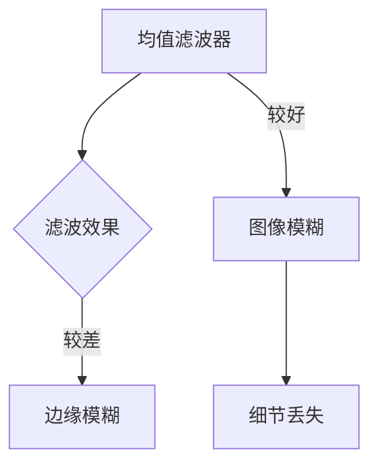
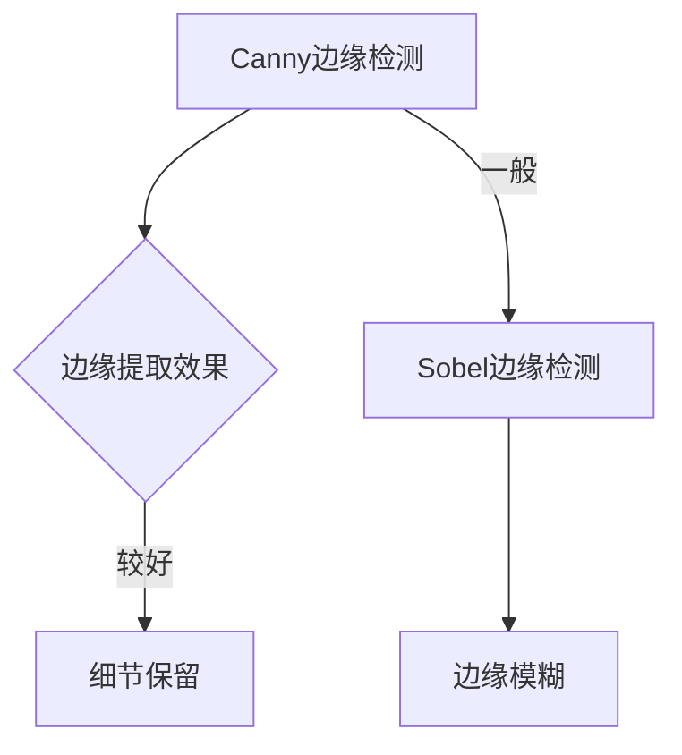
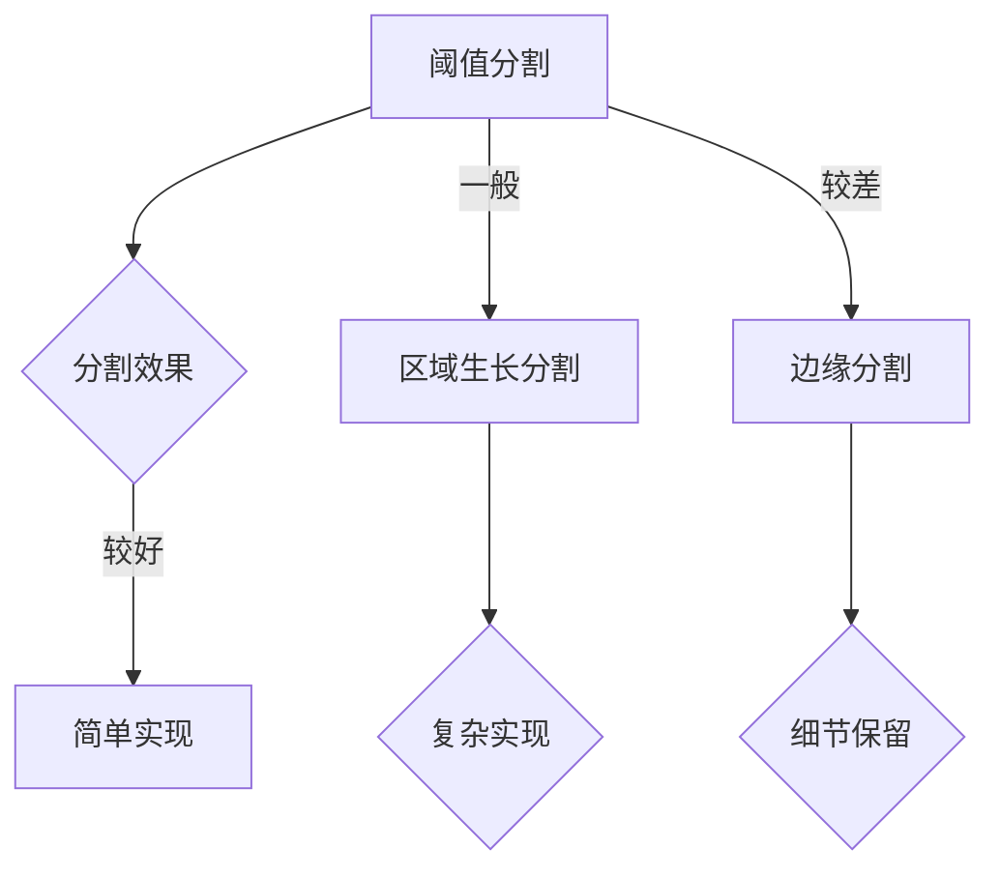

                 

# 《计算机视觉在智能零售中的应用》

> **关键词：智能零售、计算机视觉、应用、趋势、挑战、未来**
>
> **摘要：本文深入探讨了计算机视觉在智能零售领域的应用，从技术基础到实际案例，详细阐述了计算机视觉如何助力零售行业提升效率、优化服务和增强用户体验。文章还探讨了该领域的挑战与未来发展趋势。**

### 目录

1. 第一部分：智能零售与计算机视觉概述
   1.1 智能零售的背景与趋势
   1.2 计算机视觉技术概述
   1.3 计算机视觉在智能零售中的应用前景

2. 第二部分：计算机视觉技术基础
   2.1 图像处理基础
   2.2 特征提取与降维
   2.3 目标检测与识别
   2.4 人脸识别与生物特征识别
   2.5 计算机视觉中的深度学习技术

3. 第三部分：计算机视觉在智能零售中的实际应用
   3.1 智能零售门店布局优化
   3.2 智能商品识别与推荐
   3.3 智能客服与智能导购
   3.4 智能零售供应链优化

4. 第四部分：计算机视觉在智能零售中的挑战与未来
   4.1 计算机视觉在智能零售中的挑战与对策
   4.2 计算机视觉在智能零售中的未来趋势

5. 附录
   5.1 计算机视觉常用工具与资源
   5.2 智能零售案例分析

### 1.1 智能零售的背景与趋势

**智能零售**是现代零售业的一种新型模式，它通过整合人工智能、大数据、云计算和物联网等先进技术，对零售业务流程进行优化，从而提升零售效率、改善消费者体验、增强商业决策能力。随着消费者需求的变化和技术的进步，智能零售正逐渐成为零售行业的主要发展趋势。

**背景：**

- **消费升级：**随着消费者购买力的提升和消费观念的转变，消费者对购物体验的要求越来越高，他们追求更加个性化和智能化的服务。

- **技术进步：**人工智能、大数据和云计算等技术的飞速发展，为智能零售提供了强大的技术支持。

- **零售业竞争：**在电商的冲击下，传统零售业面临着巨大的挑战，智能零售成为零售企业提升竞争力的重要手段。

**趋势：**

- **数字化：**零售企业通过数字化手段，实现线上线下一体化，提升运营效率。

- **智能化：**通过人工智能技术，实现商品识别、智能推荐、智能客服等，提升消费者体验。

- **个性化：**通过大数据分析，实现精准营销和个性化服务。

### 1.2 计算机视觉技术概述

**计算机视觉**是人工智能的一个重要分支，它使计算机能够像人一样理解并解释视觉信息。计算机视觉技术主要包括图像处理、特征提取、目标检测与识别、人脸识别与生物特征识别等。

**技术概述：**

- **图像处理：**对图像进行滤波、边缘检测、图像分割等操作，提取图像的特征信息。

- **特征提取与降维：**从大量图像数据中提取出有用的特征，并降低特征维度，以便于后续处理。

- **目标检测与识别：**在图像中定位并识别特定目标。

- **人脸识别与生物特征识别：**通过分析人脸、指纹、虹膜等生物特征，实现身份验证。

### 1.3 计算机视觉在智能零售中的应用前景

计算机视觉技术在智能零售中具有广泛的应用前景，主要包括以下几个方面：

- **门店布局优化：**通过计算机视觉技术，分析顾客流量和行为，优化门店布局，提升顾客体验。

- **商品识别与推荐：**利用计算机视觉技术，快速识别商品，实现智能推荐。

- **智能客服与导购：**通过计算机视觉技术，实现智能客服和导购，提升服务质量。

- **供应链优化：**利用计算机视觉技术，对供应链各环节进行监控和分析，实现供应链优化。

### 2.1 图像处理基础

图像处理是计算机视觉的基础技术之一，它包括图像滤波、边缘检测、图像分割等。

**图像滤波：**图像滤波是一种用于消除图像噪声的方法。常见的滤波器有均值滤波器、高斯滤波器和中值滤波器。

**边缘检测：**边缘检测是一种用于提取图像中边缘的方法。常用的算法有Canny边缘检测算法和Sobel边缘检测算法。

**图像分割：**图像分割是一种将图像划分为不同区域的方法。常用的算法有阈值分割、区域生长分割和边缘分割。

### 2.2 特征提取与降维

特征提取是计算机视觉中的一个关键步骤，它从图像中提取出具有区分性的特征，用于后续的目标检测和识别。降维是将高维特征空间映射到低维空间，以便于计算和存储。

**特征提取方法：**

- **直方图特征：**对图像的像素进行统计，得到直方图特征。

- **Hu不变矩：**对图像的灰度分布进行描述，得到Hu不变矩。

- **主成分分析（PCA）：**通过线性变换，将高维特征映射到低维空间。

**降维方法：**

- **线性判别分析（LDA）：**通过最大化类间方差和最小化类内方差，实现降维。

- **自动编码器：**通过神经网络，实现特征降维。

### 2.3 目标检测与识别

目标检测是计算机视觉中的一个重要任务，它旨在从图像中定位并识别特定目标。目标识别是在检测到目标后，对目标进行分类。

**目标检测算法：**

- **基于区域提议的方法：**如选择性搜索（Selective Search）。

- **基于滑动窗口的方法：**如R-CNN系列。

- **基于深度学习的方法：**如YOLO、SSD等。

**目标识别算法：**

- **传统机器学习方法：**如SVM、KNN等。

- **深度学习方法：**如CNN、RNN等。

### 2.4 人脸识别与生物特征识别

人脸识别和生物特征识别是计算机视觉技术中非常重要的应用领域。

**人脸识别：**人脸识别是通过分析人脸特征，实现身份验证。常用的算法有Eigenfaces、Fisherfaces等。

**生物特征识别：**生物特征识别是通过分析人体的生物特征，实现身份验证。常见的生物特征有指纹、虹膜、人脸等。

### 2.5 计算机视觉中的深度学习技术

深度学习是计算机视觉中的一个重要分支，它通过构建多层神经网络，实现特征提取和分类。

**深度学习模型：**

- **卷积神经网络（CNN）：**通过卷积操作，提取图像特征。

- **循环神经网络（RNN）：**通过序列处理，实现时序特征提取。

- **生成对抗网络（GAN）：**通过对抗训练，实现特征生成。

### 3.1 智能零售门店布局优化

智能零售门店布局优化是提升零售效率和服务质量的重要手段。通过计算机视觉技术，可以对门店的顾客流量和行为进行分析，从而优化门店布局。

**步骤：**

1. **数据收集：**使用摄像头收集顾客流量数据。

2. **数据处理：**使用图像处理技术，对图像进行滤波、边缘检测和分割。

3. **行为分析：**使用目标检测和识别技术，分析顾客的行为和路径。

4. **布局优化：**根据分析结果，优化门店布局，提升顾客体验。

### 3.2 智能商品识别与推荐

智能商品识别与推荐是提升消费者购物体验的关键技术。通过计算机视觉技术，可以快速识别商品，并实现智能推荐。

**步骤：**

1. **商品识别：**使用图像处理和特征提取技术，识别商品。

2. **推荐系统：**使用机器学习和深度学习技术，构建推荐系统。

3. **推荐评估：**使用用户行为数据和推荐效果，评估推荐系统。

### 3.3 智能客服与智能导购

智能客服和智能导购是提升零售服务质量的重要手段。通过计算机视觉技术，可以实现对顾客的智能服务和引导。

**步骤：**

1. **智能客服：**使用自然语言处理和语音识别技术，实现智能客服。

2. **智能导购：**使用图像处理和目标检测技术，实现智能导购。

3. **交互设计：**设计交互式智能导购系统，提升用户体验。

### 3.4 智能零售供应链优化

智能零售供应链优化是提升零售效率和企业竞争力的重要手段。通过计算机视觉技术，可以对供应链各环节进行监控和分析，实现供应链优化。

**步骤：**

1. **数据采集：**使用传感器和摄像头，收集供应链数据。

2. **数据分析：**使用图像处理和特征提取技术，分析供应链数据。

3. **优化策略：**根据分析结果，制定供应链优化策略。

4. **实践案例：**通过具体案例，展示智能零售供应链优化的效果。

### 4.1 计算机视觉在智能零售中的挑战与对策

尽管计算机视觉技术在智能零售中具有广泛的应用前景，但仍然面临着一些挑战。

**挑战：**

1. **数据隐私与伦理问题：**计算机视觉技术需要大量用户数据，这引发了数据隐私和伦理问题。

2. **算法公平性与透明性：**算法的公平性和透明性是保证智能零售系统公正运行的关键。

3. **技术适应性挑战：**不同零售场景下的技术适应性是计算机视觉技术面临的一个重要问题。

**对策：**

1. **数据隐私保护：**通过数据加密、匿名化和隐私保护算法，确保用户数据的安全。

2. **算法公平性与透明性：**通过算法验证、公平性分析和透明性设计，提升算法的公平性和透明性。

3. **技术适应性：**通过模块化设计和自适应算法，提升技术的适应性。

### 4.2 计算机视觉在智能零售中的未来趋势

随着技术的不断进步，计算机视觉在智能零售中的应用将更加广泛和深入。

**趋势：**

1. **人工智能与物联网的融合：**人工智能和物联网技术的融合，将推动智能零售的发展。

2. **个性化与智能化：**智能零售将更加注重个性化服务和智能化运营。

3. **区块链技术的应用：**区块链技术将应用于智能零售，提升供应链的透明性和安全性。

### 附录A：计算机视觉常用工具与资源

**OpenCV：**OpenCV是一个开源的计算机视觉库，提供了丰富的图像处理和计算机视觉算法。

**TensorFlow：**TensorFlow是一个开源的深度学习框架，可以用于构建和训练深度学习模型。

**PyTorch：**PyTorch是一个开源的深度学习框架，具有简洁的代码和强大的功能。

**其他计算机视觉工具和库：**如Dlib、OpenFace、dlib等。

### 附录B：智能零售案例分析

**案例一：XX超市的智能零售实践**：通过计算机视觉技术，实现商品识别、智能推荐和智能客服，提升购物体验。

**案例二：XX电商平台的智能推荐系统**：通过深度学习技术，构建智能推荐系统，提升用户购物满意度。

**案例三：XX零售企业的智能导购系统**：通过图像处理和目标检测技术，实现智能导购，提升服务质量。

### 结语

计算机视觉在智能零售中的应用具有巨大的潜力。通过深入研究和应用计算机视觉技术，可以提升零售效率、优化服务和增强用户体验。然而，我们也需要关注技术带来的挑战和问题，确保智能零售的健康、可持续发展。

### 作者

**作者：AI天才研究院/AI Genius Institute & 禅与计算机程序设计艺术 /Zen And The Art of Computer Programming**

---

**注意：本文为示例性文章，仅供参考。实际文章撰写时，应根据具体需求和数据进行详细的撰写和调整。**<|im_end|>

