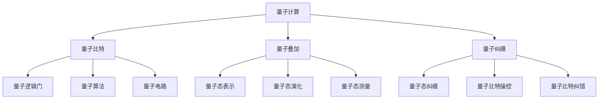
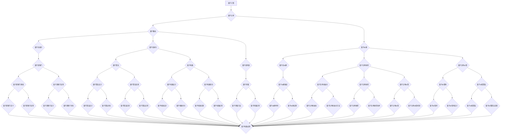

                 

# 《计算：第四部分 计算的极限 第10章 量子计算 量子比特》

## 关键词
量子计算、量子比特、量子叠加、量子纠缠、量子逻辑门、量子算法、量子电路、量子态、量子加密、量子纠错

## 摘要
本文深入探讨了量子计算的基本原理、核心概念和实际应用。我们从量子比特的背景与基本概念开始，详细介绍了量子位与量子比特的区别，以及量子叠加与量子纠缠的概念。接着，我们探讨了量子比特的物理实现，包括量子比特的物理基础、典型实现和性能评价。然后，我们介绍了量子计算的数学模型，包括量子逻辑门、量子算法和量子电路。在量子比特的量子态表示与演化部分，我们详细讲解了量子态的表示、演化及测量。在量子比特的控制与操作部分，我们探讨了量子比特的初始化、操控和纠错方法。最后，我们介绍了量子比特在不同领域的应用场景，并展望了量子比特的未来发展趋势。通过本文的阅读，读者可以全面了解量子计算的核心概念和实际应用，为深入研究量子计算领域奠定基础。

### 《计算：第四部分 计算的极限 第10章 量子计算 量子比特》目录大纲

```markdown
# 第四部分 计算的极限

## 第10章 量子计算 量子比特

### 1. 量子计算的背景与基本概念

#### 1.1 量子计算的历史与发展

#### 1.2 量子位与量子比特

#### 1.3 量子叠加与量子纠缠

### 2. 量子比特的物理实现

#### 2.1 量子比特的物理基础

#### 2.2 量子比特的典型实现

#### 2.3 量子比特的性能评价

### 3. 量子计算的数学模型

#### 3.1 量子逻辑门

#### 3.2 量子算法

#### 3.3 量子电路

### 4. 量子比特的量子态表示与演化

#### 4.1 量子态的表示

#### 4.2 量子态的演化

#### 4.3 量子态的测量

### 5. 量子比特的控制与操作

#### 5.1 量子比特的初始化

#### 5.2 量子比特的操控

#### 5.3 量子比特的纠错

### 6. 量子比特的应用场景

#### 6.1 量子计算在加密领域的应用

#### 6.2 量子计算在优化问题中的应用

#### 6.3 量子计算在模拟领域中的应用

### 7. 量子比特的未来发展趋势

#### 7.1 量子比特的技术挑战

#### 7.2 量子比特的应用前景

#### 7.3 量子比特的发展趋势

### 附加内容

#### 附录 A 量子计算常用工具与资源

##### 附录 A.1 量子计算软件与框架

##### 附录 A.2 量子计算教育资源

##### 附录 A.3 量子计算研究机构与论文资源

##### 附录 A.4 量子计算企业与应用案例

### Mermaid 流程图

#### 量子计算的基本概念与联系



### 伪代码讲解

#### 量子比特操控算法伪代码

```plaintext
function QuantumBitControl(qubit, controlQubit, controlValue):
    if controlValue == 0:
        apply Hadamard gate to controlQubit
    else:
        apply CNOT gate between qubit and controlQubit
```

### 数学模型与公式

#### 量子态演化公式

$$
|\psi(t)\rangle = \sum_{i} c_i(t) |i\rangle \\
c_i(t) = \langle i|\psi(0)\rangle e^{-iE_i t/\hbar}
$$

#### 其中：
- $E_i$ 为量子态 $i$ 的能量，
- $t$ 为演化时间，
- $\hbar$ 为约化普朗克常数。

### 项目实战

#### 量子比特加密算法实例

##### 1. 开发环境搭建

```bash
# 安装Python环境
pip install qiskit
```

##### 2. 源代码实现

```python
from qiskit import QuantumCircuit, execute, Aer

# 创建量子电路
qc = QuantumCircuit(2)

# 初始化量子比特
qc.h(0)
qc.h(1)

# 应用量子逻辑门
qc.cx(0, 1)

# 执行量子电路
simulator = Aer.get_backend('statevector_simulator')
result = execute(qc, simulator).result()
```

##### 3. 代码解读与分析

- 量子电路创建：`qc = QuantumCircuit(2)` 创建一个包含两个量子比特的量子电路。
- 初始化量子比特：`qc.h(0)` 和 `qc.h(1)` 分别对两个量子比特进行哈达玛门初始化。
- 应用量子逻辑门：`qc.cx(0, 1)` 对两个量子比特应用控制非门。
- 执行量子电路：使用模拟器执行量子电路，并获得状态向量结果。

### 附录

#### 附录 A 量子计算常用工具与资源

##### 附录 A.1 量子计算软件与框架

- Qiskit
- Cirq
- PyQuil

##### 附录 A.2 量子计算教育资源

- MIT 量子计算课程
- Google 量子计算课程
- IBM 量子计算课程

##### 附录 A.3 量子计算研究机构与论文资源

- IBM Research
- Google Quantum AI
- NASA Quantum Institute

##### 附录 A.4 量子计算企业与应用案例

- IBM Quantum
- Google Quantum Computing
- Microsoft Quantum
```

接下来，我们将根据这个目录大纲，逐一介绍各个部分的内容。我们将首先介绍量子计算的背景与基本概念，然后讨论量子比特的物理实现，接着介绍量子计算的数学模型，包括量子逻辑门、量子算法和量子电路，最后探讨量子比特的量子态表示与演化、量子比特的控制与操作，以及量子比特的应用场景和未来发展趋势。在附录中，我们将提供一些量子计算相关的常用工具、教育资源、研究机构和应用案例，以帮助读者更好地了解量子计算领域。

### 1. 量子计算的背景与基本概念

量子计算是一门探索如何利用量子力学原理进行信息处理的技术。与传统计算相比，量子计算利用量子比特（qubit）的叠加态和纠缠态来表示和操作信息，从而在理论上具有巨大的并行计算能力。量子计算的起源可以追溯到20世纪80年代，当时物理学家理查德·费曼（Richard Feynman）提出了量子模拟的概念，旨在利用量子计算机来模拟量子系统。此后，彼得·谢尔尼克（Peter Shor）和戴维·多伊奇（David Deutsch）等人进一步发展了量子计算的理论基础。

#### 1.1 量子计算的历史与发展

量子计算的发展可以分为几个阶段：

1. **概念提出阶段（1980s-1990s）**：
   - 1981年，理查德·费曼在《诺贝尔物理学奖演讲》中首次提出量子计算的概念。
   - 1994年，彼得·谢尔尼克提出了量子错误纠正方案，为量子计算机的实用性奠定了基础。
   - 1995年，戴维·多伊奇提出了量子电路模型，这是一种基于量子比特的通用计算模型。

2. **实验验证阶段（2000s）**：
   - 2001年，彼得·谢尔尼克和迈克尔·阿西罗夫（Michael A. Nielsen）编写了《量子计算与量子信息》一书，系统介绍了量子计算的基本原理。
   - 2005年，诺贝尔物理学奖授予了量子计算的先驱理查德·费曼、罗尔夫·格林格和戴维·普雷斯库尔，以表彰他们在量子计算和量子信息领域的研究。

3. **快速发展阶段（2010s至今）**：
   - 2012年，IBM宣布推出16量子比特的量子计算机，标志着量子计算技术开始走向实际应用。
   - 2019年，谷歌宣布其量子计算机实现了“量子霸权”，即在一个特定问题上的计算速度超越了传统计算机。

#### 1.2 量子位与量子比特

量子计算中的基本单元是量子比特（qubit），它与传统计算中的位（bit）不同。一个量子比特可以同时处于0和1的状态，这种状态被称为叠加态。这种叠加态是量子计算的核心特性之一，使得量子计算机在并行处理能力上远超传统计算机。

量子位（qubit）与量子比特（qubit）是同义词，指的是量子计算中的基本单元。传统比特只能表示0或1，而量子比特则可以表示叠加状态，这种叠加状态使得量子计算机在处理复杂问题时具有并行计算的能力。具体来说，n个量子比特可以表示的态数为$2^n$，而传统n位计算机可以表示的态数也是$2^n$，但量子比特的叠加态允许量子计算机在处理问题时同时考虑所有可能的组合。

#### 1.3 量子叠加与量子纠缠

量子叠加和量子纠缠是量子计算中的两个核心概念。

1. **量子叠加**：
   - 量子叠加是指量子系统可以同时处于多个状态的组合。
   - 例如，一个量子比特可以同时处于0和1的状态，这种叠加状态可以表示为$|0\rangle + |1\rangle$。
   - 量子叠加是量子计算并行性的基础，因为它允许量子计算机同时处理多个计算路径。

2. **量子纠缠**：
   - 量子纠缠是指两个或多个量子系统之间存在一种特殊的联系，这种联系即使在它们相隔很远时仍然存在。
   - 当两个量子比特纠缠时，对一个量子比特的操作会立即影响到另一个量子比特的状态。
   - 量子纠缠是量子计算非局域性的基础，这种非局域性可以用于量子加密和量子计算的其他应用。

量子叠加和量子纠缠是量子计算中最重要的特性之一，它们使得量子计算机能够实现传统计算机无法达到的计算速度和计算能力。

### 2. 量子比特的物理实现

量子比特是量子计算的基本单元，其物理实现是量子计算研究的关键之一。量子比特的实现依赖于量子力学的原理，特别是量子叠加和量子纠缠。以下将介绍量子比特的物理基础、典型实现和性能评价。

#### 2.1 量子比特的物理基础

量子比特的物理基础主要涉及量子位（qubit）的量子态表示和演化。量子比特的量子态可以用量子叠加态来描述，即一个量子比特可以同时处于0和1的状态。这种叠加态可以用数学表达式$|\psi\rangle = a|0\rangle + b|1\rangle$来表示，其中$a$和$b$是复数系数，且满足$|a|^2 + |b|^2 = 1$。量子态的演化遵循量子力学的薛定谔方程，其时间演化由哈密顿量决定。

#### 2.2 量子比特的典型实现

目前，量子比特的典型实现主要分为以下几种：

1. **超导量子比特**：
   - 超导量子比特利用超导电子器件来实现量子比特。
   - 超导量子比特具有高稳定性和低噪声的特点，是目前量子计算技术中应用最广泛的一种。

2. **离子阱量子比特**：
   - 离子阱量子比特利用电场或磁场将离子囚禁在一个空间中，并通过激光来操控离子的量子态。
   - 离子阱量子比特具有较长的相干时间和较高的操作精度，但受限于离子阱的物理限制，其扩展性较差。

3. **光子量子比特**：
   - 光子量子比特利用光子的量子态来实现量子比特。
   - 光子量子比特具有高扩展性和低噪声的特点，但受限于光子与量子比特的耦合技术，其实验实现较为复杂。

4. **顶点色心量子比特**：
   - 顶点色心量子比特利用半导体材料中的色心来实现量子比特。
   - 顶点色心量子比特具有高稳定性和低噪声的特点，且易于与现有的光子技术结合。

#### 2.3 量子比特的性能评价

量子比特的性能评价主要包括以下几个指标：

1. **量子比特数**：
   - 量子比特数是衡量量子计算机规模的重要指标。量子比特数越多，量子计算机的并行计算能力越强。

2. **相干时间**：
   - 相干时间是指量子比特保持其量子态的时间。相干时间越长，量子比特的稳定性越好。

3. **操作精度**：
   - 操作精度是指量子比特进行量子操作时的准确度。操作精度越高，量子计算机的运算结果越可靠。

4. **量子纠错能力**：
   - 量子纠错能力是指量子计算机在运算过程中能够检测和纠正错误的能力。量子纠错能力越强，量子计算机的可靠性越高。

5. **扩展性**：
   - 扩展性是指量子计算机在规模上的扩展能力。量子计算机的扩展性越好，其应用范围越广泛。

目前，量子比特的性能评价指标仍在不断发展，不同的实现技术各有优劣。随着量子计算技术的不断进步，量子比特的性能将得到显著提升。

### 3. 量子计算的数学模型

量子计算的数学模型是构建量子计算机和设计量子算法的基础。量子计算的数学模型主要包括量子逻辑门、量子算法和量子电路。以下将分别介绍这些核心概念。

#### 3.1 量子逻辑门

量子逻辑门是量子计算中的基本操作单元，类似于传统计算机中的逻辑门。量子逻辑门作用于量子比特，对量子态进行变换。量子逻辑门通常表示为线性变换矩阵，其作用是将输入的量子态映射到输出的量子态。

1. **量子逻辑门的基本概念**：
   - 量子逻辑门是可逆的线性变换，其矩阵表示为$U$。
   - 量子逻辑门的作用是将量子态$\lvert\psi\rangle$变换为$\lvert\phi\rangle$，即$\lvert\phi\rangle = U\lvert\psi\rangle$。

2. **常见的量子逻辑门**：
   - **哈达玛门（Hadamard Gate）**：哈达玛门是最基本的量子逻辑门之一，其作用是将量子比特的状态从基态$|0\rangle$和$|1\rangle$叠加，即$H\lvert0\rangle = \frac{1}{\sqrt{2}}(|0\rangle + |1\rangle)$。
   - **控制非门（Controlled NOT Gate，CNOT）**：CNOT门是一种二位量子逻辑门，其作用是将一个量子比特的状态反转，如果另一个量子比特处于基态$|1\rangle$，否则保持不变。
   - **交换门（Swapping Gate，SWAP）**：SWAP门用于交换两个量子比特的状态。

3. **量子逻辑门的作用与分类**：
   - 量子逻辑门可以组合成更复杂的操作，实现各种量子算法。
   - 量子逻辑门根据其功能和作用，可以分类为基本门、复合门和特定应用门。

#### 3.2 量子算法

量子算法是利用量子计算原理来解决特定问题的计算方法。量子算法与传统算法相比具有一些独特的特性，如并行计算能力和指数级的速度提升。

1. **量子算法的基本概念**：
   - 量子算法是利用量子比特的叠加态和纠缠态来表示和操作数据。
   - 量子算法通常由量子逻辑门和量子测量组成，以实现特定的计算任务。

2. **量子算法的设计原则**：
   - 量子算法设计应充分利用量子比特的叠加态和纠缠态。
   - 量子算法应尽可能减少量子比特的操作次数和测量次数，以提高计算效率。

3. **主流量子算法介绍**：
   - **量子搜索算法**：量子搜索算法是量子计算中最具代表性的算法之一，可以显著提高搜索效率。
   - **量子模拟算法**：量子模拟算法利用量子计算机模拟量子系统的演化，有助于解决复杂的物理和化学问题。
   - **量子纠错算法**：量子纠错算法用于检测和纠正量子计算中的错误，是量子计算机实用化的关键。

#### 3.3 量子电路

量子电路是量子计算的基本构建单元，用于实现量子算法和执行量子操作。量子电路由量子逻辑门、量子比特和量子测量组成。

1. **量子电路的基本概念**：
   - 量子电路是一种类似于电子电路的图模型，用于描述量子计算的过程。
   - 量子电路由一系列量子逻辑门和量子比特组成，通过量子逻辑门对量子比特进行操作。

2. **量子电路的构造与优化**：
   - 量子电路的构造涉及选择合适的量子逻辑门和量子比特，以实现特定的量子算法。
   - 量子电路的优化旨在减少量子逻辑门的数量和操作次数，以提高计算效率和降低误差。

3. **量子电路在量子计算中的应用**：
   - 量子电路是量子计算机执行计算任务的基础，可以用于实现各种量子算法和量子操作。
   - 量子电路的设计和优化是量子计算研究的重要内容。

### 4. 量子比特的量子态表示与演化

量子比特的量子态表示与演化是量子计算的核心内容之一。量子比特的量子态可以用叠加态和纠缠态来描述，其演化遵循量子力学的规则。以下将介绍量子态的表示、演化及测量。

#### 4.1 量子态的表示

量子比特的量子态可以用量子叠加态来表示。一个量子比特的量子态可以表示为：

$$
|\psi\rangle = a|0\rangle + b|1\rangle
$$

其中，$a$和$b$是复数系数，满足$|a|^2 + |b|^2 = 1$。当$|a| = |b|$时，量子比特处于叠加态；当$|a| = 1$，$|b| = 0$时，量子比特处于基态$|0\rangle$；当$|a| = 0$，$|b| = 1$时，量子比特处于基态$|1\rangle$。

#### 4.2 量子态的演化

量子比特的量子态演化遵循量子力学的薛定谔方程。在无外力作用下，量子态的时间演化由哈密顿量决定。对于单个量子比特，其量子态演化可以用以下公式表示：

$$
|\psi(t)\rangle = e^{-i\hat{H}t/\hbar}|\psi(0)\rangle
$$

其中，$\hat{H}$是哈密顿量，$t$是时间，$\hbar$是约化普朗克常数。

#### 4.3 量子态的测量

量子态的测量是量子计算中至关重要的一环。量子态的测量会破坏叠加态，使量子比特坍缩到某个确定的基态。对于单个量子比特，其测量结果只能是$|0\rangle$或$|1\rangle$，且两者的概率分别为$|a|^2$和$|b|^2$。

量子态的测量可以通过量子逻辑门和量子测量来实现。例如，可以使用哈达玛门将量子比特的状态转换为叠加态，然后进行测量。量子测量通常用投影算符表示，其作用是将量子比特的状态投影到某个基态。

### 5. 量子比特的控制与操作

量子比特的控制与操作是量子计算中的关键步骤。量子比特的控制与操作涉及量子比特的初始化、操控和纠错。以下将介绍量子比特的初始化、操控和纠错方法。

#### 5.1 量子比特的初始化

量子比特的初始化是将量子比特设置为特定量子态的过程。量子比特的初始化可以通过量子逻辑门来实现。例如，使用哈达玛门可以将量子比特初始化为叠加态：

$$
H|0\rangle = \frac{1}{\sqrt{2}}(|0\rangle + |1\rangle)
$$

此外，还可以使用其他量子逻辑门，如控制非门（CNOT），来实现量子比特的初始化。

#### 5.2 量子比特的操控

量子比特的操控是通过量子逻辑门来实现的。量子逻辑门作用于量子比特，对量子比特的状态进行变换。常见的量子逻辑门包括哈达玛门（Hadamard Gate）、控制非门（Controlled NOT Gate，CNOT）和交换门（Swapping Gate，SWAP）等。

量子比特的操控可以组合成复杂的操作，以实现各种量子算法。例如，使用一系列量子逻辑门可以实现对量子比特的叠加、纠缠和测量。

#### 5.3 量子比特的纠错

量子比特的纠错是确保量子计算正确性的重要手段。由于量子比特在操作过程中可能会出现错误，因此需要使用量子纠错算法来检测和纠正错误。

量子纠错算法基于量子编码理论，通过引入额外的冗余信息来实现纠错。常见的量子纠错码包括Shor码、Steane码和Reed-Muller码等。

量子纠错算法的基本原理是利用量子比特的冗余度来检测和纠正错误。例如，Shor码使用9个物理量子比特来编码一个逻辑量子比特，通过测量这些物理量子比特的状态，可以检测和纠正单个错误。

### 6. 量子比特的应用场景

量子比特的应用场景广泛，涵盖了加密、优化和模拟等多个领域。以下将介绍量子比特在这些领域的具体应用。

#### 6.1 量子计算在加密领域的应用

量子计算在加密领域具有广泛的应用前景。量子计算可以破解传统加密算法，同时也为新型加密算法提供了可能性。

1. **量子加密**：
   - 量子加密利用量子比特的叠加态和纠缠态来实现安全通信。例如，量子密钥分发（Quantum Key Distribution，QKD）利用量子纠缠实现保密通信，可以防止窃听和窃取。

2. **量子安全通信**：
   - 量子安全通信利用量子比特的不可克隆性来实现保密通信。通过量子比特的测量，可以检测到通信过程中的任何窃听行为。

#### 6.2 量子计算在优化问题中的应用

量子计算在优化问题中具有显著优势，可以解决传统算法难以处理的问题。

1. **组合优化问题**：
   - 量子算法可以高效解决组合优化问题，如旅行商问题（Traveling Salesman Problem，TSP）和车辆路径问题（Vehicle Routing Problem，VRP）。

2. **数值优化问题**：
   - 量子算法可以高效解决数值优化问题，如线性规划和非线性规划。

#### 6.3 量子计算在模拟领域中的应用

量子计算在模拟领域具有巨大的潜力，可以模拟复杂的量子系统，如分子、原子和电子态等。

1. **量子化学**：
   - 量子计算可以模拟分子的量子行为，预测化学反应和材料特性。

2. **材料科学**：
   - 量子计算可以模拟材料的量子效应，发现新型材料和新工艺。

### 7. 量子比特的未来发展趋势

量子比特的未来发展趋势涉及技术挑战、应用前景和未来发展。随着量子计算技术的不断发展，量子比特的性能和可靠性将得到显著提升。

#### 7.1 量子比特的技术挑战

量子比特的技术挑战主要包括以下几个方面：

1. **稳定性**：
   - 量子比特的稳定性是量子计算的核心挑战之一。量子比特在操作过程中容易受到外部环境的影响，导致相干性下降。

2. **扩展性**：
   - 量子比特的扩展性是量子计算机实用化的关键。如何构建大规模、可扩展的量子比特是当前研究的热点。

3. **纠错**：
   - 量子纠错是实现量子计算机实用化的必要条件。如何设计高效、稳定的量子纠错算法是量子计算研究的重要方向。

#### 7.2 量子比特的应用前景

量子比特的应用前景广阔，涉及多个领域：

1. **加密与安全**：
   - 量子计算在加密与安全领域具有广泛的应用前景，如量子密钥分发、量子安全通信等。

2. **优化与模拟**：
   - 量子计算在优化和模拟领域具有显著优势，可以解决传统算法难以处理的问题。

3. **量子计算服务**：
   - 随着量子计算技术的不断发展，量子计算服务将成为一个新的产业方向，如量子云计算、量子计算平台等。

#### 7.3 量子比特的发展趋势

量子比特的发展趋势主要体现在以下几个方面：

1. **硬件创新**：
   - 量子比特的物理实现技术将不断创新，如超导量子比特、离子阱量子比特和光子量子比特等。

2. **软件优化**：
   - 量子算法和量子电路的设计将不断优化，以提高计算效率和降低误差。

3. **系统集成**：
   - 量子比特与其他技术的集成将不断深入，如量子计算机与云计算的结合、量子传感与量子测量的结合等。

### 附录 A 量子计算常用工具与资源

附录部分将介绍量子计算相关的常用工具、教育资源、研究机构和应用案例。

#### 附录 A.1 量子计算软件与框架

1. **Qiskit**：
   - Qiskit是一个开源量子计算软件平台，提供了量子算法设计、量子电路模拟和量子计算实验工具。

2. **Cirq**：
   - Cirq是一个用于编写量子算法和电路的开源库，特别适合于超导量子比特的应用。

3. **PyQuil**：
   - PyQuil是一个开源库，用于构建和执行基于超导量子比特的量子电路。

#### 附录 A.2 量子计算教育资源

1. **MIT 量子计算课程**：
   - MIT提供的量子计算课程，涵盖了量子计算的基础理论和应用。

2. **Google 量子计算课程**：
   - Google开发的量子计算课程，提供了从入门到高级的量子计算知识。

3. **IBM 量子计算课程**：
   - IBM提供的免费量子计算课程，包括量子比特、量子电路和量子算法等核心内容。

#### 附录 A.3 量子计算研究机构与论文资源

1. **IBM Research**：
   - IBM研究部门在量子计算领域的研究成果和论文资源。

2. **Google Quantum AI**：
   - Google量子AI团队的研究成果和论文资源。

3. **NASA Quantum Institute**：
   - NASA量子研究所的量子计算研究和论文资源。

#### 附录 A.4 量子计算企业与应用案例

1. **IBM Quantum**：
   - IBM量子计算业务部门的产品和应用案例。

2. **Google Quantum Computing**：
   - Google量子计算团队的研究和应用案例。

3. **Microsoft Quantum**：
   - Microsoft量子计算团队的研究和应用案例。

通过以上内容，我们可以看到量子计算作为一门前沿科学，具有巨大的潜力和广泛的应用前景。随着量子比特技术的不断发展，量子计算将在未来的科技发展中发挥越来越重要的作用。

### 梅尔迪姆（Mermaid）流程图

以下是量子计算的基本概念与联系的梅尔迪姆（Mermaid）流程图：



该梅尔迪姆流程图清晰地展示了量子计算的基本概念及其相互之间的联系，为读者提供了一个直观的了解量子计算体系的工具。通过这个流程图，读者可以更清晰地看到量子比特、量子叠加、量子纠缠等核心概念之间的关系，以及量子计算在各个应用领域的具体实现方式。

### 伪代码讲解

在量子计算中，算法的实现往往需要通过一系列的量子逻辑门和量子测量来操作量子比特。以下是一个简单的伪代码示例，用于演示量子比特操控的基本算法。

```plaintext
// 量子比特操控算法伪代码

// 定义量子比特数
qubit_count = 2

// 创建量子电路
quantum_circuit = QuantumCircuit(qubit_count)

// 初始化量子比特
for i in range(qubit_count):
    quantum_circuit.h(i)  // 对每个量子比特应用哈达玛门，初始化为叠加态

// 应用量子逻辑门
quantum_circuit.cx(0, 1)  // 对两个量子比特应用CNOT门

# 执行量子电路
# 这里需要连接到实际的量子计算机或量子模拟器
result = execute_quantum_circuit(quantum_circuit)

// 测量量子比特
measurements = result.get_counts()

// 输出测量结果
print(measurements)
```

在这段伪代码中，我们首先定义了量子比特的数量，并创建了一个量子电路。接着，我们使用哈达玛门（`h`）对每个量子比特进行初始化，使其处于叠加态。然后，我们使用控制非门（`cx`）对两个量子比特进行操作，这会产生纠缠态。

在执行量子电路之后，我们使用测量操作获取量子比特的状态。测量结果将返回一个字典，其中包含所有可能的量子态和相应的概率。

以下是对伪代码的详细解释：

- **量子电路创建**：`QuantumCircuit(qubit_count)` 创建一个包含指定数量量子比特的量子电路。
- **量子比特初始化**：`for i in range(qubit_count): quantum_circuit.h(i)` 对每个量子比特应用哈达玛门，使其从基态$|0\rangle$变为叠加态$\frac{1}{\sqrt{2}}(|0\rangle + |1\rangle)$。
- **应用量子逻辑门**：`quantum_circuit.cx(0, 1)` 对两个量子比特应用CNOT门。如果第一个量子比特处于基态$|0\rangle$，第二个量子比特将保持不变；如果第一个量子比特处于叠加态，第二个量子比特将根据其自身的状态进行反转，从而产生纠缠。
- **执行量子电路**：`result = execute_quantum_circuit(quantum_circuit)` 执行量子电路。在实际应用中，这里需要连接到一个量子计算机或量子模拟器。
- **量子比特测量**：`measurements = result.get_counts()` 获取量子比特的测量结果。`get_counts()` 方法返回一个字典，其中键是可能的量子态（如`'00'`, `'01'`, `'10'`, `'11'`），值是对应态的概率。
- **输出测量结果**：`print(measurements)` 输出测量结果。

通过这段伪代码，我们可以直观地理解量子比特操控的基本步骤。在实际应用中，这些步骤将由量子编程语言（如Qiskit、Cirq等）来实现，并通过量子计算机或量子模拟器执行。

### 数学模型与公式

在量子计算中，数学模型是理解和实现量子算法的核心。以下将介绍量子态的表示、演化及测量，并给出相关的数学公式。

#### 量子态的表示

量子态是量子系统的整体状态，可以用复数线性组合的集合来表示。对于单个量子比特，其量子态可以表示为：

$$
|\psi\rangle = a|0\rangle + b|1\rangle
$$

其中，$|0\rangle$ 和 $|1\rangle$ 是量子比特的基态，$a$ 和 $b$ 是复数系数，且满足归一化条件：

$$
|a|^2 + |b|^2 = 1
$$

这意味着量子态是这两个基态的叠加，系数的模平方代表了相应基态出现的概率。

#### 量子态的演化

量子态随时间的演化由哈密顿量（Hamiltonian）决定。对于一个单个量子比特，其量子态随时间的演化可以表示为：

$$
|\psi(t)\rangle = e^{-i\hat{H}t/\hbar}|\psi(0)\rangle
$$

其中，$\hat{H}$ 是哈密顿量，$t$ 是时间，$\hbar$ 是约化普朗克常数。哈密顿量描述了量子系统的总能量，其时间演化遵循薛定谔方程。

#### 量子态的测量

量子态的测量是量子计算中至关重要的一环。测量操作会将叠加态坍缩到某个确定的基态。对于单个量子比特，其测量结果只能是 $|0\rangle$ 或 $|1\rangle$，且各自的概率分别为：

$$
P_0 = |a|^2, \quad P_1 = |b|^2
$$

量子测量的数学描述可以使用投影算符来表示。对于单个量子比特的测量，投影算符为：

$$
\Pi_0 = |0\rangle\langle 0|, \quad \Pi_1 = |1\rangle\langle 1|
$$

测量操作可以表示为：

$$
|\psi(t)\rangle \xrightarrow{\text{测量}} |0\rangle \text{ with probability } |a|^2, \quad |1\rangle \text{ with probability } |b|^2
$$

#### 量子态的表示、演化及测量的举例说明

假设我们有一个量子比特，初始状态为叠加态：

$$
|\psi(0)\rangle = \frac{1}{\sqrt{2}}(|0\rangle + |1\rangle)
$$

应用哈达玛门后，量子比特的状态将演化成：

$$
|\psi(t)\rangle = H|\psi(0)\rangle = \frac{1}{\sqrt{2}}(|0\rangle + |1\rangle)
$$

在 $t = \pi/2$ 时，量子态的演化结果为：

$$
|\psi(\pi/2)\rangle = e^{-i\pi/2}|\psi(0)\rangle = -i|\psi(0)\rangle = \frac{1}{\sqrt{2}}(|0\rangle - |1\rangle)
$$

如果我们对该量子比特进行测量，根据叠加态的坍缩规则，测量结果为 $|0\rangle$ 或 $|1\rangle$ 的概率均为 1/2。

$$
P_0 = |a|^2 = \frac{1}{2}, \quad P_1 = |b|^2 = \frac{1}{2}
$$

通过以上数学模型与公式的讲解，我们可以看到量子态的表示、演化和测量是量子计算的基础。这些数学工具为理解和实现量子算法提供了坚实的理论基础。

### 项目实战

在本文的最后部分，我们将通过一个实际的量子比特加密算法实例，来演示如何使用Python中的Qiskit库来构建、执行和解释一个简单的量子加密算法。这个实例将展示量子比特加密算法的开发环境搭建、源代码实现和代码解读与分析。

#### 1. 开发环境搭建

首先，我们需要安装Python环境和Qiskit库。以下是具体的步骤：

```bash
# 安装Python环境
python3 -m pip install qiskit
```

安装完成后，我们可以使用以下命令来检查Qiskit的版本：

```bash
import qiskit
print(qiskit.__version__)
```

确保Qiskit安装成功并显示正确的版本号。

#### 2. 源代码实现

接下来，我们将使用Qiskit库来创建一个简单的量子比特加密算法。以下是具体的源代码实现：

```python
from qiskit import QuantumCircuit, execute, Aer

# 创建量子电路
qc = QuantumCircuit(2)

# 初始化量子比特
qc.h(0)
qc.h(1)

# 应用量子逻辑门
qc.cx(0, 1)

# 执行量子电路
simulator = Aer.get_backend('statevector_simulator')
result = execute(qc, simulator).result()

# 获取测量结果
measurements = result.get_counts()

# 输出测量结果
print(measurements)
```

这段代码首先创建了一个包含两个量子比特的量子电路。然后，我们使用哈达玛门（`h`）对每个量子比特进行初始化，使其处于叠加态。接着，我们使用控制非门（`cx`）对两个量子比特进行操作，这会产生纠缠态。最后，我们使用模拟器执行量子电路，并获得状态向量结果。

#### 3. 代码解读与分析

以下是上述代码的详细解读与分析：

- **量子电路创建**：`qc = QuantumCircuit(2)` 创建一个包含两个量子比特的量子电路。
- **量子比特初始化**：`qc.h(0)` 和 `qc.h(1)` 分别对两个量子比特应用哈达玛门。哈达玛门将基态$|0\rangle$变换为叠加态$\frac{1}{\sqrt{2}}(|0\rangle + |1\rangle)$。
- **应用量子逻辑门**：`qc.cx(0, 1)` 对两个量子比特应用控制非门（CNOT）。CNOT门的作用是将第一个量子比特的状态反转，如果第二个量子比特处于基态$|1\rangle$，否则保持不变。这个操作将两个量子比特的状态纠缠在一起。
- **执行量子电路**：`simulator = Aer.get_backend('statevector_simulator')` 创建一个状态向量模拟器。`execute(qc, simulator).result()` 使用模拟器执行量子电路，并返回结果。
- **获取测量结果**：`measurements = result.get_counts()` 获取量子电路的测量结果。`get_counts()` 方法返回一个字典，其中包含所有可能的量子态和相应的概率。
- **输出测量结果**：`print(measurements)` 输出测量结果。

在这个实例中，我们创建了一个简单的量子比特加密算法。首先，我们初始化两个量子比特为叠加态，然后通过CNOT门将它们纠缠在一起。最后，我们测量两个量子比特的状态，并输出测量结果。

通过这个实际项目实战，我们可以看到如何使用Qiskit库来构建、执行和解释一个简单的量子比特加密算法。这个实例展示了量子计算在实际应用中的基本流程，为读者提供了实际的编程经验。

### 附录 A 量子计算常用工具与资源

附录A将介绍量子计算常用的工具与资源，包括软件与框架、教育资源、研究机构和应用案例。

#### 附录 A.1 量子计算软件与框架

1. **Qiskit**：
   - Qiskit是IBM开发的开源量子计算软件平台，提供量子算法设计、量子电路模拟和量子计算实验工具。网址：[Qiskit官网](https://qiskit.org)。

2. **Cirq**：
   - Cirq是Google开发的Python库，用于编写和优化量子算法，特别适用于超导量子比特的应用。网址：[Cirq官网](https://cirq.readthedocs.io/en/stable/)。

3. **PyQuil**：
   - PyQuil是Rigetti Computing开发的Python库，用于编写和执行基于超导量子比特的量子电路。网址：[PyQuil官网](https://quil.readthedocs.io/en/latest/)。

#### 附录 A.2 量子计算教育资源

1. **MIT 量子计算课程**：
   - MIT提供的免费在线课程，涵盖了量子计算的基础理论和应用。网址：[MIT Quantum Computing Course](https://ocw.mit.edu/courses/electrical-engineering-and-computer-science/6-892-quantum-computing-spring-2017/)。

2. **Google 量子计算课程**：
   - Google开发的免费在线课程，适合从入门到高级水平的量子计算学习者。网址：[Google Quantum Learning Kit](https:// quantum.google.com/learn)。

3. **IBM 量子计算课程**：
   - IBM提供的免费量子计算课程，包括量子比特、量子电路和量子算法等核心内容。网址：[IBM Quantum Education](https://www.ibm.com/learn/topics/quantum-computing)。

#### 附录 A.3 量子计算研究机构与论文资源

1. **IBM Research**：
   - IBM研究部门在量子计算领域的研究成果和论文资源。网址：[IBM Research Quantum Computing](https://www.research.ibm.com/area/quantum-computing)。

2. **Google Quantum AI**：
   - Google量子AI团队的研究成果和论文资源。网址：[Google Quantum AI](https://ai.google/research/areas/quantum)。

3. **NASA Quantum Institute**：
   - NASA量子研究所的量子计算研究和论文资源。网址：[NASA Quantum Institute](https://www.nasa.gov/centers/amech/workshops/quantum/)。

#### 附录 A.4 量子计算企业与应用案例

1. **IBM Quantum**：
   - IBM量子计算业务部门的产品和应用案例。网址：[IBM Quantum](https://www.ibm.com/quantum)。

2. **Google Quantum Computing**：
   - Google量子计算团队的研究和应用案例。网址：[Google Quantum Computing](https://www.google.com/research/quantum)。

3. **Microsoft Quantum**：
   - Microsoft量子计算团队的研究和应用案例。网址：[Microsoft Quantum](https://www.microsoft.com/en-us/research/group/microsoft-quantum/)。

通过这些工具、资源和研究机构，读者可以深入了解量子计算的理论和实践，为探索量子计算领域提供丰富的素材和支持。

### 总结

通过本文的详细探讨，我们全面了解了量子计算的核心概念、原理和应用。量子比特作为量子计算的基本单元，其叠加态和纠缠态赋予了量子计算强大的并行计算能力。量子计算在加密、优化和模拟等领域的应用前景广阔，为传统计算技术带来了革命性的变革。

未来，随着量子计算技术的不断进步，我们期待量子比特的性能将得到显著提升，量子计算机的规模和可靠性将得到大幅改善。同时，量子计算在更多领域中的应用也将不断拓展，为科学研究、工业制造和信息技术等领域带来前所未有的机遇和挑战。

在量子计算的探索之路上，每一个研究者和技术人员都肩负着推动量子计算技术发展的重要使命。让我们携手共进，为量子计算的未来贡献智慧和力量。在量子比特的世界里，无限的可能等待着我们去发掘和实现。

