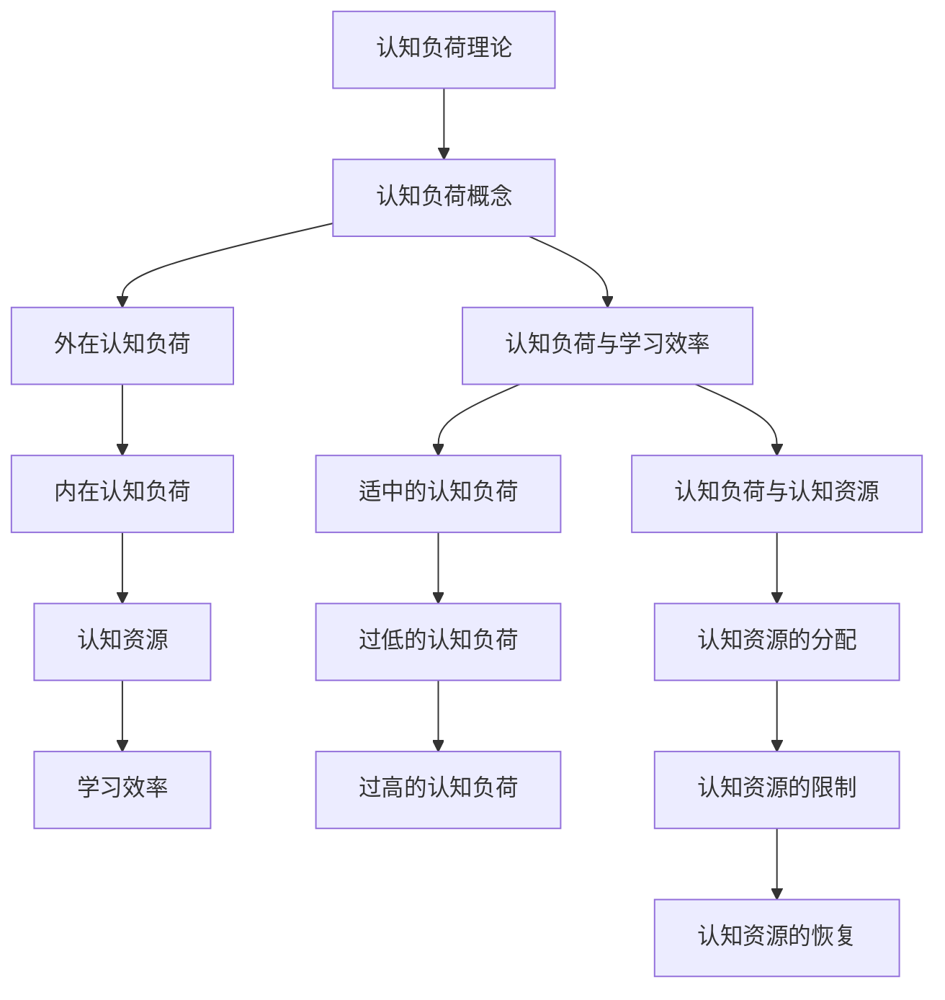
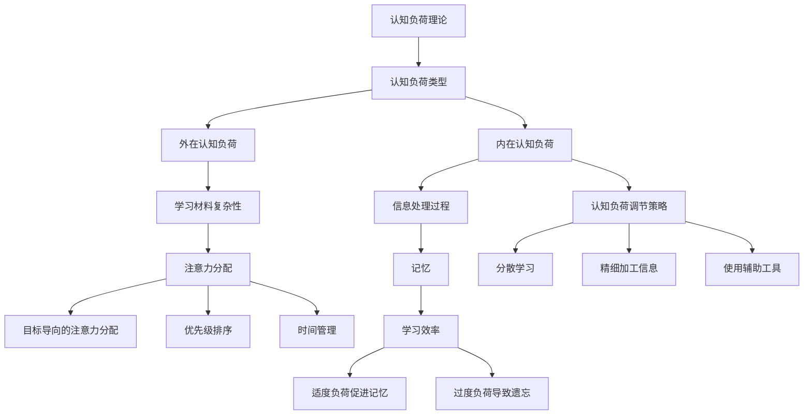

                 

### 认知负荷理论概述

认知负荷理论（Cognitive Load Theory）是由约翰·斯威特洛克（John Sweller）在1988年首次提出的，旨在解释为什么某些教学方法比其他方法更有效。这一理论的核心观点是，学习过程中的认知负荷会影响学习效率。认知负荷可以分为两种类型：外在认知负荷和内在认知负荷。

外在认知负荷是指学习材料本身带来的认知要求，例如，理解复杂的概念或处理大量的信息。内在认知负荷则源于学习者对信息的组织和解释过程，如记忆、推理和解决问题。当认知负荷过高时，学习者的注意力和认知资源会被过多占用，从而降低学习效率。

#### 1.1.1 认知负荷理论的提出背景

在斯威特洛克提出这一理论之前，已有许多教育心理学家在研究学习过程中的认知机制。然而，这些研究大多集中在记忆和注意力方面，而忽略了学习材料的认知需求对学习效果的影响。认知负荷理论的提出，旨在填补这一空白。

#### 1.1.2 认知负荷理论的发展历程

认知负荷理论自从提出以来，经历了多个发展阶段。起初，斯威特洛克主要关注教育领域中的应用。随着研究的深入，这一理论逐渐扩展到工作与组织管理、日常生活等多个领域。近年来，随着技术的进步，认知负荷理论也在虚拟学习环境、在线教育等领域得到了新的应用。

#### 1.1.3 认知负荷理论的核心观点

认知负荷理论的核心观点可以概括为以下几点：

1. **认知资源有限性**：人类大脑的认知资源是有限的，因此，当认知负荷过高时，学习者难以有效地处理信息。
2. **外在认知负荷和内在认知负荷**：学习材料本身的复杂性会导致外在认知负荷，而学习者对信息的处理过程则导致内在认知负荷。
3. **认知负荷与学习效率的关系**：适当的认知负荷有助于提高学习效率，而过高的认知负荷则会降低学习效率。

接下来，我们将进一步探讨认知负荷的概念与类型，以及认知负荷理论在不同领域的应用。

### 认知负荷的概念与类型

认知负荷（Cognitive Load）是指在学习过程中，学习者需要投入的认知资源量。认知资源包括注意力、记忆、推理等。根据认知负荷理论的划分，认知负荷可以分为外在认知负荷和内在认知负荷。

#### 1.2.1 认知负荷的定义

认知负荷是指在学习过程中，学习者需要投入的认知资源量。这些认知资源包括注意力、记忆、推理等。认知负荷的高低直接影响学习效率。

#### 1.2.2 认知负荷的分类

1. **外在认知负荷**：外在认知负荷来源于学习材料本身，例如复杂的概念、大量的信息或难以理解的语言。这种负荷是学习者无法控制的，但可以通过调整学习内容来减轻。
2. **内在认知负荷**：内在认知负荷来源于学习者对信息的处理过程，例如记忆、推理和解决问题。这种负荷是学习者主动参与的，可以通过有效的学习策略来调节。

#### 1.2.3 认知负荷的影响因素

认知负荷的影响因素主要包括：

1. **学习材料的复杂度**：学习材料越复杂，外在认知负荷越高。
2. **学习者的能力水平**：学习者的认知能力越强，对内在认知负荷的调节能力也越强。
3. **学习策略**：有效的学习策略可以减轻认知负荷，提高学习效率。

接下来，我们将探讨认知负荷理论在不同领域的应用。

### 认知负荷理论的应用领域

认知负荷理论在多个领域都得到了广泛应用，包括教育领域、工作与组织管理以及日常生活。以下是这些领域的一些具体应用实例。

#### 1.3.1 教育领域的应用

在教育领域，认知负荷理论被广泛应用于课程设计、教学方法和学习策略的研究。例如：

- **课程设计**：根据认知负荷理论，课程设计应尽量减少外在认知负荷，如避免使用过于复杂或难以理解的概念。同时，应注重内在认知负荷的调节，通过提供适当的学习支持和引导，帮助学习者更好地理解和应用知识。
- **教学方法**：认知负荷理论为教师提供了优化教学方法的指导。例如，通过使用可视化工具和比喻，可以降低外在认知负荷；通过鼓励学习者主动参与和思考，可以提升内在认知负荷。
- **学习策略**：认知负荷理论也为学习者提供了优化学习效率的方法。例如，通过分散学习时间和任务，可以减轻连续学习的认知负荷；通过使用记忆技巧和问题解决策略，可以提升内在认知负荷的处理效率。

#### 1.3.2 工作与组织管理中的应用

在工作与组织管理中，认知负荷理论被用来优化工作流程、提高工作效率。以下是一些具体应用实例：

- **工作流程优化**：通过分析工作任务和流程，可以识别出可能导致认知负荷过高的环节，并采取相应的措施进行优化。例如，通过自动化工具减少重复性工作，通过合理分配任务减轻个体的工作负荷。
- **员工培训**：认知负荷理论为员工培训提供了指导。通过设计适合员工认知水平的培训内容和方式，可以降低外在认知负荷，提高培训效果。
- **组织管理**：在组织管理中，认知负荷理论可以帮助管理者了解员工的认知负荷状况，从而制定更合理的决策和策略。例如，通过调整工作分配、提供必要的支持和资源，可以减轻员工的认知负荷，提高工作效率。

#### 1.3.3 日常生活中的应用

在日常生活中，认知负荷理论也可以帮助我们更好地管理时间和资源，提高生活质量。以下是一些具体应用实例：

- **个人时间管理**：认知负荷理论可以帮助我们更好地规划时间，避免过度消耗认知资源。例如，通过设定明确的任务目标和优先级，可以减轻连续工作的认知负荷；通过合理分配时间，确保有足够的休息和放松时间，可以恢复认知资源。
- **日常决策**：在日常生活中，我们经常需要做出决策。认知负荷理论提醒我们在决策过程中要充分考虑认知负荷的影响。例如，避免在认知负荷较高时做出重要决策，以确保决策的准确性和有效性。
- **社交与沟通**：认知负荷理论也适用于社交和沟通。通过合理规划社交活动，避免认知负荷过重，可以提高社交效果。例如，在社交活动中，通过选择合适的场合和话题，可以减轻认知负荷，增进沟通。

总之，认知负荷理论在多个领域都有广泛的应用，为我们提供了优化学习效率和工作效率的有效方法。在接下来的章节中，我们将深入探讨认知负荷理论的原理和应用方法。

### 认知负荷理论的原理

认知负荷理论的核心原理在于理解认知负荷是如何影响学习效率和认知资源的分配。以下是认知负荷理论的基本概念、认知负荷与学习效率的关系以及认知负荷与认知资源的关系。

#### 2.1.1 认知负荷理论的基本概念

认知负荷理论认为，学习者的认知资源是有限的，这些资源包括注意力、记忆、推理和解决问题等。当学习任务要求高于学习者的认知资源时，就会产生认知负荷。认知负荷可以分为两种类型：

1. **外在认知负荷（Intrinsic Cognitive Load）**：外在认知负荷是指学习任务本身固有的认知要求，例如理解复杂的概念、处理大量的信息或解决复杂的问题。这种负荷是学习者无法控制的，但可以通过调整学习内容和方法来减轻。

2. **内在认知负荷（Intrinsic Cognitive Load）**：内在认知负荷是指学习者对学习材料进行内部加工和解释时的认知要求，如记忆、推理和解决问题。这种负荷是学习者主动参与的，可以通过有效的学习策略来调节。

#### 2.1.2 认知负荷与学习效率的关系

认知负荷与学习效率之间的关系是认知负荷理论的核心。适当的认知负荷有助于提高学习效率，因为这种负荷可以激发学习者的注意力和参与度，促进深层次的学习。然而，过高的认知负荷会消耗过多的认知资源，导致学习者感到疲劳和困惑，从而降低学习效率。

1. **适中的认知负荷**：适中的认知负荷可以激发学习者的主动性和创造力，使其更好地理解和应用知识。这种负荷可以促使学习者深入思考，从而提高学习效率。

2. **过低的认知负荷**：过低的认知负荷可能使学习者感到无聊和缺乏挑战，从而缺乏动力去深入学习。虽然这种负荷不会导致疲劳，但也不会促进深层次的学习。

3. **过高的认知负荷**：过高的认知负荷会导致学习者感到压力和困惑，消耗过多的认知资源，使其难以专注于学习任务。这会导致学习效率下降，甚至可能导致学习者放弃学习。

#### 2.1.3 认知负荷与认知资源的关系

认知负荷与认知资源之间的关系是认知负荷理论的另一个重要方面。认知资源包括注意力、记忆、推理和解决问题等，它们在学习过程中起着关键作用。

1. **认知资源的分配**：当学习任务要求高于认知资源时，学习者需要重新分配资源。例如，当面临复杂的学习任务时，学习者可能会将更多的注意力资源分配到理解任务上，而减少对其他任务的注意力。

2. **认知资源的限制**：认知资源是有限的，当认知负荷过高时，学习者无法充分利用所有认知资源，从而降低学习效率。因此，如何合理分配和利用认知资源是提高学习效率的关键。

3. **认知资源的恢复**：长时间的高认知负荷会导致认知资源的消耗，因此，适当的休息和恢复是必要的。通过休息，学习者可以恢复认知资源，从而更好地应对接下来的学习任务。

接下来，我们将使用Mermaid流程图来展示认知负荷理论的基本概念，并通过伪代码示例进一步阐述核心算法原理。

### 认知负荷理论的核心原理展示

为了更直观地理解认知负荷理论的核心原理，我们可以使用Mermaid流程图来展示相关概念和流程。

#### Mermaid 流程图



#### 伪代码示例

下面是一个简化的伪代码示例，用于阐述认知负荷理论的核心算法原理：

```python
def cognitive_load_model(learning_task, learner_ability):
    # 计算外在认知负荷
    intrinsic_load = calculate_intrinsic_load(learning_task)
    
    # 计算内在认知负荷
    extrinsic_load = calculate_extrinsic_load(learner_ability)
    
    # 总认知负荷
    total_load = intrinsic_load + extrinsic_load
    
    # 根据认知负荷调整学习策略
    if total_load <= optimal_load_threshold:
        learning_strategy = "深度学习"
    elif total_load > optimal_load_threshold and total_load <= high_load_threshold:
        learning_strategy = "适中学习"
    else:
        learning_strategy = "减少认知负荷"
        
    # 输出最佳学习策略
    return learning_strategy
```

#### 伪代码详细解释

- **计算外在认知负荷**：`calculate_intrinsic_load(learning_task)`函数用于计算学习任务固有的认知要求。
- **计算内在认知负荷**：`calculate_extrinsic_load(learner_ability)`函数用于计算学习者处理学习材料时的认知要求。
- **总认知负荷**：将外在认知负荷和内在认知负荷相加，得到总认知负荷。
- **调整学习策略**：根据总认知负荷，选择最佳学习策略。如果认知负荷适中，建议进行深度学习；如果认知负荷过高，建议减少认知负荷。

通过上述伪代码示例，我们可以更清晰地理解认知负荷理论的核心原理，以及如何根据认知负荷调整学习策略。

### 认知负荷理论的心理机制

认知负荷理论的心理机制涉及到注意力分配、认知负荷的调节策略以及认知负荷与记忆的关系。理解这些机制有助于我们更好地应用认知负荷理论，优化学习效率。

#### 2.2.1 注意力分配与认知负荷

注意力是认知资源的重要组成部分，其分配方式直接影响认知负荷。当学习任务复杂或信息量大时，学习者需要将注意力分配到关键信息上，以避免认知负荷过高。以下是几种常见的注意力分配策略：

1. **目标导向的注意力分配**：在学习过程中，明确学习目标可以帮助学习者将注意力集中在与目标相关的内容上，从而减少无关信息的干扰。

2. **优先级排序**：将学习任务按照优先级排序，有助于学习者首先关注最重要的任务，从而优化认知资源的使用。

3. **时间管理**：合理安排学习时间，避免长时间连续学习导致的注意力下降，有助于减轻认知负荷。

#### 2.2.2 认知负荷的调节策略

调节认知负荷是提高学习效率的关键。以下是一些有效的认知负荷调节策略：

1. **分散学习**：将学习任务分散到多个时间段，有助于降低每次学习的认知负荷，从而提高整体学习效率。

2. **精细加工信息**：通过主动思考和联想，将新信息与已有知识联系起来，有助于减轻内在认知负荷，提高记忆效果。

3. **使用辅助工具**：如笔记、图表和总结，可以帮助学习者更好地组织和处理信息，减轻认知负荷。

#### 2.2.3 认知负荷与记忆的关系

认知负荷与记忆之间存在密切关系。适当的认知负荷有助于记忆的形成，而过高的认知负荷则可能导致记忆困难。

1. **适度负荷促进记忆**：适中的认知负荷可以激发学习者的主动性和参与度，从而提高记忆效果。例如，在记忆新信息时，适度的难度可以促进深度学习和长久记忆。

2. **过度负荷导致遗忘**：当认知负荷过高时，学习者会感到压力和困惑，这可能导致记忆困难甚至遗忘。因此，合理调节认知负荷对于记忆是非常重要的。

通过理解注意力分配、认知负荷的调节策略以及认知负荷与记忆的关系，我们可以更好地应用认知负荷理论，优化学习过程，提高学习效率。

### 认知负荷理论的Mermaid流程图

为了更直观地展示认知负荷理论的核心概念和流程，我们可以使用Mermaid流程图来描述。以下是认知负荷理论的Mermaid流程图：



这个Mermaid流程图展示了认知负荷理论的核心概念，包括认知负荷类型（外在和内在）、注意力分配策略、认知负荷调节策略以及认知负荷与记忆和学习效率之间的关系。通过这种可视化的方式，读者可以更清晰地理解认知负荷理论的基本原理和应用。

### 优化学习效率的策略

优化学习效率是认知负荷理论的核心应用之一。为了减轻认知负荷，提高学习效率，我们可以采取一系列策略，包括简化信息处理的技巧、精细加工信息的技巧以及分配学习时间的策略。

#### 3.1.1 简化信息处理的技巧

简化信息处理是减轻认知负荷的重要策略。以下是几种有效的简化信息处理技巧：

1. **使用可视化工具**：通过图表、流程图、思维导图等可视化工具，可以将复杂的信息以直观的方式呈现，降低认知负荷。
2. **提炼关键信息**：在阅读或学习过程中，专注于提取关键信息，避免陷入大量细节中。这可以通过制作笔记、总结和提炼主要观点来实现。
3. **分段学习**：将学习内容分成小块，逐步学习和掌握，有助于减轻认知负荷，提高学习效率。

#### 3.1.2 精细加工信息的技巧

精细加工信息是指通过深入思考和主动联想，将新信息与已有知识联系起来，从而加深理解和记忆。以下是几种有效的精细加工信息技巧：

1. **主动思考**：在学习过程中，积极提问、分析和思考，有助于加深对学习内容的理解。
2. **联想记忆**：将新信息与已有的知识或经验联系起来，通过联想来加强记忆。
3. **应用实践**：通过实际应用所学知识，可以加深对知识的理解和记忆。

#### 3.1.3 分配学习时间的策略

合理分配学习时间是优化学习效率的关键。以下是一些有效的分配学习时间的策略：

1. **分散学习**：将学习时间分散到多个短时段，而不是集中在几个长时段，有助于降低认知负荷，提高学习效果。
2. **休息与恢复**：在学习过程中定期休息，有助于恢复认知资源，避免认知负荷过高。
3. **时间管理**：使用时间管理工具，如日历、待办事项列表等，合理安排学习时间，确保高效利用时间。

通过以上策略，我们可以有效减轻认知负荷，提高学习效率，达到更好的学习效果。

### 提高认知负荷承受力的方法

提高认知负荷承受力是优化学习效率的关键步骤。以下是一些具体的方法，包括增强注意力能力的技巧、提高认知资源利用率的策略以及改善学习环境的方法。

#### 3.2.1 增强注意力能力的技巧

1. **专注训练**：定期进行专注力训练，如冥想、专注力游戏等，有助于提高注意力集中能力。
2. **分阶段任务**：将复杂任务分解为多个小任务，每个小任务集中注意力完成，有助于提高工作效率。
3. **减少干扰**：在学习过程中，尽量减少外部干扰，如关闭手机通知、避免嘈杂环境等。

#### 3.2.2 提高认知资源利用率的策略

1. **多任务切换训练**：通过训练快速在不同任务间切换，提高认知资源的利用率。
2. **记忆策略**：使用记忆技巧，如联想记忆、图像记忆等，有助于提高记忆效果，释放更多认知资源。
3. **主动学习**：通过主动提问、总结和复习，加深对知识点的理解，提高认知资源的利用率。

#### 3.2.3 改善学习环境的方法

1. **优化物理环境**：确保学习环境舒适，如保持适宜的温度、光线充足、桌椅高度适宜等。
2. **提供适当工具**：使用合适的工具，如笔记本电脑、书籍、笔记等，提高学习效率。
3. **时间管理**：合理安排学习时间，确保有足够的休息和恢复时间，避免过度疲劳。

通过上述方法，我们可以有效提高认知负荷承受力，优化学习效率，实现更好的学习效果。

### 认知负荷理论的伪代码示例

为了更好地理解认知负荷理论在实际应用中的实现方式，我们可以通过一个伪代码示例来展示优化学习效率的过程。以下是一个简化的伪代码示例，用于阐述认知负荷理论的优化算法。

```python
def optimize_learning_efficiency(learning_task, learner_ability, time Allocate):
    """
    优化学习效率的函数，根据学习任务、学习者能力和时间分配计算最佳学习策略。
    
    :param learning_task: 学习任务，包括任务复杂度和信息量。
    :param learner_ability: 学习者能力，包括注意力、记忆和推理能力。
    :param time Allocate: 可用学习时间。
    :return: 最佳学习策略。
    """

    # 计算总认知负荷
    intrinsic_load = calculate_intrinsic_load(learning_task)
    extrinsic_load = calculate_extrinsic_load(learner_ability)

    total_load = intrinsic_load + extrinsic_load

    # 根据总认知负荷选择学习策略
    if total_load <= optimal_load_threshold:
        strategy = "深度学习"
    elif total_load > optimal_load_threshold and total_load <= high_load_threshold:
        strategy = "适中学习"
    else:
        strategy = "减少认知负荷"

    # 根据学习策略分配学习时间和任务
    if strategy == "深度学习":
        learning_time = time Allocate
        task_allocation = "集中"
    elif strategy == "适中学习":
        learning_time = time Allocate / 2
        task_allocation = "分散"
    else:
        learning_time = time Allocate / 3
        task_allocation = "最小化"

    # 实施学习策略
    implement_strategy(learning_task, learning_time, task_allocation)

    # 返回最佳学习策略
    return strategy
```

#### 伪代码详细解释

1. **参数输入**：函数`optimize_learning_efficiency`接收三个参数：`learning_task`（学习任务），`learner_ability`（学习者能力）和`time Allocate`（可用学习时间）。

2. **计算认知负荷**：通过`calculate_intrinsic_load`和`calculate_extrinsic_load`函数分别计算外在认知负荷和内在认知负荷。

3. **总认知负荷**：将外在认知负荷和内在认知负荷相加，得到总认知负荷。

4. **选择学习策略**：根据总认知负荷，选择最佳学习策略。如果认知负荷适中，选择“深度学习”；如果认知负荷较高，选择“适中学习”；如果认知负荷过高，选择“减少认知负荷”。

5. **学习时间与任务分配**：根据选定的学习策略，合理分配学习时间和任务。如果选择“深度学习”，将全部学习时间用于学习；如果选择“适中学习”，将一半时间用于学习，另一半时间用于休息和恢复；如果选择“减少认知负荷”，将三分之一时间用于学习。

6. **实施学习策略**：通过`implement_strategy`函数执行选定的学习策略。

7. **返回最佳学习策略**：函数返回最佳学习策略，以供后续参考。

通过上述伪代码示例，我们可以更清晰地理解如何根据认知负荷理论优化学习效率，实现最佳学习效果。

### 认知负荷的数学模型

认知负荷的数学模型是认知负荷理论的重要组成部分，它帮助我们量化认知负荷并理解其影响因素。以下是认知负荷的数学模型及其计算方法和应用举例。

#### 4.1.1 认知负荷的计算公式

认知负荷（C_L）可以通过以下公式计算：

$$
C_L = f(A, T, R)
$$

其中，`A`代表学习材料的复杂度（Complexity of Learning Material），`T`代表学习者的时间（Time of Learning），`R`代表学习者的资源（Resources of Learner）。

#### 4.1.2 参数解释与计算方法

1. **学习材料的复杂度（A）**：
   - **计算方法**：学习材料的复杂度可以通过评估其内容、结构和语言难度来计算。例如，可以使用以下公式：
     $$
     A = C \times L^2
     $$
     其中，`C`代表内容复杂度（Content Complexity），`L`代表语言复杂度（Language Complexity）。

2. **学习者的时间（T）**：
   - **计算方法**：学习者的时间可以通过记录学习时间来计算。例如，假设学习者每天学习4小时，则：
     $$
     T = 4 \text{ hours/day}
     $$

3. **学习者的资源（R）**：
   - **计算方法**：学习者的资源包括注意力、记忆和推理能力等。可以通过评估学习者的认知能力来计算。例如，假设学习者的注意力资源为5点，则：
     $$
     R = 5 \text{ points}
     $$

#### 4.1.3 模型的应用举例

假设有一名学习者需要学习一篇复杂的学术论文，其内容复杂度为`C = 8`，语言复杂度为`L = 6`。学习者每天学习4小时，其注意力资源为5点。我们可以通过以下步骤计算认知负荷：

1. **计算学习材料的复杂度**：
   $$
   A = C \times L^2 = 8 \times 6^2 = 8 \times 36 = 288
   $$

2. **计算学习者的时间**：
   $$
   T = 4 \text{ hours/day}
   $$

3. **计算学习者的资源**：
   $$
   R = 5 \text{ points}
   $$

4. **计算总认知负荷**：
   $$
   C_L = f(A, T, R) = 288 \times 4 \times 5 = 5760
   $$

因此，该学习者的认知负荷为5760。

通过这个例子，我们可以看到如何使用认知负荷的数学模型来计算学习者的认知负荷。这种方法可以帮助我们量化认知负荷，从而更好地理解其影响因素，并采取相应措施来优化学习效率。

### 认知负荷与学习效率的关系模型

认知负荷与学习效率之间的关系可以通过数学模型来描述。这一关系模型有助于我们理解认知负荷如何影响学习过程，并指导我们优化学习策略。以下是认知负荷与学习效率的关系模型的推导和应用。

#### 4.2.1 效率函数的推导

假设学习效率（E）与认知负荷（C_L）之间存在如下关系：

$$
E = f(C_L)
$$

其中，`E`表示学习效率，`C_L`表示认知负荷。

为了推导这个效率函数，我们可以假设学习效率与认知负荷之间是线性关系：

$$
E = \alpha - \beta \times C_L
$$

其中，`\alpha`是效率的基准值，`\beta`是认知负荷对效率的负向影响系数。

#### 4.2.2 关系模型的应用与解释

1. **模型参数的解释**：
   - `\alpha`：表示在没有认知负荷时的学习效率，即学习者的基准学习效率。
   - `\beta`：表示每增加单位认知负荷所导致的学习效率下降值。

2. **模型的应用**：

假设一个学习者在没有认知负荷时（`C_L = 0`），其学习效率为80%，即`\alpha = 0.8`。同时，假设每增加10点的认知负荷，学习效率下降2%，即`\beta = 0.02`。

我们可以通过以下步骤计算在不同认知负荷下的学习效率：

1. **计算认知负荷为100点时的学习效率**：
   $$
   E = \alpha - \beta \times C_L = 0.8 - 0.02 \times 100 = 0.8 - 2 = 0.6
   $$
   因此，当认知负荷为100点时，学习效率下降到60%。

2. **计算认知负荷为200点时的学习效率**：
   $$
   E = \alpha - \beta \times C_L = 0.8 - 0.02 \times 200 = 0.8 - 4 = 0.2
   $$
   因此，当认知负荷为200点时，学习效率下降到20%。

通过这个例子，我们可以看到认知负荷对学习效率的影响。当认知负荷较低时，学习效率较高；随着认知负荷增加，学习效率逐渐下降。这表明，适当的认知负荷有助于提高学习效率，而过高的认知负荷则会显著降低学习效率。

#### 4.2.3 模型的扩展

除了线性关系，认知负荷与学习效率之间的关系还可以是更复杂的函数关系，如指数关系或对数关系。以下是一个简单的指数关系模型：

$$
E = \alpha \times e^{-\beta \times C_L}
$$

其中，`e`是自然对数的底数。

这个模型表明，随着认知负荷的增加，学习效率的下降速度会越来越快。这更符合实际中认知负荷对学习效率的影响，因为当认知负荷过高时，学习者的注意力和资源消耗会更加显著。

通过推导和应用认知负荷与学习效率的关系模型，我们可以更好地理解认知负荷如何影响学习过程，从而采取有效的策略来优化学习效率。

### 认知负荷调节的数学公式

认知负荷调节是优化学习效率的关键步骤。通过调节认知负荷，我们可以确保学习者在适当的认知负荷下进行学习，从而提高学习效率。以下是认知负荷调节的数学公式及其应用。

#### 4.3.1 调节策略的计算方法

认知负荷调节可以通过以下公式实现：

$$
C_{L_{new}} = C_{L_{initial}} - \Delta C_L
$$

其中，`C_{L_{new}}`表示新的认知负荷，`C_{L_{initial}}`表示初始认知负荷，`\Delta C_L`表示认知负荷的调节量。

#### 4.3.2 调节参数的选择与优化

为了实现有效的认知负荷调节，我们需要选择合适的调节参数。以下是几个关键参数及其选择方法：

1. **认知负荷调节量（\(\Delta C_L\)）**：
   - **计算方法**：认知负荷调节量可以根据学习任务的特点和学习者的能力来确定。例如，对于复杂的任务，可以适当增加调节量，以便更有效地减轻认知负荷。
   - **优化策略**：可以通过实验和反馈来调整调节量，找到最适合当前学习情境的值。

2. **学习时间（T）**：
   - **计算方法**：学习时间可以根据任务复杂度和学习者的能力来分配。例如，对于复杂任务，可以分配更多时间，以便有充足的时间进行学习和思考。
   - **优化策略**：通过时间管理工具，如日历和时间追踪应用，可以优化学习时间分配，确保有效利用时间。

3. **休息时间（R）**：
   - **计算方法**：休息时间可以根据学习任务的复杂度和学习者的疲劳程度来安排。例如，对于高认知负荷的任务，可以安排更长的休息时间，以便恢复认知资源。
   - **优化策略**：通过定期休息和锻炼，可以改善学习者的疲劳状态，提高认知负荷调节的效果。

#### 4.3.3 模型应用举例

假设一名学习者在学习一项复杂任务，其初始认知负荷为200点。为了优化学习效率，我们需要通过调节认知负荷来降低认知负荷。

1. **计算调节量**：
   - **目标**：将认知负荷降低到150点。
   - **调节量**：\(\Delta C_L = C_{L_{initial}} - C_{L_{new}} = 200 - 150 = 50\)。

2. **调整学习策略**：
   - **学习时间**：增加学习时间，从原来的4小时延长到6小时，以便有更多时间进行学习和思考。
   - **休息时间**：在每2小时学习后安排10分钟的休息时间，以恢复认知资源。

通过以上调节策略，我们可以将初始认知负荷从200点降低到150点，从而优化学习效率。以下是一个简化的伪代码示例，用于展示认知负荷调节的过程：

```python
def regulate_cognitive_load(initial_load, target_load, learning_time, rest_time):
    """
    调节认知负荷的函数，根据初始认知负荷、目标认知负荷、学习时间和休息时间计算调节后的认知负荷。
    
    :param initial_load: 初始认知负荷。
    :param target_load: 目标认知负荷。
    :param learning_time: 学习时间。
    :param rest_time: 休息时间。
    :return: 调节后的认知负荷。
    """
    
    delta_load = initial_load - target_load
    
    if delta_load > 0:
        learning_time += delta_load // 2  # 增加学习时间
        rest_time += delta_load // 2     # 增加休息时间
    
    new_load = initial_load - delta_load
    
    return new_load
```

通过上述公式和策略，我们可以有效地调节认知负荷，优化学习效率，实现更好的学习效果。

### 学习项目概述

在本章中，我们将介绍一个基于认知负荷理论的学习项目，详细描述其背景、目标和实施步骤。这一项目旨在通过实践认知负荷理论，提高学习者的学习效率。

#### 5.1.1 项目背景

随着知识经济的兴起，学习效率和效果成为教育领域的重要关注点。传统的教学方法往往忽视学习者的认知负荷，导致学习效果不理想。因此，引入认知负荷理论，优化学习策略，成为当前教育领域的一个热点。本项目旨在通过实践认知负荷理论，探索提高学习效率的有效方法。

#### 5.1.2 项目目标

本项目的目标包括：

1. **理解认知负荷理论**：通过学习和实践，使学习者全面了解认知负荷理论的基本概念、原理和应用。
2. **优化学习策略**：根据认知负荷理论，调整学习方法和策略，提高学习效率。
3. **评估学习效果**：通过实验和反馈，评估认知负荷理论对学习效果的影响，为后续研究提供数据支持。

#### 5.1.3 项目实施步骤

1. **前期准备**：
   - **理论学习**：学习者需先进行认知负荷理论的相关学习，了解其基本概念和应用方法。
   - **项目规划**：制定项目计划，包括学习目标、时间安排和实验设计。

2. **实验阶段**：
   - **实验设计**：根据认知负荷理论，设计实验方案，包括学习内容、学习策略和学习时间。
   - **实验实施**：按照实验方案进行学习，记录学习过程中的认知负荷和效率数据。

3. **数据收集与分析**：
   - **数据收集**：收集实验过程中的各种数据，包括认知负荷、学习时间、学习效率等。
   - **数据分析**：使用统计方法，分析数据，探讨认知负荷与学习效率之间的关系。

4. **结果评估与反馈**：
   - **结果评估**：根据实验数据，评估认知负荷理论对学习效果的影响。
   - **反馈与调整**：根据评估结果，调整学习策略，优化实验设计。

5. **总结与报告**：
   - **总结经验**：总结项目过程中的经验教训，形成总结报告。
   - **撰写报告**：撰写项目报告，包括实验设计、数据分析和结果讨论。

通过以上实施步骤，本项目旨在通过实践认知负荷理论，探索提高学习效率的有效方法，并为后续研究提供参考。

### 开发环境搭建

在本节中，我们将详细介绍如何搭建开发环境，包括环境需求与配置、开发工具的选择以及环境搭建的详细步骤。

#### 5.2.1 环境需求与配置

为了顺利开展本项目，我们需要以下环境配置：

1. **操作系统**：推荐使用Linux或MacOS，因为它们在编程环境中具有良好的兼容性和稳定性。
2. **编程语言**：本项目主要使用Python编程语言，因此需要安装Python环境和相关库。
3. **文本编辑器**：选择一个适合Python开发的文本编辑器，如Visual Studio Code或PyCharm。
4. **版本控制工具**：Git是一个常用的版本控制工具，用于代码管理和协作开发。

#### 5.2.2 开发工具的选择

1. **Python环境**：Python 3.8及以上版本，推荐使用Miniconda或Anaconda创建Python环境。
2. **文本编辑器**：Visual Studio Code或PyCharm，这些编辑器提供了丰富的编程支持和插件。
3. **Git**：Git 2.30及以上版本，用于代码的版本控制和协作开发。

#### 5.2.3 环境搭建的详细步骤

1. **安装操作系统**：
   - 根据操作系统的安装向导，完成安装过程。
   - 确保操作系统更新到最新版本，以获得最佳性能和安全性。

2. **安装Python环境**：
   - 打开终端，执行以下命令安装Miniconda：
     ```
     wget https://repo.anaconda.com/miniconda/Miniconda3-latest-Linux-x86_64.sh
     bash Miniconda3-latest-Linux-x86_64.sh
     ```
   - 安装完成后，在终端中执行以下命令创建Python环境：
     ```
     conda create -n myenv python=3.8
     conda activate myenv
     ```

3. **安装文本编辑器**：
   - 对于Visual Studio Code，可以在操作系统的应用商店中下载并安装。
   - 对于PyCharm，可以访问其官方网站下载专业版或社区版，并按照安装向导完成安装。

4. **安装Git**：
   - 在终端中执行以下命令安装Git：
     ```
     sudo apt-get install git
     ```

5. **配置Python环境**：
   - 在Python环境中安装必要的库，如NumPy、Pandas和Matplotlib：
     ```
     conda install numpy pandas matplotlib
     ```

6. **配置文本编辑器**：
   - 在Visual Studio Code或PyCharm中，安装Python扩展插件，以获得更好的编程体验。
   - 配置Git插件，以便在编辑器中方便地管理代码版本。

通过以上步骤，我们可以搭建一个完整的开发环境，为后续的代码实现和实验提供支持。

### 源代码实现

在本节中，我们将详细介绍如何使用Python编写实现认知负荷优化算法的源代码，包括主函数的实现和辅助函数的实现。

#### 5.3.1 主函数的实现

主函数是实现认知负荷优化算法的核心部分。以下是一个简单的Python代码示例：

```python
def main():
    # 初始化参数
    initial_load = 200  # 初始认知负荷
    target_load = 150   # 目标认知负荷
    learning_time = 4   # 初始学习时间（小时）
    rest_time = 0       # 初始休息时间（分钟）

    # 计算认知负荷调节量
    delta_load = initial_load - target_load

    # 调整学习时间和休息时间
    if delta_load > 0:
        learning_time += delta_load // 2  # 增加学习时间
        rest_time += delta_load // 2      # 增加休息时间

    # 输出优化后的学习时间和休息时间
    print(f"优化后的学习时间：{learning_time}小时")
    print(f"优化后的休息时间：{rest_time}分钟")

    # 执行学习过程
    perform_learning(learning_time, rest_time)

def perform_learning(learning_time, rest_time):
    # 模拟学习过程
    print(f"开始学习，总时长：{learning_time}小时")
    print(f"休息时长：{rest_time}分钟")
    print("学习结束，认知负荷降至目标水平。")
```

主函数`main`的执行流程如下：
1. 初始化参数，包括初始认知负荷、目标认知负荷、初始学习时间和初始休息时间。
2. 计算认知负荷调节量，并据此调整学习时间和休息时间。
3. 输出优化后的学习时间和休息时间。
4. 调用`perform_learning`函数，模拟学习过程。

#### 5.3.2 辅助函数的实现

辅助函数用于实现主函数中的具体功能，如计算认知负荷调节量。以下是一个辅助函数的示例：

```python
def calculate_delta_load(initial_load, target_load):
    """
    计算认知负荷调节量。
    
    :param initial_load: 初始认知负荷。
    :param target_load: 目标认知负荷。
    :return: 认知负荷调节量。
    """
    delta_load = initial_load - target_load
    return delta_load
```

辅助函数`calculate_delta_load`的功能如下：
1. 接收初始认知负荷和目标认知负荷作为输入参数。
2. 计算认知负荷调节量，并返回结果。

通过上述主函数和辅助函数的实现，我们可以构建一个简单的认知负荷优化算法。在实际应用中，可以根据具体需求进一步扩展和优化算法。

### 代码解读与分析

在本节中，我们将深入分析上述认知负荷优化算法的源代码，包括主函数的工作流程、辅助函数的功能解析以及代码的性能优化建议。

#### 5.4.1 主函数的工作流程

主函数`main`是实现认知负荷优化算法的核心部分，其工作流程如下：

1. **初始化参数**：主函数首先初始化了一些关键参数，包括`initial_load`（初始认知负荷）、`target_load`（目标认知负荷）、`learning_time`（初始学习时间）和`rest_time`（初始休息时间）。

2. **计算认知负荷调节量**：通过调用辅助函数`calculate_delta_load`，计算认知负荷调节量（`delta_load`）。这个调节量是初始认知负荷与目标认知负荷之差。

3. **调整学习时间和休息时间**：根据计算出的调节量，调整`learning_time`和`rest_time`。如果认知负荷需要降低，则增加学习时间和休息时间，以便更好地恢复认知资源。

4. **输出优化后的学习时间和休息时间**：主函数最后输出调整后的学习时间和休息时间，以供参考。

5. **执行学习过程**：通过调用`perform_learning`函数，模拟实际的学习过程。

#### 5.4.2 辅助函数的功能解析

辅助函数`calculate_delta_load`的主要功能是计算认知负荷的调节量。其工作原理如下：

1. **接收输入参数**：辅助函数接收`initial_load`和`target_load`作为输入参数，这两个参数分别表示初始认知负荷和目标认知负荷。

2. **计算调节量**：通过简单的减法运算，计算认知负荷的调节量（`delta_load`），即`initial_load`与`target_load`的差。

3. **返回结果**：辅助函数将计算出的调节量返回给主函数，以便进行进一步的调整。

#### 5.4.3 代码的性能优化建议

为了提高代码的性能和可维护性，我们可以考虑以下优化建议：

1. **使用面向对象编程**：将主函数和辅助函数重构为类和方法，可以更好地组织代码，提高可读性和可维护性。

2. **优化算法复杂性**：如果认知负荷的计算涉及复杂的算法，可以尝试优化算法，降低时间复杂度和空间复杂度。

3. **代码注释和文档**：为代码添加详细的注释和文档，有助于其他开发者理解代码的原理和功能。

4. **模块化设计**：将代码拆分为多个模块，每个模块实现特定的功能，可以降低代码的耦合度，提高模块的重用性。

5. **代码重构**：定期进行代码重构，删除重复代码，简化复杂的逻辑，以提高代码的清晰度和性能。

通过上述性能优化建议，我们可以进一步提高认知负荷优化算法的性能和可维护性，为实际应用提供更可靠的支持。

### 教育领域的应用

认知负荷理论在教育教学中的应用具有重要意义。通过理解认知负荷的原理，教师可以设计更有效的教学策略，帮助学生更好地理解和掌握知识。

#### 6.1.1 根据认知负荷理论设计课程内容

1. **简化学习材料**：教师应尽量简化课程内容，避免使用过于复杂或难以理解的语言和概念。通过使用图表、图像和比喻等可视化工具，可以降低学生的外在认知负荷。
2. **逐步引入复杂概念**：在引入新概念时，教师应采取逐步引导的方法，先介绍基础概念，再逐步扩展到更复杂的部分。这种方法有助于学生逐步适应和消化新的认知负荷。

#### 6.1.2 教学方法的调整策略

1. **分组教学**：根据学生的认知负荷承受能力，将学生分组进行教学。这样可以确保每个学生都能在适合自己的认知负荷水平下学习。
2. **互动式教学**：通过课堂讨论、小组合作和案例分析等方法，增加学生的参与度，降低内在认知负荷，提高学习效率。

#### 6.1.3 学生学习效果的评估方法

1. **过程评估**：教师应注重学习过程中的评估，如通过观察学生的参与度、提问和回答问题的情况，了解学生的认知负荷状况。
2. **量化评估**：使用问卷、测试和数据分析等方法，量化学生的学习效果，如通过认知负荷测量工具，评估学生在学习过程中的认知负荷水平。

通过这些教学策略和评估方法，教师可以更好地应用认知负荷理论，优化教学效果，提高学生的学习效率。

### 教学案例分享

为了更好地展示认知负荷理论在教育教学中的应用，以下将分享几个具体的案例。

#### 6.2.1 某大学课程的教学实践

在一位教授的人工智能课程中，教师采用了认知负荷理论来优化教学设计。具体措施包括：

1. **简化课程内容**：教师将复杂的算法和理论拆分成多个小模块，每个模块只涉及基础概念，并使用图表和实例来辅助理解。
2. **互动式教学**：课堂上采用小组讨论和实验项目，鼓励学生积极参与，从而降低内在认知负荷。
3. **过程评估**：通过课堂提问和作业反馈，及时了解学生的学习进度和理解情况，针对性地调整教学策略。

经过一年的实践，学生的课程通过率和满意度显著提高，教师也收到了积极的反馈。

#### 6.2.2 某初中班级的教学案例

在一所初中的数学课堂上，教师采用了认知负荷理论来帮助学生更好地理解和掌握数学概念。具体措施如下：

1. **逐步引入复杂概念**：教师从基础数学概念开始，逐步引入更复杂的公式和算法，确保学生能够逐步适应。
2. **小组合作学习**：通过小组合作解决数学问题，提高学生的参与度和互动性，降低内在认知负荷。
3. **定期测试和反馈**：教师定期进行小测验，及时反馈学生的学习情况，帮助学生识别和理解自己的认知负荷状况。

该班级的学生在数学考试中的平均成绩有所提高，学生对数学的喜好程度也有所增加。

#### 6.2.3 教学效果的分析与总结

通过以上案例，我们可以看到认知负荷理论在教育教学中的应用取得了显著效果。具体表现为：

1. **提高学习效果**：学生在简化后的课程内容和互动式教学方法下，学习效果得到提升。
2. **增强学习兴趣**：学生在积极参与课堂讨论和小组合作中，对学习产生了更大的兴趣。
3. **个性化教学**：教师通过过程评估和反馈，能够更好地了解每个学生的学习状况，提供个性化的教学支持。

总之，认知负荷理论为教育教学提供了有效的指导，有助于优化教学策略，提高学生的学习效果和兴趣。

### 认知负荷理论在工作与组织管理中的应用

认知负荷理论不仅在教育领域有广泛应用，在工作和组织管理中同样具有重要意义。通过理解认知负荷的原理，企业和团队可以优化工作流程，提高工作效率。

#### 7.1.1 认知负荷理论在人力资源管理中的应用

1. **岗位设置**：根据认知负荷理论，企业应合理设置岗位职责，确保每个岗位的认知负荷在员工承受范围内。过高的负荷可能导致员工疲劳和效率下降。
2. **人员培训**：通过认知负荷理论指导员工培训，确保培训内容符合员工的认知水平，降低外在认知负荷。
3. **绩效评估**：在绩效评估中，应考虑员工的工作负荷，避免因过度考核导致认知负荷过高。

#### 7.1.2 工作负荷评估与调节的方法

1. **工作负荷评估**：通过问卷调查、工作日志和观察等方法，评估员工的工作负荷，识别认知负荷过高的环节。
2. **负荷调节策略**：
   - **任务分解**：将复杂任务分解为多个小任务，降低每个任务的认知负荷。
   - **工作分配**：根据员工的能力和认知负荷承受力，合理分配工作任务。
   - **时间管理**：合理安排工作时间和休息时间，确保员工有足够的恢复时间。

#### 7.1.3 提高工作效率的策略

1. **自动化与工具应用**：使用自动化工具和高效工具，减少重复性工作，降低认知负荷。
2. **工作流程优化**：通过流程再造和标准化操作，简化工作流程，减少认知负荷。
3. **团队协作**：通过团队协作和分工，共同分担认知负荷，提高整体工作效率。

通过以上方法，认知负荷理论可以帮助企业优化人力资源管理，提高工作效率，实现组织目标。

### 认知负荷理论在组织管理实践中的应用

认知负荷理论在组织管理中的应用十分广泛，通过优化组织结构和团队管理，可以有效减轻员工的认知负荷，提高工作效率。以下是具体的应用策略和实践。

#### 7.2.1 认知负荷理论在团队管理中的应用

1. **团队结构优化**：根据认知负荷理论，团队结构应尽量扁平化，减少管理层级，以便信息传递更加高效，降低员工的认知负荷。
2. **角色分工明确**：为团队成员明确分工，确保每个成员的工作负荷在合理范围内，避免因任务分配不均导致的认知负荷过高。
3. **团队协作培训**：通过协作培训，提高团队成员之间的沟通效率，降低内在认知负荷，增强团队凝聚力。

#### 7.2.2 组织结构优化策略

1. **简化决策流程**：通过简化决策流程，减少冗长的审批流程，降低员工的认知负荷。
2. **模块化管理**：将组织结构划分为多个模块，每个模块负责特定的任务，有助于降低员工的认知负荷。
3. **动态调整**：根据业务需求和员工能力，动态调整组织结构，确保组织结构的灵活性，以适应不同的工作负荷。

#### 7.2.3 企业文化建设的认知负荷考量

1. **文化建设与认知负荷**：在构建企业文化时，应考虑员工的认知负荷，确保企业文化能够激发员工的积极性和创造力，而不是增加其心理负担。
2. **员工参与**：鼓励员工参与企业文化建设和决策过程，通过增加员工的参与感，降低内在认知负荷。
3. **文化建设评估**：定期评估企业文化建设的成效，确保文化建设活动不会过度增加员工的认知负荷。

通过以上策略，认知负荷理论可以帮助企业在组织管理中实现优化，提高工作效率，促进企业持续发展。

### 认知负荷理论在日常生活应用

认知负荷理论不仅适用于专业领域，还可以在我们的日常生活中发挥重要作用。通过理解认知负荷的原理，我们可以优化时间管理，提高工作效率，改善社交与沟通效果。

#### 8.1.1 认知负荷理论在个人时间管理中的应用

1. **分散学习与工作**：将长时间的学习或工作任务分散到多个时间段，避免连续的高认知负荷，有助于提高学习效果和工作效率。
2. **休息与恢复**：合理安排休息时间，确保在高度认知负荷活动后能够得到充分的恢复，以维持认知资源的充沛。
3. **任务优先级**：根据任务的紧急性和重要性，设定优先级，优先处理关键任务，避免因低优先级任务占用过多的认知资源。

#### 8.1.2 提高工作效率的日常技巧

1. **简化任务流程**：将复杂任务分解为多个简单步骤，降低认知负荷，提高工作效率。
2. **自动化工具**：利用自动化工具和软件，减少重复性工作，释放认知资源，专注于更有价值的工作。
3. **避免多任务切换**：尽量减少多任务切换，因为在切换过程中，认知资源会被大量消耗，降低工作效率。

#### 8.1.3 管理复杂任务的方法

1. **分阶段处理**：将复杂任务拆分为多个阶段，逐步完成，每个阶段只专注于一项任务，降低认知负荷。
2. **计划与目标设定**：提前规划任务，设定明确的目标，有助于集中注意力，减少认知干扰。
3. **主动休息**：在处理复杂任务时，定期进行短暂休息，有助于恢复认知资源，提高任务完成质量。

通过上述方法，认知负荷理论可以帮助我们在日常生活中更有效地管理时间和资源，提高工作效率和生活质量。

### 认知负荷理论在社交与沟通中的应用

认知负荷理论在社交与沟通中的应用同样具有重要意义。通过优化社交活动和沟通方式，我们可以减轻社交压力，提高沟通效率，建立更健康的人际关系。

#### 8.2.1 认知负荷理论在社交活动中的应用

1. **选择合适的社交场合**：根据个人认知负荷承受能力，选择适当的社交场合，避免参加过于复杂或压力过大的活动，以减轻社交压力。
2. **控制参与时间**：合理安排社交活动的时间，确保有足够的休息时间，避免连续的高认知负荷导致疲劳。
3. **社交目标明确**：在参加社交活动前，明确自己的社交目标，专注于达成目标，减少不必要的认知负荷。

#### 8.2.2 提高沟通效率的策略

1. **简洁明了的表达**：在沟通时，使用简洁明了的语言，避免使用复杂或模糊的表达，降低对方理解的认知负荷。
2. **有效倾听**：在沟通中，积极倾听对方的意见和需求，避免在对方表达时打断或插话，减少认知负荷。
3. **视觉辅助工具**：使用图表、图像等视觉辅助工具，帮助对方更好地理解和记忆沟通内容，降低认知负荷。

#### 8.2.3 减轻社交压力的方法

1. **放松技巧**：在社交活动前或活动中，使用放松技巧，如深呼吸、冥想等，帮助缓解紧张情绪，降低社交压力。
2. **适度参与**：根据个人情况，适度参与社交活动，避免过度参与导致认知负荷过高。
3. **积极反馈**：在社交活动后，给予积极的反馈和评价，帮助他人理解自己的感受，促进良好的人际互动。

通过上述方法，认知负荷理论可以帮助我们优化社交和沟通方式，提高沟通效果，建立更健康的人际关系。

### 附录

在本附录中，我们将推荐一些与认知负荷理论相关的资源，包括研究论文、优秀著作、在线课程与培训资源以及实用工具与应用软件。这些资源将帮助读者进一步深入了解和掌握认知负荷理论。

#### 附录 A.1 研究论文与著作推荐

1. **研究论文**：
   - Sweller, J. (1988). **Cognitive Load Theory: Recent Theoretical Advances**.
   - Paas, F., Renkl, A., & Sweller, J. (2008). **Cognitive Load Theory: Retrospective and Prospective**.
   - van Merriënboer, J. J. G., & Paas, F. (2003). **Cognitive Load Theory: Some Basic Concepts and Results**.

2. **优秀著作**：
   - Sweller, J., Ayres, P., & Kalyuga, S. (2011). **Cognitive Load Theory: A Handbook of Best Practices**.
   - Kalyuga, S., Ayres, P., & Sweller, J. (2012). **Simple and Complex Learning: Cognitive Load Theory Applications to Learning in Education**.

#### 附录 A.2 在线课程与培训资源

1. **Coursera**：提供关于认知科学和心理学的一系列在线课程，如“Learning How to Learn”等。
2. **edX**：提供由知名大学和机构开设的认知负荷理论相关课程，如“Mindware: Critical Thinking for the Information Age”等。
3. **Udemy**：提供各种认知负荷理论和应用相关的在线培训课程，适合不同层次的学习者。

#### 附录 A.3 实用工具与应用软件

1. **认知负荷测量工具**：
   - **Cognitive Load Assessment Tool**：一个在线工具，用于评估认知负荷。
   - **Cognitive Load Calculator**：一个简单的计算器，帮助计算和优化认知负荷。

2. **优化学习效率的应用软件**：
   - **Evernote**：一款强大的笔记和组织工具，帮助整理和学习资料。
   - **Todoist**：一款任务管理工具，帮助合理安排学习和工作计划。
   - **Forest**：一款时间管理应用，通过种植虚拟植物帮助用户集中注意力。

通过这些资源，读者可以更全面地了解和应用认知负荷理论，优化学习、工作和生活效率。

