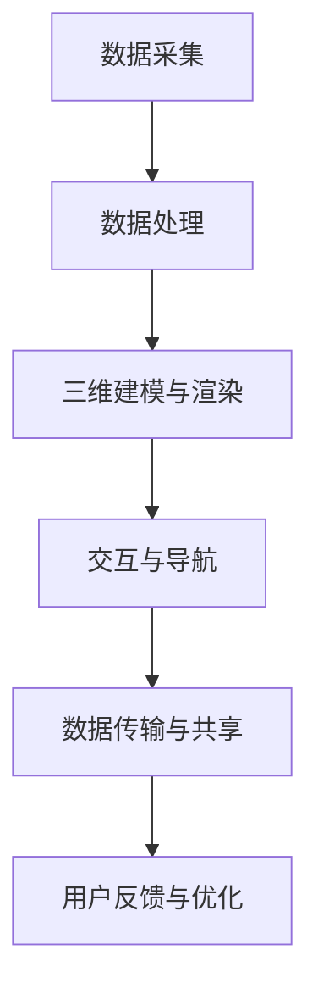

                 

# 贝壳房2025 AR/VR看房技术专家社招面试指南

> **关键词**：贝壳找房，AR/VR技术，看房，面试指南，技术专家，技术架构，算法原理，项目实战

> **摘要**：本文将围绕贝壳找房2025 AR/VR看房技术专家社招面试指南展开，系统介绍AR/VR看房技术的基本概念、核心技术、应用现状以及贝壳找房在AR/VR看房技术方面的实践和未来发展趋势。文章旨在为面试者提供全面的准备指导，帮助其深入了解贝壳找房在AR/VR看房技术领域的专业要求和面试要点。

## 第一部分：贝壳找房2025 AR/VR看房技术专家社招面试指南

### 第1章：AR/VR看房技术概述

#### 1.1 什么是AR/VR看房技术

##### 1.1.1 AR/VR技术的发展历程

虚拟现实（VR）与增强现实（AR）技术的发展可以追溯到20世纪60年代。VR技术的起源可以追溯到伊凡·苏菲罗波夫（Ivan Sutherland）在1968年开发的“达摩克利斯之剑”（The Sword of Damocles），这是第一个头戴式显示器。AR技术的发展则始于20世纪90年代，以Magic Lens（1990）等设备为标志。随着计算能力、传感器技术和显示技术的进步，AR/VR技术逐渐走向成熟。

##### 1.1.2 AR/VR看房技术的定义与特点

AR/VR看房技术是一种利用增强现实（AR）和虚拟现实（VR）技术，使购房者能够通过虚拟环境体验和查看房屋的技术。它具有以下特点：

- **沉浸式体验**：用户可以在虚拟环境中感受到高度真实的视觉、听觉和触觉体验。
- **交互性**：用户可以与虚拟环境中的物体进行交互，如旋转、缩放、选择等。
- **实时性**：AR/VR看房技术能够实时呈现房屋的3D模型和周围环境，使购房者能够快速做出决策。
- **灵活性**：用户可以根据需求自定义查看房屋的角度和内容。

##### 1.1.3 AR/VR看房技术的应用场景

AR/VR看房技术主要应用于房地产领域，包括以下场景：

- **房地产销售与展示**：通过AR/VR技术，房地产开发商和销售人员可以提供虚拟看房体验，减少实体看房的次数，提高销售效率。
- **房屋设计与装修**：用户可以在虚拟环境中体验房屋装修后的效果，进行个性化的设计。
- **远程看房**：对于地理位置较远的房屋，AR/VR技术可以提供远程看房体验，节省时间和交通成本。

#### 1.2 AR/VR看房技术核心原理

##### 1.2.1 AR/VR技术的理论基础

AR/VR技术的理论基础包括计算机图形学、人机交互、传感器技术和网络通信等。计算机图形学提供了三维建模和渲染的技术，人机交互技术使得用户能够与虚拟环境进行互动，传感器技术实现了现实与虚拟环境的映射，网络通信技术保证了数据传输的实时性和稳定性。

##### 1.2.2 AR/VR看房技术的核心组件

AR/VR看房技术的核心组件包括：

- **感知设备**：如摄像头、传感器、GPS等，用于捕捉现实环境的信息。
- **计算设备**：如计算机、手机、平板等，用于处理感知设备获取的数据。
- **显示设备**：如头戴式显示器、AR眼镜等，用于将虚拟环境呈现给用户。
- **网络通信设备**：如路由器、交换机等，用于实现数据的传输和共享。

##### 1.2.3 AR/VR看房技术的核心技术

AR/VR看房技术的核心技术包括：

- **三维建模与渲染技术**：用于创建房屋的3D模型并进行渲染，使得房屋在虚拟环境中具有真实感。
- **空间定位与跟踪技术**：用于将虚拟环境与现实环境进行映射，实现用户的定位和跟踪。
- **交互技术**：用于实现用户与虚拟环境的交互，如点击、拖拽、旋转等。
- **数据传输与处理技术**：用于实时传输和处理房屋数据，确保虚拟环境的实时性和准确性。

#### 1.3 贝壳房AR/VR看房技术的应用现状

##### 1.3.1 贝壳房AR/VR看房技术发展概况

贝壳找房作为中国领先的房产服务平台，一直致力于将先进技术应用于房地产领域。2025年，贝壳找房推出了全新的AR/VR看房技术，为购房者提供了更加直观、便捷的看房体验。

##### 1.3.2 贝壳房AR/VR看房技术的优势

贝壳房AR/VR看房技术具有以下优势：

- **提升用户体验**：通过虚拟现实技术，用户可以全方位、沉浸式地体验房屋，提高购房决策的准确性。
- **节省时间和成本**：用户可以通过AR/VR技术远程看房，减少实地看房的次数，节省时间和交通成本。
- **降低交易风险**：通过虚拟现实技术，用户可以提前了解房屋的真实情况，降低购房风险。

##### 1.3.3 贝壳房AR/VR看房技术的挑战与未来展望

尽管贝壳房AR/VR看房技术具有显著的优势，但在实际应用过程中也面临着一些挑战：

- **技术成熟度**：AR/VR技术仍处于快速发展阶段，部分技术尚不成熟，需要不断优化和升级。
- **数据安全问题**：房屋数据涉及用户的隐私和财产，需要确保数据的安全性和保密性。
- **市场接受度**：虽然AR/VR技术具有广阔的应用前景，但用户对技术的接受度和认知度仍需提高。

未来，随着技术的不断进步和市场需求的增加，贝壳房AR/VR看房技术有望在房地产领域得到更广泛的应用。

### 第二部分：贝壳找房AR/VR看房技术架构详解

#### 第2章：贝壳找房AR/VR看房技术架构概览

##### 2.1 贝壳房AR/VR看房技术系统架构

贝壳房AR/VR看房技术系统架构主要包括以下模块：

- **数据采集模块**：用于采集房屋数据，包括三维模型、空间定位信息、房屋图片等。
- **数据处理模块**：用于处理采集到的房屋数据，包括数据清洗、数据转换等。
- **渲染引擎模块**：用于渲染三维模型和虚拟环境，实现沉浸式体验。
- **交互模块**：用于实现用户与虚拟环境的交互，包括手势识别、语音识别等。
- **网络通信模块**：用于实现数据传输和共享，包括HTTP、WebSocket等协议。

##### 2.1.1 系统整体架构设计

贝壳房AR/VR看房技术系统整体架构设计遵循MVC（Model-View-Controller）模式，其中：

- **Model**：代表数据模型，包括房屋数据、用户数据等。
- **View**：代表用户界面，包括三维模型渲染、交互界面等。
- **Controller**：代表业务逻辑，包括数据处理、渲染控制等。

##### 2.1.2 各模块功能与交互

各模块功能与交互如下：

- **数据采集模块**：通过摄像头、传感器等设备采集房屋数据，并将数据传输给数据处理模块。
- **数据处理模块**：对采集到的数据进行处理，包括数据清洗、数据转换等，然后传输给渲染引擎模块。
- **渲染引擎模块**：根据处理后的数据渲染三维模型和虚拟环境，并将渲染结果传输给交互模块。
- **交互模块**：根据用户的交互操作，如点击、拖拽等，调整渲染引擎的渲染参数，实现用户与虚拟环境的互动。
- **网络通信模块**：负责数据传输和共享，确保各模块之间的数据交互和协同工作。

#### 第3章：贝壳找房AR/VR看房技术关键算法原理

##### 3.1 图像识别与目标检测算法

##### 3.1.1 常见图像识别算法

图像识别算法是AR/VR看房技术中的关键组成部分，常用的图像识别算法包括：

- **卷积神经网络（CNN）**：CNN是一种深度学习算法，可以用于图像分类、物体检测等任务。
- **支持向量机（SVM）**：SVM是一种经典的机器学习算法，可以用于图像分类任务。
- **随机森林（Random Forest）**：随机森林是一种集成学习方法，可以用于图像分类和物体检测任务。

##### 3.1.2 目标检测算法原理

目标检测算法是用于识别图像中的目标物体并进行定位的算法，常见的目标检测算法包括：

- **R-CNN（Regions with CNN features）**：R-CNN是一种基于区域提议的目标检测算法，可以分为区域提议、特征提取和分类三个步骤。
- **Fast R-CNN**：Fast R-CNN是对R-CNN的优化版本，通过使用ROI Pooling层简化了特征提取过程。
- **Faster R-CNN**：Faster R-CNN引入了区域建议网络（Region Proposal Network，RPN），进一步提高了目标检测的效率。

##### 3.1.3 伪代码讲解

以下是一个简单的图像识别算法的伪代码示例：

```python
# 伪代码：卷积神经网络（CNN）图像识别算法

# 输入：图像数据
# 输出：图像分类结果

# 1. 数据预处理
input_image = preprocess_image(image_data)

# 2. 卷积操作
conv_layer_1 = convolution(input_image, filter=32, stride=1, padding='SAME')
relu_layer_1 = activation(conv_layer_1, activation='RELU')

# 3. 池化操作
pool_layer_1 = max_pooling(relu_layer_1, pool_size=2, stride=2)

# 4. 添加更多卷积和池化层
# ...
conv_layer_n = convolution(pool_layer_n-1, filter=64, stride=1, padding='SAME')
relu_layer_n = activation(conv_layer_n, activation='RELU')
pool_layer_n = max_pooling(relu_layer_n, pool_size=2, stride=2)

# 5. 全连接层
fc_layer = fully_connected(pool_layer_n, units=num_classes)
activation_layer = activation(fc_layer, activation='SOFTMAX')

# 6. 分类结果输出
predicted_classes = activation_layer
```

##### 3.2 机器学习与深度学习算法

##### 3.2.1 机器学习基础

机器学习是一种通过算法从数据中学习规律并做出预测的技术。常见的机器学习算法包括：

- **线性回归**：用于预测连续值。
- **逻辑回归**：用于预测离散值，如二分类。
- **支持向量机（SVM）**：用于分类和回归。
- **决策树**：用于分类和回归。
- **随机森林（Random Forest）**：是一种集成学习方法，可以提高模型的预测性能。

##### 3.2.2 深度学习算法原理

深度学习是一种特殊的机器学习算法，通过构建深度神经网络（DNN）来模拟人脑的神经元结构和工作方式。深度学习算法包括：

- **卷积神经网络（CNN）**：用于图像和视频处理。
- **循环神经网络（RNN）**：用于序列数据处理。
- **生成对抗网络（GAN）**：用于生成逼真的图像和视频。

##### 3.2.3 伪代码讲解

以下是一个简单的深度学习算法的伪代码示例：

```python
# 伪代码：卷积神经网络（CNN）深度学习算法

# 输入：图像数据
# 输出：图像分类结果

# 1. 数据预处理
input_image = preprocess_image(image_data)

# 2. 卷积层
conv_layer_1 = convolution(input_image, filter=32, stride=1, padding='SAME')
relu_layer_1 = activation(conv_layer_1, activation='RELU')

# 3. 池化层
pool_layer_1 = max_pooling(relu_layer_1, pool_size=2, stride=2)

# 4. 添加更多卷积和池化层
# ...
conv_layer_n = convolution(pool_layer_n-1, filter=64, stride=1, padding='SAME')
relu_layer_n = activation(conv_layer_n, activation='RELU')
pool_layer_n = max_pooling(relu_layer_n, pool_size=2, stride=2)

# 5. 全连接层
fc_layer = fully_connected(pool_layer_n, units=num_classes)
activation_layer = activation(fc_layer, activation='SOFTMAX')

# 6. 分类结果输出
predicted_classes = activation_layer
```

##### 3.3 自然语言处理算法

##### 3.3.1 语言模型基础

语言模型是一种用于预测自然语言中下一个单词或字符的概率分布的模型。常见的语言模型包括：

- **n-gram模型**：基于单词或字符的历史序列进行预测。
- **神经网络语言模型（NNLM）**：基于神经网络进行预测，可以更好地捕捉语言中的复杂结构。

##### 3.3.2 对话系统算法

对话系统算法是一种用于实现人机交互的算法。常见的对话系统算法包括：

- **基于规则的方法**：使用预定义的规则进行对话生成。
- **基于模板的方法**：使用预定义的模板生成对话。
- **基于机器学习的方法**：使用机器学习算法，如神经网络，进行对话生成。

##### 3.3.3 伪代码讲解

以下是一个简单的自然语言处理算法的伪代码示例：

```python
# 伪代码：神经网络语言模型（NNLM）对话生成算法

# 输入：对话历史
# 输出：对话回复

# 1. 数据预处理
input_sequence = preprocess_dialog_history(dialog_history)

# 2. 编码对话历史
encoded_sequence = encoder(input_sequence)

# 3. 预测下一个单词或字符
predicted_word = decoder(encoded_sequence)

# 4. 对话回复输出
dialog_reply = predicted_word
```

### 第三部分：贝壳找房AR/VR看房技术项目实战

#### 第4章：贝壳找房AR/VR看房技术应用案例

##### 4.1 项目背景与目标

随着房地产行业的快速发展，消费者对房产信息的需求日益增长。然而，传统的看房方式往往存在地域限制、时间成本高等问题，无法满足消费者的个性化需求。贝壳找房为了提升用户体验，降低交易成本，决定开发一套基于AR/VR技术的看房系统。

项目目标：

- 提供一个沉浸式、实时、交互性强的看房体验。
- 减少实地看房的次数，提高销售效率。
- 实现远程看房，降低地域限制。

##### 4.2 开发环境搭建

为了实现贝壳找房AR/VR看房系统，需要搭建以下开发环境：

- **硬件设备**：头戴式显示器（如Oculus Rift、HTC Vive）、AR眼镜（如Microsoft HoloLens）、手机和平板等。
- **软件工具**：Unity 3D开发平台、Unreal Engine游戏引擎、AR/VR开发框架（如ARKit、Vuforia）等。
- **编程语言**：C#、C++、Python等。

开发环境的搭建步骤如下：

1. 安装Unity 3D开发平台和Unreal Engine游戏引擎。
2. 配置AR/VR开发框架，如ARKit、Vuforia等。
3. 硬件设备驱动安装和调试。
4. 编写环境配置脚本，确保开发环境的一致性。

##### 4.3 源代码实现与解读

贝壳找房AR/VR看房系统的源代码实现主要包括以下部分：

- **数据采集与处理模块**：负责采集房屋数据，如房屋尺寸、位置、图像等，并进行数据清洗和处理。
- **三维建模与渲染模块**：使用Unity 3D或Unreal Engine创建房屋的三维模型，并进行渲染。
- **交互与导航模块**：实现用户与虚拟环境的交互，如旋转、缩放、导航等。
- **数据传输与共享模块**：实现房屋数据的实时传输和共享，支持多用户同时在线查看。

以下是一个简单的源代码示例，用于实现三维建模与渲染：

```csharp
// C#代码示例：Unity 3D三维建模与渲染

using UnityEngine;

public class HouseRenderer : MonoBehaviour
{
    public Material material;
    public MeshFilter meshFilter;

    private void Start()
    {
        // 加载房屋模型
        Mesh mesh = LoadHouseMesh();
        meshFilter.mesh = mesh;

        // 设置材质
        material.mainTexture = LoadHouseTexture();
    }

    private Mesh LoadHouseMesh()
    {
        // 加载房屋模型数据
        // ...
        return new Mesh();
    }

    private Texture2D LoadHouseTexture()
    {
        // 加载房屋纹理
        // ...
        return new Texture2D(width, height);
    }
}
```

##### 4.3.2 关键代码解读

以下是对关键代码的解读：

- `LoadHouseMesh()` 方法用于加载房屋模型数据，实现三维建模。
- `LoadHouseTexture()` 方法用于加载房屋纹理，实现渲染效果。
- `material` 和 `meshFilter` 是Unity 3D中的对象，分别代表材质和网格过滤器。

##### 4.3.3 代码优化与性能分析

为了提高贝壳找房AR/VR看房系统的性能，需要进行以下优化：

- **模型简化**：通过简化房屋模型，减少渲染计算量。
- **纹理压缩**：使用纹理压缩技术，降低纹理数据大小，提高渲染速度。
- **异步加载**：采用异步加载技术，提前加载房屋数据，减少加载时间。

以下是一个简单的性能分析示例：

```csharp
// C#代码示例：性能分析

using UnityEngine;

public class PerformanceProfiler : MonoBehaviour
{
    private float lastFrameTime = 0.0f;
    private int frameCount = 0;

    private void Update()
    {
        float currentTime = Time.realtimeSinceStartup;
        float deltaTime = currentTime - lastFrameTime;
        lastFrameTime = currentTime;

        frameCount++;

        if (frameCount >= 60)
        {
            float averageFrameTime = deltaTime / frameCount;
            Debug.Log("平均帧时间：" + averageFrameTime.ToString("0.000") + "秒");
            frameCount = 0;
        }
    }
}
```

##### 4.4 代码分析与测试

贝壳找房AR/VR看房系统的代码分析主要包括以下方面：

- **代码质量**：检查代码的规范性、可读性和可维护性。
- **功能测试**：测试系统功能的完整性和正确性。
- **性能测试**：测试系统的响应速度和资源消耗。

以下是一个简单的测试示例：

```csharp
// C#代码示例：功能测试

using NUnit.Framework;

[TestFixture]
public class HouseRendererTest
{
    [Test]
    public void LoadHouseMeshTest()
    {
        HouseRenderer houseRenderer = new HouseRenderer();
        Mesh loadedMesh = houseRenderer.LoadHouseMesh();

        Assert.IsNotNull(loadedMesh);
        Assert.AreNotEqual(loadedMesh.vertexCount, 0);
    }

    [Test]
    public void LoadHouseTextureTest()
    {
        HouseRenderer houseRenderer = new HouseRenderer();
        Texture2D loadedTexture = houseRenderer.LoadHouseTexture();

        Assert.IsNotNull(loadedTexture);
        Assert.AreNotEqual(loadedTexture.width, 0);
        Assert.AreNotEqual(loadedTexture.height, 0);
    }
}
```

### 第四部分：贝壳找房AR/VR看房技术发展趋势与展望

#### 第5章：贝壳找房AR/VR看房技术未来发展趋势

随着科技的不断进步和房地产行业的需求增长，贝壳找房AR/VR看房技术有望在以下方面实现进一步发展：

##### 5.1 技术趋势分析

- **硬件升级**：随着硬件技术的进步，如更高质量的AR/VR设备、更高效的传感器等，贝壳找房AR/VR看房技术的性能将得到显著提升。
- **人工智能应用**：人工智能技术将在贝壳找房AR/VR看房技术中发挥更大的作用，如智能推荐、自动化数据采集和处理等。
- **大数据分析**：通过大数据分析，贝壳找房可以更好地了解用户需求和市场趋势，为用户提供更精准的看房服务。

##### 5.2 行业应用展望

- **智能家居领域**：贝壳找房AR/VR看房技术可以与智能家居系统集成，为用户提供更加全面的家居体验。
- **房地产营销**：贝壳找房可以通过AR/VR技术，提供更加生动、直观的房地产营销手段，提高品牌知名度和用户黏性。
- **教育领域**：贝壳找房AR/VR看房技术可以应用于教育领域，如虚拟课堂、虚拟实验室等，为学生提供更加丰富的学习体验。

##### 5.3 技术挑战与解决方案

- **技术成熟度**：贝壳找房需要不断跟进和研发新技术，确保AR/VR看房技术的成熟度和稳定性。
- **数据安全问题**：贝壳找房需要加强对房屋数据的安全管理，确保用户隐私和数据安全。
- **市场接受度**：贝壳找房需要加大宣传力度，提高用户对AR/VR看房技术的认知度和接受度。

### 第五部分：贝壳找房AR/VR看房技术面试指南

#### 第6章：贝壳找房AR/VR看房技术面试准备

##### 6.1 面试官可能提出的问题

在贝壳找房AR/VR看房技术面试中，面试官可能会提出以下问题：

- **AR/VR技术的核心原理是什么？**
- **如何实现AR/VR看房技术的空间定位与跟踪？**
- **贝壳找房AR/VR看房技术的系统架构是怎样的？**
- **你有哪些项目经验与贝壳找房AR/VR看房技术相关？**
- **你对贝壳找房AR/VR看房技术的未来发展趋势有何看法？**

##### 6.2 自我介绍与面试技巧

在面试过程中，良好的自我介绍和面试技巧至关重要。以下是一些建议：

- **简洁明了**：自我介绍应简洁明了，突出自己的专业背景、项目经验和技能。
- **自信表达**：表达自信，展示自己的专业素养和解决问题的能力。
- **突出亮点**：突出自己在贝壳找房AR/VR看房技术领域的独特优势，如项目经验、技术特长等。
- **积极沟通**：与面试官保持积极沟通，了解面试官的需求和期望，展示自己的沟通能力。

##### 6.3 面试后的跟进与反馈

面试结束后，及时跟进和反馈也是非常重要的。以下是一些建议：

- **发送感谢信**：在面试结束后，及时发送一封感谢信，表达对贝壳找房的感谢和兴趣。
- **跟进进度**：询问面试官面试结果的反馈时间，并在约定时间内跟进。
- **提出建议**：如果面试过程中存在不足之处，可以适当地提出改进建议，展示自己的专业素养。

### 第六部分：贝壳找房AR/VR看房技术参考资源

#### 第7章：贝壳找房AR/VR看房技术参考资源

为了更好地准备贝壳找房AR/VR看房技术的面试，以下是一些建议的参考资源：

##### 7.1 技术文档与资料

- **贝壳找房AR/VR看房技术文档**：了解贝壳找房AR/VR看房技术的整体架构、功能模块和关键技术。
- **AR/VR技术基础知识**：了解AR/VR技术的核心原理、发展历程和应用场景。
- **计算机图形学资料**：掌握三维建模、渲染和交互技术的基本原理。

##### 7.2 开发工具与平台

- **Unity 3D开发平台**：学习Unity 3D的基本操作和开发技巧。
- **Unreal Engine游戏引擎**：了解Unreal Engine的功能和特性，掌握其开发流程。
- **AR/VR开发框架**：如ARKit、Vuforia等，了解其应用场景和开发方法。

##### 7.3 技术社群与社区

- **贝壳找房技术社群**：加入贝壳找房的技术社群，与其他技术专家交流，获取行业动态和最佳实践。
- **AR/VR技术社区**：如AR/VR开发者论坛、AR/VR技术博客等，了解AR/VR技术的最新发展和技术趋势。

### 附录

#### 附录 A：贝壳找房AR/VR看房技术流程图

以下是贝壳找房AR/VR看房技术的流程图：



#### 附录 B：贝壳找房AR/VR看房技术算法伪代码

以下是贝壳找房AR/VR看房技术中的一些算法伪代码示例：

```python
# 伪代码：图像识别算法

# 输入：图像数据
# 输出：图像分类结果

# 1. 数据预处理
input_image = preprocess_image(image_data)

# 2. 卷积操作
conv_layer_1 = convolution(input_image, filter=32, stride=1, padding='SAME')
relu_layer_1 = activation(conv_layer_1, activation='RELU')

# 3. 池化操作
pool_layer_1 = max_pooling(relu_layer_1, pool_size=2, stride=2)

# 4. 全连接层
fc_layer = fully_connected(pool_layer_1, units=num_classes)
activation_layer = activation(fc_layer, activation='SOFTMAX')

# 5. 分类结果输出
predicted_classes = activation_layer
```

```python
# 伪代码：目标检测算法

# 输入：图像数据
# 输出：目标检测结果

# 1. 数据预处理
input_image = preprocess_image(image_data)

# 2. 卷积操作
conv_layer_1 = convolution(input_image, filter=32, stride=1, padding='SAME')
relu_layer_1 = activation(conv_layer_1, activation='RELU')

# 3. 池化操作
pool_layer_1 = max_pooling(relu_layer_1, pool_size=2, stride=2)

# 4. 区域提议
region_proposal = region_proposal(pool_layer_1)

# 5. 特征提取
feature_extraction = feature_extraction(region_proposal)

# 6. 分类与定位
classification = classification(feature_extraction)
location = location(feature_extraction)

# 7. 目标检测结果输出
detection_result = merge_classification_and_location(classification, location)
```

```python
# 伪代码：机器学习算法

# 输入：训练数据
# 输出：训练模型

# 1. 数据预处理
train_data = preprocess_data(training_data)

# 2. 特征提取
features = extract_features(train_data)

# 3. 标签预处理
labels = preprocess_labels(train_data)

# 4. 训练模型
model = train_model(features, labels)

# 5. 模型评估
evaluation = evaluate_model(model, test_data)

# 6. 模型优化
model = optimize_model(model, evaluation)

# 7. 模型输出
output_model = model
```

```python
# 伪代码：深度学习算法

# 输入：训练数据
# 输出：训练模型

# 1. 数据预处理
train_data = preprocess_data(training_data)

# 2. 特征提取
features = extract_features(train_data)

# 3. 标签预处理
labels = preprocess_labels(train_data)

# 4. 构建深度神经网络
model = build_dnn(features, labels)

# 5. 训练模型
model = train_dnn(model, train_data)

# 6. 模型评估
evaluation = evaluate_dnn(model, test_data)

# 7. 模型优化
model = optimize_dnn(model, evaluation)

# 8. 模型输出
output_model = model
```

```python
# 伪代码：自然语言处理算法

# 输入：对话历史
# 输出：对话回复

# 1. 数据预处理
input_sequence = preprocess_dialog_history(dialog_history)

# 2. 编码对话历史
encoded_sequence = encoder(input_sequence)

# 3. 预测下一个单词或字符
predicted_word = decoder(encoded_sequence)

# 4. 对话回复输出
dialog_reply = predicted_word
```

### 作者信息

作者：AI天才研究院/AI Genius Institute & 禅与计算机程序设计艺术 /Zen And The Art of Computer Programming

本文由AI天才研究院和禅与计算机程序设计艺术联合撰写，旨在为贝壳找房2025 AR/VR看房技术专家社招面试者提供全面的准备指导。希望本文能够帮助您更好地了解贝壳找房AR/VR看房技术的核心概念、架构和未来发展趋势，为您成功通过面试奠定坚实基础。祝您面试顺利！|

