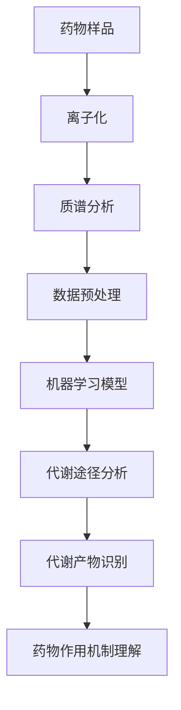
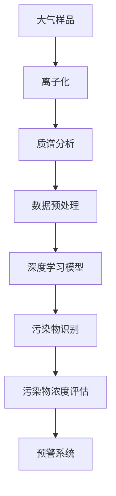
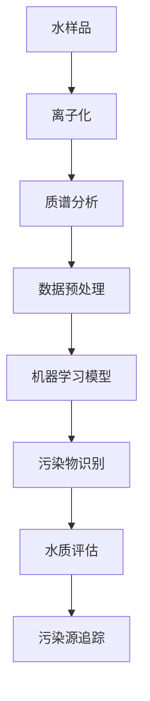
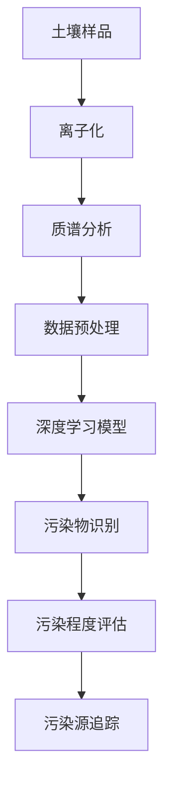
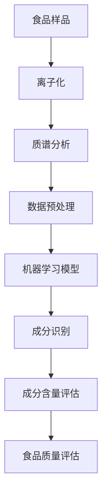
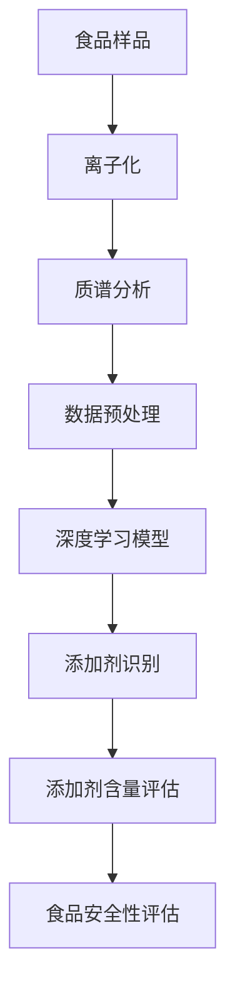
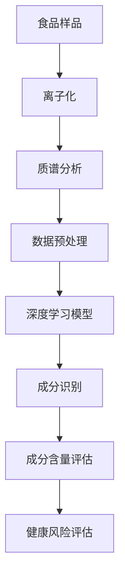

                 

### 《质谱技术在AI for Science中的角色》

#### 质谱技术：科学研究的强大工具

质谱技术（Mass Spectrometry，MS）是现代科学研究中不可或缺的工具，尤其在化学、生物学、医学和材料科学等领域中发挥着重要作用。质谱技术通过测量样品中分子的质量/电荷比（m/z）来分析物质的组成和结构。它的基本原理可以追溯到19世纪末，但经过百年的发展，特别是在过去几十年里，质谱技术的灵敏度和分辨率得到了显著提升，使其成为科学家手中的利器。

质谱技术的核心组成部分包括质谱仪、进样系统和数据采集与分析软件。质谱仪的基本工作流程是将样品离子化，产生带电的离子，然后通过电场或磁场使这些离子按照质量/电荷比分离，最终通过检测器记录下离子的数量和强度。通过对这些数据进行解析，科学家可以揭示样品的化学组成和结构信息。

质谱技术在科学研究中的应用范围广泛，从药物开发、环境监测到食品安全检测，都离不开质谱技术的支持。它的应用不仅限于定性分析，还可以进行定量分析，通过比较不同样品的信号强度来评估成分的含量。因此，质谱技术被誉为“分析化学之王”。

#### AI：科学研究的革新力量

人工智能（AI）作为近年来科技界的重要突破，正在深刻改变着科学研究的模式。AI技术，特别是机器学习和深度学习算法，通过处理和分析大量数据，能够自动识别模式、发现规律，从而加速科学发现的过程。

AI在科学领域的应用可以追溯到20世纪80年代，但真正的大规模应用始于21世纪。随着计算能力的提升和数据量的爆炸式增长，AI技术在图像识别、自然语言处理和预测模型构建等方面取得了显著进展。这些进展不仅推动了科技的发展，也为科学研究提供了新的工具和手段。

AI在科学研究中扮演了多个角色，包括：

1. **数据驱动的研究**：通过分析海量数据，AI可以发现隐藏在数据背后的规律，为科学理论提供实证支持。
2. **实验优化**：AI可以通过优化实验参数，提高实验效率，减少实验成本。
3. **模式识别**：在生物信息学、医学成像等领域，AI可以帮助科学家从复杂的图像和实验数据中提取有用的信息。
4. **预测模型**：AI可以构建复杂的预测模型，帮助科学家预测实验结果，减少实验风险。

总之，AI技术为科学研究注入了新的活力，使其在数据密集型领域中取得了前所未有的突破。

#### 质谱技术概述

### 1.1 质谱技术的历史与发展

质谱技术的起源可以追溯到19世纪末，由英国物理学家约瑟夫·约翰·汤姆森（J.J. Thomson）首次提出。1897年，汤姆森通过实验发现了电子，这为后来的质谱技术奠定了基础。1906年，物理学家弗里德里希·帕邢（Friedrich Pascual Jordan）和恩斯特·沃尔夫冈·穆斯堡尔（Ernst Wallot）首次设计了一种质谱仪，用于研究气体分子的质量。

20世纪中叶，随着电子技术的进步，质谱技术得到了快速发展。1950年代，磁质谱仪和飞行时间质谱仪（Time-of-Flight MS）相继问世，大大提高了质谱分析的灵敏度和分辨率。1960年代，电喷雾电离（Electrospray Ionization, ESI）技术的发明，使得质谱技术从真空环境扩展到大气环境，打开了质谱在生物医学领域应用的大门。

近年来，随着计算机技术和AI算法的发展，质谱技术的数据处理能力和自动化水平得到了显著提升。例如，高分辨质谱仪（High-Resolution MS）和基质辅助激光解吸电离（Matrix-Assisted Laser Desorption/Ionization, MALDI）技术的应用，使得科学家可以更精确地分析复杂样品。

#### 1.2 质谱技术的基本原理

质谱技术的基本原理是通过离子源将样品中的分子或原子离子化，产生带电的离子。这些离子通过电场或磁场分离，并根据质量/电荷比（m/z）进行检测和记录。以下是质谱技术的基本步骤：

1. **样品制备**：样品首先被制备成适合离子化的状态，如溶液或固体。
2. **离子化**：样品进入离子源，通过电离技术（如电子轰击、电喷雾、激光解吸等）产生带电的离子。
3. **离子分离**：带电的离子在电场或磁场的作用下被分离。根据离子质量/电荷比的不同，它们在电场或磁场中运动的轨迹也不同，从而实现分离。
4. **检测与记录**：分离后的离子通过检测器检测，产生电信号。这些信号被转换为数字信号，并通过数据处理系统进行记录和分析。

质谱仪的构造主要包括离子源、分离器、检测器和数据处理系统。不同的质谱仪构造和分离原理（如磁质谱仪、飞行时间质谱仪、四极杆质谱仪等）决定了质谱仪的灵敏度和分辨率。

#### 1.3 质谱技术在科学研究中的应用

质谱技术因其高灵敏度、高分辨率和多功能性，在科学研究中得到了广泛应用。以下是质谱技术在几个主要领域中的应用：

**生物医学领域**：质谱技术在生物医学领域中的应用广泛，包括蛋白质组学、代谢组学和药物分析等。通过质谱技术，科学家可以精确分析蛋白质和代谢物的组成和结构，揭示生物体内的复杂相互作用。

**环境科学领域**：质谱技术在环境监测中扮演着关键角色，用于检测空气、水和土壤中的污染物。质谱技术的高灵敏度和多分析能力，使得科学家可以更准确地监测和评估环境污染。

**材料科学领域**：在材料科学中，质谱技术用于分析材料的组成和结构，如金属合金、陶瓷和聚合物等。质谱技术可以帮助科学家优化材料的设计和性能。

总之，质谱技术在科学研究中的重要性日益凸显，为科学发现提供了强有力的支持。

## AI in Science概述

### 2.1 AI在科学研究的意义

人工智能（AI）在科学研究中的崛起，为数据密集型领域带来了革命性的变化。AI的核心价值在于其能够处理和分析海量数据，发现隐藏在数据中的模式和规律，从而加速科学发现的过程。

首先，**数据驱动的科学研究**是AI在科学领域的重要应用。在当今科技时代，科学研究面临的数据量急剧增长，传统的数据分析方法已无法满足需求。AI技术，特别是机器学习和深度学习算法，可以通过自动化数据处理和分析，从大量数据中提取有价值的信息。例如，在生物学研究中，AI可以帮助科学家分析基因序列、蛋白质结构等数据，揭示生物体内的复杂机制。

其次，**AI加速科学发现**。传统科学方法通常依赖于理论假设和实验验证，而AI技术可以通过模拟和预测，快速评估不同的假设和实验方案。这不仅节省了时间和成本，还提高了实验的效率。例如，在药物开发过程中，AI可以通过分析大量的药物分子和生物数据，快速筛选出有潜力的药物候选分子，加速新药的发现。

### 2.2 AI在科学领域的应用

AI在科学领域的应用涵盖了多个方面，包括自然语言处理、计算机视觉和机器学习等。

**自然语言处理（NLP）**：NLP技术使计算机能够理解和处理人类语言。在科学研究中，NLP可以用于自动翻译科学论文、提取关键词和句法分析，从而加速科学文献的检索和理解。例如，Google翻译和OpenAI的GPT-3都是基于NLP技术的典型应用。

**计算机视觉（CV）**：计算机视觉技术使计算机能够“看到”和理解图像和视频。在科学领域，CV技术可以用于图像处理、物体识别和图像分类等任务。例如，在医学成像中，CV技术可以帮助医生更准确地诊断疾病。

**机器学习（ML）**：机器学习是AI的核心技术，通过训练模型来自动发现数据中的模式和规律。在科学研究中，ML技术可以用于数据挖掘、预测分析和优化实验设计等。例如，在气候变化研究中，ML技术可以帮助科学家预测气候变化的趋势，为政策制定提供依据。

总之，AI在科学领域的广泛应用，不仅提高了科学研究的效率，还开辟了新的研究途径，推动了科学技术的进步。

### 3. 质谱技术与AI的结合

随着质谱技术的不断进步和AI技术的飞速发展，两者在科学研究中的应用正变得越来越紧密。质谱技术与AI的结合不仅提升了数据分析的效率，还推动了科学发现的创新。

#### 3.1 AI在质谱数据分析中的应用

在质谱数据分析中，AI技术发挥了至关重要的作用。传统的质谱数据分析依赖于专家的经验和标准化的数据处理流程，而AI技术可以自动化这一过程，显著提高数据分析的效率和准确性。

**数据预处理**：质谱数据往往包含大量的噪声和冗余信息，AI技术可以通过数据清洗、去噪和特征提取等预处理步骤，提高数据的质量和可解释性。例如，深度学习模型可以用于自动识别和去除噪声，从而提高质谱信号的清晰度。

**数据特征提取**：特征提取是质谱数据分析的关键步骤。AI技术，特别是深度学习模型，可以通过学习大量的质谱数据，自动提取有代表性的特征。这些特征不仅有助于提高数据分类的准确性，还可以帮助科学家更好地理解样品的组成和结构。

**数据可视化**：数据可视化是质谱数据分析的重要组成部分。通过可视化技术，科学家可以直观地了解质谱数据的分布和特征。AI技术可以生成更加动态和交互式的可视化结果，帮助科学家更好地理解数据分析的细节。

以下是一个示例性的伪代码，展示了如何使用深度学习模型进行质谱数据特征提取：

```python
# 导入必要的库
import tensorflow as tf
from tensorflow.keras.models import Sequential
from tensorflow.keras.layers import Dense, Conv1D, MaxPooling1D, Flatten

# 数据预处理
# 假设X_train和y_train分别为训练数据和标签
X_train_preprocessed = preprocess_data(X_train)

# 构建深度学习模型
model = Sequential([
    Conv1D(filters=64, kernel_size=3, activation='relu', input_shape=(X_train_preprocessed.shape[1], 1)),
    MaxPooling1D(pool_size=2),
    Flatten(),
    Dense(units=64, activation='relu'),
    Dense(units=10, activation='softmax')
])

# 编译模型
model.compile(optimizer='adam', loss='categorical_crossentropy', metrics=['accuracy'])

# 训练模型
model.fit(X_train_preprocessed, y_train, epochs=10, batch_size=32)

# 预测和评估
predictions = model.predict(X_test_preprocessed)
evaluate_predictions(predictions, y_test)
```

通过以上步骤，AI技术可以有效地提高质谱数据分析的效率和准确性，为科学研究提供了强有力的支持。

#### 3.2 AI在质谱成像中的应用

质谱成像是一种新兴的质谱技术，它通过二维或三维的方式，将质谱数据转换为图像，从而提供样品表面或内部成分的分布信息。AI技术在质谱成像中发挥着重要作用，特别是在图像处理和数据分析方面。

**成像原理**：质谱成像的基本原理是，将样品切成薄片或涂在特制的基板上，然后通过离子源产生离子。这些离子在电场或磁场的作用下被分离，并根据质量/电荷比（m/z）进行检测。通过逐点扫描样品，可以获得样品表面的质谱图像。

**图像处理算法**：AI技术在质谱成像中的应用，主要体现在图像处理算法的开发和优化。传统的图像处理方法通常依赖于手工设计的算法，而AI技术可以通过深度学习模型，自动学习和优化图像处理过程。例如，卷积神经网络（CNN）可以用于图像去噪、增强和特征提取。

以下是一个使用卷积神经网络进行图像去噪的伪代码示例：

```python
# 导入必要的库
import tensorflow as tf
from tensorflow.keras.models import Sequential
from tensorflow.keras.layers import Conv2D, MaxPooling2D, UpSampling2D

# 构建卷积神经网络模型
model = Sequential([
    Conv2D(filters=32, kernel_size=3, activation='relu', input_shape=(height, width, channels)),
    MaxPooling2D(pool_size=(2, 2)),
    Conv2D(filters=64, kernel_size=3, activation='relu'),
    MaxPooling2D(pool_size=(2, 2)),
    UpSampling2D(size=(2, 2)),
    Conv2D(filters=1, kernel_size=3, activation='sigmoid')
])

# 编译模型
model.compile(optimizer='adam', loss='binary_crossentropy')

# 训练模型
model.fit(X_train, y_train, epochs=10, batch_size=32)

# 预测和评估
noisy_image = preprocess_image(noisy_image)
denoised_image = model.predict(noisy_image)
evaluate_denoising(denoised_image)
```

通过以上步骤，AI技术可以显著提高质谱成像的质量和分辨率，为科学研究提供了更加详细和准确的数据。

**数据分析策略**：在质谱成像中，AI技术还可以用于数据分析，包括图像分割、目标识别和成分量化等。通过构建深度学习模型，科学家可以自动识别和分类质谱图像中的不同成分，从而更好地理解样品的组成和结构。

总之，AI技术在质谱成像中的应用，不仅提高了成像质量和数据解析能力，还为科学研究提供了新的视角和工具。通过AI技术的不断进步，质谱成像有望在未来成为科学研究中的重要工具。

#### 3.3 AI在质谱仪器控制与优化中的应用

在质谱仪器的控制与优化过程中，AI技术同样发挥着重要作用。通过智能算法和模型，AI能够自动调整仪器参数，优化数据采集过程，从而提高实验的精度和效率。

**仪器控制算法**：AI技术可以用于实时监测质谱仪的状态，并自动调整各项参数，如电离源强度、磁场强度和时间分辨率等。例如，基于深度学习模型的控制算法可以预测最佳的操作参数，从而实现仪器的高效运行。

以下是一个使用机器学习模型进行仪器参数调整的伪代码示例：

```python
# 导入必要的库
import tensorflow as tf
from tensorflow.keras.models import Sequential
from tensorflow.keras.layers import Dense

# 构建机器学习模型
model = Sequential([
    Dense(units=64, activation='relu', input_shape=(num_features,)),
    Dense(units=32, activation='relu'),
    Dense(units=num_controls, activation='sigmoid')
])

# 编译模型
model.compile(optimizer='adam', loss='mse')

# 训练模型
model.fit(X_train, y_train, epochs=10, batch_size=32)

# 控制仪器
current_state = get_instrument_state()
optimized_settings = model.predict(current_state)
set_instrument_settings(optimized_settings)
```

通过以上步骤，AI技术可以实时调整质谱仪器的操作参数，实现仪器的智能化控制。

**仪器优化策略**：AI技术还可以用于质谱仪器的长期优化，通过学习大量的实验数据和操作经验，逐步优化仪器的性能。例如，基于强化学习算法的优化策略可以模拟不同的操作条件，寻找最佳的操作策略，从而提高仪器的稳定性和可靠性。

以下是一个使用强化学习模型进行仪器优化的伪代码示例：

```python
# 导入必要的库
import tensorflow as tf
from tensorflow.keras.models import Model
import gym

# 创建环境
env = gym.make('InstrumentControlEnv')

# 构建强化学习模型
model = Model(inputs=env.observation_space, outputs=env.action_space)

# 编译模型
model.compile(optimizer='adam', loss='mse')

# 训练模型
model.fit(env, epochs=1000)

# 优化仪器
optimized_strategy = model.predict(env.current_state)
execute_strategy(optimized_strategy)
```

通过以上步骤，AI技术可以不断优化质谱仪器的操作策略，提高实验的效率和精度。

**实时数据监测**：AI技术还可以用于实时监测质谱仪器的运行状态，通过实时数据分析，及时发现和解决潜在的问题。例如，基于物联网（IoT）的AI监控系统可以实时收集质谱仪器的数据，并通过机器学习算法进行异常检测和预测维护。

以下是一个使用物联网和AI技术进行实时数据监测的伪代码示例：

```python
# 导入必要的库
import tensorflow as tf
import pandas as pd
from sklearn.ensemble import IsolationForest

# 加载实时数据
data = pd.read_csv('realtime_data.csv')

# 构建异常检测模型
model = IsolationForest(n_estimators=100, contamination='auto')

# 训练模型
model.fit(data)

# 监测数据
current_data = get_current_data()
is_anomaly = model.predict(current_data)

# 异常处理
if is_anomaly:
    handle_anomaly(current_data)
```

通过以上步骤，AI技术可以实时监测质谱仪器的运行状态，确保实验的顺利进行。

总之，AI技术在质谱仪器控制与优化中的应用，不仅提高了仪器的操作效率和精度，还为科学实验提供了更加稳定和可靠的支持。

### 4. AI for Science案例分析

在AI与质谱技术结合的过程中，已经出现了多个成功的应用案例，这些案例不仅展示了AI技术的强大能力，也揭示了AI在科学研究中带来的实际效益。

#### 4.1 案例一：质谱技术在药物开发中的应用

药物开发是一个复杂而耗时的过程，涉及多个阶段，包括药物分子的设计、合成、测试和临床评估。质谱技术在药物开发中扮演了关键角色，通过分析药物分子的结构、代谢产物和药效指标，帮助科学家更好地理解药物的生物学行为和毒性。

**药物分子的结构分析**：在药物分子的结构分析中，质谱技术提供了精确的质量测量和结构鉴定。通过高分辨质谱仪，科学家可以测定药物分子的精确质量，并结合质谱图解析药物分子的结构和修饰情况。AI技术则可以进一步优化这一过程，通过深度学习模型对质谱数据进行自动解析和分类，提高鉴定的效率和准确性。

以下是一个使用深度学习模型进行药物分子结构解析的伪代码示例：

```python
# 导入必要的库
import tensorflow as tf
from tensorflow.keras.models import Sequential
from tensorflow.keras.layers import Dense, Conv1D, MaxPooling1D, Flatten

# 数据预处理
X_train = preprocess_molecule_data(molecule_data)

# 构建深度学习模型
model = Sequential([
    Conv1D(filters=64, kernel_size=3, activation='relu', input_shape=(X_train.shape[1], 1)),
    MaxPooling1D(pool_size=2),
    Flatten(),
    Dense(units=64, activation='relu'),
    Dense(units=num_classes, activation='softmax')
])

# 编译模型
model.compile(optimizer='adam', loss='categorical_crossentropy', metrics=['accuracy'])

# 训练模型
model.fit(X_train, y_train, epochs=10, batch_size=32)

# 预测和评估
predictions = model.predict(X_test)
evaluate_predictions(predictions, y_test)
```

**药物代谢途径的探究**：药物在体内的代谢途径复杂，涉及多种酶和代谢产物的相互作用。质谱技术通过监测药物及其代谢产物的质谱信号，可以帮助科学家揭示药物在体内的代谢过程。AI技术则可以进一步分析这些质谱数据，识别潜在的代谢途径和关键代谢物。

以下是一个使用机器学习模型进行药物代谢途径分析的数据流图：



**药物疗效的评估**：在药物开发过程中，评估药物的疗效是一个关键步骤。质谱技术可以用于监测药物在体内的分布和代谢，结合AI技术，科学家可以更准确地预测药物的疗效和毒性。

以下是一个使用深度学习模型进行药物疗效评估的伪代码示例：

```python
# 导入必要的库
import tensorflow as tf
from tensorflow.keras.models import Sequential
from tensorflow.keras.layers import Dense, Conv1D, MaxPooling1D, Flatten

# 数据预处理
X_train = preprocess_dosage_data(dosage_data)

# 构建深度学习模型
model = Sequential([
    Conv1D(filters=64, kernel_size=3, activation='relu', input_shape=(X_train.shape[1], 1)),
    MaxPooling1D(pool_size=2),
    Flatten(),
    Dense(units=64, activation='relu'),
    Dense(units=1, activation='sigmoid')
])

# 编译模型
model.compile(optimizer='adam', loss='binary_crossentropy', metrics=['accuracy'])

# 训练模型
model.fit(X_train, y_train, epochs=10, batch_size=32)

# 预测和评估
predictions = model.predict(X_test)
evaluate_predictions(predictions, y_test)
```

通过以上案例，我们可以看到，质谱技术与AI技术的结合不仅提高了药物开发过程中的效率和准确性，还为药物研究提供了新的方法和视角。

#### 4.2 案例二：质谱技术在环境监测中的应用

环境监测是保障人类健康和生态系统安全的重要手段。质谱技术因其高灵敏度和多分析能力，在环境监测中得到了广泛应用。结合AI技术，环境监测的效率和精度得到了显著提升。

**大气污染物的检测**：大气污染物如二氧化硫、氮氧化物和颗粒物等对环境和人类健康有严重的影响。质谱技术可以精确检测这些污染物的种类和浓度。结合AI技术，科学家可以实时分析大气数据，自动识别污染物，及时采取应对措施。

以下是一个使用深度学习模型进行大气污染物检测的数据流图：



**水质分析**：水质是影响人类健康的重要指标。质谱技术可以检测水中的各种有机物和无机物，如重金属、农药和微生物等。AI技术则可以分析质谱数据，识别水质中的污染物，并预测其对环境和健康的影响。

以下是一个使用机器学习模型进行水质分析的数据流图：



**土壤污染监测**：土壤污染会对农作物和地下水造成长期影响。质谱技术可以检测土壤中的有机污染物和重金属，AI技术则可以分析这些数据，评估污染程度和来源。

以下是一个使用深度学习模型进行土壤污染监测的数据流图：



通过以上案例，我们可以看到，质谱技术与AI技术的结合不仅提高了环境监测的效率和精度，还为环境管理提供了新的工具和方法。

#### 4.3 案例三：质谱技术在食品安全检测中的应用

食品安全是关乎人类健康的重要问题，质谱技术在食品安全检测中发挥了重要作用。结合AI技术，食品安全检测的效率和准确性得到了显著提升。

**食品成分分析**：质谱技术可以精确分析食品中的各种成分，如蛋白质、脂肪、碳水化合物和维生素等。AI技术则可以分析这些成分的数据，识别食品中的潜在有害物质。

以下是一个使用机器学习模型进行食品成分分析的数据流图：



**食品添加剂检测**：食品添加剂是提高食品质量和口感的重要手段，但过量使用可能对健康造成危害。质谱技术可以检测食品中的添加剂，AI技术则可以分析这些数据，识别食品中的添加剂种类和含量。

以下是一个使用深度学习模型进行食品添加剂检测的数据流图：



**食品安全风险评估**：通过分析质谱数据和AI模型，科学家可以评估食品的安全性，预测食品中潜在的健康风险。

以下是一个使用深度学习模型进行食品安全风险评估的数据流图：



通过以上案例，我们可以看到，质谱技术与AI技术的结合不仅提高了食品安全检测的效率和准确性，还为食品安全管理提供了新的工具和方法。

### 5. 质谱技术面临的挑战与未来趋势

尽管质谱技术在科学研究中取得了巨大成功，但仍然面临着一系列挑战。这些挑战不仅制约了质谱技术的进一步发展，也为未来的研究方向提供了启示。

#### 5.1 数据处理的挑战

质谱数据通常具有高维度、高噪声和多样性等特点，这使得数据处理成为质谱技术的关键挑战之一。首先，**数据复杂性**使得传统的数据处理方法难以应对。质谱数据中包含大量的噪声和冗余信息，需要通过复杂的算法进行预处理和降噪。例如，深度学习模型可以通过自动学习去除噪声，但需要大量的训练数据和计算资源。

其次，**数据存储与传输**也是一大挑战。质谱数据分析通常需要大量的存储空间和快速的数据传输速率。随着质谱技术的普及和应用范围的扩大，数据量呈指数级增长，这对存储系统和数据传输网络提出了更高的要求。为了解决这一问题，需要开发高效的数据压缩和传输技术，以降低数据存储和传输的成本。

最后，**数据隐私与安全**也是质谱技术面临的重要挑战。质谱数据往往包含敏感信息，如生物样本和污染物浓度等。这些数据的安全性和隐私保护成为质谱技术应用的重要问题。为了确保数据的安全性和隐私性，需要采用加密和访问控制等安全技术，防止数据泄露和未经授权的访问。

#### 5.2 算法优化的挑战

质谱数据分析依赖于高效的算法，但目前的算法优化仍面临诸多挑战。首先，**模型选择**是一个关键问题。不同的模型适用于不同类型的数据和任务，如何选择合适的模型是优化算法的关键。例如，对于高噪声的数据，深度学习模型可能优于传统算法；而对于结构化数据，传统算法可能更为有效。

其次，**模型训练**是一个计算密集型任务。质谱数据分析通常需要大量的训练数据和计算资源，训练过程可能非常耗时。为了提高训练效率，可以采用分布式计算和并行处理技术，加速模型的训练过程。此外，通过迁移学习和预训练技术，可以减少训练数据的需求，提高模型的泛化能力。

最后，**模型解释性**是一个重要问题。质谱数据分析的模型通常非常复杂，难以解释其内部机制和决策过程。为了提高模型的解释性，可以采用可解释性机器学习（XAI）技术，如决策树、注意力机制和可视化技术等，帮助用户理解和信任模型。

#### 5.3 未来发展趋势

面对当前的挑战，质谱技术和AI技术正朝着以下方向发展：

**小型化与便携化**：随着科技的进步，质谱仪器的体积和重量逐渐减小，便携化质谱仪逐渐进入实验室和家庭。便携式质谱仪可以实时监测环境、食品和生物样本，为现场检测提供便利。

**精度与灵敏度提升**：提高质谱技术的精度和灵敏度是未来的重要目标。通过改进离子源、分离器和检测器技术，可以进一步提高质谱仪的性能，满足更高要求的科学实验。

**AI与质谱技术的深度融合**：未来的质谱技术将更加智能化和自动化。通过将AI技术深度集成到质谱仪器中，可以实现自动数据预处理、特征提取和结果解释，提高数据分析的效率和准确性。

**跨学科研究**：质谱技术与AI技术的结合不仅促进了科学研究的进步，还推动了跨学科研究的兴起。通过与其他领域（如生物学、医学和环境科学等）的深度融合，质谱技术和AI技术有望解决更多复杂科学问题。

总之，质谱技术面临的挑战和未来趋势为科学研究提供了新的机遇和方向。通过不断创新和优化，质谱技术和AI技术将共同推动科学研究的进步。

### 6. 质谱技术在AI for Science中的角色

#### 6.1 质谱技术在科学研究中的地位

质谱技术作为现代科学研究中不可或缺的工具，其在科学实验中的地位日益凸显。质谱技术不仅为科学家提供了精确的定量和定性分析手段，还在实验设计和结果解释中发挥了关键作用。

首先，质谱技术作为**数据产生者**，在科学研究中扮演着基础性角色。通过质谱分析，科学家可以获取样品中各成分的精确质量信息，这些数据为后续的实验设计和数据分析提供了重要的依据。质谱技术的灵敏度和分辨率使得它能够检测到微量的成分变化，从而为科学研究提供了高精度的数据支持。

其次，质谱技术作为**数据分析工具**，在科学研究中具有不可替代的地位。质谱数据分析涉及到复杂的数据处理和模式识别任务，传统的数据处理方法往往效率低下且难以应对大数据的挑战。随着AI技术的发展，AI技术在质谱数据分析中的应用逐渐成熟，通过深度学习、机器学习和数据挖掘等算法，AI能够自动提取质谱数据中的有用信息，提高数据分析的效率和准确性。

最后，质谱技术作为**科学发现的催化剂**，推动了科学研究的深入和发展。质谱技术不仅能够揭示物质的微观结构，还可以通过分析复杂的生物样本和环境样本，发现新的化学成分和生物标记物。例如，在药物开发和疾病研究中，质谱技术结合AI技术，可以快速筛选和验证新的药物分子和生物标记物，加速科学发现的过程。

#### 6.2 质谱技术在AI for Science中的贡献

质谱技术与AI技术的结合不仅提升了数据分析的效率，还为科学研究带来了新的突破，以下是质谱技术在AI for Science中的主要贡献：

**数据处理能力的提升**：传统的质谱数据分析依赖于手动处理和专家经验，效率较低且容易出错。而AI技术的引入，通过自动化数据处理和模式识别，显著提升了质谱数据分析的效率。例如，深度学习模型可以自动识别和分类质谱信号，减少人工干预，提高数据处理速度和准确性。

**科学研究的效率与准确性**：质谱技术与AI技术的结合，使得科学研究过程更加高效和准确。AI技术可以帮助科学家优化实验参数，提高实验成功率，减少实验误差。例如，在药物开发中，AI技术可以预测药物分子的生物活性，从而减少实验次数，提高药物筛选的准确性。

**新科学发现的机遇**：质谱技术与AI技术的结合，为科学家提供了新的研究工具和方法，开拓了新的科学发现领域。例如，在环境科学中，AI技术可以分析复杂的质谱数据，揭示污染物的来源和迁移路径，为环境保护提供科学依据。在医学研究中，AI技术可以帮助科学家发现新的疾病标记物和药物靶点，推动医学研究的发展。

总之，质谱技术在AI for Science中的贡献体现在数据处理能力的提升、科学研究的效率与准确性提高以及新科学发现的机遇上。通过不断融合和创新，质谱技术与AI技术将继续推动科学研究的进步。

#### 6.3 质谱技术与AI的协同作用

质谱技术与AI技术的协同作用，不仅提升了科学研究的能力和效率，还促进了不同学科之间的交叉融合，为未来的科研发展构建了新的生态体系。

首先，**提升科研创新能力**。质谱技术与AI技术的结合，为科学家提供了新的研究工具和方法，使得复杂科学问题的解决变得更加高效和精准。AI技术通过自动化数据处理和模式识别，帮助科学家从海量数据中发现新的规律和模式，从而推动科学创新。例如，在药物开发中，AI技术可以快速筛选和优化药物分子，加速新药的发现过程。

其次，**促进学科交叉融合**。质谱技术和AI技术的应用，跨越了传统的学科界限，促进了不同领域之间的交叉融合。在生物医学、环境科学和材料科学等领域，质谱技术和AI技术的结合，为科学家提供了新的研究视角和方法，推动了跨学科研究的深入。例如，在生物医学研究中，质谱技术与AI技术的结合，不仅推动了生物信息学和生物化学的发展，还促进了医学影像学和基因组学的融合。

最后，**构建未来科研生态**。质谱技术与AI技术的协同作用，正在构建一个全新的科研生态体系。在这个生态体系中，质谱技术和AI技术不再是孤立的工具，而是相互依赖、相互促进的整体。科学家通过质谱技术和AI技术，可以更快速、更准确地获取和分析科学数据，推动科学研究的不断进步。同时，随着AI技术的不断发展和应用，科研自动化、智能化水平将进一步提高，为未来的科学研究提供更加坚实的支撑。

总之，质谱技术与AI技术的协同作用，不仅提升了科研创新能力，促进了学科交叉融合，还构建了一个未来科研生态的新体系，为科学研究的未来发展奠定了坚实基础。

### 附录

#### A.1 质谱技术相关术语解释

1. **质量/电荷比（m/z）**：质谱技术中，离子质量与电荷的比值，用于描述离子的质量大小。
2. **离子源**：将样品分子或原子转化为带电离子的装置，如电子轰击源、电喷雾源等。
3. **分离器**：用于将不同质量的离子按照质量/电荷比分离的装置，如磁质谱仪的磁透镜、四极杆质谱仪的四级杆等。
4. **检测器**：用于检测离子并产生电信号的装置，如电子倍增器、闪烁体检测器等。
5. **数据采集与分析软件**：用于收集、处理和分析质谱数据的软件，如MassHunter、Xcalibur等。

#### A.2 AI in Science常用工具与资源

1. **开源框架与库**：
   - TensorFlow：一款广泛使用的深度学习框架，适用于质谱数据分析。
   - PyTorch：一个灵活的深度学习库，适用于复杂的数据处理任务。
   - Scikit-learn：一个经典的数据挖掘和机器学习库，适用于特征提取和分类任务。

2. **质谱仪品牌及型号介绍**：
   - Thermo Fisher Scientific：生产广泛型号的质谱仪，如Q-Exactive、TSQ Endura等。
   - Bruker：提供多种质谱仪，如UltrafleXtreme、Solara等。
   - Agilent：生产高性能的质谱仪，如GC-MS、LC-MS等。

3. **学术资源与文献推荐**：
   - Nature Methods：一本关注方法学研究的顶级学术期刊，包含质谱和AI在科学研究中的应用文章。
   - Journal of Mass Spectrometry：一本专注于质谱技术的学术期刊，涵盖质谱技术的最新研究进展。

4. **会议与研讨会**：
   - Annual Meeting of the American Society for Mass Spectrometry（ASMS）：质谱领域的国际会议，汇聚全球质谱学者和研究人员。
   - International Conference on Machine Learning（ICML）：机器学习领域的顶级会议，涵盖AI在科学研究中的应用。

5. **未来研究方向预测**：
   - 质谱技术与AI技术的深度融合，将推动科学研究的智能化和自动化。
   - 小型化和便携化质谱仪的发展，将拓展质谱技术的应用场景。
   - 质谱技术在环境科学、食品安全和医学等领域的应用，将带来更多创新和突破。

通过上述附录内容，读者可以更深入地了解质谱技术和AI技术在科学研究中的具体应用，以及未来可能的发展方向。

