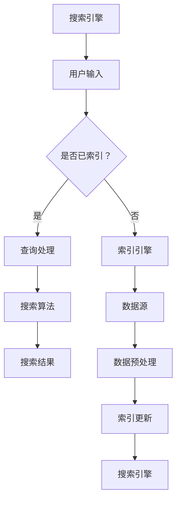

                 

### 《跨平台搜索技术：AI整合数据》

> **关键词：跨平台搜索、AI、数据整合、搜索引擎、算法优化**

> **摘要：本文深入探讨了跨平台搜索技术的核心概念、原理与应用。通过介绍AI在跨平台搜索中的作用，详细分析了数据整合与处理技术。同时，本文提供了跨平台搜索系统的设计与实现方法，并结合实际项目实战，展现了跨平台搜索技术的广泛应用与未来发展趋势。**

### 目录

#### 第一部分：跨平台搜索技术概述

1. 跨平台搜索技术基础
    - 1.1 跨平台搜索的定义与重要性
    - 1.2 跨平台搜索的基本原理
    - 1.3 跨平台搜索的应用场景

2. AI在跨平台搜索中的应用
    - 2.1 AI在跨平台搜索中的角色
    - 2.2 AI驱动的跨平台搜索算法

3. 数据整合与处理技术
    - 3.1 数据整合技术
    - 3.2 数据处理技术

#### 第二部分：跨平台搜索系统设计与实现

1. 跨平台搜索系统架构设计
    - 4.1 搜索系统的总体架构
    - 4.2 数据存储与索引技术

2. 搜索算法优化
    - 5.1 搜索算法的基本策略
    - 5.2 搜索算法的性能优化

3. 跨平台搜索系统的开发与部署
    - 6.1 开发环境搭建
    - 6.2 系统部署与维护

#### 第三部分：跨平台搜索项目实战

1. 社交网络搜索项目
    - 7.1 项目需求分析
    - 7.2 项目开发流程
    - 7.3 项目评估与优化

2. 商业搜索项目
    - 8.1 项目背景与需求
    - 8.2 数据采集与处理
    - 8.3 搜索算法实现
    - 8.4 项目评估与优化

#### 第四部分：跨平台搜索未来发展趋势

1. 未来趋势与展望
    - 9.1 跨平台搜索技术发展趋势
    - 9.2 搜索技术与人工智能的深度融合
    - 9.3 跨平台搜索的未来展望

#### 附录

1. 跨平台搜索技术工具与资源
    - 附录A：常用搜索技术工具
    - 附录B：跨平台搜索技术资源
    - 附录C：相关书籍与论文推荐

### 核心概念原理和架构的 Mermaid 流程图

以下是核心概念原理和架构的 Mermaid 流程图：

### 跨平台搜索技术基础

#### 1.1 跨平台搜索的定义与重要性

**跨平台搜索**，顾名思义，是指在不同的平台（如网站、应用、设备等）之间进行数据搜索的能力。这种搜索能力不仅限于单一的平台，而是能够在多个平台间无缝切换，为用户提供统一的、一致的数据查询体验。

**重要性**：

1. **用户体验的提升**：用户不再需要频繁地在不同的应用之间切换以获取所需的信息，提高了用户的便捷性和满意度。
2. **数据的集中管理**：企业能够更有效地管理分散在不同平台的数据，实现数据的统一检索和整合。
3. **商业价值的挖掘**：通过跨平台搜索，企业可以更好地了解用户行为和需求，从而提供更加精准的市场营销和产品推荐。
4. **技术的进步**：跨平台搜索推动了搜索引擎技术和人工智能技术的发展，促进了相关领域的创新。

#### 1.2 跨平台搜索的基本原理

**搜索引擎的工作流程**：

1. **数据采集**：搜索引擎通过爬虫技术从各个平台采集数据。
2. **数据预处理**：采集到的数据需要进行清洗、去重、分类等预处理操作，以确保数据的准确性和一致性。
3. **数据索引**：预处理后的数据会被索引，以便快速检索。
4. **查询处理**：当用户发起查询时，搜索引擎会根据用户的输入，从索引中检索相关数据。
5. **结果呈现**：搜索结果按照一定的排序规则展示给用户。

**数据源整合与处理**：

1. **数据源整合**：跨平台搜索需要对来自不同平台的数据进行整合，这涉及到数据的格式转换、内容同步等操作。
2. **数据处理**：整合后的数据需要进行标准化处理，以适应统一的搜索算法和模型。

#### 1.3 跨平台搜索的应用场景

**社交网络搜索**：

- **功能需求**：用户可以在社交网络中搜索好友、话题、动态等信息。
- **用户需求**：用户希望能够快速准确地找到感兴趣的内容和好友。

**商业搜索**：

- **功能需求**：企业可以通过商业搜索获取客户信息、市场动态、竞争对手分析等。
- **用户需求**：企业需要高效、精准地获取与业务相关的数据。

**智能问答**：

- **功能需求**：智能问答系统能够自动回答用户提出的问题。
- **用户需求**：用户希望能够获得快速、准确的答案。

### AI在跨平台搜索中的应用

#### 2.1 AI在跨平台搜索中的角色

**自然语言处理**：自然语言处理（NLP）是AI在跨平台搜索中扮演的重要角色之一。通过NLP技术，搜索引擎可以理解用户的查询意图，并将自然语言转换为机器可以处理的结构化数据。

**机器学习算法**：机器学习算法在跨平台搜索中的应用主要体现在搜索算法的优化和数据挖掘中。通过机器学习，搜索引擎可以不断优化搜索结果的相关性和准确性。

#### 2.2 AI驱动的跨平台搜索算法

**文本分类算法**：

- **定义**：文本分类是将文本数据按照预定的类别划分到不同的类别中。
- **算法类型**：常见的文本分类算法包括朴素贝叶斯分类器、支持向量机（SVM）等。
- **应用场景**：在社交网络搜索中，文本分类算法可以用于分类用户发布的动态、话题等。

**相似度计算**：

- **定义**：相似度计算是评估两个文本或文档相似程度的算法。
- **算法类型**：常见的相似度计算方法包括余弦相似度、欧氏距离等。
- **应用场景**：在商业搜索中，相似度计算可以用于推荐相似商品、相似客户等。

**排序算法**：

- **定义**：排序算法是根据特定规则对搜索结果进行排序的算法。
- **算法类型**：常见的排序算法包括TF-IDF、PageRank等。
- **应用场景**：在智能问答中，排序算法可以用于根据用户问题的重要程度排序答案。

### 数据整合与处理技术

#### 3.1 数据整合技术

**数据清洗**：

- **定义**：数据清洗是处理和清洗原始数据的过程，包括去除重复数据、纠正错误数据等。
- **方法**：常用的数据清洗方法包括去重、缺失值填充、异常值处理等。

**数据预处理**：

- **定义**：数据预处理是对原始数据进行处理，使其适合进行分析和建模的过程。
- **方法**：常用的数据预处理方法包括特征提取、特征选择、数据标准化等。

**数据集成**：

- **定义**：数据集成是将来自不同数据源的数据整合到一个统一的数据集中。
- **方法**：常用的数据集成方法包括合并、连接、汇总等。

#### 3.2 数据处理技术

**数据挖掘**：

- **定义**：数据挖掘是从大量数据中提取有用信息和知识的过程。
- **方法**：常用的数据挖掘方法包括聚类、分类、关联规则挖掘等。

**数据分析**：

- **定义**：数据分析是对数据进行分析，以提取信息、发现规律、支持决策的过程。
- **方法**：常用的数据分析方法包括统计方法、机器学习方法等。

### 跨平台搜索系统设计与实现

#### 4.1 搜索系统的总体架构

**系统组件**：

- **搜索引擎**：负责处理用户查询，返回搜索结果。
- **索引引擎**：负责创建和维护索引，提高搜索效率。
- **数据源**：包括各种平台的数据，如网站、应用、数据库等。
- **数据预处理模块**：负责对数据源中的数据进行清洗、预处理。

**系统交互**：

1. **用户查询**：用户通过用户界面输入查询请求。
2. **查询处理**：搜索引擎接收到查询请求后，进行查询处理，返回搜索结果。
3. **数据检索**：搜索引擎从索引中检索相关数据，返回搜索结果。
4. **结果呈现**：搜索结果通过用户界面展示给用户。

#### 4.2 数据存储与索引技术

**数据存储技术**：

- **关系型数据库**：用于存储结构化数据，如SQL数据库。
- **文档存储**：用于存储非结构化或半结构化数据，如MongoDB。
- **分布式文件系统**：用于存储海量数据，如HDFS。

**索引技术**：

- **全文索引**：用于快速搜索文本数据，如Elasticsearch。
- **倒排索引**：用于快速搜索关键词，如Lucene。
- **索引优化**：通过优化索引结构，提高搜索效率。

### 搜索算法优化

#### 5.1 搜索算法的基本策略

**搜索算法概述**：

- **关键字搜索**：基于用户输入的关键词，从索引中检索相关数据。
- **分类搜索**：根据用户指定的类别，从索引中检索相关数据。
- **推荐搜索**：根据用户历史行为和兴趣，推荐相关数据。

**搜索算法的比较**：

- **优点**：
  - **关键字搜索**：简单高效，适合大多数用户。
  - **分类搜索**：精确性高，适合特定需求的用户。
  - **推荐搜索**：个性化强，提升用户体验。
- **缺点**：
  - **关键字搜索**：可能存在冗余和不相关结果。
  - **分类搜索**：可能无法满足用户的个性化需求。
  - **推荐搜索**：可能存在数据隐私和偏好偏见问题。

#### 5.2 搜索算法的性能优化

**算法效率分析**：

- **查询效率**：通过优化索引结构，减少查询时间。
- **数据处理效率**：通过并行处理和分布式计算，提高数据处理速度。

**性能优化技巧**：

- **索引优化**：定期维护和优化索引，提高搜索效率。
- **缓存技术**：利用缓存技术，减少数据库访问次数。
- **负载均衡**：通过负载均衡技术，分配查询负载，提高系统性能。

### 跨平台搜索系统的开发与部署

#### 6.1 开发环境搭建

**开发工具与框架**：

- **编程语言**：Python、Java等。
- **开发框架**：如Elasticsearch、Solr等。
- **版本控制**：Git等。

**系统开发流程**：

1. **需求分析**：明确搜索系统的功能需求和性能要求。
2. **系统设计**：设计系统的总体架构和模块。
3. **开发实现**：编写代码，实现系统功能。
4. **测试与调试**：测试系统功能，调试代码，确保系统稳定运行。

#### 6.2 系统部署与维护

**部署策略**：

1. **部署环境**：选择合适的服务器环境和数据库。
2. **部署步骤**：包括安装、配置、部署应用程序等。
3. **部署自动化**：利用自动化工具，如Docker、Kubernetes等，实现系统的自动化部署。

**维护与监控**：

1. **系统监控**：实时监控系统性能和健康状况。
2. **故障处理**：及时处理系统故障，确保系统稳定运行。
3. **性能优化**：定期对系统进行性能优化，提高系统效率。

### 社交网络搜索项目

#### 7.1 项目需求分析

**功能需求**：

1. **搜索用户动态**：用户可以在社交网络中搜索特定用户的动态。
2. **搜索话题**：用户可以搜索感兴趣的话题和讨论。
3. **搜索好友**：用户可以搜索与自己在社交网络中存在联系的好友。

**用户需求**：

1. **快速准确查找信息**：用户希望快速准确地找到所需信息。
2. **社交互动功能**：用户希望在搜索结果中进行评论、点赞、分享等社交互动。

#### 7.2 项目开发流程

**数据采集**：

1. **用户动态数据**：通过API接口，从社交网络平台获取用户发布的动态。
2. **话题数据**：从社交网络平台获取用户参与的话题和讨论。
3. **好友关系数据**：从社交网络平台获取用户之间建立的好友关系。

**数据处理**：

1. **数据清洗**：去除重复数据、异常数据等。
2. **数据预处理**：对动态、话题、好友关系数据进行结构化处理。
3. **数据索引**：将预处理后的数据索引到搜索引擎中。

**搜索算法实现**：

1. **基于用户兴趣的搜索算法**：根据用户的历史行为和兴趣爱好，推荐相关的用户动态和话题。
2. **基于话题的搜索算法**：根据用户输入的关键词，搜索相关的话题和讨论。
3. **基于好友关系的搜索算法**：根据用户的好友关系，推荐与好友相关的用户动态和话题。

#### 7.3 项目评估与优化

**项目评估**：

1. **搜索准确率**：评估搜索结果的准确性和相关性。
2. **搜索响应时间**：评估搜索过程的响应速度。

**项目优化**：

1. **优化数据索引策略**：通过优化索引结构，提高搜索效率。
2. **优化搜索算法**：通过优化算法模型，提高搜索结果的准确性和相关性。
3. **优化系统性能**：通过优化服务器和数据库配置，提高系统的整体性能。

### 商业搜索项目

#### 8.1 项目背景与需求

**项目背景**：

1. **提高电商平台搜索效率**：通过优化搜索算法，提高电商平台上的搜索效率和用户体验。
2. **提升用户购物体验**：通过个性化推荐和精准搜索，提升用户的购物体验。

**需求**：

1. **搜索商品信息**：用户可以在电商平台上搜索特定商品的信息。
2. **搜索商品评价**：用户可以查看商品的详细评价和用户评论。
3. **搜索相似商品**：根据用户的浏览和购买历史，推荐相似商品。

#### 8.2 数据采集与处理

**数据采集**：

1. **商品信息数据**：通过API接口，从电商平台获取商品的基本信息，如名称、价格、描述等。
2. **商品评价数据**：从电商平台获取用户对商品的评论和评分。
3. **用户行为数据**：从电商平台获取用户的浏览和购买历史。

**数据处理**：

1. **数据清洗**：去除重复数据、异常数据等。
2. **数据预处理**：对商品信息、评价数据进行结构化处理，提取有用特征。
3. **数据索引**：将预处理后的数据索引到搜索引擎中。

#### 8.3 搜索算法实现

**搜索算法设计**：

1. **基于商品属性的搜索算法**：根据用户的输入关键词，搜索匹配商品的基本信息。
2. **基于用户评价的搜索算法**：根据用户对商品的评论和评分，推荐相关的商品。
3. **基于用户行为的搜索算法**：根据用户的浏览和购买历史，推荐用户可能感兴趣的商品。

**算法实现**：

1. **编写代码实现搜索算法**：使用Python等编程语言，实现搜索算法的代码。
2. **进行算法性能测试与优化**：测试搜索算法的准确率和响应时间，优化算法模型和代码。

#### 8.4 项目评估与优化

**项目评估**：

1. **搜索准确率**：评估搜索结果的准确性和相关性。
2. **搜索响应时间**：评估搜索过程的响应速度。

**项目优化**：

1. **优化数据索引策略**：通过优化索引结构，提高搜索效率。
2. **优化搜索算法**：通过优化算法模型，提高搜索结果的准确性和相关性。
3. **优化系统性能**：通过优化服务器和数据库配置，提高系统的整体性能。

### 跨平台搜索未来发展趋势

#### 9.1 跨平台搜索技术发展趋势

1. **搜索引擎与AI的深度融合**：随着AI技术的不断发展，搜索技术将更加智能化，能够更好地理解用户的查询意图，提供个性化的搜索结果。
2. **多模态搜索**：未来的跨平台搜索将不仅限于文本数据，还将包括图像、音频、视频等多模态数据，实现更加丰富的搜索体验。
3. **实时搜索**：随着5G技术的普及，实时搜索将成为可能，用户可以实时获取最新的信息。

#### 9.2 搜索技术与人工智能的深度融合

1. **深度学习**：深度学习在搜索技术中的应用将更加广泛，通过神经网络模型，搜索系统能够更好地理解和处理复杂的数据。
2. **知识图谱**：知识图谱技术将用于构建知识库，提高搜索结果的准确性和相关性。
3. **联邦学习**：联邦学习技术将用于跨平台数据的隐私保护，实现多方数据的安全共享。

#### 9.3 跨平台搜索的未来展望

1. **行业应用**：跨平台搜索将在更多行业得到应用，如医疗、金融、教育等，为行业提供智能化的数据检索服务。
2. **个性化搜索**：随着用户数据的积累，搜索系统将能够更好地理解用户的需求，提供个性化的搜索结果。
3. **隐私保护**：未来的搜索技术将更加注重用户隐私保护，通过安全机制，确保用户数据的安全。

### 附录

#### 附录A：跨平台搜索技术工具与资源

1. **常用搜索技术工具**：

   - **Elasticsearch**：一款开源的分布式全文搜索引擎，适用于大规模数据的搜索和分析。
   - **Solr**：Apache基金会的一款开源搜索引擎，支持复杂的查询和索引功能。
   - **Apache Lucene**：一个开源的全文搜索引擎库，支持高效的数据索引和搜索。

2. **跨平台搜索技术资源**：

   - **《搜索引擎设计与实现》**：详细介绍了搜索引擎的基本原理和实现方法。
   - **《自然语言处理实战》**：提供了自然语言处理技术的实际应用案例。
   - **《机器学习实战》**：介绍了机器学习算法在搜索中的应用。

3. **相关书籍与论文推荐**：

   - **《跨平台搜索技术综述》**：对跨平台搜索技术进行了全面的综述和分析。
   - **《基于深度学习的跨平台搜索算法研究》**：探讨了深度学习在跨平台搜索中的应用。
   - **《社交网络搜索中的数据挖掘与优化》**：分析了社交网络搜索中的数据挖掘和优化方法。

### 作者信息

**作者：AI天才研究院/AI Genius Institute & 禅与计算机程序设计艺术 /Zen And The Art of Computer Programming**

