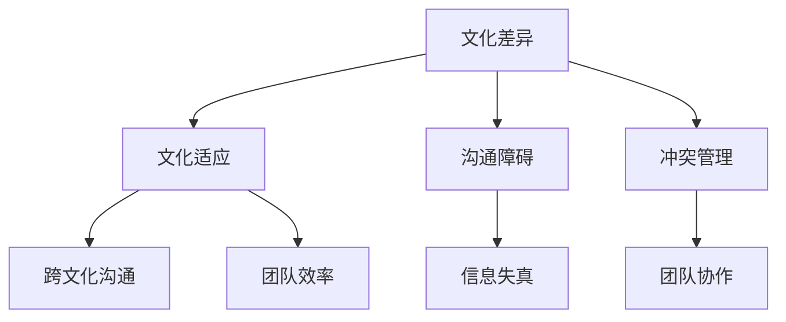

                 

# 《跨文化团队管理：全球化背景下的挑战》

## 关键词
- 跨文化团队管理
- 全球化趋势
- 文化差异
- 沟通障碍
- 领导力
- 冲突管理

## 摘要
本文深入探讨了全球化背景下跨文化团队管理的核心概念、理论基础和实践策略。通过分析文化差异、跨文化沟通、领导风格、冲突管理和绩效评估等方面，本文揭示了跨文化团队管理面临的挑战与机遇。同时，结合全球顶级企业的成功案例，本文提出了跨文化团队管理的最佳实践和未来发展趋势。本文旨在为从事国际化业务的企业和团队提供有价值的指导。

## 引言

### 全球化背景下的跨文化团队管理

全球化是一个不可逆转的历史趋势，它不仅改变了世界的经济格局，也对组织管理和团队协作提出了新的挑战。在全球化背景下，企业不再局限于本国市场，而是越来越多地在全球范围内开展业务，这导致了跨文化团队的兴起。跨文化团队是由来自不同文化背景的成员组成的团队，他们共同工作以实现特定的目标。这种团队结构在全球化企业的运营中变得越来越常见，因为它能够带来多元化的思维、技能和经验，从而提高创新能力和市场竞争力。

然而，跨文化团队管理并非易事。文化差异可能导致沟通障碍、误解和冲突，从而影响团队效率和目标达成。全球化进程加速，企业需要在短时间内适应不同文化，这要求管理者具备跨文化敏感性和管理技能。因此，跨文化团队管理成为了企业管理中的关键领域。

本文将系统地探讨跨文化团队管理的核心概念、理论基础和实践策略。通过详细分析文化差异、跨文化沟通、领导风格、冲突管理和绩效评估等方面，本文旨在为从事国际化业务的企业和团队提供有价值的指导。

### 跨文化团队管理的定义与重要性

跨文化团队管理是指在一个多元文化环境中，通过有效的组织和管理策略，促进团队成员之间的沟通、协作和共同目标实现的过程。它涉及到文化差异的识别、理解和管理，以及团队内部权力结构的调整和适应。跨文化团队管理的目标是最大化文化多样性带来的优势，同时减少因文化差异引起的负面影响。

在全球化的背景下，跨文化团队管理的重要性愈发突出。首先，文化多样性为团队带来了多元化的思维和观点，有助于创新和问题解决。不同的文化背景可以激发新的创意，提高团队的应变能力和市场竞争力。其次，跨文化团队可以更好地理解和适应全球市场的需求，从而提高企业的国际化水平。此外，有效的跨文化团队管理有助于增强团队的凝聚力和忠诚度，提高员工的工作满意度和生产力。

然而，跨文化团队管理也面临着一系列挑战。文化差异可能导致沟通障碍，误解和冲突频发，从而影响团队的工作效率和目标达成。不同文化背景的团队成员可能在价值观、工作习惯和沟通方式上存在显著差异，这需要管理者具备高度的跨文化敏感性和适应能力。此外，全球化进程的加快要求企业能够迅速调整和适应不同市场的文化特点，这对管理者的应变能力和决策能力提出了更高的要求。

尽管挑战重重，跨文化团队管理仍然是全球化企业不可或缺的一部分。它不仅有助于提高企业的创新能力和市场竞争力，还能增强企业的文化包容性和全球影响力。因此，深入研究和探讨跨文化团队管理的理论和方法，对于企业实现可持续发展具有重要意义。

### 核心概念与联系

在探讨跨文化团队管理之前，有必要明确几个核心概念，并分析它们之间的联系。这些核心概念包括文化差异、文化适应、沟通障碍和冲突管理。

#### 1. 文化差异

文化差异是指不同文化群体在价值观、行为模式、语言习惯、宗教信仰等方面的差异。文化差异模型如霍夫斯泰德的六维模型（权力距离、个体主义与集体主义、男性主义与女性主义、不确定性规避、价值取向和长期取向与短期取向）提供了对文化差异的系统性理解。通过这些模型，我们可以识别和比较不同文化群体在行为和沟通方式上的显著差异。

#### 2. 文化适应

文化适应是指个体或团队在新的文化环境中调整自身行为和认知模式，以适应和融入新文化的过程。文化适应包括文化认知、情感反应、行为调整和文化融入四个阶段。在跨文化团队管理中，文化适应是一个关键过程，管理者需要帮助团队成员理解和适应不同的文化，以促进团队协作和效率。

#### 3. 沟通障碍

沟通障碍是指在跨文化沟通中，由于文化差异导致的理解困难、信息失真和沟通效率降低。常见的沟通障碍包括语言障碍、非语言沟通的差异、文化价值观的差异以及沟通风格的不同。通过识别和克服这些障碍，可以提高跨文化沟通的效率和质量。

#### 4. 冲突管理

冲突管理是指在跨文化团队中，处理和解决因文化差异引起的冲突的过程。冲突管理包括冲突预防、冲突识别、冲突分析和冲突解决。有效的冲突管理有助于减少文化差异导致的团队紧张和矛盾，提高团队协作和生产力。

#### 核心概念联系图

为了更直观地展示这些核心概念之间的联系，我们可以使用 Mermaid 流程图进行描述：



在这个联系图中，文化差异是所有其他概念的基础，它直接影响文化适应、沟通障碍和冲突管理。文化适应有助于提高跨文化沟通的效率，减少沟通障碍，并促进团队协作和效率。

### 跨文化团队管理的理论基础

跨文化团队管理的理论基础主要包括文化差异理论、跨文化沟通理论和跨文化冲突管理理论。这些理论为跨文化团队管理提供了科学依据和指导原则，帮助我们更好地理解和应对文化差异带来的挑战。

#### 1. 文化差异理论

文化差异理论是跨文化团队管理的重要理论基础之一。文化差异理论试图解释不同文化群体在价值观、行为习惯、沟通方式等方面的差异。霍夫斯泰德（Hofstede）的文化维度理论是一个广为人知的文化差异模型。霍夫斯泰德提出，文化差异可以从六个维度来衡量：权力距离（Power Distance）、个体主义与集体主义（Individualism vs. Collectivism）、男性主义与女性主义（Masculinity vs. Femininity）、不确定性规避（Uncertainty Avoidance）、价值取向（Long-term Orientation vs. Short-term Orientation）和宗教信仰（Religion）。

霍夫斯泰德的文化维度模型为跨文化团队管理提供了重要的工具，帮助管理者识别和比较不同文化背景的团队成员的行为和沟通方式。例如，在权力距离较大的文化中，团队成员可能更倾向于服从权威，而在个体主义较强的文化中，团队成员可能更注重个人成就和自主性。

为了更直观地展示霍夫斯泰德的文化维度模型，我们可以使用伪代码进行描述：

```python
class CultureDimension:
    def __init__(self, power_distance, individualism_collectivism, masculinity_femininity, uncertainty_avoidance, long_term_orientation, short_term_orientation):
        self.power_distance = power_distance
        self.individualism_collectivism = individualism_collectivism
        self.masculinity_femininity = masculinity_femininity
        self.uncertainty_avoidance = uncertainty_avoidance
        self.long_term_orientation = long_term_orientation
        self.short_term_orientation = short_term_orientation

# 示例：创建一个美国和中国的文化维度对象
us_culture = CultureDimension(40, 90, 58, 20, 90, 10)
china_culture = CultureDimension(80, 30, 66, 34, 20, 80)

# 比较文化维度差异
def compare_cultures(culture1, culture2):
    differences = []
    if culture1.power_distance != culture2.power_distance:
        differences.append("权力距离差异")
    if culture1.individualism_collectivism != culture2.individualism_collectivism:
        differences.append("个体主义与集体主义差异")
    # 其他维度的比较
    return differences

culture_differences = compare_cultures(us_culture, china_culture)
print("文化差异：", culture_differences)
```

这个伪代码示例展示了如何使用霍夫斯泰德的文化维度模型来识别和比较两个不同文化背景的团队成员的文化差异。

#### 2. 跨文化沟通理论

跨文化沟通理论探讨了在多元文化环境中，团队成员如何有效地进行沟通和协作。跨文化沟通障碍是指由于文化差异导致的沟通障碍，如语言障碍、非语言沟通的差异、文化价值观的差异和沟通风格的不同。

跨文化沟通理论强调，有效的跨文化沟通需要管理者具备跨文化敏感性和适应能力。管理者需要了解不同文化的沟通习惯和价值观，采用适当的沟通策略和方法，以减少误解和冲突，提高沟通效率。

为了更直观地展示跨文化沟通的障碍和解决方法，我们可以使用伪代码进行描述：

```python
class CommunicationBarrier:
    def __init__(self, language_barrier, nonverbal_communication, cultural_values, communication_styles):
        self.language_barrier = language_barrier
        self.nonverbal_communication = nonverbal_communication
        self.cultural_values = cultural_values
        self.communication_styles = communication_styles

# 示例：创建一个跨文化沟通障碍对象
communication_barriers = CommunicationBarrier(True, True, True, True)

# 解决跨文化沟通障碍的方法
def solve_communication_barriers(barriers):
    solutions = []
    if barriers.language_barrier:
        solutions.append("提供语言培训")
    if barriers.nonverbal_communication:
        solutions.append("加强非语言沟通的培训")
    if barriers.cultural_values:
        solutions.append("加强文化差异教育")
    if barriers.communication_styles:
        solutions.append("采用多样化的沟通策略")
    return solutions

communication_solutions = solve_communication_barriers(communication_barriers)
print("解决跨文化沟通障碍的方法：", communication_solutions)
```

这个伪代码示例展示了如何识别和解决跨文化沟通障碍。

#### 3. 跨文化冲突管理理论

跨文化冲突管理理论关注在多元文化团队中如何处理和解决由于文化差异引起的冲突。跨文化冲突可以表现为沟通障碍、误解和价值观差异等。有效的跨文化冲突管理需要管理者具备高度的跨文化敏感性和冲突解决技能。

跨文化冲突管理包括冲突预防、冲突识别、冲突分析和冲突解决四个阶段。冲突预防是通过建立有效的沟通和协作机制来减少冲突的发生。冲突识别是及时察觉和识别冲突的迹象。冲突分析是分析冲突的原因和影响，制定解决方案。冲突解决是采取有效的措施解决冲突，恢复团队和谐。

为了更直观地展示跨文化冲突管理的步骤，我们可以使用伪代码进行描述：

```python
class ConflictManagement:
    def __init__(self, prevention, identification, analysis, resolution):
        self.prevention = prevention
        self.identification = identification
        self.analysis = analysis
        self.resolution = resolution

# 示例：创建一个跨文化冲突管理对象
conflict_management = ConflictManagement(True, True, True, True)

# 跨文化冲突管理步骤
def manage_conflicts(conflict_management):
    if conflict_management.prevention:
        print("预防冲突：建立有效的沟通和协作机制")
    if conflict_management.identification:
        print("识别冲突：及时察觉和识别冲突的迹象")
    if conflict_management.analysis:
        print("分析冲突：分析冲突的原因和影响")
    if conflict_management.resolution:
        print("解决冲突：采取有效的措施解决冲突")

manage_conflicts(conflict_management)
```

这个伪代码示例展示了跨文化冲突管理的步骤和过程。

通过这些理论基础，我们可以更好地理解和应对跨文化团队管理中的挑战。文化差异理论帮助我们识别和比较不同文化背景的团队成员的行为和沟通方式，跨文化沟通理论指导我们如何有效地进行跨文化沟通，跨文化冲突管理理论帮助我们处理和解决由于文化差异引起的冲突。这些理论共同构成了跨文化团队管理的基础，为管理者提供了科学的指导。

### 文化差异理论：霍夫斯泰德模型及其应用

霍夫斯泰德的文化维度理论是跨文化团队管理中的重要理论基础，它帮助我们理解不同文化群体在价值观、行为习惯和沟通方式上的差异。霍夫斯泰德提出的文化维度包括权力距离、个体主义与集体主义、男性主义与女性主义、不确定性规避、价值取向和长期取向与短期取向。以下是对这些维度的详细解释和应用。

#### 1. 权力距离

权力距离（Power Distance）是指在一个社会或组织中，权力不平等的程度。在权力距离较大的文化中，如印度和中国，人们更倾向于接受权力和等级制度，上级对下级的控制力较强。而在权力距离较小的文化中，如美国和丹麦，人们更倾向于平等和参与，上级对下级的控制力较弱。

在跨文化团队管理中，了解不同文化背景的团队成员对权力距离的看法对于建立有效的团队关系至关重要。例如，在印度和中国工作的团队成员可能更期望上级给予明确的指导和监督，而在美国和丹麦的团队成员可能更希望参与决策过程并拥有更大的自主权。

为了更好地应对权力距离差异，管理者可以采取以下策略：
- 在权力距离较大的文化中，提供清晰的指导和监督，确保团队成员了解自己的职责和期望。
- 在权力距离较小的文化中，鼓励团队成员参与决策过程，提高他们的参与感和责任感。

#### 2. 个体主义与集体主义

个体主义与集体主义（Individualism vs. Collectivism）是指在一个社会或组织中，个人利益与集体利益的优先级。在个体主义较强的文化中，如美国和澳大利亚，个人更注重个人成就和独立性。而在集体主义较强的文化中，如日本和韩国，个人更注重团队和集体的利益。

在跨文化团队管理中，管理者需要根据不同文化背景的团队成员的个体主义与集体主义倾向，制定相应的管理策略。例如：
- 在个体主义较强的文化中，鼓励团队成员独立思考和追求个人目标，提供个人发展的机会。
- 在集体主义较强的文化中，强调团队合作和集体荣誉，鼓励团队成员为团队的整体利益而努力。

#### 3. 男性和女性主义

男性主义与女性主义（Masculinity vs. Femininity）是指在一个社会或组织中，性别角色的期望和价值观。在男性主义较强的文化中，如德国和英国，性别角色差异较大，男性更注重成就、竞争和物质财富。而在女性主义较强的文化中，如瑞典和丹麦，性别角色差异较小，性别平等和关爱更为重要。

在跨文化团队管理中，管理者需要关注不同文化背景的团队成员对性别角色的看法，以促进性别平等和团队和谐。例如：
- 在男性主义较强的文化中，鼓励女性发挥自己的优势，避免性别歧视。
- 在女性主义较强的文化中，重视男性在家庭和工作中的责任，促进性别平衡。

#### 4. 不确定性规避

不确定性规避（Uncertainty Avoidance）是指在一个社会或组织中，对不确定性、模糊性和变化的容忍程度。在不确定性规避较高的文化中，如日本和德国，人们更倾向于规避风险，遵循规则和条例。而在不确定性规避较低的文化中，如美国和澳大利亚，人们更愿意接受变化和不确定性。

在跨文化团队管理中，了解不同文化背景的团队成员对不确定性的态度对于制定战略和应对变化至关重要。例如：
- 在不确定性规避较高的文化中，制定明确的计划和目标，确保团队成员了解工作的预期结果。
- 在不确定性规避较低的文化中，鼓励团队成员创新和探索，接受变化和不确定性。

#### 5. 价值取向

价值取向（Long-term Orientation vs. Short-term Orientation）是指在一个社会或组织中，对长期目标和短期目标的重视程度。在长期取向较强的文化中，如中国和日本，人们更注重长远规划和持续发展。而在短期取向较强的文化中，如美国和德国，人们更注重短期成果和即时利益。

在跨文化团队管理中，了解不同文化背景的团队成员对价值取向的差异有助于制定合适的工作目标和激励措施。例如：
- 在长期取向较强的文化中，鼓励团队成员关注长期目标和持续发展，提供培训和职业发展机会。
- 在短期取向较强的文化中，设定明确的短期目标和奖励机制，激励团队成员实现即时的成果。

#### 应用示例

假设一个跨国团队由美国、日本和中国成员组成，团队成员在上述文化维度上存在显著差异。为了有效地管理这个团队，管理者可以采取以下策略：

1. **权力距离**：美国成员可能期望更多的自主权，而日本成员可能更习惯于遵循上级的指导。管理者可以采用双重领导模式，既给予美国成员一定的自主权，又为日本成员提供清晰的指导和反馈。

2. **个体主义与集体主义**：在个体主义较强的美国成员中，鼓励他们独立思考和追求个人目标。在集体主义较强的日本成员中，强调团队合作和集体荣誉。

3. **男性和女性主义**：确保性别平等，为女性成员提供支持和机会，以消除性别歧视。

4. **不确定性规避**：为日本成员提供明确的计划和目标，以降低不确定性。同时，鼓励美国成员创新和接受变化。

5. **价值取向**：为长期取向较强的中国成员提供长期规划和职业发展机会，为短期取向较强的美国成员设定短期目标和奖励机制。

通过这些策略，管理者可以更好地应对跨文化团队管理中的文化差异，促进团队协作和效率。

### 跨文化沟通理论：沟通障碍与解决方法

跨文化沟通理论关注在多元文化环境中，团队成员如何有效地进行沟通和协作。跨文化沟通障碍是指由于文化差异导致的理解困难、信息失真和沟通效率降低。以下是一些常见的跨文化沟通障碍及其解决方法。

#### 1. 语言障碍

语言障碍是跨文化沟通中最显著的障碍之一。不同语言背景的团队成员可能在词汇、语法和表达习惯上存在差异，导致沟通不畅。例如，英语为母语的团队成员可能难以理解某些非英语词汇的细微差别，从而产生误解。

**解决方法**：
- 提供语言培训：为团队成员提供专业语言培训，提高他们的语言表达能力。
- 使用通用语言：在跨文化团队中，选择一种通用语言作为工作语言，以减少语言障碍。
- 利用翻译工具：使用翻译工具帮助团队成员理解和传达信息，但需注意翻译的准确性和语境。

#### 2. 非语言沟通的差异

非语言沟通包括肢体语言、面部表情、姿态和空间使用等。不同文化背景的团队成员可能在非语言沟通方式上存在显著差异，导致误解和冲突。例如，在某些文化中，直接的目光接触被视为尊重和自信的表现，而在其他文化中，这可能被视为不礼貌或不信任。

**解决方法**：
- 了解不同文化的非语言沟通习惯：通过培训和交流，帮助团队成员了解和尊重不同文化的非语言沟通方式。
- 采用多样化的沟通方式：结合语言沟通和非语言沟通，提高沟通的准确性和效果。
- 保持开放和包容的态度：尊重不同文化的非语言沟通习惯，避免因误解而产生的冲突。

#### 3. 文化价值观的差异

文化价值观的差异可能导致团队成员在沟通方式和内容上产生分歧。例如，在一些文化中，直接和坦诚的沟通被视为优点，而在其他文化中，委婉和含蓄可能更为重要。

**解决方法**：
- 增强文化敏感性：通过培训和研讨会，提高团队成员对文化差异的敏感性，增强跨文化沟通能力。
- 采用适应性沟通策略：根据不同文化背景的团队成员，调整沟通方式和内容，以减少误解和冲突。
- 建立信任和尊重：通过建立信任和尊重，促进团队成员之间的有效沟通和协作。

#### 4. 沟通风格的差异

不同文化背景的团队成员可能在沟通风格上存在显著差异。例如，一些文化倾向于直接和具体的沟通方式，而其他文化可能更注重间接和抽象的沟通。

**解决方法**：
- 了解不同文化的沟通风格：通过研究和交流，帮助团队成员了解和适应不同文化的沟通风格。
- 采用多元化的沟通方式：结合不同文化的沟通风格，提高沟通的准确性和效果。
- 提供沟通反馈：通过定期的沟通反馈，帮助团队成员识别和解决沟通中的问题。

#### 实际案例

假设一个跨国团队由美国、日本和德国成员组成，团队成员在沟通中面临以下障碍：

1. **语言障碍**：美国成员与日本成员在语言表达上存在差异，导致沟通不畅。
   - **解决方法**：提供英语和日语的语言培训，并指定一名翻译协助沟通。

2. **非语言沟通的差异**：日本成员在沟通中较少使用直接的目光接触，而德国成员则习惯于直接的目光接触。
   - **解决方法**：通过培训，帮助团队成员了解和尊重不同文化的非语言沟通习惯。

3. **文化价值观的差异**：美国成员倾向于直接和坦诚的沟通，而日本成员则更注重委婉和含蓄。
   - **解决方法**：通过跨文化敏感性培训，提高团队成员对文化差异的敏感性，并采用适应性沟通策略。

4. **沟通风格的差异**：德国成员倾向于具体的沟通方式，而美国成员则更注重抽象的沟通。
   - **解决方法**：通过定期的沟通反馈，帮助团队成员识别和解决沟通中的问题。

通过这些解决方法，跨国团队可以克服沟通障碍，提高沟通效率，促进团队协作和目标实现。

### 跨文化冲突管理：冲突的类型与解决策略

在跨文化团队中，冲突是一种常见但可以管理的现象。冲突管理是跨文化团队管理的重要组成部分，它涉及到识别、分析、预防和解决由于文化差异引起的冲突。以下将详细探讨跨文化冲突的类型及其解决策略。

#### 1. 冲突的类型

跨文化冲突可以分为以下几种类型：

- **沟通冲突**：由于语言障碍、非语言沟通差异和文化价值观差异导致的沟通不畅和误解。
- **角色冲突**：由于文化背景不同，团队成员在职责分配、工作方式和期望上存在分歧。
- **价值观冲突**：由于不同文化价值观的差异，团队成员在道德标准、工作态度和行为规范上产生分歧。
- **目标冲突**：由于不同文化背景的团队成员对目标设定和优先级的理解不同，导致目标不一致。

#### 2. 冲突的解决策略

解决跨文化冲突需要采取一系列策略，以下是一些常用的解决策略：

- **沟通策略**：加强跨文化沟通，提高团队成员的沟通能力。包括使用通用语言、提供语言培训、采用多样化的沟通方式和建立有效的沟通机制。
- **角色管理策略**：明确团队成员的职责和工作范围，通过角色分配和明确职责来减少冲突。同时，鼓励团队成员参与角色设定，提高角色认同感。
- **价值观管理策略**：通过文化敏感性培训和价值观教育，帮助团队成员理解和尊重不同的文化价值观。建立共同的文化价值观和团队规范，减少价值观冲突。
- **目标管理策略**：明确团队目标，确保所有团队成员对目标的设定和优先级有共同的理解。通过团队讨论和协商，制定符合跨文化团队实际情况的目标。

#### 3. 伪代码示例：冲突解决策略

为了更直观地展示冲突解决策略，我们可以使用伪代码进行描述：

```python
class ConflictResolution:
    def __init__(self, communication_strategy, role_management_strategy, value_management_strategy, goal_management_strategy):
        self.communication_strategy = communication_strategy
        self.role_management_strategy = role_management_strategy
        self.value_management_strategy = value_management_strategy
        self.goal_management_strategy = goal_management_strategy

    def resolve_conflict(self, conflict_type):
        if conflict_type == "communication":
            self.apply_communication_strategy()
        elif conflict_type == "role":
            self.apply_role_management_strategy()
        elif conflict_type == "value":
            self.apply_value_management_strategy()
        elif conflict_type == "goal":
            self.apply_goal_management_strategy()
        else:
            print("未知冲突类型")

    def apply_communication_strategy(self):
        print("采用沟通策略：加强跨文化沟通，提高沟通能力")

    def apply_role_management_strategy(self):
        print("采用角色管理策略：明确职责，减少角色冲突")

    def apply_value_management_strategy(self):
        print("采用价值观管理策略：进行文化敏感性培训，建立共同价值观")

    def apply_goal_management_strategy(self):
        print("采用目标管理策略：明确目标，确保团队成员对目标有共同理解")
        
# 创建一个冲突解决对象
conflict_resolution = ConflictResolution(True, True, True, True)

# 解决沟通冲突
conflict_resolution.resolve_conflict("communication")

# 解决角色冲突
conflict_resolution.resolve_conflict("role")

# 解决价值观冲突
conflict_resolution.resolve_conflict("value")

# 解决目标冲突
conflict_resolution.resolve_conflict("goal")
```

在这个伪代码示例中，我们创建了一个`ConflictResolution`类，它包含了解决不同类型冲突的方法。通过调用这些方法，我们可以根据冲突的类型采取相应的解决策略。

### 跨文化团队绩效评估与改进

在跨文化团队管理中，绩效评估是一个关键环节，它不仅有助于衡量团队成员的工作表现，还能为团队改进提供有力的数据支持。有效的绩效评估可以提高团队的工作效率和目标达成度，从而促进团队的可持续发展。

#### 1. 绩效评估方法与工具

跨文化团队绩效评估的方法和工具需要考虑到文化差异和多元背景，以下是一些常用的方法和工具：

- **360度评估**：360度评估是一种全方位的绩效评估方法，它不仅考虑上级的评价，还纳入了同事、下属和客户的反馈。这种方法有助于全面了解团队成员的工作表现和改进方向。
- **行为观察法**：行为观察法是通过观察团队成员在工作中的行为表现来评估其绩效。这种方法适用于跨文化团队，因为行为表现往往不受文化差异的影响。
- **关键绩效指标（KPI）**：KPI是一种量化的绩效评估工具，它通过设定具体的目标和指标来衡量团队成员的工作表现。这种方法有助于确保团队成员明确工作目标，并能够量化工作成果。

#### 2. 绩效改进策略

为了提高跨文化团队的绩效，管理者需要采取一系列改进策略，以下是一些具体的策略：

- **定制化培训**：根据团队成员的文化背景和技能需求，提供定制化的培训计划。这有助于提高团队成员的专业技能和跨文化沟通能力。
- **领导力发展**：通过领导力发展计划，提高管理者的跨文化领导力和冲突管理能力。有效的领导者能够更好地应对文化差异和团队挑战。
- **团队建设活动**：定期组织团队建设活动，促进团队成员之间的交流和合作。这有助于增强团队的凝聚力和信任感。
- **绩效反馈与激励**：定期提供绩效反馈，及时识别和解决团队成员的问题。同时，通过激励机制，鼓励团队成员持续提升绩效。

#### 3. 绩效评估与改进案例

以下是一个跨文化团队绩效评估与改进的案例：

**案例背景**：一个跨国软件开发团队由美国、中国和印度成员组成，团队成员在语言、文化和工作习惯上存在显著差异。

**评估过程**：
1. **360度评估**：通过360度评估，收集团队成员的上级、同事和客户的反馈。评估内容包括工作表现、团队合作、沟通能力和技术能力。
2. **行为观察法**：管理者通过观察团队成员在工作中的行为表现，记录关键行为和成果。
3. **关键绩效指标（KPI）**：设定具体的目标和指标，如项目完成率、代码质量、客户满意度等，以量化团队成员的工作成果。

**改进策略**：
1. **定制化培训**：根据评估结果，为团队成员提供定制化的培训计划。例如，为语言表达不佳的成员提供语言培训，为技术能力不足的成员提供专业技术培训。
2. **领导力发展**：通过领导力发展计划，提高管理者的跨文化领导力和冲突管理能力。例如，举办领导力研讨会和工作坊，帮助管理者理解和应对文化差异。
3. **团队建设活动**：定期组织团队建设活动，如团队拓展训练、文化体验活动等，增强团队成员之间的交流和合作。
4. **绩效反馈与激励**：定期提供绩效反馈，及时识别和解决团队成员的问题。同时，通过激励机制，如奖金、晋升机会等，鼓励团队成员持续提升绩效。

通过这些改进策略，该跨国软件开发团队的工作效率和目标达成度得到了显著提升，团队内部的文化差异和冲突得到了有效管理。

### 全球顶级企业的跨文化团队管理实践

在全球化的背景下，许多顶级企业通过有效的跨文化团队管理实践，取得了显著的成果。以下将介绍一些全球顶级企业的跨文化团队管理成功案例、经验分享和教训，以及综合案例分析。

#### 1. 成功案例

**案例一：华为的全球团队管理**

华为作为全球领先的通信技术解决方案提供商，其全球团队管理经验值得借鉴。华为在跨文化团队管理中采取了以下策略：

- **文化敏感性培训**：华为为全球团队成员提供定期的文化敏感性培训，帮助团队成员了解和适应不同文化环境。
- **多元文化团队组建**：华为在组建团队时，注重文化多样性，确保团队成员来自不同文化和背景。
- **领导力培养**：华为通过领导力发展计划，培养具备跨文化管理能力的领导者，提高团队的整体协作能力。
- **绩效激励**：华为通过设立绩效激励制度，鼓励团队成员在跨文化团队中取得优异成绩。

这些策略使得华为能够在全球范围内快速适应不同市场的需求，提高了企业的国际竞争力。

**案例二：谷歌的全球团队管理**

谷歌作为全球知名的技术公司，其跨文化团队管理同样具有示范性。谷歌采取了以下措施：

- **全球化办公环境**：谷歌在全球设立了多个办公地点，为全球团队成员提供便利的办公环境，促进团队成员之间的交流和合作。
- **文化包容性政策**：谷歌推行文化包容性政策，鼓励团队成员尊重和理解不同文化背景，减少文化冲突。
- **项目制管理**：谷歌采用项目制管理，确保团队成员在项目中能够充分发挥各自的优势，提高项目成功率。
- **绩效评估**：谷歌通过多元化的绩效评估体系，对全球团队成员的工作表现进行综合评估，确保绩效评估的公正性和准确性。

通过这些措施，谷歌不仅成功吸引了全球顶尖人才，还提高了团队的协作效率和创新能力。

#### 2. 经验分享

**经验一：文化敏感性培训**

文化敏感性培训是跨文化团队管理的重要环节。通过培训，团队成员能够更好地理解和适应不同文化环境，减少文化冲突。以下是一些经验分享：

- **定制化培训内容**：根据团队成员的文化背景和工作需求，设计定制化的培训课程，确保培训内容的实用性和针对性。
- **互动式培训方式**：采用互动式培训方式，如小组讨论、角色扮演和案例分析，提高培训效果。
- **持续培训**：跨文化团队管理是一个持续的过程，定期开展培训，帮助团队成员不断更新知识和技能。

**经验二：领导力培养**

跨文化团队领导力的培养对于团队的成功至关重要。以下是一些领导力培养的经验：

- **跨文化领导力模型**：建立跨文化领导力模型，明确跨文化领导者的角色和职责，提高领导者的跨文化管理能力。
- **领导力发展计划**：通过领导力发展计划，如研讨会、工作坊和领导力训练营，培养管理者的跨文化领导力和团队管理能力。
- **角色模范**：通过角色模范和导师制度，帮助新任领导者学习成功经验和最佳实践。

**经验三：绩效激励**

有效的绩效激励制度可以激发团队成员的积极性和创造力。以下是一些绩效激励的经验：

- **多样化的激励机制**：结合物质激励和精神激励，如奖金、晋升机会、荣誉称号等，满足不同团队成员的需求。
- **公平公正的评估体系**：建立公平公正的绩效评估体系，确保评估结果的公正性和客观性。
- **及时反馈**：定期提供绩效反馈，帮助团队成员了解自己的工作表现，制定改进计划。

#### 3. 教训

**教训一：文化冲突的忽视**

在跨文化团队管理中，忽视文化冲突可能导致团队分裂和绩效下降。以下是一些教训：

- **及时识别和解决文化冲突**：管理者应密切关注团队内部的文化冲突，及时识别和解决，避免冲突扩大。
- **建立冲突解决机制**：建立有效的冲突解决机制，如定期召开冲突分析会议，制定冲突解决方案。

**教训二：领导力不足**

领导力不足可能导致跨文化团队管理困难，以下是一些教训：

- **提升领导力水平**：管理者应不断提升自己的领导力水平，掌握跨文化管理技能，提高团队凝聚力。
- **培养本地化管理者**：在全球化企业中，培养本地化管理者，确保他们能够理解和应对当地的文化和需求。

#### 4. 综合案例分析

**案例一：苹果公司的全球团队管理**

苹果公司作为全球领先的高科技公司，其全球团队管理经验具有很高的参考价值。以下是苹果公司的综合案例分析：

- **文化多样性管理**：苹果公司重视文化多样性，通过多元化招聘和跨文化培训，确保团队成员来自不同文化和背景。
- **全球协作平台**：苹果公司建立了全球协作平台，促进团队成员之间的沟通和合作，提高团队的协作效率。
- **领导力培养**：苹果公司通过领导力发展计划，培养具备跨文化管理能力的领导者，提高团队的整体管理能力。
- **绩效激励机制**：苹果公司采用多元化的绩效激励机制，如奖金、晋升机会和荣誉称号，激励团队成员持续提升绩效。

**案例二：微软公司的全球团队管理**

微软公司在全球团队管理方面也有许多成功经验。以下是微软公司的综合案例分析：

- **全球研发中心**：微软在全球设立了多个研发中心，为全球团队成员提供协作和工作环境，促进创新和协作。
- **文化包容性政策**：微软推行文化包容性政策，鼓励团队成员尊重和理解不同文化，减少文化冲突。
- **跨文化团队领导**：微软通过跨文化团队领导，确保团队成员能够在不同文化背景下有效沟通和协作。
- **绩效评估**：微软采用多元化的绩效评估体系，对全球团队成员的工作表现进行综合评估，确保评估结果的公正性和客观性。

通过这些成功经验和教训，企业可以更好地应对跨文化团队管理中的挑战，提高团队的协作效率和绩效。

### 跨文化团队管理的未来趋势

随着全球化进程的加速，跨文化团队管理面临着新的机遇和挑战。以下将探讨跨文化团队管理的未来趋势，包括科技与跨文化管理、新兴市场与跨文化团队以及跨文化团队管理的发展方向。

#### 1. 科技与跨文化管理

科技的发展为跨文化团队管理带来了新的工具和方法。首先，人工智能和大数据分析技术可以用于文化差异的识别和预测，帮助管理者更好地理解团队成员的文化背景和行为模式。例如，通过分析员工的行为数据和社交媒体信息，企业可以预测文化冲突的风险，并采取预防措施。其次，虚拟现实（VR）和增强现实（AR）技术可以用于跨文化培训，通过模拟不同的文化场景，提高团队成员的文化适应能力和沟通技巧。此外，协作工具和在线会议平台的发展，如Zoom、Microsoft Teams和Slack等，使得全球团队成员能够更便捷地进行沟通和协作，减少了地理位置的限制。

#### 2. 新兴市场与跨文化团队

新兴市场如亚洲、非洲和拉丁美洲等地区的发展，为跨文化团队管理提供了新的机遇。随着这些地区经济的快速崛起，越来越多的跨国企业将业务扩展到这些市场，需要管理来自不同文化背景的团队成员。新兴市场的文化多样性和复杂性增加了跨文化团队管理的挑战，但同时也为企业提供了丰富的资源和创新机会。管理者需要深入了解这些市场的文化特点，采取适应性的管理策略，以实现团队的协同效应和绩效提升。例如，通过本地化招聘和培训，企业可以吸引和留住当地优秀人才，增强团队的本地化能力。

#### 3. 跨文化团队管理的发展方向

跨文化团队管理的未来发展将朝着以下方向迈进：

- **文化包容性**：随着全球化和多元化的发展，企业将更加注重文化包容性，尊重和接纳不同文化背景的团队成员。通过建立包容性的企业文化，企业可以增强团队的凝聚力和创新能力。
- **领导力发展**：跨文化团队管理的关键在于领导力的发展。企业需要培养具备全球视野和跨文化管理能力的领导者，提高他们在多元文化环境中的领导力和决策能力。
- **定制化培训**：未来的跨文化团队管理将更加注重定制化培训，根据团队成员的文化背景和工作需求，提供个性化的培训方案，以提高他们的文化适应能力和沟通技巧。
- **技术融合**：随着科技的进步，跨文化团队管理将更加依赖先进的技术工具和方法，如人工智能、大数据分析和虚拟现实等，以提高管理效率和团队绩效。

通过把握这些未来趋势，企业可以更好地应对跨文化团队管理中的挑战，实现全球业务的可持续发展和成功。

### 附录

#### 附录A：跨文化团队管理工具与资源

在跨文化团队管理中，使用适当的工具和资源可以显著提高管理的效率和效果。以下是一些常用的跨文化团队管理工具和资源：

1. **文化差异评估工具**：
   - **霍夫斯泰德文化维度量表**：用于评估团队成员的文化维度差异。
   - **文化适应量表**：用于评估团队成员的文化适应能力。

2. **跨文化沟通工具**：
   - **翻译软件和平台**：如Google翻译、DeepL等，用于实时翻译和沟通。
   - **在线协作工具**：如Zoom、Microsoft Teams、Slack等，用于远程会议和团队协作。

3. **领导力发展资源**：
   - **在线培训课程**：如LinkedIn Learning、Coursera等平台上的跨文化领导力课程。
   - **领导力书籍**：《领导力的五项修炼》、《跨文化管理》等。

4. **文化敏感性和沟通技巧培训**：
   - **研讨会和工作坊**：专业培训机构提供的定制化培训课程。
   - **在线培训平台**：如HBR Training、Harvard ManageMentor等。

#### 附录B：跨文化团队管理案例研究

1. **案例研究1：华为的全球团队管理经验**

华为作为全球领先的科技公司，其全球团队管理经验值得借鉴。华为通过以下策略实现了跨文化团队的成功管理：

- **文化敏感性培训**：为全球团队成员提供定期的文化敏感性培训，帮助团队成员了解和适应不同文化环境。
- **多元文化团队组建**：注重文化多样性，确保团队成员来自不同文化和背景。
- **领导力培养**：通过领导力发展计划，培养具备跨文化管理能力的领导者。

2. **案例研究2：跨国公司的团队建设与挑战**

某跨国公司在扩展到新兴市场时，遇到了跨文化团队管理的挑战。通过以下措施，该公司成功应对了这些挑战：

- **本地化招聘**：在新兴市场招聘本地人才，提高团队的本地化能力。
- **文化适应性培训**：为团队成员提供文化适应性培训，帮助他们在新环境中迅速适应。
- **领导力培养**：培养本地管理者，提高他们的跨文化领导力和团队管理能力。

这些案例研究提供了跨文化团队管理的实际经验和教训，对于其他企业在全球化背景下进行团队管理具有重要参考价值。

### 结论

跨文化团队管理是全球化背景下企业不可或缺的一环。通过本文的探讨，我们明确了跨文化团队管理的核心概念、理论基础和实践策略。从文化差异、跨文化沟通、领导力到冲突管理和绩效评估，每一个方面都是跨文化团队管理中的重要组成部分。跨文化团队管理不仅有助于提高团队的工作效率和创新能力，还能增强企业的全球竞争力。

然而，跨文化团队管理并非一蹴而就，它需要企业和管理者具备高度的跨文化敏感性和适应能力。通过深入了解不同文化的特点，采用定制化的管理策略，企业可以更好地应对文化差异带来的挑战。同时，科技的发展为跨文化团队管理提供了新的工具和方法，为管理者提供了更多选择和可能性。

未来，随着全球化进程的加速，跨文化团队管理将面临新的机遇和挑战。企业需要不断学习和创新，以适应不断变化的文化环境和市场需求。通过持续优化跨文化团队管理，企业将能够实现全球业务的可持续发展和成功。

### 作者信息

作者：AI天才研究院/AI Genius Institute & 禅与计算机程序设计艺术/Zen And The Art of Computer Programming。作者专注于跨文化团队管理和人工智能领域的科研与写作，致力于为企业和团队提供有价值的指导和建议。

