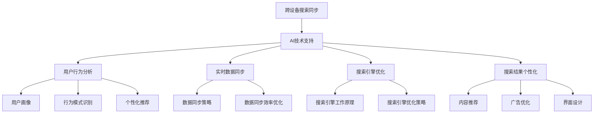

                 

### 跨设备搜索同步概述

#### 1.1 跨设备搜索同步的概念

跨设备搜索同步是指在多设备环境中，用户能够在不同的设备上无缝地访问和共享搜索数据，确保用户在不同设备上获得一致的搜索体验。这一概念在现代数字化生活中变得尤为重要，因为用户经常在手机、平板电脑、笔记本电脑等不同设备之间切换，期望能够在任意设备上快速找到所需信息。

#### 1.2 AI与跨设备搜索同步的重要性

AI技术在跨设备搜索同步中扮演着关键角色。首先，AI能够通过用户行为分析，了解用户在不同设备上的搜索习惯，从而提供个性化的搜索结果。其次，AI技术可以实现实时数据同步，确保用户在多个设备上访问到的信息是最新和最相关的。最后，AI还可以通过优化搜索引擎，提高搜索效率和准确性，使用户能够在短时间内找到所需信息。

### 1.3 跨设备搜索同步的关键技术

跨设备搜索同步的实现依赖于以下几个关键技术：

#### 1.3.1 用户行为分析

用户行为分析是跨设备搜索同步的基础。通过收集和分析用户在不同设备上的搜索历史、浏览行为和交互数据，可以构建用户的个性化搜索模型，从而提供更加精准的搜索结果。

##### 1.3.1.1 用户行为数据收集

用户行为数据的收集可以通过以下几种方式实现：

- **设备日志**：记录用户在不同设备上的操作日志，如搜索关键词、浏览时间、点击行为等。
- **设备传感器**：利用设备内置的传感器（如GPS、加速度计等）收集用户位置和行为数据。
- **用户反馈**：通过用户反馈机制（如满意度调查、评论等）收集用户对搜索结果的反馈。

##### 1.3.1.2 用户行为数据分析

用户行为数据分析包括以下几个方面：

- **用户画像**：基于用户行为数据，构建用户的综合画像，包括兴趣偏好、行为习惯等。
- **行为模式识别**：通过分析用户行为数据，识别用户在不同场景下的行为模式，如工作、娱乐、学习等。
- **个性化推荐**：根据用户画像和行为模式，为用户提供个性化的搜索推荐结果。

#### 1.3.2 实时数据同步

实时数据同步是确保用户在不同设备上获得一致搜索体验的关键。实时数据同步包括以下几个方面：

##### 1.3.2.1 数据同步策略

数据同步策略包括：

- **增量同步**：仅同步用户行为数据的增量部分，减少数据传输量和同步时间。
- **全量同步**：在特定条件下（如设备切换频繁时），同步用户行为数据的全量。
- **分布式同步**：利用分布式系统架构，实现多设备间的数据同步，提高同步效率和可靠性。

##### 1.3.2.2 数据同步效率优化

数据同步效率优化包括以下几个方面：

- **数据压缩**：采用数据压缩算法，减少数据传输量。
- **缓存机制**：利用缓存机制，减少对后端数据服务的请求次数。
- **网络优化**：优化网络传输路径，减少网络延迟。

#### 1.3.3 搜索引擎优化

搜索引擎优化是提高跨设备搜索同步性能的关键。搜索引擎优化包括以下几个方面：

##### 1.3.3.1 搜索引擎的工作原理

搜索引擎的工作原理主要包括：

- **索引构建**：构建索引以加快搜索速度。
- **搜索算法**：使用搜索算法（如向量空间模型、页Rank等）匹配用户查询与索引中的数据。
- **结果排序**：根据相关性和质量对搜索结果进行排序。

##### 1.3.3.2 搜索引擎优化策略

搜索引擎优化策略包括：

- **关键词优化**：优化关键词的选取，提高搜索结果的准确性。
- **内容优化**：优化网站内容，提高页面的搜索友好性。
- **用户反馈**：根据用户反馈调整搜索算法和结果排序策略。

#### 1.3.4 搜索结果个性化

搜索结果个性化是提升用户体验的重要手段。搜索结果个性化包括以下几个方面：

- **内容推荐**：根据用户兴趣和行为，推荐相关内容。
- **广告优化**：根据用户画像和行为，展示个性化广告。
- **界面设计**：根据用户习惯和偏好，设计个性化的用户界面。

#### 1.3.5 AI在跨设备搜索同步中的应用

AI技术在跨设备搜索同步中的应用体现在以下几个方面：

- **自然语言处理（NLP）**：利用NLP技术，理解用户查询语义，提高搜索准确性。
- **推荐系统**：利用推荐系统，为用户提供个性化的搜索推荐。
- **图像识别**：利用图像识别技术，实现视觉搜索功能。
- **语音识别**：利用语音识别技术，实现语音搜索功能。

### 1.4 跨设备搜索同步的挑战与未来趋势

跨设备搜索同步面临着数据隐私保护、实时性能优化、跨设备一致性保障等挑战。未来，跨设备搜索同步将朝着智能化、多模态、云端智能搜索等方向发展。

- **数据隐私保护**：随着用户隐私意识的提高，如何保护用户数据隐私成为重要挑战。
- **实时性能优化**：在多设备环境中，如何保证数据同步和搜索的实时性成为关键问题。
- **跨设备一致性保障**：如何确保在不同设备上获得一致的搜索体验是未来研究的重要方向。

### 1.5 总结

跨设备搜索同步是现代数字化生活中不可或缺的一部分，它依赖于AI技术的支持，通过用户行为分析、实时数据同步、搜索引擎优化和搜索结果个性化等技术手段，实现多设备间的无缝搜索体验。未来，随着AI技术的发展，跨设备搜索同步将变得更加智能和高效。



```latex
$$
\text{搜索结果相关性} = \frac{\text{关键词匹配度} \times \text{页面质量}}{\text{页面权重} + \text{查询次数}}
$$
```

#### 1.6 文章关键词

- 跨设备搜索同步
- AI技术
- 用户行为分析
- 实时数据同步
- 搜索引擎优化
- 搜索结果个性化

#### 1.7 文章摘要

本文介绍了跨设备搜索同步的概念、重要性、关键技术以及AI在其中的应用。文章首先阐述了跨设备搜索同步的定义和AI技术对其的重要性，然后详细分析了用户行为分析、实时数据同步、搜索引擎优化和搜索结果个性化等关键技术。最后，文章探讨了跨设备搜索同步面临的挑战和未来趋势，并总结全文内容。

---

**作者：AI天才研究院/AI Genius Institute & 禅与计算机程序设计艺术 /Zen And The Art of Computer Programming** <br>

