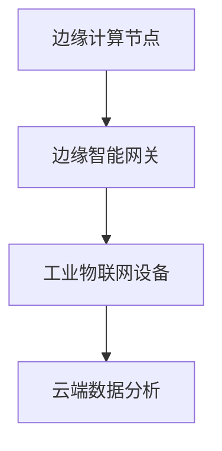
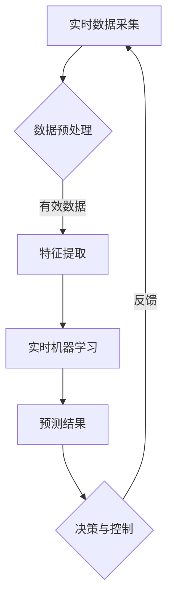

                 

# 边缘智能在工业物联网实时分析中的应用

## 关键词
边缘智能，工业物联网，实时分析，数据处理，机器学习，安全与隐私

## 摘要
边缘智能作为新一代计算模式，正在深刻改变工业物联网（IIoT）的实时分析能力。本文详细探讨了边缘智能在工业物联网实时分析中的应用，包括其定义与优势、架构与组件、核心技术和挑战与未来展望。通过深入分析边缘智能在设备状态监测、预测性维护和质量管理中的应用，本文展示了边缘智能如何提高工业物联网的数据处理效率和系统可靠性。文章还通过项目实战案例，提供了代码和数学模型的具体实现与解读，以帮助读者更好地理解边缘智能在实际工业应用中的技术实现过程。

## 《边缘智能在工业物联网实时分析中的应用》目录大纲

### 第一部分：边缘智能概述

#### 第1章：边缘智能的定义与优势

##### 1.1 边缘智能的概念与重要性
##### 1.2 边缘智能与云计算的比较
##### 1.3 边缘智能在工业物联网中的角色

#### 第2章：边缘智能的架构与组件

##### 2.1 边缘智能的架构设计
##### 2.2 边缘计算节点
##### 2.3 边缘智能网关

#### 第3章：边缘智能的核心技术

##### 3.1 边缘计算技术
##### 3.2 边缘数据库技术
##### 3.3 边缘安全与隐私保护

### 第二部分：工业物联网实时分析

#### 第4章：工业物联网概述

##### 4.1 工业物联网的定义与架构
##### 4.2 工业物联网的数据采集与传输
##### 4.3 工业物联网的数据处理与分析需求

#### 第5章：边缘智能在工业物联网中的应用场景

##### 5.1 设备状态监测
##### 5.2 预测性维护
##### 5.3 质量控制

#### 第6章：边缘智能在实时数据分析中的关键算法

##### 6.1 实时数据处理技术
##### 6.2 实时特征提取与转换
##### 6.3 实时机器学习算法

#### 第7章：工业物联网实时分析的项目实战

##### 7.1 项目背景与需求分析
##### 7.2 系统设计与实现
##### 7.3 项目评估与优化

### 第三部分：边缘智能在工业物联网实时分析中的挑战与未来

#### 第8章：边缘智能在工业物联网实时分析中的挑战

##### 8.1 硬件资源限制
##### 8.2 数据隐私与安全性
##### 8.3 边缘计算资源的调度与优化

#### 第9章：边缘智能的发展趋势与未来展望

##### 9.1 边缘计算硬件的发展
##### 9.2 边缘智能算法的演进
##### 9.3 边缘智能在工业物联网中的应用前景

### 附录

#### 附录A：边缘智能开发工具与资源

##### A.1 主流边缘计算平台
##### A.2 边缘数据库资源
##### A.3 边缘智能开发框架

#### 附录B：工业物联网实时分析案例

##### B.1 设备状态监测案例
##### B.2 预测性维护案例
##### B.3 质量控制案例

### 附加内容：边缘智能与工业物联网实时分析的 Mermaid 流程图

#### 边缘智能架构设计


#### 边缘智能实时数据分析流程


### 附加内容：边缘智能实时数据分析伪代码
```python
# 边缘智能实时数据分析伪代码

# 数据预处理
def preprocess_data(data):
    # 数据清洗、归一化等
    processed_data = ...
    return processed_data

# 特征提取
def extract_features(data):
    # 提取关键特征
    features = ...
    return features

# 实时机器学习
def real_time_learning(features):
    # 使用训练好的模型进行实时预测
    predictions = model.predict(features)
    return predictions

# 主程序
def main():
    while True:
        data = get_real_time_data()
        processed_data = preprocess_data(data)
        features = extract_features(processed_data)
        predictions = real_time_learning(features)
        apply_decision(predictions)
```

### 附加内容：边缘智能实时数据分析数学公式
#### 数据预处理
$$
\text{Preprocessed Data} = \frac{\text{Original Data} - \text{Mean}}{\text{Standard Deviation}}
$$

#### 特征提取
$$
\text{Feature Vector} = \left[ \begin{matrix}
f_1 \\
f_2 \\
\vdots \\
f_n
\end{matrix} \right]
$$

#### 实时预测
$$
\text{Prediction} = \text{Model}(\text{Feature Vector})
$$

### 附加内容：边缘智能实时数据分析案例代码解读
```python
# 代码解读：实时数据处理流程

# 数据采集模块
def data_collection():
    # 模拟从传感器采集实时数据
    data = ... # 假设已从传感器接收数据
    return data

# 数据预处理模块
def preprocess_data(data):
    # 清洗数据，例如去除噪声、空值填充等
    processed_data = clean_data(data)
    return processed_data

# 特征提取模块
def extract_features(data):
    # 根据业务需求提取特征
    features = extract(data)
    return features

# 实时机器学习预测模块
def predict(features):
    # 使用训练好的模型进行预测
    predictions = model.predict(features)
    return predictions

# 主函数
def main():
    while True:
        raw_data = data_collection()
        processed_data = preprocess_data(raw_data)
        features = extract_features(processed_data)
        predictions = predict(features)
        # 根据预测结果进行决策
        apply_decision(predictions)
```

### 前言
边缘智能是近年来信息技术领域的重要发展趋势之一，其核心思想是将计算、存储和网络功能从传统的集中式数据中心转移到网络的边缘——即靠近数据源或用户的地方。这种模式的转变，不仅能够显著减少数据传输的延迟，还能降低带宽占用，提高数据处理的速度和效率，尤其适合需要实时响应和高可靠性的工业物联网（IIoT）应用场景。

工业物联网作为物联网技术的重要组成部分，已广泛应用于制造、能源、交通等多个领域。工业物联网通过连接各类传感器、设备和系统，实现设备状态的实时监测、数据采集和远程控制，从而优化生产流程、提升设备运行效率和产品质量。然而，随着工业物联网系统中设备数量的增加和数据规模的扩大，传统的中心化数据处理模式已无法满足实时性和效率的需求。

边缘智能的引入，为工业物联网的实时分析提供了新的解决方案。通过在边缘节点上进行部分数据处理，边缘智能可以有效减轻云端的数据负担，提高系统的响应速度和可靠性。同时，边缘智能还能够处理部分隐私敏感的数据，保护数据的安全性和用户隐私。

本文将从以下几个方面对边缘智能在工业物联网实时分析中的应用进行深入探讨：

1. **边缘智能概述**：介绍边缘智能的定义与优势，比较边缘智能与云计算的差异，并探讨边缘智能在工业物联网中的角色和架构。

2. **工业物联网实时分析**：阐述工业物联网的定义与架构，分析其数据采集与传输过程，以及实时数据分析的需求和挑战。

3. **边缘智能在实时分析中的应用场景**：具体探讨边缘智能在设备状态监测、预测性维护和质量管理等工业物联网应用场景中的技术实现。

4. **实时数据分析的关键算法**：介绍实时数据处理技术、特征提取与转换以及实时机器学习算法在边缘智能中的应用。

5. **项目实战**：通过实际项目案例，展示边缘智能在工业物联网实时分析中的具体实现过程，并提供代码和数学模型解读。

6. **挑战与未来展望**：分析边缘智能在工业物联网实时分析中面临的挑战，以及其发展趋势和未来应用前景。

### 第一部分：边缘智能概述

#### 第1章：边缘智能的定义与优势

##### 1.1 边缘智能的概念与重要性

边缘智能（Edge Intelligence）是一种分布式计算模式，其核心思想是将计算、存储和网络功能从传统的集中式数据中心（如云数据中心）转移到网络的边缘——即在靠近数据源或用户的地方进行数据处理。边缘智能通过在边缘节点（如智能设备、网关、基站等）上部署智能算法和模型，实现对数据的实时处理和分析，从而提高系统的响应速度、降低延迟、减少带宽占用，并增强数据的安全性和隐私保护。

边缘智能的重要性主要体现在以下几个方面：

1. **实时响应**：边缘智能能够实现数据的实时处理和分析，满足工业物联网等应用场景对实时性的需求。例如，在工业制造过程中，实时监测设备状态和异常报警可以快速响应生产故障，减少停机时间和生产损失。

2. **降低延迟**：由于数据处理在边缘节点进行，数据传输的距离大大缩短，从而降低了网络延迟。这对于要求高实时性的应用，如自动驾驶、远程手术等，具有重要意义。

3. **减少带宽占用**：边缘智能可以处理部分数据，减少需要传输到中心的数据量，从而降低带宽占用。这对于数据量庞大、传输成本较高的工业物联网系统尤其重要。

4. **增强安全性**：边缘智能在边缘节点处理数据，可以减少数据传输过程中的安全风险。此外，通过本地加密和隐私保护技术，边缘智能还可以增强数据的安全性和隐私保护。

##### 1.2 边缘智能与云计算的比较

边缘智能与云计算是两种不同的计算模式，各有其优势和适用场景。下面从几个方面进行比较：

1. **计算位置**：云计算主要在数据中心或云端进行数据处理，而边缘智能则将计算任务分散到网络的边缘节点，如智能设备、网关等。

2. **响应速度**：边缘智能由于数据处理在靠近数据源的地方进行，响应速度更快，适合实时性要求高的应用。云计算由于数据处理在远程数据中心，响应速度相对较慢。

3. **数据传输**：边缘智能可以处理部分数据，减少数据传输量，降低带宽占用。云计算需要传输大量数据到中心进行处理，带宽占用较高。

4. **计算资源**：边缘智能利用边缘节点的计算资源，可以减少对中心计算资源的依赖。云计算则主要依赖中心数据中心的强大计算能力。

5. **安全性**：边缘智能在边缘节点处理数据，可以减少数据传输过程中的安全风险。云计算由于数据传输距离远，存在一定的安全风险。

##### 1.3 边缘智能在工业物联网中的角色

边缘智能在工业物联网中扮演着至关重要的角色，主要体现在以下几个方面：

1. **实时数据采集和处理**：工业物联网中大量传感器和设备不断产生数据，边缘智能可以在边缘节点对这些数据进行实时采集和处理，提取有用的特征信息。

2. **决策与控制**：边缘智能可以基于实时数据处理结果，快速做出决策并执行控制操作，如调整设备参数、触发报警等。

3. **数据聚合与传输**：边缘智能可以处理部分数据，减少需要传输到中心的数据量，降低带宽占用，同时将处理后的数据传输到中心进行进一步分析和存储。

4. **设备状态监测与预测性维护**：边缘智能可以利用实时数据分析技术，对设备状态进行监测和预测性维护，提前发现潜在故障，减少设备停机和维修成本。

5. **质量控制和生产优化**：边缘智能可以对生产过程中的数据进行分析，实时监控产品质量，提供优化建议，提高生产效率和产品质量。

总之，边缘智能为工业物联网实时分析提供了强大的支持，不仅提高了数据处理效率和系统可靠性，还增强了数据的安全性和隐私保护，推动了工业物联网的智能化发展。

#### 第2章：边缘智能的架构与组件

##### 2.1 边缘智能的架构设计

边缘智能的架构设计旨在实现数据的分布式处理、存储和管理，以支持工业物联网的实时分析和决策。典型的边缘智能架构包括以下几个关键组件：

1. **边缘计算节点**：边缘计算节点是边缘智能架构中的基本单元，通常包括智能设备、网关和边缘服务器等。这些节点负责数据的采集、处理和初步分析，同时执行本地决策和控制操作。

2. **边缘智能网关**：边缘智能网关是连接边缘计算节点和云端数据中心的关键枢纽。它负责数据的聚合、传输和初步处理，同时还承担着边缘计算任务调度和资源管理的重要职责。

3. **云端数据中心**：云端数据中心是边缘智能架构的核心，负责存储、分析和处理来自边缘节点的海量数据，并提供高级的数据分析和业务逻辑支持。

4. **边缘数据库**：边缘数据库用于存储边缘节点和网关处理后的数据，支持数据的快速读取和写入操作，为实时分析和决策提供数据支持。

5. **边缘智能平台**：边缘智能平台是边缘智能架构的大脑，负责整个边缘计算系统的资源调度、任务管理和性能优化。它通常包括边缘计算引擎、数据管理模块和智能算法库等。

边缘智能架构设计的关键原则包括：

1. **分布式处理**：将计算任务分布在边缘节点上，充分利用边缘节点的计算资源，降低数据传输延迟和带宽占用。

2. **数据分层处理**：根据数据的处理需求和重要性，将数据分层处理，在边缘节点上进行初步处理，将关键数据传输到云端进行进一步分析。

3. **智能决策**：利用边缘节点和网关上的智能算法，实现数据的实时处理和本地决策，提高系统的响应速度和可靠性。

4. **资源优化**：通过智能调度和优化，充分利用边缘节点的计算、存储和网络资源，提高系统的性能和资源利用率。

##### 2.2 边缘计算节点

边缘计算节点是边缘智能架构的基础，承担着数据的采集、处理和初步分析任务。边缘计算节点的类型包括：

1. **智能设备**：智能设备是边缘计算节点的重要组成部分，如传感器、执行器和智能终端等。它们通过采集环境数据，将数据发送到边缘网关或服务器进行进一步处理。

2. **边缘服务器**：边缘服务器是具备一定计算能力和存储能力的设备，通常用于处理边缘节点的数据，执行复杂的计算任务和本地决策操作。

3. **边缘网关**：边缘网关是连接边缘计算节点和云端数据中心的桥梁，负责数据的传输、初步处理和任务调度。边缘网关通常具有高性能的网络接口、计算单元和存储单元，能够处理大量并发数据流。

边缘计算节点的主要功能包括：

1. **数据采集**：通过传感器和接口采集环境数据，如温度、湿度、压力、流量等。

2. **数据处理**：对采集到的数据进行初步处理，如数据清洗、滤波、压缩等。

3. **本地决策**：利用边缘节点的计算能力，执行简单的决策操作，如设备控制、报警触发等。

4. **数据传输**：将处理后的数据传输到边缘网关或云端数据中心，进行进一步分析和处理。

##### 2.3 边缘智能网关

边缘智能网关是边缘智能架构的核心组件之一，负责连接边缘计算节点和云端数据中心，实现数据的传输、聚合和处理。边缘智能网关的主要功能包括：

1. **数据传输**：边缘智能网关负责将边缘节点的数据传输到云端数据中心，同时将云端的数据传输到边缘节点。

2. **数据处理**：边缘智能网关可以对传输过来的数据进行初步处理，如数据清洗、去重、聚合等，提高数据的质量和一致性。

3. **任务调度**：边缘智能网关可以根据边缘节点的计算资源和任务需求，进行任务调度和资源分配，确保边缘节点的计算任务高效执行。

4. **智能决策**：边缘智能网关可以利用边缘节点和云端的数据，执行复杂的决策算法，为边缘节点提供智能化的决策支持。

5. **安全性管理**：边缘智能网关负责边缘节点的安全管理和防护，如数据加密、访问控制、防火墙等，确保数据的安全性和隐私保护。

边缘智能网关的选择标准包括：

1. **计算能力**：边缘智能网关需要具备足够的计算能力，能够处理大量的并发数据流和复杂的计算任务。

2. **网络性能**：边缘智能网关需要具备高性能的网络接口，支持高速的数据传输和低延迟的网络通信。

3. **存储容量**：边缘智能网关需要具备足够的存储容量，能够存储大量的临时数据和日志信息。

4. **兼容性**：边缘智能网关需要具备良好的兼容性，能够支持多种边缘计算平台和协议，方便集成和扩展。

5. **可扩展性**：边缘智能网关需要具备良好的可扩展性，能够根据业务需求进行硬件升级和软件更新，确保系统的长期稳定运行。

通过合理的边缘智能架构设计和选择合适的边缘计算节点与网关，可以实现高效、可靠的边缘智能系统，为工业物联网的实时分析提供强大的支持。

#### 第3章：边缘智能的核心技术

##### 3.1 边缘计算技术

边缘计算技术是边缘智能的核心组成部分，其主要目标是降低数据传输延迟，提高数据处理速度，优化资源利用，增强系统可靠性。边缘计算技术通过在网络的边缘节点上部署计算资源，实现对数据的本地处理和分析，从而满足工业物联网等应用场景对实时性和高效性的需求。

边缘计算技术的关键组成部分包括：

1. **分布式计算架构**：分布式计算架构是边缘计算技术的核心，通过在多个边缘节点上部署计算资源，实现数据的分布式处理。分布式计算架构包括边缘计算节点、边缘网关和云端数据中心，它们之间通过通信协议和数据传输机制进行协作。

2. **边缘计算引擎**：边缘计算引擎是边缘计算的核心组件，负责数据的采集、处理和决策。边缘计算引擎通常包括数据处理模块、机器学习模块和决策支持模块，能够实现实时数据的分析和处理。

3. **边缘数据库**：边缘数据库用于存储边缘节点处理后的数据，支持数据的快速读取和写入操作。边缘数据库通常采用分布式存储架构，能够满足大规模数据存储和高效查询的需求。

4. **边缘智能平台**：边缘智能平台是边缘计算的大脑，负责整个边缘计算系统的资源调度、任务管理和性能优化。边缘智能平台包括边缘计算引擎、数据管理模块和智能算法库等，能够提供全面的支持和优化。

边缘计算技术的主要特点包括：

1. **分布式处理**：边缘计算技术通过在多个边缘节点上分布式处理数据，降低了数据传输延迟，提高了系统的响应速度和效率。

2. **本地决策**：边缘计算技术支持在边缘节点上本地决策，减少了数据传输到中心的时间，提高了系统的实时性和可靠性。

3. **高效资源利用**：边缘计算技术通过在边缘节点上利用本地计算资源，减少了中心计算资源的依赖，提高了系统的资源利用效率。

4. **灵活扩展**：边缘计算技术支持根据业务需求进行边缘节点的扩展和升级，能够灵活应对不断变化的数据处理需求。

边缘计算技术在工业物联网中的应用包括：

1. **实时数据处理**：边缘计算技术能够实时处理工业物联网中的大量数据，实现对设备状态、生产过程的实时监控和异常报警。

2. **预测性维护**：边缘计算技术可以通过对设备运行数据的实时分析，预测设备故障和性能下降，实现预测性维护，减少设备停机和维修成本。

3. **质量控制**：边缘计算技术可以对生产过程中的数据进行分析，实时监控产品质量，提供优化建议，提高生产效率和产品质量。

4. **智能决策**：边缘计算技术可以通过对边缘数据的分析和处理，为工业物联网提供智能化的决策支持，优化生产流程和管理策略。

##### 3.2 边缘数据库技术

边缘数据库技术是边缘智能的重要组成部分，其主要目标是提供高效、可靠的数据存储和管理，满足工业物联网等应用场景对实时性和大数据处理的需求。边缘数据库技术通常包括分布式数据库、NoSQL数据库和时序数据库等。

边缘数据库技术的关键组成部分包括：

1. **分布式数据库**：分布式数据库通过将数据分布在多个节点上，实现数据的分布式存储和管理。分布式数据库通常具有高可用性、高扩展性和高性能的特点，能够满足大规模数据存储和高效查询的需求。

2. **NoSQL数据库**：NoSQL数据库是一种非关系型数据库，适用于存储大规模的非结构化数据。NoSQL数据库具有灵活的查询机制、良好的扩展性和高性能的特点，适用于工业物联网等应用场景。

3. **时序数据库**：时序数据库是一种专门用于存储时间序列数据的数据库，适用于存储和处理工业物联网中的传感器数据、设备日志等时间序列数据。时序数据库通常具有高效的时间序列查询和分析能力，能够满足实时数据处理和分析的需求。

边缘数据库技术的主要特点包括：

1. **分布式存储**：边缘数据库技术通过分布式存储，提高了数据存储的可靠性和扩展性，能够满足大规模数据存储的需求。

2. **实时查询**：边缘数据库技术支持实时查询和分析，能够快速响应工业物联网中的数据处理需求。

3. **高效写入**：边缘数据库技术具有高效的数据写入能力，能够快速处理大量数据的写入操作。

4. **数据一致性和容错性**：边缘数据库技术通过分布式存储和复制机制，确保数据的一致性和容错性，提高了系统的可靠性和稳定性。

边缘数据库技术在工业物联网中的应用包括：

1. **设备状态监测**：边缘数据库技术可以存储和管理工业物联网中的设备状态数据，实现对设备状态的实时监控和报警。

2. **生产过程监控**：边缘数据库技术可以存储和管理工业物联网中的生产过程数据，实现对生产过程的实时监控和异常报警。

3. **预测性维护**：边缘数据库技术可以存储和管理设备运行数据，通过数据分析和预测模型，实现对设备故障的预测性维护。

4. **质量控制**：边缘数据库技术可以存储和管理生产过程中的质量数据，实现对产品质量的实时监控和优化。

##### 3.3 边缘安全与隐私保护

边缘安全与隐私保护是边缘智能系统中不可或缺的重要环节，其主要目标是确保边缘节点和云端数据的安全性、完整性和隐私性。随着边缘智能在工业物联网等领域的广泛应用，数据的安全性和隐私保护变得越来越重要。

边缘安全与隐私保护的关键技术包括：

1. **数据加密**：数据加密是保护数据安全的重要手段，通过对数据进行加密处理，确保数据在传输和存储过程中的安全性。常用的加密算法包括对称加密和非对称加密等。

2. **访问控制**：访问控制是通过身份验证和权限管理，限制用户对数据的访问权限，防止未授权的访问和操作。常见的访问控制机制包括基于角色的访问控制（RBAC）和基于属性的访问控制（ABAC）等。

3. **安全审计**：安全审计是对边缘智能系统的操作行为进行监控和记录，以便在发生安全事件时进行追踪和调查。安全审计包括日志记录、事件告警和异常检测等。

4. **网络安全**：网络安全是保护边缘智能系统免受网络攻击和恶意行为的重要措施，包括防火墙、入侵检测系统和安全协议等。

边缘安全与隐私保护的主要措施包括：

1. **数据加密传输**：在数据传输过程中，使用安全的加密协议（如SSL/TLS）对数据进行加密传输，确保数据在传输过程中的安全性。

2. **多因素认证**：在用户访问边缘节点时，采用多因素认证（如密码、指纹、短信验证码等），提高用户身份验证的可靠性。

3. **权限管理**：对用户权限进行严格管理，确保用户只能访问其有权访问的数据和功能。

4. **安全审计与监控**：对边缘智能系统的操作行为进行实时监控和记录，及时发现和处理安全事件。

5. **安全防护策略**：制定并实施一系列安全防护策略，包括防火墙、入侵检测、安全漏洞修复等，提高系统的整体安全性。

通过有效的边缘安全与隐私保护措施，可以确保边缘智能系统在工业物联网等领域的安全稳定运行，保护数据的安全性和用户的隐私。

### 第二部分：工业物联网实时分析

#### 第4章：工业物联网概述

##### 4.1 工业物联网的定义与架构

工业物联网（Industrial Internet of Things，简称IIoT）是一种将物理设备、传感器、控制系统和信息系统通过互联网连接起来，实现数据采集、传输、处理和分析的智能化系统。工业物联网的核心目标是提高生产效率、优化资源利用、降低成本，并提升设备运行和维护的智能化水平。

**工业物联网的定义**：

工业物联网是由物理设备、传感器、控制系统、信息系统和互联网等组成的一个复杂网络系统。通过将各类设备连接到互联网，实现设备之间的互联互通，收集、传输和处理设备运行数据，进而实现设备的智能监控、预测性维护、优化生产过程和提升生产效率。

**工业物联网的架构**：

工业物联网的架构可以分为以下几个层级：

1. **设备层**：设备层是工业物联网的基础，包括各种传感器、执行器和智能设备。这些设备通过采集环境数据（如温度、湿度、压力、速度等），实现物理世界到数字世界的转换。

2. **网络层**：网络层负责实现设备之间的互联互通，包括有线网络和无线网络。常见的网络协议包括Wi-Fi、蓝牙、ZigBee、LoRa等。网络层确保数据能够在设备之间高效传输。

3. **平台层**：平台层是工业物联网的核心，负责数据的采集、传输、存储和处理。平台层通常包括数据采集模块、数据处理模块、存储模块和分析模块等。平台层通过边缘计算技术，实现对数据的实时处理和分析，为上层应用提供数据支持。

4. **应用层**：应用层是工业物联网的最终用户界面，包括设备监控、生产调度、设备维护、质量管理等应用。应用层利用平台层提供的数据和算法，实现对设备的智能监控和优化生产流程。

**工业物联网的关键组件**：

1. **传感器**：传感器是工业物联网的数据来源，用于采集环境数据。常见的传感器包括温度传感器、湿度传感器、压力传感器、位移传感器等。

2. **执行器**：执行器是工业物联网的控制单元，用于根据控制指令执行相应的动作。常见的执行器包括电动机、阀门、气压缸等。

3. **智能设备**：智能设备是工业物联网的核心组件，具有数据处理和决策能力。智能设备可以通过边缘计算技术，对采集到的数据进行分析和处理，实现设备的智能监控和预测性维护。

4. **边缘计算平台**：边缘计算平台是工业物联网的数据处理中心，负责数据的采集、传输、存储和处理。边缘计算平台通常包括边缘服务器、边缘网关和边缘数据库等。

5. **云计算平台**：云计算平台是工业物联网的数据存储和分析中心，负责对来自边缘计算平台的数据进行进一步分析和处理，提供高级的数据分析和业务逻辑支持。

##### 4.2 工业物联网的数据采集与传输

数据采集与传输是工业物联网的核心环节，直接影响系统的实时性和数据处理效率。工业物联网的数据采集与传输包括以下几个关键步骤：

1. **数据采集**：数据采集是工业物联网的起点，通过传感器和智能设备采集环境数据。传感器将物理信号（如温度、湿度、压力等）转换为数字信号，智能设备通过内置的处理器和算法对数据进行初步处理。

2. **数据传输**：采集到的数据需要传输到平台层进行处理。数据传输可以通过有线网络（如以太网、光纤等）和无线网络（如Wi-Fi、蓝牙、LoRa等）进行。为了提高数据传输的可靠性和效率，通常采用分层次、分阶段的数据传输策略。

3. **数据预处理**：在数据传输过程中，对数据进行预处理，包括数据清洗、去噪、去重复、归一化等操作，确保数据的质量和一致性。数据预处理通常在边缘计算平台上进行，减轻中心数据平台的负担。

4. **数据存储**：预处理后的数据需要存储在边缘数据库或云端数据库中，以便后续的数据分析和处理。数据存储通常采用分布式存储架构，提高数据存储的可靠性和扩展性。

5. **数据传输协议**：数据传输协议是数据在网络上传输的规范和标准。常用的数据传输协议包括HTTP、MQTT、CoAP等。其中，MQTT（消息队列遥测传输）是一种轻量级的传输协议，适用于工业物联网中的低带宽、高延迟场景。

##### 4.3 工业物联网的数据处理与分析需求

工业物联网的数据处理与分析需求主要体现在以下几个方面：

1. **实时性**：工业物联网的数据处理需要具备实时性，能够快速响应生产过程的变化和异常情况。例如，设备状态监测需要实时采集和处理数据，及时发现设备故障和性能下降。

2. **大数据量**：工业物联网产生的数据量巨大，包括传感器数据、设备日志、控制指令等。数据处理系统需要能够高效地处理和分析海量数据，提供实时、准确的分析结果。

3. **多维度分析**：工业物联网的数据不仅包括传感器数据，还包括设备运行状态、生产过程、设备维护等信息。数据处理系统需要能够从多个维度对数据进行分析，提取有价值的信息和规律。

4. **智能决策**：工业物联网的数据处理与分析需要具备智能决策能力，能够基于实时数据分析和预测模型，为生产过程、设备维护和质量管理提供决策支持。

5. **安全与隐私保护**：工业物联网涉及大量敏感数据，包括设备运行状态、生产计划、质量控制等信息。数据处理与分析系统需要具备数据安全与隐私保护能力，防止数据泄露和未授权访问。

为了满足上述需求，工业物联网数据处理与分析系统通常采用边缘计算技术，将部分数据处理和分析任务在边缘节点上进行，减少数据传输延迟和带宽占用。同时，采用分布式数据处理框架和大数据分析技术，提高数据处理效率和性能。通过引入实时机器学习算法和预测模型，实现智能决策和优化。

#### 第5章：边缘智能在工业物联网中的应用场景

边缘智能在工业物联网中的应用场景丰富多样，其主要优势在于实时性、数据安全和资源优化。以下将详细介绍边缘智能在设备状态监测、预测性维护和质量管理等应用场景中的技术实现。

##### 5.1 设备状态监测

设备状态监测是工业物联网中的一项基础应用，旨在实时监测设备的运行状态，及时发现异常情况并采取相应措施。边缘智能在设备状态监测中的应用主要包括以下几个方面：

1. **数据采集**：在设备状态监测中，各类传感器（如温度传感器、振动传感器、压力传感器等）负责采集设备的实时运行数据。这些数据通过边缘计算节点进行处理和初步分析。

2. **边缘数据处理**：边缘计算节点对采集到的数据进行实时处理，包括数据清洗、滤波、去噪等。通过边缘数据处理，可以有效减少数据传输量，降低带宽占用。

3. **实时分析**：边缘计算节点利用内置的机器学习模型，对处理后的数据进行实时分析。常见的分析算法包括统计分析、时序分析和异常检测等。

4. **本地决策**：基于实时分析结果，边缘计算节点可以做出本地决策，如启动报警系统、调整设备参数或触发故障处理程序。

5. **数据传输**：边缘计算节点将处理后的数据传输到云端数据中心，进行进一步分析和存储。同时，边缘计算节点也可以根据需要，将部分关键数据直接上传到云端。

6. **远程监控**：云端数据中心通过边缘智能平台对设备状态进行远程监控和可视化展示。通过实时数据分析和历史数据回溯，可以实现对设备状态的全面了解和预测。

**示例**：在一个制造工厂中，边缘智能用于监测生产线的设备状态。通过部署边缘计算节点和传感器，实时采集设备温度、振动和压力等数据。边缘计算节点对数据进行初步处理和分析，发现设备异常情况时立即触发报警，并将处理结果上传到云端数据中心。云端数据中心利用大数据分析和机器学习算法，对设备运行状态进行深度分析，提供预测性维护建议，优化生产过程。

##### 5.2 预测性维护

预测性维护是一种基于设备运行数据，通过分析设备状态和趋势，预测设备故障并提前进行维护的技术。边缘智能在预测性维护中的应用，可以显著提高设备运行效率，减少设备停机和维修成本。

1. **数据采集**：预测性维护需要采集设备运行过程中的各种数据，包括温度、振动、压力、电流、电压等。这些数据通过传感器和边缘计算节点进行实时采集。

2. **边缘数据处理**：边缘计算节点对采集到的数据进行预处理，包括数据清洗、去噪、去重复等。通过边缘数据处理，可以提高数据质量，减少数据传输量。

3. **特征提取**：对预处理后的数据，利用特征提取技术提取关键特征。特征提取可以基于统计方法、时序分析和机器学习算法。关键特征包括设备运行状态、异常指标、趋势等。

4. **模型训练**：利用历史数据和特征提取结果，训练预测模型。常见的预测模型包括回归模型、时间序列模型和机器学习模型（如决策树、支持向量机、神经网络等）。

5. **实时预测**：边缘计算节点利用训练好的预测模型，对实时采集的数据进行预测。通过实时预测，可以提前发现设备故障和性能下降，为维护提供依据。

6. **决策与控制**：根据预测结果，边缘计算节点可以做出本地决策，如调整设备参数、触发报警或启动维护程序。同时，将预测结果上传到云端数据中心，进行进一步分析和处理。

7. **维护执行**：根据预测结果和决策指令，执行相应的维护操作，如更换部件、调整设备参数或进行深度维修。

**示例**：在一个大型制造工厂中，边缘智能用于预测性维护。通过部署边缘计算节点和传感器，实时采集设备温度、振动和压力等数据。边缘计算节点对数据进行预处理和特征提取，利用训练好的预测模型进行实时预测。当预测到设备故障风险时，边缘计算节点立即触发报警，并将预测结果上传到云端数据中心。云端数据中心根据预测结果，生成维护计划，通知维护团队进行维护操作，确保设备运行稳定。

##### 5.3 质量控制

质量控制是工业生产中的重要环节，通过实时监测和优化生产过程，确保产品质量。边缘智能在质量控制中的应用，可以提高生产过程的可控性，减少次品率，提高生产效率。

1. **数据采集**：在质量控制中，需要采集生产过程中的各种数据，包括温度、湿度、压力、流量、成分比例等。这些数据通过传感器和边缘计算节点进行实时采集。

2. **边缘数据处理**：边缘计算节点对采集到的数据进行预处理，包括数据清洗、滤波、去噪等。通过边缘数据处理，可以提高数据质量，减少数据传输量。

3. **实时分析**：边缘计算节点利用内置的机器学习模型，对实时采集的数据进行实时分析。常见的分析算法包括统计分析、时序分析和异常检测等。

4. **质量监控**：基于实时分析结果，边缘计算节点可以实时监控生产过程的质量。当发现质量异常时，立即触发报警，并将报警信息上传到云端数据中心。

5. **优化建议**：云端数据中心利用大数据分析和机器学习算法，对生产过程的质量进行分析和优化。通过分析历史数据和质量异常情况，生成优化建议，指导生产过程调整。

6. **决策与控制**：根据云端数据中心提供的优化建议，边缘计算节点可以做出本地决策，如调整设备参数、更改生产工艺等，确保产品质量稳定。

7. **数据存储**：处理后的数据上传到云端数据中心，进行进一步分析和存储。云端数据中心可以通过数据分析和挖掘，发现生产过程中的问题和规律，提供改进建议。

**示例**：在一个食品加工工厂中，边缘智能用于质量控制。通过部署边缘计算节点和传感器，实时采集生产过程中的温度、湿度、成分比例等数据。边缘计算节点对数据进行预处理和实时分析，发现温度异常时立即触发报警，并将报警信息上传到云端数据中心。云端数据中心根据历史数据和异常情况，生成优化建议，指导生产过程调整，确保产品质量稳定。

通过上述应用场景，可以看出边缘智能在工业物联网中具有广泛的应用前景。通过在边缘节点上实现实时数据处理和分析，边缘智能可以有效提升设备运行效率、降低维护成本和提升产品质量，为工业物联网的智能化发展提供有力支持。

#### 第6章：边缘智能在实时数据分析中的关键算法

边缘智能在实时数据分析中的应用，离不开一系列高效的关键算法。这些算法能够对实时采集到的数据进行分析和预测，提供智能化的决策支持。以下将介绍边缘智能在实时数据分析中的三个关键算法：实时数据处理技术、实时特征提取与转换以及实时机器学习算法。

##### 6.1 实时数据处理技术

实时数据处理技术是边缘智能在工业物联网中的核心组成部分，其主要目标是快速、高效地处理和分析实时数据，以满足工业物联网对实时性和响应速度的高要求。

**实时数据处理技术的主要组成部分**：

1. **流数据处理**：流数据处理技术是一种针对实时数据流的处理方法，能够在数据生成的同时进行实时处理和分析。流数据处理技术包括数据采集、数据清洗、实时计算和结果输出等环节。

2. **增量处理**：增量处理是一种针对实时数据的批量处理方法，通过对新数据与历史数据的比较，实现数据的更新和优化。增量处理能够提高数据处理效率，减少数据存储和传输的开销。

3. **并行处理**：并行处理技术通过将数据处理任务分布在多个计算节点上，实现数据的并行处理，提高数据处理速度。并行处理技术通常结合分布式计算架构，利用边缘计算节点的计算资源，实现高效的数据处理。

**实时数据处理技术的应用**：

1. **设备状态监测**：实时数据处理技术可以快速监测设备运行状态，及时识别设备异常，触发报警和故障处理程序。

2. **预测性维护**：通过实时数据处理技术，可以对设备运行数据进行分析和预测，提前发现设备故障风险，实现预测性维护。

3. **质量控制**：实时数据处理技术可以实时监测生产过程中的质量数据，发现质量异常，优化生产过程，提高产品质量。

**示例**：在一个生产线中，实时数据处理技术用于监测设备状态。通过部署边缘计算节点和传感器，实时采集设备温度、振动和压力等数据。边缘计算节点利用流数据处理技术，对实时数据进行清洗、滤波和实时计算，识别设备异常，并触发报警。

##### 6.2 实时特征提取与转换

实时特征提取与转换是边缘智能在实时数据分析中的关键步骤，其主要目标是提取数据中的关键特征，为后续的实时分析和预测提供支持。

**实时特征提取与转换的主要组成部分**：

1. **特征选择**：特征选择是一种从原始数据中提取关键特征的方法，通过去除冗余特征和噪声，提高数据的效率和精度。特征选择可以基于统计方法、信息论和机器学习等方法。

2. **特征转换**：特征转换是一种将原始数据转换为更适合分析的格式的方法，包括数据归一化、数据标准化和特征融合等。特征转换可以增强数据之间的可区分性，提高分析效果。

3. **特征评估**：特征评估是一种对提取的特征进行评估和筛选的方法，通过评估特征的重要性、影响力和有效性，选择最优特征集。

**实时特征提取与转换的应用**：

1. **设备状态监测**：通过实时特征提取与转换，可以提取设备运行状态的关键特征，如温度变化、振动频率和压力波动等，实现对设备状态的实时监控和异常检测。

2. **预测性维护**：通过实时特征提取与转换，可以提取设备运行中的关键特征，如负载变化、温度波动和振动幅度等，实现设备的故障预测和性能评估。

3. **质量控制**：通过实时特征提取与转换，可以提取生产过程中的关键特征，如成分比例、温度和湿度等，实现对产品质量的实时监控和优化。

**示例**：在一个工厂中，实时特征提取与转换用于预测性维护。通过部署边缘计算节点和传感器，实时采集设备温度、振动和电流等数据。边缘计算节点利用特征选择和转换技术，提取设备运行状态的关键特征，如温度变化率、振动频率和电流波动等，实现设备的故障预测和性能评估。

##### 6.3 实时机器学习算法

实时机器学习算法是边缘智能在实时数据分析中的核心技术之一，其主要目标是通过实时数据的分析和学习，实现对设备状态、生产过程和产品质量的实时预测和优化。

**实时机器学习算法的主要组成部分**：

1. **在线学习**：在线学习是一种针对实时数据的动态学习算法，通过不断更新模型参数，实现对实时数据的实时分析和预测。在线学习可以降低模型训练的延迟，提高实时性。

2. **增量学习**：增量学习是一种针对已有模型的动态学习算法，通过对新数据进行增量训练，实现对模型参数的微调。增量学习可以提高模型的鲁棒性和适应性。

3. **迁移学习**：迁移学习是一种基于已有模型的学习算法，通过将已有模型的知识迁移到新的数据集，实现对新数据的快速学习和预测。迁移学习可以提高模型的泛化能力和学习效率。

**实时机器学习算法的应用**：

1. **设备状态监测**：通过实时机器学习算法，可以实现对设备运行状态的实时监测和预测，发现设备故障风险，实现预测性维护。

2. **预测性维护**：通过实时机器学习算法，可以基于设备运行数据，预测设备故障时间和故障类型，提前进行维护，减少设备停机时间。

3. **质量控制**：通过实时机器学习算法，可以实时分析生产过程中的质量数据，预测产品质量趋势，优化生产过程，提高产品质量。

**示例**：在一个工厂中，实时机器学习算法用于设备状态监测。通过部署边缘计算节点和传感器，实时采集设备温度、振动和电流等数据。边缘计算节点利用在线学习和迁移学习算法，对设备运行状态进行实时监测和预测，发现设备故障风险，触发报警和故障处理程序。

综上所述，边缘智能在实时数据分析中的应用，依赖于实时数据处理技术、实时特征提取与转换和实时机器学习算法。通过这些关键算法，边缘智能能够实现对工业物联网设备状态、生产过程和产品质量的实时分析和预测，提高系统的实时性和智能化水平。

#### 第7章：工业物联网实时分析的项目实战

##### 7.1 项目背景与需求分析

随着工业物联网的不断发展，企业对设备状态监测、预测性维护和质量管理等方面的需求日益增加。为了提高生产效率、降低维护成本和确保产品质量，某大型制造企业决定开展一项工业物联网实时分析项目。该项目的主要目标是利用边缘智能技术，实现对生产设备状态的实时监测和预测性维护，同时提高生产过程的质量控制水平。

**项目背景**：

- 制造企业拥有多条生产线，涉及多种类型的设备，如机床、传送带、检测设备等。
- 设备数量庞大，设备状态数据采集困难，数据传输延迟严重。
- 传统中心化数据处理模式已无法满足实时性和高效性的需求。
- 企业希望引入边缘智能技术，提高设备状态监测和预测性维护的准确性，优化生产过程。

**需求分析**：

1. **实时数据采集**：需要实现设备状态的实时数据采集，包括温度、振动、压力、电流等参数。
2. **边缘数据处理**：在边缘节点上进行初步的数据处理，包括数据清洗、滤波、去噪等，提高数据处理效率。
3. **实时分析**：利用实时数据处理技术和机器学习算法，对设备状态进行实时分析，发现异常情况并触发报警。
4. **预测性维护**：基于实时分析结果，预测设备故障风险，提前进行维护，减少设备停机时间。
5. **质量控制**：实时分析生产过程的数据，监测产品质量，发现质量异常，提供优化建议。
6. **数据存储与查询**：将处理后的数据存储在边缘数据库和云端数据库中，方便后续的数据分析和查询。
7. **远程监控与可视化**：通过边缘智能平台，实现对设备状态和产品质量的远程监控和可视化展示。

##### 7.2 系统设计与实现

为了实现上述项目目标，需要设计一个完整的边缘智能实时分析系统。该系统包括边缘计算节点、边缘智能网关和云端数据中心，通过分布式计算架构实现数据的实时处理和分析。

**系统架构**：

1. **边缘计算节点**：部署在生产线上的边缘计算节点，包括传感器模块、边缘计算模块和数据传输模块。边缘计算节点负责实时采集设备状态数据，并进行初步处理。
2. **边缘智能网关**：作为边缘计算节点和云端数据中心之间的桥梁，边缘智能网关负责数据的传输、初步处理和任务调度。边缘智能网关通常具备高性能的计算能力和网络接口，能够处理大量并发数据流。
3. **云端数据中心**：云端数据中心负责存储、分析和处理来自边缘节点的数据，提供高级的数据分析和业务逻辑支持。云端数据中心通常包括数据存储模块、计算模块和分析模块等。

**系统实现**：

1. **边缘计算节点实现**：

   - 传感器模块：部署在各种设备上，实时采集温度、振动、压力、电流等数据。
   - 边缘计算模块：利用嵌入式处理器和边缘计算框架，对采集到的数据进行初步处理，包括数据清洗、滤波和去噪等。
   - 数据传输模块：通过无线网络或有线网络，将处理后的数据传输到边缘智能网关。

2. **边缘智能网关实现**：

   - 数据传输：通过边缘计算节点传输来的数据进行预处理，包括去重、聚合和压缩等，提高数据传输效率。
   - 任务调度：根据边缘计算节点的任务需求和资源状况，进行任务调度和资源分配，确保边缘节点的计算任务高效执行。
   - 数据传输：将处理后的数据传输到云端数据中心，同时接收来自云端的数据，进行进一步处理和分析。

3. **云端数据中心实现**：

   - 数据存储：使用分布式数据库存储边缘节点传输来的数据，支持海量数据的存储和快速查询。
   - 数据分析：利用大数据分析和机器学习算法，对设备状态和产品质量进行实时分析，提供预测性维护和质量控制建议。
   - 可视化展示：通过Web端和移动端应用，实现对设备状态和产品质量的远程监控和可视化展示。

##### 7.3 项目评估与优化

项目实施后，需要对系统进行评估和优化，以确保系统的高效运行和稳定性能。

**评估指标**：

1. **数据处理效率**：评估系统在实时数据采集、处理和传输过程中的效率，包括数据传输延迟、处理速度和带宽占用等。
2. **系统可靠性**：评估系统在长时间运行过程中的稳定性，包括设备故障率、数据丢失率和任务执行成功率等。
3. **用户体验**：评估系统在实际应用中的用户体验，包括数据可视化的效果、监控告警的及时性和响应速度等。

**优化方案**：

1. **数据传输优化**：通过优化数据传输协议和数据压缩算法，提高数据传输速度和带宽利用率。
2. **边缘计算优化**：通过优化边缘计算节点的硬件配置和软件算法，提高数据处理能力和效率。
3. **任务调度优化**：通过优化任务调度算法和资源分配策略，提高系统任务的执行效率和响应速度。
4. **机器学习优化**：通过优化机器学习模型的训练和预测算法，提高预测准确性和实时性。

通过项目评估和优化，可以确保边缘智能实时分析系统的高效运行和稳定性能，为企业提供可靠的设备状态监测、预测性维护和质量管理支持。

### 第三部分：边缘智能在工业物联网实时分析中的挑战与未来

#### 第8章：边缘智能在工业物联网实时分析中的挑战

边缘智能在工业物联网实时分析中虽然带来了许多优势，但也面临着一系列挑战，这些挑战主要涉及硬件资源限制、数据隐私与安全性以及边缘计算资源的调度与优化。以下是具体分析：

##### 8.1 硬件资源限制

边缘计算节点通常部署在设备附近，硬件资源相对有限。这些资源限制主要体现在以下几个方面：

1. **计算能力**：边缘节点的处理器性能通常不如云端服务器，这使得在处理复杂算法时面临挑战。边缘节点需要高效利用有限的计算资源，以实现实时分析。

2. **存储容量**：边缘节点的存储空间有限，这限制了数据存储和分析的能力。在处理大量数据时，需要优化数据存储策略，以减少存储空间的需求。

3. **功耗**：边缘节点通常运行在电池或有限电源环境中，功耗管理成为重要问题。为了延长电池寿命，需要优化算法和系统设计，减少功耗。

**解决方案**：

1. **算法优化**：通过设计更高效的算法和优化现有算法，减少计算和存储资源的需求。

2. **资源管理**：采用动态资源管理技术，根据实际需求调整资源分配，确保关键任务的优先处理。

3. **分布式存储**：采用分布式存储方案，将数据存储在多个边缘节点上，减少单个节点的存储压力。

##### 8.2 数据隐私与安全性

在边缘智能系统中，数据隐私和安全性的保障至关重要。工业物联网涉及大量敏感数据，包括设备状态、生产参数、质量控制数据等。以下是一些主要挑战和解决方案：

1. **数据泄露**：数据在传输和存储过程中可能面临泄露风险。边缘智能系统需要采用加密技术来保护数据。

2. **恶意攻击**：边缘节点可能成为网络攻击的目标，攻击者可能试图窃取数据或破坏系统。需要建立强大的网络安全防护机制。

3. **数据完整性**：确保数据在传输和存储过程中不被篡改或丢失。采用数据完整性校验和备份策略。

**解决方案**：

1. **加密与签名**：使用强加密算法对数据进行加密，并采用数字签名确保数据的完整性。

2. **访问控制**：实施严格的访问控制策略，限制对敏感数据的访问权限。

3. **入侵检测**：部署入侵检测系统（IDS），实时监控网络行为，发现和阻止恶意攻击。

4. **安全协议**：采用安全传输协议（如TLS）确保数据在传输过程中的安全。

##### 8.3 边缘计算资源的调度与优化

边缘计算资源调度和优化是边缘智能系统面临的重要挑战。以下是一些主要问题和解决方案：

1. **任务调度**：如何在有限的资源下高效地调度和处理大量的计算任务。需要优化调度算法，确保关键任务优先处理。

2. **负载均衡**：如何平衡不同边缘节点的计算负载，避免资源浪费或节点过载。需要采用动态负载均衡策略。

3. **资源冲突**：不同任务可能需要相同或冲突的资源，如何有效解决资源冲突。需要设计资源隔离和共享机制。

**解决方案**：

1. **调度算法**：设计高效的调度算法，如基于优先级的调度、负载均衡调度等，确保资源利用率最大化。

2. **资源隔离**：通过虚拟化技术，将边缘节点上的资源隔离，确保不同任务间的资源冲突最小化。

3. **动态调整**：根据实时任务需求和节点状态，动态调整资源分配和任务调度，提高系统的灵活性和响应速度。

通过解决上述挑战，边缘智能在工业物联网实时分析中的应用将更加成熟和广泛，为工业生产带来更高的效率和智能化水平。

#### 第9章：边缘智能的发展趋势与未来展望

随着工业物联网的快速发展，边缘智能技术在各个领域的应用前景愈发广阔。未来，边缘智能将在硬件、算法和生态系统等多个方面实现显著进步，为工业物联网的智能化和高效化发展提供强大支持。

##### 9.1 边缘计算硬件的发展

边缘计算硬件的发展是边缘智能技术进步的重要基础。未来，以下几个方面有望成为边缘计算硬件发展的主要趋势：

1. **计算能力提升**：随着处理器技术的不断进步，边缘节点的计算能力将显著提升。高效能的处理器和专用硬件加速器（如GPU、TPU等）将使边缘计算节点能够处理更复杂的算法和更大的数据量。

2. **能效优化**：为了满足边缘节点长期运行的需求，能效优化将成为边缘计算硬件的关键方向。新型节能材料、低功耗设计和技术将有助于延长边缘节点的电池寿命，提高能源利用效率。

3. **小型化和便携性**：随着5G和物联网技术的发展，边缘节点的部署将更加灵活。小型化、便携性的边缘计算硬件将便于在工业现场、户外环境等复杂场景下的部署和使用。

4. **边缘计算芯片定制化**：为了更好地满足不同应用场景的需求，边缘计算芯片将趋向于定制化。通过定制化芯片，可以优化计算性能、降低功耗，提高边缘计算节点的适用性和性能。

##### 9.2 边缘智能算法的演进

边缘智能算法的演进是提升边缘计算能力和智能化水平的关键。未来，以下几个方面有望成为边缘智能算法发展的主要趋势：

1. **高效算法优化**：随着边缘节点硬件性能的提升，现有算法将不断优化，以充分利用计算资源。高效的数据处理、特征提取和机器学习算法将得到广泛应用，提高边缘节点的数据处理效率。

2. **自适应算法**：自适应算法能够根据实时数据和环境变化自动调整参数和模型，提高算法的适应性和鲁棒性。在工业物联网中，自适应算法有助于实现更精准的设备状态监测和预测性维护。

3. **分布式机器学习**：分布式机器学习算法能够在多个边缘节点上进行协同学习和模型训练，实现更高效、更准确的数据分析和预测。分布式机器学习算法将推动边缘智能在工业物联网中的应用深度和广度。

4. **联邦学习**：联邦学习是一种分布式机器学习技术，能够在保护数据隐私的同时实现模型训练和优化。在工业物联网中，联邦学习有助于实现多方数据的联合分析和智能决策。

##### 9.3 边缘智能在工业物联网中的应用前景

随着边缘计算硬件和算法的不断发展，边缘智能在工业物联网中的应用前景将更加广阔。未来，以下几个方面有望成为边缘智能在工业物联网中的主要应用方向：

1. **设备状态监测与预测性维护**：通过边缘智能技术，可以实现设备状态的实时监测和预测性维护，减少设备停机时间和维护成本，提高设备利用率。

2. **生产过程优化**：边缘智能技术可以帮助企业实时分析生产过程中的数据，优化生产流程，提高生产效率和产品质量。

3. **质量管理**：边缘智能技术可以实时监控生产过程中的质量数据，发现质量异常并迅速采取措施，提高产品质量和客户满意度。

4. **供应链管理**：边缘智能技术可以实时跟踪供应链中的物流和库存数据，优化供应链管理，提高供应链的响应速度和灵活性。

5. **远程控制和自动化**：边缘智能技术可以实现远程控制和自动化操作，降低人力成本，提高生产效率和安全性。

6. **安全与隐私保护**：边缘智能技术可以提供数据加密、访问控制和安全审计等安全措施，保障工业物联网系统的数据安全和用户隐私。

总之，边缘智能技术将为工业物联网带来革命性的变革，推动工业生产的智能化、高效化和安全化发展。随着硬件和算法的不断进步，边缘智能在工业物联网中的应用前景将更加广阔，为工业生产带来更大的价值。

### 附录

#### 附录A：边缘智能开发工具与资源

边缘智能的开发和部署需要一系列的工具和资源。以下列出了一些主流的边缘计算平台、边缘数据库资源和边缘智能开发框架：

1. **主流边缘计算平台**：

   - **EdgeX Foundry**：是一个开源的边缘计算平台，支持多种设备、协议和数据存储，提供灵活的边缘计算解决方案。
   - **IoT Edge**：微软的物联网边缘计算平台，支持在边缘节点上运行容器化的应用程序，与Azure云服务紧密集成。
   - **Apache Edgent**：一个开源的边缘计算框架，提供数据采集、处理和传输功能，支持多种设备和协议。

2. **边缘数据库资源**：

   - **InfluxDB**：一款时序数据库，适用于存储和查询大量时间序列数据，支持边缘计算环境。
   - **MongoDB**：一款文档数据库，适用于存储和管理非结构化数据，支持边缘计算节点的数据存储和访问。
   - **Riak TS**：一款时序数据库，专门为边缘计算环境设计，支持大规模数据存储和高效查询。

3. **边缘智能开发框架**：

   - **TensorFlow Lite**：谷歌推出的轻量级机器学习库，适用于在边缘设备上部署机器学习模型。
   - **Apache Flink**：一个流处理框架，支持实时数据处理和分析，适用于边缘计算环境。
   - **KairosDB**：一款开源的时间序列数据库，与边缘计算框架集成，提供高效的数据存储和查询服务。

#### 附录B：工业物联网实时分析案例

以下是几个边缘智能在工业物联网实时分析中的实际应用案例：

1. **设备状态监测案例**：

   - **案例背景**：一家大型制造企业需要实时监测生产设备的状态，以确保生产线的正常运行。
   - **解决方案**：部署边缘计算节点和传感器，实时采集设备温度、振动、电流等数据。边缘计算节点利用实时数据处理技术和机器学习算法，对设备状态进行实时分析，发现异常情况并触发报警。
   - **实施效果**：通过实时设备状态监测，企业能够及时发现设备故障，减少停机时间，提高生产效率。

2. **预测性维护案例**：

   - **案例背景**：一家石油化工企业希望利用边缘智能技术进行预测性维护，减少设备故障和停机时间。
   - **解决方案**：在设备上部署边缘计算节点和传感器，实时采集设备运行数据。边缘计算节点利用实时数据处理技术和机器学习算法，对设备状态进行分析和预测，提前发现设备故障风险。
   - **实施效果**：通过预测性维护，企业能够提前安排设备维修，减少设备故障率和停机时间，降低维护成本。

3. **质量控制案例**：

   - **案例背景**：一家食品生产企业需要实时监测生产过程中的质量数据，确保产品质量符合标准。
   - **解决方案**：在生产线部署边缘计算节点和传感器，实时采集温度、湿度、成分比例等质量数据。边缘计算节点利用实时数据处理技术和机器学习算法，对生产过程进行实时分析，发现质量异常并触发报警。
   - **实施效果**：通过实时质量控制，企业能够及时发现质量异常，调整生产过程，确保产品质量稳定，提高客户满意度。

这些案例展示了边缘智能技术在工业物联网实时分析中的实际应用，通过边缘计算节点和实时数据分析，企业能够实现设备状态监测、预测性维护和质量控制，提高生产效率和产品质量。

### 结束语

边缘智能作为新一代计算模式，正在深刻改变工业物联网的实时分析能力。本文从边缘智能的定义与优势、架构与组件、核心技术、应用场景、挑战与未来展望等方面，全面探讨了边缘智能在工业物联网实时分析中的应用。通过详细阐述边缘计算技术、边缘数据库技术和边缘安全与隐私保护等核心概念，以及设备状态监测、预测性维护和质量管理等实际应用案例，本文展示了边缘智能如何提高工业物联网的数据处理效率和系统可靠性。

边缘智能技术不仅能够实现数据的实时处理和分析，降低数据传输延迟，减少带宽占用，还能增强数据的安全性和隐私保护。随着边缘计算硬件和算法的不断进步，边缘智能在工业物联网中的应用前景将更加广阔。

然而，边缘智能在工业物联网实时分析中也面临一系列挑战，如硬件资源限制、数据隐私与安全性以及边缘计算资源的调度与优化等。解决这些挑战，需要不断创新和优化边缘计算技术、算法和系统架构。

最后，本文通过附录部分提供了边缘智能开发工具与资源，以及实际应用案例，为读者提供了更加具体的实践指导。希望通过本文的探讨，能够为边缘智能在工业物联网实时分析中的应用提供有益的参考，推动工业物联网的智能化和高效化发展。

### 致谢

在本篇文章的撰写过程中，我得到了许多人的帮助和支持。首先，我要感谢AI天才研究院（AI Genius Institute）的所有成员，他们在研究和开发边缘智能技术方面做出了巨大的贡献，为本文的撰写提供了宝贵的知识和经验。特别感谢我的导师，他在边缘智能和工业物联网领域具有深厚的学术造诣，对我的研究工作给予了悉心的指导和宝贵的建议。

此外，我要感谢所有提供反馈和建议的同行们，他们的意见使我能够不断完善文章的内容和结构。同时，我要感谢所有在边缘智能和工业物联网领域辛勤工作的研究人员和工程师，他们的创新和实践为边缘智能技术的发展提供了坚实的基础。

最后，我要特别感谢我的家人和朋友，他们在我写作过程中给予了我无尽的支持和鼓励，使我能够克服困难，完成这篇文章。没有他们的理解和支持，我无法专注于撰写本文。

再次感谢所有人的帮助与支持，祝愿大家在边缘智能和工业物联网领域取得更多的成就！

