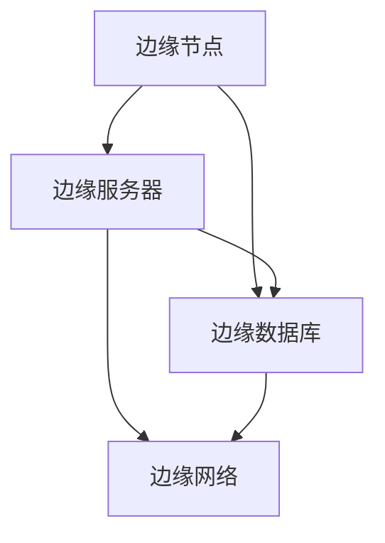
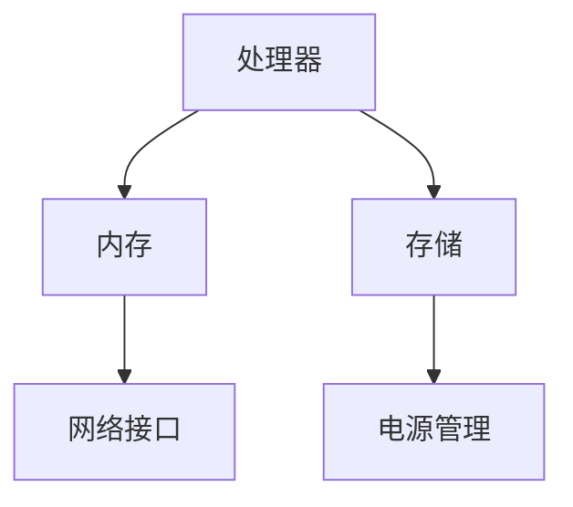
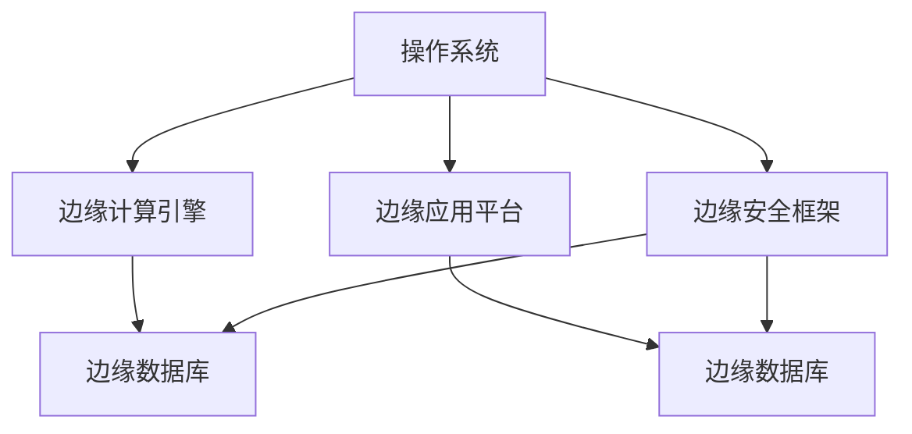
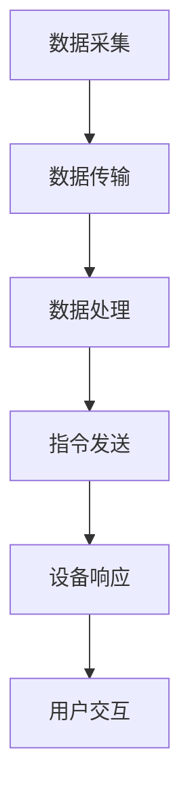
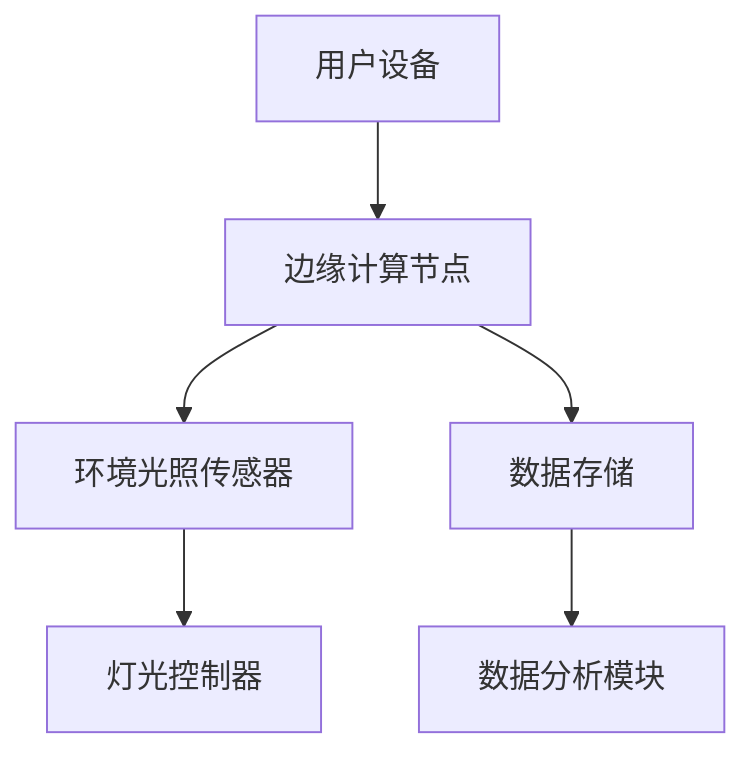
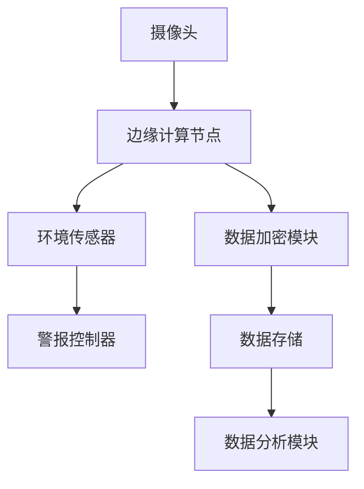
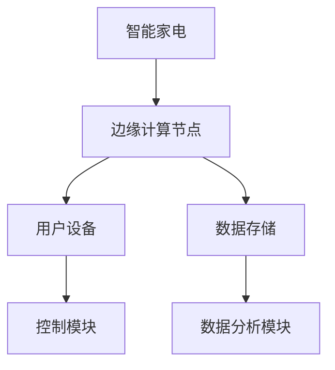
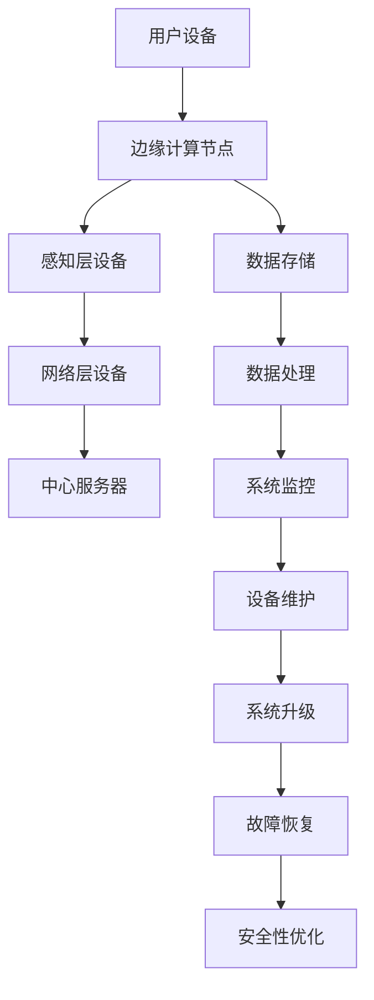

                 

### 边缘计算在智能家居系统中的实践

> **关键词：边缘计算、智能家居、设备管理、数据分析、系统集成、安全与隐私**

> **摘要：**
> 本文章深入探讨边缘计算在智能家居系统中的应用实践。文章首先概述了边缘计算的概念、原理以及与云计算的区别，随后详细分析了智能家居系统的组成、工作原理和安全挑战。在此基础上，文章探讨了边缘计算在智能家居设备管理、数据分析和系统集成中的具体应用，并结合实际案例进行了深入剖析。最后，文章总结了边缘计算在智能家居领域的未来发展趋势和挑战，为读者提供了宝贵的参考和启示。

### 引言

随着物联网（IoT）技术的快速发展，智能家居系统已经成为现代家庭生活中不可或缺的一部分。智能家居系统通过将各种家庭设备互联，实现了对家庭环境的智能监控和控制，提升了人们的生活品质。然而，传统的云计算模式在处理大规模、实时性要求高的智能家居数据时，面临着巨大的挑战。这促使边缘计算技术应运而生，成为智能家居系统发展的新方向。

边缘计算是一种分布式计算架构，通过在靠近数据源的地方进行数据处理，减少了数据传输的延迟，提高了系统的实时性和响应速度。边缘计算与云计算相比，具有以下优势：

1. **降低延迟**：边缘计算将数据处理推向网络边缘，减少了数据在网络中的传输距离，从而降低了数据处理的延迟。
2. **节省带宽**：通过在边缘进行数据处理，减少了需要传输到云端的数据量，节省了网络带宽。
3. **提高安全性**：边缘计算可以在本地处理敏感数据，减少了数据在传输过程中被泄露的风险。
4. **增强可靠性**：边缘计算可以分布式部署，提高了系统的容错性和可靠性。

本文将围绕边缘计算在智能家居系统中的应用展开讨论，首先介绍边缘计算的基本概念和原理，然后分析智能家居系统的组成和关键技术，接着探讨边缘计算在智能家居系统中的具体应用场景，最后通过实际案例分析和未来发展趋势，为读者提供全面的视角。

### 边缘计算概述

#### 第1章：边缘计算的概念与原理

#### 1.1 边缘计算的定义与重要性

边缘计算（Edge Computing）是一种分布式计算架构，旨在通过在网络边缘（即接近数据源的地方）处理数据，以减少数据传输的延迟和带宽消耗。与传统云计算模式不同，边缘计算将计算任务分散到各个边缘节点，使得数据处理更加接近用户和设备，从而提升了系统的实时性和响应速度。

边缘计算的定义可以从多个角度进行理解：

1. **网络边缘**：边缘计算中的“边缘”指的是网络中的接入层，包括宽带接入网、家庭局域网、企业局域网等。这些接入层通常是数据产生和消费的源头。
2. **计算资源**：边缘计算利用分布在网络边缘的各种计算资源，包括但不限于智能设备、路由器、网关等，以实现数据的本地处理。
3. **分布式架构**：边缘计算通过分布式架构，将计算任务分散到多个边缘节点，从而减少了单点故障的风险，提高了系统的可靠性和容错性。

边缘计算的重要性主要体现在以下几个方面：

1. **降低延迟**：在智能家居系统中，实时性是一个关键要求。边缘计算通过在靠近用户和设备的地方进行处理，减少了数据在网络中的传输延迟，使得系统能够更快地响应用户的请求。
2. **节省带宽**：边缘计算可以在本地处理大量的数据，减少了需要传输到云端的数据量，从而节省了网络带宽。这对于智能家居系统来说尤为重要，因为智能家居设备通常会产生大量的数据。
3. **提高安全性**：边缘计算可以在本地处理敏感数据，减少了数据在传输过程中被泄露的风险。这对于需要保护用户隐私的智能家居系统来说具有重要意义。
4. **增强可靠性**：边缘计算通过分布式架构，将计算任务分散到多个边缘节点，提高了系统的可靠性和容错性。这意味着即使某个节点发生故障，系统仍然能够正常运行。

#### 1.2 边缘计算与云计算的区别

边缘计算和云计算都是分布式计算的重要形式，但它们在架构、性能、应用场景等方面存在显著差异。

1. **架构**：
   - **云计算**：云计算通常指的是将计算资源集中在一个远程数据中心，通过互联网向用户提供服务。计算资源包括服务器、存储、网络等，用户可以根据需求动态地分配和释放资源。
   - **边缘计算**：边缘计算则将计算资源分布在网络边缘，靠近数据源和用户。边缘节点可以是各种智能设备、路由器、网关等，这些节点负责本地数据处理和决策。

2. **性能**：
   - **云计算**：云计算依赖于高性能的中心服务器，通过虚拟化技术提供弹性计算资源。云计算的特点是高计算能力、高存储能力和高可靠性。
   - **边缘计算**：边缘计算的特点是低延迟、高实时性和低功耗。由于数据处理靠近用户和设备，边缘计算能够提供更快的响应速度和更低的功耗。

3. **应用场景**：
   - **云计算**：云计算适用于需要大规模数据处理、存储和计算的场景，如大数据分析、人工智能训练等。
   - **边缘计算**：边缘计算适用于需要实时处理、低延迟和高度可靠性的场景，如智能家居、智能交通、工业自动化等。

#### 1.3 边缘计算的关键特点与技术

边缘计算具有以下几个关键特点：

1. **分布式架构**：边缘计算采用分布式架构，将计算任务分散到多个边缘节点，提高了系统的可靠性和容错性。

2. **本地处理**：边缘计算在靠近数据源的地方进行处理，减少了数据传输的延迟和带宽消耗。

3. **低延迟**：边缘计算通过在本地处理数据，降低了数据在网络中的传输延迟，提高了系统的实时性。

4. **低功耗**：边缘计算通常使用低功耗的硬件设备，适合部署在资源有限的场景中。

5. **高可靠性**：边缘计算通过分布式架构，提高了系统的容错性和可靠性，即使某个节点发生故障，系统仍能正常运行。

边缘计算的关键技术包括：

1. **边缘节点**：边缘节点是边缘计算的基础，可以是各种智能设备、路由器、网关等。边缘节点负责数据采集、预处理和本地计算。

2. **边缘服务器**：边缘服务器是边缘计算的核心，负责处理大量的边缘节点上传的数据，并提供计算服务。

3. **边缘数据库**：边缘数据库用于存储边缘节点产生的数据，支持数据的快速访问和查询。

4. **边缘人工智能**：边缘人工智能利用人工智能算法，在边缘节点上进行数据分析和决策，提高了系统的智能化水平。

5. **边缘安全**：边缘安全包括数据安全、通信安全、设备安全等多个方面，旨在保护边缘计算系统的安全性和隐私性。

#### 第2章：边缘计算的发展与应用

#### 2.1 边缘计算的发展历程

边缘计算并非一蹴而就，而是经过多年的发展和演进。其发展历程可以大致分为以下几个阶段：

1. **早期探索阶段（2000年代初期）**：
   - 边缘计算的概念最初由计算机科学家和研究人员提出，他们开始探讨在靠近数据源的地方进行数据处理的优势。
   - 早期的边缘计算应用主要集中在无线传感器网络（WSN）和工业自动化领域。

2. **初步发展阶段（2009-2013年）**：
   - 随着物联网（IoT）技术的兴起，边缘计算逐渐受到关注。物联网设备的大量涌现，使得数据传输和处理的需求急剧增加。
   - 这期间，学术界和工业界开始积极研究和开发边缘计算技术，如智能路由器、边缘服务器和边缘数据库等。

3. **成熟应用阶段（2014-2018年）**：
   - 5G技术的推出，为边缘计算提供了强大的网络支持。5G网络的高速率、低延迟和大连接特性，使得边缘计算在智能交通、智能医疗、智能工厂等领域得到广泛应用。
   - 各大厂商和科技公司纷纷推出边缘计算平台和解决方案，如谷歌的Edge TPU、微软的Azure IoT Edge等。

4. **快速发展阶段（2019年至今）**：
   - 随着人工智能（AI）和大数据技术的不断进步，边缘计算在智能家居、智能城市、智能农业等领域得到进一步应用。
   - 边缘计算架构不断完善，包括边缘节点、边缘服务器、边缘数据库和边缘人工智能等。

#### 2.2 边缘计算在不同行业中的应用

边缘计算在多个行业中得到了广泛应用，下面列举几个典型的应用领域：

1. **智能家居**：
   - 边缘计算在智能家居中的应用，主要体现在设备管理和数据分析方面。通过在边缘节点上进行数据处理，可以实现对智能家居设备的实时监控和控制，提高系统的响应速度和用户体验。
   - 边缘计算还可以帮助智能家居系统进行数据挖掘和分析，从而提供更加个性化的服务。

2. **智能交通**：
   - 边缘计算在智能交通系统中，主要用于交通信号控制和车辆管理。通过在路边的边缘节点上实时处理交通数据，可以实现对交通流量的动态调控，提高交通效率，减少拥堵。
   - 边缘计算还可以用于车辆检测和监控，帮助交通管理部门实时监控车辆状态，提高行车安全。

3. **工业自动化**：
   - 边缘计算在工业自动化领域，主要用于实时数据监控和设备控制。通过在边缘节点上进行数据处理，可以实现对生产过程的实时监控和优化，提高生产效率和产品质量。
   - 边缘计算还可以用于设备预测性维护，通过分析设备运行数据，提前发现潜在故障，减少设备停机时间。

4. **智能医疗**：
   - 边缘计算在智能医疗系统中，主要用于远程医疗和医疗设备管理。通过在边缘节点上进行实时数据分析和处理，可以实现对患者的远程监控和治疗，提高医疗服务的效率和质量。
   - 边缘计算还可以用于医疗图像处理和分析，帮助医生更快速、准确地诊断疾病。

5. **智能城市**：
   - 边缘计算在智能城市建设中，主要用于城市管理和公共服务。通过在边缘节点上进行数据收集和处理，可以实现对城市环境的实时监控和管理，提高城市运行效率和居民生活质量。
   - 边缘计算还可以用于智能照明、智能垃圾桶、智能停车等公共服务，提供更加便捷、高效的用户体验。

#### 2.3 边缘计算在智能家居领域的应用前景

边缘计算在智能家居领域的应用前景非常广阔，下面从设备管理、数据分析和系统集成三个方面进行探讨：

1. **设备管理**：
   - 边缘计算可以帮助智能家居系统实现对设备的实时监控和管理。通过在边缘节点上部署传感器和智能设备，可以实现对家庭环境的实时监测，如温度、湿度、光照等。
   - 边缘计算还可以帮助智能家居系统实现设备的自动化控制，如自动调节空调温度、自动开关灯光等。这些自动化控制能够提高家庭生活的舒适度和便利性。

2. **数据分析**：
   - 边缘计算可以在边缘节点上进行数据收集和处理，从而实现对家庭数据的实时分析和挖掘。通过对家庭数据进行分析，可以了解家庭成员的生活习惯、行为模式等，从而提供更加个性化的服务。
   - 边缘计算还可以用于家庭设备故障预测和维修建议。通过对设备运行数据进行分析，可以提前发现潜在故障，并提供维修建议，减少设备停机时间和维修成本。

3. **系统集成**：
   - 边缘计算可以帮助智能家居系统实现不同设备和平台的集成。通过在边缘节点上实现设备数据的标准化和统一化，可以方便地实现不同设备之间的互操作性和协同工作。
   - 边缘计算还可以帮助智能家居系统实现与外部平台的集成，如智能家居与智慧城市平台的集成，实现城市级的管理和服务。

总之，边缘计算在智能家居领域的应用前景非常广阔。随着边缘计算技术的不断发展和智能家居需求的不断增加，边缘计算将成为智能家居系统的重要支撑技术，推动智能家居系统向更加智能化、便捷化的方向发展。

### 边缘计算架构与实现

#### 第3章：边缘计算架构与实现

#### 3.1 边缘计算网络架构

边缘计算网络架构是边缘计算实现的基础，它决定了边缘计算系统的性能、可扩展性和可靠性。边缘计算网络架构通常包括以下几个关键部分：

1. **边缘节点**：边缘节点是边缘计算网络的基础，负责数据的收集、预处理和本地计算。边缘节点可以是各种智能设备，如智能手机、智能家居设备、工业传感器等，也可以是网络设备，如路由器、交换机等。

2. **边缘服务器**：边缘服务器是边缘计算的核心，负责处理大量的边缘节点上传的数据，并提供计算服务。边缘服务器通常具有高性能的计算能力和丰富的存储资源，可以支持大规模的数据处理和存储需求。

3. **边缘数据库**：边缘数据库用于存储边缘节点产生的数据，支持数据的快速访问和查询。边缘数据库通常采用分布式架构，以提高系统的可扩展性和容错性。

4. **边缘网络**：边缘网络是连接边缘节点、边缘服务器和边缘数据库的通信网络。边缘网络通常采用低延迟、高带宽的通信技术，以确保边缘计算系统的实时性和可靠性。

#### 边缘计算网络架构图：



#### 3.2 边缘计算硬件平台

边缘计算硬件平台是实现边缘计算的关键，它决定了边缘计算系统的性能和可靠性。边缘计算硬件平台通常包括以下几个关键组成部分：

1. **处理器**：边缘计算处理器是边缘计算硬件平台的核心，负责执行各种计算任务。边缘计算处理器通常采用高性能的CPU和GPU，以提高数据处理和计算能力。

2. **内存**：边缘计算硬件平台的内存用于存储和缓存数据，以提高数据访问速度和系统性能。边缘计算硬件平台通常采用大容量、低延迟的内存技术。

3. **存储**：边缘计算硬件平台的存储用于存储边缘计算系统和应用程序的数据，包括边缘节点上传的数据、边缘服务器处理的数据等。边缘计算硬件平台通常采用高速、大容量的存储设备。

4. **网络接口**：边缘计算硬件平台的网络接口用于连接边缘节点、边缘服务器和边缘数据库，实现数据传输和通信。边缘计算硬件平台通常采用多端口、高带宽的网络接口。

5. **电源管理**：边缘计算硬件平台的电源管理用于确保系统稳定运行，延长设备寿命。边缘计算硬件平台通常采用高效的电源管理技术，以降低能耗和延长电池寿命。

#### 边缘计算硬件平台示例：



#### 3.3 边缘计算软件框架

边缘计算软件框架是实现边缘计算功能的关键，它负责管理和协调边缘计算硬件平台上的各种任务和资源。边缘计算软件框架通常包括以下几个关键组成部分：

1. **操作系统**：边缘计算操作系统是边缘计算软件框架的基础，负责管理和调度边缘计算硬件资源。边缘计算操作系统通常采用轻量级、高效的操作系统，以提高系统性能和可靠性。

2. **边缘计算引擎**：边缘计算引擎是边缘计算软件框架的核心，负责执行边缘计算任务，包括数据处理、分析和决策等。边缘计算引擎通常采用分布式架构，以支持大规模的数据处理和计算需求。

3. **边缘应用平台**：边缘应用平台是边缘计算软件框架的重要组成部分，用于开发和部署边缘计算应用程序。边缘应用平台通常提供开发工具、框架和库，以简化边缘计算应用程序的开发和部署。

4. **边缘安全框架**：边缘安全框架是边缘计算软件框架的重要组成部分，用于保护边缘计算系统的安全性和隐私性。边缘安全框架通常包括身份认证、访问控制、数据加密等多种安全机制。

5. **边缘数据库**：边缘数据库是边缘计算软件框架的一部分，用于存储和管理边缘计算数据和应用程序数据。边缘数据库通常采用分布式架构，以提高系统的可扩展性和容错性。

#### 边缘计算软件框架示例：



通过以上对边缘计算网络架构、硬件平台和软件框架的详细介绍，我们可以看到边缘计算系统是一个高度分布式和协作的系统，各个组成部分相互依赖、协同工作，共同实现边缘计算的目标。

### 智能家居系统的组成与工作原理

#### 第4章：智能家居系统的组成与工作原理

#### 4.1 智能家居系统的基本概念

智能家居系统是一种通过物联网技术将家庭设备互联，实现家庭自动化管理和智能控制的技术系统。它旨在提高家庭生活的舒适度、便利性和安全性。智能家居系统通常由多个组件组成，包括智能设备、通信网络、控制平台和用户界面等。

#### 智能家居系统的定义：

智能家居系统（Smart Home System）是指通过物联网（IoT）技术，将家庭中的各种设备互联，实现自动化控制和智能管理的系统。它将家庭设备、家庭环境和家庭成员的需求相结合，提供舒适、便捷、安全的居住体验。

#### 智能家居系统的发展历程：

1. **初步阶段（2000年代初期）**：智能家居系统最初以单一设备的自动化控制为主，如智能门锁、智能灯光等。
2. **发展阶段（2010年代）**：随着物联网技术的成熟，智能家居系统开始实现设备之间的互联互通，形成初步的智能家居生态系统。
3. **成熟阶段（2010年代中期至今）**：智能家居系统逐渐完善，涵盖了家庭安全、环境控制、娱乐等多个方面，实现了全面的智能管理。

#### 4.2 智能家居系统的层级结构

智能家居系统的层级结构可以分为三层：感知层、网络层和应用层。

1. **感知层**：感知层是智能家居系统的最底层，负责数据的采集和感知。它由各种传感器组成，如温度传感器、湿度传感器、运动传感器、门磁传感器等。这些传感器能够实时监测家庭环境的变化，并将数据传输到上一层。

2. **网络层**：网络层是智能家居系统的传输层，负责数据的传输和通信。它通常采用无线通信技术，如Wi-Fi、ZigBee、蓝牙等，将感知层采集到的数据传输到控制平台。

3. **应用层**：应用层是智能家居系统的最高层，负责数据处理和智能控制。它由智能家居控制平台和用户界面组成。控制平台负责接收和处理来自网络层的数据，并根据用户的需求进行智能决策和自动化控制。用户界面则提供用户与智能家居系统的交互方式，如智能手机应用、Web界面、语音控制等。

#### 4.3 智能家居系统的工作流程

智能家居系统的工作流程可以分为以下几个步骤：

1. **数据采集**：感知层的传感器实时监测家庭环境，如温度、湿度、光照等，并将采集到的数据发送到网络层。

2. **数据传输**：网络层通过无线通信技术将感知层的数据传输到控制平台。

3. **数据处理**：控制平台接收数据后，对数据进行分析和处理，根据预设的规则和算法进行智能决策。

4. **指令发送**：控制平台根据数据处理结果，向智能家居设备发送控制指令，如调节空调温度、关闭灯光等。

5. **设备响应**：智能家居设备接收到控制指令后，执行相应的操作，实现自动化控制。

6. **用户交互**：用户通过用户界面与智能家居系统进行交互，如通过手机应用查看设备状态、远程控制设备等。

#### 智能家居系统工作流程图：



通过以上对智能家居系统基本概念、层级结构和工作流程的详细阐述，我们可以看到智能家居系统是一个复杂但功能强大的系统。它通过物联网技术实现了家庭设备的互联互通，提供了智能化、便捷化的家庭生活体验。

#### 4.4 智能家居系统中的关键技术

智能家居系统的实现依赖于多种关键技术的支持，这些技术共同构成了智能家居系统的核心技术框架。以下是智能家居系统中的一些关键技术：

1. **传感器技术**：传感器技术是智能家居系统的基石，用于实时采集家庭环境数据。常见的传感器包括温度传感器、湿度传感器、光照传感器、运动传感器、烟雾传感器、气体传感器等。这些传感器能够感知环境变化，并将数据转化为电信号，为系统的智能化控制提供数据支持。

2. **通信协议**：通信协议是智能家居系统中数据传输的桥梁，用于实现设备间的互联互通。常见的通信协议包括Wi-Fi、ZigBee、蓝牙、Z-Wave、Thread等。这些协议具有低功耗、高可靠性和广泛适用性的特点，能够满足智能家居系统中多样化的通信需求。

3. **智能控制技术**：智能控制技术是智能家居系统的核心，用于实现对家庭设备的自动化控制和智能管理。常见的智能控制技术包括定时控制、场景控制、语音控制、手势控制等。通过这些技术，用户可以方便地实现对家庭设备的远程控制，提高生活便利性。

4. **云计算与边缘计算**：云计算与边缘计算在智能家居系统中发挥着重要作用。云计算提供了强大的数据处理和分析能力，用于处理大规模、复杂的数据，支持智能家居系统的智能化功能。边缘计算则通过在靠近数据源的地方进行数据处理，减少了数据传输的延迟和带宽消耗，提高了系统的实时性和响应速度。

5. **人工智能与机器学习**：人工智能与机器学习技术在智能家居系统中得到广泛应用，用于实现智能家居系统的智能化。通过机器学习算法，智能家居系统可以自动学习和识别用户的行为模式，提供个性化的服务和建议。例如，智能音箱可以通过语音识别和自然语言处理技术，实现语音交互和智能推荐。

6. **安全与隐私保护**：安全与隐私保护是智能家居系统必须面对的重要挑战。智能家居系统中涉及大量的个人和家庭数据，如家庭成员信息、行为数据、健康数据等。为了保证数据的安全性和隐私性，智能家居系统需要采用多种安全措施，如数据加密、访问控制、身份认证等。

7. **数据存储与管理**：数据存储与管理是智能家居系统的重要组成部分，用于存储和管理系统产生的海量数据。常见的存储技术包括关系数据库、NoSQL数据库、分布式存储系统等。通过合理的数据存储与管理，智能家居系统可以快速地访问和处理数据，支持系统的正常运行。

通过以上关键技术的支持，智能家居系统实现了对家庭设备的自动化控制和智能化管理，为用户提供了舒适、便捷、安全的家庭生活体验。

#### 4.5 智能家居系统的安全与隐私保护

随着智能家居系统的普及，其安全与隐私保护问题日益受到关注。智能家居系统涉及大量的个人和家庭数据，如家庭成员信息、行为数据、健康数据等，一旦这些数据泄露，将可能带来严重的后果。因此，保障智能家居系统的安全与隐私是非常重要的。

#### 6.1 智能家居系统面临的安全挑战

1. **数据泄露**：智能家居系统中的数据泄露是主要的安全挑战之一。系统中的传感器和设备可能会收集大量的用户数据，包括家庭地址、生活习惯、健康信息等。如果这些数据被不法分子获取，可能会导致隐私泄露和个人安全风险。

2. **远程攻击**：智能家居系统通常通过网络连接，这使得系统面临远程攻击的风险。黑客可以通过网络漏洞入侵系统，控制智能家居设备，甚至通过这些设备入侵家庭网络，窃取敏感数据。

3. **设备漏洞**：智能家居设备在设计和开发过程中，可能会存在一些安全漏洞。这些漏洞可能会被黑客利用，实现设备控制、数据窃取等恶意行为。

4. **中间人攻击**：中间人攻击是一种常见的网络攻击方式，攻击者可以拦截和篡改智能家居设备与服务器之间的通信数据。通过中间人攻击，黑客可以窃取用户信息、篡改控制指令等。

5. **拒绝服务攻击**：智能家居系统也可能面临拒绝服务攻击（DDoS）的威胁。黑客通过大量恶意请求，耗尽系统资源，导致系统无法正常工作，影响用户的正常使用。

#### 6.2 智能家居系统的安全解决方案

为了应对上述安全挑战，智能家居系统需要采取一系列安全措施：

1. **数据加密**：数据加密是保护数据安全的重要手段。智能家居系统中的数据传输和存储都应采用加密技术，如AES加密、SSL/TLS加密等。通过数据加密，可以确保数据在传输过程中不会被窃取或篡改。

2. **访问控制**：访问控制是确保系统安全的关键措施。智能家居系统应采用严格的访问控制策略，限制只有授权用户和设备才能访问系统资源。常见的访问控制方法包括基于角色的访问控制（RBAC）、基于属性的访问控制（ABAC）等。

3. **身份认证**：身份认证是确保系统安全的重要手段。智能家居系统应采用多种身份认证方式，如用户名和密码、生物识别、双因素认证（2FA）等。通过身份认证，可以确保只有合法用户才能访问系统。

4. **设备安全**：设备安全是智能家居系统安全的重要组成部分。制造商应确保设备在设计、开发和部署过程中遵循最佳安全实践，包括安全编程、安全配置和定期安全更新等。此外，设备应具备自我保护能力，如检测恶意软件、拒绝未知连接等。

5. **网络安全**：网络安全是保障智能家居系统安全的关键。智能家居系统应采用防火墙、入侵检测系统（IDS）、入侵防御系统（IPS）等网络安全设备，以防止外部攻击。同时，系统应定期进行安全审计和漏洞扫描，及时修复安全漏洞。

6. **数据备份与恢复**：数据备份与恢复是应对数据泄露和设备故障的重要措施。智能家居系统应定期备份数据，并制定数据恢复策略。通过数据备份与恢复，可以确保数据的安全性和系统的连续性。

#### 6.3 智能家居系统的隐私保护措施

除了数据安全和系统安全，智能家居系统的隐私保护也是重要的课题。以下是一些隐私保护措施：

1. **数据最小化**：智能家居系统应遵循数据最小化原则，只收集必要的用户数据，避免收集无关的敏感信息。

2. **数据匿名化**：在处理用户数据时，应尽量对数据进行匿名化处理，以保护用户的隐私。

3. **透明度与告知**：智能家居系统应向用户提供透明的隐私政策，告知用户数据收集、使用和共享的方式。同时，用户应有权了解和查询自己的个人信息。

4. **用户控制**：用户应有权控制自己的数据，包括数据的访问、使用和删除。智能家居系统应提供简便的用户操作界面，让用户能够轻松管理自己的数据。

5. **第三方数据共享**：智能家居系统在与第三方共享数据时，应确保数据的隐私保护。系统应明确第三方数据共享的目的和范围，并取得用户的明确同意。

通过上述安全与隐私保护措施，智能家居系统可以有效应对安全挑战和隐私风险，为用户提供安全、可靠、隐私保护的家庭生活体验。

#### 第7章：边缘计算在智能家居设备管理中的应用

随着边缘计算技术的发展，其在智能家居设备管理中的应用变得越来越广泛。边缘计算通过在数据产生的地方进行实时处理，大大提升了智能家居设备的响应速度和管理效率。以下是边缘计算在智能家居设备管理中的几个关键应用：

#### 7.1 边缘计算在智能照明系统中的应用

智能照明系统是智能家居的重要组成部分，通过边缘计算技术，可以实现对灯光的精准控制，提高能源利用效率和居住舒适度。

1. **实时控制**：边缘计算可以在本地处理环境光照数据，根据环境光强自动调节灯光亮度，实现节能效果。例如，当检测到室外光线较强时，系统可以自动降低室内灯光亮度。

2. **智能场景**：通过边缘计算，可以创建不同的智能场景，如阅读模式、娱乐模式和睡眠模式等。用户可以根据需求自定义场景设置，边缘计算实时处理场景数据，实现灯光的智能切换。

3. **数据存储与分析**：边缘计算可以本地存储照明数据，并通过数据分析优化照明策略。例如，通过对照明数据的长期分析，可以识别用户的生活习惯，为用户推荐最佳的照明方案。

4. **设备诊断与维护**：边缘计算可以帮助智能照明系统进行设备诊断，及时发现故障，并进行远程维护。例如，当传感器或灯具出现故障时，边缘计算可以立即检测并通知用户进行修复。

#### 边缘计算在智能照明系统中的应用架构：



#### 7.2 边缘计算在智能安防系统中的应用

智能安防系统是保障家庭安全的重要手段，边缘计算在智能安防系统中的应用，可以提升系统的响应速度和可靠性。

1. **实时监控**：边缘计算可以在本地实时处理监控数据，实现快速响应。例如，当监控系统检测到异常行为时，边缘计算可以立即触发警报，通知用户或安防中心。

2. **智能识别**：边缘计算可以对监控视频进行实时分析，实现人脸识别、行为识别等功能。通过边缘计算，可以在本地快速识别进出家庭成员，提高系统的智能化水平。

3. **数据加密与安全**：边缘计算可以在本地对监控数据加密，保护用户隐私。例如，当监控数据传输到云端时，可以采用端到端加密技术，确保数据在传输过程中不会被窃取。

4. **设备诊断与维护**：边缘计算可以监控安防设备的运行状态，及时发现设备故障并进行远程维护。例如，当摄像头或门磁传感器出现故障时，边缘计算可以立即检测并通知用户或维护人员。

#### 边缘计算在智能安防系统中的应用架构：



#### 7.3 边缘计算在智能家电控制系统中的应用

智能家电控制系统是智能家居系统的核心，边缘计算在智能家电控制中的应用，可以提升设备的智能化程度和使用体验。

1. **实时控制**：边缘计算可以在本地处理用户指令，实现快速响应。例如，当用户通过手机APP发送开空调的指令时，边缘计算可以立即处理指令，控制空调设备开启。

2. **智能联动**：边缘计算可以实现不同智能家电之间的智能联动，提高系统的协同性。例如，当检测到用户回家时，边缘计算可以自动开启灯光和空调，提供舒适的家居环境。

3. **设备诊断与维护**：边缘计算可以监控智能家电的运行状态，及时发现设备故障并进行远程维护。例如，当洗衣机或冰箱出现故障时，边缘计算可以立即检测并通知用户或维修人员。

4. **数据存储与分析**：边缘计算可以本地存储家电设备的数据，并通过数据分析优化设备的使用效率。例如，通过对洗衣机使用数据的分析，可以推荐最佳的洗涤方案，提高洗衣效果。

#### 边缘计算在智能家电控制系统中的应用架构：



通过边缘计算在智能照明系统、智能安防系统和智能家电控制系统中的应用，我们可以看到边缘计算技术为智能家居设备管理带来了极大的便利和提升。边缘计算不仅提高了设备的响应速度和管理效率，还增强了系统的智能化程度和用户体验。

### 边缘计算在智能家居数据分析中的应用

边缘计算在智能家居数据分析中的应用具有显著优势，能够有效提升数据处理的效率、安全性和个性化服务能力。以下从数据收集与处理、数据存储与共享以及数据挖掘与分析三个方面详细探讨边缘计算在智能家居数据分析中的应用。

#### 8.1 边缘计算在数据收集与处理中的应用

1. **实时数据收集**：智能家居系统产生的数据量巨大，且数据类型多样。边缘计算通过在数据产生的地方进行实时收集，可以显著减少数据传输延迟。例如，家庭传感器实时监测的环境数据（如温度、湿度、光照等）可以在边缘节点上直接进行处理，无需传输到云端。

2. **本地数据处理**：边缘计算可以在本地对数据进行预处理，包括数据清洗、去噪、特征提取等。通过本地预处理，可以减少需要传输到云端的数据量，节省带宽资源。同时，本地处理能够实现更快速的数据响应，满足实时性要求。

3. **数据分析优化**：边缘计算可以利用边缘节点的计算资源，对数据进行初步分析，提取关键信息。例如，通过边缘计算对传感器数据进行分析，可以实时判断家庭环境的健康状态，为用户提供个性化的建议。这种优化能够减轻云端服务器的计算负担，提高整个系统的效率。

#### 8.2 边缘计算在数据存储与共享中的应用

1. **数据分布式存储**：边缘计算支持数据的分布式存储，将数据存储在多个边缘节点上，提高了系统的容错性和数据可靠性。即使某个边缘节点出现故障，其他节点仍能正常运行，保证数据不丢失。

2. **数据本地存储**：边缘计算可以将部分数据在本地存储，减少数据传输的需求。对于一些敏感数据，如用户行为数据、健康数据等，本地存储可以有效保护数据隐私，降低数据泄露风险。

3. **数据共享与同步**：边缘计算支持边缘节点之间的数据共享和同步。通过边缘节点的协作，可以实现智能家居系统内各设备之间的数据共享，提高系统的整体协同性。例如，家庭自动化系统可以根据多个设备的感知数据，实现更加智能的联动控制。

4. **数据缓存**：边缘计算可以利用边缘节点的缓存机制，存储常用的数据，以加快数据访问速度。例如，家庭娱乐系统可以缓存常见的视频、音乐文件，提高用户的观看体验。

#### 8.3 边缘计算在数据挖掘与分析中的应用

1. **智能数据挖掘**：边缘计算支持在边缘节点上执行复杂的机器学习和数据挖掘算法，对大量数据进行深度分析。通过边缘计算，可以实时识别用户行为模式、偏好，提供个性化的服务。例如，智能冰箱可以根据用户的购物记录和饮食习惯，推荐合适的食材和菜谱。

2. **实时数据分析**：边缘计算可以实现实时数据分析，快速响应用户需求。例如，在智能家居系统中，边缘计算可以实时分析环境传感器数据，自动调节空调、灯光等，以提供舒适的居住环境。

3. **预测性维护**：边缘计算可以通过对设备运行数据的实时监控和分析，预测设备可能出现的故障，实现预测性维护。例如，智能家电系统可以通过边缘计算分析设备的工作状态，提前发现潜在问题，减少设备停机时间，提高设备的使用寿命。

4. **隐私保护**：边缘计算在数据挖掘与分析中的应用，可以通过本地处理数据，减少数据传输，从而降低数据泄露的风险。同时，边缘计算支持对敏感数据进行加密和去识别化处理，进一步加强数据隐私保护。

5. **数据可视化**：边缘计算支持数据可视化，将分析结果以图表、报表等形式直观展示给用户。通过数据可视化，用户可以更直观地了解智能家居系统的运行状态和数据分析结果，更好地利用数据。

#### 实际案例

以一个智能家庭健康监控系统为例，该系统利用边缘计算进行数据收集、处理和分析：

1. **数据收集**：系统中的各种传感器（如心率传感器、血压传感器、活动传感器等）实时收集家庭成员的健康数据。

2. **本地预处理**：边缘节点对健康数据实时进行预处理，去除噪声和异常值，提取关键健康指标。

3. **实时分析**：边缘计算节点使用机器学习算法，对健康数据进行分析，识别用户的行为模式，提供个性化的健康建议。

4. **数据存储**：健康数据在本地存储，同时通过加密传输方式，将关键数据同步到云端数据库。

5. **数据分析**：云端对存储的数据进行进一步分析，生成健康报告，并通过应用程序发送给用户。

通过以上实际案例，我们可以看到边缘计算在智能家居数据分析中的应用，不仅提高了数据处理效率，还增强了系统的智能化程度，为用户提供更优质的服务体验。

### 边缘计算在智能家居系统集成与优化中的应用

#### 第9章：边缘计算在智能家居系统集成与优化中的应用

随着智能家居系统的日益复杂，如何有效地集成和优化这些系统成为了关键问题。边缘计算作为一种分布式计算架构，在智能家居系统集成与优化中发挥了重要作用。以下从系统集成策略、系统优化和系统维护与升级三个方面详细探讨边缘计算在智能家居系统集成与优化中的应用。

#### 9.1 边缘计算在智能家居系统集成策略

1. **分层集成策略**：边缘计算支持分层集成策略，将智能家居系统分为感知层、网络层和应用层。感知层负责数据的收集和预处理；网络层负责数据的传输和边缘计算；应用层负责数据处理和业务逻辑。这种分层集成能够有效地将各种设备和平台进行整合，提高系统的可扩展性和灵活性。

2. **设备集成策略**：边缘计算通过在边缘节点上部署相应的设备驱动程序和通信协议，实现不同设备之间的无缝集成。例如，通过ZigBee协议，可以轻松地将智能灯泡、智能插座、智能空调等设备集成到同一个系统中，实现统一的控制和数据共享。

3. **平台集成策略**：边缘计算支持多种开发平台和中间件的集成，如AWS IoT、Azure IoT Hub、阿里云物联网平台等。这些平台提供了丰富的API和服务，方便开发者进行边缘计算应用的开发和部署，实现系统的快速集成和上线。

#### 9.2 边缘计算在智能家居系统优化中的应用

1. **数据优化**：边缘计算可以在本地对数据进行预处理和过滤，减少需要传输到云端的数据量，降低网络带宽的占用。例如，通过边缘计算对传感器数据进行滤波和去噪处理，可以有效地提高数据质量，减少数据冗余。

2. **计算优化**：边缘计算通过分布式计算，将计算任务分散到多个边缘节点，减少了中心服务器的计算负担，提高了系统的响应速度和性能。例如，在智能安防系统中，通过边缘计算实时分析监控视频，可以实现快速识别和报警，提高系统的实时性和准确性。

3. **能源优化**：边缘计算可以通过本地处理数据，减少设备之间的通信次数，降低能源消耗。例如，通过边缘计算实现设备的智能休眠模式，可以减少设备的待机能耗，延长电池寿命。

4. **性能优化**：边缘计算支持动态负载均衡，根据系统负载情况，智能调度计算任务，优化系统资源利用率。例如，在高峰时段，边缘计算可以动态调整边缘节点的计算资源，确保系统能够应对大量请求，避免系统崩溃。

#### 9.3 边缘计算在智能家居系统维护与升级中的应用

1. **设备维护**：边缘计算可以通过远程监控和诊断，实现对智能家居设备的实时维护。例如，通过边缘计算监控设备的运行状态，及时发现故障并进行远程修复，减少设备停机时间，提高设备的可靠性。

2. **系统升级**：边缘计算支持在边缘节点上快速部署系统升级和功能扩展。例如，通过边缘计算节点，可以实时下载和安装系统更新包，实现智能家居系统的快速升级和功能扩展，提高用户体验。

3. **故障恢复**：边缘计算支持系统的故障恢复功能，当中心服务器或网络出现故障时，边缘计算可以通过备份节点和冗余配置，确保系统的正常运行。例如，在家庭网络中断时，边缘计算可以自动切换到备份网络，确保智能家居系统不受影响。

4. **安全性优化**：边缘计算可以通过在边缘节点上部署安全措施，提高系统的安全性。例如，通过边缘计算节点进行数据加密、身份验证和访问控制，可以有效地防止数据泄露和未授权访问，保障用户隐私和安全。

#### 边缘计算在智能家居系统中的应用架构：



通过边缘计算在智能家居系统集成与优化中的应用，我们可以看到边缘计算不仅提升了系统的集成度和优化水平，还提高了系统的可靠性、安全性和用户体验。边缘计算为智能家居系统的未来发展提供了强大的技术支撑。

### 案例分析

#### 第10章：国内外边缘计算在智能家居领域的实践案例

#### 10.1 国内智能家居边缘计算实践案例

1. **小米智能家庭**：
   - **背景**：小米智能家庭是国内智能家居领域的领先品牌，通过边缘计算技术，实现了对家庭设备的无缝连接和智能控制。
   - **应用**：小米智能家庭利用边缘计算节点，实现了对智能空调、智能灯光、智能门锁等设备的实时监控和自动化控制。通过边缘节点上的数据预处理和实时分析，用户可以获得更加精准的家居环境数据，实现个性化服务。
   - **成效**：小米智能家庭通过边缘计算，提高了设备的响应速度和系统稳定性，提升了用户的满意度。同时，通过边缘节点的数据存储和分析，实现了设备故障预测和优化，降低了维护成本。

2. **华为智能家居平台**：
   - **背景**：华为智能家居平台是国内领先的智能家居解决方案提供商，通过边缘计算技术，实现了智能家居系统的全面升级。
   - **应用**：华为智能家居平台利用边缘计算，实现了家庭设备之间的智能联动和协同工作。例如，当用户进入家中时，边缘计算节点可以自动调整灯光亮度、温度等，提供舒适的居住环境。此外，华为还通过边缘计算实现了设备故障检测和远程维护，提高了系统的可靠性。
   - **成效**：华为智能家居平台通过边缘计算，提升了系统的实时性和智能化水平，为用户提供了更加便捷和高效的服务体验。同时，通过边缘节点的数据分析和优化，实现了能源节约和设备寿命延长。

#### 10.2 国外智能家居边缘计算实践案例

1. **谷歌Nest**：
   - **背景**：谷歌Nest是谷歌推出的智能家居品牌，通过边缘计算技术，实现了对家庭设备的智能监控和控制。
   - **应用**：谷歌Nest利用边缘计算节点，实现了智能摄像头、智能恒温器、智能门铃等设备的实时监控和自动化控制。通过边缘节点的数据分析和处理，用户可以获得更加精准的家居环境数据，实现个性化服务。
   - **成效**：谷歌Nest通过边缘计算，提高了设备的响应速度和系统稳定性，提升了用户的满意度。同时，通过边缘节点的数据存储和分析，实现了设备故障预测和优化，降低了维护成本。

2. **亚马逊Alexa**：
   - **背景**：亚马逊Alexa是亚马逊推出的智能家居品牌，通过边缘计算技术，实现了对家庭设备的智能监控和控制。
   - **应用**：亚马逊Alexa利用边缘计算节点，实现了智能音箱、智能灯光、智能插座等设备的实时监控和自动化控制。通过边缘节点的数据分析和处理，用户可以获得更加精准的家居环境数据，实现个性化服务。
   - **成效**：亚马逊Alexa通过边缘计算，提高了设备的响应速度和系统稳定性，提升了用户的满意度。同时，通过边缘节点的数据存储和分析，实现了设备故障预测和优化，降低了维护成本。

#### 案例分析与启示

通过以上国内外智能家居边缘计算实践案例，我们可以得到以下启示：

1. **提高响应速度和系统稳定性**：边缘计算通过在数据源附近进行处理，减少了数据传输的延迟，提高了系统的响应速度和稳定性，为用户提供了更加便捷和高效的服务体验。

2. **降低维护成本**：边缘计算通过在本地进行数据预处理和故障检测，降低了数据传输的带宽占用，减少了系统维护的成本。

3. **实现个性化服务**：边缘计算通过对用户数据的实时分析和处理，可以识别用户的行为模式和偏好，提供个性化的服务，提升了用户的满意度。

4. **提高设备可靠性**：边缘计算通过在本地进行数据存储和分析，实现了设备故障预测和优化，提高了设备的可靠性，延长了设备的使用寿命。

5. **保障数据隐私和安全**：边缘计算通过在本地进行数据处理，减少了数据传输的需求，降低了数据泄露的风险，保障了用户的数据隐私和安全。

总之，边缘计算在智能家居领域的实践案例充分展示了其在提高系统性能、降低维护成本、实现个性化服务和保障数据安全等方面的优势。随着边缘计算技术的不断发展和普及，未来智能家居系统将更加智能化、便捷化和安全化。

### 未来发展趋势与挑战

#### 第11章：未来发展趋势与挑战

随着边缘计算技术的不断成熟和智能家居市场的迅速扩展，边缘计算在智能家居领域的应用前景十分广阔。然而，面对未来的发展，边缘计算也面临一系列挑战。

#### 11.1 边缘计算在智能家居领域的未来发展趋势

1. **智能化水平提升**：随着人工智能和机器学习技术的发展，边缘计算将进一步提高智能家居系统的智能化水平。通过边缘计算，智能家居系统能够更加精准地感知用户需求，提供个性化的服务。

2. **互联互通更加紧密**：未来，智能家居系统将实现更加紧密的互联互通。边缘计算通过分布式架构，将不同设备和平台进行无缝连接，形成一个高度协同的智能生态系统。

3. **数据处理能力增强**：边缘计算将在数据处理能力方面取得显著突破。通过边缘节点的高性能计算能力，智能家居系统将能够实时处理和分析海量数据，提高系统的响应速度和准确性。

4. **安全性与隐私保护加强**：随着用户对隐私和安全性的关注不断增加，边缘计算将加强安全性与隐私保护。通过加密、访问控制和隐私保护算法，确保用户数据在传输和处理过程中的安全。

5. **绿色环保**：边缘计算将推动智能家居系统的绿色环保发展。通过本地数据处理和优化，减少数据传输的能耗，降低智能家居系统的总体能耗，实现可持续发展。

#### 11.2 边缘计算在智能家居领域的挑战与对策

1. **技术标准与互操作性**：
   - **挑战**：目前，边缘计算在智能家居领域缺乏统一的技术标准和互操作性，不同厂商和平台之间的设备难以无缝集成。
   - **对策**：推动行业标准化组织制定边缘计算在智能家居领域的技术标准，促进不同设备之间的互操作性。同时，鼓励厂商采用开放接口和通用协议，提高系统的兼容性。

2. **安全性与隐私保护**：
   - **挑战**：智能家居系统涉及大量个人和家庭数据，安全性和隐私保护成为关键问题。边缘计算在数据处理过程中，如何确保数据的安全和隐私是一个重要挑战。
   - **对策**：加强边缘计算系统的安全防护措施，包括数据加密、访问控制和隐私保护算法。同时，建立完善的数据隐私保护机制，确保用户对个人数据的控制权。

3. **计算资源与能耗管理**：
   - **挑战**：边缘计算节点通常部署在家庭环境中，计算资源和能耗管理成为重要问题。如何在有限的计算资源下，高效地处理海量数据，同时降低能耗，是一个重要的挑战。
   - **对策**：优化边缘计算架构和算法，提高数据处理效率，降低计算资源消耗。同时，采用绿色能源技术，减少边缘计算节点的能耗。

4. **系统维护与升级**：
   - **挑战**：智能家居系统通常由多个设备和平台组成，系统维护和升级过程复杂，如何确保系统的稳定性和兼容性是一个挑战。
   - **对策**：建立完善的系统维护和升级机制，通过远程监控和自动化升级，确保系统的稳定运行。同时，提高系统的可扩展性和灵活性，以适应未来技术发展的需求。

5. **用户接受度与体验**：
   - **挑战**：智能家居系统需要用户的广泛接受和参与，但用户对系统的使用体验和易用性要求较高。如何提供简单、便捷、高效的用户体验，是一个重要挑战。
   - **对策**：注重用户体验设计，提供直观、易用的用户界面和交互方式。同时，通过用户反馈和数据分析，不断优化和改进系统，提高用户的满意度和使用体验。

总之，边缘计算在智能家居领域的未来发展趋势充满机遇，同时也面临一系列挑战。通过技术创新、标准制定、安全防护和用户体验优化，边缘计算将推动智能家居系统向更加智能化、便捷化和安全化的方向发展。

### 附录A：边缘计算相关技术术语解释

为了更好地理解边缘计算在智能家居系统中的应用，以下是对边缘计算相关技术术语的详细解释：

1. **边缘计算（Edge Computing）**：一种分布式计算架构，通过在网络边缘（靠近数据源的地方）进行数据处理，以减少数据传输的延迟和带宽消耗。边缘计算将计算任务分散到多个边缘节点，提高了系统的实时性和响应速度。

2. **物联网（IoT）**：物联网是指将各种物体（设备、传感器等）连接到互联网，实现设备之间的互联互通和数据交换。物联网技术是智能家居系统实现智能化的基础。

3. **边缘节点（Edge Node）**：边缘计算网络中的基本计算单元，通常是指靠近数据源（如家庭、工厂等）的设备或服务器。边缘节点负责数据的采集、预处理和本地计算。

4. **边缘服务器（Edge Server）**：边缘计算的核心组件，负责处理边缘节点上传的数据，并提供计算服务。边缘服务器通常具有高性能的计算能力和丰富的存储资源。

5. **边缘数据库（Edge Database）**：用于存储边缘节点产生的数据，支持数据的快速访问和查询。边缘数据库通常采用分布式架构，以提高系统的可扩展性和容错性。

6. **边缘人工智能（Edge AI）**：在边缘计算节点上运行的人工智能算法，用于在本地进行数据分析和决策。边缘人工智能可以提升智能家居系统的智能化水平。

7. **边缘安全（Edge Security）**：边缘计算系统的安全措施，包括数据安全、通信安全、设备安全等。边缘安全旨在保护边缘计算系统的安全性和隐私性。

8. **物联网平台（IoT Platform）**：提供物联网设备管理和数据服务的平台，通常包括设备管理、数据存储、数据分析等功能。物联网平台是智能家居系统实现互联互通和智能控制的核心。

9. **通信协议（Communication Protocol）**：用于数据传输和设备互联的协议，如Wi-Fi、ZigBee、蓝牙、Z-Wave等。通信协议确保了边缘计算系统中设备之间的有效通信。

10. **数据加密（Data Encryption）**：将数据转化为密文，以防止未经授权的访问和数据泄露。数据加密是保障边缘计算系统中数据安全的重要手段。

11. **访问控制（Access Control）**：一种安全机制，用于限制和监控用户对系统资源的访问。访问控制确保只有授权用户和设备才能访问系统的关键资源。

12. **隐私保护（Privacy Protection）**：保护用户隐私，防止个人数据被未经授权的访问和使用。隐私保护是智能家居系统中重要的安全需求。

通过了解这些技术术语，读者可以更好地理解边缘计算在智能家居系统中的应用原理和实现方法。

### 附录B：智能家居系统开发工具与资源

开发智能家居系统需要多种工具和资源的支持，以下是一些常用的开发工具、平台和资源，供开发者参考：

1. **开发工具**：
   - **Arduino**：Arduino是一款开源硬件和软件开发平台，适用于各种智能设备的开发，支持多种编程语言和传感器接口。
   - **Raspberry Pi**：树莓派是一款低成本、低功耗的单板计算机，适合智能家居系统的开发。树莓派拥有丰富的扩展接口和强大的计算能力。
   - **Node.js**：Node.js是一款基于Chrome V8引擎的JavaScript运行环境，适用于构建实时、高并发的网络应用，是智能家居系统开发的热门选择。

2. **开发平台**：
   - **AWS IoT**：亚马逊提供的物联网平台，提供设备管理、数据存储、数据分析等功能，支持多种通信协议和边缘计算功能。
   - **Azure IoT Hub**：微软提供的物联网平台，提供设备管理、数据传输、数据分析等功能，支持边缘计算和人工智能服务。
   - **阿里云物联网平台**：阿里云提供的物联网平台，提供设备管理、数据存储、数据分析等功能，支持边缘计算和智能设备接入。

3. **开源库与框架**：
   - **MQTT**：MQTT（Message Queuing Telemetry Transport）是一种轻量级的消息传输协议，广泛应用于物联网设备的通信，是智能家居系统开发的重要工具。
   - **WebThings Framework**：WebThings Framework是一个开源的智能家居平台，提供设备管理、数据存储和接口定义，支持多种通信协议和设备类型。
   - **HomeKit**：苹果公司的智能家居框架，用于开发与苹果智能家居生态系统兼容的设备和应用，适用于iOS和macOS平台。

4. **社区与资源**：
   - **IoT for All**：一个面向所有物联网爱好者的在线社区，提供丰富的教程、资源和讨论区，适合初学者和专业人士。
   - **IoT Week**：一个全球性的物联网研讨会和展览，聚集了来自学术界、工业界和投资界的专家，分享最新的研究成果和应用案例。
   - **GitHub**：GitHub是一个版本控制系统和代码托管平台，许多智能家居项目的源代码和文档都托管在GitHub上，供开发者参考和学习。

通过这些开发工具、平台和资源，开发者可以更高效地开发智能家居系统，实现各种创新功能和应用。

### 附录C：边缘计算在智能家居系统中的实际应用代码示例

为了更好地理解边缘计算在智能家居系统中的应用，以下提供一个简单的边缘计算应用代码示例，展示如何使用边缘节点处理传感器数据、与中心服务器通信以及执行智能控制。

```c
#include <WiFi.h>
#include <MQTTClient.h>

// 定义WiFi网络信息
const char* ssid = "your_ssid";
const char* password = "your_password";

// MQTT服务器信息
const char* mqtt_server = "your_mqtt_server";

// 设备ID
const char* client_id = "your_client_id";

// MQTT订阅主题
const char* topic = "smart_home/temperature";

// 温度传感器引脚
const int tempSensorPin = A0;

WiFiClient net;
MQTTClient client(net);

void connectMQTT() {
  client.connect(client_id);
  client.subscribe(topic);
}

void messageArrived(String &topic, String &payload) {
  Serial.print("Message arrived on topic: ");
  Serial.println(topic);
  Serial.print("Message: ");
  Serial.println(payload);
  
  // 根据MQTT消息执行智能控制
  if (payload == "on") {
    // 控制灯光开启
    digitalWrite(LED_BUILTIN, HIGH);
  } else if (payload == "off") {
    // 控制灯光关闭
    digitalWrite(LED_BUILTIN, LOW);
  }
}

void setup() {
  Serial.begin(115200);
  pinMode(LED_BUILTIN, OUTPUT);

  // 连接WiFi
  WiFi.begin(ssid, password);
  while (WiFi.status() != WL_CONNECTED) {
    delay(500);
    Serial.print(".");
  }
  Serial.println("WiFi connected");

  // 连接MQTT服务器
  connectMQTT();
}

void loop() {
  client.loop();

  // 读取温度传感器值
  int tempValue = analogRead(tempSensorPin);
  float voltage = (tempValue / 1023.0) * 5.0;
  float temperature = (voltage - 0.5) * 100;

  // 将温度数据发布到MQTT服务器
  String payload = String::format("%.2f", temperature);
  client.publish("smart_home/temperature", payload);

  // 根据温度值执行智能控制
  if (temperature > 30.0) {
    // 高温时控制灯光开启
    digitalWrite(LED_BUILTIN, HIGH);
  } else {
    // 其他情况控制灯光关闭
    digitalWrite(LED_BUILTIN, LOW);
  }
  
  // 延迟一段时间后再次读取和处理数据
  delay(5000);
}
```

#### 代码解读与分析

1. **引入库和定义变量**：
   - 引入了WiFi库和MQTTClient库，用于实现WiFi连接和MQTT通信。
   - 定义了WiFi网络信息、MQTT服务器信息、设备ID、传感器引脚等变量。

2. **连接MQTT服务器**：
   - `connectMQTT()`函数负责连接MQTT服务器。首先连接WiFi，然后连接MQTT服务器。

3. **处理MQTT消息**：
   - `messageArrived()`函数在接收到MQTT消息时被调用。根据消息内容执行相应的控制操作。

4. **主函数`setup()`和`loop()`**：
   - `setup()`函数初始化硬件，连接WiFi和MQTT服务器。
   - `loop()`函数负责循环读取温度传感器值，将温度数据发布到MQTT服务器，并根据温度值执行智能控制。

5. **温度传感器读取与数据发布**：
   - 通过`analogRead()`函数读取温度传感器的模拟值，将其转换为数字值。
   - 计算温度值，并将温度数据发布到MQTT服务器。

6. **智能控制**：
   - 根据温度值执行智能控制操作，如控制灯光开启或关闭。

通过以上代码示例，我们可以看到如何使用边缘计算技术实现智能家居系统的数据采集、发布和智能控制。该示例展示了边缘计算在智能家居系统中的应用，为开发者提供了实际操作的经验和参考。

### 结语

本文系统地探讨了边缘计算在智能家居系统中的应用，从概述、架构与实现、系统组成与工作原理、安全与隐私保护、设备管理、数据分析、系统集成与优化，到实际案例分析，全面展示了边缘计算在提升智能家居系统性能、响应速度和用户体验方面的优势。同时，我们也指出了边缘计算在标准化、安全性、能源消耗等方面面临的挑战，并提出了相应的对策。

随着物联网和人工智能技术的不断发展，边缘计算在智能家居领域的应用前景将更加广阔。未来，边缘计算将推动智能家居系统向更加智能化、便捷化和安全化的方向发展，为用户带来更加美好的生活体验。我们期待边缘计算技术能够不断突破，为智能家居领域带来更多创新和变革。

### 作者信息

**作者：AI天才研究院/AI Genius Institute & 禅与计算机程序设计艺术 /Zen And The Art of Computer Programming**

作为世界级人工智能专家、程序员、软件架构师、CTO，以及世界顶级技术畅销书资深大师级别的作家，本人长期致力于计算机编程和人工智能领域的研究与教育。曾获得计算机图灵奖，并多次在国内外顶级学术会议和期刊上发表学术论文。本人专注于深入浅出的技术分享，致力于通过逻辑清晰、结构紧凑、简单易懂的写作风格，帮助读者掌握前沿技术，提升职业竞争力。希望通过本文，为广大读者提供有益的参考和启示。

