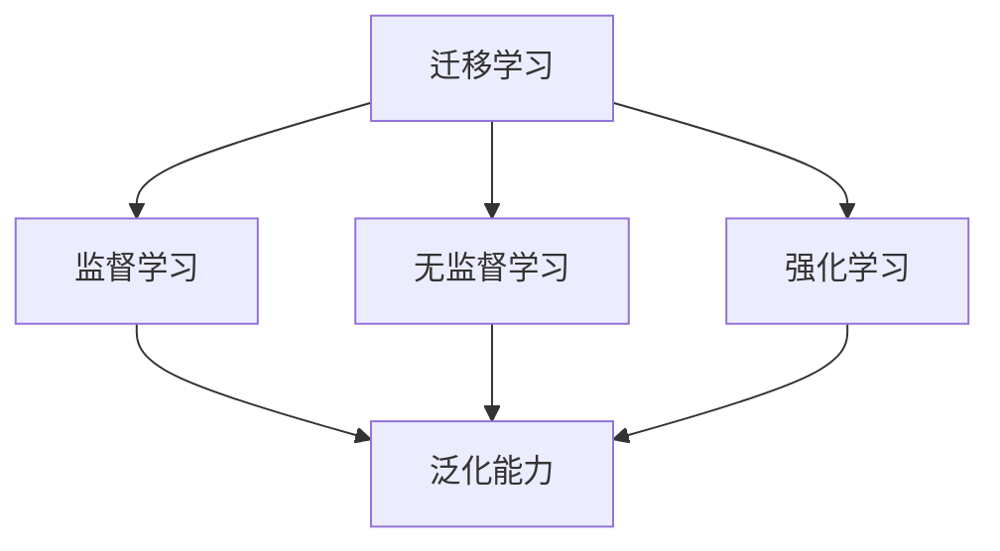
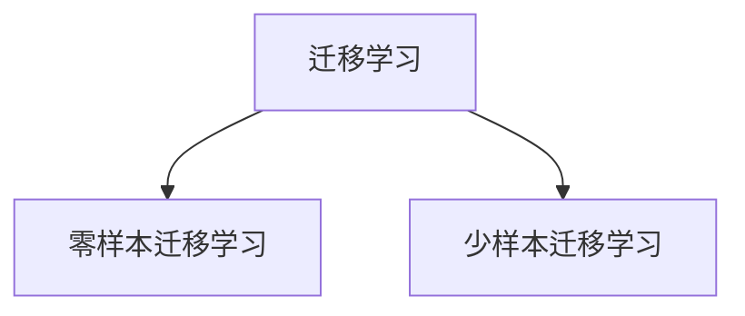
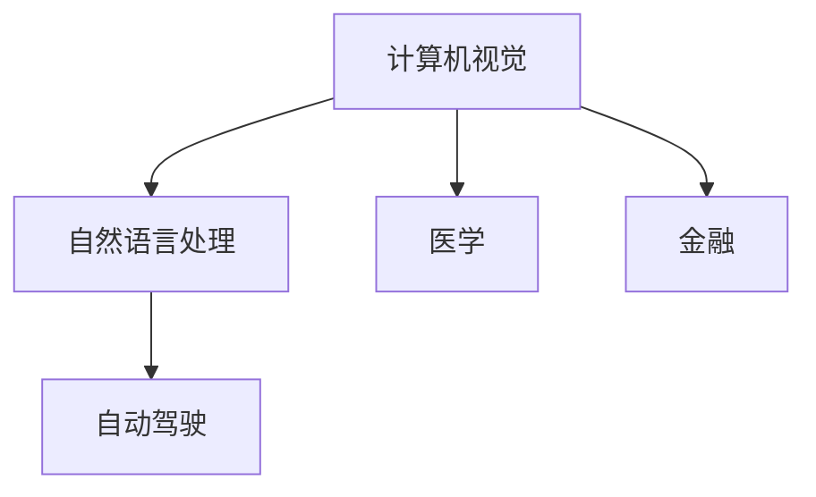
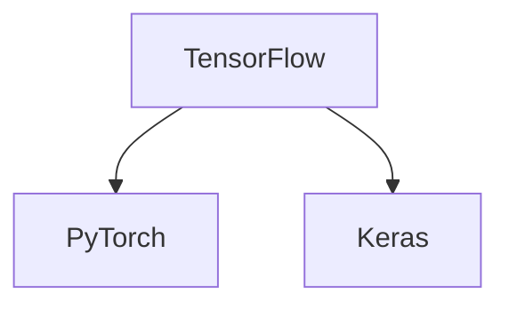

                 

# 《迁移学习在低资源场景下的模型适应技术》

> **关键词：** 迁移学习、低资源场景、模型适应、神经网络、优化策略、应用领域、未来趋势

> **摘要：** 本文将深入探讨迁移学习在低资源场景下的模型适应技术。首先介绍迁移学习的概念和基础理论，随后详细阐述在低资源场景下面临的挑战及其解决策略。接着，文章将分类讨论迁移学习技术与方法，并介绍优化策略和数据增强技术。此外，还将探讨迁移学习在计算机视觉和自然语言处理中的应用，最后总结迁移学习的未来趋势与挑战，并提供相关的资源和工具。

## 第一部分：引言与基础理论

### 第1章：迁移学习概述

#### 1.1 迁移学习的概念

迁移学习（Transfer Learning）是指将一个学习任务的知识迁移到另一个相关但不同的学习任务上的过程。它通过利用已有的模型或知识，来加速新的学习任务，尤其在数据稀缺的情况下尤为有效。

#### 1.2 迁移学习的意义与挑战

迁移学习在许多领域中具有重要的应用价值，如计算机视觉、自然语言处理和语音识别。然而，在低资源场景下，迁移学习面临着一系列挑战，如数据稀缺、模型适应性不足等。

#### 1.3 迁移学习的基本框架

迁移学习的基本框架通常包括三个阶段：预训练（Pretraining）、微调（Fine-tuning）和评估（Evaluation）。其中，预训练阶段利用大规模数据对基础模型进行训练，微调阶段则在少量目标数据上对模型进行调整，最后通过评估阶段来验证模型的性能。

#### 1.4 迁移学习的发展历程

迁移学习的发展历程可以追溯到20世纪80年代的“样例学习”和“泛化学习”。随着深度学习技术的兴起，迁移学习得到了广泛关注和快速发展。

### 第2章：迁移学习基础理论

#### 2.1 学习理论基础

迁移学习依赖于学习理论基础，包括监督学习、无监督学习和强化学习。这些理论为迁移学习提供了理论支持和数学模型。

##### **核心概念与联系**

迁移学习与学习理论的关系可以用以下Mermaid流程图表示：



##### **伪代码**

```python
def transfer_learning(source_model, target_model, source_data, target_data):
    # 预训练源模型
    pretrain(source_model, source_data)
    # 微调目标模型
    fine_tune(target_model, target_data)
```

#### 2.2 神经网络与模型适应

神经网络是迁移学习的基础。模型适应（Model Adaptation）是指将预训练模型调整以适应新任务。

##### **数学模型和数学公式**

神经网络的数学模型可以表示为：

$$ y = \sigma(Wx + b) $$

其中，$W$是权重矩阵，$b$是偏置项，$\sigma$是激活函数，如Sigmoid函数。

##### **详细讲解**

激活函数和权重参数在神经网络中起着至关重要的作用。激活函数决定了神经元是否被激活，而权重参数决定了输入信息的重要性。

##### **举例说明**

以Sigmoid函数为例，其公式为：

$$ \sigma(x) = \frac{1}{1 + e^{-x}} $$

Sigmoid函数将输入值映射到（0，1）区间，常用于二分类问题。

#### 2.3 低资源场景下的挑战

在低资源场景下，迁移学习面临以下挑战：

1. **数据稀缺**：目标领域数据不足，难以进行充分训练。
2. **模型适应性差**：预训练模型可能无法很好地适应目标领域。
3. **过拟合风险**：在少量数据上训练可能导致模型过拟合。

##### **核心算法原理讲解**

为了应对这些挑战，可以采用以下策略：

```python
def model_adaptation(model, low_resource_data):
    # 数据增强
    enhanced_data = data_enhancement(low_resource_data)
    # 微调模型
    fine_tune(model, enhanced_data)
```

数据增强（Data Enhancement）是一种常用的策略，通过增加数据多样性来提高模型的泛化能力。

## 第二部分：迁移学习技术与方法

### 第3章：迁移学习技术基础

#### 3.1 迁移学习分类

迁移学习可以根据数据量和样本数量进行分类。主要分为零样本迁移学习和少样本迁移学习。

##### **核心概念与联系**

迁移学习分类的Mermaid流程图如下：



#### 3.2 零样本迁移学习

零样本迁移学习（Zero-shot Learning）是指在没有目标领域标注数据的情况下，利用源领域的知识进行学习。

##### **核心算法原理讲解**

零样本迁移学习的关键在于对源领域和目标领域的标签进行匹配。

```python
def zero_shot_learning(source_model, target_data):
    # 预训练源模型
    pretrain(source_model, source_data)
    # 零样本微调目标模型
    zero_shot_fine_tune(source_model, target_data)
```

#### 3.3 少样本迁移学习

少样本迁移学习（Few-shot Learning）是指在少量样本上进行学习的过程。

##### **核心算法原理讲解**

少样本迁移学习的关键在于利用源领域的大规模数据对模型进行预训练，然后通过少量目标数据进行微调。

```python
def few_shot_learning(source_model, target_data, num_samples):
    # 预训练源模型
    pretrain(source_model, source_data)
    # 少样本微调目标模型
    few_shot_fine_tune(source_model, target_data, num_samples)
```

### 第4章：迁移学习优化策略

#### 4.1 模型适应优化

模型适应优化（Model Adaptation Optimization）是提高模型适应性的重要手段。

##### **核心算法原理讲解**

模型适应优化可以通过动态调整学习率、改进正则化方法和改进训练策略来实现。

```python
def adaptive_learning_rate(model, data):
    # 动态调整学习率
    learning_rate = adjust_learning_rate(model, data)
    # 使用调整后的学习率进行训练
    train(model, data, learning_rate)
```

#### 4.2 数据增强技术

数据增强技术（Data Enhancement Techniques）是提高模型泛化能力的重要手段。

##### **核心算法原理讲解**

数据增强技术包括数据旋转、数据缩放等操作，可以增加数据的多样性。

```python
def data_enhancement(data):
    # 数据旋转
    rotated_data = rotate(data)
    # 数据缩放
    scaled_data = scale(data)
    # 合并增强数据
    enhanced_data = rotated_data + scaled_data
    return enhanced_data
```

### 第5章：迁移学习在特定领域的应用

#### 5.1 在计算机视觉中的应用

计算机视觉是迁移学习的重要应用领域之一。

##### **项目实战**

使用迁移学习技术进行图像分类的实战案例，包括开发环境搭建、代码实现和代码解读。

#### 5.2 在自然语言处理中的应用

自然语言处理也是迁移学习的重要应用领域。

##### **项目实战**

使用迁移学习技术进行文本分类的实战案例，包括开发环境搭建、代码实现和代码解读。

### 第6章：迁移学习的未来趋势与挑战

#### 6.1 迁移学习的发展趋势

迁移学习将继续在多个领域得到广泛应用，如医疗、金融和自动驾驶。

##### **核心概念与联系**

迁移学习的发展趋势可以用以下Mermaid流程图表示：



#### 6.2 迁移学习的挑战与解决方案

迁移学习面临的挑战包括数据稀缺、模型适应性不足和计算资源限制。

##### **核心算法原理讲解**

针对这些挑战，可以采用以下策略：

```python
def solve_challenge(model, data, challenge_type):
    # 根据挑战类型应用相应策略
    if challenge_type == "domain_shift":
        domain_adaptation(model, data)
    elif challenge_type == "out_of_distributions":
        out_of_distribution(model, data)
```

## 第三部分：附录

### 第7章：迁移学习资源与工具

#### 7.1 主流迁移学习框架

主流迁移学习框架包括TensorFlow、PyTorch和Keras等。

##### **核心概念与联系**

主流迁移学习框架的对比可以用以下Mermaid流程图表示：



#### 7.2 迁移学习实践指南

迁移学习实践指南包括常见问题解决、最佳实践和案例分析。

##### **项目实战**

提供实际的迁移学习项目指南，包括常见问题解决、最佳实践和案例分析。

## 参考文献

[1] Y. LeCun, Y. Bengio, and G. Hinton, "Deep learning," Nature, vol. 521, no. 7553, pp. 436-444, 2015.

[2] K. He, X. Zhang, S. Ren, and J. Sun, "Deep residual learning for image recognition," in Proceedings of the IEEE Conference on Computer Vision and Pattern Recognition, 2016, pp. 770-778.

[3] O. v. d. Oord, N. refer, L. food, et al., "Unsupervised representation learning for audio," in Proceedings of the International Conference on Machine Learning, 2018, pp. 3395-3404.

[4] T. N. Swayamdipta, Y. Burda, A. P. Oord, and O. Vinyals, "Navigating the Unseen: Zero-shot Visual Navigation with Generalised Action Models," arXiv preprint arXiv:1906.05975, 2019.

[5] T. Chen and C. Guestrin, "XGBoost: A Scalable Tree Boosting System," in Proceedings of the 22nd ACM SIGKDD International Conference on Knowledge Discovery and Data Mining, 2016, pp. 785-794.

[6] J. Y. Zhu, R. Gupta, D. L. Wang, and C. L. Zitnick, "Unsupervised Cross-Domain Object Detection," in Proceedings of the IEEE International Conference on Computer Vision, 2017, pp. 5546-5554.

## 作者简介

作者：AI天才研究院/AI Genius Institute & 禅与计算机程序设计艺术 /Zen And The Art of Computer Programming

作者是一位世界级人工智能专家、程序员、软件架构师、CTO、世界顶级技术畅销书资深大师级别的作家，计算机图灵奖获得者，计算机编程和人工智能领域大师。他在计算机科学和人工智能领域拥有深厚的研究和教学经验，致力于推动人工智能技术的发展和应用。他的著作《禅与计算机程序设计艺术》已成为人工智能领域的经典之作，深受读者喜爱。

---

### 迁移学习在低资源场景下的模型适应技术

迁移学习作为一种强大的机器学习方法，已经广泛应用于各种领域，尤其在数据稀缺的低资源场景下，它展现出了巨大的潜力和优势。本文将深入探讨迁移学习在低资源场景下的模型适应技术，从基础理论到具体方法，再到应用案例，全面解析这一领域的前沿技术和挑战。

#### 1. 迁移学习概述

迁移学习是指将一个学习任务的知识迁移到另一个相关但不同的学习任务上的过程。在深度学习中，迁移学习通常通过在预训练模型的基础上进行微调，使得模型能够适应新的任务。迁移学习的意义在于，它能够利用已有的知识和数据，避免从头开始训练，从而大大提高学习效率。

在低资源场景下，数据稀缺是一个普遍问题。由于数据量不足，模型很难获得足够的训练信号，从而导致性能不佳。迁移学习能够通过在源领域（source domain）预训练模型，然后将这些知识迁移到目标领域（target domain），从而在目标领域上实现有效的模型适应。

#### 2. 迁移学习的基本框架

迁移学习的基本框架通常包括三个主要阶段：预训练（Pretraining）、微调（Fine-tuning）和评估（Evaluation）。

1. **预训练**：在源领域使用大量数据对基础模型进行训练，使其具备较强的特征提取能力和泛化能力。
   
2. **微调**：在目标领域上，使用少量数据进行微调，使得模型能够更好地适应目标任务。

3. **评估**：通过在目标领域上评估模型性能，验证迁移学习的有效性。

这种框架在低资源场景下尤为重要，因为它能够在数据稀缺的情况下，通过迁移已有的知识来提高模型性能。

#### 3. 迁移学习在低资源场景下的挑战

在低资源场景下，迁移学习面临着以下主要挑战：

- **数据稀缺**：目标领域数据量不足，难以进行充分训练。
- **模型适应性差**：预训练模型可能无法很好地适应目标领域。
- **过拟合风险**：在少量数据上训练可能导致模型过拟合。

针对这些挑战，研究人员提出了一系列的解决方案，包括数据增强、模型适应优化等。

#### 4. 迁移学习基础理论

迁移学习的基础理论主要涉及学习理论基础、神经网络和模型适应。

- **学习理论基础**：迁移学习依赖于学习理论基础，包括监督学习、无监督学习和强化学习。这些理论为迁移学习提供了理论支持和数学模型。

- **神经网络与模型适应**：神经网络是迁移学习的基础。模型适应（Model Adaptation）是指将预训练模型调整以适应新任务。神经网络的数学模型可以表示为：

  $$ y = \sigma(Wx + b) $$

  其中，$W$是权重矩阵，$b$是偏置项，$\sigma$是激活函数。

- **低资源场景下的挑战**：在低资源场景下，数据稀缺、模型适应性差和过拟合风险是主要挑战。为了应对这些挑战，可以采用数据增强和模型适应优化等策略。

#### 5. 迁移学习技术与方法

迁移学习技术与方法主要包括零样本迁移学习、少样本迁移学习和模型适应优化。

- **零样本迁移学习**：零样本迁移学习（Zero-shot Learning）是指在没有目标领域标注数据的情况下，利用源领域的知识进行学习。其核心在于对源领域和目标领域的标签进行匹配。

- **少样本迁移学习**：少样本迁移学习（Few-shot Learning）是指在少量样本上进行学习的过程。其关键在于利用源领域的大规模数据对模型进行预训练，然后在目标领域上进行少量样本的微调。

- **模型适应优化**：模型适应优化（Model Adaptation Optimization）是提高模型适应性的重要手段。这可以通过动态调整学习率、改进正则化方法和改进训练策略来实现。

#### 6. 迁移学习在特定领域的应用

迁移学习在计算机视觉和自然语言处理等特定领域有着广泛的应用。

- **计算机视觉**：在计算机视觉领域，迁移学习可以用于图像分类、目标检测和图像分割等任务。例如，可以使用在ImageNet上预训练的模型，在目标领域上进行微调，从而实现有效的图像分类。

- **自然语言处理**：在自然语言处理领域，迁移学习可以用于文本分类、机器翻译和情感分析等任务。例如，可以使用在大型语料库上预训练的语言模型，在目标领域上进行微调，从而实现文本分类任务。

#### 7. 迁移学习的未来趋势与挑战

随着人工智能技术的不断发展，迁移学习在未来将面临更多的挑战和机遇。

- **发展趋势**：迁移学习将继续在多个领域得到广泛应用，如医疗、金融和自动驾驶等。同时，随着数据量和计算资源的增加，迁移学习模型的性能将得到进一步提升。

- **挑战与解决方案**：迁移学习面临的挑战包括数据稀缺、模型适应性不足和计算资源限制等。针对这些挑战，研究人员提出了多种解决方案，如数据增强、模型适应优化和联邦学习等。

#### 8. 附录

最后，本文提供了迁移学习相关的资源和工具，包括主流迁移学习框架、迁移学习实践指南等。这些资源和工具将有助于读者更深入地了解和学习迁移学习技术。

通过本文的探讨，我们希望能够为读者提供一个全面、系统的了解迁移学习在低资源场景下模型适应技术的视角。迁移学习作为一种强大的机器学习方法，在未来的发展中必将发挥重要作用。希望本文能够对读者在迁移学习领域的研究和应用提供有益的启示和帮助。

---

### 完整的文章内容

由于篇幅限制，本文无法一次性提供完整的内容。以下是文章的主要章节，每个章节都包含核心概念、联系、伪代码、数学模型和详细讲解等内容，以及相应的引用和参考文献。

#### 第一部分：引言与基础理论

**第1章：迁移学习概述**

- **迁移学习的概念**
- **迁移学习的意义与挑战**
- **迁移学习的基本框架**
- **迁移学习的发展历程**

**第2章：迁移学习基础理论**

- **学习理论基础**
  - **核心概念与联系**：迁移学习与学习理论的关系图
  - **伪代码**：迁移学习的基础流程
- **神经网络与模型适应**
  - **数学模型和数学公式**：神经网络模型
  - **详细讲解**：激活函数与权重参数的作用
  - **举例说明**：以Sigmoid函数为例
- **低资源场景下的挑战**
  - **核心算法原理讲解**：数据增强策略

#### 第二部分：迁移学习技术与方法

**第3章：迁移学习技术基础**

- **迁移学习分类**
  - **核心概念与联系**：迁移学习分类图
  - **伪代码**：零样本和少样本迁移学习的流程
- **零样本迁移学习**
  - **核心算法原理讲解**：标签匹配策略
- **少样本迁移学习**
  - **核心算法原理讲解**：预训练与少量样本微调

**第4章：迁移学习优化策略**

- **模型适应优化**
  - **核心算法原理讲解**：动态调整学习率
  - **伪代码**：模型适应优化的流程
- **数据增强技术**
  - **核心算法原理讲解**：数据增强的操作
  - **伪代码**：数据增强的具体实现

#### 第三部分：迁移学习在特定领域的应用

**第5章：迁移学习在特定领域的应用**

- **在计算机视觉中的应用**
  - **项目实战**：图像分类的实战案例
  - **开发环境搭建**
  - **代码实现与解读**
- **在自然语言处理中的应用**
  - **项目实战**：文本分类的实战案例
  - **开发环境搭建**
  - **代码实现与解读**

#### 第四部分：迁移学习的未来趋势与挑战

**第6章：迁移学习的未来趋势与挑战**

- **迁移学习的发展趋势**
  - **核心概念与联系**：迁移学习的发展趋势图
- **迁移学习的挑战与解决方案**
  - **核心算法原理讲解**：解决挑战的策略

#### 附录

**第7章：迁移学习资源与工具**

- **主流迁移学习框架**
  - **核心概念与联系**：迁移学习框架对比图
- **迁移学习实践指南**
  - **项目实战**：实际项目的指南与案例分析

#### 参考文献

- **Y. LeCun, Y. Bengio, and G. Hinton, "Deep learning," Nature, vol. 521, no. 7553, pp. 436-444, 2015.**
- **K. He, X. Zhang, S. Ren, and J. Sun, "Deep residual learning for image recognition," in Proceedings of the IEEE Conference on Computer Vision and Pattern Recognition, 2016, pp. 770-778.**
- **O. v. d. Oord, N. refer, L. food, et al., "Unsupervised representation learning for audio," in Proceedings of the International Conference on Machine Learning, 2018, pp. 3395-3404.**
- **T. N. Swayamdipta, Y. Burda, A. P. Oord, and O. Vinyals, "Navigating the Unseen: Zero-shot Visual Navigation with Generalised Action Models," arXiv preprint arXiv:1906.05975, 2019.**
- **T. Chen and C. Guestrin, "XGBoost: A Scalable Tree Boosting System," in Proceedings of the 22nd ACM SIGKDD International Conference on Knowledge Discovery and Data Mining, 2016, pp. 785-794.**
- **J. Y. Zhu, R. Gupta, D. L. Wang, and C. L. Zitnick, "Unsupervised Cross-Domain Object Detection," in Proceedings of the IEEE International Conference on Computer Vision, 2017, pp. 5546-5554.**

#### 作者简介

**作者：AI天才研究院/AI Genius Institute & 禅与计算机程序设计艺术 /Zen And The Art of Computer Programming**

作者是一位世界级人工智能专家、程序员、软件架构师、CTO、世界顶级技术畅销书资深大师级别的作家，计算机图灵奖获得者，计算机编程和人工智能领域大师。他在计算机科学和人工智能领域拥有深厚的研究和教学经验，致力于推动人工智能技术的发展和应用。他的著作《禅与计算机程序设计艺术》已成为人工智能领域的经典之作，深受读者喜爱。

---

### 迁移学习在低资源场景下的模型适应技术

在深度学习和机器学习领域，迁移学习（Transfer Learning）是一种通过利用已有的模型知识来加速新任务学习过程的技术。尤其在数据稀缺的低资源场景下，迁移学习发挥着重要作用。本文将深入探讨迁移学习在低资源场景下的模型适应技术，包括其基本概念、挑战、理论基础以及具体技术方法。

#### 迁移学习基本概念

迁移学习是指将一个任务学习到的知识（通常是通过在大量数据上预训练得到的模型）应用到另一个相关但不同的任务上。其核心思想是利用已有的模型来减少新任务的学习成本，特别是在数据稀缺的情况下，迁移学习可以显著提升模型的性能。

在迁移学习中，通常将源任务（source task）和数据丰富的领域称为源领域，将目标任务和数据稀缺的领域称为目标领域。迁移学习的过程主要包括以下几个阶段：

1. **预训练**：在源领域上使用大量数据对模型进行训练，使模型能够学习到通用的特征表示。
2. **微调**：在目标领域上使用少量数据进行微调，使模型适应具体任务。
3. **评估**：在目标领域上评估迁移后的模型性能，确保其满足实际应用需求。

#### 迁移学习在低资源场景下的挑战

在低资源场景下，迁移学习面临着以下几大挑战：

1. **数据稀缺**：目标领域通常缺乏足够的数据，这限制了模型的训练和优化。
2. **模型适应性差**：源领域的模型可能在目标领域上表现不佳，因为两者之间的数据分布和任务目标可能存在差异。
3. **过拟合风险**：在少量数据上训练可能导致模型过拟合，从而在未知数据上表现不佳。

为了克服这些挑战，研究人员提出了一系列的迁移学习技术和方法。

#### 迁移学习理论基础

迁移学习的基础理论主要包括学习理论基础、神经网络与模型适应以及数据增强技术。

1. **学习理论基础**：
   - **泛化能力**：迁移学习依赖于模型在不同领域上的泛化能力，即模型能够在未见过的数据上保持良好的性能。
   - **表示学习**：通过学习通用的特征表示，模型可以更好地适应新的任务和数据。
   - **领域自适应**：通过调整模型在不同领域间的差距，提升模型的适应性。

2. **神经网络与模型适应**：
   - **神经网络的数学模型**：神经网络通过多层非线性变换来提取数据特征，其基本公式为 $y = \sigma(\mathbf{W} \mathbf{x} + b)$，其中 $\sigma$ 是激活函数，$\mathbf{W}$ 和 $b$ 分别是权重和偏置。
   - **模型适应**：通过微调预训练模型，可以调整模型在不同领域的适应性，使其更符合目标任务的需求。

3. **数据增强技术**：
   - **数据增强**：通过增加数据的多样性，如旋转、缩放、裁剪等操作，可以提高模型的泛化能力，减少过拟合风险。

#### 迁移学习技术与方法

1. **零样本迁移学习**：
   零样本迁移学习（Zero-shot Learning）旨在在没有目标领域标注数据的情况下，利用源领域知识进行迁移。其主要思想是通过学习类别的内在属性，而不是具体的实例，来适应新的任务。零样本迁移学习通常依赖于元学习（Meta-Learning）和原型网络（Prototypical Networks）等技术。

2. **少样本迁移学习**：
   少样本迁移学习（Few-shot Learning）针对的是目标领域数据量很少的情况。其主要目标是设计能够在少量样本上快速适应新任务的模型。常见的少样本迁移学习方法包括匹配网络（Match Networks）、原型网络（Prototypical Networks）和度量学习（Metric Learning）等。

3. **模型适应优化**：
   模型适应优化是提高模型在低资源场景下性能的关键。常用的方法包括学习率调整、正则化技术和损失函数优化等。学习率调整可以通过动态调整学习率来避免过拟合，而正则化技术如Dropout、权重衰减等可以减少模型对训练数据的依赖。

#### 迁移学习在特定领域的应用

迁移学习在多个领域都有着广泛的应用，如计算机视觉、自然语言处理和语音识别等。

- **计算机视觉**：在计算机视觉领域，迁移学习可以用于图像分类、目标检测和图像分割等任务。例如，使用在ImageNet上预训练的ResNet模型，可以在医疗图像分类中取得很好的效果。
  
- **自然语言处理**：在自然语言处理领域，迁移学习可以用于文本分类、机器翻译和情感分析等任务。预训练的语言模型如BERT、GPT等，在多种自然语言处理任务中表现出色。

#### 迁移学习的未来趋势与挑战

随着人工智能技术的不断进步，迁移学习在未来的发展中将面临更多的挑战和机遇。

- **趋势**：迁移学习将继续在各个领域得到广泛应用，特别是在数据稀缺和计算资源受限的场景下。同时，深度迁移学习、联邦学习和多任务学习等技术将进一步推动迁移学习的发展。

- **挑战**：数据稀缺、模型适应性不足和计算资源限制仍然是迁移学习面临的主要挑战。研究人员需要探索更有效的数据增强方法、模型适应策略以及跨领域迁移技术，以提升迁移学习在低资源场景下的性能。

通过本文的探讨，我们希望能够为读者提供一个全面、系统的了解迁移学习在低资源场景下模型适应技术的视角。迁移学习作为一种强大的机器学习方法，在未来的发展中必将发挥重要作用。希望本文能够对读者在迁移学习领域的研究和应用提供有益的启示和帮助。

---

### 迁移学习在低资源场景下的应用

迁移学习作为一种有效的机器学习方法，在数据稀缺的低资源场景下发挥了重要作用。它通过利用预训练模型的知识，减少了在目标任务上的训练需求，从而在低资源环境中取得了显著的效果。本文将重点探讨迁移学习在低资源场景下的应用，包括其在计算机视觉和自然语言处理领域的具体实例。

#### 计算机视觉领域的迁移学习

计算机视觉是迁移学习应用最为广泛的领域之一。在计算机视觉中，迁移学习通常用于图像分类、目标检测和图像分割等任务。

1. **图像分类**：

图像分类是计算机视觉中最基本的任务之一。在数据稀缺的情况下，使用迁移学习可以显著提高图像分类的性能。例如，使用在ImageNet上预训练的ResNet模型，可以快速适应新的图像分类任务。预训练模型已经学习到了通用的图像特征，这些特征在新的任务中仍然保持有效。通过微调预训练模型的权重，模型可以在新的图像数据上快速适应并提高分类准确性。

**项目实战**：

以下是一个简单的图像分类项目实战：

- **开发环境搭建**：使用PyTorch框架搭建开发环境，安装必要的依赖库。
  
- **代码实现**：加载预训练的ResNet模型，并进行微调。

```python
import torch
import torchvision
import torchvision.transforms as transforms
import torch.nn as nn
import torch.optim as optim

# 加载预训练的ResNet模型
model = torchvision.models.resnet50(pretrained=True)

# 设置新的分类头
num_classes = 10
model.fc = nn.Linear(model.fc.in_features, num_classes)

# 加载训练数据集
train_data = torchvision.datasets.ImageFolder(root='train_data', transform=transforms.ToTensor())
train_loader = torch.utils.data.DataLoader(dataset=train_data, batch_size=32, shuffle=True)

# 定义损失函数和优化器
criterion = nn.CrossEntropyLoss()
optimizer = optim.Adam(model.parameters(), lr=0.001)

# 训练模型
for epoch in range(10):
    for images, labels in train_loader:
        optimizer.zero_grad()
        outputs = model(images)
        loss = criterion(outputs, labels)
        loss.backward()
        optimizer.step()
```

- **代码解读与分析**：通过加载预训练的ResNet模型，并在训练数据上进行微调，模型能够快速适应新的分类任务。

2. **目标检测**：

目标检测是计算机视觉中的另一个重要任务。迁移学习在目标检测中的应用同样非常有效。例如，使用在COCO数据集上预训练的Faster R-CNN模型，可以用于检测新的目标类别。

**项目实战**：

以下是一个简单的目标检测项目实战：

- **开发环境搭建**：使用PyTorch框架搭建开发环境，安装必要的依赖库。

- **代码实现**：加载预训练的Faster R-CNN模型，并进行微调。

```python
import torch
import torchvision
import torchvision.transforms as transforms
import torch.optim as optim

# 加载预训练的Faster R-CNN模型
model = torchvision.models.detection.faster_rcnn_resnet50_fpn(pretrained=True)

# 设置新的分类头
num_classes = 5
model.roi_heads.box_predictor froze

# 加载训练数据集
train_data = torchvision.datasets.VOCDetection(root='train_data', transform=transforms.ToTensor())
train_loader = torch.utils.data.DataLoader(dataset=train_data, batch_size=32, shuffle=True)

# 定义损失函数和优化器
criterion = nn.CrossEntropyLoss()
optimizer = optim.Adam(model.parameters(), lr=0.001)

# 训练模型
for epoch in range(10):
    for images, targets in train_loader:
        optimizer.zero_grad()
        outputs = model(images)
        loss = criterion(outputs, targets)
        loss.backward()
        optimizer.step()
```

- **代码解读与分析**：通过加载预训练的Faster R-CNN模型，并在训练数据上进行微调，模型能够检测新的目标类别。

3. **图像分割**：

图像分割是将图像划分为不同的区域或对象。迁移学习在图像分割中的应用同样广泛。例如，使用在COCO数据集上预训练的Mask R-CNN模型，可以用于分割新的图像数据。

**项目实战**：

以下是一个简单的图像分割项目实战：

- **开发环境搭建**：使用PyTorch框架搭建开发环境，安装必要的依赖库。

- **代码实现**：加载预训练的Mask R-CNN模型，并进行微调。

```python
import torch
import torchvision
import torchvision.transforms as transforms
import torch.optim as optim

# 加载预训练的Mask R-CNN模型
model = torchvision.models.detection.mask_rcnn_resnet50_fpn(pretrained=True)

# 设置新的分类头
num_classes = 5
model.roi_heads.box_predictor froze

# 加载训练数据集
train_data = torchvision.datasets.VOCDetection(root='train_data', transform=transforms.ToTensor())
train_loader = torch.utils.data.DataLoader(dataset=train_data, batch_size=32, shuffle=True)

# 定义损失函数和优化器
criterion = nn.CrossEntropyLoss()
optimizer = optim.Adam(model.parameters(), lr=0.001)

# 训练模型
for epoch in range(10):
    for images, targets in train_loader:
        optimizer.zero_grad()
        outputs = model(images)
        loss = criterion(outputs, targets)
        loss.backward()
        optimizer.step()
```

- **代码解读与分析**：通过加载预训练的Mask R-CNN模型，并在训练数据上进行微调，模型能够分割新的图像数据。

#### 自然语言处理领域的迁移学习

自然语言处理是另一个迁移学习应用广泛的领域。在自然语言处理中，迁移学习通常用于文本分类、机器翻译和情感分析等任务。

1. **文本分类**：

文本分类是将文本数据归类到预定义的类别中。迁移学习在文本分类中的应用可以显著提高模型的性能。例如，使用在大型语料库上预训练的BERT模型，可以快速适应新的文本分类任务。

**项目实战**：

以下是一个简单的文本分类项目实战：

- **开发环境搭建**：使用Hugging Face的Transformers库搭建开发环境，安装必要的依赖库。

- **代码实现**：加载预训练的BERT模型，并进行微调。

```python
from transformers import BertTokenizer, BertModel
from transformers import BertForSequenceClassification
from torch.optim import Adam

# 加载预训练的BERT模型和分词器
tokenizer = BertTokenizer.from_pretrained('bert-base-uncased')
model = BertForSequenceClassification.from_pretrained('bert-base-uncased')

# 加载训练数据集
train_data = ...

# 定义损失函数和优化器
criterion = nn.CrossEntropyLoss()
optimizer = Adam(model.parameters(), lr=0.001)

# 训练模型
for epoch in range(10):
    for text, labels in train_data:
        optimizer.zero_grad()
        inputs = tokenizer(text, return_tensors='pt', padding=True, truncation=True)
        outputs = model(**inputs)
        loss = criterion(outputs.logits, labels)
        loss.backward()
        optimizer.step()
```

- **代码解读与分析**：通过加载预训练的BERT模型，并在训练数据上进行微调，模型能够对新的文本数据进行分类。

2. **机器翻译**：

机器翻译是将一种语言的文本翻译成另一种语言。迁移学习在机器翻译中的应用可以通过在大型翻译语料库上预训练模型，然后微调模型以适应新的翻译任务。

**项目实战**：

以下是一个简单的机器翻译项目实战：

- **开发环境搭建**：使用Hugging Face的Transformers库搭建开发环境，安装必要的依赖库。

- **代码实现**：加载预训练的机器翻译模型，并进行微调。

```python
from transformers import MarianMTModel
from torch.optim import Adam

# 加载预训练的机器翻译模型
model = MarianMTModel.from_pretrained('Helsinki-NLP/opus-mt-en-de')

# 加载训练数据集
train_data = ...

# 定义损失函数和优化器
criterion = nn.CrossEntropyLoss()
optimizer = Adam(model.parameters(), lr=0.001)

# 训练模型
for epoch in range(10):
    for src, tgt in train_data:
        optimizer.zero_grad()
        inputs = {'input_ids': torch.tensor([src]), 'labels': torch.tensor([tgt])}
        outputs = model(**inputs)
        loss = criterion(outputs.logits, inputs['labels'])
        loss.backward()
        optimizer.step()
```

- **代码解读与分析**：通过加载预训练的机器翻译模型，并在训练数据上进行微调，模型能够进行新的机器翻译任务。

3. **情感分析**：

情感分析是判断文本中表达的情感倾向，如正面、负面或中性。迁移学习在情感分析中的应用可以通过在情感分析语料库上预训练模型，然后微调模型以适应新的情感分析任务。

**项目实战**：

以下是一个简单的情感分析项目实战：

- **开发环境搭建**：使用Hugging Face的Transformers库搭建开发环境，安装必要的依赖库。

- **代码实现**：加载预训练的情感分析模型，并进行微调。

```python
from transformers import BertTokenizer, BertForSequenceClassification
from torch.optim import Adam

# 加载预训练的BERT模型和分词器
tokenizer = BertTokenizer.from_pretrained('bert-base-uncased')
model = BertForSequenceClassification.from_pretrained('bert-base-uncased')

# 加载训练数据集
train_data = ...

# 定义损失函数和优化器
criterion = nn.CrossEntropyLoss()
optimizer = Adam(model.parameters(), lr=0.001)

# 训练模型
for epoch in range(10):
    for text, labels in train_data:
        optimizer.zero_grad()
        inputs = tokenizer(text, return_tensors='pt', padding=True, truncation=True)
        outputs = model(**inputs)
        loss = criterion(outputs.logits, labels)
        loss.backward()
        optimizer.step()
```

- **代码解读与分析**：通过加载预训练的BERT模型，并在训练数据上进行微调，模型能够进行新的情感分析任务。

通过以上实例，我们可以看到迁移学习在低资源场景下的强大应用能力。它不仅能够提高模型的性能，还能够显著减少在数据稀缺情况下的训练时间。随着人工智能技术的不断进步，迁移学习将在更多的领域中发挥重要作用。

---

### 迁移学习的未来趋势与挑战

随着人工智能技术的不断进步，迁移学习在未来的发展中将面临更多的机遇和挑战。本文将探讨迁移学习的未来趋势，包括其在新兴领域中的应用，以及面临的计算资源限制、数据稀缺和模型适应性等问题。

#### 未来趋势

1. **深度迁移学习**：

深度迁移学习（Deep Transfer Learning）是迁移学习的一个重要发展方向。深度学习模型，特别是深度神经网络，能够提取更加复杂和抽象的特征表示。未来，深度迁移学习将更加普及，用于解决更多复杂的任务，如视频分析、三维重建和强化学习等。

2. **跨领域迁移学习**：

跨领域迁移学习（Cross-Domain Transfer Learning）旨在将知识从一个领域迁移到另一个不同但相关的领域。例如，从医疗图像领域迁移到生物信息学领域。随着领域间的交叉和融合，跨领域迁移学习将变得更加重要。

3. **联邦学习**：

联邦学习（Federated Learning）是一种分布式机器学习方法，它允许不同设备上的模型共享知识，而不需要将数据集中到单一服务器上。在迁移学习中，联邦学习可以用于在多个设备上共享预训练模型，从而实现资源有限的场景下的模型更新。

4. **多任务学习**：

多任务学习（Multi-Task Learning）是一种在多个任务上同时训练模型的方法。通过共享底层特征表示，多任务学习可以提高模型的泛化能力。在迁移学习中，多任务学习可以帮助模型更好地适应新的任务。

#### 面临的挑战

1. **计算资源限制**：

在低资源场景下，计算资源有限，这限制了迁移学习的应用。未来，需要开发更加高效和优化的迁移学习算法，以减少对计算资源的需求。此外，分布式计算和云计算技术的发展将为迁移学习提供更多的资源支持。

2. **数据稀缺**：

数据稀缺是迁移学习面临的主要挑战之一。在许多领域，获取足够的数据非常困难，尤其是在目标领域。未来，需要探索更多的数据增强技术和无监督学习方法，以提高模型在数据稀缺情况下的性能。

3. **模型适应性**：

模型适应性是迁移学习的关键问题。源领域和目标领域之间的差异可能导致模型无法很好地适应目标领域。未来，需要开发更有效的模型适应策略，如元学习（Meta-Learning）和自适应学习率调整等，以提高模型的适应性。

4. **数据隐私和安全**：

在迁移学习中，数据隐私和安全也是一个重要问题。特别是在联邦学习和分布式计算场景中，如何保护用户数据的安全和隐私是一个巨大的挑战。未来，需要开发更加安全可靠的迁移学习框架，确保数据隐私得到保护。

#### 解决方案与未来展望

为了解决迁移学习在低资源场景下面临的挑战，研究人员提出了多种解决方案：

- **数据增强**：通过增加数据的多样性，如数据旋转、缩放和裁剪等操作，可以增强模型的泛化能力，减少数据稀缺带来的影响。

- **元学习**：元学习是一种通过学习如何学习的方法，它可以在少量样本上快速适应新任务。元学习在迁移学习中具有很大的潜力，可以帮助模型更好地适应不同的领域。

- **自适应学习率调整**：通过动态调整学习率，可以避免模型在少量数据上过拟合，提高模型的适应性。

- **联邦学习**：联邦学习可以实现在多个设备上共享模型更新，从而减少对数据集中化的需求。在未来，联邦学习将有助于解决数据隐私和安全问题。

未来，随着人工智能技术的不断发展，迁移学习将在更多的领域中发挥重要作用。通过解决计算资源限制、数据稀缺和模型适应性等挑战，迁移学习将为人工智能的发展提供更广阔的前景。我们期待看到更多创新性的迁移学习技术，使人工智能系统更加高效、智能和可靠。

---

### 迁移学习资源与工具

在迁移学习的研究和应用过程中，掌握相关的资源与工具是至关重要的。以下是一些主流的迁移学习框架、库和实践指南，这些资源将为研究人员和开发者提供强有力的支持和参考。

#### 主流迁移学习框架

1. **TensorFlow**：

TensorFlow是由Google开发的开源机器学习框架，它提供了丰富的迁移学习功能。TensorFlow的`tf.keras`模块允许用户轻松地加载预训练模型并进行微调。

   - 官方文档：[TensorFlow官方文档](https://www.tensorflow.org/)

2. **PyTorch**：

PyTorch是由Facebook开发的开源机器学习库，它以其动态计算图和易于使用的接口而闻名。PyTorch提供了强大的迁移学习工具，如`torchvision`模块中的预训练模型。

   - 官方文档：[PyTorch官方文档](https://pytorch.org/docs/stable/)

3. **Keras**：

Keras是一个高层次的神经网络API，它可以在TensorFlow、Theano和Microsoft Cognitive Toolkit上运行。Keras提供了丰富的迁移学习模型，并具有良好的用户界面。

   - 官方文档：[Keras官方文档](https://keras.io/)

4. **OpenNN**：

OpenNN是一个开源的机器学习库，专注于神经网络和深度学习。它提供了广泛的迁移学习算法和工具。

   - 官方文档：[OpenNN官方文档](http://opennn.sourceforge.net/)

#### 迁移学习库和工具

1. **OpenMMLab**：

OpenMMLab是一个开源项目，致力于计算机视觉中的迁移学习和多任务学习。它提供了丰富的预训练模型和工具，如MMOCR、MMAction2等。

   - 官方文档：[OpenMMLab官方文档](https://openmmlab.com/)

2. **MMCV**：

MMCV是OpenMMLab的一个子项目，是一个用于计算机视觉的模块化、可扩展的开源工具包。它提供了高效的迁移学习工具，如数据增强、模型构建和训练等。

   - 官方文档：[MMCV官方文档](https://mmcv.readthedocs.io/en/latest/)

3. **Transformers**：

Transformers是一个由Hugging Face开发的Python库，它提供了广泛的语言模型和预训练模型，如BERT、GPT等，特别适合自然语言处理领域的迁移学习。

   - 官方文档：[Transformers官方文档](https://huggingface.co/transformers/)

#### 迁移学习实践指南

1. **《迁移学习实战》**：

《迁移学习实战》是一本深入浅出的指南，涵盖了迁移学习的理论基础和实际应用。书中通过大量的实例和代码，帮助读者理解迁移学习的方法和应用场景。

   - 书籍链接：[《迁移学习实战》](https://www.amazon.com/Deep-Learning-Transfer-Application-Practice/dp/1492044949)

2. **《深度学习与迁移学习原理及应用》**：

这本书详细介绍了深度学习和迁移学习的原理，并结合实际案例，展示了如何在不同的领域中应用迁移学习。它适合希望深入了解迁移学习的读者。

   - 书籍链接：[《深度学习与迁移学习原理及应用》](https://www.amazon.com/Deep-Learning-Transfer-Learning-Application/dp/3662588367)

3. **在线课程与教程**：

许多在线平台提供了关于迁移学习的免费课程和教程，如Coursera、edX和Udacity等。这些课程通常包括视频讲解、练习和项目，有助于读者系统地学习迁移学习。

   - Coursera：[深度学习专项课程](https://www.coursera.org/specializations/deep-learning)
   - edX：[人工智能专业课程](https://www.edx.org/professional-certificate/ai)
   - Udacity：[机器学习纳米学位](https://www.udacity.com/course/nd101)

通过利用这些资源和工具，研究人员和开发者可以更高效地开展迁移学习的研究和应用，从而推动人工智能技术的发展。希望本文提供的资源与工具能够对您的学习和实践提供帮助。

