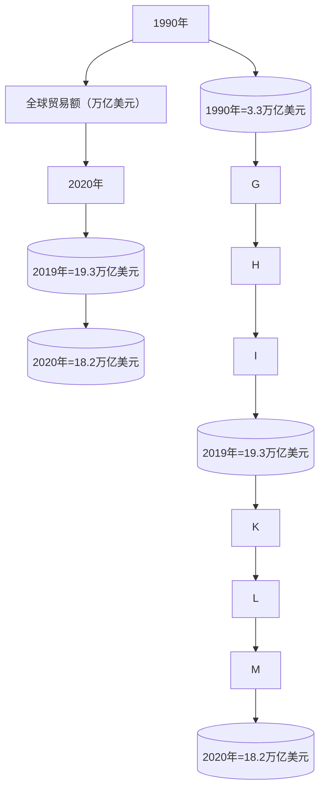
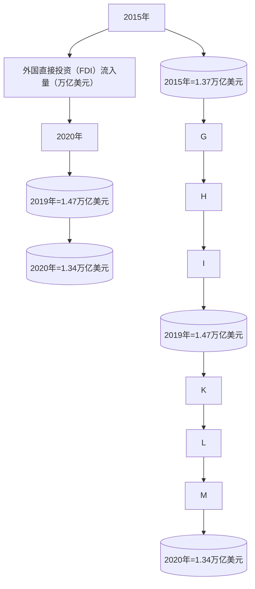
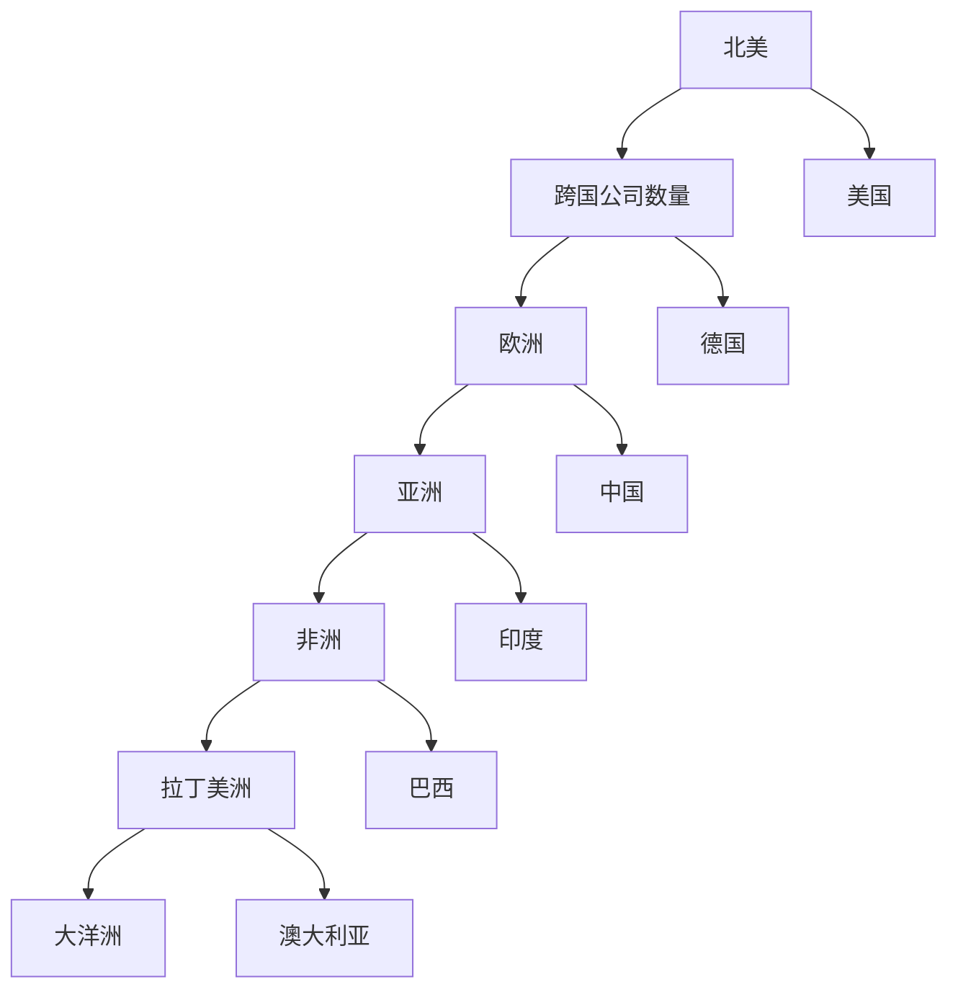

                 

## 第一部分: 引言与背景

### 1.1 引言

#### 1.1.1 逆全球化抬头的现象及其成因

逆全球化抬头的现象，是指在全球范围内出现的一种趋势，即国家或地区逐渐减少参与全球经济一体化，转而采取保护主义政策，以维护本国或地区的经济利益。这一现象在近年来尤为显著，表现为贸易保护主义、货币竞争、移民限制、技术转移限制等政策增多。

逆全球化的成因复杂多样，主要包括以下几个方面：

1. **经济因素**：全球贸易失衡、跨国公司利润回流、就业机会减少等经济问题，导致一些国家或地区民众对全球化持有抵触情绪。
2. **政治因素**：政治领袖的选举压力、民族主义情绪抬头、政治不稳定的因素，促使一些国家采取保护主义政策。
3. **社会因素**：信息传播的快速变化，使民众更加关注本国内部问题，而忽视全球性挑战。
4. **文化因素**：对本土文化的保护与传承，以及对国际文化影响的担忧，使得一些国家倾向于限制外来文化的影响。

#### 1.1.2 逆全球化对全球经济的长期影响

逆全球化的长期影响将是深远且复杂的。从正面来看，国家可以更好地保护本国产业和就业，促进内部经济发展。然而，从负面来看，逆全球化可能导致以下影响：

1. **贸易壁垒增加**：贸易保护主义政策将导致贸易壁垒增加，减少国际贸易量，影响全球供应链的稳定性。
2. **经济增长放缓**：国际贸易和投资的减少将直接影响全球经济增长速度，特别是在依赖出口和外资的发展中国家和新兴市场。
3. **跨国公司全球布局调整**：跨国公司将重新评估其全球布局，可能导致一些国家或地区的经济衰退，而其他国家则受益。
4. **国际金融体系变化**：国际货币体系和金融监管将面临挑战，可能引发金融风险和危机。

### 1.2 经济全球化的发展历程

#### 1.2.1 经济全球化的定义与特征

经济全球化是指世界各国和地区在经济领域相互联系和依赖的程度不断加深的过程。其主要特征包括：

1. **国际贸易的增长**：贸易壁垒降低，商品和服务在国际间的流动更加自由。
2. **跨国公司的崛起**：跨国公司成为全球经济活动的主要参与者，通过全球布局实现资源的优化配置。
3. **资本流动的加速**：金融市场全球化，资本可以在全球范围内自由流动，追求更高的投资回报。
4. **信息技术的发展**：信息技术的进步，尤其是互联网的普及，极大地促进了全球经济的互联互通。

#### 1.2.2 经济全球化的历史背景与发展趋势

经济全球化起源于20世纪中叶，随着二战后国际贸易体系和国际金融体系的建立，全球化进程开始加速。以下是几个关键发展阶段：

1. **战后重建与经济恢复**（1945-1970s）：战后国际贸易体系和国际货币基金组织的建立，为全球化奠定了基础。
2. **多边贸易体系的建立**（1970s-1990s）：多边贸易协定如关贸总协定（GATT）和世界贸易组织（WTO）的成立，推动了全球贸易的自由化。
3. **经济一体化进程**（1990s-2000s）：欧洲联盟等区域经济一体化组织的兴起，推动了经济区域化进程。
4. **全球价值链的形成**（2000s至今）：随着全球供应链的深化，全球价值链成为全球经济的重要组成部分。

#### 1.2.3 经济全球化与逆全球化的关系

经济全球化与逆全球化并非完全对立的关系，而是相互影响和制约的。经济全球化促进了全球经济的繁荣和互动，但也带来了不公平和风险。逆全球化则是对全球化过程中出现问题的反应，试图通过保护主义政策来纠正这些不平衡。然而，逆全球化也可能加剧全球经济的不稳定性，导致新的矛盾和冲突。因此，如何平衡全球化和保护主义，实现可持续的经济增长，是当前全球经济治理面临的重要挑战。

## 1.3 小结

本部分主要介绍了逆全球化抬头的现象及其成因，以及经济全球化的发展历程和逆全球化的关系。通过这一部分的探讨，我们可以看到逆全球化对全球经济的影响是复杂且深远的，需要从多个角度进行深入分析。

在接下来的部分中，我们将进一步探讨逆全球化对国际贸易、国际投资、跨国公司和国际金融体系的具体影响，以及各国应对这一趋势的经济政策调整。

## 第二部分: 逆全球化的经济影响

### 2.1 逆全球化对国际贸易的影响

#### 2.1.1 贸易壁垒与贸易战争

逆全球化的一个显著表现是各国贸易壁垒的增加。贸易壁垒是指一国政府为了保护本国产业而采取的一系列限制进口的措施，包括关税、配额、技术标准等。随着逆全球化趋势的加剧，许多国家开始提高关税，实施更多的非关税壁垒，这使得国际贸易环境变得更加复杂和不确定。

贸易壁垒的增加不仅限制了商品的自由流通，还可能导致贸易战争。贸易战争是指两个或多个国家为了保护本国产业而采取的一系列报复性贸易措施。例如，美国和中国之间的贸易战，美国通过提高对中国的关税来限制中国商品进口，中国则通过提高对美国商品的关税进行反击。这种贸易战对双方的经济都造成了负面影响，尤其是对消费者和企业成本的影响最为明显。

#### 2.1.2 贸易结构的变化

逆全球化还导致了贸易结构的变化。在过去，全球贸易主要依赖于垂直型分工，即一个国家的优势在于生产过程中的某个环节，其他国家则生产其他环节，通过国际贸易实现资源的最优配置。然而，随着逆全球化的发展，许多国家开始追求垂直型分工向水平型分工的转变，即一个国家希望在整个生产过程中保持独立性，减少对外部供应的依赖。

这种贸易结构的变化意味着全球价值链的重构，一些传统上依赖外国零部件或原材料的国家可能面临供应链断裂的风险。例如，美国在半导体产业上试图减少对外国零部件的依赖，这导致了全球半导体供应链的重组。同时，一些新兴市场国家则试图通过加强本土产业链来提高自给自足能力，减少对国际贸易的依赖。

#### 2.1.3 贸易流量的波动

逆全球化对贸易流量的影响也是显著的。贸易流量的波动表现为进出口额的波动和贸易伙伴的变化。一方面，由于贸易壁垒的增加，进出口额的增长速度放缓，甚至出现下降。例如，欧盟和美国之间的贸易额在2018年至2020年间出现了明显下降。

另一方面，贸易伙伴的变化也反映了逆全球化的影响。一些传统的主要贸易伙伴，如中国和欧盟，在贸易战和疫情等因素的影响下，贸易关系变得更加紧张。与此同时，一些新兴市场国家，如印度和巴西，由于其相对较低的贸易壁垒和较强的出口竞争力，逐渐成为新的贸易伙伴。

贸易流量的波动对全球经济产生了重要影响。一方面，贸易流量的减少可能导致全球经济增长放缓，影响各国的经济前景。另一方面，贸易伙伴的变化可能导致全球贸易结构的调整，一些国家可能在新的贸易伙伴中找到新的增长点。

### 2.2 逆全球化对国际投资的影响

#### 2.2.1 国际投资政策的变化

逆全球化趋势下，许多国家开始调整其国际投资政策，以保护本国产业和安全。这种调整表现为对外国直接投资（FDI）的限制和监管的加强。例如，美国和欧洲一些国家开始对关键技术和敏感行业的外国投资实施更严格的审查，以防止技术泄露和国家安全风险。

这种政策变化对国际投资产生了显著影响。一方面，限制了外国投资流入某些国家或行业，使得这些国家的经济增长和就业受到影响。另一方面，也促使跨国公司重新评估其全球投资布局，以避免面临政策风险。

#### 2.2.2 外国直接投资（FDI）的流向与波动

逆全球化趋势下，外国直接投资的流向和波动也发生了显著变化。一方面，发达国家对新兴市场的投资减少，而新兴市场国家之间的投资增加。例如，中国和印度在非洲的投资显著增长，这些国家成为新的投资热点。

另一方面，外国直接投资的波动也受到全球经济环境和政策变化的影响。例如，2020年新冠疫情爆发后，全球外国直接投资大幅下降，许多国家的投资计划被推迟或取消。随着疫情的逐步控制和各国经济的恢复，外国直接投资也逐步回升，但整体增长势头仍较缓慢。

#### 2.2.3 投资风险的评估与应对策略

逆全球化增加了国际投资的风险，包括政治风险、汇率风险和市场风险等。为了应对这些风险，投资者和企业需要采取一系列风险评估和应对策略。

1. **政治风险评估**：企业需要评估目标国家的政治稳定性、法律制度完善程度和对外国投资的态度等，以避免因政治因素导致的投资损失。
2. **汇率风险管理**：企业可以通过外汇衍生工具，如外汇远期合约和期权，对冲汇率波动带来的风险。
3. **市场风险控制**：企业需要密切关注市场变化，包括需求变化、供应链断裂等，以快速调整生产和投资策略。

此外，投资者和企业还可以通过多元化投资策略来降低风险，即在不同国家、不同行业和不同资产类别之间分散投资，以分散风险。

### 2.3 逆全球化对跨国公司的影响

#### 2.3.1 跨国公司的应对策略

逆全球化对跨国公司构成了巨大挑战，同时也提供了新的机遇。为了应对逆全球化，跨国公司采取了一系列应对策略。

1. **本地化经营**：跨国公司加强对本地市场的关注，适应不同国家的法规和文化，以减少政策风险和市场风险。
2. **供应链重组**：跨国公司重新评估其全球供应链，以减少对特定国家或地区的依赖，提高供应链的弹性和稳定性。
3. **技术创新**：跨国公司加大在新技术领域的研发投入，以提升自身的竞争力，避免被技术封锁。
4. **多元化投资**：跨国公司通过多元化投资策略，减少对单一市场或行业的依赖，降低风险。

#### 2.3.2 跨国公司全球布局的调整

逆全球化趋势下，跨国公司全球布局的调整也是不可忽视的。一些跨国公司开始减少在特定国家的投资，转而增加在其他国家的投资，以分散风险和抓住新的市场机遇。

例如，一些跨国公司将制造业从中国转移到东南亚或其他新兴市场国家，以降低成本和减少贸易壁垒的影响。同时，一些跨国公司还加大在北美和欧洲的投资，以应对这些地区的保护主义政策。

#### 2.3.3 跨国公司对东道国经济的影响

跨国公司对东道国经济的影响是双重的。一方面，跨国公司的投资和经营活动可以促进东道国经济的发展，创造就业机会，提高技术水平和生产效率。另一方面，跨国公司也可能对东道国经济带来负面影响，如资源消耗、环境污染和当地企业竞争压力等。

为了最大化跨国公司对东道国经济的积极影响，东道国政府可以采取一系列政策措施，如提供税收优惠、完善基础设施、加强职业教育和培训等。这些措施可以帮助跨国公司更好地适应本地市场，同时也促进东道国经济的可持续发展。

### 2.4 逆全球化对国际金融体系的影响

#### 2.4.1 国际货币体系的挑战

逆全球化对国际货币体系带来了新的挑战。首先，货币竞争加剧，各国为了保护本国货币地位，采取了一系列货币干预措施，如外汇干预、汇率操纵等。这导致了国际汇率体系的复杂化和不稳定。

其次，逆全球化可能导致国际货币基金组织（IMF）和世界贸易组织（WTO）等国际金融机构的权威性受到质疑，这些机构在全球经济治理中的作用减弱。

#### 2.4.2 国际金融监管的变化

逆全球化也促使国际金融监管发生重大变化。各国开始加强对金融市场的监管，以防止金融风险和危机。例如，美国实施了《多德-弗兰克法案》，加强对金融行业的监管。欧洲则加强了金融监管合作，推动建立统一的金融市场规则。

这些监管变化对跨国公司和全球金融市场产生了深远影响。一方面，严格的监管有助于提高金融市场稳定性，减少金融风险。另一方面，也增加了跨国公司的合规成本和运营难度。

#### 2.4.3 资本流动的波动与风险

逆全球化背景下，资本流动也面临波动和风险。一方面，贸易壁垒和投资限制增加了资本流动的不确定性，导致跨国投资减少。另一方面，货币竞争和汇率波动加剧了资本流动的风险。

为了应对这些风险，跨国公司和投资者需要采取一系列风险管理措施，如外汇风险管理、投资组合分散和风险对冲等。同时，国际金融监管机构也需要加强合作，共同应对全球金融风险。

### 2.5 小结

本部分详细探讨了逆全球化对国际贸易、国际投资、跨国公司和国际金融体系的深远影响。逆全球化不仅改变了全球贸易和投资的格局，也对国际金融体系提出了新的挑战。在接下来的部分中，我们将进一步探讨逆全球化背景下的国家经济政策调整，以应对这一复杂多变的经济环境。

## 第三部分: 逆全球化下的国家经济政策调整

### 3.1 政府干预与经济政策的变化

#### 3.1.1 贸易政策的调整

逆全球化背景下，各国政府纷纷调整贸易政策，以应对保护主义和贸易战的挑战。这些调整包括提高关税、实施非关税壁垒和签订双边贸易协定等。

1. **提高关税**：许多国家提高了对进口商品的海关税收，以保护本国产业。例如，美国对中国进口商品加征高额关税，导致两国之间的贸易战不断升级。
2. **实施非关税壁垒**：除了关税，各国还通过实施技术标准、环保法规等非关税壁垒限制进口。这种做法旨在提高进口商品的成本，使其难以在市场上竞争。
3. **签订双边贸易协定**：为了规避多边贸易体系的限制，各国倾向于签订双边贸易协定，以实现更优惠的贸易条件。例如，美国与墨西哥和加拿大签订了USMCA协定，取代了NAFTA。

#### 3.1.2 投资政策的调整

为了保护本国产业和就业，各国政府还加强了对外国直接投资（FDI）的监管。这些调整包括：

1. **审查外国投资**：许多国家开始对外国投资进行安全审查，以确保不涉及国家安全的技术和资产不被外国掌控。例如，美国对中国企业在美国的投资进行了严格的审查，特别是在高科技行业。
2. **限制外资比例**：一些国家限制外资在某些关键行业和领域的投资比例，以保持对国内市场的控制。例如，印度限制外国公司在电信和保险等领域的投资比例。
3. **提供税收优惠**：为了吸引外国投资，一些国家提供了税收减免和其他优惠政策，以吸引跨国公司在本国投资建厂。例如，中国和印度通过提供税收优惠，吸引了大量外国直接投资。

#### 3.1.3 财政政策的调整

逆全球化背景下，各国政府还调整了财政政策，以应对经济不确定性和保护本国经济。这些调整包括：

1. **增加政府支出**：为了刺激经济增长和就业，政府增加了基础设施建设和公共服务的投入。例如，美国实施了大规模的基础设施建设计划，以促进经济增长。
2. **减税**：为了鼓励企业和个人投资和消费，许多国家实施了减税政策。例如，英国和澳大利亚通过减税措施，刺激了经济增长。
3. **债务管理**：逆全球化可能导致政府债务增加，因此各国政府加强了债务管理，以避免债务危机。例如，日本通过实施财政紧缩政策，试图控制债务水平。

### 3.2 区域经济一体化与双边经济合作

#### 3.2.1 区域经济一体化的现状与挑战

逆全球化趋势下，区域经济一体化成为各国应对全球经济不确定性的重要手段。然而，区域经济一体化也面临诸多挑战。

1. **经济互补性**：区域经济一体化要求成员国之间存在较强的经济互补性，以实现资源的最优配置。然而，一些区域经济一体化组织，如欧盟，成员国之间的经济互补性并不强，导致一体化进程缓慢。
2. **政治意愿**：区域经济一体化需要成员国之间的政治意愿和合作，然而，一些国家可能因国内政治压力或民族主义情绪而拒绝参与一体化进程。
3. **法律框架**：区域经济一体化需要建立一套统一的法律框架，以规范成员国之间的贸易和投资。然而，不同国家之间的法律体系和政策差异，使得建立统一的法律框架变得复杂和困难。

#### 3.2.2 双边经济合作的机遇与挑战

除了区域经济一体化，双边经济合作也成为各国应对逆全球化的重要手段。双边经济合作可以通过签订双边贸易协定和投资协定，实现两国之间的贸易自由化和投资便利化。

1. **机遇**：双边经济合作可以带来以下机遇：
   - 扩大贸易和投资规模：通过双边贸易协定和投资协定，两国可以扩大贸易和投资规模，实现互利共赢。
   - 提高市场准入：双边经济合作可以提高市场准入水平，降低贸易壁垒，为两国企业提供更广阔的市场空间。
   - 技术交流与合作：双边经济合作可以促进技术交流与合作，提高两国企业的技术水平和创新能力。
2. **挑战**：双边经济合作也面临以下挑战：
   - 政治风险：双边经济合作可能受到两国政治关系的影响，政治不稳定可能导致合作中断。
   - 法律和制度差异：不同国家的法律体系和制度差异，可能对双边经济合作产生阻碍。
   - 文化差异：不同国家的文化差异，可能影响两国之间的交流和合作。

#### 3.2.3 区域经济一体化的未来发展趋势

尽管逆全球化趋势下，区域经济一体化面临诸多挑战，但未来仍有望发展。以下是一些可能的发展趋势：

1. **多元化区域经济一体化**：为了应对逆全球化，区域经济一体化可能会向多元化方向发展，即不仅仅局限于经济一体化，还涵盖政治、安全、文化等多领域的合作。
2. **小区域经济一体化**：为了提高一体化的效率和灵活性，一些国家可能会选择建立小区域经济一体化组织，如亚太经济一体化组织。
3. **数字化转型**：随着数字技术的快速发展，区域经济一体化可能会向数字化转型，通过数字平台实现贸易和投资的便利化。
4. **绿色经济一体化**：面对全球环境问题，区域经济一体化可能会向绿色经济一体化方向发展，通过合作推动环保技术和绿色产业的发展。

### 3.3 数字经济与全球价值链重构

#### 3.3.1 数字经济的崛起

数字经济是指基于数字技术，特别是互联网和大数据的应用，实现经济活动的创新和发展的经济形态。随着数字技术的快速发展，数字经济已经成为全球经济的重要组成部分。

1. **数字技术的应用**：数字经济的发展离不开互联网、大数据、人工智能等数字技术的应用。这些技术不仅提高了生产效率和创新能力，也改变了传统的商业模式和产业形态。
2. **数字经济的特点**：数字经济具有高效率、低能耗、全球互联等特点，能够实现资源的优化配置，推动经济的可持续发展。

#### 3.3.2 全球价值链的重构

全球价值链是指产品或服务从设计、生产、分销到最终消费的全过程，涉及多个国家和地区的企业和机构。逆全球化背景下，全球价值链面临重构的压力。

1. **供应链重组**：为了降低贸易壁垒和供应链风险，许多跨国公司开始调整其全球供应链，将部分生产环节从低成本的海外地区转移到高成本的本地地区。
2. **产业链整合**：全球价值链的重构也促使企业加强产业链的整合，提高产业链的弹性和竞争力。
3. **区域价值链**：在逆全球化背景下，区域经济一体化和数字经济的发展，将推动区域价值链的形成，即产品或服务的生产环节主要集中在一个或几个区域内，实现更高效和灵活的运营。

#### 3.3.3 数字经济对传统经济的影响

数字经济对传统经济产生了深远的影响，表现为：

1. **产业变革**：数字经济推动了传统产业的升级和转型，如制造业、服务业等，通过数字化技术提高生产效率和创新能力。
2. **商业模式创新**：数字经济改变了传统的商业模式，如电子商务、共享经济等，为消费者提供了更便捷的购物和生活方式。
3. **经济结构优化**：数字经济的发展，推动了经济结构的优化，提高了经济的创新能力和竞争力。

### 3.4 小结

本部分详细探讨了逆全球化背景下，国家经济政策调整的各个方面，包括贸易政策、投资政策、财政政策等。同时，还分析了区域经济一体化、双边经济合作、数字经济与全球价值链重构的机遇与挑战。在接下来的部分中，我们将进一步探讨逆全球化下的经济风险管理，以及跨国公司和投资者如何应对这些风险。

## 第四部分: 逆全球化下的经济风险管理

### 4.1 全球经济风险分析

#### 4.1.1 经济风险的类型与特征

在逆全球化的背景下，全球经济面临多种类型的风险，这些风险的特征和影响各异，主要包括以下几个方面：

1. **贸易风险**：由于贸易壁垒的增加和贸易战的加剧，贸易风险成为全球经济的主要威胁之一。贸易风险主要体现在贸易量下降、供应链中断和贸易伙伴关系恶化等方面。
   
2. **货币风险**：货币风险主要源于汇率波动和货币竞争。在逆全球化背景下，各国为了保护本国货币地位，可能采取货币干预政策，导致汇率波动加剧。此外，货币竞争可能导致货币贬值，从而引发通货膨胀和资本外流。

3. **投资风险**：逆全球化导致国际投资环境的不确定性增加，投资风险也随之上升。投资风险包括政治风险、汇率风险和市场风险。政治风险主要体现在外国投资可能受到东道国政府的限制或审查；汇率风险则由于货币波动可能影响投资回报；市场风险则源于市场需求的变化和全球经济的不确定性。

4. **金融风险**：金融风险在逆全球化背景下尤为突出。金融风险主要包括银行危机、债务风险和金融市场波动。银行危机可能由银行体系内的风险传染导致；债务风险则源于政府和企业债务水平的不断上升；金融市场波动则可能引发金融危机。

#### 4.1.2 经济风险监测与预警系统

为了有效应对经济风险，建立经济风险监测与预警系统至关重要。以下是一些关键措施：

1. **监测指标**：建立一套全面的监测指标体系，包括贸易指标、货币指标、投资指标和金融指标等，以实时监控全球经济的运行状况。

2. **数据来源**：整合来自国际组织、各国政府和市场机构的数据，确保数据的准确性和及时性。

3. **预警模型**：运用大数据分析和人工智能技术，建立经济风险预警模型，对潜在风险进行早期识别和预测。

4. **预警机制**：建立高效的预警机制，一旦监测到潜在风险，立即采取相应的应对措施，包括政策调整、风险控制和企业预警等。

#### 4.1.3 经济风险应对策略

针对不同类型的经济风险，可以采取以下应对策略：

1. **贸易风险应对**：
   - 多元化市场：减少对单一市场的依赖，开拓新的出口市场。
   - 贸易协定：积极参与双边或多边贸易协定，争取更优惠的贸易条件。
   - 贸易政策调整：灵活调整贸易政策，应对贸易壁垒的增加。

2. **货币风险应对**：
   - 汇率风险管理：利用衍生工具如远期合约、期权等对冲汇率风险。
   - 本币稳定：通过货币政策调控，保持本币汇率稳定，避免过度波动。

3. **投资风险应对**：
   - 风险评估：对外国投资进行全面风险评估，确保投资安全。
   - 投资多元化：分散投资地域和行业，降低单一投资的风险。
   - 政策支持：提供税收优惠、投资保障等政策支持，吸引外国直接投资。

4. **金融风险应对**：
   - 金融监管：加强金融监管，防范银行危机和金融市场波动。
   - 财务稳健：保持财务稳健，降低债务水平，提高抗风险能力。
   - 应急准备：建立紧急应对机制，应对突发的金融风险事件。

### 4.2 跨国公司的风险管理

#### 4.2.1 跨国公司风险管理的框架

跨国公司在全球运营过程中，需要建立一套有效的风险管理框架，以应对各种经济风险。以下是一个典型的跨国公司风险管理框架：

1. **风险评估**：通过全面的风险评估，识别和分析跨国公司在全球运营中可能面临的各种风险，包括市场风险、财务风险、运营风险和法律风险等。

2. **风险识别**：利用风险评估结果，进一步识别具体的风险点，包括关键市场、关键业务、关键人员和关键资产等。

3. **风险分析**：对识别出的风险进行深入分析，评估其可能的影响和发生的概率，为制定风险应对策略提供依据。

4. **风险应对**：根据风险分析的结果，制定相应的风险应对策略，包括风险规避、风险转移、风险接受和风险降低等。

5. **风险监控**：建立风险监控机制，对已识别的风险进行实时监控，确保风险应对措施的有效实施。

#### 4.2.2 跨国公司的风险识别与评估

在跨国公司的风险管理过程中，风险识别与评估是关键环节。以下是一些具体的方法：

1. **财务分析**：通过财务报表和财务指标，分析跨国公司的财务状况，识别潜在的财务风险。

2. **市场研究**：通过对市场环境的深入研究，识别市场变化和竞争态势，评估市场风险。

3. **业务流程分析**：通过对业务流程的审查，识别运营过程中的潜在风险。

4. **法律审查**：通过法律专业人士的审查，识别可能涉及的法律风险。

5. **外部咨询**：借助外部咨询机构的专业分析，评估跨国公司的运营风险和外部环境变化。

#### 4.2.3 跨国公司的风险应对与控制

在风险识别与评估的基础上，跨国公司需要采取有效的风险应对与控制措施。以下是一些具体的方法：

1. **风险规避**：通过调整业务战略，避免风险发生。例如，减少对高风险市场的投资。

2. **风险转移**：通过购买保险、签订合同等方式，将风险转移给第三方。例如，跨国公司可以通过购买商业保险来规避贸易风险。

3. **风险接受**：对于无法规避或转移的风险，跨国公司可以采取接受策略，通过制定应急预案，确保在风险发生时能够迅速应对。

4. **风险降低**：通过改进管理和运营流程，降低风险发生的概率和影响。例如，跨国公司可以通过提高供应链的透明度和灵活性，降低供应链中断的风险。

5. **风险监控与报告**：建立风险监控与报告机制，定期评估风险应对措施的有效性，确保风险管理的持续改进。

### 4.3 国际金融风险管理

#### 4.3.1 国际金融风险的主要来源

国际金融风险主要包括以下几个方面：

1. **汇率风险**：由于汇率波动，可能导致跨国公司的外汇收入和支出发生变动，影响其财务状况。

2. **利率风险**：利率波动可能导致跨国公司的借款成本发生变化，影响其资金成本和投资回报。

3. **金融市场风险**：金融市场波动可能导致跨国公司持有的金融资产价值下降，影响其财务状况。

4. **信用风险**：由于客户或合作伙伴的违约，可能导致跨国公司无法收回应收账款或遭受损失。

5. **流动性风险**：跨国公司可能面临因资金流动性不足而无法及时偿还债务的风险。

#### 4.3.2 国际金融风险管理工具与方法

为了有效管理国际金融风险，跨国公司可以采取以下工具和方法：

1. **外汇风险管理**：
   - **远期合约**：通过签订远期合约，锁定未来的汇率，避免汇率波动带来的影响。
   - **期权**：通过购买外汇期权，限制汇率波动带来的损失。

2. **利率风险管理**：
   - **利率互换**：通过利率互换，将固定利率债务转换为浮动利率债务，或反之，以降低利率波动带来的影响。
   - **利率期权**：通过购买利率期权，对冲利率波动带来的风险。

3. **金融市场风险管理**：
   - **多元化投资**：通过多元化投资组合，降低单一金融资产波动带来的影响。
   - **风险对冲**：通过购买金融衍生品，如期货、期权等，对冲市场风险。

4. **信用风险管理**：
   - **信用保险**：通过购买信用保险，降低客户违约带来的损失。
   - **信用评估**：对客户和合作伙伴进行全面的信用评估，降低信用风险。

5. **流动性风险管理**：
   - **现金流量管理**：通过合理的现金流量管理，确保资金流动性。
   - **应急资金**：建立应急资金储备，以应对突发的流动性需求。

#### 4.3.3 国际金融风险管理的案例分析

以下是一个国际金融风险管理的实际案例：

**案例背景**：一家跨国公司计划在未来6个月从美国进口一批高科技产品，金额为1000万美元。该公司面临的主要风险是汇率风险，因为美元对人民币的汇率可能在6个月内发生大幅波动。

**解决方案**：
1. **外汇远期合约**：该公司与美国银行签订了一份外汇远期合约，约定在未来6个月以当前的汇率（1美元=6.5人民币）购买1000万美元。这样，无论汇率如何变化，该公司都可以以固定汇率购买美元，避免了汇率波动带来的影响。

2. **利率互换**：该公司还与一家银行签订了利率互换协议，将固定利率债务转换为浮动利率债务。这样，如果利率上升，该公司可以减少利息支出，降低了利率风险。

3. **金融市场风险对冲**：该公司通过购买股指期货和外汇期权，对冲市场波动带来的风险。例如，该公司购买了美元/人民币的期权，如果汇率上涨，该公司可以选择执行期权，以锁定汇率。

通过这些风险管理措施，该跨国公司有效地对冲了汇率和利率风险，确保了未来6个月的财务稳定性。

### 4.4 小结

本部分详细探讨了逆全球化背景下，全球经济风险的分析、跨国公司的风险管理框架和策略，以及国际金融风险管理的工具和方法。通过有效的风险管理，跨国公司和投资者可以更好地应对逆全球化带来的挑战，确保其在全球市场的稳健发展。

在接下来的部分中，我们将对逆全球化背景下的全球经济展望，提出政策建议，以促进全球经济稳定和可持续发展。

## 第五部分: 未来展望与政策建议

### 5.1 逆全球化背景下的全球经济展望

#### 5.1.1 全球经济趋势分析

在逆全球化的背景下，全球经济面临诸多不确定性。以下是一些关键的经济趋势：

1. **贸易摩擦加剧**：随着各国保护主义政策的增加，贸易摩擦可能会进一步加剧。这种摩擦不仅影响贸易量的增长，还会对全球供应链和产业链造成冲击。

2. **经济全球化放缓**：逆全球化趋势导致经济全球化进程放缓。跨国公司可能减少对外直接投资，全球价值链的重构可能导致生产环节的本土化。

3. **数字经济崛起**：数字经济的发展趋势不可逆转。尽管逆全球化可能导致某些国家或地区减少对外合作，但全球数字经济的发展仍然是一个重要的推动力。

4. **经济区域化**：在逆全球化的背景下，经济区域化趋势可能会加强。各国可能会通过区域经济一体化组织，寻求更稳定的经济发展环境。

#### 5.1.2 全球经济变动的潜在影响

全球经济变动将对不同国家和地区产生不同的影响：

1. **发达国家**：发达国家由于拥有强大的经济基础和先进的技术，可能会在一定程度上抵御逆全球化的冲击。然而，保护主义政策可能会导致贸易成本上升，影响经济增长。

2. **发展中国家**：发展中国家和新兴市场国家可能面临更大的挑战。贸易壁垒的增加和外资流动的减少，可能导致这些国家的经济增长放缓，就业压力加大。

3. **全球产业链重构**：全球产业链的重构将对跨国公司和国际投资产生重大影响。一些跨国公司可能将生产环节从低成本地区转移到高成本地区，以降低贸易壁垒带来的风险。

4. **数字经济带来的机遇**：数字经济的发展为发展中国家和新兴市场国家提供了新的发展机遇。通过加强数字基础设施建设，提高数字技术能力，这些国家可以抓住数字经济的红利，实现经济转型升级。

#### 5.1.3 全球经济稳定的政策建议

为了应对逆全球化带来的挑战，实现全球经济稳定，以下是一些建议：

1. **加强国际合作**：在全球经济面临不确定性的情况下，各国应加强国际合作，通过多边机制和区域合作，共同应对全球经济挑战。

2. **推动经济区域化**：通过加强区域经济一体化，实现区域内资源的优化配置和市场的互通互联，为经济发展提供稳定环境。

3. **促进技术创新**：加大对科技研发的投入，推动数字经济和绿色经济发展，提升国家的创新能力和竞争力。

4. **完善国际金融体系**：加强国际金融监管合作，完善国际金融体系，降低全球金融风险。

5. **优化贸易政策**：在保护本国产业的同时，优化贸易政策，通过多边和双边贸易协定，实现贸易自由化和便利化。

### 5.2 国际合作与经济治理

#### 5.2.1 国际合作的重要性

国际合作在全球经济治理中扮演着至关重要的角色。以下是一些关键方面的国际合作：

1. **贸易合作**：通过多边和双边贸易协定，减少贸易壁垒，促进贸易自由化和便利化。

2. **投资合作**：加强跨国投资合作，提供有吸引力的投资环境，促进外国直接投资流入。

3. **金融合作**：通过国际金融合作，稳定国际金融市场，降低金融风险。

4. **技术合作**：加强技术合作，推动技术创新和知识共享，提高全球生产力和竞争力。

#### 5.2.2 国际经济治理的挑战与机遇

国际经济治理面临以下挑战和机遇：

1. **挑战**：
   - **政治不确定性**：政治因素可能导致国际合作中断，影响全球经济治理的有效性。
   - **经济利益冲突**：各国在贸易和投资方面的利益冲突，可能导致国际经济治理的难度增加。
   - **数字经济的治理**：数字经济的快速发展带来了新的治理挑战，如何制定有效的数字治理规则成为国际经济治理的重要议题。

2. **机遇**：
   - **可持续发展**：通过国际合作，推动绿色经济发展，实现可持续发展目标。
   - **技术创新**：通过国际合作，推动技术创新，提升全球生产力。
   - **全球价值链重构**：通过国际合作，实现全球价值链的重构，提高全球经济的弹性和竞争力。

#### 5.2.3 国际经济治理的政策建议

为了有效应对国际经济治理的挑战，以下是一些建议：

1. **加强多边合作**：通过多边机制，如联合国、世界贸易组织等，加强国际合作，共同应对全球性经济问题。

2. **推动区域经济一体化**：通过区域经济一体化，实现区域内的资源优化配置和市场互通互联，为全球经济治理提供有力支撑。

3. **建立数字治理机制**：针对数字经济的发展，建立有效的数字治理机制，制定全球数字治理规则。

4. **促进科技创新合作**：加强科技创新合作，推动全球科技交流和知识共享。

5. **完善国际金融治理**：加强国际金融合作，完善国际金融体系，提高金融监管的有效性。

### 5.3 发展中国家与新兴市场的应对策略

#### 5.3.1 发展中国家面临的挑战

发展中国家在应对逆全球化过程中面临以下挑战：

1. **贸易壁垒增加**：贸易壁垒的增加可能影响发展中国家的出口，导致经济增长放缓。

2. **外资流入减少**：由于逆全球化趋势，跨国公司可能减少对外直接投资，导致发展中国家外资流入减少。

3. **经济结构调整**：逆全球化要求发展中国家进行经济结构调整，以适应全球经济的变动。

#### 5.3.2 新兴市场的机遇与挑战

新兴市场在逆全球化背景下也面临新的机遇和挑战：

1. **机遇**：
   - **内需扩大**：随着经济发展和消费升级，新兴市场的内需不断扩大，为国内企业提供了广阔的市场空间。
   - **技术创新**：新兴市场国家可以借助数字技术和绿色发展，实现产业升级和转型。

2. **挑战**：
   - **政策调整**：新兴市场国家需要调整政策，以应对全球经济的变动和贸易壁垒的增加。
   - **基础设施短板**：基础设施的不足可能制约新兴市场国家的发展，影响其吸引外资的能力。

#### 5.3.3 发展中国家与新兴市场的政策建议

为了有效应对逆全球化的挑战，发展中国家与新兴市场可以采取以下策略：

1. **加强区域合作**：通过加强区域经济一体化，实现资源共享和市场互通互联，提高整体竞争力。

2. **推动产业升级**：加大对技术创新和绿色发展的支持，推动产业升级和转型。

3. **优化投资环境**：提供有吸引力的投资环境，吸引外国直接投资流入。

4. **加强人才培养**：加强职业教育和高等教育，培养适应数字经济和全球化需求的人才。

5. **积极参与全球治理**：通过积极参与国际经济治理，争取更多的话语权和影响力。

### 5.4 小结

本部分对逆全球化背景下的全球经济展望进行了分析，提出了国际合作与经济治理的政策建议，以及发展中国家与新兴市场的应对策略。在逆全球化的背景下，通过有效的政策调整和国际合作，全球经济可以实现稳定和可持续发展。

## 附录

### 附录 A: 相关数据与图表

#### A.1 全球贸易数据

**图表 A.1 全球贸易额趋势（1990-2020）**

#### A.2 国际投资数据

**图表 A.2 外国直接投资（FDI）流入量趋势（2015-2020）**

#### A.3 跨国公司分布图

**图表 A.3 跨国公司全球分布（2020）**

### 附录 B: 参考文献

**B.1 引用文献**

1. 世界银行. (2021). 全球经济展望报告.
2. 国际货币基金组织. (2020). 世界经济展望.
3. Peterson Institute for International Economics. (2021). The Globalization of Business.
4. The World Trade Organization. (2020). World Trade Report.
5. Harvard Business Review. (2021). The Future of Globalization.

**B.2 推荐阅读**

1. Feldstein, M. (2018). The Fight Against Globalization.
2. Rodrik, D. (2018). Populism and the Economics of Globalization.
3. McChesney, R. (2018). Digital Capitalism: limitless capitalism in the digital age.
4. Stiglitz, J. (2018). People, Power, and Profits: Progressive Capitalism for an Age of Discontent.
5. Autor, D. (2019). The Future of Work: Automation, Jobs, and the Economy.

通过以上数据和文献的支持，我们可以更全面地理解逆全球化对全球经济的影响，以及如何应对这一复杂的经济环境。

