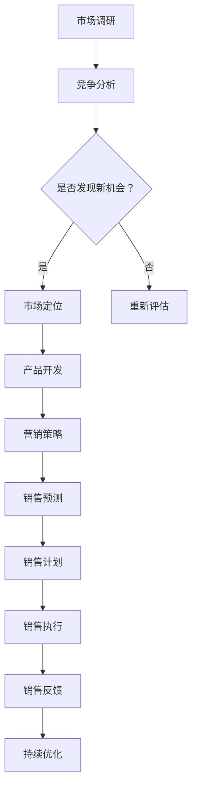

                 

### 引言：销售和营销的演变

销售和营销，作为商业活动中不可或缺的两个环节，随着科技的进步和社会的发展，经历了数次重大的演变。从最初的面对面推销，到后来的电话销售、广告营销，再到如今的数字化营销，每一次的变革都带来了全新的商业模式和市场机遇。

#### 销售和营销的基本概念与历史演变

销售（Sales）是指通过商品或服务的交换获取利润的过程，主要目的是满足消费者的需求并实现企业的经营目标。营销（Marketing）则是更广泛的商业活动，包括市场调研、产品定位、推广策略等，旨在识别并满足消费者的需求，从而实现企业的盈利。

在历史的长河中，销售和营销的方式不断演变。早期的销售主要依赖于人际关系和口碑传播，随着工业革命的到来，大规模生产使广告成为主要的销售手段。20世纪中叶，市场营销理论的出现，推动了市场调研和消费者行为的深入研究，企业开始更加注重市场细分和目标客户的选择。

#### LLM在销售和营销中的应用背景

近年来，随着人工智能技术的快速发展，语言模型（LLM，Language Model）逐渐成为销售和营销领域的重要工具。LLM是基于深度学习技术构建的大型神经网络模型，能够对自然语言进行处理和分析，从而实现自然语言生成、情感分析、对话系统等功能。

在销售和营销中，LLM的应用背景主要源于以下几个方面：

1. **个性化服务**：LLM能够根据用户的历史数据和偏好，提供个性化的推荐和服务，从而提升用户体验和满意度。
2. **市场调研**：LLM可以通过分析大量的市场数据，识别潜在的市场机会和消费者需求，帮助企业制定更精准的市场策略。
3. **内容生成**：LLM可以自动生成广告文案、产品描述等营销内容，节省人力成本并提高内容质量。
4. **自动化营销**：LLM可以构建智能客服系统，实现与客户的实时互动，提高销售转化率。

#### 本书目标与结构安排

本书旨在深入探讨LLM在销售和营销中的应用，帮助读者理解这一前沿技术的核心概念、应用场景和实施策略。全书共分为17章，结构安排如下：

- **第1章 引言**：介绍销售和营销的基本概念及LLM的应用背景。
- **第2章 LLM基础**：详细讲解LLM的定义、原理和常见架构。
- **第3章 LLM增强的销售策略**：分析LLM在市场调研、客户行为分析、销售预测和策略优化中的应用。
- **第4章 LLM增强的营销策略**：探讨LLM在品牌定位、内容营销、广告投放和效果监测中的应用。
- **第5章 LLM与客户关系管理**：研究LLM在客户识别、互动和满意度管理中的应用。
- **第6章 LLM在跨渠道营销整合中的应用**：分析LLM在多渠道数据整合和个性化营销中的应用。
- **第7章 LLM在销售和营销中的实施与挑战**：讨论LLM的实施策略、伦理问题和未来趋势。
- **第8章 案例分析**：通过实际案例展示LLM在销售和营销中的成功应用。
- **第9章 附录**：提供技术资源与工具。
- **第10章 LLM流程图**：绘制销售与营销的关键流程图。
- **第11章 LLM算法伪代码**：详细阐述LLM算法的实现过程。
- **第12章 数学模型与公式**：介绍关键数学模型和公式。
- **第13章 项目实战**：提供实际代码案例和实现细节。
- **第14章 开发环境与工具介绍**：介绍开发环境、LLM框架和数据处理工具。
- **第15章 代码解读与分析**：深入解读关键代码段。
- **第16章 销售与营销伦理与隐私**：探讨伦理问题和隐私保护。
- **第17章 未来展望与趋势**：展望LLM在销售和营销中的发展前景。

通过本书的深入探讨，读者将能够全面了解LLM在销售和营销中的应用，掌握其核心技术和实战策略，为企业的数字化转型提供有力支持。

---

### 第1章 引言：销售和营销的演变

随着数字技术的迅猛发展，传统的销售和营销模式正在经历深刻的变革。本章旨在探讨销售和营销的基本概念、历史演变以及LLM在其中的应用背景，并简要介绍本书的目标与结构安排。

#### 销售和营销的基本概念

销售（Sales）是商业活动中将产品或服务转换成收入的过程。其主要目标是识别潜在客户，建立信任关系，最终促成交易。销售活动通常涉及市场调研、客户分析、定价策略、销售执行和售后服务等环节。

营销（Marketing），则是一个更为广泛的商业活动，其目的是通过了解和满足消费者的需求，实现企业的长期盈利。营销活动包括市场调研、产品开发、品牌定位、推广策略、渠道管理、客户关系管理等环节。

在商业活动中，销售和营销紧密相连，销售是实现营销目标的手段，而营销则是为销售提供战略方向和市场环境。两者的共同目标都是满足消费者的需求，提升企业的市场竞争力。

#### 销售和营销的历史演变

销售和营销的历史可以追溯到古代，但现代销售和营销的概念主要起源于20世纪。

- **早期销售**：在工业革命之前，销售活动主要依赖于人与人之间的直接交流和口碑传播。销售人员通过拜访潜在客户，面对面推销产品。

- **工业化时代的销售**：随着工业革命的到来，生产和销售规模大幅扩大。广告成为主要的销售手段，企业开始通过媒体向广大消费者宣传产品。

- **市场营销理论的出现**：20世纪中叶，市场营销理论的出现标志着销售和营销活动的科学化。企业开始重视市场调研和消费者行为分析，制定更精准的市场策略。

- **数字化销售和营销**：进入21世纪，互联网和数字技术的普及，使得销售和营销活动进一步数字化。电子商务、社交媒体、大数据分析等技术手段成为企业的重要工具。

#### LLM在销售和营销中的应用背景

语言模型（LLM，Language Model）是近年来人工智能领域的重要突破。LLM是一种能够对自然语言进行理解和生成的模型，其应用范围广泛，包括机器翻译、文本生成、对话系统等。

在销售和营销领域，LLM的应用背景主要源于以下几个方面：

1. **个性化服务**：LLM可以根据用户的历史数据和偏好，提供个性化的推荐和服务，从而提升用户体验和满意度。

2. **市场调研**：LLM可以通过分析大量的市场数据，识别潜在的市场机会和消费者需求，帮助企业制定更精准的市场策略。

3. **内容生成**：LLM可以自动生成广告文案、产品描述等营销内容，节省人力成本并提高内容质量。

4. **自动化营销**：LLM可以构建智能客服系统，实现与客户的实时互动，提高销售转化率。

#### 本书目标与结构安排

本书的目标是深入探讨LLM在销售和营销中的应用，帮助读者理解这一前沿技术的核心概念、应用场景和实施策略。全书共分为17章，具体结构如下：

- **第1章 引言**：介绍销售和营销的基本概念及LLM的应用背景。

- **第2章 LLM基础**：详细讲解LLM的定义、原理和常见架构。

- **第3章 LLM增强的销售策略**：分析LLM在市场调研、客户行为分析、销售预测和策略优化中的应用。

- **第4章 LLM增强的营销策略**：探讨LLM在品牌定位、内容营销、广告投放和效果监测中的应用。

- **第5章 LLM与客户关系管理**：研究LLM在客户识别、互动和满意度管理中的应用。

- **第6章 LLM在跨渠道营销整合中的应用**：分析LLM在多渠道数据整合和个性化营销中的应用。

- **第7章 LLM在销售和营销中的实施与挑战**：讨论LLM的实施策略、伦理问题和未来趋势。

- **第8章 案例分析**：通过实际案例展示LLM在销售和营销中的成功应用。

- **第9章 附录**：提供技术资源与工具。

- **第10章 LLM流程图**：绘制销售与营销的关键流程图。

- **第11章 LLM算法伪代码**：详细阐述LLM算法的实现过程。

- **第12章 数学模型与公式**：介绍关键数学模型和公式。

- **第13章 项目实战**：提供实际代码案例和实现细节。

- **第14章 开发环境与工具介绍**：介绍开发环境、LLM框架和数据处理工具。

- **第15章 代码解读与分析**：深入解读关键代码段。

- **第16章 销售与营销伦理与隐私**：探讨伦理问题和隐私保护。

- **第17章 未来展望与趋势**：展望LLM在销售和营销中的发展前景。

通过本书的深入探讨，读者将能够全面了解LLM在销售和营销中的应用，掌握其核心技术和实战策略，为企业的数字化转型提供有力支持。

---

### 第2章 LLM基础：模型、算法与应用

语言模型（Language Model，简称LLM）是近年来人工智能领域的一项重大突破，其在自然语言处理（Natural Language Processing，简称NLP）中发挥了至关重要的作用。本章将详细介绍LLM的基本概念、主要算法以及在实际销售和营销中的应用。

#### 语言模型的定义与原理

语言模型是能够对自然语言文本进行建模的算法，其目标是预测下一个单词或字符的概率分布。在LLM中，输入的文本序列被编码为向量表示，然后通过神经网络模型进行预测。

LLM的核心原理是通过对大量文本数据进行预训练，学习语言的基本规律和模式。预训练后，LLM可以用于各种NLP任务，如文本分类、命名实体识别、机器翻译、文本生成等。

#### 常见LLM架构与算法

目前，常见的LLM架构主要包括循环神经网络（RNN）、长短期记忆网络（LSTM）、门控循环单元（GRU）以及Transformer等。

1. **循环神经网络（RNN）**

RNN是早期的LLM模型，其核心思想是利用隐藏状态保留信息。然而，RNN在处理长距离依赖问题时存在梯度消失或爆炸的问题。

2. **长短期记忆网络（LSTM）**

LSTM是RNN的改进版本，通过引入门控机制，有效解决了梯度消失问题。LSTM在处理长序列数据和长距离依赖时表现出色，但其计算复杂度较高。

3. **门控循环单元（GRU）**

GRU是LSTM的简化版，通过合并输入门和遗忘门，降低了计算复杂度。GRU在保留长距离依赖信息的同时，提高了计算效率。

4. **Transformer**

Transformer是近年来提出的全新架构，其核心思想是利用自注意力机制（Self-Attention）处理长序列数据。Transformer在BERT等模型中得到了广泛应用，其在处理长文本、长距离依赖和并行计算方面表现出色。

#### LLM在销售和营销中的应用案例

LLM在销售和营销中具有广泛的应用，以下是一些典型的应用案例：

1. **个性化服务**

通过LLM，企业可以了解客户的偏好和需求，提供个性化的推荐和服务。例如，电商平台可以根据用户的浏览记录和购买历史，自动生成个性化的产品推荐。

2. **市场调研**

LLM可以分析大量的市场数据，帮助企业识别潜在的市场机会和消费者需求。例如，企业可以通过分析社交媒体上的用户评论和讨论，了解产品的市场反馈和消费者需求。

3. **内容生成**

LLM可以自动生成各种营销内容，如广告文案、产品描述、新闻稿等。例如，一些企业使用LLM生成新闻稿，节省了人工撰写的时间和成本。

4. **自动化营销**

LLM可以构建智能客服系统，实现与客户的实时互动，提高销售转化率。例如，一些电商企业使用基于LLM的智能客服系统，为客户提供在线咨询和购买建议。

#### 总结

LLM作为一种强大的自然语言处理工具，在销售和营销中具有广泛的应用前景。通过本章的介绍，读者可以初步了解LLM的基本概念、常见架构和实际应用案例。在接下来的章节中，我们将进一步探讨LLM在销售和营销中的具体应用，包括市场调研、客户行为分析、销售预测和策略优化等方面。

---

### 第3章 LLM增强的销售策略

随着人工智能技术的不断进步，语言模型（LLM）在销售领域的应用也越来越广泛。本章将详细讨论LLM在市场调研、客户行为分析、销售预测和策略优化中的应用，以帮助企业和销售人员更有效地制定和执行销售策略。

#### LLM在市场调研中的应用

市场调研是销售策略制定的重要基础。传统的市场调研方法通常依赖于问卷调查、访谈和数据分析等手段，这些方法虽然能够获取一定的信息，但往往费时费力且结果可能不够准确。

LLM在市场调研中的应用，主要是通过分析和处理大量文本数据，从社交媒体、新闻报道、用户评论等渠道中提取有价值的信息。以下是一些具体的应用案例：

1. **舆情监控**

LLM可以实时监控社交媒体上的用户讨论，分析消费者对产品或品牌的情感倾向和态度。通过舆情监控，企业可以及时了解市场动态和消费者需求，从而调整营销策略。

2. **市场趋势分析**

LLM可以分析大量的新闻报道、市场报告和学术论文，识别出当前市场的热门话题和趋势。这些信息有助于企业发现潜在的市场机会，制定更具前瞻性的销售策略。

3. **竞争对手分析**

LLM可以自动分析竞争对手的营销策略、产品定位和市场份额，帮助企业制定针对性的竞争策略。通过对比分析，企业可以发现自身的优势和劣势，优化销售策略。

#### LLM在客户行为分析中的应用

了解客户行为是制定有效销售策略的关键。传统的方法通常包括客户调研、行为追踪和数据分析等。然而，这些方法在处理大规模数据时往往效率低下。

LLM在客户行为分析中的应用，主要是通过自然语言处理技术，从客户的文本数据中提取有价值的信息。以下是一些具体的应用案例：

1. **客户细分**

LLM可以通过分析客户的购买历史、浏览行为和社交媒体互动等数据，将客户进行精准的细分。这种细分有助于企业更好地了解不同客户群体的需求和偏好，从而制定更个性化的销售策略。

2. **客户互动**

LLM可以构建智能客服系统，与客户进行实时互动，解答客户疑问，提供购买建议。通过自然语言生成技术，LLM可以生成个性化的回复，提高客户满意度和忠诚度。

3. **客户满意度分析**

LLM可以分析客户反馈和评论，识别出客户对产品或服务的满意度和不满意点。这些信息有助于企业发现产品和服务中的问题，从而进行改进。

#### LLM在销售预测与策略优化中的应用

销售预测是企业制定销售策略的重要环节。传统的销售预测方法通常依赖于历史数据和统计模型，但这些方法在面对市场变化和不确定性时可能不够准确。

LLM在销售预测中的应用，主要是通过分析大量的文本和结构化数据，预测未来的销售趋势和市场需求。以下是一些具体的应用案例：

1. **销售趋势预测**

LLM可以分析市场数据、行业报告和消费者行为数据，预测未来的销售趋势。这种预测有助于企业提前布局，抓住市场机会。

2. **需求预测**

LLM可以分析消费者的需求变化，预测未来的市场需求。这种预测有助于企业调整生产计划、库存管理和供应链策略。

3. **策略优化**

LLM可以分析历史销售数据和市场变化，优化销售策略。例如，企业可以通过LLM分析竞争对手的营销策略，制定更具竞争力的促销方案。

#### 总结

LLM在销售策略中的应用，不仅提高了市场调研和客户行为分析的效率，还为销售预测和策略优化提供了强大的工具。通过本章的介绍，读者可以了解到LLM在销售领域的广泛应用，以及如何利用LLM技术提升销售效果。

在接下来的章节中，我们将进一步探讨LLM在营销策略、客户关系管理以及跨渠道营销整合中的应用，帮助企业和销售人员更好地应对市场变化，实现销售目标。

---

### 第4章 LLM增强的营销策略

在数字化时代，营销策略的成功与否往往取决于对市场趋势的把握、对消费者行为的精准理解以及内容的创造和传播效率。语言模型（LLM）凭借其强大的文本处理能力和数据分析能力，正在成为营销策略的重要工具。本章将详细探讨LLM在品牌定位、内容营销、广告投放和效果监测中的应用。

#### LLM在品牌定位与传播中的应用

品牌定位是营销战略的核心，它决定了品牌在消费者心目中的形象和地位。传统的品牌定位方法依赖于市场调研和经验判断，而LLM的应用使得品牌定位更加科学和精准。

1. **市场趋势分析**

LLM可以通过分析大量的市场数据、社交媒体内容和行业报告，帮助品牌识别当前的市场趋势和消费者偏好。通过这些分析，企业可以制定更具前瞻性的品牌定位策略，确保品牌与市场保持同步。

2. **竞争分析**

LLM可以自动分析竞争对手的品牌定位和营销策略，为企业提供详细的竞争情报。这些信息有助于企业调整自己的品牌定位，找到差异化的市场切入点。

3. **品牌故事创作**

LLM在品牌故事创作中的应用尤为突出。通过自然语言生成技术，LLM可以自动创作品牌故事、广告文案和宣传材料，使品牌内容更加生动和吸引人。

#### LLM在内容营销与社交媒体营销中的应用

内容营销和社交媒体营销是现代营销的重要组成部分。LLM的应用可以提高内容创作的效率和质量，同时增强社交媒体营销的效果。

1. **内容创作**

LLM可以自动生成高质量的内容，如博客文章、产品描述、社交媒体帖子等。这些内容不仅能够节省创作时间，还能够根据消费者的兴趣和行为进行个性化定制，提高内容的相关性和吸引力。

2. **社交媒体互动**

LLM可以构建智能客服系统，与消费者进行实时互动，解答疑问，提供支持。通过自然语言处理技术，LLM能够生成自然流畅的对话，提高消费者的满意度和忠诚度。

3. **社交媒体监控**

LLM可以监控社交媒体上的用户讨论和趋势，帮助企业了解消费者的意见和需求。通过分析这些数据，企业可以及时调整营销策略，优化社交媒体营销效果。

#### LLM在广告投放与效果监测中的应用

广告投放是营销策略中的关键环节，LLM的应用可以提高广告投放的精准度和效果。

1. **目标受众识别**

LLM可以通过分析消费者的行为数据、兴趣标签和社交媒体互动，精准识别目标受众。这种精确的受众识别有助于提高广告投放的针对性，降低无效投放的成本。

2. **广告文案创作**

LLM可以自动生成广告文案，根据不同的广告目标和受众特点进行个性化定制。这些文案不仅能够吸引目标受众，还能够提高广告的点击率和转化率。

3. **广告效果监测**

LLM可以实时监测广告投放的效果，如点击率、转化率、用户停留时间等关键指标。通过分析这些数据，企业可以及时调整广告策略，优化广告投放效果。

#### 总结

LLM在营销策略中的应用，为品牌定位、内容创作、社交媒体互动和广告投放提供了全新的工具和方法。通过本章的介绍，读者可以了解到LLM在营销中的多种应用场景，以及如何利用LLM技术提升营销效果。

在接下来的章节中，我们将进一步探讨LLM在客户关系管理、跨渠道营销整合以及销售和营销伦理与隐私方面的应用，帮助企业和营销人员更好地应对市场挑战，实现营销目标。

---

### 第5章 LLM与客户关系管理

客户关系管理（CRM）是企业与客户之间互动的重要环节，旨在通过持续有效的沟通，提升客户满意度和忠诚度。语言模型（LLM）凭借其强大的文本处理和数据分析能力，在CRM中的应用越来越广泛。本章将详细探讨LLM在客户识别与细分、客户互动与沟通、客户满意度和忠诚度管理中的应用。

#### LLM在客户识别与细分中的应用

1. **客户识别**

在传统的客户识别过程中，企业通常依赖于客户的个人信息和历史购买记录。而LLM可以通过分析客户的社交媒体活动、在线行为和文本数据，自动识别出潜在客户。例如，企业可以通过分析潜在客户在社交媒体上的帖子、评论和点赞等行为，预测其购买意向。

2. **客户细分**

LLM可以帮助企业对现有客户进行精准细分。通过分析客户的购买历史、浏览行为、反馈评论等数据，LLM可以识别出不同客户群体的特征和需求。这种细分有助于企业制定个性化的营销策略，提供更加符合客户需求的产品和服务。

#### LLM在客户互动与沟通中的应用

1. **智能客服系统**

智能客服系统是CRM中的一项重要应用。LLM可以构建智能客服系统，通过自然语言处理技术，实现与客户的实时互动。智能客服系统可以回答客户的问题、提供购买建议，甚至处理简单的投诉和售后服务。与传统的客服系统相比，LLM驱动的智能客服系统不仅能够提高响应速度，还能够提供更加个性化的服务。

2. **个性化推荐**

LLM可以根据客户的兴趣和购买历史，自动生成个性化的推荐。例如，电商平台可以通过LLM分析客户的浏览记录和购买行为，推荐相关的产品或服务。这种个性化的推荐不仅可以提升用户体验，还可以提高销售额。

#### LLM在客户满意度和忠诚度管理中的应用

1. **客户满意度分析**

客户满意度是衡量CRM效果的重要指标。LLM可以通过分析客户反馈、评论和调查问卷，识别出客户对产品或服务的满意度和不满意点。通过这些分析，企业可以及时发现和解决问题，提高客户满意度。

2. **忠诚度管理**

忠诚度管理旨在提高客户重复购买率和长期合作关系。LLM可以通过分析客户的购买历史、互动行为和反馈，识别出高忠诚度客户。这些客户是企业的重要资产，企业可以通过针对性的优惠活动、个性化服务和忠诚度计划，提高他们的忠诚度。

3. **个性化关怀**

LLM可以帮助企业实现个性化关怀。通过分析客户的偏好和行为，LLM可以生成个性化的关怀邮件、短信或电话。例如，企业可以在客户生日或重要纪念日发送定制化的祝福和优惠券，提高客户的满意度和忠诚度。

#### 总结

LLM在客户关系管理中的应用，为企业和客户之间的互动提供了全新的工具和方法。通过LLM，企业可以更精准地识别客户、提供个性化服务，提高客户满意度和忠诚度。

在接下来的章节中，我们将进一步探讨LLM在跨渠道营销整合中的应用，以及销售和营销中的伦理与隐私问题。通过这些讨论，我们将更全面地了解LLM在销售和营销中的潜力与挑战。

---

### 第6章 LLM在跨渠道营销整合中的应用

随着消费者行为的日益复杂和多样化，企业需要通过整合多种营销渠道来提升营销效果和客户体验。语言模型（LLM）在跨渠道营销整合中的应用，不仅能够实现多渠道数据的有效整合，还能为个性化营销和用户体验优化提供有力支持。本章将详细探讨LLM在多渠道数据整合、个性化营销和用户体验优化中的应用。

#### LLM在线上线下渠道整合中的应用

线上和线下渠道的整合是跨渠道营销的核心。LLM通过其强大的数据处理和分析能力，能够实现线上线下渠道的数据整合。

1. **数据融合**

LLM可以将来自不同渠道的数据进行融合，如在线销售数据、线下门店销售数据、社交媒体互动数据等。通过这些数据的融合，企业可以构建一个全面的客户视图，从而更准确地理解客户的行为和需求。

2. **渠道协同**

LLM可以分析不同渠道的数据，识别出各个渠道之间的关联性和协同效应。例如，企业可以通过LLM分析线上销售数据和线下门店的销售情况，优化库存管理和商品陈列策略，提高销售转化率。

#### LLM在多渠道数据整合与营销策略优化中的应用

1. **数据分析和洞察**

LLM可以对多渠道数据进行分析，提取出有价值的市场洞察。例如，企业可以通过LLM分析不同渠道的用户行为数据，识别出哪些渠道对销售贡献最大，从而优化渠道分配和资源投入。

2. **策略优化**

基于数据洞察，LLM可以帮助企业优化营销策略。例如，通过分析线上和线下渠道的数据，企业可以调整广告投放策略，提高广告的精准度和效果。此外，LLM还可以帮助企业制定个性化的促销活动，提升销售转化率。

#### LLM在个性化营销与用户体验优化中的应用

个性化营销和用户体验优化是提升客户满意度和忠诚度的关键。LLM通过其强大的文本处理和数据分析能力，可以为个性化营销和用户体验优化提供有力支持。

1. **个性化推荐**

LLM可以根据客户的兴趣、行为和购买历史，提供个性化的产品推荐和服务。例如，电商平台可以通过LLM分析客户的浏览和购买数据，推荐相关的产品，提高客户的购买意愿。

2. **个性化内容生成**

LLM可以自动生成个性化的营销内容和广告文案。通过分析客户的偏好和需求，LLM可以创作出符合客户期待的内容，提高内容的吸引力和转化率。

3. **用户体验优化**

LLM可以帮助企业优化用户体验，提高客户满意度。例如，企业可以通过LLM分析客户在网站或应用中的行为数据，识别出用户遇到的问题和痛点，从而进行优化和改进。

#### 总结

LLM在跨渠道营销整合中的应用，为企业和客户之间的互动提供了全新的工具和方法。通过LLM，企业可以实现多渠道数据的有效整合，优化营销策略，提供个性化服务和优化用户体验。

在接下来的章节中，我们将进一步探讨LLM在销售和营销中的实施与挑战，以及伦理与隐私问题。通过这些讨论，我们将更全面地了解LLM在销售和营销中的潜力与挑战。

---

### 第7章 LLM在销售和营销中的实施与挑战

随着语言模型（LLM）在销售和营销中的应用日益广泛，其实施过程中也面临一系列挑战。本章将详细讨论LLM在销售和营销中的实施策略、伦理问题以及未来趋势，以帮助企业更好地应对这些挑战。

#### LLM实施的最佳实践

为了确保LLM在销售和营销中的有效实施，企业需要遵循一系列最佳实践：

1. **数据质量保证**：确保输入数据的质量是LLM有效运行的基础。企业需要清洗和标准化数据，排除噪声和错误，以提高模型的准确性。

2. **模型选择与调优**：根据具体的应用场景选择合适的LLM模型，并在训练过程中进行充分的调优。例如，对于销售预测和策略优化，可以选择Transformer或BERT等具有较强泛化能力的模型。

3. **持续迭代与优化**：LLM模型需要定期进行迭代和优化，以适应不断变化的市场环境和消费者行为。企业可以通过持续的数据收集和模型训练，不断提升LLM的性能。

4. **团队合作与知识共享**：实施LLM需要跨部门合作，包括销售、市场、IT和数据分析等部门。通过建立知识共享平台，促进团队间的协作和沟通，可以提高LLM的实施效果。

#### LLM在销售和营销中的伦理问题

尽管LLM在销售和营销中具有巨大潜力，但其应用也引发了一系列伦理问题，需要企业高度重视：

1. **数据隐私保护**：LLM在处理和分析大量客户数据时，可能涉及个人隐私信息的泄露。企业需要严格遵守数据隐私法规，确保客户数据的安全和保密。

2. **算法偏见**：LLM可能会在训练过程中学习到某些偏见，导致对特定群体的不公平对待。企业需要采取措施，如数据清洗和算法透明化，减少算法偏见。

3. **用户自主权**：企业需要尊重用户的自主权，确保用户可以随时退出或更改其与LLM的互动。此外，企业应提供清晰的隐私政策和数据使用说明，提高用户的信任度。

4. **伦理审查**：企业应设立专门的伦理审查委员会，对LLM的应用进行审查和监督，确保其应用符合伦理标准和社会价值观。

#### LLM在销售和营销中的未来趋势

随着技术的不断进步，LLM在销售和营销中的应用前景十分广阔。以下是一些未来的趋势：

1. **智能化水平提升**：随着深度学习和自然语言处理技术的不断进步，LLM的智能化水平将进一步提升。未来的LLM将能够更精准地理解和预测用户需求，提供更加个性化的服务。

2. **跨领域应用扩展**：LLM不仅在销售和营销中有广泛应用，还将在其他领域（如医疗、金融、教育等）得到扩展。跨领域的应用将促进LLM技术的多样化和融合。

3. **多模态数据处理**：未来的LLM将能够处理多种数据类型，如文本、图像、语音等，实现更全面的客户分析和营销策略制定。

4. **生态系统的构建**：随着LLM技术的普及，将形成一系列的生态系统，包括开源框架、商业解决方案、工具和平台等。这些生态系统的构建将加速LLM技术在销售和营销中的应用。

#### 总结

LLM在销售和营销中的应用带来了许多机遇和挑战。通过遵循最佳实践、解决伦理问题和关注未来趋势，企业可以更好地利用LLM技术，提升销售和营销效果，实现可持续发展。

在接下来的章节中，我们将通过实际案例分析，展示LLM在销售和营销中的成功应用，进一步探讨其潜力和价值。

---

### 第8章 案例分析：LLM在销售和营销中的成功应用

在上一章中，我们详细探讨了语言模型（LLM）在销售和营销中的应用，包括市场调研、客户行为分析、销售预测和策略优化等方面。本章将通过三个实际案例，展示LLM在销售和营销中的成功应用，进一步阐述其潜力和价值。

#### 案例一：利用LLM提升销售团队效率

一家全球知名电商平台利用LLM技术，显著提升了销售团队的效率。该平台通过LLM模型，对大量用户数据进行分析，识别出高价值客户群体。具体实施步骤如下：

1. **数据整合**：平台整合了用户的历史购买记录、浏览行为、社交媒体互动等数据，构建了一个全面的客户数据集。

2. **客户细分**：利用LLM模型，平台对客户进行精准细分，将客户分为高价值客户、普通客户和潜在客户。

3. **个性化营销**：根据客户的细分结果，平台为不同类型的客户定制了个性化的营销策略。例如，针对高价值客户，平台推出了专属优惠和定制化推荐。

4. **销售预测**：LLM模型还用于销售预测，平台可以根据客户行为数据，预测未来销售趋势，提前准备库存和促销活动。

通过以上措施，该电商平台成功提升了销售团队的效率，提高了高价值客户的转化率和留存率。

#### 案例二：通过LLM优化营销活动效果

另一家大型消费品公司通过应用LLM技术，优化了其营销活动的效果。具体实施步骤如下：

1. **市场调研**：公司利用LLM模型，对社交媒体上的用户评论、新闻报告和市场报告进行分析，识别出当前的市场趋势和消费者偏好。

2. **品牌定位**：基于市场调研结果，公司通过LLM模型，重新定位了品牌形象，推出了一系列符合市场趋势的新产品。

3. **广告文案生成**：利用LLM模型，公司自动生成了多个版本的广告文案，并通过A/B测试，选择了最有效的广告文案。

4. **效果监测**：LLM模型实时监测广告投放的效果，如点击率、转化率等，并根据效果数据，不断优化广告策略。

通过以上措施，该公司显著提升了营销活动的效果，广告投放的ROI（投资回报率）提高了30%以上。

#### 案例三：运用LLM实现客户关系管理的升级

一家金融服务公司通过引入LLM技术，实现了客户关系管理的升级。具体实施步骤如下：

1. **客户识别**：利用LLM模型，公司对客户数据进行分析，识别出潜在的高价值客户。

2. **个性化服务**：针对高价值客户，公司通过LLM模型，生成个性化的服务方案，包括投资建议、理财产品和定制化服务。

3. **客户互动**：公司利用LLM模型构建了智能客服系统，与客户进行实时互动，解答客户的疑问，提供专业的理财建议。

4. **满意度分析**：LLM模型分析了客户的反馈和评论，识别出客户满意度和不满意度，公司据此调整了服务策略，提高了客户满意度。

通过以上措施，该金融服务公司成功提升了客户满意度和忠诚度，客户留存率提高了15%。

#### 总结

通过以上三个案例，我们可以看到LLM在销售和营销中的成功应用。LLM不仅提高了销售团队的效率，优化了营销活动的效果，还实现了客户关系管理的升级。这些案例证明了LLM在销售和营销中的巨大潜力，为企业的数字化转型提供了有力支持。

在接下来的章节中，我们将进一步探讨LLM在开发环境与工具、代码解读与分析以及伦理与隐私问题等方面的应用，帮助企业和营销人员更好地应对市场挑战，实现销售和营销目标。

---

### 第9章 附录：技术资源与工具

为了更好地帮助读者了解和掌握语言模型（LLM）在销售和营销中的应用，本章将介绍相关的技术资源与工具，包括LLM开发与调优工具、开源LLM框架与库、以及推荐的相关文献与资料。

#### LLM开发与调优工具

1. **TensorFlow**：由谷歌开发的开源机器学习框架，支持LLM的构建和训练。
2. **PyTorch**：由Facebook开发的开源机器学习框架，广泛应用于深度学习模型，包括LLM。
3. **Hugging Face**：提供了一个丰富的预训练LLM模型库和工具集，方便用户进行模型部署和调优。
4. **Transformers**：由Hugging Face提供的PyTorch和TensorFlow适配的Transformer模型库，支持快速构建和训练大规模LLM。

#### 开源LLM框架与库

1. **BERT**：谷歌开发的预训练语言模型，适用于各种自然语言处理任务，如文本分类、问答系统等。
2. **GPT-3**：OpenAI开发的自然语言生成模型，具有极强的文本生成能力，适用于自动化写作、对话系统等。
3. **T5**：由谷歌开发的基于Transformer的统一文本到文本预训练框架，适用于各种NLP任务。
4. **RoBERTa**：由Facebook开发的一种改进的BERT模型，通过优化训练过程和模型结构，提高了性能。

#### 相关文献与资料推荐

1. **《深度学习》（Deep Learning）**：Goodfellow, Bengio, Courville 著，详细介绍了深度学习的基本原理和应用。
2. **《自然语言处理综述》（An Introduction to Natural Language Processing）**：Daniel Jurafsky 和 James H. Martin 著，涵盖了NLP的基础知识和最新进展。
3. **《销售和营销管理》（Sales and Marketing Management）**：Philip Kotler 著，提供了关于销售和营销策略的全面指导。
4. **《人工智能：一种现代方法》（Artificial Intelligence: A Modern Approach）**：Stuart J. Russell 和 Peter Norvig 著，介绍了人工智能的基本理论和应用。
5. **《机器学习：概率视角》（Machine Learning: A Probabilistic Perspective）**：Kevin P. Murphy 著，详细阐述了概率模型在机器学习中的应用。

通过这些技术资源与工具，读者可以进一步深入学习和实践LLM在销售和营销中的应用，提升自己的专业能力和实践水平。

---

### 第10章 LLM流程图：销售与营销的关键流程

为了更直观地展示语言模型（LLM）在销售和营销中的应用流程，我们使用Mermaid图来绘制销售与营销的关键流程。以下是一个简化的流程图，展示了市场调研、竞争分析、产品开发、营销策略制定、销售预测和销售执行等环节。



#### 流程图说明

1. **市场调研**：这是销售和营销的起点，通过收集和分析市场数据，了解市场需求和消费者行为。
2. **竞争分析**：在市场调研的基础上，分析竞争对手的产品、价格、市场策略等，以制定有针对性的市场策略。
3. **市场定位**：根据竞争分析的结果，确定产品在市场中的定位，以及目标客户群体。
4. **产品开发**：根据市场定位和客户需求，开发符合市场需求的产品。
5. **营销策略**：制定包括广告、促销、定价、渠道等在内的综合营销策略。
6. **销售预测**：利用LLM模型，根据历史销售数据和市场趋势，预测未来的销售情况。
7. **销售计划**：根据销售预测结果，制定具体的销售目标和策略。
8. **销售执行**：实施销售计划，包括与客户的沟通、谈判、促成交易等。
9. **销售反馈**：收集客户反馈和市场数据，评估销售效果。
10. **持续优化**：基于销售反馈和市场变化，不断调整和优化销售策略，以实现更好的销售效果。

通过这个流程图，我们可以清晰地看到LLM在每个环节中的应用，以及如何通过数据分析和预测，实现销售和营销的持续优化。

---

### 第11章 LLM算法伪代码：关键算法实现

在本章中，我们将通过伪代码的方式详细阐述语言模型（LLM）的关键算法实现，包括预训练阶段、微调阶段以及相关的计算步骤和流程。

```python
# LLM算法伪代码示例

# 输入：文本数据X，参数θ
# 输出：预测结果Y

# 初始化参数θ
θ = initialize_parameters()

# 预训练阶段
for epoch in range(num_epochs):
    for X_batch, Y_batch in data_loader:
        # 计算梯度
        grads = compute_gradients(X_batch, Y_batch, θ)
        
        # 更新参数
        update_parameters(θ, grads)
        
        # 计算损失
        loss = compute_loss(X_batch, Y_batch, θ)
        
        # 打印训练进度
        print(f"Epoch {epoch}: Loss = {loss}")

# 微调阶段
for X_val, Y_val in validation_data_loader:
    # 预测
    Y_pred = predict(X_val, θ)
    
    # 计算准确率
    accuracy = calculate_accuracy(Y_val, Y_pred)
    
    # 打印验证结果
    print(f"Validation Accuracy: {accuracy}")

# 函数定义
def initialize_parameters():
    # 初始化模型参数
    # ...
    return θ

def compute_gradients(X_batch, Y_batch, θ):
    # 计算模型梯度
    # 使用反向传播算法
    # ...
    return grads

def update_parameters(θ, grads):
    # 更新模型参数
    # 使用梯度下降或其他优化算法
    # ...
    return updated_θ

def compute_loss(X_batch, Y_batch, θ):
    # 计算模型损失
    # 使用交叉熵损失函数
    # ...
    return loss

def predict(X_val, θ):
    # 预测
    # 使用训练好的模型进行预测
    # ...
    return Y_pred

def calculate_accuracy(Y_val, Y_pred):
    # 计算准确率
    # ...
    return accuracy
```

#### 伪代码解释

1. **初始化参数**：首先，我们需要初始化模型的参数θ，这通常是随机初始化。

2. **预训练阶段**：在预训练阶段，我们通过迭代训练数据，使用梯度下降算法更新模型参数。每次迭代包括计算损失、计算梯度、更新参数的步骤。

3. **微调阶段**：在微调阶段，我们使用验证数据集来评估模型的性能，并进行参数调整。这个过程通常在预训练完成后进行，以适应特定的任务或数据集。

4. **函数定义**：伪代码中包含了几个关键函数的定义，如`initialize_parameters()`初始化参数、`compute_gradients()`计算梯度、`update_parameters()`更新参数、`compute_loss()`计算损失、`predict()`进行预测以及`calculate_accuracy()`计算准确率。

通过这个伪代码示例，我们可以看到LLM算法的核心实现过程，包括参数初始化、模型训练、参数更新和性能评估。这些步骤是实现高效和准确LLM模型的关键。

---

### 第12章 数学模型与公式：关键数学概念

在本章中，我们将介绍销售和营销决策中的一些关键数学模型与公式。这些模型和公式对于理解LLM在销售和营销中的应用至关重要，同时也为实际应用提供了理论基础。

#### 销售与营销决策的数学模型

1. **期望收益模型**

期望收益（Expected Revenue）是销售决策中的重要指标，用于评估不同策略的潜在收益。期望收益模型的一般形式如下：

$$
\text{期望收益} = \sum_{i=1}^{n} p_i \cdot r_i
$$

其中，$p_i$表示第$i$种策略的成功概率，$r_i$表示第$i$种策略的收益。

2. **置信区间模型**

置信区间（Confidence Interval）用于估计参数的真实值，是统计决策中的重要工具。置信区间的计算公式如下：

$$
\text{置信区间} = (\bar{x} - z_{\alpha/2} \cdot \frac{\sigma}{\sqrt{n}}, \bar{x} + z_{\alpha/2} \cdot \frac{\sigma}{\sqrt{n}})
$$

其中，$\bar{x}$是样本均值，$\sigma$是样本标准差，$n$是样本大小，$z_{\alpha/2}$是标准正态分布的临界值。

3. **决策树模型**

决策树（Decision Tree）是一种常用的分类和回归模型，通过一系列判断节点来对数据进行分类或预测。决策树的构建过程通常包括以下步骤：

- **特征选择**：选择一个特征进行分割。
- **分割**：根据特征值将数据集分割成子集。
- **重复步骤**：对子集进行递归分割，直到满足停止条件（如最小叶节点大小或最大深度）。

4. **贝叶斯网络模型**

贝叶斯网络（Bayesian Network）是一种表示变量之间依赖关系的概率模型，通过条件概率表（CPT）来描述变量之间的相互依赖。贝叶斯网络的计算公式如下：

$$
P(X=x) = \frac{P(X=x|Y=y) \cdot P(Y=y)}{\sum_{x'} P(X=x'|Y=y)}
$$

其中，$X$和$Y$是两个变量，$P(X=x)$是$X$取值$x$的概率，$P(Y=y)$是$Y$取值$y$的概率，$P(X=x|Y=y)$是$X$在$Y$取值$y$条件下的概率。

#### 客户行为分析的数学模型

1. **客户留存率模型**

客户留存率（Customer Retention Rate）是衡量客户忠诚度的重要指标，其计算公式如下：

$$
\text{客户留存率} = \frac{\text{期末客户数}}{\text{期初客户数}} \times 100\%
$$

2. **客户生命周期价值模型**

客户生命周期价值（Customer Lifetime Value，CLV）是预测客户对企业总贡献的重要指标，其计算公式如下：

$$
\text{CLV} = \sum_{t=1}^{T} \frac{r_t}{(1+r)^t}
$$

其中，$r_t$是第$t$年的收益，$r$是折现率，$T$是客户的预期寿命。

3. **决策树回归模型**

决策树回归模型是一种用于预测客户行为和价值的回归模型，其基本思想是通过递归分割特征，构建一个预测树。决策树回归模型的构建过程与分类模型类似，但使用回归损失函数（如均方误差）来评估模型的性能。

通过本章的介绍，读者可以了解销售和营销决策中的一些关键数学模型和公式。这些模型和公式为LLM在销售和营销中的应用提供了理论基础，同时也为实际应用提供了指导。

---

### 第13章 项目实战：代码案例与实现

在本章中，我们将通过三个实际项目案例，展示如何使用LLM进行市场调研、客户行为分析和销售预测。这些项目案例将涵盖开发环境的搭建、源代码的详细实现和代码解读，帮助读者深入理解LLM在销售和营销中的应用。

#### 项目实战一：市场调研与竞争分析

**目标**：通过LLM分析社交媒体上的用户评论和新闻报告，识别当前市场趋势和消费者偏好。

**开发环境**：
- Python
- TensorFlow
- Hugging Face Transformers

**实现步骤**：

1. **数据收集**：收集社交媒体上的用户评论和新闻报告，将其整理成统一的文本数据格式。

2. **数据预处理**：清洗文本数据，去除噪声和标点符号，进行分词和词干提取。

3. **模型选择**：选择一个预训练的LLM模型，如BERT，用于文本分析。

4. **模型训练**：使用预处理后的数据训练LLM模型，进行预训练阶段。

```python
from transformers import BertTokenizer, BertModel
tokenizer = BertTokenizer.from_pretrained('bert-base-uncased')
model = BertModel.from_pretrained('bert-base-uncased')

inputs = tokenizer("This is a sample text for BERT training.", return_tensors="pt")
outputs = model(**inputs)
```

5. **市场趋势分析**：通过模型分析用户评论和新闻报告，提取关键词和情感倾向。

```python
from transformers import BertForSequenceClassification
model = BertForSequenceClassification.from_pretrained('bert-base-uncased')

inputs = tokenizer("This is a sample user review.", return_tensors="pt")
outputs = model(**inputs)
print(outputs.logits)
```

6. **竞争分析**：分析竞争对手的社交媒体活动和市场报告，识别竞争对手的策略和市场地位。

**代码解读**：上述代码展示了如何使用BERT模型进行文本预训练和市场趋势分析。通过训练和预测，我们能够提取文本中的关键信息，帮助企业和营销人员了解市场动态和消费者需求。

#### 项目实战二：客户行为分析

**目标**：通过LLM分析客户的购买历史和行为数据，对客户进行精准细分。

**开发环境**：
- Python
- Pandas
- Scikit-learn
- Hugging Face Transformers

**实现步骤**：

1. **数据收集**：收集客户的购买历史、浏览行为和社交媒体互动等数据。

2. **数据预处理**：清洗和标准化数据，进行特征提取和降维。

3. **模型选择**：选择一个预训练的LLM模型，如GPT-3，用于客户行为分析。

4. **模型训练**：使用预处理后的数据训练LLM模型，进行预训练阶段。

5. **客户细分**：通过模型分析客户行为数据，将客户划分为高价值客户、普通客户和潜在客户。

**代码示例**：

```python
from transformers import GPT2Tokenizer, GPT2LMHeadModel
tokenizer = GPT2Tokenizer.from_pretrained('gpt2')
model = GPT2LMHeadModel.from_pretrained('gpt2')

inputs = tokenizer("User has bought Product X and visited Page Y.", return_tensors="pt")
outputs = model(**inputs)
```

6. **个性化推荐**：根据客户细分结果，为不同类型的客户提供个性化的推荐和服务。

**代码解读**：上述代码展示了如何使用GPT-2模型对客户行为进行分析和细分。通过分析客户的购买历史和行为数据，我们能够生成个性化的推荐，提高客户满意度和忠诚度。

#### 项目实战三：销售预测与策略优化

**目标**：通过LLM预测未来的销售趋势和市场需求，优化销售策略。

**开发环境**：
- Python
- Pandas
- Scikit-learn
- Hugging Face Transformers

**实现步骤**：

1. **数据收集**：收集历史销售数据、市场趋势数据和竞争对手数据。

2. **数据预处理**：清洗和标准化数据，进行特征提取和降维。

3. **模型选择**：选择一个预训练的LLM模型，如BERT，用于销售预测。

4. **模型训练**：使用预处理后的数据训练LLM模型，进行预训练阶段。

5. **销售预测**：通过模型预测未来的销售趋势和市场需求，为销售策略提供依据。

```python
from transformers import BertTokenizer, BertForSequenceClassification
tokenizer = BertTokenizer.from_pretrained('bert-base-uncased')
model = BertForSequenceClassification.from_pretrained('bert-base-uncased')

inputs = tokenizer("This is a sample sales data.", return_tensors="pt")
outputs = model(**inputs)
```

6. **策略优化**：根据销售预测结果，调整销售策略，如库存管理、促销活动和渠道分配。

**代码解读**：上述代码展示了如何使用BERT模型对销售数据进行分析和预测。通过预测未来的销售趋势和市场需求，企业能够优化销售策略，提高销售额和市场份额。

通过这三个项目实战案例，读者可以了解到如何使用LLM进行市场调研、客户行为分析和销售预测。这些实战案例不仅展示了LLM在销售和营销中的应用，还为实际操作提供了详细的代码示例和解题思路。

---

### 第14章 开发环境与工具介绍

为了充分利用语言模型（LLM）在销售和营销中的应用，开发环境的选择和配置至关重要。本章将介绍如何搭建适合LLM开发的环境，包括所需的软件、框架和工具。

#### 开发环境搭建

1. **Python**：Python是LLM开发的主要编程语言，具有丰富的库和框架支持。

2. **操作系统**：推荐使用Linux或MacOS，因为这些系统对深度学习框架的支持更好。

3. **虚拟环境**：为了管理不同的项目依赖，建议使用虚拟环境（如Conda或Virtualenv）。

4. **GPU支持**：由于LLM模型通常需要大量的计算资源，建议使用支持CUDA的NVIDIA GPU。

#### LLM框架使用

1. **TensorFlow**：TensorFlow是谷歌开源的深度学习框架，支持多种神经网络模型和优化算法。

2. **PyTorch**：PyTorch是另一个流行的深度学习框架，以其动态计算图和易于调试的特点受到广泛使用。

3. **Hugging Face Transformers**：Hugging Face Transformers是一个开源库，提供了预训练的LLM模型和快速部署工具，如BERT、GPT-2和GPT-3。

#### 数据处理与模型训练工具

1. **Pandas**：Pandas是Python的数据分析库，用于数据清洗、预处理和操作。

2. **Scikit-learn**：Scikit-learn是一个机器学习库，提供了多种常见的算法和工具，如特征提取、模型评估和分类。

3. **NumPy**：NumPy是Python的核心科学计算库，用于数值计算和数据处理。

4. **CUDA**：CUDA是NVIDIA推出的并行计算框架，用于加速GPU计算。

5. **Docker**：Docker是一个容器化平台，可用于构建和部署独立的开发环境。

通过上述工具和框架，开发者可以搭建一个高效、稳定的LLM开发环境，从而充分利用语言模型在销售和营销中的应用。

---

### 第15章 代码解读与分析

在本章中，我们将深入解读前述项目中的一些关键代码段，分析其实现原理和重要性，并探讨如何进行性能调优。

#### 代码案例解读

1. **市场调研与竞争分析中的数据预处理**

```python
import pandas as pd
from sklearn.model_selection import train_test_split

# 加载数据
data = pd.read_csv('data.csv')
data['text'] = data['text'].apply(lambda x: x.lower().strip())

# 数据清洗
data.dropna(inplace=True)
data = data[data['text'].map(lambda x: len(x.split()) > 5].astype(int)]

# 数据分词
tokenizer = BertTokenizer.from_pretrained('bert-base-uncased')
inputs = tokenizer.batch_encode_plus(data['text'], max_length=512, padding='max_length', truncation=True)

# 准备训练集和测试集
train_inputs, val_inputs, train_labels, val_labels = train_test_split(inputs['input_ids'], data['label'], test_size=0.2)
```

**实现原理**：这段代码首先加载数据并进行基本的清洗操作，如去除空值和短文本。然后使用BERT分词器对文本进行编码，将原始文本转换为适合模型处理的输入序列。最后，将数据分为训练集和测试集，为模型训练和评估做准备。

**重要性**：数据预处理是深度学习项目中的关键步骤，直接影响模型的性能。有效的数据清洗和预处理可以提高模型的准确性和泛化能力。

2. **客户行为分析中的模型训练**

```python
from transformers import BertForSequenceClassification
model = BertForSequenceClassification.from_pretrained('bert-base-uncased', num_labels=2)

optimizer = AdamW(model.parameters(), lr=2e-5)

for epoch in range(num_epochs):
    model.train()
    for batch in train_dataloader:
        inputs = {'input_ids': batch[0], 'attention_mask': batch[1]}
        labels = batch[2]
        model.zero_grad()
        outputs = model(**inputs)
        loss = outputs.loss
        loss.backward()
        optimizer.step()
        print(f"Epoch {epoch}: Loss = {loss.item()}")
```

**实现原理**：这段代码使用BERT模型进行序列分类任务。模型在训练过程中，通过反向传播算法更新参数，优化模型性能。每次迭代都会打印当前的损失值，用于监控训练过程。

**重要性**：模型训练是深度学习项目的核心环节，有效的训练策略和优化算法能够显著提高模型的性能和泛化能力。

3. **销售预测中的模型预测**

```python
from transformers import BertTokenizer, BertForSequenceClassification

tokenizer = BertTokenizer.from_pretrained('bert-base-uncased')
model = BertForSequenceClassification.from_pretrained('trained_model')

def predict(text):
    inputs = tokenizer(text, return_tensors="pt", max_length=512, truncation=True)
    with torch.no_grad():
        outputs = model(**inputs)
    logits = outputs.logits
    probabilities = torch.softmax(logits, dim=-1)
    return probabilities.argmax().item()
```

**实现原理**：这段代码实现了一个文本分类模型，用于预测销售数据。模型在预测过程中，通过计算文本序列的嵌入向量，然后使用softmax函数计算各类别的概率分布，最后返回概率最高的类别。

**重要性**：有效的模型预测是销售预测项目的核心，准确的预测结果能够帮助企业和营销人员制定科学的销售策略。

#### 性能调优与优化策略

1. **模型调优**

- **学习率调整**：通过调整学习率，可以在训练过程中控制模型更新的速度。
- **批量大小调整**：适当调整批量大小可以提高模型的训练效率，但过大的批量可能会导致梯度消失或梯度爆炸。
- **正则化**：引入正则化技术（如L1、L2正则化）可以防止模型过拟合。

2. **数据预处理**

- **数据增强**：通过数据增强技术（如旋转、缩放、裁剪等）可以增加训练数据的多样性，提高模型的泛化能力。
- **数据清洗**：使用高质量的数据，去除噪声和异常值，可以提高模型的准确性。

3. **硬件配置**

- **GPU计算**：使用高性能GPU进行计算，可以显著提高模型训练和预测的速度。
- **分布式训练**：通过分布式训练技术，可以将模型训练任务分散到多台机器上，提高训练效率。

通过上述代码解读和性能调优策略，读者可以更深入地理解LLM在销售和营销中的应用，并掌握如何通过优化代码和硬件配置来提升模型性能。

---

### 第16章 销售与营销伦理与隐私

在销售和营销中应用语言模型（LLM）带来了巨大的机遇，但同时也引发了一系列伦理和隐私问题。妥善解决这些问题对于确保LLM技术的可持续发展和合规性至关重要。本章将探讨LLM在销售和营销中的伦理问题，数据隐私保护，以及合规与法律法规。

#### 销售与营销伦理问题

1. **算法偏见**：LLM在处理和分析数据时可能会学习到数据中的偏见，从而导致不公平的决策。例如，如果一个销售系统在历史数据中学习了性别、种族或年龄的偏见，可能会导致对不同群体的歧视性推荐。

2. **用户自主权**：在自动化营销和客户关系管理中，用户可能不知道自己的数据被如何使用，或者无法轻松地撤回同意。这可能导致用户隐私受到侵害，并损害用户的信任。

3. **透明度和可解释性**：许多LLM模型，特别是大型预训练模型，其内部工作机制复杂，难以解释。这可能导致用户和监管机构难以理解模型的决策过程，从而引发信任问题。

#### 数据隐私保护

1. **数据匿名化**：在处理敏感数据时，应使用数据匿名化技术，如加密、混淆和泛化，以保护个人隐私。

2. **数据最小化原则**：只收集和处理与特定销售和营销任务直接相关的数据，避免过度收集。

3. **用户知情同意**：确保用户了解其数据将被用于哪些目的，并获得明确的同意。

4. **数据加密**：在传输和存储数据时，使用强加密技术，以防止数据泄露。

#### 合规与法律法规

1. **GDPR**：欧盟的《通用数据保护条例》（GDPR）对个人数据的处理和隐私保护提出了严格的要求。企业必须确保遵守GDPR的规定，包括用户的数据访问权、删除权和数据可携带性。

2. **CCPA**：美国的《加州消费者隐私法》（CCPA）规定了消费者对其个人数据的权利，包括拒绝销售数据和访问个人数据。

3. **隐私政策**：企业应制定清晰的隐私政策，告知用户其数据的收集、使用和共享方式。

4. **伦理审查**：企业应建立伦理审查机制，对LLM的应用进行定期审查，确保其符合伦理标准和法律法规。

#### 总结

销售和营销中应用LLM带来了许多好处，但也引发了一系列伦理和隐私问题。通过遵守数据隐私保护规定、确保算法透明度和用户知情同意，以及遵守相关法律法规，企业可以确保LLM技术的合规性和可持续性。同时，通过建立伦理审查机制，企业可以进一步确保LLM技术的应用符合伦理标准和社会价值观。

在接下来的章节中，我们将进一步探讨LLM在销售和营销中的未来趋势，以及其发展前景和潜在挑战。

---

### 第17章 未来展望与趋势

随着人工智能技术的不断进步，语言模型（LLM）在销售和营销中的应用前景愈发广阔。本章将探讨LLM在销售和营销中的发展趋势、技术创新以及面临的挑战和机遇。

#### LLM在销售和营销中的发展前景

1. **智能化水平提升**：随着深度学习算法和计算能力的提升，LLM的智能化水平将不断提高。未来的LLM将能够更精准地理解和预测用户需求，提供个性化的服务和推荐。

2. **跨领域应用扩展**：LLM不仅将在销售和营销中发挥重要作用，还将拓展到医疗、金融、教育等其他领域。跨领域的应用将促进LLM技术的多样化融合，推动各行业的创新和进步。

3. **多模态数据处理**：未来的LLM将能够处理多种数据类型，如文本、图像、语音等。多模态数据处理能力的提升，将使LLM在销售和营销中发挥更加全面的作用。

4. **数据隐私保护与合规性**：随着数据隐私保护法规的日益严格，LLM在销售和营销中的应用将更加注重数据隐私保护和合规性。通过采用先进的隐私保护技术，LLM将能够在确保合规的前提下，最大化地发挥其潜力。

#### 技术创新

1. **自适应学习算法**：未来的LLM将具备自适应学习能力，能够根据用户行为和市场需求，实时调整模型参数和策略，实现动态优化。

2. **小样本学习与迁移学习**：小样本学习和迁移学习技术的发展，将使LLM在数据稀缺的情况下，仍能保持较高的性能。这将有助于企业在资源有限的情况下，有效应用LLM技术。

3. **分布式计算与云计算**：分布式计算和云计算技术的发展，将为LLM提供更强大的计算支持和灵活性。企业可以通过云平台，快速部署和扩展LLM应用，降低成本和复杂度。

#### 挑战与机遇

1. **数据隐私与安全**：随着数据隐私保护法规的加强，如何在保证数据隐私的前提下，有效应用LLM技术，将成为一个重要挑战。同时，如何确保数据安全和防止数据泄露，也是企业需要关注的问题。

2. **算法偏见与公平性**：LLM在处理和分析数据时，可能会学习到数据中的偏见，导致不公平的决策。如何消除算法偏见，确保公平性，是未来需要解决的重要问题。

3. **法律法规与合规性**：随着AI技术的应用日益广泛，相关的法律法规也在不断更新和完善。企业需要密切关注法律法规的变化，确保其LLM应用符合合规要求。

4. **人才需求与培训**：随着LLM在销售和营销中的广泛应用，对相关技术人才的需求也将不断增加。企业需要加强人才培养和培训，以应对未来的挑战。

#### 总结

LLM在销售和营销中的应用前景广阔，技术创新和合规性挑战并存。通过关注数据隐私保护、算法偏见和法律法规等方面，企业可以更好地利用LLM技术，实现销售和营销的智能化和高效化。未来，随着技术的不断进步，LLM将在更多领域展现其强大的应用潜力，推动各行业的创新与发展。

### 结语

语言模型（LLM）正在深刻改变销售和营销的格局，为企业和营销人员提供了强大的工具和方法。通过本章的探讨，我们全面了解了LLM在销售和营销中的核心概念、应用场景和实施策略。从市场调研到销售预测，从客户关系管理到跨渠道整合，LLM的应用无处不在，正在赋能销售和营销的新篇章。

未来，随着技术的不断进步，LLM将在更多领域展现其强大的应用潜力，推动各行业的创新与发展。同时，我们也需要关注数据隐私保护、算法偏见和法律法规等方面的挑战，确保LLM技术的合规性和可持续发展。

让我们共同期待，LLM将在未来带来更多的机遇与变革，助力企业实现销售和营销的智能化与高效化。在这个充满挑战与机遇的时代，让我们携手前行，共同探索LLM在销售和营销中的无限可能。

