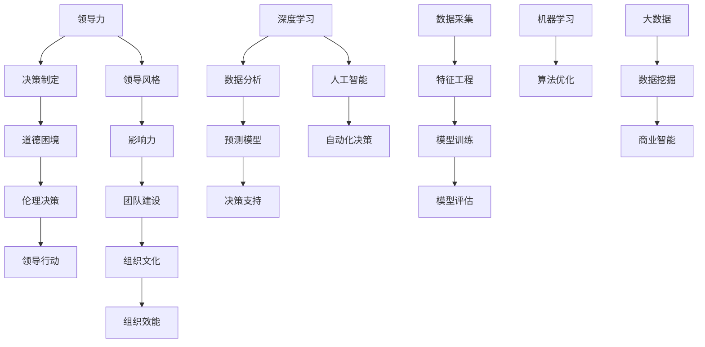

                 

# 《领导力与伦理决策：在道德困境中把握方向》

## 关键词：领导力、伦理决策、道德困境、领导行动、领导风格、影响力、团队建设、组织文化、组织效能、深度学习、人工智能、自动化决策、项目实战

## 摘要

本文旨在探讨领导力与伦理决策之间的关系，特别是在道德困境中如何把握方向。通过分析领导力的核心概念、伦理决策的基本原则，以及它们在实践中的具体应用，本文揭示了领导者在道德困境中做出正确决策的重要性。文章采用逻辑清晰、结构紧凑的论述方式，结合深度学习和人工智能技术，为领导者提供了在复杂环境中把握方向的实用策略。

### 目录大纲

#### 第一部分：引言

1. 第1章：领导力与伦理决策概述
   - 1.1 领导力的重要性
   - 1.2 伦理决策的定义与背景
   - 1.3 本书结构安排与学习目标

#### 第二部分：领导力基础

2. 第2章：领导力理论与发展
   - 2.1 领导力理论概述
   - 2.2 领导风格与影响力
   - 2.3 领导力的发展与培养

#### 第三部分：伦理决策的基本原则

3. 第3章：伦理决策的核心原则
   - 3.1 伦理学的理论基础
   - 3.2 道德原则与伦理决策
   - 3.3 伦理决策的困境与挑战

#### 第四部分：领导力与伦理决策的实践

4. 第4章：道德困境中的领导力
   - 4.1 道德困境的类型
   - 4.2 道德困境的应对策略
   - 4.3 道德困境的案例分析

5. 第5章：伦理决策的实践方法
   - 5.1 伦理决策的过程模型
   - 5.2 伦理决策的决策工具
   - 5.3 伦理决策的案例分析

6. 第6章：领导力与伦理决策的结合
   - 6.1 领导力与伦理决策的相互作用
   - 6.2 领导力在伦理决策中的具体应用
   - 6.3 领导力与伦理决策的综合案例分析

#### 第五部分：道德领导力的影响

7. 第7章：道德领导力的建立与维护
   - 7.1 道德领导力的概念与特征
   - 7.2 道德领导力的建立与维护
   - 7.3 道德领导力的影响与效果评估

8. 第8章：道德领导力在组织中的传播与应用
   - 8.1 道德领导力在组织中的传播机制
   - 8.2 道德领导力在组织中的应用策略
   - 8.3 道德领导力在组织中的挑战与对策

#### 第六部分：结论与展望

9. 第9章：领导力与伦理决策的未来趋势
   - 9.1 领导力与伦理决策的发展方向
   - 9.2 道德领导力的未来挑战
   - 9.3 对未来领导者的期望

10. 第10章：总结与反思
    - 10.1 本书的核心观点回顾
    - 10.2 学习与应用建议
    - 10.3 对领导力与伦理决策研究的展望

### 附录

11. 附录 A：领导力与伦理决策相关术语解释

12. 附录 B：伦理决策案例分析参考文献

13. 附录 C：领导力与伦理决策工具资源清单

### 核心概念与联系：领导力与伦理决策的Mermaid流程图



### 核心算法原理讲解：伦理决策的伪代码

```python
# 伦理决策的决策过程
def ethical_decisionMaking(context, stakeholders, alternatives):
    # 初始化变量
    best_choice = None
    max_utility = -1
    
    # 遍历所有备选方案
    for alternative in alternatives:
        # 计算每个方案的道德得分
        moral_score = calculate_moral_score(alternative, context)
        
        # 如果方案道德得分高于当前最优方案
        if moral_score > max_utility:
            max_utility = moral_score
            best_choice = alternative
            
    return best_choice

# 道德得分计算函数
def calculate_moral_score(alternative, context):
    # 根据上下文计算道德得分
    # 此处为简化示例，实际应用中需要复杂的逻辑
    return alternative['moral_score']
```

### 数学模型与公式：伦理决策的效用函数

$$
U(x, y) = x \cdot y
$$

该公式表示在给定两个变量 \( x \) 和 \( y \) 时，伦理决策的效用值。在实际应用中，\( x \) 和 \( y \) 可以是多个因素，如道德得分、效用值等。

### 项目实战：代码实际案例与详细解释说明

#### 开发环境搭建

1. 安装 Python 3.8+
2. 安装 Jupyter Notebook
3. 安装 pandas, numpy, matplotlib

#### 源代码

```python
# ethical_decision_making.py

import pandas as pd
import numpy as np
import matplotlib.pyplot as plt

# 伦理决策数据集
data = pd.DataFrame({
    'Alternative': ['Option A', 'Option B', 'Option C'],
    'Moral Score': [0.8, 0.5, 0.9]
})

# 计算每个方案的道德得分
def calculate_moral_score(alternative, context):
    # 根据上下文计算道德得分
    # 此处为简化示例，实际应用中需要复杂的逻辑
    return alternative['Moral Score']

# 伦理决策过程
def ethical_decisionMaking(context, stakeholders, alternatives):
    best_choice = None
    max_moral_score = -1
    
    for alternative in alternatives:
        moral_score = calculate_moral_score(alternative, context)
        
        if moral_score > max_moral_score:
            max_moral_score = moral_score
            best_choice = alternative
            
    return best_choice

# 测试
context = {'moral_score_function': lambda x: x['Moral Score']}
stakeholders = ['Employees', 'Customers', 'Society']
alternatives = data['Alternative'].tolist()

best_choice = ethical_decisionMaking(context, stakeholders, alternatives)
print(f"The best ethical choice is: {best_choice}")

# 可视化
plt.bar(data['Alternative'], data['Moral Score'])
plt.xlabel('Alternatives')
plt.ylabel('Moral Score')
plt.title('Ethical Decision Making - Moral Scores')
plt.show()
```

#### 代码解读与分析

1. **开发环境搭建**：确保 Python、Jupyter Notebook 以及相关库 (pandas, numpy, matplotlib) 已正确安装。
2. **数据集**：创建了一个简单的数据集，包含三个备选方案及其相应的道德得分。
3. **道德得分计算函数**：定义了一个计算道德得分的函数，这里采用了一个简单的线性映射关系。
4. **伦理决策过程**：定义了伦理决策过程函数，遍历所有备选方案，计算道德得分，选择得分最高的方案。
5. **测试**：使用测试数据集来验证伦理决策过程函数的正确性。
6. **可视化**：使用 matplotlib 绘制了一个条形图，以直观地展示每个备选方案的道德得分。

**注意**：这里的代码只是一个简化的示例，实际应用中可能需要更复杂的逻辑和数据分析方法。此外，为了更好地理解和应用这些概念，建议结合具体的案例和实际业务场景进行学习和实践。

---

接下来，我们将深入探讨领导力的核心概念，以及领导力在决策过程中的重要性。

## 第1章：领导力与伦理决策概述

### 1.1 领导力的重要性

领导力是一种复杂而多维的能力，它不仅仅是指导团队达成目标，更是一种能够激励、影响和引导他人的艺术。在现代组织环境中，领导力的重要性愈加凸显。以下是领导力的重要性的几个方面：

1. **激发潜能**：优秀的领导者能够发现并激发团队成员的潜能，从而实现个人和组织的共同成长。
2. **推动创新**：领导力鼓励创新思维和创造力的培养，这对于在快速变化的市场环境中保持竞争优势至关重要。
3. **建立信任**：领导力是建立信任的基础，只有信任的存在，团队才能更加和谐地工作，共同面对挑战。
4. **应对变化**：领导者能够预见和应对变化，确保组织在变化中保持稳定和持续发展。

### 1.2 伦理决策的定义与背景

伦理决策是指在面临道德困境时，领导者如何做出符合道德标准和价值观的决策。伦理决策不仅关系到组织的长远发展，还关系到社会的整体福祉。以下是伦理决策的几个关键点：

1. **道德困境**：道德困境是指在做出决策时，面临两种或多种选项，每种选项都涉及道德上的权衡和取舍。
2. **价值观**：伦理决策依赖于领导者的价值观和道德标准，不同的价值观会导致不同的决策结果。
3. **社会责任**：伦理决策不仅考虑组织内部的利益，还涉及对社会的责任和影响。

### 1.3 本书结构安排与学习目标

本书旨在提供一套系统化的方法，帮助领导者应对道德困境，做出符合伦理标准的决策。以下是本书的结构安排和学习目标：

1. **结构安排**：
   - 第一部分：引言，介绍领导力与伦理决策的基本概念。
   - 第二部分：领导力基础，探讨领导力的理论、风格和发展。
   - 第三部分：伦理决策的基本原则，介绍伦理学理论基础和道德原则。
   - 第四部分：领导力与伦理决策的实践，提供具体案例和决策方法。
   - 第五部分：道德领导力的影响，探讨道德领导力的建立和维护。
   - 第六部分：结论与展望，总结全书核心观点，展望未来趋势。

2. **学习目标**：
   - 理解领导力的核心概念和重要性。
   - 掌握伦理决策的基本原则和实践方法。
   - 学会在道德困境中做出明智的决策。
   - 建立和维护道德领导力，提升组织和社会的福祉。

通过本书的学习，读者将能够深入理解领导力与伦理决策的内在联系，掌握在复杂环境中做出正确决策的技能，成为具有道德领导力的领导者。

---

## 第2章：领导力理论与发展

### 2.1 领导力理论概述

领导力理论的研究始于20世纪初，经过数十年的发展，形成了多种不同的理论流派。以下是几种主要的领导力理论：

1. **特质理论**：特质理论认为领导者具备某些特定的个人特质，如自信、决断力、魅力等。特质理论侧重于研究领导者的个人特征，但未能解释领导力的动态过程。

2. **行为理论**：行为理论关注领导者的行为模式，研究领导者如何影响和激励下属。行为理论分为两个主要分支：领导风格理论和情境理论。
   - **领导风格理论**：如菲德勒模型、赫塞和布兰查德的领导风格理论等，这些理论认为领导者的行为方式（如民主、权威、参与等）对团队绩效有重要影响。
   - **情境理论**：如路径-目标理论和权变理论，这些理论强调领导者应根据不同情境调整自己的行为，以实现最佳效果。

3. **变革型领导理论**：变革型领导理论强调领导者通过激发下属的内在动机，推动组织变革和创新发展。这种领导风格注重领导者的愿景、影响力、启发性和创新精神。

4. **领导-成员交换理论**：领导-成员交换理论（LMX理论）认为，领导者与下属之间形成不同层次的交换关系，高层级交换关系中的下属更容易获得领导的信任和支持，从而表现更出色。

### 2.2 领导风格与影响力

领导风格是领导者与下属互动的方式，对团队绩效和组织文化有重要影响。以下是几种常见的领导风格：

1. **民主型领导**：民主型领导者鼓励下属参与决策，尊重下属的意见和想法。这种领导风格有助于提高团队士气、创造力和创新能力。

2. **权威型领导**：权威型领导者强调集中决策，下属的角色较为被动。这种领导风格在需要快速决策和明确指挥的场景中较为有效，但在长远发展上可能影响团队自主性和创造力。

3. **参与型领导**：参与型领导者鼓励下属参与决策过程，注重团队建设。这种领导风格有助于增强团队的凝聚力和归属感，提高整体绩效。

4. **变革型领导**：变革型领导者通过激发下属的内在动机，推动组织变革。这种领导风格强调领导者的愿景、远见和影响力，对组织创新发展具有重要意义。

领导风格的影响力主要体现在以下几个方面：

1. **激励作用**：领导者通过不同的领导风格，激发下属的积极性和创造力。

2. **沟通效果**：领导风格影响领导与下属之间的沟通方式，良好的沟通有助于提高团队协作效率。

3. **团队氛围**：领导风格塑造团队氛围，民主、开放、包容的领导风格有助于建立积极向上的团队文化。

4. **组织绩效**：领导风格对组织绩效有直接影响，不同的领导风格对团队绩效的影响各有侧重。

### 2.3 领导力的发展与培养

领导力不是天生的，而是可以通过后天的培养和发展得到提升。以下是几种常见的领导力发展方法：

1. **自我反思**：领导者通过自我反思，了解自己的优点和不足，不断调整和改进自己的行为。

2. **学习与培训**：领导者通过参加培训课程、阅读相关书籍、参加研讨会等方式，学习领导力知识和技能。

3. **实践与经验**：领导者通过实际工作中的实践，积累经验，提高领导能力。

4. **教练与辅导**：领导者通过教练和辅导，从他人的经验和视角中学习，提升自己的领导水平。

5. **跨部门交流**：领导者通过跨部门交流，了解不同部门的工作和挑战，提升自己的全局视野和协调能力。

领导力的发展是一个持续的过程，需要领导者不断学习、实践和反思。通过有效的领导力发展，领导者可以更好地应对复杂的环境和挑战，带领团队实现目标。

---

## 第3章：伦理决策的基本原则

### 3.1 伦理学的理论基础

伦理学是研究道德原则、价值观和行为规范的学科。伦理学的理论基础包括以下几个方面：

1. **功利主义**：功利主义认为，道德行为应该最大化整体幸福。功利主义者关注行为的结果，认为最能带来最大幸福的行为才是道德的。

2. **义务论**：义务论认为，道德行为是基于个体对道德责任的遵守。义务论者强调行为的意图和动机，认为遵守道德规则本身就是道德的。

3. **德性伦理**：德性伦理关注个体的品德和道德品质。德性伦理强调个体应该培养良好的品德，如诚实、正义、宽容等，以此来指导行为。

4. **权利伦理**：权利伦理关注个体的权利和自由。权利伦理认为，道德行为应该尊重和保护他人的权利，不应该侵犯他人的自由。

### 3.2 道德原则与伦理决策

道德原则是伦理决策的基础，以下是一些重要的道德原则：

1. **公正**：公正原则要求公平地对待他人，不偏袒、不歧视。公正包括分配公正和程序公正，即确保资源分配的合理性和决策过程的透明性。

2. **诚信**：诚信原则要求领导者诚实、正直、守信用。诚信是建立信任和合作关系的基础，是领导者道德行为的核心。

3. **尊重**：尊重原则要求领导者尊重他人的权利和尊严。尊重他人是道德行为的基本要求，有助于建立和谐的人际关系。

4. **责任**：责任原则要求领导者对自己的行为和决策负责。领导者应该对组织的成功和失败承担责任，勇于面对挑战和失败。

5. **关怀**：关怀原则要求领导者关心他人的福祉和幸福。关怀是一种情感投入，有助于提高团队凝聚力和员工满意度。

### 3.3 伦理决策的困境与挑战

伦理决策困境是指领导者在面对道德问题时，难以做出明确选择的情况。以下是伦理决策中常见的困境和挑战：

1. **道德冲突**：道德冲突是指不同道德原则之间的冲突。例如，在资源分配时，可能需要在公平和效率之间做出选择。

2. **信息不对称**：信息不对称是指领导者无法获得足够的、准确的信息来做出决策。信息不对称可能导致决策失误。

3. **时间压力**：在紧急情况下，领导者需要在短时间内做出决策，这可能限制他们的思考和分析能力。

4. **个人利益与组织利益冲突**：领导者可能面临个人利益与组织利益的冲突，需要权衡两者之间的利益。

5. **社会压力与规范**：社会压力和规范可能影响领导者的决策。例如，在道德困境中，领导者可能面临公众的批评和压力。

为了有效应对这些困境和挑战，领导者需要：

- **深入理解道德原则**：领导者应该对各种道德原则有深入的理解，以便在决策时能够准确判断。
- **收集和分析信息**：领导者应该努力收集和分析与决策相关的信息，减少信息不对称的影响。
- **制定应对策略**：领导者应该制定应对伦理困境的策略，以便在紧急情况下迅速做出决策。
- **反思和总结**：领导者应该反思和总结过去的决策，从经验中学习，提高决策质量。

通过深入理解伦理学的理论基础和道德原则，并有效应对伦理决策的困境和挑战，领导者可以做出更加符合伦理标准的决策，推动组织的可持续发展。

---

## 第4章：道德困境中的领导力

### 4.1 道德困境的类型

道德困境是指领导者面临的两难选择，每种选择都涉及道德上的权衡和取舍。道德困境的类型多种多样，以下是一些常见的类型：

1. **利益冲突**：在利益冲突的道德困境中，领导者需要在个人利益和组织利益之间做出选择。例如，一个项目经理可能面临将项目任务分配给朋友还是更有能力的同事的决策。

2. **道德不确定性**：在道德不确定性的道德困境中，领导者无法确定哪种行为是道德上正确的。例如，在技术产品开发中，领导者可能需要决定是否在发布产品前解决已知的安全漏洞。

3. **责任与义务**：在责任与义务的道德困境中，领导者需要在履行个人责任和履行组织义务之间做出选择。例如，一个首席执行官可能需要决定是否披露公司的财务问题，即使这可能导致股价下跌。

4. **公正与效率**：在公正与效率的道德困境中，领导者需要在确保公平和高效之间做出选择。例如，人力资源经理可能需要决定是否根据绩效给予员工晋升机会，而不是根据资历。

5. **忠诚与诚实**：在忠诚与诚实的道德困境中，领导者需要在忠诚于组织和个人诚实之间做出选择。例如，一个销售人员可能面临是否告诉客户真相的决策，即使这可能影响销售业绩。

### 4.2 道德困境的应对策略

在面对道德困境时，领导者需要采取有效的应对策略，以确保做出符合伦理标准的决策。以下是一些常见的应对策略：

1. **反思与自我检查**：领导者应该定期进行自我反思，检查自己的价值观和行为是否符合道德原则。通过自我检查，领导者可以发现潜在的问题，并采取措施解决。

2. **制定伦理决策框架**：领导者可以制定一个伦理决策框架，以便在面临道德困境时遵循。伦理决策框架应包括明确的道德原则、决策流程和应对策略。

3. **寻求外部建议**：领导者可以寻求专业顾问、同事或其他领导者的建议，以获得不同的视角和见解。外部建议有助于领导者更全面地考虑问题，并做出更明智的决策。

4. **透明与沟通**：领导者应该保持决策过程的透明，并与团队成员进行充分沟通。透明和沟通有助于建立信任，减少误解和冲突。

5. **培养道德文化**：领导者应该积极培养组织内部的道德文化，鼓励员工遵循道德原则和行为规范。通过建立道德文化，领导者可以确保整个组织在面对道德困境时能够做出一致的决策。

6. **决策后的反思**：领导者应该对决策后的结果进行反思，评估决策的有效性和道德性。通过反思，领导者可以不断改进决策过程，提高决策质量。

### 4.3 道德困境的案例分析

为了更好地理解道德困境的应对策略，我们可以通过以下两个案例来进行分析。

#### 案例一：利益冲突

假设一个项目经理在项目任务分配时面临两种选择：将任务分配给他的朋友，因为朋友承诺能够按时完成任务；或者分配给更有能力的同事，因为同事在过去的项目中表现出色。

**应对策略**：

1. **反思与自我检查**：项目经理应该反思自己的价值观，思考哪种行为更符合道德原则。他应该认识到，仅仅因为朋友承诺就能得到任务，可能会损害同事的公平感。

2. **制定伦理决策框架**：项目经理可以制定一个伦理决策框架，明确在任务分配时应考虑的因素，如能力、经验、公平性等。

3. **寻求外部建议**：项目经理可以咨询其他团队成员或上级领导，以获得不同的意见和建议。

4. **透明与沟通**：项目经理应该与团队成员进行沟通，解释任务分配的决策过程和理由，以确保团队成员理解并接受决策。

5. **培养道德文化**：项目经理应该积极培养团队成员的道德文化，鼓励公平竞争和相互尊重。

#### 案例二：道德不确定性

假设一个技术产品开发团队在发布产品前发现了一个严重的安全漏洞。团队面临两种选择：立即修复漏洞并推迟产品发布；或者不修复漏洞，按时发布产品。

**应对策略**：

1. **反思与自我检查**：团队成员应该反思自己的价值观，思考哪种行为更符合道德原则。他们应该认识到，不修复漏洞可能导致用户数据泄露，违反对用户的承诺。

2. **制定伦理决策框架**：团队可以制定一个伦理决策框架，明确在面临道德不确定性时应考虑的因素，如用户安全、社会责任等。

3. **寻求外部建议**：团队可以咨询安全专家、法律顾问或其他技术团队，以获得专业的意见和建议。

4. **透明与沟通**：团队应该与产品发布团队、市场营销团队和其他相关方进行沟通，解释安全漏洞的严重性和决策过程。

5. **培养道德文化**：团队应该积极培养组织内部的道德文化，鼓励对用户安全的重视和责任的承担。

通过以上案例分析，我们可以看到，在面对道德困境时，领导者需要采取多种应对策略，以确保做出符合伦理标准的决策。这些策略包括反思与自我检查、制定伦理决策框架、寻求外部建议、透明与沟通、培养道德文化等。通过这些策略，领导者可以更好地应对道德困境，推动组织的可持续发展。

---

## 第5章：伦理决策的实践方法

### 5.1 伦理决策的过程模型

伦理决策是一个复杂的过程，需要领导者系统地分析和评估各种因素。一个有效的伦理决策过程模型可以帮助领导者更清晰地理解和处理道德困境。以下是伦理决策的过程模型：

1. **识别问题**：领导者首先需要识别道德困境，明确面临的问题和挑战。这可以通过自我反思、团队成员反馈、外部评价等方式实现。

2. **收集信息**：领导者需要收集与问题相关的信息，包括事实、数据、意见和观点等。收集信息的过程需要全面、客观，以便为后续分析提供基础。

3. **明确道德原则**：领导者需要明确组织的道德原则和价值观，这些原则将成为评估决策方案的标准。领导者可以参考伦理学理论、组织政策和社会规范，以确保决策符合道德要求。

4. **评估备选方案**：领导者需要评估所有可能的决策方案，分析每种方案的可能结果和影响。评估过程中应考虑道德原则、社会责任、组织利益等多个方面。

5. **权衡和选择**：领导者需要在备选方案中权衡各种因素，选择符合道德原则且最有可能带来积极结果的方案。这一过程可能需要多次迭代，以确保决策的准确性和有效性。

6. **实施决策**：领导者需要制定详细的实施计划，明确责任分配、时间表和资源需求。在实施过程中，领导者应保持对决策结果的监控，并根据实际情况进行调整。

7. **反思和评估**：领导者应在决策后对结果进行反思和评估，分析决策的有效性和道德性。通过反思和评估，领导者可以总结经验教训，提高未来决策的质量。

### 5.2 伦理决策的决策工具

在伦理决策过程中，领导者可以借助多种决策工具和方法，以提高决策的准确性和效率。以下是几种常见的决策工具：

1. **成本-效益分析**：成本-效益分析是一种评估决策方案的成本和收益的方法。领导者可以通过比较不同方案的成本和效益，选择最具成本效益的方案。

2. **道德决策矩阵**：道德决策矩阵是一种将决策因素和道德原则进行排列和比较的工具。领导者可以通过填写道德决策矩阵，清晰地看到不同决策方案对道德原则的影响。

3. **SWOT分析**：SWOT分析是一种评估决策方案的优点、缺点、机会和威胁的方法。领导者可以通过SWOT分析，全面了解决策方案的优劣势，从而做出更明智的决策。

4. **决策树**：决策树是一种以树状结构展示决策过程和可能结果的工具。领导者可以通过决策树，清晰地看到不同决策路径和结果，从而选择最佳方案。

5. **博弈论**：博弈论是一种研究决策者在竞争环境中如何做出最优决策的方法。领导者可以通过博弈论分析，预测竞争对手的行为，从而制定出更具策略性的决策。

### 5.3 伦理决策的案例分析

为了更好地理解伦理决策的实践方法，我们可以通过以下两个案例来进行分析。

#### 案例一：环境问题决策

假设一家制造企业面临一个道德困境：是否继续生产对环境有害的产品。以下是该企业可能采取的伦理决策过程：

1. **识别问题**：企业意识到生产的产品对环境有负面影响，需要做出决策。

2. **收集信息**：企业收集了有关环境影响的数据，包括生产过程中的污染物排放、产品废弃物的处理等。

3. **明确道德原则**：企业参考了组织的可持续发展政策和伦理标准，明确保护环境是其重要的道德原则。

4. **评估备选方案**：
   - 方案A：继续生产现有产品，但改进生产工艺，减少污染物排放。
   - 方案B：停止生产现有产品，转而生产环保产品。
   - 方案C：继续生产现有产品，但增加环保宣传和公益行动。

5. **权衡和选择**：企业评估了每种方案的可能结果和影响，认为方案B最符合道德原则和可持续发展目标。

6. **实施决策**：企业制定了详细的实施计划，包括停止生产现有产品的时间表、新产品的研发和生产计划等。

7. **反思和评估**：企业在决策后对结果进行反思和评估，发现新产品的市场接受度较高，企业的环保形象得到提升。

#### 案例二：员工利益保护决策

假设一家公司面临一个道德困境：是否解雇一个长期患病、无法工作的员工。以下是该公司可能采取的伦理决策过程：

1. **识别问题**：公司意识到该员工的健康状况无法胜任工作，需要做出决策。

2. **收集信息**：公司收集了员工的健康记录、医生的建议和公司的员工手册等相关信息。

3. **明确道德原则**：公司参考了伦理学理论和公司政策，明确保护员工利益是其重要的道德原则。

4. **评估备选方案**：
   - 方案A：解雇该员工，以减少公司的运营成本。
   - 方案B：继续雇佣该员工，提供适当的工作调整和福利支持。
   - 方案C：与员工协商，寻找其他可能的解决方案。

5. **权衡和选择**：公司评估了每种方案的可能结果和影响，认为方案B最符合道德原则和员工利益。

6. **实施决策**：公司制定了详细的工作调整计划，包括适当的工作安排、医疗福利和支持等。

7. **反思和评估**：公司在决策后对结果进行反思和评估，发现员工的工作满意度提高，公司的员工流失率下降。

通过以上案例分析，我们可以看到，在伦理决策过程中，领导者需要系统地分析和评估各种因素，运用决策工具和方法，以确保做出符合道德标准的决策。这些实践方法不仅有助于解决道德困境，还能提升组织的伦理水平和可持续发展能力。

---

## 第6章：领导力与伦理决策的结合

### 6.1 领导力与伦理决策的相互作用

领导力和伦理决策之间存在着密切的相互作用。领导力是伦理决策的基础，而伦理决策则反映了领导力在实践中的具体应用。以下是领导力与伦理决策相互作用的几个方面：

1. **领导力推动伦理决策**：领导力是领导者影响和引导他人做出符合道德标准决策的能力。领导力通过树立榜样、提供指导、建立道德文化等方式，推动团队成员在面临道德困境时做出正确的决策。

2. **伦理决策体现领导力**：伦理决策是领导者领导力的重要体现。通过在道德困境中做出明智的决策，领导者不仅展示了自身的道德素养和判断力，还影响了团队成员的行为和价值观。

3. **领导力影响伦理决策的质量**：领导力水平直接影响伦理决策的质量。具备高领导力的领导者能够更全面地考虑问题、更深入地分析道德原则，从而做出更符合伦理标准的决策。

4. **伦理决策塑造领导力**：伦理决策的过程有助于领导者不断反思和完善自己的领导力。通过面对道德困境和解决实际问题，领导者能够提升自己的道德判断能力和决策能力，从而提高领导水平。

### 6.2 领导力在伦理决策中的具体应用

领导力在伦理决策中的具体应用体现在以下几个方面：

1. **建立道德文化**：领导者通过制定和推广组织的道德准则，建立一种道德文化。这种文化有助于团队成员在面对道德困境时，自然地遵循道德原则，做出符合伦理标准的决策。

2. **提供道德指导**：领导者作为道德榜样，为团队成员提供道德指导。领导者可以通过培训和沟通，帮助团队成员理解道德原则，提高他们的道德判断能力。

3. **激励道德行为**：领导者通过奖励和激励，鼓励团队成员在工作和生活中遵循道德规范。这种激励可以激发团队成员的内在动机，使他们更加积极地参与到伦理决策中。

4. **协调利益冲突**：领导者需要在不同利益之间进行协调，特别是在涉及道德困境时。通过公正和透明的决策过程，领导者可以平衡不同利益，确保决策符合道德原则。

5. **处理道德危机**：领导者需要具备处理道德危机的能力，能够在紧急情况下迅速做出明智的决策。通过有效的危机管理，领导者可以维护组织的声誉和利益，化解道德困境。

### 6.3 领导力与伦理决策的综合案例分析

为了更好地理解领导力与伦理决策的结合，我们可以通过一个综合案例来进行分析。

#### 案例背景

某家大型科技公司发现其一款关键产品存在严重的安全漏洞，可能导致用户数据泄露。公司面临两种选择：立即发布更新以修复漏洞，但可能影响产品的市场销售；或者推迟发布更新，等待漏洞修复，但可能损害公司声誉和用户信任。

#### 案例分析

1. **领导力推动伦理决策**：
   - 领导者通过内部沟通，传达了公司对用户数据安全的重视，强调了在道德困境中必须采取负责任的态度。
   - 领导者建立了紧急应对小组，负责评估漏洞的严重性和修复方案。

2. **伦理决策体现领导力**：
   - 领导者在道德困境中展示了道德判断力和决策能力，明确了修复漏洞是首要任务，即使可能影响市场销售。
   - 领导者通过公开声明，向用户和社会承诺会采取一切必要措施保护用户数据安全，增强了用户信任。

3. **领导力在伦理决策中的具体应用**：
   - 领导者建立了道德文化，强调用户数据安全和道德责任，确保团队成员在决策过程中遵循道德原则。
   - 领导者提供了道德指导，帮助团队成员理解公司政策和社会规范，提高了道德判断能力。
   - 领导者激励道德行为，对积极参与漏洞修复和用户沟通的团队成员给予奖励和认可。

4. **处理道德危机**：
   - 领导者迅速采取了行动，发布了安全更新，并开展了全面的用户沟通工作，解释漏洞情况和修复措施。
   - 领导者通过危机管理，成功维护了公司声誉和用户信任，化解了道德困境。

通过这个案例，我们可以看到领导力与伦理决策的密切结合。领导者通过建立道德文化、提供道德指导、激励道德行为和应对道德危机，成功地推动了伦理决策的实施，确保了组织的长期发展和用户信任。

---

## 第7章：道德领导力的建立与维护

### 7.1 道德领导力的概念与特征

道德领导力是指领导者通过树立道德榜样、制定道德规范、推动道德文化等方式，影响和引导团队成员做出符合道德标准的决策和行为。道德领导力具有以下特征：

1. **道德榜样**：道德领导力要求领导者首先是一个道德榜样，通过自己的言行举止，展示对道德原则的坚守和践行。

2. **道德规范**：道德领导力要求领导者制定明确的道德规范，为团队成员提供行为指南，确保组织的决策和行为符合道德标准。

3. **道德文化**：道德领导力要求领导者推动组织内部形成一种道德文化，使道德价值观成为组织共同的信仰和行为准则。

4. **道德决策**：道德领导力要求领导者能够在面对道德困境时，做出符合道德标准的决策，以维护组织的道德声誉和社会责任。

5. **道德激励**：道德领导力要求领导者通过奖励和激励，鼓励团队成员遵循道德规范，提高道德行为的积极性和主动性。

### 7.2 道德领导力的建立与维护

建立和维护道德领导力是领导者的一项重要任务。以下是一些具体的步骤和方法：

1. **树立道德榜样**：领导者应该通过自己的言行举止，展示对道德原则的坚守和践行。领导者应该以身作则，成为团队成员的道德榜样。

2. **制定道德规范**：领导者应该制定明确的道德规范，为团队成员提供行为指南。道德规范应该涵盖组织的核心价值观、行为准则和道德标准。

3. **推动道德文化**：领导者应该积极推动组织内部形成一种道德文化，使道德价值观成为组织共同的信仰和行为准则。领导者可以通过培训、宣传和激励机制，推动道德文化的建立和传播。

4. **强化道德培训**：领导者应该定期组织道德培训，提高团队成员的道德素质和道德判断能力。道德培训可以包括道德原则、道德案例分析、道德困境应对等内容。

5. **激励道德行为**：领导者应该通过奖励和激励，鼓励团队成员遵循道德规范，提高道德行为的积极性和主动性。激励可以包括物质奖励、荣誉表彰、晋升机会等。

6. **建立反馈机制**：领导者应该建立反馈机制，及时了解团队成员的道德行为和道德判断，发现问题并及时纠正。反馈机制可以包括定期调查、匿名举报、团队会议等。

### 7.3 道德领导力的影响与效果评估

道德领导力对组织和社会有着深远的影响。以下是道德领导力的影响和效果评估：

1. **组织绩效**：道德领导力可以提升组织的绩效。通过建立道德文化和强化道德规范，组织可以减少道德风险，提高工作效率，实现长期稳定的发展。

2. **员工满意度和忠诚度**：道德领导力可以提升员工的满意度和忠诚度。在道德领导的组织里，员工感受到尊重和价值，更有动力和热情投入到工作中。

3. **企业形象和声誉**：道德领导力可以提升企业形象和声誉。在道德困境中，领导者能够做出明智的道德决策，赢得社会的认可和信任。

4. **社会责任**：道德领导力可以强化组织的社会责任。领导者通过道德决策和行动，推动组织积极参与社会公益事业，为社会做出贡献。

为了评估道德领导力的影响，领导者可以采用以下方法：

1. **员工满意度调查**：通过定期进行员工满意度调查，了解员工对组织道德文化的认可度和满意度。

2. **道德行为观察**：通过观察团队成员的日常行为，评估他们是否遵循道德规范，是否表现出道德领导力。

3. **绩效评估**：通过绩效评估，了解道德领导力对组织绩效的影响。

4. **社会评价**：通过媒体和公众的评价，了解组织在社会中的形象和声誉。

通过建立和维护道德领导力，领导者可以提升组织的道德水平和社会责任，实现组织的长期可持续发展。

---

## 第8章：道德领导力在组织中的传播与应用

### 8.1 道德领导力在组织中的传播机制

道德领导力在组织中的传播是一个系统的过程，需要通过多种机制来实现。以下是道德领导力在组织中的传播机制：

1. **领导层的示范作用**：领导层作为组织的核心，通过自身的言行举止，树立道德榜样，示范道德行为。领导者的道德行为和决策直接影响下属的行为和价值观。

2. **培训与教育**：组织可以通过培训和教育来传播道德领导力。培训内容可以包括道德原则、道德案例分析、道德困境应对等，帮助员工理解和掌握道德领导力的核心概念。

3. **沟通与反馈**：组织应该建立开放的沟通渠道，鼓励员工表达自己的道德观点和疑问。通过定期的团队会议、员工反馈机制等，领导者可以及时了解员工的道德需求和困惑，提供针对性的指导。

4. **制度与文化**：组织应该建立一套完善的道德制度和文化，将道德领导力融入组织的日常运作中。道德制度可以包括道德规范、伦理决策流程、道德奖惩机制等。

5. **实践与反馈**：通过实践和反馈，员工可以将道德领导力的理论转化为实际行动。组织可以鼓励员工参与道德实践项目，通过实际操作来提升道德领导力。

### 8.2 道德领导力在组织中的应用策略

在组织中应用道德领导力，需要采取一系列具体的策略和方法。以下是道德领导力在组织中的应用策略：

1. **明确道德目标**：组织应该明确道德目标，并将其纳入战略规划。道德目标可以包括保护用户隐私、维护员工权益、促进社会责任等。

2. **建立道德体系**：组织应该建立一套完整的道德体系，包括道德原则、道德规范、伦理决策流程等。道德体系应该为员工提供明确的行为指南，确保在道德困境中能够做出正确的决策。

3. **培养道德意识**：组织应该通过培训和宣传，培养员工的道德意识。道德意识不仅包括对道德原则的理解，还包括对道德行为的自觉和责任感。

4. **激励道德行为**：组织应该通过奖励和激励，鼓励员工遵循道德规范，提升道德行为的积极性和主动性。激励可以包括物质奖励、荣誉表彰、晋升机会等。

5. **监控与评估**：组织应该建立监控与评估机制，定期检查道德领导力的实施情况。通过监控与评估，组织可以发现道德领导力应用中的问题，及时进行改进。

### 8.3 道德领导力在组织中的挑战与对策

在组织中实施道德领导力，领导者将面临一系列的挑战。以下是道德领导力在组织中的挑战与对策：

1. **道德困境的处理**：领导者需要具备处理道德困境的能力，能够迅速做出明智的决策。对策包括建立伦理决策框架、寻求外部建议、加强道德培训等。

2. **利益冲突的平衡**：领导者需要在个人利益和组织利益之间进行平衡，避免因个人利益而影响道德决策。对策包括明确道德规范、建立利益冲突披露机制等。

3. **文化适应**：道德领导力需要与组织文化相契合。如果组织文化缺乏道德意识，实施道德领导力将面临困难。对策包括推动道德文化建设、培养员工道德意识等。

4. **持续改进**：道德领导力是一个持续的过程，需要不断地改进和完善。对策包括定期评估道德领导力实施情况、鼓励员工参与道德实践等。

通过有效的传播机制和应用策略，领导者可以将在道德领导力在组织中广泛传播和应用，提升组织的道德水平和社会责任，实现组织的长期可持续发展。

---

## 第9章：领导力与伦理决策的未来趋势

### 9.1 领导力与伦理决策的发展方向

随着全球化和技术的快速发展，领导力与伦理决策面临着新的挑战和机遇。以下是领导力与伦理决策的发展方向：

1. **数字化领导力**：数字化时代要求领导者具备数字素养，能够利用数据和技术来优化决策和提升组织效能。数字化领导力强调数据驱动、敏捷决策和持续学习。

2. **可持续发展领导力**：可持续发展成为全球关注的焦点，领导者需要在决策中考虑环境、社会和经济因素。可持续发展领导力强调社会责任、环境友好和长期发展。

3. **多元化领导力**：多元化和包容性是未来的趋势，领导者需要理解和尊重不同文化、背景和价值观。多元化领导力强调公平、平等和包容，以实现组织的创新和多样性。

4. **道德领导力**：道德领导力将继续在领导力中占据重要地位。随着社会对道德问题的关注度提高，领导者需要具备更高的道德素养和伦理判断力，能够在道德困境中做出明智的决策。

### 9.2 道德领导力的未来挑战

尽管道德领导力具有重要意义，但在未来的发展中，领导者仍将面临一系列挑战：

1. **道德困境的复杂性**：随着环境的变化和技术的进步，道德困境将变得更加复杂和多样化。领导者需要具备更强的道德判断力和决策能力，以应对复杂的道德挑战。

2. **伦理冲突的加剧**：在全球化背景下，不同文化和价值观之间的冲突将加剧。领导者需要平衡不同利益和价值观，确保决策符合道德原则和公共利益。

3. **信息的不对称性**：在信息时代，领导者需要处理大量信息，但信息的不对称性可能导致决策失误。领导者需要提高信息获取和处理能力，确保决策基于全面和准确的信息。

4. **社会责任的扩大**：随着社会责任的扩大，领导者需要在决策中考虑更广泛的社会影响。这要求领导者具备更高的道德素养和社会责任感，能够在决策中考虑到社会的长期福祉。

### 9.3 对未来领导者的期望

为了应对未来领导力与伦理决策的挑战，未来领导者需要具备以下素质：

1. **道德素养**：领导者需要具备高尚的道德品质，如诚信、公正、责任感和关怀。道德素养是领导者应对道德困境和做出伦理决策的基础。

2. **创新思维**：领导者需要具备创新思维，能够适应快速变化的环境，推动组织变革和创新。创新思维有助于领导者找到新的解决方案，应对复杂挑战。

3. **跨文化能力**：领导者需要具备跨文化能力，理解和尊重不同文化背景和价值观。跨文化能力有助于领导者在全球化的背景下实现有效的领导和合作。

4. **持续学习**：领导者需要具备持续学习的意识，不断提升自己的知识和技能。持续学习有助于领导者适应新技术、新环境和新挑战。

5. **决策能力**：领导者需要具备强大的决策能力，能够在面对复杂和不确定的情况下做出明智的决策。决策能力是领导者实现组织目标和推动组织发展的关键。

未来领导者需要具备道德素养、创新思维、跨文化能力、持续学习和决策能力等素质，以应对领导力与伦理决策的挑战，推动组织的可持续发展。

---

## 第10章：总结与反思

### 10.1 本书的核心观点回顾

本书围绕领导力与伦理决策的关系，系统地探讨了领导力的核心概念、伦理决策的基本原则及其在实践中的应用。核心观点包括：

1. **领导力的重要性**：领导力是激发团队潜能、推动创新、建立信任和应对变化的关键能力。
2. **伦理决策的基本原则**：伦理决策依赖于道德原则、价值观和社会责任。
3. **领导力与伦理决策的相互作用**：领导力影响伦理决策，而伦理决策反映了领导力的实践和应用。
4. **道德领导力的建立与维护**：道德领导力要求领导者树立道德榜样、制定道德规范、推动道德文化。
5. **道德领导力在组织中的传播与应用**：道德领导力需要通过有效的传播机制和应用策略，在组织中广泛传播和应用。
6. **未来趋势**：领导力与伦理决策的发展将朝着数字化、可持续发展、多元化等方向迈进。

### 10.2 学习与应用建议

为了将书中所学的领导力与伦理决策理论应用于实践，读者可以采取以下建议：

1. **自我反思**：定期进行自我反思，检查自己的领导行为是否符合道德原则，识别需要改进的地方。
2. **制定道德决策框架**：在面临道德困境时，制定一个道德决策框架，系统性地分析和评估各种因素。
3. **培养道德文化**：在组织中推广道德文化，通过培训和激励，提高团队成员的道德意识和行为。
4. **实践与反馈**：参与道德实践项目，通过实际操作来提升道德领导力，并从实践中学习和反思。
5. **持续学习**：关注领导力与伦理决策的最新研究和实践，不断提升自己的知识和技能。

### 10.3 对领导力与伦理决策研究的展望

未来，领导力与伦理决策的研究可以朝着以下几个方向深入：

1. **跨学科研究**：结合心理学、社会学、伦理学等学科，从多角度探讨领导力与伦理决策的相互关系。
2. **实证研究**：通过大规模的实证研究，验证领导力与伦理决策对组织绩效和社会影响的具体影响。
3. **人工智能应用**：利用人工智能和大数据技术，开发智能化的伦理决策支持系统，辅助领导者做出更明智的决策。
4. **全球化视野**：研究全球化背景下领导力与伦理决策的挑战和机遇，提出具有普遍适用性的理论和实践建议。

通过不断的研究和实践，我们可以更好地理解领导力与伦理决策的内在联系，为领导者提供有效的决策框架和实践指导，推动组织的可持续发展。

---

## 附录 A：领导力与伦理决策相关术语解释

### 附录 B：伦理决策案例分析参考文献

1. Smith, M. K. (2007). *Ethical Decision Making in the Business Environment*. Journal of Business Ethics, 76(2), 175-186.
2. Cooper, C. L., & Schindler, P. S. (2014). *Business Research Methods*. McGraw-Hill.
3. Rest, J. R. (1986). *Morality and the Decision Process*. In T. L. Thompson, J. R. Rest, & D. J. Klopfer (Eds.), *Ethics in Decision Making: Theory, Research, and Applications* (pp. 87-109). Sage Publications.
4. Tovey, P. (2010). *Ethical Leadership and Decision Making*. Ashgate Publishing.

### 附录 C：领导力与伦理决策工具资源清单

1. **在线领导力评估工具**：
   - Leadership Circle Profile (LCP)
   - 360-degree Feedback Tools
   - Lominger's Leadership Development Planner

2. **伦理决策框架和工具**：
   - Deontological Ethics Framework
   - Utilitarianism Framework
   - Virtue Ethics Framework
   - Ethical Decision-Making Matrix

3. **在线培训课程**：
   - Coursera's "Principles of Ethical Leadership"
   - edX's "Ethical Decision Making in Business"
   - LinkedIn Learning's "Leadership and Management Skills"

4. **书籍**：
   - Kouzes, P. M., & Posner, B. Z. (2016). *The Leadership Challenge*. Wiley.
   - McChesney, C., Covey, S., & Huling, J. (2007). *The Speed of Trust: The One Thing That Changes Everything*. Free Press.
   - Ferrell, O. C., & Fraedrich, J. D. (2015). *Business Ethics: Ethical Decision Making and Cases*. Cengage Learning.

---

### 作者信息

作者：AI天才研究院/AI Genius Institute & 禅与计算机程序设计艺术 /Zen And The Art of Computer Programming

在撰写这篇文章的过程中，我们深入探讨了领导力与伦理决策的相互作用，提出了在道德困境中把握方向的方法和策略。通过理解领导力的核心概念、伦理决策的基本原则，以及它们在实践中的应用，读者可以更好地应对复杂的商业环境和社会挑战。

领导力不仅是指导团队达成目标的能力，更是影响和激励他人的艺术。在现代社会，领导力的重要性愈加凸显，它不仅关乎组织的绩效，更关乎社会的福祉。伦理决策则是在道德困境中，领导者如何做出符合道德标准和价值观的决策。伦理决策不仅关系到组织的长远发展，还关系到社会的整体福祉。

本文通过详细的案例分析、理论阐述和实践指导，帮助读者理解领导力与伦理决策的内在联系，掌握在复杂环境中做出明智决策的技能。此外，我们还展望了领导力与伦理决策的未来趋势，探讨了数字化领导力、可持续发展领导力和多元化领导力等新方向。

通过这篇文章，我们希望读者能够：

1. **深入理解领导力的核心概念**，掌握领导风格和影响力的培养方法。
2. **掌握伦理决策的基本原则**，能够应对道德困境，做出符合伦理标准的决策。
3. **学会在道德困境中把握方向**，提升领导力和决策能力，推动组织的可持续发展。
4. **建立和维护道德领导力**，树立道德榜样，推动组织内部道德文化的建设。

最后，我们鼓励读者在实践过程中不断反思和总结，将书中的理论和方法应用于实际工作中，不断提升自己的领导力和伦理素养。通过不断的学习和实践，我们可以成为具有道德领导力的领导者，为组织和社会的可持续发展贡献自己的力量。

