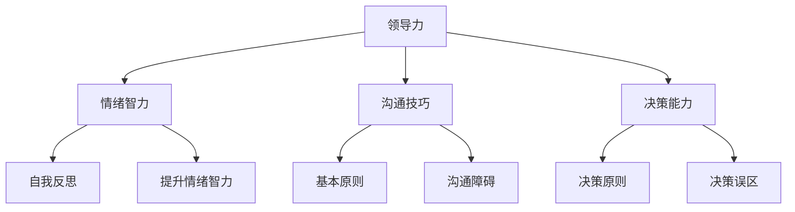
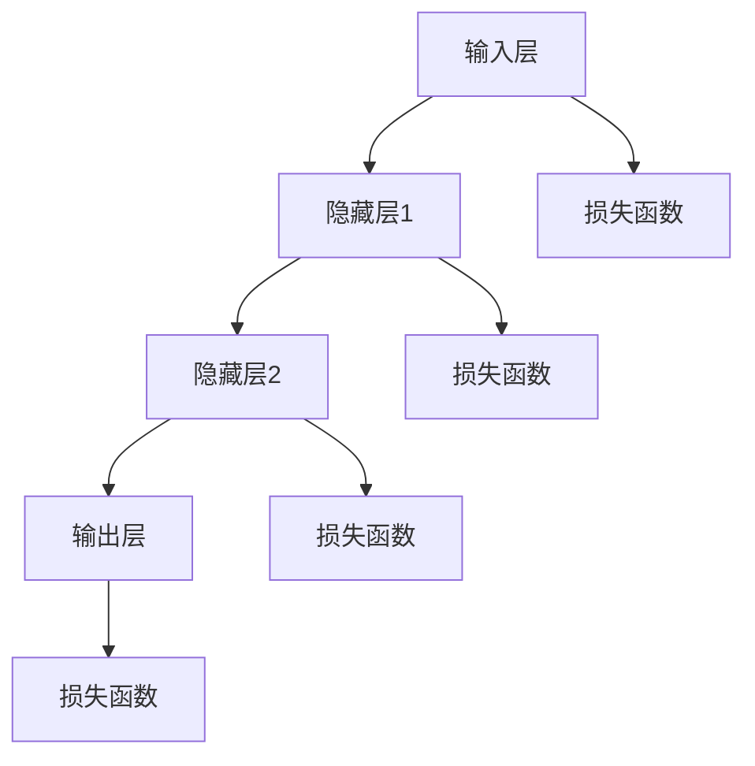
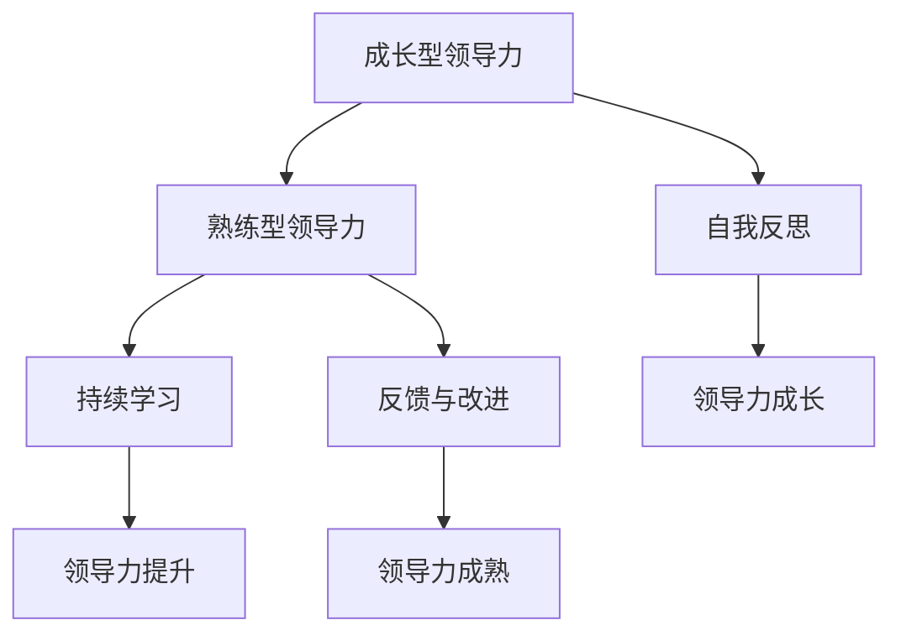
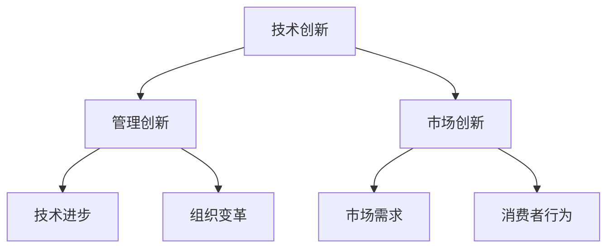
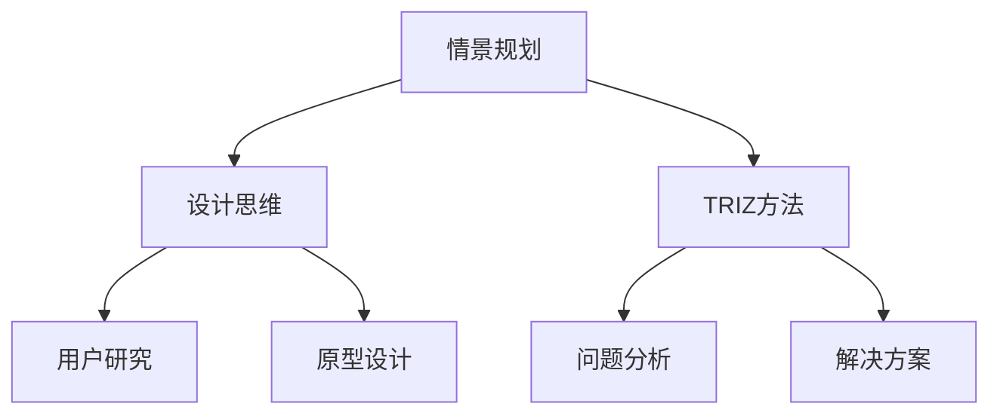
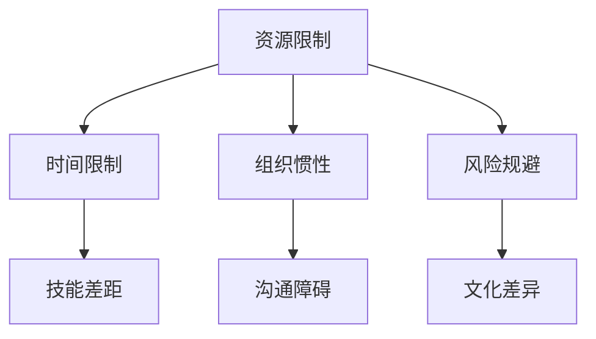
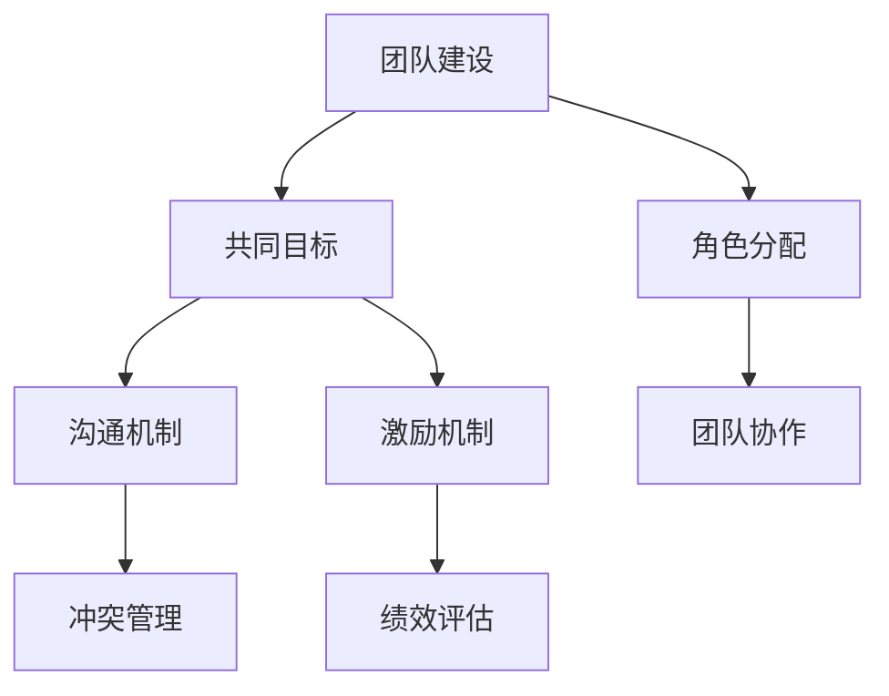
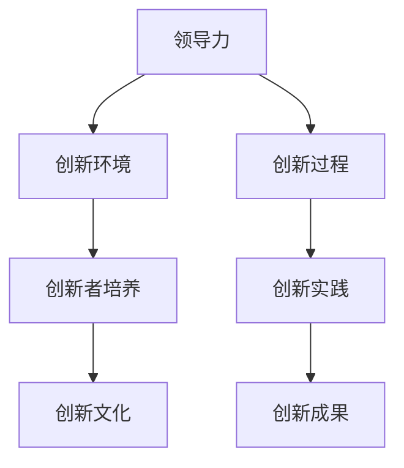

                 

### 《领导力与创新：激发团队创造力》

---

关键词：领导力、创新、团队创造力、领导力发展、核心要素、实践与提升

摘要：
本文旨在探讨领导力与创新之间的关系，如何通过提升领导力来激发团队创造力，推动团队在快速变化的技术环境中不断进步。文章首先介绍了领导力的基本概念、核心要素以及其发展历程，接着深入分析了创新的重要性、驱动因素和创新方法。最后，通过实际案例和策略，展示了如何将领导力与创新相结合，构建一个具有持续创新能力的团队。

---

### 《领导力与创新：激发团队创造力》目录大纲

#### 第一部分：领导力基础

**第1章：领导力概述**

- 1.1 领导力的定义与类型
  - 1.1.1 领导力的基本概念
  - 1.1.2 不同类型的领导力

- 1.2 领导力的发展历程
  - 1.2.1 传统领导力
  - 1.2.2 当代领导力

- 1.3 领导力的重要性
  - 1.3.1 对个人成长的影响
  - 1.3.2 对团队效能的影响

**第2章：领导力的核心要素**

- 2.1 情绪智力
  - 2.1.1 情绪智力的定义与重要性
  - 2.1.2 如何提升情绪智力

- 2.2 沟通技巧
  - 2.2.1 沟通的基本原则
  - 2.2.2 沟通的障碍与解决方法

- 2.3 决策能力
  - 2.3.1 决策的基本原则
  - 2.3.2 决策过程中的常见误区

**第3章：领导力的实践与提升**

- 3.1 领导力的发展阶段
  - 3.1.1 成长型领导力
  - 3.1.2 熟练型领导力

- 3.2 领导力提升的策略
  - 3.2.1 自我反思与成长
  - 3.2.2 学习与培训

- 3.3 领导力培养的案例分析
  - 3.3.1 案例一：如何激发团队潜力
  - 3.3.2 案例二：如何应对团队冲突

#### 第二部分：创新基础

**第4章：创新概述**

- 4.1 创新的定义与类型
  - 4.1.1 创新的基本概念
  - 4.1.2 不同类型的创新

- 4.2 创新的重要性
  - 4.2.1 对个人成长的影响
  - 4.2.2 对企业发展的推动作用

**第5章：创新的驱动因素**

- 5.1 技术创新
  - 5.1.1 技术创新的概念与类型
  - 5.1.2 技术创新的重要性

- 5.2 管理创新
  - 5.2.1 管理创新的概念与类型
  - 5.2.2 管理创新的重要性

- 5.3 市场创新
  - 5.3.1 市场创新的概念与类型
  - 5.3.2 市场创新的重要性

**第6章：创新方法与工具**

- 6.1 情景规划
  - 6.1.1 情景规划的概念与原理
  - 6.1.2 情景规划的应用

- 6.2 设计思维
  - 6.2.1 设计思维的概念与原理
  - 6.2.2 设计思维的应用

- 6.3 TRIZ方法
  - 6.3.1 TRIZ方法的概念与原理
  - 6.3.2 TRIZ方法的应用

**第7章：创新的实践与挑战**

- 7.1 创新过程中的障碍与解决方法
  - 7.1.1 创新者面临的挑战
  - 7.1.2 如何克服创新障碍

- 7.2 创新团队的构建与管理
  - 7.2.1 创新团队的构建原则
  - 7.2.2 创新团队的激励机制

- 7.3 创新的案例分析
  - 7.3.1 案例一：如何进行创新项目规划
  - 7.3.2 案例二：如何处理创新过程中的冲突

#### 第三部分：领导力与创新结合

**第8章：领导力与创新的关系**

- 8.1 领导力对创新的影响
  - 8.1.1 领导力如何推动创新
  - 8.1.2 领导力在创新过程中的作用

- 8.2 创新对领导力的要求
  - 8.2.1 创新环境对领导力的要求
  - 8.2.2 创新过程对领导力的挑战

**第9章：领导力与创新的结合实践**

- 9.1 如何在领导中推动创新
  - 9.1.1 领导者如何激发团队的创造力
  - 9.1.2 领导者如何管理创新过程

- 9.2 创新型组织的建设
  - 9.2.1 创新型组织的定义与特征
  - 9.2.2 建设创新型组织的策略

- 9.3 领导力与创新的综合案例分析
  - 9.3.1 案例一：谷歌如何培养创新文化
  - 9.3.2 案例二：苹果公司的创新领导力

#### 附录

**附录A：领导力与创新的相关工具与资源**

- A.1 领导力评估工具
  - A.1.1 360度评估
  - A.1.2 领导力问卷

- A.2 创新方法介绍
  - A.2.1 设计思维工具
  - A.2.2 TRIZ方法资源

- A.3 在线学习资源
  - A.3.1 领导力在线课程
  - A.3.2 创新方法在线课程

---

图1-1：领导力与创新核心概念联系

图1-2：深度学习算法原理

图3-1：领导力发展阶段

图4-1：创新的驱动因素

图5-1：创新方法与工具

图6-1：创新过程中的障碍

图7-1：创新团队的构建与管理

图8-1：领导力与创新的关系

---

现在，我们已经完成了《领导力与创新：激发团队创造力》的目录大纲和核心概念联系图的构建。接下来，我们将逐章深入探讨领导力的基础、创新的本质以及如何将二者结合起来，激发团队的创造力。让我们开始第一部分：领导力基础。

### 第1章：领导力概述

领导力是一种至关重要的能力，它不仅在个人职业生涯中发挥着核心作用，而且在组织的发展和成功中起着关键作用。在本章中，我们将探讨领导力的定义、类型以及其发展历程，帮助读者建立起对领导力的全面理解。

#### 1.1 领导力的定义与类型

领导力可以被定义为影响和激励他人一起实现目标的能力。它不仅仅是一种职位或角色的特权，而是一种通过影响力、智慧和行动力来引导团队、组织或社区前进的实践。领导力可以分为多种类型，每种类型都有其独特的特点和适用场景。

##### 1.1.1 领导力的基本概念

领导力包含以下几个核心要素：

1. **影响力**：领导者通过其言行和决策影响他人，引导团队朝共同目标前进。
2. **激励**：领导者能够激发团队成员的潜能，使其发挥最大价值。
3. **决策能力**：领导者需要具备快速且明智的决策能力，确保团队在复杂环境中能够有效应对挑战。
4. **沟通技巧**：领导者需要有效地传达信息，确保团队成员理解并执行任务。
5. **情绪智力**：领导者需要具备理解和管理自己以及他人情绪的能力。

##### 1.1.2 不同类型的领导力

1. **指令型领导力**：这种类型的领导者通过明确的指示和严格的规定来管理团队，适合在紧急情况下或需要迅速行动的情境中。
2. **变革型领导力**：这种类型的领导者通过激励和启发团队成员，推动团队实现变革。他们关注团队的长远发展，能够引导团队面对挑战并实现重大突破。
3. **服务型领导力**：这种类型的领导者将团队成员的需求放在首位，致力于帮助团队成员实现个人和职业发展。他们通过建立信任和合作，促进团队的凝聚力和效率。

#### 1.2 领导力的发展历程

领导力的发展历程可以分为几个阶段，每个阶段都反映了领导理论的演变和组织实践的变化。

##### 1.2.1 传统领导力

传统领导力主要关注领导者的个人特质和权威。这种领导力模式认为领导者是天生的，他们拥有独特的领导能力，而普通团队成员则需要服从领导者的指令。传统的领导力理论包括：

- **泰勒的科学管理理论**：泰勒主张通过科学的方法来管理工人，提高生产效率。
- **法约尔的管理过程理论**：法约尔提出了管理的五个职能（计划、组织、指挥、协调、控制）以及十四条管理原则。

##### 1.2.2 当代领导力

随着社会和科技的快速发展，领导力理论也在不断演变。当代领导力更加关注团队的互动和协作，强调领导者的角色是从管理到赋能的转变。以下是一些当代领导力理论：

- **变革型领导力理论**：领导者的目标是通过激发团队成员的潜能和动力，推动团队实现变革。
- **服务型领导力理论**：领导者关注团队成员的成长和发展，通过建立信任和合作关系来提高团队的效能。
- **情境领导理论**：领导者应根据不同情境和团队成员的需求，采用不同的领导风格。

#### 1.3 领导力的重要性

领导力对于个人成长和团队效能的影响是不可忽视的。

##### 1.3.1 对个人成长的影响

- **决策能力**：领导力培养了个人的决策能力，使个人能够在复杂和不确定的环境中进行有效决策。
- **情绪智力**：通过提升情绪智力，个人能够更好地管理自己的情绪，以及与他人的情绪互动。
- **沟通技巧**：领导力锻炼了个人的沟通技巧，使其能够更有效地传达信息和建立人际关系。

##### 1.3.2 对团队效能的影响

- **团队凝聚力**：领导者通过建立信任和合作，提高团队的凝聚力，使团队成员更愿意为共同目标努力。
- **创新能力**：领导者的启发和激励，可以激发团队成员的创造力，推动团队不断创新。
- **工作效率**：有效的领导者能够提高团队成员的工作效率，使团队更快地实现目标。

综上所述，领导力是一种多维度的能力，它不仅影响个人的成长，也对团队的效能产生深远影响。在下一章中，我们将深入探讨领导力的核心要素，了解如何通过提升情绪智力、沟通技巧和决策能力来成为更有效的领导者。

### 第2章：领导力的核心要素

领导力并不是一个单一的特质，而是一个综合能力的体现。有效的领导力需要领导者具备多种核心要素，这些要素不仅能够提升领导者的个人能力，还能够促进团队的整体效能。在本章中，我们将详细探讨情绪智力、沟通技巧和决策能力这三个关键要素。

#### 2.1 情绪智力

情绪智力，也被称作情商，是领导者必须具备的重要能力。情绪智力不仅关乎领导者如何理解和管理自己的情绪，也涉及如何识别和影响他人的情绪。

##### 2.1.1 情绪智力的定义与重要性

情绪智力包括以下五个关键领域：

1. **自我意识**：领导者能够准确识别和理解自己的情绪，并理解这些情绪如何影响其行为和决策。
2. **自我调节**：领导者能够控制自己的情绪，保持冷静和专注，即使在压力下也能保持理性。
3. **自我激励**：领导者能够设定目标，并保持动力，即使在困难面前也不放弃。
4. **识别他人情绪**：领导者能够敏锐地感知他人的情绪，理解其需求和期望。
5. **管理他人情绪**：领导者能够有效地影响他人的情绪，激励团队成员，建立积极的工作氛围。

情绪智力对领导力的重要性体现在以下几个方面：

- **提升决策质量**：情绪智力使领导者能够从多个角度思考问题，避免情绪化决策，提高决策的准确性和有效性。
- **建立信任**：领导者通过情绪智力的运用，能够更好地理解团队成员的需求，建立信任和合作关系。
- **提高团队凝聚力**：情绪智力有助于领导者识别和解决团队内部的冲突，促进团队的凝聚力和协作。

##### 2.1.2 如何提升情绪智力

提升情绪智力需要持续的努力和实践。以下是一些具体的方法：

- **自我反思**：定期进行自我反思，了解自己的情绪反应，识别情绪触发点。
- **情绪管理训练**：通过冥想、正念练习等方法，学会控制和管理自己的情绪。
- **情感交流**：积极与团队成员交流，倾听他人的情感表达，理解其情绪需求。
- **情感培训**：参加情绪智力培训课程，学习专业的情感管理和沟通技巧。

#### 2.2 沟通技巧

有效的沟通是领导者成功的关键。沟通不仅仅是信息的传递，更是一种建立信任、理解和支持的过程。

##### 2.2.1 沟通的基本原则

有效的沟通应遵循以下基本原则：

- **明确目标**：在沟通前明确沟通的目标和预期结果，确保信息传达的精准性。
- **倾听**：倾听是有效沟通的核心，领导者需要认真倾听团队成员的意见和反馈。
- **尊重**：尊重团队成员的意见和感受，避免批评和指责，建立积极的沟通氛围。
- **清晰表达**：用简洁、明确的语言表达自己的观点，避免使用复杂的术语和概念。
- **反馈**：及时给予反馈，确认信息的准确性和理解程度，确保沟通的有效性。

##### 2.2.2 沟通的障碍与解决方法

沟通障碍是领导者面临的一大挑战。以下是一些常见的沟通障碍及解决方法：

- **信息过载**：解决方法是通过简化和聚焦关键信息，避免过度传递冗余信息。
- **文化差异**：解决方法是培养跨文化沟通能力，尊重并理解不同文化背景下的沟通习惯。
- **情绪干扰**：解决方法是提升情绪智力，学会在情绪稳定的状态下进行沟通。

#### 2.3 决策能力

决策能力是领导者必须具备的核心能力之一。有效的决策不仅能够确保团队目标的实现，还能够增强领导者的信誉和影响力。

##### 2.3.1 决策的基本原则

有效决策应遵循以下基本原则：

- **信息全面**：在决策前收集全面、准确的信息，避免信息不足导致的盲目决策。
- **目标明确**：明确决策的目标和期望结果，确保决策方向与团队目标一致。
- **风险评估**：评估决策的风险和潜在影响，制定应对策略。
- **多方案比较**：分析多种可能的方案，选择最合适的方案。
- **决策执行**：确保决策能够得到有效执行，跟踪执行过程，及时调整。

##### 2.3.2 决策过程中的常见误区

在决策过程中，领导者常常会陷入以下误区：

- **过度依赖直觉**：避免仅凭直觉做出决策，应结合数据和逻辑分析。
- **偏见和刻板印象**：避免因偏见和刻板印象影响决策，应保持客观和开放的心态。
- **决策拖延**：避免因决策拖延导致错过最佳时机，应果断行动。

通过提升情绪智力、沟通技巧和决策能力，领导者能够更有效地管理团队，激发团队的创造力，实现组织的持续发展。在下一章中，我们将探讨领导力的实践与提升，了解如何通过不断学习和实践来提升领导力。

### 第3章：领导力的实践与提升

领导力并不是一个静态的概念，而是一个动态发展的过程。有效的领导力需要领导者不仅具备理论知识，还需要通过实践不断提升自己的能力。在本章中，我们将探讨领导力的发展阶段、提升策略以及领导力培养的案例分析。

#### 3.1 领导力的发展阶段

领导力的发展可以分为几个不同的阶段，每个阶段都代表领导者成长的不同层次。

##### 3.1.1 成长型领导力

成长型领导力是指领导者处于自我认知和不断学习的阶段。在这一阶段，领导者认识到自己的不足，并积极寻求改进和提升。以下是一些关键特征：

- **自我反思**：领导者经常反思自己的行为和决策，识别并改正错误。
- **持续学习**：领导者积极参与培训和学习活动，不断更新知识和技能。
- **适应变化**：领导者能够迅速适应环境和变化，灵活调整自己的策略。
- **建立信任**：领导者通过透明和诚信的行为建立信任，促进团队成员的合作。

##### 3.1.2 熟练型领导力

熟练型领导力是指领导者已经具备一定的经验和能力，能够独立处理复杂的领导任务。在这一阶段，领导者表现出以下特征：

- **自信和果断**：领导者能够自信地做出决策，并在决策过程中保持果断。
- **高效执行**：领导者能够有效地组织团队，确保决策得到高效执行。
- **激励团队**：领导者能够激励团队成员，激发其潜能，实现团队目标。
- **战略思维**：领导者具备战略思维，能够从长远角度规划团队的发展。

#### 3.2 领导力提升的策略

提升领导力需要系统化的策略和持续的努力。以下是一些有效的提升策略：

##### 3.2.1 自我反思与成长

自我反思是提升领导力的基础。以下是一些自我反思的方法：

- **定期回顾**：定期回顾自己的行为和决策，分析成功和失败的原因。
- **寻求反馈**：主动向团队成员和其他领导者寻求反馈，了解自己的优点和不足。
- **记录反思**：将反思过程记录下来，形成书面文件，便于持续跟踪和改进。

##### 3.2.2 学习与培训

学习和培训是提升领导力的重要手段。以下是一些建议：

- **参加培训课程**：参加专业化的领导力培训课程，学习最新的领导理论和实践方法。
- **阅读相关书籍**：阅读领导力相关的书籍和文章，了解不同领导理论的应用案例。
- **参与研讨会和工作坊**：参与行业研讨会和工作坊，与同行交流经验和见解。

##### 3.2.3 实践与经验积累

通过实践积累经验是提升领导力的关键。以下是一些实践经验：

- **担任领导角色**：主动承担领导角色，如团队负责人、项目负责人等，锻炼领导能力。
- **参与项目**：参与各种项目和挑战，解决实际问题，提升领导力和解决问题的能力。
- **指导下属**：指导下属，培养他们的领导能力，同时提高自己的领导技巧。

#### 3.3 领导力培养的案例分析

以下是一些领导力培养的案例分析，通过这些案例，我们可以看到领导者如何通过实践和策略提升自己的能力。

##### 3.3.1 案例一：如何激发团队潜力

案例背景：
一家科技公司的新产品开发团队在项目初期遇到了瓶颈，团队成员感到困惑和沮丧，项目进展缓慢。

解决方案：
领导者采取了一系列措施来激发团队潜力：

- **建立共同目标**：与团队成员讨论并确定共同的目标，明确项目的成功标准。
- **开展团队建设活动**：组织团队建设活动，增强团队凝聚力，建立信任。
- **提供反馈和鼓励**：定期与团队成员进行一对一的反馈会议，提供建设性的反馈和鼓励。
- **授权与支持**：鼓励团队成员提出创新的想法，并为他们的尝试提供必要的资源和支持。

结果：
通过这些措施，团队士气大大提升，项目进度加快，最终成功完成了新产品开发。

##### 3.3.2 案例二：如何应对团队冲突

案例背景：
一家跨国公司的研发团队在跨文化合作中出现了冲突，团队成员之间的沟通不畅，影响了项目的进度和质量。

解决方案：
领导者采取以下策略来应对团队冲突：

- **建立沟通渠道**：建立多层次的沟通渠道，包括定期团队会议、邮件通讯和即时通讯工具，确保信息流畅。
- **文化敏感性培训**：为团队成员提供文化敏感性培训，提高跨文化沟通的能力。
- **中立方调解**：在冲突严重时，邀请中立第三方进行调解，帮助双方达成共识。
- **透明化决策**：在决策过程中保持透明，确保团队成员理解决策的原因和影响。

结果：
通过这些措施，团队内部的冲突得到了有效缓解，团队成员之间的沟通更加顺畅，项目进度和质量得到了显著提升。

通过以上案例，我们可以看到，有效的领导力提升不仅需要理论知识的支持，更需要实践中的不断尝试和调整。在下一章中，我们将探讨创新的基础，了解创新的重要性和驱动因素，为领导力与创新的结合打下基础。

### 第4章：创新概述

创新是推动个人和组织发展的关键动力。无论是个人职业生涯，还是企业竞争力和市场地位，创新都扮演着不可或缺的角色。在本章中，我们将详细探讨创新的定义、类型以及其重要性。

#### 4.1 创新的定义与类型

创新可以定义为通过新想法、新方法或新技术，实现现有产品、服务或流程的改进或突破。创新不仅仅局限于技术领域，它涵盖了经济、社会、文化等多个层面。

##### 4.1.1 创新的基本概念

创新包含以下几个基本要素：

1. **想法**：创新始于新想法的产生，这些想法可以是技术性的，也可以是管理或商业模式的创新。
2. **方法**：创新的方法可以包括设计思维、情景规划、TRIZ方法等，通过这些方法，将想法转化为实际的解决方案。
3. **执行**：创新需要有效的执行，即把创新想法转化为实际的产品或服务。
4. **反馈**：通过持续的反馈和迭代，不断完善和创新。

##### 4.1.2 不同类型的创新

1. **技术创新**：技术创新是指通过新技术或工艺改进产品或服务。技术创新可以带来显著的性能提升、成本降低或用户体验改善。
2. **管理创新**：管理创新是指通过新的管理方法、流程或组织结构，提高组织的效率和效能。管理创新可以包括敏捷管理、精益生产等。
3. **商业模式创新**：商业模式创新是指通过新的商业模式，创造新的价值或降低成本。例如，共享经济和订阅模式都是商业模式的创新。
4. **社会创新**：社会创新是指通过创新的方法解决社会问题，如环境保护、扶贫等。

#### 4.2 创新的重要性

创新对于个人和组织的成长都具有重要意义。

##### 4.2.1 对个人成长的影响

- **技能提升**：创新过程需要个人不断学习和实践，从而提升技能和知识水平。
- **职业发展**：创新能力强的人更容易在职业生涯中获得晋升和机会。
- **创造力激发**：创新过程能够激发个人的创造力和想象力，使个人在生活和工作中更具活力。

##### 4.2.2 对企业发展的推动作用

- **竞争力提升**：创新可以帮助企业保持竞争优势，开拓新市场，创造新的利润来源。
- **成本降低**：创新可以优化流程，降低生产成本，提高企业效率。
- **用户体验优化**：创新可以改善产品和服务，提升用户满意度，增加客户忠诚度。

通过本章的讨论，我们可以看到创新不仅是推动个人成长的关键因素，也是企业持续发展的核心动力。在下一章中，我们将深入探讨创新的驱动因素，了解如何激发创新的动力。

### 第5章：创新的驱动因素

创新的成功离不开各种驱动因素的共同作用。这些因素不仅为创新提供了动力，还塑造了创新的环境和条件。在本章中，我们将探讨创新的三大驱动因素：技术创新、管理创新和市场创新。

#### 5.1 技术创新

技术创新是推动产品和服务改进的核心动力。它通过引入新技术、新材料或新工艺，实现性能提升、成本降低或用户体验优化。

##### 5.1.1 技术创新的概念与类型

技术创新可以定义为通过新技术或工艺改进产品或服务。根据创新的性质，技术创新可以分为以下几种类型：

1. **产品创新**：产品创新是指开发全新产品或改进现有产品，以更好地满足用户需求。例如，智能手机的发明和迭代就是一种产品创新。
2. **工艺创新**：工艺创新是指改进生产过程，提高生产效率和降低成本。例如，自动化生产线的引入就是一种工艺创新。
3. **系统创新**：系统创新是指改进产品或服务的整体系统，以实现更好的性能和用户体验。例如，电子商务平台的构建就是一种系统创新。

##### 5.1.2 技术创新的重要性

技术创新的重要性体现在以下几个方面：

- **竞争力提升**：技术创新可以帮助企业保持竞争优势，开拓新市场，创造新的利润来源。
- **效率优化**：技术创新可以优化流程，降低生产成本，提高企业效率。
- **用户体验优化**：技术创新可以改善产品和服务，提升用户满意度，增加客户忠诚度。

#### 5.2 管理创新

管理创新是指通过新的管理方法、流程或组织结构，提高组织的效率和效能。管理创新不仅关注技术的改进，还涉及组织文化和工作方式的变革。

##### 5.2.1 管理创新的概念与类型

管理创新可以分为以下几种类型：

1. **流程创新**：流程创新是指通过改进工作流程，提高工作效率和质量。例如，敏捷开发方法和精益生产就是流程创新的成功案例。
2. **组织结构创新**：组织结构创新是指通过改变组织结构，提高组织的灵活性和响应能力。例如，跨职能团队和扁平化管理都是组织结构创新。
3. **文化创新**：文化创新是指通过塑造新的组织文化，激发员工的创新潜力和积极性。例如，谷歌的“不作恶”文化和亚马逊的“以客户为中心”文化都是文化创新的成功案例。

##### 5.2.2 管理创新的重要性

管理创新的重要性体现在以下几个方面：

- **效率提升**：管理创新可以优化工作流程，减少冗余，提高工作效率。
- **组织灵活性**：管理创新可以增强组织的灵活性和适应性，使其能够迅速应对市场变化。
- **员工积极性**：管理创新可以激发员工的创新潜力和积极性，提高员工满意度和忠诚度。

#### 5.3 市场创新

市场创新是指通过新的商业模式、市场策略或营销手段，开拓新市场或创造新需求。市场创新不仅关注产品和服务，还涉及市场定位和客户体验。

##### 5.3.1 市场创新的概念与类型

市场创新可以分为以下几种类型：

1. **商业模式创新**：商业模式创新是指通过新的商业模式，创造新的价值或降低成本。例如，共享经济和订阅模式都是商业模式的创新。
2. **市场定位创新**：市场定位创新是指通过重新定位产品或服务，满足新的市场需求。例如，苹果公司通过“高端化”策略重新定位其产品，成为市场的领导者。
3. **营销策略创新**：营销策略创新是指通过新的营销手段，提高品牌知名度和市场份额。例如，社交媒体营销和内容营销都是营销策略的创新。

##### 5.3.2 市场创新的重要性

市场创新的重要性体现在以下几个方面：

- **市场拓展**：市场创新可以开拓新市场，扩大企业的影响力和市场份额。
- **需求创造**：市场创新可以创造新的需求，推动产品和服务的发展。
- **品牌提升**：市场创新可以提升品牌形象和品牌价值，增强企业的竞争力。

通过本章的探讨，我们可以看到，技术创新、管理创新和市场创新是推动创新的重要力量。这些驱动因素相互作用，共同促进个人和组织的持续发展。在下一章中，我们将详细讨论创新方法与工具，了解如何有效地实施创新。

### 第6章：创新方法与工具

为了有效地推动创新，组织和个人需要掌握一系列创新方法和工具。这些方法和工具不仅可以帮助人们发现新的机会，还可以指导如何将创意转化为实际的成果。在本章中，我们将详细探讨三种重要的创新方法：情景规划、设计思维和TRIZ方法。

#### 6.1 情景规划

情景规划是一种战略规划工具，它通过构建不同的未来场景，帮助组织评估和准备可能发生的变化。情景规划的核心是识别潜在的未来趋势，并制定相应的应对策略。

##### 6.1.1 情景规划的概念与原理

情景规划（Scenario Planning）是一种战略工具，用于探索未来可能的发展路径，并帮助组织做出更好的决策。情景规划的过程包括以下几个步骤：

1. **识别趋势**：分析当前和潜在的趋势，包括技术、社会、经济和环境趋势。
2. **构建场景**：基于识别的趋势，构建不同的未来场景。每个场景都代表一种可能的发展路径。
3. **分析影响**：评估每个场景对组织的影响，包括机会和挑战。
4. **制定策略**：根据每个场景的分析结果，制定相应的策略，以应对未来可能出现的变化。

##### 6.1.2 情景规划的应用

情景规划的应用非常广泛，以下是一些具体的例子：

- **风险预防**：通过情景规划，组织可以提前识别潜在的风险，并制定预防措施。
- **战略制定**：情景规划可以帮助组织制定长期战略，使其能够在不同场景下保持竞争力。
- **产品开发**：情景规划可以帮助产品团队了解未来市场需求，从而开发出更具前瞻性的产品。

#### 6.2 设计思维

设计思维是一种以人为中心的方法论，它强调通过深入理解用户需求，创造出真正有价值的解决方案。设计思维不仅适用于产品设计，还广泛应用于服务设计、策略规划等多个领域。

##### 6.2.1 设计思维的概念与原理

设计思维（Design Thinking）是一种以人为本的创新方法论，它强调通过迭代和用户反馈来不断改进解决方案。设计思维的核心原则包括：

1. **用户中心**：始终以用户的需求和体验为中心，确保解决方案能够真正满足用户需求。
2. **迭代开发**：通过不断迭代和测试，逐步完善解决方案。
3. **跨学科协作**：设计思维鼓励跨学科团队的合作，通过不同视角和技能的结合，产生创新的解决方案。

设计思维的过程包括以下几个步骤：

1. **发现**：深入了解用户需求，收集用户反馈。
2. **定义**：明确问题，并将其转化为可执行的挑战。
3. **发散**：生成多个可能的解决方案，不设限地思考。
4. **筛选**：评估和选择最有可能成功的解决方案。
5. **原型**：构建原型，进行测试和验证。
6. **测试**：通过用户测试和反馈，不断改进解决方案。

##### 6.2.2 设计思维的应用

设计思维的应用领域非常广泛，以下是一些具体的例子：

- **产品设计**：通过设计思维，产品团队能够更好地理解用户需求，创造出更符合用户期望的产品。
- **服务设计**：设计思维可以帮助服务团队优化服务流程，提高用户满意度。
- **企业战略**：设计思维可以帮助企业高层管理者更好地理解市场和用户需求，制定更具前瞻性的战略。

#### 6.3 TRIZ方法

TRIZ方法（Theory of Inventive Problem Solving）是一种基于科学原理的系统化创新方法。它通过解决“如何做”和“为什么”的问题，帮助人们找到创新的解决方案。

##### 6.3.1 TRIZ方法的概念与原理

TRIZ方法起源于苏联科学家阿尔图尔·萨莫依洛夫（Genrich Altshuller）的研究，他通过对大量专利的分析，总结出了一套解决问题的方法论。TRIZ方法的核心原则包括：

1. **矛盾解决**：通过解决矛盾来推动创新。在创新过程中，经常会遇到技术矛盾，TRIZ方法提供了一套系统化的方法来解决这个问题。
2. **资源利用**：在创新过程中，充分利用现有资源，避免浪费。
3. **系统优化**：通过系统化的方法，不断优化解决方案，提高其可行性和效率。

TRIZ方法的过程包括以下几个步骤：

1. **问题分析**：明确问题，并将其转化为技术矛盾或物理矛盾。
2. **矛盾解决**：根据TRIZ的矛盾矩阵，选择合适的解决方案。
3. **方案评估**：评估解决方案的可行性和效果。
4. **实施与验证**：实施解决方案，并进行验证和迭代。

##### 6.3.2 TRIZ方法的应用

TRIZ方法在多个领域都有广泛的应用，以下是一些具体的例子：

- **产品设计**：TRIZ方法可以帮助设计师解决产品设计中遇到的技术问题。
- **项目管理**：TRIZ方法可以帮助项目经理解决项目实施中的各种挑战。
- **企业创新**：TRIZ方法可以帮助企业解决业务发展中的瓶颈问题，推动创新。

通过情景规划、设计思维和TRIZ方法的结合，组织和个人可以更有效地推动创新，实现持续的发展和进步。在下一章中，我们将探讨创新的实践与挑战，了解如何在现实环境中实施创新。

### 第7章：创新的实践与挑战

尽管创新在理论上具有巨大的潜力和价值，但在实际操作中，创新往往面临着诸多挑战和障碍。在本章中，我们将深入探讨创新者在实践中遇到的挑战，以及如何克服这些障碍，确保创新的有效实施。

#### 7.1 创新过程中的障碍与解决方法

创新过程中的障碍多种多样，主要包括以下几个方面：

##### 7.1.1 创新者面临的挑战

1. **资源限制**：创新往往需要大量的资金、时间和人力资源，而资源限制可能阻碍创新的推进。
   - **解决方法**：合理规划资源，优先考虑高潜力项目，利用外部合作和众筹等手段补充资源。

2. **时间限制**：创新项目往往需要在短时间内取得成果，时间压力可能导致草率决策和风险增加。
   - **解决方法**：采用敏捷开发方法，分阶段实施项目，确保每一步都有足够的时间和资源。

3. **组织惯性**：现有组织结构和文化可能对创新形成阻力，导致创新难以得到支持和推广。
   - **解决方法**：推动组织变革，建立支持创新的机制和文化，鼓励跨部门合作和创新思维。

4. **风险规避**：创新往往伴随着不确定性，组织和个人可能因为规避风险而放弃创新。
   - **解决方法**：建立风险管理制度，对创新项目进行风险评估和监控，合理分配风险和收益。

##### 7.1.2 如何克服创新障碍

1. **建立明确的创新目标**：确保创新项目有清晰的目标和预期成果，避免盲目创新。
   - **步骤**：明确项目的愿景和目标，制定详细的计划和时间表。

2. **搭建跨学科团队**：跨学科团队的多样性可以带来不同的视角和解决方案。
   - **步骤**：组建包括不同领域专家和员工的团队，鼓励开放交流和合作。

3. **持续学习和培训**：提升团队成员的创新能力和知识水平，增强创新能力。
   - **步骤**：定期举办创新培训和研讨会，提供最新的创新理论和实践方法。

4. **建立反馈机制**：通过用户反馈和市场测试，不断优化和创新项目。
   - **步骤**：建立定期的反馈和评估机制，及时调整创新方向和策略。

#### 7.2 创新团队的构建与管理

创新团队的成功构建和管理是确保创新项目顺利实施的关键。以下是一些关键原则和策略：

##### 7.2.1 创新团队的构建原则

1. **共同目标**：确保团队成员对创新项目有共同的理解和目标。
   - **步骤**：明确创新项目的目标和预期成果，与团队成员进行沟通和共识。

2. **角色分配**：根据团队成员的技能和兴趣，合理分配角色和责任。
   - **步骤**：评估团队成员的能力和特长，分配适当的任务和角色。

3. **沟通机制**：建立有效的沟通机制，确保团队成员之间的信息流通和协作。
   - **步骤**：定期召开团队会议，使用协作工具保持沟通的畅通。

4. **激励机制**：提供适当的激励机制，鼓励团队成员积极参与创新项目。
   - **步骤**：制定奖励政策，对创新成果给予认可和奖励。

##### 7.2.2 创新团队的激励机制

1. **奖励与认可**：对创新成果进行奖励和认可，提高团队成员的积极性和创造力。
   - **步骤**：制定奖励政策，设立创新奖项，公开表彰创新成果。

2. **职业发展**：为团队成员提供职业发展的机会，鼓励其在创新领域成长。
   - **步骤**：为团队成员提供培训和晋升机会，鼓励其在创新项目中展现才华。

3. **团队文化**：建立积极向上的团队文化，促进团队成员之间的信任和合作。
   - **步骤**：通过团队建设活动和定期沟通，增强团队凝聚力和合作精神。

通过克服创新过程中的障碍和构建有效的创新团队，组织可以更好地推动创新，实现持续的发展。在下一章中，我们将探讨领导力与创新的关系，了解如何将领导力与创新能力相结合，为组织创造持续的价值。

### 第8章：领导力与创新的关系

领导力与创新之间的关系是密不可分的。有效的领导力不仅可以推动创新，还可以为创新创造良好的环境和支持系统。在本章中，我们将深入探讨领导力对创新的影响，以及创新对领导力的要求。

#### 8.1 领导力对创新的影响

领导力在创新过程中起着至关重要的作用。有效的领导力可以激发团队的创造力，推动创新项目的发展。

##### 8.1.1 领导力如何推动创新

1. **愿景与目标设定**：领导力能够为团队设定明确的愿景和目标，使团队成员明确创新的方向和意义。这种愿景和目标可以激发团队成员的创造力，使他们更积极地参与到创新项目中。

2. **激励与支持**：领导力通过激励和鼓励团队成员，支持他们在创新过程中的尝试和探索。领导者可以通过认可和奖励来激励团队成员，增强他们的创新动力。

3. **资源分配**：领导力能够有效地分配资源和预算，确保创新项目得到必要的支持和保障。领导者需要平衡创新项目的风险和收益，确保资源的合理利用。

4. **文化塑造**：领导力可以通过塑造组织文化，营造支持创新和容忍失败的环境。这种文化可以鼓励团队成员勇于尝试新的想法和方案，从而推动创新。

##### 8.1.2 领导力在创新过程中的作用

1. **协调与沟通**：领导力在创新过程中发挥着重要的协调和沟通作用。领导者需要确保团队成员之间的信息流通和协作，避免因沟通不畅而导致创新项目受阻。

2. **冲突管理**：创新过程中可能会出现各种冲突，领导力能够帮助管理者有效地解决冲突，确保团队内部的和谐与协作。

3. **风险管理**：领导力在创新过程中需要承担一定的风险。领导者需要评估创新项目的风险，制定相应的风险管理策略，确保创新项目在可控范围内进行。

#### 8.2 创新对领导力的要求

创新对领导力提出了新的要求和挑战。为了有效地推动创新，领导者需要具备以下能力：

##### 8.2.1 创新环境对领导力的要求

1. **开放心态**：创新领导者需要具备开放心态，接受不同的观点和意见。他们应该鼓励团队成员提出新的想法，并乐于尝试新的方法。

2. **快速决策**：创新环境通常要求领导者能够快速做出决策，以应对不断变化的市场和技术。领导者需要具备敏锐的洞察力和果断的决策能力。

3. **灵活性**：创新领导者需要具备灵活性和适应性，能够根据环境变化和项目进展进行调整。他们应该能够迅速适应新的挑战和机遇。

##### 8.2.2 创新过程对领导力的挑战

1. **风险管理**：创新过程往往伴随着高风险，领导者需要具备一定的风险管理能力，确保创新项目在可控范围内进行。

2. **团队协作**：创新过程需要跨学科团队的合作，领导者需要具备协调和沟通能力，确保团队成员之间的协作和合作。

3. **文化塑造**：创新领导者需要塑造支持创新和容忍失败的文化，鼓励团队成员勇于尝试和探索。

通过有效的领导力，组织可以更好地推动创新，实现持续的发展。同时，创新对领导力提出了新的要求，领导者需要不断学习和提升自己的能力，以应对创新过程中的挑战。在下一章中，我们将探讨如何将领导力与创新结合，构建一个具有持续创新能力的团队。

### 第9章：领导力与创新的结合实践

将领导力与创新有机结合，是构建一个具有持续创新能力团队的关键。在本章中，我们将详细探讨如何在领导过程中推动创新，如何构建创新型组织，并通过实际案例分析，展示如何将领导力与创新实践相结合。

#### 9.1 如何在领导中推动创新

##### 9.1.1 领导者如何激发团队的创造力

1. **建立创新愿景**：领导者首先需要明确组织的创新愿景，将创新目标与组织的整体战略紧密结合。这可以通过定期的团队会议、内部报告等方式传达，确保所有团队成员都理解并认同创新愿景。

2. **提供资源支持**：为了激发团队的创造力，领导者需要确保团队成员有足够的资源，包括时间、资金和技术支持。领导者应该为创新项目提供必要的预算，并鼓励团队成员利用现有资源进行创新尝试。

3. **鼓励试错文化**：领导者需要营造一个宽容失败、鼓励尝试的环境。通过鼓励团队成员在安全的环境中尝试新的想法和方案，可以减少创新过程中的恐惧和不确定性，从而激发团队的创造力。

4. **建立反馈机制**：领导者应该建立一个有效的反馈机制，使团队成员能够及时了解创新项目的进展和成果。通过定期的回顾和反思，领导者可以帮助团队识别问题、调整策略，确保创新项目的顺利进行。

##### 9.1.2 领导者如何管理创新过程

1. **设定明确目标**：领导者需要为创新项目设定明确的目标和里程碑，确保团队有清晰的方向和任务。这些目标应该具有挑战性，但也是可实现的，以激发团队的积极性和创造力。

2. **灵活管理流程**：在创新过程中，领导者需要灵活管理流程，避免过度规定和束缚。通过采用敏捷开发、迭代开发等方法，领导者可以确保团队能够快速响应变化，保持创新的活力。

3. **跨部门协作**：领导者需要促进跨部门的协作，打破部门间的壁垒，确保信息流通和资源共享。通过跨部门合作，可以整合不同领域的知识和技能，产生更多的创新想法。

4. **持续监控和调整**：领导者需要持续监控创新项目的进展，及时识别和解决问题。通过定期的项目评审和调整，领导者可以确保创新项目按照既定目标前进，同时能够灵活应对外部环境的变化。

#### 9.2 创新型组织的建设

##### 9.2.1 创新型组织的定义与特征

创新型组织是指那些能够持续产生创新成果，并在市场中保持竞争优势的组织。创新型组织具有以下几个特征：

1. **开放的文化**：创新型组织鼓励开放、包容的文化，允许不同的观点和意见，为创新提供自由的环境。

2. **快速响应**：创新型组织能够迅速响应市场变化和客户需求，通过敏捷的开发流程和快速迭代的方式，持续推出新的产品和服务。

3. **跨学科团队**：创新型组织通常拥有跨学科的团队，成员来自不同的背景和专业领域，这种多样性为创新提供了丰富的视角和解决方案。

4. **鼓励失败**：创新型组织鼓励团队成员勇于尝试和失败，将失败视为学习的机会，而不是失败的标志。

##### 9.2.2 建设创新型组织的策略

1. **领导力培养**：领导者需要具备创新思维和领导能力，能够推动组织文化和流程的变革。通过培训和实践，提升领导者的创新能力，为建设创新型组织奠定基础。

2. **激励机制**：建立激励机制，鼓励团队成员积极参与创新项目。通过奖励和认可，提高团队成员的创新动力。

3. **资源投入**：确保有足够的资源投入到创新项目中，包括资金、技术和人力资源。通过合理的资源配置，为创新提供强有力的支持。

4. **协作平台**：建立协作平台，促进团队成员之间的沟通和合作。通过共享资源和信息，提高创新效率。

#### 9.3 领导力与创新的综合案例分析

##### 9.3.1 案例一：谷歌如何培养创新文化

谷歌以其创新文化著称，这种文化得益于其领导层的有效推动。以下是谷歌在培养创新文化方面的一些实践：

1. **开放沟通**：谷歌鼓励员工自由表达意见和想法，领导层定期组织内部会议和讨论，确保信息流通和沟通的畅通。

2. **自主探索**：谷歌为员工提供大量的时间和资源，鼓励他们进行自主探索和实验。这种自主探索不仅激发了员工的创造力，也推动了公司的技术创新。

3. **奖励机制**：谷歌通过设立创新奖项和奖金，激励员工积极参与创新项目。这些奖励不仅认可了员工的努力，也鼓励了更多的创新尝试。

4. **领导表率**：谷歌的领导层以身作则，积极参与创新项目，通过实际行动展示了创新的重要性和价值。

##### 9.3.2 案例二：苹果公司的创新领导力

苹果公司是另一个通过创新领导力实现持续成功的典范。以下是苹果在创新领导力方面的关键实践：

1. **明确愿景**：苹果公司通过明确的创新愿景，使员工明确公司的发展方向和目标。这种愿景不仅激励员工努力工作，也为创新提供了明确的方向。

2. **持续投资**：苹果公司持续投资于研发和技术创新，确保公司能够保持在技术前沿。这种持续投资为苹果的创新提供了强有力的支持。

3. **领导参与**：苹果的领导层积极参与创新项目，从产品概念到市场推广，领导层的参与确保了创新项目的顺利进行和成功实施。

4. **用户体验优先**：苹果公司始终将用户体验放在首位，通过不断改进和创新，提供卓越的产品和服务，赢得了用户的信任和忠诚。

通过上述案例，我们可以看到，领导力与创新是相辅相成的。有效的领导力可以激发团队的创造力，推动创新，而创新则为组织带来了持续的发展和竞争优势。在下一章中，我们将进一步探讨如何利用相关的工具和资源，提升领导力与创新能力。

### 附录A：领导力与创新的相关工具与资源

为了帮助读者更好地理解和应用领导力与创新的理论，本文附录A将介绍一些常用的评估工具、创新方法以及在线学习资源。

#### A.1 领导力评估工具

1. **360度评估**：
   - **定义**：360度评估是一种通过团队成员、上级、下属和同事等多方反馈，全面评估领导者能力和表现的评估方法。
   - **应用**：这种评估方法可以帮助领导者识别自己的优点和不足，制定改进计划。

2. **领导力问卷**：
   - **定义**：领导力问卷是通过一系列问题，评估个体在领导力各方面的能力和特点。
   - **应用**：问卷结果可以用于自我评估和团队评估，为领导力提升提供数据支持。

#### A.2 创新方法介绍

1. **设计思维工具**：
   - **定义**：设计思维是一种以人为中心的方法，通过迭代和用户反馈，创造有价值的解决方案。
   - **应用**：设计思维可以帮助团队在创新过程中更好地理解用户需求，产生有实际应用价值的创新。

2. **TRIZ方法**：
   - **定义**：TRIZ（Theory of Inventive Problem Solving）是一种基于科学原理的创新方法，通过解决技术矛盾，找到创新的解决方案。
   - **应用**：TRIZ方法适用于解决复杂的技术问题和实现创新，是工程师和技术人员常用的工具。

#### A.3 在线学习资源

1. **领导力在线课程**：
   - **平台**：Coursera、edX、Udemy等在线学习平台提供丰富的领导力课程，包括情绪智力、沟通技巧、决策能力等方面的内容。
   - **推荐课程**：《领导力心理学》（University of Michigan）和《领导力与组织行为》（University of California, Berkeley）。

2. **创新方法在线课程**：
   - **平台**：同上，Coursera、edX等平台提供多种创新方法相关的课程，包括设计思维、TRIZ方法等。
   - **推荐课程**：《设计思维》（Darden School of Business）和《创新与设计思维》（Carnegie Mellon University）。

通过利用这些工具和资源，读者可以更深入地理解和应用领导力与创新的理论，提升自身的领导力和创新能力。

---

在本文的最后，我想感谢所有读者对《领导力与创新：激发团队创造力》的阅读。通过本文，我们探讨了领导力与创新的基础理论、核心要素、实践方法以及结合实践。希望本文能够为读者提供有益的启示和实用的指导，帮助您在职业生涯和团队管理中取得更好的成果。

作者：AI天才研究院/AI Genius Institute & 禅与计算机程序设计艺术 /Zen And The Art of Computer Programming

---

**全文总结：**

本文围绕《领导力与创新：激发团队创造力》这一主题，系统地阐述了领导力的基础、核心要素、实践与提升，以及创新的重要性、驱动因素和创新方法。通过详细分析领导力对创新的影响以及创新对领导力的要求，本文展示了如何将领导力与创新有机结合，推动团队创造力的提升。

文章的关键点包括：

- **领导力的定义与类型**：探讨了领导力的基本概念和不同类型的领导力。
- **领导力的核心要素**：详细介绍了情绪智力、沟通技巧和决策能力在领导力提升中的作用。
- **领导力的实践与提升**：通过案例分析展示了如何通过实践提升领导力。
- **创新概述**：探讨了创新的定义、类型及其重要性。
- **创新的驱动因素**：分析了技术创新、管理创新和市场创新对创新的影响。
- **创新方法与工具**：介绍了情景规划、设计思维和TRIZ方法等创新工具。
- **创新的实践与挑战**：探讨了创新者在实践中面临的挑战及解决方法。
- **领导力与创新的关系**：分析了领导力如何推动创新，以及创新对领导力的要求。
- **领导力与创新的结合实践**：通过实际案例分析，展示了如何将领导力与创新相结合。

通过本文的阅读，读者应能全面理解领导力与创新的关系，掌握提升领导力和推动创新的方法，从而为个人和组织的发展提供有力支持。希望本文能为读者在领导力与创新领域的探索和实践提供有益的参考。

