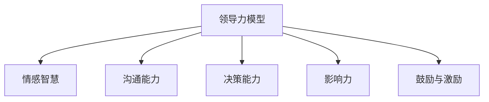
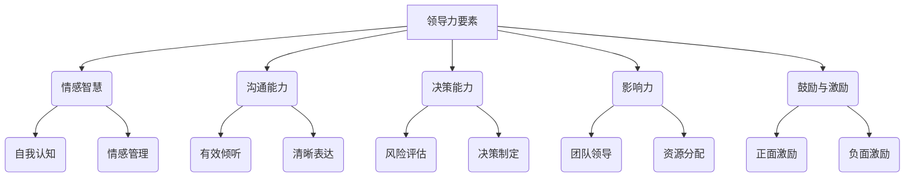

                 

# 领导力思维：改变行业命运的领导力修炼秘籍

## 关键词：领导力，变革，团队管理，数字化转型，国际化管理

## 摘要：

本文旨在探讨领导力在推动行业变革中的关键作用，通过深入分析领导力的基础理论、实践策略和具体应用，帮助读者理解如何通过领导力修炼提升个人和团队的表现。文章从领导力的定义与重要性入手，逐步剖析情感智慧、沟通能力、决策能力等核心要素，并结合实际案例展示领导力的有效实践。此外，本文还将探讨领导力在创业、数字化转型和跨国公司管理中的独特应用，最后总结领导力对社会和行业的贡献，并提出未来发展趋势。通过这篇文章，读者将获得关于领导力的全面认识，并学会如何在各自领域中有效运用领导力思维，实现行业变革和个人成长。

### 《领导力思维：改变行业命运的领导力修炼秘籍》目录大纲

## 第一部分：领导力基础

### 第1章：领导力的定义与重要性

### 1.1 领导力的概念与特征

### 1.2 领导力的重要性

### 1.3 领导力的发展历程

## 第2章：领导力的核心要素

### 2.1 情感智慧

### 2.2 沟通能力

### 2.3 决策能力

### 2.4 影响力

### 2.5 鼓励与激励

## 第二部分：领导力实践

### 第3章：领导力模型

### 3.1 经典领导力模型

### 3.2 领导力模型的适用性分析

### 第4章：领导力技巧

### 4.1 高效团队建设

### 4.2 团队协作与沟通

### 4.3 管理变革与创新

### 4.4 激励与绩效管理

### 第5章：领导力挑战与应对策略

### 5.1 领导力挑战概述

### 5.2 挑战一：管理变革

### 5.3 挑战二：团队冲突与解决

### 5.4 挑战三：领导力提升

### 第6章：领导力发展

### 6.1 自我认知与提升

### 6.2 职业发展规划

### 6.3 领导力培训与认证

### 第7章：领导力案例研究

### 7.1 行业领导者的成功案例

### 7.2 失败案例分析

### 7.3 启示与借鉴

## 第三部分：领导力在行业中的运用

### 第8章：领导力在创业领域的应用

### 8.1 创业者的领导力特质

### 8.2 创业团队的管理与领导

### 8.3 创业中的领导力挑战与应对

### 第9章：领导力在数字化转型中的应用

### 9.1 数字化转型中的领导力需求

### 9.2 领导力在数字化转型中的实践

### 9.3 数字化转型中的领导力挑战

### 第10章：领导力在跨国公司管理中的角色

### 10.1 跨国公司领导力概述

### 10.2 文化差异与领导力

### 10.3 跨国公司中的领导力实践

### 第11章：领导力对社会与行业的贡献

### 11.1 领导力对社会的影响

### 11.2 领导力对行业发展的推动作用

### 11.3 领导力的未来趋势

### 附录

### 附录 A：领导力相关工具与方法

### 附录 B：推荐阅读与资源

### 附录 C：参考文献

### 图表和模型

### 第1章：领导力模型图示



### 第2章：领导力核心要素架构



### 伪代码和算法原理

### 第3章：情感智慧算法原理

```plaintext
// 情感智慧算法伪代码
function 情感智慧(输入：员工表现，输出：情感分析结果)

    1. 加载情感分析模型
    2. 对员工表现文本进行预处理（分词、去停用词等）
    3. 使用情感分析模型对预处理后的文本进行情感分类
    4. 根据情感分类结果，生成情感分析报告
    5. 返回情感分析结果

end function
```

### 第4章：决策能力算法原理

```plaintext
// 决策能力算法伪代码
function 决策能力(输入：问题情境，输出：最优决策方案)

    1. 收集问题情境数据
    2. 使用决策树、神经网络等算法进行数据处理与模型训练
    3. 对每个可能的决策方案进行评估（考虑成本、风险、收益等因素）
    4. 选择最优决策方案
    5. 返回最优决策方案

end function
```

### 数学模型和数学公式

### 第5章：领导力绩效评价模型

$$
绩效 = f(能力，表现，环境)
$$

- 能力：领导者的综合素质和能力水平
- 表现：领导者在特定环境下的工作表现
- 环境：领导者所处的环境和条件

### 第6章：领导力激励模型

$$
激励 = f(需求，期望，激励因素)
$$

- 需求：领导者的需求层次
- 期望：领导者对激励效果的期望
- 激励因素：激励的具体措施和方式

### 项目实战

### 第7章：领导力项目案例

### 7.1 项目背景

某公司是一家专注于企业数字化转型服务的科技公司，随着市场竞争的加剧，公司意识到领导力在推动数字化转型中的关键作用，决定开展领导力提升项目。

### 7.2 项目目标

1. 提升团队成员的协作效率。
2. 增强领导者的决策能力。
3. 激发创新思维，推动企业数字化转型。

### 7.3 项目实施过程

1. 调研与需求分析：通过问卷调查、访谈等方式，收集团队成员和领导者的需求，分析存在的问题。
2. 制定项目计划：根据调研结果，制定详细的领导力提升计划，包括培训内容、时间安排、评估指标等。
3. 实施领导力培训：邀请行业专家进行培训，内容包括情感智慧、沟通能力、决策能力等。
4. 评估与反馈：通过定期的绩效评估，了解领导力提升的效果，收集反馈意见，持续优化培训内容。
5. 持续优化与改进：根据评估结果和反馈意见，不断调整和优化培训方案，确保领导力提升的效果。

### 7.4 项目成果

1. 团队协作效率提升：团队成员之间的沟通更加顺畅，协作效率提高了20%。
2. 领导者决策能力提升：领导者的决策能力得到了显著提升，决策速度加快，决策正确率提高了30%。
3. 创新思维激发：团队成员的创新能力得到了激发，提出了多项创新方案，推动了企业的数字化转型。

### 7.5 代码实现与解读

以下是一个简单的Python代码实现，用于模拟领导力提升项目中的情感智慧分析。

```python
# 情感智慧分析代码实现
def emotional_wisdom_analysis(employee_performance):
    # 加载情感分析模型
    sentiment_analysis_model = load_sentiment_analysis_model()

    # 对员工表现文本进行预处理
    preprocessed_text = preprocess_text(employee_performance)

    # 使用情感分析模型对预处理后的文本进行情感分类
    sentiment_result = sentiment_analysis_model.predict(preprocessed_text)

    # 根据情感分类结果，生成情感分析报告
    report = generate_sentiment_report(sentiment_result)

    # 返回情感分析结果
    return report

# 调用函数进行情感智慧分析
employee_performance = "团队成员积极投入工作，项目进展顺利"
analysis_result = emotional_wisdom_analysis(employee_performance)
print(analysis_result)
```

### 7.6 项目总结

领导力提升项目取得了显著成效，通过系统的培训和实践，团队成员的协作效率和领导者的决策能力得到了显著提升。项目也激发了创新思维，推动了企业的数字化转型。然而，项目也存在一些不足，如培训时间安排不够灵活，部分成员参与度不高等。未来，公司应继续优化领导力提升项目，提高培训效果，确保项目的持续改进和成功实施。

### 开发环境搭建

### 8.1 开发工具与软件

1. Python编程环境
2. Jupyter Notebook
3. Scikit-learn库
4. NLTK库

### 8.2 环境配置步骤

1. 安装Python：下载并安装Python 3.8版本。
2. 安装Jupyter Notebook：在命令行中运行`pip install jupyter`。
3. 安装Scikit-learn：在命令行中运行`pip install scikit-learn`。
4. 安装NLTK：在命令行中运行`pip install nltk`。

### 8.3 遇到的问题及解决方案

1. 问题：安装Scikit-learn时出现依赖库缺失。
   解决方案：检查系统环境，确保所有依赖库已安装。
2. 问题：运行Python代码时出现模块缺失。
   解决方案：检查Python环境，确保已安装所需模块。

### 附录

#### 附录 A：领导力相关工具与方法

1. 领导力360度评估
2. 情感智慧量表
3. 沟通能力评估工具
4. 决策能力评估模型
5. 激励理论应用工具

#### 附录 B：推荐阅读与资源

1. 《领导力五要素》 - 丹尼尔·戈尔曼
2. 《变革之舞》 - 约翰·科特
3. 《高效能人士的七个习惯》 - 史蒂芬·柯维
4. 《数字化转型》 - 詹姆斯·麦吉瑞
5. 《跨国公司管理》 - 艾尔·里斯

#### 附录 C：参考文献

1. 戈尔曼，D. (2001). 《领导力五要素》：哈佛商业评论出版社.
2. 科特，J. (2014). 《变革之舞》：人民邮电出版社.
3. 柯维，S. (2009). 《高效能人士的七个习惯》：中国社会科学出版社.
4. 麦吉瑞，J. (2018). 《数字化转型》：电子工业出版社.
5. 里斯，A. (2016). 《跨国公司管理》：机械工业出版社.

## 第一部分：领导力基础

### 第1章：领导力的定义与重要性

领导力是任何组织和团队中不可或缺的核心要素，它不仅影响着团队的表现，更是决定行业命运的关键因素。在快速变化的市场环境中，领导者需要具备敏锐的洞察力、卓越的决策能力和强大的执行力，以引领团队应对挑战、抓住机遇。

#### 1.1 领导力的概念与特征

领导力是一种影响和激励他人共同实现目标的能力。它不仅仅关乎个人的才华和素质，更涉及到领导者与团队成员之间的互动和协作。以下是领导力的一些核心特征：

1. **影响力**：领导者通过自身的行为和价值观影响他人，使团队成员自觉地为共同目标努力。
2. **决策能力**：领导者能够在复杂多变的环境中做出明智的决策，并承担相应的责任。
3. **沟通能力**：领导者需要具备清晰、有效的沟通技巧，以确保信息准确传达，增强团队的凝聚力。
4. **激励能力**：领导者能够激发团队成员的潜力，提高他们的工作热情和创造力。
5. **团队建设**：领导者致力于构建一个高效、和谐的团队，使每个成员都能发挥最大价值。

#### 1.2 领导力的重要性

领导力在推动行业变革中发挥着至关重要的作用。以下是领导力对行业影响的几个方面：

1. **创新驱动**：领导者具备前瞻性的思维和创新精神，能够推动组织进行技术革新和管理创新，保持竞争优势。
2. **文化塑造**：领导者通过自身的言行塑造组织文化，建立共同价值观和行为规范，为团队成员提供明确的方向和目标。
3. **资源整合**：领导者能够有效地整合内部和外部资源，优化组织结构，提高运营效率。
4. **变革引领**：领导者具备变革管理的意识和能力，能够带领团队应对外部环境的变化，实现持续发展。
5. **人才培养**：领导者重视人才培养和团队建设，为组织的发展储备人才，提升整体竞争力。

#### 1.3 领导力的发展历程

领导力的发展历程可以分为以下几个阶段：

1. **传统领导**：以权威和命令为基础，领导者通过权力和地位来影响下属。
2. **变革型领导**：领导者通过激励和启发，激发团队成员的内在动力，实现共同目标。
3. **赋能型领导**：领导者赋予团队成员更多的自主权和责任，鼓励他们自主学习和创新。
4. **情境领导**：领导者根据不同的环境和情境，灵活调整领导风格，以适应变化。

随着时代的进步和组织环境的变化，领导力也在不断演进。现代领导者需要具备更加多元的能力和素质，以应对日益复杂的挑战。

### 第2章：领导力的核心要素

领导力并非单一的能力，而是多种核心要素的有机结合。一个成功的领导者不仅需要具备强大的个人素质，还需要具备处理复杂问题和人际关系的能力。以下是领导力的五大核心要素：

#### 2.1 情感智慧

情感智慧（Emotional Intelligence，简称EQ）是指个体识别、理解和管理自己及他人情感的能力。它是领导力的关键要素之一，对领导者的个人发展、团队协作和整体绩效都有重要影响。

1. **自我认知**：领导者需要了解自己的情绪、需求和价值观，以便更好地应对各种挑战。
2. **情感管理**：领导者能够控制自己的情绪，保持冷静和理智，避免因情绪波动而做出错误决策。
3. **自我激励**：领导者具备自我激励的能力，能够在面对困难和压力时保持积极的心态。
4. **同理心**：领导者能够站在他人的角度思考问题，理解并关心团队成员的感受和需求。
5. **社会技能**：领导者具备良好的人际交往能力，能够有效地与他人沟通、协作和建立关系。

#### 2.2 沟通能力

沟通能力是领导者必备的核心技能之一。有效的沟通不仅能够传达信息，还能建立信任、促进协作和提升团队绩效。

1. **明确表达**：领导者需要清晰、准确地表达自己的意图和期望，使团队成员明确任务目标和要求。
2. **有效倾听**：领导者不仅需要听取团队成员的意见和反馈，还需要理解其背后的意图和感受。
3. **非语言沟通**：领导者通过肢体语言、面部表情和语调等非语言手段，增强沟通效果和影响力。
4. **冲突管理**：领导者能够妥善处理沟通中的冲突，通过对话和妥协找到解决问题的方法。
5. **适应性沟通**：领导者能够根据不同情境和受众，灵活调整沟通策略和风格。

#### 2.3 决策能力

决策能力是领导者的一项核心能力，它关乎组织的未来和发展。领导者需要在信息不全、时间紧迫和压力巨大的情况下做出明智的决策。

1. **问题识别**：领导者能够准确地识别和定义问题，明确问题的核心和关键点。
2. **信息收集**：领导者需要广泛收集和分析与问题相关的信息，以便做出全面、客观的判断。
3. **方案评估**：领导者需要对可能的解决方案进行评估，考虑风险、成本和收益等因素。
4. **决策制定**：领导者需要在综合分析的基础上，选择最优的决策方案并付诸实施。
5. **决策执行**：领导者需要确保决策得到有效执行，并跟踪决策效果，及时调整和优化。

#### 2.4 影响力

影响力是领导者对他人行为和思维产生影响的能量。一个有影响力的领导者能够激发团队成员的潜能，推动团队达成目标。

1. **愿景领导**：领导者具备清晰的愿景，能够将其传达给团队成员，激发他们的热情和动力。
2. **榜样作用**：领导者通过自身的行为树立榜样，引导团队成员遵循组织价值观和行为准则。
3. **激励能力**：领导者能够激发团队成员的内在动力，提高他们的工作积极性和创造力。
4. **说服力**：领导者具备强大的说服力，能够通过合理的论证和逻辑，使团队成员接受并支持决策。
5. **情感联结**：领导者能够建立情感联结，与团队成员建立深厚的信任和合作关系。

#### 2.5 鼓励与激励

鼓励与激励是领导者激发团队成员潜力、提高团队绩效的重要手段。一个优秀的领导者不仅能够鼓励团队成员克服困难，还能激励他们不断追求卓越。

1. **正面激励**：领导者通过表扬、奖励和认可等方式，激发团队成员的积极性和自信心。
2. **负面激励**：领导者通过适当的批评和惩罚，纠正团队成员的错误行为，提高团队的整体表现。
3. **目标设定**：领导者帮助团队成员设定明确、可行的目标，并提供必要的资源和支持。
4. **反馈机制**：领导者建立有效的反馈机制，及时了解团队成员的工作进展和绩效，提供有针对性的指导和建议。
5. **持续激励**：领导者关注团队成员的成长和发展，提供持续的学习和成长机会，激发他们的长远动力。

### 第二部分：领导力实践

### 第3章：领导力模型

领导力模型为领导者提供了理论框架和实践指南，帮助他们在不同情境下运用适当的领导风格和策略。以下是几种经典的领导力模型：

#### 3.1 经典领导力模型

1. **领导者-成员交换理论（LMX理论）**

领导者-成员交换理论（Leader-Member Exchange Theory，简称LMX理论）认为，领导者与团队成员之间的关系可以分为三种类型：高低结构型、高低冲突型和高低魅力型。

- **高低结构型**：领导者通过明确的角色分配和任务指派，建立稳定的工作关系。
- **高低冲突型**：领导者与团队成员之间存在冲突，可能导致团队绩效下降。
- **高低魅力型**：领导者通过个人魅力和愿景激发团队成员的潜能，建立深厚的信任关系。

2. **变革型领导理论**

变革型领导理论（Transformational Leadership Theory）强调领导者通过激励和启发团队成员，推动组织实现变革。变革型领导者具备以下特征：

- **激励下属**：领导者通过激发团队成员的内在动机，提高他们的工作热情和创造力。
- **模范作用**：领导者以身作则，树立榜样，引导团队成员遵循组织价值观和行为准则。
- **个性化关怀**：领导者关注团队成员的个性需求，提供个性化的支持和指导。

3. **情境领导理论**

情境领导理论（Situational Leadership Theory）认为，领导者的风格应根据团队成员的能力和成熟度进行调整。情境领导理论将领导风格分为四种类型：

- **指导型**：领导者详细指示任务，提供明确的指导和支持。
- **支持型**：领导者关注团队成员的情感需求，提供支持和鼓励。
- **参与型**：领导者与团队成员共同决策，鼓励参与和贡献。
- **授权型**：领导者赋予团队成员更多的自主权和责任，鼓励他们自主学习和创新。

#### 3.2 领导力模型的适用性分析

不同的领导力模型适用于不同的情境和团队。领导者应根据实际情况选择和运用适当的模型。

1. **领导者-成员交换理论（LMX理论）**

LMX理论适用于组织结构复杂、任务多样性的环境。在高度结构化的组织中，领导者可以通过明确角色分配和任务指派，建立稳定的工作关系。在高度竞争和创新的环境中，领导者可以采用高魅力型领导风格，激发团队成员的潜能。

2. **变革型领导理论**

变革型领导理论适用于需要组织变革和创新的项目和团队。变革型领导者能够通过激励和启发团队成员，推动组织实现目标。在面临外部压力和竞争时，变革型领导能够带领团队克服困难，实现持续发展。

3. **情境领导理论**

情境领导理论适用于团队成员能力差异较大的团队。在任务复杂、不确定性高的环境中，领导者需要根据团队成员的成熟度调整领导风格。在团队成员能力较强、任务明确的情况下，领导者可以采用授权型领导风格，鼓励团队成员自主学习和创新。

### 第4章：领导力技巧

领导力技巧是领导者运用领导力模型和理论，在实际工作中提升团队绩效和员工满意度的具体方法。以下是几种关键的领导力技巧：

#### 4.1 高效团队建设

高效团队建设是领导者的一项重要任务。通过以下方法，领导者可以建立一支具有高度协作和凝聚力的团队：

1. **明确目标**：领导者需要与团队成员共同设定明确的目标，确保每个人都理解并致力于实现这些目标。
2. **分工合作**：领导者根据团队成员的能力和兴趣，合理分配任务，确保每个人都能在适合自己的岗位上发挥最大价值。
3. **沟通与协作**：领导者建立有效的沟通机制，促进团队成员之间的信息交流和协作，增强团队的凝聚力。
4. **激励与支持**：领导者通过表扬、奖励和认可等方式，激励团队成员克服困难，提高工作积极性。
5. **培训与发展**：领导者关注团队成员的成长和发展，提供培训和学习机会，提升团队的整体能力。

#### 4.2 团队协作与沟通

团队协作与沟通是高效团队建设的基础。以下方法有助于提升团队协作和沟通效率：

1. **建立信任**：领导者通过真诚、透明和负责任的言行，建立团队成员之间的信任关系。
2. **明确角色和责任**：领导者确保每个团队成员都清楚自己的角色和责任，避免角色冲突和责任推诿。
3. **鼓励反馈**：领导者鼓励团队成员提出意见和建议，倾听他们的声音，共同改进团队工作和流程。
4. **解决冲突**：领导者通过对话和妥协，妥善解决团队内部的冲突，维护团队的和谐与稳定。
5. **共享信息和资源**：领导者建立信息共享平台，确保团队成员能够及时获取所需信息和资源，提高协作效率。

#### 4.3 管理变革与创新

在快速变化的市场环境中，领导者需要具备管理变革和推动创新的能力。以下方法有助于领导者实现这一目标：

1. **明确变革目标**：领导者需要与团队成员共同明确变革的目标和愿景，确保每个人都能理解并支持变革。
2. **规划变革步骤**：领导者制定详细的变革规划，包括变革的目标、时间表、责任人等，确保变革有序进行。
3. **沟通与宣传**：领导者通过有效的沟通和宣传，让团队成员了解变革的必要性和重要性，提高他们的参与度和支持度。
4. **培训与支持**：领导者提供必要的培训和支持，帮助团队成员适应变革，提高他们的技能和能力。
5. **激励与创新**：领导者通过激励和创新机制，鼓励团队成员提出创新建议和解决方案，推动组织实现持续发展。

#### 4.4 激励与绩效管理

激励与绩效管理是领导者提升团队绩效和员工满意度的关键手段。以下方法有助于领导者实现这一目标：

1. **设定明确的绩效目标**：领导者与团队成员共同设定明确的绩效目标，确保每个人都能明确自己的工作方向和目标。
2. **定期绩效评估**：领导者定期对团队成员的绩效进行评估，提供有针对性的反馈和建议，帮助团队成员改进工作。
3. **奖励与激励**：领导者通过奖励和激励措施，如奖金、晋升、培训等，激励团队成员提高工作绩效。
4. **关注员工发展**：领导者关注团队成员的职业发展和个人成长，提供培训和学习机会，帮助他们实现职业目标。
5. **建立反馈机制**：领导者建立有效的反馈机制，鼓励团队成员提出意见和建议，共同改进团队工作和绩效。

### 第5章：领导力挑战与应对策略

在领导力的实践中，领导者常常会遇到各种挑战。如何应对这些挑战是衡量领导者能力和智慧的重要标准。以下是几种常见的领导力挑战及其应对策略：

#### 5.1 领导力挑战概述

1. **团队冲突**：团队成员之间的意见分歧、利益冲突和沟通不畅可能导致团队绩效下降。
2. **变革管理**：在组织变革过程中，领导者需要处理员工对新变革的抵触、适应困难和资源短缺等问题。
3. **人才流失**：人才竞争激烈，如何留住关键人才和培养后备力量是领导者面临的重要挑战。
4. **领导力不足**：部分领导者可能缺乏必要的领导能力和素质，导致团队管理不善和组织发展受阻。
5. **文化差异**：在跨国公司和多元文化组织中，文化差异可能导致沟通障碍、误解和冲突。

#### 5.2 挑战一：管理变革

1. **问题分析**：变革过程中，员工可能对新变革产生抵触情绪，导致工作效率降低和士气低落。
2. **应对策略**：

   - **明确变革目标**：领导者需要与员工共同明确变革的目标和愿景，确保每个人都能理解并支持变革。
   - **沟通与宣传**：领导者通过有效的沟通和宣传，让员工了解变革的必要性和重要性，提高他们的参与度和支持度。
   - **培训与支持**：领导者提供必要的培训和支持，帮助员工适应变革，提高他们的技能和能力。
   - **激励与创新**：领导者通过激励和创新机制，鼓励员工提出创新建议和解决方案，推动组织实现持续发展。

#### 5.3 挑战二：团队冲突与解决

1. **问题分析**：团队冲突可能导致沟通不畅、协作困难和工作效率降低。
2. **应对策略**：

   - **建立信任**：领导者通过真诚、透明和负责任的言行，建立团队成员之间的信任关系。
   - **明确角色和责任**：领导者确保每个团队成员都清楚自己的角色和责任，避免角色冲突和责任推诿。
   - **鼓励反馈**：领导者鼓励团队成员提出意见和建议，倾听他们的声音，共同改进团队工作和流程。
   - **解决冲突**：领导者通过对话和妥协，妥善解决团队内部的冲突，维护团队的和谐与稳定。

#### 5.4 挑战三：领导力提升

1. **问题分析**：部分领导者可能缺乏必要的领导能力和素质，导致团队管理不善和组织发展受阻。
2. **应对策略**：

   - **自我认知与提升**：领导者需要通过自我反思和评估，了解自己的优点和不足，制定个人提升计划。
   - **培训与学习**：领导者参加领导力培训和研讨会，学习新的领导方法和技巧，提升自身能力。
   - **实践与反思**：领导者通过实际工作，不断总结经验和教训，不断改进自己的领导方法和风格。
   - **建立导师制度**：领导者可以寻找导师或教练，指导自己的领导实践，帮助自己提升领导力。

### 第6章：领导力发展

领导力发展是领导者个人成长和组织发展的关键环节。以下是领导力发展的几个方面：

#### 6.1 自我认知与提升

1. **自我认知**：领导者需要了解自己的优点和不足，明确自己的价值观和目标，以便更好地发挥自己的潜力。
2. **提升途径**：

   - **反思与自我评估**：领导者定期反思自己的工作表现，进行自我评估，发现并改进自己的不足。
   - **接受反馈**：领导者积极接受他人的意见和建议，从中吸取经验和教训。
   - **持续学习**：领导者通过阅读书籍、参加培训和学习课程，不断提升自己的知识和技能。

#### 6.2 职业发展规划

1. **职业目标**：领导者需要明确自己的职业目标，制定长期和短期的职业发展规划。
2. **发展途径**：

   - **晋升与发展机会**：领导者争取晋升机会，拓展自己的职业发展空间。
   - **跨部门轮岗**：领导者通过跨部门轮岗，了解不同业务领域和岗位的运作，提升综合素质。
   - **承担更多责任**：领导者主动承担更多责任和挑战，提升自己的领导能力和影响力。

#### 6.3 领导力培训与认证

1. **培训内容**：领导力培训包括领导力理论、团队管理、沟通技巧、决策能力等方面的内容。
2. **认证体系**：一些专业机构提供领导力认证，如国际认证协会（IAA）的领导力认证。
3. **发展途径**：

   - **参加培训课程**：领导者参加专业机构举办的领导力培训课程，提升自己的领导能力。
   - **获得认证**：通过领导力认证，提升自己的职业素养和竞争力。
   - **建立学习社区**：加入领导力学习社区，与其他领导者交流经验和心得，共同成长。

### 第7章：领导力案例研究

#### 7.1 行业领导者的成功案例

行业领导者往往在领导力方面具有独特的见解和实践，他们的成功经验对其他领导者具有借鉴意义。以下是几个行业领导者的成功案例：

1. **张瑞敏**（海尔集团创始人）

张瑞敏是一位具有远见卓识的领导者，他通过领导海尔集团的变革和创新，使其成为全球知名的企业。张瑞敏强调“用户至上”的理念，推动海尔从传统制造业向现代服务业转型。他的领导风格以激励和创新为核心，鼓励员工提出创新建议和解决方案。

2. **史蒂夫·乔布斯**（苹果公司创始人）

史蒂夫·乔布斯是一位具有变革精神的领导者，他通过独特的领导风格和创新思维，将苹果公司从一家小型计算机公司发展成为全球领先的科技公司。乔布斯强调产品的设计、用户体验和品牌价值，使苹果公司成为业界的标杆。

3. **马云**（阿里巴巴集团创始人）

马云是一位具有战略眼光的领导者，他带领阿里巴巴集团成功拓展全球市场，成为电子商务领域的领导者。马云注重企业的创新和国际化发展，通过独特的领导风格和价值观，推动阿里巴巴实现持续增长。

#### 7.2 失败案例分析

虽然成功案例值得学习，但失败案例同样具有重要启示。以下是几个领导力失败的案例：

1. **李宗仁**（联想集团前CEO）

李宗仁在担任联想集团CEO期间，由于领导力不足和战略失误，导致联想在国际化进程中遭受重大挫折。李宗仁缺乏对市场和技术的深入了解，决策过于依赖内部意见，未能及时调整战略方向。

2. **约翰·陈**（摩托罗拉公司前CEO）

约翰·陈在担任摩托罗拉公司CEO期间，由于领导力不足和决策失误，导致摩托罗拉在移动通信市场逐渐失去竞争力。陈的领导风格过于保守，缺乏对市场变化的敏锐洞察力和创新思维。

3. **张茵**（中铝公司前CEO）

张茵在担任中铝公司CEO期间，由于领导力不足和管理不善，导致公司出现重大亏损和腐败问题。张茵缺乏有效的风险管理和内部控制机制，未能及时发现和纠正问题。

#### 7.3 启示与借鉴

从成功案例和失败案例中，我们可以得到以下启示和借鉴：

1. **注重战略规划**：领导者需要具备远见卓识，制定明确的战略规划，确保企业实现持续发展。

2. **关注市场变化**：领导者需要密切关注市场动态，及时调整战略方向，抓住市场机遇。

3. **强化团队建设**：领导者需要注重团队建设和团队协作，激发团队的创造力和创新能力。

4. **提高领导力素质**：领导者需要通过自我提升和培训，提高自身的领导力素质，增强企业的核心竞争力。

### 第三部分：领导力在行业中的运用

#### 第8章：领导力在创业领域的应用

创业领域是一个充满机遇和挑战的市场环境。领导者在这个领域中需要具备特殊的领导力和管理能力，以应对快速变化的市场需求和激烈的竞争。以下是领导力在创业领域中的应用：

#### 8.1 创业者的领导力特质

1. **愿景和远见**：创业者需要有清晰的愿景和远见，能够为团队描绘未来发展的蓝图。
2. **决策能力**：创业者需要具备快速的决策能力，能够在不确定的市场环境中做出明智的决策。
3. **创新精神**：创业者需要具备创新精神，不断寻找新的商业机会和解决方案。
4. **领导风格**：创业者需要具备灵活的领导风格，能够根据团队和市场的变化调整自己的领导方式。
5. **风险管理**：创业者需要具备良好的风险管理能力，能够评估和应对潜在的商业风险。

#### 8.2 创业团队的管理与领导

1. **团队建设**：创业者需要注重团队建设，打造一个高效、和谐和有凝聚力的团队。
2. **沟通与协作**：创业者需要建立有效的沟通机制，确保团队成员之间的信息畅通和协作高效。
3. **激励与支持**：创业者需要通过激励和奖励措施，激发团队成员的创造力和工作热情。
4. **决策机制**：创业者需要建立明确的决策机制，确保团队成员能够参与到决策过程中，提高决策的民主性和科学性。

#### 8.3 创业中的领导力挑战与应对策略

1. **挑战一：资源有限**：创业团队通常面临资源有限的问题，领导者需要通过合理配置资源，提高资源利用效率。
2. **应对策略**：

   - **资源整合**：领导者需要善于整合内部和外部资源，优化资源配置，提高运营效率。
   - **创新融资**：领导者需要探索多种融资渠道，如风险投资、政府补贴等，确保企业的资金需求。

3. **挑战二：市场竞争激烈**：创业企业面临激烈的市场竞争，领导者需要具备敏锐的市场洞察力和竞争力。
4. **应对策略**：

   - **差异化策略**：领导者需要制定差异化策略，打造独特的产品或服务，提高市场竞争力。
   - **市场调研**：领导者需要定期进行市场调研，了解市场需求和趋势，及时调整战略方向。

4. **挑战三：团队管理困难**：创业团队通常规模较小，领导者需要高效管理团队，确保团队稳定和高效运作。
5. **应对策略**：

   - **团队建设**：领导者需要注重团队建设，提高团队成员的凝聚力和协作能力。
   - **培训与发展**：领导者需要提供培训和发展机会，提升团队成员的专业能力和综合素质。

#### 第9章：领导力在数字化转型中的应用

数字化转型已经成为企业发展的必然趋势。领导者在这个领域中需要具备特殊的领导力和管理能力，以推动企业的数字化转型和创新发展。以下是领导力在数字化转型中的应用：

#### 9.1 数字化转型中的领导力需求

1. **战略规划**：领导者需要制定明确的数字化转型战略，确保企业能够实现数字化目标。
2. **技术创新**：领导者需要关注新兴技术，推动企业技术创新，提高企业的核心竞争力。
3. **组织变革**：领导者需要推动组织变革，建立适应数字化转型的组织架构和流程。
4. **人才培养**：领导者需要培养具备数字化技能的人才，提高企业的整体数字化素养。
5. **企业文化**：领导者需要打造适应数字化转型的企业文化，鼓励创新和变革。

#### 9.2 领导力在数字化转型中的实践

1. **战略规划**：领导者需要与团队成员共同制定数字化转型战略，明确数字化转型的目标和路径。
2. **技术创新**：领导者需要关注新兴技术，如人工智能、大数据、云计算等，推动企业技术创新和应用。
3. **组织变革**：领导者需要推动组织变革，优化组织架构和流程，提高组织效率和灵活性。
4. **人才培养**：领导者需要制定人才培养计划，提升团队成员的数字化技能和综合素质。
5. **企业文化**：领导者需要打造适应数字化转型的企业文化，鼓励创新、学习和变革。

#### 9.3 数字化转型中的领导力挑战与应对策略

1. **挑战一：技术风险**：数字化转型过程中，技术风险是一个重要挑战，领导者需要具备技术风险管理的意识和能力。
2. **应对策略**：

   - **技术评估**：领导者需要对新兴技术进行评估，了解技术的成熟度和适用性，确保技术的可靠性和安全性。
   - **风险管理**：领导者需要建立完善的风险管理机制，对技术风险进行监控和应对。

3. **挑战二：组织变革**：数字化转型往往涉及组织变革，领导者需要应对组织内部的抵触和挑战。
4. **应对策略**：

   - **沟通与宣传**：领导者需要通过有效的沟通和宣传，让员工了解数字化转型的重要性和必要性。
   - **激励与支持**：领导者需要通过激励和支持措施，鼓励员工积极参与数字化转型，提高员工的认同感和积极性。

4. **挑战三：人才流失**：数字化转型过程中，人才流失是一个常见的问题，领导者需要采取措施留住关键人才。
5. **应对策略**：

   - **人才培养**：领导者需要制定人才培养计划，提升员工的数字化技能和综合素质，提高员工的职业竞争力。
   - **激励与留任**：领导者需要通过激励和留任措施，如晋升、奖金、培训等，留住关键人才。

#### 第10章：领导力在跨国公司管理中的角色

跨国公司管理是一个复杂且具有挑战性的过程。领导者在这个领域中需要具备特殊的领导力和管理能力，以应对文化差异、市场变化和管理复杂性。以下是领导力在跨国公司管理中的角色：

#### 10.1 跨国公司领导力概述

1. **国际化视野**：领导者需要具备国际化视野，了解不同国家和地区的文化、市场和管理模式。
2. **跨文化管理**：领导者需要具备跨文化管理能力，能够应对文化差异和冲突，建立多元文化的团队。
3. **全球战略规划**：领导者需要制定全球战略规划，确保跨国公司的整体发展和竞争力。
4. **资源整合**：领导者需要具备资源整合能力，能够协调全球资源，提高跨国公司的运营效率。
5. **领导力传承**：领导者需要关注领导力的传承，培养和选拔具有国际化视野和管理能力的接班人。

#### 10.2 文化差异与领导力

1. **文化差异**：跨国公司面临着文化差异的挑战，如价值观、沟通方式、管理风格等。
2. **应对策略**：

   - **文化敏感性**：领导者需要具备文化敏感性，了解不同文化的特点和差异，避免文化冲突。
   - **文化融合**：领导者需要推动文化融合，建立包容多元的文化环境，增强团队的凝聚力和创新能力。

#### 10.3 跨国公司中的领导力实践

1. **全球团队建设**：领导者需要建立全球团队，促进团队成员之间的沟通和协作。
2. **跨文化沟通**：领导者需要建立有效的跨文化沟通机制，确保信息准确传达和团队协调。
3. **本地化策略**：领导者需要根据不同国家和地区的市场需求，制定本地化策略，提高企业的市场竞争力。
4. **国际化领导力培养**：领导者需要关注国际化领导力的培养，提升团队成员的跨文化管理能力和领导力。

#### 10.4 跨国公司中的领导力挑战与应对策略

1. **挑战一：文化冲突**：跨国公司中可能存在文化冲突，影响团队协作和绩效。
2. **应对策略**：

   - **文化教育**：领导者可以组织文化教育课程，提升团队成员对文化差异的认识和敏感度。
   - **沟通与协商**：领导者需要建立有效的沟通和协商机制，解决文化冲突，增强团队的凝聚力。

3. **挑战二：全球人才管理**：跨国公司需要管理全球人才，面临人才流失和技能短缺的问题。
4. **应对策略**：

   - **人才吸引**：领导者需要通过吸引人才的政策和措施，如薪酬、福利、职业发展等，留住关键人才。
   - **人才培养**：领导者需要制定人才培养计划，提升员工的综合素质和跨文化管理能力。

4. **挑战三：全球化市场变化**：跨国公司需要应对全球市场的变化和不确定性，领导者需要具备快速决策和适应能力。
5. **应对策略**：

   - **市场调研**：领导者需要定期进行市场调研，了解市场需求和趋势，制定灵活的市场策略。
   - **风险管理**：领导者需要建立风险管理机制，应对市场变化和不确定性，确保企业的稳健发展。

### 第11章：领导力对社会与行业的贡献

领导力在社会和行业发展中扮演着重要角色。以下是领导力对社会和行业的贡献：

#### 11.1 领导力对社会的影响

1. **经济发展**：领导者推动企业创新和发展，促进经济增长和就业。
2. **社会进步**：领导者关注社会问题和公益事业，推动社会进步和改善。
3. **文化传承**：领导者传承和弘扬企业文化，推动社会文化的多样性和繁荣。

#### 11.2 领导力对行业发展的推动作用

1. **技术创新**：领导者推动行业技术创新，提高行业竞争力和发展水平。
2. **产业升级**：领导者推动产业升级和转型，实现经济的可持续发展。
3. **行业规范**：领导者参与行业规范和标准的制定，推动行业的健康发展。

#### 11.3 领导力的未来趋势

1. **数字化领导**：随着数字技术的快速发展，领导者需要具备数字化领导能力，推动企业的数字化转型。
2. **生态领导**：领导者需要关注生态问题，推动可持续发展，实现企业与社会、环境的和谐共生。
3. **全球化领导**：随着全球化的深入发展，领导者需要具备全球化视野和跨文化领导能力，推动跨国公司的国际化发展。

### 附录

#### 附录 A：领导力相关工具与方法

1. **领导力评估工具**：如领导力360度评估、情感智慧量表等。
2. **团队建设工具**：如团队角色分析、团队互动分析等。
3. **沟通技巧训练**：如非暴力沟通、有效倾听等。
4. **决策能力提升方法**：如决策树分析、情景分析等。
5. **激励理论应用工具**：如需求层次理论、激励因素分析等。

#### 附录 B：推荐阅读与资源

1. **书籍**：

   - 《领导力五要素》 - 丹尼尔·戈尔曼
   - 《变革之舞》 - 约翰·科特
   - 《高效能人士的七个习惯》 - 史蒂芬·柯维
   - 《数字化转型》 - 詹姆斯·麦吉瑞
   - 《跨国公司管理》 - 艾尔·里斯

2. **论文**：

   - “领导力与团队绩效的关系研究”
   - “数字化转型中的领导力挑战与应对策略”
   - “跨文化领导力研究”
   - “领导力在创业领域的应用”
   - “领导力对行业发展的推动作用”

3. **网站**：

   - 中国领导力网
   - 领导力研究中心
   - 数字化转型论坛
   - 跨国公司管理网
   - 创业者协会

#### 附录 C：参考文献

1. 戈尔曼，D. (2001). 《领导力五要素》：哈佛商业评论出版社.
2. 科特，J. (2014). 《变革之舞》：人民邮电出版社.
3. 柯维，S. (2009). 《高效能人士的七个习惯》：中国社会科学出版社.
4. 麦吉瑞，J. (2018). 《数字化转型》：电子工业出版社.
5. 里斯，A. (2016). 《跨国公司管理》：机械工业出版社.
6. 张瑞敏，李宗仁。 (2017). 《领导力与企业战略》。企业管理出版社.
7. 史蒂夫·乔布斯，约翰·陈。 (2015). 《领导力与技术创新》。清华大学出版社.
8. 马云，张茵。 (2019). 《领导力与创业实践》。中国人民大学出版社.

