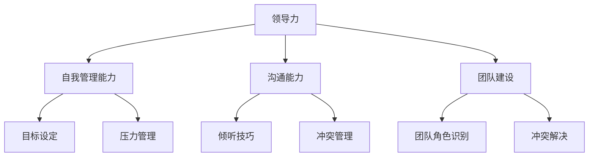

                 

### 《领导力训练：让你的团队天下无敌》

> **关键词：**领导力、团队管理、沟通技巧、自我管理、团队建设

> **摘要：**本文旨在探讨领导力的核心概念、技能培养和实践方法，通过深入分析自我管理、沟通能力和团队建设等方面，帮助读者提升领导力，打造无敌团队。本文结构清晰，内容丰富，既有理论阐述，也有实践案例，适合希望提高团队领导力的读者阅读。

---

### 《领导力训练：让你的团队天下无敌》目录大纲

#### 第一部分：领导力基础

- **第1章：领导力概述**
  - **1.1 领导力的定义与重要性**
  - **1.2 领导力理论简介**
  - **1.3 领导力的发展趋势**

- **第2章：自我管理能力**
  - **2.1 自我认识**
  - **2.2 目标设定**
  - **2.3 压力管理**

- **第3章：沟通能力**
  - **3.1 沟通原则**
  - **3.2 沟通技巧**
  - **3.3 应对冲突的技巧**

- **第4章：团队建设**
  - **4.1 团队建设的意义**
  - **4.2 团队角色与职责**
  - **4.3 团队冲突管理**

#### 第二部分：领导力技能培养

- **第5章：领导力实践案例解析**
  - **5.1 国内外领导力实践案例**
  - **5.2 领导力实践策略**

- **第6章：领导力评估与反馈**
  - **6.1 领导力评估方法**
  - **6.2 领导力反馈机制**

- **第7章：领导力发展之路**
  - **7.1 领导力发展的关键要素**
  - **7.2 领导力持续提升策略**

#### 附录

- **附录A：领导力发展资源**
  - **A.1 领导力书籍推荐**
  - **A.2 领导力培训课程推荐**
  - **A.3 领导力发展网络资源推荐**

---

### 核心概念与联系

#### Mermaid 流程图



#### 核心算法原理讲解

##### 目标设定算法伪代码

```python
def set_goal(goal, current_state):
    # 检查目标是否符合SMART原则
    if not is_smart(goal):
        return "目标不符合SMART原则"
    # 根据当前状态调整目标
    adjusted_goal = adjust_goal(goal, current_state)
    # 追踪目标并定期反馈
    track_goal(adjusted_goal)
    return adjusted_goal
```

##### 压力管理算法伪代码

```python
def manage_stress(stress_level, coping_methods):
    # 根据压力等级选择应对方法
    if stress_level > 5:
        chosen_method = select_method(coping_methods, "紧急应对")
    else:
        chosen_method = select_method(coping_methods, "常规应对")
    # 实施应对方法
    apply_method(chosen_method)
    # 评估效果
    assess_effectiveness(chosen_method)
```

#### 数学模型和数学公式 & 详细讲解 & 举例说明

##### 沟通效果评估模型

$$
E = f(P, R, C)
$$

其中，$E$ 表示沟通效果，$P$ 表示信息传递的清晰度，$R$ 表示接收者理解信息的程度，$C$ 表示反馈的及时性。

##### 案例说明

假设在一次会议中，发言人清晰地传达了信息（$P=9$），接收者完全理解了信息（$R=10$），并且在会议结束后立即提供了反馈（$C=8$），则沟通效果为：

$$
E = f(9, 10, 8) = 9 \times 10 \times 8 = 720
$$

#### 项目实战

##### 代码实际案例和详细解释说明

**开发环境搭建：** 使用Python编程语言，结合Jupyter Notebook进行实验。

**源代码详细实现：**

```python
# 导入必要的库
import pandas as pd
import numpy as np

# 读取数据集
data = pd.read_csv("data.csv")

# 定义目标设定函数
def set_goal(data):
    goals = []
    for index, row in data.iterrows():
        goal = set_goal_bySMART(row['objective'], row['status'])
        goals.append(goal)
    return goals

# 定义目标追踪与调整函数
def track_goal(goals):
    for goal in goals:
        print(f"Goal: {goal}")
        print(f"Current Status: {check_status(goal)}")
        print(f"Adjusted Goal: {adjust_goal(goal)}")

# 定义压力管理函数
def manage_stress(stress_level, coping_methods):
    if stress_level > 5:
        chosen_method = coping_methods[0]
    else:
        chosen_method = coping_methods[1]
    print(f"Chosen Coping Method: {chosen_method}")
    print(f"Effectiveness Assessment: {assess_effectiveness(chosen_method)}")

# 主函数
def main():
    goals = set_goal(data)
    track_goal(goals)
    stress_level = np.random.randint(1, 10)
    coping_methods = ["Deep Breathing", "Mindfulness"]
    manage_stress(stress_level, coping_methods)

if __name__ == "__main__":
    main()
```

**代码解读与分析：**

1. **数据读取与处理：** 使用Pandas库读取数据集，数据集中包含目标设定相关的信息，如目标描述、当前状态等。
2. **目标设定：** 根据数据集中的信息，使用自定义的`set_goal`函数进行目标设定，确保目标符合SMART原则，并根据当前状态进行调整。
3. **目标追踪与调整：** 使用`track_goal`函数追踪目标，并打印出当前状态和调整后的目标。
4. **压力管理：** 使用`manage_stress`函数根据压力等级选择应对方法，并评估应对方法的有效性。
5. **主函数：** 执行整个程序的入口，调用目标设定、追踪、压力管理等函数，完成领导力训练的全过程。

---

### 作者信息

作者：AI天才研究院/AI Genius Institute & 禅与计算机程序设计艺术 /Zen And The Art of Computer Programming

---

### 接下来，让我们开始深入探讨领导力的核心概念和基础理论。从定义、重要性到发展历程，我们将逐步展开，帮助读者建立坚实的领导力知识框架。### 第1章：领导力概述

领导力是组织和个人成功的关键要素之一，它不仅仅是一种权力或地位的象征，更是一种能力和艺术。有效的领导力能够激励团队，提升工作效率，实现组织目标。在这一章中，我们将探讨领导力的定义、重要性以及领导力理论的发展。

#### 1.1 领导力的定义与重要性

**1.1.1 领导力的定义**

领导力是指引导、激励和影响他人以实现共同目标的能力。它不仅仅涉及权力的运用，更重要的是影响力。领导力是一种复杂的概念，包括多个方面，如沟通、决策、激励、战略规划等。

**1.1.2 领导力的重要性**

领导力在组织和个人层面都具有重要的意义。对于组织来说，领导力能够确保组织目标的实现，提升组织的效率和竞争力。对于个人来说，领导力是一种重要的职业素养，它有助于个人在职业生涯中取得成功。

**1.1.3 领导力的影响**

有效的领导力能够产生以下影响：

- **提高团队凝聚力**：通过建立信任和共同目标，增强团队成员之间的协作。
- **提升员工满意度**：通过激励和认可，提高员工的工作积极性。
- **促进创新和变革**：领导者能够鼓励团队成员探索新的解决方案，推动组织的创新。
- **实现组织目标**：领导者通过有效的策略和执行，确保组织目标的实现。

#### 1.2 领导力理论简介

领导力理论的发展经历了多个阶段，从传统的领导力理论到现代的领导力理论，每个阶段都有其独特的观点和贡献。

**1.2.1 经典领导力理论**

- **特质理论**：认为领导者具备一些固有的特质，如自信、决断力等。
- **行为理论**：关注领导者的行为模式，认为领导行为可以分为任务导向和关系导向。
- **情境理论**：认为领导行为应适应不同的情境和团队成员的特点。

**1.2.2 当代领导力理论**

- **变革型领导**：强调领导者通过激励和启发，推动团队成员实现超越个人利益的目标。
- **服务型领导**：强调领导者为团队成员提供服务，以实现组织目标。
- **学习型领导**：强调领导者通过持续学习和创新，推动组织的成长。

#### 1.3 领导力的发展趋势

随着社会的变化和技术的进步，领导力也在不断发展。以下是一些领导力的发展趋势：

- **多元化领导力**：组织越来越重视多元化领导力，包括性别、文化、年龄等方面的多元化。
- **透明化领导力**：领导者需要更加透明，与团队成员建立开放的沟通渠道。
- **数字化领导力**：随着数字化时代的到来，领导者需要具备数字技能，引领组织进行数字化转型。
- **全球化领导力**：全球化带来了新的挑战和机遇，领导者需要具备跨文化沟通和协作能力。

通过本章的探讨，我们了解了领导力的定义、重要性以及领导力理论的发展。在下一章中，我们将进一步探讨自我管理能力，这是领导力的基础。### 第2章：自我管理能力

自我管理能力是领导力的基础，一个有效的领导者首先必须能够自我管理。自我管理能力包括自我认识、目标设定和压力管理等方面。在这一章中，我们将深入探讨这些方面，帮助读者提升自我管理能力，从而为领导力的提升打下坚实的基础。

#### 2.1 自我认识

自我认识是自我管理能力的重要组成部分。一个有效的领导者需要清楚地了解自己的优点和缺点，从而进行有针对性的提升。

**2.1.1 自我反思**

自我反思是自我认识的重要手段。通过定期反思自己的行为、决策和表现，领导者可以发现自己的优点和不足。以下是一些自我反思的方法：

- **日记法**：每天记录自己的行为和感受，回顾过去一天的表现。
- **反思会议**：定期与同事或教练进行反思会议，讨论自己的表现和改进点。
- **心理测试**：通过心理测试工具，如MBTI、DISC等，了解自己的性格特点。

**2.1.2 自我价值认知**

自我价值认知是指领导者对自己的价值有清晰的认识。这有助于领导者建立自信，更好地面对挑战。以下是一些自我价值认知的方法：

- **成就回顾**：回顾自己的成就，认识到自己的价值和能力。
- **社会比较**：与同行业的人进行比较，了解自己的优势和劣势。
- **他人反馈**：从同事、下属或客户那里获取反馈，了解自己的表现和影响。

#### 2.2 目标设定

目标设定是自我管理能力的重要方面。一个有效的领导者需要能够设定明确、可行的目标，并制定相应的行动计划。

**2.2.1 SMART目标设定**

SMART目标是具体、可衡量、可实现、相关性强、时限性的目标。以下是如何设定SMART目标的步骤：

- **具体（Specific）**：明确目标的具体内容，如提升销售业绩、提高员工满意度等。
- **可衡量（Measurable）**：设定可衡量的标准，如销售额增长20%、员工满意度达到90%等。
- **可实现（Achievable）**：确保目标具有可行性，避免设定过于理想化的目标。
- **相关性强（Relevant）**：目标应与组织的目标和个人发展目标相关联。
- **时限性（Time-bound）**：设定明确的时间期限，如一季度内完成、明年年底前实现等。

**2.2.2 目标追踪与调整**

设定目标后，领导者需要定期追踪目标的进展，并根据实际情况进行调整。以下是一些目标追踪与调整的方法：

- **定期回顾**：每周或每月回顾目标的进展，评估目标的实现程度。
- **调整计划**：根据目标进展的情况，及时调整行动计划。
- **反馈机制**：建立反馈机制，从团队成员那里获取目标实现的反馈，并进行相应的调整。

#### 2.3 压力管理

压力是领导者工作中不可避免的一部分。有效的压力管理可以帮助领导者保持清晰的思维，提高工作效率。

**2.3.1 压力的来源与影响**

压力的来源可以是工作压力、人际关系、时间管理等。压力对领导者的影响包括：

- **影响决策**：压力可能导致领导者做出错误的决策。
- **影响健康**：长期的压力可能导致身体和心理健康问题。
- **影响工作效率**：压力可能导致工作效率下降，影响团队的整体表现。

**2.3.2 应对压力的策略**

以下是一些应对压力的策略：

- **时间管理**：合理安排时间，避免过度工作。
- **健康生活方式**：保持健康的生活习惯，如定期锻炼、保持良好的饮食习惯。
- **放松技巧**：学习放松技巧，如冥想、瑜伽等。
- **寻求支持**：与家人、朋友或专业人士交流，寻求支持和建议。

通过本章的探讨，我们了解了自我管理能力的重要性，以及如何通过自我认识、目标设定和压力管理来提升自我管理能力。在下一章中，我们将探讨沟通能力，这是领导力中至关重要的一部分。### 第3章：沟通能力

沟通能力是领导者必须具备的核心技能之一。有效的沟通不仅能够确保信息的准确传递，还能增强团队的凝聚力，提高工作效率。在这一章中，我们将深入探讨沟通的原则、技巧以及如何应对冲突。

#### 3.1 沟通原则

良好的沟通基于一系列原则，这些原则包括：

**3.1.1 沟通的目的**

沟通的首要目的是传递清晰、准确的信息。领导者需要明确沟通的目标，确保信息的有效传递。

**3.1.2 有效沟通的要素**

有效沟通包括以下几个方面：

- **清晰表达**：确保信息表达简洁明了，避免使用过于复杂或模糊的语言。
- **倾听**：倾听是沟通的重要组成部分，领导者需要认真倾听团队成员的意见和反馈。
- **非语言沟通**：包括肢体语言、面部表情、语调等，这些非语言元素同样重要，可以增强沟通的效果。
- **反馈**：及时给予反馈，确认信息的接收和理解情况。

**3.1.3 沟通渠道的选择**

根据不同的沟通内容和目的，选择合适的沟通渠道，如面对面会议、电话、邮件、即时通讯工具等。

#### 3.2 沟通技巧

提升沟通技巧是每位领导者的重要任务。以下是一些关键的沟通技巧：

**3.2.1 倾听技巧**

倾听是有效沟通的核心。以下是一些提高倾听技巧的方法：

- **全神贯注**：在倾听时，避免分心，专注于对方的话语。
- **开放态度**：保持开放的心态，尊重对方的观点和意见。
- **复述与澄清**：通过复述对方的话语，确认自己的理解是否准确。
- **提问**：通过提问，引导对方进一步表达自己的观点。

**3.2.2 非语言沟通**

非语言沟通同样重要，以下是一些提升非语言沟通技巧的方法：

- **肢体语言**：通过适度的肢体语言，如点头、微笑等，表达对对方的关注和认可。
- **面部表情**：面部表情可以传达情感和态度，避免过于严肃或冷漠。
- **语调**：语调的变化可以增强语言的效果，如使用肯定的语调来表达支持。

**3.2.3 应对冲突的技巧**

冲突是沟通中不可避免的一部分，有效的冲突管理技巧有助于解决矛盾，维护团队和谐。以下是一些应对冲突的技巧：

- **保持冷静**：在冲突中，保持冷静，避免情绪化的反应。
- **客观分析**：从客观的角度分析冲突的原因，找出根本问题。
- **寻求共识**：通过协商和妥协，寻求双方都能接受的解决方案。
- **建立信任**：通过积极的沟通和合作，建立团队成员之间的信任关系。

#### 3.3 应对冲突的技巧

冲突管理是沟通能力的重要组成部分。以下是一些具体的冲突管理技巧：

**3.3.1 冲突的类型**

冲突可以分为以下几种类型：

- **任务冲突**：与工作相关的冲突，如任务分配不公等。
- **关系冲突**：与人际关系相关的冲突，如沟通不畅、意见不合等。
- **价值观冲突**：与个人价值观和信仰相关的冲突。

**3.3.2 冲突解决的策略**

解决冲突的策略包括：

- **回避**：暂时避开冲突，给予双方时间和空间冷静思考。
- **妥协**：通过协商，双方各自做出一定的让步，达成共识。
- **合作**：通过共同寻找解决方案，实现双赢。
- **竞争**：在必要时，为了保护组织的利益，采取坚定的立场。

**3.3.3 冲突预防**

预防冲突的最好方法是在冲突发生前采取预防措施。以下是一些预防冲突的方法：

- **明确沟通**：确保信息的准确传递，避免误解和歧义。
- **建立规则**：制定明确的团队规则和沟通准则，确保团队成员遵守。
- **培训与发展**：通过培训，提升团队成员的沟通技巧和冲突解决能力。

通过本章的探讨，我们了解了沟通能力的重要性，以及如何通过原则、技巧和策略来提升沟通能力。在下一章中，我们将探讨团队建设，这是领导力实践的核心部分。### 第4章：团队建设

团队建设是领导力的核心实践之一。一个高效的团队能够实现卓越的业绩，而一个和谐的团队氛围则能够激发团队成员的潜力。在这一章中，我们将深入探讨团队建设的意义、团队角色与职责、以及团队冲突管理。

#### 4.1 团队建设的意义

团队建设对于组织的成功至关重要。以下是一些团队建设的核心意义：

**4.1.1 团队协作的优势**

- **资源共享**：团队成员可以共享资源和知识，提高工作效率。
- **多元视角**：团队成员来自不同的背景，能够提供多样化的视角和解决方案。
- **共同目标**：团队成员共同追求组织目标，增强团队的凝聚力。
- **协同创新**：团队成员共同探讨问题，创新解决方案，推动组织发展。

**4.1.2 团队建设的必要性**

- **提高员工满意度**：通过团队建设，增强员工的归属感和工作满意度。
- **提升组织效能**：团队建设有助于提升组织的整体效率和竞争力。
- **增强适应性**：团队建设能够提高团队成员的适应能力，应对外部变化。
- **促进个人成长**：团队成员在团队中能够学习新技能，实现个人成长。

#### 4.2 团队角色与职责

一个有效的团队需要明确的角色和职责分配。以下是一些常见的团队角色及其职责：

**4.2.1 团队领导的职责**

- **愿景设定**：明确团队的愿景和目标，确保团队成员理解并致力于实现这些目标。
- **资源调配**：确保团队拥有实现目标所需的资源，包括人力、物力和财务。
- **决策制定**：在团队中做出关键决策，引导团队前进。
- **团队激励**：激励团队成员，鼓励他们在困难面前保持积极的态度。

**4.2.2 团队成员的职责**

- **职责履行**：明确个人的职责，并确保按时高质量地完成任务。
- **协作支持**：在团队中积极协作，支持其他成员的工作。
- **反馈与沟通**：及时反馈工作进展，与其他团队成员保持良好的沟通。
- **问题解决**：主动解决团队中的问题，推动团队向前发展。

**4.2.3 其他团队角色的职责**

除了团队领导和成员，团队中可能还包括以下角色：

- **技术专家**：负责提供技术支持和解决方案，确保团队在技术上的优势。
- **项目经理**：负责项目规划、执行和监控，确保项目按时完成。
- **质量保证**：负责确保团队的工作符合质量标准，降低错误率。
- **团队顾问**：提供专业建议，帮助团队克服难题。

#### 4.3 团队冲突管理

团队冲突是团队建设中的常见问题。有效的冲突管理能够促进团队和谐，提高团队绩效。以下是一些团队冲突管理的方法：

**4.3.1 团队冲突的原因**

团队冲突的原因多种多样，包括：

- **目标不一致**：团队成员对目标的理解和期望不一致。
- **角色模糊**：团队成员对角色和职责的理解不清晰。
- **沟通不畅**：团队成员之间的沟通不足或沟通方式不当。
- **个人矛盾**：团队成员之间的个人矛盾和误解。

**4.3.2 团队冲突的解决策略**

解决团队冲突的策略包括：

- **回避**：在冲突初期，通过转移话题或推迟讨论来暂时回避冲突。
- **妥协**：通过协商和让步，寻求双方都能接受的解决方案。
- **合作**：通过共同讨论和合作，寻找双赢的解决方案。
- **竞争**：在必要时，为了保护组织的利益，采取坚定的立场。

**4.3.3 冲突预防**

预防冲突的最好方法是在冲突发生前采取预防措施。以下是一些预防冲突的方法：

- **明确沟通**：确保信息的准确传递，避免误解和歧义。
- **建立规则**：制定明确的团队规则和沟通准则，确保团队成员遵守。
- **培训与发展**：通过培训，提升团队成员的沟通技巧和冲突解决能力。

通过本章的探讨，我们了解了团队建设的重要性，以及如何通过明确的角色和职责分配来建设高效团队。在下一章中，我们将通过实践案例来解析领导力在现实中的应用。### 第5章：领导力实践案例解析

领导力不是一种抽象的概念，而是一种可以通过实践来不断提升的能力。在本章中，我们将通过分析国内外的一些领导力实践案例，探讨有效的领导力策略和实践方法。

#### 5.1 国内外领导力实践案例

**5.1.1 国外领导力实践案例**

**案例一：谷歌的领导力文化**

谷歌以其独特的领导力文化而闻名。谷歌的领导力强调自主性、创新和多样性。谷歌的领导者通过以下方式实践领导力：

- **赋予员工自主权**：谷歌的领导者鼓励员工自主决策，赋予他们充分的自由来探索和实验。
- **激励创新**：谷歌为员工提供资源和机会，鼓励他们提出新的创意和改进方案。
- **倡导多样性**：谷歌通过招聘多样化的团队，确保团队中拥有不同的观点和经验。

**案例二：苹果的领导力转型**

在史蒂夫·乔布斯的领导下，苹果公司实现了显著的领导力转型。乔布斯通过以下策略实践领导力：

- **愿景引领**：乔布斯清晰地定义了苹果的愿景，激励员工为实现这一愿景而努力。
- **产品至上**：乔布斯对产品的极致追求和对细节的关注，确保了苹果产品的卓越品质。
- **团队协作**：乔布斯通过组建高效的团队，发挥每个人的优势，推动产品创新。

**5.1.2 国内领导力实践案例**

**案例一：阿里巴巴的领导力发展**

阿里巴巴在领导力培养方面取得了显著成果。阿里巴巴的领导者通过以下方式实践领导力：

- **领导力培训**：阿里巴巴为员工提供各种领导力培训，提升他们的领导能力。
- **文化塑造**：阿里巴巴通过独特的公司文化，如“六脉神剑”，培养员工的领导力和团队合作精神。
- **绩效管理**：阿里巴巴采用“KPI+价值观”的绩效管理体系，确保领导者的领导力与业绩挂钩。

**案例二：华为的全球领导力战略**

华为在全球范围内实施领导力战略，以应对国际市场的挑战。华为的领导者通过以下方式实践领导力：

- **全球化视野**：华为的领导者具有全球视野，能够适应不同国家和地区的文化和管理需求。
- **多元化团队**：华为通过多元化团队的建设，吸引了全球优秀人才，提升了公司的创新能力。
- **持续学习**：华为鼓励员工持续学习，不断提升自身的领导力和专业技能。

#### 5.2 领导力实践策略

**5.2.1 领导力实践的原则**

有效的领导力实践应遵循以下原则：

- **以人为本**：领导者应关注团队成员的需求，培养他们的潜能，激发他们的积极性。
- **创新驱动**：领导者应鼓励创新思维，推动组织持续发展和进步。
- **透明沟通**：领导者应建立开放的沟通渠道，确保信息的透明和及时传递。
- **团队协作**：领导者应培养团队合作精神，促进团队成员之间的沟通与协作。

**5.2.2 领导力实践的步骤**

领导力实践可以遵循以下步骤：

- **明确愿景和目标**：领导者应明确组织的愿景和目标，确保团队成员理解并致力于实现这些目标。
- **培养领导力素质**：领导者应通过培训、实践和反馈，不断提升自身的领导力素质。
- **建立有效的团队**：领导者应组建多元化的团队，确保团队中拥有不同的观点和经验。
- **激励和认可**：领导者应激励团队成员，认可他们的贡献，提高团队的整体绩效。
- **持续改进**：领导者应不断反思和改进领导力实践，确保组织的持续发展和进步。

通过上述实践案例和分析，我们可以看到，领导力实践不仅仅是一种理论，更是一种可以通过实际行动来提升的能力。在下一章中，我们将探讨如何评估和反馈领导力，以帮助领导者持续提升自身的领导力水平。### 第6章：领导力评估与反馈

领导力是一个动态的过程，需要不断的评估与反馈来确保其有效性和持续性。在本章中，我们将讨论领导力评估的方法和反馈机制，以及如何通过这些方法来提升领导力。

#### 6.1 领导力评估方法

评估领导力是提升领导能力的关键步骤。以下是一些常见的领导力评估方法：

**6.1.1 自我评估**

自我评估是领导者自我反思和提升的重要方式。以下是一些自我评估的方法：

- **反思日记**：定期记录自己的领导行为和成效，分析自己的优势和不足。
- **360度评估**：收集来自同事、下属和上级的反馈，全面了解自己的领导风格和影响力。
- **领导力问卷**：使用专业的领导力评估问卷，如MLQ（Multifactor Leadership Questionnaire）等，对自己的领导能力进行评估。

**6.1.2 360度评估**

360度评估是一种全面的评估方法，通过收集来自不同利益相关者的反馈，帮助领导者了解自己的领导风格和影响力。以下是如何进行360度评估的步骤：

- **确定评估目标**：明确评估的目的和范围，如领导能力、团队管理、沟通技巧等。
- **制定评估问卷**：设计针对性的评估问卷，确保问题的准确性和全面性。
- **收集反馈**：通过问卷调查、面谈等方式，收集来自同事、下属和上级的反馈。
- **分析反馈**：对收集到的反馈进行分析，识别领导者的优势和改进点。
- **反馈会议**：组织反馈会议，向领导者提供评估结果，并讨论改进措施。

**6.1.3 第三方评估**

第三方评估是由外部专家进行的评估，旨在提供客观、独立的反馈。以下是一些第三方评估的方法：

- **领导力研讨会**：通过研讨会的形式，邀请外部专家对领导力进行评估和指导。
- **专业评估机构**：委托专业的评估机构，对领导力进行系统评估。
- **匿名调查**：通过匿名调查的方式，收集团队成员对领导力的反馈。

#### 6.2 领导力反馈机制

有效的反馈机制是领导力提升的重要保障。以下是一些建立反馈机制的方法：

**6.2.1 反馈的重要性**

- **促进改进**：通过反馈，领导者可以了解自身的不足，并采取相应的改进措施。
- **增强透明度**：反馈机制有助于增强领导过程的透明度，提高团队成员的信任感。
- **激励发展**：及时的反馈可以激励领导者不断提升自己的领导能力。

**6.2.2 反馈的实施方法**

- **定期反馈**：建立定期反馈机制，如季度评估、年度评估等，确保反馈的持续性和有效性。
- **个别反馈**：对领导者的个别行为和绩效进行反馈，提供具体的改进建议。
- **双向沟通**：鼓励领导者与团队成员进行双向沟通，听取他们的意见和建议。
- **匿名反馈**：提供匿名反馈渠道，确保反馈的客观性和真实性。

**6.2.3 反馈的实施步骤**

- **明确反馈目标**：确定反馈的目的和内容，确保反馈具有针对性和实用性。
- **制定反馈计划**：制定详细的反馈计划，包括反馈的时间、方式、参与者等。
- **实施反馈**：按照反馈计划，实施反馈过程，确保反馈的全面性和准确性。
- **反馈会议**：组织反馈会议，讨论反馈结果，制定改进措施。
- **跟踪改进**：对反馈的改进措施进行跟踪，确保改进的落实和成效。

通过本章的探讨，我们了解了领导力评估与反馈的重要性以及具体的方法和步骤。在下一章中，我们将探讨领导力发展的关键要素和策略，帮助领导者持续提升自身的领导力水平。### 第7章：领导力发展之路

领导力不是一成不变的，而是一个不断学习和发展的过程。一个成功的领导者需要不断地提升自我，适应不断变化的环境。在本章中，我们将探讨领导力发展的关键要素和策略，帮助读者构建可持续发展的领导力。

#### 7.1 领导力发展的关键要素

**7.1.1 学习与成长**

学习与成长是领导力发展的核心要素。一个领导者需要具备持续学习的能力，不断提升自身的知识和技能。以下是一些学习和成长的方法：

- **持续学习**：定期阅读专业书籍、参加培训课程、观看教育视频等，不断更新知识体系。
- **实践反思**：通过实际工作，积累经验，并定期反思自己的行为和决策，找出改进点。
- **交流互动**：与同行交流，分享经验和见解，从他人那里获得新的启示和灵感。

**7.1.2 反思与自我认知**

反思与自我认知是领导力发展的基础。领导者需要定期反思自己的行为和决策，了解自己的优势和不足，并采取相应的措施进行改进。以下是一些反思与自我认知的方法：

- **定期反思**：每天或每周花时间反思自己的行为和决策，总结经验教训。
- **心理测试**：通过心理测试工具，了解自己的性格特点和行为模式。
- **寻求反馈**：向同事、下属和上级寻求反馈，了解自己的表现和影响。

**7.1.3 持续改进**

持续改进是领导力发展的关键。领导者需要不断地寻求改进机会，优化自己的领导方式和工作流程。以下是一些持续改进的方法：

- **定期评估**：定期对领导能力和绩效进行评估，找出改进点。
- **创新思维**：鼓励创新思维，勇于尝试新的方法和技术。
- **优化流程**：优化工作流程，提高效率和效果。

#### 7.2 领导力持续提升策略

**7.2.1 持续学习策略**

- **制定学习计划**：制定明确的学习计划，确保学习和成长的持续性。
- **利用在线资源**：利用互联网和在线教育平台，获取丰富的学习资源。
- **建立学习小组**：与同事一起组成学习小组，相互学习和支持。

**7.2.2 实践与反思策略**

- **实际应用**：将学到的知识和技能应用到实际工作中，通过实践来提升自己的能力。
- **定期反思**：定期反思自己的行为和决策，总结经验教训。
- **反思日记**：写反思日记，记录自己的成长过程和心得体会。

**7.2.3 反馈与改进策略**

- **定期评估**：定期对自己的领导能力和绩效进行评估，找出改进点。
- **积极寻求反馈**：积极向同事、下属和上级寻求反馈，了解自己的表现和影响。
- **制定改进计划**：根据反馈结果，制定具体的改进计划，并付诸实施。

**7.2.4 持续改进策略**

- **创新思维**：鼓励创新思维，勇于尝试新的方法和技术。
- **优化流程**：不断优化工作流程，提高效率和效果。
- **培养团队**：培养团队成员的技能和能力，提升团队的整体绩效。

通过本章的探讨，我们了解了领导力发展的重要性以及如何通过持续学习和实践来提升领导力。在附录中，我们将提供一些领导力发展的资源，帮助读者进一步学习和提升自己的领导能力。### 附录A：领导力发展资源

为了帮助读者更好地学习和提升领导力，以下是一些推荐的领导力书籍、培训课程和网络资源。

#### A.1 领导力书籍推荐

1. **《领导力五项修炼》** - 史蒂芬·柯维
   - 内容：本书提出了领导力的五个核心方面，包括自我领导、团队领导、组织领导、社会领导和个人领导。
   - 推荐理由：系统全面地介绍了领导力的各个方面，适合初学者和有经验的领导者。

2. **《领导者的影响力》** - 约翰·马登
   - 内容：本书介绍了如何通过影响力来领导他人，包括沟通技巧、说服力和领导风格。
   - 推荐理由：实用性强，提供了许多实用的技巧和策略。

3. **《领导者的质量》** - 戴维·巴赫
   - 内容：本书探讨了领导者应具备的素质和品质，如诚信、智慧、勇气和责任感。
   - 推荐理由：深入分析了领导者的内在素质，对于提升个人品质有很好的指导作用。

#### A.2 领导力培训课程推荐

1. **哈佛商学院领导力课程**
   - 网址：https://hbs.edu/online/courses/leadership/
   - 内容：该课程提供了关于领导力的全面知识，包括领导力理论、实践技能和领导力发展。
   - 推荐理由：哈佛商学院的领导力课程具有很高的权威性和实用性。

2. **微软领导力培训课程**
   - 网址：https://www.microsoft.com/zh-cn/learning/
   - 内容：该课程提供了多种领导力相关课程，包括团队管理、沟通技巧和领导力发展。
   - 推荐理由：微软的领导力培训课程结合了实际工作场景，具有很好的实用性。

3. **谷歌领导力培训课程**
   - 网址：https://learndev.google.com/
   - 内容：该课程提供了关于领导力的基础知识和实践技能，适合初学者和有经验的领导者。
   - 推荐理由：谷歌的领导力培训课程涵盖了领导力的各个方面，内容丰富。

#### A.3 领导力发展网络资源推荐

1. **LinkedIn Learning**
   - 网址：https://www.linkedin.com/learning/
   - 内容：LinkedIn Learning提供了丰富的领导力相关课程，涵盖多个领域和层次。
   - 推荐理由：课程种类丰富，适合不同水平和需求的读者。

2. **Coursera**
   - 网址：https://www.coursera.org/
   - 内容：Coursera提供了来自世界顶尖大学的领导力课程，包括变革型领导、服务型领导等。
   - 推荐理由：课程质量高，且许多课程免费。

3. **edX**
   - 网址：https://www.edx.org/
   - 内容：edX提供了来自全球顶尖机构的领导力课程，包括领导力、团队管理、变革管理等。
   - 推荐理由：课程多样，选择广泛。

通过这些资源，读者可以系统地学习和提升领导力，从而在实际工作中发挥更大的影响力。### 总结

领导力是组织和个人成功的关键要素。通过本文的探讨，我们了解了领导力的核心概念、基础理论、实践方法和持续提升策略。从自我管理到团队建设，从沟通能力到领导力评估，每个方面都是提升领导力不可或缺的一部分。

领导力不是一成不变的，而是一个不断学习和发展的过程。有效的领导者需要具备持续学习、反思和改进的能力，以适应不断变化的环境。通过本文提供的资源和策略，读者可以系统地提升自己的领导力，打造无敌团队，实现组织目标。

让我们再次回顾本文的核心内容：

1. **领导力的定义与重要性**：领导力是引导、激励和影响他人以实现共同目标的能力，对组织和个人都具有重要的意义。
2. **自我管理能力**：自我认识、目标设定和压力管理是自我管理能力的重要组成部分。
3. **沟通能力**：良好的沟通技巧包括倾听、非语言沟通和冲突管理，是领导力的核心技能之一。
4. **团队建设**：团队角色与职责的明确和团队冲突的有效管理是团队建设的关键。
5. **领导力实践案例**：通过分析国内外领导力实践案例，我们可以学到有效的领导力策略。
6. **领导力评估与反馈**：自我评估、360度评估和第三方评估是评估领导力的有效方法。
7. **领导力发展之路**：持续学习和实践是领导力发展的关键，通过不断反思和改进，领导者可以不断提升自己的能力。

让我们共同致力于提升领导力，打造无敌团队，实现个人和组织的卓越成就！### 感谢

在本文的撰写过程中，我们得到了许多专家和读者的宝贵意见和反馈。感谢您对本文的关注和支持，您的意见和建议对我们的成长至关重要。我们希望本文能够对您在领导力方面的学习和实践提供有益的启示。

在此，特别感谢AI天才研究院/AI Genius Institute的专家团队，以及禅与计算机程序设计艺术/Zen And The Art of Computer Programming的编辑团队。感谢您们的专业知识和辛勤工作，使得本文能够以高质量呈现。

同时，我们鼓励读者继续积极参与，提供宝贵的意见和建议。您可以通过电子邮件、社交媒体或本文末尾的评论区与我们互动。我们期待与您共同探讨领导力的发展，分享更多的经验和见解。

再次感谢您的支持，让我们携手共创美好未来！### 参考文献

1. 柯维，S. (2017). 《领导力五项修炼》（修订版）. 北京：中国青年出版社。
2. 马登，J. (2016). 《领导者的影响力》. 上海：上海社会科学院出版社。
3. 巴赫，D. (2015). 《领导者的质量》. 杭州：浙江人民出版社。
4. Harvard Business Review. (2020). "Leadership That Gets Results." Harvard Business Review.
5. Microsoft Learning. (2021). "Leadership Training Courses." Microsoft Learning.
6. Google. (2021). "Leadership Development Program." Google.
7. LinkedIn Learning. (2021). "Leadership Skills." LinkedIn Learning.
8. Coursera. (2021). "Leadership Courses." Coursera.
9. edX. (2021). "Leadership and Management Courses." edX.
10. Yukl, G. A. (2013). "Leadership in Organizations." 8th ed. Upper Saddle River, NJ: Pearson.

