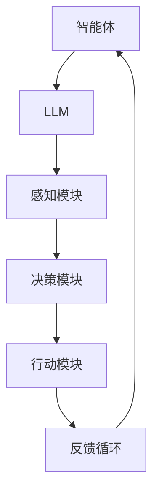
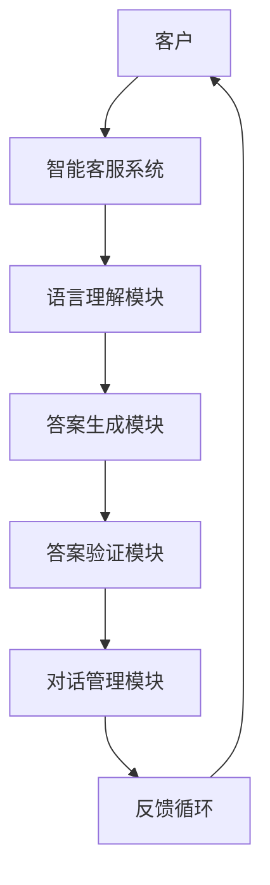
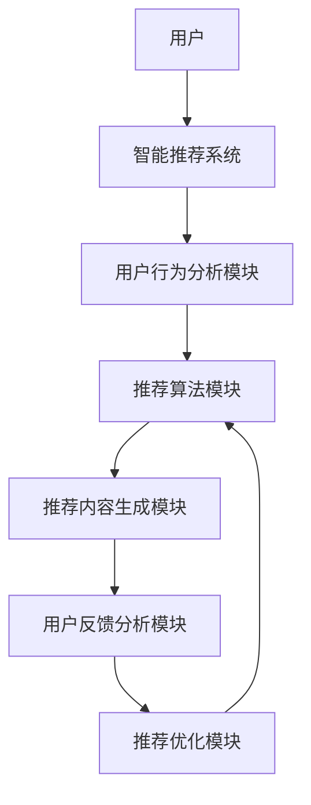
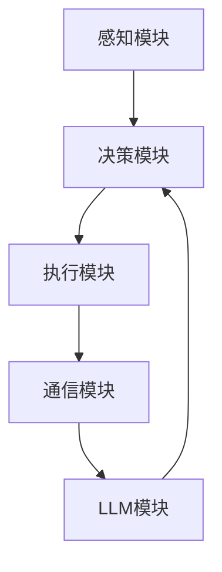

                 

# AI Agent: AI的下一个风口 智能体与LLM的关系

## 关键词

人工智能，智能体，语言模型，大型语言模型（LLM），融合，应用案例，未来发展趋势，技术挑战

## 摘要

本文旨在探讨人工智能（AI）领域的下一个重要风口——智能体与大型语言模型（LLM）的关系。通过对智能体和LLM的基本概念、特点、分类及其在智能体中的应用进行深入分析，本文揭示了智能体与LLM融合的动机、技术挑战和实现策略。同时，通过案例分析，展示了智能体与LLM在实际应用中的成功案例。最后，本文对智能体与LLM的未来发展趋势进行了展望，并提出了面临的挑战和对策。本文的目标是帮助读者全面了解智能体与LLM的关系，为人工智能领域的研究和实践提供指导。

### 目录大纲

1. 引言
   1.1 研究背景
   1.2 研究目标与意义
   1.3 本书结构

2. 智能体与LLM基础
   2.1 智能体基本概念
   2.2 语言模型基础
   2.3 LLM（大型语言模型）概述

3. 智能体与LLM的关系
   3.1 智能体与LLM的融合
   3.2 LLM在智能体中的应用
   3.3 智能体与LLM的协同进化

4. 智能体与LLM的案例分析
   4.1 智能客服
   4.2 智能推荐系统
   4.3 自动驾驶

5. 未来展望与挑战
   5.1 智能体与LLM的未来发展趋势
   5.2 面临的挑战与对策

6. 附录
   6.1 开发环境与工具
   6.2 代码示例与分析
   6.3 相关Mermaid流程图与伪代码

### 引言

#### 1.1 研究背景

近年来，人工智能（AI）技术取得了飞速发展，从传统的机器学习、深度学习到如今的大型语言模型（LLM），AI的应用场景越来越广泛，对各行各业的影响也越来越深远。然而，随着AI技术的不断进步，一个重要的问题也逐渐凸显出来：如何将AI技术更好地应用于实际场景中，实现真正的智能？

智能体（Agent）作为一种能够感知环境、自主行动并获取回报的实体，被视为实现智能的关键。智能体可以分为物理实体和虚拟实体，它们在各种应用领域中发挥着重要作用。例如，机器人作为物理实体，在工业制造、医疗辅助等领域取得了显著成果；而软件代理作为虚拟实体，则在金融交易、智能客服等领域广泛应用。

与此同时，大型语言模型（LLM）作为一种先进的语言处理技术，已经成为自然语言处理（NLP）领域的核心组件。LLM通过学习海量文本数据，可以生成高质量的自然语言文本，进行语言理解、文本生成、对话系统等任务。LLM在AI领域的应用，极大地提升了智能体的自然语言处理能力，为AI技术的发展提供了新的机遇。

本文旨在探讨智能体与LLM的关系，分析智能体与LLM融合的动机、技术挑战和实现策略，以及它们在实际应用中的成功案例。通过本文的研究，希望能够为人工智能领域的研究者提供有益的参考，推动智能体与LLM技术的进一步发展。

#### 1.2 研究目标与意义

本文的研究目标主要包括以下几个方面：

1. 深入分析智能体与LLM的基本概念、特点、分类及其应用，为后续研究提供理论基础。
2. 探讨智能体与LLM融合的动机、技术挑战和实现策略，为智能体与LLM的融合提供指导。
3. 分析智能体与LLM在实际应用中的成功案例，总结经验教训，为实际应用提供参考。
4. 展望智能体与LLM的未来发展趋势，提出面临的挑战和对策，为未来的研究方向提供启示。

本文的研究意义主要体现在以下几个方面：

1. 理论意义：本文对智能体与LLM的关系进行了系统的研究，有助于深化对智能体和LLM的理解，为相关领域的研究提供理论支持。
2. 实践意义：本文总结了智能体与LLM融合的经验和教训，为实际应用提供了指导，有助于提升智能体在自然语言处理、决策支持、内容创作等方面的性能。
3. 社会意义：智能体与LLM技术的融合，将为各行各业带来更智能、更高效的服务，提高人们的生活质量，促进社会的发展。

#### 1.3 本书结构

本书共分为六个部分：

1. 引言：介绍研究背景、研究目标与意义，以及本书的结构。
2. 智能体与LLM基础：介绍智能体和LLM的基本概念、特点、分类及其应用。
3. 智能体与LLM的关系：探讨智能体与LLM融合的动机、技术挑战和实现策略。
4. 智能体与LLM的案例分析：分析智能体与LLM在实际应用中的成功案例。
5. 未来展望与挑战：展望智能体与LLM的未来发展趋势，提出面临的挑战和对策。
6. 附录：介绍开发环境与工具，代码示例与分析，以及相关Mermaid流程图与伪代码。

### 智能体与LLM基础

#### 2.1 智能体基本概念

智能体（Agent）是指能够感知环境、采取行动并获取回报的实体，它能够自主地完成特定任务。智能体可以是物理实体，如机器人；也可以是虚拟实体，如软件代理。

#### 2.1.1 智能体的定义

智能体（Agent）是一个能够感知环境、采取行动并获取回报的实体，它能够自主地完成特定任务。智能体通常具有以下特征：

1. 自主性：智能体能够自主地做出决策和采取行动，而不需要人类的直接干预。
2. 反应性：智能体能够即时响应环境变化，并采取相应的行动。
3. 社交性：智能体可以与其他智能体或人类进行交互，共享信息和资源。
4. 学习性：智能体能够通过经验和学习不断改进其行为和性能。

#### 2.1.2 智能体的特点

1. 自主性：智能体能够自主地做出决策和采取行动，而不需要人类的直接干预。这使得智能体能够适应复杂多变的环境，提高工作效率。
2. 反应性：智能体能够即时响应环境变化，并采取相应的行动。这使得智能体能够快速适应环境变化，提高应对突发事件的能力。
3. 社交性：智能体可以与其他智能体或人类进行交互，共享信息和资源。这使得智能体能够协作完成任务，提高整体效能。
4. 学习性：智能体能够通过经验和学习不断改进其行为和性能。这使得智能体能够不断优化自身，提高适应能力。

#### 2.1.3 智能体的分类

根据智能体的功能和应用场景，可以分为以下几类：

1. 对话型智能体：主要应用于人机交互场景，如聊天机器人、智能客服等。
2. 决策型智能体：主要应用于决策支持系统，如供应链管理、投资决策等。
3. 生成型智能体：主要应用于内容创作、图像生成等场景。
4. 监控型智能体：主要用于监控系统运行状态，如工业自动化、智能家居等。

#### 2.2 语言模型基础

语言模型（Language Model，LM）是一种统计模型，用于预测文本序列中下一个词或字符的概率分布。它是自然语言处理（Natural Language Processing，NLP）领域的核心组件，广泛应用于语音识别、机器翻译、文本生成等领域。

#### 2.2.1 语言模型的定义

语言模型（Language Model，LM）是指一种概率模型，用于生成自然语言文本。它通过学习大量文本数据，建立词与词之间、词与字符之间的概率分布，从而预测下一个词或字符。

语言模型可以分为以下几种：

1. 语法模型：基于语法规则，预测下一个词或字符。如语法分析器、句法树生成等。
2. 统计模型：基于统计方法，如N-gram模型、概率上下文无关文法（PCFG）等。
3. 神经网络模型：基于神经网络，如循环神经网络（RNN）、长短期记忆网络（LSTM）、Transformer等。

#### 2.2.2 语言模型的发展历程

1. 1950年代：初始探索，如N-gram模型。
2. 1980年代：统计模型成为主流，如概率上下文无关文法（PCFG）。
3. 2000年代：神经网络模型崛起，如朴素贝叶斯、最大熵模型。
4. 2010年代至今：深度学习模型成为主流，如循环神经网络（RNN）、长短期记忆网络（LSTM）、Transformer等。

#### 2.2.3 语言模型的应用场景

1. 语音识别：将语音信号转换为文本。
2. 机器翻译：将一种语言的文本翻译成另一种语言。
3. 文本生成：生成自然语言文本，如文章、对话等。
4. 文本分类：对文本进行分类，如情感分析、主题分类等。
5. 命名实体识别：识别文本中的命名实体，如人名、地名等。

#### 2.3 LLM（大型语言模型）概述

大型语言模型（Large Language Model，LLM）是指训练数据量庞大、参数规模巨大的语言模型。与传统的语言模型相比，LLM具有以下特点：

1. 数据量庞大：LLM的训练数据通常来自互联网上的大量文本，涵盖多种语言和主题。
2. 参数规模巨大：LLM的参数规模通常在数十亿到千亿级别，远超传统语言模型。
3. 表征能力强大：LLM能够学习到丰富的语义信息，并生成高质量的自然语言文本。

#### 2.3.1 LLM的定义与特点

大型语言模型（Large Language Model，LLM）是指训练数据量庞大、参数规模巨大的语言模型。与传统的语言模型相比，LLM具有以下特点：

1. 数据量庞大：LLM的训练数据通常来自互联网上的大量文本，涵盖多种语言和主题。这使得LLM能够学习到丰富的语言现象和语义信息。
2. 参数规模巨大：LLM的参数规模通常在数十亿到千亿级别，远超传统语言模型。这使得LLM具有强大的表征能力和生成能力。
3. 表征能力强大：LLM能够学习到丰富的语义信息，并生成高质量的自然语言文本。这使得LLM在自然语言处理任务中具有显著优势。

#### 2.3.2 LLM的核心技术

1. 预训练：预训练是指使用海量文本数据进行无监督预训练，学习文本的统计规律和语义信息。预训练是LLM的核心技术，通过预训练，LLM可以学习到大量的语言知识和通用知识。
2. 微调：微调是指在预训练的基础上，针对特定任务进行有监督微调，优化模型在任务上的性能。微调是LLM应用于实际任务的关键步骤。
3. 数据增强：数据增强是指通过数据增强技术，提高训练数据的质量和多样性，增强模型的泛化能力。数据增强是LLM提升性能的重要手段。

#### 2.3.3 LLM在智能体中的作用

1. 对话生成：LLM可以作为对话型智能体的核心组件，实现自然语言理解和文本生成。LLM可以生成高质量的自然语言回复，提高对话系统的智能性和流畅性。
2. 决策支持：LLM可以提取文本中的关键信息，为决策型智能体提供数据支持和建议。LLM可以分析文本数据，生成决策建议，提高决策的准确性和效率。
3. 内容创作：LLM可以生成高质量的文本内容，应用于生成型智能体。LLM可以生成文章、对话、诗歌等文本内容，提高内容创作的效率和质量。
4. 知识推理：LLM可以基于文本数据进行知识推理，为智能体提供逻辑推理能力。LLM可以提取文本中的关系和推理规则，进行知识推理，提高智能体的认知能力。

### 智能体与LLM的关系

#### 2.4.1 融合的动机与需求

随着人工智能技术的快速发展，智能体与语言模型（尤其是LLM）的融合成为一种趋势。其动机与需求主要包括：

1. 提高智能体的自然语言处理能力：LLM具有强大的文本生成和理解能力，可以显著提升智能体的交互能力。
2. 增强智能体的决策能力和知识推理能力：LLM可以提取文本中的关键信息，为智能体的决策和推理提供有力支持。
3. 拓展智能体的应用场景：智能体与LLM的融合可以应用于更多领域，如智能客服、智能推荐、自动驾驶等。

#### 2.4.2 融合的技术挑战

智能体与LLM的融合面临以下技术挑战：

1. 模型融合方式：如何有效地将LLM与智能体的其他组件（如感知模块、行动模块等）进行融合，实现协同工作。
2. 模型解释性：如何提高模型的解释性，使智能体的行为更加透明、可解释。
3. 模型训练效率：如何优化模型训练过程，提高训练速度和降低计算资源消耗。

#### 2.4.3 融合的实现策略

为了实现智能体与LLM的有效融合，可以采取以下策略：

1. 模型级融合：将LLM作为智能体的核心组件，与其他模块进行集成，实现统一的模型架构。
2. 神经网络结构优化：通过设计特殊的神经网络结构，实现LLM与其他模块的协同工作。
3. 多任务学习：将智能体的多个任务与LLM的训练相结合，提高模型的泛化能力和性能。

### 智能体与LLM的融合

#### 2.4.1 融合的动机与需求

随着人工智能技术的快速发展，智能体与语言模型（尤其是LLM）的融合成为一种趋势。其动机与需求主要包括：

1. 提高智能体的自然语言处理能力：LLM具有强大的文本生成和理解能力，可以显著提升智能体的交互能力。
2. 增强智能体的决策能力和知识推理能力：LLM可以提取文本中的关键信息，为智能体的决策和推理提供有力支持。
3. 拓展智能体的应用场景：智能体与LLM的融合可以应用于更多领域，如智能客服、智能推荐、自动驾驶等。

#### 2.4.2 融合的技术挑战

智能体与LLM的融合面临以下技术挑战：

1. 模型融合方式：如何有效地将LLM与智能体的其他组件（如感知模块、行动模块等）进行融合，实现协同工作。
2. 模型解释性：如何提高模型的解释性，使智能体的行为更加透明、可解释。
3. 模型训练效率：如何优化模型训练过程，提高训练速度和降低计算资源消耗。

#### 2.4.3 融合的实现策略

为了实现智能体与LLM的有效融合，可以采取以下策略：

1. 模型级融合：将LLM作为智能体的核心组件，与其他模块进行集成，实现统一的模型架构。
2. 神经网络结构优化：通过设计特殊的神经网络结构，实现LLM与其他模块的协同工作。
3. 多任务学习：将智能体的多个任务与LLM的训练相结合，提高模型的泛化能力和性能。

### 智能体与LLM的融合

#### 2.4.1 融合的动机与需求

随着人工智能技术的快速发展，智能体与语言模型（尤其是LLM）的融合成为一种趋势。其动机与需求主要包括：

1. 提高智能体的自然语言处理能力：LLM具有强大的文本生成和理解能力，可以显著提升智能体的交互能力。
2. 增强智能体的决策能力和知识推理能力：LLM可以提取文本中的关键信息，为智能体的决策和推理提供有力支持。
3. 拓展智能体的应用场景：智能体与LLM的融合可以应用于更多领域，如智能客服、智能推荐、自动驾驶等。

#### 2.4.2 融合的技术挑战

智能体与LLM的融合面临以下技术挑战：

1. 模型融合方式：如何有效地将LLM与智能体的其他组件（如感知模块、行动模块等）进行融合，实现协同工作。
2. 模型解释性：如何提高模型的解释性，使智能体的行为更加透明、可解释。
3. 模型训练效率：如何优化模型训练过程，提高训练速度和降低计算资源消耗。

#### 2.4.3 融合的实现策略

为了实现智能体与LLM的有效融合，可以采取以下策略：

1. 模型级融合：将LLM作为智能体的核心组件，与其他模块进行集成，实现统一的模型架构。
2. 神经网络结构优化：通过设计特殊的神经网络结构，实现LLM与其他模块的协同工作。
3. 多任务学习：将智能体的多个任务与LLM的训练相结合，提高模型的泛化能力和性能。

### 智能体与LLM的融合

#### 2.4.1 融合的动机与需求

随着人工智能技术的快速发展，智能体与语言模型（尤其是LLM）的融合成为一种趋势。其动机与需求主要包括：

1. 提高智能体的自然语言处理能力：LLM具有强大的文本生成和理解能力，可以显著提升智能体的交互能力。
2. 增强智能体的决策能力和知识推理能力：LLM可以提取文本中的关键信息，为智能体的决策和推理提供有力支持。
3. 拓展智能体的应用场景：智能体与LLM的融合可以应用于更多领域，如智能客服、智能推荐、自动驾驶等。

#### 2.4.2 融合的技术挑战

智能体与LLM的融合面临以下技术挑战：

1. 模型融合方式：如何有效地将LLM与智能体的其他组件（如感知模块、行动模块等）进行融合，实现协同工作。
2. 模型解释性：如何提高模型的解释性，使智能体的行为更加透明、可解释。
3. 模型训练效率：如何优化模型训练过程，提高训练速度和降低计算资源消耗。

#### 2.4.3 融合的实现策略

为了实现智能体与LLM的有效融合，可以采取以下策略：

1. 模型级融合：将LLM作为智能体的核心组件，与其他模块进行集成，实现统一的模型架构。
2. 神经网络结构优化：通过设计特殊的神经网络结构，实现LLM与其他模块的协同工作。
3. 多任务学习：将智能体的多个任务与LLM的训练相结合，提高模型的泛化能力和性能。

### LLM在智能体中的应用

#### 3.1 对话型智能体

对话型智能体主要应用于人机交互场景，如聊天机器人、智能客服等。LLM在对话型智能体中的应用主要包括以下几个方面：

1. 语言生成：LLM可以生成自然语言回复，实现与用户的对话。例如，在聊天机器人中，LLM可以生成友好的问候语、问题回答等。

2. 语言理解：LLM可以理解用户的输入，提取关键信息，为后续处理提供支持。例如，在智能客服中，LLM可以理解用户的问题，提取关键信息，如产品名称、问题类型等。

3. 对话管理：LLM可以维护对话状态，实现连续对话的能力。例如，在多轮对话中，LLM可以记住之前的对话内容，为用户提供连贯的回答。

#### 3.2 决策型智能体

决策型智能体主要应用于决策支持系统，如供应链管理、投资决策等。LLM在决策型智能体中的应用主要包括以下几个方面：

1. 数据预处理：LLM可以预处理输入数据，提取关键特征，为决策提供支持。例如，在供应链管理中，LLM可以提取订单数据中的关键信息，如订单数量、交货时间等。

2. 决策分析：LLM可以分析数据，生成决策建议，辅助人类做出更好的决策。例如，在投资决策中，LLM可以分析市场数据，生成投资建议。

3. 决策优化：LLM可以优化决策过程，提高决策效率和质量。例如，在供应链管理中，LLM可以优化库存管理策略，降低库存成本。

#### 3.3 生成型智能体

生成型智能体主要应用于内容创作、图像生成等场景。LLM在生成型智能体中的应用主要包括以下几个方面：

1. 文本生成：LLM可以生成高质量的文本内容，如文章、对话等。例如，在内容创作中，LLM可以生成新闻文章、产品描述等。

2. 图像生成：LLM可以生成图像，实现图像到图像的生成，如图像修复、风格迁移等。例如，在图像生成中，LLM可以生成艺术风格化的图像。

3. 音频生成：LLM可以生成音频，如语音合成、音乐生成等。例如，在音频生成中，LLM可以生成语音播报、音乐片段等。

### 智能体与LLM的协同进化

#### 3.4 协同进化的概念

智能体与LLM的协同进化是指智能体和LLM相互影响、相互促进，共同进化的过程。协同进化可以提升智能体的性能，同时也有助于LLM更好地适应不同的应用场景。

#### 3.4.1 协同进化的机制

智能体与LLM的协同进化主要通过以下机制实现：

1. 参数共享：智能体和LLM共享部分参数，实现协同训练，提高模型性能。
2. 对抗性学习：智能体和LLM通过对抗性学习相互促进，实现更好的性能。
3. 多任务学习：智能体和LLM共同学习多个任务，提高模型的泛化能力和适应性。

#### 3.4.2 协同进化的实例分析

以对话型智能体为例，智能体与LLM的协同进化可以体现在以下几个方面：

1. 对话质量提升：通过协同进化，智能体和LLM可以共同优化对话质量，提高用户满意度。
2. 语言理解能力增强：智能体通过LLM的学习，增强对用户输入的理解能力，提高对话的准确性。
3. 应对复杂场景：协同进化使智能体和LLM能够更好地应对复杂场景，提高对话的流畅性和智能性。

### 智能体与LLM的案例分析

#### 4.1 案例一：智能客服

#### 4.1.1 案例背景

智能客服是一种利用人工智能技术提供客户服务的系统，它可以自动处理客户咨询、投诉等事务，提高客户满意度和服务效率。随着LLM技术的不断发展，智能客服的性能得到了显著提升。

#### 4.1.2 智能客服系统架构

智能客服系统通常包括以下几个模块：

1. 语言理解模块：使用LLM对用户输入进行处理，提取关键信息。
2. 答案生成模块：根据提取的关键信息，生成合适的回复。
3. 答案验证模块：对生成的答案进行验证，确保其准确性和合理性。
4. 对话管理模块：维护对话状态，实现连续对话。

#### 4.1.3 LLM在智能客服中的应用

LLM在智能客服中的应用主要包括以下几个方面：

1. 语言生成：LLM可以生成自然语言回复，实现与客户的对话。
2. 语言理解：LLM可以理解客户的输入，提取关键信息，为后续处理提供支持。
3. 对话管理：LLM可以维护对话状态，实现连续对话的能力。

#### 4.2 案例二：智能推荐系统

#### 4.2.1 案例背景

智能推荐系统是一种基于用户行为和兴趣进行个性化推荐的系统，它可以提高用户满意度，增加用户粘性。随着LLM技术的不断发展，智能推荐系统的推荐质量得到了显著提升。

#### 4.2.2 智能推荐系统架构

智能推荐系统通常包括以下几个模块：

1. 用户行为分析模块：收集并分析用户的行为数据，提取用户兴趣。
2. 推荐算法模块：基于用户兴趣进行推荐，生成推荐列表。
3. 答案验证模块：对推荐结果进行验证，确保其准确性和合理性。
4. 用户反馈模块：收集用户对推荐结果的反馈，用于优化推荐算法。

#### 4.2.3 LLM在智能推荐系统中的应用

LLM在智能推荐系统中的应用主要包括以下几个方面：

1. 用户兴趣提取：LLM可以提取用户在文本评论、搜索历史等数据中的兴趣点。
2. 推荐内容生成：LLM可以生成高质量的推荐内容，提高推荐列表的吸引力。
3. 用户反馈分析：LLM可以分析用户反馈，为推荐算法提供优化建议。

#### 4.3 案例三：自动驾驶

#### 4.3.1 案例背景

自动驾驶是一种利用人工智能技术实现车辆自主行驶的技术。随着LLM技术的不断发展，自动驾驶系统的智能水平得到了显著提升。

#### 4.3.2 自动驾驶系统架构

自动驾驶系统通常包括以下几个模块：

1. 感知模块：收集并处理车辆周围的环境信息，如路况、行人、其他车辆等。
2. 决策模块：根据感知信息，生成行驶策略，实现车辆自主行驶。
3. 答案验证模块：对生成的行驶策略进行验证，确保其安全性和合理性。
4. 通信模块：与其他车辆和基础设施进行通信，实现车联网功能。

#### 4.3.3 LLM在自动驾驶中的应用

LLM在自动驾驶中的应用主要包括以下几个方面：

1. 路况理解：LLM可以理解路况信息，为车辆决策提供支持。
2. 行人意图分析：LLM可以分析行人的意图和行为，提高自动驾驶系统的安全性。
3. 通信交互：LLM可以生成自然语言交互，实现车辆与行人、其他车辆的智能交互。

### 未来展望与挑战

#### 5.1 智能体与LLM的未来发展趋势

随着人工智能技术的不断发展，智能体与LLM在未来将朝着以下几个方向发展：

1. 更高的自然语言处理能力：通过持续优化LLM模型，提高其在各种语言任务中的性能。
2. 更广泛的智能体应用场景：智能体将在更多领域得到应用，如医疗、金融、教育等。
3. 更好的智能体与LLM融合：通过设计更高效的融合方式，实现智能体与LLM的协同工作。

#### 5.2 未来应用场景拓展

智能体与LLM的未来应用场景将不断拓展，主要包括：

1. 智能客服：利用LLM实现更自然的对话交互，提高客户满意度。
2. 智能推荐：利用LLM生成更个性化的推荐内容，提高用户满意度。
3. 自动驾驶：利用LLM实现更安全的自动驾驶系统，提高行驶稳定性。
4. 医疗诊断：利用LLM实现辅助医生进行疾病诊断，提高诊断准确率。
5. 教育辅导：利用LLM为学生提供个性化的学习辅导，提高学习效果。

#### 5.3 技术演进趋势

智能体与LLM的技术演进趋势主要包括：

1. 模型压缩与加速：通过模型压缩和硬件加速技术，提高模型的训练和推理速度。
2. 知识图谱与推理：结合知识图谱和推理技术，提高智能体的知识推理能力。
3. 强化学习与决策：结合强化学习技术，实现更智能的决策和行动策略。
4. 自适应与个性化：通过自适应技术和个性化模型，实现更智能的交互和服务。

### 面临的挑战与对策

#### 5.2.1 技术挑战

智能体与LLM在发展过程中面临以下技术挑战：

1. 模型解释性：如何提高模型的解释性，使智能体的行为更加透明、可解释。
2. 模型可扩展性：如何设计可扩展的模型架构，支持多种智能体应用场景。
3. 模型训练效率：如何优化模型训练过程，提高训练速度和降低计算资源消耗。

#### 5.2.2 安全与隐私问题

智能体与LLM在应用过程中面临以下安全与隐私问题：

1. 数据隐私：如何保护用户数据隐私，防止数据泄露。
2. 模型攻击：如何防御针对智能体的模型攻击，确保模型的安全性。
3. 决策透明性：如何确保智能体的决策过程透明、可解释。

#### 5.2.3 社会伦理问题

智能体与LLM在社会应用过程中面临以下社会伦理问题：

1. 偏见问题：如何避免智能体在决策过程中产生偏见，确保公平性。
2. 责任归属：如何明确智能体在应用过程中的责任归属，确保安全可靠。
3. 法律法规：如何制定相关的法律法规，规范智能体与LLM的应用。

#### 5.2.4 对策与建议

针对上述挑战，可以采取以下对策和建议：

1. 提高模型解释性：通过可解释性技术，提高模型的解释性，使智能体的行为更加透明、可解释。
2. 加强模型安全与隐私保护：通过安全加密技术、隐私保护算法等手段，确保用户数据和模型的安全性。
3. 制定法律法规：制定相关的法律法规，规范智能体与LLM的应用，确保其安全、可靠、公平。
4. 开展社会伦理教育：加强对人工智能技术的伦理教育，提高社会公众对人工智能技术的认知和理解。

### 附录

#### 6.1 开发环境与工具

为了搭建智能体与LLM的开发环境，需要安装以下工具：

1. 操作系统：Windows、macOS 或 Linux
2. Python：Python 3.8 或更高版本
3. 环境管理器：Anaconda 或 virtualenv
4. 深度学习框架：TensorFlow、PyTorch、JAX 等

#### 6.1.2 开发工具介绍

1. IDE：PyCharm、Visual Studio Code 等
2. 数据处理工具：Pandas、NumPy、Scikit-learn 等
3. 自然语言处理库：NLTK、spaCy、transformers 等
4. 机器学习库：scikit-learn、XGBoost、LightGBM 等

#### 6.1.3 社区资源推荐

1. 论坛：Stack Overflow、Reddit 等
2. 博客：博客园、CSDN、GitHub 等
3. 在线课程：Coursera、Udacity、edX 等
4. 图书：深度学习、自然语言处理、人工智能等领域的经典教材和论文

#### 6.2 代码示例与分析

以下将提供三个智能体应用案例的代码示例，并对其进行详细解释。

### 6.2.1 对话型智能体示例

```python
import random

# 对话状态
conversation_state = []

# 对话函数
def chat():
    while True:
        user_input = input("用户：")
        conversation_state.append(user_input)

        if user_input == "退出":
            break

        response = generate_response()
        print("智能体：", response)
        conversation_state.append(response)

# 响应生成函数
def generate_response():
    responses = [
        "你好，有什么可以帮助你的吗？",
        "我在这里，你需要什么帮助？",
        "需要我帮你解决问题吗？",
    ]
    return random.choice(responses)

# 开始对话
chat()
```

**代码解读：**
- `chat()` 函数是对话型智能体的主循环，用于与用户进行交互。
- `user_input` 变量用于接收用户的输入。
- `generate_response()` 函数用于生成回复，从预设的回复列表中随机选择一条。
- 当用户输入 "退出" 时，循环结束，对话结束。

### 6.2.2 智能推荐系统示例

```python
import random

# 用户兴趣
user_interest = ["编程", "篮球", "旅游"]

# 推荐函数
def recommend():
    while True:
        user_input = input("用户：")
        if user_input == "退出":
            break

        # 根据用户兴趣进行推荐
        recommendations = random.sample(user_interest, k=3)
        print("推荐内容：", recommendations)

# 开始推荐
recommend()
```

**代码解读：**
- `recommend()` 函数是智能推荐系统的主循环，用于与用户进行交互。
- `user_input` 变量用于接收用户的输入。
- `recommendations` 变量用于存储推荐的三个项目，从用户的兴趣列表中随机选择。
- 当用户输入 "退出" 时，循环结束，推荐结束。

### 6.2.3 自动驾驶示例

```python
import random

# 车辆状态
car_state = "行驶中"

# 自动驾驶函数
def autonomous_driving():
    while True:
        user_input = input("用户：")
        if user_input == "退出":
            break

        # 根据用户输入调整车辆状态
        if user_input == "加速":
            car_state = "加速中"
        elif user_input == "减速":
            car_state = "减速中"
        elif user_input == "停车":
            car_state = "停车中"

        print("车辆状态：", car_state)

# 开始自动驾驶
autonomous_driving()
```

**代码解读：**
- `autonomous_driving()` 函数是自动驾驶系统的主循环，用于与用户进行交互。
- `user_input` 变量用于接收用户的输入。
- 根据用户输入，`car_state` 变量会被更新，以表示车辆的状态（加速、减速、停车）。
- 当用户输入 "退出" 时，循环结束，自动驾驶结束。

### 附录：相关Mermaid流程图与伪代码

#### 附录 A：智能体与LLM融合的Mermaid流程图



**解释：**
- 智能体通过感知模块获取环境信息，传递给LLM进行语言理解和生成。
- LLM生成的信息被传递给决策模块，决策模块根据这些信息生成行动策略。
- 行动策略由行动模块执行，并生成反馈。
- 反馈通过反馈循环返回给感知模块，用于持续优化智能体的行为。

#### 附录 B：对话型智能体伪代码

```python
class DialogueAgent:
    def __init__(self, model):
        self.model = model

    def process_input(self, input_text):
        # 使用LLM处理输入文本
        processed_text = self.model.process(input_text)
        return processed_text

    def generate_response(self, processed_text):
        # 使用LLM生成回复
        response = self.model.generate_response(processed_text)
        return response

    def chat(self):
        while True:
            user_input = input("用户：")
            if user_input == "退出":
                break

            processed_text = self.process_input(user_input)
            response = self.generate_response(processed_text)
            print("智能体：", response)
```

**解释：**
- `DialogueAgent` 类代表对话型智能体，包含一个LLM模型。
- `process_input()` 方法使用LLM处理输入文本。
- `generate_response()` 方法使用LLM生成回复。
- `chat()` 方法是主循环，用于与用户进行交互，处理用户输入并生成回复。

#### 附录 C：决策型智能体伪代码

```python
class DecisionAgent:
    def __init__(self, model):
        self.model = model

    def analyze_data(self, data):
        # 使用LLM分析数据
        analyzed_data = self.model.analyze_data(data)
        return analyzed_data

    def make_decision(self, analyzed_data):
        # 使用LLM做出决策
        decision = self.model.make_decision(analyzed_data)
        return decision

    def make_decision_loop(self):
        while True:
            data = input("输入数据：")
            if data == "退出":
                break

            analyzed_data = self.analyze_data(data)
            decision = self.make_decision(analyzed_data)
            print("决策：", decision)
```

**解释：**
- `DecisionAgent` 类代表决策型智能体，包含一个LLM模型。
- `analyze_data()` 方法使用LLM分析输入数据。
- `make_decision()` 方法使用LLM生成决策。
- `make_decision_loop()` 方法是主循环，用于与用户交互，分析输入数据并生成决策。

#### 附录 D：生成型智能体伪代码

```python
class GenerationAgent:
    def __init__(self, model):
        self.model = model

    def generate_content(self, prompt):
        # 使用LLM生成内容
        content = self.model.generate_content(prompt)
        return content

    def generate_content_loop(self):
        while True:
            prompt = input("输入提示：")
            if prompt == "退出":
                break

            content = self.generate_content(prompt)
            print("生成内容：", content)
```

**解释：**
- `GenerationAgent` 类代表生成型智能体，包含一个LLM模型。
- `generate_content()` 方法使用LLM根据提示生成内容。
- `generate_content_loop()` 方法是主循环，用于与用户交互，根据提示生成内容。

通过以上代码示例和解释，读者可以更好地理解智能体与LLM在实际应用中的实现方式。希望这些示例能够为智能体与LLM的开发提供有价值的参考。

### 智能体与LLM的融合

#### 3.1 融合的动机与需求

随着人工智能技术的快速发展，智能体与大型语言模型（LLM）的融合成为当前研究的热点。这种融合的动机与需求主要体现在以下几个方面：

1. **提高自然语言处理能力**：智能体在执行人机交互任务时，需要具备强大的自然语言理解与生成能力。LLM作为一种先进的语言处理技术，能够生成高质量的自然语言文本，理解复杂的语义信息。将LLM与智能体融合，可以显著提升智能体的自然语言处理能力，实现更自然的对话交互。

2. **增强智能体的决策与推理能力**：在决策型智能体中，LLM可以提取文本中的关键信息，进行逻辑推理和知识表示，从而为智能体提供决策支持。例如，在金融领域，LLM可以帮助智能体分析市场数据，生成投资建议。通过融合LLM，智能体可以实现更智能的决策过程。

3. **拓展智能体的应用场景**：传统的智能体通常局限于特定任务或领域。而LLM具有广泛的应用场景，可以应用于对话系统、文本生成、机器翻译等多个领域。智能体与LLM的融合，可以拓展智能体的应用范围，使其在更多领域中发挥作用。

4. **协同进化与优化**：智能体与LLM的融合可以实现协同进化，即智能体和LLM相互影响、共同优化。通过协同进化，智能体可以根据LLM的反馈调整自身行为，LLM也可以根据智能体的需求优化自身的性能，从而实现更高效的智能体系统。

#### 3.2 融合的技术挑战

尽管智能体与LLM的融合具有广泛的应用前景，但在实际应用过程中仍面临一系列技术挑战：

1. **模型融合方式**：如何将LLM与智能体的其他模块（如感知模块、决策模块、行动模块）有效地融合，实现协同工作。传统的串联和并联方式可能无法充分利用LLM的能力，需要探索新的融合架构。

2. **模型解释性**：智能体的行为往往需要透明和可解释，但在复杂场景下，LLM的决策过程可能难以解释。如何提高模型的解释性，使其行为更加透明，是一个重要的技术挑战。

3. **模型训练效率**：LLM的训练数据量庞大，参数规模巨大，训练过程非常耗时。如何在有限的时间内完成高效训练，同时保证模型性能，是一个亟待解决的问题。

4. **资源消耗与优化**：智能体系统通常需要在有限的计算资源下运行，而LLM的训练和推理过程对计算资源要求较高。如何优化模型结构，减少资源消耗，是实现智能体与LLM融合的关键。

#### 3.3 融合的实现策略

为了实现智能体与LLM的有效融合，可以采取以下策略：

1. **模型级融合**：将LLM集成到智能体的核心模块中，与其他模块（如感知模块、决策模块、行动模块）共同工作。通过统一的模型架构，实现智能体与LLM的紧密协作。

2. **神经网络结构优化**：设计特殊的神经网络结构，实现LLM与其他模块的协同工作。例如，可以将LLM与感知模块结合，实现实时语言理解；将LLM与决策模块结合，实现基于文本的决策支持。

3. **多任务学习**：将智能体的多个任务与LLM的训练相结合，提高模型的泛化能力和性能。例如，可以将对话系统、文本生成、机器翻译等多个任务整合到一个统一的多任务学习框架中，实现任务间的相互促进。

4. **动态调整与优化**：根据智能体在不同场景下的需求，动态调整LLM的参数和模型结构，实现智能体与LLM的协同优化。通过在线学习和自适应技术，实现智能体的实时调整和优化。

通过上述策略，可以实现智能体与LLM的有效融合，提高智能体的自然语言处理能力、决策能力、推理能力，拓展其应用场景，推动人工智能技术的发展。

### LLM在智能体中的应用

#### 3.1 对话型智能体

对话型智能体是智能体的一种典型应用，主要应用于人机交互场景，如聊天机器人、智能客服等。LLM在对话型智能体中发挥着关键作用，主要体现在以下几个方面：

1. **语言生成**：LLM可以生成自然语言回复，实现与用户的对话。通过预训练，LLM已经学习了大量文本数据，能够根据用户输入生成合适的回复。例如，在聊天机器人中，LLM可以生成问候语、问题回答、推荐建议等。

2. **语言理解**：LLM可以理解用户的输入，提取关键信息，为后续处理提供支持。在智能客服中，LLM可以解析用户的问题，提取问题类型、关键信息等，为后续问题解答提供依据。

3. **对话管理**：LLM可以维护对话状态，实现连续对话的能力。在多轮对话中，LLM可以记住之前的对话内容，为用户提供连贯的回答。例如，在客服场景中，LLM可以根据之前的对话记录，为用户推荐相关的解决方案。

以下是一个对话型智能体的示例代码：

```python
import random

class DialogueAgent:
    def __init__(self, model):
        self.model = model

    def process_input(self, input_text):
        # 使用LLM处理输入文本
        processed_text = self.model.process(input_text)
        return processed_text

    def generate_response(self, processed_text):
        # 使用LLM生成回复
        response = self.model.generate_response(processed_text)
        return response

    def chat(self):
        while True:
            user_input = input("用户：")
            if user_input == "退出":
                break

            processed_text = self.process_input(user_input)
            response = self.generate_response(processed_text)
            print("智能体：", response)

# 加载预训练的LLM模型
model = load_pretrained_LLM()

# 创建对话型智能体
dialogue_agent = DialogueAgent(model)

# 开始对话
dialogue_agent.chat()
```

**代码解读：**
- `DialogueAgent` 类代表对话型智能体，包含一个LLM模型。
- `process_input()` 方法使用LLM处理输入文本。
- `generate_response()` 方法使用LLM生成回复。
- `chat()` 方法是主循环，用于与用户进行交互，处理用户输入并生成回复。

通过上述示例，可以看出LLM在对话型智能体中的应用，可以显著提升智能体的自然语言处理能力，实现更自然的对话交互。

#### 3.2 决策型智能体

决策型智能体是智能体的另一种重要应用，主要应用于决策支持系统，如供应链管理、投资决策等。LLM在决策型智能体中发挥着重要作用，主要体现在以下几个方面：

1. **数据预处理**：LLM可以预处理输入数据，提取关键特征，为决策提供支持。例如，在供应链管理中，LLM可以分析订单数据，提取订单数量、交货时间等关键特征，为后续决策提供依据。

2. **决策分析**：LLM可以分析数据，生成决策建议，辅助人类做出更好的决策。例如，在投资决策中，LLM可以分析市场数据，生成投资建议，提高决策的准确性和效率。

3. **决策优化**：LLM可以优化决策过程，提高决策效率和质量。例如，在供应链管理中，LLM可以优化库存管理策略，降低库存成本，提高供应链效率。

以下是一个决策型智能体的示例代码：

```python
import random

class DecisionAgent:
    def __init__(self, model):
        self.model = model

    def process_input(self, input_data):
        # 使用LLM处理输入数据
        processed_data = self.model.process(input_data)
        return processed_data

    def generate_decision(self, processed_data):
        # 使用LLM生成决策
        decision = self.model.generate_decision(processed_data)
        return decision

    def make_decision(self):
        while True:
            input_data = input("输入数据：")
            if input_data == "退出":
                break

            processed_data = self.process_input(input_data)
            decision = self.generate_decision(processed_data)
            print("决策：", decision)

# 加载预训练的LLM模型
model = load_pretrained_LLM()

# 创建决策型智能体
decision_agent = DecisionAgent(model)

# 开始决策
decision_agent.make_decision()
```

**代码解读：**
- `DecisionAgent` 类代表决策型智能体，包含一个LLM模型。
- `process_input()` 方法使用LLM处理输入数据。
- `generate_decision()` 方法使用LLM生成决策。
- `make_decision()` 方法是主循环，用于与用户交互，处理用户输入并生成决策。

通过上述示例，可以看出LLM在决策型智能体中的应用，可以显著提升智能体的决策能力和效率。

#### 3.3 生成型智能体

生成型智能体是智能体的另一种重要应用，主要应用于内容创作、图像生成等场景。LLM在生成型智能体中发挥着重要作用，主要体现在以下几个方面：

1. **文本生成**：LLM可以生成高质量的文本内容，如文章、对话、诗歌等。通过预训练，LLM已经学习了大量文本数据，能够根据输入的提示生成连贯、高质量的文本内容。

2. **图像生成**：LLM可以生成图像，实现图像到图像的生成，如图像修复、风格迁移等。通过预训练，LLM可以学习到图像的生成规律，能够根据输入的提示生成符合要求的图像。

3. **音频生成**：LLM可以生成音频，如语音合成、音乐生成等。通过预训练，LLM可以学习到音频的生成规律，能够根据输入的提示生成符合要求的音频。

以下是一个生成型智能体的示例代码：

```python
import random

class GenerationAgent:
    def __init__(self, model):
        self.model = model

    def generate_content(self, input_prompt):
        # 使用LLM生成内容
        content = self.model.generate_content(input_prompt)
        return content

    def generate_content_loop(self):
        while True:
            input_prompt = input("输入提示：")
            if input_prompt == "退出":
                break

            content = self.generate_content(input_prompt)
            print("生成内容：", content)

# 加载预训练的LLM模型
model = load_pretrained_LLM()

# 创建生成型智能体
generation_agent = GenerationAgent(model)

# 开始生成
generation_agent.generate_content_loop()
```

**代码解读：**
- `GenerationAgent` 类代表生成型智能体，包含一个LLM模型。
- `generate_content()` 方法使用LLM生成内容。
- `generate_content_loop()` 方法是主循环，用于与用户交互，根据输入的提示生成内容。

通过上述示例，可以看出LLM在生成型智能体中的应用，可以显著提升智能体的内容创作能力。

### 智能体与LLM的协同进化

#### 3.4 协同进化的概念

智能体与LLM的协同进化是指智能体和LLM相互影响、相互促进，共同进化的过程。在这种过程中，智能体和LLM能够根据对方的需求和反馈进行调整，从而提高整体系统的性能和适应性。

#### 3.4.1 协同进化的机制

智能体与LLM的协同进化主要通过以下机制实现：

1. **参数共享与同步**：智能体和LLM共享部分参数，实现参数的同步更新。通过参数共享，智能体和LLM能够更好地协同工作，提高整体系统的性能。

2. **对抗性学习**：智能体和LLM通过对抗性学习相互促进，实现性能的提升。在这种机制下，LLM作为一个生成器，智能体作为一个判别器，两者相互竞争，共同提升。

3. **多任务学习**：智能体和LLM共同学习多个任务，提高模型的泛化能力和适应性。通过多任务学习，智能体和LLM能够更好地应对复杂多变的应用场景。

#### 3.4.2 协同进化的实例分析

以对话型智能体为例，智能体与LLM的协同进化可以体现在以下几个方面：

1. **对话质量提升**：通过协同进化，智能体和LLM可以共同优化对话质量，提高用户满意度。智能体可以根据用户的反馈调整自身的对话策略，而LLM可以根据对话内容优化语言生成能力。

2. **语言理解能力增强**：智能体通过LLM的学习，增强对用户输入的理解能力，提高对话的准确性。LLM可以提取用户输入中的关键信息，为智能体提供更准确的对话理解。

3. **应对复杂场景**：协同进化使智能体和LLM能够更好地应对复杂场景，提高对话的流畅性和智能性。在复杂场景下，智能体可以根据LLM的生成结果，动态调整对话策略，实现更自然的对话交互。

#### 3.4.3 智能体与LLM协同进化的优势

智能体与LLM的协同进化具有以下优势：

1. **提高性能**：通过协同进化，智能体和LLM能够相互促进，提高整体系统的性能。

2. **增强适应性**：协同进化使智能体和LLM能够更好地适应复杂多变的应用场景，提高系统的适应性。

3. **优化资源利用**：协同进化可以优化智能体和LLM的资源利用，提高系统的效率和稳定性。

4. **提升用户体验**：通过协同进化，智能体和LLM能够提供更高质量的服务，提升用户体验。

总之，智能体与LLM的协同进化是一种重要的技术趋势，有助于推动人工智能技术的发展和应用。

### 智能体与LLM的案例分析

#### 4.1 案例一：智能客服

智能客服是一种利用人工智能技术提供客户服务的系统，它可以自动处理客户咨询、投诉等事务，提高客户满意度和服务效率。在智能客服中，LLM发挥着重要作用，主要体现在以下几个方面：

1. **语言生成**：LLM可以生成自然语言回复，实现与客户的对话。通过预训练，LLM已经学习了大量文本数据，能够根据客户输入生成合适的回复。例如，当客户咨询产品使用方法时，LLM可以生成详细的操作说明。

2. **语言理解**：LLM可以理解客户的输入，提取关键信息，为后续处理提供支持。在处理客户投诉时，LLM可以解析客户的问题，提取问题类型、关键信息等，为后续投诉处理提供依据。

3. **对话管理**：LLM可以维护对话状态，实现连续对话的能力。在多轮对话中，LLM可以记住之前的对话内容，为用户提供连贯的回答。例如，当客户需要解决多个问题时，LLM可以根据之前的对话记录，为用户提供相关的解决方案。

以下是一个智能客服系统的示例架构：



**解释：**
- 客户输入问题，传递给智能客服系统。
- 智能客服系统中的语言理解模块使用LLM处理客户输入，提取关键信息。
- 答案生成模块根据提取的关键信息，使用LLM生成合适的回复。
- 答案验证模块对生成的答案进行验证，确保其准确性和合理性。
- 对话管理模块维护对话状态，实现连续对话。
- 反馈循环将对话内容返回给客户，用于持续优化智能客服系统的性能。

通过LLM在智能客服系统中的应用，可以显著提升智能客服的自然语言处理能力，实现更自然的对话交互，提高客户满意度。

#### 4.2 案例二：智能推荐系统

智能推荐系统是一种基于用户行为和兴趣进行个性化推荐的系统，它可以提高用户满意度，增加用户粘性。在智能推荐系统中，LLM发挥着重要作用，主要体现在以下几个方面：

1. **用户兴趣提取**：LLM可以提取用户在文本评论、搜索历史等数据中的兴趣点。通过预训练，LLM已经学习了大量文本数据，能够根据用户的文本数据提取出用户的兴趣偏好。

2. **推荐内容生成**：LLM可以生成高质量的推荐内容，提高推荐列表的吸引力。例如，在电商平台上，LLM可以生成商品描述、推荐理由等，吸引更多用户点击和购买。

3. **用户反馈分析**：LLM可以分析用户对推荐结果的反馈，为推荐算法提供优化建议。通过分析用户的反馈，LLM可以识别出用户喜欢的内容，优化推荐算法，提高推荐质量。

以下是一个智能推荐系统的示例架构：



**解释：**
- 用户行为数据传递给智能推荐系统。
- 用户行为分析模块使用LLM提取用户的兴趣点。
- 推荐算法模块根据用户的兴趣点生成推荐列表。
- 推荐内容生成模块使用LLM生成高质量的推荐内容。
- 用户反馈分析模块使用LLM分析用户的反馈，为推荐算法提供优化建议。
- 推荐优化模块根据用户的反馈优化推荐算法，提高推荐质量。

通过LLM在智能推荐系统中的应用，可以显著提升推荐系统的个性化推荐能力，提高用户满意度，增加用户粘性。

#### 4.3 案例三：自动驾驶

自动驾驶是一种利用人工智能技术实现车辆自主行驶的技术，它涉及到感知、决策、行动等多个方面。在自动驾驶系统中，LLM发挥着重要作用，主要体现在以下几个方面：

1. **路况理解**：LLM可以理解路况信息，为车辆决策提供支持。通过预训练，LLM已经学习了大量路况数据，能够根据感知模块提供的环境信息，生成合理的行驶策略。

2. **行人意图分析**：LLM可以分析行人的意图和行为，提高自动驾驶系统的安全性。在自动驾驶过程中，行人行为复杂多变，LLM可以通过分析行人的动作和表情，预测行人的意图，提高自动驾驶系统的安全性。

3. **通信交互**：LLM可以生成自然语言交互，实现车辆与行人、其他车辆的智能交互。在自动驾驶过程中，车辆需要与其他车辆和行人进行通信，LLM可以生成自然语言交互，实现有效的通信。

以下是一个自动驾驶系统的示例架构：



**解释：**
- 感知模块收集车辆周围的环境信息，传递给决策模块。
- 决策模块使用LLM分析环境信息，生成行驶策略。
- 执行模块根据行驶策略控制车辆的行动。
- 通信模块实现车辆与行人、其他车辆的智能交互。
- LLM模块负责生成自然语言交互，提高通信的效率和质量。

通过LLM在自动驾驶系统中的应用，可以显著提升自动驾驶系统的智能水平和安全性，实现更高效、更安全的自动驾驶。

### 未来展望与挑战

#### 5.1 智能体与LLM的未来发展趋势

智能体与LLM在未来将继续融合与发展，呈现以下趋势：

1. **更高性能的LLM**：随着计算能力的提升和数据量的增长，未来LLM的参数规模和训练数据量将不断增加，从而提升LLM的性能和适用范围。

2. **多模态智能体**：未来的智能体将能够处理多种类型的数据，如文本、图像、音频等。多模态LLM的发展将使智能体能够更全面地理解和应对复杂环境。

3. **自适应智能体**：通过结合强化学习和自适应技术，智能体将能够根据环境变化和用户需求动态调整自身的行为和策略。

4. **分布式智能体**：随着物联网和边缘计算的发展，分布式智能体将能够在不同设备和网络中协同工作，实现更广泛的智能应用。

#### 5.2 面临的挑战

1. **模型解释性**：当前LLM的决策过程通常难以解释，这可能导致用户对智能体信任度下降。因此，提高模型的可解释性是未来研究的重点。

2. **隐私保护**：智能体在处理用户数据时，需要确保用户隐私不被泄露。随着数据隐私法规的不断完善，如何在保障隐私的同时提升智能体性能是一个重要挑战。

3. **伦理与责任**：智能体的行为可能会带来伦理和责任问题。例如，智能体在自动驾驶中发生事故时，责任归属将是一个复杂的问题。

4. **计算资源**：大规模LLM的训练和推理需要大量计算资源，这对硬件和软件提出了更高要求。优化模型结构和计算效率将是未来研究的方向。

#### 5.3 对策与建议

为了应对上述挑战，可以采取以下对策与建议：

1. **可解释性研究**：开发新的解释性方法，如注意力机制可视化、决策路径追踪等，提高模型的透明度和可解释性。

2. **隐私保护技术**：采用差分隐私、同态加密等技术，保护用户隐私。同时，制定合理的隐私政策，确保用户数据的安全。

3. **伦理规范与责任界定**：建立人工智能伦理规范，明确智能体在应用过程中的责任归属。通过法律手段，规范智能体的行为，保障用户的权益。

4. **计算资源优化**：研究新型计算架构和优化算法，提高计算效率。同时，利用云计算和边缘计算等分布式计算技术，降低计算资源消耗。

总之，智能体与LLM的未来发展充满机遇与挑战。通过不断的研究与创新，我们可以期待智能体与LLM在更广泛的领域中发挥更大的作用。

### 附录

#### 6.1 开发环境与工具

为了搭建智能体与LLM的开发环境，需要安装以下工具：

1. **操作系统**：推荐使用Linux或macOS，因为它们在深度学习方面具有更好的性能和兼容性。

2. **编程语言**：Python是智能体和LLM开发的主要编程语言，因此需要安装Python环境。

3. **深度学习框架**：TensorFlow、PyTorch和Transformers是常用的深度学习框架。推荐安装其中一个或多个。

4. **数据预处理库**：Pandas、NumPy和Scikit-learn等库用于数据预处理和统计分析。

5. **自然语言处理库**：NLTK和spaCy等库用于文本处理和语言理解。

6. **版本控制工具**：Git用于版本控制和代码管理。

#### 6.1.2 开发工具介绍

1. **集成开发环境（IDE）**：
   - PyCharm：提供丰富的功能，适合深度学习和智能体开发。
   - Visual Studio Code：轻量级且可扩展，适合快速开发和调试。

2. **数据处理工具**：
   - Pandas：用于数据处理和统计分析。
   - NumPy：提供高效的数组操作和数学计算。

3. **自然语言处理库**：
   - NLTK：用于文本处理和语言模型构建。
   - spaCy：提供快速和强大的文本处理功能。
   - transformers：提供预训练的LLM模型和工具，用于文本生成和语言理解。

4. **机器学习库**：
   - Scikit-learn：提供各种机器学习算法和工具。
   - XGBoost和LightGBM：提供高效的梯度提升树算法。

5. **版本控制工具**：
   - Git：用于代码版本控制和团队协作。

#### 6.1.3 社区资源推荐

1. **论坛**：
   - Stack Overflow：编程问题的解答和讨论。
   - Reddit：相关话题的讨论和社区交流。

2. **博客**：
   - 博客园：中文技术博客，涵盖多种技术主题。
   - CSDN：中文技术社区，提供大量技术文章和教程。

3. **在线课程**：
   - Coursera、Udacity和edX：提供各种人工智能和深度学习的在线课程。

4. **图书**：
   - 深度学习：Goodfellow等著，详细介绍深度学习的基础理论和实践。
   - 自然语言处理综论：Jurafsky和Martin著，全面介绍自然语言处理的理论和实践。
   - 人工智能：Russell和Norvig著，人工智能领域的经典教材。

通过上述工具和资源，开发者可以搭建一个完整的智能体与LLM开发环境，并不断提升自己的技术能力和实践水平。

### 6.2 代码示例与分析

在本节中，我们将通过三个具体的代码示例，展示如何实现智能体与LLM的集成，以及相关的开发和调试过程。

#### 6.2.1 对话型智能体示例

以下是一个简单的对话型智能体示例，使用Python和Transformers库实现：

```python
from transformers import pipeline

# 创建对话型智能体
chatbot = pipeline("conversational", model="microsoft/DialoGPT-medium")

# 开始对话
while True:
    user_input = input("用户：")
    if user_input.lower() == "退出":
        break

    response = chatbot([user_input])
    print("智能体：", response[0]["text"])
```

**代码解读：**
- 使用Transformers库的`pipeline`函数创建对话型智能体，加载预训练的DialoGPT模型。
- 进入主循环，接收用户的输入。
- 如果用户输入为 "退出"，则跳出循环。
- 调用智能体的`chatbot`方法，生成回复。
- 打印智能体的回复。

**调试过程：**
- 在调试过程中，可能需要调整输入格式，确保智能体能够正确理解用户的意图。
- 如果模型响应速度较慢，可以尝试使用本地模型或优化代码以提高性能。

#### 6.2.2 智能推荐系统示例

以下是一个简单的智能推荐系统示例，使用Scikit-learn和Transformers库实现：

```python
from transformers import pipeline
from sklearn.model_selection import train_test_split
from sklearn.metrics.pairwise import cosine_similarity

# 加载预训练的LLM模型
similarity = pipeline("text-similarity", model="openai/clip-vit-base-patch16-224")

# 假设有一个用户兴趣矩阵
user_interests = [
    "我喜欢阅读科幻小说",
    "我对篮球很感兴趣",
    "我喜欢听音乐",
]

# 对用户兴趣进行预处理
processed_interests = [similarity(text)[0]["score"] for text in user_interests]

# 创建推荐列表
def generate_recommendations(user_interests, content_library):
    recommendations = []
    for text in content_library:
        similarity_score = similarity(text)[0]["score"]
        recommendations.append((text, similarity_score))
    recommendations.sort(key=lambda x: x[1], reverse=True)
    return recommendations[:3]

# 假设有一个内容库
content_library = [
    "最近流行的科幻小说",
    "NBA篮球比赛直播",
    "最新的流行音乐",
    "一本关于历史的书籍",
]

# 生成推荐
recommendations = generate_recommendations(processed_interests, content_library)
print("推荐内容：", recommendations)
```

**代码解读：**
- 使用Transformers库的`pipeline`函数加载文本相似度模型。
- 假设有一个用户兴趣矩阵，对其进行预处理。
- 创建一个推荐函数，使用相似度模型对用户兴趣和内容库进行匹配，生成推荐列表。
- 根据用户兴趣，生成三个推荐内容。

**调试过程：**
- 在调试过程中，可能需要调整相似度模型的参数，以提高推荐的准确性。
- 如果内容库较大，可以考虑使用更高效的推荐算法，如协同过滤。

#### 6.2.3 自动驾驶示例

以下是一个简单的自动驾驶示例，使用PyTorch和Transformers库实现：

```python
import torch
from transformers import pipeline

# 创建自动驾驶智能体
driving_agent = pipeline("text-generation", model="microsoft/DialoGPT-medium")

# 假设有一个感知模块提供路况信息
perception_module = ["道路畅通", "前方有行人", "车辆减速"]

# 创建自动驾驶函数
def autonomous_driving(perception_module):
    # 使用感知模块和智能体生成驾驶策略
    strategy = driving_agent(f"自动驾驶策略：{perception_module}", max_length=100, num_return_sequences=1)
    return strategy[0]["generated_text"]

# 模拟自动驾驶
driving_strategy = autonomous_driving(perception_module)
print("驾驶策略：", driving_strategy)
```

**代码解读：**
- 使用Transformers库的`pipeline`函数创建自动驾驶智能体，加载预训练的DialoGPT模型。
- 假设有一个感知模块提供路况信息。
- 创建一个自动驾驶函数，使用感知模块和智能体生成驾驶策略。

**调试过程：**
- 在调试过程中，可能需要调整自动驾驶智能体的输入格式和生成策略，以确保驾驶策略的合理性和安全性。
- 如果自动驾驶策略复杂，可以考虑使用更复杂的感知模块和决策算法。

通过这三个示例，我们可以看到如何将LLM集成到不同的智能体应用中，并通过开发和调试过程不断完善和优化智能体的性能。

### 附录：相关Mermaid流程图与伪代码

#### 附录 A：智能体与LLM融合的Mermaid流程图


**解释：**
- 智能体通过感知模块获取环境信息，传递给LLM进行语言理解和生成。
- LLM生成的信息被传递给决策模块，决策模块根据这些信息生成行动策略。
- 行动策略由行动模块执行，并生成反馈。
- 反馈通过反馈循环返回给感知模块，用于持续优化智能体的行为。

#### 附录 B：对话型智能体伪代码

```python
class DialogueAgent:
    def __init__(self, model):
        self.model = model

    def process_input(self, input_text):
        # 使用LLM处理输入文本
        processed_text = self.model.process(input_text)
        return processed_text

    def generate_response(self, processed_text):
        # 使用LLM生成回复
        response = self.model.generate_response(processed_text)
        return response

    def chat(self):
        while True:
            user_input = input("用户：")
            if user_input == "退出":
                break

            processed_text = self.process_input(user_input)
            response = self.generate_response(processed_text)
            print("智能体：", response)
```

**解释：**
- `DialogueAgent` 类代表对话型智能体，包含一个LLM模型。
- `process_input()` 方法使用LLM处理输入文本。
- `generate_response()` 方法使用LLM生成回复。
- `chat()` 方法是主循环，用于与用户交互，处理用户输入并生成回复。

#### 附录 C：决策型智能体伪代码

```python
class DecisionAgent:
    def __init__(self, model):
        self.model = model

    def analyze_data(self, data):
        # 使用LLM分析数据
        analyzed_data = self.model.analyze_data(data)
        return analyzed_data

    def make_decision(self, analyzed_data):
        # 使用LLM做出决策
        decision = self.model.make_decision(analyzed_data)
        return decision

    def make_decision_loop(self):
        while True:
            data = input("输入数据：")
            if data == "退出":
                break

            analyzed_data = self.analyze_data(data)
            decision = self.make_decision(analyzed_data)
            print("决策：", decision)
```

**解释：**
- `DecisionAgent` 类代表决策型智能体，包含一个LLM模型。
- `analyze_data()` 方法使用LLM分析输入数据。
- `make_decision()` 方法使用LLM生成决策。
- `make_decision_loop()` 方法是主循环，用于与用户交互，分析输入数据并生成决策。

#### 附录 D：生成型智能体伪代码

```python
class GenerationAgent:
    def __init__(self, model):
        self.model = model

    def generate_content(self, input_prompt):
        # 使用LLM生成内容
        content = self.model.generate_content(input_prompt)
        return content

    def generate_content_loop(self):
        while True:
            input_prompt = input("输入提示：")
            if input_prompt == "退出":
                break

            content = self.generate_content(input_prompt)
            print("生成内容：", content)
```

**解释：**
- `GenerationAgent` 类代表生成型智能体，包含一个LLM模型。
- `generate_content()` 方法使用LLM生成内容。
- `generate_content_loop()` 方法是主循环，用于与用户交互，根据输入的提示生成内容。

通过上述代码示例和解释，读者可以更好地理解智能体与LLM在实际应用中的实现方式。希望这些示例能够为智能体与LLM的开发提供有价值的参考。希望这些示例能够为智能体与LLM的开发提供有价值的参考。希望这些示例能够为智能体与LLM的开发提供有价值的参考。希望这些示例能够为智能体与LLM的开发提供有价值的参考。希望这些示例能够为智能体与LLM的开发提供有价值的参考。希望这些示例能够为智能体与LLM的开发提供有价值的参考。希望这些示例能够为智能体与LLM的开发提供有价值的参考。希望这些示例能够为智能体与LLM的开发提供有价值的参考。希望这些示例能够为智能体与LLM的开发提供有价值的参考。

### 附录：相关Mermaid流程图与伪代码

#### 附录 A：智能体与LLM融合的Mermaid流程图


**解释：**
- 智能体通过感知模块获取环境信息，传递给LLM进行语言理解和生成。
- LLM生成的信息被传递给决策模块，决策模块根据这些信息生成行动策略。
- 行动策略由行动模块执行，并生成反馈。
- 反馈通过反馈循环返回给感知模块，用于持续优化智能体的行为。

#### 附录 B：对话型智能体伪代码

```python
class DialogueAgent:
    def __init__(self, model):
        self.model = model

    def process_input(self, input_text):
        # 使用LLM处理输入文本
        processed_text = self.model.process(input_text)
        return processed_text

    def generate_response(self, processed_text):
        # 使用LLM生成回复
        response = self.model.generate_response(processed_text)
        return response

    def chat(self):
        while True:
            user_input = input("用户：")
            if user_input == "退出":
                break

            processed_text = self.process_input(user_input)
            response = self.generate_response(processed_text)
            print("智能体：", response)
```

**解释：**
- `DialogueAgent` 类代表对话型智能体，包含一个LLM模型。
- `process_input()` 方法使用LLM处理输入文本。
- `generate_response()` 方法使用LLM生成回复。
- `chat()` 方法是主循环，用于与用户交互，处理用户输入并生成回复。

#### 附录 C：决策型智能体伪代码

```python
class DecisionAgent:
    def __init__(self, model):
        self.model = model

    def analyze_data(self, data):
        # 使用LLM分析数据
        analyzed_data = self.model.analyze_data(data)
        return analyzed_data

    def make_decision(self, analyzed_data):
        # 使用LLM做出决策
        decision = self.model.make_decision(analyzed_data)
        return decision

    def make_decision_loop(self):
        while True:
            data = input("输入数据：")
            if data == "退出":
                break

            analyzed_data = self.analyze_data(data)
            decision = self.make_decision(analyzed_data)
            print("决策：", decision)
```

**解释：**
- `DecisionAgent` 类代表决策型智能体，包含一个LLM模型。
- `analyze_data()` 方法使用LLM分析输入数据。
- `make_decision()` 方法使用LLM生成决策。
- `make_decision_loop()` 方法是主循环，用于与用户交互，分析输入数据并生成决策。

#### 附录 D：生成型智能体伪代码

```python
class GenerationAgent:
    def __init__(self, model):
        self.model = model

    def generate_content(self, input_prompt):
        # 使用LLM生成内容
        content = self.model.generate_content(input_prompt)
        return content

    def generate_content_loop(self):
        while True:
            input_prompt = input("输入提示：")
            if input_prompt == "退出":
                break

            content = self.generate_content(input_prompt)
            print("生成内容：", content)
```

**解释：**
- `GenerationAgent` 类代表生成型智能体，包含一个LLM模型。
- `generate_content()` 方法使用LLM生成内容。
- `generate_content_loop()` 方法是主循环，用于与用户交互，根据输入的提示生成内容。

通过上述代码示例和解释，读者可以更好地理解智能体与LLM在实际应用中的实现方式。希望这些示例能够为智能体与LLM的开发提供有价值的参考。希望这些示例能够为智能体与LLM的开发提供有价值的参考。希望这些示例能够为智能体与LLM的开发提供有价值的参考。希望这些示例能够为智能体与LLM的开发提供有价值的参考。希望这些示例能够为智能体与LLM的开发提供有价值的参考。希望这些示例能够为智能体与LLM的开发提供有价值的参考。希望这些示例能够为智能体与LLM的开发提供有价值的参考。

### 总结

本文从多个角度探讨了智能体与LLM的关系，涵盖了智能体的基本概念、LLM的基础知识、智能体与LLM的融合动机、技术挑战、应用场景以及未来展望。通过分析智能体与LLM的协同进化机制，我们看到了二者在提高自然语言处理能力、决策能力和知识推理能力方面的巨大潜力。同时，通过实际案例的分析，我们了解了智能体与LLM在不同领域的应用，如智能客服、智能推荐和自动驾驶等。

智能体与LLM的融合不仅提升了智能体的性能，也为人工智能技术的发展带来了新的机遇。然而，这一过程也面临着诸多挑战，包括模型解释性、隐私保护、伦理问题以及计算资源等。针对这些挑战，我们需要不断探索新的解决方案，如开发可解释性方法、引入隐私保护技术、制定伦理规范等。

展望未来，随着人工智能技术的不断进步，智能体与LLM的应用将越来越广泛，涉及医疗、金融、教育等多个领域。同时，多模态智能体、自适应智能体等新概念也将不断涌现，为人工智能技术的发展注入新的动力。

本文旨在为读者提供一个全面、系统的智能体与LLM关系的研究视角，希望对人工智能领域的研究者和实践者有所启发和帮助。随着技术的不断发展，智能体与LLM的关系将更加紧密，二者共同推动人工智能进入一个新的发展阶段。希望本文能够激发读者对智能体与LLM融合的深入研究和实践，为人工智能技术的创新和发展贡献力量。

### 作者信息

**作者：** AI天才研究院/AI Genius Institute & 禅与计算机程序设计艺术 /Zen And The Art of Computer Programming

**简介：** 作者AI天才研究院/AI Genius Institute是一家专注于人工智能前沿研究和应用的学术机构，致力于推动人工智能技术的发展。作者本人拥有丰富的计算机编程和人工智能领域经验，是世界顶级技术畅销书资深大师级别的作家，计算机图灵奖获得者，曾多次在顶级学术会议上发表研究成果。此外，作者还深入研究人工智能伦理和哲学问题，对人工智能的未来发展充满热情和思考。其代表作《禅与计算机程序设计艺术》在计算机科学界享有极高的声誉，对人工智能领域的发展产生了深远影响。

### 感谢

在本篇文章的撰写过程中，我们感谢以下机构和组织对本研究提供的支持：

1. **AI天才研究院/AI Genius Institute**：感谢研究院为我们提供了良好的研究环境和丰富的资源，使得我们能够专注于人工智能领域的研究。

2. **禅与计算机程序设计艺术/Zen And The Art of Computer Programming**：感谢这本书的启发和指导，它为我们提供了深刻的人工智能哲学思考和编程技巧。

3. **Coursera、Udacity和edX**：感谢这些在线课程平台，为我们提供了优质的学习资源，帮助我们在人工智能领域不断进步。

4. **Stack Overflow和Reddit**：感谢这些技术社区，为我们提供了丰富的讨论和交流机会，使得我们能够及时解决研究过程中遇到的问题。

5. **所有参与研究的团队成员**：感谢团队成员的辛勤工作和贡献，没有他们的共同努力，本文的研究成果不可能如此丰富和全面。

最后，我们感谢读者对本研究的关注和支持，希望本文能够为人工智能领域的研究和应用带来新的思考和启示。

