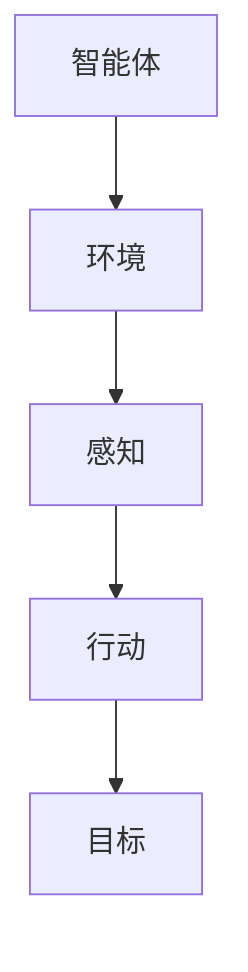
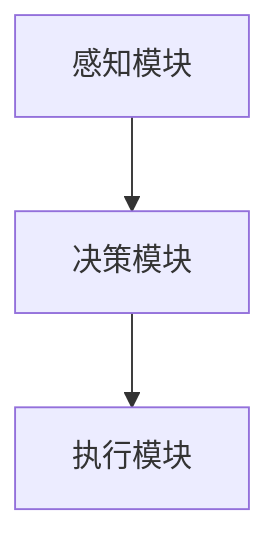
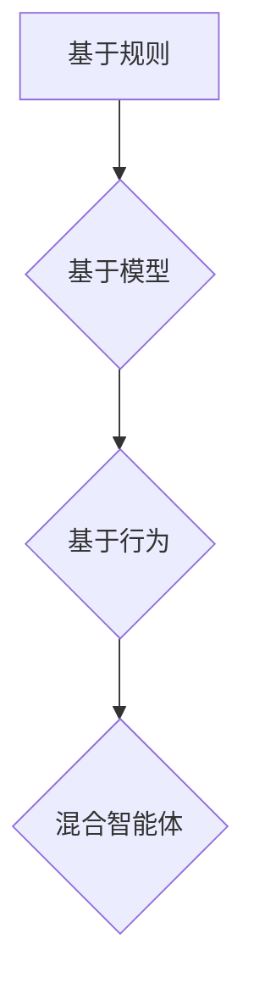

                 

# AI Agent: AI的下一个风口 智能体与传统软件的关系

> **关键词**：人工智能、智能体、软件架构、自主性、适应性、协作性、透明性、机器学习、深度学习、强化学习、自然语言处理、应用场景、开发与部署、挑战与未来。

> **摘要**：本文旨在探讨AI智能体这一新兴领域的核心理论、架构、核心技术、应用场景及面临的挑战与未来趋势。通过对比智能体与传统软件的关系，分析智能体在各个业务场景中的应用实例，以期为读者提供一个全面深入的智能体技术理解。

## 第一部分：AI智能体基础理论

### 第1章：AI智能体概述

#### 1.1 AI智能体的定义与特征

AI智能体（Artificial Intelligence Agent，简称AI Agent）是人工智能领域的一个重要概念，它代表了具有智能的软件实体。这些实体能够感知环境、理解信息、做出决策并采取行动，以实现特定的目标。以下是AI智能体的定义与特征：

- **定义**：AI智能体是指具有智能的软件实体，能够感知环境、理解信息、做出决策并采取行动。
- **特征**：
  - **自主性**：智能体能够自主感知环境并做出决策，无需人为干预。
  - **适应性**：智能体能够适应新的环境和任务，具备自我学习和自我调整的能力。
  - **协作性**：智能体能够与其他智能体协作完成任务，实现更高效的工作。
  - **透明性**：智能体的行为和决策过程是可解释的，用户可以理解其工作的原理和逻辑。

#### 1.2 智能体的核心概念与联系

为了深入理解AI智能体，我们需要了解其核心概念及它们之间的联系。以下是AI智能体的核心概念：

- **智能体（Agent）**：AI智能体的基本单元，是具有智能的软件实体。
- **环境（Environment）**：智能体所处的上下文，包括物理环境和虚拟环境。
- **感知（Perception）**：智能体对环境的感知，通过传感器等获取环境信息。
- **行动（Action）**：智能体在环境中采取的行为，以实现特定的目标。
- **目标（Goal）**：智能体追求的最终目的，指导其行为的方向。

下面是一个Mermaid流程图，展示了智能体的核心概念及它们之间的联系：



### 第2章：AI智能体的架构与分类

#### 2.1 AI智能体的架构

AI智能体的架构是其实现智能行为的基础。一个典型的AI智能体通常包括以下几个模块：

- **感知模块**：负责收集并处理环境信息，为智能体提供感知数据。
- **决策模块**：基于感知模块提供的信息，智能体通过决策模块进行决策，选择最佳行动方案。
- **执行模块**：执行决策模块做出的决策，将决策转化为实际行动。

下面是一个Mermaid流程图，展示了AI智能体的架构：



#### 2.2 AI智能体的分类

AI智能体可以根据其决策方式和架构进行分类。以下是几种常见的智能体类型：

- **基于规则的智能体**：通过预定义的规则进行决策，规则明确，易于理解和实现。
- **基于模型的智能体**：使用模型（如神经网络）进行决策，模型复杂，但能够处理更复杂的问题。
- **基于行为的智能体**：通过学习行为模式进行决策，具有一定的自适应能力。
- **混合智能体**：结合不同类型的智能体优势，实现更高效的任务执行。

下面是一个Mermaid流程图，展示了AI智能体的分类：



### 第3章：AI智能体的核心技术

#### 3.1 机器学习与深度学习基础

机器学习和深度学习是AI智能体实现智能行为的核心技术。以下是这些技术的基本原理：

- **机器学习**：机器学习是一种让计算机通过数据学习来提高性能的方法。它包括监督学习、无监督学习和强化学习等不同的学习方法。

- **深度学习**：深度学习是一种特殊的机器学习方法，使用多层神经网络进行学习。它能够自动从数据中提取特征，并用于分类、预测等任务。

下面是一个简单的伪代码，展示了深度学习的基本原理：

```python
# 初始化神经网络
network = NeuralNetwork()

# 前向传播
output = network.forward(input_data)

# 计算损失
loss = calculate_loss(output, target)

# 反向传播
network.backward(loss)

# 更新权重
network.update_weights()
```

#### 3.2 强化学习原理

强化学习是一种通过试错来学习最佳策略的机器学习方法。在强化学习中，智能体通过与环境交互，不断尝试不同的动作，并接收奖励或惩罚信号，以学习最佳行为策略。

- **Q学习**：Q学习是一种基于价值函数的强化学习方法。它通过评估每个状态-动作对的值，来选择最佳动作。

- **策略梯度**：策略梯度方法直接优化智能体的策略，通过计算策略的梯度来更新策略参数。

下面是一个简单的伪代码，展示了Q学习的原理：

```python
# 初始化Q表
Q = initialize_Q_table()

# 选择动作
action = select_action(Q, state)

# 执行动作，获取奖励
reward = execute_action(action)

# 更新Q表
Q[state, action] += alpha * (reward + gamma * max(Q[new_state, :]) - Q[state, action])

# 更新状态
state = new_state
```

#### 3.3 自然语言处理（NLP）

自然语言处理是一种让计算机理解和处理自然语言的技术。它是AI智能体实现智能交互的关键技术。以下是NLP中的几个核心技术：

- **词嵌入**：词嵌入是一种将单词映射到高维空间的方法，用于表示单词的语义信息。

- **序列模型**：序列模型用于处理序列数据，如文本、语音等。常见的序列模型包括循环神经网络（RNN）和长短时记忆网络（LSTM）。

- **生成式模型**：生成式模型用于生成新的文本，如GPT（Generative Pre-trained Transformer）。

下面是一个简单的伪代码，展示了词嵌入的基本原理：

```python
# 初始化词嵌入矩阵
word_embedding_matrix = initialize_word_embedding_matrix()

# 将单词转换为嵌入向量
word_embedding = word_embedding_matrix[word_index]

# 将序列中的单词转换为嵌入向量序列
sequence_embedding = [word_embedding_matrix[word_index] for word_index in sequence]
```

## 第4章：AI智能体的应用场景

### 4.1 人工智能与软件的关系

人工智能和软件是两个紧密相关的领域。传统软件通常以功能为导向，提供具体的服务。而人工智能，特别是AI智能体，以任务为导向，提供自适应的服务。以下是人工智能与软件的关系：

- **传统软件**：传统软件的主要目标是实现特定的功能，如邮件客户端、数据库管理系统等。这些软件通常由一系列预定义的规则和算法组成，用户交互方式主要是通过图形用户界面（GUI）或命令行界面（CLI）。

- **AI智能体**：AI智能体则更注重于完成特定的任务，如智能客服、智能推荐等。它们通过感知环境、做出决策并采取行动来实现目标。AI智能体通常具有自主性、适应性、协作性和透明性等特征，能够更好地适应用户的需求和环境的变化。

### 4.2 智能体在业务场景中的应用

AI智能体在各个业务场景中都有广泛的应用，以下是一些典型的应用实例：

- **智能客服**：智能客服是AI智能体在客户服务领域的重要应用。通过自然语言处理技术，智能客服能够与用户进行自然语言交互，提供自动化的客户支持。智能客服不仅可以处理常见问题，还可以通过学习用户的反馈和交互历史，不断优化服务质量。

- **智能推荐系统**：智能推荐系统是AI智能体在电子商务和媒体领域的重要应用。通过分析用户的兴趣和行为，智能推荐系统可以提供个性化的商品推荐和内容推荐，提高用户的满意度和转化率。

- **智能交通管理**：智能交通管理是AI智能体在交通领域的重要应用。通过实时数据分析和预测，智能交通管理系统可以优化交通流量，减少拥堵，提高道路通行效率。

## 第5章：AI智能体的开发与部署

### 5.1 AI智能体的开发流程

开发AI智能体需要遵循一定的流程，以下是一个典型的AI智能体开发流程：

1. **需求分析**：确定智能体的目标和功能，明确智能体的任务和性能要求。

2. **设计**：设计智能体的架构和算法，确定智能体的模块和接口。

3. **实现**：编写代码实现智能体，包括感知模块、决策模块和执行模块等。

4. **测试**：对智能体进行功能测试、性能测试和稳定性测试，确保智能体满足需求和性能要求。

5. **部署**：将智能体部署到生产环境中，进行实时运行和监控。

### 5.2 AI智能体的部署与运维

AI智能体的部署与运维是确保智能体稳定运行和高效服务的重要环节。以下是AI智能体的部署与运维要点：

1. **部署**：将智能体部署到服务器或云计算平台上，配置必要的环境和资源。

2. **监控**：实时监控智能体的运行状态和性能，包括CPU、内存、网络等资源使用情况。

3. **维护**：定期更新和优化智能体，包括修复漏洞、更新算法和模型等。

4. **故障处理**：及时发现和处理智能体的故障和异常，确保智能体的稳定运行。

## 第6章：AI智能体的挑战与未来

### 6.1 AI智能体面临的挑战

AI智能体在快速发展过程中也面临一系列挑战，主要包括以下几个方面：

1. **数据隐私**：智能体需要处理大量的用户数据，如何确保数据的安全和隐私是一个重要问题。

2. **解释性**：智能体的决策过程和算法往往复杂且不可解释，如何提高智能体的透明性和可解释性是一个挑战。

3. **伦理问题**：智能体的行为是否符合社会伦理标准，如何避免智能体的滥用和歧视问题。

### 6.2 AI智能体的未来发展趋势

随着技术的进步和应用的深入，AI智能体将迎来更广阔的发展空间。以下是AI智能体的未来发展趋势：

1. **集成化**：智能体将与其他系统更加紧密集成，实现跨领域的应用。

2. **自主学习**：智能体将具备更强的自主学习能力，通过自我学习和改进来提高性能。

3. **跨领域应用**：智能体将在更多领域得到应用，如医疗、金融、教育等。

## 第7章：案例研究

### 7.1 智能体在电商中的应用

AI智能体在电商领域有着广泛的应用，以下是一些具体的案例：

1. **商品推荐**：通过分析用户的购买历史和浏览行为，智能体可以提供个性化的商品推荐，提高用户的购物体验和转化率。

2. **智能客服**：智能客服可以自动处理用户的咨询和投诉，提供24/7的自动化的客户支持，减轻人工客服的工作负担。

### 7.2 智能体在医疗健康中的应用

智能体在医疗健康领域也发挥着重要作用，以下是一些具体的案例：

1. **智能诊断**：通过分析医学图像和患者数据，智能体可以辅助医生进行诊断，提高诊断的准确性和效率。

2. **健康监测**：智能体可以实时监测患者的健康状况，提供个性化的健康建议和预警，帮助患者更好地管理健康。

## 第8章：附录

### 8.1 开发工具和资源

以下是开发AI智能体常用的工具和资源：

1. **工具**：
   - TensorFlow：Google开发的开源机器学习框架。
   - PyTorch：Facebook开发的开源机器学习框架。
   - Keras：用于快速构建和训练深度学习模型的工具。

2. **资源**：
   - 《深度学习》（Goodfellow, Bengio, Courville）：深度学习的经典教材。
   - 《强化学习：原理与实战》（ Sutton, Barto）：强化学习的权威教材。
   - 《自然语言处理综合教程》（Jurafsky, Martin）：自然语言处理的经典教材。

### 8.2 拓展阅读

以下是关于AI智能体的拓展阅读资源：

1. **相关书籍**：
   - 《智能体：人工智能的未来》（Russell, Norvig）：介绍人工智能和智能体的基础知识。
   - 《智能体与多智能体系统》（Beraldo, Mirolli）：深入探讨智能体和MAS（多智能体系统）的理论和实践。

2. **学术论文**：
   - 《强化学习中的策略梯度方法》（Sutton, Barto）：介绍策略梯度方法的基本原理和应用。
   - 《词嵌入技术》（Mikolov, Sutskever, Chen）：介绍词嵌入技术的基本原理和应用。

3. **在线课程**：
   - 《深度学习》（Andrew Ng，Coursera）：深入讲解深度学习的理论和实践。
   - 《强化学习》（David Silver，Udacity）：系统介绍强化学习的基本原理和应用。

## 结束语

AI智能体是人工智能领域的一个重要分支，具有广泛的应用前景。本文通过分析智能体的核心理论、架构、核心技术、应用场景及面临的挑战与未来趋势，为读者提供了一个全面深入的智能体技术理解。随着技术的不断进步，我们相信AI智能体将在更多领域发挥重要作用，为人类社会带来更多便利和效益。

### 作者信息

作者：AI天才研究院/AI Genius Institute & 禅与计算机程序设计艺术 /Zen And The Art of Computer Programming

感谢您的阅读，希望本文能对您在AI智能体领域的学习和研究有所帮助。如果您有任何疑问或建议，欢迎在评论区留言，我们会在第一时间回复您。

### 总结与展望

在本篇技术博客中，我们系统地探讨了AI智能体的基础理论、架构、核心技术、应用场景、开发与部署，以及面临的挑战和未来趋势。通过对比智能体与传统软件的关系，我们揭示了智能体在各个业务场景中的实际应用，并为读者提供了实用的开发工具和资源。

首先，我们介绍了AI智能体的定义与特征，强调了其自主性、适应性、协作性和透明性等核心特性。接着，我们详细分析了智能体的核心概念与联系，并通过Mermaid流程图展示了智能体的架构和分类。

在核心技术部分，我们深入讲解了机器学习、深度学习、强化学习和自然语言处理等基础理论，并通过伪代码示例展示了这些技术的实现原理。这些技术是构建智能体的基石，为智能体的自主学习和智能决策提供了支持。

在应用场景部分，我们探讨了智能体在电商、医疗健康等领域的实际应用，展示了智能体如何通过自动化和智能化提升业务效率和服务质量。此外，我们还介绍了智能体的开发与部署流程，以及部署与运维的关键点。

最后，我们分析了AI智能体面临的挑战，如数据隐私、解释性和伦理问题，并展望了智能体的未来发展趋势，如集成化、自主学习和跨领域应用。

随着人工智能技术的不断进步，AI智能体将在更多领域发挥重要作用。我们期待未来的智能体能够更好地适应复杂多变的环境，提供更智能、更高效的服务。希望本文能够为读者在智能体技术领域的研究和实践提供有价值的参考。

### 感谢读者

最后，感谢您的阅读。我们希望本文能够帮助您更好地理解AI智能体这一前沿技术，激发您在人工智能领域的研究兴趣。如果您有任何疑问或建议，欢迎在评论区留言，我们会第一时间回复您。同时，也欢迎您分享本文，让更多对AI智能体感兴趣的读者受益。

在此，再次感谢您的支持与关注。让我们一起探索人工智能的无限可能，共同迎接智能体时代的到来。

### 作者信息

作者：AI天才研究院/AI Genius Institute & 禅与计算机程序设计艺术 /Zen And The Art of Computer Programming

祝您在AI智能体技术领域取得丰硕的成果！如果您在后续学习和研究中遇到任何困难，我们愿意提供帮助。期待与您在人工智能的世界中共同成长。再次感谢您的支持！

---

本文完。希望本文能够为您带来关于AI智能体的全面深入理解。如需进一步探讨或咨询，请随时联系我们。再次感谢您的阅读与支持！🌟🌟🌟

---

**声明**：本文仅供参考和学习使用，部分内容可能基于开源资料和已有研究成果。如需引用本文内容，请遵循相应的版权规定，并在引用时注明出处。本文内容可能随着技术的进步和研究的深入而更新，请以最新版本为准。

