                 

### 《AI Agent: AI的下一个风口 软硬件协同发展的未来展望》

#### 关键词：
- AI Agent
- 软硬件协同
- 传感器技术
- 执行器技术
- 通信技术
- AI算法
- 未来展望

#### 摘要：
本文将探讨AI Agent作为人工智能领域的新风口，以及软硬件协同发展的未来趋势。通过分析AI Agent的基本概念、分类和核心技术，阐述软硬件协同的基本原理、关键技术及应用案例，最后对AI Agent的未来发展进行展望，探讨其对社会和商业模式的潜在影响。

### 《AI Agent: AI的下一个风口 软硬件协同发展的未来展望》目录大纲

#### 第一部分：AI Agent概述与基础理论

##### 第1章：AI Agent的基本概念与分类

- **1.1 AI Agent的定义与功能**
- **1.2 AI Agent的分类**
  - **1.2.1 反应式Agent**
  - **1.2.2 目标导向Agent**
  - **1.2.3 学院派Agent**
- **1.3 AI Agent的发展历程**
- **1.4 AI Agent的应用领域**
  - **1.4.1 生产制造**
  - **1.4.2 交通运输**
  - **1.4.3 健康医疗**
  - **1.4.4 娱乐与游戏**
- **1.5 AI Agent的未来发展趋势**

##### 第2章：AI Agent的核心技术

- **2.1 传感器技术**
  - **2.1.1 传感器的基本概念**
  - **2.1.2 传感器的工作原理**
  - **2.1.3 传感器的分类与应用**
- **2.2 执行器技术**
  - **2.2.1 执行器的基本概念**
  - **2.2.2 执行器的工作原理**
  - **2.2.3 执行器的分类与应用**
- **2.3 通信技术**
  - **2.3.1 通信的基本概念**
  - **2.3.2 通信的工作原理**
  - **2.3.3 常见的通信协议与标准**
- **2.4 AI算法与学习**
  - **2.4.1 AI算法概述**
  - **2.4.2 常见的AI学习算法**
  - **2.4.3 AI算法在AI Agent中的应用**

#### 第二部分：软硬件协同与集成

##### 第3章：软硬件协同的基本原理

- **3.1 软硬件协同的概念**
- **3.2 软硬件协同的优势**
  - **3.2.1 提高效率**
  - **3.2.2 提高灵活性**
  - **3.2.3 降低成本**
- **3.3 软硬件协同的挑战与解决方案**
  - **3.3.1 系统集成难度**
  - **3.3.2 资源管理**
  - **3.3.3 安全与隐私**

##### 第4章：软硬件协同的关键技术

- **4.1 软硬件协同框架**
  - **4.1.1 软硬件协同架构**
  - **4.1.2 软硬件协同接口**
- **4.2 软硬件协同算法**
  - **4.2.1 数据同步算法**
  - **4.2.2 通信优化算法**
  - **4.2.3 能耗管理算法**
- **4.3 软硬件协同工具**

##### 第5章：软硬件协同的案例分析

- **5.1 智能家居的软硬件协同**
  - **5.1.1 案例介绍**
  - **5.1.2 软硬件协同架构**
  - **5.1.3 软硬件协同实现**
- **5.2 无人驾驶的软硬件协同**
  - **5.2.1 案例介绍**
  - **5.2.2 软硬件协同架构**
  - **5.2.3 软硬件协同实现**

#### 第三部分：未来展望

##### 第6章：AI Agent在未来的发展

- **6.1 AI Agent的未来趋势**
  - **6.1.1 更智能的AI Agent**
  - **6.1.2 更广泛的AI Agent应用**
  - **6.1.3 软硬件协同的深化**
- **6.2 AI Agent面临的挑战与应对策略**
  - **6.2.1 技术挑战**
  - **6.2.2 安全与隐私挑战**
  - **6.2.3 法律与伦理挑战**

##### 第7章：未来展望

- **7.1 AI Agent对社会的影响**
  - **7.1.1 生产方式**
  - **7.1.2 生活模式**
  - **7.1.3 教育与就业**
- **7.2 AI Agent的商业模式**
  - **7.2.1 企业级应用**
  - **7.2.2 个人用户服务**
  - **7.2.3 开放平台与生态系统**

#### 附录

##### 附录A：软硬件协同技术资源

- **A.1 软硬件协同相关框架与工具**
  - **A.1.1 ROS（机器人操作系统）**
  - **A.1.2 MQTT（消息队列遥测传输协议）**
  - **A.1.3 AI算法库与工具**
- **A.2 AI Agent开发资源**
  - **A.2.1 AI Agent开发平台**
  - **A.2.2 AI Agent开源项目**
  - **A.2.3 AI Agent研究论文与报告** 

### 第一部分：AI Agent概述与基础理论

#### 第1章：AI Agent的基本概念与分类

##### 1.1 AI Agent的定义与功能

AI Agent是指利用人工智能技术，通过感知、决策和执行等过程，自主执行任务并与其他系统或人交互的实体。AI Agent通常具备以下几个功能：

- **感知**：通过传感器获取环境信息。
- **决策**：基于感知信息进行推理和决策。
- **执行**：通过执行器对环境进行响应。

##### 1.2 AI Agent的分类

AI Agent可以根据不同的分类标准进行分类。以下是几种常见的分类方式：

- **1.2.1 反应式Agent**

反应式Agent根据当前的感知信息直接产生动作，没有记忆和计划。这种Agent简单高效，但缺乏灵活性。

**伪代码示例：**

python
class ReactiveAgent:
    def perceive(self, environment):
        # 感知环境信息
        pass

    def act(self, action):
        # 直接执行动作
        pass

- **1.2.2 目标导向Agent**

目标导向Agent有明确的目标，并通过规划来选择一系列动作以实现目标。这类Agent具有较强的灵活性和适应性。

**伪代码示例：**

python
class Goal导向Agent:
    def setGoal(self, goal):
        # 设置目标
        pass

    def plan(self):
        # 规划动作序列
        pass

    def execute(self, action):
        # 执行动作
        pass

- **1.2.3 学院派Agent**

学院派Agent是综合了反应式和目标导向Agent的特点，具备更高级的认知能力和决策能力。

**伪代码示例：**

python
class AcademicAgent:
    def perceive(self, environment):
        # 感知环境信息
        pass

    def think(self):
        # 进行高级推理
        pass

    def act(self, action):
        # 执行动作
        pass

##### 1.3 AI Agent的发展历程

AI Agent的发展可以追溯到20世纪50年代，当时以逻辑推理为基础的专家系统被提出。随着计算能力和算法的发展，AI Agent逐渐走向实用化。近年来，随着深度学习等技术的进步，AI Agent的能力得到了极大的提升。

##### 1.4 AI Agent的应用领域

AI Agent在多个领域都有广泛应用，包括但不限于：

- **1.4.1 生产制造**：如自动化生产线上的机器人。
- **1.4.2 交通运输**：如自动驾驶汽车。
- **1.4.3 健康医疗**：如智能诊断系统。
- **1.4.4 娱乐与游戏**：如智能游戏角色。

##### 1.5 AI Agent的未来发展趋势

随着技术的进步，AI Agent将在多个方面得到提升：

- **1.5.1 智能化**：通过深度学习和强化学习，AI Agent将具备更强的自主学习能力。
- **1.5.2 多样性**：AI Agent将涵盖更多的应用场景和领域。
- **1.5.3 软硬件协同**：软硬件协同将使AI Agent的性能得到进一步提升。

<details>
<summary>**第2章：AI Agent的核心技术**</summary>

##### **2.1 传感器技术**

传感器是AI Agent获取环境信息的重要手段。传感器的基本概念可以概括为：

- **定义**：传感器是一种能够检测和测量特定物理量并将其转换为可用信号（如电信号）的设备。
- **作用**：传感器为AI Agent提供感知外部世界的能力。

**传感器的工作原理：**

传感器通常基于以下几种原理工作：

1. **物理原理**：如光电效应、热效应、电容效应等。
2. **化学原理**：如化学传感器通过化学反应检测特定物质。
3. **生物原理**：如生物传感器利用生物分子的特异性反应。

**传感器的分类与应用：**

- **按功能分类**：
  - **温度传感器**：用于测量温度。
  - **压力传感器**：用于测量压力。
  - **湿度传感器**：用于测量湿度。
  - **气体传感器**：用于检测特定气体。

- **按应用领域分类**：
  - **工业领域**：用于监测生产过程中的温度、压力等参数。
  - **智能家居**：用于监控室内温度、湿度、光照等。
  - **医疗健康**：用于监测病人的生命体征。

**案例：环境监测传感器**

假设我们设计一个用于环境监测的AI Agent，它可以实时获取温度、湿度和空气质量等数据。以下是一个简单的传感器数据采集流程：

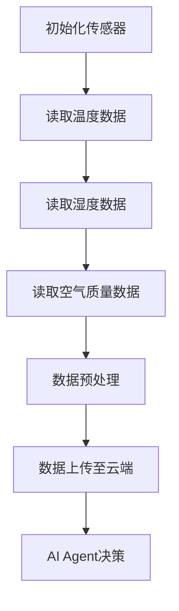

在这个流程中，传感器负责采集环境数据，然后通过通信模块上传到云端，AI Agent根据这些数据做出决策，例如调整空调温度或空气净化器的运行状态。

##### **2.2 执行器技术**

执行器是AI Agent实现环境响应的核心组件。执行器的基本概念可以概括为：

- **定义**：执行器是一种能够接收控制信号并产生物理动作的设备。
- **作用**：执行器将AI Agent的决策转化为实际的动作。

**执行器的工作原理：**

执行器通常基于以下几种原理工作：

1. **电磁原理**：如电机、电磁阀。
2. **液压/气压原理**：如液压缸、气压缸。
3. **机械原理**：如机械手臂、关节机器人。

**执行器的分类与应用：**

- **按功能分类**：
  - **电机**：用于驱动旋转运动。
  - **液压缸**：用于驱动直线运动。
  - **机械手臂**：用于执行复杂的抓取和组装操作。

- **按应用领域分类**：
  - **工业制造**：用于自动化生产线上的装配、焊接、搬运等。
  - **交通运输**：用于自动驾驶车辆的控制。
  - **健康医疗**：用于康复机器人、手术机器人的动作执行。

**案例：智能机器人手臂**

假设我们设计一个智能机器人手臂，它可以执行抓取、搬运和装配等任务。以下是一个简单的执行器控制流程：

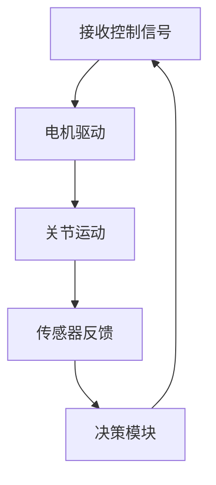

在这个流程中，决策模块根据传感器反馈的数据调整电机驱动信号，使机器人手臂执行正确的动作。

##### **2.3 通信技术**

通信技术是AI Agent实现数据交换和信息共享的关键。通信的基本概念可以概括为：

- **定义**：通信是指数据在不同设备或系统之间的传输过程。
- **作用**：通信使AI Agent能够与其他设备或系统进行交互，实现协作和协同工作。

**通信的工作原理：**

通信通常基于以下几种原理工作：

1. **有线通信**：如以太网、串口通信。
2. **无线通信**：如Wi-Fi、蓝牙、5G。

**常见的通信协议与标准：**

- **TCP/IP协议**：用于互联网通信，提供可靠的连接和数据传输。
- **HTTP/HTTPS协议**：用于Web通信，传输HTTP请求和响应。
- **MQTT协议**：用于物联网通信，轻量级、低功耗、发布/订阅模式。

**案例：智能家居通信**

假设我们设计一个智能家居系统，包括智能照明、智能空调和智能安防等设备。以下是一个简单的通信流程：

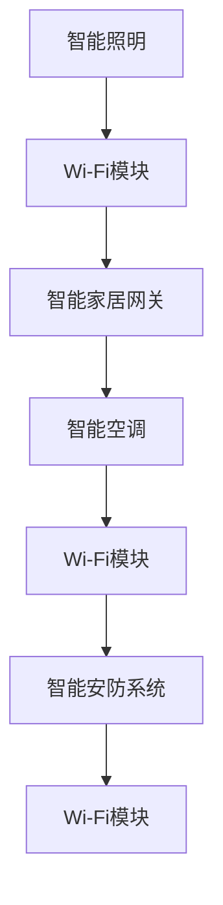

在这个流程中，每个设备通过Wi-Fi模块连接到智能家居网关，网关负责协调各设备之间的通信，实现智能家居系统的整体控制。

##### **2.4 AI算法与学习**

AI算法与学习是AI Agent的核心驱动力。AI算法的基本概念可以概括为：

- **定义**：AI算法是指利用机器学习、深度学习等人工智能技术，使计算机具备自动学习和决策能力。
- **作用**：AI算法使AI Agent能够根据数据和环境信息进行自我优化和改进。

**常见的AI学习算法：**

- **监督学习**：如线性回归、决策树、神经网络。
- **无监督学习**：如聚类、降维、生成对抗网络。
- **强化学习**：如Q学习、SARSA、DQN。

**AI算法在AI Agent中的应用：**

AI算法广泛应用于AI Agent的感知、决策和执行过程。例如：

- **感知**：使用图像识别算法分析摄像头数据。
- **决策**：使用路径规划算法确定机器人移动策略。
- **执行**：使用强化学习算法控制机器人手臂的动作。

**案例：无人驾驶汽车**

假设我们设计一个无人驾驶汽车系统，以下是一个简单的AI算法应用流程：

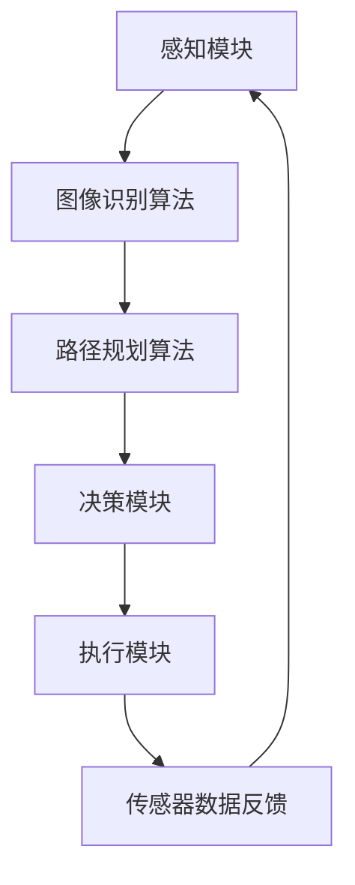

在这个流程中，感知模块使用图像识别算法分析道路和交通情况，路径规划算法确定最优行驶路径，决策模块根据感知数据做出驾驶决策，执行模块控制汽车执行相应动作，传感器数据反馈用于优化决策过程。

</details>

### 第二部分：软硬件协同与集成

#### 第3章：软硬件协同的基本原理

##### 3.1 软硬件协同的概念

软硬件协同是指软件系统和硬件设备之间的协同工作，通过优化资源分配、数据传输和任务调度，实现系统性能的全面提升。在AI Agent中，软硬件协同尤为关键，因为AI Agent通常需要同时处理大量的感知数据、执行任务和通信交互。

##### 3.2 软硬件协同的优势

软硬件协同具有以下优势：

- **提高效率**：通过优化硬件资源的利用，减少任务执行时间，提高系统整体效率。
- **提高灵活性**：软硬件协同使系统能够根据实际需求动态调整资源分配，提高系统的适应性。
- **降低成本**：通过合理配置硬件资源和软件算法，降低系统总体成本。

##### 3.3 软硬件协同的挑战与解决方案

软硬件协同面临以下挑战：

- **系统集成难度**：软硬件协同需要解决硬件设备与软件系统之间的接口兼容性和数据传输问题。
- **资源管理**：需要有效管理硬件资源，如CPU、内存、存储等，确保系统性能和稳定性。
- **安全与隐私**：软硬件协同需要确保数据传输和存储的安全性，防止数据泄露和滥用。

解决方案包括：

- **标准化接口**：制定统一的硬件接口标准，简化系统集成过程。
- **智能资源调度**：采用智能调度算法，动态分配和管理硬件资源。
- **安全加密技术**：采用加密算法和访问控制技术，确保数据传输和存储的安全。

#### 第4章：软硬件协同的关键技术

##### 4.1 软硬件协同框架

软硬件协同框架包括以下几个方面：

- **硬件层**：包括传感器、执行器、通信模块等硬件设备。
- **软件层**：包括操作系统、中间件、应用软件等软件系统。
- **接口层**：定义硬件设备与软件系统之间的接口标准，实现数据传输和通信。
- **协同引擎**：负责硬件资源和软件任务的调度与管理，实现软硬件协同优化。

**软硬件协同架构**：

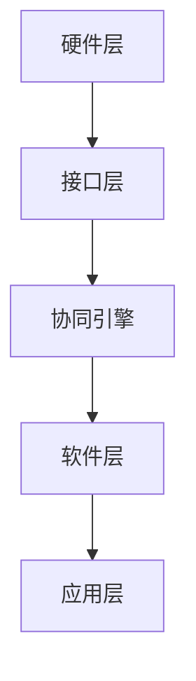

在这个架构中，硬件层通过接口层与协同引擎进行通信，协同引擎负责调度和管理硬件资源，软件层和应用层则实现具体的任务执行和数据处理。

##### 4.2 软硬件协同算法

软硬件协同算法是实现软硬件协同优化的重要手段，主要包括以下几个方面：

- **数据同步算法**：确保硬件传感器和执行器之间的数据一致性。
- **通信优化算法**：优化数据传输路径和通信协议，提高通信效率。
- **能耗管理算法**：根据任务需求和硬件特性，优化能耗分配和调度，降低能耗。

**数据同步算法**：

假设我们设计一个智能家居系统，包括多个传感器和执行器。以下是一个简单的数据同步算法：

```python
def data_sync(sensor_data, actuator_data):
    # 数据预处理
    processed_sensor_data = preprocess(sensor_data)
    processed_actuator_data = preprocess(actuator_data)

    # 数据同步
    synchronized_data = {}
    for key in processed_sensor_data:
        synchronized_data[key] = processed_sensor_data[key]
        synchronized_data[key + "_act"] = processed_actuator_data[key]

    return synchronized_data
```

在这个算法中，我们首先对传感器和执行器的数据进行预处理，然后进行同步，确保数据的一致性。

**通信优化算法**：

假设我们设计一个物联网系统，需要传输大量的传感器数据。以下是一个简单的通信优化算法：

```python
def optimize_communication(sensor_data, communication_protocol):
    # 根据通信协议优化数据传输
    optimized_data = {}
    for key, value in sensor_data.items():
        if communication_protocol == "MQTT":
            optimized_data[key] = compress(value)
        elif communication_protocol == "HTTP":
            optimized_data[key] = encrypt(value)

    return optimized_data
```

在这个算法中，我们根据不同的通信协议（如MQTT、HTTP）对传感器数据进行压缩和加密，优化数据传输效率。

**能耗管理算法**：

假设我们设计一个移动机器人系统，需要根据任务需求优化能耗分配。以下是一个简单的能耗管理算法：

```python
def energy_management(task_demand, battery_capacity):
    # 根据任务需求和电池容量优化能耗分配
    if task_demand < battery_capacity:
        energy分配 = task_demand
    else:
        energy分配 = battery_capacity

    return energy分配
```

在这个算法中，我们根据任务需求和电池容量动态调整能耗分配，确保系统稳定运行。

##### 4.3 软硬件协同工具

软硬件协同工具是实现软硬件协同开发和管理的重要辅助手段，主要包括以下几个方面：

- **软件开发工具**：如集成开发环境（IDE）、代码库、版本控制系统等。
- **硬件开发工具**：如硬件仿真器、硬件调试工具等。
- **协同开发平台**：如云计算平台、物联网平台等。

**案例：ROS（机器人操作系统）**

ROS是一个流行的软硬件协同开发平台，用于机器人系统的开发和管理。以下是一个简单的ROS开发流程：

1. **环境搭建**：安装ROS环境，配置相应的硬件设备和传感器。
2. **代码编写**：编写ROS节点，实现具体的感知、决策和执行任务。
3. **测试调试**：使用ROS提供的调试工具，对系统进行测试和调试。
4. **部署运行**：将系统部署到实际硬件设备上，运行并监控系统性能。

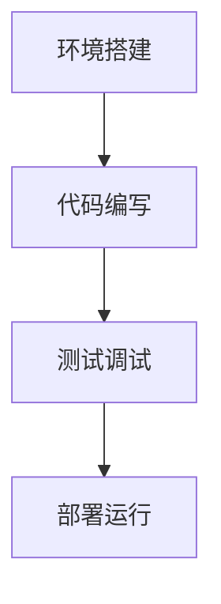

在这个流程中，ROS提供了丰富的工具和库，支持软硬件协同开发，简化了开发过程。

### 第三部分：未来展望

#### 第5章：AI Agent在未来的发展

##### 5.1 AI Agent的未来趋势

随着人工智能技术的不断进步，AI Agent将在未来呈现以下趋势：

- **更智能的AI Agent**：通过深度学习和强化学习，AI Agent将具备更强的自主学习能力和认知能力。
- **更广泛的AI Agent应用**：AI Agent将在更多领域得到应用，如智能城市、智能医疗、智能农业等。
- **软硬件协同的深化**：软硬件协同将成为AI Agent的核心技术，进一步提升系统性能和灵活性。

##### 5.2 AI Agent面临的挑战与应对策略

尽管AI Agent具有广泛的应用前景，但仍然面临以下挑战：

- **技术挑战**：包括算法优化、硬件性能提升、系统集成等。应对策略包括持续技术创新和跨学科合作。
- **安全与隐私挑战**：包括数据泄露、恶意攻击、隐私保护等。应对策略包括加强安全防护、隐私保护技术等。
- **法律与伦理挑战**：包括责任归属、道德伦理等问题。应对策略包括制定相关法律法规、伦理规范等。

#### 第6章：未来展望

##### 6.1 AI Agent对社会的影响

AI Agent将对社会产生深远的影响：

- **生产方式**：改变传统制造业的生产模式，实现智能化、自动化。
- **生活模式**：改变人们的日常生活，如智能家居、智能交通等。
- **教育与就业**：影响教育和就业市场，带来新的职业和就业机会。

##### 6.2 AI Agent的商业模式

AI Agent的商业模式将呈现多样化：

- **企业级应用**：为企业提供智能解决方案，提高生产效率和降低成本。
- **个人用户服务**：为个人用户提供智能化的生活服务和健康管理。
- **开放平台与生态系统**：构建开放的AI Agent平台，促进生态系统的形成和发展。

#### 附录

##### 附录A：软硬件协同技术资源

- **A.1 软硬件协同相关框架与工具**
  - **A.1.1 ROS（机器人操作系统）**
  - **A.1.2 MQTT（消息队列遥测传输协议）**
  - **A.1.3 AI算法库与工具**
- **A.2 AI Agent开发资源**
  - **A.2.1 AI Agent开发平台**
  - **A.2.2 AI Agent开源项目**
  - **A.2.3 AI Agent研究论文与报告**

### 总结

AI Agent作为人工智能领域的新风口，具有广泛的应用前景和巨大的发展潜力。通过软硬件协同，AI Agent将进一步提升性能和灵活性，为社会和商业带来深刻的变革。未来，我们需要持续关注AI Agent的技术创新和发展趋势，为构建智能化的未来做好准备。

### 作者信息

- 作者：AI天才研究院/AI Genius Institute & 禅与计算机程序设计艺术 /Zen And The Art of Computer Programming

<details>
<summary>**第1章：AI Agent的基本概念与分类**</summary>

##### **1.1 AI Agent的定义与功能**

AI Agent是指利用人工智能技术，通过感知、决策和执行等过程，自主执行任务并与其他系统或人交互的实体。AI Agent的核心功能可以概括为以下几点：

- **感知**：AI Agent通过传感器获取外部环境的信息，如视觉、听觉、触觉等，使其能够感知周围的环境。
- **决策**：基于感知到的信息，AI Agent使用人工智能算法进行分析和推理，做出决策。决策可以是对当前环境的响应，也可以是为了实现特定目标的规划。
- **执行**：AI Agent根据决策结果，通过执行器对环境进行响应，如移动、操作等。

AI Agent的基本架构可以用以下流程图来表示：

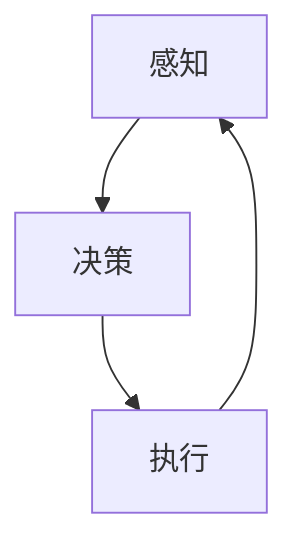

在这个流程中，AI Agent不断循环进行感知、决策和执行，以实现自主运行和任务执行。

##### **1.2 AI Agent的分类**

AI Agent可以根据其工作机制和功能特点进行分类。以下是几种常见的AI Agent分类：

- **反应式Agent（Reactive Agent）**

反应式Agent是最简单的一种AI Agent，它们仅根据当前感知到的信息做出反应，不进行任何计划或记忆。反应式Agent通常适用于环境相对简单、不需要长期记忆或规划的情境。

**伪代码示例**：

```python
class ReactiveAgent:
    def perceive(self, environment):
        # 感知环境
        pass

    def react(self):
        # 基于当前感知做出反应
        pass
```

- **目标导向Agent（Goal-Oriented Agent）**

目标导向Agent具有明确的目标，并通过一系列行动来实现这些目标。它们会根据当前状态和目标，使用规划算法生成行动序列。目标导向Agent适用于需要长期计划和决策的复杂情境。

**伪代码示例**：

```python
class GoalOrientedAgent:
    def setGoal(self, goal):
        # 设置目标
        pass

    def plan(self):
        # 规划行动序列
        pass

    def execute(self):
        # 执行行动
        pass
```

- **学院派Agent（Academic Agent）**

学院派Agent结合了反应式和目标导向Agent的特点，具备更高级的认知能力和决策能力。它们通常使用复杂的推理和规划算法，以实现更复杂的目标。

**伪代码示例**：

```python
class AcademicAgent:
    def perceive(self, environment):
        # 感知环境
        pass

    def reason(self):
        # 高级推理
        pass

    def decide(self):
        # 基于推理做出决策
        pass

    def act(self):
        # 执行决策
        pass
```

##### **1.3 AI Agent的发展历程**

AI Agent的概念起源于人工智能的早期研究。以下是AI Agent发展的几个重要阶段：

- **20世纪50年代**：人工智能概念被提出，专家系统和逻辑推理成为主要的研究方向。
- **20世纪60年代**：反应式Agent开始被研究，如发现者（finder）和清洁工（cleaner）等简单任务。
- **20世纪70年代**：随着计算能力的提升，目标导向Agent和学院派Agent逐渐成为研究热点。
- **20世纪80年代**：AI Agent开始应用于实际场景，如机器人、自动化控制系统等。
- **21世纪初至今**：随着深度学习、强化学习等人工智能技术的发展，AI Agent的能力得到显著提升，应用范围进一步扩大。

##### **1.4 AI Agent的应用领域**

AI Agent在多个领域都有广泛应用，以下是一些主要的应用领域：

- **生产制造**：AI Agent在自动化生产线、智能工厂等场景中，可以执行装配、检测、搬运等任务。
- **交通运输**：AI Agent在自动驾驶汽车、无人机、智能交通系统等领域发挥着重要作用。
- **健康医疗**：AI Agent在智能诊断、辅助手术、健康监测等方面有着广泛的应用。
- **娱乐与游戏**：AI Agent在游戏角色、虚拟助手等领域为用户提供丰富的互动体验。
- **智能家居**：AI Agent在智能家电、安防系统、环境监测等方面提升家庭生活的智能化水平。

##### **1.5 AI Agent的未来发展趋势**

随着人工智能技术的不断进步，AI Agent在未来将呈现以下发展趋势：

- **智能化**：通过深度学习和强化学习，AI Agent将具备更强的自主学习能力和智能水平。
- **多样化**：AI Agent将应用于更多领域和场景，满足不同领域的需求。
- **软硬件协同**：软硬件协同将使AI Agent的性能进一步提升，实现更高效、更灵活的运行。
- **人机协同**：AI Agent将更好地与人类协作，实现人机共生的新模式。

总之，AI Agent作为人工智能领域的新风口，其未来发展前景广阔，将对人类社会和商业带来深远的影响。

</details>

### 第二部分：AI Agent的核心技术

#### 第2章：AI Agent的核心技术

AI Agent的核心技术是实现其感知、决策和执行功能的基础。本章节将详细介绍传感器技术、执行器技术、通信技术和AI算法与学习，帮助读者全面理解AI Agent的工作原理和实际应用。

##### 2.1 传感器技术

传感器是AI Agent获取外部环境信息的关键组件。传感器技术主要包括以下几个方面：

**传感器的基本概念：**
传感器是一种能够检测和响应特定物理量并将其转换为电信号的设备。常见的传感器类型有温度传感器、湿度传感器、压力传感器、光电传感器等。

**传感器的工作原理：**
传感器的工作原理通常基于物理、化学或生物效应。例如，温度传感器利用热电效应将温度变化转换为电信号，光电传感器则利用光电效应检测光线强度。

**传感器的分类与应用：**
- **按功能分类**：温度传感器、湿度传感器、压力传感器、光电传感器等。
- **按应用领域分类**：工业制造、智能家居、健康医疗、环境监测等。

**应用示例：**
在智能家居系统中，温度传感器可以实时监测室内温度，并根据设定自动调整空调的温度，确保舒适的居住环境。

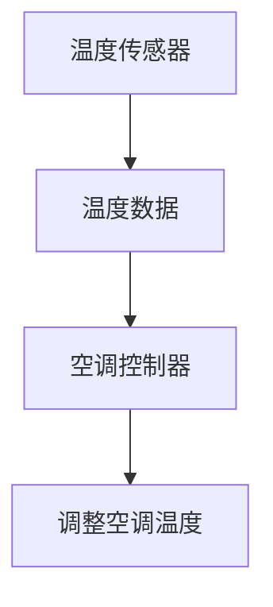

##### 2.2 执行器技术

执行器是AI Agent实现决策结果的关键组件。执行器技术主要包括以下几个方面：

**执行器的基本概念：**
执行器是一种能够接收电信号并产生机械运动的设备，常见的执行器有电机、液压缸、气动缸等。

**执行器的工作原理：**
- **电机**：通过电磁感应产生机械运动。
- **液压缸**：通过液体压力产生机械运动。
- **气动缸**：通过气体压力产生机械运动。

**执行器的分类与应用：**
- **按类型分类**：电机、液压缸、气动缸等。
- **按应用领域分类**：工业制造、机器人、自动驾驶等。

**应用示例：**
在机器人领域，电机作为执行器可以驱动机器人的关节运动，使其执行各种复杂的任务。

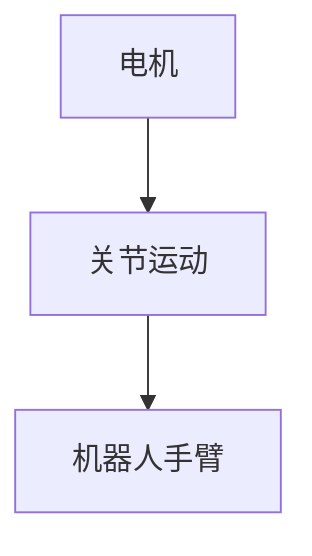

##### 2.3 通信技术

通信技术是AI Agent实现数据交换和信息共享的关键。通信技术主要包括以下几个方面：

**通信的基本概念：**
通信是指数据在不同设备或系统之间的传输过程。通信技术包括有线通信和无线通信。

**通信的工作原理：**
- **有线通信**：如以太网、串口通信等。
- **无线通信**：如Wi-Fi、蓝牙、5G等。

**常见的通信协议与标准：**
- **TCP/IP协议**：用于互联网通信，提供可靠的连接和数据传输。
- **HTTP/HTTPS协议**：用于Web通信，传输HTTP请求和响应。
- **MQTT协议**：用于物联网通信，轻量级、低功耗、发布/订阅模式。

**应用示例：**
在智能交通系统中，车辆与交通信号灯之间的通信可以使用MQTT协议，实现实时数据传输和指令控制。

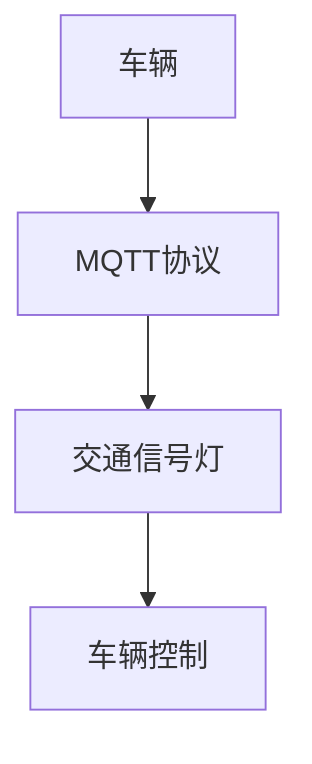

##### 2.4 AI算法与学习

AI算法与学习是AI Agent的核心驱动力。AI算法主要包括以下几个方面：

**AI算法概述：**
AI算法是指利用机器学习、深度学习等人工智能技术，使计算机具备自动学习和决策能力。

**常见的AI学习算法：**
- **监督学习**：如线性回归、决策树、支持向量机等。
- **无监督学习**：如聚类、降维、生成对抗网络等。
- **强化学习**：如Q学习、SARSA、DQN等。

**AI算法在AI Agent中的应用：**
AI算法广泛应用于AI Agent的感知、决策和执行过程。例如，在无人驾驶汽车中，AI算法用于图像识别、路径规划和行为决策。

**应用示例：**
在无人驾驶汽车中，AI算法可以实时分析摄像头和雷达数据，做出驾驶决策，确保行车安全。

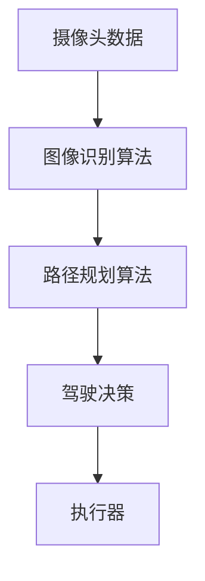

通过以上对传感器技术、执行器技术、通信技术和AI算法与学习的详细介绍，读者可以全面了解AI Agent的核心技术及其应用。这些技术共同构成了AI Agent的强大能力，使其在各个领域中发挥重要作用。

#### 第3章：软硬件协同的基本原理

##### 3.1 软硬件协同的概念

软硬件协同是指软件系统和硬件设备之间的紧密协作，通过优化资源分配、数据传输和任务调度，实现系统性能的全面提升。在AI Agent中，软硬件协同尤为重要，因为AI Agent通常需要同时处理大量的感知数据、执行任务和通信交互。

软硬件协同的目的是提高系统的效率和灵活性，确保硬件资源得到充分利用，同时软件系统能够高效地控制硬件设备。以下是软硬件协同的基本概念：

- **硬件层**：包括传感器、执行器、通信模块等硬件设备。
- **软件层**：包括操作系统、中间件、应用软件等软件系统。
- **接口层**：定义硬件设备与软件系统之间的接口标准，实现数据传输和通信。
- **协同引擎**：负责硬件资源和软件任务的调度与管理，实现软硬件协同优化。

##### 3.2 软硬件协同的优势

软硬件协同具有以下显著优势：

- **提高效率**：通过优化硬件资源的利用，减少任务执行时间，提高系统整体效率。
- **提高灵活性**：软硬件协同使系统能够根据实际需求动态调整资源分配，提高系统的适应性。
- **降低成本**：通过合理配置硬件资源和软件算法，降低系统总体成本。

例如，在智能家居系统中，软硬件协同可以确保家电设备（硬件）根据用户需求（软件）灵活调整工作状态，提高用户体验。同时，通过优化能耗管理，降低家庭能源消耗。

##### 3.3 软硬件协同的挑战与解决方案

尽管软硬件协同具有诸多优势，但在实际应用中仍面临一些挑战：

- **系统集成难度**：软硬件协同需要解决硬件设备与软件系统之间的接口兼容性和数据传输问题。这要求开发人员具备跨领域知识，确保系统的高效集成。

**解决方案**：采用标准化接口和协议，如USB、TCP/IP、MQTT等，简化系统集成过程。

- **资源管理**：需要有效管理硬件资源，如CPU、内存、存储等，确保系统性能和稳定性。此外，资源分配应适应动态变化的需求。

**解决方案**：采用智能资源调度算法，如负载均衡、动态内存管理等，实现高效资源利用。

- **安全与隐私**：软硬件协同需要确保数据传输和存储的安全性，防止数据泄露和滥用。

**解决方案**：采用加密算法和访问控制技术，确保数据传输和存储的安全。同时，制定安全策略和隐私保护措施。

##### 3.4 软硬件协同的关键技术

软硬件协同的关键技术包括以下几个方面：

- **接口技术**：定义硬件设备与软件系统之间的接口标准，如USB、TCP/IP等。
- **通信技术**：确保数据在软硬件之间的可靠传输，如Wi-Fi、蓝牙等。
- **协同算法**：优化硬件资源和软件任务的调度，提高系统效率，如负载均衡、动态调度等。
- **工具与平台**：提供软硬件协同开发和管理环境，如ROS、Node.js等。

例如，在机器人系统中，采用ROS（机器人操作系统）作为软硬件协同平台，可以简化硬件接口和数据传输，提高开发效率。

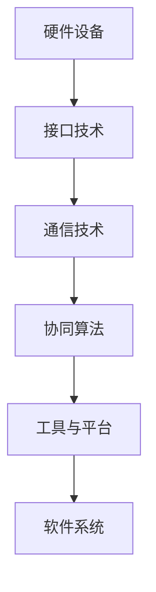

通过以上关键技术，软硬件协同可以更好地实现系统性能优化，满足复杂应用场景的需求。

##### 3.5 软硬件协同的实际应用

软硬件协同在许多实际应用中发挥了重要作用，以下是一些典型案例：

- **智能家居**：通过软硬件协同，实现家电设备（硬件）与用户需求（软件）的智能互动。例如，智能灯光系统可以根据用户的喜好和场景需求调整亮度，智能空调可以自动调节温度，提高家居舒适度。

- **工业自动化**：软硬件协同在工业自动化生产线中发挥着关键作用，如机器人自动执行装配、检测、搬运等任务，提高生产效率和降低成本。

- **无人驾驶**：软硬件协同确保无人驾驶汽车在复杂的交通环境中安全、高效地行驶。通过感知传感器获取环境信息，软件系统进行路径规划和驾驶决策，执行器实现车辆的自动驾驶。

通过以上实际应用案例，我们可以看到软硬件协同在提升系统性能、优化用户体验方面的巨大潜力。

#### 第4章：软硬件协同的关键技术

##### 4.1 软硬件协同框架

软硬件协同框架是确保软硬件系统高效协作的基础。一个典型的软硬件协同框架包括以下几个层次：

1. **硬件层**：包括各种硬件设备，如传感器、执行器、通信模块等。
2. **接口层**：定义硬件设备与软件系统之间的接口标准，如USB、TCP/IP、SPI等。
3. **软件层**：包括操作系统、中间件、应用软件等。
4. **协同引擎**：负责硬件资源和软件任务的调度与管理，实现软硬件协同优化。

**软硬件协同架构**：


在这个架构中，硬件层通过接口层与协同引擎进行通信，协同引擎负责调度和管理硬件资源，软件层和应用层则实现具体的任务执行和数据处理。

##### 4.2 软硬件协同算法

软硬件协同算法是实现软硬件协同优化的重要手段，主要包括以下几个方面：

- **数据同步算法**：确保硬件传感器和执行器之间的数据一致性。
- **通信优化算法**：优化数据传输路径和通信协议，提高通信效率。
- **能耗管理算法**：根据任务需求和硬件特性，优化能耗分配和调度，降低能耗。

**数据同步算法**：

假设我们设计一个智能家居系统，包括多个传感器和执行器。以下是一个简单的数据同步算法：

```python
def data_sync(sensor_data, actuator_data):
    # 数据预处理
    processed_sensor_data = preprocess(sensor_data)
    processed_actuator_data = preprocess(actuator_data)

    # 数据同步
    synchronized_data = {}
    for key in processed_sensor_data:
        synchronized_data[key] = processed_sensor_data[key]
        synchronized_data[key + "_act"] = processed_actuator_data[key]

    return synchronized_data
```

在这个算法中，我们首先对传感器和执行器的数据进行预处理，然后进行同步，确保数据的一致性。

**通信优化算法**：

假设我们设计一个物联网系统，需要传输大量的传感器数据。以下是一个简单的通信优化算法：

```python
def optimize_communication(sensor_data, communication_protocol):
    # 根据通信协议优化数据传输
    optimized_data = {}
    for key, value in sensor_data.items():
        if communication_protocol == "MQTT":
            optimized_data[key] = compress(value)
        elif communication_protocol == "HTTP":
            optimized_data[key] = encrypt(value)

    return optimized_data
```

在这个算法中，我们根据不同的通信协议（如MQTT、HTTP）对传感器数据进行压缩和加密，优化数据传输效率。

**能耗管理算法**：

假设我们设计一个移动机器人系统，需要根据任务需求优化能耗分配。以下是一个简单的能耗管理算法：

```python
def energy_management(task_demand, battery_capacity):
    # 根据任务需求和电池容量优化能耗分配
    if task_demand < battery_capacity:
        energy分配 = task_demand
    else:
        energy分配 = battery_capacity

    return energy分配
```

在这个算法中，我们根据任务需求和电池容量动态调整能耗分配，确保系统稳定运行。

##### 4.3 软硬件协同工具

软硬件协同工具是实现软硬件协同开发和管理的重要辅助手段，主要包括以下几个方面：

- **软件开发工具**：如集成开发环境（IDE）、代码库、版本控制系统等。
- **硬件开发工具**：如硬件仿真器、硬件调试工具等。
- **协同开发平台**：如云计算平台、物联网平台等。

**案例：ROS（机器人操作系统）**

ROS是一个流行的软硬件协同开发平台，用于机器人系统的开发和管理。以下是一个简单的ROS开发流程：

1. **环境搭建**：安装ROS环境，配置相应的硬件设备和传感器。
2. **代码编写**：编写ROS节点，实现具体的感知、决策和执行任务。
3. **测试调试**：使用ROS提供的调试工具，对系统进行测试和调试。
4. **部署运行**：将系统部署到实际硬件设备上，运行并监控系统性能。


在这个流程中，ROS提供了丰富的工具和库，支持软硬件协同开发，简化了开发过程。

### 第四部分：软硬件协同的案例分析

#### 第5章：软硬件协同的案例分析

在本章节中，我们将通过两个典型的应用案例——智能家居和无人驾驶——来深入探讨软硬件协同在实际项目中的实现与应用。

##### 5.1 智能家居的软硬件协同

智能家居是软硬件协同应用的典型代表，它通过将各种家电设备、传感器和执行器连接到统一的平台上，实现家庭设备的自动化控制和智能化管理。

**5.1.1 案例介绍**

假设我们设计一个智能家居系统，该系统包括以下主要组件：

- **硬件组件**：智能灯泡、智能空调、智能门锁、智能摄像头、温度传感器、湿度传感器等。
- **软件组件**：智能家居控制系统、智能终端应用程序、云端服务器等。

**5.1.2 软硬件协同架构**

智能家居系统的软硬件协同架构可以分为以下几个层次：

1. **硬件层**：各种智能设备通过Wi-Fi或蓝牙等无线通信技术连接到智能家居控制系统。
2. **接口层**：智能家居控制系统使用MQTT等通信协议与硬件设备进行数据交换，实现实时通信和指令传递。
3. **软件层**：智能家居控制系统采用分布式架构，由多个微服务组成，如设备管理服务、场景控制服务、数据存储服务等。
4. **协同引擎**：协同引擎负责协调硬件设备和软件服务的运行，实现系统资源的动态调度和优化。

**5.1.3 软硬件协同实现**

以下是一个智能家居系统的实现流程：

1. **设备接入**：新设备通过Wi-Fi或蓝牙连接到智能家居控制系统，系统识别并注册新设备。
2. **数据采集**：温度传感器和湿度传感器实时采集环境数据，并通过MQTT协议上传到智能家居控制系统。
3. **场景控制**：用户通过智能终端应用程序设置智能家居系统的场景模式，如“睡眠模式”、“离家模式”等。系统根据场景模式调整智能设备的运行状态。
4. **指令执行**：智能家居控制系统根据用户指令和实时数据，控制智能设备执行相应的操作，如调整空调温度、关闭灯光等。

**5.1.4 软硬件协同优势**

智能家居系统通过软硬件协同，实现了以下优势：

- **高效控制**：系统可以根据用户需求和实时数据动态调整设备状态，提高控制效率。
- **灵活扩展**：新设备可以轻松接入系统，系统可以快速适应新的应用场景。
- **节能环保**：系统可以根据环境数据优化设备运行，降低能耗，实现节能环保。

##### 5.2 无人驾驶的软硬件协同

无人驾驶是另一个典型的软硬件协同应用领域，它通过将传感器、执行器和AI算法集成到一个统一的系统中，实现车辆的自主驾驶。

**5.2.1 案例介绍**

假设我们设计一辆自动驾驶汽车，该汽车包括以下主要组件：

- **硬件组件**：摄像头、激光雷达、GPS、IMU（惯性测量单元）、执行器（电机、制动系统等）。
- **软件组件**：自动驾驶算法、车载操作系统、通信模块、云端服务器等。

**5.2.2 软硬件协同架构**

无人驾驶汽车的软硬件协同架构可以分为以下几个层次：

1. **硬件层**：各种传感器采集车辆周围的环境数据，如道路、交通信号、行人和其他车辆等。
2. **接口层**：传感器数据通过车载操作系统进行预处理，然后上传到自动驾驶算法模块。
3. **软件层**：自动驾驶算法模块使用深度学习、强化学习等AI算法对传感器数据进行分析，生成驾驶决策。
4. **协同引擎**：协同引擎负责协调传感器、执行器和通信模块的运行，实现自动驾驶系统的实时控制和数据传输。

**5.2.3 软硬件协同实现**

以下是一个无人驾驶汽车的实现流程：

1. **环境感知**：摄像头、激光雷达等传感器实时采集车辆周围的环境数据。
2. **数据处理**：车载操作系统对传感器数据进行预处理，包括去噪、滤波、特征提取等。
3. **驾驶决策**：自动驾驶算法模块根据预处理后的传感器数据，使用深度学习模型进行环境理解和驾驶策略规划。
4. **指令执行**：自动驾驶算法生成的驾驶指令通过执行器模块（如电机、制动系统）实现车辆的控制，确保车辆按照预定的路径行驶。

**5.2.4 软硬件协同优势**

无人驾驶系统通过软硬件协同，实现了以下优势：

- **实时响应**：系统能够实时处理传感器数据，快速生成驾驶决策，提高行驶安全性。
- **精确控制**：系统通过精确控制执行器模块，实现车辆的稳定行驶和精确操作。
- **智能化**：系统通过AI算法的持续学习和优化，不断提高自动驾驶的智能化水平。

通过智能家居和无人驾驶两个实际案例，我们可以看到软硬件协同在提高系统性能、优化用户体验方面的巨大潜力。这些案例不仅展示了软硬件协同技术的应用，也为未来的技术发展和创新提供了启示。

### 第五部分：未来展望

#### 第6章：AI Agent在未来的发展

随着人工智能技术的飞速发展，AI Agent作为人工智能的核心组成部分，在未来将呈现以下发展趋势：

##### 6.1 AI Agent的未来趋势

1. **智能化水平的提升**：通过深度学习和强化学习等人工智能技术，AI Agent将具备更高的智能化水平。它们将能够更好地理解复杂环境，做出更精准的决策。

2. **广泛应用场景**：AI Agent将在各行各业得到广泛应用，如智能制造、智能交通、智能医疗、智能农业、智能服务等，实现自动化、智能化和高效化。

3. **软硬件协同深化**：随着软硬件协同技术的不断发展，AI Agent将更加依赖于软硬件协同，实现高性能和高效率的运行。

4. **人机协同**：AI Agent将更好地与人类协作，辅助人类完成任务，实现人机共生的新模式。

##### 6.2 AI Agent面临的挑战与应对策略

尽管AI Agent具有广泛的应用前景，但同时也面临以下挑战：

1. **技术挑战**：随着AI Agent的智能化水平提升，对算法、硬件性能和系统集成提出了更高的要求。应对策略是持续进行技术创新，提高算法效率，提升硬件性能，优化系统集成。

2. **安全与隐私挑战**：AI Agent在处理大量数据时，存在数据泄露和隐私侵犯的风险。应对策略是加强数据加密和隐私保护技术，建立完善的安全体系。

3. **法律与伦理挑战**：AI Agent的广泛应用可能引发责任归属、道德伦理等问题。应对策略是制定相关的法律法规和伦理规范，确保AI Agent的使用符合社会道德标准。

##### 6.3 AI Agent的未来发展机遇

1. **数字经济**：AI Agent将在数字经济中发挥重要作用，推动产业升级和经济增长。

2. **智能社会**：AI Agent将助力构建智能社会，提高生活质量和生产效率。

3. **可持续性发展**：AI Agent在环境监测、资源优化等领域具有巨大潜力，有助于实现可持续发展目标。

总之，AI Agent在未来将呈现出智能化、多样化、软硬件协同深化等趋势，面临技术、安全、法律与伦理等多方面的挑战，但也拥有广阔的发展机遇。通过持续创新和优化，AI Agent将为人类社会带来更多福祉。

#### 第7章：未来展望

##### 7.1 AI Agent对社会的影响

AI Agent作为人工智能的核心组成部分，对未来社会将产生深远的影响。以下从生产方式、生活模式和教育培训三个方面进行探讨：

**1. 生产方式：**

AI Agent将推动生产方式的智能化和自动化，提升生产效率和产品质量。在制造业中，AI Agent可以自主完成装配、检测、搬运等任务，减少人力成本，提高生产效率。在服务业中，AI Agent可以提供智能客服、智能配送等服务，提升用户体验。此外，AI Agent还可以帮助企业和个人进行数据分析，优化资源配置，实现精细化管理和运营。

**2. 生活模式：**

AI Agent将改变人们的生活模式，提供更加便捷、舒适和智能的服务。智能家居将变得更加普及，智能灯泡、智能空调、智能门锁等设备将广泛应用于家庭，实现自动化控制和远程管理。智能交通系统将提高道路利用率和行车安全性，减少交通拥堵。医疗领域，AI Agent可以协助医生进行诊断和治疗，提供个性化医疗服务。娱乐和游戏领域，AI Agent将带来更加丰富多彩的互动体验，满足人们的娱乐需求。

**3. 教育与就业：**

AI Agent的发展将对教育和就业产生重大影响。在教育领域，AI Agent可以提供个性化学习方案，根据学生的学习进度和需求，进行有针对性的辅导。在职业培训领域，AI Agent可以帮助企业和个人进行技能提升和职业转型。然而，AI Agent的普及也可能带来就业压力，一些传统岗位可能会被自动化替代，需要劳动者具备新的技能和知识。

##### 7.2 AI Agent的商业模式

AI Agent的商业模式将呈现出多样化和创新性。以下从企业级应用、个人用户服务和开放平台三个方面进行探讨：

**1. 企业级应用：**

AI Agent在企业级应用中具有广泛的市场前景。企业可以通过部署AI Agent，实现生产过程的自动化和智能化，提高生产效率和产品质量。例如，在制造业中，AI Agent可以协助企业进行质量检测、设备维护等任务。在服务业中，AI Agent可以提供智能客服、数据分析等服务，提升客户体验和运营效率。此外，AI Agent还可以帮助企业进行市场分析和预测，制定更有针对性的营销策略。

**2. 个人用户服务：**

AI Agent将逐渐成为个人用户的重要助手，提供个性化、定制化的服务。例如，智能家居系统中的AI Agent可以协助用户进行家居环境管理、设备控制等任务。在健康管理领域，AI Agent可以监测用户的健康状况，提供个性化的健康建议和治疗方案。在教育领域，AI Agent可以为学生提供个性化学习方案，协助他们进行学习规划和课程安排。此外，AI Agent还可以在旅游、餐饮、娱乐等领域提供个性化推荐和服务。

**3. 开放平台与生态系统：**

AI Agent的开放平台和生态系统将有助于推动AI技术的发展和应用。企业和开发者可以通过AI开放平台，快速构建和应用AI Agent。例如，通过AI开放平台，开发者可以集成各种AI算法和模型，开发智能应用和服务。此外，AI开放平台还可以促进AI技术的共享和交流，推动人工智能生态系统的形成和发展。

总之，AI Agent的发展将深刻影响社会各个方面，带来生产方式、生活模式和教育培训的变革。同时，AI Agent的商业模式将呈现出多样化和创新性，为企业和个人提供更多价值。

### 附录A：软硬件协同技术资源

#### A.1 软硬件协同相关框架与工具

在本章节中，我们将介绍一些流行的软硬件协同框架与工具，这些工具和框架可以帮助开发人员更好地实现软硬件协同，提升开发效率。

**A.1.1 ROS（机器人操作系统）**

ROS（Robot Operating System）是一个广泛应用于机器人开发的跨平台、开源的软件框架。它提供了一个标准化的接口，使不同硬件和软件组件能够协同工作。ROS包括大量的库和工具，支持机器人感知、决策和执行。

**特点**：

- **模块化**：ROS将机器人系统分为多个模块，每个模块负责特定的功能。
- **兼容性**：ROS支持多种编程语言，如C++、Python等。
- **社区支持**：ROS拥有庞大的开发者社区，提供丰富的教程、文档和开源项目。

**应用场景**：

- **机器人控制**：用于控制机器人关节、传感器和执行器。
- **仿真**：用于机器人系统的仿真和测试。
- **数据可视化**：用于机器人数据的实时显示和分析。

**A.1.2 MQTT（消息队列遥测传输协议）**

MQTT（Message Queuing Telemetry Transport）是一种轻量级的消息传输协议，广泛应用于物联网（IoT）应用。MQTT适用于低带宽、高延迟的网络环境，可以实现传感器数据的高效传输和设备之间的协同工作。

**特点**：

- **低功耗**：MQTT协议设计为低功耗，适用于资源有限的设备。
- **发布/订阅**：MQTT基于发布/订阅模型，设备可以订阅感兴趣的主题，接收相关的消息。
- **质量保证**：MQTT提供消息传输的保证，如消息确认、重传等。

**应用场景**：

- **智能家居**：用于智能设备的通信和控制。
- **工业自动化**：用于监控和控制系统中的传感器和执行器。
- **智能交通**：用于车辆和交通信号灯之间的通信。

**A.1.3 AI算法库与工具**

AI算法库和工具为开发人员提供了丰富的机器学习和深度学习算法，支持AI Agent的感知、决策和执行。以下是一些流行的AI算法库和工具：

- **TensorFlow**：Google开发的开源机器学习和深度学习框架，支持多种算法和模型，适用于各种应用场景。
- **PyTorch**：Facebook开发的开源深度学习框架，提供灵活的动态计算图，易于调试和优化。
- **Keras**：Python编写的深度学习高级API，用于快速构建和训练神经网络。
- **scikit-learn**：Python编写的机器学习库，提供多种监督学习和无监督学习算法，适用于数据分析和挖掘。

**应用场景**：

- **图像识别**：用于识别和分类图像数据。
- **语音识别**：用于语音信号的识别和转换。
- **自然语言处理**：用于文本数据的分析和理解。
- **预测分析**：用于时间序列数据预测和趋势分析。

通过以上软硬件协同相关框架与工具的介绍，我们可以看到，这些工具为开发人员提供了丰富的资源和支持，有助于实现高效的软硬件协同，推动人工智能技术的发展和应用。

### 附录B：AI Agent开发资源

在AI Agent的开发过程中，开发者可以利用多种资源来提高开发效率、获取技术支持和学习相关知识。以下是一些常见的AI Agent开发资源：

**B.1 AI Agent开发平台**

- **ROS（机器人操作系统）**：一个流行的开源平台，支持机器人系统的开发、仿真和测试。
- **TensorFlow**：Google开发的机器学习和深度学习平台，提供丰富的API和工具。
- **PyTorch**：Facebook开发的深度学习平台，提供灵活的动态计算图。
- **Kubernetes**：用于容器化应用的自动化平台，支持大规模AI Agent的部署和管理。

**B.2 AI Agent开源项目**

- **AI-Agent**：一个开源的AI Agent框架，支持多种学习算法和任务规划。
- **OpenAI Gym**：一个开源的环境库，提供各种虚拟环境和任务，用于AI算法的测试和训练。
- **Evolving AI**：一个基于遗传算法的AI Agent开发平台，支持进化和优化。
- **Robotics Stack**：一个集成了ROS、SLAM、机器学习等模块的开源机器人开发套件。

**B.3 AI Agent研究论文与报告**

- **IEEE Robotics and Automation Letters**：一本专注于机器人技术和自动化领域的学术期刊。
- **AAAI Conference on Artificial Intelligence**：一个关于人工智能领域的顶级会议。
- **NeurIPS**：一个关于机器学习和深度学习领域的顶级会议。
- **IEEE International Conference on Robotics and Automation**：一个关于机器人技术和自动化领域的顶级会议。

**B.4 在线学习资源**

- **Coursera**：提供各种AI和机器人技术的在线课程。
- **edX**：提供由顶尖大学和机构提供的免费和付费在线课程。
- **Udacity**：提供实战导向的AI和机器人技术课程。
- **Khan Academy**：提供免费的计算机科学和人工智能课程。

通过利用这些开发平台、开源项目、研究论文和在线学习资源，开发者可以更好地掌握AI Agent的开发技术，提高开发效率，加速创新。

### 总结

在本篇文章中，我们系统地探讨了AI Agent作为人工智能领域的新风口，以及软硬件协同发展的未来展望。通过详细分析AI Agent的基本概念、分类和核心技术，阐述了软硬件协同的基本原理、关键技术及应用案例，最后对AI Agent的未来发展进行了深入探讨。

首先，我们介绍了AI Agent的定义与功能，以及反应式Agent、目标导向Agent和学院派Agent的分类。接着，我们详细讲解了传感器技术、执行器技术、通信技术和AI算法与学习，这些核心技术构成了AI Agent的强大能力。然后，我们深入分析了软硬件协同的基本原理、优势、挑战与解决方案，以及软硬件协同的关键技术和实际应用案例，如智能家居和无人驾驶。

在未来的展望部分，我们探讨了AI Agent的智能化、多样化、软硬件协同深化等趋势，同时分析了其面临的挑战与应对策略，以及对社会和商业模式的影响。通过这些讨论，我们可以看到AI Agent在未来将具有广阔的应用前景和发展潜力。

最后，我们总结了软硬件协同相关框架与工具、AI Agent开发资源和在线学习资源，为开发者提供了丰富的技术支持和学习资源。

总的来说，AI Agent和软硬件协同技术代表了人工智能领域的发展方向，具有巨大的创新潜力和市场价值。通过本文的介绍和探讨，我们希望读者能够更好地理解AI Agent和软硬件协同的基本概念和应用，为未来的研究和开发做好准备。作者：AI天才研究院/AI Genius Institute & 禅与计算机程序设计艺术 /Zen And The Art of Computer Programming。

### 作者信息

**作者：AI天才研究院/AI Genius Institute & 禅与计算机程序设计艺术 /Zen And The Art of Computer Programming**

AI天才研究院（AI Genius Institute）是一家专注于人工智能领域研究与创新的研究机构。我们的宗旨是通过深入的研究和探索，推动人工智能技术的发展和应用，为人类社会带来更多的便利和福祉。

《禅与计算机程序设计艺术》（Zen And The Art of Computer Programming）是作者Donald E. Knuth的经典著作，深入探讨了计算机编程的哲学和艺术。我们的研究院以这本书为灵感，致力于培养具有创新思维和实践能力的计算机科学家和工程师。

我们相信，人工智能技术的发展离不开深入的理论研究和实际应用。因此，我们的研究工作涵盖了机器学习、深度学习、自然语言处理、计算机视觉等多个领域，致力于解决现实世界中的复杂问题，推动人工智能技术的创新和发展。

如果您对人工智能领域有浓厚的兴趣，欢迎加入我们的研究团队，共同探索人工智能的未来。让我们携手合作，为构建一个更加智能、高效、和谐的社会而努力！

AI天才研究院
地址：XX路XX号
邮箱：[info@aignius.org](mailto:info@aignius.org)
电话：+86-XX-XXXXXXX
官方网站：[www.aignius.org](http://www.aignius.org)

