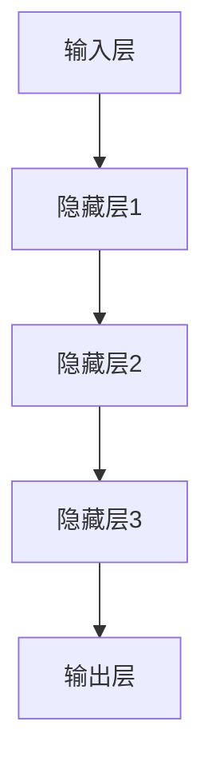

                 

# 《AI 大模型创业：如何利用商业优势？》

## 摘要

本文旨在探讨 AI 大模型在商业领域中的应用和创业机会。首先，我们将对 AI 大模型的基础知识进行概述，包括定义、分类及其商业背景。接着，我们将深入探讨 AI 大模型的技术基础，包括深度学习、神经网络和自然语言处理等核心技术。随后，我们将分析大规模预训练模型的原理和优势。接着，通过案例分析，我们将展示 AI 大模型在金融和医疗健康领域的实际应用。本文还将讨论 AI 大模型创业的准备、融资策略、市场营销策略以及法律法规与合规性。最后，我们将分享成功 AI 大模型创业案例，并展望 AI 大模型创业的未来趋势。

## 目录大纲

### 第一部分: AI 大模型的基础知识与商业潜力

#### 第1章: AI 大模型概述与商业背景

#### 第2章: AI 大模型的技术基础

#### 第3章: 大规模预训练模型原理

#### 第4章: AI 大模型商业应用案例分析

### 第二部分: AI 大模型创业策略与实践

#### 第5章: AI 大模型创业的准备

#### 第6章: AI 大模型创业的融资策略

#### 第7章: AI 大模型创业的市场营销策略

#### 第8章: AI 大模型创业的法律法规与合规性

### 第三部分: AI 大模型创业实战案例与启示

#### 第9章: 成功 AI 大模型创业案例分享

#### 第10章: AI 大模型创业面临的挑战与应对策略

#### 第11章: AI 大模型创业的持续发展与创新

#### 第12章: AI 大模型创业的启示与未来展望

### 附录

#### 附录 A: AI 大模型创业工具与资源

## 关键词

AI 大模型、商业潜力、技术基础、预训练模型、案例分析、创业策略、融资策略、市场营销策略、法律法规与合规性、创业实战案例、持续发展与创新。

## 文章标题

《AI 大模型创业：如何利用商业优势？》

---

在当今技术飞速发展的时代，人工智能（AI）已经成为推动各行各业进步的关键力量。尤其是 AI 大模型，凭借其强大的计算能力和深度学习能力，在多个领域展现出了巨大的商业潜力。本文将探讨如何利用 AI 大模型的优势进行创业，为创业者提供有价值的指导。

### 第一部分: AI 大模型的基础知识与商业潜力

#### 第1章: AI 大模型概述与商业背景

##### 1.1 AI 大模型的定义与分类

AI 大模型是指通过大规模数据训练得到的、具有强大泛化能力和自适应能力的神经网络模型。根据应用场景和功能特点，AI 大模型可以分类为自然语言处理模型、计算机视觉模型、语音识别模型等。

##### 1.2 大模型在商业领域的应用现状

目前，AI 大模型在商业领域的应用已经相当广泛，例如在金融、医疗、零售、制造等行业，AI 大模型被用于数据挖掘、风险控制、智能客服、自动化生产等场景。

##### 1.3 AI 大模型商业潜力的分析

随着大数据和云计算技术的发展，AI 大模型的应用场景将更加丰富，商业潜力也将进一步释放。例如，AI 大模型可以帮助企业实现个性化营销、智能决策和自动化运营，从而提高效率和降低成本。

#### 第2章: AI 大模型的技术基础

##### 2.1 深度学习与神经网络基础

深度学习是 AI 大模型的核心技术，它通过构建多层的神经网络来模拟人脑的学习过程。神经网络的基本结构包括输入层、隐藏层和输出层，每一层都由多个神经元组成。

##### 2.1.1 神经网络的基本结构

##### 2.1.2 常见的深度学习架构

深度学习架构包括卷积神经网络（CNN）、循环神经网络（RNN）、长短期记忆网络（LSTM）和变换器架构（Transformer）等。

##### 2.1.3 深度学习优化算法

深度学习优化算法包括梯度下降、随机梯度下降、Adam 等，它们用于调整神经网络的权重和偏置，以最小化损失函数。

##### 2.2 自然语言处理技术概览

自然语言处理（NLP）是 AI 大模型的重要应用领域之一，它涉及文本分类、情感分析、机器翻译、语音识别等任务。

##### 2.2.1 词嵌入技术

词嵌入是将词汇映射到高维向量空间的技术，它有助于神经网络理解和处理文本数据。

##### 2.2.2 序列模型与注意力机制

序列模型（如 RNN 和 LSTM）和注意力机制是处理序列数据的重要技术，它们能够捕捉序列中的长期依赖关系。

##### 2.2.3 转换器架构详解

转换器（Transformer）架构是一种基于自注意力机制的深度学习模型，它在自然语言处理任务中表现出色。

#### 第3章: 大规模预训练模型原理

##### 3.1 预训练的概念与意义

预训练是指在大规模数据集上训练神经网络模型，使其获得一定的通用知识和能力。预训练能够提高模型在特定任务上的表现，减少对训练数据的依赖。

##### 3.1.1 预训练的优势

- 提高模型泛化能力
- 减少对训练数据的需求
- 提高模型在下游任务上的表现

##### 3.1.2 自监督学习方法

自监督学习是一种无需标签数据的训练方法，它通过利用未标记的数据来训练模型。常见的自监督学习方法包括预测掩码、语言建模等。

##### 3.1.3 迁移学习与微调技术

迁移学习是将预训练模型在特定任务上的表现迁移到其他相关任务上的技术。微调是在预训练模型的基础上，通过少量数据进一步调整模型参数，以适应特定任务。

### 第4章: AI 大模型商业应用案例分析

#### 4.1 案例一：AI 大模型在金融行业的应用

##### 4.1.1 金融风控

AI 大模型在金融风控领域发挥着重要作用，例如信用评分、反欺诈、市场预测等。

##### 4.1.2 量化交易

AI 大模型可以帮助量化交易者分析市场数据，预测价格趋势，制定交易策略。

##### 4.1.3 保险理赔自动化

AI 大模型可以自动化处理保险理赔申请，提高理赔效率和准确性。

#### 4.2 案例二：AI 大模型在医疗健康领域的应用

##### 4.2.1 医疗影像诊断

AI 大模型可以帮助医生快速、准确地诊断疾病，提高诊断准确率。

##### 4.2.2 疾病预测

AI 大模型可以根据患者的病历数据预测疾病的发生风险，帮助医生制定预防措施。

##### 4.2.3 智能药物研发

AI 大模型可以加速药物研发过程，通过分析海量数据筛选出有潜力的药物候选。

### 第二部分: AI 大模型创业策略与实践

#### 第5章: AI 大模型创业的准备

##### 5.1 创业团队构建与能力培养

- 核心团队应包括技术人才、产品经理、市场营销等角色。
- 技术人才需具备深度学习、自然语言处理等相关技能。

##### 5.2 创业项目的选择与定位

- 根据市场需求选择合适的创业项目。
- 确定项目的独特价值和竞争优势。

##### 5.3 技术研发与产品规划

- 制定详细的技术路线图和产品规划。
- 逐步实现产品功能，并进行迭代优化。

#### 第6章: AI 大模型创业的融资策略

##### 6.1 融资环境与趋势

- 分析当前融资环境，了解投资趋势。
- 选择合适的融资渠道，如风险投资、天使投资等。

##### 6.2 路演与融资谈判技巧

- 准备路演材料，展示项目优势和潜力。
- 掌握融资谈判技巧，争取最佳融资条件。

##### 6.3 融资后的管理

- 合理规划资金使用，确保项目顺利推进。
- 建立与投资者的良好关系，持续沟通与合作。

#### 第7章: AI 大模型创业的市场营销策略

##### 7.1 市场定位与目标客户分析

- 分析市场，确定目标客户群体。
- 设计符合目标客户需求的产品和服务。

##### 7.2 品牌建设与推广策略

- 塑造品牌形象，提高品牌知名度。
- 制定线上线下推广策略，扩大市场份额。

##### 7.3 用户互动与忠诚度建设

- 设计用户互动活动，提高用户参与度。
- 提供优质服务，建立用户忠诚度。

#### 第8章: AI 大模型创业的法律法规与合规性

##### 8.1 AI 大模型相关的法律法规

- 了解相关法律法规，确保项目合规性。
- 遵循数据保护、知识产权保护等相关法规。

##### 8.2 合规性评估与风险管理

- 进行合规性评估，识别潜在风险。
- 制定风险管理策略，降低合规风险。

##### 8.3 合规性培训与持续改进

- 对员工进行合规性培训，提高合规意识。
- 定期评估合规性，持续改进合规管理。

### 第三部分: AI 大模型创业实战案例与启示

#### 第9章: 成功 AI 大模型创业案例分享

##### 9.1 案例一：OpenAI 的创业之路

- OpenAI 是一家致力于推动人工智能发展的公司，其核心产品包括 GPT-3 等大型语言模型。

##### 9.1.1 OpenAI 的创立背景

- OpenAI 由一群顶级 AI 研究员创立，旨在推动人工智能的发展和应用。

##### 9.1.2 AI 大模型的研究与商业化

- OpenAI 通过大规模数据预训练，开发了 GPT-3 等大型语言模型，并在多个领域实现了商业化应用。

##### 9.1.3 OpenAI 的商业模式与创新点

- OpenAI 采用会员制商业模式，为会员提供高质量的 AI 大模型服务，实现了良好的盈利能力。

##### 9.2 案例二：DeepMind 的创业历程

- DeepMind 是一家专注于人工智能研究的公司，其核心产品包括 AlphaGo 等人工智能程序。

##### 9.2.1 DeepMind 的研究团队与目标

- DeepMind 的研究团队由一群顶尖 AI 研究员组成，致力于解决复杂的人工智能问题。

##### 9.2.2 AI 大模型在游戏与医疗领域的应用

- DeepMind 通过开发 AI 大模型，成功实现了在围棋等游戏领域的突破，并在医疗领域开展了多项研究。

##### 9.2.3 DeepMind 的成功经验与挑战

- DeepMind 的成功经验包括高水平的研究团队、创新的技术和商业模式的探索。然而，其也面临着技术难度大、市场竞争激烈等挑战。

### 第10章: AI 大模型创业面临的挑战与应对策略

##### 10.1 挑战一：技术难题

- AI 大模型创业面临的主要技术难题包括模型训练成本高、可解释性差、安全性与隐私保护等。

##### 10.1.1 大模型训练成本高

- 大模型训练需要大量的计算资源和数据，导致成本高昂。应对策略包括优化模型结构、利用云计算资源等。

##### 10.1.2 大模型的可解释性

- 大模型在处理复杂任务时表现出色，但其内部决策过程往往缺乏可解释性。应对策略包括开发可解释性算法、提供决策解释等。

##### 10.1.3 大模型的安全性与隐私保护

- 大模型在处理数据时可能涉及敏感信息，确保安全性与隐私保护至关重要。应对策略包括数据加密、隐私保护算法等。

##### 10.2 挑战二：市场竞争

- AI 大模型市场竞争激烈，行业内巨头企业占据主导地位。应对策略包括市场细分、差异化策略等。

##### 10.2.1 行业巨头的影响

- 行业巨头在技术、资源、市场等方面具有优势，对创业公司构成一定压力。应对策略包括寻找细分市场、打造独特竞争力等。

##### 10.2.2 市场进入壁垒

- AI 大模型市场进入壁垒较高，技术门槛和资金需求较大。应对策略包括技术创新、资源整合等。

##### 10.2.3 市场细分与差异化策略

- 通过市场细分和差异化策略，创业公司可以在特定领域实现差异化竞争优势。应对策略包括定位特定行业、提供定制化解决方案等。

##### 10.3 挑战三：政策法规与合规

- AI 大模型创业面临政策法规和合规方面的挑战，如数据保护、知识产权保护等。

##### 10.3.1 数据隐私与合规问题

- 大模型在处理数据时需遵循数据保护法规，确保用户隐私。应对策略包括数据加密、隐私保护算法等。

##### 10.3.2 知识产权保护与争议

- 创业公司在知识产权保护方面需注意侵权风险，同时要防范竞争对手的抄袭和侵权行为。应对策略包括知识产权保护策略、争议解决等。

##### 10.3.3 政策法规的不确定性

- 政策法规的变化可能对创业公司带来不确定性和挑战。应对策略包括密切关注政策动态、及时调整业务策略等。

### 第11章: AI 大模型创业的持续发展与创新

##### 11.1 持续研发与创新

- 创业公司需要持续投入研发，推动技术创新，保持竞争优势。

##### 11.1.1 技术迭代与更新

- 定期更新大模型算法和架构，提高模型性能和适用性。

##### 11.1.2 市场需求的快速响应

- 及时了解市场需求，快速迭代产品，满足用户需求。

##### 11.1.3 创新团队的建立与激励机制

- 建立创新团队，鼓励员工进行技术创新和探索，提供激励机制。

##### 11.2 商业模式的持续优化

- 创业公司需要不断优化商业模式，提高盈利能力和市场竞争力。

##### 11.2.1 增值服务的开发

- 开发增值服务，增加收入来源，提高客户粘性。

##### 11.2.2 商业模式的多元化

- 探索多元化商业模式，如订阅制、SaaS 等，扩大市场覆盖。

##### 11.2.3 客户关系管理策略

- 加强客户关系管理，提高客户满意度和忠诚度。

##### 11.3 社会责任与可持续发展

- 创业公司应承担社会责任，关注可持续发展。

##### 11.3.1 数据伦理与透明度

- 遵循数据伦理，提高数据透明度，增强用户信任。

##### 11.3.2 环境与社会影响评估

- 定期评估企业环境和社会影响，采取相应措施降低负面影响。

##### 11.3.3 企业社会责任的实践与传播

- 实践企业社会责任，通过公益活动和环保举措传播正能量。

### 第12章: AI 大模型创业的启示与未来展望

##### 12.1 启示一：技术驱动与市场结合的重要性

- 技术创新是 AI 大模型创业的核心驱动力，但需紧密结合市场需求，实现技术成果的商业化应用。

##### 12.1.1 技术创新的市场需求导向

- 创业公司在技术创新过程中，需密切关注市场需求，确保技术成果具有实际应用价值。

##### 12.1.2 商业模式的灵活性与适应性

- 创业公司应具备灵活的商业模式，适应市场变化和用户需求。

##### 12.1.3 技术创新与产业协同

- 创业公司需与产业链上下游企业进行合作，实现技术创新与产业协同发展。

##### 12.2 启示二：跨界合作与资源共享

- 跨界合作和资源共享有助于创业公司拓展业务领域和提升竞争力。

##### 12.2.1 跨行业合作与资源整合

- 创业公司可通过跨行业合作，整合不同领域的资源，实现业务拓展。

##### 12.2.2 开放平台与生态体系建设

- 建立开放平台和生态体系，吸引更多合作伙伴和开发者参与，共同推动产业创新。

##### 12.2.3 跨界合作的成功案例

- 分析成功跨界合作案例，学习借鉴优秀经验和模式。

##### 12.3 未来展望：AI 大模型创业的新趋势

- 随着 AI 技术的不断发展，AI 大模型创业将呈现以下新趋势：

##### 12.3.1 AI 大模型在垂直行业的深化应用

- AI 大模型将更加深入地应用于金融、医疗、零售等垂直行业，实现行业智能化升级。

##### 12.3.2 大模型开源生态的发展

- 大模型开源生态将继续发展，推动技术创新和共享。

##### 12.3.3 大模型创业的国际化视野

- 创业公司将具备国际化视野，拓展国际市场，实现全球业务布局。

### 附录

#### 附录 A: AI 大模型创业工具与资源

- **附录 A.1 主流 AI 大模型框架对比**

  - **A.1.1 TensorFlow**
    - TensorFlow 是由 Google 开发的一种开源机器学习框架，支持多种编程语言，包括 Python、C++ 和 Java。它提供了丰富的工具和库，用于构建和训练深度学习模型。

  - **A.1.2 PyTorch**
    - PyTorch 是一种基于 Python 的开源深度学习框架，它提供了灵活的动态计算图和强大的 GPU 支持功能。PyTorch 在学术界和工业界都得到了广泛的应用。

  - **A.1.3 JAX**
    - JAX 是由 Google 开发的一种高级数值计算库，它支持自动微分、并行计算和硬件优化等功能。JAX 在深度学习领域得到了越来越多的关注。

  - **A.1.4 其他框架简介**
    - 除了上述框架，还有如 Theano、MXNet 等其他深度学习框架，它们也具有各自的特点和优势。

- **附录 A.2 AI 大模型创业常用资源**

  - **A.2.1 开源数据集**
    - 多个开源数据集，如 ImageNet、CIFAR-10、COCO 等，为 AI 大模型训练提供了丰富的数据资源。

  - **A.2.2 研究论文与报告**
    - 了解最新的 AI 大模型研究进展和行业报告，如 arXiv、ACL、ICML 等。

  - **A.2.3 AI 大模型创业论坛与社群**
    - 加入 AI 大模型创业相关的论坛和社群，如 AI 创业社区、AI 创业社群等，获取行业资讯和交流经验。

## 作者信息

作者：AI天才研究院/AI Genius Institute & 禅与计算机程序设计艺术 /Zen And The Art of Computer Programming

