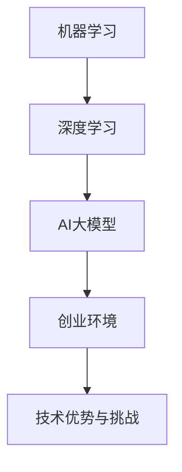

                 

### 文章标题

**AI 大模型创业：如何利用技术优势？**

> **关键词：** AI 大模型、创业、技术优势、自然语言处理、计算机视觉、强化学习、语音识别

**摘要：** 本文将深入探讨AI大模型在创业中的技术优势，以及如何利用这些优势进行有效的创业实践。文章分为三个部分：第一部分介绍AI大模型的基本概念和应用场景；第二部分探讨AI大模型的关键技术和创业中的实际应用；第三部分通过案例解析和战略规划，展示如何实现AI大模型创业的可持续发展。

----------------------------------------------------------------

### 第一部分: AI大模型创业基础

#### 第1章: AI大模型与创业环境

##### 1.1 AI大模型与创业环境概述

##### 1.1.1 AI大模型的基本概念

AI大模型（Large-scale AI Model）通常指的是那些需要大量数据进行训练，并且能够在多个领域表现出强大性能的深度学习模型。这些模型在机器学习领域扮演着至关重要的角色，它们能够从数据中学习，并且通过不断的优化，实现对复杂问题的求解。

- **核心概念与联系：**
  - **机器学习**：机器学习是一种使计算机系统能够从数据中学习的方法，无需显式编程。AI大模型是机器学习的一个分支，通常涉及深度学习技术。
  - **深度学习**：深度学习是一种人工智能的分支，它使用神经网络（尤其是深度神经网络）进行训练，以达到对数据的自动特征学习和模式识别。

**Mermaid流程图：**


##### 1.1.2 创业环境中的AI大模型应用

AI大模型在创业环境中具有广泛的应用，这些应用主要体现在以下几个领域：

- **自然语言处理（NLP）**：如文本分类、情感分析、机器翻译等。
- **计算机视觉**：如图像识别、目标检测、图像生成等。
- **强化学习**：如游戏AI、推荐系统、自动化控制等。
- **语音识别**：如语音识别、语音合成、语音助手等。

**AI大模型在创业中的应用场景：**
- **商业智能**：利用AI大模型进行数据分析，为企业提供决策支持。
- **智能客服**：通过自然语言处理，实现智能客服系统，提高客户满意度。
- **智能安防**：利用计算机视觉，实现实时监控和异常检测。
- **智能家居**：通过语音识别和计算机视觉，实现智能化的家庭环境。

##### 1.1.3 AI大模型创业的优势与挑战

**优势：**
- **技术优势**：AI大模型能够处理大量数据，提高决策的精度和效率。
- **市场潜力**：随着人工智能技术的不断发展，市场对AI大模型的需求不断增加。
- **创新能力**：AI大模型为企业提供了创新的解决方案，有助于企业在竞争中获得优势。

**挑战：**
- **技术挑战**：训练大模型需要大量的计算资源和时间。
- **数据挑战**：获取高质量的数据是一个困难且成本高昂的过程。
- **市场挑战**：市场竞争激烈，如何实现差异化是关键。

##### 1.2 AI大模型的关键技术

AI大模型的成功依赖于多个关键技术的支持，主要包括：

- **机器学习与深度学习基础**：理解基础算法和模型架构。
- **大规模数据处理与分布式计算**：高效处理大规模数据。
- **模型训练与优化技术**：包括超参数调优、模型压缩等。

##### 1.3 AI大模型的应用场景

AI大模型在多个领域都有广泛的应用，以下是一些主要的应用场景：

- **自然语言处理（NLP）**：如文本分类、情感分析、机器翻译等。
- **计算机视觉**：如图像识别、目标检测、图像生成等。
- **强化学习**：如游戏AI、推荐系统、自动化控制等。
- **语音识别**：如语音识别、语音合成、语音助手等。

#### 第2章: 创业中的AI大模型项目规划

##### 2.1 项目需求分析

在创业中，进行AI大模型项目规划的第一步是进行项目需求分析。这包括以下内容：

- **市场调研**：了解市场趋势、竞争对手和目标用户需求。
- **用户需求分析**：确定用户的具体需求，如功能需求、性能需求和用户体验需求。
- **技术可行性分析**：评估所需技术的可行性，包括算法选择、计算资源需求和开发周期。

##### 2.2 项目团队构建

构建一个高效的AI大模型项目团队是项目成功的关键。以下是一些关键步骤：

- **技术团队组织**：根据项目需求，组建包括数据科学家、机器学习工程师、前端工程师和后端工程师在内的团队。
- **项目管理方法**：采用敏捷开发方法，快速迭代，确保项目进度和质量。

##### 2.3 项目资源规划

项目资源规划包括以下几个方面：

- **资金预算**：根据项目规模和需求，制定合理的资金预算。
- **设备与工具配置**：包括服务器、GPU和其他必要硬件设备的配置。
- **时间进度安排**：制定详细的时间表，确保项目按时完成。

#### 第3章: AI大模型的关键技术

##### 3.1 机器学习与深度学习基础

机器学习和深度学习是AI大模型的基础。以下是一些关键概念：

- **机器学习**：一种使计算机系统能够从数据中学习的方法，无需显式编程。
- **深度学习**：一种机器学习技术，使用神经网络（尤其是深度神经网络）进行训练，以达到对数据的自动特征学习和模式识别。

##### 3.2 大规模数据处理与分布式计算

大规模数据处理和分布式计算是AI大模型应用中的关键挑战。以下是一些关键技术：

- **数据预处理**：包括数据清洗、数据格式转换和数据归一化等。
- **分布式计算**：利用多个计算节点进行并行计算，以提高计算效率和速度。

##### 3.3 模型训练与优化技术

模型训练和优化是AI大模型应用中的核心步骤。以下是一些关键技术：

- **超参数调优**：通过调整模型的超参数，以获得最佳性能。
- **模型压缩**：通过模型剪枝、量化等技术，减小模型大小，提高部署效率。

#### 第4章: AI大模型的应用场景

##### 4.1 自然语言处理在创业中的应用

自然语言处理（NLP）是AI大模型在创业中应用的一个重要领域。以下是一些应用场景：

- **文本分类**：用于分类文本数据，如新闻分类、情感分析等。
- **情感分析**：用于分析文本中的情感倾向，如评论分析、市场调研等。
- **机器翻译**：用于将一种语言的文本翻译成另一种语言。

##### 4.2 计算机视觉在创业中的应用

计算机视觉是AI大模型在创业中应用的另一个重要领域。以下是一些应用场景：

- **图像识别**：用于识别图像中的对象，如人脸识别、车辆识别等。
- **目标检测**：用于检测图像中的多个对象，如行人检测、车辆检测等。
- **图像生成**：用于生成新的图像，如艺术风格迁移、图像超分辨率等。

##### 4.3 强化学习在创业中的应用

强化学习是AI大模型在创业中应用的另一个重要领域。以下是一些应用场景：

- **游戏AI**：用于开发智能游戏对手，如电子竞技、桌面游戏等。
- **推荐系统**：用于个性化推荐，如商品推荐、音乐推荐等。
- **自动化控制**：用于自动化控制系统，如智能家居、工业自动化等。

##### 4.4 语音识别在创业中的应用

语音识别是AI大模型在创业中应用的另一个重要领域。以下是一些应用场景：

- **语音识别**：用于将语音转换为文本，如语音助手、智能客服等。
- **语音合成**：用于将文本转换为语音，如语音通知、语音广告等。
- **语音交互**：用于实现语音交互功能，如智能音箱、智能助手等。

### 第二部分: AI大模型的技术应用

#### 第3章: 自然语言处理在创业中的应用

##### 3.1 文本数据预处理

文本数据预处理是自然语言处理（NLP）中的关键步骤，它包括以下几个主要阶段：

- **数据清洗**：去除文本中的无关信息，如HTML标签、停用词、特殊字符等。
- **文本分词**：将文本分割成单词或词组，以便进行后续处理。
- **词向量表示**：将文本转换为数字表示，如Word2Vec、BERT等。

##### 3.2 基于深度学习的文本模型

基于深度学习的文本模型在NLP中发挥着重要作用，以下是一些关键模型：

- **词嵌入技术**：将单词映射到高维向量空间，以捕获语义信息。
- **序列模型与注意力机制**：用于处理序列数据，如RNN、LSTM、GRU等。
- **转换器架构（Transformer）**：是一种基于注意力机制的深度学习模型，广泛应用于NLP任务。

##### 3.3 文本分类与情感分析

文本分类与情感分析是NLP中的两个重要应用，以下是一些关键点：

- **文本分类算法**：用于将文本数据分类到预定义的类别中，如情感分类、新闻分类等。
- **情感分析模型**：用于分析文本中的情感倾向，如积极情感、消极情感等。
- **实践案例解析**：通过实际案例，展示如何使用深度学习模型进行文本分类与情感分析。

#### 第4章: 计算机视觉在创业中的应用

##### 4.1 图像数据预处理

图像数据预处理是计算机视觉（CV）中的关键步骤，它包括以下几个主要阶段：

- **图像数据清洗**：去除图像中的噪声和无关信息。
- **图像增强**：改善图像质量，使其更易于处理。
- **特征提取**：提取图像的关键特征，如颜色、纹理、形状等。

##### 4.2 基于深度学习的图像模型

基于深度学习的图像模型在CV中发挥着重要作用，以下是一些关键模型：

- **卷积神经网络（CNN）**：用于提取图像的局部特征，广泛应用于图像分类、目标检测等任务。
- **深度残差网络（ResNet）**：通过引入残差连接，解决了深层网络中的梯度消失问题。
- **生成对抗网络（GAN）**：用于生成高质量图像，广泛应用于图像修复、图像生成等任务。

##### 4.3 图像分类与目标检测

图像分类与目标检测是CV中的两个重要应用，以下是一些关键点：

- **图像分类算法**：用于将图像分类到预定义的类别中，如动物分类、植物分类等。
- **目标检测模型**：用于检测图像中的多个对象，并给出每个对象的位置和类别，如YOLO、SSD、Faster R-CNN等。
- **实践案例解析**：通过实际案例，展示如何使用深度学习模型进行图像分类与目标检测。

#### 第5章: 强化学习在创业中的应用

##### 5.1 强化学习基本原理

强化学习（Reinforcement Learning，RL）是一种机器学习方法，通过奖励信号来指导算法进行决策。以下是强化学习的基本原理：

- **强化学习框架**：包括环境（Environment）、代理（Agent）、状态（State）、动作（Action）和奖励（Reward）。
- **基本算法**：包括Q-Learning、SARSA、Deep Q-Networks（DQN）等。
- **强化学习应用场景**：包括游戏AI、推荐系统、自动化控制等。

##### 5.2 强化学习算法详解

以下是强化学习中的几个关键算法：

- **Q-Learning**：通过更新Q值来指导代理进行决策。
- **SARSA**：一种基于策略的强化学习算法，用于更新状态-动作值。
- **Deep Q-Networks（DQN）**：通过深度神经网络来近似Q值函数。

##### 5.3 强化学习实践应用

以下是强化学习在创业中的几个实践应用案例：

- **游戏AI**：用于开发智能游戏对手，如电子竞技、桌面游戏等。
- **推荐系统**：通过强化学习算法，实现个性化推荐，如商品推荐、音乐推荐等。
- **自动化控制**：用于自动化控制系统，如智能家居、工业自动化等。

#### 第6章: 语音识别在创业中的应用

##### 6.1 语音信号处理

语音信号处理是语音识别（Speech Recognition，SR）的基础，它包括以下几个主要阶段：

- **语音信号采样与量化**：将连续的语音信号转换为离散的数字信号。
- **语音信号特征提取**：提取语音信号的关键特征，如MFCC（Mel频谱倒谱系数）、PLP（Perceptual Linear Prediction）等。
- **语音信号增强**：改善语音信号质量，提高识别准确性。

##### 6.2 基于深度学习的语音模型

基于深度学习的语音模型在语音识别中发挥着重要作用，以下是一些关键模型：

- **自动回归模型（Autoregressive Model）**：如WaveNet、Transformer等，用于生成语音信号。
- **深度神经网络模型（Deep Neural Network，DNN）**：用于语音信号的分类和特征提取。
- **RNN与LSTM模型**：如LSTM、GRU等，用于处理序列数据。

##### 6.3 语音识别系统设计

语音识别系统设计包括以下几个关键组成部分：

- **语音识别系统架构**：包括前端信号处理、中间特征提取、后端语言模型等。
- **语音识别算法**：包括基于GMM-HMM的语音识别算法、基于深度学习的语音识别算法等。
- **实践案例解析**：通过实际案例，展示如何设计并实现一个语音识别系统。

### 第三部分: AI大模型创业实践

#### 第7章: AI大模型创业案例解析

##### 7.1 案例一：基于AI的大数据分析公司

**案例背景：** 
某大数据分析公司致力于为客户提供高效的数据分析解决方案，通过AI大模型技术，为客户提供精准的市场预测和决策支持。

**业务场景：** 
- 市场趋势预测：利用自然语言处理和深度学习技术，分析大量市场数据，预测未来市场趋势。
- 用户行为分析：利用强化学习技术，分析用户行为数据，优化产品推荐和营销策略。

**技术实现：** 
- 自然语言处理：使用BERT模型进行文本分类和情感分析，提取市场趋势和用户情感。
- 深度学习：使用LSTM模型进行时间序列预测，预测市场趋势。
- 强化学习：使用Q-Learning算法，优化产品推荐策略。

**实践成效：** 
- 提高了市场预测的准确性，帮助客户做出更明智的决策。
- 优化了产品推荐策略，提高了用户满意度和转化率。

##### 7.2 案例二：AI驱动的智能家居

**案例背景：** 
某智能家居公司致力于通过AI技术，提供智能化的家居解决方案，提升用户的生活质量。

**业务场景：** 
- 智能家居控制：通过语音识别技术，实现智能家居设备的语音控制。
- 家居安全监控：利用计算机视觉技术，实时监控家庭环境，防止安全隐患。

**技术实现：** 
- 语音识别：使用基于深度学习的语音识别模型，实现语音控制功能。
- 计算机视觉：使用YOLO模型进行目标检测，实时监控家庭环境。

**实践成效：** 
- 提高了用户的生活便利性，增强了用户体验。
- 提高了家庭安全性，降低了意外事件的发生。

##### 7.3 案例三：AI医疗诊断平台

**案例背景：** 
某医疗诊断平台公司致力于通过AI技术，提供准确的医疗诊断服务，帮助医生提高诊断效率。

**业务场景：** 
- 医学图像分析：利用计算机视觉技术，对医学图像进行分析，辅助医生诊断。
- 病历数据分析：利用自然语言处理技术，分析患者病历，提供诊断建议。

**技术实现：** 
- 计算机视觉：使用深度学习模型，对医学图像进行分割和识别。
- 自然语言处理：使用BERT模型，对病历数据进行分析，提取关键信息。

**实践成效：** 
- 提高了诊断的准确性和效率，减少了误诊率。
- 提高了医生的工作效率，减轻了工作负担。

### 第8章: AI大模型创业战略与可持续发展

#### 8.1 AI大模型创业战略

##### 8.1.1 市场定位

市场定位是AI大模型创业成功的关键，以下是一些关键步骤：

- **市场调研**：了解目标市场的规模、竞争状况和用户需求。
- **目标用户分析**：确定目标用户群体，如企业、个人用户等。
- **差异化策略**：通过技术创新或商业模式，实现差异化竞争。

##### 8.1.2 产品规划

产品规划是AI大模型创业的重要组成部分，以下是一些关键点：

- **产品定位**：明确产品的核心功能和目标市场。
- **产品功能规划**：根据市场需求，规划产品的具体功能。
- **产品迭代策略**：采用敏捷开发方法，快速迭代，持续优化产品。

##### 8.1.3 营销策略

营销策略是推动AI大模型产品市场接受的关键，以下是一些关键策略：

- **品牌建设**：通过品牌定位、品牌传播等手段，建立品牌形象。
- **渠道策略**：确定销售渠道，如线上销售、合作伙伴等。
- **推广活动**：通过线上线下的推广活动，提高产品知名度。

#### 8.2 可持续发展策略

##### 8.2.1 社会责任与伦理

在AI大模型创业中，社会责任与伦理至关重要，以下是一些关键点：

- **数据安全与隐私保护**：确保用户数据的安全和隐私，遵守相关法律法规。
- **算法公平性**：确保算法的公平性，避免算法偏见。
- **伦理问题**：在应用AI大模型时，关注伦理问题，如就业影响、隐私侵犯等。

##### 8.2.2 数据安全与隐私保护

数据安全和隐私保护是AI大模型创业中的关键挑战，以下是一些关键策略：

- **数据加密**：对用户数据进行加密处理，确保数据传输和存储的安全。
- **访问控制**：通过权限管理和身份验证，控制对数据的访问。
- **数据备份与恢复**：定期进行数据备份，确保数据不会丢失。

##### 8.2.3 长期发展规划

长期发展规划是AI大模型创业成功的重要保障，以下是一些关键步骤：

- **技术创新**：持续进行技术创新，保持在技术前沿。
- **市场拓展**：不断拓展市场，开拓新的业务领域。
- **人才培养**：重视人才培养，建立人才梯队，确保团队持续发展。

### 第9章: AI大模型创业团队建设与管理

#### 9.1 团队建设原则

##### 9.1.1 能力匹配

能力匹配是团队建设的基础，以下是一些关键点：

- **技术能力匹配**：确保团队成员具备所需的技术能力，如机器学习、深度学习、自然语言处理等。
- **沟通能力匹配**：团队成员之间能够有效沟通，协同工作。

##### 9.1.2 文化融合

文化融合是团队建设的重要环节，以下是一些关键点：

- **共同目标**：确保团队成员有共同的目标和愿景，形成团队凝聚力。
- **尊重差异**：尊重团队成员的不同观点和文化背景，促进团队创新。

##### 9.1.3 激励机制

激励机制是团队建设的重要手段，以下是一些关键点：

- **绩效奖励**：根据团队成员的工作绩效，给予适当的奖励。
- **职业发展**：为团队成员提供职业发展机会，激发工作积极性。

#### 9.2 管理方法与技巧

##### 9.2.1 项目管理

项目管理是团队管理的重要方面，以下是一些关键点：

- **项目规划**：明确项目的目标、范围、时间和资源。
- **进度监控**：定期检查项目进度，确保项目按时完成。
- **风险管理**：识别项目风险，制定风险应对策略。

##### 9.2.2 人才培养

人才培养是团队建设的关键，以下是一些关键点：

- **培训计划**：制定团队成员的培训计划，提高技术水平。
- **人才梯队**：培养一支高素质的人才梯队，确保团队持续发展。

##### 9.2.3 沟通协作

沟通协作是团队工作的重要保障，以下是一些关键点：

- **沟通渠道**：建立有效的沟通渠道，确保信息畅通。
- **协作工具**：使用协作工具，如即时通讯、项目管理工具等，提高团队协作效率。

#### 9.3 团队管理与文化构建

##### 9.3.1 团队领导力

团队领导力是团队管理的关键，以下是一些关键点：

- **愿景领导**：明确团队的愿景和目标，激发团队成员的积极性。
- **激励领导**：关注团队成员的需求，激发工作动力。

##### 9.3.2 团队文化建设

团队文化建设是团队管理的重要方面，以下是一些关键点：

- **共同价值观**：建立共同的核心价值观，形成团队凝聚力。
- **团队活动**：定期组织团队活动，增强团队凝聚力。

##### 9.3.3 反馈与改进

反馈与改进是团队管理的重要环节，以下是一些关键点：

- **定期反馈**：定期对团队成员的工作进行反馈，指出优点和不足。
- **持续改进**：根据反馈，不断改进团队管理方法和工作流程。

### 附录

#### 附录A: AI大模型开发工具与资源

##### A.1 开发工具

- **TensorFlow**：一款广泛使用的开源深度学习框架，支持多种平台和编程语言。
- **PyTorch**：一款基于Python的深度学习框架，具有良好的灵活性和易用性。
- **Keras**：一个高层神经网络API，能够简化深度学习模型的构建和训练。

##### A.2 资源链接

- **数据集下载**：提供各种公共数据集下载链接，如ImageNet、COCO等。
- **论文与报告**：提供最新的AI研究论文和行业报告下载链接。
- **在线教程与课程**：提供在线教程和课程链接，帮助开发者学习和掌握AI技术。

##### A.3 开发环境搭建

- **安装TensorFlow**：
  ```bash
  pip install tensorflow
  ```
- **安装PyTorch**：
  ```bash
  pip install torch torchvision
  ```
- **安装Keras**：
  ```bash
  pip install keras
  ```

## 参考文献

- Bengio, Y., Courville, A., & Vincent, P. (2013). Representation learning: A review and new perspectives. IEEE Transactions on Pattern Analysis and Machine Intelligence, 35(8), 1798-1828.
- Goodfellow, I., Bengio, Y., & Courville, A. (2016). Deep learning. MIT Press.
- LeCun, Y., Bengio, Y., & Hinton, G. (2015). Deep learning. Nature, 521(7553), 436-444.
- Russell, S., & Norvig, P. (2010). Artificial Intelligence: A Modern Approach (3rd ed.). Prentice Hall.
- Sutton, R. S., & Barto, A. G. (2018). Reinforcement Learning: An Introduction (2nd ed.). MIT Press.
- Hochreiter, S., & Schmidhuber, J. (1997). Long short-term memory. Neural Computation, 9(8), 1735-1780.
- Graves, A. (2013). Generating sequences with recurrent neural networks. arXiv preprint arXiv:1308.0850.

