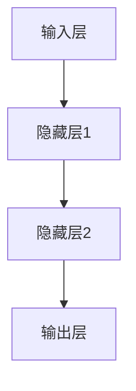

                 

# AI 大模型创业：如何利用文化优势？

## 关键词
AI 大模型，创业，文化优势，团队建设，商业策略，未来展望

## 摘要
本文深入探讨了 AI 大模型创业中的文化优势，从基础概念到实际应用，再到创业策略和团队建设，全面解析了如何利用文化优势推动 AI 大模型创业的发展。通过案例分析和实际案例，本文提供了实用的指导和建议，为创业者提供了清晰的行动路线。

---

## 第一部分：AI 大模型基础知识

### 第1章：AI 大模型概述

#### 1.1 AI 大模型的基本概念

AI 大模型是指参数规模庞大、结构复杂的人工智能模型，它们能够在海量数据上通过深度学习算法进行训练，以实现高度的任务自动化和智能化。这些模型通常用于图像识别、自然语言处理、语音识别、推荐系统等复杂任务。

#### 1.2 AI 大模型的特点与优势

**特点：**
- **大规模参数**：AI 大模型拥有数十亿到数万亿个参数，这使得它们能够捕捉到输入数据的细微特征。
- **深度神经网络结构**：AI 大模型通常包含多层神经网络，能够进行深度特征提取。
- **高度自动化**：AI 大模型可以自动从大量数据中学习，减少了人工干预的需求。

**优势：**
- **强大的学习能力**：AI 大模型能够从大量数据中学习，提高预测的准确性和泛化能力。
- **高效的任务执行**：AI 大模型能够高效地处理复杂任务，提高生产效率。
- **多样化的应用场景**：AI 大模型可以应用于各种领域，如医疗、金融、零售等。

#### 1.3 AI 大模型的技术发展历程

AI 大模型的发展经历了多个阶段：

- **早期的神经网络**：1980年代，简单的神经网络开始应用于图像识别和语音识别。
- **深度学习的兴起**：2006年，深度学习的概念被提出，随后在2012年，AlexNet 在 ImageNet 挑战中取得了突破性成果，标志着深度学习的崛起。
- **AI 大模型的兴起**：随着计算能力和数据资源的提升，AI 大模型开始出现，如 GPT、BERT 等。

### 第2章：AI 大模型的原理与架构

#### 2.1 AI 大模型的核心原理

AI 大模型的核心原理是基于深度学习，深度学习是一种基于多层神经网络的机器学习方法。其基本思想是通过学习输入数据和输出数据之间的关系，从而实现对未知数据的预测。

**核心原理：**
- **多层神经网络**：深度学习模型通常包含多层神经元，每层神经元对输入数据进行变换，以提取不同级别的特征。
- **反向传播算法**：深度学习模型通过反向传播算法更新模型参数，以最小化预测误差。

#### 2.2 AI 大模型的主要架构

AI 大模型的主要架构包括以下几个部分：

- **输入层**：接收外部输入数据，如文本、图像等。
- **隐藏层**：通过多层非线性变换，对输入数据进行特征提取。
- **输出层**：根据隐藏层的输出，生成预测结果。

**示例：** 以下是一个简化的多层感知器（MLP）的 Mermaid 流程图：



#### 2.3 AI 大模型的组件与交互

AI 大模型的组件包括：

- **神经元**：神经元是神经网络的基本单元，负责对输入数据进行加权求和并激活。
- **权重**：神经元之间的连接权重决定了输入数据的特征权重。
- **激活函数**：激活函数用于对神经元的输出进行非线性变换。

神经元之间的交互过程如下：

1. **前向传播**：输入数据经过神经元加权求和，然后通过激活函数得到输出。
2. **反向传播**：计算输出与真实值的误差，通过梯度下降算法更新权重。

以下是一个简化的伪代码示例：

```python
# 前向传播
def forward_propagation(inputs, weights, bias, activation_function):
    z = inputs * weights + bias
    output = activation_function(z)
    return output

# 反向传播
def backward_propagation(inputs, output, weights, activation_function, learning_rate):
    error = output - target
    delta = error * activation_function_derivative(output)
    weights -= learning_rate * delta * inputs
    return weights
```

### 第3章：AI 大模型的技术细节

#### 3.1 神经网络基础

神经网络由大量相互连接的神经元组成，它们通过权重和偏置进行信息传递。神经网络的基础包括：

- **神经元结构**：神经元通常包含输入层、隐藏层和输出层。
- **激活函数**：常用的激活函数包括 sigmoid、ReLU、Tanh 等。
- **前向传播和反向传播**：神经网络通过前向传播计算输出，通过反向传播更新权重。

#### 3.2 深度学习算法

深度学习算法是构建 AI 大模型的核心，常见的深度学习算法包括：

- **卷积神经网络（CNN）**：适用于图像识别和图像处理任务。
- **循环神经网络（RNN）**：适用于序列数据处理任务。
- **生成对抗网络（GAN）**：适用于生成对抗性学习任务。

#### 3.3 自然语言处理技术

自然语言处理（NLP）是 AI 大模型的重要应用领域，常见的 NLP 技术包括：

- **词嵌入**：将文本转换为向量表示。
- **序列标注**：对文本中的词语进行分类标注。
- **文本生成**：根据输入文本生成新的文本。

## 第二部分：AI 大模型创业实践

### 第4章：AI 大模型创业概述

#### 4.1 AI 大模型创业的背景与趋势

AI 大模型创业的背景在于人工智能技术的快速发展，尤其是深度学习在图像识别、自然语言处理等领域的突破性成果。随着技术的成熟，越来越多的创业者开始关注 AI 大模型，探索其在商业应用中的潜力。

**趋势：**
- **技术创新**：AI 大模型的技术不断创新，推动其应用场景的扩展。
- **商业应用**：AI 大模型在金融、医疗、教育等行业的应用日益广泛，创业者可以通过挖掘行业痛点，利用 AI 大模型提供创新的解决方案。
- **市场竞争**：随着 AI 大模型的普及，市场竞争日益激烈，创业者需要具备强大的技术能力和市场洞察力。

### 4.2 AI 大模型创业的核心挑战

**技术挑战：**
- **数据质量**：AI 大模型的训练需要大量的高质量数据，数据的质量直接影响模型的性能。
- **计算资源**：训练 AI 大模型需要大量的计算资源，对于中小企业而言，这往往是一个巨大的挑战。

**商业挑战：**
- **市场需求**：创业者需要准确把握市场需求，提供有价值的解决方案。
- **商业模式**：创业者需要设计可持续的商业模式，实现盈利。

### 4.3 AI 大模型创业的成功因素

**成功因素：**
- **技术实力**：强大的技术实力是 AI 大模型创业的基础。
- **市场需求**：准确的市场需求分析是创业成功的保障。
- **团队建设**：优秀的团队建设能够提高创业成功率。

## 第5章：AI 大模型创业案例分析

### 5.1 案例一：谷歌 AI 大模型创业案例分析

谷歌在 AI 大模型创业方面取得了显著的成功。以下是谷歌在 AI 大模型创业中的主要经验：

- **技术优势**：谷歌拥有强大的技术团队和先进的计算资源，这使得谷歌能够在 AI 大模型领域保持领先地位。
- **市场定位**：谷歌通过提供高质量的 AI 大模型服务，满足市场需求，从而在市场上占据了一席之地。
- **商业模式**：谷歌通过云计算服务模式，将 AI 大模型技术转化为商业价值，实现了盈利。

### 5.2 案例二：微软 AI 大模型创业案例分析

微软在 AI 大模型创业中也取得了显著的成果。以下是微软在 AI 大模型创业中的主要经验：

- **多元化应用**：微软将 AI 大模型应用于多个领域，如医疗、金融、教育等，实现了广泛的市场覆盖。
- **技术创新**：微软不断推出新的 AI 大模型技术，提高了其产品的竞争力。
- **生态系统建设**：微软通过建立开放的开发者生态系统，吸引了大量的开发者和合作伙伴，促进了 AI 大模型的应用和发展。

### 5.3 案例三：百度 AI 大模型创业案例分析

百度在 AI 大模型创业中也取得了显著的成功。以下是百度在 AI 大模型创业中的主要经验：

- **数据优势**：百度拥有海量的用户数据，这为 AI 大模型的训练提供了丰富的数据资源。
- **技术创新**：百度不断推出创新的 AI 大模型技术，提高了其在市场上的竞争力。
- **商业模式**：百度通过提供 AI 大模型服务，实现了商业价值。

## 第6章：AI 大模型创业策略

### 6.1 AI 大模型创业的商业模式

AI 大模型创业的商业模式可以分为以下几种：

- **B2B 模式**：为企业提供定制化的 AI 大模型解决方案。
- **B2C 模式**：为消费者提供 AI 大模型服务。
- **平台模式**：建立 AI 大模型平台，为开发者提供工具和服务。

### 6.2 AI 大模型创业的市场定位

AI 大模型创业的市场定位可以从以下两个方面进行：

- **细分市场**：针对特定的行业或领域，提供专业化的 AI 大模型解决方案。
- **主流市场**：针对主流市场，提供具有广泛应用的 AI 大模型解决方案。

### 6.3 AI 大模型创业的产品规划

AI 大模型创业的产品规划包括以下几个方面：

- **产品定位**：明确产品的市场定位和目标用户。
- **功能规划**：规划产品的功能模块和特性。
- **用户体验**：优化产品的用户体验，提高用户满意度。

## 第7章：AI 大模型创业团队建设

### 7.1 AI 大模型创业团队的组织结构

AI 大模型创业团队的组织结构可以分为以下几种：

- **扁平化组织**：减少管理层级，提高团队决策效率。
- **矩阵式组织**：结合项目组和职能组，提高团队协作效率。

### 7.2 AI 大模型创业团队的技能要求

AI 大模型创业团队的技能要求包括以下几个方面：

- **技术能力**：具备深度学习和神经网络等技术的专业知识。
- **项目管理**：具备项目管理能力和经验。
- **市场洞察**：具备对市场的敏锐洞察力和判断力。

### 7.3 AI 大模型创业团队的激励机制

AI 大模型创业团队的激励机制包括以下几个方面：

- **股权激励**：通过股权激励提高团队成员的积极性和忠诚度。
- **绩效奖励**：根据团队和个人的绩效进行奖励。
- **培训与发展**：提供培训和发展机会，提高团队的整体能力。

## 第8章：AI 大模型创业文化优势

### 8.1 文化优势在 AI 大模型创业中的作用

文化优势在 AI 大模型创业中发挥着重要作用：

- **团队凝聚力**：共同的文化价值观能够增强团队的凝聚力，提高协作效率。
- **创新能力**：共同的文化价值观能够激发团队的创新能力，推动技术进步。
- **品牌影响力**：共同的文化价值观能够提升品牌的知名度和影响力。

### 8.2 如何构建具有文化优势的 AI 大模型创业团队

构建具有文化优势的 AI 大模型创业团队需要遵循以下原则：

- **共同价值观**：确立共同的文化价值观，作为团队的基石。
- **开放包容**：鼓励团队成员之间的开放和包容，促进知识共享。
- **持续创新**：鼓励团队成员持续创新，不断突破技术边界。

### 8.3 利用文化优势推动 AI 大模型创业的实践策略

利用文化优势推动 AI 大模型创业的实践策略包括：

- **团队文化建设**：通过团队活动和沟通，强化文化价值观。
- **激励机制**：结合文化价值观，设计激励机制，提高团队士气。
- **品牌传播**：通过品牌传播，提升品牌的文化影响力。

## 第9章：AI 大模型创业的未来展望

### 9.1 AI 大模型创业的未来发展趋势

AI 大模型创业的未来发展趋势包括：

- **技术进步**：随着技术的不断进步，AI 大模型的性能将得到显著提升。
- **应用拓展**：AI 大模型将在更多领域得到应用，推动各行业的数字化转型。
- **商业模式创新**：新的商业模式将不断涌现，为 AI 大模型创业提供更多机遇。

### 9.2 AI 大模型创业面临的机遇与挑战

AI 大模型创业面临的机遇包括：

- **技术进步**：AI 大模型技术的不断进步将为其应用提供更多可能性。
- **市场需求**：随着数字化转型的加速，市场需求将不断增长。

AI 大模型创业面临的挑战包括：

- **技术瓶颈**：技术瓶颈可能会限制 AI 大模型的发展。
- **数据隐私**：数据隐私和安全问题将是一个长期的挑战。

### 9.3 AI 大模型创业的长期发展战略

AI 大模型创业的长期发展战略包括：

- **技术创新**：持续进行技术创新，保持技术领先地位。
- **市场拓展**：积极拓展市场，实现全球化布局。
- **生态建设**：建立健康的开发者生态系统，促进 AI 大模型的应用和发展。

## 附录

### 附录 A：AI 大模型创业相关资源

#### A.1 主流 AI 大模型框架介绍

- TensorFlow
- PyTorch
- Keras

#### A.2 AI 大模型创业相关书籍推荐

- 《深度学习》（Goodfellow, Bengio, Courville）
- 《强化学习》（Sutton, Barto）
- 《人工智能：一种现代方法》（Russell, Norvig）

#### A.3 AI 大模型创业的官方网站和社区资源

- TensorFlow 官网：[https://www.tensorflow.org/](https://www.tensorflow.org/)
- PyTorch 官网：[https://pytorch.org/](https://pytorch.org/)
- AI 研究社区：[https://www.aicommunity.com/](https://www.aicommunity.com/)

---

### 作者信息

作者：AI天才研究院/AI Genius Institute & 禅与计算机程序设计艺术 /Zen And The Art of Computer Programming

本文由 AI 天才研究院撰写，旨在探讨 AI 大模型创业中的文化优势，为创业者提供实用的指导和建议。文章结合了最新的 AI 技术和丰富的创业实践案例，全面解析了 AI 大模型创业的核心要素，为读者提供了有价值的参考。

