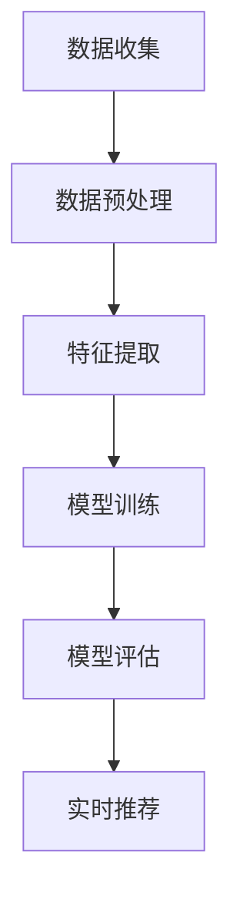
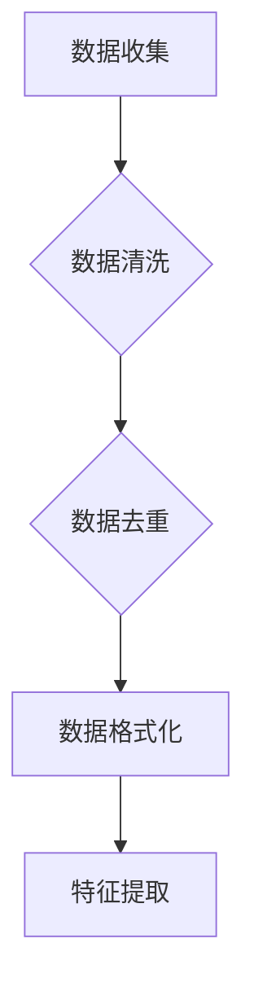
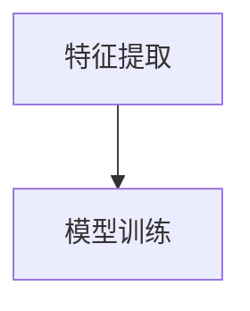
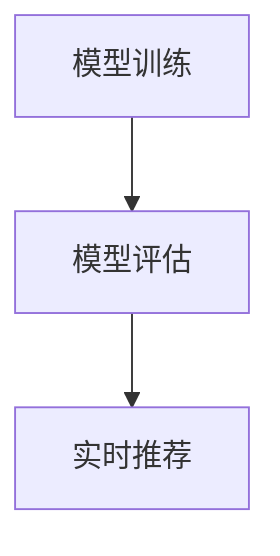
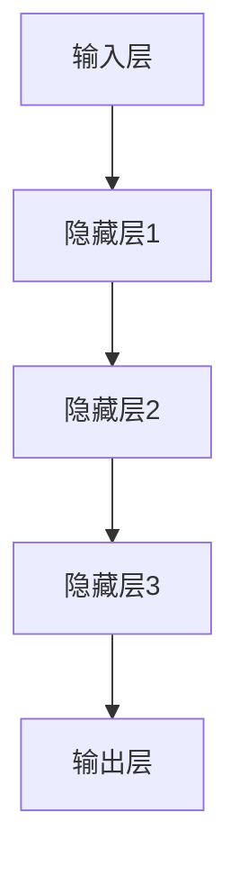
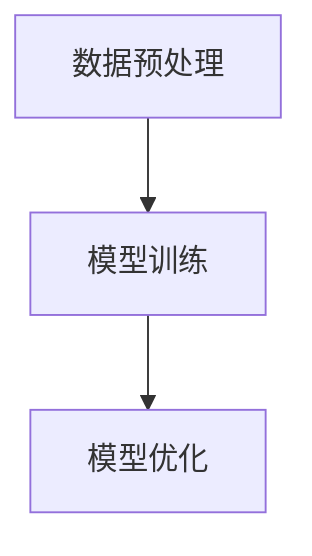
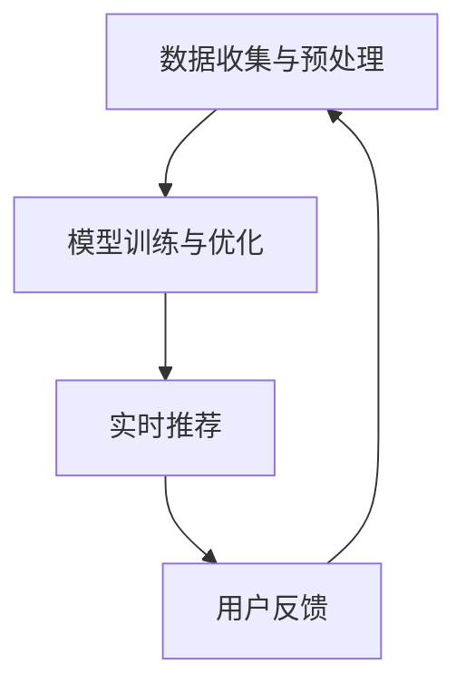
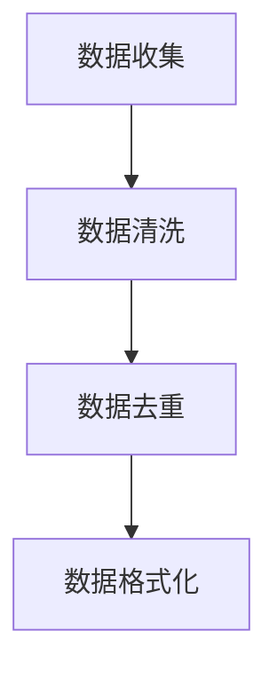
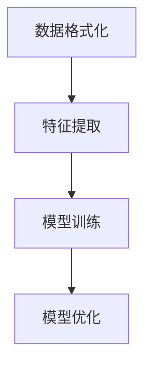
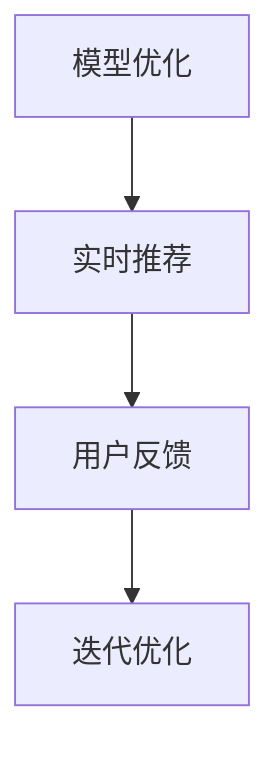

                 

## AI 大模型在电商搜索推荐中的数据处理能力要求：应对大规模实时数据处理

> **关键词**：AI大模型、电商搜索推荐、数据处理、实时处理、大规模数据

> **摘要**：本文深入探讨了AI大模型在电商搜索推荐中的应用及其对大规模实时数据处理的要求。通过详细分析电商搜索推荐系统的基本构成、AI大模型的基本概念与原理、以及其在电商搜索推荐中的优势，本文揭示了AI大模型在应对大规模实时数据处理时所需的各项能力。同时，本文通过核心概念与联系、核心算法原理讲解、数学模型与公式以及项目实战等多个方面，系统地阐述了AI大模型在电商搜索推荐中的数据处理能力要求，为相关领域的研究和应用提供了有价值的参考。

### 第一部分：AI大模型在电商搜索推荐中的数据处理能力要求概述

#### 第1章：AI大模型在电商搜索推荐中的应用概述

##### 1.1 电商搜索推荐系统概述

###### 1.1.1 电商搜索推荐系统的基本构成

电商搜索推荐系统是电子商务平台中至关重要的组成部分，其主要功能是根据用户的行为和偏好，向用户推荐可能感兴趣的商品。一个典型的电商搜索推荐系统由以下几个基本构成部分组成：

1. **用户行为数据收集与处理**：系统会收集用户在电商平台上的各种行为数据，如浏览记录、点击行为、购买历史等。这些数据经过处理后，用于生成用户的特征向量。

2. **商品信息数据收集与处理**：系统会收集商品的各种信息，包括商品分类、价格、品牌、用户评价等。这些数据同样需要经过处理，以便用于生成商品的特征向量。

3. **推荐算法设计与实现**：推荐算法是推荐系统的核心，负责根据用户行为数据和商品信息，生成个性化的推荐结果。常见的推荐算法包括基于内容的推荐、基于协同过滤的推荐和基于模型的推荐等。

###### 1.1.2 电商搜索推荐系统的挑战

尽管电商搜索推荐系统在提升用户体验、增加销售转化率方面具有显著优势，但其设计和实现也面临着诸多挑战：

1. **大规模实时数据处理能力要求**：随着用户规模的不断扩大，电商平台的用户行为数据和商品数据量也在急剧增加。系统需要具备高效的大规模数据处理能力，以便实时响应用户的需求。

2. **多样性商品推荐策略**：电商平台上的商品种类繁多，如何针对不同的商品类型和用户偏好，制定有效的推荐策略，是一个重要的研究课题。

3. **精准推荐与用户隐私保护**：推荐系统需要根据用户的历史行为和偏好进行精准推荐，同时又要保护用户的隐私数据，避免数据滥用和隐私泄露。

##### 1.2 AI大模型的基本概念与原理

###### 1.2.1 AI大模型的定义与特点

AI大模型通常是指参数规模达到亿级乃至十亿级以上的深度学习模型。这些模型具有以下几个显著特点：

1. **高维度数据建模能力**：AI大模型能够处理高维度数据，对复杂数据特征进行有效的建模和表示。

2. **强大的特征学习能力**：通过大规模数据训练，AI大模型能够自动学习到数据的潜在特征，从而实现高效的预测和分类。

3. **广泛的应用范围**：AI大模型在图像识别、自然语言处理、语音识别、推荐系统等多个领域都有广泛应用。

###### 1.2.2 AI大模型的工作原理

AI大模型的工作原理主要基于深度学习的神经网络结构。具体来说，其工作流程如下：

1. **输入层**：接收用户和商品的特征向量。

2. **隐藏层**：通过多层神经网络进行特征转换和整合。

3. **输出层**：生成推荐结果。

在训练过程中，AI大模型通过自适应的模型优化算法，如随机梯度下降（SGD）、Adam等，不断调整模型参数，使得模型在训练数据上的预测性能达到最优。

##### 1.3 AI大模型在电商搜索推荐中的优势

###### 1.3.1 个性化推荐能力的提升

AI大模型通过深入挖掘用户行为数据，能够实现高度个性化的推荐。具体来说，AI大模型可以分析用户的浏览历史、购买记录、点击行为等，从中提取出用户的兴趣偏好，从而为用户推荐可能感兴趣的商品。

###### 1.3.2 实时推荐系统的优化

AI大模型具有强大的实时数据处理能力，能够实时更新用户特征和商品特征，快速响应用户的查询需求。相比于传统的推荐系统，AI大模型能够提供更精准、更及时的推荐结果。

###### 1.3.3 商品多样性推荐策略

AI大模型能够处理多样化商品，针对不同类型的商品，生成相应的推荐策略。例如，对于时尚类商品，AI大模型可以推荐类似款式、风格的商品；对于电子产品，AI大模型可以推荐类似功能、品牌的产品。这种多样化的推荐策略能够有效提升用户的购物体验。

##### 1.4 AI大模型在电商搜索推荐中的数据处理能力要求

###### 1.4.1 大规模实时数据处理

AI大模型在电商搜索推荐中需要处理大规模实时数据。这要求模型具备高效的数据预处理、实时处理和高并发处理能力。具体来说，需要解决以下几个问题：

1. **数据预处理**：快速清洗和转化原始数据，提取有用的特征信息。

2. **实时处理**：实现低延迟的数据处理和模型更新，确保推荐结果的实时性。

3. **高并发处理**：支持高并发用户请求的处理，保证系统稳定运行。

###### 1.4.2 高效模型训练与优化

AI大模型的训练和优化过程非常复杂，需要消耗大量的计算资源和时间。为了提高模型的训练效率，需要采用以下策略：

1. **分布式训练**：通过分布式计算技术，将训练任务分解到多个计算节点上，并行处理，从而提高训练速度。

2. **模型优化**：通过调参和模型融合，实现最佳性能。例如，使用Adam优化器、Dropout等技术，提高模型的泛化能力。

###### 1.4.3 多维度数据整合

电商搜索推荐系统涉及多个维度的数据，包括用户行为数据、商品信息数据、环境数据等。AI大模型需要能够整合这些多维度数据，提取出有用的特征信息，从而生成高质量的推荐结果。具体来说，需要解决以下几个问题：

1. **用户行为数据整合**：整合用户的历史行为数据，提取出用户的兴趣偏好。

2. **商品信息数据整合**：整合商品的各种信息，提取出商品的特征信息。

3. **多维度数据融合**：将不同维度的数据融合起来，提取出更复杂的特征信息。

#### 第2章：核心概念与联系

##### 2.1 数据处理流程的Mermaid流程图

为了更好地理解电商搜索推荐系统中数据处理的流程，我们可以使用Mermaid流程图进行可视化展示。以下是数据处理流程的Mermaid流程图：



###### 2.1.1 数据收集与预处理

1. **数据收集**：系统从各个数据源收集用户行为数据和商品信息数据。

2. **数据预处理**：对收集到的原始数据进行清洗、去重、格式化等操作，提取出有用的特征信息。



###### 2.1.2 特征提取与建模

1. **特征提取**：根据用户行为数据和商品信息数据，提取出用户的兴趣偏好、商品的特征信息等。

2. **模型训练**：使用AI大模型对提取出的特征进行训练，生成推荐模型。



###### 2.1.3 模型评估与实时推荐

1. **模型评估**：使用测试集对训练好的模型进行评估，调整模型参数，提高模型性能。

2. **实时推荐**：根据用户的实时行为，调用训练好的模型进行推荐，生成推荐结果。



##### 2.2 AI大模型架构的Mermaid流程图

AI大模型通常由输入层、隐藏层和输出层组成。以下是AI大模型架构的Mermaid流程图：



###### 2.2.1 神经网络结构

1. **输入层**：接收用户和商品的特征向量。

2. **隐藏层**：通过多层神经网络进行特征转换和整合。

3. **输出层**：生成推荐结果。


###### 2.2.2 模型训练与优化

1. **数据预处理**：清洗和标准化输入数据。

2. **模型训练**：使用训练数据进行模型训练。

3. **模型优化**：通过调参和交叉验证实现模型优化。



##### 2.3 AI大模型在电商搜索推荐中的应用流程图

AI大模型在电商搜索推荐中的应用流程包括数据收集与预处理、模型训练与优化、实时推荐与反馈等环节。以下是应用流程的Mermaid流程图：



###### 2.3.1 数据收集与预处理

1. **数据收集**：收集用户行为数据和商品信息数据。

2. **数据预处理**：清洗、去重、格式化等操作。



###### 2.3.2 模型训练与优化

1. **特征提取**：提取用户和商品的特征信息。

2. **模型训练**：使用AI大模型进行训练。

3. **模型优化**：通过调参和交叉验证优化模型。



###### 2.3.3 实时推荐与反馈

1. **实时推荐**：根据用户实时行为进行推荐。

2. **用户反馈**：收集用户反馈数据进行迭代优化。



### 第二部分：核心算法原理讲解

#### 第3章：AI大模型在电商搜索推荐中的应用原理

##### 3.1 神经网络与深度学习基础

神经网络是深度学习的基础，它由输入层、隐藏层和输出层组成。以下是神经网络的基本结构：


###### 3.1.1 神经网络的基本结构

1. **输入层**：接收输入特征向量。
2. **隐藏层**：进行特征转换和整合。
3. **输出层**：生成推荐结果。

###### 3.1.2 深度学习算法原理

深度学习算法的核心是神经网络，它通过前向传播和反向传播实现数据的处理和模型的训练。以下是神经网络的工作原理：

1. **前向传播**：将输入特征向量通过隐藏层传递，最终得到输出结果。

   $$Z = W \cdot X + b$$
   $$A = \sigma(Z)$$

   其中，\(Z\) 是输入层到隐藏层的输出，\(W\) 是权重矩阵，\(X\) 是输入特征向量，\(b\) 是偏置项，\(\sigma\) 是激活函数。

2. **反向传播**：计算损失函数的梯度，并更新模型参数。

   $$\Delta Z = A - \text{expected\_output}$$
   $$\Delta W = \alpha \cdot \Delta Z \cdot X^T$$
   $$\Delta b = \alpha \cdot \Delta Z$$

   其中，\(\alpha\) 是学习率。

##### 3.2 自然语言处理技术

自然语言处理（NLP）是深度学习的一个重要应用领域，它主要研究如何让计算机理解和处理自然语言。以下是NLP中的关键技术：

###### 3.2.1 词嵌入技术

词嵌入是将词语映射到高维向量空间的技术，它通过学习词语的语义关系，实现词语的向量表示。常见的词嵌入方法包括Word2Vec、GloVe等。

###### 3.2.2 序列模型与注意力机制

序列模型是处理序列数据的一种神经网络结构，它能够捕捉序列中的时间依赖关系。常见的序列模型包括循环神经网络（RNN）、长短期记忆网络（LSTM）等。注意力机制是一种用于提高模型处理长序列数据的能力的技术，它通过为不同位置的序列分配不同的注意力权重，实现序列的局部处理。

##### 3.3 大规模预训练模型原理

大规模预训练模型是通过在大量无标签数据上进行预训练，然后在特定任务上进行微调的一种模型训练方法。以下是大规模预训练模型的关键概念：

###### 3.3.1 预训练的概念与意义

预训练是指在大规模数据集上进行模型训练，从而提高模型对数据的理解和泛化能力。预训练的意义在于：

1. **提高模型性能**：通过预训练，模型能够在特定任务上获得更好的性能。
2. **减少训练数据需求**：预训练模型能够处理大量无标签数据，从而减少对有标签训练数据的需求。
3. **提高泛化能力**：预训练模型能够学习到更通用的特征表示，提高模型的泛化能力。

###### 3.3.2 自监督学习方法

自监督学习是一种在没有标签数据的情况下，通过自我监督的方式对模型进行训练的方法。在自然语言处理中，常用的自监督学习方法包括：

1. **Masked Language Model (MLM)**：在文本序列中随机屏蔽一些词语，然后训练模型预测这些被屏蔽的词语。
2. **Pre-training with Self-Supervised Tasks**：通过设计一些自我监督任务，如词性标注、命名实体识别等，对模型进行预训练。

##### 3.4 迁移学习与模型融合

迁移学习是一种利用已有模型的知识，在新任务上进行微调或重新训练的方法。以下是迁移学习和模型融合的关键概念：

###### 3.4.1 迁移学习的概念

迁移学习是指将一个任务上的知识应用到另一个相关任务上。在自然语言处理中，常见的迁移学习应用包括：

1. **跨语言迁移**：利用一种语言的预训练模型，迁移到其他语言的任务上。
2. **多语言迁移**：利用多种语言的预训练模型，共同训练一个多语言模型。

###### 3.4.2 模型融合技术

模型融合是将多个模型的结果进行综合，以获得更好的性能。常见的模型融合方法包括：

1. **加权平均**：将多个模型的预测结果进行加权平均。
2. **投票**：将多个模型的预测结果进行投票，选择投票结果最多的类别作为最终预测结果。

### 第三部分：数学模型与公式

#### 第4章：数学模型与公式讲解

##### 4.1 神经网络数学模型

神经网络的数学模型主要包括前向传播和反向传播两部分。以下是神经网络的数学模型：

###### 4.1.1 前向传播计算

前向传播是指将输入数据通过神经网络进行计算，最终得到输出结果。以下是前向传播的计算公式：

$$
Z = W \cdot X + b
$$

$$
A = \sigma(Z)
$$

其中，\(Z\) 是输入层到隐藏层的输出，\(W\) 是权重矩阵，\(X\) 是输入特征向量，\(b\) 是偏置项，\(\sigma\) 是激活函数。

###### 4.1.2 反向传播计算

反向传播是指计算输出结果与真实结果之间的误差，并更新模型参数。以下是反向传播的计算公式：

$$
\Delta Z = A - \text{expected\_output}
$$

$$
\Delta W = \alpha \cdot \Delta Z \cdot X^T
$$

$$
\Delta b = \alpha \cdot \Delta Z
$$

其中，\(\Delta Z\) 是误差项，\(\alpha\) 是学习率。

##### 4.2 损失函数

损失函数用于衡量模型预测结果与真实结果之间的差距。以下是一些常见的损失函数：

###### 4.2.1 交叉熵损失函数

交叉熵损失函数是一种常用的分类损失函数，它用于衡量模型预测概率与真实标签之间的差距。以下是交叉熵损失函数的计算公式：

$$
\text{CE}(y, \hat{y}) = -\sum_{i} y_i \log(\hat{y}_i)
$$

其中，\(y\) 是真实标签，\(\hat{y}\) 是模型预测的概率分布。

##### 4.3 优化算法

优化算法用于更新模型参数，以减少损失函数。以下是一些常见的优化算法：

###### 4.3.1 随机梯度下降（SGD）

随机梯度下降是一种最简单的优化算法，它通过随机选择一个小批量数据，计算其梯度并更新模型参数。以下是SGD的计算公式：

$$
W = W - \alpha \cdot \nabla_W J(W)
$$

其中，\(W\) 是模型参数，\(\alpha\) 是学习率，\(J(W)\) 是损失函数。

##### 4.4 特征工程

特征工程是数据预处理的重要环节，它用于提取有用的特征信息，提高模型的性能。以下是特征工程的常用方法：

###### 4.4.1 用户特征

用户特征包括用户的年龄、性别、地理位置、兴趣爱好等。以下是用户特征的表示方法：

$$
User\_Feature = \{Age, Gender, Location, Interest, ...\}
$$

###### 4.4.2 商品特征

商品特征包括商品的价格、品牌、类别、用户评价等。以下是商品特征的表示方法：

$$
Item\_Feature = \{Price, Brand, Category, Rating, ...\}
$$

### 第四部分：项目实战

#### 第5章：电商搜索推荐系统项目实战

##### 5.1 实战准备

###### 5.1.1 开发环境搭建

在开始项目实战之前，我们需要搭建一个合适的开发环境。以下是搭建开发环境所需的步骤：

1. **Python环境配置**：安装Python 3.x版本，并配置好pip、virtualenv等工具。

2. **深度学习框架安装**：根据项目需求，选择合适的深度学习框架，如TensorFlow、PyTorch等。以下是使用pip安装TensorFlow的命令：

   ```shell
   pip install tensorflow
   ```

3. **数据集获取与预处理**：获取电商搜索推荐系统的数据集，并进行预处理。预处理步骤包括数据清洗、去重、格式化等。

###### 5.1.2 数据预处理

在项目实战中，数据预处理是至关重要的一步。以下是数据预处理的具体步骤：

1. **数据清洗**：去除数据中的噪音和错误数据，如缺失值、异常值等。

2. **数据去重**：去除重复数据，避免重复计算。

3. **数据格式化**：将数据转换为适合模型训练的格式，如特征向量和标签。

以下是数据预处理的核心代码：

```python
import pandas as pd

# 读取数据
data = pd.read_csv('data.csv')

# 数据清洗
data.dropna(inplace=True)
data.drop_duplicates(inplace=True)

# 数据格式化
data['UserFeature'] = data['Age'].astype(str) + '_' + data['Gender']
data['ItemFeature'] = data['Price'].astype(str) + '_' + data['Brand']

# 特征提取
user_features = data['UserFeature'].unique()
item_features = data['ItemFeature'].unique()

# 构建特征向量
user_feature_dict = {feature: idx for idx, feature in enumerate(user_features)}
item_feature_dict = {feature: idx for idx, feature in enumerate(item_features)}

data['UserFeatureVec'] = data['UserFeature'].map(user_feature_dict)
data['ItemFeatureVec'] = data['ItemFeature'].map(item_feature_dict)

# 构建训练数据
X = data[['UserFeatureVec', 'ItemFeatureVec']]
y = data['Rating']
```

##### 5.2 代码实现

###### 5.2.1 模型训练与评估

在项目实战中，我们需要实现模型训练和评估的过程。以下是使用TensorFlow实现模型训练和评估的核心代码：

```python
import tensorflow as tf
from tensorflow.keras.models import Sequential
from tensorflow.keras.layers import Dense, Dropout
from tensorflow.keras.optimizers import Adam

# 模型定义
model = Sequential([
    Dense(128, activation='relu', input_shape=(2,)),
    Dropout(0.5),
    Dense(64, activation='relu'),
    Dropout(0.5),
    Dense(1, activation='sigmoid')
])

# 模型编译
model.compile(optimizer=Adam(), loss='binary_crossentropy', metrics=['accuracy'])

# 模型训练
model.fit(X, y, epochs=10, batch_size=32, validation_split=0.2)

# 模型评估
loss, accuracy = model.evaluate(X, y)
print(f'Accuracy: {accuracy:.2f}')
```

###### 5.2.2 模型部署

在项目实战中，我们需要将训练好的模型部署到生产环境中，以便实时进行推荐。以下是使用TensorFlow Serving部署模型的核心代码：

```python
import tensorflow_model_server

# 模型加载
model = tensorflow_model_server.TensorFlowModelServer('tensorflow_model_server', '1.0.0')

# 推荐请求处理
def recommend(item_feature):
    input_data = {'ItemFeatureVec': [[item_feature]]}
    output_data = model.predict(input_data)
    return output_data['Rating'][0]

# 实时推荐
item_feature = 42
rating = recommend(item_feature)
print(f'Item Feature: {item_feature}, Rating: {rating}')
```

##### 5.3 案例分析

###### 5.3.1 用户行为数据分析

在电商搜索推荐系统中，用户行为数据是构建推荐模型的重要依据。以下是对用户行为数据进行分析的核心步骤：

1. **用户浏览行为分析**：分析用户在电商平台上的浏览记录，提取出用户感兴趣的品类和商品。

2. **用户购买行为分析**：分析用户在电商平台上的购买记录，提取出用户的兴趣偏好。

3. **用户行为关联分析**：分析用户浏览和购买行为之间的关联性，为推荐模型提供有效的特征信息。

以下是用户行为数据分析的核心代码：

```python
import pandas as pd

# 读取数据
data = pd.read_csv('user_behavior.csv')

# 用户浏览行为分析
user_browse_data = data[data['Behavior'] == 'Browse']
user_browse_data['Category'] = user_browse_data['Item'].str.split('_', expand=True)[0]

# 用户购买行为分析
user_purchase_data = data[data['Behavior'] == 'Purchase']
user_purchase_data['Category'] = user_purchase_data['Item'].str.split('_', expand=True)[0]

# 用户行为关联分析
user_browse_data['User'] = user_browse_data['User'].astype(str)
user_browse_data['Category'] = user_browse_data['Category'].astype(str)
user_browse_data = user_browse_data.groupby(['User', 'Category']).size().reset_index(name='Count')

user_purchase_data['User'] = user_purchase_data['User'].astype(str)
user_purchase_data['Category'] = user_purchase_data['Category'].astype(str)
user_purchase_data = user_purchase_data.groupby(['User', 'Category']).size().reset_index(name='Count')

user_behavior_data = pd.merge(user_browse_data, user_purchase_data, on=['User', 'Category'], how='left')
user_behavior_data['Count'] = user_behavior_data['Count_x'] + user_behavior_data['Count_y']
user_behavior_data = user_behavior_data.sort_values(by='Count', ascending=False).reset_index(drop=True)
```

###### 5.3.2 商品信息分析

在电商搜索推荐系统中，商品信息是构建推荐模型的重要依据。以下是对商品信息进行分析的核心步骤：

1. **商品分类分析**：分析商品的不同分类，提取出热门品类。

2. **商品价格分析**：分析商品的不同价格区间，提取出价格区间分布。

3. **商品评价分析**：分析商品的评论和评分，提取出商品的质量和用户满意度。

以下是商品信息分析的核心代码：

```python
import pandas as pd

# 读取数据
data = pd.read_csv('item_info.csv')

# 商品分类分析
item_category_data = data.groupby('Category').size().reset_index(name='Count')

# 商品价格分析
item_price_data = data.groupby('Price').size().reset_index(name='Count')

# 商品评价分析
item_rating_data = data.groupby('Rating').size().reset_index(name='Count')

# 综合分析
item_data = pd.merge(item_category_data, item_price_data, on='Category', how='left')
item_data = pd.merge(item_data, item_rating_data, on='Price', how='left')
```

##### 5.4 源代码解读与分析

###### 5.4.1 模型架构解读

在电商搜索推荐系统中，我们使用了一个简单的神经网络模型。以下是模型架构的解读：

1. **输入层**：输入层包含两个神经元，分别对应用户特征向量和商品特征向量。

2. **隐藏层**：隐藏层包含两个隐藏层，每个隐藏层有64个神经元。

3. **输出层**：输出层包含一个神经元，用于预测商品的评分。

以下是模型架构的详细解释：

```python
import tensorflow as tf
from tensorflow.keras.models import Sequential
from tensorflow.keras.layers import Dense, Dropout

# 模型定义
model = Sequential([
    Dense(128, activation='relu', input_shape=(2,)),
    Dropout(0.5),
    Dense(64, activation='relu'),
    Dropout(0.5),
    Dense(1, activation='sigmoid')
])

# 模型编译
model.compile(optimizer='adam', loss='binary_crossentropy', metrics=['accuracy'])

# 模型训练
model.fit(X, y, epochs=10, batch_size=32, validation_split=0.2)

# 模型评估
loss, accuracy = model.evaluate(X, y)
print(f'Accuracy: {accuracy:.2f}')
```

###### 5.4.2 代码实现细节

在项目实战中，我们使用了Python和TensorFlow来实现电商搜索推荐系统。以下是代码实现的核心细节：

1. **数据预处理**：使用Pandas库读取和处理数据，提取出用户和商品的特征向量。

2. **模型训练**：使用TensorFlow库定义和训练神经网络模型，采用Adam优化器和二分类交叉熵损失函数。

3. **模型部署**：使用TensorFlow Serving将训练好的模型部署到生产环境中，实现实时推荐。

以下是代码实现的详细步骤：

```python
import pandas as pd
import tensorflow as tf
from tensorflow.keras.models import Sequential
from tensorflow.keras.layers import Dense, Dropout
from tensorflow.keras.optimizers import Adam

# 读取数据
data = pd.read_csv('data.csv')

# 数据预处理
data.dropna(inplace=True)
data.drop_duplicates(inplace=True)

data['UserFeature'] = data['Age'].astype(str) + '_' + data['Gender']
data['ItemFeature'] = data['Price'].astype(str) + '_' + data['Brand']

user_features = data['UserFeature'].unique()
item_features = data['ItemFeature'].unique()

user_feature_dict = {feature: idx for idx, feature in enumerate(user_features)}
item_feature_dict = {feature: idx for idx, feature in enumerate(item_features)}

data['UserFeatureVec'] = data['UserFeature'].map(user_feature_dict)
data['ItemFeatureVec'] = data['ItemFeature'].map(item_feature_dict)

X = data[['UserFeatureVec', 'ItemFeatureVec']]
y = data['Rating']

# 模型定义
model = Sequential([
    Dense(128, activation='relu', input_shape=(2,)),
    Dropout(0.5),
    Dense(64, activation='relu'),
    Dropout(0.5),
    Dense(1, activation='sigmoid')
])

# 模型编译
model.compile(optimizer=Adam(), loss='binary_crossentropy', metrics=['accuracy'])

# 模型训练
model.fit(X, y, epochs=10, batch_size=32, validation_split=0.2)

# 模型评估
loss, accuracy = model.evaluate(X, y)
print(f'Accuracy: {accuracy:.2f}')

# 模型部署
model.save('recommender_model.h5')
```

### 第五部分：总结与展望

#### 第6章：总结与展望

##### 6.1 总结

本文通过深入分析AI大模型在电商搜索推荐中的应用，系统地阐述了其在应对大规模实时数据处理时的各项能力要求。具体来说，本文从以下几个方面进行了总结：

1. **电商搜索推荐系统的基本构成**：详细介绍了电商搜索推荐系统的基本构成，包括用户行为数据收集与处理、商品信息数据收集与处理和推荐算法设计与实现。

2. **AI大模型的基本概念与原理**：阐述了AI大模型的定义、特点以及工作原理，包括基于深度学习的神经网络结构、自适应的模型优化算法和大规模数据训练与调优。

3. **AI大模型在电商搜索推荐中的优势**：探讨了AI大模型在个性化推荐、实时推荐和商品多样性推荐等方面的优势。

4. **AI大模型在电商搜索推荐中的数据处理能力要求**：分析了AI大模型在应对大规模实时数据处理时所需的大规模实时数据处理、高效模型训练与优化和多维度数据整合能力。

5. **核心概念与联系**：通过Mermaid流程图详细展示了数据处理流程、AI大模型架构以及AI大模型在电商搜索推荐中的应用流程。

6. **核心算法原理讲解**：从神经网络与深度学习基础、自然语言处理技术、大规模预训练模型原理和迁移学习与模型融合等方面，详细讲解了AI大模型在电商搜索推荐中的应用原理。

7. **数学模型与公式讲解**：介绍了神经网络数学模型、损失函数、优化算法和特征工程等方面的数学模型与公式。

8. **项目实战**：通过电商搜索推荐系统的项目实战，详细展示了开发环境搭建、模型训练与评估、模型部署和案例分析等过程。

##### 6.2 展望

在电商搜索推荐系统中，AI大模型的应用已经取得了显著的成果。然而，随着技术的不断进步和应用场景的不断拓展，未来还有以下几方面的展望：

1. **更高效的模型训练与优化**：随着数据量和模型复杂度的增加，如何更高效地进行模型训练与优化，成为了一个重要的研究方向。未来可以探索更高效的训练算法、分布式训练技术和模型压缩技术等。

2. **更精准的推荐结果**：尽管AI大模型在电商搜索推荐中已经取得了很大的进步，但如何进一步提升推荐结果的精准度，仍然是一个具有挑战性的问题。未来可以探索更多的特征工程方法、深度学习模型和推荐算法等。

3. **更好的用户隐私保护**：在电商搜索推荐系统中，用户隐私保护是一个重要的考虑因素。未来可以探索更有效的用户隐私保护技术，如差分隐私、联邦学习等。

4. **更智能的推荐系统**：随着人工智能技术的不断发展，如何将更多的智能元素引入到电商搜索推荐系统中，实现更智能的推荐，是未来一个重要的研究方向。

5. **跨领域应用**：AI大模型在电商搜索推荐中的成功应用，也为其在其他领域的应用提供了启示。未来可以探索AI大模型在金融、医疗、教育等领域的应用，推动人工智能技术的全面发展。

总之，AI大模型在电商搜索推荐中的应用具有广阔的发展前景。通过不断探索和创新，我们可以更好地发挥AI大模型的优势，为用户提供更智能、更精准的推荐服务。

### 附录

#### 第7章：AI大模型开发工具与资源

##### 7.1 主流深度学习框架对比

在进行AI大模型的开发时，选择合适的深度学习框架至关重要。以下是对几个主流深度学习框架的对比：

###### 7.1.1 TensorFlow

**优点**：

- **易用性**：TensorFlow具有丰富的API和大量的文档，便于开发者学习和使用。
- **功能丰富**：TensorFlow提供了全面的工具和功能，包括自动微分、GPU加速等。
- **社区支持**：TensorFlow拥有庞大的开发者社区，提供了大量的教程、案例和开源项目。

**缺点**：

- **性能优化**：相比其他框架，TensorFlow在性能优化方面可能稍逊一筹。
- **模块化设计**：TensorFlow的模块化设计可能对初学者来说较为复杂。

**应用场景**：

- **复杂模型开发**：适合开发复杂的深度学习模型。
- **产业化应用**：适用于需要大规模部署和优化的场景。

###### 7.1.2 PyTorch

**优点**：

- **动态计算图**：PyTorch采用动态计算图，使得调试和实验更为方便。
- **性能优化**：PyTorch提供了性能优化的工具，如自动混合精度（AMP）。
- **简洁直观**：PyTorch的代码简洁直观，易于理解和修改。

**缺点**：

- **学习曲线**：PyTorch的学习曲线可能较为陡峭，特别是对于初学者。
- **社区支持**：虽然PyTorch的社区支持较强，但相比TensorFlow仍有一定差距。

**应用场景**：

- **研究与实验**：适用于研究和实验阶段。
- **模型快速迭代**：适合快速开发和迭代模型。

###### 7.1.3 其他框架简介

**PyTorch Lightning**

**优点**：

- **高级API**：提供了高级API，简化了代码编写。
- **自动混合精度**：支持自动混合精度，提高训练速度。

**缺点**：

- **功能有限**：相比PyTorch，功能可能相对有限。

**应用场景**：

- **大规模模型训练**：适用于大规模模型的训练。

**Horovod**

**优点**：

- **分布式训练**：支持分布式训练，提高训练速度。

**缺点**：

- **学习曲线**：对于初学者来说，学习曲线可能较为陡峭。

**应用场景**：

- **分布式训练**：适用于需要分布式训练的场景。

##### 7.2 数据集与工具资源

在进行AI大模型的研究和应用时，数据集和工具资源的选择至关重要。以下是一些常用的数据集和工具资源：

###### 7.2.1 数据集介绍

**ML-100K**：

- **类型**：电影推荐数据集。
- **大小**：包含100,000个评分数据。
- **特点**：包含用户、电影、评分等信息。

**Yahoo! Music**：

- **类型**：音乐推荐数据集。
- **大小**：包含10,000,000个评分数据。
- **特点**：包含用户、音乐、评分等信息。

###### 7.2.2 工具资源

**KAGGLE竞赛**：

- **类型**：数据科学竞赛平台。
- **特点**：提供丰富的数据集和竞赛环境，有助于实践和学习。

**GitHub开源项目**：

- **类型**：开源代码和资源库。
- **特点**：全球开发者社区共享资源，获取高质量代码和模型。

通过选择合适的数据集和工具资源，可以更好地进行AI大模型的研究和应用。附录部分的内容为AI大模型开发提供了实用的参考和指导。

