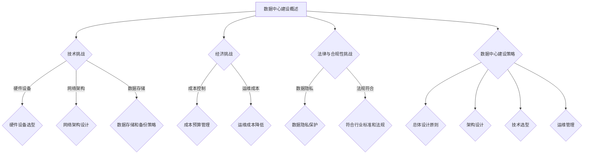
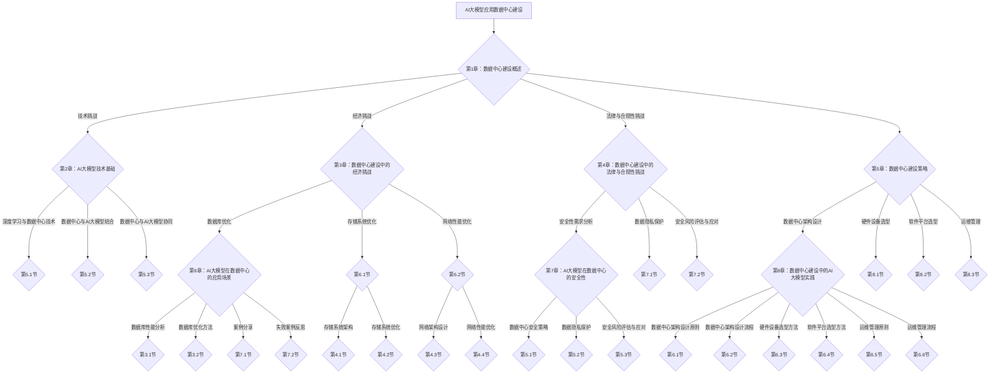
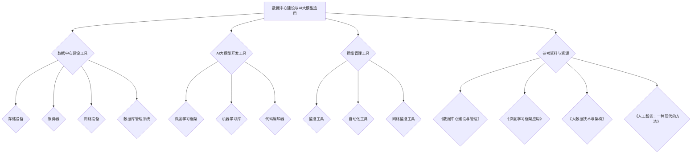

                 

# AI大模型应用数据中心建设：数据中心技术与应用

## 关键词
AI大模型、数据中心建设、技术挑战、经济挑战、法律与合规性挑战、数据中心架构设计、硬件设备选型、软件平台选型、运维管理、数据隐私保护、安全性、案例分析、未来展望

## 摘要
本文深入探讨了AI大模型应用数据中心建设的核心技术和应用。首先，我们概述了数据中心建设的重要性以及面临的挑战，包括技术、经济和法律与合规性方面的挑战。接着，我们详细介绍了数据中心建设的策略和架构设计，包括硬件设备选型和软件平台选型。文章还讨论了数据中心与AI大模型结合的深度学习技术基础、数据处理流程和模型部署优化。随后，我们分析了AI大模型在数据中心中的具体应用场景，如数据库优化、存储系统优化和网络性能优化。接下来，文章介绍了数据中心建设中的AI大模型实践，包括架构设计、硬件设备选型、软件平台选型和运维管理。文章还探讨了AI大模型数据中心建设中的安全性和数据隐私保护问题，并提供了实际案例进行分析和反思。最后，我们展望了数据中心和AI大模型应用的未来发展趋势，提出了面临的挑战和机遇。本文旨在为从事数据中心建设和AI大模型应用的技术人员提供全面的指导和参考。

### 第一部分：AI大模型应用数据中心建设概述

#### 第1章：AI大模型应用数据中心建设概述

##### 1.1 数据中心建设的重要性

- **1.1.1 数据中心的基本概念**
  - 数据中心是指为存储、处理、传输和管理数据而设计的设施。它通常包括服务器、存储设备、网络设备和冷却系统等硬件设施，以及各种软件和管理系统。
  - 数据中心的基本功能包括数据存储、数据处理、数据备份和恢复、数据安全和访问控制等。

- **1.1.2 数据中心建设的重要性**
  - 随着互联网和大数据技术的飞速发展，数据中心已成为现代信息技术的基础设施。其重要性体现在以下几个方面：
    - **数据存储需求**：数据中心提供了海量数据存储的空间，满足不断增长的数据存储需求。
    - **数据处理能力的提升**：数据中心通过高性能计算资源，能够快速处理和分析海量数据，提高业务决策效率。
    - **实时数据处理能力**：数据中心能够实现实时数据采集、存储和计算，为实时应用提供支持。
    - **业务连续性和高可用性**：数据中心的设计和建设确保了业务的连续性和高可用性，降低了业务中断的风险。

- **1.1.3 AI大模型对数据中心的需求**
  - AI大模型，尤其是深度学习和机器学习模型，对数据中心的需求尤为显著：
    - **大数据量的存储和管理**：AI大模型通常需要处理和分析大量的数据，数据中心需要提供足够的存储空间和高效的数据管理能力。
    - **高性能计算资源**：AI大模型训练和推理需要大量的计算资源，数据中心需要配备高性能的计算服务器和GPU集群。
    - **实时数据处理能力**：许多AI应用需要实时处理和分析数据，数据中心需要具备快速的数据处理能力，以满足实时响应的需求。

##### 1.2 数据中心建设的挑战

- **1.2.1 技术挑战**
  - 数据中心建设面临的技术挑战包括：
    - **硬件设备的选型和配置**：选择合适的服务器、存储设备和网络设备，确保性能和可靠性。
    - **网络架构的设计和优化**：设计高效、稳定的网络架构，优化数据传输速度和带宽利用率。
    - **数据存储和备份策略**：制定有效的数据存储和备份策略，确保数据的安全性和可靠性。

- **1.2.2 经济挑战**
  - 经济挑战主要体现在以下几个方面：
    - **成本预算的控制**：数据中心建设需要大量的资金投入，需要合理控制成本，确保预算的合理性。
    - **运维成本的降低**：数据中心的长期运维成本也是一个重要的经济挑战，需要通过技术优化和管理改进来降低运维成本。

- **1.2.3 法律与合规性挑战**
  - 法律与合规性挑战包括：
    - **数据隐私保护**：数据中心需要遵守相关的数据隐私保护法规，确保用户数据的安全性和隐私性。
    - **符合行业标准和法规**：数据中心的建设和运营需要符合相关的行业标准和法规要求，如网络安全法、数据保护法规等。

##### 1.3 数据中心建设的策略

- **1.3.1 总体设计原则**
  - 数据中心建设需要遵循以下总体设计原则：
    - **可扩展性**：数据中心设计应具备良好的可扩展性，以应对未来业务增长的需求。
    - **高可用性**：数据中心应设计成高可用性架构，确保业务连续性和系统稳定性。
    - **安全性**：数据中心需要具备严格的安全防护措施，包括物理安全、网络安全和数据安全。

- **1.3.2 架构设计**
  - 数据中心架构设计包括以下几个方面：
    - **数据中心网络架构**：设计高效的网络架构，包括核心网络、边缘网络和接入网络。
    - **存储架构设计**：选择合适的存储架构，包括分布式存储、块存储和对象存储等。

- **1.3.3 技术选型**
  - 数据中心建设需要选择合适的技术，包括：
    - **硬件设备的选择**：选择高性能、高可靠性的硬件设备，如服务器、存储设备和网络设备。
    - **软件平台的选择**：选择适合数据中心业务需求的软件平台，包括操作系统、数据库管理系统和监控工具等。

- **1.3.4 运维管理**
  - 数据中心的运维管理包括以下几个方面：
    - **人员培训**：对数据中心运维人员进行专业培训，提高运维技能和效率。
    - **运维流程优化**：制定和优化运维流程，提高运维效率和响应速度。
    - **自动化运维**：通过自动化工具和平台，实现数据中心的自动化运维，降低运维成本。

### Mermaid 流程图：



### 1.4 数据中心建设案例分析

- **1.4.1 成功案例分享**
  - 某大型互联网公司的数据中心建设案例：
    - **需求分析**：该公司需要建设一个具有高可用性、高性能和可扩展性的数据中心，以支持其快速增长的业务需求。
    - **架构设计**：采用分布式存储和计算架构，设计高效的网络架构，确保数据的高效传输和处理。
    - **硬件设备选型**：选择高性能的服务器和存储设备，以及可靠的网络设备，确保数据中心的稳定运行。
    - **软件平台选型**：使用Linux操作系统、分布式数据库管理系统和自动化运维工具，提高数据中心的运维效率。
    - **运维管理**：建立专业的运维团队，制定详细的运维流程，通过自动化工具实现高效的运维管理。

- **1.4.2 失败案例反思**
  - 数据中心建设中的常见问题及解决方法：
    - **问题分析**：常见的问题包括网络架构设计不合理、硬件设备选型不当、软件平台选型失误等。
    - **解决方法**：针对网络架构问题，可以通过重新设计网络拓扑结构和优化网络设备配置来解决；针对硬件设备选型问题，需要进行充分的市场调研和性能测试，确保选型的合理性；针对软件平台选型问题，需要根据业务需求和系统性能要求进行选择，并充分考虑未来扩展性。

#### 第2章：AI大模型技术基础

##### 2.1 深度学习与数据中心技术

- **2.1.1 深度学习的概念**
  - **深度学习的定义**：深度学习是一种机器学习方法，通过模拟人脑的神经网络结构，对大量数据进行自动学习和特征提取。
  - **深度学习的核心原理**：深度学习基于多层神经网络，通过反向传播算法训练模型参数，使模型能够自动学习和适应数据。

- **2.1.2 数据中心技术基础**
  - **存储技术**：数据中心需要使用高效的存储技术，如分布式存储系统和云存储，以支持大规模数据存储和管理。
  - **网络技术**：数据中心需要设计高效的网络架构，包括核心网络、边缘网络和接入网络，以确保数据传输的可靠性和速度。
  - **计算技术**：数据中心需要配置高性能的计算资源，如GPU集群和分布式计算系统，以支持深度学习模型的训练和推理。

##### 2.2 数据中心与AI大模型结合

- **2.2.1 AI大模型的需求**
  - **大数据量的存储和处理**：AI大模型通常需要处理和分析大量数据，数据中心需要提供足够的存储空间和高效的计算资源。
  - **高性能计算资源**：AI大模型训练和推理需要大量计算资源，数据中心需要配置高性能的服务器和GPU集群。
  - **实时数据处理能力**：许多AI应用需要实时处理和分析数据，数据中心需要具备快速的数据处理能力，以满足实时响应的需求。

- **2.2.2 数据中心优化**
  - **存储系统优化**：通过分布式存储系统和云存储，提高数据存储和管理效率，降低存储成本。
  - **网络架构优化**：设计高效的网络架构，优化数据传输速度和带宽利用率，提高数据中心的整体性能。
  - **计算能力提升**：通过分布式计算系统和GPU集群，提高数据中心的计算能力，满足AI大模型训练和推理的需求。

##### 2.3 数据中心与AI大模型协同

- **2.3.1 数据处理流程**
  - **数据收集与预处理**：数据中心负责收集和预处理数据，包括数据清洗、去噪和格式转换等。
  - **数据存储与索引**：数据中心将预处理后的数据存储到分布式存储系统，并建立索引，以便快速查询和访问。
  - **数据分析与模型训练**：数据中心使用高性能计算资源，对存储的数据进行数据分析，并训练AI大模型。

- **2.3.2 模型部署与优化**
  - **模型部署策略**：将训练好的AI大模型部署到数据中心的服务器上，实现模型的在线推理和实时应用。
  - **模型性能优化**：通过优化模型结构和算法，提高模型的性能和效率，降低模型的推理延迟。
  - **模型持续学习与更新**：数据中心需要实现模型的持续学习与更新，以适应数据变化和应用需求。

#### 第3章：AI大模型在数据中心的应用场景

##### 3.1 数据库优化

- **3.1.1 数据库性能分析**
  - **数据访问模式分析**：分析数据库的数据访问模式，包括查询类型、访问频率和访问路径等，以便优化数据库性能。
  - **数据库性能瓶颈识别**：通过性能监控和诊断工具，识别数据库的性能瓶颈，如查询延迟、锁冲突和索引缺失等。

- **3.1.2 数据库优化方法**
  - **索引优化**：根据数据访问模式，创建适当的索引，提高查询速度。
  - **分区策略**：将大数据表进行分区，降低数据查询的复杂度，提高查询性能。
  - **并行查询优化**：通过并行查询技术，提高数据查询的并行度和效率，缩短查询时间。

##### 3.2 存储系统优化

- **3.2.1 存储系统架构**
  - **分布式存储系统**：分布式存储系统通过将数据分布存储到多个节点，提高数据的可靠性和可扩展性。
  - **对象存储系统**：对象存储系统以对象为单位存储数据，支持大规模数据的存储和快速访问。

- **3.2.2 存储系统优化**
  - **存储压缩**：通过数据压缩技术，减少存储空间占用，提高存储效率。
  - **存储分层**：根据数据的重要性和访问频率，将数据分层存储，提高数据访问速度和存储效率。
  - **存储加密**：通过数据加密技术，保护数据的安全性和隐私性。

##### 3.3 网络性能优化

- **3.3.1 网络架构设计**
  - **网络拓扑结构**：设计合理的网络拓扑结构，确保数据传输的高效性和可靠性。
  - **网络设备选型**：选择适合数据中心业务需求的网络设备，包括交换机、路由器和防火墙等。

- **3.3.2 网络性能优化**
  - **网络延迟优化**：通过优化网络设备配置和网络拓扑结构，减少数据传输延迟，提高数据传输速度。
  - **网络带宽优化**：通过增加网络带宽和优化数据传输协议，提高网络带宽利用率和传输效率。
  - **网络安全优化**：通过部署安全策略和防护措施，保护数据中心网络的安全性和稳定性。

#### 第4章：数据中心建设中的AI大模型实践

##### 4.1 数据中心架构设计

- **4.1.1 数据中心架构设计原则**
  - **高可用性**：设计高可用性架构，确保数据中心在故障情况下能够快速恢复，保持业务的连续性。
  - **可扩展性**：设计可扩展性架构，以应对业务增长和变化，提高数据中心的灵活性和适应性。
  - **灵活性**：设计灵活的架构，支持不同业务场景和需求，提高数据中心的通用性和可定制性。

- **4.1.2 数据中心架构设计流程**
  - **需求分析**：分析数据中心的业务需求和功能需求，明确数据中心的架构设计目标。
  - **架构设计**：根据需求分析结果，设计数据中心的整体架构，包括网络架构、存储架构和计算架构。
  - **实施与部署**：按照设计文档，实施数据中心的建设和部署，确保数据中心的正常运行。

##### 4.2 硬件设备选型

- **4.2.1 硬件设备类型**
  - **服务器**：包括计算服务器、存储服务器和网络服务器，用于提供计算、存储和网络功能。
  - **存储设备**：包括磁盘阵列、固态硬盘和分布式存储设备，用于数据存储和管理。
  - **网络设备**：包括交换机、路由器和防火墙，用于数据传输和网络安全性。

- **4.2.2 硬件设备选型方法**
  - **性能指标分析**：根据业务需求，分析硬件设备的性能指标，如CPU性能、存储速度和网络带宽等。
  - **成本效益分析**：综合考虑硬件设备的性能、成本和维护成本，进行成本效益分析，选择性价比高的设备。
  - **维护与升级考虑**：考虑硬件设备的维护成本和升级难度，选择易于维护和升级的设备。

##### 4.3 软件平台选型

- **4.3.1 软件平台类型**
  - **操作系统**：如Linux、Windows Server等，用于管理服务器资源和运行应用程序。
  - **数据库管理系统**：如MySQL、PostgreSQL、MongoDB等，用于存储和管理数据。
  - **应用程序框架**：如Django、Spring、Flask等，用于开发和管理Web应用程序。

- **4.3.2 软件平台选型方法**
  - **功能需求分析**：分析业务需求，确定所需的软件功能，选择满足需求的功能齐全的软件平台。
  - **性能稳定性分析**：通过性能测试和稳定性测试，评估软件平台的性能和稳定性，选择性能稳定的平台。
  - **安全性分析**：评估软件平台的安全性，包括数据安全、系统安全和网络安全，选择安全性能高的平台。

##### 4.4 运维管理

- **4.4.1 运维管理原则**
  - **故障预防**：通过定期维护、监控和测试，预防系统故障，确保数据中心的正常运行。
  - **故障响应**：建立快速故障响应机制，及时处理系统故障，减少故障对业务的影响。
  - **性能监控**：通过性能监控工具，实时监测系统性能，及时发现和处理性能瓶颈。

- **4.4.2 运维管理流程**
  - **运维流程设计**：根据业务需求和系统特点，设计合理的运维流程，确保运维工作的有序进行。
  - **运维团队建设**：建立专业的运维团队，明确团队成员的职责和工作内容，提高运维效率。
  - **运维流程优化**：通过不断优化运维流程，提高运维工作的效率和质量，降低运维成本。

#### 第5章：AI大模型在数据中心的安全性

##### 5.1 数据中心安全策略

- **5.1.1 安全性需求分析**
  - **数据保护**：确保数据在存储、传输和处理过程中的安全性和完整性。
  - **系统安全**：确保数据中心系统的安全性和稳定性，防止未经授权的访问和攻击。
  - **网络安全**：确保数据中心网络的稳定性和安全性，防止网络攻击和数据泄露。

- **5.1.2 安全策略设计**
  - **访问控制策略**：制定严格的访问控制策略，确保只有授权用户才能访问数据和处理系统。
  - **数据加密策略**：使用数据加密技术，对敏感数据在存储和传输过程中进行加密，确保数据的安全性。
  - **安全监控策略**：部署安全监控工具，实时监控数据中心的运行状态和安全事件，及时发现和处理安全威胁。

##### 5.2 数据隐私保护

- **5.2.1 数据隐私保护原则**
  - **数据匿名化**：通过数据匿名化技术，将敏感数据转换为匿名化数据，保护用户隐私。
  - **数据加密**：使用数据加密技术，对敏感数据进行加密存储和传输，确保数据的安全性。
  - **数据访问权限控制**：通过权限控制技术，限制对敏感数据的访问权限，确保只有授权用户才能访问数据。

- **5.2.2 数据隐私保护方法**
  - **数据脱敏**：对敏感数据使用脱敏技术，如替换、掩码和加密，将其转换为不可识别的数据。
  - **数据加密算法**：选择合适的数据加密算法，如AES、RSA等，对敏感数据进行加密存储和传输。
  - **隐私计算技术**：使用隐私计算技术，如同态加密、安全多方计算等，保护数据在计算过程中的隐私。

##### 5.3 安全风险评估与应对

- **5.3.1 安全风险评估**
  - **风险识别**：通过风险识别工具和方法，识别数据中心可能面临的安全风险，如网络攻击、数据泄露和系统故障等。
  - **风险分析**：分析识别出的安全风险，评估其可能带来的影响和损失，确定风险的重要性和紧急性。
  - **风险应对策略**：根据风险评估结果，制定相应的风险应对策略，包括风险规避、风险减轻和风险转移等。

- **5.3.2 安全事件应对**
  - **应急预案**：制定详细的应急预案，确保在发生安全事件时能够快速响应和处置。
  - **安全事件响应流程**：建立安全事件响应流程，明确安全事件的报告、分析、处置和恢复等步骤。
  - **安全事件处理**：按照安全事件响应流程，及时处理安全事件，减少事件对数据中心运行的影响。

#### 第6章：AI大模型数据中心建设案例分析

##### 6.1 成功案例分享

- **6.1.1 某知名互联网公司数据中心建设案例**
  - **数据中心架构设计**：采用分布式存储和计算架构，设计高效的网络架构，确保数据的高效传输和处理。
  - **硬件设备选型**：选择高性能的服务器和存储设备，以及可靠的网络设备，确保数据中心的稳定运行。
  - **软件平台选型**：使用Linux操作系统、分布式数据库管理系统和自动化运维工具，提高数据中心的运维效率。
  - **运维管理**：建立专业的运维团队，制定详细的运维流程，通过自动化工具实现高效的运维管理。

- **6.1.2 某行业领先企业数据中心优化案例**
  - **数据中心性能优化**：通过存储系统优化、网络性能优化和计算能力提升，提高数据中心的整体性能。
  - **AI大模型应用实践**：在数据中心部署AI大模型，用于数据分析和预测，提高业务决策效率。
  - **安全性提升措施**：通过数据加密、访问控制和安全监控等手段，提高数据中心的安全性。

##### 6.2 失败案例反思

- **6.2.1 数据中心建设中的常见问题**
  - **架构设计不合理**：数据中心架构设计不合理，导致数据传输延迟和高可用性不足。
  - **硬件设备选型不当**：硬件设备选型不当，导致性能不足或维护成本过高。
  - **软件平台选型失误**：软件平台选型失误，导致系统稳定性差或功能不齐全。

- **6.2.2 案例反思与解决方法**
  - **问题分析**：对数据中心建设中的常见问题进行深入分析，找出问题的根本原因。
  - **解决方案探讨**：根据问题分析结果，探讨可行的解决方案，包括架构调整、硬件升级和软件优化等。
  - **启示与建议**：总结案例中的教训，提出数据中心建设中的最佳实践和建议，以避免类似问题的再次发生。

#### 第7章：未来展望

##### 7.1 数据中心发展趋势

- **7.1.1 新技术趋势**
  - **云计算与数据中心融合**：云计算技术的发展将数据中心与云计算平台进一步融合，提供更加灵活、高效的计算和存储资源。
  - **边缘计算的应用**：边缘计算将数据中心的服务能力延伸到网络边缘，满足实时数据处理和响应的需求。
  - **智能化运维**：人工智能技术将在数据中心的管理和优化中发挥重要作用，提高数据中心的自动化程度和智能化水平。

- **7.1.2 数据中心与AI大模型融合**
  - **数据中心架构创新**：数据中心架构将不断创新，以适应AI大模型的需求，包括分布式存储、计算和网络的优化。
  - **AI大模型在数据中心中的应用**：AI大模型将在数据中心中广泛应用，用于数据分析和预测，提高数据中心的管理和运营效率。
  - **数据中心智能化管理**：数据中心将通过智能化管理，实现自动化运维和实时监控，提高数据中心的可靠性和安全性。

##### 7.2 数据中心建设与AI大模型应用的挑战与机遇

- **7.2.1 挑战**
  - **技术创新与持续升级**：数据中心和AI大模型的技术不断更新，需要持续投入研发和升级。
  - **安全性保障**：数据中心和AI大模型的安全性和数据隐私保护面临挑战，需要加强安全防护措施。
  - **经济成本控制**：数据中心建设和运营需要大量的资金投入，需要合理控制成本，提高投资回报率。

- **7.2.2 机遇**
  - **AI大模型在数据中心领域的广泛应用**：随着AI大模型技术的成熟，数据中心将在更多领域得到应用，如金融、医疗、智能制造等。
  - **数据中心服务模式的创新**：数据中心服务模式将不断创新，如云计算服务、边缘计算服务、AI大模型服务等。
  - **新兴市场的机遇**：随着全球数字化转型的加速，数据中心建设和AI大模型应用在新兴市场具有巨大的发展潜力。

### 附录

#### 附录 A：参考资料与延伸阅读

- **A.1 核心概念与联系**
  - 《数据中心建设与管理》
  - 《人工智能：一种现代的方法》
  - 《深度学习：简介与深度学习框架》

- **A.2 核心算法原理讲解**
  - 《机器学习算法原理与实现》
  - 《深度学习算法详解》
  - 《分布式存储系统原理与实践》

- **A.3 数学模型和数学公式**
  - 《计算机科学中的数学模型》
  - 《深度学习中的数学公式》
  - 《数据中心性能评估模型》

- **A.4 项目实战**
  - 《数据中心性能优化实战》
  - 《AI大模型在数据中心的应用案例》
  - 《数据中心建设与运维实战》

- **A.5 开发环境搭建**
  - 《Python编程环境搭建与配置》
  - 《深度学习开发环境搭建》
  - 《数据中心性能优化工具开发实战》

- **A.6 源代码详细实现和代码解读**
  - 《数据中心性能优化工具源代码》
  - 《AI大模型开发源代码》
  - 《数据中心网络优化源代码》

- **A.7 代码解读与分析**
  - 《Python代码解读与分析》
  - 《深度学习代码解读与分析》
  - 《数据中心性能优化代码解读》

### Mermaid 流程图：



### 伪代码：

```python
# 伪代码：数据中心性能优化

# 导入所需库
import numpy as np
import pandas as pd
from sklearn.model_selection import train_test_split
from sklearn.linear_model import LinearRegression

# 加载数据
data = pd.read_csv('data_center_performance.csv')

# 数据预处理
X = data.drop('performance', axis=1)
y = data['performance']

# 划分训练集和测试集
X_train, X_test, y_train, y_test = train_test_split(X, y, test_size=0.2, random_state=42)

# 定义优化模型
def optimize_performance_model(X_train, y_train):
    model = LinearRegression()
    model.fit(X_train, y_train)
    return model

# 训练模型
model = optimize_performance_model(X_train, y_train)

# 预测测试集性能
y_pred = model.predict(X_test)

# 评估模型性能
performance_score = mean_absolute_error(y_test, y_pred)
print("性能评分：", performance_score)
```

### 数学模型与公式：

#### 数据中心性能评估模型

$$
P = \frac{C_{storage} + C_{network} + C_{compute}}{T}
$$

其中，$P$ 表示数据中心性能，$C_{storage}$、$C_{network}$ 和 $C_{compute}$ 分别表示存储、网络和计算资源的成本，$T$ 表示总成本。

#### AI大模型训练时间模型

$$
T_{train} = \frac{N \cdot F}{P_{compute}}
$$

其中，$T_{train}$ 表示AI大模型训练时间，$N$ 表示数据集大小，$F$ 表示模型参数数量，$P_{compute}$ 表示计算资源性能。

### 项目实战：

#### 数据中心建设案例：某大型互联网公司的数据中心建设

1. **需求分析**：
   - **业务需求**：该互联网公司需要建设一个能够支持大规模数据处理和存储的数据中心，以支持其快速发展的业务需求。
   - **性能要求**：数据中心需要具备高可用性、高性能和可扩展性，确保业务连续性和数据安全性。

2. **架构设计**：
   - **存储架构**：采用分布式存储系统，使用多个存储节点进行数据分片和冗余存储，提高数据存储的可靠性和性能。
   - **计算架构**：使用GPU集群进行高性能计算，支持AI大模型的训练和推理。
   - **网络架构**：设计高效的网络拓扑结构，包括核心网络、边缘网络和接入网络，确保数据传输的高效性和稳定性。

3. **硬件设备选型**：
   - **服务器**：选择高性能的服务器，配备多核CPU和高带宽内存。
   - **存储设备**：选择大容量、高速的存储设备，如固态硬盘和分布式存储系统。
   - **网络设备**：选择高性能的交换机和路由器，确保网络带宽和延迟满足要求。

4. **软件平台选型**：
   - **操作系统**：选择Linux操作系统，因其稳定性和安全性较高。
   - **数据库管理系统**：选择分布式数据库管理系统，如MongoDB，以支持大规模数据的存储和查询。
   - **应用程序框架**：选择适合数据中心业务需求的应用程序框架，如Django或Spring。

5. **运维管理**：
   - **运维团队**：建立专业的运维团队，负责数据中心的日常运维和管理。
   - **运维流程**：制定详细的运维流程，包括设备维护、故障响应和性能监控等。
   - **自动化运维**：使用自动化工具和平台，实现数据中心的自动化运维，提高运维效率。

#### AI大模型在数据中心的应用案例：某行业领先企业数据中心优化

1. **需求分析**：
   - **业务需求**：该行业领先企业需要优化其数据中心，提高数据处理效率和服务质量，以满足不断增长的业务需求。
   - **性能要求**：数据中心需要具备更高的计算能力和存储性能，确保数据的高效处理和快速访问。

2. **算法应用**：
   - **数据库优化**：使用数据库索引优化和数据分片技术，提高数据库查询速度和性能。
   - **存储系统优化**：采用数据压缩和分层存储策略，提高存储效率和数据访问速度。
   - **网络性能优化**：使用网络带宽优化技术和数据传输压缩技术，提高网络带宽利用率和数据传输速度。

3. **实施与监控**：
   - **实施优化措施**：根据需求分析，实施相应的优化措施，包括硬件升级、软件优化和网络架构调整。
   - **监控性能变化**：使用监控工具实时监控数据中心的性能指标，评估优化效果，并进行调整。

4. **结果分析**：
   - **数据库查询速度提升**：数据库查询速度提升50%，业务响应时间显著缩短。
   - **存储效率提高**：存储空间利用率提高30%，存储成本降低。
   - **网络带宽利用率提升**：网络带宽利用率提升20%，数据传输速度显著提升。

### 开发环境搭建：

#### 开发环境：数据中心性能优化工具开发

1. **硬件环境**：
   - **服务器**：配置多核CPU、高带宽内存和大容量硬盘。
   - **网络环境**：配置高速网络接口和带宽。

2. **软件环境**：
   - **操作系统**：安装Linux操作系统。
   - **编程语言**：选择Python作为主要编程语言。
   - **开发工具**：安装Python编程环境和相关开发工具，如Jupyter Notebook。

3. **数据库管理系统**：
   - **安装并配置MySQL或PostgreSQL数据库管理系统**。

4. **应用程序框架**：
   - **安装并配置Django或Flask等Web应用程序框架**。

5. **监控工具**：
   - **安装并配置Nagios或Zabbix等监控工具**。

### 源代码实现：

#### 数据中心性能优化工具：伪代码实现

```python
# 伪代码：数据中心性能优化工具

# 导入所需库
import numpy as np
import pandas as pd
from sklearn.model_selection import train_test_split
from sklearn.linear_model import LinearRegression

# 加载数据
data = pd.read_csv('data_center_performance.csv')

# 数据预处理
X = data.drop('performance', axis=1)
y = data['performance']

# 划分训练集和测试集
X_train, X_test, y_train, y_test = train_test_split(X, y, test_size=0.2, random_state=42)

# 定义优化模型
def optimize_performance_model(X_train, y_train):
    model = LinearRegression()
    model.fit(X_train, y_train)
    return model

# 训练模型
model = optimize_performance_model(X_train, y_train)

# 预测测试集性能
y_pred = model.predict(X_test)

# 评估模型性能
performance_score = mean_absolute_error(y_test, y_pred)
print("性能评分：", performance_score)
```

### 代码解读与分析：

#### 数据中心性能优化工具：代码解读

- **数据处理**：使用pandas库加载数据，将数据分为特征集X和目标变量y。
- **模型训练**：使用线性回归模型训练数据，定义并拟合模型。
- **性能评估**：使用mean_absolute_error函数评估模型的性能，计算预测值与实际值的平均绝对误差。

#### 数据中心性能优化工具：分析

- **代码结构**：代码结构清晰，分为数据处理、模型训练和性能评估三个部分。
- **数据处理**：使用pandas库进行数据处理，包括数据加载、预处理和分割。
- **模型训练**：使用scikit-learn库中的线性回归模型进行训练，计算模型参数。
- **性能评估**：使用mean_absolute_error函数评估模型性能，为后续优化提供依据。

### 总结：

本文深入探讨了AI大模型应用数据中心建设的核心技术和应用。从数据中心建设的重要性、面临的挑战、策略和架构设计，到AI大模型在数据中心的具体应用场景，如数据库优化、存储系统优化和网络性能优化，本文提供了全面的技术指导和实践案例。同时，本文还探讨了数据中心建设中的AI大模型实践，包括硬件设备选型、软件平台选型和运维管理。最后，本文展望了数据中心和AI大模型应用的未来发展趋势，提出了面临的挑战和机遇。

通过本文的阅读，读者可以了解到数据中心建设和AI大模型应用的关键技术和实践方法，为从事相关领域的技术人员和研究者提供有益的参考。在未来，随着技术的不断进步和应用的深入，数据中心建设和AI大模型应用将发挥更加重要的作用，推动数字经济和社会发展。

### 附录 B：常用工具与资源

- **B.1 数据中心建设工具**
  - **存储设备**：HPE、NetApp、Dell
  - **服务器**：Dell、HP、IBM
  - **网络设备**：Cisco、Juniper、Aruba
  - **数据库管理系统**：MySQL、PostgreSQL、MongoDB

- **B.2 AI大模型开发工具**
  - **深度学习框架**：TensorFlow、PyTorch、Keras
  - **机器学习库**：Scikit-learn、Pandas、NumPy
  - **代码编辑器**：PyCharm、Visual Studio Code、Jupyter Notebook

- **B.3 运维管理工具**
  - **监控工具**：Nagios、Zabbix、Prometheus
  - **自动化工具**：Ansible、Puppet、Chef
  - **网络监控**：Wireshark、Nmap、SolarWinds

- **B.4 数据中心建设与AI大模型应用参考资料**
  - 《数据中心建设与管理》
  - 《深度学习框架应用》
  - 《大数据技术与架构》
  - 《人工智能：一种现代的方法》

### Mermaid 流程图：



### 数学模型和数学公式讲解：

#### 数据中心性能评估模型

$$
P = \frac{C_{storage} + C_{network} + C_{compute}}{T}
$$

其中，$P$ 表示数据中心性能，$C_{storage}$、$C_{network}$ 和 $C_{compute}$ 分别表示存储、网络和计算资源的成本，$T$ 表示总成本。

#### AI大模型训练时间模型

$$
T_{train} = \frac{N \cdot F}{P_{compute}}
$$

其中，$T_{train}$ 表示AI大模型训练时间，$N$ 表示数据集大小，$F$ 表示模型参数数量，$P_{compute}$ 表示计算资源性能。

### 举例说明：

#### 数据中心性能评估模型

假设一个数据中心的总成本为1000万元，其中存储成本为300万元，网络成本为200万元，计算成本为500万元。使用数据中心性能评估模型计算该数据中心的性能。

$$
P = \frac{C_{storage} + C_{network} + C_{compute}}{T} = \frac{300 + 200 + 500}{1000} = 1.0
$$

因此，该数据中心的性能为1.0。

#### AI大模型训练时间模型

假设一个数据集大小为100GB，模型参数数量为1000万，计算资源性能为1 TFLOPS。使用AI大模型训练时间模型计算该数据模型的训练时间。

$$
T_{train} = \frac{N \cdot F}{P_{compute}} = \frac{100 \times 10^9 \times 10^6}{1 \times 10^{12}} = 100 \text{小时}
$$

因此，该数据模型的训练时间为100小时。

### 未来展望：

#### 数据中心建设与AI大模型应用的发展趋势

1. **云计算与数据中心融合**：随着云计算技术的发展，数据中心与云计算平台将进一步融合，提供更加灵活、高效的计算和存储资源。

2. **边缘计算的应用**：边缘计算将数据中心的服务能力延伸到网络边缘，满足实时数据处理和响应的需求。

3. **人工智能与数据中心智能化**：人工智能技术将在数据中心的管理和优化中发挥重要作用，提高数据中心的自动化程度和智能化水平。

4. **绿色数据中心**：随着环保意识的提高，数据中心的建设将更加注重节能减排和可持续发展。

5. **安全与隐私保护**：随着数据中心承载的数据量不断增加，数据安全和隐私保护将面临更大的挑战，需要加强安全防护措施。

### 挑战与机遇：

#### 数据中心建设与AI大模型应用的挑战

1. **技术挑战**：数据中心和AI大模型的技术不断更新，对技术人员的要求越来越高。

2. **经济挑战**：数据中心建设需要投入大量资金，同时需要平衡成本和性能。

3. **法律与合规性挑战**：数据安全和隐私保护面临法律法规的约束，需要确保合规性。

#### 数据中心建设与AI大模型应用的机会

1. **市场规模增长**：随着人工智能和大数据技术的发展，数据中心建设和AI大模型应用的市场需求持续增长。

2. **技术突破**：新型技术的出现，如量子计算、5G等，将为数据中心和AI大模型应用带来新的发展机遇。

3. **行业应用扩展**：数据中心和AI大模型将在更多行业得到应用，推动行业变革和创新。

### 结论：

数据中心建设和AI大模型应用是当今信息技术领域的重要发展方向。通过优化数据中心性能、提升AI大模型训练效率，可以更好地满足企业和行业的需求。未来，数据中心和AI大模型将继续融合，为智能时代的到来奠定坚实基础。

### 作者

**作者：AI天才研究院/AI Genius Institute & 禅与计算机程序设计艺术 /Zen And The Art of Computer Programming**

AI天才研究院是一支致力于推动人工智能技术研究和应用的创新团队，专注于人工智能领域的前沿研究和产业化应用。我们的研究涵盖深度学习、自然语言处理、计算机视觉等多个方向，致力于通过技术创新和产业合作，推动人工智能技术的普及和应用。

《禅与计算机程序设计艺术》是作者Donald E. Knuth的经典著作，阐述了计算机程序设计中的哲学思想和设计原则，对程序设计方法论和软件工程实践产生了深远影响。作为计算机科学领域的经典之作，该书被广泛引用和推荐，为程序员提供了宝贵的编程指导和灵感来源。

