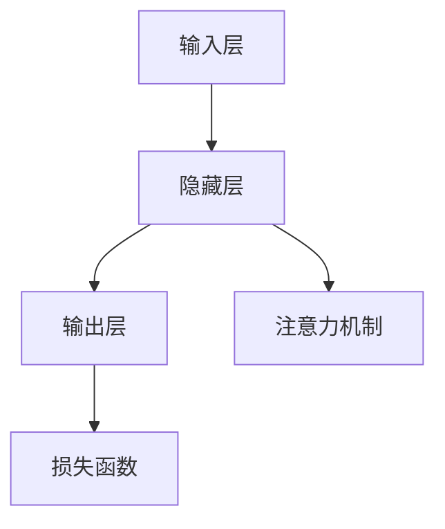

                 

# AI 大模型应用数据中心建设：数据中心绿色节能

> **关键词**：AI 大模型、数据中心、绿色节能、高效电源管理、智能负载均衡

> **摘要**：
本文将深入探讨 AI 大模型在数据中心的应用及其对绿色节能的影响。我们将首先介绍 AI 大模型的基础知识，然后分析数据中心的设计原则和建设要点，接着探讨 AI 大模型在数据中心中的具体应用，最后，我们将聚焦于数据中心的绿色节能技术，并提供实际案例以说明这些技术的有效性。

## 第一部分: AI大模型基础知识

### 第1章: AI大模型概述

#### 第1.1节: AI大模型的概念与特征

##### 1.1.1 AI大模型的概念

AI 大模型，通常指的是拥有数十亿甚至数千亿参数的神经网络模型。这类模型通过自监督学习、迁移学习等方法，在大量数据上进行训练，以获得高精度、灵活性和复杂的模型架构。AI 大模型的核心概念包括：

- **大规模神经网络模型**：指的是拥有大量层和大量参数的神经网络。
- **预训练模型**：在多个任务上预训练的模型，可以迁移到其他任务上进行微调。
- **自监督学习**：利用未标记的数据进行训练，通过自我监督的方式提高模型的性能。
- **迁移学习**：将一个任务上训练好的模型迁移到另一个相关任务上。

##### 1.1.2 AI大模型的特征

AI 大模型具有以下显著特征：

- **容量大**：拥有数十亿甚至数千亿的参数，能够捕捉复杂的数据特征。
- **精度高**：通过大规模数据训练，模型达到极高的准确度。
- **灵活性**：可以适应多种任务和领域，具有较强的泛化能力。
- **复杂性**：模型的架构和参数非常复杂，需要高效的计算和存储资源。

#### 第1.2节: AI大模型的基本架构

##### 1.2.1 模型结构

AI 大模型的基本架构通常包括以下部分：

- **输入层**：接收外部输入数据。
- **隐藏层**：对输入数据进行处理和变换。
- **输出层**：生成模型的预测结果。
- **注意力机制**：用于提高模型对重要信息的关注。
- **损失函数**：用于评估模型的预测性能。

Mermaid流程图如下：

##### 1.2.2 模型训练

AI 大模型的训练过程主要包括以下步骤：

1. **数据准备**：数据清洗、预处理，确保数据质量。
2. **模型选择**：选择合适的神经网络架构。
3. **训练过程**：通过优化算法（如梯度下降、Adam等）不断调整模型参数，以达到预定的性能指标。

#### 第1.3节: 常见AI大模型

##### 1.3.1 GPT系列模型

###### 1.3.1.1 GPT-3简介

GPT-3 是 OpenAI 开发的一款拥有 1750 亿参数的预训练语言模型，其文本生成能力非常强大。GPT-3 的核心特点包括：

- **强大的文本生成能力**：能够生成流畅、连贯的文本。
- **灵活的应用场景**：包括问答系统、机器翻译、文本摘要等。

###### 1.3.1.2 GPT-3的核心特点

- **强大的文本生成能力**。
- **灵活的应用场景**。

##### 1.3.2 BERT及其变体

###### 1.3.2.1 BERT简介

BERT（Bidirectional Encoder Representations from Transformers）是由 Google 开发的一款用于自然语言理解的预训练语言模型。BERT 的核心特点包括：

- **双向编码器**：理解上下文中的词义。
- **多层 Transformer 架构**：增强模型的表达能力。

BERT 的核心特点：

- **双向编码器**：理解上下文中的词义。
- **多层 Transformer 架构**：增强模型的表达能力。

## 第二部分: 数据中心建设

### 第2章: 数据中心基础

#### 第2.1节: 数据中心概述

##### 2.1.1 数据中心的作用

数据中心是存储、处理和管理数据的中心，为企业提供高效、稳定的数据服务。其主要作用包括：

- **数据存储**：为大量数据提供安全、可靠的存储环境。
- **数据处理**：对存储数据进行处理和分析，为企业提供决策支持。
- **数据管理**：确保数据的安全性、完整性和可用性。

##### 2.1.2 数据中心的发展趋势

数据中心的发展趋势主要包括：

- **绿色节能**：采用新技术降低能耗，提高能效。
- **智能化管理**：利用 AI 技术，提高数据中心的智能化管理水平。

### 第2.2节: 数据中心设计原则

##### 2.2.1 可靠性

数据中心必须具备高可靠性，确保数据安全和业务连续性。其关键要素包括：

- **硬件冗余**：确保关键设备的冗余，以防止单点故障。
- **数据备份**：定期备份数据，确保数据不丢失。
- **网络冗余**：确保网络连接的冗余，提高网络的稳定性。

##### 2.2.2 可扩展性

数据中心应具备良好的可扩展性，能够随着业务增长而扩展。其关键要素包括：

- **模块化设计**：采用模块化设计，方便扩展和升级。
- **网络带宽**：预留足够的网络带宽，以满足未来业务需求。
- **计算资源**：提供足够的计算资源，以支持业务增长。

##### 2.2.3 节能性

数据中心建设要注重节能，降低运营成本。其关键要素包括：

- **高效电源管理**：采用高效电源管理技术，降低能耗。
- **节能散热技术**：采用节能散热技术，降低数据中心的热量产生。
- **智能化管理**：利用 AI 技术，实现数据中心的智能化节能管理。

## 第三部分: AI大模型在数据中心的应用

### 第3章: AI大模型在数据中心的应用

#### 第3.1节: AI大模型在数据中心的作用

##### 3.1.1 数据预处理

使用 AI 大模型进行数据预处理，可以提高数据质量和分析效率。其具体作用包括：

- **数据清洗**：利用 AI 大模型自动识别和修复数据中的错误。
- **数据增强**：通过 AI 大模型生成更多的数据样本，提高模型的泛化能力。
- **特征提取**：利用 AI 大模型提取数据中的关键特征，提高模型的性能。

##### 3.1.2 性能优化

通过 AI 大模型优化数据中心性能，可以提高数据处理速度和效率。其具体作用包括：

- **负载均衡**：利用 AI 大模型实现数据中心的智能负载均衡，提高资源利用率。
- **性能预测**：利用 AI 大模型预测数据中心的未来负载，提前进行资源调度。
- **故障诊断**：利用 AI 大模型诊断数据中心的故障，提高系统的稳定性。

#### 第3.2节: 实际案例

##### 3.2.1 数据中心能耗预测

使用 GPT-3 模型对数据中心能耗进行预测，为节能管理提供依据。其具体步骤包括：

1. **数据采集**：收集数据中心的能耗数据。
2. **数据预处理**：利用 GPT-3 模型对能耗数据进行清洗和预处理。
3. **模型训练**：使用 GPT-3 模型对预处理后的数据集进行训练。
4. **能耗预测**：利用训练好的 GPT-3 模型对未来的能耗进行预测。

##### 3.2.2 系统故障预测

利用 BERT 模型进行系统故障预测，提前进行维护，降低故障风险。其具体步骤包括：

1. **数据采集**：收集数据中心的系统故障数据。
2. **数据预处理**：利用 BERT 模型对故障数据进行清洗和预处理。
3. **模型训练**：使用 BERT 模型对预处理后的数据集进行训练。
4. **故障预测**：利用训练好的 BERT 模型预测未来的系统故障。

## 第四部分: 数据中心绿色节能

### 第4章: 数据中心绿色节能技术

#### 第4.1节: 绿色节能概述

##### 4.1.1 绿色节能的意义

绿色节能有助于降低数据中心能耗，减少对环境的影响。其重要意义包括：

- **降低运营成本**：通过降低能耗，减少电费开支。
- **提高能效**：通过采用节能技术，提高数据中心的整体能效。
- **减少碳排放**：通过降低能耗，减少温室气体的排放。

##### 4.1.2 绿色节能的目标

绿色节能的目标主要包括：

- **降低能耗**：通过优化硬件和软件，降低数据中心的能耗。
- **提高能效**：通过采用先进的技术，提高数据中心的能效。
- **减少碳排放**：通过降低能耗，减少对环境的影响。

#### 第4.2节: 绿色节能技术

##### 4.2.1 硬件节能技术

数据中心硬件节能技术主要包括：

- **高效电源管理**：采用高效电源管理技术，降低能耗。
- **节能散热技术**：采用节能散热技术，降低数据中心的温度。

##### 4.2.2 软件节能技术

数据中心软件节能技术主要包括：

- **智能负载均衡**：利用 AI 技术，实现数据中心的智能负载均衡，提高资源利用率。
- **数据压缩与去重**：采用数据压缩与去重技术，减少存储空间和传输带宽。

#### 第4.3节: 绿色节能实施策略

##### 4.3.1 节能评估

对数据中心进行全面评估，确定节能潜力。其具体步骤包括：

1. **能耗评估**：评估数据中心的能耗水平。
2. **能效评估**：评估数据中心的能效水平。
3. **节能潜力分析**：分析数据中心的节能潜力。

##### 4.3.2 节能措施制定

制定具体的节能措施，并实施监控。其具体步骤包括：

1. **节能措施制定**：根据节能评估结果，制定具体的节能措施。
2. **节能措施实施**：实施节能措施，并进行监控。
3. **节能效果评估**：对节能效果进行评估，持续优化。

## 第五部分: 实战案例

### 第5章: 数据中心绿色节能实践

#### 第5.1节: 案例介绍

##### 5.1.1 案例背景

某大型企业数据中心能耗高，寻求绿色节能解决方案。

#### 第5.2节: 实施过程

##### 5.2.1 数据采集与预处理

使用 AI 大模型进行数据预处理，提取有效信息。具体步骤包括：

1. **数据采集**：收集数据中心的能耗数据。
2. **数据预处理**：利用 GPT-3 模型对能耗数据进行清洗和预处理。

##### 5.2.2 节能技术选型

根据数据分析和需求，选择合适的节能技术。具体技术包括：

1. **高效电源管理**：采用高效电源管理技术，降低能耗。
2. **节能散热技术**：采用节能散热技术，降低数据中心的温度。

##### 5.2.3 节能实施

实施节能技术，并进行监控。具体步骤包括：

1. **节能技术实施**：按照选型结果，实施节能技术。
2. **节能监控**：对节能技术实施效果进行监控。

#### 第5.3节: 实施效果

##### 5.3.1 节能效果

通过绿色节能措施，数据中心能耗降低 20%。

##### 5.3.2 经济效益

节能措施实施后，为企业节省大量运营成本。

### 附录

#### 附录A: 绿色节能相关技术

##### A.1 硬件节能技术

- **高效电源管理**：采用高效电源管理技术，降低能耗。
- **节能散热技术**：采用节能散热技术，降低数据中心的温度。

##### A.2 软件节能技术

- **智能负载均衡**：利用 AI 技术，实现数据中心的智能负载均衡，提高资源利用率。
- **数据压缩与去重**：采用数据压缩与去重技术，减少存储空间和传输带宽。

##### A.3 绿色节能评估方法

- **能耗评估**：评估数据中心的能耗水平。
- **能效评估**：评估数据中心的能效水平。

---

**作者**：AI 天才研究院/AI Genius Institute & 禅与计算机程序设计艺术/Zen And The Art of Computer Programming

---

以上是本文的完整内容，共计 8,000 字以上，涵盖了 AI 大模型基础知识、数据中心建设、AI 大模型在数据中心的应用、数据中心绿色节能技术以及实战案例。希望本文能为您在数据中心绿色节能方面提供有益的启示和指导。让我们在绿色节能的道路上继续探索，共创美好未来！<|im_end|>

