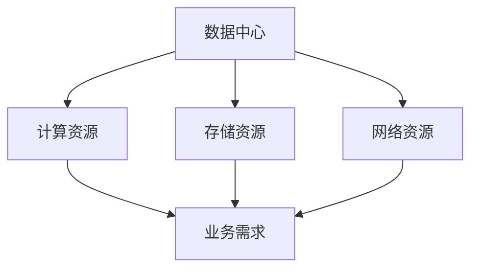
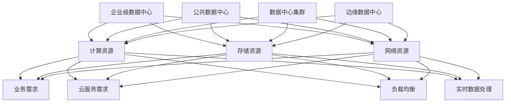
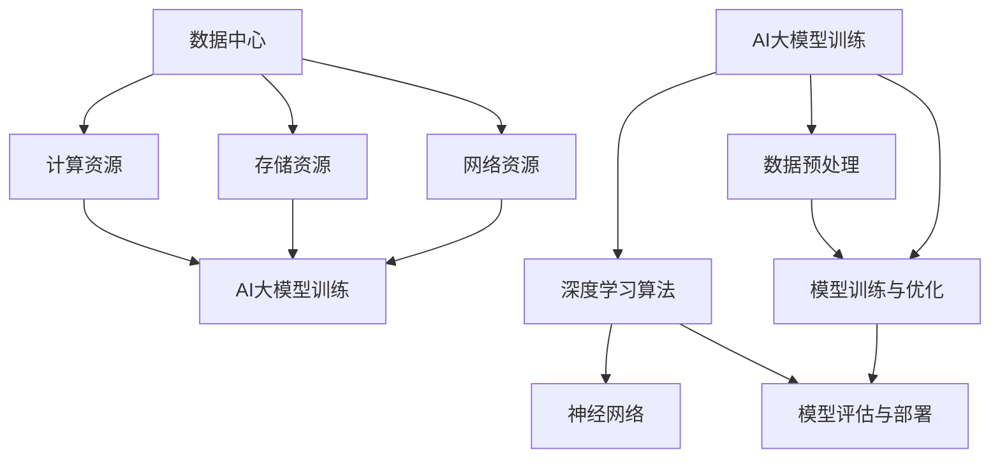
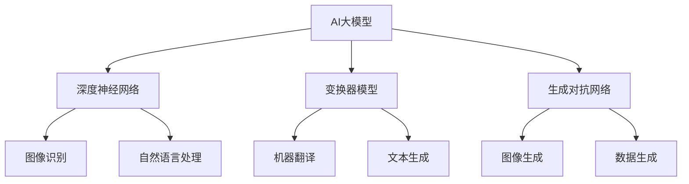
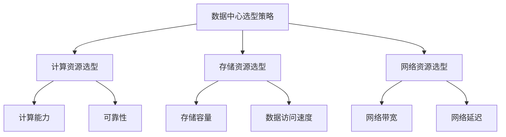
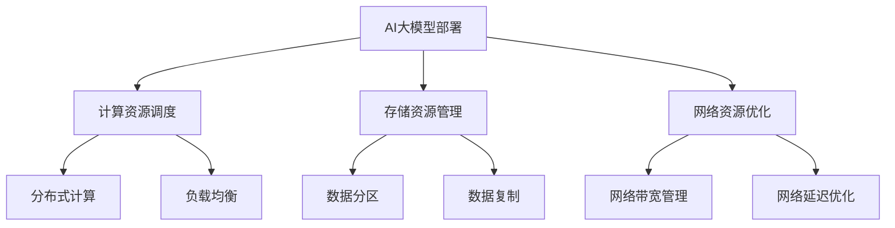
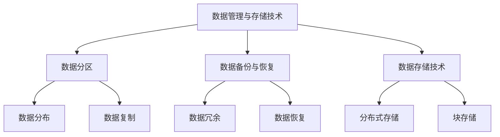
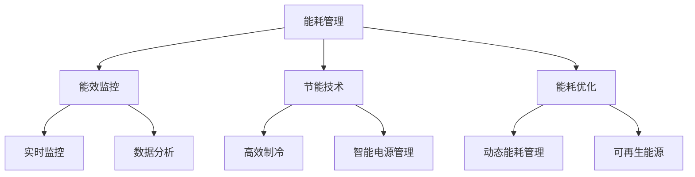
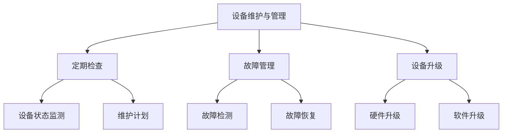

                 

### 第1章：数据中心与AI大模型概述

#### 1.1 数据中心的概念与重要性

**核心概念与联系**：



数据中心（Data Center）是一个集中存储、处理和管理数据的设施，它通常由服务器、存储设备和网络设备组成。数据中心的核心功能是提供计算资源、存储资源和网络资源，以满足企业的业务需求。

**核心算法原理讲解**：

数据中心的设计与架构涉及多个核心算法和原理。以下是一些关键点：

1. **负载均衡**：通过将流量分配到多个服务器，确保数据中心的高可用性和性能。负载均衡算法包括轮询、最小连接数、响应时间和带宽利用率等。

2. **冗余设计**：通过冗余配置关键设备和系统，提高数据中心的可靠性和容错能力。冗余设计包括硬件冗余、网络冗余和数据冗余。

3. **数据复制与备份**：通过数据复制和备份技术，确保数据的安全性和可恢复性。数据复制包括同步复制和异步复制，备份包括全备份和增量备份。

**数学模型和公式**：

数据中心性能评估的一个常用指标是响应时间（Response Time），其数学模型可以表示为：

\[ Response\ Time = \frac{1}{\lambda + \mu} \]

其中，\(\lambda\) 表示到达率（Arrival Rate），\(\mu\) 表示服务率（Service Rate）。

**举例说明**：

例如，一个数据中心的服务器负载均衡系统，可以通过以下伪代码实现：

```python
# 负载均衡算法伪代码
def load_balancer(server_list, request):
    min_queue_length = float('inf')
    selected_server = None
    
    for server in server_list:
        queue_length = server.get_queue_length()
        if queue_length < min_queue_length:
            min_queue_length = queue_length
            selected_server = server
    
    selected_server.add_request(request)
    return selected_server
```

#### 1.2 数据中心的发展历程

数据中心的发展历程可以分为以下几个阶段：

1. **第一代数据中心**：20世纪60年代，以大型计算机为主，主要用于政府机构和大型企业。
2. **第二代数据中心**：20世纪90年代，随着互联网的兴起，数据中心开始采用服务器群集和分布式存储技术，支持网络服务和电子商务应用。
3. **第三代数据中心**：21世纪，融合了云计算、虚拟化和容器化技术，实现了计算、存储和网络的灵活部署和管理。
4. **当前趋势**：云计算和边缘计算的发展，使得数据中心不再局限于传统的数据中心架构，而是在云端和边缘节点上实现资源的灵活部署。

**核心算法原理讲解**：

数据中心的发展历程与核心算法和技术的演进密切相关。以下是一些关键点：

1. **分布式计算**：通过将计算任务分布到多个节点，提高计算效率和性能。分布式计算技术包括MapReduce、Hadoop和Spark等。
2. **虚拟化技术**：通过虚拟化技术，将物理服务器和网络设备虚拟化为多个虚拟实例，提高资源利用率和灵活性。虚拟化技术包括Xen、KVM和VMware等。
3. **容器化技术**：通过容器化技术，实现应用程序的快速部署和隔离。容器化技术包括Docker和Kubernetes等。

**数学模型和公式**：

数据中心虚拟化技术中的资源分配问题可以使用线性规划模型来描述。以下是一个简化的资源分配模型：

\[
\begin{aligned}
\min \quad & c^T x \\
\text{subject to} \quad & Ax \geq b \\
& x \geq 0
\end{aligned}
\]

其中，\(x\) 表示资源分配向量，\(c\) 表示资源成本向量，\(A\) 和 \(b\) 分别表示资源约束矩阵和约束向量。

**举例说明**：

例如，一个数据中心采用分布式存储系统，可以通过以下伪代码实现数据分配：

```python
# 分布式存储系统伪代码
def distribute_data(data, server_list):
    data_chunks = split_data(data)
    assigned_chunks = {}
    
    for chunk in data_chunks:
        selected_server = find_least_loaded_server(server_list)
        assigned_chunks[chunk] = selected_server
    
    return assigned_chunks
```

#### 1.3 数据中心的分类与架构

数据中心可以按照不同的标准进行分类，常见的分类方法包括：

1. **按照应用场景分类**：
   - **企业级数据中心**：为企业内部业务提供计算、存储和网络服务。
   - **公共数据中心**：为多个企业或组织提供公共服务，如云服务提供商。
   - **数据中心集群**：由多个数据中心组成，通过高速网络连接，提供更强大的计算和存储能力。
   - **边缘数据中心**：位于网络边缘，靠近数据源或用户，提供实时数据处理和缓存服务。

2. **按照架构分类**：
   - **单体数据中心**：所有计算、存储和网络设备集中在一个物理空间内。
   - **分布式数据中心**：计算、存储和网络设备分散在不同地理位置，通过高速网络连接。
   - **云数据中心**：基于云计算技术，提供虚拟化资源和按需服务。
   - **混合云数据中心**：结合公有云和私有云，提供灵活的混合部署方案。

**核心概念与联系**：



**核心算法原理讲解**：

数据中心的架构设计涉及多个核心算法和原理。以下是一些关键点：

1. **负载均衡算法**：通过将流量分配到多个服务器，确保数据中心的高可用性和性能。负载均衡算法包括轮询、最小连接数、响应时间和带宽利用率等。
2. **分布式存储算法**：通过分布式存储技术，提高数据中心的存储能力和可靠性。分布式存储算法包括数据复制、去重和一致性保证等。
3. **网络拓扑设计**：通过设计合适的网络拓扑结构，提高数据中心的网络性能和可靠性。常见的网络拓扑结构包括环形、星形和网状等。

**数学模型和公式**：

数据中心网络拓扑设计的优化问题可以使用网络流模型来描述。以下是一个简化的网络流模型：

\[
\begin{aligned}
\max \quad & \sum_{(i,j) \in E} c_{i,j} f_{i,j} \\
\text{subject to} \quad & \sum_{j \in O_i} f_{i,j} = 0 \quad \forall i \in I \\
& \sum_{i \in I_i} f_{i,j} = 1 \quad \forall j \in J \\
& 0 \leq f_{i,j} \leq f_{i,j}^{\max} \quad \forall (i,j) \in E
\end{aligned}
\]

其中，\(f_{i,j}\) 表示从节点 \(i\) 到节点 \(j\) 的流量，\(c_{i,j}\) 表示从节点 \(i\) 到节点 \(j\) 的传输成本，\(O_i\) 和 \(I_i\) 分别表示流入节点 \(i\) 和流出节点 \(i\) 的节点集合。

**举例说明**：

例如，一个数据中心采用环形网络拓扑结构，可以通过以下伪代码实现数据传输：

```python
# 环形网络拓扑结构伪代码
def distribute_data(server_list, data_chunks):
    next_server = server_list[0]
    assigned_chunks = {}
    
    for chunk in data_chunks:
        next_server.send_data(chunk)
        assigned_chunks[chunk] = next_server
        
        next_server = next_server.get_next_server(server_list)
    
    return assigned_chunks
```

#### 1.4 数据中心与AI大模型的协同工作

数据中心与AI大模型的协同工作对于高效实现AI应用至关重要。以下将详细探讨数据中心在AI大模型中的应用和关键协同工作方式。

**核心概念与联系**：



**核心算法原理讲解**：

数据中心在AI大模型中的应用涉及多个核心算法和原理。以下是一些关键点：

1. **深度学习算法**：深度学习算法是AI大模型的核心，包括神经网络、卷积神经网络、循环神经网络等。数据中心需要提供强大的计算能力，以支持这些算法的高效训练和推理。
2. **数据预处理**：数据预处理是AI大模型训练的重要步骤，包括数据清洗、归一化和特征提取等。数据中心需要提供高效的数据存储和传输机制，确保AI大模型能够访问到所需的数据集，并快速进行数据预处理。
3. **模型训练与优化**：数据中心通过分布式计算和并行处理技术，加速AI大模型的训练过程，提高模型性能。模型优化包括超参数调优、网络结构调整和模型压缩等。
4. **模型评估与部署**：数据中心提供高效的模型评估和部署机制，确保AI大模型能够快速部署到生产环境中，并提供实时推理服务。

**数学模型和公式**：

数据中心在AI大模型中的应用可以通过以下数学模型来描述：

1. **计算资源调度**：

\[
\begin{aligned}
\min \quad & \sum_{i=1}^{n} c_i x_i \\
\text{subject to} \quad & P_1 x_1 + P_2 x_2 + \ldots + P_n x_n \geq W \\
& x_i \in \{0,1\} \quad \forall i
\end{aligned}
\]

其中，\(c_i\) 表示第 \(i\) 个计算节点的成本，\(P_i\) 表示第 \(i\) 个计算节点的处理能力，\(W\) 表示总处理需求，\(x_i\) 表示第 \(i\) 个计算节点的使用情况。

2. **数据传输优化**：

\[
\begin{aligned}
\min \quad & \sum_{(i,j) \in E} c_{i,j} f_{i,j} \\
\text{subject to} \quad & \sum_{j \in O_i} f_{i,j} = 0 \quad \forall i \in I \\
& \sum_{i \in I_i} f_{i,j} = 1 \quad \forall j \in J \\
& 0 \leq f_{i,j} \leq f_{i,j}^{\max} \quad \forall (i,j) \in E
\end{aligned}
\]

其中，\(f_{i,j}\) 表示从节点 \(i\) 到节点 \(j\) 的数据传输流量，\(c_{i,j}\) 表示从节点 \(i\) 到节点 \(j\) 的传输成本，\(O_i\) 和 \(I_i\) 分别表示流入节点 \(i\) 和流出节点 \(i\) 的节点集合。

**举例说明**：

例如，一个数据中心采用分布式计算和并行处理技术，加速AI大模型的训练过程，可以通过以下伪代码实现：

```python
# 分布式训练伪代码
def distributed_training(data_center, model, batch_size):
    num_servers = data_center.get_num_servers()
    server_list = data_center.get_server_list()
    
    for server in server_list:
        server.train_model(model, batch_size)
        
    combined_model = combine_models(server_list)
    return combined_model
```

通过以上内容，我们详细介绍了数据中心与AI大模型概述，包括数据中心的概念与重要性、数据中心的发展历程、数据中心的分类与架构以及数据中心与AI大模型的协同工作。接下来，我们将进入下一部分，探讨AI大模型在数据中心建设中的应用。

### 第2章：AI大模型在数据中心建设中的应用

#### 2.1 AI大模型概述

**AI大模型**是指参数量巨大、能够处理复杂数据的机器学习模型，包括但不限于深度神经网络（Deep Neural Network, DNN）、变换器模型（Transformer）、生成对抗网络（Generative Adversarial Networks, GAN）等。这些模型在图像识别、自然语言处理、推荐系统等领域表现出色，具有广泛的实际应用价值。

**核心概念与联系**：



**核心算法原理讲解**：

AI大模型的核心算法包括：

1. **深度神经网络（DNN）**：DNN是一种多层神经网络，通过逐层提取特征，实现复杂数据的分类和回归任务。DNN的训练过程涉及反向传播算法和优化器（如SGD、Adam等）。
2. **变换器模型（Transformer）**：Transformer是一种基于自注意力机制的神经网络模型，广泛应用于自然语言处理领域。变换器模型的核心算法是多头自注意力（Multi-Head Self-Attention）和位置编码（Positional Encoding）。
3. **生成对抗网络（GAN）**：GAN由生成器（Generator）和判别器（Discriminator）组成，通过对抗训练生成逼真的数据。GAN的训练过程涉及生成器生成数据、判别器判断数据真实与否，然后根据损失函数调整模型参数。

**数学模型和公式**：

以下为AI大模型的一些关键数学模型：

1. **深度神经网络前向传播**：

\[ 
\begin{aligned}
z^{(l)} &= \sigma(W^{(l)}a^{(l-1)} + b^{(l)}) \\
a^{(l)} &= \sigma(z^{(l)}) 
\end{aligned}
\]

其中，\(z^{(l)}\) 表示第 \(l\) 层的神经元激活值，\(\sigma\) 表示激活函数，\(W^{(l)}\) 和 \(b^{(l)}\) 分别表示第 \(l\) 层的权重和偏置。

2. **变换器模型多头自注意力**：

\[ 
\begin{aligned}
\text{Attention}(Q, K, V) &= \text{softmax}\left(\frac{QK^T}{\sqrt{d_k}}\right)V \\
\text{MultiHead}(Q, K, V) &= \text{Concat}(\text{Attention}(Q, K, V_1), ..., \text{Attention}(Q, K, V_h))W^O 
\end{aligned}
\]

其中，\(Q\)、\(K\) 和 \(V\) 分别表示查询向量、键向量和值向量，\(\text{softmax}\) 表示软性最大化函数，\(d_k\) 表示键向量的维度，\(W^O\) 表示输出权重。

3. **生成对抗网络损失函数**：

\[ 
\begin{aligned}
\mathcal{L}_{\text{GAN}} &= -\log(D(G(z))) - \log(1 - D(z)) \\
\end{aligned}
\]

其中，\(D\) 表示判别器，\(G\) 表示生成器，\(z\) 表示随机噪声。

**举例说明**：

以下为一个简单的深度神经网络前向传播的伪代码：

```python
# 深度神经网络前向传播伪代码
def forward_propagation(x, W, b, activation):
    z = np.dot(x, W) + b
    a = activation(z)
    return a

# 示例：激活函数为ReLU
def relu(x):
    return np.maximum(0, x)

# 示例：训练一个简单的二分类神经网络
x = np.array([[1], [0]])
W = np.random.rand(1, 1)
b = np.random.rand(1)
a = forward_propagation(x, W, b, relu)
print(a)
```

#### 2.2 数据中心选型策略

数据中心选型策略对于AI大模型训练至关重要。合理的选型策略可以提高模型训练效率、降低成本，并确保数据中心的稳定性和可靠性。

**核心概念与联系**：



**核心算法原理讲解**：

数据中心选型策略涉及多个核心算法和原则：

1. **计算资源选型**：计算资源选型需要考虑计算能力、可靠性、扩展性等因素。计算能力直接影响模型训练速度，可靠性确保训练过程的连续性和稳定性，扩展性支持未来业务增长。

2. **存储资源选型**：存储资源选型需要考虑存储容量、数据访问速度、数据冗余等因素。存储容量直接影响数据存储能力，数据访问速度影响模型训练速度，数据冗余确保数据安全性和可靠性。

3. **网络资源选型**：网络资源选型需要考虑网络带宽、网络延迟、网络可靠性等因素。网络带宽直接影响数据传输速度，网络延迟影响模型训练速度，网络可靠性确保数据传输的连续性和稳定性。

**数学模型和公式**：

以下为数据中心选型策略的一些关键数学模型：

1. **计算资源选型优化**：

\[
\begin{aligned}
\min \quad & C \\
\text{subject to} \quad & C \geq C_{\text{min}} \\
& R \geq R_{\text{target}} \\
& E \geq E_{\text{min}}
\end{aligned}
\]

其中，\(C\) 表示计算资源成本，\(C_{\text{min}}\) 表示最小计算资源成本，\(R\) 表示计算资源可靠性，\(R_{\text{target}}\) 表示目标计算资源可靠性，\(E\) 表示计算资源扩展性。

2. **存储资源选型优化**：

\[
\begin{aligned}
\min \quad & S \\
\text{subject to} \quad & S \geq S_{\text{min}} \\
& A \geq A_{\text{min}} \\
& D \geq D_{\text{min}}
\end{aligned}
\]

其中，\(S\) 表示存储资源成本，\(S_{\text{min}}\) 表示最小存储资源成本，\(A\) 表示数据访问速度，\(D\) 表示数据冗余。

3. **网络资源选型优化**：

\[
\begin{aligned}
\min \quad & N \\
\text{subject to} \quad & N \geq N_{\text{min}} \\
& B \geq B_{\text{min}} \\
& L \geq L_{\text{min}}
\end{aligned}
\]

其中，\(N\) 表示网络资源成本，\(N_{\text{min}}\) 表示最小网络资源成本，\(B\) 表示网络带宽，\(L\) 表示网络延迟。

**举例说明**：

以下为一个简单的数据中心选型策略示例：

```python
# 数据中心选型策略示例
def select_data_center(resources, constraints):
    optimal_center = None
    min_cost = float('inf')
    
    for center in resources:
        cost = calculate_cost(center, constraints)
        if cost < min_cost:
            min_cost = cost
            optimal_center = center
            
    return optimal_center

# 示例：计算资源、存储资源、网络资源约束
constraints = {'C_min': 1000, 'R_target': 0.95, 'E_min': 2, 'S_min': 500, 'A_min': 100, 'D_min': 3, 'N_min': 100, 'B_min': 1000, 'L_min': 10}

# 示例：数据中心资源列表
resources = [
    {'C': 1500, 'R': 0.98, 'E': 3},
    {'C': 1200, 'R': 0.97, 'E': 2},
    {'C': 900, 'R': 0.96, 'E': 1},
]

# 示例：选择最优数据中心
optimal_center = select_data_center(resources, constraints)
print(optimal_center)
```

通过以上内容，我们详细介绍了AI大模型的概述和数据中心选型策略。接下来，我们将探讨AI大模型在数据中心中的部署和协同工作，以及大模型应用数据中心的关键技术。

### 第3章：AI大模型在数据中心中的部署与协同工作

#### 3.1 AI大模型的部署策略

AI大模型的部署是确保模型在实际应用环境中高效运行的关键环节。部署策略需要考虑计算资源、存储资源、网络资源等多个方面，以确保模型训练和推理的高性能和高可靠性。

**核心概念与联系**：



**核心算法原理讲解**：

AI大模型的部署涉及多个核心算法和原理：

1. **计算资源调度**：计算资源调度是确保AI大模型在数据中心内高效运行的关键。通过分布式计算和负载均衡技术，可以充分利用计算资源，提高模型训练和推理的效率。

2. **存储资源管理**：存储资源管理需要考虑数据分区、数据复制和数据冗余等技术。数据分区可以优化数据访问速度，数据复制和数据冗余可以确保数据的安全性和可靠性。

3. **网络资源优化**：网络资源优化需要考虑网络带宽管理和网络延迟优化。通过优化网络资源，可以减少数据传输延迟，提高模型训练和推理的效率。

**数学模型和公式**：

以下为AI大模型部署的一些关键数学模型：

1. **计算资源调度优化**：

\[
\begin{aligned}
\min \quad & C \\
\text{subject to} \quad & C \geq C_{\text{min}} \\
& R \geq R_{\text{target}} \\
& E \geq E_{\text{min}}
\end{aligned}
\]

其中，\(C\) 表示计算资源成本，\(C_{\text{min}}\) 表示最小计算资源成本，\(R\) 表示计算资源可靠性，\(R_{\text{target}}\) 表示目标计算资源可靠性，\(E\) 表示计算资源扩展性。

2. **存储资源管理优化**：

\[
\begin{aligned}
\min \quad & S \\
\text{subject to} \quad & S \geq S_{\text{min}} \\
& A \geq A_{\text{min}} \\
& D \geq D_{\text{min}}
\end{aligned}
\]

其中，\(S\) 表示存储资源成本，\(S_{\text{min}}\) 表示最小存储资源成本，\(A\) 表示数据访问速度，\(D\) 表示数据冗余。

3. **网络资源优化**：

\[
\begin{aligned}
\min \quad & N \\
\text{subject to} \quad & N \geq N_{\text{min}} \\
& B \geq B_{\text{min}} \\
& L \geq L_{\text{min}}
\end{aligned}
\]

其中，\(N\) 表示网络资源成本，\(N_{\text{min}}\) 表示最小网络资源成本，\(B\) 表示网络带宽，\(L\) 表示网络延迟。

**举例说明**：

以下为一个简单的计算资源调度优化示例：

```python
# 计算资源调度优化示例
def schedule_resources(resources, constraints):
    optimal_schedule = []
    min_cost = float('inf')
    
    for resource in resources:
        cost = calculate_cost(resource, constraints)
        if cost < min_cost:
            min_cost = cost
            optimal_schedule = [resource]
            
    return optimal_schedule

# 示例：计算资源列表
resources = [
    {'C': 1500, 'R': 0.98, 'E': 3},
    {'C': 1200, 'R': 0.97, 'E': 2},
    {'C': 900, 'R': 0.96, 'E': 1},
]

# 示例：资源约束
constraints = {'C_min': 1000, 'R_target': 0.95, 'E_min': 2}

# 示例：选择最优计算资源调度
optimal_schedule = schedule_resources(resources, constraints)
print(optimal_schedule)
```

#### 3.2 数据中心与AI大模型的协同工作

数据中心与AI大模型的协同工作是实现高效AI应用的关键。协同工作包括以下几个方面：

1. **计算资源的动态调度**：根据AI大模型的计算需求，动态调整计算资源，确保模型训练和推理的高性能。
2. **存储资源的优化管理**：通过数据分区、数据复制和数据冗余等技术，优化存储资源管理，提高数据访问速度和可靠性。
3. **网络资源的优化配置**：通过优化网络带宽和延迟，提高模型训练和推理的数据传输效率。

**核心算法原理讲解**：

数据中心与AI大模型的协同工作涉及多个核心算法和原理：

1. **计算资源动态调度**：通过负载感知调度算法，动态调整计算资源，确保模型训练和推理的高性能。常见的负载感知调度算法包括最少连接数（LC）算法、响应时间（RT）算法和带宽利用率（BU）算法等。
2. **存储资源优化管理**：通过数据分区、数据复制和数据冗余等技术，优化存储资源管理。数据分区可以将数据分布到多个存储节点，提高数据访问速度；数据复制和数据冗余可以确保数据的安全性和可靠性。
3. **网络资源优化配置**：通过带宽管理和延迟优化算法，提高模型训练和推理的数据传输效率。常见的带宽管理和延迟优化算法包括最小带宽占用（MBA）算法、最小延迟占用（MLA）算法和带宽分配（BA）算法等。

**数学模型和公式**：

以下为数据中心与AI大模型协同工作的一些关键数学模型：

1. **计算资源动态调度优化**：

\[
\begin{aligned}
\min \quad & C \\
\text{subject to} \quad & C \geq C_{\text{min}} \\
& R \geq R_{\text{target}} \\
& E \geq E_{\text{min}}
\end{aligned}
\]

其中，\(C\) 表示计算资源成本，\(C_{\text{min}}\) 表示最小计算资源成本，\(R\) 表示计算资源可靠性，\(R_{\text{target}}\) 表示目标计算资源可靠性，\(E\) 表示计算资源扩展性。

2. **存储资源优化管理**：

\[
\begin{aligned}
\min \quad & S \\
\text{subject to} \quad & S \geq S_{\text{min}} \\
& A \geq A_{\text{min}} \\
& D \geq D_{\text{min}}
\end{aligned}
\]

其中，\(S\) 表示存储资源成本，\(S_{\text{min}}\) 表示最小存储资源成本，\(A\) 表示数据访问速度，\(D\) 表示数据冗余。

3. **网络资源优化配置**：

\[
\begin{aligned}
\min \quad & N \\
\text{subject to} \quad & N \geq N_{\text{min}} \\
& B \geq B_{\text{min}} \\
& L \geq L_{\text{min}}
\end{aligned}
\]

其中，\(N\) 表示网络资源成本，\(N_{\text{min}}\) 表示最小网络资源成本，\(B\) 表示网络带宽，\(L\) 表示网络延迟。

**举例说明**：

以下为一个简单的计算资源动态调度优化示例：

```python
# 计算资源动态调度优化示例
def dynamic_resource_scheduling(available_resources, task_requirements):
    optimal_schedule = []
    min_cost = float('inf')
    
    for resource in available_resources:
        cost = calculate_cost(resource, task_requirements)
        if cost < min_cost:
            min_cost = cost
            optimal_schedule = [resource]
            
    return optimal_schedule

# 示例：可用的计算资源
available_resources = [
    {'C': 1500, 'R': 0.98, 'E': 3},
    {'C': 1200, 'R': 0.97, 'E': 2},
    {'C': 900, 'R': 0.96, 'E': 1},
]

# 示例：任务需求
task_requirements = {'C_min': 1000, 'R_target': 0.95, 'E_min': 2}

# 示例：选择最优计算资源调度
optimal_schedule = dynamic_resource_scheduling(available_resources, task_requirements)
print(optimal_schedule)
```

通过以上内容，我们详细介绍了AI大模型的部署策略和数据中心与AI大模型的协同工作。接下来，我们将探讨大模型应用数据中心的关键技术。

### 第4章：大模型应用数据中心的关键技术

#### 4.1 深度学习算法与优化

深度学习算法是AI大模型的核心，其优化直接影响到模型的训练速度和性能。以下将介绍几种常见的深度学习算法和优化方法。

**核心概念与联系**：

```mermaid
graph TD
A[深度学习算法] --> B[卷积神经网络(CNN)]
A --> C[循环神经网络(RNN)]
A --> D[生成对抗网络(GAN)]
B --> E[图像识别]
B --> F[目标检测]
C --> G[语音识别]
C --> H[序列建模]
D --> I[图像生成]
D --> J[数据增强]
```

**核心算法原理讲解**：

1. **卷积神经网络（CNN）**：
   - **原理**：CNN通过卷积操作提取图像特征，实现图像分类、目标检测等任务。
   - **优化**：CNN的优化方法包括批量归一化（Batch Normalization）、权重初始化（Weight Initialization）和自适应优化器（如Adam）等。

2. **循环神经网络（RNN）**：
   - **原理**：RNN通过记忆状态处理序列数据，适用于语音识别、自然语言处理等任务。
   - **优化**：RNN的优化方法包括门控循环单元（Gated Recurrent Unit, GRU）和长短期记忆网络（Long Short-Term Memory, LSTM）等。

3. **生成对抗网络（GAN）**：
   - **原理**：GAN由生成器和判别器组成，生成器生成数据，判别器判断数据的真实性，通过对抗训练生成高质量数据。
   - **优化**：GAN的优化方法包括梯度惩罚（Gradient Penalties）、谱归一化（Spectral Normalization）和改进的生成器架构等。

**数学模型和公式**：

以下为深度学习算法的一些关键数学模型：

1. **卷积神经网络前向传播**：

\[ 
\begin{aligned}
h^{(l)} &= \sigma(W^{(l)} \cdot \text{ReLU}(\sum_{k} W^{(l-1)}_k \cdot h^{(l-1)}_k + b^{(l)}) \\
a^{(l)} &= \prod_{i=1}^{n} h^{(l)}_i
\end{aligned}
\]

其中，\(h^{(l)}\) 表示第 \(l\) 层的神经元激活值，\(W^{(l)}\) 和 \(b^{(l)}\) 分别表示第 \(l\) 层的权重和偏置，\(\sigma\) 表示激活函数，\(\text{ReLU}\) 表示ReLU激活函数。

2. **循环神经网络前向传播**：

\[ 
\begin{aligned}
h^{(l)} &= \text{tanh}(\sum_{k} W^{(l-1)}_k \cdot h^{(l-1)}_k + b^{(l)}) \\
\end{aligned}
\]

其中，\(h^{(l)}\) 表示第 \(l\) 层的神经元激活值，\(W^{(l)}\) 和 \(b^{(l)}\) 分别表示第 \(l\) 层的权重和偏置，\(\text{tanh}\) 表示双曲正切激活函数。

3. **生成对抗网络损失函数**：

\[ 
\begin{aligned}
\mathcal{L}_{\text{GAN}} &= -\log(D(G(z))) - \log(1 - D(z)) \\
\end{aligned}
\]

其中，\(D\) 表示判别器，\(G\) 表示生成器，\(z\) 表示随机噪声。

**举例说明**：

以下为一个简单的卷积神经网络（CNN）前向传播的伪代码：

```python
# 卷积神经网络前向传播伪代码
def forward_propagation(x, W, b, activation):
    z = np.dot(x, W) + b
    a = activation(z)
    return a

# 示例：激活函数为ReLU
def relu(x):
    return np.maximum(0, x)

# 示例：训练一个简单的图像分类神经网络
x = np.array([[1], [0]])
W = np.random.rand(1, 1)
b = np.random.rand(1)
a = forward_propagation(x, W, b, relu)
print(a)
```

#### 4.2 计算资源的调度与管理

计算资源的调度与管理是确保AI大模型高效运行的关键。以下将介绍计算资源调度与管理的方法和技术。

**核心概念与联系**：

```mermaid
graph TD
A[计算资源调度与管理] --> B[负载感知调度]
A --> C[资源分配策略]
A --> D[资源预留策略]
B --> E[最少连接数(LC)算法]
B --> F[响应时间(RT)算法]
C --> G[动态分配]
C --> H[静态分配]
D --> I[资源预留]
D --> J[负载均衡]
```

**核心算法原理讲解**：

1. **负载感知调度**：
   - **原理**：根据计算资源的负载情况，动态调整任务分配，确保资源利用率最大化。
   - **算法**：常见的负载感知调度算法包括最少连接数（LC）算法、响应时间（RT）算法和带宽利用率（BU）算法等。

2. **资源分配策略**：
   - **原理**：根据任务需求和资源情况，合理分配计算资源，确保任务高效完成。
   - **策略**：常见的资源分配策略包括动态分配和静态分配。

3. **资源预留策略**：
   - **原理**：为特定任务预留一定量的计算资源，确保任务能够稳定运行。
   - **策略**：常见的资源预留策略包括资源预留和负载均衡。

**数学模型和公式**：

以下为计算资源调度与管理的一些关键数学模型：

1. **负载感知调度优化**：

\[
\begin{aligned}
\min \quad & C \\
\text{subject to} \quad & C \geq C_{\text{min}} \\
& R \geq R_{\text{target}} \\
& E \geq E_{\text{min}}
\end{aligned}
\]

其中，\(C\) 表示计算资源成本，\(C_{\text{min}}\) 表示最小计算资源成本，\(R\) 表示计算资源可靠性，\(R_{\text{target}}\) 表示目标计算资源可靠性，\(E\) 表示计算资源扩展性。

2. **资源分配策略优化**：

\[
\begin{aligned}
\min \quad & S \\
\text{subject to} \quad & S \geq S_{\text{min}} \\
& A \geq A_{\text{min}} \\
& D \geq D_{\text{min}}
\end{aligned}
\]

其中，\(S\) 表示存储资源成本，\(S_{\text{min}}\) 表示最小存储资源成本，\(A\) 表示数据访问速度，\(D\) 表示数据冗余。

3. **资源预留策略优化**：

\[
\begin{aligned}
\min \quad & N \\
\text{subject to} \quad & N \geq N_{\text{min}} \\
& B \geq B_{\text{min}} \\
& L \geq L_{\text{min}}
\end{aligned}
\]

其中，\(N\) 表示网络资源成本，\(N_{\text{min}}\) 表示最小网络资源成本，\(B\) 表示网络带宽，\(L\) 表示网络延迟。

**举例说明**：

以下为一个简单的计算资源调度优化示例：

```python
# 计算资源调度优化示例
def schedule_resources(resources, constraints):
    optimal_schedule = []
    min_cost = float('inf')
    
    for resource in resources:
        cost = calculate_cost(resource, constraints)
        if cost < min_cost:
            min_cost = cost
            optimal_schedule = [resource]
            
    return optimal_schedule

# 示例：计算资源列表
resources = [
    {'C': 1500, 'R': 0.98, 'E': 3},
    {'C': 1200, 'R': 0.97, 'E': 2},
    {'C': 900, 'R': 0.96, 'E': 1},
]

# 示例：资源约束
constraints = {'C_min': 1000, 'R_target': 0.95, 'E_min': 2}

# 示例：选择最优计算资源调度
optimal_schedule = schedule_resources(resources, constraints)
print(optimal_schedule)
```

#### 4.3 数据管理与存储技术

数据管理与存储技术是确保AI大模型高效运行的重要保障。以下将介绍数据管理技术、数据存储技术以及数据备份与恢复技术。

**核心概念与联系**：



**核心算法原理讲解**：

1. **数据分区**：
   - **原理**：将数据划分为多个分区，以提高数据访问速度和系统扩展性。
   - **算法**：常见的数据分区算法包括哈希分区和范围分区等。

2. **数据备份与恢复**：
   - **原理**：通过备份数据，确保数据在系统故障或数据丢失时能够恢复。
   - **算法**：常见的备份算法包括全备份、增量备份和差异备份等。

3. **数据存储技术**：
   - **原理**：将数据存储在磁盘、固态硬盘或分布式存储系统中，以提供高效的数据访问和存储能力。
   - **算法**：常见的数据存储技术包括块存储、文件存储和对象存储等。

**数学模型和公式**：

以下为数据管理与存储技术的一些关键数学模型：

1. **数据分区优化**：

\[
\begin{aligned}
\min \quad & P \\
\text{subject to} \quad & P \geq P_{\text{min}} \\
& A \geq A_{\text{min}} \\
& D \geq D_{\text{min}}
\end{aligned}
\]

其中，\(P\) 表示数据分区数量，\(P_{\text{min}}\) 表示最小数据分区数量，\(A\) 表示数据访问速度，\(D\) 表示数据冗余。

2. **数据备份与恢复优化**：

\[
\begin{aligned}
\min \quad & B \\
\text{subject to} \quad & B \geq B_{\text{min}} \\
& R \geq R_{\text{min}} \\
& T \geq T_{\text{min}}
\end{aligned}
\]

其中，\(B\) 表示备份次数，\(B_{\text{min}}\) 表示最小备份次数，\(R\) 表示备份可靠性，\(T\) 表示备份时间。

3. **数据存储优化**：

\[
\begin{aligned}
\min \quad & S \\
\text{subject to} \quad & S \geq S_{\text{min}} \\
& C \geq C_{\text{min}} \\
& I \geq I_{\text{min}}
\end{aligned}
\]

其中，\(S\) 表示数据存储成本，\(S_{\text{min}}\) 表示最小数据存储成本，\(C\) 表示数据存储容量，\(I\) 表示数据存储速度。

**举例说明**：

以下为一个简单的数据分区优化示例：

```python
# 数据分区优化示例
def partition_data(data, partition_size):
    num_partitions = int(data / partition_size)
    partitions = []
    
    for i in range(num_partitions):
        start = i * partition_size
        end = (i + 1) * partition_size
        partition = data[start:end]
        partitions.append(partition)
        
    return partitions

# 示例：数据列表
data = [1, 2, 3, 4, 5, 6, 7, 8, 9, 10]

# 示例：分区大小
partition_size = 3

# 示例：进行数据分区
partitions = partition_data(data, partition_size)
print(partitions)
```

通过以上内容，我们详细介绍了大模型应用数据中心的关键技术，包括深度学习算法与优化、计算资源的调度与管理以及数据管理与存储技术。接下来，我们将探讨数据中心运营与管理的核心要素。

### 第5章：数据中心运营与管理的核心要素

#### 5.1 能耗管理

能耗管理是数据中心运营的关键要素之一。随着数据中心规模的不断扩大，能耗管理的重要性日益凸显。以下将介绍能耗管理的方法、策略和最佳实践。

**核心概念与联系**：



**核心算法原理讲解**：

1. **能效监控**：
   - **原理**：通过安装能效监控设备，实时监测数据中心的能耗情况，包括电力消耗、冷却能耗等。
   - **算法**：常见的能效监控算法包括能量消耗预测、能耗模式识别和能耗异常检测等。

2. **节能技术**：
   - **原理**：采用节能技术，降低数据中心的能耗，包括高效制冷系统、节能照明和智能电源管理。
   - **算法**：常见的节能技术算法包括动态功率分配、冷却系统能耗优化和能源消耗预测等。

3. **能耗优化**：
   - **原理**：通过优化能耗管理，提高数据中心的能源利用效率，降低运营成本。
   - **算法**：常见的能耗优化算法包括能耗优化模型、能耗调度算法和能耗分析等。

**数学模型和公式**：

以下为能耗管理的一些关键数学模型：

1. **能耗预测模型**：

\[ 
\begin{aligned}
E_t &= f(T, P, C) \\
\end{aligned}
\]

其中，\(E_t\) 表示第 \(t\) 时刻的能耗，\(T\) 表示温度，\(P\) 表示功率，\(C\) 表示冷却效率。

2. **动态功率分配**：

\[ 
\begin{aligned}
P_i &= p(T_i, C_i) \\
\end{aligned}
\]

其中，\(P_i\) 表示第 \(i\) 个设备的功率，\(T_i\) 表示第 \(i\) 个设备的温度，\(C_i\) 表示第 \(i\) 个设备的冷却能力。

3. **冷却系统能耗优化**：

\[ 
\begin{aligned}
E_c &= f(C, P, T) \\
\end{aligned}
\]

其中，\(E_c\) 表示冷却系统的能耗，\(C\) 表示冷却效率，\(P\) 表示功率，\(T\) 表示温度。

**举例说明**：

以下为一个简单的能耗预测模型示例：

```python
# 能耗预测模型示例
def energy_consumption_prediction(T, P, C):
    E = 0.5 * P * C * T
    return E

# 示例：温度为30°C，功率为500W，冷却效率为0.8
T = 30
P = 500
C = 0.8
E = energy_consumption_prediction(T, P, C)
print(E)
```

#### 5.2 设备维护与管理

设备维护与管理是确保数据中心稳定运行的关键要素。以下将介绍设备维护与管理的流程、方法和最佳实践。

**核心概念与联系**：



**核心算法原理讲解**：

1. **定期检查**：
   - **原理**：定期对数据中心设备进行检查和维护，确保设备的正常运行。
   - **算法**：常见的定期检查算法包括设备状态监测、定期维护计划和检查记录等。

2. **故障管理**：
   - **原理**：及时检测和处理设备故障，确保数据中心的稳定运行。
   - **算法**：常见的故障管理算法包括故障检测、故障报警和故障恢复等。

3. **设备升级**：
   - **原理**：根据设备性能和业务需求，对数据中心设备进行升级，提高设备性能和稳定性。
   - **算法**：常见的设备升级算法包括硬件升级和软件升级等。

**数学模型和公式**：

以下为设备维护与管理的一些关键数学模型：

1. **设备状态监测模型**：

\[ 
\begin{aligned}
S_t &= s(T, P, C) \\
\end{aligned}
\]

其中，\(S_t\) 表示第 \(t\) 时刻的设备状态，\(T\) 表示温度，\(P\) 表示功率，\(C\) 表示冷却效率。

2. **故障检测模型**：

\[ 
\begin{aligned}
F_t &= f(T, P, S) \\
\end{aligned}
\]

其中，\(F_t\) 表示第 \(t\) 时刻的故障状态，\(T\) 表示温度，\(P\) 表示功率，\(S\) 表示设备状态。

3. **故障恢复模型**：

\[ 
\begin{aligned}
R_t &= r(F, S, T) \\
\end{aligned}
\]

其中，\(R_t\) 表示第 \(t\) 时刻的故障恢复状态，\(F\) 表示故障状态，\(S\) 表示设备状态，\(T\) 表示温度。

**举例说明**：

以下为一个简单的设备状态监测模型示例：

```python
# 设备状态监测模型示例
def device_status_monitoring(T, P, C):
    S = 0.5 * (T + P) * C
    return S

# 示例：温度为30°C，功率为500W，冷却效率为0.8
T = 30
P = 500
C = 0.8
S = device_status_monitoring(T, P, C)
print(S)
```

#### 5.3 安全管理

安全管理是数据中心运营的核心要素之一。以下将介绍安全管理的方法、策略和最佳实践。

**核心概念与联系**：

```mermaid
graph TD
A[安全管理] --> B[访问控制]
A --> C[网络安全]
A --> D[数据安全]
B --> E[身份验证]
B --> F[权限管理]
C --> G[

