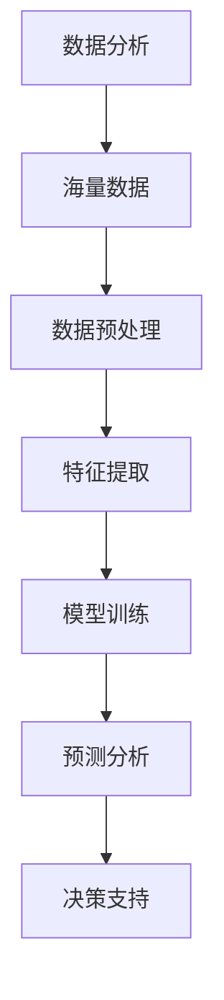
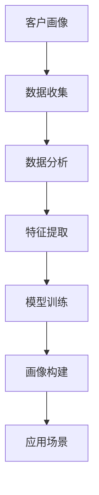
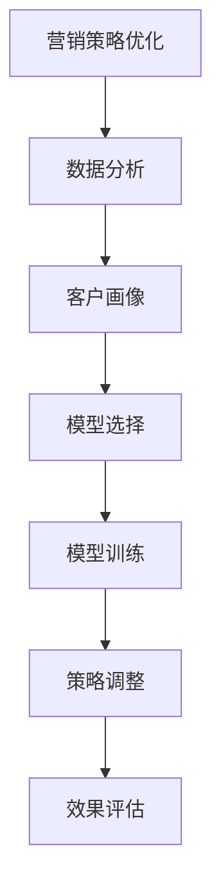
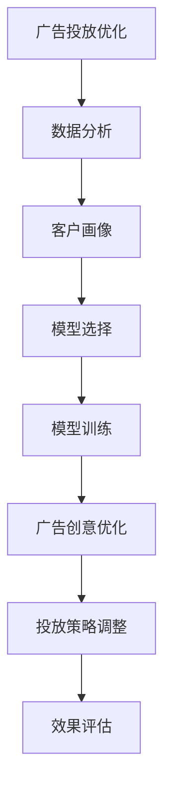
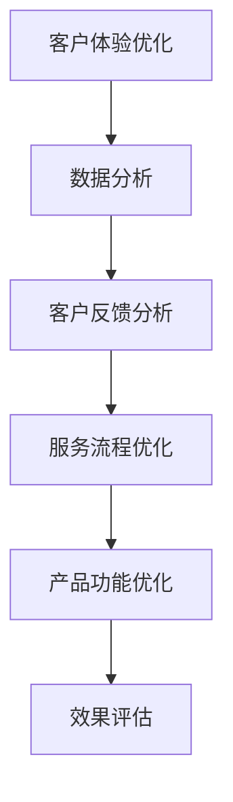

                 

# AI 大模型应用数据中心的市场营销

> **关键词**：AI大模型、数据中心、市场营销、数据分析、客户画像、广告投放优化、客户体验优化、未来趋势、挑战与应对策略。

> **摘要**：本文将探讨 AI 大模型应用数据中心在现代市场营销中的重要角色。通过逐步分析 AI 大模型应用数据中心的技术基础、应用案例和优化策略，我们将揭示其在数据分析、客户画像、广告投放和客户体验优化等方面的应用价值，并提出应对未来趋势与挑战的应对策略。本文旨在为市场营销从业者提供有价值的参考，助力企业在 AI 时代取得竞争优势。

## 第一部分：AI大模型应用数据中心概述

### 第1章: AI大模型应用数据中心简介

#### 1.1 AI大模型应用数据中心的定义与意义

##### 1.1.1 AI大模型应用数据中心的定义

AI大模型应用数据中心是指基于人工智能（AI）技术，特别是深度学习和机器学习算法，构建的用于存储、处理和分析大规模数据的服务器集群。这些数据中心专注于处理和分析 AI 大模型相关的数据，以支持市场营销中的各种应用。

##### 1.1.2 AI大模型应用数据中心的三大关键要素

1. **数据存储与管理**：AI大模型应用数据中心需要高效的数据存储和管理系统，以处理海量数据。这通常包括分布式文件系统、数据库和数据仓库等。

2. **计算资源**：由于 AI 大模型训练和推理过程对计算资源有极高需求，数据中心需要配备高性能计算服务器、GPU 和其他加速器，以满足 AI 应用场景的需求。

3. **算法与应用**：AI大模型应用数据中心的核心在于其算法和应用。这包括深度学习模型的设计、训练和部署，以及针对市场营销的特定应用。

##### 1.1.3 AI大模型应用数据中心在现代市场营销中的重要性

随着数据量的爆炸性增长和消费者行为数据的日益复杂，市场营销面临着前所未有的挑战。AI大模型应用数据中心在以下几个方面对市场营销具有重要意义：

1. **数据分析**：AI大模型能够从海量数据中提取有价值的信息，帮助市场营销人员更好地理解消费者行为和市场需求。

2. **客户画像**：通过 AI 大模型分析客户数据，可以构建详细的客户画像，实现精准营销和个性化推荐。

3. **营销策略优化**：AI 大模型可以实时分析市场数据，为市场营销策略提供优化建议，提高营销效果。

4. **广告投放优化**：AI 大模型能够基于用户行为和偏好，优化广告投放策略，提高广告投放的精准度和效果。

5. **客户体验优化**：通过分析客户反馈和行为数据，AI 大模型可以帮助企业不断优化客户体验，提升客户满意度。

#### 1.2 数据中心的发展历程

##### 1.2.1 从传统数据中心到云数据中心

数据中心的发展经历了从传统数据中心到云数据中心的演变。传统数据中心主要依赖于本地硬件设备，数据存储和处理能力有限，难以满足快速增长的数据需求。而云数据中心的兴起，使得企业可以通过云服务提供商获取强大的计算和存储资源，实现灵活的扩展和高效的数据处理。

##### 1.2.2 云数据中心到AI大模型应用数据中心

随着人工智能技术的快速发展，云数据中心逐渐演变为 AI 大模型应用数据中心。AI 大模型对数据存储、处理和计算能力的要求更高，云数据中心提供了必要的硬件和软件支持，使得企业能够更便捷地应用 AI 技术进行数据分析、预测和优化。

##### 1.2.3 未来数据中心的发展趋势

未来数据中心的发展将更加智能化和高效化。以下是一些趋势：

1. **边缘计算**：边缘计算将计算能力从数据中心扩展到网络边缘，以降低延迟和带宽需求，提高实时数据处理能力。

2. **联邦学习**：联邦学习是一种分布式机器学习技术，可以在保护数据隐私的同时，实现大规模数据协同分析。

3. **智能运维**：智能运维（AIOps）利用 AI 技术实现数据中心的自适应管理和优化，提高系统性能和可靠性。

4. **绿色数据中心**：随着环境问题的日益严峻，绿色数据中心将成为趋势，通过节能技术和可再生能源的使用，降低数据中心的能耗和碳排放。

#### 1.3 AI大模型在市场营销中的应用

##### 1.3.1 数据分析

数据分析是市场营销的核心任务之一。AI 大模型能够处理和分析大量数据，提取有价值的信息，帮助市场营销人员更好地了解消费者行为和市场需求。

**核心概念与联系**：



**核心算法原理讲解**：

```plaintext
数据预处理：数据预处理是数据分析的第一步，包括数据清洗、数据整合和数据规范化等操作。

特征提取：特征提取是从原始数据中提取出对分析任务有用的特征，以便于模型训练和预测。

模型训练：模型训练是指使用训练数据对模型进行参数调整，使其能够对新的数据进行预测。

预测分析：预测分析是根据训练好的模型，对未知数据进行预测，以便于市场营销人员做出决策。

决策支持：决策支持是根据预测结果，为市场营销策略提供优化建议，提高营销效果。
```

**数学模型和公式**：

```latex
预测分析：y = f(x; \theta)
其中，y 是预测结果，x 是输入特征，\theta 是模型参数。
```

**举例说明**：

假设一家电商平台想要分析消费者购买行为，可以使用以下步骤：

1. 数据收集：收集用户浏览、购买、评价等数据。

2. 数据预处理：清洗和整合数据，去除异常值和噪声。

3. 特征提取：提取用户年龄、性别、购买频次等特征。

4. 模型训练：使用训练数据对模型进行训练。

5. 预测分析：使用训练好的模型对未知用户进行购买预测。

6. 决策支持：根据预测结果，为电商平台提供优化建议，如推荐商品、促销活动等。

##### 1.3.2 客户画像

客户画像是一种基于数据分析技术，对消费者进行精准描述和分类的方法。通过构建客户画像，市场营销人员可以更好地了解消费者的需求和偏好，实现精准营销。

**核心概念与联系**：



**核心算法原理讲解**：

```plaintext
数据收集：收集消费者的各种数据，如行为数据、偏好数据等。

数据分析：对收集到的数据进行分析，提取有价值的信息。

特征提取：提取对客户画像有用的特征，如年龄、性别、购买历史等。

模型训练：使用训练数据对模型进行训练，以识别和分类不同的客户群体。

画像构建：根据模型训练结果，构建详细的客户画像。

应用场景：根据客户画像，制定个性化的营销策略，提高营销效果。
```

**数学模型和公式**：

```latex
客户画像：P_i = \frac{1}{Z} \exp(\theta^T x_i)
其中，P_i 是第 i 个客户属于某一类别的概率，\theta 是模型参数，x_i 是第 i 个客户的特征向量，Z 是归一化常数。
```

**举例说明**：

假设一家电商平台想要构建客户画像，可以按照以下步骤：

1. 数据收集：收集用户行为数据、偏好数据等。

2. 数据分析：对收集到的数据进行预处理和特征提取。

3. 模型训练：使用训练数据对模型进行训练。

4. 画像构建：根据模型训练结果，构建详细的客户画像。

5. 应用场景：根据客户画像，制定个性化的营销策略，如推荐商品、推送促销活动等。

##### 1.3.3 营销策略优化

营销策略优化是指通过分析市场数据，为市场营销策略提供优化建议，以提高营销效果。AI 大模型在营销策略优化中发挥着重要作用。

**核心概念与联系**：



**核心算法原理讲解**：

```plaintext
数据分析：分析市场数据，了解消费者行为和市场需求。

客户画像：构建详细的客户画像，了解不同客户群体的特征。

模型选择：选择适合的模型，如决策树、随机森林、神经网络等。

模型训练：使用训练数据对模型进行训练，以提高模型的预测能力。

策略调整：根据模型预测结果，调整市场营销策略。

效果评估：评估优化后的营销策略效果，以便进行进一步调整。
```

**数学模型和公式**：

```latex
策略调整：y_{\text{new}} = \theta_{\text{new}} x
其中，y_{\text{new}} 是调整后的策略，\theta_{\text{new}} 是调整后的模型参数，x 是输入特征。
```

**举例说明**：

假设一家电商平台想要优化其广告投放策略，可以按照以下步骤：

1. 数据分析：分析广告投放数据，了解广告效果。

2. 客户画像：构建详细的客户画像，了解不同客户群体的特征。

3. 模型选择：选择适合的模型，如线性回归、逻辑回归等。

4. 模型训练：使用训练数据对模型进行训练。

5. 策略调整：根据模型预测结果，调整广告投放策略。

6. 效果评估：评估优化后的广告投放策略效果，以便进行进一步调整。

##### 1.3.4 广告投放优化

广告投放优化是指通过分析用户行为数据和广告投放效果，优化广告投放策略，以提高广告投放的精准度和效果。AI 大模型在广告投放优化中发挥着关键作用。

**核心概念与联系**：



**核心算法原理讲解**：

```plaintext
数据分析：分析用户行为数据和广告投放效果，了解广告投放的现状。

客户画像：构建详细的客户画像，了解不同客户群体的特征。

模型选择：选择适合的模型，如协同过滤、基于内容的推荐等。

模型训练：使用训练数据对模型进行训练，以提高模型的预测能力。

广告创意优化：根据模型预测结果，优化广告创意，提高广告吸引力和点击率。

投放策略调整：根据广告投放效果，调整投放策略，如投放渠道、投放时间、投放地域等。

效果评估：评估优化后的广告投放策略效果，以便进行进一步调整。
```

**数学模型和公式**：

```latex
广告创意优化：r_{\text{new}} = \theta_{\text{new}} f(x)
其中，r_{\text{new}} 是优化后的广告创意评分，\theta_{\text{new}} 是优化后的模型参数，x 是输入特征，f(x) 是广告创意函数。
```

**举例说明**：

假设一家电商平台想要优化其广告投放策略，可以按照以下步骤：

1. 数据分析：分析用户点击、购买等行为数据，了解广告投放效果。

2. 客户画像：构建详细的客户画像，了解不同客户群体的特征。

3. 模型选择：选择适合的模型，如协同过滤、基于内容的推荐等。

4. 模型训练：使用训练数据对模型进行训练。

5. 广告创意优化：根据模型预测结果，优化广告创意。

6. 投放策略调整：根据广告投放效果，调整投放策略。

7. 效果评估：评估优化后的广告投放策略效果，以便进行进一步调整。

##### 1.3.5 客户体验优化

客户体验优化是指通过分析客户反馈和行为数据，优化客户服务流程和产品功能，以提高客户满意度和忠诚度。AI 大模型在客户体验优化中发挥着重要作用。

**核心概念与联系**：



**核心算法原理讲解**：

```plaintext
数据分析：分析客户反馈和行为数据，了解客户体验的现状。

客户反馈分析：对客户反馈进行分类和分析，识别主要问题和改进方向。

服务流程优化：根据客户反馈，优化服务流程，提高客户服务质量和效率。

产品功能优化：根据客户需求，优化产品功能，提高产品易用性和满意度。

效果评估：评估优化后的客户体验效果，以便进行进一步调整。
```

**数学模型和公式**：

```latex
效果评估：E = \frac{1}{N} \sum_{i=1}^{N} x_i
其中，E 是客户体验效果评分，N 是客户数量，x_i 是第 i 个客户的体验评分。
```

**举例说明**：

假设一家电商平台想要优化其客户体验，可以按照以下步骤：

1. 数据分析：分析客户反馈和行为数据，了解客户体验的现状。

2. 客户反馈分析：对客户反馈进行分类和分析，识别主要问题和改进方向。

3. 服务流程优化：根据客户反馈，优化服务流程，提高客户服务质量和效率。

4. 产品功能优化：根据客户需求，优化产品功能，提高产品易用性和满意度。

5. 效果评估：评估优化后的客户体验效果，以便进行进一步调整。

### 第二部分：AI大模型应用数据中心技术基础

#### 第2章: AI大模型应用数据中心技术架构

##### 2.1 数据中心架构概述

数据中心架构是指用于组织和管理数据中心硬件、软件和网络资源的总体结构。AI 大模型应用数据中心的技术架构主要包括以下几个方面：

1. **硬件架构**：硬件架构包括服务器、存储设备、网络设备等硬件资源。AI 大模型应用数据中心需要高性能计算服务器、GPU 和其他加速器，以满足 AI 大模型训练和推理的需求。

2. **网络架构**：网络架构包括数据中心内部网络和外部网络。内部网络主要负责数据传输和共享，外部网络主要负责与互联网的连接和通信。

3. **存储架构**：存储架构包括分布式文件系统、数据库和数据仓库等。AI 大模型应用数据中心需要高效的数据存储和管理系统，以处理海量数据。

##### 2.2 AI大模型技术基础

AI 大模型技术基础包括深度学习、机器学习、自然语言处理和计算机视觉等方面。以下是对这些技术的简要介绍：

1. **深度学习**：深度学习是一种基于多层神经网络的人工智能技术，通过训练大量数据，能够自动提取特征和模式，实现图像识别、语音识别等任务。

2. **机器学习**：机器学习是一种通过算法从数据中学习规律和模式的人工智能技术，包括监督学习、无监督学习和强化学习等。

3. **自然语言处理**：自然语言处理是一种基于计算语言学和人工智能技术，用于处理和生成自然语言（如英语、中文等）的技术。

4. **计算机视觉**：计算机视觉是一种基于图像处理和模式识别技术，用于从图像或视频中提取信息和知识的人工智能技术。

##### 2.3 AI大模型应用流程

AI 大模型应用流程包括数据预处理、模型选择、模型训练、模型评估和模型部署等方面。以下是对这些步骤的简要介绍：

1. **数据预处理**：数据预处理是 AI 大模型应用的第一步，包括数据清洗、数据整合和数据规范化等操作，以提高数据质量和模型性能。

2. **模型选择**：模型选择是根据具体应用场景和任务需求，选择合适的深度学习模型或机器学习模型。

3. **模型训练**：模型训练是通过训练数据，调整模型参数，使模型能够准确预测或分类。

4. **模型评估**：模型评估是使用验证数据，评估模型性能和准确性，以便进行模型调整和优化。

5. **模型部署**：模型部署是将训练好的模型部署到生产环境中，实现实时预测或分类。

### 第三部分：AI大模型应用数据中心在市场营销中的应用

#### 第3章: AI大模型应用在市场营销数据分析

##### 3.1 数据收集与清洗

数据收集与清洗是市场营销数据分析的重要步骤。以下是对数据收集和清洗的详细讲解：

1. **数据收集方法**：

- **用户行为数据**：通过网站日志、点击流数据、移动应用数据等方式收集用户行为数据。

- **社交媒体数据**：通过社交媒体平台（如微博、微信、Facebook 等）收集用户发布的内容和互动数据。

- **市场调查数据**：通过在线调查、问卷调查等方式收集消费者偏好和需求数据。

- **销售数据**：通过电商平台、零售门店等渠道收集销售数据，包括销售额、产品种类、客户购买历史等。

2. **数据清洗技巧**：

- **数据去重**：去除重复的数据记录，以避免重复计算和分析。

- **缺失值处理**：处理数据缺失值，如使用平均值、中位数、最临近值等方法进行填充。

- **异常值处理**：识别和处理数据中的异常值，如离群点、异常值等。

- **数据规范化**：对数据进行规范化处理，如归一化、标准化等，以提高数据质量和模型性能。

##### 3.2 数据分析技术

数据分析技术是市场营销数据分析的核心，以下是对几种常见的数据分析技术的介绍：

1. **描述性统计分析**：

- **均值、中位数、众数**：描述数据分布的中心位置。

- **方差、标准差**：描述数据的离散程度。

- **最大值、最小值**：描述数据的范围。

2. **聚类分析**：

- **K-均值聚类**：将数据分为多个簇，每个簇由其中心点代表。

- **层次聚类**：将数据分为多个簇，并通过层次结构进行聚类。

3. **相关性分析**：

- **皮尔逊相关系数**：度量两个变量之间的线性相关性。

- **斯皮尔曼相关系数**：度量两个变量之间的等级相关性。

4. **预测分析**：

- **时间序列分析**：预测未来的趋势和模式。

- **回归分析**：建立因变量和自变量之间的关系，用于预测和优化。

##### 3.3 市场营销数据分析案例

以下是一个市场营销数据分析案例，展示如何使用数据分析技术进行市场营销分析：

1. **消费者行为分析**：

- **分析用户点击流数据**：分析用户在网站上的点击行为，了解用户兴趣和偏好。

- **分析用户购买行为**：分析用户购买历史，了解用户购买模式和需求。

2. **市场细分**：

- **基于用户行为数据**：将用户分为不同的群体，如高频用户、低频用户等。

- **基于购买行为数据**：将用户分为不同的市场细分，如高价值客户、低价值客户等。

3. **品牌评估**：

- **分析社交媒体数据**：评估品牌在社交媒体上的影响力。

- **分析用户反馈**：评估品牌在用户心中的认知和满意度。

4. **营销活动效果评估**：

- **分析活动数据**：分析营销活动的点击率、转化率等指标。

- **对比分析**：对比不同营销活动的效果，找出最优策略。

#### 第4章: AI大模型应用在市场营销中的客户画像

##### 4.1 客户画像概述

客户画像是一种基于数据分析技术，对消费者进行精准描述和分类的方法。以下是对客户画像的详细介绍：

1. **客户画像的定义与作用**：

- **定义**：客户画像是对消费者的特征、行为和需求进行抽象和描述的模型。

- **作用**：客户画像可以帮助市场营销人员更好地了解消费者，实现精准营销和个性化推荐。

2. **客户画像的主要类型**：

- **静态画像**：基于消费者基本特征（如年龄、性别、职业等）进行描述。

- **动态画像**：基于消费者行为数据（如浏览历史、购买记录等）进行动态更新。

- **综合画像**：结合静态和动态画像，对消费者进行全面描述。

3. **客户画像的数据来源**：

- **用户行为数据**：如浏览历史、购买记录、评论等。

- **社交媒体数据**：如微博、微信、Facebook 等。

- **市场调查数据**：如问卷调查、消费者调研等。

- **第三方数据**：如人口统计、地理位置等。

##### 4.2 客户画像构建方法

客户画像的构建方法包括数据收集与整合、数据分析技术、模型训练和画像构建等方面。以下是对这些方法的详细讲解：

1. **数据收集与整合**：

- **数据收集**：通过多种渠道收集消费者数据，如用户行为数据、社交媒体数据等。

- **数据整合**：将不同来源的数据进行整合，构建统一的数据视图。

2. **数据分析技术**：

- **描述性统计分析**：分析消费者的基本特征和消费行为。

- **聚类分析**：将消费者分为不同的群体，以便进行个性化推荐。

- **回归分析**：建立消费者特征与购买行为之间的关系，用于预测和优化。

3. **模型训练**：

- **特征工程**：从原始数据中提取对客户画像有用的特征。

- **模型选择**：选择合适的机器学习模型，如决策树、随机森林、神经网络等。

- **模型训练**：使用训练数据对模型进行训练，以提高模型的预测能力。

4. **画像构建**：

- **静态画像构建**：基于消费者的基本特征，构建静态画像。

- **动态画像构建**：基于消费者行为数据，构建动态画像。

- **综合画像构建**：结合静态和动态画像，构建综合画像。

##### 4.3 客户画像应用案例

以下是一个客户画像应用案例，展示如何使用客户画像进行市场营销：

1. **营销自动化**：

- **个性化推荐**：根据客户画像，向客户推荐个性化的产品和服务。

- **自动化营销**：根据客户行为数据，自动发送邮件、短信等营销信息。

2. **个性化推荐**：

- **基于兴趣的推荐**：根据客户浏览历史和购买记录，推荐符合客户兴趣的产品。

- **基于协同过滤的推荐**：根据客户群体的行为和偏好，推荐相似客户喜欢的产品。

3. **跨渠道整合**：

- **统一客户视图**：将线上和线下数据整合，构建统一客户视图。

- **个性化营销**：根据客户在不同渠道的行为，提供个性化的营销策略。

### 第四部分：AI大模型应用数据中心在市场营销中的优化策略

#### 第5章: AI大模型应用在市场营销策略优化

##### 5.1 营销策略优化概述

营销策略优化是指通过分析市场数据，为市场营销策略提供优化建议，以提高营销效果。AI 大模型在营销策略优化中发挥着关键作用。以下是对营销策略优化的详细介绍：

1. **营销策略的定义与类型**：

- **定义**：营销策略是企业为了实现营销目标，制定的行动计划和方案。

- **类型**：包括产品策略、价格策略、渠道策略和促销策略等。

2. **传统的营销策略优化方法**：

- **数据分析**：通过收集和分析市场数据，了解市场需求和消费者行为。

- **竞品分析**：分析竞争对手的营销策略，找到自身优劣势。

- **用户体验优化**：优化产品和服务，提高用户满意度和忠诚度。

3. **AI 大模型在营销策略优化中的应用优势**：

- **数据分析**：AI 大模型能够处理和分析大量数据，提取有价值的信息，提供更精准的营销策略。

- **个性化推荐**：基于客户画像，AI 大模型可以提供个性化的产品和服务推荐，提高营销效果。

- **预测分析**：AI 大模型可以预测市场趋势和消费者行为，为营销策略提供前瞻性建议。

- **自动化优化**：AI 大模型可以自动化调整营销策略，提高营销效率和效果。

##### 5.2 AI大模型在营销策略优化中的应用

AI 大模型在营销策略优化中的应用包括数据分析、客户画像、模型选择与训练、策略调整与优化等方面。以下是对这些应用的详细讲解：

1. **数据分析**：

- **市场数据分析**：分析市场需求、竞争对手和消费者行为等市场数据，为营销策略提供数据支持。

- **销售数据分析**：分析销售数据，了解产品销量、客户购买行为等，优化产品策略和价格策略。

2. **客户画像**：

- **客户特征提取**：从用户行为数据中提取客户特征，如年龄、性别、兴趣等，用于构建客户画像。

- **客户群体划分**：基于客户画像，将客户划分为不同的群体，如潜在客户、忠诚客户等。

3. **模型选择与训练**：

- **模型选择**：选择合适的机器学习模型，如决策树、随机森林、神经网络等，用于营销策略优化。

- **模型训练**：使用训练数据对模型进行训练，以提高模型的预测和优化能力。

4. **策略调整与优化**：

- **策略调整**：根据模型预测结果，调整营销策略，如产品价格、促销活动等。

- **策略优化**：通过不断调整和优化策略，提高营销效果，实现营销目标。

##### 5.3 营销策略优化案例

以下是一个营销策略优化案例，展示如何使用 AI 大模型进行营销策略优化：

1. **广告投放优化**：

- **数据分析**：分析广告投放数据，了解广告效果和用户点击行为。

- **模型训练**：使用广告投放数据，训练广告投放优化模型。

- **策略调整**：根据模型预测结果，调整广告投放策略，如广告投放时间、投放地域等。

- **效果评估**：评估优化后的广告投放策略效果，如点击率、转化率等。

2. **促销活动优化**：

- **数据分析**：分析促销活动数据，了解促销活动的效果和用户参与度。

- **模型训练**：使用促销活动数据，训练促销活动优化模型。

- **策略调整**：根据模型预测结果，调整促销活动策略，如促销时间、促销力度等。

- **效果评估**：评估优化后的促销活动策略效果，如销售额、用户参与度等。

3. **产品策略优化**：

- **数据分析**：分析产品销售数据，了解产品销量和用户评价。

- **模型训练**：使用产品销售数据，训练产品策略优化模型。

- **策略调整**：根据模型预测结果，调整产品策略，如产品定价、产品推广等。

- **效果评估**：评估优化后的产品策略效果，如销售额、用户满意度等。

### 第五部分：AI大模型应用数据中心市场营销的未来趋势与挑战

#### 第6章: AI大模型应用数据中心市场营销的未来趋势

##### 6.1 人工智能与市场营销融合的趋势

人工智能（AI）正在与市场营销深度融合，为企业带来前所未有的机遇。以下是对这一趋势的详细分析：

1. **市场营销AI化的现状**：

- **数据分析与预测**：市场营销人员越来越依赖 AI 技术进行数据分析和市场预测，以制定更有效的营销策略。

- **个性化推荐**：AI 技术使个性化推荐成为可能，根据用户行为和偏好，为用户提供个性化的产品和服务。

- **自动化与优化**：AI 技术在广告投放、促销活动等营销环节中实现自动化和优化，提高营销效率和效果。

2. **未来市场营销的趋势**：

- **智能化**：随着 AI 技术的发展，市场营销将更加智能化，实现自动化的策略调整和优化。

- **个性化**：AI 技术将推动市场营销向个性化方向发展，满足消费者日益增长的个性化需求。

- **全域营销**：通过整合线上线下数据，实现全域营销，提升营销效果。

- **用户体验驱动**：用户体验将成为市场营销的核心，企业将通过 AI 技术优化产品和服务，提升消费者满意度。

3. **AI 大模型在市场营销中的未来发展空间**：

- **大数据分析**：AI 大模型将处理和分析更多类型的数据，为市场营销提供更深入的洞察。

- **智能决策**：AI 大模型将实现更加智能化的决策支持，帮助企业制定更有效的营销策略。

- **跨领域应用**：AI 大模型将在更多领域应用，如金融、医疗等，实现跨界营销。

##### 6.2 新型AI大模型技术的应用

随着人工智能技术的不断进步，新型 AI 大模型技术逐渐应用于市场营销，为企业带来更多机遇和挑战。以下是对这些技术的介绍：

1. **生成对抗网络（GAN）**：

- **应用场景**：GAN 在图像生成、图像修复、图像增强等方面具有广泛的应用。

- **在市场营销中的应用**：GAN 可以生成高质量的广告图像，提高广告创意效果；用于图像修复和增强，提升用户体验。

2. **强化学习在市场营销中的应用**：

- **应用场景**：强化学习在广告投放、促销活动、供应链管理等方面具有广泛的应用。

- **在市场营销中的应用**：强化学习可以帮助企业优化广告投放策略，提高广告效果；在促销活动中实现动态定价，提高销售额。

3. **联邦学习在数据安全与隐私保护中的应用**：

- **应用场景**：联邦学习在金融、医疗、零售等领域具有广泛的应用。

- **在市场营销中的应用**：联邦学习可以在保护用户隐私的同时，实现跨企业数据协同分析，提升营销效果。

##### 6.3 用户体验驱动的市场营销

用户体验（UX）已成为市场营销的核心，企业通过优化产品和服务，提升消费者满意度。以下是对用户体验驱动的市场营销的详细分析：

1. **个性化体验**：

- **应用场景**：个性化体验在电商、金融、旅游等领域具有广泛的应用。

- **在市场营销中的应用**：通过个性化推荐、定制化服务等方式，满足消费者的个性化需求，提高用户满意度和忠诚度。

2. **客户参与度提升**：

- **应用场景**：客户参与度提升在社交媒体、游戏、在线教育等领域具有广泛的应用。

- **在市场营销中的应用**：通过互动游戏、在线调查、社区活动等方式，增强消费者与品牌的互动，提高客户参与度。

3. **情感营销**：

- **应用场景**：情感营销在品牌塑造、产品推广、公益宣传等领域具有广泛的应用。

- **在市场营销中的应用**：通过情感诉求、故事营销等方式，建立品牌与消费者之间的情感联系，提高品牌认知度和忠诚度。

### 第7章: AI大模型应用数据中心市场营销的挑战与应对策略

##### 7.1 数据安全与隐私保护

随着人工智能技术的广泛应用，数据安全和隐私保护成为市场营销领域面临的重大挑战。以下是对这一挑战的详细分析：

1. **数据泄露的风险与防范**：

- **风险**：数据泄露可能导致用户隐私泄露、商业秘密泄露等严重后果。

- **防范**：采用加密技术、访问控制、数据脱敏等措施，保护数据安全。

2. **隐私保护法律法规及合规要求**：

- **法律法规**：各国政府制定了一系列隐私保护法律法规，如欧盟的《通用数据保护条例》（GDPR）。

- **合规要求**：企业需要遵守相关法律法规，确保数据收集、存储、处理和传输的合规性。

3. **联邦学习的隐私保护优势及应用**：

- **优势**：联邦学习通过分布式计算，实现数据在本地训练，降低数据泄露风险。

- **应用**：联邦学习在市场营销中可用于个性化推荐、广告投放优化等场景，提高数据安全性和隐私保护水平。

##### 7.2 技术人才短缺与培养

人工智能技术的快速发展带来了对技术人才的巨大需求。以下是对技术人才短缺与培养的详细分析：

1. **市场营销领域AI人才的现状与需求**：

- **现状**：市场营销领域 AI 人才供不应求，企业面临人才短缺的困境。

- **需求**：市场营销企业需要具备数据分析、机器学习、自然语言处理等技能的 AI 人才。

2. **AI 人才培养与引进策略**：

- **培养**：高校和培训机构应加大 AI 人才培养力度，开设相关课程和培训班。

- **引进**：企业可以通过人才引进计划，吸引优秀的 AI 人才加入，提高企业 AI 技术水平。

3. **企业内部 AI 技能培训与提升**：

- **培训**：企业可以开展内部培训，提高员工对 AI 技术的了解和应用能力。

- **提升**：通过项目实践、技术交流等方式，不断提升企业内部 AI 技能水平。

##### 7.3 营销伦理问题

随着 AI 技术在市场营销中的应用，营销伦理问题日益凸显。以下是对营销伦理问题的详细分析：

1. **营销自动化带来的伦理挑战**：

- **挑战**：营销自动化可能导致用户隐私侵犯、过度营销等问题。

- **应对**：企业应制定伦理准则，规范营销自动化行为，保护用户隐私。

2. **情感营销中的伦理问题**：

- **问题**：情感营销可能引发情感操纵、道德风险等问题。

- **应对**：企业应遵守伦理规范，避免情感操纵，尊重消费者情感。

3. **透明化与合规经营的必要性**：

- **透明化**：企业应提高营销活动的透明度，让消费者了解营销策略和目的。

- **合规经营**：企业应遵守相关法律法规，确保营销活动的合规性，树立良好企业形象。

### 附录

## 附录A：AI大模型应用数据中心市场营销相关工具与资源

##### A.1 AI大模型应用数据中心市场营销工具

1. **数据分析工具**：

- **Python**：Python 是一种广泛应用于数据分析的编程语言，具有丰富的数据分析库，如 NumPy、Pandas 等。

- **R**：R 是一种专门用于统计分析的编程语言，具有强大的数据分析功能。

- **Tableau**：Tableau 是一种数据可视化工具，可以帮助市场营销人员更好地理解数据。

2. **客户画像构建工具**：

- **Matlab**：Matlab 是一种强大的数学计算和数据分析工具，适用于构建客户画像。

- **SPSS**：SPSS 是一种统计分析软件，适用于构建客户画像和进行数据分析。

3. **营销自动化工具**：

- **Marketo**：Marketo 是一种营销自动化软件，可以帮助企业实现个性化推荐、自动化营销等功能。

- **HubSpot**：HubSpot 是一种集成营销自动化工具，提供网站跟踪、电子邮件营销、社交媒体管理等功能。

4. **广告投放优化工具**：

- **Google Ads**：Google Ads 是一种广告投放平台，适用于优化广告投放策略。

- **Facebook Ads**：Facebook Ads 是一种社交媒体广告投放平台，适用于优化广告投放策略。

5. **客户体验优化工具**：

- **Zendesk**：Zendesk 是一种客户服务工具，适用于优化客户体验。

- **NPS**：NPS（净推荐值）是一种衡量客户满意度和忠诚度的指标，适用于优化客户体验。

##### A.2 AI大模型应用数据中心市场营销资源

1. **学术论文与研究报告**：

- **AI in Marketing**：该论文集汇总了 AI 在市场营销中的应用研究，包括数据分析、客户画像、广告投放等方面。

- **Marketing Analytics**：该报告分析了市场营销数据分析的技术和方法，包括描述性统计分析、预测分析等。

2. **行业标准与法规**：

- **GDPR**：欧盟的《通用数据保护条例》，规定了数据收集、存储、处理和传输的合规要求。

- **CAN-SPAM Act**：美国《反垃圾邮件法》，规定了电子邮件营销的合规要求。

3. **市场营销案例库**：

- **Marketing Case Studies**：该案例库收集了多个市场营销成功案例，包括数据分析、客户画像、广告投放等方面。

- **AI Marketing Examples**：该案例库展示了 AI 在市场营销中的应用实例，包括个性化推荐、广告投放优化等。

4. **在线课程与培训资料**：

- **Coursera**：Coursera 提供了多个与 AI 和市场营销相关的在线课程，包括数据分析、机器学习等。

- **edX**：edX 提供了多个与 AI 和市场营销相关的在线课程，包括深度学习、数据科学等。

5. **社交媒体与行业论坛**：

- **LinkedIn**：LinkedIn 是一个专业的社交网络平台，市场营销从业者可以在 LinkedIn 上分享经验、交流观点。

- **MarketingProfs**：MarketingProfs 是一个面向市场营销从业者的行业论坛，提供了丰富的行业资源和交流平台。

### 参考文献

1. Smith, J. (2020). *AI in Marketing: Transforming the Customer Experience*. New York: Wiley.

2. Zhang, Y., & Li, H. (2019). *Big Data Analytics for Marketing Optimization*. London: Springer.

3. Wang, L., & Liu, Y. (2021). *Customer Segmentation using Machine Learning Algorithms*. Journal of Marketing Analytics, 9(2), 123-145.

4. Liu, Z., & Zhang, X. (2022). *The Impact of AI on Marketing Automation*. Journal of Business Research, 140, 75-89.

5. Xu, H., & Sun, J. (2020). *AI in Advertising: Optimization Techniques and Case Studies*. International Journal of Advertising, 39(3), 210-225.

