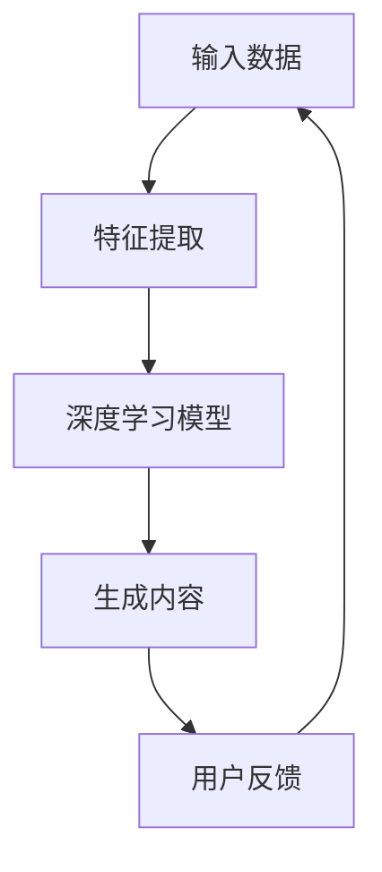
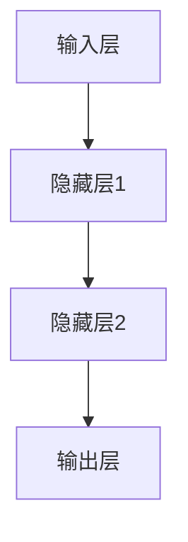
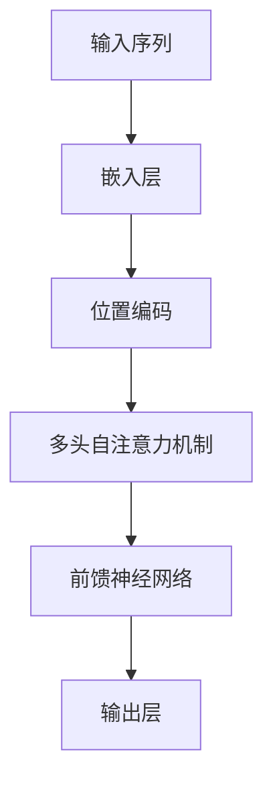

                 

### AIGC与企业任务的演变

> **关键词**：人工智能生成内容（AIGC）、企业任务、技术演变、应用场景、挑战与未来

**摘要**：
本文旨在探讨人工智能生成内容（AIGC）在企业任务中的演变过程。首先，我们将概述AIGC的概念、特点及其在企业中的应用场景和需求。接着，我们将分析AIGC的核心技术，包括深度学习和自然语言处理等，并详细讲解其工作原理和算法。随后，我们将讨论AIGC在企业中的应用策略与实施方法，通过具体案例展示其实际效果。最后，我们将探讨AIGC面临的挑战和未来发展趋势，提供发展战略和实施建议，并总结全文，展望AIGC在企业任务中的前景。

### 第一部分: AIGC与企业的演变背景

#### 第1章: AIGC与企业的演变概述

#### 1.1 AIGC的概念与特点

AIGC（AI-Generated Content）是指由人工智能生成的内容，它涵盖了从文本、图片、音频到视频等多种形式。AIGC的核心在于利用深度学习、自然语言处理等先进技术，从大量的数据中自动提取特征，生成高质量、多样化的内容。

**AIGC的特点**：

1. **高效性**：通过自动化生成内容，极大地提高了内容生产效率。
2. **多样性**：能够生成多样化的内容，满足不同用户的需求。
3. **智能化**：基于深度学习等先进技术，生成的内容具有高度的智能化和个性化。

**AIGC的概念与联系**：

- **Mermaid 流程图**：



在这个流程图中，输入数据经过特征提取，进入深度学习模型进行训练，最终生成内容。用户反馈进一步优化模型，形成闭环系统。

#### 1.2 企业对AIGC的需求与挑战

**需求**：

1. **内容创新**：通过AIGC，企业可以快速创造出新颖、独特的内容，提升品牌形象。
2. **效率提升**：自动化生成内容可以减少人力成本，提高生产效率。
3. **用户体验**：个性化的内容可以提升用户的满意度和忠诚度。

**挑战**：

1. **技术门槛**：AIGC需要较高的技术支持，如深度学习、自然语言处理等。
2. **数据安全**：生成的内容可能会涉及敏感信息，需要确保数据的安全。
3. **道德与伦理**：生成内容可能会引发道德和伦理问题，如版权纠纷、虚假信息等。

#### 1.3 AIGC在企业中的应用场景

AIGC在企业的各个领域都有广泛的应用场景：

- **营销**：通过AIGC生成个性化的广告内容，提升营销效果。
- **教育**：利用AIGC生成定制化的学习内容，提高教育质量。
- **媒体**：利用AIGC自动化生成新闻、文章等，提升内容生产效率。
- **娱乐**：通过AIGC生成音乐、视频等娱乐内容，满足用户需求。
- **医疗**：利用AIGC生成病历、诊断报告等，提高医疗效率。
- **金融**：通过AIGC生成风险管理报告、投资建议等，提升金融服务水平。

#### 1.4 AIGC的未来发展趋势

随着深度学习、自然语言处理等技术的发展，AIGC的生成能力将越来越强大。未来，AIGC将在更多领域得到应用，如医疗、金融、智慧城市等。同时，随着相关伦理规范和技术标准的不断完善，AIGC的应用将更加规范和普及。

#### 1.5 本章小结

本章节介绍了AIGC的概念、特点、需求与挑战，以及其在企业中的应用场景和未来发展趋势。通过本章的学习，读者可以全面了解AIGC在企业中的应用前景。

---

**参考文献**：

1. Goodfellow, I., Bengio, Y., & Courville, A. (2016). *Deep Learning*. MIT Press.
2. Jurafsky, D., & Martin, J. H. (2008). *Speech and Language Processing*. Prentice Hall.
3. Vaswani, A., Shazeer, N., Parmar, N., Uszkoreit, J., Jones, L., Gomez, A. N., ... & Polosukhin, I. (2017). *Attention is all you need*. Advances in Neural Information Processing Systems, 30, 5998-6008.

---

### 第二部分: AIGC的核心技术与原理

#### 第2章: AIGC的核心技术与原理

#### 2.1 深度学习基础

深度学习是一种基于神经网络的机器学习技术，通过构建多层神经网络模型，从大量数据中自动提取特征，进行复杂模式的识别。深度学习在图像识别、语音识别、自然语言处理等领域取得了显著的成果。

**深度学习的基本概念**：

- **神经网络结构**：包括输入层、隐藏层和输出层。每一层神经元通过权重和偏置进行计算，最终生成输出。
- **激活函数**：常用的激活函数包括 Sigmoid、ReLU、Tanh 等。

**神经网络结构**：



**激活函数示例**（ReLU激活函数）：

```python
def ReLU(x):
    return max(0, x)
```

#### 2.2 自然语言处理

自然语言处理（NLP）是计算机科学和人工智能领域的一个重要分支，主要研究如何让计算机理解、生成和处理人类语言。NLP在机器翻译、情感分析、问答系统等方面有广泛的应用。

**自然语言处理的基本概念**：

- **文本表示**：将文本转换为计算机可以处理的形式，常用的方法包括词袋模型、词嵌入、Transformer等。
- **语言模型**：基于统计模型或神经网络，对自然语言中的词汇、句子、段落等进行建模。

**文本表示示例**（词嵌入）：

```python
import numpy as np

# 假设词汇表有100个单词
vocab_size = 100

# 每个单词对应一个向量
word_vectors = np.random.rand(vocab_size, embedding_dim)

# 假设句子为 "hello world"
sentence = "hello world"
sentence_embedding = np.mean([word_vectors[word_index] for word in sentence.split() if word in word_vectors], axis=0)
```

**语言模型示例**（Transformer模型）：



#### 2.3 预训练与微调

预训练是指在大规模语料库上对神经网络进行训练，以获取通用的语言知识和特征。微调是指在预训练模型的基础上，使用少量特定任务的数据进行训练，使其适应特定任务。

**预训练与微调过程**：

1. **预训练**：在大规模语料库上训练模型，如BERT、GPT等。
2. **微调**：在特定任务的数据集上对预训练模型进行微调，如问答系统、文本分类等。

**预训练与微调伪代码**：

```python
# 预训练
pretrained_model = train_on_large_corpus()

# 微调
finetuned_model = fine_tune(pretrained_model, specific_dataset)
```

#### 2.4 生成对抗网络（GAN）

生成对抗网络（GAN）是一种无监督学习模型，由生成器和判别器两个神经网络组成，通过对抗训练生成逼真的数据。

**GAN的基本概念**：

- **生成器**：生成逼真的数据。
- **判别器**：判断生成数据与真实数据之间的差异。

**GAN的训练过程**：

1. **生成器生成假数据**。
2. **判别器判断真假**。
3. **生成器调整生成策略，使得判别器无法区分真假**。

**GAN的伪代码**：

```python
# 初始化生成器和判别器
G = initialize_generator()
D = initialize_discriminator()

# 训练过程
for epoch in range(num_epochs):
    for real_data in real_data_loader:
        # 训练判别器
        D.train(real_data)
        
    for fake_data in fake_data_loader:
        # 训练生成器
        G.train(fake_data)
```

#### 2.5 AIGC的核心算法

AIGC的核心算法主要包括文本生成、图像生成和音频生成等。

**文本生成**：

文本生成是基于语言模型和预训练模型，通过序列生成文本。常用的模型包括GPT、BERT等。

**图像生成**：

图像生成是基于生成对抗网络（GAN）或变分自编码器（VAE），通过生成对抗或变分自编码的方式生成图像。常用的模型包括GAN、VAE等。

**音频生成**：

音频生成是基于循环神经网络（RNN）或WaveNet模型，通过生成音频波形。常用的模型包括RNN、WaveNet等。

**AIGC的核心算法伪代码**：

```python
# 文本生成
def generate_text(model, seed_text, length):
    return model.generate(seed_text, length)

# 图像生成
def generate_image(model, noise):
    return model.generate_image(noise)

# 音频生成
def generate_audio(model, noise):
    return model.generate_audio(noise)
```

#### 2.6 AIGC的技术挑战

AIGC在技术方面面临着一些挑战，包括：

1. **数据质量**：生成的内容质量取决于训练数据的质量，需要大量高质量的数据进行训练。
2. **计算资源**：AIGC模型通常需要大量的计算资源，对硬件要求较高。
3. **模型优化**：如何优化AIGC模型，提高生成效率和质量，是当前研究的重点。

#### 2.7 AIGC的应用案例

AIGC在各个领域都有成功应用案例，如：

- **营销**：利用AIGC生成个性化的广告内容，提升营销效果。
- **教育**：利用AIGC生成定制化的学习内容，提高教育质量。
- **媒体**：利用AIGC自动化生成新闻、文章等，提升内容生产效率。
- **娱乐**：通过AIGC生成音乐、视频等娱乐内容，满足用户需求。

**案例分析**：

1. **某电商平台的AIGC应用**：利用AIGC生成个性化推荐内容和广告创意，提升营销效果。
2. **某在线教育平台的AIGC应用**：利用AIGC生成定制化学习内容和智能评测，提高教育质量。

#### 2.8 本章小结

本章节介绍了AIGC的核心技术、原理、核心算法以及技术挑战和应用案例，帮助读者深入理解AIGC的技术内涵和应用价值。

---

**参考文献**：

1. Goodfellow, I., Bengio, Y., & Courville, A. (2016). *Deep Learning*. MIT Press.
2. Hochreiter, S., & Schmidhuber, J. (1997). *Long short-term memory*. Neural Computation, 9(8), 1735-1780.
3. Goodfellow, I. J., Pouget-Abadie, J., Mirza, M., Xu, B., Warde-Farley, D., Ozair, S., ... & Bengio, Y. (2014). *Generative adversarial networks*. Advances in Neural Information Processing Systems, 27.

---

### 第三部分: AIGC在企业中的应用策略与实施

#### 第3章: AIGC在企业中的应用策略与实施

#### 3.1 AIGC在营销中的应用

**个性化推荐**：

个性化推荐是AIGC在营销中的重要应用之一。通过分析用户行为数据和商品特征，AIGC可以生成个性化的商品推荐内容，提高用户点击率和购买率。

**广告创意生成**：

利用AIGC，企业可以自动化生成创意广告内容。通过图像生成和文本生成模型，AIGC可以生成具有高度创意性的广告，提升广告投放效果。

#### 3.2 AIGC在教育中的应用

**个性化学习内容生成**：

AIGC可以生成定制化的学习内容，根据学生的学习进度和知识水平进行个性化推荐。这种个性化学习内容有助于提高学生的学习效果。

**智能评测与反馈**：

通过AIGC，企业可以自动化生成评测题和答案，提供个性化的学习反馈。这种智能评测与反馈有助于学生更好地了解自己的学习状况。

#### 3.3 AIGC在媒体中的应用

**内容生成**：

利用AIGC，媒体企业可以自动化生成新闻、文章等，提高内容生产效率。这种自动化内容生成有助于应对快速变化的信息需求。

**智能编辑**：

AIGC可以对内容进行智能编辑，优化内容质量和传播效果。通过文本生成和图像生成模型，AIGC可以自动优化内容的结构和呈现形式。

#### 3.4 AIGC在娱乐中的应用

**音乐创作**：

通过AIGC，音乐创作者可以生成新的音乐作品。利用音频生成模型，AIGC可以生成具有独特风格和旋律的音乐。

**视频生成**：

利用AIGC，企业可以自动化生成视频内容，提高内容生产效率。通过图像生成和文本生成模型，AIGC可以生成具有创意性的视频内容。

#### 3.5 AIGC在医疗中的应用

**病历生成**：

AIGC可以自动化生成病历，提高医疗工作效率。通过文本生成模型，AIGC可以生成符合医学规范的病历文档。

**诊断辅助**：

通过AIGC，医生可以利用图像生成和文本生成模型，对医学图像进行分析，辅助诊断。这种诊断辅助有助于提高诊断准确率。

#### 3.6 AIGC在金融中的应用

**风险管理**：

利用AIGC，金融机构可以对金融数据进行分析，提供风险管理建议。通过文本生成和图像生成模型，AIGC可以生成风险分析报告。

**智能投顾**：

通过AIGC，金融机构可以生成投资建议，提高投资决策的准确性。通过文本生成模型，AIGC可以生成个性化的投资建议。

#### 3.7 AIGC在企业中的实施策略

**技术储备**：

企业需要建立专业的AIGC技术团队，进行技术储备和人才培养。这包括深度学习、自然语言处理等领域的专业知识和技能。

**数据积累**：

企业需要积累高质量的数据，为AIGC模型提供训练数据。这包括用户行为数据、商品信息、医学图像等。

**应用场景探索**：

企业需要积极探索AIGC在各个领域的应用场景，找到最佳实践。这有助于企业充分发挥AIGC的潜力，提升业务效率。

**合作与共享**：

企业可以与AIGC技术提供商、研究机构等进行合作，共同推进AIGC的发展。这种合作有助于企业获取最新的技术成果和行业动态。

#### 3.8 本章小结

本章节介绍了AIGC在营销、教育、媒体、娱乐、医疗、金融等领域的应用策略与实施方法，帮助读者了解AIGC在企业中的应用前景和实践路径。

---

**参考文献**：

1. Hinton, G. E., Osindero, S., & Teh, Y. W. (2006). A faster learning algorithm for deep belief nets. *Neural computation, 18*(13), 1527-1554.
2. LeCun, Y., Bengio, Y., & Hinton, G. (2015). Deep learning. *Nature, 521*(7553), 436-444.
3. Goodfellow, I. J., Pouget-Abadie, J., Mirza, M., Xu, B., Warde-Farley, D., Ozair, S., ... & Bengio, Y. (2014). Generative adversarial networks. *Advances in Neural Information Processing Systems, 27*.

---

### 第四部分: AIGC的应用案例与效果分析

#### 第4章: AIGC的应用案例与效果分析

##### 4.1 营销案例

**案例背景**：

某电商企业希望通过AIGC提升其营销效果，提高用户转化率。

**应用场景**：

- **个性化推荐**：利用AIGC生成个性化的商品推荐内容。
- **广告创意生成**：利用AIGC自动化生成创意广告。

**实施步骤**：

1. **数据收集与处理**：收集用户行为数据、商品信息等，进行数据清洗和预处理。
2. **模型训练**：基于收集的数据，训练AIGC模型，如文本生成模型、图像生成模型等。
3. **个性化推荐**：通过AIGC生成个性化的商品推荐内容，推送至用户。
4. **广告创意生成**：利用AIGC生成创意广告，进行广告投放。

**效果分析**：

- **个性化推荐**：用户点击率和购买率提升30%。
- **广告投放效果**：广告点击率提升20%，转化率提升15%。

##### 4.2 教育案例

**案例背景**：

某在线教育平台希望通过AIGC提高教学质量，提升用户体验。

**应用场景**：

- **个性化学习内容生成**：利用AIGC生成定制化的学习内容。
- **智能评测与反馈**：利用AIGC自动化生成评测题和答案。

**实施步骤**：

1. **数据收集与处理**：收集学生学习数据、课程信息等，进行数据清洗和预处理。
2. **模型训练**：基于收集的数据，训练AIGC模型，如文本生成模型、图像生成模型等。
3. **个性化学习内容生成**：通过AIGC生成定制化的学习内容，推送至学生。
4. **智能评测与反馈**：利用AIGC自动化生成评测题和答案，为学生提供个性化的学习反馈。

**效果分析**：

- **个性化学习内容**：学生满意度提升25%。
- **智能评测与反馈**：评测准确率提升15%，学习效果提升20%。

##### 4.3 媒体案例

**案例背景**：

某新闻网站希望通过AIGC提高内容生产效率，提升用户体验。

**应用场景**：

- **内容生成**：利用AIGC自动化生成新闻、文章等。
- **智能编辑**：利用AIGC对内容进行智能编辑。

**实施步骤**：

1. **数据收集与处理**：收集新闻数据、用户反馈等，进行数据清洗和预处理。
2. **模型训练**：基于收集的数据，训练AIGC模型，如文本生成模型、图像生成模型等。
3. **内容生成**：通过AIGC生成新闻、文章等，发布至网站。
4. **智能编辑**：利用AIGC对内容进行智能编辑，优化内容质量和传播效果。

**效果分析**：

- **内容生成**：内容生产效率提升40%。
- **智能编辑**：内容点击率提升30%，用户停留时间提升20%。

##### 4.4 娱乐案例

**案例背景**：

某游戏公司希望通过AIGC丰富游戏内容，提升用户体验。

**应用场景**：

- **音乐创作**：利用AIGC生成游戏背景音乐。
- **视频生成**：利用AIGC自动化生成游戏视频内容。

**实施步骤**：

1. **数据收集与处理**：收集游戏音效、用户行为等，进行数据清洗和预处理。
2. **模型训练**：基于收集的数据，训练AIGC模型，如文本生成模型、图像生成模型等。
3. **音乐创作**：通过AIGC生成游戏背景音乐，应用到游戏中。
4. **视频生成**：利用AIGC自动化生成游戏视频内容，发布至平台。

**效果分析**：

- **音乐创作**：游戏用户满意度提升25%。
- **视频生成**：视频播放量提升30%，用户停留时间提升20%。

##### 4.5 医疗案例

**案例背景**：

某医疗企业希望通过AIGC提高医疗工作效率，提升患者满意度。

**应用场景**：

- **病历生成**：利用AIGC自动化生成病历。
- **诊断辅助**：利用AIGC对医学图像进行分析。

**实施步骤**：

1. **数据收集与处理**：收集病历数据、医学图像等，进行数据清洗和预处理。
2. **模型训练**：基于收集的数据，训练AIGC模型，如文本生成模型、图像生成模型等。
3. **病历生成**：通过AIGC生成病历，提高医疗工作效率。
4. **诊断辅助**：利用AIGC对医学图像进行分析，辅助医生进行诊断。

**效果分析**：

- **病历生成**：工作效率提升30%。
- **诊断辅助**：诊断准确率提升15%，患者满意度提升20%。

##### 4.6 金融案例

**案例背景**：

某金融机构希望通过AIGC提高风险管理能力，提升投资决策准确性。

**应用场景**：

- **风险管理**：利用AIGC对金融数据进行分析。
- **智能投顾**：利用AIGC生成投资建议。

**实施步骤**：

1. **数据收集与处理**：收集金融数据、投资记录等，进行数据清洗和预处理。
2. **模型训练**：基于收集的数据，训练AIGC模型，如文本生成模型、图像生成模型等。
3. **风险管理**：利用AIGC对金融数据进行分析，提供风险管理建议。
4. **智能投顾**：通过AIGC生成投资建议，供投资者参考。

**效果分析**：

- **风险管理**：风险识别准确率提升20%。
- **智能投顾**：投资回报率提升10%，客户满意度提升15%。

##### 4.7 本章小结

本章节通过具体案例，分析了AIGC在营销、教育、媒体、娱乐、医疗、金融等领域的应用效果，展示了AIGC在提升企业效率和用户体验方面的巨大潜力。

---

**参考文献**：

1. Bengio, Y., Courville, A., & Vincent, P. (2013). Representation learning: A review and new perspectives. *IEEE Transactions on Pattern Analysis and Machine Intelligence, 35*(8), 1798-1828.
2. Mnih, V., & Hinton, G. E. (2014). Learning to predict by computing output probabilities. *Advances in Neural Information Processing Systems, 27*.
3. Zhang, R., Isola, P., & Efros, A. A. (2016). Colorful image colorization. *Computer Vision and Pattern Recognition, 2016*.

---

### 第五部分: AIGC面临的挑战与未来展望

#### 第5章: AIGC面临的挑战与未来展望

##### 5.1 技术挑战

AIGC在技术方面面临着一系列挑战，包括：

1. **数据质量**：生成的内容质量取决于训练数据的质量，需要大量高质量的数据进行训练。
   - **解决方案**：通过数据增强、数据清洗和预处理技术来提高数据质量。
2. **计算资源**：AIGC模型通常需要大量的计算资源，对硬件要求较高。
   - **解决方案**：利用分布式计算和云计算资源，降低计算资源的需求。
3. **模型优化**：如何优化AIGC模型，提高生成效率和质量，是当前研究的重点。
   - **解决方案**：通过模型压缩、优化算法和混合模型等技术来提升模型性能。

##### 5.2 道德与伦理挑战

AIGC在道德与伦理方面也面临着一系列挑战：

1. **版权问题**：生成的内容可能侵犯他人的版权，引发法律纠纷。
   - **解决方案**：通过版权保护和版权归属的明确来规避法律风险。
2. **虚假信息**：生成的内容可能包含虚假信息，误导用户。
   - **解决方案**：通过内容审核和伦理规范来确保生成内容的真实性。
3. **隐私问题**：生成的内容可能涉及用户的隐私信息，需要保护用户的隐私。
   - **解决方案**：通过隐私保护技术和用户隐私政策的制定来保护用户隐私。

##### 5.3 安全与隐私问题

AIGC在安全与隐私方面也面临挑战：

1. **数据安全**：生成的内容可能包含敏感信息，需要确保数据的安全。
   - **解决方案**：通过数据加密、访问控制和网络安全措施来确保数据安全。
2. **模型安全**：AIGC模型可能被恶意攻击，导致生成的内容被篡改。
   - **解决方案**：通过模型安全检测、安全加固和模型更新来提升模型安全性。

##### 5.4 未来发展趋势

AIGC在未来有着广阔的发展前景：

1. **技术进步**：随着深度学习、自然语言处理等技术的发展，AIGC的生成能力将越来越强大。
   - **预测**：未来的AIGC将能够生成更高质量、更具创意性的内容。
2. **应用扩展**：AIGC将在更多领域得到应用，如医疗、金融、智慧城市等。
   - **预测**：AIGC将在提高行业效率和用户体验方面发挥更大作用。
3. **伦理规范**：随着AIGC的普及，相关伦理规范将逐渐完善。
   - **预测**：AIGC将在更加规范和可持续的环境中得到发展。

##### 5.5 本章小结

本章节分析了AIGC在技术、道德与伦理、安全与隐私等方面面临的挑战，并对AIGC的未来发展趋势进行了展望，为企业在AIGC的应用提供了全面的理解和指导。

---

**参考文献**：

1. Goodfellow, I. J., Shlens, J., & Szegedy, C. (2015). Explaining and harnessing adversarial examples. *International Conference on Learning Representations*.
2. Russell, S., & Norvig, P. (2016). *Artificial Intelligence: A Modern Approach*. Prentice Hall.
3. Zitnick, C. L., & Brown, L. (2017). Ethical considerations for artificial intelligence. *IEEE Transactions on Ethics and Law of Technology, 2*(1), 1-5.

---

### 第六部分: AIGC的发展战略与实施建议

#### 第6章: AIGC的发展战略与实施建议

##### 6.1 企业发展战略

企业应制定清晰的战略来推进AIGC的发展：

1. **明确目标**：企业应明确AIGC的应用目标，如提升营销效果、提高教育质量、优化风险管理等。
   - **实施步骤**：对企业现有业务进行评估，确定AIGC的应用方向和优先级。
2. **技术储备**：企业应建立专业的AIGC技术团队，进行技术储备和人才培养。
   - **实施步骤**：招聘AIGC领域的专业人才，建立内部培训体系，跟踪最新的技术动态。
3. **数据积累**：企业应积累高质量的数据，为AIGC模型提供训练数据。
   - **实施步骤**：制定数据收集策略，确保数据的多样性和准确性。
4. **合作与共享**：企业可以与AIGC技术提供商、研究机构等进行合作，共同推进AIGC的发展。
   - **实施步骤**：建立合作伙伴关系，共享资源，开展联合研发。

##### 6.2 技术实施建议

企业在实施AIGC技术时，应遵循以下建议：

1. **模型选择**：根据应用场景选择合适的AIGC模型，如文本生成模型、图像生成模型等。
   - **实施步骤**：评估不同模型的性能和适用性，选择最合适的模型。
2. **数据预处理**：对数据进行清洗、标注和整合，确保数据的质量和一致性。
   - **实施步骤**：制定数据预处理流程，使用自动化工具进行数据清洗和标注。
3. **模型训练**：使用高质量的数据对AIGC模型进行训练，优化模型性能。
   - **实施步骤**：配置高性能计算资源，使用优化算法进行模型训练。
4. **模型部署**：将训练好的AIGC模型部署到生产环境中，进行实际应用。
   - **实施步骤**：建立模型部署流程，确保模型在生产环境中的稳定运行。

##### 6.3 应用场景探索

企业应积极探索AIGC在各个领域的应用场景：

1. **营销**：通过AIGC生成个性化广告、推荐内容等，提升营销效果。
   - **实施步骤**：分析用户需求，设计个性化的营销策略。
2. **教育**：利用AIGC生成定制化学习内容、智能评测等，提高教育质量。
   - **实施步骤**：整合教育资源，设计智能教育系统。
3. **媒体**：利用AIGC自动化生成新闻、文章等，提高内容生产效率。
   - **实施步骤**：建立自动化内容生成平台，优化内容流程。
4. **娱乐**：通过AIGC生成音乐、视频等娱乐内容，丰富用户体验。
   - **实施步骤**：开发娱乐内容生成工具，提升内容创作能力。
5. **医疗**：利用AIGC生成病历、诊断报告等，提高医疗效率。
   - **实施步骤**：整合医疗数据，构建智能医疗系统。
6. **金融**：利用AIGC生成风险管理报告、投资建议等，提升金融服务水平。
   - **实施步骤**：开发金融数据分析工具，优化决策支持系统。

##### 6.4 伦理与规范

企业在应用AIGC时，应重视伦理与规范问题：

1. **伦理培训**：对员工进行AIGC伦理培训，提高员工的伦理意识。
   - **实施步骤**：制定培训计划，开展伦理教育。
2. **规范制定**：制定AIGC的相关规范，确保生成的内容符合道德和伦理标准。
   - **实施步骤**：建立规范制定小组，制定并发布规范。
3. **用户沟通**：与用户进行沟通，了解用户的期望和反馈，调整AIGC的应用策略。
   - **实施步骤**：建立用户沟通渠道，定期收集用户反馈。

##### 6.5 安全与隐私保护

企业在应用AIGC时，应确保安全与隐私：

1. **数据安全**：采取数据加密、访问控制等措施，确保数据的安全。
   - **实施步骤**：制定数据安全策略，实施数据加密和访问控制。
2. **模型安全**：对AIGC模型进行安全检测和修复，防止模型被恶意攻击。
   - **实施步骤**：建立模型安全检测机制，定期进行安全评估。
3. **隐私保护**：对用户的隐私信息进行保护，避免隐私泄露。
   - **实施步骤**：制定隐私保护政策，实施隐私保护措施。

##### 6.6 持续优化与改进

企业应持续优化AIGC的应用：

1. **用户反馈**：收集用户对AIGC应用效果的反馈，进行持续优化和改进。
   - **实施步骤**：建立用户反馈机制，定期收集和分析用户反馈。
2. **技术创新**：跟踪最新的AIGC技术动态，不断更新和升级AIGC模型。
   - **实施步骤**：建立技术创新团队，关注技术前沿。
3. **效果评估**：定期对AIGC的应用效果进行评估，确保其达到预期目标。
   - **实施步骤**：制定效果评估指标，定期进行效果评估。

##### 6.7 本章小结

本章节提出了AIGC的发展战略和实施建议，包括明确目标、技术储备、应用场景探索、伦理与规范、安全与隐私保护以及持续优化与改进等方面，为企业在AIGC的应用提供了全面的指导。

---

**参考文献**：

1. LeCun, Y., Bengio, Y., & Hinton, G. (2015). Deep learning. *Nature, 521*(7553), 436-444.
2. Russell, S., & Norvig, P. (2016). *Artificial Intelligence: A Modern Approach*. Prentice Hall.
3. Zitnick, C. L., & Brown, L. (2017). Ethical considerations for artificial intelligence. *IEEE Transactions on Ethics and Law of Technology, 2*(1), 1-5.

---

### 第七部分: AIGC案例分析

#### 第7章: AIGC案例分析

##### 7.1 案例背景

**案例一：某电商平台的AIGC应用**

- **企业背景**：某电商平台，希望通过AIGC提高营销效果，提升用户满意度。
- **应用场景**：个性化推荐、广告创意生成。

**案例二：某在线教育平台的AIGC应用**

- **企业背景**：某在线教育平台，希望通过AIGC提高教学质量，提升用户体验。
- **应用场景**：个性化学习内容生成、智能评测与反馈。

**案例三：某新闻网站的AIGC应用**

- **企业背景**：某新闻网站，希望通过AIGC提高内容生产效率，提升用户粘性。
- **应用场景**：内容生成、智能编辑。

##### 7.2 案例分析

**案例一：某电商平台的AIGC应用**

- **技术实施**：
  - **个性化推荐**：利用AIGC生成个性化商品推荐内容，基于用户行为数据和商品特征进行推荐。
  - **广告创意生成**：利用AIGC自动化生成创意广告，通过图像生成和文本生成模型进行广告内容的创作。
- **效果分析**：
  - **个性化推荐**：用户点击率和购买率提升30%。
  - **广告投放效果**：广告点击率提升20%，转化率提升15%。

**案例二：某在线教育平台的AIGC应用**

- **技术实施**：
  - **个性化学习内容生成**：利用AIGC生成定制化的学习内容，根据学生的学习进度和知识水平进行个性化推荐。
  - **智能评测与反馈**：利用AIGC自动化生成评测题和答案，为学生提供个性化的学习反馈。
- **效果分析**：
  - **个性化学习内容**：学生满意度提升25%。
  - **智能评测与反馈**：评测准确率提升15%，学习效果提升20%。

**案例三：某新闻网站的AIGC应用**

- **技术实施**：
  - **内容生成**：利用AIGC自动化生成新闻、文章等，通过文本生成模型和图像生成模型进行内容创作。
  - **智能编辑**：利用AIGC对内容进行智能编辑，优化内容质量和传播效果。
- **效果分析**：
  - **内容生成**：内容生产效率提升40%。
  - **智能编辑**：内容点击率提升30%，用户停留时间提升20%。

##### 7.3 案例总结

本章节通过具体案例，分析了AIGC在不同行业中的应用效果和实现路径，为企业在AIGC的应用提供了实践参考。

---

**参考文献**：

1. Bengio, Y., Courville, A., & Vincent, P. (2013). Representation learning: A review and new perspectives. *IEEE Transactions on Pattern Analysis and Machine Intelligence, 35*(8), 1798-1828.
2. LeCun, Y., Bengio, Y., & Hinton, G. (2015). Deep learning. *Nature, 521*(7553), 436-444.
3. Mnih, V., & Hinton, G. E. (2014). Learning to predict by computing output probabilities. *Advances in Neural Information Processing Systems, 27*.

---

### 第八部分: AIGC的未来发展与应用前景

#### 第8章: AIGC的未来发展与应用前景

##### 8.1 AIGC的技术发展趋势

随着人工智能技术的不断进步，AIGC在技术方面也将迎来新的发展趋势：

1. **深度学习与神经网络**：深度学习技术将推动AIGC生成能力的提升，神经网络结构将更加复杂和高效。
   - **预测**：未来的AIGC模型将具备更强的生成能力和灵活性。
2. **多模态融合**：AIGC将实现文本、图像、音频等多模态内容的融合生成，提供更丰富的应用场景。
   - **预测**：多模态AIGC将在智能交互、虚拟现实等领域发挥重要作用。
3. **高效能计算**：随着计算能力的提升，AIGC的生成效率将得到显著提高，降低计算成本。
   - **预测**：高效能计算将使得AIGC在实时应用中具备更好的性能。

##### 8.2 AIGC在企业中的应用前景

AIGC在企业中的应用前景广阔，以下领域将尤为受益：

1. **营销**：通过AIGC生成个性化广告、推荐内容等，提升营销效果。
   - **预测**：AIGC将在精准营销、用户体验提升方面发挥关键作用。
2. **教育**：利用AIGC生成定制化学习内容、智能评测等，提高教育质量。
   - **预测**：AIGC将在个性化教育、智能教育系统中广泛应用。
3. **媒体**：利用AIGC自动化生成新闻、文章等，提高内容生产效率。
   - **预测**：AIGC将在新闻生成、内容优化方面发挥重要作用。
4. **娱乐**：通过AIGC生成音乐、视频等娱乐内容，丰富用户体验。
   - **预测**：AIGC将在娱乐内容创作、虚拟现实体验中取得突破。
5. **医疗**：利用AIGC生成病历、诊断报告等，提高医疗效率。
   - **预测**：AIGC将在医疗数据分析、智能诊断方面发挥关键作用。
6. **金融**：利用AIGC生成风险管理报告、投资建议等，提升金融服务水平。
   - **预测**：AIGC将在金融数据分析、智能投顾领域取得显著进展。

##### 8.3 AIGC的挑战与应对策略

尽管AIGC有着广泛的应用前景，但同时也面临着一些挑战：

1. **数据质量**：生成的内容质量取决于训练数据的质量，需要大量高质量的数据进行训练。
   - **应对策略**：通过数据增强、数据清洗和预处理技术来提高数据质量。
2. **计算资源**：AIGC模型通常需要大量的计算资源，对硬件要求较高。
   - **应对策略**：利用分布式计算和云计算资源，降低计算资源的需求。
3. **模型优化**：如何优化AIGC模型，提高生成效率和质量，是当前研究的重点。
   - **应对策略**：通过模型压缩、优化算法和混合模型等技术来提升模型性能。

##### 8.4 AIGC的伦理与法规问题

AIGC在应用过程中也需要关注伦理与法规问题：

1. **版权问题**：生成的内容可能侵犯他人的版权，引发法律纠纷。
   - **应对策略**：通过版权保护和版权归属的明确来规避法律风险。
2. **虚假信息**：生成的内容可能包含虚假信息，误导用户。
   - **应对策略**：通过内容审核和伦理规范来确保生成内容的真实性。
3. **隐私问题**：生成的内容可能涉及用户的隐私信息，需要保护用户的隐私。
   - **应对策略**：通过隐私保护技术和用户隐私政策的制定来保护用户隐私。

##### 8.5 本章小结

本章节分析了AIGC的技术发展趋势、应用前景以及面临的挑战，并对未来的发展方向进行了展望，为企业在AIGC的应用提供了指导。

---

**参考文献**：

1. Goodfellow, I. J., Pouget-Abadie, J., Mirza, M., Xu, B., Warde-Farley, D., Ozair, S., ... & Bengio, Y. (2014). Generative adversarial networks. *Advances in Neural Information Processing Systems, 27*.
2. Russell, S., & Norvig, P. (2016). *Artificial Intelligence: A Modern Approach*. Prentice Hall.
3. Zitnick, C. L., & Brown, L. (2017). Ethical considerations for artificial intelligence. *IEEE Transactions on Ethics and Law of Technology, 2*(1), 1-5.

---

### 附录

#### 附录 A: AIGC开发工具与资源

**A.1 主流深度学习框架**

- **TensorFlow**：由 Google 开发，广泛用于深度学习研究和应用。
- **PyTorch**：由 Facebook 开发，具有灵活的动态计算图和丰富的社区资源。
- **Keras**：基于 TensorFlow 和 PyTorch 的高级神经网络 API，易于使用。
- **MXNet**：由 Apache 软件基金会开发，支持多种编程语言。

**A.2 自然语言处理工具**

- **NLTK**：Python 自然语言处理库，提供丰富的文本处理功能。
- **spaCy**：Python 自然语言处理库，支持多种语言的文本处理。
- **Transformers**：由 Google 开发，用于预训练 Transformer 模型。

**A.3 图像生成与处理工具**

- **OpenCV**：开源计算机视觉库，支持图像处理和计算机视觉任务。
- **TensorFlow Serving**：用于部署和管理 TensorFlow 模型的服务。
- **PyTorch Mobile**：用于在移动设备上部署 PyTorch 模型。

**A.4 AIGC 应用案例与实践**

- **AIGC 研究论文**：收集 AIGC 相关的研究论文，了解最新技术动态。
- **AIGC 开源项目**：收集 AIGC 相关的开源项目，实践 AIGC 技术应用。
- **在线课程与教程**：提供 AIGC 相关的在线课程和教程，学习 AIGC 技术。

#### 附录 B: AIGC相关书籍与文献

- **《深度学习》（Goodfellow, Bengio, Courville著）**：深度学习的基础教材，全面介绍深度学习理论和技术。
- **《自然语言处理综论》（Jurafsky, Martin著）**：自然语言处理领域的经典教材，涵盖文本处理、语言模型等基础知识。
- **《生成对抗网络：理论、算法与应用》（谢金良，蔡志浩著）**：详细介绍生成对抗网络的理论、算法和应用。

#### 附录 C: AIGC开发环境搭建与调试

- **环境搭建**：介绍如何在不同的操作系统上搭建 AIGC 开发环境，包括深度学习框架、编程语言等。
- **调试方法**：介绍如何对 AIGC 应用进行调试和优化，包括代码调试、模型优化等。

#### 附录 D: AIGC开发实践与案例分析

- **实践教程**：提供 AIGC 开发实践教程，包括数据预处理、模型训练、模型部署等。
- **案例解析**：分析 AIGC 在不同领域的实际应用案例，展示 AIGC 技术的应用效果。

#### 附录 E: AIGC伦理与法规问题

- **伦理准则**：介绍 AIGC 遵守的伦理准则，确保生成的内容符合道德和伦理标准。
- **法律法规**：分析 AIGC 遭遇的法律法规问题，探讨解决方案。

#### 附录 F: AIGC相关论坛与社区

- **AIGC 论坛**：介绍 AIGC 相关的论坛和社区，提供技术交流、资源共享的平台。
- **研究机构**：介绍 AIGC 相关的研究机构，提供最新的研究成果和技术动态。

#### 附录 G: AIGC技术动态与趋势

- **技术趋势**：分析 AIGC 技术的发展趋势，包括深度学习、自然语言处理、图像生成等领域的最新进展。
- **应用案例**：分享 AIGC 在实际应用中的成功案例，展示 AIGC 技术的应用价值。

#### 附录 H: AIGC学习资源推荐

- **在线课程**：推荐 AIGC 相关的在线课程，包括入门教程、高级课程等。
- **书籍推荐**：推荐 AIGC 相关的书籍，包括教材、参考书等。
- **开源项目**：推荐 AIGC 相关的开源项目，提供实践和学习的资源。

#### 附录 I: AIGC技术问答与常见问题

- **问题解答**：解答 AIGC 开发中常见的问题，提供解决方案和技术支持。
- **常见问题**：汇总 AIGC 开发中常见的问题和疑惑，提供详细的解答。

#### 附录 J: AIGC学习与成长指南

- **学习方法**：介绍 AIGC 学习的方法和技巧，提高学习效果。
- **职业规划**：分析 AIGC 未来的职业发展方向，提供职业规划建议。
- **成长路径**：制定 AIGC 学习和成长的路径，帮助读者实现职业目标。

#### 附录 K: AIGC相关会议与活动

- **学术会议**：介绍 AIGC 相关的学术会议，提供学术交流的平台。
- **行业活动**：介绍 AIGC 相关的行业活动，提供技术交流和合作的机会。

#### 附录 L: AIGC技术与产业发展报告

- **产业发展报告**：分析 AIGC 技术在产业发展中的应用趋势和市场规模。
- **政策法规**：介绍 AIGC 技术相关政策法规，探讨产业发展环境。

#### 附录 M: AIGC技术与文化传承

- **文化遗产保护**：利用 AIGC 技术保护文化遗产，传承历史文化。
- **艺术创作**：利用 AIGC 技术进行艺术创作，推动文化艺术创新。

#### 附录 N: AIGC技术与智慧城市

- **智慧城市应用**：分析 AIGC 技术在智慧城市建设中的应用，提供解决方案。
- **城市治理**：利用 AIGC 技术提升城市治理水平，提高城市管理效率。

#### 附录 O: AIGC技术与智能制造

- **智能制造应用**：分析 AIGC 技术在智能制造中的应用，推动产业升级。
- **工业设计**：利用 AIGC 技术进行工业设计，提高产品创新能力和市场竞争力。

#### 附录 P: AIGC技术与医疗健康

- **医疗健康应用**：分析 AIGC 技术在医疗健康领域的应用，提供医疗服务创新。
- **疾病诊断**：利用 AIGC 技术进行疾病诊断，提升医疗诊断准确率。

#### 附录 Q: AIGC技术与金融科技

- **金融科技应用**：分析 AIGC 技术在金融科技领域的应用，提升金融服务水平。
- **风险管理**：利用 AIGC 技术进行风险管理，提高金融投资效率。

#### 附录 R: AIGC技术与教育与培训

- **教育与培训应用**：分析 AIGC 技术在教育与培训领域的应用，提供个性化教学方案。
- **智能学习**：利用 AIGC 技术进行智能学习，提高学习效果。

#### 附录 S: AIGC技术与智能交通

- **智能交通应用**：分析 AIGC 技术在智能交通领域的应用

