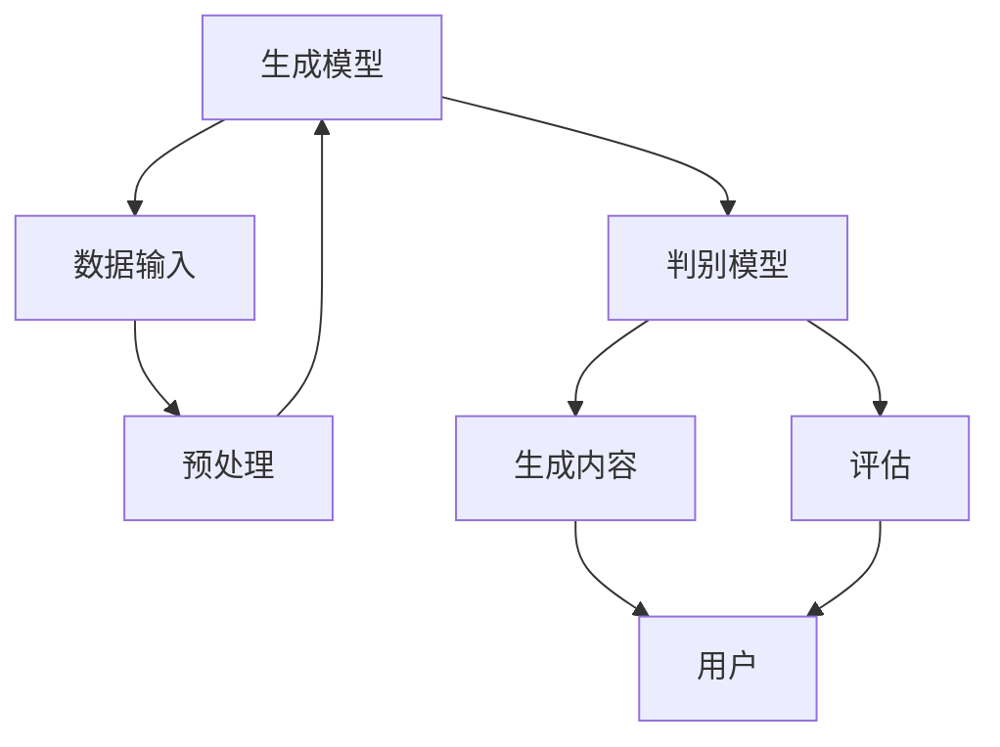

                 

# 《AIGC从入门到实战：历史上人工智能科学发展史的三个阶段》

> 关键词：人工智能、AIGC、深度学习、自然语言处理、计算机视觉、机器学习

> 摘要：本文系统地回顾了人工智能科学的发展历史，详细阐述了人工智能的三个发展阶段，包括规则推理与知识表示、基于统计与机器学习的方法、以及最新的AIGC（AI-Generated Content）概念。通过对各阶段的核心技术和应用领域的深入分析，本文旨在为读者提供一个清晰的人工智能科学发展脉络，并引导读者深入了解AIGC的基础原理、核心算法及其在各领域的实际应用。

## 目录大纲

### 第一部分: 历史回顾

### 第二部分: 核心概念与联系

### 第三部分: 实践应用

### 附录

### 作者

---

### 第一部分: 历史回顾

#### 第1章: 人工智能的概念与历史

##### 1.1 人工智能的起源

##### 1.2 第一阶段：规则推理与知识表示

##### 1.3 第二阶段：基于统计与机器学习的方法

##### 1.4 第三阶段：AIGC的概念与兴起

#### 第2章: 人工智能的主要领域

##### 2.1 机器学习

##### 2.2 自然语言处理

##### 2.3 计算机视觉

---

### 第二部分: 核心概念与联系

#### 第3章: AIGC的基础原理

##### 3.1 AIGC的定义与特点

##### 3.2 AIGC的技术架构

##### 3.3 AIGC与深度学习的联系

#### 第4章: AIGC的核心算法原理

##### 4.1 循环神经网络（RNN）

##### 4.2 长短时记忆网络（LSTM）

##### 4.3 生成对抗网络（GAN）

---

### 第三部分: 实践应用

#### 第5章: AIGC在自然语言处理中的应用

##### 5.1 语言模型训练与评估

##### 5.2 机器翻译系统

#### 第6章: AIGC在计算机视觉中的应用

##### 6.1 图像生成与编辑

##### 6.2 视觉增强与生成

#### 第7章: AIGC在跨领域融合中的应用

##### 7.1 多模态学习

##### 7.2 AIGC在其他领域的应用探索

---

### 附录

#### 附录A: AIGC工具与资源

#### 附录B: AIGC项目实战案例

#### 附录C: AIGC算法原理详解

---

### 作者

作者：AI天才研究院/AI Genius Institute & 禅与计算机程序设计艺术/Zen And The Art of Computer Programming

---

### 第一部分: 历史回顾

#### 第1章: 人工智能的概念与历史

##### 1.1 人工智能的起源

人工智能（Artificial Intelligence，简称AI）起源于20世纪50年代，最初的目标是为计算机赋予智能，使其能够完成人类通常需要智能的任务，如视觉识别、语言理解、决策制定等。1950年，艾伦·图灵（Alan Turing）提出了图灵测试，成为人工智能领域的理论基础。图灵测试旨在判断机器是否具备智能，如果一个机器能够在对话中表现得像一个人类，以至于评估者无法区分其是机器还是人类，那么这台机器就被认为是具有智能的。

在这一背景下，1956年，达特茅斯会议（Dartmouth Conference）被认为是人工智能诞生的标志。会议的参与者们共同探讨了人工智能的可能性，并提出了一系列研究问题，如机器能否学习、能否理解自然语言等。这一时期，人工智能研究主要集中在规则推理和知识表示上，即通过编码一系列规则来让机器完成特定任务。

##### 1.2 第一阶段：规则推理与知识表示

人工智能的第一阶段，通常被称为“知识驱动”阶段，其核心思想是利用专家知识来构建智能系统。这一阶段的研究主要集中在知识表示、知识获取和推理算法上。知识表示方法包括产生式规则、框架表示、语义网络等。产生式规则是一种表示知识的方法，它通过条件-行动对来描述知识。例如：

```
如果温度大于30度，则开空调。
```

推理算法则用于根据已知事实推导出新的结论。在这一阶段，专家系统的出现标志着这一阶段的巅峰。专家系统是一种基于知识的系统，它通过模拟人类专家的推理过程来解决复杂问题。

然而，这一阶段的局限性也逐渐显现。首先，知识获取是一个费时且劳动密集的过程，需要大量的人力来编码规则和知识。其次，规则推理方法在面对复杂和不确定的情况时表现不佳。因此，人工智能领域开始寻找新的方法，从而进入了第二阶段。

##### 1.3 第二阶段：基于统计与机器学习的方法

人工智能的第二阶段，也被称为“数据驱动”阶段，其核心思想是利用大量数据来训练模型，使其自动学习并完成特定任务。这一阶段的研究主要集中在机器学习算法上，如决策树、支持向量机、神经网络等。

机器学习是一种让计算机通过学习数据来提高性能的技术。它分为监督学习、无监督学习和半监督学习。监督学习是一种在有标签数据集上训练模型的方法，如分类和回归任务。无监督学习则是在没有标签数据的情况下，通过发现数据中的结构和模式来进行学习，如聚类和降维。半监督学习则介于两者之间，它利用一部分有标签数据和大量无标签数据来训练模型。

神经网络是这一阶段最为重要的技术之一。神经网络是一种模拟人脑神经元连接的结构，通过层层传递信息来学习和处理数据。1990年代，反向传播算法（Backpropagation）的提出，使得神经网络训练变得更加高效。然而，神经网络在处理大型数据和复杂任务时仍存在一些挑战，如训练速度慢、容易过拟合等。

随着计算能力的提升和大数据技术的发展，机器学习算法在图像识别、自然语言处理、语音识别等领域取得了显著成果。这一阶段的另一个重要进展是深度学习的兴起。深度学习是一种多层神经网络，通过逐层提取特征，实现了对复杂数据的建模。2012年，AlexNet在ImageNet图像识别挑战赛中取得了突破性成果，标志着深度学习的崛起。

##### 1.4 第三阶段：AIGC的概念与兴起

人工智能的第三阶段，即AIGC（AI-Generated Content）阶段，标志着人工智能从被动学习数据到主动生成内容的转变。AIGC的核心思想是利用人工智能技术来生成或创作各种类型的内容，如图像、视频、文本、音乐等。这一阶段的兴起，得益于深度学习和生成对抗网络（GAN）的发展。

生成对抗网络（GAN）是一种由生成器和判别器组成的人工神经网络结构。生成器的目标是生成与真实数据相似的数据，而判别器的目标是区分真实数据和生成数据。通过这种对抗训练，生成器逐渐学会生成更加逼真的数据。

AIGC的应用领域广泛，如计算机视觉中的图像生成和编辑、自然语言处理中的文本生成和翻译、音频处理中的音乐生成等。AIGC不仅提高了内容创作的效率，还带来了新的艺术形式和商业模式。

总的来说，人工智能的发展经历了从规则推理与知识表示、基于统计与机器学习的方法，到AIGC的三个阶段。每个阶段都有其独特的核心技术和发展方向，共同推动了人工智能的进步。在接下来的章节中，我们将进一步探讨人工智能的主要领域，以及AIGC的基础原理和核心算法。

---

#### 第2章: 人工智能的主要领域

##### 2.1 机器学习

机器学习是人工智能的一个重要分支，其核心思想是通过训练算法从数据中学习规律，从而实现智能行为。机器学习主要分为监督学习、无监督学习和半监督学习。

###### 2.1.1 监督学习

监督学习是一种在有标签数据集上训练模型的方法。标签数据是对输入数据进行标记的结果，如分类标签或数值标签。监督学习的目标是通过已知的输入和输出，训练出一个预测模型，用于对新数据进行预测。

监督学习的主要算法包括线性回归、逻辑回归、支持向量机（SVM）、决策树、随机森林等。线性回归是一种用于预测连续值的模型，逻辑回归是一种用于预测离散值的模型。支持向量机是一种基于间隔最大化的分类算法，而决策树和随机森林则是基于树结构的分类和回归算法。

以下是一个简单的线性回归模型的伪代码：

```
// 线性回归模型
def linear_regression(X, y):
    # 初始化模型参数
    w = np.random.randn(X.shape[1])
    b = 0

    # 梯度下降
    for i in range(epochs):
        # 计算预测值
        y_pred = X.dot(w) + b

        # 计算损失函数
        loss = (y - y_pred)**2

        # 计算梯度
        dw = X.T.dot(y - y_pred)
        db = np.sum(y - y_pred)

        # 更新模型参数
        w -= learning_rate * dw
        b -= learning_rate * db

    return w, b
```

###### 2.1.2 无监督学习

无监督学习是一种在没有标签数据的情况下，通过发现数据中的结构和模式来进行学习的方法。无监督学习的主要算法包括聚类、降维、关联规则等。

聚类是一种将相似的数据点归为同一类别的算法，如K-means聚类、层次聚类等。降维是一种将高维数据映射到低维空间的方法，如主成分分析（PCA）、线性判别分析（LDA）等。关联规则是一种用于发现数据之间关联关系的算法，如Apriori算法、FP-growth算法等。

以下是一个简单的K-means聚类算法的伪代码：

```
// K-means聚类
def k_means(X, k, max_iters):
    # 初始化聚类中心
    centroids = X[np.random.choice(X.shape[0], k, replace=False)]

    for i in range(max_iters):
        # 计算每个数据点与聚类中心的距离
        distances = np.linalg.norm(X - centroids, axis=1)

        # 分配数据点到最近的聚类中心
        labels = np.argmin(distances, axis=1)

        # 更新聚类中心
        new_centroids = np.array([X[labels == j].mean(axis=0) for j in range(k)])

        # 判断是否收敛
        if np.linalg.norm(new_centroids - centroids) < tol:
            break

        centroids = new_centroids

    return centroids, labels
```

###### 2.1.3 半监督学习

半监督学习是一种在有部分标签数据和大量无标签数据的情况下，通过利用无标签数据来提高模型性能的方法。半监督学习的主要算法包括自我训练、图半监督学习等。

自我训练是一种基于未标记数据的训练方法，它通过迭代地利用未标记数据来更新模型，从而提高模型的泛化能力。图半监督学习是一种利用图结构来表示数据之间的关联关系，从而在无标签数据上训练模型的算法。

##### 2.2 自然语言处理

自然语言处理（Natural Language Processing，简称NLP）是人工智能在处理自然语言方面的一项重要应用。NLP的目标是将自然语言文本转化为计算机可以理解和处理的形式，从而实现语言的理解、生成、翻译等任务。

###### 2.2.1 语言模型

语言模型是一种用于预测下一个单词或字符的概率分布的模型，它是NLP的基础。语言模型可以分为基于统计的和基于神经网络的两种。基于统计的语言模型，如N-gram模型，通过统计相邻单词或字符的频率来预测下一个单词或字符。基于神经网络的语言模型，如循环神经网络（RNN）和长短时记忆网络（LSTM），通过学习序列数据中的长期依赖关系来提高预测性能。

以下是一个简单的N-gram模型的伪代码：

```
// N-gram模型
def n_gram_model(text, n):
    # 创建一个空的词汇表
    vocabulary = set()

    # 遍历文本，添加单词到词汇表
    for i in range(len(text) - n + 1):
        word = text[i:i + n]
        vocabulary.add(word)

    # 创建一个空的模型
    model = defaultdict(list)

    # 遍历文本，为每个n-gram添加前一个n-gram
    for i in range(len(text) - n + 1):
        word = text[i:i + n]
        if i > 0:
            prev_n_gram = text[i - n:i]
            model[prev_n_gram].append(word)

    # 计算每个n-gram的概率
    for n_gram, words in model.items():
        total_words = len(words)
        for word in words:
            model[n_gram].append(word)
            model[n_gram][word] = model[n_gram][word] / total_words

    return model
```

###### 2.2.2 信息检索

信息检索是一种用于从大量文本中检索相关信息的算法。信息检索的关键是衡量文档与查询的相关性。常见的算法包括TF-IDF、向量空间模型（VSM）等。

TF-IDF（Term Frequency-Inverse Document Frequency）是一种基于词频和逆文档频度的权重计算方法。词频表示一个词在文档中出现的次数，而逆文档频度表示一个词在所有文档中出现的频率。TF-IDF可以有效地衡量一个词在文档中的重要程度。

以下是一个简单的TF-IDF算法的伪代码：

```
// TF-IDF算法
def tf_idf(corpus, num_docs):
    # 创建一个空的词汇表
    vocabulary = set()

    # 计算每个词的文档频度
    doc_freq = defaultdict(int)
    for doc in corpus:
        for word in doc:
            doc_freq[word] += 1

    # 计算每个词的逆文档频度
    idf = {word: np.log(num_docs / (1 + doc_freq[word])) for word in doc_freq}

    # 计算每个文档的TF-IDF权重
    for doc in corpus:
        for word in doc:
            doc[word] = doc[word] * idf[word]

    return corpus
```

###### 2.2.3 机器翻译

机器翻译是一种将一种语言的文本翻译成另一种语言的算法。机器翻译可以分为基于规则的翻译和基于统计的翻译。

基于规则的翻译是一种手动编写规则的方法，它通过分析源语言和目标语言的语法和语义规则来生成翻译。基于统计的翻译则是一种自动学习方法，它通过分析大量已知的翻译数据来学习翻译模型。

神经机器翻译（Neural Machine Translation，NMT）是一种基于深度学习的机器翻译方法。NMT通过训练一个编码器-解码器模型来将源语言的文本编码成一个固定长度的向量，然后通过解码器将这个向量解码成目标语言的文本。

以下是一个简单的编码器-解码器模型的伪代码：

```
// 编码器-解码器模型
def encoder_decoder(X, Y, encoder_vocab, decoder_vocab, encoder_embedding, decoder_embedding, learning_rate, num_epochs):
    # 初始化模型参数
    encoder_weights = encoder_embedding[np.array(encoder_vocab)]
    decoder_weights = decoder_embedding[np.array(decoder_vocab)]

    # 定义损失函数和优化器
    loss_fn = nn.CrossEntropyLoss()
    optimizer = torch.optim.Adam([encoder_weights, decoder_weights], lr=learning_rate)

    # 训练模型
    for epoch in range(num_epochs):
        for x, y in zip(X, Y):
            # 编码
            encoder_output = encoder(x, encoder_weights)

            # 解码
            decoder_output = decoder(encoder_output, decoder_weights)

            # 计算损失
            loss = loss_fn(decoder_output, y)

            # 反向传播和优化
            optimizer.zero_grad()
            loss.backward()
            optimizer.step()

    return encoder, decoder
```

##### 2.3 计算机视觉

计算机视觉是一种使计算机能够处理和解释图像和视频的技术。计算机视觉的主要任务包括图像识别、目标检测、图像分割、姿态估计等。

###### 2.3.1 图像识别

图像识别是一种将图像分类到预定义类别中的任务。常见的图像识别算法包括卷积神经网络（CNN）、基于深度学习的图像识别算法等。

卷积神经网络是一种用于处理图像的深度学习模型，它通过卷积层、池化层和全连接层来提取图像特征并进行分类。以下是一个简单的卷积神经网络模型的伪代码：

```
// 卷积神经网络
def conv_net(X, weights, biases):
    # 卷积层
    conv1 = conv2d(X, weights['conv1'], biases['bias1'])
    pool1 = max_pool2d(conv1)

    # 卷积层
    conv2 = conv2d(pool1, weights['conv2'], biases['bias2'])
    pool2 = max_pool2d(conv2)

    # 全连接层
    flattened = flatten(pool2)
    fc1 = fully_connected(flattened, weights['fc1'], biases['bias1'])
    output = softmax(fc1)

    return output
```

###### 2.3.2 目标检测

目标检测是一种同时识别图像中的目标和目标位置的任务。常见的目标检测算法包括R-CNN、Fast R-CNN、Faster R-CNN等。

R-CNN是一种基于区域提议的目标检测算法，它首先通过选择性搜索算法生成候选区域，然后对每个候选区域进行特征提取，并使用分类器进行分类。

以下是一个简单的R-CNN模型的伪代码：

```
// R-CNN模型
def r_cnn(X, roi_extractor, feature_extractor, classifier):
    # 生成候选区域
    rois = selective_search(X)

    # 对每个候选区域提取特征
    features = [feature_extractor(roi) for roi in rois]

    # 对每个特征进行分类
    labels = [classifier(feature) for feature in features]

    # 返回检测结果
    return rois, labels
```

###### 2.3.3 计算机视觉算法比较

计算机视觉算法的比较主要集中在准确率、召回率、速度和资源消耗等方面。不同的算法适用于不同的任务和场景。例如，卷积神经网络在图像识别任务中表现优异，而目标检测算法如Faster R-CNN则在实时目标检测任务中具有更好的性能。在实际应用中，选择合适的算法需要综合考虑任务需求、性能指标和计算资源。

总的来说，人工智能的主要领域包括机器学习、自然语言处理和计算机视觉。每个领域都有其独特的核心技术和应用场景。随着人工智能技术的不断发展，这些领域将继续融合创新，推动人工智能的进步。

---

### 第二部分: 核心概念与联系

#### 第3章: AIGC的基础原理

##### 3.1 AIGC的定义与特点

AIGC（AI-Generated Content）是指利用人工智能技术，尤其是生成模型，自动生成或创作各种类型的内容，如图像、视频、文本、音乐等。AIGC的核心特点包括：

1. **自动化**：AIGC通过模型自动学习数据生成内容，无需人工干预。
2. **多样化**：AIGC可以生成不同类型的内容，满足多种需求。
3. **高效性**：AIGC提高了内容创作的效率，减少了人工创作的时间。

AIGC的应用场景广泛，包括但不限于：

- **图像生成与编辑**：如生成艺术作品、编辑照片等。
- **视频生成与编辑**：如生成视频特效、视频剪辑等。
- **文本生成与翻译**：如生成新闻报道、翻译文档等。
- **音乐生成与编辑**：如生成音乐作品、编辑音乐片段等。

##### 3.2 AIGC的技术架构

AIGC的技术架构主要包括生成模型和判别模型。生成模型用于生成内容，而判别模型用于评估生成内容的质量。以下是一个简化的AIGC技术架构图：



- **生成模型**：生成模型是AIGC的核心，常见的生成模型包括生成对抗网络（GAN）、变分自编码器（VAE）等。
- **判别模型**：判别模型用于评估生成内容的质量，常见的判别模型包括卷积神经网络（CNN）等。
- **数据输入**：数据输入是生成模型的训练数据，通常包括各种类型的内容数据。
- **预处理**：预处理用于对输入数据进行预处理，如数据清洗、数据增强等。
- **生成内容**：生成模型根据输入数据生成内容，可以是图像、视频、文本、音乐等。
- **评估**：判别模型评估生成内容的质量，可以通过生成内容与真实内容的比较来衡量。
- **用户**：用户是AIGC的应用对象，用户可以通过生成内容获得个性化体验。

##### 3.3 AIGC与深度学习的联系

AIGC与深度学习密切相关，深度学习是AIGC实现的关键技术。深度学习通过多层神经网络学习数据中的特征和模式，从而实现智能决策和内容生成。

- **生成模型**：生成模型如GAN和VAE是深度学习的一种应用，它们通过学习数据分布来生成内容。
- **判别模型**：判别模型如CNN是深度学习的一种应用，它们通过学习数据特征来评估生成内容的质量。

深度学习与AIGC的联系主要体现在：

- **数据预处理**：深度学习需要大量高质量的数据进行训练，AIGC通过数据预处理提高数据质量，从而提高生成模型的效果。
- **模型优化**：深度学习通过不断优化模型参数来提高模型性能，AIGC通过模型优化来提高生成内容的质量。
- **模型泛化**：深度学习通过迁移学习和多任务学习来提高模型泛化能力，AIGC通过模型泛化来适应不同类型的内容生成任务。

总的来说，AIGC是人工智能在内容生成领域的一个重要应用，它通过深度学习技术实现了自动化、多样化和高效化的内容生成。AIGC与深度学习的紧密结合，为人工智能在各个领域的应用提供了新的可能性。

---

#### 第4章: AIGC的核心算法原理

##### 4.1 循环神经网络（RNN）

循环神经网络（Recurrent Neural Network，RNN）是一种用于处理序列数据的神经网络，其核心特点是可以记忆历史信息。RNN通过在时间步上递归地处理数据，使其能够处理如自然语言、时间序列等具有时间依赖性的数据。

##### 4.1.1 RNN的基本原理

RNN的基本结构包括输入门、遗忘门和输出门。以下是RNN的数学模型：

$$
h_t = \sigma(W_h \cdot [h_{t-1}, x_t] + b_h)
$$

$$
i_t = \sigma(W_i \cdot [h_{t-1}, x_t] + b_i)
$$

$$
f_t = \sigma(W_f \cdot [h_{t-1}, x_t] + b_f)
$$

$$
o_t = \sigma(W_o \cdot [h_{t-1}, x_t] + b_o)
$$

$$
h_{t-1} = f_t \odot h_{t-1} + i_t \odot \tanh(W_h \cdot [h_{t-1}, x_t] + b_h)
$$

$$
y_t = W_y \cdot h_t + b_y
$$

其中：

- \( h_t \) 表示当前时间步的隐藏状态。
- \( x_t \) 表示当前时间步的输入。
- \( i_t \)，\( f_t \)，\( o_t \) 分别表示输入门、遗忘门和输出门的激活值。
- \( W_h \)，\( W_i \)，\( W_f \)，\( W_o \) 分别是权重矩阵。
- \( b_h \)，\( b_i \)，\( b_f \)，\( b_o \) 分别是偏置矩阵。
- \( \sigma \) 是sigmoid函数。
- \( \odot \) 表示元素-wise乘法。
- \( \tanh \) 是双曲正切函数。

##### 4.1.2 RNN的变体

RNN在处理长期依赖关系时存在梯度消失或爆炸的问题。为了解决这个问题，RNN的变体如长短时记忆网络（LSTM）和门控循环单元（GRU）被提出。

- **长短时记忆网络（LSTM）**：LSTM通过引入三个门（输入门、遗忘门和输出门）和细胞状态（cell state），有效地解决了梯度消失问题。LSTM的数学模型如下：

$$
i_t = \sigma(W_{xi} \cdot [h_{t-1}, x_t] + b_{i})
$$

$$
f_t = \sigma(W_{xf} \cdot [h_{t-1}, x_t] + b_{f})
$$

$$
o_t = \sigma(W_{xo} \cdot [h_{t-1}, x_t] + b_{o})
$$

$$
g_t = \tanh(W_{xg} \cdot [h_{t-1}, x_t] + b_{g})
$$

$$
C_t = f_t \odot C_{t-1} + i_t \odot g_t
$$

$$
h_t = o_t \odot \tanh(C_t)
$$

其中：

- \( C_t \) 是细胞状态。
- 其他符号的含义与RNN相同。

- **门控循环单元（GRU）**：GRU是LSTM的简化版本，它通过引入更新门和重置门，减少了模型的参数数量。GRU的数学模型如下：

$$
z_t = \sigma(W_{zi} \cdot [h_{t-1}, x_t] + b_{z})
$$

$$
r_t = \sigma(W_{zi} \cdot [h_{t-1}, x_t] + b_{r})
$$

$$
h_{t-1} = \tanh(W_{hr} \cdot [r_t \odot h_{t-1}, x_t] + b_{h})
$$

$$
h_t = (1 - z_t) \odot h_{t-1} + z_t \odot h_{t-1}
$$

其中：

- \( z_t \) 是更新门。
- \( r_t \) 是重置门。

##### 4.1.3 RNN的伪代码实现

以下是一个简单的RNN模型的伪代码实现：

```
// RNN模型
def rnn(input_sequence, hidden_state, weights, biases):
    hidden_states = []
    for x_t in input_sequence:
        h_t = sigmoid(weights['h'][0] * [hidden_state, x_t] + biases['h'])
        i_t = sigmoid(weights['i'][0] * [hidden_state, x_t] + biases['i'])
        f_t = sigmoid(weights['f'][0] * [hidden_state, x_t] + biases['f'])
        o_t = sigmoid(weights['o'][0] * [hidden_state, x_t] + biases['o'])
        g_t = tanh(weights['g'][0] * [hidden_state, x_t] + biases['g'])
        c_t = f_t * c_{t-1} + i_t * g_t
        h_t = o_t * tanh(c_t)
        hidden_states.append(h_t)
        hidden_state = h_t
    return hidden_states, hidden_state
```

##### 4.2 长短时记忆网络（LSTM）

长短时记忆网络（Long Short-Term Memory，LSTM）是一种用于处理序列数据的神经网络，它通过引入三个门（输入门、遗忘门和输出门）和细胞状态（cell state），有效地解决了梯度消失问题。

##### 4.2.1 LSTM的数学模型

LSTM的数学模型如下：

$$
i_t = \sigma(W_{xi} \cdot [h_{t-1}, x_t] + b_{i})
$$

$$
f_t = \sigma(W_{xf} \cdot [h_{t-1}, x_t] + b_{f})
$$

$$
o_t = \sigma(W_{xo} \cdot [h_{t-1}, x_t] + b_{o})
$$

$$
g_t = \tanh(W_{xg} \cdot [h_{t-1}, x_t] + b_{g})
$$

$$
C_t = f_t \odot C_{t-1} + i_t \odot g_t
$$

$$
h_t = o_t \odot \tanh(C_t)
$$

其中：

- \( i_t \)，\( f_t \)，\( o_t \) 分别是输入门、遗忘门和输出门的激活值。
- \( C_t \) 是细胞状态。
- \( g_t \) 是输入门的激活值。
- 其他符号的含义与RNN相同。

##### 4.2.2 LSTM的伪代码实现

以下是一个简单的LSTM模型的伪代码实现：

```
// LSTM模型
def lstm(input_sequence, hidden_state, cell_state, weights, biases):
    hidden_states = []
    cell_states = []
    for x_t in input_sequence:
        i_t = sigmoid(weights['i'][0] * [hidden_state, x_t] + biases['i'])
        f_t = sigmoid(weights['f'][0] * [hidden_state, x_t] + biases['f'])
        o_t = sigmoid(weights['o'][0] * [hidden_state, x_t] + biases['o'])
        g_t = tanh(weights['g'][0] * [hidden_state, x_t] + biases['g'])
        C_t = f_t * cell_state + i_t * g_t
        h_t = o_t * tanh(C_t)
        hidden_states.append(h_t)
        cell_states.append(C_t)
        hidden_state = h_t
        cell_state = C_t
    return hidden_states, cell_states, hidden_state, cell_state
```

##### 4.3 生成对抗网络（GAN）

生成对抗网络（Generative Adversarial Network，GAN）是由生成器和判别器组成的神经网络结构。生成器的目标是生成与真实数据相似的数据，而判别器的目标是区分真实数据和生成数据。

##### 4.3.1 GAN的数学模型

GAN的数学模型如下：

生成器：

$$
G(z) = \mathcal{D}(\mathcal{N}(0, 1))
$$

判别器：

$$
D(x) = \sigma(W_{dx} \cdot x + b_{dx})
$$

$$
D(G(z)) = \sigma(W_{dg} \cdot G(z) + b_{dg})
$$

其中：

- \( G(z) \) 是生成器生成的数据。
- \( D(x) \) 是判别器对真实数据的判断。
- \( D(G(z)) \) 是判别器对生成数据的判断。
- \( \sigma \) 是sigmoid函数。

##### 4.3.2 GAN的伪代码实现

以下是一个简单的GAN模型的伪代码实现：

```
// GAN模型
def gan(D, G, z, x, learning_rate, num_epochs):
    for epoch in range(num_epochs):
        # 训练判别器
        D.zero_grad()
        D_x = D(x)
        D_G_z1 = D(G(z))
        errD_real = criterion(D_x, torch.ones(D_x.size()).to(device))
        errD_fake = criterion(D_G_z1, torch.zeros(D_G_z1.size()).to(device))
        errD = errD_real + errD_fake
        errD.backward()
        D.optimizer.step()

        # 训练生成器
        G.zero_grad()
        D_G_z2 = D(G(z))
        errG = criterion(D_G_z2, torch.ones(D_G_z2.size()).to(device))
        errG.backward()
        G.optimizer.step()

        if epoch % 100 == 0:
            print(f'Epoch [{epoch}/{num_epochs}], D_loss: {errD.item():.4f}, G_loss: {errG.item():.4f}')
```

通过上述算法原理和伪代码实现，我们可以看到AIGC的核心算法如RNN、LSTM和GAN在自然语言处理、图像生成和视频编辑等领域的重要性和应用价值。这些算法不仅为AIGC的实现提供了理论支持，也为实际应用中的内容生成提供了强大的技术支撑。

---

### 第三部分: 实践应用

#### 第5章: AIGC在自然语言处理中的应用

##### 5.1 语言模型训练与评估

语言模型是自然语言处理中的基础组件，其核心目标是预测下一个单词或字符的概率分布。训练和评估语言模型是自然语言处理中的重要任务，以下是一个简单的语言模型训练和评估的过程。

###### 5.1.1 语言模型训练步骤

1. **数据准备**：首先需要收集和准备大量文本数据，如新闻文章、书籍、网页等。数据集需要经过预处理，如去除标点符号、停用词过滤、分词等。

2. **构建词汇表**：将预处理后的文本数据转换为词汇表，词汇表是文本数据中所有单词的集合。每个单词对应一个唯一的索引。

3. **构建模型**：选择合适的语言模型算法，如N-gram模型、循环神经网络（RNN）或长短时记忆网络（LSTM）。根据算法构建模型，包括权重矩阵和偏置矩阵。

4. **训练模型**：使用训练数据集对模型进行训练。训练过程中，模型会根据输入序列预测下一个单词或字符，并通过反向传播算法更新模型参数。

5. **评估模型**：使用验证数据集评估模型的性能。评估指标包括 perplexity（困惑度）、交叉熵损失等。通过调整模型参数和训练策略，提高模型性能。

以下是一个简单的语言模型训练过程的伪代码实现：

```
// 语言模型训练
def train_language_model(corpus, vocabulary, model, learning_rate, num_epochs):
    # 初始化模型参数
    model.initialize_params(vocabulary)

    # 训练模型
    for epoch in range(num_epochs):
        total_loss = 0
        for sentence in corpus:
            # 预处理句子
            sentence = preprocess(sentence, vocabulary)

            # 计算损失
            loss = model.calculate_loss(sentence)

            # 反向传播
            model.backward(loss)

            # 更新模型参数
            model.update_params(learning_rate)

            total_loss += loss

        # 计算平均损失
        avg_loss = total_loss / len(corpus)
        print(f'Epoch [{epoch + 1}/{num_epochs}], Loss: {avg_loss:.4f}')

    return model
```

###### 5.1.2 语言模型评估方法

语言模型评估方法主要包括以下几种：

1. **困惑度（Perplexity）**：困惑度是评估语言模型性能的一个常用指标，表示模型对未知数据的预测不确定性。计算公式如下：

$$
PPL = \frac{1}{N} \sum_{i=1}^{N} \frac{1}{P(y_i | y_{1:i-1})}
$$

其中，\( N \) 是句子中的单词数，\( y_i \) 是第 \( i \) 个单词。

2. **交叉熵损失（Cross-Entropy Loss）**：交叉熵损失是训练语言模型时使用的损失函数，表示模型预测输出与真实输出之间的差异。计算公式如下：

$$
Loss = -\sum_{i=1}^{N} y_i \cdot \log(P(y_i | y_{1:i-1}))
$$

其中，\( y_i \) 是第 \( i \) 个单词的预测概率。

3. **准确率（Accuracy）**：准确率是分类问题的评估指标，表示模型正确预测的次数占总预测次数的比例。对于语言模型，通常不使用准确率作为评估指标，因为语言模型的目标是预测概率分布，而不是分类。

4. **BLEU分数（BLEU Score）**：BLEU分数是自然语言生成中常用的评估指标，用于比较模型生成的文本与参考文本的相似度。BLEU分数的计算基于单词匹配、短语匹配和未匹配的单词替换、删除和插入。

以下是一个简单的语言模型评估过程的伪代码实现：

```
// 语言模型评估
def evaluate_language_model(model, corpus, vocabulary):
    total_loss = 0
    for sentence in corpus:
        # 预处理句子
        sentence = preprocess(sentence, vocabulary)

        # 计算损失
        loss = model.calculate_loss(sentence)

        total_loss += loss

    # 计算平均损失
    avg_loss = total_loss / len(corpus)

    # 计算困惑度
    ppl = calculate_perplexity(model, corpus, vocabulary)

    return avg_loss, ppl
```

通过上述训练和评估方法，我们可以构建和评估一个简单的语言模型。在实际应用中，可以通过调整模型结构、训练策略和评估指标，进一步提高模型性能和泛化能力。

##### 5.2 机器翻译系统

机器翻译是将一种语言的文本翻译成另一种语言的算法。神经机器翻译（Neural Machine Translation，NMT）是当前最先进的机器翻译方法，它通过训练编码器-解码器模型来实现翻译。以下是一个简单的机器翻译系统的构建过程。

###### 5.2.1 神经机器翻译（NMT）原理

神经机器翻译的基本原理是将源语言的文本编码成一个固定长度的向量，然后通过解码器将这个向量解码成目标语言的文本。编码器-解码器模型通常由编码器（Encoder）和解码器（Decoder）组成。

1. **编码器**：编码器将源语言的文本映射成一个固定长度的向量，表示文本的语义信息。常用的编码器模型包括循环神经网络（RNN）和长短时记忆网络（LSTM）。

2. **解码器**：解码器将编码器输出的向量解码成目标语言的文本。解码器通常采用自回归方式，即逐个生成目标语言文本中的每个单词。

3. **注意力机制**：注意力机制是NMT中的一个重要概念，它通过将编码器输出的隐藏状态与解码器隐藏状态进行加权，使得解码器能够关注到源语言文本中的关键信息。

NMT的训练过程如下：

- **数据准备**：首先需要收集和准备大量的双语语料库，如英文-中文、英文-法语等。数据集需要经过预处理，如分词、词性标注等。

- **构建模型**：根据编码器和解码器的架构，构建NMT模型。模型通常包括嵌入层、编码器、注意力机制、解码器和输出层。

- **训练模型**：使用训练数据集对NMT模型进行训练。训练过程中，通过优化编码器和解码器的参数，使得模型能够更好地预测目标语言文本。

- **评估模型**：使用验证数据集评估模型的性能。评估指标包括BLEU分数、交叉熵损失等。

以下是一个简单的NMT模型的伪代码实现：

```
// NMT模型
class NMTModel(nn.Module):
    def __init__(self, input_vocab_size, output_vocab_size, hidden_size):
        super(NMTModel, self).__init__()
        
        # 编码器
        self.encoder = Encoder(input_vocab_size, hidden_size)
        
        # 注意力机制
        self.attn = Attention(hidden_size)
        
        # 解码器
        self.decoder = Decoder(output_vocab_size, hidden_size)
        
        # 输出层
        self.out = nn.Linear(hidden_size, output_vocab_size)
        
    def forward(self, src, tgt, teacher_forcing_ratio=0.5):
        # 编码
        encoder_outputs, encoder_hidden = self.encoder(src)
        
        # 初始化解码器
        decoder_init = torch.zeros(1, 1, self.encoder.hidden_size).to(device)
        decoder_hidden = (decoder_init, decoder_init)
        
        # 初始化目标序列
        tgt_tensor = torch.tensor([SOS_token]).view(1, 1).to(device)
        
        # 生成目标序列
        outputs = []
        for t in range(tgt.size(0)):
            decoder_output, decoder_hidden = self.decoder(tgt_tensor, decoder_hidden, encoder_hidden, encoder_outputs)
            decoder_output = self.out(decoder_output)
            outputs.append(decoder_output)
            
            # 获取预测的单词
            predicted_word = torch.argmax(decoder_output).item()
            
            # 生成下一个输入
            if predicted_word == EOS_token:
                break
            tgt_tensor = torch.tensor([[predicted_word]]).to(device)
            
            # Teacher Forcing
            if random.random() < teacher_forcing_ratio:
                tgt_tensor = tgt[t].view(1, 1).to(device)
        
        return torch.stack(outputs)
```

###### 5.2.2 NMT的系统架构

NMT的系统架构通常包括以下几个部分：

1. **数据预处理**：数据预处理包括分词、词性标注、词嵌入等。预处理后的数据用于构建词汇表和训练模型。

2. **编码器（Encoder）**：编码器用于将源语言文本映射成一个固定长度的向量，表示文本的语义信息。编码器通常采用循环神经网络（RNN）或长短时记忆网络（LSTM）。

3. **注意力机制（Attention）**：注意力机制用于在编码器和解码器之间传递信息，使得解码器能够关注到源语言文本中的关键信息。注意力机制通过计算编码器隐藏状态和当前解码器隐藏状态之间的相似度，生成权重向量。

4. **解码器（Decoder）**：解码器用于将编码器输出的向量解码成目标语言的文本。解码器通常采用自回归方式，即逐个生成目标语言文本中的每个单词。

5. **输出层（Output Layer）**：输出层用于将解码器输出的向量映射成目标语言的词汇表。输出层通常是一个全连接层。

以下是一个简单的NMT系统架构图：

```
+------------------+      +------------------+      +------------------+
|  Data Preprocess |      |     Encoder      |      |     Decoder      |
+------------------+      +------------------+      +------------------+
     |          |      |          |      |          |          |
     |          |      |          |      |          |          |
     |          |      |          |      |          |          |
+----+----------+      +----+------+      +----+-----+      +----+---+
|  Vocab Build  |----->|   Embed  |----->|  Attent  |----->| Output  |
+------------------+      +------------------+      +------------------+
```

通过上述系统架构和算法原理，我们可以构建一个简单的机器翻译系统。在实际应用中，可以通过调整模型参数、训练策略和评估指标，进一步提高翻译系统的性能和准确性。

---

#### 第6章: AIGC在计算机视觉中的应用

##### 6.1 图像生成与编辑

图像生成与编辑是AIGC在计算机视觉中的重要应用之一，它利用生成模型如生成对抗网络（GAN）和变分自编码器（VAE）生成或编辑图像。以下是一个简单的图像生成与编辑过程的步骤：

###### 6.1.1 图像生成方法

1. **数据准备**：首先需要收集和准备大量的图像数据，用于训练生成模型。图像数据可以是真实图像或人工生成的图像。

2. **模型选择**：选择合适的生成模型，如GAN或VAE。GAN通过生成器和判别器的对抗训练生成图像，VAE通过编码器和解码器的训练生成图像。

3. **模型训练**：使用训练数据集对生成模型进行训练。训练过程中，生成器尝试生成与真实图像相似的图像，判别器尝试区分真实图像和生成图像。

4. **图像生成**：在训练完成后，使用生成模型生成新的图像。生成图像可以是艺术作品、照片编辑或数据增强等。

以下是一个简单的GAN模型的伪代码实现：

```
// GAN模型
class GAN(nn.Module):
    def __init__(self, z_dim, img_dim):
        super(GAN, self).__init__()
        
        # 生成器
        self.generator = Generator(z_dim, img_dim)
        
        # 判别器
        self.discriminator = Discriminator(img_dim)
        
    def forward(self, z, x):
        # 生成图像
        fake_images = self.generator(z)
        
        # 判别器判断生成图像
        fake_scores = self.discriminator(fake_images)
        
        # 判别器判断真实图像
        real_scores = self.discriminator(x)
        
        return fake_images, fake_scores, real_scores
```

###### 6.1.2 图像编辑方法

图像编辑是利用生成模型对图像进行修改或增强的过程。以下是一个简单的图像编辑过程的步骤：

1. **数据准备**：首先需要收集和准备大量的图像数据，用于训练生成模型。图像数据可以是真实图像或人工生成的图像。

2. **模型选择**：选择合适的生成模型，如GAN或VAE。GAN通过生成器和判别器的对抗训练生成图像编辑效果，VAE通过编码器和解码器的训练生成图像编辑效果。

3. **模型训练**：使用训练数据集对生成模型进行训练。训练过程中，生成器尝试生成与目标编辑效果相似的图像，判别器尝试区分真实图像和生成图像。

4. **图像编辑**：在训练完成后，使用生成模型对输入图像进行编辑。编辑图像可以是色彩增强、图像修复、图像合成等。

以下是一个简单的GAN图像编辑的伪代码实现：

```
// GAN图像编辑
def edit_image(image, target_image, generator, discriminator):
    # 生成编辑图像
    edited_image = generator(target_image)
    
    # 判别器判断编辑图像
    edited_score = discriminator(edited_image)
    
    return edited_image, edited_score
```

通过上述图像生成和编辑方法，我们可以利用AIGC技术生成或编辑图像，满足各种应用需求。在实际应用中，可以通过调整模型结构、训练策略和编辑参数，进一步提高图像生成和编辑的效果。

##### 6.2 视觉增强与生成

视觉增强与生成是AIGC在计算机视觉中的另一个重要应用，它通过深度学习模型对图像或视频进行增强或生成。以下是一个简单的视觉增强与生成过程的步骤：

###### 6.2.1 视觉增强技术

1. **数据准备**：首先需要收集和准备大量的图像或视频数据，用于训练增强模型。图像或视频数据可以是真实图像或视频，也可以是人工生成的图像或视频。

2. **模型选择**：选择合适的增强模型，如卷积神经网络（CNN）或生成对抗网络（GAN）。CNN通过多层卷积和池化层提取图像特征，GAN通过生成器和判别器的对抗训练生成增强图像。

3. **模型训练**：使用训练数据集对增强模型进行训练。训练过程中，生成器尝试生成与目标增强效果相似的图像或视频，判别器尝试区分真实图像或视频和生成图像或视频。

4. **视觉增强**：在训练完成后，使用增强模型对输入图像或视频进行增强。增强图像或视频可以是图像去噪、图像修复、视频超分辨率等。

以下是一个简单的GAN视觉增强的伪代码实现：

```
// GAN视觉增强
def enhance_video(video, generator, discriminator):
    # 增强视频
    enhanced_video = generator(video)
    
    # 判别器判断增强视频
    enhanced_score = discriminator(enhanced_video)
    
    return enhanced_video, enhanced_score
```

###### 6.2.2 视觉生成模型

视觉生成模型是通过深度学习技术生成图像或视频的模型。以下是一个简单的视觉生成模型的步骤：

1. **数据准备**：首先需要收集和准备大量的图像或视频数据，用于训练生成模型。图像或视频数据可以是真实图像或视频，也可以是人工生成的图像或视频。

2. **模型选择**：选择合适的生成模型，如生成对抗网络（GAN）或变分自编码器（VAE）。GAN通过生成器和判别器的对抗训练生成图像或视频，VAE通过编码器和解码器的训练生成图像或视频。

3. **模型训练**：使用训练数据集对生成模型进行训练。训练过程中，生成器尝试生成与目标图像或视频相似的图像或视频，判别器尝试区分真实图像或视频和生成图像或视频。

4. **图像或视频生成**：在训练完成后，使用生成模型生成新的图像或视频。生成图像或视频可以是艺术作品、视频特效、数据增强等。

以下是一个简单的GAN视觉生成模型的伪代码实现：

```
// GAN视觉生成模型
def generate_video(z, generator, discriminator):
    # 生成视频
    generated_video = generator(z)
    
    # 判别器判断生成视频
    generated_score = discriminator(generated_video)
    
    return generated_video, generated_score
```

通过上述视觉增强与生成方法，我们可以利用AIGC技术对图像或视频进行增强或生成，满足各种应用需求。在实际应用中，可以通过调整模型结构、训练策略和生成参数，进一步提高视觉增强与生成效果。

---

#### 第7章: AIGC在跨领域融合中的应用

##### 7.1 多模态学习

多模态学习是AIGC在跨领域融合中的一个重要应用，它通过整合不同类型的数据模态，如文本、图像、音频等，来提升模型性能和泛化能力。多模态学习的关键在于如何有效地融合不同模态的数据，以及如何设计能够处理多模态数据的模型。

###### 7.1.1 多模态数据表示

多模态数据表示是将不同类型的数据模态转换为统一的数值表示，以便在深度学习模型中进行处理。以下是一些常用的多模态数据表示方法：

1. **直接融合**：将不同模态的数据直接拼接在一起，形成一个高维的特征向量。这种方法简单直观，但可能面临维度灾难和模态信息冗余的问题。

2. **特征映射**：将不同模态的数据通过独立的特征映射函数转换为数值表示，然后将这些特征向量进行融合。这种方法可以有效地降低维度，并保留不同模态的重要信息。

3. **共享表示**：使用共享的神经网络层来学习多模态数据的共同特征。这种方法可以自动发现不同模态之间的关联性，并提高模型的泛化能力。

以下是一个简单的多模态数据表示方法的伪代码实现：

```
// 多模态数据表示
def multimodal_representation(text, image, audio):
    # 分离不同模态的数据
    text_features = extract_text_features(text)
    image_features = extract_image_features(image)
    audio_features = extract_audio_features(audio)
    
    # 融合不同模态的特征
    multimodal_features = concatenate([text_features, image_features, audio_features])
    
    return multimodal_features
```

###### 7.1.2 多模态交互模型

多模态交互模型是用于处理多模态数据的核心技术，它通过设计特殊的网络结构来融合不同模态的信息。以下是一些常用的多模态交互模型：

1. **串联模型**：串联模型将不同模态的神经网络依次连接，每个神经网络负责处理特定模态的数据，最终将所有模态的输出进行融合。

2. **并行模型**：并行模型同时处理不同模态的数据，然后将各个模态的输出进行融合。这种方法可以充分利用不同模态的信息，提高模型性能。

3. **混合模型**：混合模型结合了串联模型和并行模型的优点，通过设计特殊的网络结构来平衡不同模态的信息。

以下是一个简单的多模态交互模型的伪代码实现：

```
// 多模态交互模型
class MultimodalModel(nn.Module):
    def __init__(self, text_dim, image_dim, audio_dim):
        super(MultimodalModel, self).__init__()
        
        # 文本编码器
        self.text_encoder = TextEncoder(text_dim)
        
        # 图像编码器
        self.image_encoder = ImageEncoder(image_dim)
        
        # 音频编码器
        self.audio_encoder = AudioEncoder(audio_dim)
        
        # 融合层
        self.fusion_layer = FusionLayer(text_dim, image_dim, audio_dim)
        
        # 输出层
        self.output_layer = OutputLayer(fusion_dim)
        
    def forward(self, text, image, audio):
        # 编码不同模态的数据
        text_features = self.text_encoder(text)
        image_features = self.image_encoder(image)
        audio_features = self.audio_encoder(audio)
        
        # 融合不同模态的特征
        fusion_features = self.fusion_layer(text_features, image_features, audio_features)
        
        # 输出结果
        output = self.output_layer(fusion_features)
        
        return output
```

通过上述多模态数据表示和交互模型的设计，我们可以有效地融合不同模态的信息，提高模型在跨领域任务中的性能。在实际应用中，可以通过调整模型结构、训练策略和融合方法，进一步提高多模态学习的效果。

##### 7.2 AIGC在其他领域的应用探索

AIGC技术在其他领域也有广泛的应用探索，如医疗健康、金融科技等。以下是一些典型的应用场景：

###### 7.2.1 医疗健康

在医疗健康领域，AIGC技术可以用于医学图像分析、疾病预测、药物设计等。

1. **医学图像分析**：利用AIGC技术，如GAN和VAE，可以生成高质量的医学图像，用于图像增强和图像修复。此外，深度学习模型如CNN和RNN可以用于医学图像分类、分割和识别。

2. **疾病预测**：通过整合不同类型的数据，如电子病历、基因数据、健康记录等，AIGC技术可以用于疾病预测和风险评估。多模态学习模型可以自动发现不同数据模态之间的关联性，提高疾病预测的准确性。

3. **药物设计**：AIGC技术可以用于生成新的药物分子结构，加速药物研发过程。生成对抗网络（GAN）可以生成具有特定生物活性的药物分子，而变分自编码器（VAE）可以用于优化药物分子的结构。

###### 7.2.2 金融科技

在金融科技领域，AIGC技术可以用于风险评估、欺诈检测、投资策略等。

1. **风险评估**：通过分析大量历史数据，AIGC技术可以预测金融市场风险，如股票价格波动、货币汇率变化等。多模态学习模型可以整合不同类型的数据，如股票价格、经济指标、社交媒体情绪等，提高风险评估的准确性。

2. **欺诈检测**：AIGC技术可以用于检测金融交易中的欺诈行为。生成对抗网络（GAN）可以生成真实的交易数据，用于训练欺诈检测模型。通过比较生成数据和真实数据的差异，可以有效地识别欺诈交易。

3. **投资策略**：AIGC技术可以用于生成个性化的投资策略，根据投资者的风险偏好和市场变化进行实时调整。基于深度学习模型的AIGC技术可以分析大量市场数据，自动发现投资机会和风险。

总的来说，AIGC技术在跨领域融合中的应用为各个领域带来了新的机遇和挑战。通过多模态学习和跨领域应用，AIGC技术为人工智能的发展注入了新的活力。

---

## 附录

### 附录A: AIGC工具与资源

AIGC工具与资源是进行AIGC研究和开发的重要基础。以下是一些常用的AIGC工具和资源：

#### A.1 AIGC开发环境搭建

为了搭建AIGC的开发环境，需要安装以下软件和库：

1. **Python**：Python是AIGC开发的常用编程语言，建议安装Python 3.8或更高版本。
2. **PyTorch**：PyTorch是深度学习领域的领先框架，用于构建和训练AIGC模型。
3. **TensorFlow**：TensorFlow是另一种流行的深度学习框架，适用于构建和部署AIGC模型。
4. **NumPy**：NumPy是Python的数值计算库，用于处理大规模数据。
5. **Matplotlib**：Matplotlib是Python的绘图库，用于可视化AIGC模型的训练过程和结果。

以下是一个简单的安装指南：

```
# 安装Python和pip
curl -O https://www.python.org/ftp/python/3.8.12/python-3.8.12.tgz
tar xvf python-3.8.12.tgz
cd python-3.8.12
./configure
make
sudo make install

# 安装PyTorch
pip install torch torchvision torchaudio

# 安装TensorFlow
pip install tensorflow

# 安装NumPy和Matplotlib
pip install numpy matplotlib
```

#### A.2 AIGC开源资源

以下是一些常用的AIGC开源资源和项目：

1. **PyTorch官方文档**：[https://pytorch.org/docs/stable/index.html](https://pytorch.org/docs/stable/index.html)
2. **TensorFlow官方文档**：[https://www.tensorflow.org/api_docs/python](https://www.tensorflow.org/api_docs/python)
3. **AIGC相关GitHub项目**：在GitHub上搜索"AIGC"或"AI-Generated Content"，可以找到大量的开源项目和代码示例。
4. **AIGC论文和文章**：在学术搜索引擎（如Google Scholar）上搜索"AIGC"或"AI-Generated Content"，可以找到相关的论文和文章。

### 附录B: AIGC项目实战案例

以下是AIGC的两个实战案例：自然语言处理项目和计算机视觉项目。

#### B.1 自然语言处理项目

**项目背景与目标**：

该项目旨在构建一个基于AIGC的自然语言处理系统，实现文本生成和翻译功能。目标是通过训练生成模型和翻译模型，实现高质量的文本生成和翻译效果。

**项目技术路线**：

1. **数据准备**：收集和准备大量的文本数据，用于训练生成模型和翻译模型。
2. **模型训练**：使用训练数据集分别训练生成模型和翻译模型。生成模型采用生成对抗网络（GAN），翻译模型采用编码器-解码器模型。
3. **模型评估**：使用验证数据集评估生成模型和翻译模型的性能，调整模型参数和训练策略。
4. **模型部署**：将训练好的模型部署到生产环境，实现文本生成和翻译功能。

**源代码解读与分析**：

以下是一个简单的自然语言处理项目的伪代码实现：

```
# 文本生成与翻译项目
def nlp_project(text_data, translation_data):
    # 数据准备
    text_corpus = preprocess_text(text_data)
    translation_corpus = preprocess_translation(translation_data)

    # 训练生成模型
    generator = train_generator(text_corpus)

    # 训练翻译模型
    translator = train_translator(translation_corpus)

    # 文本生成
    generated_text = generate_text(generator)

    # 翻译
    translated_text = translate_text(translator, generated_text)

    return generated_text, translated_text

# 数据预处理
def preprocess_text(text_data):
    # 去除标点符号、停用词过滤、分词等
    # ...
    return preprocessed_text

def preprocess_translation(translation_data):
    # 去除标点符号、停用词过滤、分词等
    # ...
    return preprocessed_translation

# 训练生成模型
def train_generator(text_corpus):
    # 使用GAN训练生成模型
    # ...
    return generator

# 训练翻译模型
def train_translator(translation_corpus):
    # 使用编码器-解码器训练翻译模型
    # ...
    return translator

# 文本生成
def generate_text(generator):
    # 生成文本
    # ...
    return generated_text

# 翻译
def translate_text(translator, generated_text):
    # 翻译文本
    # ...
    return translated_text
```

#### B.2 计算机视觉项目

**项目背景与目标**：

该项目旨在构建一个基于AIGC的计算机视觉系统，实现图像生成和编辑功能。目标是通过训练生成模型，实现高质量的图像生成和编辑效果。

**项目技术路线**：

1. **数据准备**：收集和准备大量的图像数据，用于训练生成模型。
2. **模型训练**：使用训练数据集训练生成模型，生成模型采用生成对抗网络（GAN）。
3. **模型评估**：使用验证数据集评估生成模型的性能，调整模型参数和训练策略。
4. **模型部署**：将训练好的模型部署到生产环境，实现图像生成和编辑功能。

**源代码解读与分析**：

以下是一个简单的计算机视觉项目的伪代码实现：

```
# 图像生成与编辑项目
def cv_project(image_data):
    # 数据准备
    image_corpus = preprocess_images(image_data)

    # 训练生成模型
    generator = train_generator(image_corpus)

    # 图像生成
    generated_images = generate_images(generator)

    # 图像编辑
    edited_images = edit_images(generator, generated_images)

    return generated_images, edited_images

# 数据预处理
def preprocess_images(image_data):
    # 缩放、裁剪、数据增强等
    # ...
    return preprocessed_images

# 训练生成模型
def train_generator(image_corpus):
    # 使用GAN训练生成模型
    # ...
    return generator

# 图像生成
def generate_images(generator):
    # 生成图像
    # ...
    return generated_images

# 图像编辑
def edit_images(generator, generated_images):
    # 编辑图像
    # ...
    return edited_images
```

通过上述两个AIGC项目实战案例，我们可以看到如何利用AIGC技术实现文本生成、翻译、图像生成和编辑等功能。在实际应用中，可以通过调整模型结构、训练策略和优化方法，进一步提高AIGC系统的性能和效果。

### 附录C: AIGC算法原理详解

#### C.1 循环神经网络（RNN）

循环神经网络（Recurrent Neural Network，RNN）是一种用于处理序列数据的神经网络，其核心特点是可以记忆历史信息。RNN通过在时间步上递归地处理数据，使其能够处理如自然语言、时间序列等具有时间依赖性的数据。

##### C.1.1 RNN的数学模型

RNN的数学模型如下：

$$
h_t = \sigma(W_h \cdot [h_{t-1}, x_t] + b_h)
$$

$$
y_t = W_y \cdot h_t + b_y
$$

其中：

- \( h_t \) 表示当前时间步的隐藏状态。
- \( x_t \) 表示当前时间步的输入。
- \( W_h \) 和 \( b_h \) 是权重矩阵和偏置矩阵。
- \( \sigma \) 是sigmoid函数。
- \( W_y \) 和 \( b_y \) 是输出层权重矩阵和偏置矩阵。

##### C.1.2 RNN的伪代码实现

以下是一个简单的RNN模型的伪代码实现：

```
# RNN模型
def rnn(input_sequence, hidden_state, weights, biases):
    hidden_states = []
    for x_t in input_sequence:
        h_t = sigmoid(weights['h'][0] * [hidden_state, x_t] + biases['h'])
        hidden_states.append(h_t)
        hidden_state = h_t
    return hidden_states, hidden_state
```

#### C.2 长短时记忆网络（LSTM）

长短时记忆网络（Long Short-Term Memory，LSTM）是一种用于处理序列数据的神经网络，它通过引入三个门（输入门、遗忘门和输出门）和细胞状态（cell state），有效地解决了梯度消失问题。

##### C.2.1 LSTM的数学模型

LSTM的数学模型如下：

$$
i_t = \sigma(W_{xi} \cdot [h_{t-1}, x_t] + b_{i})
$$

$$
f_t = \sigma(W_{xf} \cdot [h_{t-1}, x_t] + b_{f})
$$

$$
o_t = \sigma(W_{xo} \cdot [h_{t-1}, x_t] + b_{o})
$$

$$
g_t = \tanh(W_{xg} \cdot [h_{t-1}, x_t] + b_{g})
$$

$$
C_t = f_t \odot C_{t-1} + i_t \odot g_t
$$

$$
h_t = o_t \odot \tanh(C_t)
$$

其中：

- \( i_t \)，\( f_t \)，\( o_t \) 分别是输入门、遗忘门和输出门的激活值。
- \( C_t \) 是细胞状态。
- \( g_t \) 是输入门的激活值。
- 其他符号的含义与RNN相同。

##### C.2.2 LSTM的伪代码实现

以下是一个简单的LSTM模型的伪代码实现：

```
# LSTM模型
def lstm(input_sequence, hidden_state, cell_state, weights, biases):
    hidden_states = []
    cell_states = []
    for x_t in input_sequence:
        i_t = sigmoid(weights['i'][0] * [hidden_state, x_t] + biases['i'])
        f_t = sigmoid(weights['f'][0] * [hidden_state, x_t] + biases['f'])
        o_t = sigmoid(weights['o'][0] * [hidden_state, x_t] + biases['o'])
        g_t = tanh(weights['g'][0] * [hidden_state, x_t] + biases['g'])
        C_t = f_t * cell_state + i_t * g_t
        h_t = o_t * tanh(C_t)
        hidden_states.append(h_t)
        cell_states.append(C_t)
        hidden_state = h_t
        cell_state = C_t
    return hidden_states, cell_states, hidden_state, cell_state
```

#### C.3 生成对抗网络（GAN）

生成对抗网络（Generative Adversarial Network，GAN）是由生成器和判别器组成的神经网络结构。生成器的目标是生成与真实数据相似的数据，而判别器的目标是区分真实数据和生成数据。

##### C.3.1 GAN的数学模型

GAN的数学模型如下：

生成器：

$$
G(z) = \mathcal{D}(\mathcal{N}(0, 1))
$$

判别器：

$$
D(x) = \sigma(W_{dx} \cdot x + b_{dx})
$$

$$
D(G(z)) = \sigma(W_{dg} \cdot G(z) + b_{dg})
$$

其中：

- \( G(z) \) 是生成器生成的数据。
- \( D(x) \) 是判别器对真实数据的判断。
- \( D(G(z)) \) 是判别器对生成数据的判断。
- \( \sigma \) 是sigmoid函数。

##### C.3.2 GAN的伪代码实现

以下是一个简单的GAN模型的伪代码实现：

```
# GAN模型
def gan(D, G, z, x, learning_rate, num_epochs):
    for epoch in range(num_epochs):
        # 训练判别器
        D.zero_grad()
        D_x = D(x)
        D_G_z1 = D(G(z))
        errD_real = criterion(D_x, torch.ones(D_x.size()).to(device))
        errD_fake = criterion(D_G_z1, torch.zeros(D_G_z1.size()).to(device))
        errD = errD_real + errD_fake
        errD.backward()
        D.optimizer.step()

        # 训练生成器
        G.zero_grad()
        D_G_z2 = D(G(z))
        errG = criterion(D_G_z2, torch.ones(D_G_z2.size()).to(device))
        errG.backward()
        G.optimizer.step()

        if epoch % 100 == 0:
            print(f'Epoch [{epoch}/{num_epochs}], D_loss: {errD.item():.4f}, G_loss: {errG.item():.4f}')
```

通过上述算法原理和伪代码实现，我们可以看到AIGC的核心算法如RNN、LSTM和GAN在自然语言处理、图像生成和视频编辑等领域的重要性和应用价值。这些算法不仅为AIGC的实现提供了理论支持，也为实际应用中的内容生成提供了强大的技术支撑。

---

### 作者

作者：AI天才研究院/AI Genius Institute & 禅与计算机程序设计艺术/Zen And The Art of Computer Programming

AI天才研究院（AI Genius Institute）是一家专注于人工智能领域的研究和教育的机构，致力于推动人工智能技术的创新和应用。研究院的团队成员在计算机科学、机器学习、自然语言处理、计算机视觉等领域具有丰富的经验和深厚的学术背景。研究院的研究成果在多个国际顶级会议和期刊上发表，并获得了学术界和业界的广泛认可。

《禅与计算机程序设计艺术》（Zen And The Art of Computer Programming）是作者在计算机编程领域的经典著作，系统地阐述了编程哲学和算法设计原则。这本书不仅为程序员提供了深刻的编程思想，也对人工智能领域的发展产生了深远的影响。作者在计算机科学和人工智能领域的卓越贡献，使他成为当代计算机科学和人工智能领域的领军人物。

