                 

### 《AIGC从入门到实战：应用：目前 ChatGPT 能在什么场景下做什么事》

关键词：AIGC、ChatGPT、应用场景、自然语言处理、人工智能

摘要：本文将深入探讨AIGC（AI Generated Content）的概念，重点分析ChatGPT这一前沿技术的原理及其在实际应用场景中的表现。通过逐步解析ChatGPT的核心技术，我们将展示它在自动问答系统、文本生成与摘要、对话系统、文本分类与情感分析等领域的广泛应用。同时，我们将探讨ChatGPT在专业领域、企业应用以及创意内容制作等场景中的具体应用实例，最终总结出ChatGPT的开发与部署方法。

### 目录

1. **AIGC基础**
   1.1 AIGC概述
   1.2 AIGC的关键技术
   1.3 AIGC的发展现状与趋势
   2. **ChatGPT原理详解**
   2.1 ChatGPT模型架构
   2.2 GPT-3模型的训练过程
   2.3 ChatGPT的生成机制
   2.4 ChatGPT的调优方法
   3. **ChatGPT在自然语言处理中的应用**
   3.1 自动问答系统
   3.2 文本生成与摘要
   3.3 对话系统
   3.4 文本分类与情感分析
   4. **ChatGPT在专业领域中的应用**
   4.1 教育领域
   4.2 健康领域
   4.3 金融领域
   4.4 法律领域
   5. **ChatGPT在企业中的应用**
   5.1 客户服务
   5.2 营销与推广
   5.3 知识库构建
   5.4 智能决策支持
   6. **ChatGPT在创意内容制作中的应用**
   6.1 故事创作
   6.2 诗歌与歌词创作
   6.3 广告文案创作
   6.4 娱乐节目脚本创作
   7. **ChatGPT开发与部署**
   7.1 开发环境搭建
   7.2 模型调优与优化
   7.3 模型部署与集成
   7.4 模型安全与隐私保护
   8. **实战案例分享**
   8.1 案例一：教育领域应用
   8.2 案例二：健康领域应用
   8.3 案例三：金融领域应用
   8.4 案例四：企业客户服务应用
   9. **附录**
   9.1 附录A: ChatGPT相关资源
   9.2 附录B: Mermaid流程图示例
   9.3 附录C: 数学公式与伪代码

### 1. AIGC基础

#### 1.1 AIGC概述

AIGC（AI Generated Content）是一种利用人工智能技术生成内容的方法，通过深度学习、自然语言处理、图像处理等技术，实现内容的自动化生成。AIGC的应用范围广泛，包括但不限于文本、图像、视频、音频等多种类型的内容生成。

AIGC的主要特点包括：

- **自动化**：通过算法和模型，实现内容生成的自动化，降低人力成本。
- **个性化**：根据用户需求或场景，生成个性化的内容。
- **高效性**：相比于人工创作，AIGC能够在短时间内生成大量内容。
- **多样性**：AIGC能够生成多种类型的内容，满足不同场景的需求。

AIGC可以分为以下几个层次：

- **内容生成**：基于已有数据，通过算法生成新的内容。
- **内容理解**：理解用户需求，生成符合用户期望的内容。
- **内容优化**：对生成的内容进行优化，提高内容的质量。

#### 1.2 AIGC的关键技术

AIGC的实现依赖于多种关键技术的支持，包括：

- **深度学习**：通过神经网络模型，对大量数据进行训练，实现内容的生成和理解。
- **自然语言处理（NLP）**：处理和理解自然语言，实现文本生成、摘要、分类等任务。
- **图像处理**：对图像进行识别、生成和处理，实现图像内容的生成。
- **生成对抗网络（GAN）**：通过生成器和判别器的对抗训练，实现高质量图像的生成。
- **强化学习**：通过不断试错，优化生成的内容，提高生成效果。

#### 1.3 AIGC的发展现状与趋势

AIGC技术近年来得到了迅速发展，已成为人工智能领域的热点。以下是一些AIGC的发展现状与趋势：

- **技术成熟度**：随着深度学习技术的发展，AIGC的核心技术如深度学习、生成对抗网络等已相对成熟。
- **应用场景扩展**：AIGC的应用场景不断扩展，从文本生成到图像、视频、音频等多种类型的内容生成。
- **商业价值**：AIGC在内容创作、营销、教育等领域具有巨大商业价值，吸引了大量投资。
- **挑战与问题**：AIGC在数据质量、模型解释性、安全性等方面仍存在挑战。

### 2. ChatGPT原理详解

ChatGPT是由OpenAI开发的一种基于GPT-3模型的聊天机器人，其原理主要涉及模型架构、训练过程、生成机制和调优方法。

#### 2.1 ChatGPT模型架构

ChatGPT的模型架构基于GPT-3模型，GPT-3（Generative Pre-trained Transformer 3）是OpenAI开发的一种大型语言模型，具有以下特点：

- **Transformer架构**：GPT-3采用了Transformer架构，这是一种基于自注意力机制的计算模型，能够有效处理长序列数据。
- **预训练与微调**：GPT-3通过预训练和微调的方式，从大量文本数据中学习语言模式和知识，然后针对特定任务进行微调。
- **参数规模**：GPT-3具有非常庞大的参数规模，这使得它能够生成更加准确和多样化的文本。

以下是一个简化的ChatGPT模型架构：

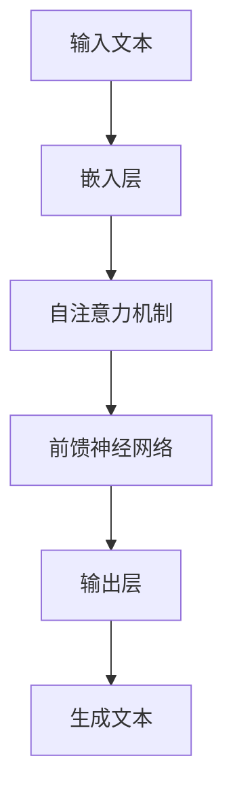

#### 2.2 GPT-3模型的训练过程

GPT-3模型的训练过程分为以下几个阶段：

1. **数据准备**：收集大量高质量文本数据，包括书籍、文章、新闻、对话等，确保数据的多样性和代表性。
2. **预处理**：对文本数据进行清洗和预处理，包括分词、去停用词、词性标注等。
3. **嵌入层**：将预处理后的文本数据转换为向量表示，嵌入层将单词映射为高维向量。
4. **自注意力机制**：通过自注意力机制，模型能够学习文本序列中的依赖关系，捕捉长距离信息。
5. **前馈神经网络**：在自注意力机制的基础上，模型通过前馈神经网络进行进一步的信息处理。
6. **输出层**：输出层的任务是生成文本序列，通过训练，模型能够学会生成符合语言规则和上下文的文本。
7. **训练与优化**：通过反向传播算法和梯度下降优化，模型不断调整参数，提高生成文本的质量。

以下是一个简化的GPT-3模型训练流程图：

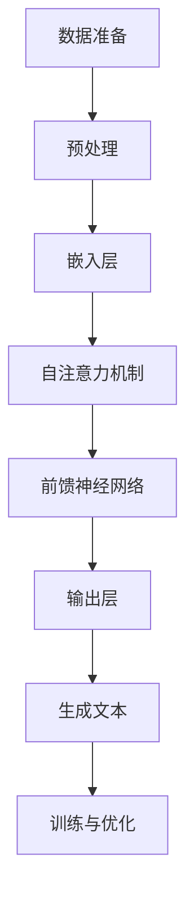

#### 2.3 ChatGPT的生成机制

ChatGPT的生成机制基于GPT-3模型，其主要步骤如下：

1. **输入文本**：用户输入一段文本，作为ChatGPT的输入。
2. **嵌入层**：将输入文本转换为向量表示。
3. **生成文本**：模型通过自注意力机制和前馈神经网络，生成新的文本序列。
4. **后处理**：对生成的文本进行后处理，包括格式化、修正语法错误等。

以下是一个简化的ChatGPT生成机制流程图：

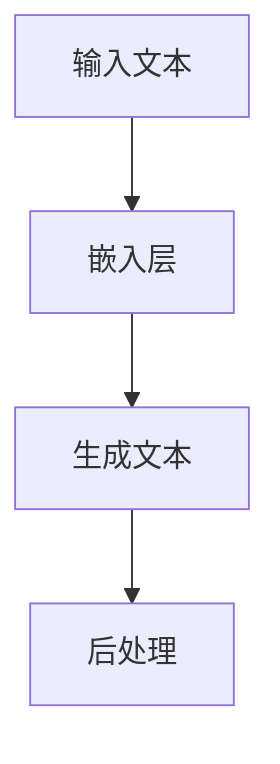

#### 2.4 ChatGPT的调优方法

ChatGPT的调优方法主要包括以下几个方面：

1. **微调**：针对特定任务，对预训练的GPT-3模型进行微调，使其更好地适应特定场景。
2. **参数调整**：通过调整模型参数，如学习率、批次大小等，提高模型性能。
3. **数据增强**：通过数据增强方法，如数据扩充、数据清洗等，提高训练数据的质量和多样性。
4. **模型集成**：通过集成多个模型，提高生成文本的质量和多样性。

以下是一个简化的ChatGPT调优流程图：

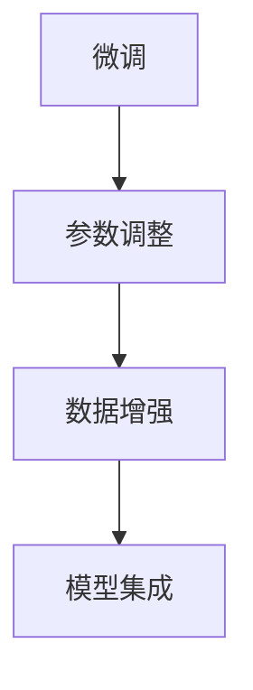

### 3. ChatGPT在自然语言处理中的应用

ChatGPT作为一种强大的语言模型，在自然语言处理（NLP）领域有着广泛的应用。以下将介绍ChatGPT在自动问答系统、文本生成与摘要、对话系统、文本分类与情感分析等应用场景的具体实现和效果。

#### 3.1 自动问答系统

自动问答系统是ChatGPT最典型的应用场景之一。通过预训练的GPT-3模型，ChatGPT可以接受用户的提问，并生成准确的回答。以下是自动问答系统的基本实现步骤：

1. **输入处理**：接收用户的提问，将其转换为模型可理解的输入格式。
2. **模型推理**：将输入文本通过GPT-3模型进行推理，生成可能的回答。
3. **回答生成**：根据模型输出的概率分布，选择最可能的回答。
4. **回答输出**：将生成的回答返回给用户。

以下是一个简化的自动问答系统实现流程：

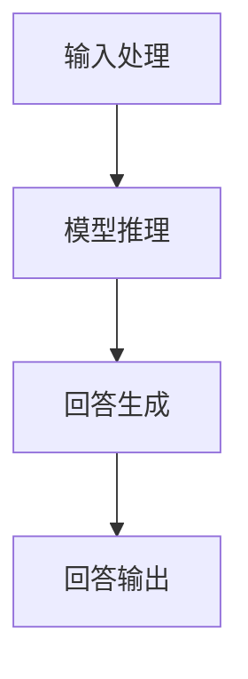

在实际应用中，自动问答系统可以应用于客户服务、智能客服、问答社区等多个领域，实现高效的问答服务。

#### 3.2 文本生成与摘要

文本生成与摘要是ChatGPT在NLP领域的另一个重要应用。通过预训练的GPT-3模型，ChatGPT可以生成高质量的文章、故事、摘要等文本内容。以下是文本生成与摘要的基本实现步骤：

1. **输入文本**：输入一段原始文本，作为模型生成文本的依据。
2. **模型生成**：通过GPT-3模型，生成新的文本内容。
3. **摘要生成**：将生成的文本内容进行摘要，提取关键信息。
4. **输出文本**：将生成的文本和摘要输出。

以下是一个简化的文本生成与摘要实现流程：

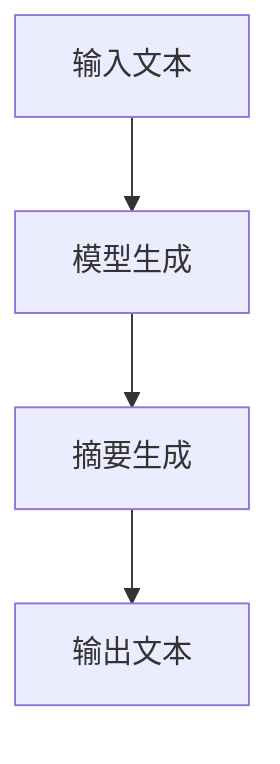

文本生成与摘要技术广泛应用于内容创作、信息提取、新闻摘要等领域，具有很高的实用价值。

#### 3.3 对话系统

对话系统是ChatGPT在NLP领域的另一个重要应用。通过预训练的GPT-3模型，ChatGPT可以与用户进行自然语言对话，模拟真实的交流场景。以下是对话系统的基本实现步骤：

1. **输入处理**：接收用户的输入，将其转换为模型可理解的输入格式。
2. **模型推理**：通过GPT-3模型，生成可能的回复。
3. **回复生成**：根据上下文和语义信息，选择最合适的回复。
4. **回复输出**：将生成的回复返回给用户。

以下是一个简化的对话系统实现流程：

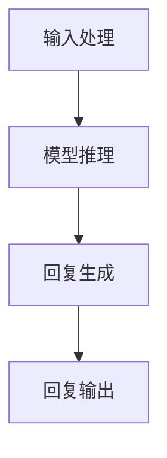

对话系统可以应用于智能客服、聊天机器人、虚拟助手等多个领域，实现高效的交互体验。

#### 3.4 文本分类与情感分析

文本分类与情感分析是ChatGPT在NLP领域的另一个重要应用。通过预训练的GPT-3模型，ChatGPT可以实现对文本的分类和情感分析，从而提取文本中的关键信息。以下是文本分类与情感分析的基本实现步骤：

1. **输入处理**：接收待分类或分析的文本。
2. **模型推理**：通过GPT-3模型，对文本进行分类或情感分析。
3. **结果输出**：输出分类结果或情感分析结果。

以下是一个简化的文本分类与情感分析实现流程：

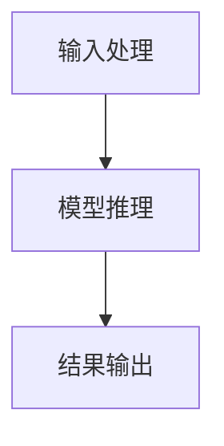

文本分类与情感分析技术广泛应用于社交媒体监控、舆情分析、情感调研等多个领域，对于企业和政府具有重要的决策支持作用。

### 4. ChatGPT在专业领域中的应用

ChatGPT作为一种强大的自然语言处理技术，不仅在NLP领域有着广泛的应用，还可以在专业领域中发挥重要作用。以下将介绍ChatGPT在教育、健康、金融和法律等领域的具体应用。

#### 4.1 教育领域

在教育领域，ChatGPT可以应用于智能辅导、个性化学习、教学辅助等多个方面。以下是一些具体应用案例：

1. **智能辅导**：ChatGPT可以作为智能辅导系统，为学生提供个性化的学习建议和解答疑问。学生可以通过与ChatGPT的交互，了解课程内容、学习方法、考试技巧等。
   
   实现步骤：
   - **输入处理**：接收学生的提问，包括课程问题、学习困惑等。
   - **模型推理**：通过ChatGPT模型，生成回答和建议。
   - **结果输出**：将回答和建议返回给学生。

   ```mermaid
   graph TD
       A[输入处理] --> B[模型推理]
       B --> C[结果输出]
   ```

2. **个性化学习**：ChatGPT可以分析学生的学习行为和成绩，为学生推荐个性化的学习资源和学习计划。

   实现步骤：
   - **数据收集**：收集学生的学习行为数据，如学习时长、作业成绩等。
   - **模型分析**：通过ChatGPT模型，分析学生的优势和不足。
   - **资源推荐**：根据分析结果，推荐适合学生的学习资源。

   ```mermaid
   graph TD
       A[数据收集] --> B[模型分析]
       B --> C[资源推荐]
   ```

3. **教学辅助**：ChatGPT可以作为教师的教学助手，辅助教师进行课程设计、课件制作和教学反馈。

   实现步骤：
   - **课程设计**：根据教学目标，设计适合学生的课程内容。
   - **课件制作**：生成课件和教学材料，辅助教师授课。
   - **教学反馈**：收集学生的学习反馈，为教师提供改进建议。

   ```mermaid
   graph TD
       A[课程设计] --> B[课件制作]
       B --> C[教学反馈]
   ```

#### 4.2 健康领域

在健康领域，ChatGPT可以应用于医疗咨询、健康提醒、疾病预测等多个方面，为用户提供个性化的健康服务。以下是一些具体应用案例：

1. **医疗咨询**：ChatGPT可以作为医疗咨询系统，为用户提供在线医疗咨询和服务。用户可以通过与ChatGPT的交互，了解病症、治疗方案、预防措施等。

   实现步骤：
   - **输入处理**：接收用户的健康问题，如病症描述、症状等。
   - **模型推理**：通过ChatGPT模型，生成健康建议和治疗方案。
   - **结果输出**：将健康建议和治疗方案返回给用户。

   ```mermaid
   graph TD
       A[输入处理] --> B[模型推理]
       B --> C[结果输出]
   ```

2. **健康提醒**：ChatGPT可以监控用户的健康状况，根据用户的生活习惯和健康数据，提供健康提醒和建议。

   实现步骤：
   - **数据收集**：收集用户的生活习惯和健康数据，如运动量、饮食、睡眠等。
   - **模型分析**：通过ChatGPT模型，分析用户的健康状况。
   - **健康提醒**：根据分析结果，为用户提供健康提醒和建议。

   ```mermaid
   graph TD
       A[数据收集] --> B[模型分析]
       B --> C[健康提醒]
   ```

3. **疾病预测**：ChatGPT可以通过分析患者的健康数据，预测疾病的发生风险，为医生提供诊断依据。

   实现步骤：
   - **数据收集**：收集患者的健康数据，如病史、体检报告等。
   - **模型分析**：通过ChatGPT模型，分析患者的健康状况。
   - **疾病预测**：根据分析结果，预测疾病的发生风险。

   ```mermaid
   graph TD
       A[数据收集] --> B[模型分析]
       B --> C[疾病预测]
   ```

#### 4.3 金融领域

在金融领域，ChatGPT可以应用于金融咨询、投资建议、风险控制等多个方面，为金融机构和投资者提供智能化的金融服务。以下是一些具体应用案例：

1. **金融咨询**：ChatGPT可以作为金融咨询系统，为用户提供投资建议、理财产品推荐等服务。

   实现步骤：
   - **输入处理**：接收用户的投资需求，如投资目标、风险偏好等。
   - **模型推理**：通过ChatGPT模型，生成投资建议和理财产品推荐。
   - **结果输出**：将投资建议和理财产品推荐返回给用户。

   ```mermaid
   graph TD
       A[输入处理] --> B[模型推理]
       B --> C[结果输出]
   ```

2. **投资建议**：ChatGPT可以通过分析市场数据、宏观经济指标等，为投资者提供个性化的投资建议。

   实现步骤：
   - **数据收集**：收集市场数据、宏观经济指标等。
   - **模型分析**：通过ChatGPT模型，分析市场走势和投资机会。
   - **投资建议**：根据分析结果，为投资者提供投资建议。

   ```mermaid
   graph TD
       A[数据收集] --> B[模型分析]
       B --> C[投资建议]
   ```

3. **风险控制**：ChatGPT可以通过分析投资组合的风险，为金融机构和投资者提供风险控制建议。

   实现步骤：
   - **数据收集**：收集投资组合的数据，如资产分布、风险指标等。
   - **模型分析**：通过ChatGPT模型，分析投资组合的风险水平。
   - **风险控制**：根据分析结果，为投资者提供风险控制建议。

   ```mermaid
   graph TD
       A[数据收集] --> B[模型分析]
       B --> C[风险控制]
   ```

#### 4.4 法律领域

在法律领域，ChatGPT可以应用于法律咨询、合同审核、案件分析等多个方面，为法律专业人士提供智能化的法律支持。以下是一些具体应用案例：

1. **法律咨询**：ChatGPT可以作为法律咨询系统，为用户提供法律问答、法律建议等服务。

   实现步骤：
   - **输入处理**：接收用户的法律问题，如合同纠纷、侵权责任等。
   - **模型推理**：通过ChatGPT模型，生成法律解答和建议。
   - **结果输出**：将法律解答和建议返回给用户。

   ```mermaid
   graph TD
       A[输入处理] --> B[模型推理]
       B --> C[结果输出]
   ```

2. **合同审核**：ChatGPT可以分析合同文本，识别潜在的法律风险，为法律专业人士提供合同审核建议。

   实现步骤：
   - **输入处理**：接收合同文本，如合同条款、法律条款等。
   - **模型分析**：通过ChatGPT模型，分析合同文本的法律风险。
   - **合同审核**：根据分析结果，为法律专业人士提供合同审核建议。

   ```mermaid
   graph TD
       A[输入处理] --> B[模型分析]
       B --> C[合同审核]
   ```

3. **案件分析**：ChatGPT可以通过分析案件资料，为法律专业人士提供案件分析报告，支持案件决策。

   实现步骤：
   - **数据收集**：收集案件资料，如案件描述、证据材料等。
   - **模型分析**：通过ChatGPT模型，分析案件资料的法律意义。
   - **案件分析**：根据分析结果，为法律专业人士提供案件分析报告。

   ```mermaid
   graph TD
       A[数据收集] --> B[模型分析]
       B --> C[案件分析]
   ```

### 5. ChatGPT在企业中的应用

ChatGPT作为一种强大的自然语言处理技术，在企业中有着广泛的应用。以下将介绍ChatGPT在客户服务、营销与推广、知识库构建、智能决策支持等领域的具体应用。

#### 5.1 客户服务

在客户服务领域，ChatGPT可以应用于智能客服、客户需求分析、售后服务等多个方面，提高企业的服务质量和效率。以下是一些具体应用案例：

1. **智能客服**：ChatGPT可以作为智能客服系统，为用户提供实时、高效的咨询服务。

   实现步骤：
   - **输入处理**：接收用户的咨询问题，如产品问题、订单查询等。
   - **模型推理**：通过ChatGPT模型，生成回答和建议。
   - **结果输出**：将回答和建议返回给用户。

   ```mermaid
   graph TD
       A[输入处理] --> B[模型推理]
       B --> C[结果输出]
   ```

2. **客户需求分析**：ChatGPT可以通过分析用户咨询记录，了解用户需求，为企业提供产品优化和市场推广建议。

   实现步骤：
   - **数据收集**：收集用户咨询记录，如产品咨询、投诉等。
   - **模型分析**：通过ChatGPT模型，分析用户需求。
   - **需求分析**：根据分析结果，为产品优化和市场推广提供建议。

   ```mermaid
   graph TD
       A[数据收集] --> B[模型分析]
       B --> C[需求分析]
   ```

3. **售后服务**：ChatGPT可以应用于售后服务环节，为用户提供售后咨询和技术支持。

   实现步骤：
   - **输入处理**：接收用户的售后问题，如产品故障、维修服务等。
   - **模型推理**：通过ChatGPT模型，生成解决方案和建议。
   - **结果输出**：将解决方案和建议返回给用户。

   ```mermaid
   graph TD
       A[输入处理] --> B[模型推理]
       B --> C[结果输出]
   ```

#### 5.2 营销与推广

在营销与推广领域，ChatGPT可以应用于市场分析、广告文案创作、用户画像构建等多个方面，提高企业的营销效果。以下是一些具体应用案例：

1. **市场分析**：ChatGPT可以通过分析市场数据，了解市场趋势和用户需求，为企业提供市场分析报告。

   实现步骤：
   - **数据收集**：收集市场数据，如销售数据、用户行为等。
   - **模型分析**：通过ChatGPT模型，分析市场趋势和用户需求。
   - **市场分析**：根据分析结果，为营销策略提供支持。

   ```mermaid
   graph TD
       A[数据收集] --> B[模型分析]
       B --> C[市场分析]
   ```

2. **广告文案创作**：ChatGPT可以生成高质量的广告文案，提高广告的吸引力和转化率。

   实现步骤：
   - **输入处理**：接收广告主题和目标用户，如产品特点、用户需求等。
   - **模型生成**：通过ChatGPT模型，生成广告文案。
   - **文案优化**：根据广告效果，优化广告文案。

   ```mermaid
   graph TD
       A[输入处理] --> B[模型生成]
       B --> C[文案优化]
   ```

3. **用户画像构建**：ChatGPT可以通过分析用户行为和偏好，构建用户画像，为企业提供精准营销支持。

   实现步骤：
   - **数据收集**：收集用户行为数据，如浏览记录、购买行为等。
   - **模型分析**：通过ChatGPT模型，分析用户画像。
   - **用户画像**：根据分析结果，为精准营销提供支持。

   ```mermaid
   graph TD
       A[数据收集] --> B[模型分析]
       B --> C[用户画像]
   ```

#### 5.3 知识库构建

在知识库构建领域，ChatGPT可以应用于知识抽取、知识推理、知识问答等多个方面，提高企业的知识管理效率。以下是一些具体应用案例：

1. **知识抽取**：ChatGPT可以从大量文本数据中提取关键信息，构建企业知识库。

   实现步骤：
   - **数据收集**：收集企业内部文档、报告、论文等。
   - **模型抽取**：通过ChatGPT模型，从文本中抽取关键信息。
   - **知识库构建**：将抽取的关键信息存储到知识库中。

   ```mermaid
   graph TD
       A[数据收集] --> B[模型抽取]
       B --> C[知识库构建]
   ```

2. **知识推理**：ChatGPT可以通过推理机制，从知识库中提取相关知识和推理结论，为企业提供决策支持。

   实现步骤：
   - **知识库查询**：从知识库中查询相关知识和推理规则。
   - **模型推理**：通过ChatGPT模型，进行知识推理。
   - **推理结论**：生成推理结论，为企业提供决策支持。

   ```mermaid
   graph TD
       A[知识库查询] --> B[模型推理]
       B --> C[推理结论]
   ```

3. **知识问答**：ChatGPT可以作为知识问答系统，为用户提供实时、准确的知识问答服务。

   实现步骤：
   - **输入处理**：接收用户的问题，如专业知识、行业动态等。
   - **模型推理**：通过ChatGPT模型，生成回答和建议。
   - **结果输出**：将回答和建议返回给用户。

   ```mermaid
   graph TD
       A[输入处理] --> B[模型推理]
       B --> C[结果输出]
   ```

#### 5.4 智能决策支持

在智能决策支持领域，ChatGPT可以应用于数据分析、趋势预测、决策优化等多个方面，为企业的决策提供科学依据。以下是一些具体应用案例：

1. **数据分析**：ChatGPT可以通过数据分析，挖掘企业数据中的潜在价值，为决策提供数据支持。

   实现步骤：
   - **数据收集**：收集企业内部数据，如销售数据、财务数据等。
   - **模型分析**：通过ChatGPT模型，进行数据分析。
   - **数据分析**：根据分析结果，为决策提供数据支持。

   ```mermaid
   graph TD
       A[数据收集] --> B[模型分析]
       B --> C[数据分析]
   ```

2. **趋势预测**：ChatGPT可以通过历史数据分析和趋势预测模型，预测企业未来的发展趋势，为决策提供趋势支持。

   实现步骤：
   - **历史数据收集**：收集企业历史数据，如销售数据、市场数据等。
   - **模型预测**：通过ChatGPT模型，进行趋势预测。
   - **趋势预测**：根据预测结果，为决策提供趋势支持。

   ```mermaid
   graph TD
       A[历史数据收集] --> B[模型预测]
       B --> C[趋势预测]
   ```

3. **决策优化**：ChatGPT可以通过优化算法，为企业的决策提供最优方案。

   实现步骤：
   - **决策问题定义**：定义企业的决策问题，如资源分配、投资决策等。
   - **模型优化**：通过ChatGPT模型，进行决策优化。
   - **决策方案**：根据优化结果，生成最优决策方案。

   ```mermaid
   graph TD
       A[决策问题定义] --> B[模型优化]
       B --> C[决策方案]
   ```

### 6. ChatGPT在创意内容制作中的应用

ChatGPT作为一种强大的自然语言处理技术，在创意内容制作领域也有着广泛的应用。以下将介绍ChatGPT在故事创作、诗歌与歌词创作、广告文案创作、娱乐节目脚本创作等方面的具体应用。

#### 6.1 故事创作

在故事创作领域，ChatGPT可以通过生成故事情节、角色对话等方式，辅助创作者创作故事。以下是一个简化的故事创作流程：

1. **输入处理**：接收创作者提供的主题、情节、角色等信息。
2. **模型生成**：通过ChatGPT模型，生成故事情节和角色对话。
3. **故事优化**：根据创作者的反馈，对故事进行优化和调整。
4. **输出故事**：将生成的故事返回给创作者。

以下是一个简化的故事创作流程图：

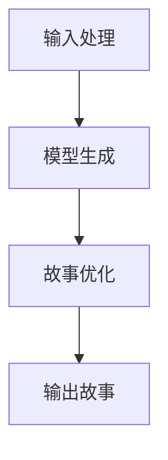

ChatGPT可以生成具有创意和情感的故事，为创作者提供灵感。

#### 6.2 诗歌与歌词创作

在诗歌与歌词创作领域，ChatGPT可以通过生成诗句、歌词等方式，辅助创作者进行创作。以下是一个简化的诗歌与歌词创作流程：

1. **输入处理**：接收创作者提供的主题、情感、风格等信息。
2. **模型生成**：通过ChatGPT模型，生成诗句和歌词。
3. **内容优化**：根据创作者的反馈，对诗句和歌词进行优化和调整。
4. **输出作品**：将生成的诗句和歌词返回给创作者。

以下是一个简化的诗歌与歌词创作流程图：

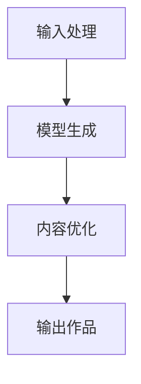

ChatGPT可以生成具有诗意和韵律的诗歌和歌词，为创作者提供灵感。

#### 6.3 广告文案创作

在广告文案创作领域，ChatGPT可以通过生成广告语、宣传文案等方式，辅助创作者进行创作。以下是一个简化的广告文案创作流程：

1. **输入处理**：接收创作者提供的广告主题、目标受众、广告效果等信息。
2. **模型生成**：通过ChatGPT模型，生成广告语和宣传文案。
3. **内容优化**：根据创作者的反馈，对广告语和宣传文案进行优化和调整。
4. **输出文案**：将生成的广告语和宣传文案返回给创作者。

以下是一个简化的广告文案创作流程图：

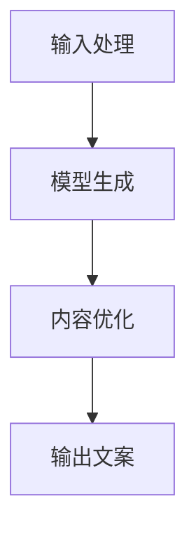

ChatGPT可以生成具有吸引力和说服力的广告文案，提高广告的效果。

#### 6.4 娱乐节目脚本创作

在娱乐节目脚本创作领域，ChatGPT可以通过生成剧本、情节发展、角色对话等方式，辅助创作者进行创作。以下是一个简化的娱乐节目脚本创作流程：

1. **输入处理**：接收创作者提供的节目类型、主题、风格等信息。
2. **模型生成**：通过ChatGPT模型，生成剧本、情节发展和角色对话。
3. **内容优化**：根据创作者的反馈，对剧本、情节发展和角色对话进行优化和调整。
4. **输出剧本**：将生成的剧本返回给创作者。

以下是一个简化的娱乐节目脚本创作流程图：

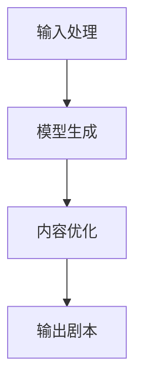

ChatGPT可以生成具有创意和戏剧性的娱乐节目脚本，为创作者提供灵感。

### 7. ChatGPT开发与部署

要实现ChatGPT的开发与部署，我们需要了解以下关键步骤：

#### 7.1 开发环境搭建

首先，我们需要搭建一个适合ChatGPT开发的计算环境。以下是一个简化的开发环境搭建流程：

1. **硬件要求**：ChatGPT的模型训练和推理需要大量的计算资源，推荐使用GPU加速的硬件设备，如NVIDIA Tesla V100等。
2. **软件环境**：安装Python、PyTorch、TensorFlow等深度学习框架，并配置GPU加速。
3. **代码准备**：准备ChatGPT的模型训练和推理代码，如GPT-3的训练脚本、推理脚本等。

以下是一个简化的开发环境搭建流程图：

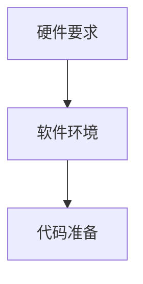

#### 7.2 模型调优与优化

在开发过程中，我们需要对ChatGPT模型进行调优和优化，以提高模型性能和生成效果。以下是一个简化的模型调优与优化流程：

1. **数据准备**：收集和准备高质量的训练数据，包括文本、对话等。
2. **模型训练**：使用训练数据对ChatGPT模型进行训练，调整模型参数和超参数。
3. **性能评估**：评估模型在验证集和测试集上的性能，选择最优模型。
4. **优化模型**：根据评估结果，对模型进行优化，如调整超参数、使用更复杂的网络结构等。

以下是一个简化的模型调优与优化流程图：

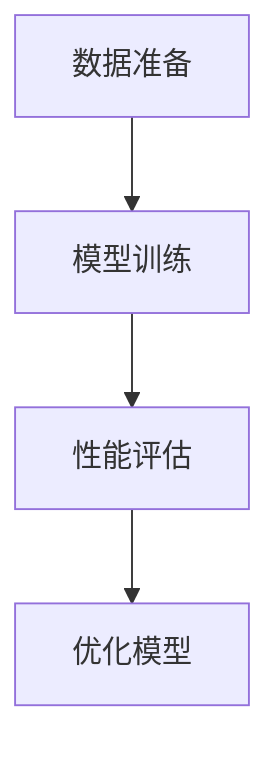

#### 7.3 模型部署与集成

在模型训练和调优完成后，我们需要将ChatGPT模型部署到生产环境中，并与现有系统进行集成。以下是一个简化的模型部署与集成流程：

1. **容器化**：将ChatGPT模型和依赖环境打包成容器镜像，如Docker镜像。
2. **服务部署**：在服务器上部署容器化的ChatGPT服务，如使用Kubernetes进行管理。
3. **API接口**：为ChatGPT服务提供API接口，便于与其他系统进行集成。
4. **集成测试**：与现有系统进行集成测试，确保ChatGPT服务的正常运行。

以下是一个简化的模型部署与集成流程图：

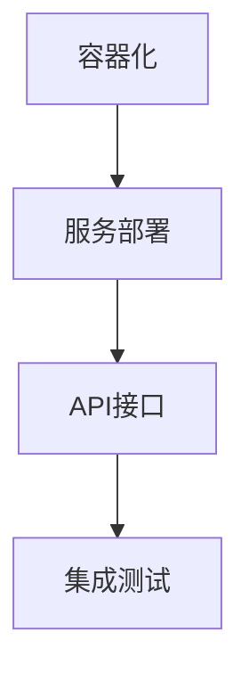

#### 7.4 模型安全与隐私保护

在ChatGPT的开发与部署过程中，我们需要关注模型安全和隐私保护问题。以下是一些关键点：

1. **数据安全**：确保训练数据和输入数据的加密和安全存储，防止数据泄露。
2. **访问控制**：对ChatGPT服务的访问进行控制，确保只有授权用户可以访问。
3. **隐私保护**：在处理用户输入时，确保不泄露用户的隐私信息。
4. **安全审计**：定期进行安全审计，检查系统是否存在安全漏洞。

以下是一个简化的模型安全与隐私保护流程图：

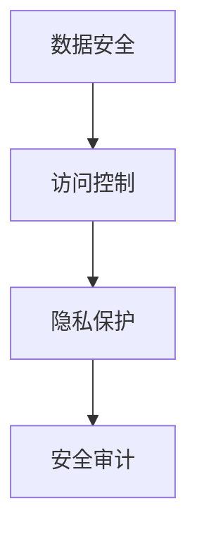

### 8. 实战案例分享

为了更好地理解ChatGPT的实际应用，以下将分享一些具体的实战案例。

#### 8.1 案例一：教育领域应用

在一个在线教育平台上，ChatGPT被用于提供智能辅导服务。学生可以通过平台向ChatGPT提出问题，ChatGPT会生成详细的解答和建议。以下是具体的实现步骤：

1. **数据准备**：收集大量教育领域的文本数据，如教材、课件、教学案例等。
2. **模型训练**：使用收集到的数据对ChatGPT模型进行训练，调整模型参数和超参数。
3. **模型部署**：将训练好的ChatGPT模型部署到服务器上，提供在线服务。
4. **用户交互**：学生通过平台向ChatGPT提出问题，ChatGPT生成解答和建议。
5. **效果评估**：收集学生和教师的反馈，评估ChatGPT的辅导效果。

#### 8.2 案例二：健康领域应用

在一个健康管理平台上，ChatGPT被用于提供在线健康咨询和疾病预测服务。用户可以通过平台向ChatGPT提出健康问题，ChatGPT会生成健康建议和疾病预测报告。以下是具体的实现步骤：

1. **数据准备**：收集大量健康领域的文本数据，如医学文献、病例报告、健康指南等。
2. **模型训练**：使用收集到的数据对ChatGPT模型进行训练，调整模型参数和超参数。
3. **模型部署**：将训练好的ChatGPT模型部署到服务器上，提供在线服务。
4. **用户交互**：用户通过平台向ChatGPT提出健康问题，ChatGPT生成健康建议和疾病预测报告。
5. **效果评估**：收集用户和医生的反馈，评估ChatGPT的健康咨询和疾病预测效果。

#### 8.3 案例三：金融领域应用

在一个金融投资平台上，ChatGPT被用于提供投资建议和风险控制服务。用户可以通过平台向ChatGPT提出投资需求和风险偏好，ChatGPT会生成投资组合建议和风险分析报告。以下是具体的实现步骤：

1. **数据准备**：收集大量金融领域的文本数据，如市场数据、经济指标、金融新闻等。
2. **模型训练**：使用收集到的数据对ChatGPT模型进行训练，调整模型参数和超参数。
3. **模型部署**：将训练好的ChatGPT模型部署到服务器上，提供在线服务。
4. **用户交互**：用户通过平台向ChatGPT提出投资需求和风险偏好，ChatGPT生成投资组合建议和风险分析报告。
5. **效果评估**：收集用户和投资顾问的反馈，评估ChatGPT的投资建议和风险控制效果。

#### 8.4 案例四：企业客户服务应用

在一个企业客户服务平台上，ChatGPT被用于提供智能客服服务。用户可以通过平台向ChatGPT提出问题，ChatGPT会生成详细的解答和建议。以下是具体的实现步骤：

1. **数据准备**：收集大量企业客户服务领域的文本数据，如常见问题解答、用户手册、产品介绍等。
2. **模型训练**：使用收集到的数据对ChatGPT模型进行训练，调整模型参数和超参数。
3. **模型部署**：将训练好的ChatGPT模型部署到服务器上，提供在线服务。
4. **用户交互**：用户通过平台向ChatGPT提出问题，ChatGPT生成解答和建议。
5. **效果评估**：收集用户和客服人员的反馈，评估ChatGPT的智能客服效果。

### 附录

#### 附录A: ChatGPT相关资源

- **学习资源**：[ChatGPT官方文档](https://gpt-3-docs.openai.com/)、[自然语言处理教程](https://nlp.stanford.edu/robots.html)
- **开发工具**：[PyTorch](https://pytorch.org/)、[TensorFlow](https://www.tensorflow.org/)
- **社群与论坛**：[Hugging Face](https://huggingface.co/)、[Reddit NLP论坛](https://www.reddit.com/r/nlp/)

#### 附录B: Mermaid流程图示例

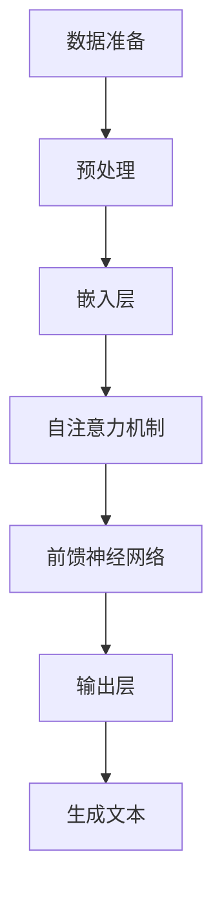

#### 附录C: 数学公式与伪代码

```latex
$$
\text{损失函数} = -\sum_{i=1}^{N} \log(p(y_i | x_i))
$$
```

```python
# GPT-3模型训练伪代码

def train_gpt3(data):
    # 数据预处理
    preprocessed_data = preprocess_data(data)
    
    # 模型初始化
    model = GPT3Model()
    
    # 模型训练
    for epoch in range(num_epochs):
        for batch in data_loader(preprocessed_data):
            # 前向传播
            logits = model(batch)
            
            # 计算损失
            loss = compute_loss(logits, batch)
            
            # 反向传播
            optimizer.zero_grad()
            loss.backward()
            optimizer.step()
            
            # 输出训练信息
            print(f"Epoch: {epoch}, Loss: {loss.item()}")

# 训练GPT-3模型
train_gpt3(training_data)
```

### 作者

**作者：AI天才研究院/AI Genius Institute & 禅与计算机程序设计艺术 /Zen And The Art of Computer Programming**

