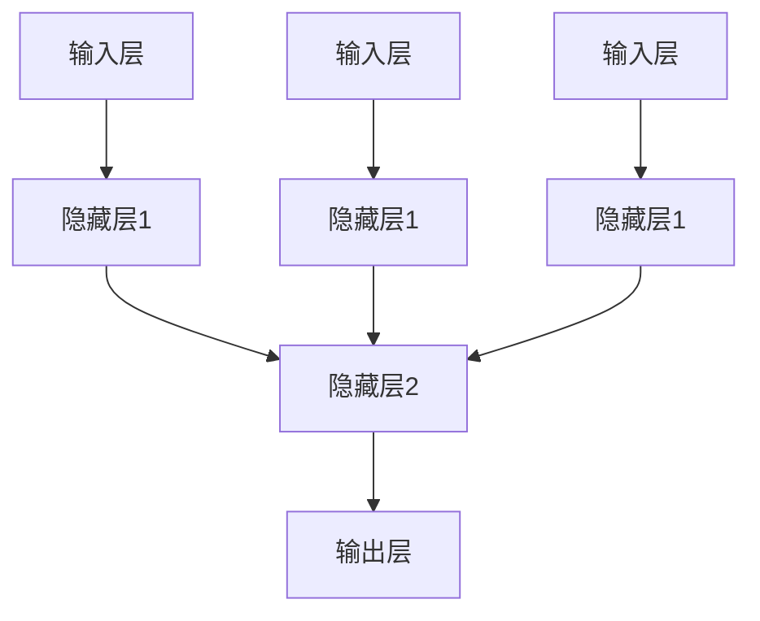
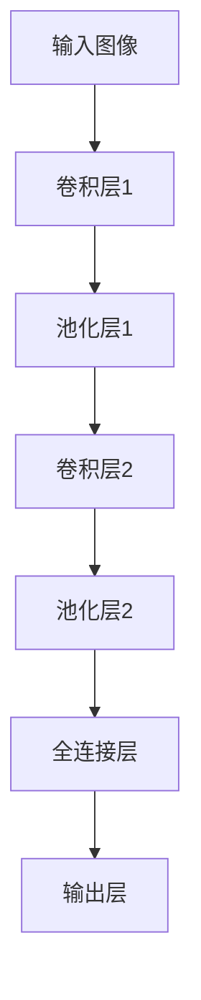
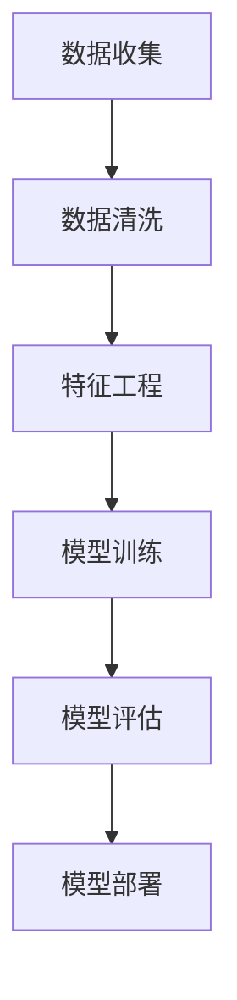
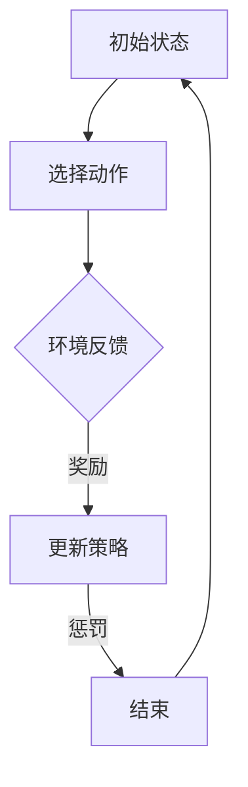
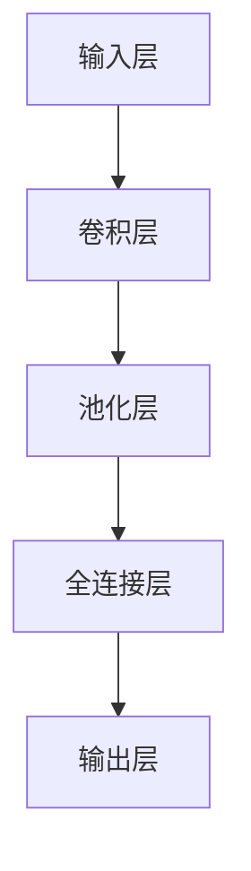

                 

### 《AI人工智能核心算法原理与代码实例讲解：自主学习》

> **关键词：** 人工智能，核心算法，代码实例，自主学习，神经网络，监督学习，无监督学习，强化学习。

**摘要：** 本文深入探讨了人工智能（AI）的核心算法原理，并通过代码实例展示了如何实现自主学习。文章分为两个部分：第一部分介绍了AI的基础知识，包括AI的定义、类型、学习方法与架构、数据准备与处理；第二部分详细讲解了神经网络基础、特征提取与降维技术、监督学习算法和无监督学习算法，并提供了实际项目实战。本文旨在为读者提供一个全面、系统、易懂的AI学习资源，帮助读者掌握AI的核心算法原理并应用于实际项目中。

---

### 《AI人工智能核心算法原理与代码实例讲解：自主学习》目录大纲

1. **第一部分: AI人工智能基础**
    1. **第1章: AI概述**
        1.1 AI的定义与发展历程
        1.2 人工智能的类型与应用
        1.3 学习方法与架构
    2. **第2章: 数据准备与处理**
        2.1 数据收集与清洗
        2.2 特征工程
        2.3 数据集划分与评估
    3. **第3章: 神经网络基础**
        3.1 神经网络基本结构
        3.2 前向传播与反向传播
        3.3 层叠网络与卷积神经网络
    4. **第4章: 特征提取与降维技术**
        4.1 主成分分析（PCA）
        4.2 聚类算法
        4.3 特征选择与特征抽取
    5. **第5章: 监督学习算法**
        5.1 线性模型
        5.2 决策树与随机森林
        5.3 k近邻算法与支持向量机
    6. **第6章: 无监督学习算法**
        6.1 K均值聚类
        6.2 自编码器
        6.3 聚类层次分析法
    7. **第7章: 强化学习算法**
        7.1 强化学习基本概念
        7.2 Q-Learning算法
        7.3 深度强化学习
    8. **第8章: 项目实战**
        8.1 数据集准备与处理
        8.2 模型构建与训练
        8.3 模型部署与应用

2. **第二部分: 核心算法原理与实现**
    2.1 **附录 A: 工具与资源**
    2.2 **附录 B: Mermaid 流程图**
    2.3 **附录 C: 伪代码与数学公式**

### 第一部分: AI人工智能基础

#### 第1章: AI概述

人工智能（Artificial Intelligence，简称AI）是计算机科学的一个分支，旨在创建智能体，这些智能体可以感知其环境并采取行动以实现特定目标。AI的发展经历了几个重要阶段，从早期的规则系统到基于模式的识别，再到现代的深度学习。

##### 1.1 AI的定义与发展历程

**1.1.1 AI的定义**

AI通常被定义为“模拟、延伸和扩展人类智能的理论、方法、技术及应用”。它涉及多个领域，包括计算机科学、认知科学、心理学、神经科学和数学。

**1.1.2 AI的发展历程**

AI的研究始于20世纪50年代，当时的科学家们试图创建能够执行特定任务的智能系统。这个时期以符号主义方法为主，即通过编程规则来模拟人类思维。然而，这种方法在复杂任务上遇到了限制。

20世纪80年代，专家系统成为了AI研究的热点，这些系统通过大量的预定义规则来解决问题。专家系统在某些领域表现出色，但在处理复杂和不确定的任务时效果不佳。

近年来，随着计算能力的提升和数据量的爆炸式增长，机器学习，特别是深度学习，成为了AI研究的主要方向。深度学习通过多层神经网络来学习数据特征，已经在图像识别、自然语言处理和游戏等领域取得了突破性成果。

##### 1.1.3 AI的关键技术

AI的关键技术包括：

- **机器学习**：通过训练数据来使计算机从数据中学习。
- **深度学习**：一种特殊的机器学习方法，通过多层神经网络来学习数据特征。
- **自然语言处理**：使计算机能够理解和生成自然语言。
- **计算机视觉**：使计算机能够理解和解释图像和视频。
- **机器人学**：使计算机能够通过物理交互来理解和改变环境。

##### 1.2 人工智能的类型与应用

**1.2.1 狭义AI与广义AI**

狭义AI（Narrow AI）是指只能在特定任务上表现出智能的AI系统。例如，一个能够识别猫的图像的AI系统。广义AI（General AI）是指能够在多个任务上表现出人类水平的智能的AI系统。

**1.2.2 AI在不同领域的应用**

AI已经广泛应用于多个领域，包括：

- **医疗**：用于疾病诊断、药物研发和患者护理。
- **金融**：用于风险评估、投资策略和欺诈检测。
- **交通**：用于自动驾驶、交通流量管理和智能交通系统。
- **教育**：用于个性化学习、教学评估和课程推荐。
- **娱乐**：用于游戏设计、音乐创作和视频制作。

**1.2.3 AI面临的挑战与机遇**

AI面临的挑战包括：

- **数据隐私**：如何保护用户数据不被滥用。
- **算法公平性**：确保AI系统不歧视或偏见。
- **安全与可控性**：如何确保AI系统的安全性和可控性。

AI带来的机遇包括：

- **提高生产力**：通过自动化和智能决策系统来提高效率。
- **创新**：通过新的算法和模型来推动科学和技术进步。
- **经济增长**：通过新应用和新产业的创造来促进经济发展。

##### 1.3 学习方法与架构

AI的学习方法主要分为以下几类：

- **监督学习**：通过已标记的数据来训练模型，使模型能够对新的数据进行预测。
- **无监督学习**：通过未标记的数据来训练模型，使模型能够发现数据中的结构和模式。
- **强化学习**：通过奖励和惩罚来训练模型，使模型能够学习如何在特定环境中采取最佳行动。

AI的架构包括：

- **神经网络**：一种由多个神经元组成的网络，用于模拟人脑的运作方式。
- **深度学习**：多层神经网络，能够从数据中自动学习复杂特征。
- **生成对抗网络（GAN）**：由两个神经网络组成的架构，用于生成新的数据。

##### 第2章: 数据准备与处理

数据准备与处理是AI项目中的关键步骤，它直接影响模型的性能和准确性。以下是数据准备与处理的主要步骤：

**2.1 数据收集与清洗**

**2.1.1 数据收集**

数据收集是AI项目的第一步，它涉及到从各种来源获取数据，如公共数据集、开源数据库、传感器数据和公司内部数据。

**2.1.2 数据清洗**

数据清洗是数据准备的重要步骤，它涉及到处理缺失值、异常值和重复值，以确保数据的质量。

**2.1.3 数据存储与管理**

数据存储与管理是确保数据可访问性和安全性的重要环节，通常涉及使用数据库、数据仓库和数据湖来存储和管理数据。

**2.2 特征工程**

特征工程是数据准备中的关键步骤，它涉及到从原始数据中提取和选择对模型有用的特征。

**2.2.1 特征提取**

特征提取是自动从原始数据中提取特征的过程，通常使用统计学、机器学习算法和深度学习技术。

**2.2.2 特征选择**

特征选择是选择对模型最有用的特征的过程，以减少模型的复杂性和过拟合的风险。

**2.2.3 特征标准化与归一化**

特征标准化与归一化是数据预处理步骤，用于将特征值转换为相同的尺度，以避免某些特征对模型的影响过大。

**2.3 数据集划分与评估**

**2.3.1 划分方法**

数据集划分是将数据分为训练集、验证集和测试集的过程，以评估模型的性能。

**2.3.2 评估指标**

评估指标是用于评估模型性能的指标，如准确率、召回率、F1分数和交叉验证。

**2.3.3 过拟合与欠拟合**

过拟合与欠拟合是模型在训练数据和测试数据上的表现差异，过拟合是指模型在训练数据上表现良好但在测试数据上表现较差，欠拟合是指模型在训练数据和测试数据上表现都较差。

### 第二部分: 核心算法原理与实现

#### 第3章: 神经网络基础

神经网络（Neural Networks）是人工智能领域的一个重要分支，它模拟了人脑的神经元结构和工作原理。神经网络通过学习大量数据，能够自动提取特征并做出预测，因此在图像识别、自然语言处理和游戏等领域有着广泛的应用。

##### 3.1 神经网络基本结构

神经网络的基本结构由输入层、隐藏层和输出层组成。每个层由多个神经元（或节点）组成，神经元之间通过权重连接。

**3.1.1 单层感知机**

单层感知机（Perceptron）是最简单的神经网络模型，它只有一个输入层和一个输出层。单层感知机通过线性组合输入值和权重，并加上偏置项，然后通过激活函数产生输出。

伪代码：
```python
def perceptron(input_vector, weights, bias, activation_function):
    z = sum(input_vector * weights) + bias
    return activation_function(z)
```

其中，`input_vector`是输入值，`weights`是权重，`bias`是偏置项，`activation_function`是激活函数。

**3.1.2 多层感知机**

多层感知机（Multilayer Perceptron，MLP）是在单层感知机的基础上增加了隐藏层。多层感知机能够处理非线性问题，通过隐藏层的学习，可以提取更复杂的特征。

多层感知机的结构如下图所示：



**3.1.3 激活函数**

激活函数是神经网络中的一个关键组件，它用于引入非线性因素，使神经网络能够处理复杂问题。常见的激活函数包括sigmoid函数、ReLU函数和Tanh函数。

- **sigmoid函数**：
  $$\sigma(x) = \frac{1}{1 + e^{-x}}$$

- **ReLU函数**：
  $$\text{ReLU}(x) = \max(0, x)$$

- **Tanh函数**：
  $$\tanh(x) = \frac{e^x - e^{-x}}{e^x + e^{-x}}$$

##### 3.2 前向传播与反向传播

神经网络的学习过程分为前向传播（Forward Propagation）和反向传播（Back Propagation）两个阶段。

**3.2.1 前向传播过程**

前向传播过程是指从输入层传递信息到输出层的步骤。具体步骤如下：

1. 计算每个神经元的输入值（线性组合）。
2. 应用激活函数得到每个神经元的输出值。
3. 将输出值传递到下一层。

伪代码：
```python
def forward_propagation(input_vector, weights, biases, activation_functions):
    outputs = [input_vector]
    for layer in range(num_layers):
        z = sum(input * weight for input, weight in zip(outputs[-1], weights[layer]))
        z += biases[layer]
        output = activation_function(z)
        outputs.append(output)
    return outputs[-1]
```

**3.2.2 反向传播过程**

反向传播过程是指根据输出误差调整网络权重的步骤。具体步骤如下：

1. 计算输出层的误差（目标值与实际值之间的差异）。
2. 反向传播误差，计算隐藏层和输入层的误差。
3. 根据误差调整权重和偏置项。

伪代码：
```python
def backward_propagation(outputs, target, weights, biases, activation_derivatives):
    errors = [target - output]
    for layer in reversed(range(num_layers)):
        delta = errors[0] * activation_derivatives[layer](z)
        errors.insert(0, sum(delta * weight for delta, weight in zip(delta, weights[layer])))
    return [(weights, biases) for weights, biases in zip(weights, biases)]
```

**3.2.3 梯度下降算法**

梯度下降（Gradient Descent）是一种用于优化神经网络权重的算法。它通过计算损失函数关于权重的梯度，并沿着梯度的反方向更新权重，以最小化损失函数。

伪代码：
```python
def gradient_descent(weights, biases, learning_rate, loss_function):
    for iteration in range(num_iterations):
        output = forward_propagation(input_vector, weights, biases)
        error = loss_function(target, output)
        delta_weights, delta_biases = backward_propagation(outputs, target, weights, biases)
        weights -= learning_rate * delta_weights
        biases -= learning_rate * delta_biases
    return weights, biases
```

##### 3.3 层叠网络与卷积神经网络

**3.3.1 层叠网络**

层叠网络（Stacked Networks）是指具有多个隐藏层的神经网络。通过增加隐藏层，层叠网络可以提取更复杂的特征，从而提高模型的性能。

**3.3.2 卷积神经网络（CNN）**

卷积神经网络（Convolutional Neural Network，CNN）是一种专门用于处理图像数据的神经网络。CNN通过卷积层和池化层来提取图像特征，从而实现图像分类、目标检测和语义分割等任务。

CNN的结构如下图所示：



**3.3.3 卷积层与池化层**

- **卷积层**：卷积层通过卷积操作从输入图像中提取局部特征。卷积操作使用一组可学习的滤波器（卷积核）来扫描输入图像，生成特征图。

- **池化层**：池化层用于减小特征图的大小，从而减少模型的参数数量。常见的池化操作包括最大池化和平均池化。

### 第4章: 特征提取与降维技术

特征提取与降维技术是机器学习中的重要步骤，用于提高模型的性能和可解释性。特征提取是从原始数据中提取对模型有用的特征，而降维技术则是通过减少数据维度来降低计算复杂性和提高模型效率。

##### 4.1 主成分分析（PCA）

主成分分析（Principal Component Analysis，PCA）是一种常用的降维技术，它通过将数据投影到新的正交轴上来降低数据的维度，同时保留数据的主要信息。

**4.1.1 原理与公式**

PCA的原理是通过求解协方差矩阵的特征值和特征向量，将数据投影到新的坐标系上。具体步骤如下：

1. 计算协方差矩阵：
   $$\Sigma = \frac{1}{n-1}XX^T$$
   其中，$X$是数据矩阵，$n$是样本数量。

2. 求解协方差矩阵的特征值和特征向量：
   $$\Sigma v_i = \lambda_i v_i$$
   其中，$v_i$是特征向量，$\lambda_i$是特征值。

3. 选择最大的$k$个特征值对应的特征向量，构成新的特征矩阵$V$。

4. 将数据投影到新的特征空间：
   $$X' = XV$$

**4.1.2 代码实现**

下面是一个使用Python和Scikit-learn库实现PCA的简单示例：

```python
from sklearn.decomposition import PCA
from sklearn.preprocessing import StandardScaler
import numpy as np

# 标准化数据
X = StandardScaler().fit_transform(X)

# 创建PCA对象，并设置降维后的维度
pca = PCA(n_components=2)
pca.fit(X)

# 将数据投影到新的特征空间
X_pca = pca.transform(X)

# 绘制降维后的数据
plt.scatter(X_pca[:, 0], X_pca[:, 1])
plt.xlabel('Principal Component 1')
plt.ylabel('Principal Component 2')
plt.title('2D PCA of Sample Data')
plt.show()
```

**4.1.3 应用案例**

PCA在图像识别、文本分类和基因数据分析等领域有着广泛的应用。例如，在图像识别中，PCA可以用于图像降维，从而提高模型的训练速度和降低计算复杂度。

##### 4.2 聚类算法

聚类算法是一类无监督学习方法，用于将数据集划分为多个群组，使得同群组的数据之间相似度较高，不同群组的数据之间相似度较低。

**4.2.1 K-means算法**

K-means算法是最流行的聚类算法之一，它通过迭代优化聚类中心，将数据划分为K个群组。

**4.2.2 层次聚类**

层次聚类是一种基于层次结构的聚类方法，它通过逐步合并或分裂聚类中心，构建一个层次聚类树。

**4.2.3 密度聚类**

密度聚类是一种基于数据密度分布的聚类方法，它通过识别数据点的高密度区域来构建聚类。

##### 4.3 特征选择与特征抽取

特征选择与特征抽取是特征工程中的两个重要步骤，用于从原始数据中提取对模型有用的特征。

**4.3.1 重要性评估方法**

重要性评估方法用于评估特征对模型的重要性，常见的评估方法包括信息增益、基尼系数和卡方检验。

**4.3.2 递归特征消除（RFE）**

递归特征消除（Recursive Feature Elimination，RFE）是一种用于特征选择的迭代方法，它通过递归地删除最不重要的特征，逐步构建最优特征子集。

**4.3.3 主成分分析（PCA）**

主成分分析（PCA）是一种用于特征抽取的方法，它通过将数据投影到新的正交轴上来降低数据的维度，同时保留数据的主要信息。

### 第5章: 监督学习算法

监督学习是一种机器学习方法，它通过已标记的数据来训练模型，使模型能够对新的数据进行预测。监督学习算法广泛应用于分类和回归问题。

##### 5.1 线性模型

线性模型是一种基于线性函数的模型，用于拟合数据。常见的线性模型包括线性回归和逻辑回归。

**5.1.1 线性回归**

线性回归是一种用于拟合数据线性关系的模型，其目标是最小化预测值与实际值之间的误差。

**5.1.2 逻辑回归**

逻辑回归是一种用于分类问题的线性模型，它通过将线性组合转化为概率值，实现对类别的预测。

**5.1.3 支持向量机（SVM）**

支持向量机（Support Vector Machine，SVM）是一种用于分类和回归问题的线性模型，它通过找到最优超平面来划分数据。

##### 5.2 决策树与随机森林

决策树是一种基于树结构的分类模型，它通过一系列规则来划分数据。随机森林（Random Forest）是一种基于决策树的集成学习方法，它通过构建多个决策树并合并它们的预测结果来提高模型的性能。

**5.2.1 决策树原理**

决策树通过递归划分数据集，将数据划分为多个子集，直到满足某些终止条件（如最大深度、最小样本数等）。

**5.2.2 随机森林**

随机森林通过随机选取特征和样本子集来构建多个决策树，并合并它们的预测结果来提高模型的性能。

**5.2.3 树回归**

树回归是一种基于决策树的回归模型，它通过递归划分数据集，找到最优回归树来拟合数据。

##### 5.3 k近邻算法与支持向量机

k近邻算法（k-Nearest Neighbors，k-NN）是一种基于实例的监督学习算法，它通过计算测试样本与训练样本之间的距离，选择最近的K个邻居，并基于邻居的标签来预测测试样本的标签。

支持向量机（Support Vector Machine，SVM）是一种用于分类和回归问题的线性模型，它通过找到最优超平面来划分数据。

**5.3.1 k近邻算法**

k近邻算法通过计算测试样本与训练样本之间的距离，选择最近的K个邻居，并基于邻居的标签来预测测试样本的标签。

**5.3.2 支持向量机（SVM）**

支持向量机通过找到最优超平面来划分数据，使得正类和负类之间的间隔最大化。支持向量机可以分为线性SVM和核SVM。

**5.3.3 核函数与SVM的应用**

核函数是支持向量机中的一个关键组件，它用于将数据映射到高维空间，从而实现线性可分。常见的核函数包括线性核、多项式核和径向基函数核。

### 第6章: 无监督学习算法

无监督学习是一种机器学习方法，它通过未标记的数据来训练模型，使模型能够发现数据中的结构和模式。无监督学习算法广泛应用于聚类和降维问题。

##### 6.1 K均值聚类

K均值聚类（K-Means Clustering）是一种简单的聚类算法，它通过迭代优化聚类中心，将数据划分为K个群组。

**6.1.1 聚类算法原理**

K均值聚类通过以下步骤进行：

1. 随机选择K个中心点。
2. 计算每个数据点到聚类中心的距离，并将数据点分配到最近的聚类中心。
3. 重新计算每个聚类中心的平均值。
4. 重复步骤2和3，直到聚类中心不再变化。

**6.1.2 K均值聚类**

K均值聚类的目标是使每个聚类中心的离群点（Outliers）最小化。下面是一个使用Python和Scikit-learn库实现K均值聚类的简单示例：

```python
from sklearn.cluster import KMeans
import numpy as np

# 创建KMeans对象，并设置聚类数量
kmeans = KMeans(n_clusters=3, random_state=0).fit(X)

# 获取聚类中心
centroids = kmeans.cluster_centers_

# 获取聚类标签
labels = kmeans.predict(X)

# 绘制聚类结果
plt.scatter(X[:, 0], X[:, 1], c=labels, s=100, cmap='viridis')
plt.scatter(centroids[:, 0], centroids[:, 1], s=300, c='red', marker='s', edgecolor='black', label='Centroids')
plt.xlabel('Feature 1')
plt.ylabel('Feature 2')
plt.title('K-Means Clustering')
plt.show()
```

**6.1.3 聚类效果评估**

聚类效果可以通过以下指标进行评估：

- **内积距离**：衡量聚类中心之间的距离，越小表示聚类效果越好。
- **轮廓系数**：衡量聚类内部的紧凑程度和聚类之间的分离程度，值范围在-1到1之间，越接近1表示聚类效果越好。

##### 6.2 自编码器

自编码器（Autoencoder）是一种无监督学习算法，它通过学习输入数据的压缩表示来重建原始数据。自编码器广泛应用于降维和特征提取。

**6.2.1 自编码器原理**

自编码器由编码器和解码器组成，编码器将输入数据压缩为低维表示，解码器将低维表示重构为原始数据。

**6.2.2 代码实现**

下面是一个使用Python和TensorFlow实现自编码器的简单示例：

```python
import tensorflow as tf
from tensorflow.keras.layers import Input, Dense
from tensorflow.keras.models import Model

# 创建输入层
input_layer = Input(shape=(input_shape))

# 创建编码器
encoded = Dense(encoding_dim, activation='relu')(input_layer)

# 创建解码器
decoded = Dense(input_shape, activation='sigmoid')(encoded)

# 创建自编码器模型
autoencoder = Model(input_layer, decoded)

# 编译自编码器模型
autoencoder.compile(optimizer='adam', loss='binary_crossentropy')

# 训练自编码器
autoencoder.fit(X, X, epochs=epochs, batch_size=batch_size, shuffle=True, validation_data=(X_val, X_val))
```

**6.2.3 自编码器在特征提取中的应用**

自编码器在特征提取中的应用如下：

1. 使用自编码器训练数据，获取编码器的输出。
2. 编码器的输出作为特征表示，用于后续的机器学习任务。

##### 6.3 聚类层次分析法

聚类层次分析法（Hierarchical Clustering）是一种通过逐步合并或分裂聚类中心来构建聚类层次结构的算法。

**6.3.1 层次聚类原理**

层次聚类通过以下步骤进行：

1. 初始时，每个数据点都是一个独立的聚类中心。
2. 计算两个聚类中心之间的距离，选择距离最近的两个聚类中心合并。
3. 重复步骤2，直到达到预定的聚类数量。

**6.3.2 层次聚类过程**

层次聚类过程可以分为层次聚类树（Dendrogram）来可视化。

**6.3.3 层次聚类评价**

层次聚类可以通过以下指标进行评价：

- **层次聚类树的高度**：表示聚类结构的复杂度。
- **聚类数量**：表示聚类的粒度。

### 第7章: 强化学习算法

强化学习（Reinforcement Learning，RL）是一种通过交互式学习来获取知识和技能的机器学习方法。强化学习算法通过在环境中进行试错学习，逐渐找到最佳策略以实现目标。

##### 7.1 强化学习基本概念

强化学习的基本概念包括：

- **状态（State）**：系统当前所处的环境。
- **动作（Action）**：系统可以采取的操作。
- **奖励（Reward）**：系统采取动作后获得的奖励或惩罚。
- **策略（Policy）**：系统采取的动作选择规则。
- **价值函数（Value Function）**：评估状态或策略的价值。

##### 7.2 Q-Learning算法

Q-Learning算法是一种基于值函数的强化学习算法，它通过学习最优的动作值函数来找到最佳策略。

**7.2.1 Q-Learning原理**

Q-Learning算法通过以下步骤进行：

1. 初始化Q值函数。
2. 在环境中进行随机探索，选择动作。
3. 根据动作的结果更新Q值函数。
4. 重复步骤2和3，直到达到预定的迭代次数或达到目标状态。

**7.2.2 Q-Learning算法流程**

Q-Learning算法的流程如下：

1. 初始化Q值函数$Q(s, a)$。
2. 选择动作$a$。
3. 执行动作$a$，获得状态$s'$和奖励$r$。
4. 更新Q值函数：
   $$Q(s, a) \leftarrow Q(s, a) + \alpha [r + \gamma \max_{a'} Q(s', a') - Q(s, a)]$$
   其中，$\alpha$是学习率，$\gamma$是折扣因子。
5. 转移到下一个状态$s' = s$。
6. 重复步骤2到5，直到达到目标状态或预定的迭代次数。

**7.2.3 代码实现**

下面是一个使用Python和OpenAI Gym实现Q-Learning的简单示例：

```python
import numpy as np
import gym

# 创建环境
env = gym.make('CartPole-v0')

# 初始化Q值函数
Q = np.zeros((env.observation_space.n, env.action_space.n))

# 设置参数
alpha = 0.1
gamma = 0.99
epochs = 1000

# 训练模型
for _ in range(epochs):
    state = env.reset()
    done = False
    while not done:
        action = np.argmax(Q[state])
        next_state, reward, done, _ = env.step(action)
        Q[state, action] = Q[state, action] + alpha * (reward + gamma * np.max(Q[next_state]) - Q[state, action])
        state = next_state

# 关闭环境
env.close()
```

**7.2.4 代码解读与分析**

1. **初始化Q值函数**：使用全零矩阵初始化Q值函数。
2. **设置参数**：设置学习率$\alpha$和折扣因子$\gamma$，以及训练迭代次数。
3. **训练模型**：在环境中进行随机探索，根据Q值函数选择动作，并更新Q值函数。
4. **关闭环境**：训练完成后关闭环境。

##### 7.3 深度强化学习

深度强化学习（Deep Reinforcement Learning，DRL）是一种结合深度学习和强化学习的算法，它通过深度神经网络来表示值函数或策略。

**7.3.1 深度强化学习定义**

深度强化学习通过深度神经网络来表示状态或动作的价值函数或策略，从而提高强化学习的效率。

**7.3.2 DQN算法**

DQN（Deep Q-Network）算法是一种基于深度神经网络的强化学习算法，它通过深度神经网络来近似Q值函数。

**7.3.3 A3C算法**

A3C（Asynchronous Advantage Actor-Critic）算法是一种异步的深度强化学习算法，它通过多个并行线程来训练深度神经网络。

**7.3.4 代码实现**

下面是一个使用Python和TensorFlow实现DQN的简单示例：

```python
import tensorflow as tf
import gym
import numpy as np

# 创建环境
env = gym.make('CartPole-v0')

# 定义模型
input_layer = tf.keras.layers.Input(shape=(4,))
dense_layer = tf.keras.layers.Dense(64, activation='relu')(input_layer)
output_layer = tf.keras.layers.Dense(2, activation='linear')(dense_layer)

model = tf.keras.Model(inputs=input_layer, outputs=output_layer)
model.compile(optimizer=tf.keras.optimizers.Adam())

# 训练模型
for _ in range(1000):
    state = env.reset()
    done = False
    while not done:
        action = np.argmax(model.predict(state))
        next_state, reward, done, _ = env.step(action)
        model.fit(state, action, next_state, reward, done)
        state = next_state

# 关闭环境
env.close()
```

**7.3.5 代码解读与分析**

1. **创建环境**：创建CartPole环境。
2. **定义模型**：定义深度神经网络模型。
3. **训练模型**：在环境中进行随机探索，根据模型预测选择动作，并更新模型。
4. **关闭环境**：训练完成后关闭环境。

### 第8章: 项目实战

在本章中，我们将通过一个实际项目来展示如何应用所学的AI算法。本项目将使用Keras和TensorFlow框架来实现一个简单的图像分类器，用于识别手写数字。

##### 8.1 数据集准备与处理

**8.1.1 数据集选择**

我们选择使用MNIST数据集，它包含70000个28x28的手写数字图像，每个图像都被标记为0到9之间的数字。

**8.1.2 数据清洗**

MNIST数据集已经是清洗过的，每个图像都是28x28的二值图像。

**8.1.3 数据集划分**

我们将数据集划分为训练集（60000个图像）和测试集（10000个图像）。

```python
from tensorflow.keras.datasets import mnist
from tensorflow.keras.utils import to_categorical

# 加载MNIST数据集
(train_images, train_labels), (test_images, test_labels) = mnist.load_data()

# 标准化图像数据
train_images = train_images.reshape((60000, 28, 28, 1)).astype('float32') / 255
test_images = test_images.reshape((10000, 28, 28, 1)).astype('float32') / 255

# 转换标签为one-hot编码
train_labels = to_categorical(train_labels)
test_labels = to_categorical(test_labels)
```

##### 8.2 模型构建与训练

**8.2.1 模型选择**

我们选择使用卷积神经网络（CNN）来构建图像分类器。CNN通过卷积层和池化层来提取图像特征，然后使用全连接层进行分类。

**8.2.2 模型训练**

我们使用Keras来构建和训练CNN模型。

```python
from tensorflow.keras.models import Sequential
from tensorflow.keras.layers import Conv2D, MaxPooling2D, Flatten, Dense, Dropout

# 创建模型
model = Sequential([
    Conv2D(32, (3, 3), activation='relu', input_shape=(28, 28, 1)),
    MaxPooling2D((2, 2)),
    Conv2D(64, (3, 3), activation='relu'),
    MaxPooling2D((2, 2)),
    Flatten(),
    Dense(64, activation='relu'),
    Dropout(0.5),
    Dense(10, activation='softmax')
])

# 编译模型
model.compile(optimizer='adam',
              loss='categorical_crossentropy',
              metrics=['accuracy'])

# 训练模型
model.fit(train_images, train_labels, epochs=10, batch_size=64, validation_split=0.1)
```

##### 8.3 模型评估

**8.3.1 模型评估**

我们使用测试集来评估模型的性能。

```python
# 评估模型
test_loss, test_acc = model.evaluate(test_images, test_labels)
print(f"Test accuracy: {test_acc:.2f}")
```

##### 8.4 模型部署与应用

**8.4.1 模型部署**

我们将训练好的模型部署到生产环境中，以便实时分类手写数字图像。

```python
# 保存模型
model.save('mnist_classifier.h5')

# 加载模型
loaded_model = tf.keras.models.load_model('mnist_classifier.h5')

# 预测新图像
new_image = np.expand_dims(new_image, axis=0).astype('float32') / 255
prediction = loaded_model.predict(new_image)
predicted_digit = np.argmax(prediction)

print(f"Predicted digit: {predicted_digit}")
```

**8.4.2 模型应用**

我们可以将这个模型集成到各种应用中，如移动应用程序、Web服务或API，以便用户上传手写数字图像并获取预测结果。

### 附录

#### 附录 A: 工具与资源

**A.1 Python库与框架**

- TensorFlow
- Keras
- Scikit-learn

**A.2 常用数据集**

- MNIST
- CIFAR-10
- ImageNet

**A.3 学习资源推荐**

- 《深度学习》（Ian Goodfellow、Yoshua Bengio和Aaron Courville著）
- 《Python机器学习》（Sebastian Raschka和Vahid Mirjalili著）
- 《强化学习》（Richard S. Sutton和Barto著）

#### 附录 B: Mermaid 流程图

**B.1 监督学习流程图**



**B.2 强化学习流程图**



**B.3 深度学习架构流程图**



#### 附录 C: 伪代码与数学公式

**C.1 神经网络反向传播算法伪代码**

```python
def backward_propagation(output, target, weights, biases, activation_derivatives):
    delta = target - output
    errors = [delta * activation_derivatives[layer](z)]
    for layer in reversed(range(num_layers)):
        delta = sum(delta * weight for delta, weight in zip(delta, weights[layer]))
        errors.insert(0, delta * activation_derivatives[layer](z))
    return [(weights, biases) for weights, biases in zip(weights, biases)]
```

**C.2 Q-Learning算法伪代码**

```python
def Q_Learning(state, action, next_state, reward, alpha, gamma):
    Q[s, a] = Q[s, a] + alpha * (reward + gamma * max(Q[next_state, a']) - Q[s, a])
    return Q
```

**C.3 逻辑回归数学公式**

$$
P(y=1|x;\theta) = \frac{1}{1 + e^{-\theta^T x}}
$$

$$
\theta = \arg\min_{\theta} J(\theta) = \frac{1}{m} \sum_{i=1}^{m} (-y^{(i)} \log(P(y=1|x^{(i)};\theta)) - (1-y^{(i)} ) \log(1-P(y=1|x^{(i)};\theta))
$$

### 作者

作者：AI天才研究院/AI Genius Institute & 禅与计算机程序设计艺术 /Zen And The Art of Computer Programming

---

通过这篇文章，我们深入探讨了人工智能的核心算法原理，并通过实际项目展示了如何将所学知识应用于解决实际问题。本文旨在为读者提供一个全面、易懂的AI学习资源，帮助读者掌握AI的核心算法原理，并在实际项目中运用这些算法。希望本文能够为读者在AI领域的探索之路提供帮助和启示。如果您有任何疑问或建议，欢迎在评论区留言，我们期待与您共同交流学习。

