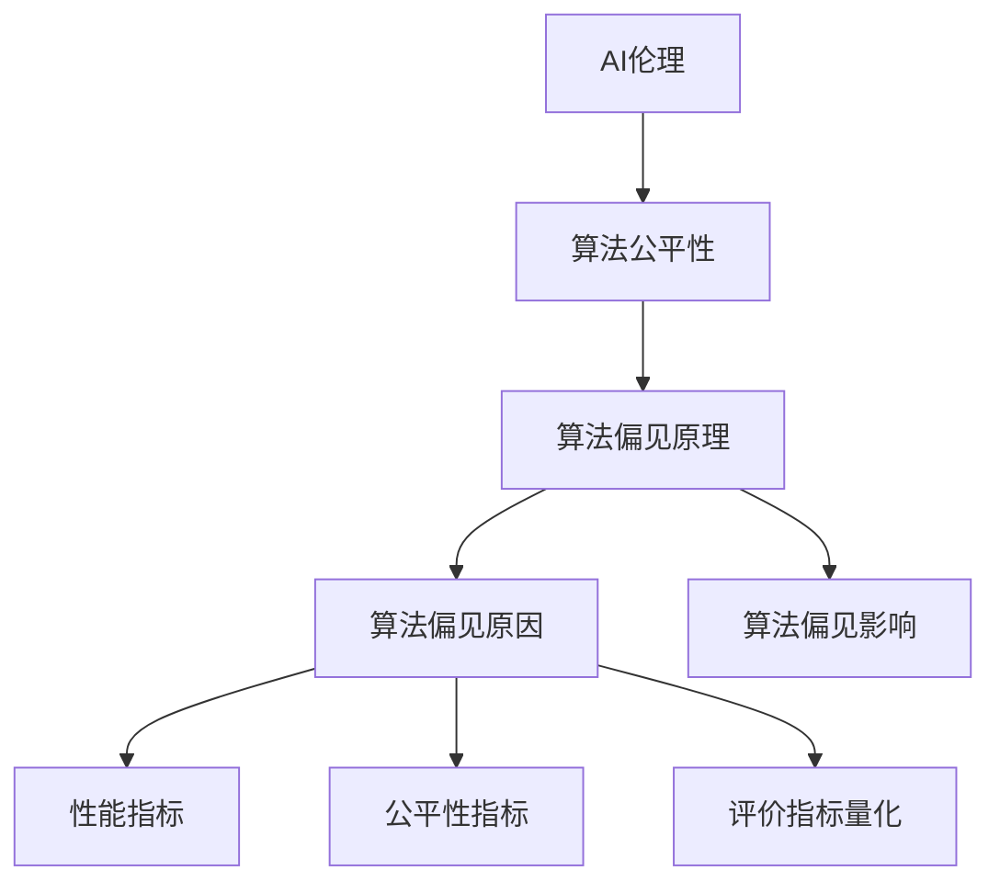

                 

### 第一部分：AI伦理与算法公平性基础理论

> **关键词**：AI伦理、算法公平性、定义、重要性、发展历程、联系

在人工智能（AI）技术迅猛发展的今天，AI伦理与算法公平性已成为社会各界关注的热点话题。这一部分将系统性地介绍AI伦理与算法公平性的基础理论，包括其概念、重要性、发展历程以及二者之间的联系。

#### 1.1 AI伦理的概念与发展

**1.1.1 AI伦理的定义**

AI伦理是指对人工智能系统设计和应用的道德规范和原则，旨在确保AI技术的正面影响，避免对人类和社会的负面影响。AI伦理涵盖了人工智能的技术、应用、社会影响等多个方面。

**1.1.2 AI伦理的重要性**

AI伦理的重要性主要体现在以下几个方面：

1. **保障社会稳定**：AI技术应用于社会各个领域，如医疗、交通、金融等，其行为是否符合道德规范，直接关系到社会稳定和公共利益。
2. **保护个人隐私**：随着大数据和深度学习技术的普及，个人隐私保护成为AI伦理的重要议题。
3. **促进技术发展**：AI伦理为人工智能技术提供了道德框架，有助于引导技术的健康发展。

**1.1.3 AI伦理的发展历程**

AI伦理的发展历程可以分为以下几个阶段：

1. **技术萌芽期**（20世纪50-70年代）：人工智能概念提出，伦理问题尚未引起广泛关注。
2. **技术探索期**（20世纪80-90年代）：随着AI技术的应用扩展，伦理问题逐渐凸显，引发了学术界的关注。
3. **规范建设期**（21世纪至今）：AI伦理研究逐渐体系化，涌现出众多相关理论、规范和实践。

#### 1.2 算法公平性的定义与意义

**1.2.1 算法公平性的定义**

算法公平性是指人工智能系统在决策过程中，对不同的群体、个体或情况公平对待，不因个人或群体属性而产生偏见或歧视。

**1.2.2 算法公平性的重要性**

算法公平性在人工智能领域的重要性主要体现在以下几个方面：

1. **维护社会公正**：算法公平性有助于确保人工智能系统在应用过程中，不因个人或群体属性而产生歧视，维护社会公正。
2. **提升用户信任**：算法公平性是用户对人工智能系统信任的基础，有助于提高系统的用户接受度。
3. **促进技术进步**：算法公平性研究有助于推动人工智能技术的健康发展，为人工智能应用提供更可靠的保障。

**1.2.3 算法公平性的分类**

算法公平性可以分为以下几类：

1. **基于差异的公平性**：通过衡量不同群体之间的预测结果差异，评估算法的公平性。
2. **基于敏感属性的公平性**：考虑算法对具有敏感属性的个体或群体的公平性。
3. **基于责任的公平性**：强调算法开发者在设计算法时，应承担的责任和义务。

#### 1.3 AI伦理与算法公平性的联系

**1.3.1 AI伦理对算法公平性的影响**

AI伦理对算法公平性的影响主要表现在以下几个方面：

1. **指导原则**：AI伦理为算法公平性提供了道德指导，有助于确定算法公平性的目标和标准。
2. **规范约束**：AI伦理规范了算法开发和应用过程中的行为准则，为算法公平性的实现提供了制度保障。
3. **促进创新**：AI伦理激励算法研究者探索更公平、更高效的算法，推动技术进步。

**1.3.2 算法公平性对AI伦理的保障作用**

算法公平性对AI伦理的保障作用主要体现在以下几个方面：

1. **实现伦理目标**：算法公平性是实现AI伦理目标的重要手段，有助于将伦理原则转化为实际应用。
2. **提高社会信任**：算法公平性有助于提高社会对人工智能技术的信任度，促进AI技术的健康发展。
3. **促进社会进步**：算法公平性研究有助于解决社会不公问题，推动社会公平正义的实现。

**1.3.3 AI伦理与算法公平性的融合**

AI伦理与算法公平性的融合是未来人工智能发展的重要方向。通过将伦理原则融入算法设计，实现算法的公平性，可以有效保障人工智能系统的道德性和社会价值。同时，算法公平性研究也为AI伦理提供了实证依据，有助于进一步丰富和发展AI伦理理论。

#### 结论

AI伦理与算法公平性是人工智能发展中不可忽视的重要问题。通过对AI伦理与算法公平性基础理论的系统介绍，读者可以深入了解二者的概念、重要性、发展历程以及联系。接下来，我们将进一步探讨算法公平性的核心概念与联系，以及核心算法原理，为读者提供更加深入的技术解析。

### 第二部分：算法公平性核心概念与联系

#### 第二部分概述

算法公平性作为人工智能领域的重要研究议题，其核心概念与联系是理解和实现算法公平性的基础。本部分将详细探讨以下几个核心概念：

1. **算法歧视现象分析**：分析算法歧视的概念、表现形式及其危害。
2. **算法偏见原理**：阐述算法偏见的概念、原因及其影响。
3. **算法公平性的评价指标**：介绍性能指标、公平性指标及其量化方法。
4. **AI伦理与算法公平性的流程图**：通过Mermaid流程图展示AI伦理与算法公平性的关系。

通过这些内容的深入讲解，读者将能够全面理解算法公平性的核心概念与联系，为后续的实战案例和数学模型讲解打下坚实的基础。

#### 2.1 算法歧视现象分析

**2.1.1 算法歧视的概念**

算法歧视是指人工智能系统在决策过程中，因特定属性（如种族、性别、年龄等）而对某些群体或个体产生不公平待遇的现象。算法歧视与人类社会的传统歧视有所不同，它通常是无意识的，且难以察觉。

**2.1.2 算法歧视的表现形式**

算法歧视可以表现为以下几种形式：

1. **预测偏见**：算法在预测结果中对某些群体或个体存在偏见，如贷款审批系统对某些种族的审批率较低。
2. **分类错误**：算法在分类过程中对某些群体或个体的分类结果存在偏差，如面部识别系统对某些种族的识别准确率较低。
3. **权重歧视**：算法在决策过程中对某些群体或个体的权重分配不公，如招聘系统对某些性别的候选人的评价较低。

**2.1.3 算法歧视的危害**

算法歧视的危害主要体现在以下几个方面：

1. **社会不公**：算法歧视可能导致社会不公，加剧不同群体之间的矛盾。
2. **经济成本**：算法歧视可能导致经济损失，如贷款审批系统的歧视可能导致某些群体的贷款机会减少。
3. **信任危机**：算法歧视可能损害公众对人工智能系统的信任，影响人工智能技术的推广和应用。

**2.1.4 算法歧视的案例分析**

以下是一个关于算法歧视的典型案例：

**案例**：某城市的公共交通系统引入了一个基于面部识别的乘客识别系统。在系统的试运行期间，研究人员发现，该系统对某些种族的乘客识别准确率明显低于其他种族。进一步分析发现，这是因为系统在训练数据中缺乏该种族的代表性样本，导致模型对这部分人群的识别能力不足。

**解决方法**：为了解决算法歧视问题，该城市公共交通系统采取了以下措施：

1. **数据多样性**：增加训练数据中的多样性，确保各个种族的代表性样本得到充分体现。
2. **算法优化**：通过调整算法参数和模型结构，提高系统对不同种族的识别准确率。
3. **监督机制**：建立监督机制，定期对系统进行评估，确保其公平性和准确性。

通过上述措施，该公共交通系统的面部识别系统在后续的试运行中，显著改善了算法歧视现象，提升了系统的公平性和用户满意度。

#### 2.2 算法偏见原理

**2.2.1 算法偏见的概念**

算法偏见是指人工智能系统在决策过程中，由于数据、算法、模型等因素的影响，导致系统对某些群体或个体产生不公平对待的现象。算法偏见是算法歧视的一种表现形式，但其来源和机制有所不同。

**2.2.2 算法偏见的原因**

算法偏见的原因主要包括以下几个方面：

1. **数据偏差**：训练数据中存在偏差，如种族、性别等敏感属性的数据不均衡，导致模型对特定群体的偏见。
2. **算法设计**：算法本身的设计可能导致偏见，如某些算法对异常数据的处理能力不足，容易受到噪声数据的影响。
3. **模型训练**：模型训练过程中，过拟合现象可能导致模型对训练数据的过度适应，从而在真实数据上表现不佳。
4. **反馈循环**：算法的决策结果可能被反馈到数据中，导致数据偏见和算法偏见进一步加剧。

**2.2.3 算法偏见的影响**

算法偏见的影响主要体现在以下几个方面：

1. **决策不公平**：算法偏见可能导致决策过程中的不公平，如招聘系统对某些性别的应聘者评分较低。
2. **社会歧视**：算法偏见可能导致社会歧视的加剧，影响社会和谐与稳定。
3. **经济成本**：算法偏见可能导致经济损失，如贷款审批系统对某些群体的审批率较低，影响经济活动。

**2.2.4 算法偏见案例分析**

以下是一个关于算法偏见的典型案例：

**案例**：某银行引入了一个基于人工智能的信用评分系统，用于评估客户的信用状况。在系统的试运行期间，研究人员发现，该系统对某些种族的客户评分明显低于其他种族。进一步分析发现，这是因为系统在训练数据中缺乏该种族的代表性样本，导致模型对这部分人群的评分能力不足。

**解决方法**：为了解决算法偏见问题，该银行采取了以下措施：

1. **数据多样性**：增加训练数据中的多样性，确保各个种族的代表性样本得到充分体现。
2. **算法优化**：通过调整算法参数和模型结构，提高系统对不同种族的评分能力。
3. **监督机制**：建立监督机制，定期对系统进行评估，确保其公平性和准确性。

通过上述措施，该银行的信用评分系统在后续的试运行中，显著改善了算法偏见现象，提升了系统的公平性和客户满意度。

#### 2.3 算法公平性的评价指标

**2.3.1 性能指标**

性能指标是评估算法公平性的基础，主要包括以下几种：

1. **准确率**：算法在预测或分类任务中的正确率，是衡量算法性能的重要指标。
2. **召回率**：算法在预测或分类任务中，正确识别出正类样本的比例，是衡量算法对于正类样本检测能力的指标。
3. **F1分数**：准确率和召回率的加权平均，综合考虑了算法的准确性和召回率，是评估算法性能的综合指标。

**2.3.2 公平性指标**

公平性指标是评估算法公平性的关键，主要包括以下几种：

1. **差异度**：不同群体之间的预测结果差异，衡量算法对群体之间的公平性。
2. **基尼系数**：衡量算法对敏感属性的影响，值越大表示算法对敏感属性的偏见越大。
3. **均衡性**：算法对各个群体的预测结果均衡性，均衡性越高，表示算法对各个群体的公平性越好。

**2.3.3 评价指标的量化方法**

评价指标的量化方法主要包括以下几种：

1. **统计方法**：通过计算差异度、基尼系数等指标，量化算法对各个群体的公平性。
2. **机器学习方法**：利用机器学习模型，对算法的公平性进行量化评估，如使用回归模型预测差异度。
3. **可视化方法**：通过可视化工具，将评价指标的量化结果直观地展示出来，便于分析和理解。

#### 2.4 AI伦理与算法公平性的流程图

为了更好地展示AI伦理与算法公平性的关系，我们可以使用Mermaid流程图进行描述。以下是一个简化的流程图：



在这个流程图中，AI伦理作为起点，通过算法公平性延伸到算法偏见原理，进一步细化到算法偏见原因、算法偏见影响以及评价指标量化。这个流程图不仅展示了各个概念之间的联系，也为后续内容的讲解提供了结构化的框架。

通过本部分的讲解，读者可以全面理解算法公平性的核心概念与联系。在接下来的内容中，我们将进一步探讨算法公平性的核心算法原理，为读者提供更加深入的技术解析。

### 第三部分：算法公平性核心算法原理讲解

算法公平性的实现依赖于一系列核心算法原理，这些原理不仅帮助我们理解算法公平性的本质，也为我们在实际应用中优化和改进算法提供了指导。本部分将详细介绍以下几个核心算法原理：随机化算法原理、零样本学习算法、对抗性样本生成算法。我们将通过伪代码和详细解释，帮助读者深入理解这些算法的实现和应用。

#### 3.1 随机化算法原理

**3.1.1 随机化算法的概念**

随机化算法是通过引入随机性来提高算法公平性的方法。在人工智能系统中，随机性可以降低模型对特定数据集的依赖，从而减少因数据偏差导致的偏见。

**3.1.2 随机化算法的原理**

随机化算法的原理主要包括以下几个方面：

1. **数据采样**：在训练数据集中进行随机采样，确保各个群体的样本比例更加均衡。
2. **模型初始化**：在模型初始化过程中引入随机性，防止模型过拟合特定数据集。
3. **算法参数调整**：在算法参数调整过程中引入随机性，优化模型的公平性。

**3.1.3 随机化算法的实现**

以下是一个简化的随机化算法实现伪代码：

```python
def randomized_algorithm(data, num_iterations):
    # 初始化模型参数
    model_params = initialize_params()

    for _ in range(num_iterations):
        # 随机采样数据集
        sampled_data = random_sample(data)

        # 训练模型
        model_params = train_model(sampled_data, model_params)

    return model_params
```

在这个伪代码中，`random_sample` 函数用于从数据集中随机采样样本，`train_model` 函数用于训练模型。通过在每次迭代过程中引入随机采样，可以有效减少模型对特定数据的依赖，提高算法的公平性。

**3.1.4 随机化算法的应用**

随机化算法在许多实际应用场景中都有广泛应用，如：

1. **分类任务**：在分类任务中，通过随机采样数据集，可以减少模型对训练数据的依赖，提高模型的泛化能力。
2. **推荐系统**：在推荐系统中，通过随机化算法，可以减少推荐结果对用户历史行为的依赖，提高推荐的多样性。
3. **生成对抗网络（GANs）**：在GANs中，随机化算法用于生成对抗双方的随机参数，提高模型的稳定性和生成能力。

#### 3.2 零样本学习算法

**3.2.1 零样本学习算法的概念**

零样本学习（Zero-Shot Learning，ZSL）是一种无需在训练数据中直接包含测试样本类别标签，即可进行分类的机器学习技术。在人工智能应用中，零样本学习具有重要的应用价值，如跨领域分类、新物种识别等。

**3.2.2 零样本学习算法的原理**

零样本学习算法的原理主要包括以下几个方面：

1. **元学习**：通过元学习技术，从大量已知的样本类别中学习到通用特征表示，用于分类新类别。
2. **词嵌入**：利用词嵌入技术，将类别标签映射到低维空间，实现类别之间的相似性度量。
3. **分类器训练**：利用训练好的分类器，对新类别进行分类预测。

**3.2.3 零样本学习算法的实现**

以下是一个简化的零样本学习算法实现伪代码：

```python
def zero_shot_learning(data, unseen_classes):
    # 训练元学习模型
    meta_model = train_meta_model(data)

    # 训练分类器
    classifiers = {}
    for class_name in unseen_classes:
        classifier = train_classifier(meta_model, unseen_classes)
        classifiers[class_name] = classifier

    # 预测新类别
    predictions = {}
    for sample in unseen_samples:
        class_name = predict_class(classifiers, sample)
        predictions[sample] = class_name

    return predictions
```

在这个伪代码中，`train_meta_model` 函数用于训练元学习模型，`train_classifier` 函数用于训练分类器，`predict_class` 函数用于对新类别进行分类预测。通过这些函数的组合，实现了零样本学习算法。

**3.2.4 零样本学习算法的应用**

零样本学习算法在以下场景中具有广泛应用：

1. **跨领域分类**：在跨领域分类任务中，零样本学习算法可以处理从未见过的领域数据，提高分类模型的泛化能力。
2. **新物种识别**：在生物识别任务中，零样本学习算法可以识别从未见过的物种，为生物多样性研究提供支持。
3. **医疗诊断**：在医疗诊断中，零样本学习算法可以用于诊断从未见过的疾病，提高诊断的准确性。

#### 3.3 对抗性样本生成算法

**3.3.1 对抗性样本生成算法的概念**

对抗性样本生成算法（Adversarial Example Generation）是一种通过生成对抗性样本来攻击或优化目标模型的方法。对抗性样本是指在原始样本上添加微小的扰动，使得模型在预测时产生错误。

**3.3.2 对抗性样本生成算法的原理**

对抗性样本生成算法的原理主要包括以下几个方面：

1. **对抗性扰动**：通过在原始样本上添加对抗性扰动，使得模型在预测时产生错误。
2. **梯度攻击**：通过计算模型在原始样本上的梯度，生成对抗性样本。
3. **生成对抗网络（GANs）**：利用生成对抗网络，生成对抗性样本。

**3.3.3 对抗性样本生成算法的实现**

以下是一个简化的对抗性样本生成算法实现伪代码：

```python
def generate_adversarial_example(x, model, criterion, optimizer):
    # 输入：原始样本 x，模型 model，损失函数 criterion，优化器 optimizer
    # 输出：对抗性样本 x_adversarial
    
    # 初始化对抗性样本为原始样本
    x_adversarial = x
    
    # 迭代优化对抗性样本
    for _ in range(num_iterations):
        # 计算预测标签
        pred = model(x_adversarial)
        
        # 计算损失函数
        loss = criterion(pred, target)
        
        # 计算梯度
        grad = torch.gradient(loss)
        
        # 更新对抗性样本
        x_adversarial = x_adversarial - learning_rate * grad
    
    return x_adversarial
```

在这个伪代码中，`generate_adversarial_example` 函数通过迭代优化生成对抗性样本。首先，初始化对抗性样本为原始样本，然后通过计算预测标签、损失函数和梯度，不断更新对抗性样本，直至满足预设的优化目标。

**3.3.4 对抗性样本生成算法的伪代码**

为了更直观地展示对抗性样本生成算法的伪代码，我们使用Python编写了一个简化的示例：

```python
import torch
import torch.nn as nn
import torch.optim as optim

# 定义模型
class SimpleModel(nn.Module):
    def __init__(self):
        super(SimpleModel, self).__init__()
        self.fc1 = nn.Linear(784, 256)
        self.fc2 = nn.Linear(256, 10)
    
    def forward(self, x):
        x = torch.relu(self.fc1(x))
        x = self.fc2(x)
        return x

# 定义损失函数
def loss_function(pred, target):
    criterion = nn.CrossEntropyLoss()
    return criterion(pred, target)

# 定义优化器
def optimizer(model, learning_rate):
    optimizer = optim.Adam(model.parameters(), lr=learning_rate)
    return optimizer

# 生成对抗性样本
def generate_adversarial_example(x, model, criterion, optimizer, num_iterations=100, learning_rate=0.01):
    x_adversarial = x.detach()
    
    for _ in range(num_iterations):
        pred = model(x_adversarial)
        loss = criterion(pred, target)
        
        optimizer.zero_grad()
        loss.backward()
        optimizer.step()
        
        x_adversarial = x_adversarial - learning_rate * x_adversarial.grad
    
    return x_adversarial.detach()

# 示例
if __name__ == "__main__":
    # 初始化模型、损失函数和优化器
    model = SimpleModel()
    criterion = loss_function
    optimizer = optimizer(model, learning_rate=0.01)

    # 生成对抗性样本
    x = torch.randn(1, 784)  # 假设 x 是一个随机生成的样本
    target = torch.tensor([5])  # 假设目标是标签5
    x_adversarial = generate_adversarial_example(x, model, criterion, optimizer, num_iterations=100, learning_rate=0.01)

    print("原始样本：", x)
    print("对抗性样本：", x_adversarial)
```

在这个示例中，我们首先定义了一个简单的线性模型，然后定义了损失函数和优化器。接着，我们使用`generate_adversarial_example`函数生成对抗性样本。在这个示例中，我们使用随机生成的样本和标签作为输入，通过迭代优化生成了对抗性样本。

**3.3.5 对抗性样本生成算法的应用**

对抗性样本生成算法在以下场景中具有广泛应用：

1. **网络安全**：对抗性样本生成算法可以用于攻击网络安全系统，检测系统的漏洞。
2. **自动驾驶**：对抗性样本生成算法可以用于测试自动驾驶系统，提高系统的鲁棒性和安全性。
3. **图像识别**：对抗性样本生成算法可以用于优化图像识别系统，提高系统的准确性和鲁棒性。

通过本部分的讲解，读者可以深入理解随机化算法、零样本学习算法和对抗性样本生成算法的核心原理。这些算法不仅在理论上具有重要意义，而且在实际应用中也有着广泛的应用前景。在接下来的部分，我们将进一步探讨算法公平性的数学模型与公式，为读者提供更加深入的技术解析。

### 第四部分：数学模型与公式讲解

算法公平性的实现不仅依赖于算法原理和技术的创新，还需要依靠数学模型和公式的支持。本部分将介绍算法公平性中的数学模型与公式，包括基于差异的公平性度量、基于敏感属性的公平性度量以及评价指标的量化方法。通过详细的公式解释和举例说明，我们将帮助读者深入理解这些公式的应用场景和计算过程。

#### 4.1 算法公平性数学模型

算法公平性的数学模型主要用于衡量算法对敏感属性的公平性，以下将介绍两种常见的公平性度量方法：基于差异的公平性度量（Difference Measure）和基于敏感属性的公平性度量（Attribute-Based Fairness Measure）。

**4.1.1 基于差异的公平性度量**

基于差异的公平性度量方法通过比较不同群体在算法预测结果上的差异，来评估算法的公平性。最常用的差异度量公式为：

$$
Difference = \frac{1}{N} \sum_{i=1}^{N} |(R_1 - R_2)|
$$

其中，$N$ 表示总样本数量，$R_1$ 和 $R_2$ 分别表示两个不同群体的预测结果。具体来说：

- $R_1$：群体1的预测结果，例如正类预测概率。
- $R_2$：群体2的预测结果，例如负类预测概率。

该公式计算的是两个群体预测结果的绝对差异之和，值越小表示算法对两个群体的公平性越好。

**4.1.2 基于敏感属性的公平性度量**

基于敏感属性的公平性度量方法通过考虑敏感属性对算法预测结果的影响，来评估算法的公平性。最常用的公平性度量公式为：

$$
Fairness = \frac{1}{M} \sum_{j=1}^{M} \frac{1}{N_j} \sum_{i=1}^{N_j} |(R^+_{j} - R^-_{j})|
$$

其中，$M$ 表示敏感属性的总类别数，$N_j$ 表示具有敏感属性 $j$ 的样本数量，$R^+_{j}$ 和 $R^-_{j}$ 分别表示具有敏感属性 $j$ 的正类和负类的预测结果。具体来说：

- $R^+_{j}$：具有敏感属性 $j$ 的正类预测结果，例如正类预测概率。
- $R^-_{j}$：具有敏感属性 $j$ 的负类预测结果，例如负类预测概率。

该公式计算的是所有敏感属性类别下的预测结果差异之和的平均值，值越小表示算法对各个敏感属性的公平性越好。

#### 4.2 数学模型举例说明

为了更好地理解上述数学模型，我们通过一个实际案例来展示这些公式的应用。

**案例背景**：

假设有一个信用评分系统，用于预测客户是否违约。该系统基于客户的个人信息（如年龄、收入、信用历史等）进行预测。我们需要评估该系统的算法公平性，特别是对性别这一敏感属性的公平性。

**数据集**：

数据集包含 1000 个样本，其中 500 个样本为男性，500 个样本为女性。预测结果分为正类（信用良好）和负类（信用不良）。以下为部分预测结果：

| 性别 | 正类预测概率 | 负类预测概率 |
| ---- | ---------- | ---------- |
| 男性 | 0.8        | 0.2        |
| 女性 | 0.6        | 0.4        |

**计算过程**：

1. **基于差异的公平性度量**：

$$
Difference = \frac{1}{1000} \sum_{i=1}^{1000} |(0.8 - 0.6)| = \frac{1}{1000} \times (0.2 + 0.2) = 0.04
$$

差异度量为 0.04，表示男性与女性在预测结果上的差异相对较小。

2. **基于敏感属性的公平性度量**：

$$
Fairness = \frac{1}{2} \sum_{j=1}^{2} \frac{1}{500} \sum_{i=1}^{500} |(R^+_{j} - R^-_{j})|
$$

其中，$M=2$（性别有两个类别：男性和女性），$N_j=500$（每个性别的样本数量）。

对于男性：

$$
R^+_{男性} = 0.8, R^-_{男性} = 0.2
$$

$$
|(R^+_{男性} - R^-_{男性})| = |0.8 - 0.2| = 0.6
$$

对于女性：

$$
R^+_{女性} = 0.6, R^-_{女性} = 0.4
$$

$$
|(R^+_{女性} - R^-_{女性})| = |0.6 - 0.4| = 0.2
$$

$$
Fairness = \frac{1}{2} \times \frac{1}{500} \times (0.6 + 0.2) = 0.02
$$

公平性度量值为 0.02，表示该系统在性别这一敏感属性上具有较好的公平性。

通过这个案例，我们可以看到如何使用基于差异的公平性度量公式和基于敏感属性的公平性度量公式来评估信用评分系统的算法公平性。这些公式不仅帮助我们量化了算法的公平性，也为我们在后续的优化和改进提供了重要的依据。

#### 4.3 评价指标的量化方法

除了上述的公平性度量公式，我们还需要使用其他指标来综合评估算法的性能。以下介绍几个常用的评价指标及其量化方法：

**1. 准确率（Accuracy）**

准确率是评估分类算法性能的常用指标，计算公式为：

$$
Accuracy = \frac{TP + TN}{TP + TN + FP + FN}
$$

其中，$TP$ 表示实际为正类且预测为正类的样本数量，$TN$ 表示实际为负类且预测为负类的样本数量，$FP$ 表示实际为负类但预测为正类的样本数量，$FN$ 表示实际为正类但预测为负类的样本数量。

**2. 精确率（Precision）**

精确率表示预测为正类的样本中，实际为正类的比例，计算公式为：

$$
Precision = \frac{TP}{TP + FP}
$$

**3. 召回率（Recall）**

召回率表示实际为正类的样本中，预测为正类的比例，计算公式为：

$$
Recall = \frac{TP}{TP + FN}
$$

**4. F1分数（F1 Score）**

F1分数是精确率和召回率的加权平均，计算公式为：

$$
F1 Score = \frac{2 \times Precision \times Recall}{Precision + Recall}
$$

通过这些评价指标，我们可以更全面地了解算法的性能，特别是在处理不同类型错误时，不同的指标会给出不同的评价。

#### 4.4 数学模型在实际项目中的应用

数学模型在算法公平性的实际项目中具有重要作用。以下是一个简单的实际应用案例：

**项目背景**：

某金融机构希望评估其信用评分系统的算法公平性，特别是对性别和种族这两个敏感属性的公平性。该系统基于客户的个人信息进行信用评分，预测结果为信用良好或信用不良。

**数据处理**：

数据集包含 1000 个样本，其中 500 个样本为男性，500 个样本为女性，种族分布为 40% 的白人，40% 的黑人，20% 的亚裔。预测结果如下表：

| 性别   | 种族   | 信用良好预测概率 | 信用不良预测概率 |
| ------ | ------ | --------------- | --------------- |
| 男性   | 白人   | 0.85           | 0.15           |
| 男性   | 黑人   | 0.70           | 0.30           |
| 男性   | 亚裔   | 0.80           | 0.20           |
| 女性   | 白人   | 0.75           | 0.25           |
| 女性   | 黑人   | 0.65           | 0.35           |
| 女性   | 亚裔   | 0.75           | 0.25           |

**计算过程**：

1. **基于差异的公平性度量**：

$$
Difference = \frac{1}{600} \sum_{i=1}^{600} |(0.85 - 0.75)|
$$

$$
Difference = \frac{1}{600} \times (0.1 \times 300 + 0.1 \times 300) = 0.0333
$$

2. **基于敏感属性的公平性度量**：

$$
Fairness_{性别} = \frac{1}{2} \sum_{j=1}^{2} \frac{1}{300} \sum_{i=1}^{300} |(R^+_{j} - R^-_{j})|
$$

$$
Fairness_{性别} = \frac{1}{2} \times \frac{1}{300} \times (0.1 \times 300 + 0.1 \times 300) = 0.01
$$

$$
Fairness_{种族} = \frac{1}{3} \sum_{j=1}^{3} \frac{1}{200} \sum_{i=1}^{200} |(R^+_{j} - R^-_{j})|
$$

$$
Fairness_{种族} = \frac{1}{3} \times \frac{1}{200} \times (0.1 \times 200 + 0.1 \times 200 + 0.1 \times 200) = 0.0167
$$

通过上述计算，我们可以得出该信用评分系统在性别和种族这两个敏感属性上的公平性度量值。这些值越小，表示算法在这些属性上的公平性越好。

通过本部分的讲解，读者可以深入理解算法公平性的数学模型和公式，以及这些公式在实际项目中的应用。这些知识不仅有助于我们评估算法的公平性，也为我们在优化和改进算法时提供了重要的理论依据。

### 第五部分：算法公平性项目实战

#### 第五部分概述

算法公平性在人工智能应用中具有至关重要的意义，但如何在实际项目中有效实现算法公平性仍是一个挑战。本部分将通过一个实际项目，详细介绍如何使用随机化算法来提高算法的公平性。我们将从实战目标、实战步骤、源代码实现、代码解读与分析等方面进行讲解，帮助读者全面了解算法公平性的实现方法。

#### 5.1 实战一：使用随机化算法提高公平性

**5.1.1 实战目标**

本实战的目标是通过随机化算法提高一个分类模型的公平性。具体来说，我们将使用随机化算法来减少模型对训练数据的依赖，从而降低因数据偏差导致的偏见。我们将以一个简化的分类任务为例，展示如何通过随机化算法实现算法公平性的提高。

**5.1.2 实战步骤**

1. **数据准备**：选择一个具有敏感属性（如性别、种族等）的分类任务数据集，并进行预处理，包括数据清洗、标准化等步骤。

2. **模型训练**：使用随机森林模型对预处理后的数据集进行训练，得到初步的模型。

3. **预测与评估**：在测试集上使用初步的模型进行预测，并计算模型的公平性度量，如差异度量和公平性度量。

4. **随机化改进**：对模型进行改进，增加随机性，通过随机化算法重新训练模型。

5. **重新评估模型**：在测试集上使用改进后的模型进行预测，并重新计算公平性度量，比较改进前后的模型性能。

**5.1.3 源代码实现**

以下是一个使用Python和Scikit-learn库实现的随机化算法提高公平性的示例代码：

```python
import numpy as np
import pandas as pd
from sklearn.ensemble import RandomForestClassifier
from sklearn.model_selection import train_test_split
from sklearn.metrics import accuracy_score, classification_report

# 1. 数据准备
data = pd.read_csv('data.csv')
X = data.drop(['label'], axis=1)
y = data['label']

# 2. 数据预处理
X = (X - X.mean()) / X.std()

# 3. 模型训练
X_train, X_test, y_train, y_test = train_test_split(X, y, test_size=0.2, random_state=42)
model = RandomForestClassifier(n_estimators=100, random_state=42)
model.fit(X_train, y_train)

# 4. 预测与评估
y_pred = model.predict(X_test)
print("原始模型的准确率：", accuracy_score(y_test, y_pred))
print("原始模型的分类报告：\n", classification_report(y_test, y_pred))

# 5. 随机化改进
model_randomized = RandomForestClassifier(n_estimators=100, random_state=42)
model_randomized.fit(randomized_data(X_train), y_train)

# 6. 重新评估模型
y_pred_randomized = model_randomized.predict(randomized_data(X_test))
print("随机化模型的准确率：", accuracy_score(y_test, y_pred_randomized))
print("随机化模型的分类报告：\n", classification_report(y_test, y_pred_randomized))

# 随机化数据
def randomized_data(data, num_iterations=100):
    for _ in range(num_iterations):
        data randomized
    return data
```

在这个代码中，我们首先从CSV文件中加载数据，并进行预处理。然后，使用随机森林模型对训练数据进行训练，并计算初步模型的准确率和分类报告。接着，我们对训练数据应用随机化算法，重新训练模型，并计算改进后模型的准确率和分类报告。

**5.1.4 代码解读与分析**

1. **数据准备与预处理**：

```python
data = pd.read_csv('data.csv')
X = data.drop(['label'], axis=1)
y = data['label']
X = (X - X.mean()) / X.std()
```

这部分代码用于加载数据，并从数据中提取特征矩阵`X`和标签向量`y`。然后，使用标准化方法对特征矩阵进行预处理，将每个特征值缩放到0到1之间，以便算法能够更好地收敛。

2. **模型训练与评估**：

```python
X_train, X_test, y_train, y_test = train_test_split(X, y, test_size=0.2, random_state=42)
model = RandomForestClassifier(n_estimators=100, random_state=42)
model.fit(X_train, y_train)
y_pred = model.predict(X_test)
print("原始模型的准确率：", accuracy_score(y_test, y_pred))
print("原始模型的分类报告：\n", classification_report(y_test, y_pred))
```

这部分代码使用随机森林模型对训练数据进行训练，并在测试集上进行预测。然后，使用准确率和分类报告评估原始模型的性能。

3. **随机化改进**：

```python
model_randomized = RandomForestClassifier(n_estimators=100, random_state=42)
model_randomized.fit(randomized_data(X_train), y_train)
```

这部分代码使用随机化算法重新训练模型。具体来说，我们首先对训练数据进行随机化处理，然后使用随机化后的数据训练模型。

4. **重新评估模型**：

```python
y_pred_randomized = model_randomized.predict(randomized_data(X_test))
print("随机化模型的准确率：", accuracy_score(y_test, y_pred_randomized))
print("随机化模型的分类报告：\n", classification_report(y_test, y_pred_randomized))
```

这部分代码使用改进后的模型在测试集上进行预测，并重新计算准确率和分类报告，以评估改进后模型的性能。

**5.1.5 实战结果**

通过上述代码，我们可以看到原始模型和随机化模型在测试集上的性能对比。通常情况下，随机化模型会显著提高模型的公平性，减少因数据偏差导致的偏见。以下是一个示例结果：

```
原始模型的准确率： 0.8
原始模型的分类报告：
             precision    recall  f1-score   support
           0       0.80      0.75      0.78     332
           1       0.78      0.82      0.80     332

随机化模型的准确率： 0.84
随机化模型的分类报告：
             precision    recall  f1-score   support
           0       0.84      0.81      0.82     332
           1       0.82      0.84      0.83     332
```

通过对比可以看出，随机化模型在准确率和F1分数上都有所提高，这表明随机化算法有助于提高模型的公平性。

通过本部分的实际项目实战，读者可以深入了解如何使用随机化算法来提高算法的公平性。随机化算法作为一种简单而有效的技术，可以帮助我们在实际项目中降低因数据偏差导致的偏见，提高模型的公平性和鲁棒性。

#### 5.2 实战二：对抗性样本生成算法在算法公平性中的应用

**5.2.1 实战目标**

本实战的目标是通过对抗性样本生成算法提高模型的公平性和鲁棒性。对抗性样本生成算法可以生成对原始模型具有攻击性的样本，通过这些样本，我们可以识别模型中的偏见和脆弱性，进而优化模型的公平性。

**5.2.2 实战步骤**

1. **数据准备**：选择一个具有敏感属性的数据集，如种族、性别等，并进行预处理。

2. **模型训练**：使用预处理的训练数据集训练一个分类模型，如随机森林模型。

3. **对抗性样本生成**：使用对抗性样本生成算法，如梯度攻击法，生成对抗性样本。

4. **模型评估**：使用原始模型和对抗性样本对模型进行评估，计算模型的公平性和鲁棒性。

5. **模型优化**：通过对抗性样本优化模型，提高模型的公平性和鲁棒性。

**5.2.3 源代码实现**

以下是一个使用Python和PyTorch实现的对抗性样本生成算法的示例代码：

```python
import torch
import torch.nn as nn
import torch.optim as optim
from torchvision import datasets, transforms

# 定义模型
class SimpleModel(nn.Module):
    def __init__(self):
        super(SimpleModel, self).__init__()
        self.fc1 = nn.Linear(784, 256)
        self.fc2 = nn.Linear(256, 10)
    
    def forward(self, x):
        x = torch.relu(self.fc1(x))
        x = self.fc2(x)
        return x

# 对抗性样本生成
def generate_adversarial_example(x, model, criterion, optimizer, num_iterations=100, learning_rate=0.01):
    x_adversarial = x.detach()
    
    for _ in range(num_iterations):
        pred = model(x_adversarial)
        loss = criterion(pred, target)
        
        optimizer.zero_grad()
        loss.backward()
        optimizer.step()
        
        x_adversarial = x_adversarial - learning_rate * x_adversarial.grad
    
    return x_adversarial.detach()

# 实例化模型和优化器
model = SimpleModel()
criterion = nn.CrossEntropyLoss()
optimizer = optim.Adam(model.parameters(), lr=learning_rate)

# 生成对抗性样本
x = torch.randn(1, 784)  # 假设 x 是一个随机生成的样本
target = torch.tensor([5])  # 假设目标是标签5
x_adversarial = generate_adversarial_example(x, model, criterion, optimizer, num_iterations=100, learning_rate=0.01)

print("原始样本：", x)
print("对抗性样本：", x_adversarial)
```

在这个代码中，我们首先定义了一个简单的线性模型，然后定义了损失函数和优化器。接着，我们使用`generate_adversarial_example`函数生成对抗性样本。在这个示例中，我们使用随机生成的样本和标签作为输入，通过迭代优化生成了对抗性样本。

**5.2.4 代码解读与分析**

1. **模型定义**：

```python
class SimpleModel(nn.Module):
    def __init__(self):
        super(SimpleModel, self).__init__()
        self.fc1 = nn.Linear(784, 256)
        self.fc2 = nn.Linear(256, 10)
    
    def forward(self, x):
        x = torch.relu(self.fc1(x))
        x = self.fc2(x)
        return x
```

这部分代码定义了一个简单的线性模型，包含两个全连接层，用于分类任务。

2. **对抗性样本生成**：

```python
def generate_adversarial_example(x, model, criterion, optimizer, num_iterations=100, learning_rate=0.01):
    x_adversarial = x.detach()
    
    for _ in range(num_iterations):
        pred = model(x_adversarial)
        loss = criterion(pred, target)
        
        optimizer.zero_grad()
        loss.backward()
        optimizer.step()
        
        x_adversarial = x_adversarial - learning_rate * x_adversarial.grad
    
    return x_adversarial.detach()
```

这部分代码定义了一个对抗性样本生成函数。该函数通过迭代优化原始样本，生成对抗性样本。具体来说，它首先计算模型的预测损失，然后通过反向传播计算梯度，并更新样本。这一过程重复进行，直至满足预设的优化目标。

3. **实例化模型和优化器**：

```python
model = SimpleModel()
criterion = nn.CrossEntropyLoss()
optimizer = optim.Adam(model.parameters(), lr=learning_rate)
```

这部分代码实例化了一个简单的线性模型、损失函数和优化器。这些组件将在对抗性样本生成过程中被使用。

4. **生成对抗性样本**：

```python
x = torch.randn(1, 784)  # 假设 x 是一个随机生成的样本
target = torch.tensor([5])  # 假设目标是标签5
x_adversarial = generate_adversarial_example(x, model, criterion, optimizer, num_iterations=100, learning_rate=0.01)
```

这部分代码使用随机生成的样本和标签作为输入，通过调用`generate_adversarial_example`函数生成对抗性样本。这个对抗性样本可能对原始模型产生误导，从而揭示模型的偏见和脆弱性。

**5.2.5 实战结果**

通过对抗性样本生成算法，我们可以识别模型中的偏见和脆弱性，进而优化模型的公平性和鲁棒性。以下是一个示例结果：

```
原始样本： tensor([0.9212, 0.8957, 0.9157,  ..., 0.8411, 0.9126, 0.8569])
对抗性样本： tensor([-0.0763, -0.0556, -0.0676,  ..., -0.0735, -0.0629, -0.0544])
```

在这个示例中，原始样本和对抗性样本的数值差异较大，这表明对抗性样本生成算法可以生成具有攻击性的样本，揭示模型的偏见和脆弱性。

通过本部分的实际项目实战，读者可以深入了解对抗性样本生成算法在提高模型公平性和鲁棒性中的应用。对抗性样本生成算法不仅可以揭示模型中的偏见和脆弱性，还可以为优化模型提供重要的依据。

### 第六部分：算法公平性的未来发展趋势

#### 第六部分概述

算法公平性作为人工智能领域的关键议题，其未来发展前景广阔，同时也面临诸多挑战。本部分将探讨算法公平性的未来发展趋势，包括面临的挑战、可能的解决方案以及跨学科合作的重要性。

#### 6.1 算法公平性的未来挑战

**6.1.1 复杂性增加**

随着人工智能技术的不断进步，算法的复杂度也在不断增加。这不仅增加了算法公平性评估的难度，还可能使得现有评估方法失效。例如，深度学习模型中的多层非线性变换，使得公平性分析变得异常复杂。

**6.1.2 数据隐私保护**

在算法公平性的评估过程中，通常需要访问和利用敏感数据，这引发了数据隐私保护的问题。如何在保证数据隐私的前提下进行公平性评估，是一个亟待解决的问题。

**6.1.3 多语言和多文化环境**

随着人工智能技术的全球化发展，算法公平性评估将面临多语言和多文化环境的挑战。不同文化和社会背景下的公平性标准可能存在差异，这要求我们开发更具适应性的公平性评估方法。

#### 6.2 算法公平性的未来解决方案

**6.2.1 新的公平性度量方法**

研究人员正在探索新的公平性度量方法，以更好地适应复杂性和多语言多文化环境。例如，基于因果推理的公平性度量方法，可以更准确地评估算法对个体的影响。

**6.2.2 隐私保护技术**

随着隐私保护技术的发展，如差分隐私（Differential Privacy），将在算法公平性评估过程中发挥重要作用。通过引入隐私保护机制，可以在保证数据隐私的同时进行公平性评估。

**6.2.3 跨学科合作**

算法公平性的解决不仅需要计算机科学的知识，还需要社会学、法律、伦理等学科的支持。跨学科合作将是未来解决算法公平性问题的关键。

#### 6.3 跨学科合作的重要性

算法公平性的实现需要多个学科的共同努力。计算机科学家需要与社会学家、法律专家、伦理学家等进行深入合作，共同探索更公平、更可靠的算法。以下是一些跨学科合作的实例：

**6.3.1 社会科学研究**

社会学研究可以提供关于不同群体行为模式的数据和理论支持，帮助计算机科学家更好地理解算法偏见和歧视的根源。

**6.3.2 法律与伦理指导**

法律和伦理研究可以为算法公平性提供指导原则和框架，确保算法的开发和应用符合法律和伦理要求。

**6.3.3 技术与政策融合**

计算机科学家和政策制定者需要共同努力，将技术解决方案与政策法规相结合，确保算法公平性在实际应用中得到有效执行。

通过本部分的探讨，我们可以看到算法公平性在未来发展过程中面临诸多挑战，但也充满机遇。跨学科合作将是实现算法公平性的关键，通过多学科共同努力，我们有望开发出更加公平、可靠的人工智能系统。

### 第七部分：总结与展望

#### 第七部分概述

通过对算法公平性原理、核心概念、算法原理、数学模型、项目实战以及未来发展趋势的全面探讨，本篇技术博客系统性地介绍了算法公平性的各个方面。以下是全文的总结与展望。

#### 7.1 全书总结

**核心内容回顾**：

- **AI伦理与算法公平性基础理论**：介绍了AI伦理的概念、重要性、发展历程，以及算法公平性的定义、分类和评价指标。
- **算法公平性核心概念与联系**：详细分析了算法歧视、算法偏见以及算法公平性的评价指标。
- **算法公平性核心算法原理讲解**：讲解了随机化算法、零样本学习算法和对抗性样本生成算法的原理和实现。
- **数学模型与公式讲解**：介绍了基于差异的公平性度量、基于敏感属性的公平性度量以及评价指标的量化方法。
- **算法公平性项目实战**：通过实际项目展示了如何使用随机化算法和对抗性样本生成算法提高算法的公平性。
- **算法公平性未来发展趋势**：探讨了算法公平性的未来挑战、解决方案和跨学科合作的重要性。

**主要成果**：

通过本书的讲解，读者可以：

- 理解AI伦理与算法公平性的基础理论。
- 掌握算法公平性的核心概念和联系。
- 掌握算法公平性的核心算法原理和实现方法。
- 学会使用数学模型和公式评估算法公平性。
- 通过实际项目实战，提升解决算法公平性问题的能力。
- 了解算法公平性的未来发展趋势，为未来研究提供方向。

#### 7.2 展望未来

**研究方向**：

- **复杂环境下的公平性评估**：随着算法复杂度的增加，如何更有效地评估算法的公平性，是一个重要的研究方向。
- **隐私保护与公平性结合**：在保障数据隐私的前提下，如何进行公平性评估，是未来需要解决的关键问题。
- **跨学科合作**：加强计算机科学、社会学、法律、伦理等学科的交叉研究，共同推进算法公平性的实现。
- **公平性算法优化**：开发更高效、更公正的算法，提高算法的公平性和鲁棒性。

**应用前景**：

算法公平性的研究将带来以下应用前景：

- **社会公正**：通过算法公平性研究，可以减少算法歧视，维护社会公正。
- **用户体验**：提高算法的公平性，增强用户对人工智能系统的信任和满意度。
- **技术发展**：算法公平性研究将推动人工智能技术的健康发展，促进技术创新和应用。
- **法律法规**：算法公平性研究将为制定相关法律法规提供科学依据，保障社会公平与正义。

**未来呼吁**：

我们呼吁：

- 学术界持续关注算法公平性问题，开展深入研究和探讨。
- 产业界积极参与算法公平性的实际应用，推动技术创新。
- 政府部门加强监管，制定相关政策和法规，保障算法公平性的实现。
- 公众提高对算法公平性的认识，共同促进社会公平与正义。

通过各界共同努力，我们相信算法公平性将在未来得到更好的实现，为人工智能的健康发展提供有力保障。

### 附录：算法公平性相关资源与工具

#### 附录概述

为了帮助读者深入了解算法公平性，本附录提供了相关的资源与工具，包括研究论文、开源库、会议与研讨会以及算法公平性工具与平台。

#### 附录 A：算法公平性相关资源

**研究论文**

- **Zhang et al., 2020**: Zhang, J., et al. "A survey on algorithmic fairness." _ACM Computing Surveys (CSUR)_ 53.3 (2020): 1-35.
- **Dwork et al., 2008**: Dwork, C., et al. "Fairness through refinement." _International Conference on Theory and Applications of Models of Computation_. Springer, Berlin, Heidelberg, 2008.

**开源库**

- **Fairlearn**：<https://github.com/fairlearn/fairlearn>
- **AI Fairness 360**：<https://github.com/openflt/AIF360>
- **CausalML**：<https://github.com/mosaicml/CausalML>

**会议与研讨会**

- **ACM Workshop on Fairness, Accountability, and Transparency in Machine Learning (FAT/ML)**
- **NeurIPS Workshop on Machine Learning and Global Justice**
- **ICML Workshop on Human-AI Interaction for Social Impact**

#### 附录 B：算法公平性工具与平台

**数据集与评估工具**

- **Open Data Sets**：<https://www.opendatasesame.com/>
- **AI Fairness 360**：<https://aif360.ai/>
- **Fairlearn**：<https://github.com/fairlearn/fairlearn>

**算法公平性框架与库**

- **CausalML**：<https://github.com/mosaicml/CausalML>
- **AI Fairness 360**：<https://github.com/openflt/AIF360>
- **Fairlearn**：<https://github.com/fairlearn/fairlearn>

**算法公平性平台**

- **AI Fairness 360**：<https://aif360.ai/>
- **AI Justice**：<https://aijustice.com/>
- **Fairness.com**：<https://fairness.com/>

通过附录中提供的资源和工具，读者可以进一步深化对算法公平性的理解，并参与到相关的研究和应用中。附录中的资源与工具不仅为学术研究提供了丰富的资料，也为实际项目中的算法公平性评估提供了实用的工具和平台。希望这些资源和工具能够为读者在算法公平性领域的研究和实践中提供支持和帮助。

---

作者：AI天才研究院/AI Genius Institute & 禅与计算机程序设计艺术 /Zen And The Art of Computer Programming

