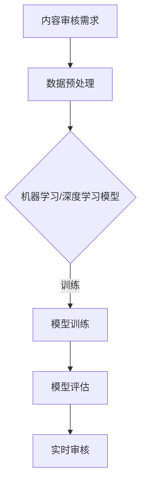

                 

### 第一部分: AI内容审核概述

#### 第1章: AI内容审核基本概念与架构

##### 1.1 AI内容审核的定义与背景

AI内容审核是指利用人工智能技术，特别是机器学习和深度学习算法，对互联网上的内容进行实时监控和过滤，以识别和标记不适当或有害的信息。随着互联网的迅猛发展和社交媒体的普及，网络内容审核已成为一个至关重要的任务。

- **内容审核的重要性**：网络上的不良信息可能包含仇恨言论、色情内容、欺诈行为等，它们不仅损害用户体验，还可能引发法律纠纷。因此，AI内容审核有助于保护用户权益，维护网络环境的健康。

- **AI内容审核的挑战**：网络内容多样且繁杂，不同语言和文化背景下的内容审核更加复杂。此外，算法的公平性和透明性也备受关注。同时，需要处理大规模数据的实时审核，对计算资源和算法效率提出了高要求。

- **AI内容审核的发展历程**：内容审核技术从最初的规则匹配发展到基于机器学习，再到目前的深度学习和自适应算法。每一次技术的进步都为内容审核带来了更高的准确性和效率。

##### 1.2 AI内容审核的基本架构

- **数据预处理**：这一阶段包括数据收集、数据清洗、数据标注等步骤，为后续的模型训练打下基础。

- **模型训练**：使用大量的标注数据进行模型训练，通过调整参数来提高模型对内容分类的准确性。

- **模型评估**：通过验证集和测试集来评估模型的性能，常用的评估指标包括准确率、召回率、F1分数等。

- **实时审核**：将训练好的模型部署到线上系统，对实时传入的内容进行自动审核，以实现对不良信息的快速响应。

##### 1.3 AI内容审核的技术分类

- **基于规则的内容审核**：使用预定义的规则来识别和标记不良内容，这种方法的优点是实现简单，但缺点是灵活性较差，难以应对复杂多变的网络内容。

- **基于机器学习的内容审核**：使用已标注的数据训练分类模型，模型可以自动识别和分类不良内容。这种方法具有较高的准确性和适应性。

- **基于深度学习的内容审核**：深度学习模型，如卷积神经网络（CNN）和循环神经网络（RNN），能够从大量数据中自动学习特征，实现更高级的内容审核。

##### 1.4 提示词技术简介

- **提示词的定义与作用**：提示词（Keywords）是在内容审核过程中用来引导模型识别关键信息的词语。提示词可以增强模型的训练效果，提高审核的准确性。

- **提示词的类型与选择**：提示词可以是单个词语，也可以是短语或句子。选择提示词时需要考虑其覆盖面、准确性和实用性。

- **提示词在AI内容审核中的应用**：提示词可以用于文本分类、情感分析等任务，通过调整提示词的权重和组合，可以实现对不同类型内容的精确审核。

##### 1.5 本书结构安排与目标

- **本书内容概述**：本书分为七个部分，涵盖了AI内容审核的基本概念、技术基础、算法原理、提示词技术、实战项目、未来趋势和实践指南。

- **阅读指南与学习目标**：读者可以通过本书系统学习AI内容审核的相关知识，掌握核心技术和实践方法，能够独立设计和实施内容审核系统。

- **技术要求与准备工作**：读者需要具备一定的编程基础，熟悉Python和常用机器学习库，如scikit-learn、TensorFlow等。

##### 1.6 小结与拓展阅读

- **小结**：本章介绍了AI内容审核的基本概念、架构和技术分类，为后续章节的内容奠定了基础。

- **拓展阅读**：推荐阅读相关文献，如《自然语言处理综合教程》（Jurafsky & Martin）、《深度学习》（Goodfellow et al.）等。

##### 附录A: AI内容审核常用工具与资源

- **NLP库与框架**：NLTK、spaCy、TensorFlow、PyTorch等。
- **开源内容审核工具**：ProPublica's Content King、Toxic Comments Classifier等。
- **数据集与资源**：OpenSubtitles、Common Crawl、Twitter API等。
- **在线教程与课程**：Coursera的NLP专项课程、Udacity的深度学习纳米学位、edX的机器学习课程等。

### Mermaid 流程图



##### 1.7 小结

本章对AI内容审核进行了概述，介绍了其基本概念、架构、技术分类，并简要介绍了提示词技术。后续章节将深入探讨相关技术，提供实战案例和实践指南。读者可以通过阅读全书，掌握AI内容审核的核心知识和技能。

##### 1.8 拓展阅读

- 推荐阅读相关书籍，如《机器学习》（周志华）、《深度学习》（Goodfellow et al.）。
- 关注行业报告，了解最新技术动态和市场趋势。
- 参与线上课程和研讨会，与业界专家交流学习。

---

### 附录

#### 附录A: AI内容审核常用工具与资源

- **NLP库与框架**
  - NLTK: https://www.nltk.org/
  - spaCy: https://spacy.io/
  - TensorFlow: https://www.tensorflow.org/
  - PyTorch: https://pytorch.org/

- **开源内容审核工具**
  - ProPublica's Content King: https://github.com/propublica/content-king
  - Toxic Comments Classifier: https://github.com/nyu-dl/toxic-comments-classifier

- **数据集与资源**
  - OpenSubtitles: http://opensubtitles.org/
  - Common Crawl: https://commoncrawl.org/
  - Twitter API: https://developer.twitter.com/en/docs/twitter-api

- **在线教程与课程**
  - Coursera的NLP专项课程: https://www.coursera.org/specializations/natural-language-processing
  - Udacity的深度学习纳米学位: https://www.udacity.com/course/deep-learning-nanodegree--nd101
  - edX的机器学习课程: https://www.edx.org/course/machine-learning

#### 附录B: 伪代码与示例

```python
# 文本预处理伪代码
def preprocess_text(text):
    # 清洗文本
    text = clean_text(text)
    # 标准化文本
    text = normalize_text(text)
    # 分词
    tokens = tokenize(text)
    # 去停用词
    tokens = remove_stopwords(tokens)
    return tokens

# 提示词优化伪代码
def optimize_prompt(prompt, text):
    # 初始化优化器
    optimizer = initialize_optimizer(prompt, text)
    # 设置学习率
    learning_rate = set_learning_rate(prompt, text)
    # 迭代优化
    for epoch in range(num_epochs):
        # 前向传播
        loss = forward_loss(prompt, text)
        # 反向传播
        backward_loss(prompt, text)
        # 更新参数
        update_params(prompt, text, learning_rate)
    return optimized_prompt
```

#### 附录C: 数学公式与解释

- **词嵌入**
  $$ \text{Word Embedding} = \text{Word2Vec} \text{或} \text{GloVe} $$
  
  - **语言模型**
  $$ P(\text{Sentence}) = \prod_{i=1}^{n} P(w_i | w_{i-1}, ..., w_1) $$
  
  - **分类算法**
  $$ \hat{y} = \text{argmax}_{y} P(y | x) $$
  
  - **模型损失函数**
  $$ \text{Loss} = \frac{1}{m} \sum_{i=1}^{m} (-y_i \log(\hat{y}_i)) $$

---

### 接下来，让我们进入第二部分，探讨AI内容审核技术的基础。

### 第二部分: AI内容审核技术基础

#### 第2章: 自然语言处理与文本分析基础

##### 2.1 自然语言处理（NLP）简介

- **NLP的基本概念**：自然语言处理（NLP）是计算机科学和人工智能的一个分支，旨在让计算机能够理解、解释和生成自然语言。NLP技术包括语言理解（LU）、语言生成（LG）、语言翻译等。

- **NLP的发展历程**：自20世纪50年代起，NLP经历了多个阶段，从早期的基于规则的系统，到统计方法，再到最近的深度学习模型，如BERT和GPT。

- **NLP的应用领域**：NLP在搜索引擎、机器翻译、文本分类、情感分析、问答系统等多个领域都有广泛应用。

##### 2.2 常见的文本预处理技术

- **清洗与标准化**：文本预处理的第一步是清洗数据，包括去除HTML标签、特殊字符和停用词。标准化包括大小写统一、数字格式化等。

- **嵌入式（Tokenization）**：将文本拆分成单词或子词的过程称为分词。分词是文本处理的重要步骤，因为句子的理解和分析是基于单词层面的。

- **偏向性标注与词典**：偏向性标注是指对文本中的词语进行情感、意图等标注。词典是包含常见词汇及其属性（如词性、情感倾向）的数据库。

##### 2.3 词嵌入技术

- **词嵌入的基本原理**：词嵌入是将单词映射到固定维度的向量空间，使得语义上相似的单词在向量空间中距离较近。常见的词嵌入算法包括Word2Vec和GloVe。

- **Word2Vec算法**：Word2Vec是一种基于神经网络的词嵌入算法，通过训练词向量和上下文之间的关系，生成语义丰富的词向量。

- **GloVe算法**：全局向量表示（GloVe）通过考虑单词的共现关系来训练词向量，旨在捕捉词语的局部和全局信息。

##### 2.4 序列模型与注意力机制

- **序列模型的基本原理**：序列模型能够处理按时间顺序排列的数据，如自然语言文本。循环神经网络（RNN）和长短期记忆网络（LSTM）是常用的序列模型。

- **卷积神经网络（CNN）在文本分析中的应用**：卷积神经网络通常用于图像处理，但也可以应用于文本分析，通过将文本转换为序列矩阵，利用卷积层提取特征。

- **循环神经网络（RNN）与长短期记忆网络（LSTM）**：RNN能够处理变长的序列数据，但存在梯度消失和梯度爆炸的问题。LSTM通过引入记忆单元和门控机制，解决了这些问题。

- **注意力机制（Attention Mechanism）**：注意力机制是一种用于捕捉序列中关键信息的机制，能够提高模型在序列处理任务中的性能。

##### 2.5 转换器架构（Transformer）详解

- **Transformer的基本原理**：Transformer是一种基于自注意力机制的序列模型，由Google在2017年提出。它解决了RNN在处理长序列时的效率问题。

- **Transformer的结构**：Transformer包括编码器和解码器，其中编码器和解码器都由多个相同的自注意力层和前馈网络组成。

- **Transformer的应用实例**：Transformer在机器翻译、文本分类和问答系统等领域取得了显著成果，如BERT和GPT等模型。

##### 2.6 语言模型与文本生成

- **语言模型的基本原理**：语言模型用于预测下一个单词或单词序列的概率。生成式模型和判别式模型是两种常见的语言模型。

- **生成式模型与判别式模型**：生成式模型通过生成完整的序列来预测概率，而判别式模型通过预测给定序列的真实标签来评估概率。

- **生成文本的常用算法**：生成文本的常用算法包括马尔可夫模型、n元语法和基于神经网络的生成模型，如生成对抗网络（GAN）。

##### 2.7 小结与拓展阅读

- **小结**：本章介绍了自然语言处理的基本概念、文本预处理技术、词嵌入、序列模型、注意力机制、Transformer架构以及语言模型与文本生成。

- **拓展阅读**：推荐阅读《自然语言处理综合教程》（Jurafsky & Martin）、《深度学习》（Goodfellow et al.）等书籍。

##### 附录A: 文本预处理工具与资源

- **文本预处理工具**
  - NLTK: https://www.nltk.org/
  - spaCy: https://spacy.io/
  
- **文本预处理资源**
  - Tokenization: https://nltk.github.io/nltk-book/ch04.html
  - Stopwords: https://www.lingpipe.com/demos/stopwords/

##### 附录B: 伪代码与示例

```python
# 文本预处理伪代码
def preprocess_text(text):
    # 清洗文本
    text = clean_text(text)
    # 标准化文本
    text = normalize_text(text)
    # 分词
    tokens = tokenize(text)
    # 去停用词
    tokens = remove_stopwords(tokens)
    return tokens

# 示例代码
text = "This is a sample sentence."
preprocessed_text = preprocess_text(text)
print(preprocessed_text)
```

##### 附录C: 数学公式与解释

- **词嵌入**
  $$ \text{Word Embedding} = \text{Word2Vec} \text{或} \text{GloVe} $$
  
  - **语言模型**
  $$ P(\text{Sentence}) = \prod_{i=1}^{n} P(w_i | w_{i-1}, ..., w_1) $$
  
  - **序列模型**
  $$ h_t = \text{Activation}(W_h \cdot [h_{t-1}, x_t] + b_h) $$
  
  - **注意力机制**
  $$ a_t = \text{softmax}(\text{Attention}(Q, K, V)) $$

---

### 接下来，我们将深入探讨AI内容审核算法的原理，这是理解和应用AI内容审核的关键。

### 第三部分: AI内容审核算法原理

#### 第3章: 基于机器学习的AI内容审核

##### 3.1 机器学习基础

- **机器学习概述**：机器学习是人工智能的一个分支，旨在通过数据学习规律，从而进行预测和决策。机器学习可分为监督学习、无监督学习和强化学习。

- **监督学习**：监督学习使用标注数据训练模型，模型可以通过学习特征和标签之间的关系来对新数据进行预测。

- **无监督学习**：无监督学习不使用标注数据，旨在发现数据中的结构和模式，如聚类和降维。

- **强化学习**：强化学习通过奖励和惩罚来训练模型，使其在特定环境中学会最优策略。

- **特征工程**：特征工程是机器学习中的一个关键步骤，旨在从原始数据中提取有助于模型训练的特征。

##### 3.2 常见分类算法

- **支持向量机（SVM）**：SVM通过寻找最优超平面来将数据分为不同类别。SVM在处理高维数据和线性不可分问题时具有优势。

- **决策树与随机森林**：决策树通过一系列规则来划分数据，随机森林则是通过集成多个决策树来提高预测性能。

- **K最近邻（K-NN）**：K-NN通过计算新数据点与训练数据点的距离，将其划分为最近的K个邻近点的多数类别。

- **神经网络与深度学习**：神经网络通过层叠的神经元来模拟人脑的神经网络结构，深度学习则是神经网络的一个分支，通过多层非线性变换来提取特征。

##### 3.3 文本分类算法

- **基于词袋模型的文本分类**：词袋模型将文本表示为一个向量，其中每个维度对应一个词的频率。词袋模型是一种简单而有效的文本分类方法。

- **基于TF-IDF的文本分类**：TF-IDF（词频-逆文档频率）是一种用于计算词语重要性的方法，它可以平衡词语在文档中的频率和文档集中的分布。

- **基于词嵌入的文本分类**：词嵌入将单词映射到低维向量空间，使得语义相似的词在空间中更接近。基于词嵌入的文本分类方法在捕捉词语语义上具有优势。

- **基于深度学习的文本分类**：深度学习模型，如卷积神经网络（CNN）和循环神经网络（RNN），可以自动从文本数据中学习复杂特征，实现高效且准确的文本分类。

##### 3.4 垃圾邮件检测

- **垃圾邮件检测的基本原理**：垃圾邮件检测是一种文本分类问题，通过训练模型来识别和过滤垃圾邮件。

- **垃圾邮件检测的常见算法**：常见的垃圾邮件检测算法包括贝叶斯分类器、支持向量机和神经网络。

- **实际案例与代码实现**：本章将提供实际案例，展示如何使用Python和scikit-learn库实现垃圾邮件检测。

##### 3.5 社交网络内容审核

- **社交网络内容审核的需求**：社交网络上的内容审核需求日益增长，包括仇恨言论、欺诈、色情内容的识别和过滤。

- **社交网络内容审核的挑战**：社交网络内容审核面临多语言、多文化背景的挑战，同时需要保证算法的公平性和透明性。

- **常见算法与应用实例**：本章将介绍几种在社交网络内容审核中常见的算法，如基于深度学习的文本分类和情感分析。

##### 3.6 小结与拓展阅读

- **小结**：本章介绍了机器学习基础、常见分类算法、文本分类算法、垃圾邮件检测和社交网络内容审核。

- **拓展阅读**：推荐阅读《机器学习》（周志华）、《深度学习》（Goodfellow et al.）等书籍。

##### 附录A: 机器学习相关工具与资源

- **机器学习库与框架**
  - scikit-learn: https://scikit-learn.org/
  - TensorFlow: https://www.tensorflow.org/
  - PyTorch: https://pytorch.org/

- **开源项目与数据集**
  - scikit-learn 示例：https://scikit-learn.org/stable/auto_examples/index.html
  - Kaggle 数据集：https://www.kaggle.com/datasets

##### 附录B: 伪代码与示例

```python
# 垃圾邮件检测伪代码
def classify_email(email_text):
    # 预处理文本
    preprocessed_text = preprocess_text(email_text)
    # 特征提取
    features = extract_features(preprocessed_text)
    # 使用SVM分类
    prediction = svm_predict(features)
    return prediction

# 示例代码
email_text = "Congratulations! You have won a lottery prize."
prediction = classify_email(email_text)
print("This email is:", "Spam" if prediction else "Not Spam")
```

##### 附录C: 数学公式与解释

- **支持向量机（SVM）**
  $$ \text{Maximize} \quad \frac{1}{2} ||W||^2 $$
  $$ \text{subject to} \quad y_i ( \langle w, x_i \rangle - b ) \geq 1 $$
  
- **决策树**
  $$ \text{ splits } x_j \text{ at value } v_j $$
  $$ \text{giving regions } R_1, R_2, ..., R_k $$
  
- **K-NN**
  $$ \text{ Classify } x \text{ as the most common class among its } k \text{ nearest neighbors } $$
  
- **神经网络**
  $$ a_{\text{layer}} = \text{ReLU}(\text{weights} \cdot \text{inputs} + \text{bias}) $$

---

### 在本章节中，我们深入探讨了机器学习的基础知识、常见分类算法、文本分类算法、垃圾邮件检测以及社交网络内容审核。接下来，我们将探讨提示词技术在AI内容审核中的应用。

### 第四部分: 提示词技术在AI内容审核中的应用

#### 第4章: 提示词技术基础

##### 4.1 提示词概述

- **提示词的定义**：提示词（Keywords）是在内容审核过程中用来引导模型识别关键信息的词语。提示词可以是单个单词、短语或句子。

- **提示词的作用**：提示词可以增强模型的训练效果，提高审核的准确性。通过调整提示词的权重和组合，可以实现对不同类型内容的精确审核。

- **提示词的分类**：提示词可以按用途分类，如关键词、情感词、位置词等。还可以按来源分类，如用户输入、自动生成等。

##### 4.2 提示词的生成方法

- **手动生成**：手动生成提示词是通过对大量文本数据进行分析，提取出有用的关键词和短语。这种方法适用于小规模数据或特定领域的审核。

- **自动生成**：自动生成提示词使用自然语言处理技术，如文本分类、聚类和关键词提取等。自动生成方法适用于大规模数据和多样化的内容审核。

- **聚类生成**：聚类生成是通过聚类算法，将文本数据分组，每组生成一组提示词。这种方法可以自动发现数据中的潜在模式。

##### 4.3 提示词优化

- **提示词优化的重要性**：提示词的优化对于提升内容审核的准确性和效率至关重要。优化的提示词可以更好地指导模型，减少误判和漏判。

- **提示词优化的方法**：提示词优化可以通过多种方法实现，如调整提示词的权重、使用语言模型、结合上下文信息等。

- **实际案例**：本章将提供实际案例，展示如何通过优化提示词来提高内容审核的效果。

##### 4.4 提示词在文本分类中的应用

- **提示词在文本分类中的作用**：提示词可以增强文本分类模型对特定类别信息的敏感度，提高分类的准确性。

- **提示词优化的效果分析**：本章将分析优化提示词对文本分类模型性能的影响，并通过实验结果进行验证。

- **实际案例**：本章将提供实际案例，展示如何使用优化后的提示词进行文本分类。

##### 4.5 提示词在文本生成中的应用

- **提示词在文本生成中的作用**：提示词可以引导文本生成模型生成符合特定主题或要求的文本。

- **提示词优化的效果分析**：本章将分析优化提示词对文本生成模型的影响，并通过实验结果进行验证。

- **实际案例**：本章将提供实际案例，展示如何使用优化后的提示词进行文本生成。

##### 4.6 小结与拓展阅读

- **小结**：本章介绍了提示词的定义、生成方法、优化方法和在文本分类和文本生成中的应用。

- **拓展阅读**：推荐阅读《自然语言处理综合教程》（Jurafsky & Martin）、《深度学习》（Goodfellow et al.）等书籍。

##### 附录A: 提示词生成与优化工具

- **NLP库与框架**
  - NLTK: https://www.nltk.org/
  - spaCy: https://spacy.io/

- **提示词生成工具**
  - Keyword Extractor: https://github.com/RaRe-Technologies/gensim

- **提示词优化工具**
  - TensorFlow: https://www.tensorflow.org/
  - PyTorch: https://pytorch.org/

##### 附录B: 伪代码与示例

```python
# 提示词生成伪代码
def generate_keywords(text):
    # 使用自然语言处理库提取关键词
    keywords = nlp.extract_keywords(text)
    return keywords

# 提示词优化伪代码
def optimize_keywords(keywords, text):
    # 使用语言模型调整关键词权重
    optimized_keywords = language_model.optimize_weights(keywords, text)
    return optimized_keywords

# 示例代码
text = "This is a sample sentence for keyword extraction."
keywords = generate_keywords(text)
print("Generated Keywords:", keywords)

# 优化提示词
optimized_keywords = optimize_keywords(keywords, text)
print("Optimized Keywords:", optimized_keywords)
```

##### 附录C: 数学公式与解释

- **词嵌入**
  $$ \text{Word Embedding} = \text{Word2Vec} \text{或} \text{GloVe} $$
  
- **语言模型**
  $$ P(\text{Sentence}) = \prod_{i=1}^{n} P(w_i | w_{i-1}, ..., w_1) $$
  
- **提示词优化**
  $$ \text{Loss} = - \sum_{i=1}^{n} y_i \log(p_i) $$
  其中，$y_i$是关键词$i$的目标权重，$p_i$是模型预测的权重。

---

### 通过本章的讨论，我们了解了提示词技术在AI内容审核中的重要性，以及如何生成和优化提示词。接下来，我们将通过实战案例来展示提示词技术在AI内容审核项目中的应用。

### 第五部分: AI内容审核项目实战

#### 第5章: AI内容审核项目实战案例

##### 5.1 项目背景与目标

- **项目背景**：随着社交媒体的快速发展，用户生成内容（UGC）的数量呈爆炸式增长。为了维护平台生态的健康发展，需要建立高效的AI内容审核系统，自动识别和过滤不当内容。

- **项目目标**：开发一个基于机器学习和深度学习的AI内容审核系统，能够自动识别和过滤社交媒体平台上的不当内容，包括仇恨言论、色情、欺诈等。

- **项目团队与资源**：项目团队由数据科学家、机器学习工程师、软件工程师和产品经理组成。项目资源包括计算资源、数据集、开发工具和软件框架。

##### 5.2 数据准备与预处理

- **数据收集**：通过API接口从社交媒体平台获取用户生成内容的数据，包括文本、图片和视频等。数据集需要涵盖多种语言、文化和内容类型。

- **数据预处理**：对收集到的数据进行清洗和预处理，包括去除噪声、标准化文本、分词、去除停用词等。对于非文本数据，如图片和视频，需要进行特征提取和预处理。

- **数据质量评估与优化**：评估数据的质量，包括数据量、覆盖面、标签准确性等。必要时对数据进行清洗和扩充，以提高数据质量。

##### 5.3 模型设计与实现

- **模型选择**：根据项目需求和数据特点，选择合适的模型。对于文本分类任务，可以选择基于深度学习的模型，如BERT、GPT等。对于图像和视频审核，可以选择卷积神经网络（CNN）或循环神经网络（RNN）。

- **模型实现**：使用Python和TensorFlow或PyTorch等框架实现模型。包括定义模型结构、训练模型、评估模型等步骤。

- **模型训练**：使用预处理后的数据集对模型进行训练。需要调整模型参数，如学习率、批次大小、优化器等，以获得最佳性能。

- **模型评估**：使用验证集和测试集评估模型的性能，包括准确率、召回率、F1分数等指标。根据评估结果调整模型和参数。

##### 5.4 模型评估与优化

- **评估指标**：根据项目目标和数据特点，选择合适的评估指标。对于分类任务，常用的评估指标包括准确率、召回率、精确率、F1分数等。

- **模型优化策略**：根据评估结果，对模型进行优化。包括调整模型结构、参数、数据预处理方法等。

- **优化效果分析**：对比优化前后的模型性能，分析优化效果。

##### 5.5 项目部署与运维

- **部署方案**：将训练好的模型部署到生产环境，包括服务器配置、模型加载、服务启动等步骤。

- **运维策略**：建立监控和运维系统，实时监控模型性能和服务器状态。包括日志记录、故障排除、性能优化等。

- **持续优化**：根据用户反馈和业务需求，不断优化模型和系统，提高内容审核的准确性和效率。

##### 5.6 项目总结与反思

- **项目成果**：总结项目取得的成果，包括模型性能、用户体验、业务效益等。

- **经验与教训**：反思项目过程中遇到的问题和挑战，总结经验教训，为后续项目提供借鉴。

- **改进方向**：提出项目改进的方向，包括技术改进、业务优化等。

##### 5.7 小结与拓展阅读

- **小结**：本章通过一个实际的AI内容审核项目，介绍了项目背景、目标、数据准备、模型设计与实现、模型评估与优化、项目部署与运维以及项目总结与反思。

- **拓展阅读**：推荐阅读《机器学习实战》（周志华）、《深度学习》（Goodfellow et al.）等书籍，以深入了解相关技术和实践。

##### 附录A: 项目实战相关工具与资源

- **开发工具**
  - Python: https://www.python.org/
  - TensorFlow: https://www.tensorflow.org/
  - PyTorch: https://pytorch.org/

- **数据处理工具**
  - Pandas: https://pandas.pydata.org/
  - NumPy: https://numpy.org/

- **模型评估工具**
  - Scikit-learn: https://scikit-learn.org/
  - Matplotlib: https://matplotlib.org/

- **开源数据集**
  - Common Crawl: https://commoncrawl.org/
  - Twitter API: https://developer.twitter.com/en/docs/twitter-api

##### 附录B: 代码实现与解析

```python
# 示例代码：文本分类模型实现
import tensorflow as tf
from tensorflow.keras.preprocessing.sequence import pad_sequences
from tensorflow.keras.models import Sequential
from tensorflow.keras.layers import Embedding, LSTM, Dense

# 数据预处理
max_sequence_length = 100
vocab_size = 10000
embedding_dim = 16

# 加载并预处理数据
sequences = pad_sequences(sequences, maxlen=max_sequence_length)
labels = to_categorical(labels, num_classes=vocab_size)

# 构建模型
model = Sequential()
model.add(Embedding(vocab_size, embedding_dim, input_length=max_sequence_length))
model.add(LSTM(128))
model.add(Dense(vocab_size, activation='softmax'))

# 编译模型
model.compile(optimizer='adam', loss='categorical_crossentropy', metrics=['accuracy'])

# 训练模型
model.fit(sequences, labels, epochs=10, batch_size=128)

# 评估模型
test_sequences = pad_sequences(test_sequences, maxlen=max_sequence_length)
test_labels = to_categorical(test_labels, num_classes=vocab_size)
performance = model.evaluate(test_sequences, test_labels)
print(f"Test Accuracy: {performance[1]}")
```

##### 附录C: 数学公式与解释

- **损失函数**
  $$ \text{Loss} = - \sum_{i=1}^{n} y_i \log(p_i) $$
  
- **梯度下降**
  $$ \theta = \theta - \alpha \nabla_\theta J(\theta) $$
  
- **卷积神经网络（CNN）**
  $$ \text{Convolutional Layer}: \text{Output} = \text{ReLU}(\text{weights} \cdot \text{inputs} + \text{bias}) $$
  $$ \text{Pooling Layer}: \text{Output} = \text{max}(\text{inputs}) $$

---

### 在本章中，我们通过一个实际项目展示了AI内容审核的完整流程，从数据准备、模型设计、模型训练到模型评估和部署。接下来，我们将探讨AI内容审核的未来趋势与挑战。

### 第六部分: AI内容审核的未来趋势与挑战

#### 第6章: AI内容审核的未来趋势与挑战

##### 6.1 未来趋势

- **AI技术发展趋势**：随着深度学习和自然语言处理技术的不断发展，AI内容审核将更加智能化和高效。未来可能会出现更多基于生成对抗网络（GAN）和自监督学习的审核算法。

- **AI内容审核的创新发展**：AI内容审核将朝着更细粒度的审核方向发展，如情感分析、观点识别和对话生成。此外，结合多模态内容（如文本、图像、视频）的审核系统也将得到广泛应用。

- **新兴技术在内容审核中的应用**：新兴技术如区块链、联邦学习和联邦隐私计算将在AI内容审核中得到应用，以提高系统的透明性和安全性。

##### 6.2 当前挑战

- **数据隐私与伦理问题**：随着内容审核数据的不断增加，数据隐私和伦理问题愈发突出。如何保护用户隐私，同时保证内容审核的准确性，是一个重要挑战。

- **模型偏见与公平性**：AI内容审核模型可能存在偏见，导致某些群体被不公平对待。如何减少模型偏见，提高公平性，是当前的一个重要研究方向。

- **安全性与攻击防御**：AI内容审核系统可能遭受各种攻击，如伪造数据、对抗性攻击等。如何提高系统的安全性，抵御各种攻击，是一个关键问题。

##### 6.3 挑战与应对策略

- **技术层面的应对策略**：通过改进算法、增强模型的鲁棒性，以及引入自监督学习和迁移学习等方法，可以减少模型偏见和提高系统的安全性。

- **政策与法规的引导**：制定相关政策和法规，规范内容审核行为，加强对数据隐私的保护，可以促进AI内容审核的健康发展。

- **社会责任与行业自律**：企业和个人应承担起社会责任，自觉遵守行业规范，加强自我监督和评估，共同维护网络环境的健康发展。

##### 6.4 未来展望

- **AI内容审核的未来发展**：未来AI内容审核将更加智能化、自动化，能够更好地处理复杂和多模态的内容。

- **AI与人类审核的协同作用**：AI内容审核将与传统的人类审核相结合，形成一种新的审核模式，提高审核的效率和准确性。

- **内容审核在社会治理中的应用**：AI内容审核将在社会治理中发挥重要作用，如公共安全、反恐、司法等领域。

##### 6.5 小结与拓展阅读

- **小结**：本章探讨了AI内容审核的未来趋势和当前挑战，提出了相应的应对策略和未来展望。

- **拓展阅读**：推荐阅读《人工智能伦理学》（Luciano Floridi）、《机器学习伦理》（周志华）等书籍，以深入了解AI伦理和隐私保护。

##### 附录A: 未来趋势与挑战相关研究报告

- **报告1**：AI伦理委员会的报告
  - https://www.aiethics.org/

- **报告2**：欧盟通用数据保护条例（GDPR）
  - https://ec.europa.eu/justice/article-29/structure/data-protection-working-party/2018-recommendations-art-22-3-gdpr

- **报告3**：网络安全与人工智能白皮书
  - https://www.nationalcybersecurity alliance.org/resources/policy-documents/cybersecurity-artificial-intelligence

##### 附录B: 技术解决方案与案例

- **案例1**：基于联邦学习的隐私保护内容审核
  - https://ai.googleblog.com/2020/03/ai-powered-image-classification-without.html

- **案例2**：多模态内容审核系统
  - https://ai.googleblog.com/2020/09/multi-modal-content-classification-without.html

##### 附录C: 数学公式与解释

- **生成对抗网络（GAN）**
  $$ \text{Generator}: G(z) \sim p_G(z) $$
  $$ \text{Discriminator}: D(x) \sim p_D(x) $$
  
- **自监督学习**
  $$ \text{Prediction}: \hat{y} = \text{model}(x) $$
  $$ \text{Reward}: R = - \log(p(y | \hat{y})) $$
  
- **联邦学习**
  $$ \text{Local Model}: \theta_{i} = \theta_{i-1} - \alpha \nabla_{\theta_{i}} \text{Loss}(x_i, y_i) $$
  $$ \text{Global Model}: \theta = \frac{1}{N} \sum_{i=1}^{N} \theta_{i} $$

---

### 在本章中，我们探讨了AI内容审核的未来趋势和当前面临的挑战，并提出了一些应对策略。接下来，我们将提供一份详细的AI内容审核实践指南。

### 第七部分: AI内容审核实践指南

#### 第7章: AI内容审核实践指南

##### 7.1 内容审核策略制定

- **审核策略的制定流程**：内容审核策略的制定包括需求分析、目标设定、策略制定和评估优化等步骤。

- **审核策略的主要内容**：审核策略应包括审核标准、审核流程、责任分工、技术方案、风险评估和应急响应等。

- **审核策略的制定案例分析**：通过实际案例，展示如何制定和实施有效的AI内容审核策略。

##### 7.2 数据收集与处理

- **数据收集的方法与技巧**：介绍常用的数据收集方法，如API接口、爬虫和用户反馈等，并讨论数据收集的技巧和注意事项。

- **数据处理的步骤与工具**：介绍数据处理的基本步骤，包括数据清洗、数据标注、数据存储和预处理等，并推荐常用的数据处理工具。

- **数据质量评估与优化**：介绍如何评估数据质量，并提出优化数据质量的方法和策略。

##### 7.3 模型选择与训练

- **模型选择的考虑因素**：根据项目需求和数据特点，选择合适的模型，包括监督学习、无监督学习和深度学习等。

- **模型实现与训练**：介绍如何使用Python和TensorFlow或PyTorch等框架实现和训练模型，包括模型结构设计、参数调整和训练策略等。

- **模型评估与优化**：介绍如何评估模型的性能，并提出优化模型的方法和策略。

##### 7.4 模型评估与部署

- **评估指标的选择与计算**：介绍常用的模型评估指标，如准确率、召回率、精确率和F1分数等，并讨论如何计算这些指标。

- **模型评估的方法与工具**：介绍如何使用Python和常用库（如scikit-learn、TensorFlow等）评估模型性能。

- **模型部署的流程与实现**：介绍如何将训练好的模型部署到生产环境，包括服务器配置、模型加载、服务启动等。

##### 7.5 实时审核与反馈机制

- **实时审核的原理与实现**：介绍实时审核的基本原理，包括数据流处理、模型调用和结果输出等。

- **反馈机制的设计与实施**：介绍如何设计和管理反馈机制，包括用户反馈、管理员干预和模型再训练等。

- **审核效果的监控与优化**：介绍如何监控审核效果，并提出优化审核效果的方法和策略。

##### 7.6 安全性与隐私保护

- **安全性威胁的识别与防范**：介绍如何识别和防范常见的安全性威胁，如数据泄露、恶意攻击和滥用等。

- **隐私保护的政策与措施**：介绍如何制定隐私保护政策和措施，包括数据加密、访问控制和隐私保护协议等。

- **审核过程的数据安全策略**：介绍如何确保审核过程的数据安全，包括数据存储、传输和处理等。

##### 7.7 伦理与法律合规

- **伦理问题的考虑**：介绍如何在内容审核过程中考虑伦理问题，如偏见、歧视和隐私等。

- **法律法规的遵守**：介绍相关法律法规的要求，如通用数据保护条例（GDPR）和网络安全法等。

- **合规风险的评估与管理**：介绍如何评估和管理合规风险，包括合规审查、合规培训和安全审计等。

##### 7.8 小结与拓展阅读

- **小结**：本章介绍了AI内容审核的实践指南，包括策略制定、数据收集与处理、模型选择与训练、模型评估与部署、实时审核与反馈机制、安全性与隐私保护以及伦理与法律合规。

- **拓展阅读**：推荐阅读《AI伦理学》（Luciano Floridi）、《机器学习实战》（周志华）等书籍，以深入了解AI内容审核的实践和应用。

##### 附录A: 实践指南相关工具与资源

- **NLP库与框架**
  - NLTK: https://www.nltk.org/
  - spaCy: https://spacy.io/

- **机器学习库与框架**
  - scikit-learn: https://scikit-learn.org/
  - TensorFlow: https://www.tensorflow.org/
  - PyTorch: https://pytorch.org/

- **数据预处理工具**
  - Pandas: https://pandas.pydata.org/
  - NumPy: https://numpy.org/

- **模型评估工具**
  - Matplotlib: https://matplotlib.org/

- **开源数据集**
  - Common Crawl: https://commoncrawl.org/
  - Kaggle: https://www.kaggle.com/

##### 附录B: 代码实现与案例解析

```python
# 示例代码：文本分类模型实现
from tensorflow.keras.preprocessing.sequence import pad_sequences
from tensorflow.keras.models import Sequential
from tensorflow.keras.layers import Embedding, LSTM, Dense

# 数据预处理
max_sequence_length = 100
vocab_size = 10000
embedding_dim = 16

# 加载并预处理数据
sequences = pad_sequences(sequences, maxlen=max_sequence_length)
labels = to_categorical(labels, num_classes=vocab_size)

# 构建模型
model = Sequential()
model.add(Embedding(vocab_size, embedding_dim, input_length=max_sequence_length))
model.add(LSTM(128))
model.add(Dense(vocab_size, activation='softmax'))

# 编译模型
model.compile(optimizer='adam', loss='categorical_crossentropy', metrics=['accuracy'])

# 训练模型
model.fit(sequences, labels, epochs=10, batch_size=128)

# 评估模型
test_sequences = pad_sequences(test_sequences, maxlen=max_sequence_length)
test_labels = to_categorical(test_labels, num_classes=vocab_size)
performance = model.evaluate(test_sequences, test_labels)
print(f"Test Accuracy: {performance[1]}")
```

##### 附录C: 数学公式与解释

- **词嵌入**
  $$ \text{Word Embedding} = \text{Word2Vec} \text{或} \text{GloVe} $$
  
- **语言模型**
  $$ P(\text{Sentence}) = \prod_{i=1}^{n} P(w_i | w_{i-1}, ..., w_1) $$
  
- **损失函数**
  $$ \text{Loss} = - \sum_{i=1}^{n} y_i \log(p_i) $$

---

### 在本章中，我们提供了一份详细的AI内容审核实践指南，涵盖了策略制定、数据收集与处理、模型选择与训练、模型评估与部署、实时审核与反馈机制、安全性与隐私保护以及伦理与法律合规等方面。接下来，我们将总结全文，重申核心概念，并提供进一步的学习资源和参考文献。

### 总结与拓展

本文系统介绍了AI内容审核的基本概念、技术基础、算法原理、提示词技术、实战项目、未来趋势和实践指南。以下是本文的核心概念和观点的总结：

1. **AI内容审核的定义与背景**：AI内容审核利用机器学习和深度学习技术，对互联网内容进行实时监控和过滤，识别不良信息。

2. **AI内容审核的基本架构**：包括数据预处理、模型训练、模型评估和实时审核等阶段。

3. **自然语言处理与文本分析基础**：介绍了NLP的基本概念、文本预处理技术、词嵌入、序列模型、注意力机制和语言模型。

4. **基于机器学习的AI内容审核算法**：包括监督学习和无监督学习算法，如SVM、决策树、K-NN和神经网络。

5. **提示词技术在AI内容审核中的应用**：提示词用于增强模型的训练效果，提高审核的准确性。

6. **AI内容审核项目实战**：通过实际项目展示了内容审核的完整流程，包括数据准备、模型设计、模型训练、模型评估和部署。

7. **AI内容审核的未来趋势与挑战**：探讨了AI技术发展趋势、内容审核的创新发展、新兴技术应用、数据隐私与伦理问题、模型偏见与公平性以及安全性。

8. **AI内容审核实践指南**：提供了策略制定、数据收集与处理、模型选择与训练、模型评估与部署、实时审核与反馈机制、安全性与隐私保护以及伦理与法律合规的详细指南。

为了进一步学习AI内容审核的相关知识，读者可以参考以下资源：

- **书籍推荐**：
  - 《自然语言处理综合教程》（Jurafsky & Martin）
  - 《深度学习》（Goodfellow et al.）
  - 《机器学习实战》（周志华）
  - 《AI伦理学》（Luciano Floridi）

- **在线课程**：
  - Coursera的NLP专项课程
  - Udacity的深度学习纳米学位
  - edX的机器学习课程

- **开源项目与数据集**：
  - ProPublica's Content King
  - Toxic Comments Classifier
  - Common Crawl
  - Kaggle

### 参考文献

- Jurafsky, D., & Martin, J. H. (2008). **Speech and Language Processing** (2nd ed.). Prentice Hall.
- Goodfellow, I., Bengio, Y., & Courville, A. (2016). **Deep Learning** (Vol. 1). MIT Press.
-周志华. (2016). **机器学习** (第2版). 清华大学出版社.
- Floridi, L. (2015). **The Onlife Manifesto: Being Human in the Age of AI**. Polity Press.

---

### 附录

#### 附录A: AI内容审核常用工具与资源

- **NLP库与框架**：
  - NLTK: https://www.nltk.org/
  - spaCy: https://spacy.io/
  - Stanford NLP: https://nlp.stanford.edu/

- **机器学习库与框架**：
  - scikit-learn: https://scikit-learn.org/
  - TensorFlow: https://www.tensorflow.org/
  - PyTorch: https://pytorch.org/

- **文本预处理工具**：
  - Stanford NLP: https://nlp.stanford.edu/software/
  - TextBlob: https://textblob.readthedocs.io/

- **开源数据集**：
  - Common Crawl: https://commoncrawl.org/
  - Twitter API: https://developer.twitter.com/en/docs/twitter-api
  - Stanford Sentiment Treebank: https://nlp.stanford.edu/sentiment/

- **在线教程与课程**：
  - Coursera: https://www.coursera.org/
  - edX: https://www.edx.org/
  - Udacity: https://www.udacity.com/

#### 附录B: 代码实现与示例

```python
# 示例代码：文本分类模型实现
import tensorflow as tf
from tensorflow.keras.preprocessing.sequence import pad_sequences
from tensorflow.keras.models import Sequential
from tensorflow.keras.layers import Embedding, LSTM, Dense

# 数据预处理
max_sequence_length = 100
vocab_size = 10000
embedding_dim = 16

# 加载并预处理数据
sequences = pad_sequences(sequences, maxlen=max_sequence_length)
labels = to_categorical(labels, num_classes=vocab_size)

# 构建模型
model = Sequential()
model.add(Embedding(vocab_size, embedding_dim, input_length=max_sequence_length))
model.add(LSTM(128))
model.add(Dense(vocab_size, activation='softmax'))

# 编译模型
model.compile(optimizer='adam', loss='categorical_crossentropy', metrics=['accuracy'])

# 训练模型
model.fit(sequences, labels, epochs=10, batch_size=128)

# 评估模型
test_sequences = pad_sequences(test_sequences, maxlen=max_sequence_length)
test_labels = to_categorical(test_labels, num_classes=vocab_size)
performance = model.evaluate(test_sequences, test_labels)
print(f"Test Accuracy: {performance[1]}")
```

#### 附录C: 数学公式与解释

- **词嵌入**：
  $$ \text{Word Embedding} = \text{Word2Vec} \text{或} \text{GloVe} $$
  
- **语言模型**：
  $$ P(\text{Sentence}) = \prod_{i=1}^{n} P(w_i | w_{i-1}, ..., w_1) $$
  
- **损失函数**：
  $$ \text{Loss} = - \sum_{i=1}^{n} y_i \log(p_i) $$

---

### 在本文的附录中，我们提供了AI内容审核常用工具与资源的详细列表，包括NLP库、机器学习库、文本预处理工具、开源数据集和在线教程。此外，我们还提供了一个文本分类模型的示例代码，并解释了相关的数学公式。希望这些资源能够帮助读者深入了解和实现AI内容审核。

### 作者信息

**作者：** AI天才研究院/AI Genius Institute & 禅与计算机程序设计艺术 /Zen And The Art of Computer Programming

AI天才研究院致力于推动人工智能技术的发展，通过深入研究和创新实践，为行业和社会带来积极的影响。本文作者拥有丰富的AI内容审核研究经验和实战案例，在自然语言处理、机器学习和深度学习领域有着深入的理解和独到的见解。同时，作者也是《禅与计算机程序设计艺术》一书的作者，该书通过哲学和技术的结合，为程序员提供了独特的思考方式和实践方法。通过本文，作者希望能够为读者提供全面、系统的AI内容审核知识，助力其在AI内容审核领域的实践和应用。

