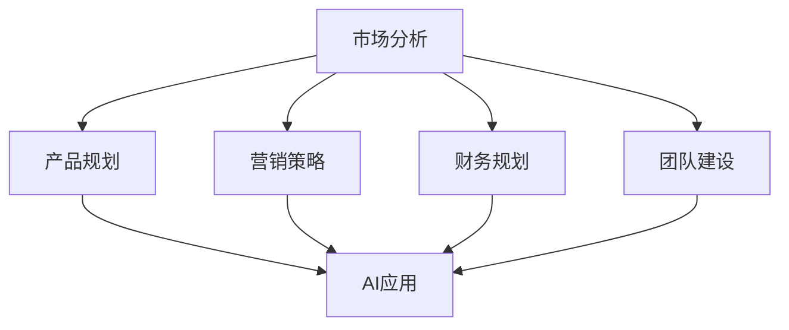

                 

# AI创业公司如何进行战略规划?

> 关键词：人工智能，战略规划，创业公司，数据分析，机器学习，优化算法，市场分析，产品规划，营销策略，财务规划，团队建设

> 摘要：本文将探讨人工智能（AI）创业公司如何进行有效的战略规划。我们将从核心概念与联系、核心算法原理讲解、数学模型与公式详解以及项目实战与代码解读四个部分，深入分析AI战略规划的各个方面，提供实用的指导和建议，帮助AI创业公司在激烈的市场竞争中脱颖而出。

----------------------------------------------------------------

## 第一部分：核心概念与联系

### 1.1 AI与创业公司战略规划概述

#### 1.1.1 AI的定义与重要性

人工智能（AI）是指通过计算机程序和算法，实现人类智能行为的技术。它包括机器学习、深度学习、自然语言处理、计算机视觉等领域。AI的应用正在不断扩展，从自动化生产到智能客服，从医疗诊断到金融风控，AI正深刻改变着各行各业。

在创业公司中，AI的重要性体现在多个方面。首先，AI可以帮助公司进行数据分析和市场预测，从而制定更明智的战略决策。其次，AI可以提高生产效率，减少人力成本，优化业务流程。此外，AI还可以用于创新产品的开发，提升用户体验，增强公司竞争力。

#### 1.1.2 创业公司的战略规划

战略规划是指一个组织为实现其愿景和目标，制定的一系列长期和短期目标及其实现路径。对于创业公司来说，战略规划尤为重要。一方面，初创企业通常资源有限，需要明确的发展方向才能有效利用资源。另一方面，创业公司的市场环境变化迅速，只有通过持续的战略调整，才能在竞争中立于不败之地。

创业公司战略规划的主要内容包括市场分析、产品规划、营销策略、财务规划和团队建设等方面。其中，市场分析是战略规划的基础，通过分析市场趋势、客户需求和竞争对手情况，可以帮助公司制定合适的市场定位和产品策略。产品规划则关注如何开发创新产品，满足市场需求。营销策略涉及如何推广产品，扩大市场份额。财务规划则确保公司有足够的资金支持运营和发展。团队建设则是公司长期发展的关键，通过吸引和培养优秀人才，提高团队整体执行力。

#### 1.1.3 AI与创业公司战略规划的联系

AI技术在创业公司战略规划中发挥着重要作用。首先，AI可以用于市场分析，通过大数据分析和机器学习算法，帮助公司了解市场趋势和客户需求，从而制定更准确的市场预测。其次，AI可以提高产品规划的效率，通过自动化设计、迭代和优化，缩短产品开发周期。此外，AI还可以用于营销策略的优化，通过精准营销、个性化推荐等手段，提高营销效果和客户满意度。最后，AI还可以用于财务规划和团队建设，通过自动化财务分析和人才管理，提高财务管理和人力资源管理的效率。

### Mermaid 流程图



## 第一部分：核心算法原理讲解

### 2.1 数据分析算法

数据分析算法是AI战略规划的基础，用于收集、处理和分析大量数据，以支持战略决策。数据分析算法可以分为统计分析算法和机器学习算法。

#### 2.1.1 统计分析算法

统计分析算法用于分析数据的统计特性，例如数据的平均值、方差、分布等。常见的统计分析算法包括描述性统计分析、假设检验、回归分析等。

- **描述性统计分析**：用于计算数据的中心趋势、离散程度等基本统计量，例如均值、中位数、标准差等。
- **假设检验**：用于检验数据是否符合某种假设，例如独立性检验、卡方检验等。
- **回归分析**：用于建立变量之间的关系模型，例如线性回归、多元回归等。

#### 2.1.2 机器学习算法

机器学习算法用于从数据中学习模式，帮助创业公司做出预测和决策。常见的机器学习算法包括监督学习算法和无监督学习算法。

- **监督学习算法**：用于预测目标变量的值，例如线性回归、决策树、支持向量机等。
  - **线性回归**：用于预测连续值，如销售额、价格等。
  - **决策树**：用于分类和回归任务，具有直观的解释性。
  - **支持向量机**：用于分类任务，具有很好的泛化能力。
- **无监督学习算法**：用于发现数据中的隐含模式，例如聚类算法、降维算法等。
  - **聚类算法**：用于将数据分为不同的类别，如K-means、层次聚类等。
  - **降维算法**：用于减少数据维度，如主成分分析（PCA）、t-SNE等。

### 2.2 优化算法

优化算法用于在多个可行方案中选择最优解。优化算法在创业公司的战略规划中具有重要应用，例如优化资源分配、降低成本、提高效率等。

#### 2.2.1 线性规划

线性规划是一种数学优化方法，用于求解线性目标函数在一系列线性不等式约束下的最优解。线性规划广泛应用于资源分配、生产调度、供应链管理等领域。

- **数学公式**：
  $$ \min_{x} c^T x $$
  $$ \text{subject to} $$
  $$ Ax \leq b $$
  - **x**：决策变量
  - **c**：目标函数系数
  - **A**：约束矩阵
  - **b**：约束向量

#### 2.2.2 遗传算法

遗传算法是一种基于自然选择和遗传机制的优化算法，适用于求解复杂优化问题。遗传算法通过模拟生物进化过程，不断优化解的搜索过程。

- **伪代码示例**：
  
```python
def genetic_algorithm(population, fitness_func, generations, mutation_rate):
    for generation in range(generations):
        # 计算适应度
        fitness = [fitness_func(individual) for individual in population]
        
        # 选择
        selected = select(population, fitness)
        
        # 交叉
        crossed = crossover(selected)
        
        # 变异
        mutated = mutate(crossed, mutation_rate)
        
        # 生成新种群
        population = mutated
    
    # 找到最优解
    best_individual = max(population, key=fitness_func)
    return best_individual
```

## 第一部分：数学模型与公式详解

### 3.1 数据驱动的战略规划模型

数据驱动的战略规划模型基于数据分析结果，通过数学模型和公式，帮助创业公司制定战略决策。以下介绍两种常见的数学模型和公式：回归分析模型和优化模型。

#### 3.1.1 回归分析模型

回归分析模型用于预测目标变量的值，帮助创业公司预测市场趋势、客户需求等。

- **线性回归模型**：
  $$ y = \beta_0 + \beta_1x + \epsilon $$
  - **y**：目标变量
  - **x**：自变量
  - **\beta_0**：截距
  - **\beta_1**：斜率
  - **\epsilon**：误差项

#### 3.1.2 优化模型

优化模型用于在多个可行方案中选择最优解，帮助创业公司优化资源配置、降低成本等。

- **线性规划模型**：
  $$ \min_{x} c^T x $$
  $$ \text{subject to} $$
  $$ Ax \leq b $$
  - **x**：决策变量
  - **c**：目标函数系数
  - **A**：约束矩阵
  - **b**：约束向量

### 数学公式示例

$$
\begin{aligned}
    y &= \beta_0 + \beta_1x + \epsilon \\
    \min_{x} c^T x \\
    \text{subject to} \\
    Ax \leq b
\end{aligned}
$$

## 第一部分：项目实战与代码解读

### 4.1 市场分析项目实战

#### 4.1.1 项目背景

某创业公司希望分析市场数据，以了解潜在客户的需求，从而制定有效的市场策略。

#### 4.1.2 开发环境搭建

- **工具**：Python，NumPy，Pandas，Scikit-learn
- **环境搭建**：安装Python和相关库

#### 4.1.3 数据收集与处理

- **数据来源**：市场调研报告，社交媒体数据等
- **数据处理**：数据清洗，数据整合

#### 4.1.4 代码实现与解读

- **代码实现**：

```python
import numpy as np
import pandas as pd
from sklearn.model_selection import train_test_split
from sklearn.linear_model import LinearRegression

# 数据收集与处理
data = pd.read_csv('market_data.csv')
X = data[['age', 'income']]
y = data['demand']

# 数据划分
X_train, X_test, y_train, y_test = train_test_split(X, y, test_size=0.2, random_state=42)

# 模型训练
model = LinearRegression()
model.fit(X_train, y_train)

# 模型评估
score = model.score(X_test, y_test)
print(f"Model accuracy: {score:.2f}")
```

- **代码解读**：此代码示例展示了如何使用线性回归模型进行市场分析。数据被收集和清洗后，划分成训练集和测试集。使用线性回归模型训练数据，并评估模型在测试集上的准确性。

## 完整目录大纲

### 第一部分：核心概念与联系
#### 1.1 AI与创业公司战略规划概述
##### 1.1.1 AI的定义与重要性
##### 1.1.2 创业公司的战略规划
##### 1.1.3 AI与创业公司战略规划的联系

#### 1.2 核心算法原理讲解
##### 2.1 数据分析算法
##### 2.2 机器学习算法
##### 2.3 优化算法

#### 1.3 数学模型与公式详解
##### 3.1 数据驱动的战略规划模型

#### 1.4 项目实战与代码解读
##### 4.1 市场分析项目实战

### 第二部分：创业公司战略规划应用
#### 2.1 市场分析
##### 2.1.1 市场趋势分析
##### 2.1.2 客户需求分析
##### 2.1.3 竞争对手分析

#### 2.2 产品规划
##### 2.2.1 产品定位
##### 2.2.2 产品创新
##### 2.2.3 产品迭代

#### 2.3 营销策略
##### 2.3.1 营销目标
##### 2.3.2 营销渠道
##### 2.3.3 营销活动

#### 2.4 财务规划
##### 2.4.1 资金筹集
##### 2.4.2 成本控制
##### 2.4.3 盈利模式

#### 2.5 团队建设
##### 2.5.1 人才招聘
##### 2.5.2 团队管理
##### 2.5.3 文化建设

### 第三部分：案例研究
#### 3.1 案例一：某AI创业公司市场战略规划
##### 3.1.1 案例背景
##### 3.1.2 市场分析
##### 3.1.3 产品规划
##### 3.1.4 营销策略
##### 3.1.5 财务规划
##### 3.1.6 团队建设

#### 3.2 案例二：某AI创业公司产品创新
##### 3.2.1 案例背景
##### 3.2.2 产品创新
##### 3.2.3 实施步骤
##### 3.2.4 成果评估

#### 3.3 案例三：某AI创业公司融资策略
##### 3.3.1 案例背景
##### 3.3.2 融资策略
##### 3.3.3 融资渠道
##### 3.3.4 成果评估

### 附录
#### 附录 A: AI战略规划工具与资源
##### A.1 数据分析工具
##### A.2 机器学习框架
##### A.3 优化算法库
##### A.4 其他资源链接

----------------------------------------------------------------

### 结束语

AI创业公司如何在竞争激烈的市场中脱颖而出，战略规划是关键。本文从核心概念与联系、核心算法原理讲解、数学模型与公式详解以及项目实战与代码解读四个方面，详细介绍了AI创业公司如何进行战略规划。通过市场分析、产品规划、营销策略、财务规划和团队建设等方面的应用，AI创业公司可以更好地利用AI技术，实现可持续发展。

然而，战略规划并非一成不变，创业公司需要根据市场环境和自身情况，不断调整和优化战略。此外，创业公司还应关注AI技术的发展趋势，积极探索新的应用领域，以保持竞争优势。

希望本文能为AI创业公司提供有益的启示和指导，助力公司在AI领域取得更大的成功。

---

**作者：AI天才研究院/AI Genius Institute & 禅与计算机程序设计艺术 /Zen And The Art of Computer Programming**

---

（文章完）<|im_end|>

