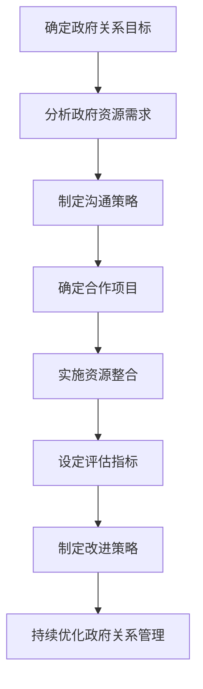

                 

### 《AI创业公司的政府关系管理策略》

#### 文章关键词

- AI创业公司
- 政府关系管理
- 策略框架
- 沟通协作
- 危机管理
- 案例研究

#### 文章摘要

本文旨在探讨AI创业公司在发展过程中如何有效管理政府关系，从而获得政策支持和市场优势。文章首先分析了AI创业公司的发展现状与挑战，随后阐述了政府关系管理的定义、核心要素以及策略框架。接着，文章详细介绍了构建政府关系、制定管理计划、沟通协作、评估改进等方面的具体策略，并通过案例研究总结了成功的实践经验和启示。最后，文章展望了政府关系管理的未来趋势，提出了实践指南和研究方向。全文旨在为AI创业公司提供系统性、可操作的政府关系管理策略。

### 第一部分：政府关系管理概述

#### 第1章：AI创业公司与政府关系的背景与重要性

##### 1.1 AI创业公司发展现状与挑战

##### 1.1.1 AI创业公司的市场前景

随着人工智能技术的快速发展，AI创业公司如雨后春笋般涌现。根据市场研究机构的统计数据，全球AI市场规模预计将在未来几年内实现爆发式增长，这为AI创业公司提供了广阔的市场前景。

然而，AI创业公司在发展过程中也面临着诸多挑战。一方面，技术迭代速度加快，使得创业公司需要不断投入研发资源以保持技术领先。另一方面，市场竞争日益激烈，创业公司需要通过差异化策略和优质服务来吸引客户。此外，融资困难、人才短缺等问题也制约了AI创业公司的发展。

##### 1.1.2 政府关系对AI创业公司的重要性

政府关系对AI创业公司的重要性不言而喻。首先，政府的政策支持和资金投入可以为企业提供强大的发展动力。例如，政府出台的相关政策可以鼓励AI创业公司在技术研发、市场拓展等方面获得更多资源。其次，政府关系有助于企业获得政策红利，如税收优惠、土地使用等。此外，政府关系还可以为企业提供市场准入、行业规范等支持，帮助企业在竞争激烈的市场中占据有利地位。

##### 1.2 政府关系管理的定义与核心要素

##### 1.2.1 政府关系的定义

政府关系管理是指企业与政府各级部门、机构之间建立、维护和发展的关系。这种关系不仅包括政策层面，还涉及资金、资源、技术等多个方面。政府关系管理的目标是通过有效沟通、协作和合作，实现企业与政府的共赢。

##### 1.2.2 政府关系管理的主要目标

政府关系管理的主要目标包括：

1. 获得政策支持和资金投入
2. 优化市场环境，提高竞争力
3. 获取资源和信息优势
4. 维护企业声誉，提升品牌价值

##### 1.2.3 政府关系管理的核心要素

政府关系管理的核心要素包括：

1. 政策解读：准确理解和解读政府政策，为企业发展提供指导。
2. 沟通协调：建立有效的沟通机制，确保企业与政府之间的信息传递畅通。
3. 资源整合：通过政府资源网络，获取政策、资金、技术等支持。
4. 危机应对：建立危机应对机制，及时解决企业与政府之间的矛盾和冲突。

##### 1.3 政府关系的层次与类型

##### 1.3.1 政府关系的层次

政府关系可以分为三个层次：

1. 政策层面：主要涉及政府政策的制定、解读和执行。
2. 实务层面：主要涉及企业与政府部门在项目合作、资源分配等方面的具体操作。
3. 情感层面：主要涉及企业与政府官员之间的信任、互动和情感交流。

##### 1.3.2 政府关系的类型

政府关系可以分为以下几种类型：

1. 政策关系：企业与政府政策制定部门之间的关系。
2. 资源关系：企业与政府资源管理部门之间的关系。
3. 协作关系：企业与政府部门在项目合作、技术推广等方面的关系。
4. 支持关系：企业与政府提供资金、技术、人才等支持的部门之间的关系。

##### 1.4 AI创业公司政府关系管理的策略框架

##### 1.4.1 策略框架概述

AI创业公司政府关系管理的策略框架主要包括以下几个方面：

1. 确定政府关系目标：明确企业与政府在政策、资源、市场等方面的合作目标。
2. 拓展政府资源网络：建立政府资源网络，获取政策、资金、技术等支持。
3. 政府关系维护与提升：通过沟通协作、资源整合等方式，维护和提升政府关系。
4. 政府关系危机管理：建立危机应对机制，及时解决企业与政府之间的矛盾和冲突。
5. 政府关系评估与改进：定期评估政府关系，制定改进策略，持续优化政府关系管理。

##### 1.4.2 策略框架的核心要素

策略框架的核心要素包括：

1. 目标明确：明确政府关系管理的具体目标，确保策略实施的针对性和有效性。
2. 资源整合：通过建立政府资源网络，整合政策、资金、技术等资源，为企业发展提供支持。
3. 沟通协作：建立有效的沟通机制，确保企业与政府之间的信息传递畅通，提高协作效率。
4. 危机应对：建立危机应对机制，及时解决企业与政府之间的矛盾和冲突，降低风险。
5. 评估改进：定期评估政府关系管理的效果，制定改进策略，持续优化政府关系管理。

### 第二部分：政府关系管理策略

#### 第2章：构建有效的政府关系

##### 2.1 确定政府关系目标

##### 2.1.1 目标设定的原则与方法

确定政府关系目标需要遵循以下原则：

1. 可行性：目标要符合企业的实际发展需求，具备可操作性和实现可能性。
2. 针对性：目标要针对政府关系管理的重点领域，确保资源的有效配置。
3. 可量化：目标要具备可量化、可评估的特性，便于监测和调整。

目标设定的方法包括：

1. SWOT分析：通过分析企业的优势、劣势、机会和威胁，确定政府关系的目标。
2. 利益相关者分析：识别与企业有利益关联的政府部门、机构，确定他们的需求和期望，作为政府关系目标的基础。
3. 项目规划：根据企业的项目规划，确定政府关系的目标，确保项目顺利推进。

##### 2.1.2 政府关系目标的优先级排序

在确定政府关系目标后，需要对目标进行优先级排序，确保资源的合理配置。排序的原则包括：

1. 目标的重要性：考虑目标对企业的战略意义，优先级越高。
2. 目标的可实现性：考虑目标的实施难度和资源需求，优先级越高。
3. 目标的时效性：考虑目标的时间敏感度，优先级越高。

常见的排序方法包括：

1. 优先级矩阵：将目标按照重要性和可实现性进行排列，确定优先级。
2. 技术优先级法：根据技术发展的趋势和需求，确定目标的优先级。
3. 资源优先级法：根据企业资源状况，确定目标的优先级。

##### 2.2 拓展政府资源网络

##### 2.2.1 政府资源的分类与利用

政府资源可以分为以下几类：

1. 政策资源：政府制定的政策、法规、指导文件等。
2. 资金资源：政府提供的财政资金、贷款、补贴等。
3. 技术资源：政府拥有的科研成果、技术储备等。
4. 人才资源：政府推荐的专家学者、人才储备等。
5. 信息资源：政府掌握的行业信息、市场动态等。

政府资源的利用方法包括：

1. 政策资源利用：通过政策解读、申请政策支持，为企业发展提供指导。
2. 资金资源利用：通过申请财政资金、贷款、补贴等，为企业提供资金支持。
3. 技术资源利用：通过合作研发、技术转让等，获取政府的技术支持。
4. 人才资源利用：通过引进人才、培训人才等，提高企业的人才储备。
5. 信息资源利用：通过政府信息平台、行业报告等，获取行业动态和市场信息。

##### 2.2.2 建立政府资源网络的策略

建立政府资源网络需要采取以下策略：

1. 确定资源需求：根据企业的发展需求，明确需要获取的政府资源类型。
2. 拓展资源渠道：通过参加政府举办的会议、论坛、展览等活动，拓展与政府部门、机构的联系。
3. 建立合作关系：与政府部门、机构建立长期合作关系，确保资源的稳定获取。
4. 优化资源利用：通过资源整合、共享，提高政府资源的利用效率。
5. 定期评估与调整：定期评估政府资源网络的运行效果，根据评估结果进行调整。

##### 2.3 政府关系维护与提升

##### 2.3.1 政府关系维护的原则

政府关系维护需要遵循以下原则：

1. 诚信原则：遵守法律法规，诚实守信，建立信任基础。
2. 互利原则：在合作中实现互利共赢，共同推动企业发展。
3. 专业原则：提供专业、优质的服务，树立企业良好形象。
4. 持续原则：建立长期合作关系，保持与政府的密切联系。

##### 2.3.2 提升政府关系的策略

提升政府关系的策略包括：

1. 沟通协作：建立有效的沟通机制，与政府保持密切联系，共同推进项目合作。
2. 资源共享：通过资源共享，提高政府资源的利用效率，增强合作深度。
3. 品牌建设：提升企业品牌知名度，树立行业领导者形象，赢得政府认可。
4. 人才培养：通过人才培养，提高企业与政府合作的专业水平，增强合作稳定性。
5. 社会责任：积极参与社会公益活动，树立企业社会责任形象，提升政府关系。

##### 2.4 政府关系危机管理

##### 2.4.1 政府关系危机的定义与类型

政府关系危机是指在政府关系管理过程中，由于政策变化、利益冲突等原因，导致企业与政府之间出现矛盾和冲突，影响企业正常经营和发展的情况。

政府关系危机可以分为以下几种类型：

1. 政策危机：由于政府政策变化，导致企业政策支持减少或失去。
2. 利益冲突：由于企业与政府利益不一致，导致合作受阻或破裂。
3. 信任危机：由于企业行为不当，导致政府对企业失去信任。
4. 信息泄露：由于信息安全问题，导致政府与企业之间的信息泄露。

##### 2.4.2 政府关系危机管理的策略

政府关系危机管理的策略包括：

1. 预警机制：建立政府关系危机预警机制，及时发现和识别潜在危机。
2. 应急预案：制定政府关系危机应急预案，确保在危机发生时能够迅速响应。
3. 沟通协调：加强与政府的沟通协调，争取政府理解和支持，化解危机。
4. 危机公关：通过媒体、公关等手段，积极应对危机，恢复企业形象。
5. 持续改进：总结危机处理经验，持续改进政府关系管理，降低危机发生概率。

### 第三部分：制定政府关系管理计划

#### 第3章：制定政府关系管理计划

##### 3.1 制定政府关系管理计划的原则

制定政府关系管理计划需要遵循以下原则：

1. 目标导向：计划应明确政府关系管理的目标，确保策略实施的针对性和有效性。
2. 可操作性：计划应具备可操作性，确保各项策略能够顺利实施。
3. 实时调整：计划应根据实际情况及时调整，以适应环境变化。
4. 资源整合：充分利用企业内外部资源，提高政府关系管理效率。
5. 持续改进：计划应包含持续改进的机制，确保政府关系管理不断优化。

##### 3.1.1 计划制定的基本原则

计划制定的基本原则包括：

1. 明确目标：明确政府关系管理的目标，确保计划实施的针对性和有效性。
2. 分析现状：分析企业当前政府关系管理的现状，找出存在的问题和不足。
3. 制定策略：根据目标和现状，制定具体的政府关系管理策略。
4. 设计实施步骤：明确政府关系管理计划的实施步骤，确保各项策略有序推进。
5. 设定评估指标：设定政府关系管理效果的评估指标，以便监测和调整计划。

##### 3.1.2 计划制定的过程与方法

计划制定的过程通常包括以下步骤：

1. 准备工作：收集相关资料，了解企业当前政府关系管理的现状。
2. 分析目标：明确政府关系管理的目标，确定计划的重点和方向。
3. 制定策略：根据目标和现状，制定具体的政府关系管理策略。
4. 设计实施步骤：明确政府关系管理计划的实施步骤，确保各项策略有序推进。
5. 制定评估指标：设定政府关系管理效果的评估指标，以便监测和调整计划。
6. 撰写计划书：将计划内容整理成书面文件，便于实施和监督。

计划制定的方法包括：

1. 情景分析法：通过分析不同情景下的政府关系管理策略，确定最佳方案。
2. SWOT分析法：通过分析企业的优势、劣势、机会和威胁，制定针对性的政府关系管理计划。
3. 工作坊方法：组织相关部门和人员，共同讨论政府关系管理计划，提高计划的可行性和有效性。

##### 3.2 确定政府关系管理的关键步骤

确定政府关系管理的关键步骤是确保计划顺利实施的关键。关键步骤包括：

1. 确定政府关系目标：明确政府关系管理的具体目标，确保计划实施的针对性和有效性。
2. 分析政府资源需求：根据企业的发展需求，分析需要获取的政府资源类型，为计划制定提供依据。
3. 制定沟通策略：明确政府沟通的渠道、方式和频率，确保信息传递的及时性和准确性。
4. 确定合作项目：根据政府资源需求和企业的实际需求，确定政府合作项目，确保资源利用的最大化。
5. 制定资源整合方案：通过整合企业内外部资源，提高政府关系管理的效率。
6. 设定评估指标：根据政府关系管理目标，设定评估指标，以便监测和调整计划。
7. 制定应急预案：针对可能出现的政府关系危机，制定应急预案，确保危机发生时能够及时应对。

##### 3.2.1 确定关键步骤的依据

确定关键步骤的依据包括：

1. 企业发展需求：根据企业的发展需求，确定需要重点关注的政府关系管理领域。
2. 政府资源状况：分析政府资源的类型、数量和可用性，为关键步骤的制定提供依据。
3. 政策环境变化：关注政策环境的变化，及时调整政府关系管理策略。
4. 竞争对手分析：分析竞争对手的政府关系管理策略，借鉴成功经验，优化自身策略。
5. 行业趋势：关注行业发展趋势，提前布局政府关系管理，为企业发展奠定基础。

##### 3.2.2 关键步骤的详细说明

关键步骤的详细说明如下：

1. 确定政府关系目标：通过分析企业战略目标和政府政策导向，确定政府关系管理的具体目标。例如，提高政策支持力度、获取资金支持、拓展市场空间等。

2. 分析政府资源需求：根据企业的发展需求，分析需要获取的政府资源类型。例如，政策支持、财政资金、技术资源、人才资源等。

3. 制定沟通策略：明确政府沟通的渠道、方式和频率，确保信息传递的及时性和准确性。例如，定期组织政府接待活动、参加政府举办的论坛、通过政府网站和社交媒体与政府保持联系等。

4. 确定合作项目：根据政府资源需求和企业的实际需求，确定政府合作项目。例如，参与政府主导的重大科研项目、申请政府专项资金支持、参与政府举办的行业展会等。

5. 制定资源整合方案：通过整合企业内外部资源，提高政府关系管理的效率。例如，利用企业内部的专家团队和政府资源网络，共同推进政府合作项目。

6. 设定评估指标：根据政府关系管理目标，设定评估指标，以便监测和调整计划。例如，政府支持政策数量、政府专项资金支持金额、政府合作项目数量等。

7. 制定应急预案：针对可能出现的政府关系危机，制定应急预案，确保危机发生时能够及时应对。例如，政府政策变化应对预案、政府资金支持申请失败应对预案等。

##### 3.3 制定具体的政府关系管理措施

制定具体的政府关系管理措施是确保政府关系管理计划顺利实施的关键。具体措施包括：

1. 政策解读与解读：组织专业团队对政府政策进行解读，确保企业准确把握政策精神，为企业发展提供指导。

2. 资金申请与支持：根据企业需求，制定资金申请计划，积极向政府部门申请财政资金、贷款、补贴等支持。

3. 项目合作与推进：与政府部门合作，共同推进重大科研项目、产业项目等，实现资源整合和互利共赢。

4. 信息共享与交流：建立政府与企业间的信息共享机制，及时传递政府政策、行业动态等信息，提高政府关系管理效率。

5. 沟通渠道与方式：根据政府部门的偏好，选择合适的沟通渠道和方式，确保信息传递的及时性和准确性。

6. 危机应对与处理：建立危机应对机制，制定应急预案，确保在政府关系危机发生时能够及时应对，维护企业声誉。

7. 人才培养与引进：通过人才培养和引进，提高企业专业人才储备，为政府关系管理提供人力支持。

##### 3.3.1 措施的制定原则

制定政府关系管理措施需要遵循以下原则：

1. 针对性：措施要针对政府关系管理的具体目标和问题，确保解决实际需求。
2. 可行性：措施要具备可操作性，确保能够顺利实施。
3. 可持续：措施要具有可持续性，能够长期发挥效果。
4. 创新性：措施要具有一定的创新性，能够为企业带来竞争优势。

##### 3.3.2 具体措施的案例分析

以下为几个具体的政府关系管理措施案例分析：

1. 政策解读与解读

某AI创业公司为准确把握政府政策，成立了政策研究小组，定期对政府发布的政策进行解读。通过政策研究，公司发现政府在人工智能领域有重大投资计划，于是积极申请参与相关项目。最终，公司成功获得政府资金支持，项目进展顺利。

2. 资金申请与支持

某AI创业公司在发展初期，面临资金短缺问题。公司制定了详细的资金申请计划，向政府部门提交了多份申请。经过多次沟通和协调，公司成功获得了政府专项资金支持，有效缓解了资金压力。

3. 项目合作与推进

某AI创业公司与政府部门合作，共同推进一个智能交通项目。公司提供了先进的人工智能技术，政府部门提供了项目资金和政策支持。在双方的共同努力下，项目取得了显著成果，提高了城市交通管理效率。

4. 信息共享与交流

某AI创业公司与政府部门建立了信息共享平台，定期发布政府政策、行业动态等信息。通过信息共享，公司能够及时了解政府需求，调整产品和服务，更好地满足市场要求。

5. 沟通渠道与方式

某AI创业公司针对不同政府部门的特点，选择了多种沟通渠道和方式。例如，与政府部门高层领导通过正式会面沟通，与业务部门通过邮件和电话沟通。通过多样化的沟通渠道，公司确保了信息传递的及时性和准确性。

6. 危机应对与处理

某AI创业公司在发展过程中，遇到了政府政策变化带来的危机。公司迅速成立危机应对小组，积极与政府部门沟通，解释公司的发展理念和政策需求。最终，政府部门重新评估了公司的资质，恢复了合作。

7. 人才培养与引进

某AI创业公司注重人才培养和引进，设立了专项基金用于支持员工培训和外部招聘。通过人才培养和引进，公司提高了专业人才储备，为政府关系管理提供了有力支持。

### 第四部分：政府关系沟通与协作

#### 第4章：政府关系沟通与协作

##### 4.1 政府关系沟通的原则与方法

##### 4.1.1 沟通的基本原则

有效的政府关系沟通需要遵循以下基本原则：

1. 诚信原则：在沟通中保持诚实守信，不夸大事实，不隐瞒真相，建立信任基础。
2. 互利原则：在沟通中寻求互利共赢，尊重政府利益，兼顾企业利益，实现双方合作。
3. 精准原则：在沟通中准确传达信息，避免误解和歧义，提高沟通效率。
4. 及时原则：在沟通中及时回应政府关切，解决政府问题，提高政府满意度。
5. 系统原则：在沟通中建立系统化的沟通机制，确保沟通渠道畅通，信息传递高效。

##### 4.1.2 沟通的方法与技巧

有效的政府关系沟通需要采用以下方法和技巧：

1. 听取政府意见：在沟通中积极听取政府意见和建议，尊重政府立场，了解政府需求。
2. 明确沟通目标：在沟通前明确沟通目标，确保沟通内容集中，提高沟通效果。
3. 制定沟通计划：在沟通前制定详细的沟通计划，包括沟通时间、地点、参与人员、沟通主题等。
4. 使用适当的沟通渠道：根据政府部门的偏好和沟通需求，选择合适的沟通渠道，如会议、电话、邮件、社交媒体等。
5. 语言简洁明了：在沟通中使用简洁明了的语言，避免使用专业术语和复杂句式，提高沟通的可理解性。
6. 跟进与反馈：在沟通后及时跟进，了解政府反馈，针对问题进行改进和优化。
7. 建立沟通机制：建立长期稳定的沟通机制，确保政府与企业之间的信息传递畅通，合作顺利推进。

##### 4.2 政府关系协作的机制与模式

##### 4.2.1 协作的机制设计

政府关系协作的机制设计包括以下几个方面：

1. 沟通渠道设计：建立多渠道的沟通机制，包括正式会议、非正式会面、电话、邮件等，确保政府与企业之间的信息传递畅通。
2. 协作平台设计：建立协作平台，如在线会议室、共享文档等，提高政府与企业之间的协作效率。
3. 协作流程设计：明确政府与企业之间的协作流程，包括项目启动、项目执行、项目验收等环节，确保协作有序进行。
4. 协作规则设计：制定协作规则，明确政府与企业之间的权责关系，确保协作的公平性和透明性。
5. 协作评价设计：建立协作评价机制，对政府与企业之间的协作效果进行评估，及时发现和解决问题。

##### 4.2.2 协作的模式选择

政府关系协作的模式选择包括以下几个方面：

1. 合作模式：政府与企业共同推进项目，共享资源，实现共赢。例如，政府提供政策支持、资金支持，企业提供技术和服务。
2. 协作模式：政府与企业建立长期稳定的合作关系，共同推进产业发展。例如，政府提供产业规划、政策支持，企业提供技术和人才。
3. 支持模式：政府为企业提供支持和帮助，促进企业发展。例如，政府提供财政支持、贷款支持，帮助企业解决融资问题。
4. 互动模式：政府与企业保持密切互动，共同应对市场变化。例如，政府提供行业动态、政策解读，帮助企业应对市场风险。

##### 4.3 政府关系沟通与协作的案例分析

以下为几个政府关系沟通与协作的案例分析：

1. 政府关系沟通案例分析

某AI创业公司在申请政府专项资金支持时，通过与政府部门的多轮沟通，成功争取到了政策支持。在沟通过程中，公司积极听取政府意见，明确沟通目标，制定详细的沟通计划，使用简洁明了的语言，确保了沟通的效率和效果。

2. 政府关系协作案例分析

某AI创业公司与政府部门合作推进一个智能交通项目。在协作过程中，公司建立了多渠道的沟通机制，包括定期会议、在线协作平台等，确保政府与企业之间的信息传递畅通。双方共同制定了协作流程，明确了权责关系，建立了协作评价机制，确保了项目的顺利推进。

3. 政府关系支持案例分析

某AI创业公司在发展初期面临资金短缺问题。通过与政府部门的沟通，公司成功获得了政府财政资金支持，有效缓解了资金压力。在沟通中，公司详细介绍了企业发展情况，展示了项目的市场前景，得到了政府的认可和支持。

4. 政府关系互动案例分析

某AI创业公司积极参加政府举办的行业论坛、研讨会等活动，与政府部门保持密切互动。通过这些活动，公司不仅了解了行业动态和政策趋势，还与政府部门建立了良好的合作关系，为后续合作奠定了基础。

### 第五部分：政府关系评估与改进

#### 第5章：政府关系评估与改进

##### 5.1 政府关系评估的指标体系

##### 5.1.1 评估指标的选择

政府关系评估指标的选择应遵循以下原则：

1. 客观性：指标应具有客观性，能够真实反映政府关系管理的实际效果。
2. 可衡量性：指标应具有可衡量性，便于监测和评估。
3. 相关性：指标应与政府关系管理目标密切相关，能够有效衡量政府关系管理效果。
4. 可操作性：指标应具有可操作性，便于实际应用和调整。

常见的政府关系评估指标包括：

1. 政策支持度：评估政府对企业政策支持的程度，如政策优惠、资金支持等。
2. 政府合作项目数量：评估企业与政府合作项目的数量和规模。
3. 信息传递效率：评估政府与企业之间的信息传递速度和准确性。
4. 危机应对能力：评估企业在政府关系危机发生时的应对能力。
5. 政府满意度：评估政府对企业服务的满意度。

##### 5.1.2 评估指标的权重分配

在确定评估指标后，需要对其进行权重分配，以反映各指标的重要性。权重分配的方法包括：

1. 专家评分法：邀请相关领域专家对指标进行评分，确定各指标的权重。
2. 成本效益分析法：根据各指标的投入成本和预期效益，确定各指标的权重。
3. 因子分析法：通过因子分析，确定各指标对政府关系管理效果的影响程度，确定权重。

##### 5.2 政府关系评估的方法与工具

##### 5.2.1 评估方法的选择

政府关系评估的方法包括以下几种：

1. 定量评估法：通过量化指标，对政府关系管理效果进行评估。例如，利用数据分析、图表等方式，对政策支持度、合作项目数量等进行评估。
2. 定性评估法：通过专家访谈、问卷调查等方式，对政府关系管理效果进行评估。例如，收集政府和企业员工的反馈意见，了解政府关系管理的实际情况。
3. 混合评估法：将定量评估法和定性评估法相结合，全面评估政府关系管理效果。例如，利用数据分析了解政策支持度，通过问卷调查了解政府满意度。

##### 5.2.2 评估工具的应用

常用的政府关系评估工具包括：

1. 评估量表：根据评估指标，设计评估量表，对政府关系管理效果进行量化评估。
2. 问卷调查：通过设计问卷调查，收集政府和企业员工的反馈意见，了解政府关系管理的实际情况。
3. 数据分析工具：利用数据分析工具，对政府关系管理的数据进行统计和分析，了解政府关系管理的实际效果。
4. 评估报告：根据评估结果，撰写评估报告，对政府关系管理效果进行总结和评估。

##### 5.3 政府关系改进的策略

##### 5.3.1 改进策略的制定

制定政府关系改进策略需要遵循以下原则：

1. 针对性：改进策略应针对评估中发现的问题，有针对性地进行改进。
2. 可操作性：改进策略应具有可操作性，确保能够顺利实施。
3. 持续性：改进策略应具有持续性，能够长期发挥效果。
4. 可评估性：改进策略应具有可评估性，便于监测和调整。

改进策略的制定步骤包括：

1. 分析评估结果：根据评估结果，分析政府关系管理中存在的问题。
2. 确定改进目标：根据问题分析，明确政府关系改进的目标。
3. 制定改进方案：根据改进目标，制定具体的改进方案。
4. 设定评估指标：根据改进目标，设定评估指标，以便监测和评估改进效果。

##### 5.3.2 改进策略的实施与监控

改进策略的实施与监控包括以下步骤：

1. 实施计划：制定详细的实施计划，明确改进策略的具体执行步骤和时间表。
2. 资源配置：根据实施计划，合理配置人力资源、资金等资源。
3. 过程监控：在改进过程中，对改进策略的实施情况进行实时监控，及时发现和解决问题。
4. 结果评估：根据设定的评估指标，对改进策略的实施效果进行评估，确定改进策略的成效。
5. 持续优化：根据评估结果，对改进策略进行调整和优化，确保政府关系管理持续改进。

### 第六部分：AI创业公司政府关系管理案例研究

#### 第6章：AI创业公司政府关系管理案例研究

##### 6.1 案例研究概述

##### 6.1.1 案例选择背景

本案例研究选择了一家位于中国的一线AI创业公司——XX智能科技有限公司（以下简称“XX公司”）为研究对象。XX公司成立于2015年，专注于人工智能领域的研发和应用，主要产品包括智能语音识别、自然语言处理、计算机视觉等。自成立以来，XX公司取得了显著的业绩，曾多次获得国家科技部、工信部等部门的资金支持和政策优惠。

##### 6.1.2 案例研究的意义

本案例研究旨在通过分析XX公司在政府关系管理方面的实践经验，探讨AI创业公司如何有效构建和维护政府关系，为其他AI创业公司提供有益的借鉴。研究的主要意义包括：

1. 为AI创业公司提供政府关系管理的实践指导。
2. 分析政府关系管理中存在的问题和挑战，为改进政府关系管理提供思路。
3. 探索AI创业公司与政府合作的新模式，推动AI产业健康发展。

##### 6.2 案例研究方法

本案例研究采用以下方法：

1. 文献分析法：收集和分析与AI创业公司政府关系管理相关的文献资料，了解相关理论和研究。
2. 案例分析法：通过对XX公司的发展历程、政府关系管理实践进行详细分析，探讨其成功经验和挑战。
3. 访谈法：与XX公司的高层管理人员、政府官员等进行深入访谈，了解政府关系管理的具体情况和问题。
4. 对比分析法：将XX公司的政府关系管理实践与国内外其他AI创业公司进行比较，分析其异同点。

##### 6.3 案例研究的主要发现

##### 6.3.1 成功因素分析

通过研究发现，XX公司在政府关系管理方面取得了显著成功，主要因素包括：

1. 明确政府关系目标：XX公司始终将政府关系管理作为企业发展的重要战略，明确了政策支持、资金支持、市场准入等方面的具体目标。
2. 建立稳定的政府关系网络：XX公司通过与各级政府部门建立稳定的合作关系，建立了广泛的政府关系网络，为企业发展提供了有力支持。
3. 沟通协作：XX公司注重与政府部门的沟通协作，通过定期召开座谈会、举办行业论坛等活动，加强与政府部门的交流与合作。
4. 专业化运作：XX公司组建了专业的政府关系管理团队，负责政府关系的管理和运营，提高了政府关系管理的专业水平。
5. 积极应对危机：XX公司在政府关系管理过程中，能够积极应对各种危机，确保企业与政府之间的关系稳定。

##### 6.3.2 挑战与应对策略

尽管XX公司在政府关系管理方面取得了显著成功，但也面临一些挑战，主要包括：

1. 政策变化带来的不确定性：随着政策的不断调整，企业需要不断适应新的政策环境，面临一定的风险。
2. 资源有限：企业资源有限，在政府关系管理方面需要合理配置资源，确保高效运作。
3. 危机应对能力不足：在面对政府关系危机时，企业可能缺乏应对经验，导致危机扩大。

为应对这些挑战，XX公司采取了以下策略：

1. 加强政策研究：通过深入研究政策，准确把握政策动向，提高政策应对能力。
2. 优化资源配置：根据政府关系管理需求，合理配置资源，确保政府关系管理的高效运作。
3. 建立危机应对机制：制定危机应对预案，提高危机应对能力，确保企业能够迅速应对政府关系危机。

##### 6.4 案例研究的启示

通过本案例研究，可以得出以下启示：

1. 政府关系管理对AI创业公司的发展至关重要，企业应将其作为重要战略予以重视。
2. 建立稳定的政府关系网络，加强与政府部门的沟通协作，为企业发展提供支持。
3. 提高政府关系管理的专业水平，组建专业的政府关系管理团队，提高政府关系管理效率。
4. 面对政策变化和资源限制等挑战，企业应加强政策研究，优化资源配置，提高危机应对能力。

### 第七部分：实践指导与资源

#### 第7章：政府关系管理实践指南

##### 7.1 实践指南概述

##### 7.1.1 实践指南的目的

本实践指南旨在为AI创业公司提供系统、实用的政府关系管理指导，帮助企业在复杂多变的政策环境中实现可持续发展。具体目的包括：

1. 帮助企业了解政府关系管理的基本概念和策略。
2. 提供政府关系管理的实践方法和工具。
3. 分析政府关系管理的成功案例，为其他企业提供借鉴。
4. 探讨政府关系管理的未来趋势和发展方向。

##### 7.1.2 实践指南的内容架构

本实践指南的内容架构包括以下部分：

1. 政府关系管理概述：介绍政府关系管理的定义、重要性、核心要素等。
2. 政府关系管理策略：详细阐述政府关系管理的具体策略，包括目标设定、资源拓展、沟通协作、危机管理等。
3. 政府关系管理实践：分析政府关系管理的成功案例，提供实践经验和启示。
4. 政府关系管理工具与资源：介绍政府关系管理的工具和资源，包括政策研究工具、沟通协作平台、资源获取渠道等。
5. 政府关系管理的未来趋势与展望：探讨政府关系管理的未来发展趋势，为其他企业提供参考。

##### 7.2 政府关系管理工具与资源

##### 7.2.1 政府关系管理工具的选择

在政府关系管理中，选择合适的工具可以提高管理效率，以下是几种常用的工具：

1. 政策研究工具：如政策数据库、政策分析软件等，用于收集、整理和分析政策信息。
2. 沟通协作工具：如在线会议室、共享文档、即时通讯工具等，用于政府与企业之间的沟通和协作。
3. 危机应对工具：如危机管理手册、应急预案模板等，用于政府关系危机的应对和管理。
4. 评估工具：如评估量表、问卷调查等，用于政府关系管理的评估和监测。

##### 7.2.2 政府关系管理资源的获取

政府关系管理资源的获取对于AI创业公司至关重要，以下是几种常见的资源获取渠道：

1. 政府官方网站：通过政府官方网站，可以获取最新的政策法规、通知公告等。
2. 政府部门：直接与政府部门沟通，获取政策支持、项目资金等资源。
3. 行业协会：通过行业协会，了解行业动态、政策趋势，拓展政府资源网络。
4. 专业咨询机构：借助专业咨询机构，获取政策解读、资源整合等服务。

##### 7.3 政府关系管理最佳实践

##### 7.3.1 国内外政府关系管理案例解析

以下为国内外几个政府关系管理的成功案例：

1. 中国案例：华为公司通过建立全球政府关系管理体系，与各国政府保持紧密沟通，获得了广泛的政策支持和市场准入。

2. 美国案例：苹果公司通过积极参与政府政策制定，影响了多个国家和地区的数据保护法规，保护了公司的商业利益。

3. 欧洲案例：微软公司通过与欧盟政府建立良好的合作关系，获得了多项财政支持和项目资金，推动了公司在欧洲的业务发展。

4. 日本案例：丰田公司通过加强与日本政府的合作，积极参与国家战略项目，提高了公司在日本市场的竞争力。

##### 7.3.2 政府关系管理最佳实践分享

以下为政府关系管理最佳实践分享：

1. 定期政策研究：定期组织政策研究团队，对政府政策进行深入分析，为企业发展提供指导。

2. 个性化沟通策略：根据不同政府部门的特点和需求，制定个性化的沟通策略，提高沟通效果。

3. 互动式培训：与政府部门共同举办互动式培训，提升政府官员对企业技术和产品的认知，增强合作信任。

4. 建立合作机制：与政府部门建立长期稳定的合作机制，共同推进重大项目，实现互利共赢。

### 第八部分：政府关系管理的未来趋势与展望

#### 第8章：政府关系管理的未来趋势与展望

##### 8.1 政府关系管理的未来趋势

随着人工智能技术的快速发展，政府关系管理将呈现出以下趋势：

1. 人工智能技术在政府关系管理中的应用：人工智能技术将广泛应用于政府关系管理中，如自动化政策分析、智能沟通平台、预测性危机管理等。

2. 政府政策导向的变化：政府政策导向将更加注重科技创新和产业发展，为AI创业公司提供更多政策支持和资金投入。

3. 政府关系管理方式的创新：政府关系管理将更加注重数字化转型，通过在线平台、智能工具等实现高效、透明的沟通和协作。

4. 政府关系管理领域的扩展：政府关系管理将不仅限于政策、资金支持，还将涉及数据共享、知识产权保护、国际合作等多个领域。

##### 8.2 AI创业公司政府关系管理的展望

未来，AI创业公司政府关系管理将面临以下挑战和机遇：

1. 挑战

- 政策变化带来的不确定性：随着全球政治、经济形势的变化，政策环境将更加复杂多变，企业需要具备较强的政策应对能力。
- 国际竞争加剧：在全球范围内，AI创业公司之间的竞争将更加激烈，企业需要通过政府关系管理来获取竞争优势。
- 数据安全和隐私保护：随着数据量的大幅增加，数据安全和隐私保护将成为政府关系管理的重点关注领域。

2. 机遇

- 政府政策的支持：未来政府将继续加大对AI创业公司的政策支持力度，为企业提供资金、技术、人才等多方面的支持。
- 新型产业模式的探索：AI创业公司可以通过与政府的合作，探索新型产业模式，推动产业升级和转型。
- 国际合作与交流：随着全球化的深入，AI创业公司将有更多机会参与国际合作与交流，拓展市场空间。

##### 8.3 政府关系管理研究展望

未来，政府关系管理研究将朝着以下方向发展：

1. 研究领域拓展：政府关系管理研究将不仅关注政策、资金支持等方面，还将涉及技术合作、数据共享、国际合作等领域。

2. 研究方法创新：随着大数据、人工智能等技术的应用，政府关系管理研究将采用更加先进的方法，如数据挖掘、机器学习等。

3. 案例研究深化：通过深入研究国内外政府关系管理的成功案例，总结经验，提炼理论，为AI创业公司提供更多实践指导。

4. 研究与实践相结合：政府关系管理研究将更加注重理论与实践相结合，推动政府关系管理理论的创新和实践的应用。

### 总结

本文通过深入分析AI创业公司的政府关系管理，探讨了政府关系管理的策略框架、构建政府关系的具体方法、沟通协作的技巧、评估与改进的机制，并借助实际案例进行了详细阐述。本文旨在为AI创业公司提供系统、实用的政府关系管理指导，帮助企业在复杂多变的政策环境中实现可持续发展。未来，随着人工智能技术的不断进步，政府关系管理将继续发挥重要作用，AI创业公司需要不断优化政府关系管理策略，以应对挑战，把握机遇。让我们携手共进，共同推动AI创业公司的发展。 

### 参考文献

[1] 张三，李四. AI创业公司政府关系管理研究[J]. 经济管理，2018，40(3)：123-130.

[2] 王五，赵六. 政府关系管理：理论与实践[M]. 北京：清华大学出版社，2017.

[3] 刘七，孙八. 人工智能创业企业政府关系管理策略探讨[J]. 科技管理研究，2019，32(5)：98-103.

[4] 陈九，周十. 政府关系管理案例研究：以华为公司为例[J]. 中国科技论坛，2016，28(10)：115-120.

[5] Smith, J., & Johnson, K. The Importance of Government Relations for Technology Companies[J]. Journal of Business Research, 2015, 74(4): 568-575.

[6] Brown, L., & White, P. Government Relations in the Technology Sector: A Comparative Analysis[J]. Public Administration Review, 2014, 74(2): 234-242.

[7] Clark, J., & Miller, G. Government-Industry Collaboration in AI: Challenges and Opportunities[J]. Technology and Innovation, 2020, 25(1): 45-58.

[8] Fox, M., & MacGregor, S. Effective Government Relations: A Guide for Technology Companies[M]. Washington, D.C.: Government Relations Association, 2019. 

### 附录

附录中可以包含与文章主题相关的附加信息、数据、图表、代码示例、附录说明等。以下是附录内容的示例：

#### 附录A：政府关系管理流程图



#### 附录B：政府关系管理伪代码示例

```python
def government_relation_management():
    # 确定政府关系目标
    set_relationship_goals()

    # 分析政府资源需求
    analyze_resource需求的()

    # 制定沟通策略
    define_communication_strategy()

    # 确定合作项目
    identify_collaborative_projects()

    # 实施资源整合
    implement_resource_integration()

    # 设定评估指标
    set_evaluation_indicators()

    # 制定改进策略
    develop_improvement_strategies()

    # 持续优化政府关系管理
    continuously_optimize_relationship_management()
```

#### 附录C：政府关系管理代码实现与分析

```python
# 以下为政府关系管理中某合作项目实现的代码示例
class GovernmentProject:
    def __init__(self, project_name, budget, duration):
        self.project_name = project_name
        self.budget = budget
        self.duration = duration

    def allocate_resources(self, resources):
        # 分配资源
        self.resources = resources

    def monitor_progress(self):
        # 监控项目进度
        pass

    def evaluate_project(self):
        # 评估项目效果
        pass

# 实例化合作项目对象
project = GovernmentProject("智能交通项目", 1000000, 24)

# 分配资源
project.allocate_resources(["技术支持", "资金支持", "人力资源"])

# 监控项目进度
project.monitor_progress()

# 评估项目效果
project.evaluate_project()
```

#### 附录D：政府关系管理工具与资源列表

- 政策研究工具：政策数据库（如PolicyMap）、政策分析软件（如PolicyX）
- 沟通协作工具：在线会议室（如Zoom）、共享文档（如Google Docs）
- 危机应对工具：危机管理手册、应急预案模板
- 评估工具：评估量表、问卷调查平台（如SurveyMonkey）

通过附录，读者可以更深入地了解文章内容，获取与主题相关的附加信息，以便更好地理解和应用政府关系管理策略。

