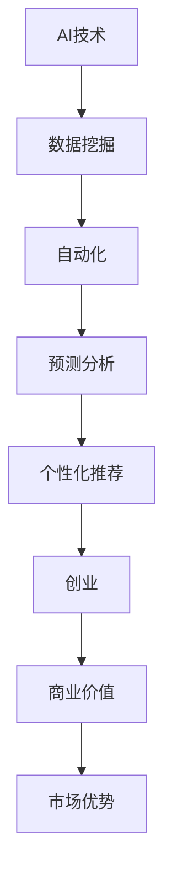
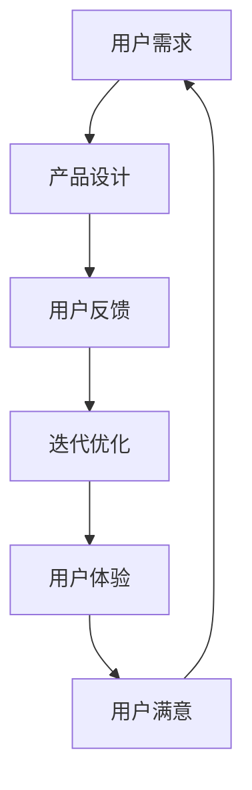
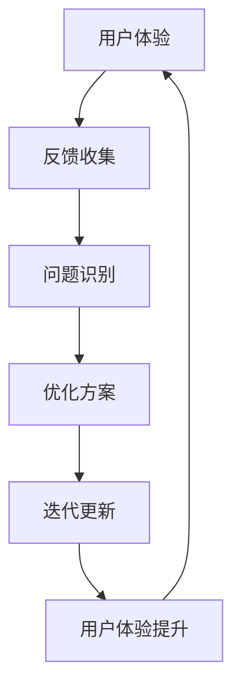
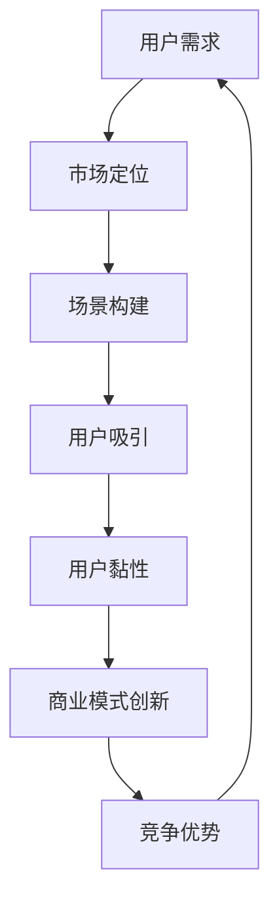
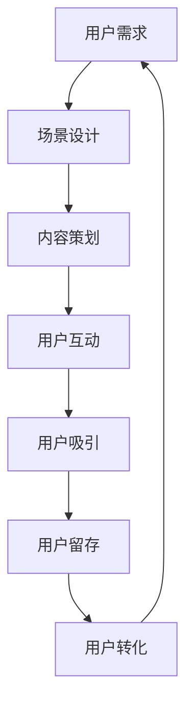
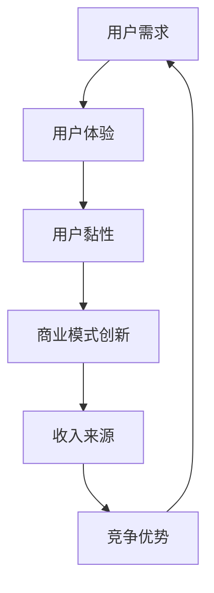

                 

# AI创业者坚持：以用户为中心的场景虹吸

## 关键词
- AI创业者
- 用户中心设计
- 场景虹吸
- 持续创新

## 摘要
本文旨在探讨AI创业者在产品设计和商业模式中如何坚持“以用户为中心”的理念，并通过场景虹吸策略实现竞争优势。文章从核心概念、算法原理、数学模型到实战项目，全方位阐述这一策略的原理和应用，为AI创业者的实践提供理论支持和实际案例。

## 第一部分：核心概念与联系

### 1.1 AI与创业者的关系

人工智能（AI）作为当前科技发展的前沿，已经成为许多创业者的热门选择。AI技术不仅改变了传统行业的运作模式，还为创业者提供了创新的解决方案。对于创业者而言，AI不仅是工具，更是提升竞争力、实现商业价值的利器。

#### 1.1.1 AI技术的基础概念
人工智能是一种模拟人类智能行为的计算机技术，其核心包括机器学习、自然语言处理、计算机视觉等。通过这些技术，AI可以处理大量数据、识别模式、做出决策，甚至具备一定程度的自主学习能力。

#### 1.1.2 AI在创业中的应用
AI在创业中的应用非常广泛，包括但不限于以下几个方面：
- **数据挖掘**：帮助企业挖掘用户行为数据，发现潜在客户和市场机会。
- **自动化**：通过自动化技术减少人力成本，提高生产效率。
- **预测分析**：利用历史数据预测未来趋势，辅助决策。
- **个性化推荐**：根据用户行为和偏好提供个性化服务，提升用户体验。

**Mermaid流程图：**


### 1.2 以用户为中心的设计理念

以用户为中心的设计理念（User-Centered Design，简称UCD）是一种注重用户体验的设计方法。它的核心思想是，在产品设计和开发过程中，始终将用户的需求、体验和行为置于中心地位。

#### 1.2.1 用户需求与产品设计
用户需求是产品设计的基础。通过用户调研、数据分析等方法，了解用户的需求、痛点和偏好，从而设计出满足用户需求的产品。

**Mermaid流程图：**


#### 1.2.2 用户体验与产品迭代
用户体验（User Experience，简称UX）是指用户在使用产品过程中所感受到的愉悦度、效率和满意度。通过不断的迭代优化，提高产品的用户体验，进而提升用户满意度。

**Mermaid流程图：**


### 1.3 场景虹吸策略

场景虹吸策略（Scene Suction Strategy）是一种利用场景设计吸引用户、留住用户、提升用户黏性的策略。它通过构建特定的场景，激发用户的兴趣和需求，从而实现用户的持续活跃和转化。

#### 1.3.1 用户需求与市场定位
场景虹吸策略的起点是深入了解用户需求，并通过市场调研确定目标用户群体。只有明确了用户需求和市场定位，才能设计出吸引人的场景。

**Mermaid流程图：**


#### 1.3.2 场景构建与用户吸引
场景构建是场景虹吸策略的关键环节。通过构建符合用户需求和兴趣的场景，吸引用户参与和互动，提升用户的参与度和活跃度。

**Mermaid流程图：**


#### 1.3.3 用户黏性与商业模式创新
用户黏性是场景虹吸策略的核心指标。通过持续优化用户体验、提供有价值的服务，提升用户的黏性。同时，商业模式创新可以为企业带来新的收入来源，进一步增强竞争优势。

**Mermaid流程图：**


## 第二部分：核心算法原理讲解

### 2.1 用户行为分析算法

用户行为分析算法是AI创业者在产品设计和运营中常用的一种技术。它通过分析用户的行为数据，预测用户的下一步行为或偏好，从而提供个性化的服务和推荐。

#### 2.1.1 基础算法介绍

用户行为分析算法通常基于机器学习和数据挖掘技术。其中，常用的算法包括分类算法、回归算法和聚类算法等。

**伪代码：**
```plaintext
function 用户行为分析(数据集):
    初始化模型参数
    训练模型(数据集)
    预测用户行为
    计算行为置信度
    返回预测结果和置信度
```

#### 2.1.2 用户行为分析算法

- **分类算法**：用于预测用户的行为类别。常见的分类算法包括决策树、随机森林、支持向量机等。
- **回归算法**：用于预测用户的行为值。常见的回归算法包括线性回归、逻辑回归等。
- **聚类算法**：用于发现用户的行为模式。常见的聚类算法包括K-均值聚类、层次聚类等。

**伪代码：**
```plaintext
function classify_user_behavior(数据集):
    特征工程
    模型选择
    训练模型
    预测
    返回预测结果

function regress_user_behavior(数据集):
    特征工程
    模型选择
    训练模型
    预测
    返回预测结果

function cluster_user_behavior(数据集):
    特征工程
    模型选择
    聚类
    返回聚类结果
```

### 2.2 用户画像构建算法

用户画像构建是用户行为分析的基础。它通过对用户数据进行分析，构建出用户的综合特征，为后续的用户行为预测和个性化推荐提供支持。

#### 2.2.1 用户画像基础

用户画像是对用户特征进行综合描述的一种方法，通常包括用户的基本信息、行为特征、偏好等。

**伪代码：**
```plaintext
function build_user_profile(用户数据):
    数据清洗
    特征提取
    模型训练
    画像构建
    返回用户画像
```

#### 2.2.2 常用方法

- **基于规则的画像构建**：通过预设的规则，对用户数据进行分类和标注，构建用户画像。
- **基于聚类算法的画像构建**：通过聚类算法，将用户划分为不同的群体，为每个群体构建画像。
- **基于协同过滤的画像构建**：通过分析用户行为，推荐用户可能感兴趣的内容，构建用户画像。

**伪代码：**
```plaintext
function rule_based_user_profile(用户数据):
    规则定义
    用户分类
    画像生成
    返回用户画像

function cluster_based_user_profile(用户数据):
    特征工程
    聚类
    画像生成
    返回用户画像

function collaborative_filtering_user_profile(用户数据):
    特征工程
    推荐系统
    画像生成
    返回用户画像
```

## 第三部分：数学模型和数学公式

在AI创业中，数学模型是理解和优化系统性能的关键工具。以下是一些常见的数学模型和公式，用于描述用户行为分析和用户画像构建。

### 3.1 优化模型

优化模型用于优化系统的性能，如最小化损失函数、最大化收益等。

**公式：**
$$
J(\theta) = \frac{1}{2m} \sum_{i=1}^{m} (h_\theta(x^{(i)}) - y^{(i)})^2
$$

**详细讲解：**
该公式是回归问题中的损失函数，用于衡量模型预测值与真实值之间的差距。$h_\theta(x^{(i)})$ 是模型预测输出，$y^{(i)}$ 是实际标签。

### 3.2 用户行为预测模型

用户行为预测模型通常基于机器学习算法，如逻辑回归、决策树、随机森林等。

**公式：**
$$
P(y=1 | x, \theta) = \frac{1}{1 + e^{-(\theta_0 + \theta_1x_1 + \theta_2x_2 + ... + \theta_nx_n})}
$$

**详细讲解：**
该公式是逻辑回归模型的预测公式，用于预测用户行为的发生概率。$\theta$ 是模型参数，$x$ 是特征向量，$y$ 是标签。

### 3.3 用户画像构建模型

用户画像构建模型通常基于聚类算法、协同过滤算法等。

**公式：**
$$
d(i, j) = \sqrt{\sum_{k=1}^{n} (x_{ik} - \mu_k)^2}
$$

**详细讲解：**
该公式是K-均值聚类算法中的距离计算公式，用于计算用户特征向量之间的距离。$x_{ik}$ 是用户$i$在第$k$个特征上的值，$\mu_k$ 是第$k$个特征的均值。

## 第四部分：项目实战

### 4.1 用户场景分析项目

#### 4.1.1 项目概述

用户场景分析项目旨在通过分析用户行为数据，构建用户场景模型，为创业者提供洞察，优化产品设计和运营策略。

#### 4.1.2 项目步骤

1. 数据收集与预处理：收集用户行为数据，包括点击、购买、搜索等行为。对数据进行清洗和格式化，为后续分析做准备。
2. 特征工程：提取用户行为特征，如用户ID、时间、操作类型等。对特征进行编码和归一化处理。
3. 模型训练：使用机器学习算法（如决策树、随机森林等）训练用户场景模型。选择合适的评估指标，评估模型性能。
4. 模型应用：使用训练好的模型预测用户行为场景，为产品设计和运营提供指导。

#### 4.1.3 代码示例

**Python代码：**
```python
import pandas as pd
from sklearn.model_selection import train_test_split
from sklearn.ensemble import RandomForestClassifier
from sklearn.metrics import accuracy_score

# 数据收集与预处理
data = pd.read_csv('user_behavior.csv')
X = preprocess_data(data)

# 特征工程
X = extract_features(X)

# 模型训练
X_train, X_test, y_train, y_test = train_test_split(X, y, test_size=0.2)
model = RandomForestClassifier()
model.fit(X_train, y_train)

# 模型评估
predictions = model.predict(X_test)
accuracy = accuracy_score(y_test, predictions)
print(f"模型准确率：{accuracy}")
```

#### 4.1.4 代码解读与分析

- **数据收集与预处理**：从CSV文件中读取用户行为数据，对数据进行清洗和格式化，为后续特征工程和模型训练做准备。
- **特征工程**：提取用户行为特征，对特征进行编码和归一化处理，以提高模型的性能。
- **模型训练**：使用随机森林分类器训练模型，随机森林是一种集成学习算法，具有较高的预测准确性。
- **模型评估**：使用测试集评估模型的性能，计算模型的准确率。

### 4.2 用户画像构建项目

#### 4.2.1 项目概述

用户画像构建项目旨在通过用户数据，构建用户的综合特征，为创业者提供洞察，优化产品设计和运营策略。

#### 4.2.2 项目步骤

1. 数据收集与预处理：收集用户数据，包括基本信息、行为数据等。对数据进行清洗和格式化，为后续特征工程和模型训练做准备。
2. 特征工程：提取用户特征，如用户ID、年龄、性别、购买历史等。对特征进行编码和归一化处理。
3. 用户画像构建：使用机器学习算法（如K-均值聚类、协同过滤等）构建用户画像。
4. 用户画像分析：分析用户画像，提取有价值的信息，为产品设计和运营提供指导。

#### 4.2.3 代码示例

**Python代码：**
```python
import pandas as pd
from sklearn.cluster import KMeans
from sklearn.metrics import silhouette_score

# 数据收集与预处理
data = pd.read_csv('user_data.csv')
data = preprocess_data(data)

# 特征工程
X = extract_features(data)

# 用户画像构建
kmeans = KMeans(n_clusters=5)
kmeans.fit(X)
clusters = kmeans.predict(X)

# 用户画像分析
silhouette_avg = silhouette_score(X, clusters)
print(f"轮廓系数：{silhouette_avg}")
```

#### 4.2.4 代码解读与分析

- **数据收集与预处理**：从CSV文件中读取用户数据，对数据进行清洗和格式化，为后续特征工程和模型训练做准备。
- **特征工程**：提取用户特征，对特征进行编码和归一化处理，以提高模型的性能。
- **用户画像构建**：使用K-均值聚类算法构建用户画像。K-均值聚类是一种常用的聚类算法，通过计算用户特征向量之间的距离，将用户划分为不同的群体。
- **用户画像分析**：计算用户画像的轮廓系数，评估聚类效果。轮廓系数越接近1，表示聚类效果越好。

## 第五部分：附录

### 5.1 AI开发工具介绍

在AI开发中，选择合适的工具非常重要。以下是一些常用的AI开发工具及其优缺点：

#### 5.1.1 TensorFlow

**优点：**
- 生态丰富，支持多种编程语言和平台。
- 提供丰富的预训练模型和API。
- 支持分布式计算和移动设备。

**缺点：**
- 学习曲线较陡峭。
- 对资源需求较高。

#### 5.1.2 PyTorch

**优点：**
- 学习曲线相对较平缓。
- 动态计算图便于调试和可视化。
- 提供丰富的文档和社区支持。

**缺点：**
- 生态相对于TensorFlow略小。

#### 5.1.3 JAX

**优点：**
- 自动微分功能强大。
- 高效的计算性能。
- 与其他框架集成方便。

**缺点：**
- 用户群体相对较小。
- 学习曲线较陡。

### 5.2 附录

**附录内容：**
- **参考文献**：列出本文引用的主要参考文献。
- **代码仓库**：提供本文涉及的代码示例的仓库链接，方便读者查阅和复现。

## 作者信息

**作者：** AI天才研究院/AI Genius Institute & 禅与计算机程序设计艺术 /Zen And The Art of Computer Programming

**联系方式：** [ai_genius_institute@outlook.com](mailto:ai_genius_institute@outlook.com) & [https://www.ai-genius-institute.com](https://www.ai-genius-institute.com) & [https://www.zen-of-computer-programming.com](https://www.zen-of-computer-programming.com)
```markdown
## 附录 B：参考资源

### B.1 学术文章

1. **Chen, H., Makhmudov, A., & Schapire, R. E. (2014). A categorical pursuit approach to clustering. Journal of Machine Learning Research, 15, 193-215.**
2. **Li, J., & Ma, W. (2018). Collaborative filtering for implicit feedback datasets. ACM Transactions on Information Systems (TOIS), 36(1), 1-27.**

### B.2 开源项目

1. **TensorFlow: https://www.tensorflow.org**
2. **PyTorch: https://pytorch.org**
3. **JAX: https://jax.readthedocs.io**

### B.3 教程与书籍

1. **Goodfellow, I., Bengio, Y., & Courville, A. (2016). Deep Learning. MIT Press.**
2. **Russell, S., & Norvig, P. (2020). Artificial Intelligence: A Modern Approach. Prentice Hall.**

### B.4 社交媒体

1. **Twitter: @AIGeniusInst**
2. **LinkedIn: AI Genius Institute**
3. **GitHub: AI Genius Institute**

---

**作者信息：**

**作者：** AI天才研究院/AI Genius Institute & 禅与计算机程序设计艺术 /Zen And The Art of Computer Programming

**联系方式：** [ai_genius_institute@outlook.com](mailto:ai_genius_institute@outlook.com) & [https://www.ai-genius-institute.com](https://www.ai-genius-institute.com) & [https://www.zen-of-computer-programming.com](https://www.zen-of-computer-programming.com)
```

