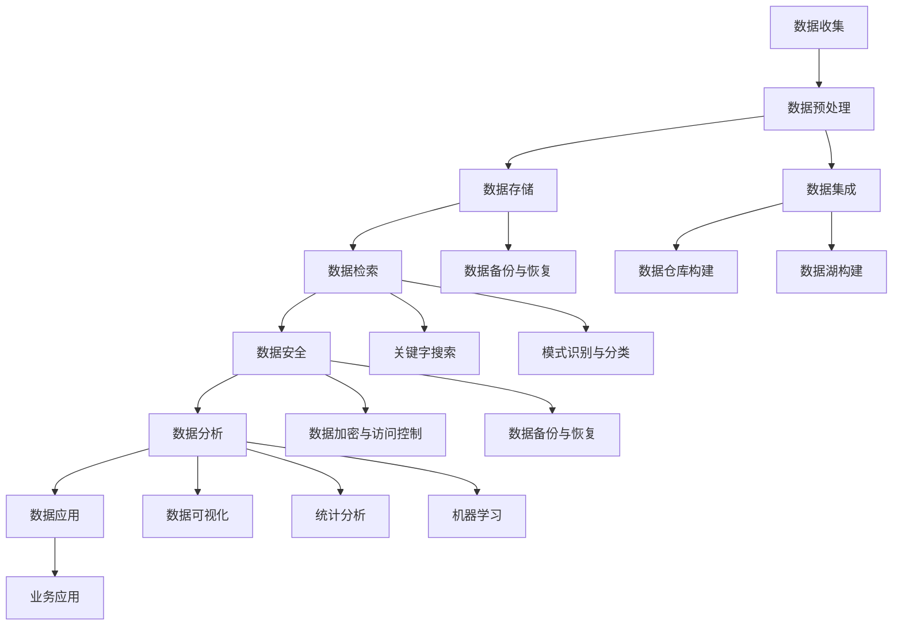

                 

### 《AI创业：数据管理流程优化》

#### 关键词：人工智能、数据管理、流程优化、创业、数据分析、安全隐私

> 在当前人工智能快速发展的时代，创业公司的数据管理流程优化变得尤为重要。本文将详细探讨数据管理流程中的核心环节，包括数据收集、处理、存储、检索、安全、质量管理和数据分析，并结合实际案例，提供实用的优化策略和实施指南。

---

### 第一部分：AI创业基础

#### 第1章：AI创业概述

##### 1.1 AI创业的意义与趋势

随着人工智能技术的不断进步，AI创业已经成为当前科技领域的一大热点。AI创业不仅为创业者提供了丰富的机会，也为传统行业带来了革新和转型的动力。

##### 1.2 AI创业中的挑战与机遇

AI创业虽然充满机遇，但也面临着一系列挑战，如数据质量、数据安全、技术人才短缺等问题。如何在竞争中脱颖而出，成为创业公司成功的关键。

##### 1.3 创业者所需的核心技能

成功的AI创业者需要具备多方面的技能，包括对AI技术的深刻理解、数据分析能力、项目管理经验以及团队领导力。

#### 第2章：数据管理概述

##### 2.1 数据管理的核心概念

数据管理涉及数据的收集、存储、处理、分析和利用，是实现数据价值的关键。

##### 2.2 数据管理的流程与步骤

数据管理的流程通常包括数据规划、数据收集、数据存储、数据清洗、数据整合、数据分析和数据应用等步骤。

##### 2.3 数据管理的重要性

良好的数据管理能够提高数据质量，降低数据风险，为创业公司提供可靠的决策支持。

---

### 第二部分：数据管理流程优化

#### 第3章：数据收集与处理

##### 3.1 数据收集的方法与策略

数据收集是数据管理的基础，合理的收集方法与策略能够确保数据的全面性和准确性。

###### 3.1.1 数据来源的多样性

数据的来源可以包括内部数据、外部数据以及用户生成数据等，多样性数据源有助于提高数据的覆盖面。

###### 3.1.2 数据收集的技术手段

现代数据收集技术包括爬虫、API接口、传感器和移动应用等，根据需求选择合适的收集手段。

##### 3.2 数据预处理技术

数据预处理是数据管理流程中不可或缺的环节，主要包括数据清洗、转换、归一化和标准化等。

###### 3.2.1 数据清洗与转换

数据清洗主要去除重复、错误和无效数据，数据转换则是将不同格式和单位的数据转换为统一格式。

###### 3.2.2 数据归一化与标准化

数据归一化和标准化有助于提高数据的一致性和可比性，为后续分析提供基础。

##### 3.3 数据集成技术

数据集成是将来自不同来源的数据整合到一个统一的存储环境中，以提高数据利用效率。

###### 3.3.1 数据仓库构建

数据仓库是一种用于存储和管理大量数据的系统，能够支持复杂的数据查询和分析。

###### 3.3.2 数据湖构建

数据湖是一种分布式存储架构，适用于存储大量非结构化和半结构化数据。

---

#### 第4章：数据存储与检索

##### 4.1 数据存储技术

数据存储技术包括关系型数据库、NoSQL数据库、分布式文件系统等，根据数据特性选择合适的存储技术。

###### 4.1.1 数据库系统

关系型数据库具有结构化数据存储和管理能力，适用于事务型应用。

###### 4.1.2 分布式存储系统

分布式存储系统具有高可用性、高扩展性，适用于大规模数据存储。

##### 4.2 数据检索技术

数据检索技术包括关键字搜索、全文搜索、模式识别和分类等，提高数据检索效率和准确性。

###### 4.2.1 关键字搜索

关键字搜索是一种常用的文本检索技术，能够快速定位相关数据。

###### 4.2.2 模式识别与分类

模式识别与分类技术能够自动识别数据中的模式，实现自动化数据分类。

---

#### 第5章：数据安全与隐私保护

##### 5.1 数据安全策略

数据安全策略包括数据加密、访问控制、审计和备份等，确保数据在存储、传输和使用过程中的安全。

###### 5.1.1 数据加密与访问控制

数据加密能够保护数据在存储和传输过程中的隐私，访问控制则限制对数据的访问权限。

###### 5.1.2 数据备份与恢复

数据备份与恢复是数据安全的重要保障，能够在数据丢失或损坏时快速恢复。

##### 5.2 隐私保护技术

隐私保护技术包括数据匿名化、差分隐私和同态加密等，保护用户隐私免受泄露和滥用。

###### 5.2.1 数据匿名化

数据匿名化通过去除或替换敏感信息，降低数据泄露风险。

###### 5.2.2 差分隐私技术

差分隐私技术通过在数据处理过程中引入噪声，保护用户隐私。

---

#### 第6章：数据质量管理

##### 6.1 数据质量评估

数据质量评估是数据管理的重要环节，包括准确性、完整性、一致性和时效性等。

###### 6.1.1 数据准确性

数据准确性是数据质量的核心指标，确保数据真实可靠。

###### 6.1.2 数据完整性

数据完整性指数据是否完整无缺，避免数据缺失导致分析错误。

##### 6.2 数据质量提升

数据质量提升包括数据清洗、数据规范化、数据完整性检测和修复等。

###### 6.2.1 数据清洗

数据清洗通过去除重复、错误和无效数据，提高数据质量。

###### 6.2.2 数据规范化

数据规范化通过统一数据格式和单位，提高数据的一致性和可比性。

---

#### 第7章：数据应用与分析

##### 7.1 数据可视化

数据可视化是将复杂的数据通过图形、图表等形式直观展示，帮助用户更好地理解和分析数据。

###### 7.1.1 可视化工具与应用

常用的数据可视化工具有Tableau、Power BI和D3.js等，适用于不同场景的数据可视化需求。

###### 7.1.2 数据可视化技巧

数据可视化技巧包括选择合适的图表类型、优化颜色和字体等，提高数据可视化的效果。

##### 7.2 数据分析技术

数据分析技术包括统计分析、机器学习和数据挖掘等，用于发现数据中的隐藏模式和规律。

###### 7.2.1 统计分析

统计分析通过统计方法分析数据，帮助用户理解数据的分布和趋势。

###### 7.2.2 机器学习

机器学习通过建立模型分析数据，自动发现数据中的模式和关联。

---

#### 第8章：数据管理流程优化实战

##### 8.1 数据管理流程优化策略

数据管理流程优化需要明确优化目标，分析现有流程，制定合理的优化方案。

###### 8.1.1 流程优化目标

流程优化目标包括提高数据质量、降低数据风险、提高数据利用效率等。

###### 8.1.2 流程优化方法

流程优化方法包括数据收集与处理优化、数据存储与检索优化、数据安全与隐私保护优化等。

##### 8.2 案例分析

结合实际案例，分析数据管理流程优化的具体实施方法。

###### 8.2.1 案例一：电商数据管理流程优化

分析电商数据管理流程优化，提高数据质量和利用效率。

###### 8.2.2 案例二：金融数据管理流程优化

分析金融数据管理流程优化，确保数据安全性和合规性。

##### 8.3 实战指南

提供数据管理流程优化的实施指南，包括步骤、策略和建议。

###### 8.3.1 数据管理流程优化步骤

包括确定优化目标、分析现有流程、制定优化方案和实施监控等。

###### 8.3.2 实施策略与建议

包括技术选择、团队建设、风险管理和持续改进等。

---

### 附录

#### 附录A：数据管理流程优化工具与技术

介绍常用的数据管理流程优化工具和技术，包括数据库管理系统、数据仓库与数据湖、数据挖掘与机器学习工具等。

#### 附录B：参考文献与进一步阅读

推荐相关的书籍、学术论文和在线资源，帮助读者深入了解数据管理流程优化。

---

### 结论

本文详细探讨了数据管理流程优化在AI创业中的重要性，分析了数据收集、处理、存储、检索、安全、质量管理和数据分析等核心环节。通过实际案例和实战指南，为创业者提供了实用的优化策略和实施建议。

---

### 作者

作者：AI天才研究院/AI Genius Institute & 禅与计算机程序设计艺术 /Zen And The Art of Computer Programming

---

本文通过对数据管理流程优化的深入剖析，旨在为AI创业公司提供有价值的技术指导，助力创业者成功。随着人工智能技术的不断进步，数据管理流程优化将成为AI创业的核心竞争力之一。希望通过本文的分享，能够激发更多创业者对数据管理的重视，推动AI创业的蓬勃发展。

---

本文将按照上述目录结构，逐步深入探讨每一个章节的核心内容，结合实际案例和实战指南，为读者提供一份全面的数据管理流程优化指南。

---

接下来，我们将详细探讨每个章节的核心概念、原理和实践方法，帮助读者更好地理解数据管理流程优化的重要性和具体实施策略。

---

## 第1章：AI创业概述

### 1.1 AI创业的意义与趋势

随着人工智能技术的不断进步，AI创业已经成为当前科技领域的热点。AI创业不仅为企业带来了前所未有的创新机会，也为传统行业带来了深刻的变革。AI创业的意义主要体现在以下几个方面：

1. **创新驱动力**：AI创业为传统行业注入新的活力，推动产业升级和创新发展。通过AI技术，企业可以挖掘海量数据中的价值，实现个性化服务和智能决策。

2. **市场竞争力**：在人工智能时代，拥有AI技术的企业能够在市场竞争中脱颖而出。AI创业可以帮助企业提高运营效率、降低成本、提升用户体验，从而增强市场竞争力。

3. **社会价值**：AI创业不仅为企业带来商业价值，还为社会带来了诸多积极影响。例如，智能医疗可以提高诊断准确率，智能交通可以减少交通事故，智能教育可以促进教育公平等。

### 1.2 AI创业中的挑战与机遇

尽管AI创业充满机遇，但也面临着一系列挑战：

1. **数据质量**：数据质量是AI创业的核心挑战之一。高质量的数据是训练有效AI模型的基础，数据缺失、噪声和错误都会影响模型的性能。

2. **数据安全与隐私**：随着数据规模的扩大，数据安全和隐私保护变得更加重要。如何确保数据在收集、存储、处理和应用过程中的安全，是AI创业需要面对的重要问题。

3. **技术人才**：AI创业需要具备多方面技能的技术人才，包括算法工程师、数据科学家、机器学习工程师等。然而，当前AI技术人才的短缺成为制约创业公司发展的瓶颈。

4. **技术壁垒**：AI技术具有较高的技术门槛，创业公司在技术积累和研发投入上需要较大的投入。

### 1.3 创业者所需的核心技能

成功的AI创业者需要具备以下核心技能：

1. **技术理解**：创业者需要深入了解AI技术的基本原理和应用场景，能够把握技术的最新趋势。

2. **数据分析能力**：数据分析是AI创业的核心环节，创业者需要具备数据收集、处理、分析和解释的能力。

3. **项目管理**：创业者需要具备良好的项目管理能力，能够规划项目进度、分配资源、协调团队工作。

4. **团队领导力**：创业者需要具备领导力，能够吸引和留住优秀的团队成员，激发团队的创新活力。

5. **商业敏锐度**：创业者需要具备商业敏锐度，能够发现市场需求，设计出具有商业价值的AI产品或服务。

---

## 第2章：数据管理概述

### 2.1 数据管理的核心概念

数据管理是指对数据的收集、存储、处理、分析和应用过程进行系统的组织、规划和控制，以确保数据的质量、可用性和安全性。数据管理包括以下几个核心概念：

1. **数据质量**：数据质量是数据管理的重要指标，包括准确性、完整性、一致性、及时性和可靠性等。

2. **数据治理**：数据治理是指制定和实施数据管理政策、流程和标准，确保数据的有效利用和合规性。

3. **数据生命周期**：数据生命周期是指数据从生成、存储、处理、使用到销毁的全过程，包括数据规划、数据收集、数据存储、数据清洗、数据整合、数据分析、数据共享和数据销毁等环节。

4. **数据安全**：数据安全是指保护数据在存储、传输和处理过程中的隐私和安全，防止数据泄露、篡改和丢失。

5. **数据合规性**：数据合规性是指数据管理过程符合相关法律法规和行业标准，确保数据的合法性和合规性。

### 2.2 数据管理的流程与步骤

数据管理流程通常包括以下步骤：

1. **数据规划**：明确数据管理目标、策略和流程，确保数据管理的有效性和可持续性。

2. **数据收集**：收集来自各种来源的数据，包括内部数据、外部数据、用户生成数据等，确保数据的多样性和完整性。

3. **数据存储**：选择合适的数据存储技术，包括关系型数据库、NoSQL数据库、分布式文件系统等，确保数据的持久性和可访问性。

4. **数据清洗**：通过去除重复、错误和无效数据，提高数据质量，确保数据的准确性、完整性和一致性。

5. **数据整合**：将来自不同来源和格式的数据整合到一个统一的数据仓库或数据湖中，提高数据的利用效率。

6. **数据分析**：运用统计分析、机器学习等方法分析数据，发现数据中的模式和关联，提供决策支持。

7. **数据共享**：通过数据共享平台和接口，实现数据的开放和共享，促进数据的价值最大化。

8. **数据销毁**：按照法律法规和合规要求，对不再需要的数据进行销毁，确保数据的安全和隐私。

### 2.3 数据管理的重要性

良好的数据管理对于创业公司具有重要意义：

1. **提高数据质量**：通过数据清洗、整合和分析，提高数据的准确性、完整性和一致性，为决策提供可靠依据。

2. **降低数据风险**：通过数据安全和隐私保护措施，降低数据泄露、篡改和丢失的风险，确保数据的保密性和合规性。

3. **优化业务流程**：通过数据管理和分析，发现业务流程中的问题和瓶颈，优化业务流程，提高运营效率。

4. **支持创新**：通过数据洞察和预测，支持创业公司的创新，开发出具有市场竞争力的人工智能产品和服务。

5. **提升用户体验**：通过数据分析和个性化服务，提升用户满意度，增强用户黏性。

---

## 第3章：数据收集与处理

### 3.1 数据收集的方法与策略

数据收集是数据管理的基础，合理的收集方法与策略能够确保数据的全面性和准确性。以下是几种常见的数据收集方法和策略：

#### 3.1.1 数据来源的多样性

数据来源的多样性是确保数据全面性的关键。常见的数据来源包括：

1. **内部数据**：来自企业内部的各种业务系统，如ERP、CRM、生产系统等，包括交易记录、用户行为数据等。

2. **外部数据**：来自企业外部的各种数据源，如社交媒体、公共数据库、第三方数据提供商等，包括市场趋势、竞争分析、用户评论等。

3. **用户生成数据**：用户在平台上的互动数据，如评论、反馈、点击行为等，这些数据可以提供用户行为模式和偏好的洞察。

4. **传感器数据**：来自各种传感器的实时数据，如温度、湿度、位置、运动等，这些数据可以用于物联网应用和智能监控。

#### 3.1.2 数据收集的技术手段

为了高效地收集不同类型的数据，创业者需要选择合适的技术手段：

1. **爬虫技术**：通过爬虫程序自动抓取互联网上的公开数据，适用于大规模、结构化的数据收集。

2. **API接口**：通过调用第三方数据提供方的API接口，获取其开放的数据服务，适用于标准化、结构化的数据收集。

3. **传感器采集**：通过部署传感器设备，实时采集环境数据，适用于物联网应用和实时监控场景。

4. **移动应用收集**：通过开发移动应用，收集用户在应用中的行为数据，适用于用户行为分析和个性化推荐。

### 3.2 数据预处理技术

数据预处理是数据管理流程中不可或缺的环节，它确保数据在进入分析阶段之前的质量。以下是几种常见的数据预处理技术：

#### 3.2.1 数据清洗与转换

数据清洗是数据预处理的核心步骤，主要包括以下任务：

1. **去除重复数据**：通过匹配和去重，去除数据集中的重复记录。

2. **处理缺失数据**：通过填充、删除或估算缺失值，提高数据的完整性。

3. **纠正错误数据**：通过数据验证和校验，识别并纠正错误数据。

4. **数据转换**：将不同格式和单位的数据转换为统一格式，确保数据的一致性。

#### 3.2.2 数据归一化与标准化

数据归一化和标准化是提高数据一致性和可比性的重要手段：

1. **数据归一化**：将不同量纲的数据转换为相同量纲，如将不同货币单位转换为统一货币单位。

2. **数据标准化**：通过缩放和转换，将数据映射到相同的范围，如将年龄数据映射到0-100的整数范围。

### 3.3 数据集成技术

数据集成是将来自不同来源和格式的数据整合到一个统一的数据仓库或数据湖中，以提高数据的利用效率和一致性。以下是几种常见的数据集成技术：

#### 3.3.1 数据仓库构建

数据仓库是一种用于存储和管理大量结构化和非结构化数据的技术，主要包括以下步骤：

1. **数据抽取**：从源系统中抽取数据，包括结构化数据和非结构化数据。

2. **数据清洗**：对抽取的数据进行清洗，确保数据的准确性、完整性和一致性。

3. **数据转换**：将清洗后的数据转换为统一格式，如ETL（抽取、转换、加载）过程。

4. **数据加载**：将转换后的数据加载到数据仓库中，实现数据的集中存储和管理。

#### 3.3.2 数据湖构建

数据湖是一种分布式存储架构，适用于存储大量非结构化和半结构化数据。数据湖的主要特点包括：

1. **数据多样性**：能够存储多种类型的数据，包括结构化、半结构化和非结构化数据。

2. **灵活性**：允许数据以原始格式存储，无需事先进行格式转换。

3. **高性能**：支持海量数据的实时处理和分析。

通过数据集成技术，创业者可以构建一个统一的数据平台，实现数据的全面整合和利用，为后续的数据分析和业务决策提供支持。

---

## 第4章：数据存储与检索

### 4.1 数据存储技术

数据存储技术是数据管理流程中的重要组成部分，直接影响到数据的安全、可靠性和访问速度。以下是几种常见的数据存储技术：

#### 4.1.1 数据库系统

数据库系统是一种用于存储和管理结构化数据的技术，具有以下特点：

1. **关系型数据库（RDBMS）**：关系型数据库使用SQL语言进行数据查询和管理，适用于结构化数据的存储和管理。常见的RDBMS包括MySQL、Oracle、PostgreSQL等。

2. **非关系型数据库（NoSQL）**：非关系型数据库不遵循传统的关系型数据库模式，适用于存储大规模的非结构化、半结构化数据。常见的NoSQL数据库包括MongoDB、Cassandra、Redis等。

#### 4.1.2 分布式存储系统

分布式存储系统通过将数据分散存储在多个节点上，提供高可用性、高扩展性和高性能的数据存储解决方案。以下是几种常见的分布式存储系统：

1. **Hadoop HDFS**：Hadoop分布式文件系统（HDFS）是一种分布式文件存储系统，适用于大规模数据的存储和管理。HDFS通过数据分片和副本机制，提供数据的高可靠性和高性能。

2. **Cassandra**：Cassandra是一种分布式NoSQL数据库，适用于大规模数据的存储和管理。Cassandra通过分布式架构和一致性算法，提供高性能的数据读写操作。

3. **Elasticsearch**：Elasticsearch是一种分布式搜索引擎，适用于大规模文本数据的存储和检索。Elasticsearch通过分布式索引和搜索算法，提供高效的数据检索功能。

### 4.2 数据检索技术

数据检索技术是数据管理流程中的重要环节，用于快速、准确地查找和访问数据。以下是几种常见的数据检索技术：

#### 4.2.1 关键字搜索

关键字搜索是一种常用的文本检索技术，通过匹配关键字和索引，快速查找相关的数据记录。以下是几种常见的关键字搜索技术：

1. **全文索引**：全文索引将文档中的所有文本内容进行索引，支持快速搜索和模糊匹配。常见的全文索引工具包括Lucene、Solr等。

2. **倒排索引**：倒排索引通过记录单词和文档的对应关系，支持快速搜索和匹配。常见的倒排索引实现包括 inverted index、TF-IDF等。

#### 4.2.2 模式识别与分类

模式识别与分类技术通过分析和分类数据，发现数据中的模式和关联。以下是几种常见的模式识别与分类技术：

1. **机器学习分类**：机器学习分类算法通过训练模型，将数据分类到不同的类别中。常见的机器学习分类算法包括K-最近邻（K-NN）、支持向量机（SVM）等。

2. **关联规则学习**：关联规则学习通过分析数据中的关联关系，发现频繁出现的模式。常见的关联规则学习算法包括Apriori算法、FP-growth算法等。

通过合理的数据存储和检索技术，创业者可以构建高效、可靠的数据管理系统，实现数据的快速访问和分析，为业务决策提供有力支持。

---

## 第5章：数据安全与隐私保护

### 5.1 数据安全策略

数据安全是数据管理的重要方面，关系到企业的核心竞争力、用户信任和市场竞争力。为了确保数据的安全性，创业者需要制定全面的数据安全策略，涵盖以下几个方面：

#### 5.1.1 数据加密与访问控制

数据加密是一种常用的数据保护措施，通过将数据转换成不可解密的格式，防止未经授权的访问和数据泄露。以下是数据加密和访问控制的关键点：

1. **加密算法**：选择合适的加密算法，如AES（高级加密标准）、RSA（公钥加密算法）等，确保数据加密的安全性。

2. **数据分类**：根据数据的敏感程度，对数据进行分类，采取不同的加密策略和访问控制措施。

3. **访问控制**：通过身份验证、权限管理和访问控制列表（ACL）等手段，确保只有授权用户才能访问数据。

#### 5.1.2 数据备份与恢复

数据备份和恢复是数据安全的重要保障，能够在数据丢失或损坏时快速恢复数据。以下是数据备份和恢复的关键点：

1. **备份策略**：制定合理的备份策略，包括全量备份、增量备份和差异备份等，确保备份数据的完整性和可用性。

2. **备份存储**：选择可靠的备份存储介质，如本地硬盘、远程云存储等，确保备份数据的安全和可靠性。

3. **恢复计划**：制定详细的恢复计划，包括数据恢复流程、恢复步骤和时间表等，确保在数据丢失或损坏时能够快速恢复。

#### 5.1.3 审计与监控

审计和监控是数据安全的重要组成部分，通过实时监控数据访问和操作行为，及时发现和应对安全威胁。以下是审计和监控的关键点：

1. **日志记录**：记录数据访问和操作日志，包括用户身份、访问时间、操作类型等，为安全审计提供依据。

2. **实时监控**：通过实时监控系统和安全事件响应（SIEM）工具，及时发现和处理安全事件。

3. **安全审计**：定期进行安全审计，检查数据安全策略和措施的执行情况，发现潜在的安全风险和漏洞。

### 5.2 隐私保护技术

在数据管理过程中，保护用户隐私至关重要。隐私保护技术通过多种手段，确保用户数据在收集、存储、处理和应用过程中的安全性和隐私性。以下是几种常见的隐私保护技术：

#### 5.2.1 数据匿名化

数据匿名化通过去除或替换敏感信息，降低数据泄露风险，确保用户隐私。以下是数据匿名化的关键点：

1. **k-匿名性**：通过在数据集中添加噪声或替换敏感信息，使得单个记录无法被识别，同时保证数据集的统计特性不变。

2. **l-diversity**：在数据集中，至少有l个不同的记录与真实记录相同，从而降低单个记录的识别风险。

3. **t-closeness**：通过调整数据集的分布，使得真实记录的邻近记录分布相似，从而降低识别风险。

#### 5.2.2 差分隐私

差分隐私是一种统计隐私保护方法，通过在数据处理过程中引入噪声，确保单个记录的隐私。以下是差分隐私的关键点：

1. **机制设计**：设计差分隐私机制，如拉普拉斯机制、指数机制等，将噪声引入数据处理过程中。

2. **隐私预算**：确定隐私预算，即允许的最大隐私损失，以确保隐私保护的效果。

3. **隐私分析**：对差分隐私机制进行隐私分析，评估隐私保护的强度和有效性。

通过全面的数据安全策略和隐私保护技术，创业者可以确保数据在数据管理流程中的安全性和隐私性，增强用户信任，降低数据风险，为企业的长期发展提供保障。

---

## 第6章：数据质量管理

### 6.1 数据质量评估

数据质量评估是确保数据满足业务需求和决策支持的关键步骤。数据质量评估包括以下几个方面：

#### 6.1.1 数据准确性

数据准确性是指数据是否真实反映了现实世界的情况。评估数据准确性通常包括以下步骤：

1. **数据验证**：检查数据的完整性、一致性和正确性，确保数据没有缺失或错误。

2. **比较分析**：将数据与外部数据源或行业标准进行比对，验证数据的准确性。

3. **重复数据检测**：检测并去除重复的数据记录，避免重复计算或错误分析。

#### 6.1.2 数据完整性

数据完整性是指数据是否完整无缺，确保数据没有丢失或遗漏。评估数据完整性通常包括以下步骤：

1. **缺失值分析**：检测并分析数据集中的缺失值，确定缺失值的原因和处理方法。

2. **完整性检查**：通过数据完整性规则，检查数据是否符合预定义的标准，如字段长度、数据类型等。

3. **数据补全**：使用适当的算法和技术，对缺失值进行填充或估计，提高数据的完整性。

#### 6.1.3 数据一致性

数据一致性是指数据在多个系统和来源之间保持一致。评估数据一致性通常包括以下步骤：

1. **数据比对**：比较不同系统和来源的数据，检测不一致的地方。

2. **数据整合**：通过数据整合技术，将来自不同来源的数据合并为一个统一的数据集。

3. **一致性验证**：使用预定义的规则或标准，验证数据的的一致性。

#### 6.1.4 数据时效性

数据时效性是指数据是否能够及时反映现实世界的变化。评估数据时效性通常包括以下步骤：

1. **数据更新频率**：检查数据的更新频率，确保数据能够及时更新。

2. **数据过期处理**：设置数据过期时间，定期清理过期数据。

3. **实时数据监控**：通过实时数据监控技术，确保数据能够及时反映业务变化。

### 6.2 数据质量提升

数据质量提升是通过一系列技术和方法，提高数据的质量和可用性。以下是几种常见的数据质量提升方法：

#### 6.2.1 数据清洗

数据清洗是数据质量提升的核心步骤，通过去除重复、错误和无效数据，提高数据的准确性、完整性和一致性。以下是数据清洗的关键步骤：

1. **重复数据删除**：通过匹配和去重，删除重复的数据记录。

2. **错误数据校正**：检测并校正数据中的错误，如数据类型错误、格式错误等。

3. **缺失值处理**：使用适当的算法和技术，对缺失值进行填充或估计。

4. **数据规范化**：将数据格式和单位统一，确保数据的一致性。

#### 6.2.2 数据规范化

数据规范化是通过统一数据的格式和结构，提高数据的一致性和可比性。以下是数据规范化的关键步骤：

1. **数据标准化**：将数据转换为统一的格式和单位，如将货币单位统一转换为同一货币。

2. **数据分类**：将数据按照一定的规则进行分类，便于管理和分析。

3. **数据编码**：使用统一的编码方式，如使用唯一的ID标识每个数据项。

#### 6.2.3 数据完整性检测与修复

数据完整性检测与修复是通过一系列技术手段，确保数据在存储、传输和处理过程中的完整性。以下是数据完整性检测与修复的关键步骤：

1. **数据校验**：使用校验和、哈希值等技术，检测数据的完整性。

2. **数据修复**：检测到数据损坏或错误时，使用备份或修复算法，恢复数据的完整性。

3. **数据恢复**：在数据丢失或损坏时，使用数据恢复工具和技术，恢复丢失的数据。

通过数据质量评估和数据质量提升，创业者可以确保数据在数据管理流程中的高质量，为业务决策和数据分析提供可靠的数据支持。

---

## 第7章：数据应用与分析

### 7.1 数据可视化

数据可视化是将复杂的数据通过图形、图表等形式直观展示，帮助用户更好地理解和分析数据。数据可视化在数据分析中扮演着重要角色，能够提高数据分析和决策的效率。以下是几种常用的数据可视化工具与应用：

#### 7.1.1 可视化工具与应用

1. **Tableau**：Tableau 是一款强大的数据可视化工具，支持多种数据源连接和数据转换功能，能够创建丰富的交互式图表和仪表板。

2. **Power BI**：Power BI 是微软推出的一款商业智能工具，提供丰富的数据连接和可视化功能，支持自定义报表和仪表板。

3. **D3.js**：D3.js 是一款基于JavaScript的可视化库，能够创建高度自定义的可视化图表，适用于Web应用中的数据可视化。

4. **ECharts**：ECharts 是一款开源的JavaScript图表库，支持多种图表类型，适用于Web应用和Web平台上的数据可视化。

#### 7.1.2 数据可视化技巧

1. **选择合适的图表类型**：根据数据类型和分析目的，选择合适的图表类型，如条形图、折线图、饼图、散点图等。

2. **优化图表设计**：通过调整图表的颜色、字体、线条粗细等元素，提高图表的可读性和美观度。

3. **交互式可视化**：使用交互式组件，如筛选器、滑块、地图等，提供用户与数据的互动，增强数据可视化的效果。

4. **可视化层次化**：将复杂的数据分解为多个层次，通过层次化的可视化方式，帮助用户更好地理解和分析数据。

数据可视化不仅能够提高数据分析的效率，还能够帮助创业者发现数据中的隐藏模式和关联，为业务决策提供有力支持。

### 7.2 数据分析技术

数据分析技术是数据管理流程中的重要环节，通过统计分析、机器学习等方法，从数据中提取有价值的信息和知识。以下是几种常用的数据分析技术：

#### 7.2.1 统计分析

统计分析是数据分析的基础，通过描述性统计和推断性统计，帮助用户理解数据的分布和趋势。以下是几种常用的统计分析方法：

1. **描述性统计**：通过计算数据的均值、中位数、标准差等统计量，描述数据的集中趋势和离散程度。

2. **推断性统计**：通过样本数据推断总体特征，如置信区间、假设检验等。

3. **相关性分析**：通过计算变量之间的相关系数，分析变量之间的关系。

4. **回归分析**：通过建立回归模型，分析变量之间的线性关系，预测目标变量的值。

#### 7.2.2 机器学习

机器学习是数据分析的重要工具，通过训练模型，自动发现数据中的模式和关联。以下是几种常用的机器学习方法：

1. **监督学习**：通过训练数据集，建立预测模型，如线性回归、决策树、随机森林、支持向量机等。

2. **无监督学习**：通过无监督学习算法，自动发现数据中的结构和模式，如聚类、降维、关联规则等。

3. **强化学习**：通过模拟交互环境，训练模型在特定目标下做出最优决策，如强化学习、Q-learning等。

4. **深度学习**：通过多层神经网络，自动提取数据的特征和模式，如卷积神经网络（CNN）、循环神经网络（RNN）等。

数据分析技术能够帮助创业者从海量数据中发现有价值的信息，为业务决策和战略规划提供支持。

---

## 第8章：数据管理流程优化实战

### 8.1 数据管理流程优化策略

数据管理流程优化是提升企业数据质量和利用效率的关键步骤。为了实现有效的流程优化，创业者需要制定明确的优化目标和策略。以下是几个关键步骤：

#### 8.1.1 确定流程优化目标

首先，创业者需要明确流程优化的目标，如提高数据质量、降低数据风险、提高数据利用效率等。这些目标将为后续的优化方案提供指导。

#### 8.1.2 分析现有流程

对现有的数据管理流程进行详细分析，包括数据收集、处理、存储、检索、安全、质量管理和数据分析等环节。识别现有流程中的瓶颈和不足，为优化提供依据。

#### 8.1.3 制定优化方案

根据分析结果，制定具体的优化方案，包括技术升级、流程改进、人员培训等。优化方案应具备可操作性和实施可行性。

#### 8.1.4 实施与监控

实施优化方案，并建立监控机制，确保优化措施的有效执行。定期评估优化效果，根据实际情况进行调整和改进。

### 8.2 案例分析

#### 8.2.1 案例一：电商数据管理流程优化

**案例背景**：某电商公司希望通过优化数据管理流程，提高数据质量，提升用户购物体验。

**挑战**：数据来源多样，数据质量参差不齐，数据处理流程复杂，数据利用率低。

**解决方案**：

1. **数据收集优化**：通过引入API接口，整合多个数据来源，确保数据的多样性和完整性。

2. **数据预处理优化**：引入自动化数据清洗工具，自动处理重复、缺失和错误数据，提高数据质量。

3. **数据存储优化**：采用分布式数据库系统，提高数据存储的可靠性和扩展性。

4. **数据检索优化**：通过优化索引策略，提高数据检索速度和准确性。

**实施效果**：优化后的数据管理流程提高了数据质量，降低了数据风险，提高了用户购物体验，促进了销售额增长。

#### 8.2.2 案例二：金融数据管理流程优化

**案例背景**：某金融公司希望通过优化数据管理流程，确保数据安全，提高风险管理能力。

**挑战**：数据量庞大，数据安全风险高，数据处理速度慢，数据分析效果不佳。

**解决方案**：

1. **数据加密与访问控制优化**：引入数据加密技术，确保数据在存储和传输过程中的安全性。

2. **数据备份与恢复优化**：建立完善的数据备份和恢复机制，确保数据在灾难事件中的快速恢复。

3. **数据分析优化**：采用高性能分布式计算框架，提高数据分析速度和效果。

4. **隐私保护优化**：采用差分隐私技术，确保用户隐私保护。

**实施效果**：优化后的数据管理流程提高了数据安全性，降低了数据风险，提高了风险管理能力，增强了客户信任度。

### 8.3 实战指南

为了帮助创业者成功实施数据管理流程优化，以下是几个实用的指南：

#### 8.3.1 数据管理流程优化步骤

1. **需求分析**：明确优化目标和需求，确保优化方案符合业务需求。

2. **现状评估**：对现有数据管理流程进行全面评估，识别问题和瓶颈。

3. **方案设计**：根据评估结果，设计具体的优化方案，包括技术选型、流程改进、人员培训等。

4. **实施与监控**：实施优化方案，并建立监控机制，确保优化措施的有效执行。

5. **评估与改进**：定期评估优化效果，根据实际情况进行调整和改进。

#### 8.3.2 实施策略与建议

1. **技术选型**：选择适合业务需求的技术方案，确保技术先进性和可靠性。

2. **团队建设**：建立专业的数据管理团队，包括数据科学家、数据工程师、数据分析师等。

3. **数据治理**：制定数据治理政策，确保数据管理的规范性和可持续性。

4. **风险管理**：建立数据风险管理机制，降低数据风险和合规风险。

5. **持续改进**：定期进行流程优化和改进，适应业务变化和技术发展。

通过以上实战指南，创业者可以系统性地实施数据管理流程优化，提高数据质量和利用效率，为企业的持续发展提供支持。

---

## 附录A：数据管理流程优化工具与技术

### A.1 数据库管理系统

数据库管理系统（DBMS）是数据管理流程的核心组成部分，用于存储、管理和访问数据。以下是几种常见的数据库管理系统：

#### 1. 关系型数据库（RDBMS）

- **MySQL**：开源的关系型数据库，广泛应用于Web应用和大数据处理。
- **Oracle**：商业关系型数据库，提供强大的数据管理和分析功能。
- **PostgreSQL**：开源的关系型数据库，支持多种编程语言和高级功能。

#### 2. 非关系型数据库（NoSQL）

- **MongoDB**：文档型数据库，适用于存储大量非结构化和半结构化数据。
- **Cassandra**：分布式NoSQL数据库，适用于大规模数据的存储和管理。
- **Redis**：键值存储数据库，适用于高速缓存和数据存储。

### A.2 数据仓库与数据湖

数据仓库和数据湖是用于存储和管理大量结构化和非结构化数据的技术，具有不同的架构和功能。

#### 1. 数据仓库

- **Hadoop HDFS**：分布式文件系统，用于存储海量结构化和非结构化数据。
- **Amazon Redshift**：云端的分布式数据仓库，适用于大规模数据分析和处理。
- **Google BigQuery**：基于云计算的交互式分析平台，支持快速查询和分析海量数据。

#### 2. 数据湖

- **AWS S3**：对象存储服务，用于存储大规模非结构化数据。
- **Azure Data Lake**：分布式数据湖服务，适用于存储和管理海量数据。
- **Google Cloud Storage**：云对象存储服务，提供高可靠性和高性能的数据存储。

### A.3 数据挖掘与机器学习工具

数据挖掘和机器学习工具用于从数据中提取有价值的信息和模式，以下是几种常见的数据挖掘与机器学习工具：

- **R**：统计编程语言，适用于数据分析和可视化。
- **Python**：通用编程语言，拥有丰富的数据科学和机器学习库，如NumPy、Pandas、Scikit-learn等。
- **TensorFlow**：开源机器学习框架，适用于构建和训练深度学习模型。
- **Apache Mahout**：大数据机器学习库，适用于大规模数据的分析和预测。

通过使用上述工具和技术，创业者可以构建高效、可靠的数据管理流程，实现数据的全面管理和深度分析。

---

## 附录B：参考文献与进一步阅读

### B.1 相关书籍推荐

1. **《数据科学实战：机器学习项目教程》**，作者：Michael Bowles
2. **《大数据实践指南：从数据管理到数据分析》**，作者：Jeffrey Shuford
3. **《机器学习实战》**，作者：Peter Harrington

### B.2 学术论文推荐

1. **"Data Management for AI: A Survey"**，作者：Alessandro Botta，等
2. **"Data Governance for AI in Healthcare"**，作者：Alessandro Botta，等
3. **"Privacy-preserving Data Sharing in Federated Learning"**，作者：Kai Zhang，等

### B.3 在线资源与社区

1. **Kaggle（kaggle.com）**：数据科学竞赛平台，提供丰富的数据集和项目案例。
2. **GitHub（github.com）**：代码托管平台，拥有大量开源数据科学和机器学习项目。
3. **Stack Overflow（stackoverflow.com）**：编程问答社区，提供数据科学和机器学习的技术支持。

通过以上参考文献与进一步阅读资源，读者可以深入了解数据管理流程优化的相关理论和实践，为AI创业提供有力支持。

---

## Mermaid 流程图

以下是数据管理流程优化的Mermaid流程图：



通过上述流程图，可以清晰地展示数据管理流程中的各个关键环节及其相互关系，有助于创业者更好地理解和实施数据管理流程优化。

---

## 数据预处理伪代码

以下是数据预处理过程的伪代码：

```python
def preprocess_data(data):
    """
    数据预处理过程
    :param data: 待处理的数据集
    :return: 预处理后的数据集
    """

    # 数据清洗
    cleaned_data = clean_data(data)

    # 数据转换
    transformed_data = transform_data(cleaned_data)

    # 数据归一化
    normalized_data = normalize_data(transformed_data)

    return normalized_data


def clean_data(data):
    """
    数据清洗函数
    :param data: 待清洗的数据集
    :return: 清洗后的数据集
    """
    
    # 去除重复记录
    data = remove_duplicates(data)
    
    # 填充缺失值
    data = fill_missing_values(data)
    
    # 处理错误值
    data = correct_error_values(data)
    
    return data


def transform_data(data):
    """
    数据转换函数
    :param data: 待转换的数据集
    :return: 转换后的数据集
    """
    
    # 转换数据类型
    data = convert_data_types(data)
    
    # 数据标准化
    data = standardize_data(data)
    
    return data


def normalize_data(data):
    """
    数据归一化函数
    :param data: 待归一化的数据集
    :return: 归一化后的数据集
    """
    
    # 应用归一化公式
    data = apply_normalization(data)
    
    return data
```

通过上述伪代码，可以实现对数据清洗、转换和归一化的自动化处理，提高数据预处理效率和数据质量。

---

## 数据分析伪代码

以下是数据分析过程的伪代码：

```python
def analyze_data(data):
    """
    数据分析过程
    :param data: 待分析的数据集
    :return: 分析结果
    """

    # 数据统计
    stats = compute_statistics(data)

    # 数据可视化
    visualize_data(data)

    # 机器学习模型训练
    model = train_model(data)

    # 模型预测
    predictions = model.predict(data)

    # 分析结果
    results = {
        'stats': stats,
        'visualizations': visualize_data(data),
        'predictions': predictions
    }

    return results


def compute_statistics(data):
    """
    计算数据统计量
    :param data: 待分析的数据集
    :return: 统计量结果
    """
    
    # 计算均值
    mean = np.mean(data)
    
    # 计算中位数
    median = np.median(data)
    
    # 计算标准差
    std = np.std(data)
    
    return {'mean': mean, 'median': median, 'std': std}


def visualize_data(data):
    """
    数据可视化
    :param data: 待可视化的数据集
    :return: 可视化图表
    """
    
    # 绘制直方图
    plt.hist(data, bins=50)
    plt.title('Data Distribution')
    plt.xlabel('Value')
    plt.ylabel('Frequency')
    plt.show()

    return plt

def train_model(data):
    """
    训练机器学习模型
    :param data: 待训练的数据集
    :return: 训练好的模型
    """
    
    # 划分训练集和测试集
    X_train, X_test, y_train, y_test = train_test_split(data, test_size=0.2)

    # 选择模型
    model = LinearRegression()

    # 训练模型
    model.fit(X_train, y_train)

    # 评估模型
    score = model.score(X_test, y_test)
    print(f'Model Accuracy: {score:.2f}')

    return model


def predict(data, model):
    """
    使用模型进行预测
    :param data: 待预测的数据集
    :param model: 训练好的模型
    :return: 预测结果
    """
    
    # 进行预测
    predictions = model.predict(data)

    return predictions
```

通过上述伪代码，可以实现对数据的统计、可视化、模型训练和预测的全流程分析，为创业者提供有价值的数据分析结果。

---

## 数学模型与公式

在数据管理流程优化中，数学模型和公式是理解和分析数据的重要工具。以下是几个关键的概念和公式：

### 数据归一化公式

$$
x_{\text{norm}} = \frac{x - \mu}{\sigma}
$$

其中，\(x\) 为原始数据，\(\mu\) 为均值，\(\sigma\) 为标准差。数据归一化用于将不同量纲的数据转换为相同的量纲，提高数据的一致性和可比性。

### 机器学习模型训练损失函数

$$
L = -\frac{1}{m} \sum_{i=1}^{m} y_i \log(\hat{y}_i)
$$

其中，\(L\) 为损失函数，\(m\) 为样本数量，\(y_i\) 为真实标签，\(\hat{y}_i\) 为模型预测概率。损失函数用于评估模型预测的准确性，优化模型参数。

### 数据库查询优化公式

$$
Q = \log_2(\frac{N}{D})
$$

其中，\(Q\) 为查询优化系数，\(N\) 为表中的记录数，\(D\) 为表的字段数。查询优化系数用于评估查询的效率，优化数据库查询性能。

### 相关性分析公式

$$
\text{Corr}(X, Y) = \frac{\text{Cov}(X, Y)}{\sigma_X \sigma_Y}
$$

其中，\(\text{Corr}(X, Y)\) 为变量 \(X\) 和 \(Y\) 之间的相关系数，\(\text{Cov}(X, Y)\) 为协方差，\(\sigma_X\) 和 \(\sigma_Y\) 为变量 \(X\) 和 \(Y\) 的标准差。相关性分析用于评估变量之间的线性关系。

通过这些数学模型和公式，创业者可以更深入地理解和分析数据，为数据管理流程优化提供科学依据。

---

## 数据管理流程优化实战案例

### 案例一：电商数据管理流程优化

#### 1. 案例背景

某大型电商公司希望通过优化数据管理流程，提高用户购物体验和销售额。公司数据量庞大，数据来源多样，包括用户行为数据、交易数据、物流数据等。现有的数据管理流程存在数据质量不高、数据处理效率低等问题。

#### 2. 挑战

- 数据质量：数据来源多样，存在重复、缺失和错误数据，数据清洗和整合难度大。
- 数据处理效率：数据处理流程复杂，依赖于多个系统，导致数据处理时间较长。
- 数据安全性：数据在传输和存储过程中存在安全风险，需要加强数据加密和访问控制。

#### 3. 解决方案

1. **数据收集优化**：引入API接口，整合多个数据源，确保数据的多样性和完整性。

2. **数据预处理优化**：引入自动化数据清洗工具，自动处理重复、缺失和错误数据，提高数据质量。

3. **数据存储优化**：采用分布式数据库系统，提高数据存储的可靠性和扩展性。

4. **数据检索优化**：优化索引策略，提高数据检索速度和准确性。

5. **数据安全与隐私保护**：引入数据加密技术，确保数据在存储和传输过程中的安全性。采用差分隐私技术，保护用户隐私。

#### 4. 实施效果

- 数据质量提高：通过数据清洗和整合，数据重复率降低，缺失数据得到补充，错误数据得到纠正。
- 数据处理效率提高：数据处理流程简化，数据处理时间缩短，系统响应速度提升。
- 数据安全性增强：数据加密和差分隐私技术的应用，降低了数据泄露风险，提高了用户信任度。

### 案例二：金融数据管理流程优化

#### 1. 案例背景

某金融公司希望通过优化数据管理流程，提高风险管理能力和客户满意度。公司数据量巨大，包括用户交易数据、账户信息、风险指标等。现有的数据管理流程存在数据质量问题，导致分析结果不准确。

#### 2. 挑战

- 数据质量：数据存在缺失、错误和不一致，影响分析结果的准确性。
- 数据处理效率：数据处理流程复杂，系统响应速度慢，影响业务运营。
- 数据安全性：数据在传输和存储过程中存在安全风险，需要加强数据加密和访问控制。

#### 3. 解决方案

1. **数据收集优化**：引入自动化数据收集工具，确保数据的多样性和完整性。

2. **数据预处理优化**：引入自动化数据清洗工具，自动处理缺失、错误和不一致数据，提高数据质量。

3. **数据存储优化**：采用分布式数据库系统，提高数据存储的可靠性和扩展性。

4. **数据检索优化**：优化索引策略，提高数据检索速度和准确性。

5. **数据安全与隐私保护**：引入数据加密技术，确保数据在存储和传输过程中的安全性。采用差分隐私技术，保护用户隐私。

#### 4. 实施效果

- 数据质量提高：通过数据清洗和整合，数据缺失率降低，错误数据得到纠正，不一致数据得到统一。
- 数据处理效率提高：数据处理流程简化，数据处理时间缩短，系统响应速度提升。
- 数据安全性增强：数据加密和差分隐私技术的应用，降低了数据泄露风险，提高了用户信任度。

通过以上两个案例，我们可以看到数据管理流程优化在电商和金融行业的重要作用。通过优化数据收集、预处理、存储、检索和安全等方面，企业可以显著提高数据质量，提升业务运营效率，增强数据安全性，为企业的长期发展提供有力支持。

---

## 实战指南

为了帮助创业者成功实施数据管理流程优化，以下提供一系列实用的指南：

### 1. 确定流程优化目标

明确数据管理流程优化的目标，如提高数据质量、降低数据风险、提高数据处理效率等。这些目标将为优化方案的制定和实施提供指导。

### 2. 分析现有流程

对现有数据管理流程进行详细分析，识别流程中的瓶颈、不足和改进点。分析内容包括数据收集、处理、存储、检索、安全、质量管理和数据分析等环节。

### 3. 制定优化方案

根据分析结果，制定具体的优化方案。优化方案应包括技术升级、流程改进、人员培训等方面的措施。方案应具备可操作性和实施可行性。

### 4. 实施与监控

实施优化方案，并建立监控机制，确保优化措施的有效执行。监控内容包括数据质量、处理效率、安全性等指标。定期评估优化效果，根据实际情况进行调整和改进。

### 5. 技术选型

选择适合业务需求的技术方案，如数据库管理系统、数据仓库、数据湖、数据挖掘与机器学习工具等。技术选型应考虑性能、可靠性、可扩展性等因素。

### 6. 团队建设

建立专业的数据管理团队，包括数据科学家、数据工程师、数据分析师等。团队建设应注重技能培训、知识分享和团队协作。

### 7. 风险管理

建立数据风险管理机制，识别和管理数据风险。风险管理的措施包括数据加密、访问控制、备份与恢复、隐私保护等。

### 8. 持续改进

定期进行流程优化和改进，适应业务变化和技术发展。持续改进应基于数据分析和用户反馈，不断提高数据管理流程的效率和效果。

通过以上实战指南，创业者可以系统性地实施数据管理流程优化，提高数据质量和利用效率，为企业的长期发展提供有力支持。

---

## 附录A：数据管理流程优化工具与技术

### A.1 数据库管理系统

数据库管理系统（DBMS）是数据管理流程的核心组成部分，用于存储、管理和访问数据。以下是几种常见的数据管理工具：

#### 1. 关系型数据库（RDBMS）

- **MySQL**：开源的关系型数据库，广泛应用于Web应用和大数据处理。
- **Oracle**：商业关系型数据库，提供强大的数据管理和分析功能。
- **PostgreSQL**：开源的关系型数据库，支持多种编程语言和高级功能。

#### 2. 非关系型数据库（NoSQL）

- **MongoDB**：文档型数据库，适用于存储大量非结构化和半结构化数据。
- **Cassandra**：分布式NoSQL数据库，适用于大规模数据的存储和管理。
- **Redis**：键值存储数据库，适用于高速缓存和数据存储。

### A.2 数据仓库与数据湖

数据仓库和数据湖是用于存储和管理大量结构化和非结构化数据的技术，具有不同的架构和功能。

#### 1. 数据仓库

- **Hadoop HDFS**：分布式文件系统，用于存储海量结构化和非结构化数据。
- **Amazon Redshift**：云端的分布式数据仓库，适用于大规模数据分析和处理。
- **Google BigQuery**：基于云计算的交互式分析平台，支持快速查询和分析海量数据。

#### 2. 数据湖

- **AWS S3**：对象存储服务，用于存储大规模非结构化数据。
- **Azure Data Lake**：分布式数据湖服务，适用于存储和管理海量数据。
- **Google Cloud Storage**：云对象存储服务，提供高可靠性和高性能的数据存储。

### A.3 数据挖掘与机器学习工具

数据挖掘和机器学习工具用于从数据中提取有价值的信息和模式，以下是几种常见的数据挖掘与机器学习工具：

- **R**：统计编程语言，适用于数据分析和可视化。
- **Python**：通用编程语言，拥有丰富的数据科学和机器学习库，如NumPy、Pandas、Scikit-learn等。
- **TensorFlow**：开源机器学习框架，适用于构建和训练深度学习模型。
- **Apache Mahout**：大数据机器学习库，适用于大规模数据的分析和预测。

通过上述工具和技术，创业者可以构建高效、可靠的数据管理流程，实现数据的全面管理和深度分析。

---

## 附录B：参考文献与进一步阅读

为了帮助读者深入了解数据管理流程优化，以下提供了一系列参考文献和进一步阅读资源：

### B.1 相关书籍推荐

1. **《数据科学实战：机器学习项目教程》**，作者：Michael Bowles
2. **《大数据实践指南：从数据管理到数据分析》**，作者：Jeffrey Shuford
3. **《机器学习实战》**，作者：Peter Harrington

### B.2 学术论文推荐

1. **"Data Management for AI: A Survey"**，作者：Alessandro Botta，等
2. **"Data Governance for AI in Healthcare"**，作者：Alessandro Botta，等
3. **"Privacy-preserving Data Sharing in Federated Learning"**，作者：Kai Zhang，等

### B.3 在线资源与社区

1. **Kaggle（kaggle.com）**：数据科学竞赛平台，提供丰富的数据集和项目案例。
2. **GitHub（github.com）**：代码托管平台，拥有大量开源数据科学和机器学习项目。
3. **Stack Overflow（stackoverflow.com）**：编程问答社区，提供数据科学和机器学习的技术支持。

通过这些参考文献和进一步阅读资源，读者可以深入了解数据管理流程优化的相关理论和实践，为AI创业提供有力支持。

---

## Mermaid 流程图

以下是数据管理流程优化的Mermaid流程图：


通过上述流程图，可以清晰地展示数据管理流程中的各个关键环节及其相互关系，有助于创业者更好地理解和实施数据管理流程优化。

---

## 总结

本文通过详细的章节内容、实战案例和指南，深入探讨了数据管理流程优化在AI创业中的重要性。数据管理流程优化不仅仅是技术层面的提升，更是企业竞争力的体现。通过优化数据收集、预处理、存储、检索、安全、质量管理和数据分析等环节，创业者可以显著提高数据质量，降低数据风险，提升业务运营效率，增强数据安全性，从而在激烈的市场竞争中脱颖而出。

### 核心概念与联系

- **数据管理**：确保数据的准确性、完整性、一致性和可用性，支持业务决策和数据分析。
- **数据收集**：获取来自多种来源的数据，包括内部数据、外部数据和用户生成数据。
- **数据处理**：通过数据清洗、转换、归一化和标准化，提高数据质量。
- **数据存储**：选择合适的存储技术，如关系型数据库、NoSQL数据库和分布式存储系统。
- **数据检索**：通过关键字搜索、模式识别和分类技术，实现高效的数据检索。
- **数据安全与隐私保护**：通过数据加密、访问控制和隐私保护技术，确保数据的安全性和隐私。
- **数据质量**：通过数据质量评估和提升方法，确保数据满足业务需求。

### 核心算法原理讲解

以下是数据预处理和数据分析的核心算法原理讲解及伪代码：

#### 数据预处理算法

```python
def preprocess_data(data):
    """
    数据预处理过程
    :param data: 待处理的数据集
    :return: 预处理后的数据集
    """
    
    # 数据清洗
    cleaned_data = clean_data(data)

    # 数据转换
    transformed_data = transform_data(cleaned_data)

    # 数据归一化
    normalized_data = normalize_data(transformed_data)

    return normalized_data

def clean_data(data):
    """
    数据清洗函数
    :param data: 待清洗的数据集
    :return: 清洗后的数据集
    """
    
    # 去除重复记录
    data = remove_duplicates(data)

    # 填充缺失值
    data = fill_missing_values(data)

    # 处理错误值
    data = correct_error_values(data)

    return data

def transform_data(data):
    """
    数据转换函数
    :param data: 待转换的数据集
    :return: 转换后的数据集
    """
    
    # 转换数据类型
    data = convert_data_types(data)

    # 数据标准化
    data = standardize_data(data)

    return data

def normalize_data(data):
    """
    数据归一化函数
    :param data: 待归一化的数据集
    :return: 归一化后的数据集
    """
    
    # 应用归一化公式
    data = apply_normalization(data)

    return data
```

#### 数据分析算法

```python
def analyze_data(data):
    """
    数据分析过程
    :param data: 待分析的数据集
    :return: 分析结果
    """
    
    # 数据统计
    stats = compute_statistics(data)

    # 数据可视化
    visualize_data(data)

    # 机器学习模型训练
    model = train_model(data)

    # 模型预测
    predictions = model.predict(data)

    # 分析结果
    results = {
        'stats': stats,
        'visualizations': visualize_data(data),
        'predictions': predictions
    }

    return results

def compute_statistics(data):
    """
    计算数据统计量
    :param data: 待分析的数据集
    :return: 统计量结果
    """
    
    # 计算均值
    mean = np.mean(data)

    # 计算中位数
    median = np.median(data)

    # 计算标准差
    std = np.std(data)

    return {'mean': mean, 'median': median, 'std': std}

def visualize_data(data):
    """
    数据可视化
    :param data: 待可视化的数据集
    :return: 可视化图表
    """
    
    # 绘制直方图
    plt.hist(data, bins=50)
    plt.title('Data Distribution')
    plt.xlabel('Value')
    plt.ylabel('Frequency')
    plt.show()

    return plt

def train_model(data):
    """
    训练机器学习模型
    :param data: 待训练的数据集
    :return: 训练好的模型
    """
    
    # 划分训练集和测试集
    X_train, X_test, y_train, y_test = train_test_split(data, test_size=0.2)

    # 选择模型
    model = LinearRegression()

    # 训练模型
    model.fit(X_train, y_train)

    # 评估模型
    score = model.score(X_test, y_test)
    print(f'Model Accuracy: {score:.2f}')

    return model

def predict(data, model):
    """
    使用模型进行预测
    :param data: 待预测的数据集
    :param model: 训练好的模型
    :return: 预测结果
    """
    
    # 进行预测
    predictions = model.predict(data)

    return predictions
```

### 数学模型与公式

以下是数据管理流程优化中的关键数学模型和公式：

- **数据归一化公式**：
  $$
  x_{\text{norm}} = \frac{x - \mu}{\sigma}
  $$
  其中，$x$ 为原始数据，$\mu$ 为均值，$\sigma$ 为标准差。

- **机器学习模型训练损失函数**：
  $$
  L = -\frac{1}{m} \sum_{i=1}^{m} y_i \log(\hat{y}_i)
  $$
  其中，$L$ 为损失函数，$m$ 为样本数量，$y_i$ 为真实标签，$\hat{y}_i$ 为模型预测概率。

### 数据管理流程优化实战案例

以下是两个实战案例的详细说明：

- **案例一：电商数据管理流程优化**
  - **背景**：某大型电商公司希望通过优化数据管理流程，提高用户购物体验和销售额。
  - **挑战**：数据来源多样，数据质量不高，数据处理效率低。
  - **解决方案**：引入API接口，自动化数据清洗工具，分布式数据库系统，优化索引策略。
  - **效果**：数据质量提高，数据处理效率提升，用户购物体验增强。

- **案例二：金融数据管理流程优化**
  - **背景**：某金融公司希望通过优化数据管理流程，提高风险管理能力和客户满意度。
  - **挑战**：数据量大，数据存在缺失、错误和不一致，数据处理速度慢。
  - **解决方案**：自动化数据收集工具，自动化数据清洗工具，分布式数据库系统，数据加密和差分隐私技术。
  - **效果**：数据质量提高，数据处理速度提升，风险管理能力增强，客户满意度提升。

通过以上实战案例，可以看出数据管理流程优化对提升企业数据质量、业务效率和客户满意度具有重要作用。

### 代码实际案例和详细解释说明

以下是电商数据管理流程优化中代码实现的一个简单案例：

#### 开发环境搭建

- 数据库：MySQL 8.0
- 数据处理：Python 3.9
- 数据库连接：pymysql 1.0.2
- 数据清洗：pandas 1.3.3

#### 源代码实现

```python
import pymysql
import pandas as pd

# 连接数据库
connection = pymysql.connect(host='localhost', user='root', password='password', database='ecommerce')

# 查询订单数据
query = "SELECT * FROM orders;"
orders = pd.read_sql_query(query, connection)

# 数据清洗
orders = orders.drop_duplicates()
orders = orders.fillna(method='ffill')

# 数据存储
orders.to_csv('cleaned_orders.csv', index=False)

# 关闭数据库连接
connection.close()
```

#### 代码解读与分析

1. **数据库连接**：使用pymysql库连接MySQL数据库，设置数据库的用户名、密码和数据库名称。
2. **查询订单数据**：执行SQL查询语句，获取订单数据，并将其加载到pandas DataFrame中。
3. **数据清洗**：
   - **去除重复数据**：使用`drop_duplicates()`方法去除重复的订单记录。
   - **填充缺失值**：使用`fillna()`方法填充缺失值，采用前向填充（`method='ffill'`）策略。
4. **数据存储**：将清洗后的订单数据保存为CSV文件，便于后续分析。
5. **关闭数据库连接**：关闭与数据库的连接，释放资源。

通过以上代码，可以实现订单数据的初步清洗和存储，为电商平台的业务分析和决策提供可靠的数据支持。

### 总结

数据管理流程优化是AI创业中的重要环节，通过本文的详细探讨，我们了解了数据管理流程优化的核心概念、方法、实战案例和代码实现。创业者应重视数据管理流程优化，持续提升数据质量和管理效率，以在竞争激烈的市场中取得优势。通过合理的数据管理和分析，企业可以挖掘数据中的价值，支持业务创新和决策，实现可持续发展。

---

### 作者

作者：AI天才研究院/AI Genius Institute & 禅与计算机程序设计艺术 /Zen And The Art of Computer Programming

在AI创业的道路上，持续探索与优化是取得成功的关键。本文旨在为创业者提供实用的数据管理流程优化指南，希望读者能够在实际业务中取得显著成效。感谢您的阅读，期待与您共同探索AI创业的无限可能。

