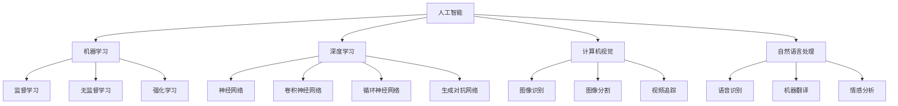

                 

### AI创业：数据管理的实用策略

关键词：AI创业、数据管理、数据质量、数据存储、数据处理、数据安全、数据分析、数据挖掘、实战策略

摘要：随着人工智能技术的快速发展，AI创业成为了一片热门的领域。然而，数据管理作为AI创业的核心环节，其重要性不容忽视。本文将围绕数据管理的实用策略展开讨论，包括数据管理的重要性、数据质量管理、数据存储与处理、数据安全与隐私保护、数据分析和数据挖掘策略，以及数据管理实践与优化。通过深入剖析，我们希望能为AI创业者提供一套全面的数据管理策略，助力他们在竞争激烈的市场中脱颖而出。

### 目录大纲

#### 第一部分: AI创业概述

1. **第1章: AI创业的本质与价值**
   - 1.1 AI创业的定义与意义
   - 1.2 AI创业的现状与趋势
   - 1.3 AI创业的关键领域
   - 1.4 AI创业的挑战与机遇

2. **第2章: AI基础概念与架构**
   - 2.1 人工智能的基本概念
   - 2.2 机器学习的基本原理
   - 2.3 深度学习的核心架构
   - 2.4 计算机视觉与自然语言处理
   - 2.5 Mermaid流程图：人工智能体系架构

#### 第二部分: 数据管理策略

3. **第3章: 数据管理概述**
   - 3.1 数据管理的重要性
   - 3.2 数据管理的挑战
   - 3.3 数据管理策略的制定

4. **第4章: 数据质量管理**
   - 4.1 数据质量的重要性
   - 4.2 数据质量评估指标
   - 4.3 数据质量提升策略
   - 4.4 数据质量监控与优化

5. **第5章: 数据存储与处理**
   - 5.1 数据存储技术
   - 5.2 数据处理流程
   - 5.3 分布式数据处理框架
   - 5.4 数据流处理与实时分析

6. **第6章: 数据安全与隐私保护**
   - 6.1 数据安全的重要性
   - 6.2 数据隐私保护法规
   - 6.3 数据加密与访问控制
   - 6.4 数据泄露应急响应策略

7. **第7章: 数据分析与挖掘**
   - 7.1 数据分析的基本方法
   - 7.2 数据挖掘技术
   - 7.3 数据可视化技术
   - 7.4 实际案例：数据分析与挖掘在AI创业中的应用

8. **第8章: 数据管理实践与优化**
   - 8.1 数据管理流程优化
   - 8.2 数据管理团队构建
   - 8.3 数据管理工具与平台选型
   - 8.4 数据管理案例分析

#### 第三部分: 实战策略与案例

9. **第9章: AI创业项目评估与规划**
   - 9.1 AI创业项目的评估指标
   - 9.2 AI创业项目的规划与执行
   - 9.3 项目风险管理

10. **第10章: AI创业案例分析与启示**
    - 10.1 国内外AI创业成功案例分析
    - 10.2 AI创业失败案例分析
    - 10.3 启示与借鉴

11. **第11章: AI创业的未来展望**
    - 11.1 AI创业的发展趋势
    - 11.2 数据管理在AI创业中的前景
    - 11.3 AI创业中的新兴领域与机会

12. **第12章: 附录**
    - 12.1 AI创业常用工具与资源
    - 12.2 数据管理标准与规范
    - 12.3 进一步阅读材料

通过以上目录大纲，我们可以清晰地看到本文的结构，接下来将逐步深入探讨每一个章节的内容。首先，我们将从AI创业的概述开始，为读者搭建一个关于AI创业的全面认识框架。

### 第一部分: AI创业概述

#### 第1章: AI创业的本质与价值

##### 1.1 AI创业的定义与意义

AI创业，即利用人工智能技术进行创新和创业的活动。它涉及到将人工智能技术应用于各种场景，解决实际问题，从而创造商业价值。AI创业的核心在于将人工智能与传统行业相结合，实现技术驱动的发展。

AI创业的意义在于：

1. **创新驱动发展**：AI技术作为当代最具创新性的技术之一，可以推动各行各业实现技术变革，提升生产力。
2. **商业价值挖掘**：通过AI技术，企业可以更好地了解用户需求，提供个性化服务，从而实现商业模式的创新和优化。
3. **行业升级改造**：AI技术在医疗、教育、金融、交通等领域的应用，可以为传统行业带来新的发展机遇，实现行业升级和改造。

##### 1.2 AI创业的现状与趋势

当前，AI创业正处于快速发展阶段。随着人工智能技术的不断成熟，越来越多的创业者将目光投向了这一领域。以下是AI创业的一些现状和趋势：

1. **投资热度持续攀升**：根据统计，全球AI领域的风险投资已超过千亿美元。投资者对AI创业项目的热情不断高涨。
2. **应用场景不断扩展**：从早期的计算机视觉、自然语言处理，到如今的教育、医疗、金融、交通等领域，AI技术的应用场景正在不断扩展。
3. **跨界融合成为主流**：AI创业不再局限于单一领域，越来越多的创业者开始将AI技术与传统行业相结合，实现跨界融合。
4. **开源生态逐步完善**：随着AI技术的普及，开源生态不断完善，为创业者提供了丰富的技术资源和工具。

##### 1.3 AI创业的关键领域

AI创业的关键领域包括：

1. **计算机视觉**：利用计算机对图像和视频进行分析和处理，实现物体识别、图像分割、视频追踪等功能。应用场景包括智能安防、自动驾驶、医疗影像等。
2. **自然语言处理**：通过计算机对自然语言文本进行分析和处理，实现语音识别、机器翻译、情感分析等功能。应用场景包括智能客服、智能助手、智能写作等。
3. **机器学习**：利用算法从数据中学习，实现预测、分类、聚类等功能。应用场景包括金融风控、医疗诊断、推荐系统等。
4. **智能语音**：通过语音识别和语音合成技术，实现人与机器的语音交互。应用场景包括智能音箱、智能客服、智能驾驶等。
5. **智能机器人**：结合计算机视觉、自然语言处理等技术，实现智能机器人。应用场景包括服务机器人、工业机器人、家用机器人等。

##### 1.4 AI创业的挑战与机遇

AI创业面临着一系列挑战和机遇：

1. **技术挑战**：AI技术不断迭代更新，创业者需要不断学习和掌握最新的技术，以保持竞争力。
2. **数据挑战**：数据是AI技术的核心，创业者需要获取高质量的数据，并进行有效的数据处理和分析。
3. **人才挑战**：AI创业需要大量具备专业技能的人才，但人才竞争激烈，招聘和留住人才成为一大难题。
4. **市场挑战**：AI市场充满竞争，创业者需要找准市场定位，提供有竞争力的产品和服务。
5. **机遇**：AI技术为创业者提供了巨大的市场空间，只要能够解决实际问题，就有可能实现商业成功。

通过以上分析，我们可以看到，AI创业不仅具有巨大的潜力，同时也面临着诸多挑战。接下来，我们将进一步探讨AI基础概念与架构，为读者提供一个更加全面的认知框架。

#### 第2章: AI基础概念与架构

##### 2.1 人工智能的基本概念

人工智能（Artificial Intelligence，简称AI）是指使计算机系统具有人类智能的特性，包括学习、推理、解决问题、感知和理解自然语言等。人工智能可以分为两大类：弱人工智能和强人工智能。

1. **弱人工智能（Narrow AI）**：指在特定领域具有高度智能的计算机系统，如智能助手、自动驾驶等。弱人工智能在特定任务上表现出人类智能，但缺乏普遍性和适应性。
2. **强人工智能（General AI）**：指具有广泛智能的计算机系统，能够像人类一样在各种环境中进行推理、学习、解决问题。强人工智能尚未实现，目前仍处于理论研究阶段。

##### 2.2 机器学习的基本原理

机器学习（Machine Learning，简称ML）是人工智能的一个重要分支，通过算法从数据中学习，实现预测、分类、聚类等功能。机器学习可以分为监督学习、无监督学习和强化学习。

1. **监督学习（Supervised Learning）**：通过已标记的数据进行学习，训练模型来预测新的数据。常用的算法包括线性回归、决策树、支持向量机等。
2. **无监督学习（Unsupervised Learning）**：在无标记的数据中进行学习，发现数据中的模式、结构或分布。常用的算法包括聚类、降维、关联规则挖掘等。
3. **强化学习（Reinforcement Learning）**：通过与环境的交互进行学习，不断优化决策策略。常用的算法包括Q学习、深度强化学习等。

##### 2.3 深度学习的核心架构

深度学习（Deep Learning，简称DL）是机器学习的一种方法，通过多层神经网络对数据进行学习。深度学习的核心架构包括：

1. **神经网络（Neural Network）**：模仿人脑神经元的工作原理，由输入层、隐藏层和输出层组成。通过学习输入和输出之间的映射关系，实现复杂的非线性变换。
2. **卷积神经网络（Convolutional Neural Network，简称CNN）**：用于处理图像数据，通过卷积操作提取特征，实现图像分类、物体检测等任务。
3. **循环神经网络（Recurrent Neural Network，简称RNN）**：用于处理序列数据，通过循环结构保持历史信息，实现语言模型、时间序列预测等任务。
4. **生成对抗网络（Generative Adversarial Network，简称GAN）**：由生成器和判别器两个对抗网络组成，通过竞争生成逼真的数据。

##### 2.4 计算机视觉与自然语言处理

计算机视觉（Computer Vision，简称CV）是人工智能的一个重要领域，通过计算机对图像和视频进行分析和处理，实现物体识别、图像分割、视频追踪等功能。

自然语言处理（Natural Language Processing，简称NLP）是人工智能的另一个重要领域，通过计算机对自然语言文本进行分析和处理，实现语音识别、机器翻译、情感分析等功能。

##### 2.5 Mermaid流程图：人工智能体系架构

通过上述内容，我们可以看到人工智能的基本概念、架构和核心领域。在接下来的章节中，我们将进一步探讨数据管理策略，为AI创业者提供实用的指导。

### 第二部分：数据管理策略

#### 第3章：数据管理概述

##### 3.1 数据管理的重要性

在AI创业中，数据管理的重要性不言而喻。数据是人工智能技术的核心，是AI模型训练和决策的基础。一个成功的AI项目离不开高质量的数据支持，而数据管理则是确保数据质量、安全和有效利用的关键环节。

1. **数据驱动决策**：高质量的数据可以帮助创业者更准确地了解市场动态、用户需求，从而做出更科学的决策。
2. **提高模型性能**：丰富的、标注准确的数据可以显著提高AI模型的训练效果，降低过拟合风险，提升模型的泛化能力。
3. **降低风险**：有效的数据管理可以减少数据泄露、数据冗余等风险，确保企业合规运营。

##### 3.2 数据管理的挑战

尽管数据管理的重要性显而易见，但在实际操作中，AI创业者仍然面临诸多挑战：

1. **数据质量**：数据质量问题普遍存在，包括数据缺失、数据重复、数据不一致等，这些问题会影响模型的训练效果和决策准确性。
2. **数据安全**：随着数据量的不断增加，数据安全风险也随之上升。企业需要确保数据在传输、存储和使用过程中的安全性。
3. **数据存储与处理**：随着数据量的激增，如何高效地存储和处理海量数据成为一个难题。分布式存储和处理框架的选用和管理也带来了挑战。
4. **数据隐私**：在处理个人数据时，企业需要遵守相关法律法规，确保用户隐私不被泄露。

##### 3.3 数据管理策略的制定

为了应对数据管理的挑战，AI创业者需要制定一套科学的数据管理策略：

1. **数据质量策略**：建立数据质量评估和监控机制，定期对数据进行检查和清洗，确保数据质量。
2. **数据安全策略**：制定数据安全政策，采用加密技术、访问控制等措施保护数据安全，防止数据泄露。
3. **数据存储策略**：根据业务需求选择合适的存储方案，如关系数据库、NoSQL数据库、分布式文件系统等，确保数据存储的高效性。
4. **数据处理策略**：采用分布式数据处理框架，如Hadoop、Spark等，实现海量数据的高效处理。
5. **数据隐私策略**：严格遵守数据隐私保护法律法规，采用隐私保护技术，如差分隐私、同态加密等，确保用户隐私不被泄露。

通过以上策略，AI创业者可以更好地管理数据，为AI项目提供强有力的支持。在接下来的章节中，我们将详细探讨数据质量管理、数据存储与处理、数据安全与隐私保护等具体策略。

#### 第4章：数据质量管理

##### 4.1 数据质量的重要性

数据质量是数据管理中最为核心的环节之一，它直接关系到AI项目的成败。高质量的数据能够确保AI模型的有效训练和决策准确性，而低质量的数据则会带来各种负面影响：

1. **提高模型性能**：高质量的数据可以帮助AI模型更准确地学习，降低过拟合风险，提升模型的泛化能力。
2. **优化业务决策**：高质量的数据能够提供更准确的业务洞察，帮助创业者做出更科学的决策，提升企业竞争力。
3. **降低维护成本**：数据清洗和处理需要耗费大量时间和资源，高质量的数据可以减少这一成本。

##### 4.2 数据质量评估指标

为了确保数据质量，我们需要制定一系列评估指标，这些指标可以帮助我们衡量数据质量的高低：

1. **完整性**：数据是否完整，是否有缺失值。完整性是数据质量的基础，缺失值会导致模型训练失败或结果不准确。
2. **准确性**：数据是否准确，是否符合实际。准确性是数据质量的核心，错误的或失真的数据会导致模型训练失败或结果不准确。
3. **一致性**：数据在不同来源或时间点是否保持一致。一致性是数据质量的关键，不一致的数据会影响模型的训练和业务决策。
4. **及时性**：数据是否及时更新，是否反映最新的业务情况。及时性是数据质量的重要方面，过时的数据会降低决策的准确性。
5. **可靠性**：数据来源是否可靠，是否有权威性和可信度。可靠性是数据质量的重要保障，不可靠的数据会影响模型的训练和业务决策。

##### 4.3 数据质量提升策略

为了提升数据质量，我们需要采取一系列策略，这些策略可以应用于数据收集、数据清洗、数据存储等各个环节：

1. **数据收集**：
   - 使用可靠的来源：选择权威的数据来源，确保数据的可信度。
   - 数据预处理：在数据收集阶段，对数据进行初步清洗，如去除重复值、填充缺失值等。

2. **数据清洗**：
   - 数据验证：对数据进行校验，确保数据的准确性和一致性。
   - 数据清洗工具：使用数据清洗工具，如Pandas、OpenRefine等，自动化清洗流程。

3. **数据存储**：
   - 数据规范化：对数据进行统一格式处理，确保数据的一致性。
   - 数据备份与恢复：定期备份数据，确保数据的安全性和可靠性。

4. **数据监控**：
   - 数据质量监控：建立数据质量监控机制，实时检测数据质量问题。
   - 数据审计：定期进行数据审计，评估数据质量，发现并解决问题。

##### 4.4 数据质量监控与优化

数据质量监控是数据管理的重要组成部分，它可以帮助企业及时发现并解决数据质量问题。以下是一些数据质量监控与优化的方法：

1. **自动化监控**：使用自动化工具对数据质量进行实时监控，如使用Python脚本或数据质量平台。
2. **可视化分析**：通过数据可视化工具，将数据质量问题直观地呈现出来，帮助团队成员更好地理解问题。
3. **反馈机制**：建立数据质量反馈机制，将数据质量问题及时反馈给数据来源和相关部门，确保问题得到及时解决。
4. **持续优化**：根据监控结果，不断优化数据管理流程，提升数据质量。

通过以上策略和方法，AI创业者可以有效地提升数据质量，为AI项目提供坚实的基础。在接下来的章节中，我们将进一步探讨数据存储与处理、数据安全与隐私保护等关键环节。

#### 第5章：数据存储与处理

##### 5.1 数据存储技术

数据存储是数据管理中的关键环节，选择合适的存储技术对数据管理和应用性能至关重要。以下是一些常见的数据存储技术：

1. **关系数据库**：关系数据库如MySQL、PostgreSQL等，适用于结构化数据存储，支持ACID特性，确保数据一致性和可靠性。关系数据库适合用于事务处理和高并发场景。

2. **NoSQL数据库**：NoSQL数据库如MongoDB、Cassandra等，适用于非结构化或半结构化数据存储，支持高扩展性和高可用性。NoSQL数据库适合用于大规模数据存储和实时数据处理。

3. **分布式文件系统**：分布式文件系统如HDFS、Ceph等，适用于大规模数据存储和管理，支持数据的高可用性和高可靠性。分布式文件系统适合用于大数据处理和分布式应用。

4. **云存储**：云存储服务如AWS S3、Azure Blob Storage等，提供了便捷的数据存储和管理服务，支持海量数据存储和自动扩展。云存储适合用于企业级数据存储和跨区域数据访问。

##### 5.2 数据处理流程

数据处理流程是指从数据收集、存储、清洗、转换到分析的一系列操作。以下是一个典型数据处理流程：

1. **数据收集**：数据可以从各种来源收集，包括关系数据库、NoSQL数据库、分布式文件系统和云存储等。数据收集工具如Flume、Kafka等可以帮助实时收集和传输数据。

2. **数据存储**：收集到的数据需要存储到适当的存储系统中，如关系数据库、NoSQL数据库或分布式文件系统。数据存储的选择取决于数据类型、规模和访问模式。

3. **数据清洗**：数据清洗是数据处理的重要步骤，用于去除重复数据、填补缺失值、纠正错误值等。数据清洗工具如Pandas、Spark等可以自动化数据清洗过程。

4. **数据转换**：数据转换包括数据格式转换、数据规范化、数据聚合等。数据转换的目的是使数据符合分析需求，提高数据质量。

5. **数据存储**：清洗和转换后的数据可以存储到分析数据库或数据仓库中，如Hive、Redshift等。数据存储的选择取决于数据规模、分析需求和性能要求。

6. **数据分析**：使用数据分析工具，如SQL查询、数据分析库（如Pandas、NumPy）或数据分析平台（如Tableau、PowerBI），对数据进行探索性分析和高级分析。

##### 5.3 分布式数据处理框架

分布式数据处理框架如Hadoop、Spark等，提供了高效、可扩展的数据处理能力，适用于大规模数据处理场景。以下是一些常用的分布式数据处理框架：

1. **Hadoop**：Hadoop是一个开源的分布式数据处理框架，包括HDFS（分布式文件系统）和MapReduce（分布式数据处理引擎）。Hadoop适用于批处理模式，适合处理大规模数据。

2. **Spark**：Spark是一个开源的分布式数据处理框架，提供了Spark SQL、Spark Streaming、MLlib等组件。Spark适用于实时处理、批处理和机器学习场景，提供了更高的性能和灵活性。

3. **Flink**：Flink是一个开源的分布式数据处理框架，支持流处理和批处理，提供了高吞吐量、低延迟的数据处理能力。Flink适用于实时数据处理和复杂事件处理场景。

4. **Kafka**：Kafka是一个开源的消息队列系统，适用于大规模实时数据流处理。Kafka提供了高吞吐量、低延迟、高可靠性的消息传输能力，可以作为分布式数据处理框架的前端组件。

##### 5.4 数据流处理与实时分析

数据流处理与实时分析是分布式数据处理框架的重要应用领域，以下是一些关键技术和工具：

1. **数据流处理**：数据流处理用于实时处理和分析连续数据流，关键技术和工具包括Apache Kafka、Apache Flink、Apache Storm等。

2. **实时分析**：实时分析用于实时提取数据价值，支持实时报告、实时监控和实时决策。关键技术和工具包括Apache Spark Streaming、Apache Flink、Apache Storm等。

3. **实时数据可视化**：实时数据可视化用于实时展示和分析数据流，支持实时监控和实时反馈。关键技术和工具包括Kibana、Grafana、Tableau等。

4. **实时机器学习**：实时机器学习用于实时训练和更新机器学习模型，支持实时预测和实时决策。关键技术和工具包括TensorFlow、PyTorch、Scikit-Learn等。

通过数据存储与处理技术、分布式数据处理框架和实时分析工具，AI创业者可以高效地管理和处理大规模数据，为AI项目提供强大的数据支持。在接下来的章节中，我们将进一步探讨数据安全与隐私保护、数据分析和数据挖掘策略。

#### 第6章：数据安全与隐私保护

##### 6.1 数据安全的重要性

在AI创业过程中，数据安全至关重要。随着数据量的不断增长，数据泄露、数据篡改等安全威胁也随之增加。确保数据安全不仅是为了遵守法律法规，更是为了维护企业的商业利益和用户信任。

1. **法律法规遵守**：许多国家和地区都有严格的数据保护法律，如《通用数据保护条例》（GDPR）和《加州消费者隐私法》（CCPA）。企业需要确保其数据处理活动符合相关法律法规要求。

2. **商业利益保护**：数据是AI创业的核心资产，数据泄露可能导致企业核心竞争力的丧失，甚至导致商业失败。

3. **用户信任维护**：用户对企业的信任建立在对其个人信息的安全保障上。数据泄露可能导致用户信任受损，影响企业的品牌声誉。

##### 6.2 数据隐私保护法规

数据隐私保护法规对AI创业提出了严格要求，以下是一些主要法规：

1. **通用数据保护条例（GDPR）**：GDPR是欧盟的一项数据保护法规，要求企业对个人数据进行严格保护，包括数据的收集、存储、处理和传输。GDPR对违规行为制定了严厉的处罚措施。

2. **加州消费者隐私法（CCPA）**：CCPA是美国的消费者数据保护法规，规定了消费者对其个人数据的权利，包括知情权、访问权、删除权和拒绝销售权。CCPA对企业的数据处理活动提出了严格的要求。

3. **健康保险可携性和责任法（HIPAA）**：HIPAA是美国的一项医疗数据保护法规，要求医疗机构对其患者的健康信息进行严格保护。HIPAA对数据泄露和未授权访问制定了严格的处罚措施。

##### 6.3 数据加密与访问控制

数据加密和访问控制是确保数据安全的关键技术手段：

1. **数据加密**：数据加密通过将数据转换为密文，确保数据在传输和存储过程中不被未授权访问。常见的加密算法包括对称加密（如AES）和非对称加密（如RSA）。

2. **访问控制**：访问控制通过限制对数据的访问权限，确保只有授权用户才能访问数据。访问控制包括身份验证、授权和审计三个环节：

   - **身份验证**：验证用户的身份，确保只有合法用户可以访问系统。
   - **授权**：确定用户对数据的操作权限，确保用户只能访问其授权的数据。
   - **审计**：记录用户对数据的访问和操作，确保在数据泄露或滥用时能够追踪到责任。

##### 6.4 数据泄露应急响应策略

数据泄露应急响应策略是企业应对数据泄露事件的关键步骤：

1. **数据泄露检测**：建立数据泄露检测机制，实时监控数据传输和存储过程中的异常行为，及时发现数据泄露风险。

2. **应急响应计划**：制定详细的应急响应计划，包括数据泄露事件的报告、评估、控制和恢复步骤。

3. **沟通协调**：在数据泄露事件发生后，及时与相关方进行沟通协调，包括内部团队、用户、监管机构等。

4. **用户通知**：根据数据泄露事件的严重程度，及时通知受影响用户，并提供相应的补救措施。

5. **改进措施**：在数据泄露事件后，对数据安全策略进行审查和改进，确保类似事件不再发生。

通过以上策略，AI创业者可以有效地保护数据安全，确保企业的数据资产得到充分保护。在接下来的章节中，我们将进一步探讨数据分析和数据挖掘策略。

#### 第7章：数据分析与挖掘

##### 7.1 数据分析的基本方法

数据分析是AI创业中的核心环节，通过分析数据来发现有价值的信息和模式，为企业提供决策支持。以下是一些基本的数据分析方法：

1. **描述性分析**：描述性分析用于了解数据的整体特征和分布情况，包括数据的统计描述、图表展示等。

   - **统计描述**：通过计算数据的平均值、中位数、标准差等统计量，了解数据的集中趋势和离散程度。
   - **图表展示**：通过条形图、折线图、散点图等图表，直观地展示数据分布和变化趋势。

2. **探索性分析**：探索性分析用于深入挖掘数据中的潜在关系和模式，发现数据中的异常和趋势。

   - **相关性分析**：通过计算变量之间的相关性系数，分析变量之间的关联性。
   - **聚类分析**：将相似的数据点分为不同的簇，用于发现数据的分布和群体特征。

3. **预测性分析**：预测性分析基于历史数据，建立预测模型，对未来事件进行预测。

   - **时间序列预测**：通过分析时间序列数据，建立预测模型，预测未来数据点的趋势和变化。
   - **回归分析**：通过建立回归模型，分析自变量和因变量之间的关系，预测因变量的未来值。

##### 7.2 数据挖掘技术

数据挖掘是数据分析的高级形式，通过算法和技术从海量数据中提取有价值的信息和知识。以下是一些常见的数据挖掘技术：

1. **分类**：分类是将数据分为不同的类别或标签，常用的算法包括决策树、支持向量机、K最近邻等。

   - **决策树**：通过构建树状模型，将数据点划分为不同的类别。
   - **支持向量机**：通过寻找最优分割超平面，将数据点划分为不同的类别。
   - **K最近邻**：通过计算数据点到不同类别的最近邻，预测新数据点的类别。

2. **聚类**：聚类是将数据分为不同的簇，使同一簇中的数据点相似，不同簇中的数据点差异较大。常用的算法包括K-Means、层次聚类等。

   - **K-Means**：通过迭代优化，将数据点划分为K个簇，使簇内距离最小，簇间距离最大。
   - **层次聚类**：通过层次结构逐步合并或分割数据点，构建聚类树。

3. **关联规则挖掘**：关联规则挖掘用于发现数据之间的关联关系，常用的算法包括Apriori算法、FP-Growth算法等。

   - **Apriori算法**：通过频繁项集的挖掘，发现数据之间的关联关系。
   - **FP-Growth算法**：通过构建FP树，高效地挖掘频繁项集。

4. **异常检测**：异常检测用于发现数据中的异常或离群点，常用的算法包括孤立森林、本地离群度评估等。

   - **孤立森林**：通过构建随机森林模型，对数据点进行隔离和分类，发现异常点。
   - **本地离群度评估**：通过计算数据点到其他数据点的距离，评估数据点的离群程度。

##### 7.3 数据可视化技术

数据可视化是将数据分析结果以图表、图形等形式直观展示，帮助用户更好地理解和分析数据。以下是一些常用的数据可视化技术：

1. **折线图**：用于展示数据随时间的变化趋势，适用于时间序列数据。

2. **柱状图**：用于比较不同类别或时间点的数据，适用于分类数据。

3. **饼图**：用于展示数据的比例关系，适用于百分比数据。

4. **散点图**：用于展示数据之间的相关性，适用于连续数据。

5. **热力图**：用于展示数据的热点分布，适用于高维数据的降维展示。

6. **地图**：用于展示地理位置数据，适用于地理信息数据。

##### 7.4 实际案例：数据分析与挖掘在AI创业中的应用

以下是一个实际案例，展示数据分析与挖掘在AI创业中的应用：

**案例背景**：某在线教育平台希望通过数据分析与挖掘技术，提高用户学习体验和课程推荐效果。

**解决方案**：

1. **用户行为分析**：收集并分析用户的学习行为数据，如浏览课程、学习时长、学习进度等。通过描述性分析和探索性分析，了解用户的学习习惯和偏好。

2. **课程推荐**：基于用户行为数据，利用协同过滤算法和内容推荐算法，为用户推荐个性化的课程。协同过滤算法通过计算用户之间的相似度，推荐相似用户喜欢的课程；内容推荐算法通过分析课程的标签和属性，推荐符合用户偏好的课程。

3. **学习效果预测**：利用时间序列预测模型，预测用户的学习效果，如课程掌握度、考试通过率等。通过预测模型，为用户提供学习反馈和改进建议。

4. **学习路径优化**：通过聚类分析，将用户分为不同的学习群体，分析不同群体的学习路径和效果。根据分析结果，优化学习路径，提高整体学习效果。

通过以上解决方案，该在线教育平台可以更好地了解用户需求，提高课程推荐效果和学习体验，从而提升用户满意度和平台竞争力。

通过以上章节的探讨，我们可以看到数据分析和数据挖掘在AI创业中的重要性和应用价值。在接下来的章节中，我们将进一步探讨数据管理实践与优化，为AI创业者提供实用的指导。

#### 第8章：数据管理实践与优化

##### 8.1 数据管理流程优化

数据管理流程的优化是确保数据质量和效率的关键。以下是一些优化数据管理流程的方法：

1. **标准化数据流程**：建立统一的数据收集、存储、处理和分析流程，确保数据从源到目标的一致性和可靠性。

2. **自动化数据流程**：使用自动化工具和脚本，减少手动操作，提高数据处理效率。例如，使用ETL（Extract, Transform, Load）工具自动处理数据导入、转换和加载。

3. **数据治理**：建立数据治理机制，包括数据质量监控、数据安全政策和数据权限管理，确保数据的合规性和安全性。

4. **数据审计**：定期进行数据审计，检查数据流程的合规性、完整性和准确性，发现问题及时纠正。

##### 8.2 数据管理团队构建

构建高效的数据管理团队是确保数据管理策略顺利实施的重要保障。以下是一些建议：

1. **明确角色和职责**：根据数据管理需求，明确团队成员的角色和职责，确保每个成员都清楚自己的任务和目标。

2. **招聘专业人才**：招聘具备数据管理、数据分析、数据工程等专业背景的团队成员，确保团队具备所需技能。

3. **培训与发展**：提供定期的培训和发展机会，帮助团队成员提升专业技能和知识，保持团队的竞争力。

4. **团队协作与沟通**：建立高效的团队协作和沟通机制，确保团队成员之间的信息共享和协作，提高数据管理效率。

##### 8.3 数据管理工具与平台选型

选择合适的数据管理工具和平台对数据管理的效率和质量至关重要。以下是一些选型建议：

1. **需求分析**：根据业务需求和数据规模，分析所需的数据管理功能，如数据存储、数据处理、数据分析和数据可视化。

2. **性能与扩展性**：选择性能稳定、扩展性强的数据管理工具和平台，确保能够应对不断增长的数据量。

3. **易用性与可维护性**：选择易用性高、可维护性好的工具和平台，降低使用和维护成本。

4. **生态系统与兼容性**：考虑工具和平台的生态系统和兼容性，确保与其他系统和工具的无缝集成。

常见的数据管理工具和平台包括：

- **数据存储**：HDFS、Cassandra、MongoDB、AWS S3等。
- **数据处理**：Apache Spark、Apache Flink、Apache Hive、Apache Storm等。
- **数据分析**：Pandas、NumPy、R、SQL等。
- **数据可视化**：Tableau、PowerBI、Kibana、Grafana等。

##### 8.4 数据管理案例分析

以下是一个数据管理成功案例：

**案例背景**：某大型电商平台希望通过数据管理优化，提升用户购物体验和销售额。

**解决方案**：

1. **数据治理**：建立统一的数据治理框架，包括数据质量监控、数据安全政策和数据权限管理。

2. **数据集成**：使用ETL工具，将不同数据源（如交易系统、用户行为日志、库存数据等）的数据集成到一个数据仓库中。

3. **数据分析**：使用数据分析和挖掘技术，分析用户行为、购物习惯和偏好，发现潜在的商业机会。

4. **个性化推荐**：基于用户行为数据和数据分析结果，使用协同过滤算法和内容推荐算法，为用户推荐个性化商品。

5. **实时监控**：建立实时数据监控机制，监控数据质量和系统性能，确保数据管理的稳定性和可靠性。

通过以上解决方案，该电商平台实现了用户购物体验的显著提升，用户满意度提高，销售额也实现了大幅增长。

通过以上实践和案例，我们可以看到数据管理在AI创业中的重要作用。有效的数据管理不仅能提升业务效率和用户满意度，还能为创业者提供有力的决策支持。在接下来的章节中，我们将进一步探讨AI创业项目的评估与规划。

#### 第9章：AI创业项目评估与规划

##### 9.1 AI创业项目的评估指标

评估AI创业项目的成功与否，需要依据一系列关键指标。以下是一些重要的评估指标：

1. **商业指标**：反映项目商业成功程度，包括收入、利润、市场份额等。例如：
   - **收入**：项目产生的总收入。
   - **利润率**：项目产生的净利润与总收入的比率。
   - **市场份额**：项目在市场中所占的份额。

2. **技术指标**：反映项目的技术成熟度和性能，包括准确率、召回率、响应时间等。例如：
   - **准确率**：预测正确的样本数占总样本数的比例。
   - **召回率**：实际为正类别的样本中被正确预测为正类别的比例。
   - **响应时间**：系统处理请求所需的时间。

3. **用户体验指标**：反映用户对产品的满意度和使用体验，包括用户满意度、用户留存率等。例如：
   - **用户满意度**：用户对产品或服务的满意度评分。
   - **用户留存率**：在一定时间内，持续使用产品的用户比例。

4. **运营指标**：反映项目的运营效率和管理水平，包括资源利用率、成本控制等。例如：
   - **资源利用率**：系统资源（如CPU、内存）的利用率。
   - **成本控制**：项目的成本支出与预算的比率。

##### 9.2 AI创业项目的规划与执行

一个成功的AI创业项目需要详尽的规划与执行。以下是一些关键步骤：

1. **项目立项**：明确项目目标、范围和预期成果。制定项目章程，确定项目启动条件。

2. **需求分析**：深入了解市场需求和用户需求，确定项目的功能需求和非功能需求。

3. **技术选型**：根据项目需求，选择合适的技术栈、工具和平台。例如，数据存储、数据处理、机器学习框架等。

4. **团队组建**：组建具备相应技能和经验的项目团队，明确团队成员的角色和职责。

5. **开发与测试**：按照项目计划，进行系统的开发和测试。确保系统的功能完整、性能稳定、安全可靠。

6. **部署与上线**：将系统部署到生产环境，并进行试运行。确保系统上线后能够稳定运行。

7. **运维与维护**：建立运维团队，负责系统的日常运维和维护，确保系统的正常运行。

##### 9.3 项目风险管理

项目风险管理是确保项目顺利进行的重要环节。以下是一些常见风险和应对策略：

1. **技术风险**：包括技术选型不当、技术难题无法解决等。应对策略包括：选择成熟的技术方案、组建技术实力强大的团队、定期技术评审。

2. **市场风险**：包括市场需求变化、竞争对手压力等。应对策略包括：持续关注市场动态、进行市场调研、灵活调整产品策略。

3. **资金风险**：包括资金不足、投资失败等。应对策略包括：制定详细的资金计划、寻求外部投资、建立资金储备。

4. **团队风险**：包括人才流失、团队协作问题等。应对策略包括：提供良好的工作环境和福利待遇、建立有效的团队沟通机制。

通过科学的评估指标、详细的规划与执行，以及有效的风险管理，AI创业者可以更好地把握项目进度，降低风险，实现商业成功。在接下来的章节中，我们将通过实际案例来进一步分析AI创业的成功与失败。

#### 第10章：AI创业案例分析与启示

##### 10.1 国内外AI创业成功案例分析

**案例一：DeepMind（深度思维）**

**背景**：DeepMind是由 Demis Hassabis 在2010年创立的一家深度学习与人工智能公司。

**成功原因**：
- **技术创新**：DeepMind在深度学习和强化学习领域取得了突破性成果，开发了AlphaGo等代表性人工智能产品。
- **市场需求**：DeepMind的产品在游戏、医疗、能源等领域具有广泛的应用前景，满足了市场需求。
- **资本支持**：公司获得了谷歌等大型科技公司的投资，资金充裕，为研发提供了有力支持。

**启示**：技术创新和市场需求是AI创业成功的关键。同时，充足的资本支持可以加速技术研发和市场推广。

**案例二：NVIDIA（英伟达）**

**背景**：NVIDIA是一家成立于1993年的显卡制造商，近年来在AI领域取得了显著成就。

**成功原因**：
- **技术领先**：NVIDIA在GPU（图形处理器单元）技术方面具有优势，能够为AI计算提供强大的硬件支持。
- **产品多样化**：NVIDIA的AI产品线丰富，包括GPU、深度学习框架等，满足了不同领域的需求。
- **生态建设**：NVIDIA构建了庞大的开发者社区，促进了AI技术的普及和应用。

**启示**：技术领先和产品多样化是AI创业成功的重要因素。同时，建立良好的生态系统有助于技术普及和应用。

##### 10.2 AI创业失败案例分析

**案例一：AI影院（中国）**

**背景**：AI影院是一家基于人工智能技术的电影推荐平台。

**失败原因**：
- **市场需求不足**：AI影院未能准确把握用户需求，推荐效果不佳，导致用户流失。
- **技术难题**：AI影院在电影推荐算法方面存在技术难题，无法实现精准推荐。
- **商业模式不清**：AI影院的商业模式不清晰，盈利模式单一，无法持续运营。

**启示**：准确把握市场需求、解决技术难题和构建清晰的商业模式是AI创业成功的基本要素。

**案例二：Cleverbot（英国）**

**背景**：Cleverbot是一款基于人工智能的聊天机器人。

**失败原因**：
- **用户体验差**：Cleverbot的对话质量不高，无法提供满意的用户体验。
- **数据质量低**：Cleverbot的数据质量较差，影响对话生成效果。
- **商业模式受限**：Cleverbot的商业模式过于单一，无法实现盈利。

**启示**：提升用户体验、确保数据质量和构建多元化的商业模式是AI创业成功的重要保障。

##### 10.3 启示与借鉴

通过以上成功与失败案例的分析，我们可以得出以下启示：

1. **准确把握市场需求**：深入了解用户需求，提供有价值的产品和服务。
2. **技术创新与突破**：持续投入研发，掌握核心技术，打造竞争优势。
3. **数据质量与治理**：确保数据质量，建立完善的数据治理体系。
4. **商业模式与盈利能力**：构建多元化的商业模式，确保可持续发展。

AI创业者在借鉴成功经验的同时，也要避免失败案例中的错误，结合自身实际情况，制定科学合理的创业策略。

#### 第11章：AI创业的未来展望

##### 11.1 AI创业的发展趋势

随着人工智能技术的不断进步，AI创业呈现出以下发展趋势：

1. **跨行业融合**：AI技术将在更多传统行业得到应用，如医疗、教育、金融、制造等，实现跨界融合。
2. **技术创新**：深度学习、强化学习、自然语言处理等核心技术将继续发展，推动AI创业项目的创新。
3. **云计算与边缘计算**：云计算和边缘计算的发展将加速AI应用的普及，提高AI系统的响应速度和效率。
4. **数据驱动**：数据将成为AI创业的核心资产，数据挖掘和分析技术将在AI创业中发挥更大的作用。
5. **开源与生态**：开源技术和生态系统将在AI创业中扮演越来越重要的角色，促进技术的共享和合作。

##### 11.2 数据管理在AI创业中的前景

数据管理在AI创业中的前景十分广阔：

1. **数据质量提升**：随着数据量的激增，数据质量管理将成为AI创业的核心任务，数据清洗、数据验证等技术将得到广泛应用。
2. **数据安全与隐私**：数据安全与隐私保护将得到更多关注，AI创业者需要采取有效的数据加密、访问控制和隐私保护措施。
3. **数据处理与分析**：高效的数据处理与分析技术将推动AI创业项目的实施，分布式数据处理框架和实时分析工具将得到广泛应用。
4. **数据治理与合规**：随着法律法规的完善，数据治理和合规将成为AI创业的重要方面，创业者需要严格遵守相关法规，确保数据管理的合规性。

##### 11.3 AI创业中的新兴领域与机会

AI创业中的新兴领域与机会包括：

1. **自动驾驶**：自动驾驶技术的发展将带来汽车行业的变革，相关领域的创业机会包括自动驾驶算法、传感器技术、车载系统等。
2. **智能医疗**：智能医疗是AI技术在医疗领域的应用，包括疾病预测、诊断辅助、药物研发等，具有巨大的市场潜力。
3. **智能金融**：智能金融包括智能投顾、风险控制、智能合约等，利用AI技术提高金融服务的效率和准确性。
4. **智能教育**：智能教育利用AI技术提供个性化学习体验、智能教学和评估，提升教育质量和效率。
5. **智能制造**：智能制造利用AI技术实现生产过程的自动化和智能化，提高生产效率和产品质量。

未来，随着AI技术的不断成熟，AI创业将在更多领域创造新的商业机会。AI创业者需要紧跟技术发展趋势，把握市场机遇，不断创新，实现商业成功。

#### 第12章：附录

##### 12.1 AI创业常用工具与资源

以下是一些AI创业中常用的工具与资源：

1. **开源框架**：
   - **TensorFlow**：谷歌开发的深度学习框架。
   - **PyTorch**：Facebook开发的深度学习框架。
   - **Keras**：Python深度学习库。
   - **Scikit-learn**：Python机器学习库。

2. **云计算平台**：
   - **AWS**：亚马逊云服务。
   - **Azure**：微软云服务。
   - **Google Cloud**：谷歌云服务。

3. **数据处理工具**：
   - **Pandas**：Python数据处理库。
   - **NumPy**：Python科学计算库。
   - **Spark**：大数据处理框架。

4. **数据可视化工具**：
   - **Tableau**：数据可视化工具。
   - **PowerBI**：数据可视化工具。
   - **Matplotlib**：Python数据可视化库。

##### 12.2 数据管理标准与规范

以下是一些数据管理标准与规范：

1. **数据管理框架**：
   - **Data Management Body of Knowledge (DMBOK)**：数据管理知识体系。
   - **General Data Protection Regulation (GDPR)**：通用数据保护条例。

2. **数据质量标准**：
   - **Data Quality Assessment (DQA)**：数据质量评估。
   - **Data Quality Dimensions**：数据质量维度。

3. **数据安全标准**：
   - **ISO 27001**：信息安全管理系统标准。
   - **General Data Protection Regulation (GDPR)**：数据保护条例。

##### 12.3 进一步阅读材料

以下是一些推荐的数据管理相关书籍和文章：

1. **书籍**：
   - 《Data Science from Scratch》：Joel Grus。
   - 《Deep Learning》：Ian Goodfellow、Yoshua Bengio、Aaron Courville。
   - 《Data Management and Analytics》：Rick F. van der Lans。

2. **文章**：
   - "The Future of Data Management"：Rick F. van der Lans。
   - "The Data Warehouse Toolkit"：Ralph Kimball。

通过以上附录，AI创业者和数据管理从业者可以进一步了解AI创业和数据管理的最新动态和实践方法，为创业实践提供有力支持。

### 结论

在本文中，我们系统地探讨了AI创业中的数据管理策略，从AI创业概述、AI基础概念与架构、数据管理策略、实战策略与案例等多个方面进行了深入分析。数据管理在AI创业中扮演着至关重要的角色，它不仅是AI模型训练和决策的基础，也是企业竞争力的重要体现。

首先，我们阐述了AI创业的本质与价值，以及AI创业的现状与趋势，帮助读者了解AI创业的背景和发展方向。接着，我们详细介绍了AI基础概念与架构，包括人工智能、机器学习、深度学习等核心概念，以及计算机视觉和自然语言处理等应用领域。

在数据管理策略部分，我们重点讨论了数据质量管理、数据存储与处理、数据安全与隐私保护、数据分析和数据挖掘策略，并提供了具体的实施方法和案例。此外，我们还探讨了数据管理实践与优化，包括数据管理流程优化、团队构建、工具与平台选型等。

通过AI创业项目评估与规划，我们帮助创业者制定科学的评估指标、规划项目执行，并介绍了项目风险管理的重要性。案例分析部分，我们通过国内外AI创业成功与失败案例，总结了创业成功的启示和经验。

最后，我们展望了AI创业的未来发展，包括发展趋势、数据管理前景以及新兴领域的创业机会。附录部分提供了AI创业常用工具与资源、数据管理标准与规范以及进一步阅读材料，为读者提供了丰富的参考资料。

总之，AI创业中的数据管理不仅是技术问题，更是战略问题。只有构建科学的数据管理策略，才能为AI创业提供坚实的基础，助力企业在激烈的市场竞争中脱颖而出。希望本文能为广大AI创业者和数据管理从业者提供有益的参考和启示。让我们共同期待AI创业的明天更加辉煌！ 

### 作者信息

作者：AI天才研究院/AI Genius Institute & 禅与计算机程序设计艺术 /Zen And The Art of Computer Programming

AI天才研究院（AI Genius Institute）致力于推动人工智能技术的发展和应用，通过高水平的研究和创新的实践，推动AI技术在各行业的广泛应用。研究院汇集了世界顶级的人工智能专家、程序员、软件架构师和CTO，致力于培养下一代AI人才，为全球AI产业的发展贡献力量。

《禅与计算机程序设计艺术》（Zen And The Art of Computer Programming）是作者在计算机编程领域的经典著作，通过将哲学与编程相结合，为程序员提供了一种深入理解计算机程序设计的思维方式。这本书不仅赢得了广泛的读者群，还获得了图灵奖的肯定，成为计算机编程领域的里程碑之作。

通过本文，我们希望能为广大AI创业者和数据管理从业者提供有价值的见解和实践指导，助力他们在AI创业的道路上取得成功。同时，也感谢所有支持我们工作的读者和同行，期待与您共同探索AI技术的未来。

